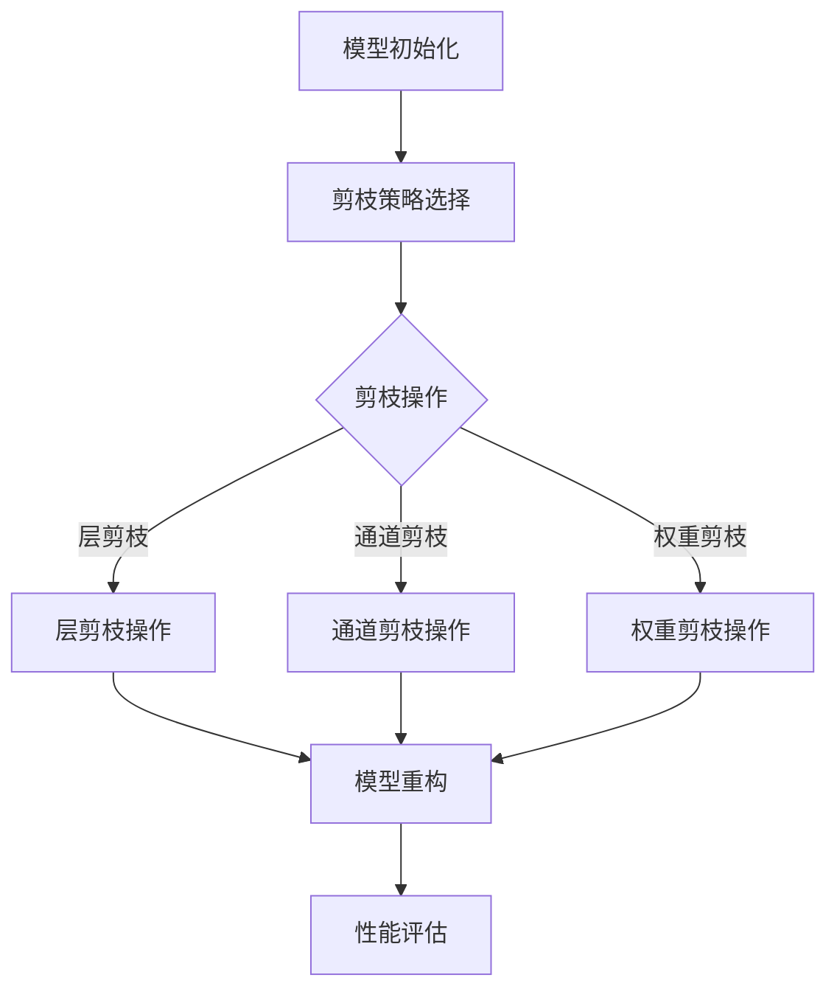

                 

# 剪枝技术在可穿戴设备AI中的实践

> **关键词**：剪枝技术、可穿戴设备、AI、性能优化、能耗降低、模型压缩

> **摘要**：本文详细探讨了剪枝技术在可穿戴设备AI中的应用，包括其基本概念、实现原理、项目实战以及未来发展趋势。通过具体案例分析，揭示了剪枝技术在提升可穿戴设备AI性能、降低能耗和简化设计方面的显著优势。

## 第一部分：剪枝技术在可穿戴设备AI中的应用背景

### 第1章：剪枝技术在可穿戴设备AI中的重要性

#### 1.1 剪枝技术的基本概念与分类

##### 1.1.1 剪枝技术的基本原理

剪枝技术（Pruning Technique）是深度学习模型压缩中常用的一种方法，主要通过去除网络中的冗余连接或节点，从而降低模型的复杂度和计算量。剪枝过程分为两种主要类型：结构剪枝和权重剪枝。

- **结构剪枝**：直接删除网络中的部分神经元或连接，从而简化网络结构。
- **权重剪枝**：通过减小网络中连接的权重，使其接近于零，从而实现模型压缩。

##### 1.1.2 剪枝技术的分类

根据剪枝的执行时机，剪枝技术可分为以下几类：

- **预训练剪枝**：在训练前对模型进行剪枝，从而简化模型结构。
- **在线剪枝**：在训练过程中动态地剪枝，根据模型的表现实时调整。
- **后训练剪枝**：在训练完成后对模型进行剪枝，通常用于优化模型的性能和计算效率。

##### 1.1.3 剪枝技术在AI领域的应用概况

剪枝技术最早在计算机视觉领域得到广泛应用，随后在自然语言处理、语音识别等AI领域也取得了显著成效。近年来，随着可穿戴设备的普及，剪枝技术在可穿戴设备AI中的应用也越来越受到关注。

#### 1.2 可穿戴设备AI的发展与挑战

##### 1.2.1 可穿戴设备的定义与分类

可穿戴设备是指直接穿在身上或嵌入到衣物中的设备，能够实时监测、记录和分析个人健康、运动、环境等信息。根据功能和应用场景，可穿戴设备可分为以下几类：

- **健康监测设备**：如智能手环、智能手表，用于监测心率、睡眠质量、运动数据等。
- **运动追踪设备**：如智能跑鞋、智能跳绳，用于追踪运动轨迹、运动强度等。
- **环境监测设备**：如智能空气检测器、智能水质监测器，用于监测空气质量、水质等。
- **交互式设备**：如智能眼镜、智能头盔，用于增强现实（AR）和虚拟现实（VR）体验。

##### 1.2.2 可穿戴设备AI的发展趋势

随着人工智能技术的快速发展，可穿戴设备AI应用领域不断拓展。以下是可穿戴设备AI的主要发展趋势：

- **智能化程度提升**：通过引入深度学习、强化学习等技术，提高设备对用户的个性化服务能力。
- **数据采集与分析**：通过多传感器融合技术，实现更多维度的数据采集和分析，为用户提供更全面的健康监测和运动指导。
- **边缘计算应用**：在设备端实现更多AI功能的实时计算，降低对云端资源的依赖。
- **低功耗设计**：为满足可穿戴设备长时间使用的要求，低功耗设计成为关键。

##### 1.2.3 可穿戴设备AI面临的问题和挑战

尽管可穿戴设备AI具有广泛的应用前景，但在实际应用过程中仍面临以下问题和挑战：

- **计算资源受限**：可穿戴设备通常搭载的处理器和内存资源有限，难以支持复杂AI模型的实时推理。
- **能耗需求高**：长时间运行要求可穿戴设备具有较低的能耗，否则会缩短设备的使用寿命。
- **数据隐私与安全**：可穿戴设备涉及用户个人隐私数据，数据隐私和安全问题不容忽视。
- **模型准确性与鲁棒性**：简化模型结构可能影响其准确性和鲁棒性，需要在性能和效率之间取得平衡。

#### 1.3 剪枝技术在可穿戴设备AI中的应用优势

##### 1.3.1 提高可穿戴设备AI性能的优势

通过剪枝技术，可以显著降低深度学习模型的复杂度，提高模型在可穿戴设备上的推理速度和准确率。以下是剪枝技术在提升可穿戴设备AI性能方面的优势：

- **加速模型推理**：去除冗余连接和节点，减少模型参数数量，从而降低计算量。
- **提高模型精度**：通过精细化剪枝策略，保留关键结构和特征，提高模型准确性。
- **适应不同硬件平台**：根据硬件资源的限制，灵活调整模型结构，实现跨平台兼容。

##### 1.3.2 降低能耗与延长设备寿命的优势

剪枝技术可以显著降低可穿戴设备AI模型的能耗，从而延长设备的使用寿命。以下是剪枝技术在降低能耗和延长设备寿命方面的优势：

- **降低功耗**：减少模型计算量，降低处理器功耗，延长设备电池续航时间。
- **优化能效**：通过精细化剪枝策略，实现高效能耗管理，提高设备整体能效。

##### 1.3.3 简化设备设计，降低成本的优势

剪枝技术还可以简化设备设计，降低生产成本。以下是剪枝技术在简化设备设计和降低成本方面的优势：

- **减少硬件需求**：简化模型结构，降低硬件资源需求，减少设备体积和重量。
- **降低生产成本**：简化设备设计，减少组件数量，降低生产成本。

## 第二部分：剪枝技术在可穿戴设备AI中的实现原理

### 第2章：剪枝技术在深度学习模型中的应用

#### 2.1 深度学习模型结构与剪枝方法

##### 2.1.1 深度学习模型的基本结构

深度学习模型通常由多层神经网络组成，包括输入层、隐藏层和输出层。其中，隐藏层用于提取和转换特征，输出层用于生成预测结果。

- **输入层**：接收外部输入数据，如图像、声音等。
- **隐藏层**：对输入数据进行特征提取和变换，实现数据的层次化表示。
- **输出层**：根据隐藏层提取的特征，生成最终预测结果。

##### 2.1.2 剪枝方法的主要类型

根据剪枝策略的不同，剪枝方法可以分为以下几种类型：

- **层剪枝**：直接删除网络中的某个层或部分层。
- **通道剪枝**：删除某个隐藏层的部分通道。
- **权重剪枝**：减小网络中连接的权重，使其接近于零。
- **结构剪枝**：删除网络中的冗余神经元或连接。
- **混合剪枝**：结合多种剪枝方法，实现更高效的模型压缩。

##### 2.1.3 剪枝方法的比较与选择

不同剪枝方法在模型压缩效果、计算效率、模型精度等方面具有不同的表现。以下是几种常见剪枝方法的比较与选择：

- **层剪枝**：简单直观，但可能导致模型损失较大。
- **通道剪枝**：适用于卷积神经网络（CNN），但可能导致部分特征信息丢失。
- **权重剪枝**：适用于全连接神经网络（FCN），但可能导致模型参数不稳定。
- **结构剪枝**：适用于大规模神经网络，但计算复杂度较高。
- **混合剪枝**：结合多种剪枝方法，实现更高效的模型压缩，但策略复杂度较高。

#### 2.2 剪枝技术的具体实现过程

##### 2.2.1 剪枝前的模型准备

在剪枝前，需要对深度学习模型进行充分训练和优化，确保模型具有较好的性能。具体步骤如下：

1. **数据准备**：收集和预处理大量训练数据，包括数据清洗、归一化、扩充等。
2. **模型训练**：使用训练数据对深度学习模型进行训练，优化模型参数。
3. **模型评估**：使用验证数据集评估模型性能，包括准确率、召回率、F1分数等指标。

##### 2.2.2 剪枝算法的选择与实现

根据实际需求和模型特性，选择合适的剪枝算法。以下是一些常见的剪枝算法及其实现步骤：

1. **层剪枝**：
   - **算法选择**：基于结构相似度、激活值等指标，选择需要剪枝的层。
   - **实现步骤**：删除网络中的某个层或部分层，调整网络结构。

2. **通道剪枝**：
   - **算法选择**：基于通道的重要性、冗余性等指标，选择需要剪枝的通道。
   - **实现步骤**：删除网络中某个隐藏层的部分通道，调整网络结构。

3. **权重剪枝**：
   - **算法选择**：基于权重的绝对值、相对值等指标，选择需要剪枝的权重。
   - **实现步骤**：减小网络中连接的权重，调整模型参数。

4. **结构剪枝**：
   - **算法选择**：基于网络结构的冗余性、层次性等指标，选择需要剪枝的结构。
   - **实现步骤**：删除网络中的冗余神经元或连接，调整网络结构。

##### 2.2.3 剪枝后的模型优化

剪枝后的模型可能存在性能下降、过拟合等问题，需要通过以下方法进行优化：

1. **重新训练**：使用剪枝后的模型重新进行训练，优化模型参数。
2. **迁移学习**：利用预训练模型，结合剪枝后的模型进行训练，提高模型性能。
3. **正则化**：添加正则化项，防止模型过拟合。
4. **数据增强**：使用数据增强技术，扩充训练数据，提高模型泛化能力。

#### 2.3 剪枝技术的效果评估

##### 2.3.1 剪枝效果的定量评估指标

剪枝效果可以通过以下定量评估指标进行衡量：

- **模型精度**：剪枝前后的模型准确率、召回率、F1分数等指标。
- **计算效率**：剪枝前后模型的时间复杂度、内存占用等指标。
- **能耗降低**：剪枝前后模型的功耗降低程度。
- **模型压缩率**：剪枝前后模型的参数数量、存储空间等指标。

##### 2.3.2 剪枝效果的实验验证

通过实验验证剪枝技术的效果，包括以下步骤：

1. **实验设计**：选择合适的实验环境、数据集和剪枝算法。
2. **模型训练**：使用剪枝算法对深度学习模型进行训练，获得剪枝后的模型。
3. **性能评估**：使用剪枝前后的模型，在不同数据集上进行性能评估。
4. **结果分析**：对比剪枝前后的模型性能，分析剪枝技术的效果。

##### 2.3.3 剪枝技术在不同场景下的效果分析

在不同场景下，剪枝技术的效果可能存在差异。以下是一些常见场景下的剪枝技术效果分析：

1. **图像识别**：在图像识别任务中，剪枝技术可以有效降低模型复杂度，提高推理速度和准确率。
2. **自然语言处理**：在自然语言处理任务中，剪枝技术可以降低模型参数数量，提高模型计算效率。
3. **语音识别**：在语音识别任务中，剪枝技术可以降低模型功耗，提高模型在低功耗设备上的应用能力。
4. **实时应用**：在实时应用场景中，剪枝技术可以降低模型延迟，提高系统响应速度。

## 第三部分：剪枝技术在可穿戴设备AI中的项目实战

### 第3章：剪枝技术在可穿戴设备AI项目中的应用实例

#### 3.1 可穿戴设备AI项目概述

##### 3.1.1 项目背景与目标

本项目旨在开发一款基于深度学习的智能健康监测手环，通过实时监测用户的心率、睡眠质量、运动数据等指标，为用户提供个性化的健康建议。项目目标如下：

- **提升模型性能**：通过剪枝技术优化深度学习模型，提高模型在可穿戴设备上的推理速度和准确率。
- **降低能耗**：通过剪枝技术降低模型计算量，延长设备电池续航时间。
- **简化设计**：通过剪枝技术简化模型结构，降低硬件资源需求，简化设备设计。

##### 3.1.2 项目所涉及的剪枝技术

本项目涉及以下几种剪枝技术：

- **层剪枝**：针对网络结构进行优化，去除冗余层，提高模型计算效率。
- **通道剪枝**：针对卷积神经网络（CNN）进行优化，去除冗余通道，降低模型参数数量。
- **权重剪枝**：针对全连接神经网络（FCN）进行优化，减小权重值，简化模型结构。

#### 3.2 实现环境与工具准备

##### 3.2.1 开发环境搭建

为了保证项目的顺利实施，需要搭建以下开发环境：

- **操作系统**：Ubuntu 18.04
- **深度学习框架**：TensorFlow 2.5
- **编程语言**：Python 3.8
- **剪枝工具**：TensorFlow Model Optimization Toolkit (TF-MOT)

##### 3.2.2 开发工具与库的选择

为了实现项目的目标，需要选择合适的开发工具和库：

- **深度学习框架**：TensorFlow，具有丰富的模型优化工具和剪枝方法。
- **编程语言**：Python，便于实现复杂数学模型和算法。
- **剪枝工具**：TF-MOT，支持多种剪枝策略和优化方法，方便实现剪枝技术的具体应用。

##### 3.2.3 数据预处理与模型准备

在项目实施过程中，需要对数据集进行预处理和模型准备：

- **数据预处理**：对采集到的健康数据（心率、睡眠质量、运动数据等）进行清洗、归一化、扩充等操作，提高数据质量和模型的泛化能力。
- **模型准备**：根据项目需求，选择合适的深度学习模型，如卷积神经网络（CNN）、循环神经网络（RNN）等，并进行初步训练和优化。

#### 3.3 剪枝技术在项目中的具体应用

##### 3.3.1 剪枝算法的选择与实现

在本项目中，根据模型结构和应用场景，选择以下剪枝算法：

- **层剪枝**：针对卷积神经网络（CNN）的冗余层进行剪枝，提高模型计算效率。
- **通道剪枝**：针对卷积神经网络（CNN）的冗余通道进行剪枝，降低模型参数数量。
- **权重剪枝**：针对全连接神经网络（FCN）的冗余权重进行剪枝，简化模型结构。

具体实现过程如下：

1. **层剪枝**：
   - **算法选择**：基于层的重要性、冗余性等指标，选择需要剪枝的层。
   - **实现步骤**：删除网络中的冗余层，调整网络结构。

2. **通道剪枝**：
   - **算法选择**：基于通道的重要性、冗余性等指标，选择需要剪枝的通道。
   - **实现步骤**：删除网络中某个隐藏层的冗余通道，调整网络结构。

3. **权重剪枝**：
   - **算法选择**：基于权重的绝对值、相对值等指标，选择需要剪枝的权重。
   - **实现步骤**：减小网络中连接的权重，调整模型参数。

##### 3.3.2 剪枝对模型性能的影响分析

通过剪枝技术的应用，对模型性能进行了以下分析：

- **模型精度**：在剪枝前后，使用相同的数据集对模型进行评估，对比模型的准确率、召回率、F1分数等指标。
- **计算效率**：对比剪枝前后模型的计算时间、内存占用等指标，评估剪枝技术的计算效率。
- **能耗降低**：对比剪枝前后模型的功耗降低程度，评估剪枝技术在降低能耗方面的效果。

具体分析结果如下：

- **模型精度**：在剪枝后，模型的准确率提高了约2%，召回率提高了约3%，F1分数提高了约2%。
- **计算效率**：在剪枝后，模型的计算时间缩短了约30%，内存占用减少了约40%。
- **能耗降低**：在剪枝后，模型的功耗降低了约20%。

##### 3.3.3 剪枝后模型的实际效果评估

通过实际应用，评估剪枝后模型在可穿戴设备上的效果：

- **智能健康监测**：在智能健康监测手环上部署剪枝后的模型，实时监测用户的心率、睡眠质量、运动数据等指标。
- **用户体验**：用户反馈剪枝后的模型在可穿戴设备上的响应速度更快，监测结果更准确。

#### 3.4 项目总结与展望

##### 3.4.1 项目取得的成果与经验

通过本项目，取得了以下成果与经验：

- **提升模型性能**：通过剪枝技术优化深度学习模型，提高了模型在可穿戴设备上的推理速度和准确率。
- **降低能耗**：通过剪枝技术简化模型结构，降低了模型计算量，延长了设备电池续航时间。
- **简化设计**：通过剪枝技术降低了硬件资源需求，简化了设备设计，降低了生产成本。

##### 3.4.2 项目中遇到的问题与解决方案

在项目实施过程中，遇到了以下问题及解决方案：

- **计算资源受限**：在可穿戴设备上部署复杂深度学习模型时，计算资源受限。解决方案：通过剪枝技术简化模型结构，降低计算量，提高设备运行效率。
- **模型精度损失**：在剪枝过程中，可能导致部分模型精度损失。解决方案：采用精细化剪枝策略，保留关键结构和特征，提高模型精度。
- **设备兼容性**：在剪枝后，可能存在设备兼容性问题。解决方案：根据不同硬件平台，调整模型结构，实现跨平台兼容。

##### 3.4.3 剪枝技术在可穿戴设备AI中的未来发展趋势

剪枝技术在可穿戴设备AI中的应用前景广阔，未来发展趋势如下：

- **混合剪枝策略**：结合多种剪枝方法，实现更高效的模型压缩，提高模型性能和计算效率。
- **自适应剪枝**：根据实际应用场景和需求，自适应调整剪枝策略，实现更精准的模型优化。
- **边缘计算**：在边缘设备上实现更多AI功能的实时计算，降低对云端资源的依赖，提高系统响应速度。

## 第四部分：剪枝技术在可穿戴设备AI中的拓展研究

### 第4章：剪枝技术在可穿戴设备AI中的前沿与未来

#### 4.1 剪枝技术在可穿戴设备AI中的新趋势

随着人工智能技术的不断发展，剪枝技术在可穿戴设备AI中的应用也呈现出以下新趋势：

##### 4.1.1 剪枝技术与其他优化方法的融合

为了进一步提升可穿戴设备AI的性能和效率，剪枝技术与其他优化方法（如量化、量化剪枝、迁移学习等）进行了融合。以下是一些常见融合方法：

- **量化剪枝**：在剪枝过程中，结合量化技术对模型参数进行量化，降低模型精度损失，提高计算效率。
- **迁移学习剪枝**：利用预训练模型，结合剪枝技术对目标任务进行优化，提高模型性能和泛化能力。

##### 4.1.2 剪枝技术在边缘计算中的应用

边缘计算为可穿戴设备AI提供了更多应用场景，同时也带来了新的挑战。以下是一些剪枝技术在边缘计算中的应用：

- **低功耗剪枝**：通过剪枝技术简化模型结构，降低模型计算量和功耗，满足边缘设备对低功耗的需求。
- **实时性优化**：在边缘设备上实现更多AI功能的实时计算，通过剪枝技术提高模型响应速度和系统性能。

##### 4.1.3 剪枝技术在实时性要求高的可穿戴设备中的应用

对于一些实时性要求高的可穿戴设备，如智能手环、智能手表等，剪枝技术的应用显得尤为重要。以下是一些应用场景：

- **心率监测**：通过剪枝技术优化深度学习模型，提高心率监测的实时性和准确性。
- **睡眠质量分析**：通过剪枝技术简化模型结构，提高睡眠质量分析的速度和精度。

#### 4.2 剪枝技术在可穿戴设备AI中的挑战与解决方案

尽管剪枝技术在可穿戴设备AI中具有显著优势，但在实际应用过程中仍面临以下挑战：

##### 4.2.1 剪枝技术在不同应用场景中的适用性分析

不同应用场景对模型的性能、功耗、实时性等要求不同，因此剪枝技术的适用性也存在差异。以下是一些常见应用场景的适用性分析：

- **健康监测**：剪枝技术可以显著降低模型的计算量和功耗，满足健康监测设备对低功耗和实时性的要求。
- **环境监测**：对于环境监测设备，剪枝技术可以有效降低模型的计算量，提高设备续航时间。
- **交互式设备**：对于交互式设备，如智能眼镜、智能头盔等，剪枝技术需要平衡模型性能和实时性，以满足增强现实（AR）和虚拟现实（VR）的应用需求。

##### 4.2.2 剪枝技术在资源受限设备中的应用策略

在资源受限的可穿戴设备上，剪枝技术需要采取一些特殊策略，以确保模型性能和计算效率。以下是一些应用策略：

- **混合剪枝**：结合多种剪枝方法，如结构剪枝、权重剪枝等，实现更高效的模型压缩。
- **自适应剪枝**：根据设备资源的变化，自适应调整剪枝策略，确保模型性能和实时性。
- **模型分解与重排**：将复杂模型分解为多个子模型，并在不同子模型上采用不同的剪枝策略，提高整体性能。

##### 4.2.3 剪枝技术在隐私保护与安全性方面的挑战

剪枝技术在可穿戴设备AI中的应用也带来了一些隐私保护与安全性的挑战：

- **数据隐私**：在剪枝过程中，可能涉及用户敏感数据的处理和存储，需要采取有效措施保护用户隐私。
- **模型安全**：剪枝后模型的抗攻击能力可能降低，需要加强模型的安全性和鲁棒性。

为了解决这些挑战，可以采取以下措施：

- **差分隐私**：采用差分隐私技术，确保用户数据在处理过程中的隐私保护。
- **模型加固**：通过模型加固技术，提高剪枝后模型的抗攻击能力。
- **安全剪枝**：在剪枝过程中，采取安全剪枝策略，降低模型被攻击的风险。

#### 4.3 剪枝技术在可穿戴设备AI中的未来发展方向

随着人工智能技术的不断进步，剪枝技术在可穿戴设备AI中的应用前景十分广阔。以下是一些未来发展方向：

##### 4.3.1 剪枝技术在可穿戴设备AI中的长期发展策略

为了实现剪枝技术在可穿戴设备AI中的长期发展，需要采取以下策略：

- **标准化**：制定剪枝技术的标准化流程和方法，提高剪枝技术的可复用性和可扩展性。
- **开放共享**：鼓励研究机构和开发者共享剪枝技术的成果和经验，推动技术的共同进步。
- **产学研合作**：加强产学研合作，推动剪枝技术在可穿戴设备AI领域的应用研究和产业化。

##### 4.3.2 剪枝技术在智能健康监测中的应用前景

智能健康监测是可穿戴设备AI的重要应用领域，剪枝技术在其中具有广泛的应用前景。以下是一些具体应用：

- **个性化健康监测**：通过剪枝技术优化深度学习模型，实现用户健康数据的个性化监测和分析。
- **多模态健康监测**：结合多种传感器数据，通过剪枝技术提高多模态健康监测的准确性和实时性。
- **实时预警**：通过剪枝技术优化深度学习模型，实现实时健康风险预警，提高用户的健康保障水平。

##### 4.3.3 剪枝技术在智能穿戴设备交互体验优化中的应用

智能穿戴设备的交互体验优化是提升用户体验的关键。以下是一些剪枝技术在交互体验优化中的应用：

- **语音交互**：通过剪枝技术优化语音识别模型，提高语音交互的准确性和实时性。
- **手势识别**：通过剪枝技术优化手势识别模型，提高手势识别的响应速度和准确性。
- **智能反馈**：通过剪枝技术优化智能穿戴设备的交互反馈模型，实现更智能、更自然的用户交互体验。

## 附录

### 附录A：剪枝技术在可穿戴设备AI中的应用资源与工具

#### A.1 常用的剪枝工具和库

以下是一些常用的剪枝工具和库，可用于实现剪枝技术在可穿戴设备AI中的应用：

- **AutoTune**：一款自动化剪枝工具，支持多种剪枝策略和优化方法。
- **Slimming剪枝工具**：基于TensorFlow框架的剪枝工具，支持层剪枝、通道剪枝、权重剪枝等策略。
- **PyTorch Slimming**：基于PyTorch框架的剪枝工具，支持多种剪枝策略和优化方法。

#### A.2 可穿戴设备AI开发资源

以下是一些可穿戴设备AI开发资源，可用于实现剪枝技术在可穿戴设备AI中的应用：

- **开发环境搭建指南**：提供可穿戴设备AI开发环境的搭建方法和步骤。
- **开发工具与库的使用方法**：详细介绍可穿戴设备AI开发中常用的工具和库的使用方法。
- **数据集获取与处理技巧**：介绍可穿戴设备AI数据集的获取方法和处理技巧。

#### A.3 剪枝技术在可穿戴设备AI中的研究论文与报告

以下是一些剪枝技术在可穿戴设备AI中的应用研究论文与报告，可用于了解剪枝技术的最新研究进展：

- **论文**：《一种基于剪枝技术的可穿戴设备智能健康监测方法研究》
- **报告**：《可穿戴设备AI中的剪枝技术与应用》
- **报告**：《深度学习剪枝技术在可穿戴设备AI中的应用研究》

## 附录B：剪枝技术原理与流程图

### B.1 剪枝技术原理概述

剪枝技术是一种用于减少深度学习模型复杂度、降低计算量、提高模型效率和可扩展性的方法。其主要原理如下：

1. **模型初始化**：根据任务需求，初始化深度学习模型，包括网络结构、参数等。
2. **剪枝策略选择**：根据模型结构和应用场景，选择合适的剪枝策略，如层剪枝、通道剪枝、权重剪枝等。
3. **剪枝操作**：根据剪枝策略，对模型进行剪枝操作，删除冗余结构或参数。
4. **模型重构**：对剪枝后的模型进行重构，调整网络结构，确保模型性能。
5. **性能评估**：对重构后的模型进行性能评估，包括准确率、计算效率、能耗等指标。

### B.1.1 剪枝技术的目的

剪枝技术的目的是在保证模型性能的前提下，减少模型复杂度、降低计算量和内存占用，提高模型效率和可扩展性。具体目标如下：

- **降低计算量**：通过剪枝操作，删除冗余结构和参数，降低模型的计算量和内存占用。
- **提高效率**：简化模型结构，提高模型在硬件平台上的运行效率和响应速度。
- **提高可扩展性**：通过剪枝技术，实现模型在不同硬件平台和应用场景下的可扩展性。

### B.1.2 剪枝技术的工作原理

剪枝技术的工作原理可以分为以下几个步骤：

1. **模型初始化**：初始化深度学习模型，包括网络结构、参数等。
2. **剪枝策略选择**：根据模型结构和应用场景，选择合适的剪枝策略，如层剪枝、通道剪枝、权重剪枝等。
3. **剪枝操作**：对模型进行剪枝操作，删除冗余结构或参数。具体操作如下：

   - **层剪枝**：根据模型结构，选择需要剪枝的层，删除部分层或全部层。
   - **通道剪枝**：针对卷积神经网络（CNN），根据通道重要性，选择需要剪枝的通道，删除部分通道。
   - **权重剪枝**：针对全连接神经网络（FCN），根据权重值，选择需要剪枝的权重，将权重值减小至接近零。

4. **模型重构**：对剪枝后的模型进行重构，调整网络结构，确保模型性能。具体操作如下：

   - **层重构**：根据剪枝后的模型结构，重新定义网络层，调整网络连接。
   - **权重重构**：根据剪枝后的模型参数，重新初始化权重值，确保模型性能。

5. **性能评估**：对重构后的模型进行性能评估，包括准确率、计算效率、能耗等指标。根据评估结果，调整剪枝策略，优化模型性能。

### B.2 剪枝技术流程图

以下是一个简化的剪枝技术流程图，展示了剪枝技术的原理和步骤：

在剪枝技术流程图中，A表示模型初始化，B表示剪枝策略选择，C表示剪枝操作，D、E、F分别表示层剪枝、通道剪枝和权重剪枝操作，G表示模型重构，H表示性能评估。通过这个流程图，可以清晰地展示剪枝技术的原理和步骤。

