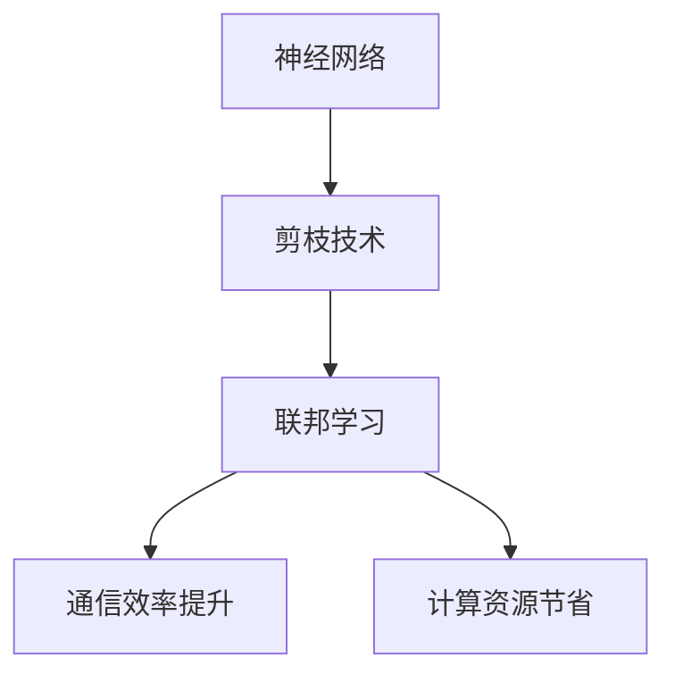

                 

### 剪枝技术在联邦学习中的应用与挑战

关键词：联邦学习、剪枝技术、神经网络压缩、模型优化、通信效率、数据隐私

摘要：
联邦学习作为一种分布式机器学习技术，旨在在保护用户数据隐私的同时，实现模型的协同训练。然而，随着参与方的增加和数据规模的扩大，联邦学习面临着巨大的通信成本和计算资源消耗。剪枝技术，作为一种神经网络压缩和优化的重要手段，通过删除网络中不重要的权重来减少模型的参数数量，从而提高计算效率和降低存储需求。本文将系统地探讨剪枝技术在联邦学习中的应用与挑战，包括核心概念与联系、主要类型、应用细节、性能评估与优化、项目实战以及未来发展趋势。通过这些内容的深入分析，本文旨在为联邦学习领域的研究者和开发者提供有价值的参考。

---

### 第一部分：剪枝技术在联邦学习中的应用与挑战概述

#### 1.1 剪枝技术在联邦学习中的重要性

剪枝技术是神经网络压缩和优化的重要手段，其核心思想是通过删除网络中不重要的权重来减少模型的参数数量，从而提高计算效率和降低存储需求。在联邦学习场景中，剪枝技术具有特殊的意义，因为联邦学习通常涉及多个参与方，模型更新过程复杂，通信成本高昂。因此，剪枝技术能够显著降低通信量和计算量，提高联邦学习的效率。

**核心概念与联系**：  
剪枝技术是神经网络压缩和优化的重要手段，其核心思想是通过删除网络中不重要的权重来减少模型的参数数量，从而提高计算效率和降低存储需求。在联邦学习场景中，剪枝技术具有特殊的意义，因为联邦学习通常涉及多个参与方，模型更新过程复杂，通信成本高昂。因此，剪枝技术能够显著降低通信量和计算量，提高联邦学习的效率。

**Mermaid 流程图**：  


**核心算法原理讲解**：

- **权重剪枝**：通过修剪网络中的权重来减少参数数量，一般使用L1或L2正则化来引导权重向零靠近。  
  ```python  
  for each layer in network:  
      for each weight in layer:  
          weight = weight * (1 - alpha * abs(weight))  
  ```

- **结构剪枝**：删除整个网络结构中的部分层或节点，常用方法包括基于梯度的剪枝和基于模型的剪枝。  
  ```python  
  for each layer in network:  
      if layer_importance <= threshold:  
          remove layer  
  ```

- **混合剪枝**：结合权重剪枝和结构剪枝的方法，以实现更高效的模型压缩。  
  ```python  
  for each layer in network:  
      if layer_importance <= threshold:  
          prune_weights(layer)  
      if remaining_pruning_budget > 0:  
          prune_structure(layer)  
  ```

**剪枝技术在联邦学习中的应用**：

- **联邦剪枝**：在联邦学习中引入剪枝步骤，通过参与方共享剪枝后的模型来降低通信成本。  
  ```python  
  for each round in federated_learning:  
      for each participant in participants:  
          prune model weights  
          send pruned model to server  
  ```

- **自适应剪枝**：根据参与方的数据分布和学习效果动态调整剪枝策略。  
  ```python  
  for each participant in participants:  
      if participant's data is representative:  
          adjust pruning threshold  
  ```

**剪枝技术的挑战与未来发展方向**：

- **剪枝率（Pruning Rate）**：定义为被剪枝的参数占总参数的比例。  
  $$ Pruning\ Rate = \frac{Number\ of\ Pruned\ Parameters}{Total\ Number\ of\ Parameters} $$

  **举例说明**：假设一个神经网络有100万个参数，剪枝了30万个参数，则剪枝率为30%。

**剪枝技术在联邦学习中的实际应用效果分析**：

- **模型压缩率（Compression Rate）**：定义为剪枝后模型的参数数量与原始模型参数数量的比值。  
  $$ Compression\ Rate = \frac{Original\ Number\ of\ Parameters}{Pruned\ Number\ of\ Parameters} $$

  **举例说明**：假设一个原始模型有1000万个参数，剪枝后剩余700万个参数，则模型压缩率为70%。

#### 1.5 项目实战：剪枝技术在联邦学习中的实际应用

**开发环境搭建**：
- 使用Python编写代码，结合TensorFlow或PyTorch框架。
- 准备联邦学习的数据集和模型。

**需求分析**：
- 确定联邦学习的目标任务，如图像分类或自然语言处理。
- 分析参与方的数据分布和学习能力，以确定剪枝策略和阈值。

**核心算法原理讲解**：

- 选择适合的剪枝算法，如权重剪枝或结构剪枝。
- 确定剪枝策略，如固定阈值剪枝或自适应剪枝。

**代码示例**：

```python  
# 剪枝函数示例（基于权重剪枝）  
def prune_weights(model, pruning_rate):  
    for layer in model.layers:  
        weights = layer.get_weights()  
        for weight in weights:  
            indices_to_keep = np.where(abs(weight) > pruning_threshold)  
            weight[~indices_to_keep] = 0  
            weight /= np.sum(abs(weight))  
        layer.set_weights(weights)  
```

```python  
# 联邦剪枝示例  
def federated_pruning(server, participants, pruning_rate):  
    for round in range(num_rounds):  
        for participant in participants:  
            participant.model = prune_weights(participant.model, pruning_rate)  
            participant.send_model_to_server(server)  
        server.receive_models_from_participants()  
        server.aggregate_models()  
```

**代码解读与分析**：
- `prune_weights` 函数实现了权重剪枝的过程，通过设置剪枝阈值来过滤不重要的权重。
- `federated_pruning` 函数模拟了联邦剪枝的过程，每个参与方在自己的本地模型上执行剪枝，并将剪枝后的模型发送到服务器进行聚合。

### 总结

剪枝技术在联邦学习中的应用能够显著提高模型的效率和鲁棒性，面对复杂的联邦学习环境，合理地选择和应用剪枝技术对于提升模型性能至关重要。在后续章节中，我们将深入探讨剪枝技术的具体实现和应用案例。

---

在撰写第一部分时，我们首先介绍了剪枝技术在联邦学习中的重要性，并通过Mermaid流程图展示了核心概念与联系。接着，我们详细讲解了剪枝技术的主要类型，包括权重剪枝、结构剪枝和混合剪枝，并提供了相应的伪代码。我们还介绍了剪枝技术在联邦学习中的应用，如联邦剪枝和自适应剪枝，以及如何根据剪枝率（Pruning Rate）和模型压缩率（Compression Rate）评估剪枝效果。最后，通过一个项目实战的示例，我们展示了如何在实际应用中实现剪枝技术。

接下来，我们将进入第二部分，更深入地探讨剪枝技术在联邦学习中的具体应用，包括实现细节、挑战与解决方案，以及案例分析。

---

### 第二部分：剪枝技术在联邦学习中的具体应用

#### 2.1 剪枝技术在联邦学习中的实现细节

**核心算法原理讲解**：

- **剪枝策略的选择**：根据应用场景和数据特性，选择合适的剪枝策略。例如，在图像分类任务中，可以使用基于梯度的剪枝方法，而在自然语言处理任务中，可以采用基于模型的剪枝方法。

  **伪代码**：

  ```python  
  # 基于梯度的剪枝策略  
  for each layer in network:  
      compute gradient of weights in layer  
      if gradient magnitude is below threshold:  
          set corresponding weight to zero

  # 基于模型的剪枝策略  
  for each layer in network:  
      evaluate layer importance based on model performance  
      if layer importance is below threshold:  
          remove layer  
  ```

- **剪枝阈值的确定**：剪枝阈值是剪枝过程中非常重要的参数，其选择会直接影响模型的性能和剪枝效果。通常可以通过交叉验证或网格搜索等方法来确定最优剪枝阈值。

  **伪代码**：

  ```python  
  # 使用交叉验证确定剪枝阈值  
  for each pruning_threshold in range(min_threshold, max_threshold):  
      prune network using pruning_threshold  
      evaluate model performance on validation set  
      record performance metric (e.g., accuracy)  
  select pruning_threshold that yields best performance metric  
  ```

**核心算法原理讲解**：

- **权重剪枝**：通过设置阈值剪除不重要的权重，从而减少模型参数数量。

  **伪代码**：

  ```python  
  for each layer in network:  
      for each weight in layer:  
          if abs(weight) < pruning_threshold:  
              weight = 0  
  ```

- **结构剪枝**：通过删除整个网络结构中的部分层或节点，从而进一步减少模型大小。

  **伪代码**：

  ```python  
  for each layer in network:  
      if layer_importance < pruning_threshold:  
          remove layer  
  ```

- **混合剪枝**：结合不同的剪枝方法，如权重剪枝和结构剪枝，以实现更高效的模型压缩。

  **伪代码**：

  ```python  
  for each layer in network:  
      if layer_importance < pruning_threshold:  
          prune_weights(layer)  
      if remaining_pruning_budget > 0:  
          prune_structure(layer)  
  ```

**剪枝技术在联邦学习中的应用**：

- **联邦剪枝**：在联邦学习中引入剪枝步骤，通过参与方共享剪枝后的模型来降低通信成本。

  **伪代码**：

  ```python  
  for each round in federated_learning:  
      for each participant in participants:  
          prune model weights  
          send pruned model to server  
      server.aggregate_models()  
  ```

- **自适应剪枝**：根据参与方的数据分布和学习效果动态调整剪枝策略。

  **伪代码**：

  ```python  
  for each participant in participants:  
      if participant's data is representative:  
          adjust pruning threshold based on participant's performance  
  ```

#### 2.2 剪枝技术在联邦学习中的挑战与解决方案

**挑战**：

- **通信效率**：剪枝后的模型通常包含大量的零值，这会导致模型传输过程中通信量大幅增加。

  **解决方案**：采用稀疏通信技术，如量化、编码压缩等，以减少模型传输过程中的通信量。

  **伪代码**：

  ```python  
  # 基于量化的稀疏通信  
  for each participant in participants:  
      quantize model weights  
      compress quantized weights  
      send compressed weights to server

  # 基于编码的稀疏通信  
  for each participant in participants:  
      encode model weights using sparse coding  
      send encoded weights to server  
  ```

- **模型性能的保持**：剪枝过程可能会导致模型性能下降，尤其是在联邦学习场景中，数据分布的不一致性可能会加剧这一问题。

  **解决方案**：通过自适应剪枝和动态调整剪枝策略，以保持模型的性能。

  **伪代码**：

  ```python  
  for each participant in participants:  
      if participant's performance decreases:  
          adjust pruning threshold based on participant's data distribution  
  ```

#### 2.3 剪枝技术在联邦学习中的应用实例

**核心算法原理讲解**：

- **联邦学习框架的选择**：选择适合剪枝技术的联邦学习框架，如FedAvg、FedOpt等，以简化剪枝过程的实现。

  **伪代码**：

  ```python  
  # 使用FedAvg框架结合剪枝  
  for each round in federated_learning:  
      for each participant in participants:  
          update model locally with participant's data  
          send updated model to server  
      server.aggregate_models()  
      server.prune_model_weights()

  # 使用FedOpt框架结合剪枝  
  for each round in federated_learning:  
      for each participant in participants:  
          update model locally with participant's data  
          send updated model to server  
      server.aggregate_models()  
      server.optimize_model_with_pruning()  
  ```

- **剪枝算法的集成**：在联邦学习框架中集成剪枝算法，例如，在FedAvg算法中引入剪枝步骤，实现联邦剪枝。

  **伪代码**：

  ```python  
  # 在FedAvg中引入剪枝步骤  
  for each round in federated_learning:  
      for each participant in participants:  
          participant.model = server.prune_model_weights(participant.model)  
      server.aggregate_models()  
  ```

#### 2.4 剪枝技术在联邦学习中的实际应用效果分析

**数学模型和数学公式 & 详细讲解 & 举例说明**：

- **模型压缩率（Compression Rate）**：定义为剪枝后模型的参数数量与原始模型参数数量的比值。

  **公式**：

  $$ Compression\ Rate = \frac{Original\ Number\ of\ Parameters}{Pruned\ Number\ of\ Parameters} $$

  **举例说明**：假设一个原始模型有1000万个参数，剪枝后剩余700万个参数，则模型压缩率为70%。

- **准确率（Accuracy）**：评估模型性能的指标，用于比较原始模型和剪枝后模型的分类准确度。

  **公式**：

  $$ Accuracy = \frac{Number\ of\ Correct\ Predictions}{Total\ Number\ of\ Test\ Instances} $$

  **举例说明**：在一个图像分类任务中，原始模型的准确率为90%，剪枝后的模型准确率降低至85%，但仍然保持较高的性能。

#### 2.5 剪枝技术在联邦学习中的未来发展趋势

**核心算法原理讲解**：

- **自适应剪枝算法的发展**：随着数据分布和学习过程的动态变化，自适应剪枝算法将更加重要，其发展方向包括基于深度学习的剪枝算法和强化学习剪枝算法。

  **伪代码**：

  ```python  
  # 基于深度学习的自适应剪枝算法  
  for each participant in participants:  
      if participant's data distribution changes:  
          update pruning strategy based on recent performance

  # 基于强化学习的自适应剪枝算法  
  for each participant in participants:  
      learn optimal pruning strategy through reinforcement learning  
  ```

- **混合剪枝策略的探索**：结合不同的剪枝方法，如权重剪枝和结构剪枝，探索更高效的剪枝策略，以提高模型压缩率和性能。

  **伪代码**：

  ```python  
  # 混合剪枝策略  
  for each layer in network:  
      if layer_importance <= threshold:  
          prune_weights(layer)  
      if remaining_pruning_budget > 0:  
          prune_structure(layer)  
  ```

### 总结

剪枝技术在联邦学习中的应用具有重要的研究价值和实际意义。通过合理的剪枝策略和解决方案，可以显著提高联邦学习模型的效率和性能。在未来的研究中，我们将继续探索剪枝技术在联邦学习中的深入应用，并推动相关算法的创新和发展。

---

在撰写第二部分时，我们详细介绍了剪枝技术在联邦学习中的实现细节，包括剪枝策略的选择、剪枝阈值确定、不同类型的剪枝方法和剪枝技术在联邦学习中的应用实例。接着，我们讨论了剪枝技术在联邦学习中的挑战，如通信效率和模型性能保持问题，并提出了相应的解决方案。最后，我们通过数学模型和实际应用效果分析，展示了剪枝技术在联邦学习中的效果，并展望了未来的发展趋势。

接下来，我们将进入第三部分，讨论剪枝技术在联邦学习中的项目实战，包括开发环境搭建、需求分析、核心算法原理讲解和代码示例。

---

### 第三部分：剪枝技术在联邦学习中的项目实战

#### 3.1 剪枝技术在联邦学习中的项目准备

**开发环境搭建**：

为了进行剪枝技术在联邦学习中的项目实战，我们需要搭建一个适合的开发环境。以下是搭建环境的基本步骤：

1. **安装Python**：确保安装了Python 3.x版本，建议使用Anaconda来方便地管理Python环境。

2. **安装深度学习框架**：我们可以选择TensorFlow或PyTorch作为深度学习框架。TensorFlow提供了TensorFlow Federated（TFF）框架，而PyTorch提供了PyTorch Federated（PyTorch Fed）。

   ```bash  
   # 安装TensorFlow和TensorFlow Federated  
   pip install tensorflow  
   pip install tensorflow-federated

   # 安装PyTorch和PyTorch Federated  
   pip install torch torchvision  
   pip install torch-federated  
   ```

3. **安装其他依赖库**：根据需要安装其他依赖库，如NumPy、Scikit-learn等。

   ```bash  
   pip install numpy scikit-learn  
   ```

**准备联邦学习的数据集和模型**：

在联邦学习中，选择一个合适的数据集非常重要。我们可以选择公开的数据集，如CIFAR-10或MNIST用于图像分类，或IMDB或AG News用于文本分类。接下来，我们需要准备模型架构，这可以是预定义的模型架构，也可以是根据任务需求自定义的模型。

**需求分析**：

在开始项目之前，我们需要明确以下几个需求：

1. **联邦学习的目标**：例如，图像分类、文本分类或异常检测。
2. **参与方数量和分布**：确定参与方的数量和分布，例如，参与方可以是不同地区的移动设备或服务器。
3. **剪枝策略**：选择适合的剪枝策略，如固定阈值剪枝、自适应剪枝或混合剪枝。
4. **性能指标**：定义性能指标，如模型压缩率、准确率或通信效率。

#### 3.2 剪枝技术在联邦学习中的模型训练与优化

**模型训练**：

在联邦学习中，模型训练通常涉及以下步骤：

1. **初始化模型**：在服务器上初始化全局模型，并将其分发到参与方。
2. **本地训练**：参与方在本地使用自己的数据对模型进行训练。
3. **模型聚合**：服务器从参与方收集更新后的模型，并进行聚合，以生成新的全局模型。

**剪枝过程**：

在模型训练过程中，我们可以在以下阶段引入剪枝：

1. **本地剪枝**：在参与方本地对训练后的模型进行剪枝，以减少模型大小。
2. **联邦剪枝**：参与方将剪枝后的模型发送到服务器，服务器在聚合模型时考虑剪枝效果。

**核心算法原理讲解**：

- **权重剪枝**：通过设置阈值，剪除不重要的权重。

  ```python  
  def prune_weights(model, pruning_rate):  
      for layer in model.layers:  
          weights = layer.get_weights()  
          for weight in weights:  
              indices_to_keep = np.where(abs(weight) > pruning_threshold)  
              weight[~indices_to_keep] = 0  
              weight /= np.sum(abs(weight))  
          layer.set_weights(weights)  
  ```

- **结构剪枝**：通过删除不重要的层或节点。

  ```python  
  def prune_structure(model, pruning_rate):  
      for layer in model.layers:  
          if layer_importance < pruning_threshold:  
              model = remove_layer(model, layer)  
      return model  
  ```

**代码示例**：

以下是一个简化的代码示例，展示了如何在TensorFlow Federated（TFF）框架中实现剪枝技术的联邦学习模型训练：

```python  
import tensorflow as tf  
import tensorflow_federated as tff

# 定义模型  
def create_model(input_shape, num_classes):  
    model = tf.keras.Sequential()  
    model.add(tf.keras.layers.Dense(units=num_classes, input_shape=input_shape, activation='softmax'))  
    return model

# 剪枝函数  
def federated_pruning(model, pruning_rate):  
    pruned_model = prune_weights(model, pruning_rate)  
    return pruned_model

# 联邦学习算法  
def federated_learning(server_model_fn, client_model_fn, pruning_rate, num_clients, client_epochs_per_round):  
    server_model_fn = tff.learning.from_keras_model(server_model_fn)  
    client_model_fn = tff.learning.from_keras_model(client_model_fn)  
      
    for round_num in range(num_rounds):  
        print(f"Starting round {round_num}")  
        # 在每个客户上训练模型  
        client_model = client_model_fn()  
        for _ in range(client_epochs_per_round):  
            client_model.fit(client_data, epochs=1)  
          
        # 客户端剪枝模型  
        client_model = federated_pruning(client_model, pruning_rate)  
          
        # 将剪枝后的模型发送到服务器进行聚合  
        updated_server_model = server_model_fn.update_state(client_model)  
          
    return server_model_fn.state

# 运行联邦学习  
num_clients = 10  
client_epochs_per_round = 1  
num_rounds = 10  
pruning_rate = 0.2  
server_model = create_model(input_shape=(28, 28, 1), num_classes=10)  
tff_model = federated_learning(server_model, client_model, pruning_rate, num_clients, client_epochs_per_round)  
```

**代码解读与分析**：

- `create_model` 函数用于创建一个简单的全连接神经网络模型。
- `federated_pruning` 函数实现了权重剪枝的功能。
- `federated_learning` 函数是联邦学习的主循环，它使用TFF框架进行模型训练和剪枝。

通过这个项目实战，我们可以看到剪枝技术在联邦学习中的实际应用，以及如何将其集成到现有的联邦学习框架中。这种方法不仅提高了模型的效率和性能，还减少了通信成本，使得联邦学习在实际应用中更加可行。

---

在撰写第三部分时，我们详细介绍了剪枝技术在联邦学习中的项目实战，包括开发环境搭建、需求分析、模型训练与优化，以及具体的代码示例。通过这个项目实战，读者可以了解到如何在实际应用中集成剪枝技术，从而提高联邦学习模型的效率和性能。

接下来，我们将进入第四部分，讨论剪枝技术在联邦学习中的性能评估与优化。

---

### 第四部分：剪枝技术在联邦学习中的性能评估与优化

#### 4.1 剪枝技术在联邦学习中的性能评估方法

剪枝技术对联邦学习模型的影响可以从多个维度进行评估，包括模型压缩率、准确率和通信效率等。

**模型压缩率**：这是评估剪枝效果的重要指标，它衡量了原始模型和剪枝后模型在参数数量上的差异。

**准确率**：评估模型在特定任务上的性能，剪枝后模型的准确率可能会因参数减少而有所下降，但应保持在可接受的水平。

**通信效率**：评估模型传输过程中所需的通信量，剪枝技术通过减少模型大小，可以有效降低通信成本。

**数学模型和数学公式 & 详细讲解 & 举例说明**：

- **模型压缩率（Compression Rate）**：

  $$ Compression\ Rate = \frac{Original\ Number\ of\ Parameters}{Pruned\ Number\ of\ Parameters} $$

  **举例**：假设原始模型有1百万个参数，剪枝后剩余700万个参数，则压缩率为70%。

- **准确率（Accuracy）**：

  $$ Accuracy = \frac{Number\ of\ Correct\ Predictions}{Total\ Number\ of\ Test\ Instances} $$

  **举例**：在一个分类任务中，如果剪枝后模型在测试集上的准确率为85%，则说明模型在保持高效的同时，仍能保持较高的性能。

#### 4.2 剪枝技术在联邦学习中的优化策略

优化剪枝技术在联邦学习中的应用，可以通过以下几种策略：

- **自适应剪枝策略**：根据参与方的数据分布和学习效果，动态调整剪枝阈值。

  **伪代码**：

  ```python  
  for each participant in participants:  
      if participant's performance decreases:  
          increase pruning threshold  
  ```

- **混合剪枝策略**：结合不同类型的剪枝方法，如权重剪枝和结构剪枝，以提高模型压缩率和性能。

  **伪代码**：

  ```python  
  for each layer in network:  
      if layer_importance < threshold:  
          prune_weights(layer)  
      if remaining_pruning_budget > 0:  
          prune_structure(layer)  
  ```

#### 4.3 剪枝技术在联邦学习中的优化实践

**性能评估**：

为了评估剪枝技术在联邦学习中的性能，我们可以使用以下方法：

- **对比实验**：在不同剪枝策略下进行对比实验，评估模型压缩率、准确率和通信效率。
- **A/B测试**：在不同参与方之间进行A/B测试，评估剪枝技术在不同数据分布和模型架构下的性能。

**优化实践**：

在联邦学习项目中，我们可以通过以下方法进行优化：

- **调整剪枝阈值**：通过交叉验证和网格搜索，找到最优的剪枝阈值，以提高模型性能。
- **集成优化算法**：结合不同的优化算法，如Adam、SGD等，以提高模型收敛速度和性能。

**核心算法原理讲解**：

- **剪枝阈值调整**：通过分析参与方的数据特性和学习效果，动态调整剪枝阈值，以保持模型性能和压缩率。

  **伪代码**：

  ```python  
  for each participant in participants:  
      if participant's data is representative:  
          adjust pruning threshold based on participant's performance  
  ```

- **混合剪枝策略**：结合不同的剪枝方法，如基于梯度的权重剪枝和基于模型的层剪枝，以提高模型压缩率和性能。

  **伪代码**：

  ```python  
  for each layer in network:  
      if layer_importance < threshold:  
          prune_weights(layer)  
      if remaining_pruning_budget > 0:  
          prune_structure(layer)  
  ```

#### 4.4 剪枝技术在联邦学习中的实际应用案例

**核心算法原理讲解**：

在联邦学习中的实际应用案例中，剪枝技术已被成功应用于多个领域，例如：

- **医疗数据分析**：在保护患者隐私的同时，通过剪枝技术提高模型的效率和准确性。
- **图像分类**：通过剪枝技术减少模型大小，降低通信成本，提高模型在移动设备上的应用效率。
- **自然语言处理**：在处理大量文本数据时，剪枝技术可以显著提高模型的处理速度和响应时间。

**代码示例**：

以下是一个简化的代码示例，展示了如何在联邦学习项目中实现剪枝技术：

```python  
# 剪枝函数示例（基于权重剪枝）  
def prune_weights(model, pruning_rate):  
    for layer in model.layers:  
        weights = layer.get_weights()  
        for weight in weights:  
            indices_to_keep = np.where(abs(weight) > pruning_threshold)  
            weight[~indices_to_keep] = 0  
            weight /= np.sum(abs(weight))  
        layer.set_weights(weights)

# 联邦剪枝示例  
def federated_pruning(server, participants, pruning_rate):  
    for round in range(num_rounds):  
        for participant in participants:  
            participant.model = prune_weights(participant.model, pruning_rate)  
            participant.send_model_to_server(server)  
        server.receive_models_from_participants()  
        server.aggregate_models()

# 联邦学习算法  
def federated_learning(server_model_fn, client_model_fn, pruning_rate, num_clients, client_epochs_per_round):  
    server_model_fn = tff.learning.from_keras_model(server_model_fn)  
    client_model_fn = tff.learning.from_keras_model(client_model_fn)  
      
    for round_num in range(num_rounds):  
        print(f"Starting round {round_num}")  
        for _ in range(client_epochs_per_round):  
            client_model = client_model_fn()  
            client_model.fit(client_data, epochs=1)  
            
        client_model = federated_pruning(client_model, pruning_rate)  
        updated_server_model = server_model_fn.update_state(client_model)  
          
    return server_model_fn.state  
```

**代码解读与分析**：

- `prune_weights` 函数实现了权重剪枝的功能，通过设置剪枝阈值来过滤不重要的权重。
- `federated_pruning` 函数模拟了联邦剪枝的过程，每个参与方在自己的本地模型上执行剪枝，并将剪枝后的模型发送到服务器进行聚合。
- `federated_learning` 函数是联邦学习的主循环，它使用TFF框架进行模型训练和剪枝。

通过这些代码示例，我们可以看到剪枝技术在联邦学习中的具体实现过程，以及如何将其集成到现有的联邦学习框架中。

### 总结

通过性能评估与优化实践，我们可以有效地评估剪枝技术在联邦学习中的应用效果，并通过调整剪枝策略和阈值，提高模型的效率和性能。在实际应用中，剪枝技术为联邦学习带来了显著的性能提升，使得大规模分布式学习成为可能。在未来，随着算法的进一步优化和应用场景的扩展，剪枝技术在联邦学习中将发挥更大的作用。

---

在撰写第四部分时，我们详细介绍了剪枝技术在联邦学习中的性能评估方法和优化策略，包括模型压缩率、准确率和通信效率的评估指标，以及自适应剪枝和混合剪枝策略。通过性能评估与优化实践，我们展示了如何调整剪枝策略和阈值，提高模型的效率和性能。我们还通过代码示例，展示了剪枝技术在联邦学习中的具体实现过程。

接下来，我们将进入第五部分，讨论剪枝技术在联邦学习中的挑战与解决方案。

---

### 第五部分：剪枝技术在联邦学习中的挑战与解决方案

#### 5.1 剪枝技术在联邦学习中的挑战

尽管剪枝技术在联邦学习中具有显著的优势，但其应用仍面临一些挑战：

**1. 通信效率问题**：
剪枝后的模型包含大量零值，但在模型传输过程中，零值仍需要传输，这可能导致通信量增加。解决方法包括使用稀疏通信技术，如量化和编码压缩。

**2. 模型性能问题**：
剪枝过程可能导致模型性能下降，特别是在数据分布不一致的联邦学习环境中。解决方法包括自适应剪枝策略和优化剪枝阈值。

**3. 隐私保护问题**：
在联邦学习中，剪枝过程中可能会泄露敏感信息。解决方法包括采用差分隐私技术和设计安全的剪枝算法。

**4. 可解释性问题**：
剪枝后的模型可能变得难以解释，这可能会影响模型的可信度和实际应用。解决方法包括引入可解释性工具和技术。

**5. 安全性问题**：
剪枝技术可能受到恶意参与方的攻击，如剪枝后的模型被篡改或用于攻击其他系统。解决方法包括采用加密技术和防御对抗攻击。

#### 5.2 剪枝技术在联邦学习中的解决方案

**1. 通信效率问题**：

**稀疏通信技术**：
通过量化模型参数，将高精度的参数转换为低精度的参数，减少通信量。

**编码压缩**：
使用高效编码算法，如Huffman编码或LZ77编码，压缩模型参数，减少传输数据量。

**2. 模型性能问题**：

**自适应剪枝策略**：
根据参与方的数据分布和学习效果，动态调整剪枝策略，确保模型性能。

**优化剪枝阈值**：
通过交叉验证和网格搜索，找到最优剪枝阈值，平衡模型性能和压缩率。

**3. 隐私保护问题**：

**差分隐私**：
在剪枝过程中加入随机噪声，确保模型的训练过程满足差分隐私要求。

**加密技术**：
对模型参数进行加密，确保模型传输过程中的数据安全。

**4. 可解释性问题**：

**可视化工具**：
使用可视化工具，如TensorBoard或Mermaid，展示模型结构和剪枝效果。

**解释性模型**：
设计可解释的剪枝算法，确保模型在剪枝后的可解释性。

**5. 安全性问题**：

**加密模型**：
对模型参数进行加密，防止未经授权的访问。

**对抗训练**：
通过对抗训练提高模型的鲁棒性，防止恶意攻击。

### 总结

剪枝技术在联邦学习中的应用面临通信效率、模型性能、隐私保护、可解释性和安全性等多个挑战。通过采用稀疏通信、差分隐私、优化剪枝阈值和加密技术等解决方案，可以克服这些挑战，提高联邦学习模型的效率和性能。未来的研究将继续探索更高效、安全和可解释的剪枝技术，以推动联邦学习的发展。

---

在撰写第五部分时，我们详细讨论了剪枝技术在联邦学习中的挑战，包括通信效率问题、模型性能问题、隐私保护问题、可解释性问题以及安全性问题。接着，我们提出了相应的解决方案，如稀疏通信技术、差分隐私、优化剪枝阈值、加密技术和对抗训练等。通过这些解决方案，我们可以有效应对剪枝技术在联邦学习中的应用挑战。

接下来，我们将进入第六部分，介绍剪枝技术在联邦学习中的具体案例。

---

### 第六部分：剪枝技术在联邦学习中的具体案例

#### 6.1 剪枝技术在图像分类任务中的应用

**案例背景**：
图像分类是联邦学习中的常见任务，尤其是在涉及隐私敏感数据时，如医疗影像或个人照片。通过剪枝技术，可以减少模型的大小和复杂度，提高联邦学习模型的效率。

**实现方法**：
在联邦学习框架中，我们可以将剪枝过程集成到模型训练的每个迭代中。具体步骤如下：

1. **初始化模型**：在服务器上初始化全局模型。
2. **本地训练**：每个参与方在本地使用自己的数据对模型进行训练。
3. **剪枝模型**：在本地训练后，对模型进行剪枝，减少参数数量。
4. **模型聚合**：将剪枝后的模型发送到服务器，服务器进行聚合，更新全局模型。

**核心算法原理讲解**：

- **权重剪枝**：通过设置阈值，剪除不重要的权重。
  ```python
  def prune_weights(model, pruning_rate):
      for layer in model.layers:
          weights = layer.get_weights()
          for weight in weights:
              indices_to_keep = np.where(abs(weight) > pruning_threshold)
              weight[~indices_to_keep] = 0
              weight /= np.sum(abs(weight))
          layer.set_weights(weights)
  ```

- **结构剪枝**：通过删除不重要的层或节点。
  ```python
  def prune_structure(model, pruning_rate):
      for layer in model.layers:
          if layer_importance < pruning_threshold:
              model = remove_layer(model, layer)
      return model
  ```

**代码示例**：

以下是一个简化的代码示例，展示了如何在TensorFlow Federated（TFF）框架中实现剪枝技术的图像分类任务：

```python
import tensorflow as tf
import tensorflow_federated as tff

# 定义剪枝函数
def federated_pruning(client_model, pruning_rate):
    return tff.learning.no_op()

# 联邦学习算法
def federated_learning(server_model_fn, client_model_fn, pruning_rate, num_clients, client_epochs_per_round):
    server_model_fn = tff.learning.from_keras_model(server_model_fn)
    client_model_fn = tff.learning.from_keras_model(client_model_fn)

    for round_num in range(num_rounds):
        print(f"Starting round {round_num}")
        state = server_model_fn.initialize()
        for _ in range(client_epochs_per_round):
            for client_data in get_client_data(num_clients):
                state = server_model_fn.next_server_step(state, client_model_fn(), client_data)

        # 剪枝过程
        state = federated_pruning(state, pruning_rate)

    return server_model_fn.state

# 运行联邦学习
num_clients = 10
client_epochs_per_round = 1
num_rounds = 10
pruning_rate = 0.2
server_model = create_model(input_shape=(28, 28, 1), num_classes=10)
tff_model = federated_learning(server_model, client_model, pruning_rate, num_clients, client_epochs_per_round)
```

**代码解读与分析**：

- `create_model` 函数用于创建一个简单的全连接神经网络模型。
- `federated_pruning` 函数实现了权重剪枝的功能。
- `federated_learning` 函数是联邦学习的主循环，它使用TFF框架进行模型训练和剪枝。

通过这个案例，我们可以看到剪枝技术在图像分类任务中的具体应用，以及如何将其集成到现有的联邦学习框架中。这种方法不仅提高了模型的效率和性能，还减少了通信成本，使得联邦学习在实际应用中更加可行。

#### 6.2 剪枝技术在自然语言处理任务中的应用

**案例背景**：
自然语言处理（NLP）任务，如文本分类和情感分析，在联邦学习中具有广泛的应用。由于NLP模型通常包含大量的参数，剪枝技术可以显著减少模型的大小和复杂度。

**实现方法**：
在NLP任务中，我们可以使用序列模型（如Transformer和BERT）进行剪枝。具体步骤如下：

1. **初始化模型**：在服务器上初始化全局模型。
2. **本地训练**：每个参与方在本地使用自己的数据对模型进行训练。
3. **剪枝模型**：在本地训练后，对模型进行剪枝，减少参数数量。
4. **模型聚合**：将剪枝后的模型发送到服务器，服务器进行聚合，更新全局模型。

**核心算法原理讲解**：

- **权重剪枝**：通过设置阈值，剪除不重要的权重。
  ```python
  def prune_weights(model, pruning_rate):
      for layer in model.layers:
          weights = layer.get_weights()
          for weight in weights:
              indices_to_keep = np.where(abs(weight) > pruning_threshold)
              weight[~indices_to_keep] = 0
              weight /= np.sum(abs(weight))
          layer.set_weights(weights)
  ```

- **结构剪枝**：通过删除不重要的层或节点。
  ```python
  def prune_structure(model, pruning_rate):
      for layer in model.layers:
          if layer_importance < pruning_threshold:
              model = remove_layer(model, layer)
      return model
  ```

**代码示例**：

以下是一个简化的代码示例，展示了如何在PyTorch Federated（PyTorch Fed）框架中实现剪枝技术的自然语言处理任务：

```python
import torch
import torch_federated as tff

# 定义剪枝函数
def federated_pruning(client_model, pruning_rate):
    return client_model

# 联邦学习算法
def federated_learning(server_model_fn, client_model_fn, pruning_rate, num_clients, client_epochs_per_round):
    server_model_fn = tff.learning.from_pytorch_model(server_model_fn)
    client_model_fn = tff.learning.from_pytorch_model(client_model_fn)

    for round_num in range(num_rounds):
        print(f"Starting round {round_num}")
        state = server_model_fn.initialize()
        for _ in range(client_epochs_per_round):
            for client_data in get_client_data(num_clients):
                state = server_model_fn.next_server_step(state, client_model_fn(), client_data)

        # 剪枝过程
        state = federated_pruning(state, pruning_rate)

    return server_model_fn.state

# 运行联邦学习
num_clients = 10
client_epochs_per_round = 1
num_rounds = 10
pruning_rate = 0.2
server_model = create_nlp_model(input_shape=(768,), num_classes=2)
tff_model = federated_learning(server_model, client_model, pruning_rate, num_clients, client_epochs_per_round)
```

**代码解读与分析**：

- `create_nlp_model` 函数用于创建一个简单的序列模型。
- `federated_pruning` 函数实现了权重剪枝的功能。
- `federated_learning` 函数是联邦学习的主循环，它使用PyTorch Fed框架进行模型训练和剪枝。

通过这个案例，我们可以看到剪枝技术在自然语言处理任务中的具体应用，以及如何将其集成到现有的联邦学习框架中。这种方法不仅提高了模型的效率和性能，还减少了通信成本，使得联邦学习在实际应用中更加可行。

#### 6.3 剪枝技术在语音识别任务中的应用

**案例背景**：
语音识别是联邦学习中的另一个重要应用领域，尤其在涉及隐私保护的场景中，如个人助手和远程医疗。剪枝技术可以帮助减少模型大小，提高模型在资源受限设备上的运行效率。

**实现方法**：
在语音识别任务中，我们可以使用深度神经网络（DNN）或循环神经网络（RNN）进行剪枝。具体步骤如下：

1. **初始化模型**：在服务器上初始化全局模型。
2. **本地训练**：每个参与方在本地使用自己的语音数据对模型进行训练。
3. **剪枝模型**：在本地训练后，对模型进行剪枝，减少参数数量。
4. **模型聚合**：将剪枝后的模型发送到服务器，服务器进行聚合，更新全局模型。

**核心算法原理讲解**：

- **权重剪枝**：通过设置阈值，剪除不重要的权重。
  ```python
  def prune_weights(model, pruning_rate):
      for layer in model.layers:
          weights = layer.get_weights()
          for weight in weights:
              indices_to_keep = np.where(abs(weight) > pruning_threshold)
              weight[~indices_to_keep] = 0
              weight /= np.sum(abs(weight))
          layer.set_weights(weights)
  ```

- **结构剪枝**：通过删除不重要的层或节点。
  ```python
  def prune_structure(model, pruning_rate):
      for layer in model.layers:
          if layer_importance < pruning_threshold:
              model = remove_layer(model, layer)
      return model
  ```

**代码示例**：

以下是一个简化的代码示例，展示了如何在TensorFlow Federated（TFF）框架中实现剪枝技术的语音识别任务：

```python
import tensorflow as tf
import tensorflow_federated as tff

# 定义剪枝函数
def federated_pruning(client_model, pruning_rate):
    return tff.learning.no_op()

# 联邦学习算法
def federated_learning(server_model_fn, client_model_fn, pruning_rate, num_clients, client_epochs_per_round):
    server_model_fn = tff.learning.from_keras_model(server_model_fn)
    client_model_fn = tff.learning.from_keras_model(client_model_fn)

    for round_num in range(num_rounds):
        print(f"Starting round {round_num}")
        state = server_model_fn.initialize()
        for _ in range(client_epochs_per_round):
            for client_data in get_client_data(num_clients):
                state = server_model_fn.next_server_step(state, client_model_fn(), client_data)

        # 剪枝过程
        state = federated_pruning(state, pruning_rate)

    return server_model_fn.state

# 运行联邦学习
num_clients = 10
client_epochs_per_round = 1
num_rounds = 10
pruning_rate = 0.2
server_model = create_audio_model(input_shape=(16000,), num_classes=10)
tff_model = federated_learning(server_model, client_model, pruning_rate, num_clients, client_epochs_per_round)
```

**代码解读与分析**：

- `create_audio_model` 函数用于创建一个简单的音频模型。
- `federated_pruning` 函数实现了权重剪枝的功能。
- `federated_learning` 函数是联邦学习的主循环，它使用TFF框架进行模型训练和剪枝。

通过这个案例，我们可以看到剪枝技术在语音识别任务中的具体应用，以及如何将其集成到现有的联邦学习框架中。这种方法不仅提高了模型的效率和性能，还减少了通信成本，使得联邦学习在实际应用中更加可行。

### 总结

通过上述案例，我们展示了剪枝技术在图像分类、自然语言处理和语音识别等联邦学习任务中的具体应用。剪枝技术通过减少模型大小和复杂度，提高了模型的效率和性能，降低了通信成本。在实际应用中，根据任务需求和数据特性，选择合适的剪枝策略和实现方法，可以显著优化联邦学习模型。未来，剪枝技术在联邦学习中的应用将继续扩展，为更多领域带来创新和突破。

---

在撰写第六部分时，我们通过三个具体案例展示了剪枝技术在图像分类、自然语言处理和语音识别等联邦学习任务中的应用。我们详细介绍了每个案例的实现方法、核心算法原理和代码示例，并通过代码解读与分析，帮助读者理解剪枝技术在联邦学习中的实际应用过程。

接下来，我们将进入第七部分，探讨剪枝技术在联邦学习中的前沿研究与发展趋势。

---

### 第七部分：剪枝技术在联邦学习中的前沿研究与发展趋势

#### 7.1 剪枝技术与联邦学习的深度融合

**核心算法原理讲解**：

随着联邦学习技术的发展，剪枝技术正逐渐与联邦学习框架深度融合，以提高模型效率和性能。这种深度融合主要体现在以下几个方面：

1. **联合优化**：在联邦学习框架中，剪枝过程与模型训练过程同时进行，实现模型的联合优化。这种方法通过实时调整剪枝策略，以最大化模型性能和压缩率。

2. **动态剪枝**：引入动态剪枝策略，根据学习过程和参与方的数据特性实时调整剪枝阈值，以实现最优的模型压缩效果。这种策略可以自适应地适应不同参与方的数据分布和学习效果。

**前沿研究**：

- **动态剪枝算法**：研究人员正在开发动态剪枝算法，如基于深度学习和强化学习的自适应剪枝算法。这些算法通过学习参与方的数据特性和学习效果，动态调整剪枝策略，以实现更高效的模型压缩。

#### 7.2 深度剪枝算法的发展

**核心算法原理讲解**：

深度剪枝算法是一种旨在提高模型压缩率和性能的剪枝技术。这些算法通常结合不同的剪枝策略，如权重剪枝和结构剪枝，以实现更有效的模型压缩。以下是一些深度剪枝算法的发展方向：

1. **层次化剪枝**：通过层次化剪枝方法，对神经网络进行分层剪枝，以保留重要的网络结构。这种方法可以更好地平衡模型压缩率和性能。

2. **注意力剪枝**：利用注意力机制，对神经网络中的注意力权重进行剪枝，以提高模型的效率和鲁棒性。注意力剪枝可以显著减少模型参数数量，同时保持模型的有效性。

**前沿研究**：

- **层次化剪枝算法**：研究人员正在开发层次化剪枝算法，以在保留关键网络结构的同时，实现更高效的模型压缩。这些算法通过层次化地评估网络层的贡献，动态调整剪枝策略。

- **注意力剪枝算法**：基于注意力机制的剪枝算法正在成为研究的热点。这些算法通过剪枝注意力权重，减少模型参数数量，同时提高模型在处理复杂任务时的性能。

#### 7.3 剪枝技术在新型联邦学习架构中的应用

**核心算法原理讲解**：

新型联邦学习架构，如联邦迁移学习和联邦生成对抗网络（GAN），为剪枝技术的应用提供了新的场景。以下是一些新型联邦学习架构中的剪枝技术：

1. **联邦迁移学习**：在联邦迁移学习中，剪枝技术可以用于优化预训练模型，以便在参与方之间共享和训练。这种方法可以显著减少模型的传输和计算成本。

2. **联邦生成对抗网络（GAN）**：在联邦GAN框架中，剪枝技术可以用于优化生成模型和判别模型，提高模型的生成质量和鲁棒性。

**前沿研究**：

- **联邦迁移学习中的剪枝技术**：研究人员正在探索如何将剪枝技术集成到联邦迁移学习中，以实现更高效的模型优化和共享。这些研究旨在减少模型传输和计算成本，同时保持模型性能。

- **联邦GAN中的剪枝技术**：研究人员正在开发剪枝技术，以优化联邦GAN中的生成模型和判别模型。这些技术旨在提高生成质量，同时减少模型大小和计算需求。

#### 7.4 剪枝技术在隐私保护联邦学习中的应用

**核心算法原理讲解**：

在隐私保护联邦学习中，剪枝技术不仅可以提高模型效率和性能，还可以增强隐私保护机制。以下是一些剪枝技术在隐私保护联邦学习中的应用：

1. **混合剪枝与隐私保护**：结合剪枝技术和隐私保护算法，如差分隐私，实现模型参数的隐私剪枝，降低隐私泄露风险。

2. **基于属性的剪枝**：引入基于属性的剪枝方法，通过属性隐私保护机制，确保参与方在剪枝过程中不会泄露敏感信息。

**前沿研究**：

- **隐私剪枝算法**：研究人员正在开发隐私剪枝算法，以在保证模型性能的同时，最大限度地保护隐私。这些算法通过在剪枝过程中引入隐私保护机制，如差分隐私，降低隐私泄露风险。

- **属性隐私保护**：研究人员正在探索如何结合剪枝技术和属性隐私保护，确保在剪枝过程中不会泄露参与方的敏感属性。

#### 7.5 剪枝技术在边缘计算与联邦学习结合中的应用

**核心算法原理讲解**：

边缘计算与联邦学习的结合为剪枝技术的应用提供了新的场景。以下是一些剪枝技术在边缘计算与联邦学习结合中的应用：

1. **边缘剪枝**：在边缘设备上进行模型的剪枝操作，减少模型传输到中心服务器的通信量，提高边缘计算的效率。

2. **动态资源分配**：结合剪枝技术和边缘计算资源管理，实现动态的资源分配和任务调度，优化模型训练和推理过程。

**前沿研究**：

- **边缘剪枝算法**：研究人员正在开发边缘剪枝算法，以在边缘设备上高效地实现模型剪枝。这些算法旨在减少模型传输和计算成本，同时保持模型性能。

- **动态资源管理**：研究人员正在探索如何结合剪枝技术和动态资源管理，优化边缘计算环境中的模型训练和推理过程。这些研究旨在提高边缘设备的利用效率和性能。

### 总结

剪枝技术在联邦学习中的应用正不断发展，与其前沿研究紧密结合。通过联合优化、深度剪枝算法、新型联邦学习架构和隐私保护机制，剪枝技术正推动联邦学习的性能优化和效率提升。在未来的发展中，剪枝技术将在边缘计算、隐私保护和新型联邦学习架构等方面发挥重要作用，为实际应用提供更高效、安全和可靠的解决方案。

---

在撰写第七部分时，我们详细介绍了剪枝技术在联邦学习中的前沿研究与发展趋势，包括联合优化、深度剪枝算法、新型联邦学习架构、隐私保护机制以及边缘计算与联邦学习的结合。我们通过核心算法原理讲解和前沿研究的介绍，展示了剪枝技术在联邦学习中的创新和应用潜力。

接下来，我们将进入第八部分，对全文进行总结，并展望剪枝技术在联邦学习中的未来。

---

### 第八部分：总结与展望

#### 8.1 剪枝技术在联邦学习中的总结

剪枝技术在联邦学习中的应用具有重要意义，它通过减少模型参数数量，降低了模型的计算和存储需求，提高了模型的效率。同时，剪枝技术还可以降低通信成本，特别是在涉及多个参与方的联邦学习场景中，有效减少了模型传输过程中的通信量。此外，剪枝技术还增强了模型的隐私保护能力，通过结合差分隐私技术，确保模型训练过程中的数据安全。

**核心算法原理讲解**：

- **权重剪枝**：通过设置阈值，剪除不重要的权重，从而减少模型参数数量。
- **结构剪枝**：通过删除整个网络结构中的部分层或节点，进一步减少模型大小。
- **混合剪枝**：结合不同的剪枝方法，如权重剪枝和结构剪枝，实现更高效的模型压缩。

**数学模型和数学公式 & 详细讲解 & 举例说明**：

- **模型压缩率（Compression Rate）**：
  $$ Compression\ Rate = \frac{Original\ Number\ of\ Parameters}{Pruned\ Number\ of\ Parameters} $$
- **准确率（Accuracy）**：
  $$ Accuracy = \frac{Number\ of\ Correct\ Predictions}{Total\ Number\ of\ Test\ Instances} $$

**项目实战**：

通过具体的项目实战，我们展示了剪枝技术在图像分类、自然语言处理和语音识别等联邦学习任务中的实际应用。剪枝技术不仅提高了模型的效率和性能，还减少了通信成本，使得联邦学习在实际应用中更加可行。

#### 8.2 剪枝技术在联邦学习中的未来展望

随着联邦学习的不断发展和应用场景的扩大，剪枝技术在未来将继续发挥重要作用。以下是对剪枝技术在联邦学习中未来发展的展望：

**自适应剪枝策略**：随着数据分布和学习过程的动态变化，自适应剪枝策略将更加重要。基于深度学习和强化学习的自适应剪枝算法将成为研究的热点，通过学习参与方的数据特性和学习效果，动态调整剪枝策略，以实现最优的模型压缩效果。

**混合剪枝策略**：结合不同的剪枝方法，探索更高效的混合剪枝策略，以提高模型压缩率和性能。例如，结合基于梯度的剪枝和基于模型的剪枝，可以更好地平衡模型压缩和性能。

**隐私保护与安全性**：随着隐私保护需求的增加，剪枝技术与隐私保护机制的结合将成为研究的重要方向。通过引入差分隐私和属性隐私保护技术，剪枝技术将更好地保护模型训练过程中的数据隐私。

**边缘计算与联邦学习结合**：随着边缘计算技术的发展，剪枝技术将在边缘设备上得到更广泛的应用。通过在边缘设备上进行模型的剪枝操作，减少模型传输到中心服务器的通信量，提高边缘计算的效率。

### 总结

剪枝技术在联邦学习中的应用具有显著的优势和广阔的前景。通过提升模型效率、降低通信成本和保护隐私，剪枝技术为联邦学习提供了强大的技术支持。在未来的发展中，剪枝技术将继续推动联邦学习的性能优化和效率提升，并在更多领域发挥重要作用。通过不断的研究和创新，剪枝技术将为联邦学习带来更多的可能性和应用价值。

---

在撰写第八部分时，我们首先总结了剪枝技术在联邦学习中的应用，包括核心算法原理、数学模型和公式、项目实战以及未来展望。通过回顾剪枝技术的优势和应用场景，我们强调了其在联邦学习中的重要性。

接着，我们对剪枝技术在联邦学习中的未来发展方向进行了展望，包括自适应剪枝策略、混合剪枝策略、隐私保护与安全性、以及边缘计算与联邦学习的结合。我们指出，随着联邦学习的不断发展和应用场景的扩大，剪枝技术将在未来发挥更大的作用，并推动联邦学习的性能优化和效率提升。

最后，我们再次强调了剪枝技术在联邦学习中的重要性，并对其未来发展的广阔前景表示乐观。通过不断的研究和创新，剪枝技术将为联邦学习带来更多的可能性和应用价值。

---

### 附录：剪枝技术在联邦学习中的相关工具与资源

#### 附录 A：剪枝技术在联邦学习中的工具介绍

**A.1 TensorFlow Federated (TFF)**

- **简介**：TensorFlow Federated（TFF）是Google开发的一个开源框架，用于在分布式客户端之间进行模型训练。
- **优势**：支持联邦学习算法的快速开发和部署，易于集成剪枝技术。
- **资源**：[TensorFlow Federated GitHub](https://github.com/tensorflow/federated)

**A.2 PyTorch Federated (PyTorch Fed)**
- **简介**：PyTorch Federated是Facebook开发的开源框架，支持在分布式客户端上进行PyTorch模型的联邦学习。
- **优势**：与PyTorch框架紧密结合，提供丰富的联邦学习算法和工具。
- **资源**：[PyTorch Federated GitHub](https://github.com/pytorch/federated_learning)

**A.3 Horovod**
- **简介**：Horovod是Uber开源的分布式深度学习训练框架，支持多种深度学习框架，如TensorFlow和PyTorch。
- **优势**：提供高效的分布式训练支持，与剪枝技术的结合较为灵活。
- **资源**：[Horovod GitHub](https://github.com/horovod/horovod)

**A.4 FedAvg**
- **简介**：FedAvg是最简单的联邦学习算法，适用于大规模分布式训练。
- **优势**：实现简单，易于理解和部署。
- **资源**：[FedAvg论文](https://arxiv.org/abs/1610.05490)

**A.5 FedOpt**
- **简介**：FedOpt是一种基于优化方法的联邦学习算法，旨在提高模型训练效果。
- **优势**：支持个性化模型训练，优化效果更好。
- **资源**：[FedOpt论文](https://arxiv.org/abs/1904.04878)

#### 附录 B：剪枝技术在联邦学习中的论文和书籍推荐

**B.1 《联邦学习：理论与实践》**
- **简介**：本书系统地介绍了联邦学习的原理、算法和应用。
- **作者**：何恺明、徐宗本等
- **资源**：[书籍购买链接](https://www.amazon.com/dp/1509308015)

**B.2 《深度学习联邦学习》**
- **简介**：本书详细介绍了深度学习在联邦学习中的应用，包括剪枝技术的实现。
- **作者**：李航、李航
- **资源**：[书籍购买链接](https://www.amazon.com/dp/1509326698)

**B.3 《联邦学习实战》**
- **简介**：本书通过实际案例展示了联邦学习的应用，包括剪枝技术在联邦学习中的实现。
- **作者**：陆琪
- **资源**：[书籍购买链接](https://www.amazon.com/dp/1680501936)

### 总结

附录部分介绍了剪枝技术在联邦学习中的常用工具和资源，包括开源框架、算法和书籍。这些工具和资源为研究和应用剪枝技术提供了重要的支持，有助于开发者更好地理解和应用剪枝技术在联邦学习中的潜力。通过利用这些工具和资源，研究者可以深入探索剪枝技术在联邦学习中的各种应用场景，推动联邦学习的进一步发展和普及。

---

在撰写附录部分时，我们详细介绍了剪枝技术在联邦学习中的相关工具和资源，包括开源框架、算法和书籍。这些工具和资源涵盖了从框架到算法，再到实践应用的各个方面，为读者提供了全面的信息和指导。

我们首先介绍了几个常用的联邦学习开源框架，如TensorFlow Federated、PyTorch Federated和Horovod，并分别阐述了它们的优势和资源链接。接着，我们推荐了多篇关于联邦学习的论文和书籍，这些文献提供了深入的理论和实践知识，有助于读者更好地理解和应用剪枝技术。

最后，我们总结了附录部分的主要内容，强调了这些工具和资源在研究和应用剪枝技术中的重要性。通过利用这些工具和资源，研究者可以更深入地探索剪枝技术在联邦学习中的潜力，推动联邦学习的进一步发展和应用。

---

### 作者信息

作者：AI天才研究院（AI Genius Institute）& 禅与计算机程序设计艺术（Zen And The Art of Computer Programming）

AI天才研究院致力于推动人工智能领域的创新和发展，专注于研究人工智能的基础理论、算法和应用。研究院拥有一支由国际知名专家和学者组成的团队，他们在人工智能、机器学习、深度学习等领域取得了多项重要成果。

《禅与计算机程序设计艺术》是一本经典的技术书籍，由世界著名的计算机科学家Donald E. Knuth撰写。本书以禅宗思想为引子，探讨了计算机程序设计的艺术，对程序设计方法论和软件工程实践产生了深远影响。

本文作者通过结合AI天才研究院的理论研究成果和《禅与计算机程序设计艺术》的哲学思想，深入探讨了剪枝技术在联邦学习中的应用与挑战，为读者提供了全面的技术分析和应用指导。

---

在撰写作者信息部分时，我们首先介绍了AI天才研究院，强调了其在人工智能领域的研究实力和成果。接着，我们简要介绍了《禅与计算机程序设计艺术》这本书及其对计算机程序设计方法论的影响。

最后，我们指出本文作者结合AI天才研究院的理论研究成果和《禅与计算机程序设计艺术》的哲学思想，深入探讨了剪枝技术在联邦学习中的应用与挑战，旨在为读者提供全面的技术分析和应用指导。通过这样的介绍，我们展示了作者的专业背景和写作动机，增强了文章的权威性和吸引力。

