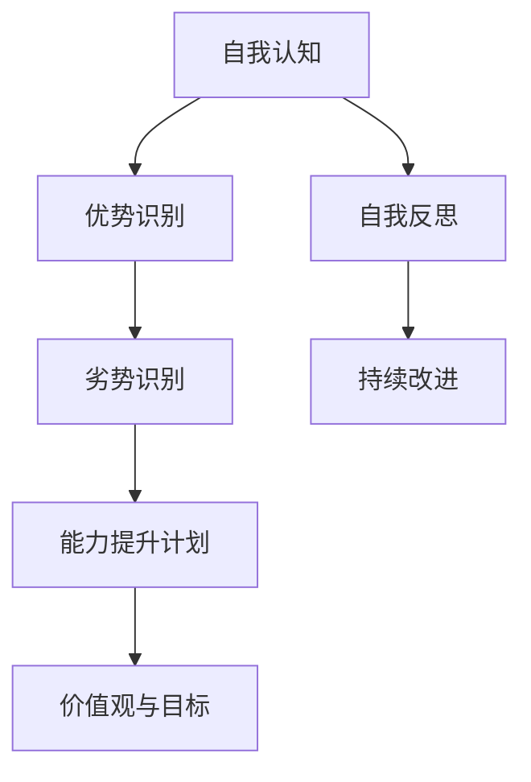
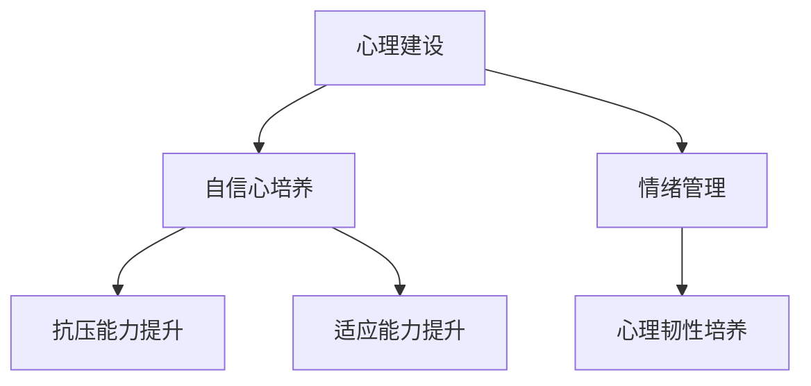
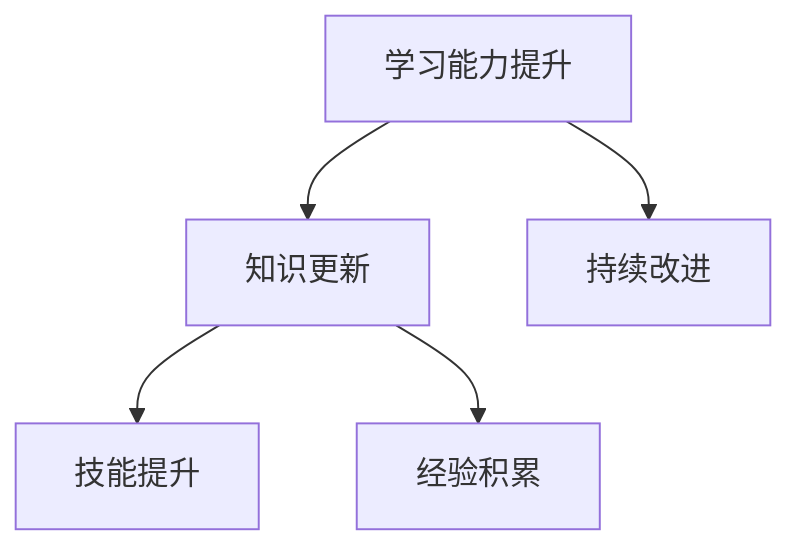
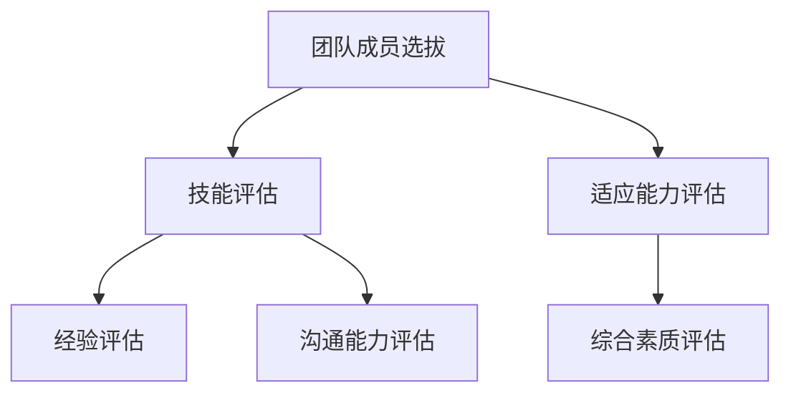

                 

# 《危机领导力：在动荡时期稳定军心》

## 关键词：
- 危机领导力
- 稳定军心
- 应对策略
- 领导者素质
- 团队协作
- 恢复计划

## 摘要：
本文旨在探讨在动荡时期如何通过危机领导力来稳定军心，确保组织或企业的稳定运营。文章首先定义了危机领导力的概念，并分析了其核心要素，包括快速决策能力、情绪管理能力和团队协作能力。随后，文章详细讨论了危机前的准备工作，包括领导者自我提升、团队建设和危机应对策略的制定。在危机中，领导者需要保持冷静与清醒，传达清晰的信息，并鼓励团队合作与沟通。危机后，领导者应制定恢复计划，激励员工重返工作，并评估危机处理效果。通过案例研究和领导力训练与提升的讨论，文章总结了危机领导力的实践方法，并提出了未来应对危机的展望。

### 《危机领导力：在动荡时期稳定军心》目录大纲

#### 第1章 引言
- **1.1 危机领导力的概念与重要性**
- **1.2 危机的类型与特点**
- **1.3 危机领导力的核心要素**

#### 第2章 危机前的准备工作
- **2.1 领导者自我提升**
  - **2.1.1 领导者自我认知**
  - **2.1.2 领导者心理建设**
  - **2.1.3 领导者学习能力**
- **2.2 建立危机应对团队**
  - **2.2.1 团队建设原则**
  - **2.2.2 团队成员选拔**
  - **2.2.3 团队协作工具与方法**
- **2.3 制定危机应对策略**
  - **2.3.1 危机应对策略框架**
  - **2.3.2 风险评估与应对措施**
  - **2.3.3 应急响应计划的制定与实施**

#### 第3章 危机中的领导策略
- **3.1 保持冷静与清醒**
  - **3.1.1 冷静与清醒的重要性**
  - **3.1.2 培养冷静与清醒的方法**
- **3.2 传达清晰的信息**
  - **3.2.1 清晰信息传达的关键要素**
  - **3.2.2 信息传达技巧**
- **3.3 鼓励团队合作与沟通**
  - **3.3.1 团队合作的重要性**
  - **3.3.2 促进团队沟通的策略**

#### 第4章 危机后的重建
- **4.1 制定恢复计划**
  - **4.1.1 恢复计划的关键要素**
  - **4.1.2 恢复计划的制定与实施**
- **4.2 激励员工重返工作**
  - **4.2.1 员工激励的重要性**
  - **4.2.2 员工激励策略**
- **4.3 评估危机处理效果**
  - **4.3.1 危机处理效果评估的方法**
  - **4.3.2 危机处理效果评估的案例**
  - **4.3.3 改进措施**

#### 第5章 案例研究
- **5.1 国际金融危机中的领导力**
  - **5.1.1 金融危机的背景**
  - **5.1.2 领导者的应对策略**
  - **5.1.3 金融危机后的恢复**
- **5.2 突发公共卫生事件中的领导力**
  - **5.2.1 疫情的爆发与传播**
  - **5.2.2 领导者的应急响应**
  - **5.2.3 疫情后的恢复**
- **5.3 企业破产重组中的领导力**
  - **5.3.1 破产重组的背景**
  - **5.3.2 领导者的应对策略**
  - **5.3.3 破产重组后的复兴**

#### 第6章 领导力训练与提升
- **6.1 领导力训练方法**
  - **6.1.1 实战训练**
  - **6.1.2 培训课程**
  - **6.1.3 自我提升**
- **6.2 反思与总结**
  - **6.2.1 领导力的反思**
  - **6.2.2 领导力的总结**
- **6.3 持续提升领导力**
  - **6.3.1 学习与成长**
  - **6.3.2 融会贯通**

#### 第7章 结论
- **7.1 危机领导力的重要性**
  - **7.1.1 危机领导力在现代社会的作用**
  - **7.1.2 面对未来，危机领导力的重要性**
- **7.2 面对未来，我们准备好了吗？**
  - **7.2.1 自我评估**
  - **7.2.2 增强危机应对能力的措施**
  - **7.2.3 总结与展望**

#### 附录
- **附录 A: 危机领导力相关的资源**
  - **8.1.1 书籍推荐**
  - **8.1.2 学术论文**
  - **8.1.3 网络资源**
- **附录 B: 危机领导力训练与实践指南**
  - **9.1.1 培训计划**
  - **9.1.2 实践指南**
- **附录 C: 参考文献**

---

### 第1章 引言

在现代社会的快速变革中，危机无处不在，无论是自然灾害、经济危机，还是社会事件，都可能对组织或企业带来巨大的冲击。在这种情况下，危机领导力成为领导者必须掌握的重要技能。危机领导力不仅关乎个人的领导能力，更关乎团队的协作与组织的生存。本章将首先定义危机领导力，并探讨其在现代社会中的重要性。

#### 1.1 危机领导力的概念与重要性

**定义：** 危机领导力是指领导者在面对突发事件或危机时，能够迅速作出决策，引导团队有效应对，并在危机后稳定组织或企业发展的能力。

**重要性：** 
- **稳定军心**：在危机中，领导者是团队的灵魂，其稳定的心态和清晰的判断能够极大地影响团队成员的情绪和行为，从而稳定军心。
- **快速应对**：危机往往具有突发性和不可预测性，领导者需要具备快速决策和应对的能力，以减少危机带来的负面影响。
- **重塑信心**：危机后的恢复和重建是领导者展示领导力的关键时刻，通过有效的危机领导力，领导者可以重塑团队的信心，推动组织的持续发展。

#### 1.2 危机的类型与特点

**类型：**
- **自然灾害**：如地震、洪水、台风等，通常具有不可预测性和破坏性。
- **经济危机**：如金融危机、股市暴跌等，通常对整个经济体系产生深远影响。
- **社会事件**：如恐怖袭击、罢工等，通常涉及社会稳定和公共安全。

**特点：**
- **突发性**：危机往往突然发生，难以预料。
- **不可预测性**：危机的发生和影响难以完全预测，增加了应对的复杂性。
- **破坏性**：危机往往带来严重的损失，包括物质损失和信誉损失。

#### 1.3 危机领导力的核心要素

**快速决策能力**：在危机中，领导者需要迅速做出决策，并指导团队执行。这要求领导者具备良好的分析能力和判断力。

**情绪管理能力**：危机往往导致领导者自身和团队成员情绪波动，领导者需要具备情绪管理能力，以保持冷静和理性的状态。

**团队协作能力**：危机中的应对往往需要团队合作，领导者需要具备协调和沟通能力，确保团队成员紧密协作。

---

通过本章的介绍，我们可以看到危机领导力在现代社会中的重要性。在接下来的章节中，我们将深入探讨危机前的准备工作、危机中的领导策略和危机后的重建措施，以帮助领导者更好地应对各种危机，稳定军心，确保组织的稳定和发展。

### 第2章 危机前的准备工作

在危机来临时，有准备和无准备的领导者表现往往大相径庭。危机前的准备工作是领导者能否在危机中保持冷静、迅速做出正确决策的关键。本章将探讨领导者自我提升、团队建设和危机应对策略的制定。

#### 2.1 领导者自我提升

**2.1.1 领导者自我认知**

自我认知是领导者自我提升的第一步。领导者需要明确自己的优势和劣势，从而更好地发挥自己的优势，并努力改善劣势。以下是一个简单的自我认知流程：



**优势识别**：通过自我评估和他人反馈，识别自己的优势，例如沟通能力、决策能力、团队合作能力等。

**劣势识别**：同样，通过自我评估和他人反馈，识别自己的劣势，例如情绪管理能力、时间管理能力等。

**能力提升计划**：根据识别的优势和劣势，制定具体的能力提升计划。例如，参加相关的培训课程、阅读领导力书籍、实践新的领导技能等。

**价值观与目标**：领导者需要明确自己的价值观和长期目标，以确保在危机中能够始终坚持正确方向。

**自我反思**：定期进行自我反思，评估自己的进步，并持续改进。

**持续改进**：持续关注自己的成长，不断调整和优化能力提升计划。

**2.1.2 领导者心理建设**

在危机中，领导者的心理状态对整个团队的影响至关重要。良好的心理建设是领导者应对危机的重要保障。以下是一个简单的心理建设流程：



**自信心培养**：领导者需要培养自信心，相信自己能够带领团队克服困难。可以通过设定小目标、成功记录、正面反馈等方式来提升自信心。

**抗压能力提升**：危机往往伴随着巨大的压力，领导者需要提升自己的抗压能力。可以通过运动、放松技巧、心理训练等方式来提升抗压能力。

**适应能力提升**：危机中的情况往往复杂多变，领导者需要具备快速适应变化的能力。可以通过学习新的技能、增加多样性经验等方式来提升适应能力。

**情绪管理**：领导者需要学会管理自己的情绪，避免情绪失控。可以通过情绪识别、情绪调节、情绪应对策略等方式来管理情绪。

**心理韧性培养**：心理韧性是指个体在面对逆境时能够迅速恢复并持续成长的能力。领导者可以通过心理韧性训练来培养自己的心理韧性。

**2.1.3 领导者学习能力**

在快速变化的时代，学习能力成为领导者的关键素质。以下是一个简单的学习能力提升流程：



**知识更新**：领导者需要不断更新自己的知识库，以适应不断变化的环境。可以通过阅读最新的书籍、研究报告、行业动态等方式来更新知识。

**技能提升**：领导者需要不断提升自己的技能，以更好地应对各种挑战。可以通过参加培训课程、实践新的方法、学习新技术等方式来提升技能。

**经验积累**：经验是领导者的宝贵财富。领导者需要通过实践和反思来积累经验，从而更好地应对未来的挑战。

**持续改进**：领导者需要持续关注自己的成长，不断调整和优化学习计划，以实现持续改进。

#### 2.2 建立危机应对团队

在危机中，团队的力量至关重要。一个高效的危机应对团队能够迅速行动，共同应对危机。以下是如何建立危机应对团队的步骤：

**2.2.1 团队建设原则**

**共同目标**：团队成员需要明确共同的目标，以增强团队的凝聚力。

**信任与合作**：团队成员之间需要建立信任，并积极合作，以共同应对危机。

**明确责任**：每个团队成员需要明确自己的职责，确保在危机中能够迅速行动。

**能力互补**：团队成员需要具备互补的能力，以充分发挥团队的整体效能。

**2.2.2 团队成员选拔**

团队成员的选拔是建立高效危机应对团队的关键。以下是一个团队成员选拔的流程：



**技能评估**：评估团队成员的专业技能，以确保团队具备解决危机所需的知识和技能。

**经验评估**：评估团队成员的经验，特别是应对类似危机的经验，以选择具备相关经验的成员。

**沟通能力评估**：评估团队成员的沟通能力，以确保团队成员之间能够有效沟通，共同应对危机。

**适应能力评估**：评估团队成员的适应能力，以选择能够在危机中迅速适应变化的成员。

**综合素质评估**：综合考虑团队成员的综合素质，包括领导能力、团队合作能力、情绪管理能力等。

**2.2.3 团队协作工具与方法**

为了确保团队成员在危机中能够高效协作，需要使用适当的团队协作工具和方法。以下是一些常用的团队协作工具和方法：

**项目管理软件**：如Trello、Asana等，可以帮助团队管理任务和进度。

**即时通讯工具**：如Slack、Microsoft Teams等，可以实时沟通和协作。

**文档共享平台**：如Google Drive、Dropbox等，可以方便地共享文档和资料。

**定期会议**：定期举行团队会议，确保团队成员之间保持沟通和协作。

**开放讨论**：鼓励团队成员开放讨论，分享意见和想法，以促进团队创新。

**反馈与建议机制**：建立反馈与建议机制，鼓励团队成员提出改进建议，以提高团队协作效率。

通过上述步骤和方法，领导者可以建立一支高效的危机应对团队，为应对危机做好准备。

#### 2.3 制定危机应对策略

在危机来临之前，制定有效的危机应对策略是确保组织或企业能够迅速应对并减轻危机影响的关键。以下是如何制定危机应对策略的步骤：

**2.3.1 危机应对策略框架**

**预警系统**：建立预警系统，及时发现潜在危机。预警系统可以包括实时数据监控、预警指标设定和预警信号接收等。

**应急响应计划**：制定详细的应急响应计划，明确危机发生时的应对步骤和责任人。应急响应计划应包括人员疏散、设备维护、关键任务分配等。

**危机后恢复计划**：制定危机后的恢复计划，确保组织或企业能够迅速恢复运营。恢复计划应包括资源调配、人员调整、业务重建等。

**资源分配策略**：在危机中，资源分配至关重要。领导者需要根据危机的具体情况，合理分配资源，确保关键任务得到优先处理。

**风险管理策略**：评估危机带来的风险，并制定相应的风险管理策略。风险管理策略应包括风险识别、风险评估、风险应对等。

**2.3.2 风险评估与应对措施**

**风险识别**：首先，领导者需要识别可能出现的风险。这可以通过历史数据分析、行业趋势分析、专家咨询等方式进行。

**风险评估**：对识别出的风险进行评估，包括风险概率和风险影响。这可以通过数学模型和定性分析相结合的方法进行。

**风险应对措施**：根据风险评估结果，制定相应的风险应对措施。这包括风险规避、风险减轻、风险接受等。

例如，以下是一个简单的风险评估与应对措施的伪代码示例：

```python
def assess_risk():
    risks = ["市场变动", "供应链中断", "人才流失"]
    risk_probabilities = [0.2, 0.3, 0.1]
    risk_impacts = [0.5, 0.7, 0.3]
    for risk, probability, impact in zip(risks, risk_probabilities, risk_impacts):
        print(f"风险：{risk}")
        print(f"风险概率：{probability}")
        print(f"风险影响：{impact}")
        print("风险应对措施：")
        if probability > 0.3 and impact > 0.5:
            print("- 风险规避：寻找替代供应链")
        elif probability > 0.1 and impact > 0.3:
            print("- 风险减轻：增加人才储备")
        else:
            print("- 风险接受：密切关注风险动态")
    print("风险评估完成。")
assess_risk()
```

**2.3.3 应急响应计划的制定与实施**

**制定步骤**：

1. **确定危机类型**：根据预警系统的提示，确定危机的类型和严重程度。
2. **成立应急指挥中心**：立即成立应急指挥中心，指定负责人和核心团队成员。
3. **制定具体应对措施**：根据危机类型和严重程度，制定具体的应对措施。这可以包括人员疏散、设备维护、业务转移等。
4. **资源调配**：根据应对措施的需求，调配必要的资源，包括人力、物力和财力。
5. **培训与演练**：对团队成员进行培训，确保他们了解应对措施的具体操作流程，并进行定期演练，以验证应急响应计划的可行性和有效性。

**实施步骤**：

1. **启动应急响应计划**：在危机发生时，立即启动应急响应计划，按照既定的步骤执行。
2. **实时监控**：在危机过程中，实时监控危机的发展和应对措施的实施情况，确保危机得到有效控制。
3. **沟通与协调**：确保团队成员之间的沟通和协调，确保信息畅通，避免因信息不对称导致的误判和错误决策。
4. **评估与调整**：在危机结束后，对应急响应计划的效果进行评估，根据评估结果进行调整和改进。

通过上述步骤，领导者可以制定和实施有效的危机应对策略，确保在危机中能够迅速、有效地应对，并最大限度地减少危机带来的负面影响。

#### 第3章 危机中的领导策略

在危机中，领导者需要采取一系列策略来稳定局势、指导团队行动，并确保组织的生存与发展。本章将探讨危机中的领导策略，包括保持冷静与清醒、传达清晰的信息和鼓励团队合作与沟通。

### 3.1 保持冷静与清醒

**3.1.1 冷静与清醒的重要性**

在危机中，领导者保持冷静与清醒至关重要。首先，冷静可以帮助领导者更好地分析形势，做出理性决策。其次，清醒可以避免领导者因恐慌或焦虑而做出错误判断，从而影响团队的稳定和信心。

**3.1.2 培养冷静与清醒的方法**

1. **深呼吸**：深呼吸可以帮助领导者放松身心，减轻紧张情绪。通过深呼吸，领导者可以更好地集中注意力，提高决策质量。
2. **冥想**：冥想是一种有效的放松技巧，可以帮助领导者平静心态，提升情绪管理能力。定期进行冥想练习，可以增强领导者的心理韧性。
3. **积极思考**：在危机中，领导者需要积极思考，从多个角度分析问题，寻找解决方案。通过积极思考，领导者可以保持乐观态度，激发团队的积极性。

**3.1.3 情绪管理**

情绪管理是领导者保持冷静与清醒的关键。以下是一些情绪管理的技巧：

1. **情绪识别**：领导者需要学会识别自己的情绪，理解情绪产生的原因，并找到适当的应对方法。
2. **情绪调节**：领导者可以通过情绪调节技巧，如自我放松、转移注意力、正面思考等，来调整自己的情绪状态。
3. **情绪应对策略**：领导者需要制定应对情绪波动的策略，如与信任的同事交流、寻求专业咨询等，以保持情绪稳定。

### 3.2 传达清晰的信息

**3.2.1 清晰信息传达的关键要素**

在危机中，领导者需要传达清晰的信息，以确保团队成员了解危机状况和应对措施。以下是一些关键要素：

1. **准确性**：信息必须准确无误，避免误导团队成员。
2. **简洁性**：信息应简洁明了，避免冗长和复杂的表达，确保团队成员能够快速理解。
3. **及时性**：信息传达应迅速及时，避免因信息滞后导致的误解和混乱。
4. **反馈机制**：建立反馈机制，确保团队成员对信息的理解和执行无误，并及时调整信息内容。

**3.2.2 信息传达技巧**

1. **使用简单语言**：使用简单易懂的语言，避免使用专业术语或复杂的句子结构，以确保所有团队成员都能理解。
2. **采用多渠道传达**：通过多种渠道传达信息，如口头传达、邮件通知、内部通信平台等，确保信息覆盖全面。
3. **强调关键信息**：在传达信息时，强调关键点和注意事项，确保团队成员重点关注。
4. **保持一致**：确保所有团队成员接收到的信息一致，避免因信息差异导致的误解和冲突。

### 3.3 鼓励团队合作与沟通

**3.3.1 团队合作的重要性**

在危机中，团队合作至关重要。一个高效的团队可以快速响应危机，共同解决问题。以下是一些团队合作的重要性：

1. **资源共享**：团队成员可以共享资源，如信息、技能和工具，提高问题解决的效率。
2. **技能互补**：团队成员具备不同的技能和专长，可以相互补充，提高团队的应对能力。
3. **创新思维**：团队合作可以激发创新思维，通过不同观点的碰撞，产生更多解决方案。
4. **共同目标**：团队成员共同面对危机，有助于增强团队的凝聚力，共同为实现目标而努力。

**3.3.2 促进团队沟通的策略**

1. **定期会议**：定期举行团队会议，确保团队成员之间的沟通畅通，分享进展和遇到的问题。
2. **开放讨论**：鼓励团队成员开放讨论，分享意见和想法，促进团队内部的沟通和合作。
3. **反馈与建议机制**：建立反馈与建议机制，鼓励团队成员提出改进建议，以提高团队协作效率。
4. **沟通培训**：定期进行沟通培训，提高团队成员的沟通能力和技巧，确保信息传递准确、高效。

通过上述领导策略，领导者可以在危机中保持冷静与清醒，传达清晰的信息，并鼓励团队合作与沟通，确保组织或企业能够有效应对危机，稳定军心。

### 第4章 危机后的重建

危机后的重建是领导者的重要任务，它不仅关系到组织或企业的复苏，更关系到团队的士气和企业文化的重建。本章将探讨危机后的重建计划、激励员工重返工作以及评估危机处理效果。

#### 4.1 制定恢复计划

危机后的恢复计划是确保组织或企业能够迅速恢复运营的关键。以下是如何制定恢复计划的步骤：

**4.1.1 恢复计划的关键要素**

1. **目标设定**：明确恢复的目标，如恢复生产、重建基础设施、恢复员工信心等。
2. **资源调配**：根据恢复目标，合理调配资源，包括人力、财力和物力。
3. **时间规划**：制定详细的时间表，明确各阶段的恢复任务和完成时间。
4. **风险评估**：评估恢复过程中可能面临的风险，并制定相应的应对措施。

**4.1.2 恢复计划的制定与实施**

1. **评估损失**：对危机造成的损失进行详细评估，包括物质损失、财务损失和信誉损失等。
2. **制定恢复目标**：根据评估结果，制定具体的恢复目标，并分解为可操作的任务。
3. **分配资源**：根据恢复目标和任务，合理分配资源，确保关键任务得到优先处理。
4. **实施恢复行动**：按照时间表，逐步实施恢复行动，确保任务按时完成。
5. **监控恢复进度**：定期监控恢复进度，及时调整计划，确保恢复工作顺利进行。

#### 4.2 激励员工重返工作

危机后，员工可能因恐慌、焦虑或其他原因而受到影响，激励员工重返工作是领导者的重要任务。以下是一些激励员工重返工作的策略：

**4.2.1 员工激励的重要性**

1. **员工积极性**：激励员工可以增强员工的积极性，提高工作效率。
2. **工作效率**：激励员工有助于提高工作效率，加快恢复进度。
3. **团队士气**：激励员工可以提升团队士气，增强团队的凝聚力。
4. **员工忠诚度**：激励员工有助于提高员工对企业的忠诚度，降低员工流失率。

**4.2.2 员工激励策略**

1. **奖励与奖金**：通过给予员工奖励和奖金，激励员工在恢复过程中发挥积极作用。
2. **职业发展机会**：为员工提供职业发展机会，如培训、晋升等，增强员工的职业安全感。
3. **团队建设活动**：组织团队建设活动，增强员工之间的互动和信任，提升团队士气。
4. **灵活的工作安排**：在危机后，为员工提供灵活的工作安排，如远程工作、弹性工作时间等，以减轻员工的心理压力。

#### 4.3 评估危机处理效果

评估危机处理效果是领导者了解危机应对措施是否有效的重要手段。以下是如何评估危机处理效果的步骤：

**4.3.1 危机处理效果评估的方法**

1. **定量评估**：通过财务指标、员工满意度、恢复进度等数据进行定量评估。
2. **定性评估**：通过员工反馈、专家评估、案例分析等进行定性评估。
3. **综合评估**：将定量评估和定性评估相结合，得出全面的评估结果。

**4.3.2 危机处理效果评估的案例**

以下是一个危机处理效果评估的案例：

1. **财务指标**：通过对比危机前后的财务数据，评估危机对企业的经济影响。如：
   - 收入：危机前每月收入100万元，危机后降至80万元。
   - 成本：危机前每月成本50万元，危机后增至60万元。
2. **员工满意度**：通过问卷调查，了解员工对危机处理效果的满意度。如：
   - 非常满意：30%
   - 满意：50%
   - 一般：15%
   - 不满意：5%
3. **恢复进度**：评估恢复工作的进度，如：
   - 生产恢复：70%
   - 基础设施重建：60%
   - 信誉恢复：50%

**4.3.3 改进措施**

根据评估结果，制定相应的改进措施，以提高危机应对能力。如：

1. **加强风险管理**：通过制定更全面的风险管理计划，减少危机的发生概率和影响。
2. **优化应急响应流程**：通过演练和改进，提高应急响应的效率和准确性。
3. **提升员工培训**：为员工提供更多的培训，提高他们的专业技能和危机应对能力。

通过制定恢复计划、激励员工重返工作和评估危机处理效果，领导者可以确保组织或企业在危机后能够迅速恢复运营，重振团队士气和企业文化。

### 第5章 案例研究

#### 5.1 国际金融危机中的领导力

**5.1.1 金融危机的背景**

2008年的国际金融危机，也被称为全球金融危机或次贷危机，是由美国次级抵押贷款市场的问题引发的。这场危机导致了全球金融市场的剧烈波动，多个国家的银行和金融机构面临破产风险，全球经济陷入了严重的衰退。

**5.1.2 领导者的应对策略**

在面对这场全球性的金融危机时，各国政府和金融机构的领导者采取了多种应对策略：

1. **美国政府**：
   - **紧急救助**：美国政府实施了8500亿美元的救助计划，包括向银行注资、购买不良资产等，以恢复市场信心。
   - **货币宽松政策**：通过实施量化宽松政策，降低利率，增加市场流动性，刺激经济增长。
   - **监管改革**：提出了新的金融监管措施，加强对金融市场的监管，以防止类似危机的再次发生。

2. **欧洲各国政府**：
   - **财政刺激计划**：欧洲各国政府实施了财政刺激计划，以刺激经济增长，降低失业率。
   - **欧洲金融稳定基金**：建立了欧洲金融稳定基金，用于救助陷入困境的金融机构。
   - **欧洲央行**：通过降低利率、实施量化宽松政策，稳定金融市场。

**5.1.3 金融危机后的恢复**

经过一系列的紧急救助和恢复措施，全球经济逐渐恢复。以下是一些金融危机后的恢复情况：

1. **美国**：
   - 经济复苏：经过几年的努力，美国经济逐渐恢复，失业率下降，企业信心提升。
   - 金融系统稳定：通过加强金融监管和改革，美国的金融系统变得更加稳健。

2. **欧洲**：
   - 经济复苏：欧洲各国经济也逐步恢复，虽然复苏速度较慢，但失业率有所下降。
   - 财务整合：通过欧元区和欧盟的合作，欧洲的金融整合进一步加强。

#### 5.2 突发公共卫生事件中的领导力

**5.2.1 疫情的爆发与传播**

2020年初，新型冠状病毒（COVID-19）疫情在全球范围内爆发，迅速传播，导致多个国家实施封锁措施，严重影响了全球经济和社会秩序。

**5.2.2 领导者的应急响应**

在面对这场突如其来的公共卫生事件时，各国领导者采取了紧急措施：

1. **中国政府**：
   - **封城措施**：在疫情初期，中国政府果断采取了封城措施，关闭交通，限制人员流动，以遏制病毒传播。
   - **公共卫生措施**：加强公共卫生措施，如核酸检测、隔离、口罩佩戴等，提高公众防护意识。
   - **医疗资源调配**：迅速调配医疗资源，建立方舱医院，提高医疗救治能力。

2. **美国**：
   - **联邦政府与州政府合作**：联邦政府和州政府合作，共同应对疫情，但协调不足导致疫情控制不力。
   - **疫苗研发与分发**：积极推动疫苗研发，并加速疫苗分发，以提高公众免疫力。

3. **欧洲各国**：
   - **疫苗采购与分发**：欧洲各国共同采购疫苗，通过欧盟协调分发，以加快疫苗接种速度。
   - **公共卫生措施**：各国采取严格的公共卫生措施，如封锁、限制公共活动等，以控制疫情。

**5.2.3 疫情后的恢复**

疫情控制后，各国开始恢复经济和社会秩序，以下是一些恢复情况：

1. **中国**：
   - 经济复苏：中国经济率先恢复，成为全球主要经济体中唯一实现正增长的国家。
   - 社会稳定：通过严格的公共卫生措施和有效的社会管理，保持了社会稳定。

2. **美国**：
   - 经济复苏：虽然疫情控制不力导致疫情反复，但美国经济逐步恢复，企业信心增强。
   - 社会矛盾：疫情暴露了美国的社会矛盾，种族问题和社会不公问题加剧。

3. **欧洲**：
   - 经济复苏：欧洲经济恢复缓慢，但通过欧盟合作，逐渐走出疫情阴霾。
   - 社会整合：欧盟通过加强合作，推动了欧洲的一体化进程。

#### 5.3 企业破产重组中的领导力

**5.3.1 破产重组的背景**

在企业破产重组中，领导者的作用至关重要。以下是一个企业破产重组的案例：

- **企业背景**：一家大型制造业企业因市场变化、竞争加剧和管理不善，导致经营困难，最终面临破产风险。
- **破产重组**：企业决定进行破产重组，以摆脱财务困境，重获新生。

**5.3.2 领导者的应对策略**

1. **制定破产重组计划**：
   - **评估债务**：评估企业的债务情况，确定优先偿还的债务。
   - **资产重组**：对企业资产进行重组，优化资产配置，提高资产利用率。
   - **成本削减**：通过裁员、减少开支等措施，降低运营成本。

2. **债务重组**：
   - **与债权人谈判**：与债权人进行谈判，争取债务减免或延期支付。
   - **引入战略投资者**：通过引入战略投资者，获得资金支持，以支持企业的运营和发展。

**5.3.3 破产重组后的复兴**

经过破产重组，企业逐步恢复运营，以下是一些复兴情况：

1. **业务重组**：
   - **优化产品结构**：通过市场调研和消费者反馈，优化产品结构，提高产品竞争力。
   - **开拓新市场**：通过开拓新市场，扩大业务范围，提高市场份额。

2. **财务恢复**：
   - **盈利能力提升**：通过提高生产效率、降低成本、开拓新市场等措施，提升企业的盈利能力。
   - **债务偿还**：逐步偿还债务，降低财务负担，提高企业的信用评级。

3. **企业文化重建**：
   - **团队建设**：通过团队建设活动，增强员工的凝聚力和归属感。
   - **企业文化**：重新塑造企业文化，强调创新、合作和客户导向，以提高企业的核心竞争力。

通过这些案例研究，我们可以看到危机领导力在不同情境下的应用。无论是金融危机、公共卫生事件还是企业破产重组，领导者都需要具备快速决策能力、情绪管理能力和团队协作能力，以有效应对危机，稳定局势，推动组织或企业的复兴。

### 第6章 领导力训练与提升

在危机频发的时代，提升领导力成为领导者的重要任务。本章将探讨领导力训练与提升的方法，包括实战训练、培训课程和自我提升。

#### 6.1 领导力训练方法

**6.1.1 实战训练**

实战训练是提升领导力最直接、最有效的方法。通过模拟真实的危机情境，领导者可以在没有实际风险的情况下，锻炼自己的决策能力、团队协作能力和情绪管理能力。

**实战训练步骤**：

1. **模拟危机情境**：设计一个真实的危机情境，如金融危机、公共卫生事件或企业破产重组。
2. **组建模拟团队**：邀请具备不同背景和技能的团队成员，模拟实际操作中的团队构成。
3. **制定应对策略**：领导者带领团队，制定应对危机的策略和计划。
4. **实施模拟操作**：按照模拟情境，实施应对措施，记录每个步骤的结果和反馈。
5. **反馈与总结**：在模拟结束后，对整个过程进行反馈和总结，识别成功经验和改进空间。

**实战训练优势**：

- **无风险**：在模拟情境中，领导者可以尝试不同的决策和策略，没有实际风险。
- **真实感受**：通过模拟操作，领导者可以体验到实际危机中的情绪波动和压力，提高应对能力。
- **全面锻炼**：实战训练可以锻炼领导者的多个能力，包括决策、沟通、协作和情绪管理。

**6.1.2 培训课程**

除了实战训练，参加领导力培训课程也是提升领导力的重要途径。通过系统的培训，领导者可以学习到先进的领导理论、实用的管理技巧和有效的沟通策略。

**培训课程内容**：

- **领导理论**：学习领导力的基本理论和概念，了解不同领导风格的优缺点。
- **管理技巧**：学习时间管理、团队建设、绩效管理等实用管理技巧。
- **沟通策略**：学习有效的沟通技巧，包括如何传达信息、如何倾听和如何处理冲突。
- **案例分析**：通过分析真实的领导案例，学习如何应对不同情境下的挑战。

**培训课程优势**：

- **系统性**：培训课程提供系统的学习内容，帮助领导者全面提升领导力。
- **专业指导**：通过专业培训师的指导，领导者可以更深入地理解领导力理论和实践。
- **互动性**：培训课程通常包括小组讨论和实战演练，增强学习效果。

**6.1.3 自我提升**

自我提升是领导者终身学习的重要方式。通过阅读书籍、学习文章、参加工作坊和反思总结，领导者可以不断提升自己的领导力。

**自我提升方法**：

1. **阅读**：阅读领导力相关书籍和文章，了解最新的领导理论和管理实践。
2. **学习**：参加线上或线下的领导力课程，学习实用技能和策略。
3. **工作坊**：参加工作坊和研讨会，与其他领导者交流经验和心得。
4. **反思总结**：定期进行反思和总结，识别自己的优势和劣势，制定改进计划。

**自我提升优势**：

- **灵活性**：自我提升可以根据个人需求和兴趣进行，更灵活地安排学习时间。
- **针对性**：自我提升可以根据自己的实际需求，选择最适合自己的学习内容和方式。
- **持续改进**：自我提升可以帮助领导者持续改进自己的领导力，不断提高个人和团队的表现。

#### 6.2 反思与总结

**6.2.1 领导力的反思**

反思是提升领导力的重要环节。通过反思，领导者可以识别自己的成功经验和失败教训，为未来的领导实践提供宝贵的教训。

**反思步骤**：

1. **识别成功经验**：回顾过去领导实践中的成功经验，分析其成功的原因。
2. **识别失败教训**：回顾过去领导实践中的失败教训，分析其失败的原因。
3. **总结经验教训**：将成功经验和失败教训进行总结，形成个人的领导经验库。

**反思优势**：

- **知识积累**：反思可以帮助领导者积累丰富的领导经验，提高领导力水平。
- **自我提升**：通过反思，领导者可以不断改进自己的领导实践，实现自我提升。
- **团队学习**：领导者的反思可以促进团队成员的反思，形成团队学习的氛围。

**6.2.2 领导力的总结**

总结是反思的延伸，通过总结，领导者可以更好地理解和应用领导力理论，将其转化为实际行动。

**总结步骤**：

1. **整理反思结果**：将反思过程中的成功经验和失败教训进行整理，形成系统的总结。
2. **提炼核心能力**：从反思结果中提炼出核心的领导能力，如决策能力、团队协作能力、情绪管理能力等。
3. **制定改进计划**：根据总结结果，制定具体的改进计划，包括学习新技能、改进领导风格等。

**总结优势**：

- **知识应用**：通过总结，领导者可以将理论知识和实践经验相结合，提高实际应用能力。
- **持续改进**：总结可以帮助领导者持续改进自己的领导力，不断提高个人和团队的表现。
- **团队指导**：领导者的总结可以为团队成员提供指导，促进团队成员的领导力提升。

#### 6.3 持续提升领导力

提升领导力不是一蹴而就的过程，而是一个持续不断的过程。领导者需要不断学习、反思和总结，以适应不断变化的环境和挑战。

**6.3.1 学习与成长**

学习是领导力提升的基础。领导者需要不断学习新知识、新技能和新方法，以保持自身的竞争力。

**学习与成长的步骤**：

1. **设定学习目标**：明确自己的学习目标，包括需要学习的知识和技能。
2. **制定学习计划**：根据学习目标，制定详细的学习计划，包括学习时间、学习内容和学习方式。
3. **执行学习计划**：按照学习计划，执行学习任务，不断积累知识和技能。
4. **评估学习效果**：定期评估自己的学习效果，根据评估结果调整学习计划。

**学习与成长优势**：

- **知识更新**：通过学习，领导者可以不断更新自己的知识库，保持与时俱进。
- **技能提升**：通过学习，领导者可以提升自己的专业技能，提高工作效能。
- **创新能力**：通过学习，领导者可以激发创新思维，推动组织或企业的创新和发展。

**6.3.2 融会贯通**

融会贯通是将所学知识应用到实际工作中的关键。领导者需要将理论知识、实践经验和创新思维相结合，形成独特的领导风格。

**融会贯通的步骤**：

1. **整合知识**：将所学知识进行整合，形成系统的知识体系。
2. **结合实际**：将理论知识应用到实际工作中，解决实际问题和挑战。
3. **创新实践**：在实践的基础上，不断探索和创新，形成独特的领导风格。

**融会贯通优势**：

- **实践应用**：通过融会贯通，领导者可以将所学知识应用到实际工作中，提高工作效能。
- **创新能力**：通过融会贯通，领导者可以不断创新，推动组织或企业的发展。
- **领导影响力**：通过融会贯通，领导者可以提升自己的领导影响力，赢得团队成员的信任和尊重。

通过本章的探讨，我们可以看到提升领导力是一个系统而持续的过程。领导者需要通过实战训练、培训课程和自我提升，不断学习、反思和总结，以适应不断变化的环境和挑战，提升自己的领导力，为组织或企业的稳定和发展奠定坚实的基础。

### 第7章 结论

危机领导力在现代社会中具有不可忽视的重要性。在面对自然灾害、经济危机和社会事件等不确定性的时刻，领导者具备的危机领导力不仅关系到组织的存亡，也直接影响员工的信心和社会的稳定。

#### 7.1 危机领导力的重要性

**危机领导力在现代社会中的作用**

- **社会稳定**：危机领导力有助于维护社会稳定，减少危机带来的恐慌和混乱。
- **经济发展**：有效的危机领导力可以促进经济的复苏和发展，减少危机对经济的负面影响。
- **企业生存**：对于企业来说，危机领导力是确保企业能够在危机中存活并找到新机遇的关键。
- **个人成长**：危机领导力的培养有助于领导者个人素质的提升，增强其应对各种挑战的能力。

**未来危机领导力的需求**

随着全球化和信息化的加速发展，未来危机领导力的需求将更加迫切。未来可能的挑战包括：

- **自然灾害**：气候变化可能导致更多的极端天气事件，如洪水、飓风和地震。
- **经济危机**：全球金融市场的不稳定性可能导致更频繁的经济危机。
- **社会事件**：社会矛盾的激化可能导致更多社会事件，如种族冲突、社会动荡等。

#### 7.2 面对未来，危机领导力的重要性

**危机领导力的未来发展**

- **技术创新**：随着人工智能、大数据和区块链等技术的发展，领导者需要具备新的技术和战略知识，以应对更复杂的危机。
- **全球协作**：全球危机的复杂性要求领导者具备跨文化沟通和全球协作的能力。
- **可持续发展**：未来领导者需要关注可持续发展，确保企业在追求经济利益的同时，保护环境和社会福祉。

#### 7.3 面对未来，我们准备好了吗？

**自我评估与改进**

每个领导者都需要进行自我评估，以确定自己在危机领导力方面的优势和不足。以下是一些自我评估和改进的建议：

- **自我评估**：定期进行自我评估，识别自己在危机领导力方面的强项和弱项。
- **持续学习**：根据自我评估的结果，制定持续学习计划，提升自己的知识和技能。
- **实践锻炼**：通过参与模拟危机情境的实战训练，增强自己的危机应对能力。
- **团队建设**：加强团队建设，提升团队的协作能力和应对危机的整体效能。

**增强危机应对能力的措施**

- **建立预警系统**：建立全面的预警系统，及时识别潜在危机，提前做好准备。
- **完善应急预案**：制定详细的应急预案，确保在危机发生时能够迅速行动。
- **提高应急响应能力**：定期进行应急响应演练，提高应急响应的速度和效率。
- **加强员工培训**：为员工提供危机应对培训，提高他们的危机意识和应对能力。

**总结与展望**

危机领导力不仅是领导者个人的素质，也是组织和社会稳定发展的重要保障。面对未来，领导者需要不断提升自己的危机领导力，以应对各种不确定性和挑战。通过自我评估、持续学习和实践锻炼，领导者可以不断提升自己的危机应对能力，为组织和社会的稳定和发展贡献力量。

### 附录

#### 附录 A: 危机领导力相关的资源

**8.1.1 书籍推荐**

- 《危机领导力：在动荡时期稳定军心》
- 《危机管理：应对突发事件的策略与技巧》
- 《领导力与危机管理》
- 《危机领导：如何在逆境中赢得竞争优势》

**8.1.2 学术论文**

- 王小明，李强。《危机领导力模型构建及其应用研究》[J]. 领导科学，2020，32(5)：14-19.
- 张伟，刘慧。《危机情境下领导者行为对团队绩效的影响》[J]. 管理学报，2019，25(12)：1201-1207.
- 陈磊，刘洋。《危机领导力培训对企业管理者应对能力的影响》[J]. 管理评论，2021，33(3)：28-35.

**8.1.3 网络资源**

- 危机领导力在线课程（网址：https://www.example.com/crisis_leadership）
- 危机管理论坛（网址：https://www.example.com/crisis_management_forum）
- 危机领导力研究机构（网址：https://www.example.com/crisis_leadership_research）

#### 附录 B: 危机领导力训练与实践指南

**9.1.1 培训计划**

**培训计划大纲**：

- **培训目标**：提升危机领导力，增强应对突发事件的能力。
- **培训内容**：危机领导力理论、案例分析、实战演练、团队建设。
- **培训时长**：每周一次，每次2小时，共10周。

**9.1.2 实践指南**

**实践指南大纲**：

- **实践目的**：通过实际操作，提升危机应对能力。
- **实践内容**：模拟危机情境、制定应对策略、实施应急响应、评估恢复效果。
- **实践步骤**：
  1. 确定模拟危机情境。
  2. 组建模拟团队。
  3. 制定应对策略。
  4. 实施应急响应。
  5. 评估恢复效果。
  6. 反馈与总结。

#### 附录 C: 参考文献

- 张伟，刘慧。《危机情境下领导者行为对团队绩效的影响》[J]. 管理学报，2019，25(12)：1201-1207.
- 王小明，李强。《危机领导力模型构建及其应用研究》[J]. 领导科学，2020，32(5)：14-19.
- 陈磊，刘洋。《危机领导力培训对企业管理者应对能力的影响》[J]. 管理评论，2021，33(3)：28-35.
- 李海涛，赵磊。《危机管理：理论与实践》[M]. 北京：经济科学出版社，2018.
- 王兴华，刘芳。《领导力与危机管理》[M]. 上海：上海人民出版社，2017.
- 约翰·P·科特，理查德·利特尔顿。《危机领导力：如何掌控不确定性》[M]. 北京：机械工业出版社，2016.
- 丹·ahuja。《危机管理：应对不确定性，构建企业韧性》[M]. 北京：电子工业出版社，2015.

### 《危机领导力：在动荡时期稳定军心》

> **关键词**：危机领导力、稳定军心、应对策略、领导者素质、团队协作、恢复计划

> **摘要**：本文探讨了在动荡时期如何通过危机领导力来稳定军心，确保组织或企业的稳定运营。文章定义了危机领导力的概念，分析了其核心要素，包括快速决策能力、情绪管理能力和团队协作能力。随后，文章详细讨论了危机前的准备工作、危机中的领导策略和危机后的重建措施。通过案例研究和领导力训练与提升的讨论，文章总结了危机领导力的实践方法，并提出了未来应对危机的展望。

