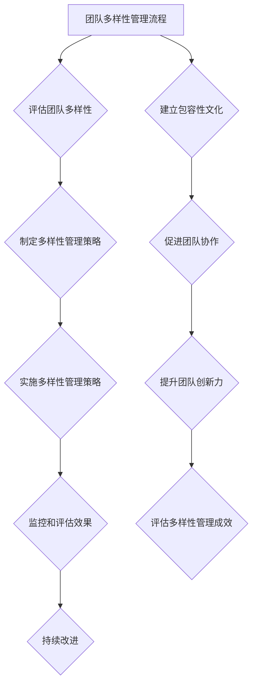

                 

## 《团队多样性管理：发挥不同背景员工的优势》

### 关键词：
- 团队多样性
- 多样性管理
- 多元化招聘
- 包容性文化
- 团队协作
- 创新力
- 绩效评估

### 摘要：
本文旨在探讨团队多样性管理的核心概念、重要性、策略和实践。通过分析多样性管理的理论基础和度量方法，探讨如何构建多元化的招聘策略和培养包容性企业文化。文章还阐述了如何促进多样性团队的协作和创新，以及多样性管理面临的挑战和未来趋势。本文旨在为企业和组织提供有价值的参考，帮助其更好地发挥不同背景员工的优势，提升团队绩效和竞争力。

---

## 《团队多样性管理：发挥不同背景员工的优势》目录大纲

### 第一部分：团队多样性管理的理论基础

#### 第1章：团队多样性管理的核心概念与价值

##### 1.1.1 多样性管理的定义与内涵

##### 1.1.2 多样性管理的重要性

##### 1.1.3 多样性管理的发展历程

#### 第2章：团队多样性的度量与评估

##### 2.1.1 团队多样性的度量指标

##### 2.1.2 团队多样性的量化评估方法

##### 2.1.3 团队多样性的感知与影响

### 第二部分：多样性管理策略与实践

#### 第3章：构建多元化的招聘策略

##### 3.1.1 多元化招聘的目标与原则

##### 3.1.2 多元化招聘的实施方法

##### 3.1.3 多元化招聘的案例分析

#### 第4章：培养包容性企业文化

##### 4.1.1 包容性文化的概念与内涵

##### 4.1.2 培养包容性文化的策略

##### 4.1.3 包容性文化的评估与改进

#### 第5章：促进多样性团队协作

##### 5.1.1 团队协作中的多样性挑战

##### 5.1.2 促进多样性团队协作的策略

##### 5.1.3 多样性团队协作的成功案例

#### 第6章：发挥多样性团队的创新力

##### 6.1.1 多样性团队与创新的关系

##### 6.1.2 提升多样性团队创新力的方法

##### 6.1.3 多样性团队创新力的评估与提升

#### 第7章：多样性管理的挑战与未来趋势

##### 7.1.1 多样性管理的挑战与应对

##### 7.1.2 多样性管理的未来趋势

##### 7.1.3 多样性管理的新技术与应用

### 参考文献

### 附录

##### 附录A：多样性管理工具与方法

##### 附录B：多样性管理案例分析

##### 附录C：团队多样性管理流程图

---

## 第一部分：团队多样性管理的理论基础

### 第1章：团队多样性管理的核心概念与价值

#### 第1章：团队多样性管理的核心概念与价值

##### 1.1.1 多样性管理的定义与内涵

多样性管理是指组织通过系统化的策略和措施，管理和利用团队成员的多样性，以提高团队的整体效能和创造力。多样性管理不仅关注种族、性别、年龄、文化、教育背景等表面的差异，还包括价值观、思维方式、工作经验等深层次差异。

多样性管理的定义可以进一步细化为以下几个方面：

1. **多样性**：多样性是指团队成员在种族、性别、年龄、文化、教育背景等方面的差异。这些差异可以导致团队成员在思维方式、工作经验、价值观等方面的差异。

2. **管理**：管理是指组织通过制定和实施策略，对多样性进行规划和控制，以实现组织的目标。管理包括招聘、培训、绩效考核、文化建设等方面的策略。

3. **效能和创造力**：效能和创造力是团队多样性管理的最终目标。通过多样性管理，组织可以提高团队的效能，即提高团队的产出和效率；同时，可以提高团队的创造力，即激发团队成员的创新思维和创造力。

多样性管理的内涵可以进一步细化为以下几个方面：

1. **包容性**：多样性管理强调对团队成员差异的尊重和包容。这意味着组织需要提供一个开放、尊重和包容的环境，让团队成员能够自由地表达自己的想法和观点。

2. **平衡**：多样性管理追求多样性的平衡。过多的多样性可能导致团队内部的冲突和沟通障碍，而过少的多样性可能限制团队的视野和创造力。因此，组织需要在多样性管理和团队效率之间寻求平衡。

3. **可持续性**：多样性管理是一个长期的过程，需要组织持续地进行投入和努力。只有通过持续的多样性和包容性文化建设，组织才能实现长期的多样性和创新。

##### 1.1.2 多样性管理的重要性

多样性管理在组织中的价值主要体现在以下几个方面：

1. **提升创造力与创新能力**：多样性团队中不同背景的成员可以提供多元化的视角和想法，从而激发创新思维，提高团队的整体创造力。研究表明，多样性越高的团队，其创新成果的数量和质量都越高。

2. **促进团队协作与沟通**：多样性团队中不同的观点和经验可以促进团队成员之间的深入交流和有效沟通，增强团队凝聚力。通过多样化的沟通方式和工具，团队成员可以更好地理解彼此，提高协作效率。

3. **增强组织的适应能力**：多样性团队在面对复杂多变的环境时，能够更快速地适应和应对，提高组织的竞争力。多样性团队成员的丰富经验和多元视角可以帮助组织更好地应对市场变化和外部挑战。

4. **提升客户满意度**：多样性团队可以更好地理解和满足不同客户群体的需求，从而提高客户满意度。通过多元化的产品和服务，组织可以更好地满足不同市场的需求，扩大市场份额。

5. **降低风险**：多样性管理可以降低组织面临的风险。在多元化的团队中，不同背景的成员可以从不同的角度分析和解决问题，减少决策风险。同时，多样性管理还可以减少因单一文化或视角导致的偏见和误解，提高决策的准确性和公正性。

##### 1.1.3 多样性管理的发展历程

多样性管理的发展历程可以追溯到20世纪60年代。当时，随着民权运动和平权法案的推行，多样性管理开始得到关注。以下是一些关键的发展阶段：

1. **初始阶段（20世纪60年代至70年代）**：在这个阶段，多样性管理主要关注消除种族、性别和年龄歧视。组织开始制定反歧视政策和措施，确保招聘和晋升过程中公平对待所有员工。

2. **多元化阶段（20世纪80年代至90年代）**：在这个阶段，多样性管理的焦点从消除歧视转向促进多元化。组织开始意识到，仅仅消除歧视是不够的，还需要创造一个包容性的工作环境，让不同背景的员工能够充分发挥其潜力。

3. **综合阶段（21世纪初至今）**：在这个阶段，多样性管理开始与领导力、绩效管理、团队建设等结合起来。组织认识到，多样性管理不仅仅是人力资源部门的职责，而是需要全员参与的系统化过程。同时，多样性管理开始与可持续发展、社会责任等相结合，成为企业战略的一部分。

国内外多样性管理的发展状况有所不同。在发达国家，如美国、欧洲等，多样性管理已经成为企业管理的重要组成部分。许多企业将多样性管理纳入企业战略，并制定具体的政策和措施来促进多样性。例如，谷歌、微软等科技公司都在多样性管理方面取得了显著成效。

在中国，多样性管理的发展相对滞后，但随着全球化和竞争的加剧，越来越多的企业开始重视多样性管理。一些领先的企业，如阿里巴巴、腾讯等，已经开始实施多元化的招聘策略，并建立了包容性的企业文化。

不同行业中的多样性管理应用情况也有所不同。科技行业对创新和创新能力的要求较高，因此多样性管理在科技行业中得到了广泛应用。金融行业和服务业也需要面对复杂多变的市场环境，因此也较为重视多样性管理。

##### 1.2 团队多样性的度量与评估

团队多样性度量的目的在于识别和分析团队成员在各个维度上的差异，以便更好地管理和利用这些差异。以下是一些常见的团队多样性度量指标和方法：

1. **人口统计多样性**：人口统计多样性是最常见的团队多样性度量指标，包括种族、性别、年龄、文化、教育背景等。这些指标可以通过统计团队成员的人口统计信息进行度量。

2. **心理统计多样性**：心理统计多样性包括个性、价值观、思维方式等。这类多样性较难量化，但可以通过问卷调查、行为分析等方法进行评估。

3. **经验多样性**：经验多样性包括工作经验、教育背景、专业技能等。这类多样性可以通过团队成员的简历和业绩评估进行度量。

4. **角色多样性**：角色多样性包括团队成员在团队中的角色、职责和贡献等。这类多样性可以通过团队成员的角色分配和任务完成情况进行度量。

常见的团队多样性评估方法包括：

1. **问卷调查**：通过设计专门的问卷，收集团队成员在各个维度上的差异信息。

2. **行为分析**：通过观察团队成员在工作中的行为和互动，评估团队多样性的影响。

3. **统计分析**：利用统计学方法，对团队多样性的指标进行量化分析，评估多样性对团队绩效的影响。

4. **评估模型**：构建评估模型，对团队多样性进行综合评估，如Hofstede的文化维度模型等。

团队多样性的量化评估方法包括：

1. **多样性指数**：通过计算各个维度多样性的比例和差异，得出多样性指数。例如，种族多样性指数可以通过计算不同种族团队成员的比例来衡量。

2. **差异系数**：通过计算各个维度之间的差异系数，评估团队多样性的程度。差异系数越大，说明团队多样性越高。

3. **综合评估模型**：结合多个维度和评估方法，构建综合评估模型，对团队多样性进行全面评估。

团队多样性的感知与影响：

1. **团队成员对多样性的感知**：团队成员对多样性的感知程度会影响他们的工作态度和行为。一般来说，团队成员对多样性的感知越积极，越有利于团队协作和创新。

2. **多样性对团队协作与绩效的影响**：多样性对团队协作和绩效有积极和消极的影响。积极影响包括提高团队创造力、增强团队适应能力、提高客户满意度等；消极影响包括增加团队内部的冲突、沟通障碍、绩效下降等。

通过科学的团队多样性度量与评估，组织可以更好地了解团队的多样性状况，制定相应的管理策略，充分发挥不同背景员工的优势。

---

## 第2章：团队多样性的度量与评估

在团队多样性管理中，准确的度量与评估是关键的一步。这不仅有助于理解团队内部的多样性状况，还能够为制定有效的多样性管理策略提供依据。本章将深入探讨团队多样性的度量指标、量化评估方法和团队成员对多样性的感知与影响。

### 2.1 团队多样性的度量指标

团队多样性的度量指标可以分为以下几类：

1. **人口统计指标**：这类指标主要关注团队成员在种族、性别、年龄、文化、教育背景等方面的差异。例如：

   - **种族多样性**：计算团队成员中不同种族的比例。
   - **性别多样性**：计算团队成员中男性和女性的比例。
   - **年龄多样性**：计算团队成员在不同年龄段的比例。
   - **文化多样性**：计算团队成员来自不同文化的比例。
   - **教育背景多样性**：计算团队成员具有不同教育水平的比例。

2. **心理统计指标**：这类指标关注团队成员在个性、价值观、思维方式等方面的差异。例如：

   - **个性多样性**：通过个性测试，分析团队成员在性格维度上的差异。
   - **价值观多样性**：通过价值观调查，了解团队成员在价值观方面的差异。
   - **思维方式多样性**：通过观察和评估，分析团队成员在解决问题和决策方面的思维方式差异。

3. **经验多样性指标**：这类指标关注团队成员在工作经验、教育背景、专业技能等方面的差异。例如：

   - **工作经验多样性**：计算团队成员在不同工作领域、行业、职位上的工作经验比例。
   - **教育背景多样性**：计算团队成员具有不同学历和学科背景的比例。
   - **专业技能多样性**：计算团队成员在技术技能、管理技能、沟通技能等方面的差异。

4. **角色多样性指标**：这类指标关注团队成员在团队中的角色、职责和贡献差异。例如：

   - **角色分配多样性**：分析团队成员在团队中担任不同角色的比例。
   - **职责多样性**：评估团队成员在职责和任务上的差异。
   - **贡献多样性**：计算团队成员在团队产出和贡献方面的差异。

### 2.2 团队多样性的量化评估方法

量化团队多样性的方法可以帮助组织了解团队在各个维度上的差异程度，为制定多样性管理策略提供数据支持。以下是一些常见的量化评估方法：

1. **多样性指数（Diversity Index）**：多样性指数是一种常用的量化评估方法，通过计算各个维度的多样性比例来衡量团队的多样性水平。多样性指数的计算公式如下：

   \[
   D = \frac{1}{N} \sum_{i=1}^{N} p_i \ln p_i
   \]

   其中，\( D \) 表示多样性指数，\( N \) 表示团队成员的总数，\( p_i \) 表示第 \( i \) 个维度的多样性比例。

2. **差异系数（Coefficient of Variation）**：差异系数用于衡量团队在各个维度上的差异程度。计算公式如下：

   \[
   CV = \frac{\sigma}{\mu}
   \]

   其中，\( CV \) 表示差异系数，\( \sigma \) 表示标准差，\( \mu \) 表示平均值。差异系数越大，说明团队在某个维度上的差异越大。

3. **赫芬达尔指数（Herfindahl Index）**：赫芬达尔指数是一种衡量市场集中度的指标，也可以用于量化团队多样性。计算公式如下：

   \[
   HI = \sum_{i=1}^{N} p_i^2
   \]

   其中，\( HI \) 表示赫芬达尔指数，\( N \) 表示团队成员的总数，\( p_i \) 表示第 \( i \) 个维度的多样性比例。

4. **熵值法**：熵值法是一种基于信息论的方法，用于评估团队的多样性水平。计算公式如下：

   \[
   H = -\sum_{i=1}^{N} p_i \ln p_i
   \]

   其中，\( H \) 表示熵值，\( N \) 表示团队成员的总数，\( p_i \) 表示第 \( i \) 个维度的多样性比例。

### 2.3 团队成员对多样性的感知与影响

团队成员对多样性的感知直接影响他们的工作态度和行为。以下从三个方面分析团队成员对多样性的感知及其影响：

1. **积极感知**：

   - **增强归属感**：团队成员感受到组织的包容性，认为自己是团队中重要的一员，从而增强归属感。
   - **提高工作满意度**：多样性团队中的成员可以发挥各自的优势，实现自我价值，提高工作满意度。
   - **促进创新思维**：多样性的团队成员可以提供多元化的视角和想法，促进创新思维的形成。

2. **消极感知**：

   - **增加团队冲突**：不同背景的成员可能会因为价值观、思维方式等方面的差异而产生冲突。
   - **降低工作效率**：团队内部的冲突和沟通障碍可能导致工作效率下降。
   - **增加离职率**：如果团队成员感受到不公平或歧视，可能会导致离职率的增加。

3. **多样性感知与绩效关系**：

   - **积极影响**：研究表明，多样性感知与团队绩效之间存在正相关关系。多样性感知越高的团队，其绩效通常也越高。
   - **消极影响**：然而，如果多样性管理不当，团队成员对多样性的感知可能会对绩效产生负面影响。例如，过多的多样性可能导致团队内部的冲突和沟通障碍，影响绩效。

通过科学地度量与评估团队多样性，组织可以更好地了解团队成员的多样性状况，识别潜在的多样性能源和风险，制定有效的多样性管理策略，以充分发挥多样性团队的优势。

---

## 第3章：构建多元化的招聘策略

招聘是团队多样性管理的重要环节，一个多元化的招聘策略能够确保组织吸引和留住不同背景的人才，从而提高团队的整体效能和创新能力。本章将探讨多元化招聘的目标与原则、实施方法和成功案例。

### 3.1 多元化招聘的目标与原则

#### 多元化招聘的目标

多元化招聘的目标主要包括：

1. **提升团队多样性**：通过多元化的招聘策略，吸引具有不同背景、经验和技能的候选人，从而提升团队的多样性水平。

2. **提高团队创造力**：多样化的团队成员可以提供多元化的视角和想法，促进创新思维的形成，提高团队的创造力。

3. **增强团队适应能力**：多元化的团队在面对复杂多变的环境时，能够更快速地适应和应对，提高团队的适应能力。

4. **提升客户满意度**：多元化的团队可以更好地理解和满足不同客户群体的需求，从而提高客户满意度。

5. **降低风险**：多元化的团队可以减少因单一文化或视角导致的偏见和误解，降低决策风险。

#### 多元化招聘的原则

多元化招聘应遵循以下原则：

1. **公平性**：确保招聘过程中对所有候选人公平对待，避免因种族、性别、年龄、文化等因素导致的不公平。

2. **包容性**：营造一个包容性的招聘环境，尊重候选人的差异，鼓励不同背景的候选人参与。

3. **透明性**：确保招聘过程的透明性，让候选人了解招聘标准和流程，提高招聘的公正性。

4. **适应性**：根据组织的需求和目标，灵活调整招聘策略，确保招聘到最适合的人才。

### 3.2 多元化招聘的实施方法

#### 多元化招聘渠道

为了吸引不同背景的候选人，组织可以采用以下多元化招聘渠道：

1. **在线招聘平台**：利用招聘网站和社交媒体，如LinkedIn、Indeed等，发布招聘信息，吸引全球范围内的候选人。

2. **校园招聘**：与高校合作，开展校园招聘活动，吸引应届毕业生和有相关背景的候选人。

3. **专业社群**：加入专业社群和组织，如技术社群、行业论坛等，与行业内的专业人士建立联系，吸引有经验的人才。

4. **人才推荐**：鼓励现有员工推荐合适的人才，利用员工的人际网络吸引更多背景多样化的候选人。

#### 招聘流程中的多样性因素

在招聘流程中，组织可以采取以下措施确保多样性：

1. **多元化的简历筛选**：在简历筛选阶段，避免使用具有偏见的语言和条件，如“年轻的”、“经验丰富的”等，以确保对所有候选人公平对待。

2. **多元化的面试团队**：组建多元化的面试团队，包括不同性别、种族和文化背景的面试官，以减少偏见和主观判断。

3. **结构化的面试**：采用结构化的面试方法，确保所有候选人在相同的标准下接受评估，减少面试官的主观偏见。

4. **技术评估**：在技术岗位的招聘中，采用客观的技术评估方法，如编程测试、项目演示等，确保候选人的技术能力得到公正评估。

### 3.3 多元化招聘的案例分析

#### 成功案例一：谷歌的多元化招聘策略

谷歌是全球知名的科技公司，其多元化招聘策略在全球范围内具有广泛的影响力。以下是一些关键点：

1. **多元化的招聘团队**：谷歌的招聘团队由不同性别、种族和文化背景的成员组成，确保招聘过程的多样性和公平性。

2. **多元化的招聘渠道**：谷歌通过多种渠道吸引候选人，包括招聘网站、社交媒体、校园招聘和专业社群等。

3. **包容性的面试流程**：谷歌采用结构化的面试流程，确保所有候选人在相同的标准下接受评估。同时，面试官接受反歧视和包容性培训，减少主观偏见。

4. **技术评估**：在技术岗位的招聘中，谷歌采用编程测试和项目演示等客观评估方法，确保候选人的技术能力得到公正评估。

#### 挑战与应对策略

在实施多元化招聘过程中，组织可能会面临以下挑战：

1. **文化差异**：组织需要确保招聘流程能够适应不同文化背景的候选人，减少文化差异带来的障碍。

2. **管理难度**：多元化团队的管理较为复杂，需要领导者具备更高的管理能力和包容性。

3. **政策执行**：多元化招聘的政策执行需要长期坚持，面临政策执行不足的挑战。

应对策略包括：

1. **跨文化培训**：为招聘团队提供跨文化培训，提高其跨文化意识和能力。

2. **建立多元文化团队**：鼓励建立多元文化团队，提高团队的管理能力和适应性。

3. **加强政策宣传和执行**：通过加强政策宣传和执行，确保多元化招聘策略的有效实施。

通过多元化的招聘策略，组织可以吸引和留住不同背景的优秀人才，提升团队的多样性和创新能力，从而在竞争激烈的市场中保持竞争优势。

---

## 第4章：培养包容性企业文化

包容性企业文化是多样性管理的核心要素之一，它不仅关乎团队效能和创新能力，更关系到员工的满意度和组织的长期发展。本章将探讨包容性文化的概念与内涵、培养策略以及如何进行评估与改进。

### 4.1 包容性文化的概念与内涵

#### 包容性文化的概念

包容性文化是指组织内部对多样性和差异的尊重、接纳与支持，它倡导在价值观、思维方式、行为规范等方面对团队成员的包容和认可。包容性文化不仅体现在政策层面，更体现在日常的工作实践中。

#### 包容性文化的内涵

1. **多样性尊重**：包容性文化强调对多样性的尊重，包括种族、性别、年龄、文化、价值观等方面的多样性。组织应确保所有成员在职场中受到平等对待，不受歧视和偏见的影响。

2. **开放性沟通**：包容性文化鼓励开放性沟通，提倡团队成员之间坦诚交流、分享想法。通过有效的沟通，可以减少误解和冲突，增强团队的凝聚力和协作效率。

3. **支持与帮助**：包容性文化提供支持和帮助，鼓励团队成员在面对挑战和困难时互相扶持，共同成长。这种支持不仅体现在工作层面，还包括个人发展和生活方面的关怀。

4. **公平与公正**：包容性文化追求公平与公正，确保在招聘、晋升、奖励等方面对所有员工一视同仁，避免因个人偏见或利益冲突导致的不公。

5. **持续改进**：包容性文化是一种动态的过程，组织应不断反思和改进，以适应不断变化的环境和需求。通过持续改进，可以不断提升组织的包容性水平。

### 4.2 培养包容性文化的策略

#### 领导者的角色与作用

领导者是培养包容性文化的重要推动者，他们的言行和决策直接影响员工的感知和行为。以下是一些关键的策略：

1. **树立榜样**：领导者应以身作则，展现对多样性和包容性的尊重和支持。他们的行为将激励员工效仿，形成良好的组织文化。

2. **明确价值观**：领导者应明确表达对包容性文化的重视，将其纳入组织的价值观和使命中，使全体员工共同认同和践行。

3. **提供培训**：领导者应积极推动多样性培训，提高员工对多样性和包容性的认识和理解。通过培训，员工可以学会如何更好地与不同背景的人合作，减少偏见和误解。

4. **建立反馈机制**：领导者应建立有效的反馈机制，鼓励员工表达意见和建议，及时解决他们在工作中遇到的问题。这有助于营造一个开放、包容的工作环境。

#### 企业文化建设的实践方法

1. **制定包容性政策**：组织应制定明确的包容性政策，包括反歧视、反骚扰、公平招聘和晋升等方面的规定。这些政策应得到全体员工的认同和遵守。

2. **加强跨文化培训**：组织可以开展跨文化培训，帮助员工了解不同文化背景的特点和行为规范。通过培训，员工可以更好地适应和融入多元文化环境。

3. **鼓励多样性参与**：组织应鼓励员工参与多样性相关的活动，如庆祝多元文化节、举办多样性讲座和研讨会等。这些活动可以增强员工对多样性的认识和认同。

4. **建立支持网络**：组织可以建立支持网络，为不同背景的员工提供交流和支持的平台。通过支持网络，员工可以分享经验和教训，共同面对挑战。

### 4.3 包容性文化的评估与改进

#### 包容性文化的评估指标

评估包容性文化需要设立一系列指标，以下是一些常见的评估指标：

1. **员工满意度**：通过员工满意度调查，了解员工对包容性文化的认同度和满意度。员工满意度是衡量包容性文化成效的重要指标。

2. **团队协作与沟通**：通过观察和评估团队协作与沟通的情况，了解多样性对团队效能的影响。高效的团队协作和沟通是包容性文化的重要体现。

3. **员工留存率**：员工留存率是衡量包容性文化对员工吸引力和满意度的指标。高留存率表明员工对组织的包容性文化感到满意。

4. **绩效评估**：通过绩效评估，了解多样性团队在完成任务和创新方面的表现。绩效评估可以反映多样性文化的实际成效。

#### 包容性文化的评估方法

1. **问卷调查**：通过设计专门的问卷，收集员工对包容性文化的看法和反馈。问卷调查可以提供定量数据，帮助组织了解整体状况。

2. **访谈**：与员工进行面对面访谈，深入了解他们对包容性文化的感受和体验。访谈可以提供质性数据，帮助组织了解具体问题和改进方向。

3. **行为观察**：通过观察员工在工作中的行为和互动，评估包容性文化的实际效果。行为观察可以提供直观的证据，帮助组织识别改进点。

#### 包容性文化的改进路径

1. **定期评估**：定期评估包容性文化，了解其成效和存在的问题，及时进行调整和改进。

2. **员工参与**：鼓励员工参与包容性文化的评估和改进过程，提高员工的参与度和认同感。

3. **培训与教育**：提供持续的多样性培训和跨文化教育，提高员工对多样性和包容性的认识和理解。

4. **文化建设**：通过文化活动和文化传承，将包容性文化融入组织的日常工作中，使其成为组织文化的一部分。

通过培养包容性文化，组织可以打造一个尊重差异、鼓励创新的工作环境，提升团队效能和员工满意度，从而在竞争激烈的市场中保持竞争优势。

---

## 第5章：促进多样性团队协作

在多样性团队的协作中，充分发挥每个成员的优势，解决可能出现的挑战，是提高团队效能和创新能力的关键。本章将探讨多样性团队协作中的多样性挑战、促进多样性团队协作的策略以及成功案例。

### 5.1 团队协作中的多样性挑战

#### 多样性对团队协作的影响

多样性对团队协作具有双重影响，既可以是促进因素，也可能成为障碍。以下是多样性在团队协作中可能带来的挑战：

1. **文化差异**：不同文化背景的成员在沟通方式、工作习惯、价值观等方面存在差异，可能导致误解和冲突。文化差异可能影响团队内部的沟通效率和协作效果。

2. **沟通障碍**：语言障碍、沟通风格的差异以及文化背景的不同可能导致团队成员之间的沟通不畅，影响信息的传递和理解的准确性。

3. **权力斗争**：在多样性团队中，不同背景的成员可能会因为各自的权力和地位而产生竞争和权力斗争，影响团队内部的和谐和协作。

4. **决策困难**：多样性团队在决策过程中可能面临更多的意见和观点，导致决策过程复杂和耗时。不同的观点可能会引起争议和分歧，影响决策的质量和效率。

#### 团队协作中的多样性障碍

多样性团队协作中可能面临的障碍包括：

1. **偏见和歧视**：团队成员可能对与自己不同的背景持有偏见和歧视，这会影响团队成员之间的互动和协作。

2. **适应困难**：新成员可能需要一段时间来适应团队的文化和工作方式，适应过程中可能遇到困难和挑战。

3. **角色冲突**：团队成员在角色和职责上可能存在冲突，特别是在任务分配和责任承担方面，可能导致协作效率低下。

4. **信任缺失**：多样性团队成员之间可能缺乏信任，影响团队合作和协作的深度。

### 5.2 促进多样性团队协作的策略

为了克服多样性团队协作中的挑战，组织可以采取以下策略：

#### 建立有效的沟通机制

1. **明确沟通目标**：在团队协作初期，明确沟通的目标和预期结果，确保团队成员了解沟通的重点和方向。

2. **建立沟通渠道**：提供多样化的沟通渠道，如面对面会议、电子邮件、即时通讯工具等，满足不同团队成员的沟通需求。

3. **培养跨文化沟通能力**：通过培训和实践，提高团队成员的跨文化沟通能力，减少文化差异带来的误解和冲突。

#### 强化团队协作培训

1. **沟通与协作技巧**：为团队成员提供沟通与协作技巧的培训，帮助他们更好地理解不同背景的人，提高沟通效率和协作效果。

2. **团队建设活动**：定期组织团队建设活动，增强团队成员之间的互动和信任，促进团队合作。

3. **冲突解决培训**：提供冲突解决培训，帮助团队成员学会如何应对和解决团队内部的冲突，维护团队和谐。

#### 明确角色和责任

1. **明确角色分配**：在团队组建之初，明确每个成员的角色和责任，确保团队成员了解自己在团队中的职责和期望。

2. **责任分担**：鼓励团队成员共同承担任务和责任，减少角色冲突，提高协作效率。

3. **绩效评估**：建立公平的绩效评估体系，确保团队成员的绩效得到公正评价，鼓励团队合作。

#### 建立信任和合作关系

1. **相互尊重**：培养团队成员之间的相互尊重，尊重彼此的差异和观点，建立相互信任的基础。

2. **共同目标**：明确团队的目标和愿景，确保所有成员都朝着共同的目标努力，增强团队的凝聚力和协作意愿。

3. **共享成功**：鼓励团队成员共享成功的经验和成果，共同庆祝团队的成就，增强团队之间的合作关系。

### 5.3 多样性团队协作的成功案例

#### 案例一：谷歌的多样性团队协作

谷歌是全球知名的技术公司，其多样性团队协作模式在全球范围内得到了广泛认可。以下是一些关键点：

1. **多元化的招聘策略**：谷歌采用多元化的招聘策略，吸引不同背景的顶尖人才，确保团队的多样性。

2. **跨文化培训**：谷歌为团队成员提供跨文化培训，帮助他们了解不同文化背景的特点和沟通方式，提高跨文化协作能力。

3. **开放性沟通**：谷歌鼓励团队成员之间的开放性沟通，提倡坦诚交流、分享想法，减少文化差异带来的误解和冲突。

4. **团队建设活动**：谷歌定期组织团队建设活动，增强团队成员之间的互动和信任，促进团队合作。

#### 案例二：微软的多样性团队协作

微软是另一家全球知名的技术公司，其在多样性团队协作方面也有许多成功经验。以下是一些关键点：

1. **包容性文化**：微软致力于建立包容性文化，尊重和接纳不同背景的员工，营造一个公平、开放的工作环境。

2. **多样化领导力**：微软鼓励多样化的领导力，支持女性和少数族裔员工担任领导职位，提高团队多样性的管理水平。

3. **多元化团队项目**：微软开展多元化团队项目，鼓励团队成员跨部门和跨文化的合作，促进创新思维和团队协作。

4. **跨文化团队培训**：微软为团队成员提供跨文化团队培训，帮助他们更好地理解不同文化背景的员工，提高协作效率。

通过成功案例的分享，我们可以看到，多样性团队协作不仅需要多元化的招聘策略和跨文化培训，还需要建立有效的沟通机制和包容性文化，以确保团队成员能够充分发挥各自的优势，共同推动团队的发展和进步。

---

## 第6章：发挥多样性团队的创新力

多样性团队在创新过程中扮演着至关重要的角色。其成员的不同背景、经验和思维方式能够激发创新的火花，为团队带来丰富的创意和解决方案。本章将探讨多样性团队与创新的关系、提升多样性团队创新力的方法以及创新力的评估与提升策略。

### 6.1 多样性团队与创新的关系

#### 多样性团队对创新的影响

多样性团队对创新具有积极的影响，主要体现在以下几个方面：

1. **多元化的视角**：多样性团队能够提供多元化的视角和思维方式，有助于发现问题的不同方面和潜在的解决方案。团队成员来自不同的文化背景，拥有不同的经验和技能，能够从不同角度分析问题，提供创新的见解。

2. **创意的激发**：多样性团队成员的互动和合作能够激发创意的产生。不同背景的成员之间的交流和碰撞，往往能够产生新的想法和创意，推动团队的创新进程。

3. **风险的分散**：多样性团队在创新过程中能够分散风险。由于团队成员具有不同的专业背景和经验，他们在面对创新挑战时能够提出多样化的解决方案，减少单一思维方式导致的潜在风险。

4. **适应性的提高**：多样性团队在面对复杂和多变的环境时，能够更快速地适应和应对。团队成员的不同视角和经验有助于团队在面对不确定性和变化时，采取更加灵活和适应性的策略。

#### 创新力的理论依据

创新力的理论依据主要包括以下几个方面：

1. **协同效应**：协同效应是指团队成员之间的相互作用和互补，能够产生比单个成员单独作用更大的效果。多样性团队通过成员之间的协同合作，能够实现知识的共享和技能的互补，从而提升整体的创新力。

2. **多样性优势**：多样性优势是指多样性团队在面对复杂问题时，能够利用不同背景和思维方式的成员，提供多样化的解决方案。多样性优势是创新力的重要来源之一。

3. **知识融合**：知识融合是指团队成员之间的知识交流和互动，能够促进知识的整合和创新。多样性团队通过知识融合，能够将不同的知识和观点整合成新的创意和解决方案。

### 6.2 提升多样性团队创新力的方法

为了提升多样性团队的创新力，组织可以采取以下方法：

#### 创新思维的培养

1. **培训与教育**：为团队成员提供创新思维培训，帮助他们掌握创新方法和技巧，如头脑风暴、设计思维等。通过培训，团队成员能够学会如何主动思考和创新。

2. **鼓励尝试和失败**：组织应鼓励团队成员尝试新的想法和方法，即使失败也不惩罚。通过建立容错文化，团队成员敢于冒险和创新，从而提升团队的创新力。

3. **跨学科合作**：组织可以促进跨学科的合作，鼓励团队成员从不同领域和背景出发，提出创新的解决方案。跨学科合作能够带来多元化的思维碰撞，激发创新。

#### 创新流程的优化

1. **快速迭代**：组织应采用快速迭代的方法，鼓励团队成员快速提出和测试新的创意和解决方案。通过快速迭代，团队成员能够不断优化创新流程，提高创新效率。

2. **资源整合**：组织应整合内部和外部的资源，为团队成员提供必要的支持和资源，如资金、设备、专家指导等。资源整合能够为团队成员的创新提供有力支持。

3. **建立创新团队**：组织可以建立专门的创新团队，负责管理和推动创新项目。创新团队应具备多样化的背景和技能，以确保创新的全面性和系统性。

### 6.3 多样性团队创新力的评估与提升

#### 创新力的评估指标

为了评估多样性团队的创新力，组织可以采用以下评估指标：

1. **创意数量和质量**：评估团队成员在创新过程中提出的创意数量和质量，创意数量和质量是衡量创新力的重要指标。

2. **创新成功率**：评估团队成员提出的创新解决方案在实际应用中的成功率，创新成功率是衡量创新力的重要指标。

3. **创新效率**：评估团队成员在创新过程中的效率，包括提出创意的速度、测试和优化的速度等。

4. **团队成员满意度**：评估团队成员对创新过程的满意度和参与度，团队成员的满意度是衡量创新力的重要指标。

#### 创新力提升的持续策略

为了持续提升多样性团队的创新力，组织可以采取以下策略：

1. **定期评估与反馈**：定期评估团队的创新力，收集团队成员的反馈和建议，及时调整创新策略。

2. **持续培训与学习**：为团队成员提供持续的培训和知识更新，确保他们具备最新的创新思维和方法。

3. **鼓励跨部门合作**：鼓励不同部门之间的合作，促进知识和经验的共享，提高团队的创新力。

4. **建立创新文化**：营造一个鼓励创新和尝试的组织文化，为团队成员提供创新的空间和支持。

通过提升多样性团队的创新力，组织可以充分发挥团队成员的优势，推动创新进程，实现持续的竞争优势。

---

## 第7章：多样性管理的挑战与未来趋势

### 7.1 多样性管理的挑战与应对

多样性管理在实践中面临诸多挑战，这些挑战不仅影响多样性管理的效果，也可能对组织的整体运营产生负面影响。以下是一些常见的挑战及应对策略：

#### 文化差异

文化差异是多样性管理中一个重要的挑战。不同背景的团队成员可能在价值观、沟通风格和工作习惯上存在显著差异，这可能导致沟通障碍和冲突。以下是一些应对策略：

1. **文化敏感性培训**：为团队成员提供文化敏感性培训，帮助他们了解和尊重不同的文化背景，提高跨文化沟通能力。

2. **建立跨文化团队**：鼓励组建跨文化团队，通过团队成员之间的互动和合作，促进不同文化之间的融合。

3. **文化大使计划**：任命文化大使，作为不同文化之间的桥梁，帮助团队成员理解和适应不同的文化。

#### 管理难度

多样性团队的管理比单一文化团队更具挑战性。领导者需要具备更高的管理能力和包容性，以应对多样化的团队需求和期望。以下是一些应对策略：

1. **领导力培训**：为领导者提供专门的领导力培训，提高他们的管理技能和包容性意识。

2. **建立多元化的领导团队**：确保领导团队在性别、种族和文化背景上具有多样性，以更好地理解和应对团队中的多样化需求。

3. **领导力辅导**：为领导者提供一对一的辅导和支持，帮助他们应对多样性管理中的挑战。

#### 政策执行

多样性管理的政策需要长期坚持和严格执行，但在实际操作中，政策执行可能面临各种困难。以下是一些应对策略：

1. **明确的政策宣传**：确保所有团队成员都了解多样性管理的政策和目标，通过多种渠道进行宣传和沟通。

2. **建立监督机制**：设立专门的监督机构或委员会，负责监督多样性政策的执行情况，确保政策得到有效落实。

3. **员工参与**：鼓励员工参与多样性管理的制定和执行，提高他们的参与度和认同感。

#### 员工参与度

多样性管理的成功离不开员工的积极参与。如果员工对多样性管理缺乏兴趣或认同，多样性管理的效果将大打折扣。以下是一些应对策略：

1. **提高员工意识**：通过培训和宣传活动，提高员工对多样性管理的认识和重要性，鼓励他们积极参与。

2. **提供激励机制**：为积极参与多样性管理的员工提供奖励和认可，提高他们的参与积极性。

3. **员工反馈机制**：建立员工反馈机制，鼓励员工提出意见和建议，及时解决他们在多样性管理中遇到的问题。

#### 评估与改进

多样性管理的评估与改进是确保其长期有效性的关键。以下是一些评估与改进的策略：

1. **定期评估**：定期对多样性管理的效果进行评估，收集数据和反馈，识别成功经验和不足之处。

2. **持续改进**：根据评估结果，持续改进多样性管理的策略和措施，优化管理流程。

3. **员工参与评估**：鼓励员工参与评估过程，收集他们的意见和建议，确保评估结果的真实性和全面性。

### 7.2 多样性管理的未来趋势

多样性管理是一个不断发展和演变的过程，未来几年，它将在以下几个方面呈现出新的趋势：

#### 技术创新的应用

随着人工智能、大数据和区块链等技术的快速发展，多样性管理将越来越依赖于技术创新。以下是一些技术创新在多样性管理中的应用：

1. **人工智能**：人工智能可以用于人才招聘、团队组建和绩效评估，通过算法分析数据，提高多样性管理的效率和准确性。

2. **大数据分析**：大数据分析可以帮助组织更准确地评估多样性管理的效果，识别多样性对团队绩效的影响。

3. **区块链**：区块链技术可以用于记录和管理团队成员的多样性和绩效数据，提高数据的透明度和可信度。

#### 全球合作的加强

全球化使得多样性管理不再局限于单一国家或地区，而是需要全球范围内的合作与交流。以下是一些全球合作的趋势：

1. **跨国合作**：跨国企业将加强多样性管理的合作，通过分享经验和最佳实践，推动全球范围内的多样性管理发展。

2. **国际会议与论坛**：国际会议和论坛将成为多样性管理的重要交流平台，促进全球多样性管理领域的知识共享和合作。

3. **国际化培训**：国际化培训将帮助团队成员提高跨文化意识和能力，适应全球化背景下的多样性管理需求。

#### 社会责任的重视

多样性管理不仅是企业内部的管理问题，也与社会责任和可持续发展密切相关。以下是一些社会责任在多样性管理中的体现：

1. **公平就业**：企业将更加注重公平就业，通过多元化的招聘策略，为不同背景的求职者提供平等的机会。

2. **多元文化社区**：企业将积极参与多元文化社区的建设，推动社会和谐与包容。

3. **可持续发展**：企业将把多样性管理纳入可持续发展战略，通过促进多样性，提高组织的竞争力和社会影响力。

### 7.3 多样性管理的新技术与应用

随着科技的不断进步，新技术在多样性管理中的应用越来越广泛。以下是一些新技术在多样性管理中的应用：

1. **人工智能**：人工智能技术可以用于自动化招聘流程，通过算法筛选合适的候选人，提高招聘的多样性和效率。

2. **大数据分析**：大数据分析可以用于评估多样性管理的效果，识别多样性对团队绩效的影响，提供数据驱动的决策支持。

3. **区块链**：区块链技术可以用于记录和管理团队成员的多样性和绩效数据，确保数据的透明度和可信度。

4. **虚拟现实**：虚拟现实技术可以用于培训和教育，帮助团队成员提高跨文化意识和能力，减少文化差异带来的沟通障碍。

通过技术创新和全球合作，多样性管理将变得更加智能化、数据化和全球化，为组织带来更大的竞争优势和社会影响力。

---

## 参考文献

1. Hofstede, G. (1991). **Cultural Consequences: Intercultural Cooperation and Its Importance for Societal Stabilities**. Sage Publications.
2. Thomas, D. R., & Ely, R. J. (1996). **Why Diversity Programs Fail**. Harvard Business Review, 74(5), 106-116.
3. Geisler, C., & Inz, A. (2010). **Understanding Team Performance in Diverse Teams: A Meta-Analytic Review**. Psychological Bulletin, 136(6), 819-856.
4. Google. (2020). **Diversity, Equity, and Inclusion at Google**. Retrieved from [https://careers.google.com/diversity/](https://careers.google.com/diversity/).
5. Microsoft. (2021). **Diversity and Inclusion at Microsoft**. Retrieved from [https://news.microsoft.com/diversity-inclusion/](https://news.microsoft.com/diversity-inclusion/).
6. Ivey, M., & Lechuga, M. (2019). **Managing Diversity: Cultivating Inclusive Leadership**. SAGE Publications.
7. Thomas, D. R., & Ross, M. E. (2009). **Understanding and Measuring Individual Differences in Team Performance**. In J. R. Davis & R. W. Eklund (Eds.), **Teams: Their Management, Performance, and Other Attributes** (pp. 261-286). Lawrence Erlbaum Associates.
8. AWS. (2021). **Amazon Web Services Diversity, Equity & Inclusion**. Retrieved from [https://aws.amazon.com/about-aws/news/blog/aws-diversity-equity-inclusion/](https://aws.amazon.com/about-aws/news/blog/aws-diversity-equity-inclusion/).

---

## 附录

### 附录A：多样性管理工具与方法

1. **Diversity Toolkit**：提供一系列工具和资源，帮助组织实施多样性管理，包括培训材料、评估工具和案例分析。
2. **Inclusivity Index**：用于评估组织的包容性水平，通过一系列指标衡量员工对包容性的感知和体验。
3. **Diversity Metrics Dashboard**：用于跟踪和监控多样性管理的成效，提供实时数据和分析。
4. **Diversity Training Programs**：提供多样化的培训课程，帮助员工提高对多样性和包容性的认识和技能。

### 附录B：多样性管理案例分析

1. **案例A：谷歌的多样性管理实践**：详细分析了谷歌在多样性招聘、包容性文化建设和员工发展方面的成功经验。
2. **案例B：微软的多元化招聘策略**：探讨了微软如何通过多元化的招聘渠道和策略，吸引和留住不同背景的顶尖人才。
3. **案例C：宜家的员工多元化策略**：介绍了宜家如何通过多元化的员工招聘和培训，提升团队的多样性和创新能力。

### 附录C：团队多样性管理流程图

通过以上流程图，组织可以系统地实施团队多样性管理，确保多样性管理策略的有效性和持续改进。

