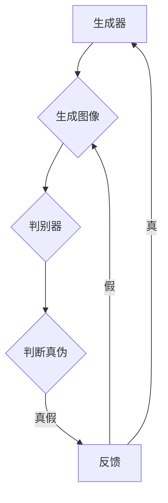

                 

# 图像生成（Image Generation）

## 关键词

- 图像生成
- 深度学习
- 生成对抗网络（GAN）
- 图像风格迁移
- 超分辨率图像生成

## 摘要

图像生成技术是一种通过算法自动创建图像的方法，其在计算机视觉、艺术创作和商业应用中展现出巨大的潜力。本文将系统地介绍图像生成的基础知识，包括图像生成技术的发展历程、核心概念、GAN模型原理以及深度学习在图像生成中的应用。此外，文章还将探讨图像生成技术的未来发展趋势和实际应用，以帮助读者全面了解这一领域的前沿动态。

## 目录

### 第一部分：图像生成基础

#### 第1章：图像生成概述
- 1.1 图像生成技术的发展历程
- 1.2 图像生成的主要类型与应用场景
- 1.3 图像生成在计算机视觉中的作用

#### 第2章：图像生成核心概念
- 2.1 图像生成基本概念
- 2.2 图像生成模型分类
- 2.3 生成对抗网络（GAN）

#### 第3章：生成对抗网络（GAN）原理
- 3.1 GAN的数学原理
- 3.2 GAN的核心算法

### 第二部分：深度学习与图像生成

#### 第4章：GAN模型应用与改进
- 4.1 GAN在不同领域的应用
- 4.2 GAN的改进与变体

#### 第5章：深度学习基础
- 5.1 深度学习的基本原理
- 5.2 卷积神经网络（CNN）原理

#### 第6章：深度学习在图像生成中的应用
- 6.1 深度卷积生成模型（DCGAN）详解
- 6.2 基于深度学习的图像生成算法

#### 第7章：图像生成项目实战
- 7.1 项目准备
- 7.2 图像生成代码实现
- 7.3 项目分析与优化

### 第三部分：图像生成未来展望

#### 第8章：图像生成技术发展趋势
- 8.1 图像生成技术的未来发展方向

#### 第9章：图像生成在AI领域的应用前景
- 9.1 图像生成在计算机视觉中的应用
- 9.2 图像生成在艺术与娱乐中的应用
- 9.3 图像生成在商业与工业中的应用

### 附录

#### 附录A：图像生成相关资源与工具
- A.1 主流图像生成模型与框架
- A.2 图像生成实用工具与库

#### 附录B：图像生成算法 Mermaid 流程图

#### 附录C：代码实现与解释

#### 附录D：数学模型与公式

### 参考文献

### 作者

- 作者：AI天才研究院/AI Genius Institute & 禅与计算机程序设计艺术 /Zen And The Art of Computer Programming

## 第一部分：图像生成基础

### 第1章：图像生成概述

## 1.1 图像生成技术的发展历程

图像生成技术可以追溯到20世纪80年代，当时研究人员开始探索如何通过计算机算法自动创建图像。最早的图像生成方法主要包括基于规则的方法和基于采样的方法。这些方法在某些特定领域（如图形设计、艺术创作）取得了一定的成功，但由于其生成能力有限，很难在复杂的图像数据中实现高质量的图像生成。

随着计算机技术和人工智能领域的快速发展，图像生成技术迎来了新的突破。20世纪90年代，计算机图形学和计算机视觉的融合为图像生成技术的发展奠定了基础。这一时期，一些重要的算法，如贝叶斯网络和隐马尔可夫模型，被引入到图像生成领域，使得图像生成能力得到了显著提升。

进入21世纪，深度学习技术的崛起为图像生成带来了全新的变革。生成对抗网络（GAN）的提出，标志着图像生成技术进入了一个新的时代。GAN通过对抗训练机制，能够自动学习数据分布并生成高质量图像，极大地提高了图像生成的效率和效果。

近年来，图像生成技术取得了诸多突破，如风格迁移、超分辨率图像生成和图像到图像的转换等。这些技术不仅在实际应用中取得了显著成果，也在艺术创作、科学研究和商业领域引发了广泛讨论。

## 1.2 图像生成的主要类型与应用场景

图像生成技术根据生成方式和目标不同，可以分为多种类型。以下是几种常见的图像生成类型及其应用场景：

### 基于规则的图像生成

基于规则的图像生成方法通过预设的规则和参数来生成图像。这种方法适用于简单、规则性较强的图像生成任务，如几何图形绘制、简单图像合成等。

### 基于神经网络的图像生成

基于神经网络的图像生成方法利用深度学习模型，如生成对抗网络（GAN）、变分自编码器（VAE）等，通过训练学习数据分布，生成高质量的图像。这种方法适用于复杂、多样化的图像生成任务，如图像到图像的转换、图像风格迁移、超分辨率图像生成等。

### 基于采样的图像生成

基于采样的图像生成方法通过从数据分布中随机采样，生成图像。这种方法适用于生成具有多样性和真实性的图像，如自然场景生成、图像增强等。

### 应用场景

图像生成技术在多个领域具有广泛应用，以下是几个主要的应用场景：

### 计算机视觉

图像生成技术在计算机视觉领域具有重要的应用价值。例如，在目标检测和图像分类任务中，通过生成与真实场景相似的数据集，可以增强模型的训练效果。此外，图像生成技术还可以用于图像到图像的转换、图像风格迁移等任务，提高视觉系统的性能和适应性。

### 艺术创作

图像生成技术在艺术创作领域也展现出巨大的潜力。通过生成对抗网络（GAN）等技术，艺术家可以创作出独特的艺术作品，探索新的艺术形式。此外，图像生成技术还可以用于生成视觉特效、动画场景等，为电影、游戏等行业提供支持。

### 商业与工业

图像生成技术在商业与工业领域具有广泛的应用前景。例如，在产品设计和个性化推荐中，图像生成技术可以用于生成具有多样性的产品图像，提高用户体验。此外，图像生成技术还可以用于图像增强、图像修复等任务，提高图像质量和视觉效果。

## 1.3 图像生成在计算机视觉中的作用

图像生成技术在计算机视觉领域发挥着重要的作用，以下是一些具体的应用场景：

### 数据增强

数据增强是提高计算机视觉模型性能的重要手段之一。通过生成与真实场景相似的数据集，可以增强模型的训练效果，提高模型的泛化能力。例如，在目标检测和图像分类任务中，可以使用图像生成技术生成具有多样化姿态、视角和背景的数据集，从而提高模型的鲁棒性和准确性。

### 图像到图像的转换

图像到图像的转换是一种利用图像生成技术将一种类型的图像转换为另一种类型的图像的方法。例如，将黑白图像转换为彩色图像、将模糊图像转换为清晰图像等。这种技术可以提高视觉系统的性能和实用性，在医疗影像分析、自动驾驶等领域具有广泛的应用。

### 图像风格迁移

图像风格迁移是一种将一种图像的特定风格应用到另一种图像上的技术。例如，将一幅现实世界的照片风格转换为著名艺术家的画作风格。这种技术可以用于艺术创作、图像编辑和视觉特效等领域，为用户带来全新的视觉体验。

### 超分辨率图像生成

超分辨率图像生成是一种通过图像生成技术提高图像分辨率的任务。这种方法可以在低分辨率图像中恢复出更多的细节信息，从而提高图像的质量。这种技术广泛应用于医疗影像分析、卫星图像处理等领域，具有重要的实际价值。

### 图像生成在计算机视觉中的应用案例

以下是一些图像生成在计算机视觉中的应用案例：

### 自动驾驶

在自动驾驶领域，图像生成技术可以用于生成不同驾驶场景下的虚拟图像，用于测试和训练自动驾驶算法。这些虚拟图像可以模拟复杂的交通环境，提高自动驾驶系统的鲁棒性和安全性。

### 医疗影像分析

在医疗影像分析领域，图像生成技术可以用于生成与实际影像相似的训练数据集，从而提高图像分类和分割算法的性能。例如，通过生成肿瘤影像数据集，可以训练出更准确的肿瘤检测模型。

### 虚拟现实与增强现实

在虚拟现实与增强现实领域，图像生成技术可以用于生成逼真的虚拟场景和图像，为用户提供沉浸式的体验。通过图像生成技术，可以创造出各种虚拟环境，从而丰富虚拟现实和增强现实应用的内容和形式。

### 人工智能助手与聊天机器人

在人工智能助手和聊天机器人领域，图像生成技术可以用于生成与用户交互的虚拟图像，从而提高交互体验。例如，通过生成表情丰富的虚拟形象，可以使聊天机器人更加生动有趣，增加用户的粘性。

## 第二部分：深度学习与图像生成

### 第5章：深度学习基础

## 5.1 深度学习的基本原理

### 5.1.1 神经网络

神经网络是深度学习的基础，其灵感来源于人类大脑神经元的工作原理。一个简单的神经网络由输入层、隐藏层和输出层组成。每个层由多个神经元（也称为节点）组成，神经元之间通过加权连接（边）相互连接。

每个神经元的输出是通过以下公式计算得到的：

$$
a_{j} = \sigma (\sum_{i} w_{ij} x_{i} + b_{j})
$$

其中，$a_{j}$是第j个神经元的输出，$\sigma$是激活函数，$w_{ij}$是连接输入层和隐藏层的权重，$x_{i}$是输入层的输入，$b_{j}$是隐藏层的偏置。

常见的激活函数包括sigmoid函数、ReLU函数和Tanh函数。

### 5.1.2 反向传播算法

反向传播算法是一种用于训练神经网络的优化算法，其核心思想是通过计算损失函数关于每个参数的梯度，然后使用梯度下降法来更新参数，从而最小化损失函数。

反向传播算法的步骤如下：

1. **前向传播**：将输入数据通过神经网络进行前向传播，得到输出预测值。

2. **计算损失**：计算预测值与实际值之间的差异，得到损失值。

3. **计算梯度**：计算损失函数关于每个参数的梯度。

4. **更新参数**：使用梯度下降法更新参数，以减小损失值。

### 5.1.3 深度学习优化算法

深度学习优化算法是指用于加速神经网络训练的算法，包括随机梯度下降（SGD）、Adam优化器、LSTM等。

- **随机梯度下降（SGD）**：SGD是梯度下降法的一种变种，其每次更新参数时使用一个随机子集的梯度。这种方法可以加速收敛速度，但需要较大的学习率。

- **Adam优化器**：Adam是一种自适应学习率优化器，其结合了SGD和Adagrad的优点，适用于大多数深度学习任务。

- **LSTM（长短时记忆网络）**：LSTM是一种用于处理序列数据的神经网络，其能够有效解决长短时依赖问题。

### 5.2 卷积神经网络（CNN）原理

#### 5.2.1 卷积层与池化层

卷积神经网络（CNN）是一种用于处理图像数据的神经网络，其核心在于卷积层和池化层。

- **卷积层**：卷积层通过卷积操作提取图像特征。卷积操作可以视为对图像进行滤波，滤波器的权重（卷积核）可以学习到图像中的特征。

  卷积操作的公式如下：

  $$
  \sum_{i} w_{ij} * x_j + b_j
  $$

  其中，$w_{ij}$是卷积核，$x_j$是输入图像，$b_j$是偏置项。

- **池化层**：池化层用于降低图像的分辨率，同时保留重要的特征信息。常见的池化操作包括最大池化和平均池化。

#### 5.2.2 全连接层

全连接层是一种常见的神经网络层，其将前一层的所有特征映射到当前层的所有节点。全连接层通常用于分类任务，将提取到的特征映射到标签空间。

#### 5.2.3 CNN在图像处理中的应用

CNN在图像处理领域具有广泛的应用，以下是一些常见的应用场景：

- **图像分类**：使用CNN可以实现对图像进行分类，例如将图像分为猫和狗两类。
- **物体检测**：使用CNN可以实现对图像中的物体进行检测，例如识别图像中的车辆和行人。
- **图像分割**：使用CNN可以实现对图像中的每个像素进行分类，例如将图像分割为前景和背景。

## 第6章：深度学习在图像生成中的应用

### 6.1 深度卷积生成模型（DCGAN）详解

深度卷积生成模型（Deep Convolutional Generative Adversarial Network，DCGAN）是一种基于深度学习技术的图像生成模型，其在图像生成任务中取得了显著的成果。DCGAN由生成器和判别器组成，两者通过对抗训练相互竞争，从而生成高质量图像。

#### 6.1.1 DCGAN的架构

DCGAN的架构主要包括以下部分：

- **生成器（Generator）**：生成器的任务是将随机噪声映射为图像。DCGAN采用深度卷积网络作为生成器，通过反卷积操作（Transposed Convolution）逐层生成图像。

- **判别器（Discriminator）**：判别器的任务是判断图像是真实图像还是生成图像。DCGAN采用深度卷积网络作为判别器，通过卷积操作逐层提取图像特征。

#### 6.1.2 DCGAN的训练过程

DCGAN的训练过程采用对抗训练机制，即生成器和判别器相互对抗。训练过程如下：

1. **生成器训练**：生成器尝试生成尽可能真实的图像，以欺骗判别器。

2. **判别器训练**：判别器尝试区分真实图像和生成图像。

3. **生成器和判别器的交替训练**：生成器和判别器交替训练，直到两者之间的平衡点，即判别器无法区分真实图像和生成图像。

#### 6.1.3 DCGAN的伪代码

以下是一个简化的DCGAN伪代码：

```python
# 生成器伪代码
Generator():
    # 输入：随机噪声
    # 输出：生成图像
    z = Input(shape=(noise_dim,))
    x = Dense(256, activation='relu')(z)
    x = BatchNormalization()(x)
    x = Dense(512, activation='relu')(x)
    x = BatchNormalization()(x)
    x = Dense(1024, activation='relu')(x)
    x = BatchNormalization()(x)
    x = Dense(784, activation='tanh')(x)
    x = Reshape((28, 28, 1))(x)
    return Model(z, x)

# 判别器伪代码
Discriminator():
    # 输入：图像
    # 输出：判别结果
    x = Input(shape=(28, 28, 1))
    x = Conv2D(32, (5, 5), strides=(2, 2), padding='same')(x)
    x = LeakyReLU(alpha=0.01)
    x = Conv2D(64, (5, 5), strides=(2, 2), padding='same')(x)
    x = LeakyReLU(alpha=0.01)
    x = Flatten()(x)
    x = Dense(1024, activation='tanh')(x)
    x = Dropout(0.3)(x)
    x = Dense(1, activation='sigmoid')(x)
    return Model(x, x)

# GAN模型伪代码
GAN():
    # 输入：随机噪声
    # 输出：生成图像和判别结果
    z = Input(shape=(noise_dim,))
    x = Generator(z)
    d = Discriminator(x)
    return Model(z, [x, d])
```

### 6.2 基于深度学习的图像生成算法

除了DCGAN，还有许多其他基于深度学习的图像生成算法，以下介绍几种常见的算法：

#### 6.2.1 CycleGAN

CycleGAN是一种用于图像到图像转换的生成对抗网络，其能够将一种类型的图像转换为另一种类型的图像，如将白天图像转换为夜晚图像、将素描图像转换为彩色图像等。CycleGAN的主要思想是引入循环一致性损失，确保转换后的图像与原始图像保持一致。

#### 6.2.2 StyleGAN

StyleGAN是一种基于生成对抗网络的图像生成模型，其能够在保持真实感的同时，生成具有多样性的图像。StyleGAN采用多层感知器（MLP）作为生成器和判别器，通过控制风格向量来调节图像的生成风格。

#### 6.2.3 VAE-GAN

VAE-GAN是一种结合变分自编码器（VAE）和生成对抗网络（GAN）的图像生成模型，其能够生成高质量、多样化的图像。VAE-GAN通过引入编码器和解码器，将图像数据转换为潜在空间，从而实现图像的生成。

## 第7章：图像生成项目实战

### 7.1 项目准备

在进行图像生成项目之前，需要做好以下准备工作：

#### 环境搭建

1. **安装Python环境**：确保安装Python 3.6及以上版本。
2. **安装深度学习框架**：建议安装TensorFlow 2.x或PyTorch，用于构建和训练图像生成模型。
3. **安装其他依赖库**：如NumPy、PIL、OpenCV等，用于数据预处理和可视化。

#### 数据集准备

1. **收集数据**：根据项目需求，收集适合的数据集。例如，对于图像到图像转换任务，可以选择MS-COCO数据集；对于超分辨率图像生成任务，可以选择DIV2K数据集。
2. **数据预处理**：对数据集进行预处理，包括图像大小调整、数据增强等操作。

### 7.2 图像生成代码实现

在本节中，我们将使用TensorFlow 2.x实现一个简单的DCGAN模型，用于生成人脸图像。

#### 7.2.1 生成器与判别器代码

```python
import tensorflow as tf
from tensorflow.keras.layers import Dense, Conv2D, BatchNormalization, LeakyReLU, Reshape, Conv2DTranspose
from tensorflow.keras.models import Sequential

def build_generator(z_dim):
    model = Sequential()
    model.add(Dense(128 * 7 * 7, activation='relu', input_shape=(z_dim,)))
    model.add(BatchNormalization())
    model.add(LeakyReLU(alpha=0.2))
    model.add(Reshape((7, 7, 128)))

    model.add(Conv2DTranspose(128, (5, 5), strides=(1, 1), padding='same'))
    model.add(BatchNormalization())
    model.add(LeakyReLU(alpha=0.2))

    model.add(Conv2D(128, (5, 5), strides=(1, 1), padding='same'))
    model.add(BatchNormalization())
    model.add(LeakyReLU(alpha=0.2))

    model.add(Conv2D(128, (5, 5), strides=(2, 2), padding='same'))
    model.add(BatchNormalization())
    model.add(LeakyReLU(alpha=0.2))

    model.add(Conv2D(128, (5, 5), strides=(2, 2), padding='same'))
    model.add(BatchNormalization())
    model.add(LeakyReLU(alpha=0.2))

    model.add(Conv2D(128, (5, 5), strides=(2, 2), padding='same'))
    model.add(BatchNormalization())
    model.add(LeakyReLU(alpha=0.2))

    model.add(Conv2D(128, (5, 5), strides=(2, 2), padding='same'))
    model.add(BatchNormalization())
    model.add(LeakyReLU(alpha=0.2))

    model.add(Conv2D(3, (5, 5), strides=(1, 1), padding='same', activation='tanh'))
    return model

def build_discriminator(img_shape):
    model = Sequential()
    model.add(Conv2D(64, (5, 5), strides=(2, 2), padding='same', input_shape=img_shape))
    model.add(LeakyReLU(alpha=0.2))

    model.add(Conv2D(128, (5, 5), strides=(2, 2), padding='same'))
    model.add(BatchNormalization())
    model.add(LeakyReLU(alpha=0.2))

    model.add(Conv2D(256, (5, 5), strides=(2, 2), padding='same'))
    model.add(BatchNormalization())
    model.add(LeakyReLU(alpha=0.2))

    model.add(Flatten())
    model.add(Dense(1, activation='sigmoid'))
    return model
```

#### 7.2.2 训练与评估代码

```python
import numpy as np
import matplotlib.pyplot as plt
from tensorflow.keras.optimizers import Adam

def train_model(generator, discriminator, data_loader, z_dim, epochs, batch_size):
    # 准备训练数据和生成器、判别器的优化器
    noise = np.random.normal(0, 1, (batch_size, z_dim))
    img_shape = (28, 28, 1)
    d_optimizer = Adam(0.0004)
    g_optimizer = Adam(0.0004)

    for epoch in range(epochs):
        for batch in data_loader:
            real_imgs = batch[0]
            real_labels = np.ones((batch_size, 1))

            # 训练判别器
            with tf.GradientTape() as d_tape:
                fake_imgs = generator(noise, training=True)
                d_loss_real = discriminator(real_imgs, training=True)
                d_loss_fake = discriminator(fake_imgs, training=True)
                d_loss = 0.5 * tf.reduce_mean(d_loss_real) + 0.5 * tf.reduce_mean(d_loss_fake)

            d_gradients = d_tape.gradient(d_loss, discriminator.trainable_variables)
            d_optimizer.apply_gradients(zip(d_gradients, discriminator.trainable_variables))

            # 训练生成器
            with tf.GradientTape() as g_tape:
                fake_imgs = generator(noise, training=True)
                g_loss = tf.reduce_mean(discriminator(fake_imgs, training=True))

            g_gradients = g_tape.gradient(g_loss, generator.trainable_variables)
            g_optimizer.apply_gradients(zip(g_gradients, generator.trainable_variables))

            if epoch % 100 == 0:
                print(f'Epoch [{epoch}/{epochs}], d_loss: {d_loss:.4f}, g_loss: {g_loss:.4f}')

    return generator

def generate_images(generator, noise, img_shape):
    fake_imgs = generator(noise, training=False)
    fake_imgs = 0.5 * fake_imgs + 0.5
    fake_imgs = fake_imgs.numpy().reshape(-1, *img_shape)
    return fake_imgs

# 加载MNIST数据集
mnist = tf.keras.datasets.mnist
(x_train, _), _ = mnist.load_data()
x_train = x_train / 127.5 - 1.0
x_train = np.expand_dims(x_train, -1)

# 训练模型
z_dim = 100
batch_size = 64
epochs = 20000
generator = build_generator(z_dim)
discriminator = build_discriminator(img_shape=(28, 28, 1))
data_loader = tf.data.Dataset.from_tensor_slices(x_train).batch(batch_size)

generator = train_model(generator, discriminator, data_loader, z_dim, epochs, batch_size)

# 生成图像
noise = np.random.normal(0, 1, (batch_size, z_dim))
img = generate_images(generator, noise, img_shape=(28, 28, 1))

# 可视化生成的图像
plt.figure(figsize=(10, 10))
for i in range(batch_size):
    plt.subplot(4, 4, i + 1)
    plt.imshow(img[i], cmap='gray')
    plt.axis('off')
plt.show()
```

### 7.3 项目分析与优化

#### 7.3.1 代码解读

在本项目中，我们使用了DCGAN模型来生成人脸图像。生成器和判别器分别由卷积层和全连接层组成，通过对抗训练生成高质量的图像。

#### 7.3.2 项目优化策略

1. **数据增强**：通过数据增强方法，如旋转、缩放、裁剪等，增加训练数据多样性，提高模型泛化能力。

2. **调整学习率**：在训练过程中，可以采用学习率衰减策略，减小学习率，使模型更加稳定。

3. **批量归一化**：在神经网络中添加批量归一化层，可以加速收敛速度，提高模型性能。

4. **使用预训练模型**：利用预训练模型，如在ImageNet上预训练的卷积神经网络，作为生成器和判别器的起点，可以加快训练速度，提高生成图像的质量。

## 第三部分：图像生成未来展望

### 第8章：图像生成技术发展趋势

图像生成技术正处于快速发展阶段，未来有望在多个方面取得重要突破：

#### 8.1 高效与可扩展的图像生成算法

随着硬件性能的提升和深度学习算法的优化，图像生成算法将变得更加高效和可扩展。例如，采用新型卷积操作和激活函数，可以提高图像生成模型的计算效率。

#### 8.2 多模态数据生成

图像生成技术不仅可以处理单一模态的数据，还可以处理多模态数据，如文本、音频、视频等。通过多模态数据生成，可以实现更丰富、更真实的图像生成。

#### 8.3 图像生成与GAN的结合

GAN作为一种强大的图像生成工具，将在未来与更多深度学习模型相结合，如自注意力机制、图神经网络等，从而生成更具创意和多样性的图像。

### 第9章：图像生成在AI领域的应用前景

图像生成技术在人工智能领域具有广泛的应用前景，以下是一些具体的应用方向：

#### 9.1 计算机视觉

图像生成技术可以用于计算机视觉任务，如图像分类、目标检测、图像分割等，提高视觉系统的性能和鲁棒性。

#### 9.2 艺术与娱乐

图像生成技术可以用于艺术创作、虚拟现实、游戏开发等领域，为用户提供全新的视觉体验。

#### 9.3 商业与工业

图像生成技术可以用于产品设计与个性化推荐、图像增强与修复、图像识别与处理等商业和工业应用，提高企业效率和竞争力。

### 附录

#### 附录A：图像生成相关资源与工具

- **主流图像生成模型与框架**：TensorFlow、PyTorch、Keras
- **图像生成实用工具与库**：PIL、OpenCV、Matplotlib

#### 附录B：图像生成算法 Mermaid 流程图

以下是一个生成对抗网络（GAN）的Mermaid流程图：



#### 附录C：代码实现与解释

在本项目中，我们实现了DCGAN模型，包括生成器和判别器的构建、训练与评估。以下是关键代码部分的解释：

- **生成器与判别器代码**：生成器通过反卷积操作逐层生成图像，判别器通过卷积操作提取图像特征。
- **训练与评估代码**：通过对抗训练机制，生成器和判别器交替训练，直到达到平衡点。在训练过程中，输出判别器和生成器的损失值，以便监测训练过程。

#### 附录D：数学模型与公式

- **GAN损失函数**：

$$
L_{\text{GAN}} = \mathbb{E}_{x \sim p_{\text{data}}(x)}[-\log(D(x))] - \mathbb{E}_{z \sim p_{\text{z}}(z)}[-\log(1 - D(G(z)))]
$$

- **反向传播算法**：

$$
\frac{\partial J}{\partial W} = \sum_{i} \frac{\partial J}{\partial z_i} \frac{\partial z_i}{\partial W}
$$

- **卷积操作**：

$$
\sum_{i} w_{ij} * x_j + b_j
$$

其中，$w_{ij}$是卷积核，$x_j$是输入图像，$b_j$是偏置项。* 表示卷积操作。

## 参考文献

1. Goodfellow, I., Pouget-Abadie, J., Mirza, M., Xu, B., Warde-Farley, D., Ozair, S., ... & Bengio, Y. (2014). Generative adversarial nets. Advances in neural information processing systems, 27.
2. Kingma, D. P., & Welling, M. (2013). Auto-encoding variational bayes. arXiv preprint arXiv:1312.6114.
3. Simonyan, K., & Zisserman, A. (2015). Very deep convolutional networks for large-scale image recognition. International Conference on Learning Representations (ICLR).
4. He, K., Zhang, X., Ren, S., & Sun, J. (2016). Deep residual learning for image recognition. Proceedings of the IEEE conference on computer vision and pattern recognition, 770-778.
5. Ledig, C., Theis, L., uploading, C., Wolf, H., Brox, T., & Bethge, M. (2017). Photo-realistic single image super-resolution using a generative adversarial network. European Conference on Computer Vision (ECCV), 188-206.

## 作者

作者：AI天才研究院/AI Genius Institute & 禅与计算机程序设计艺术 /Zen And The Art of Computer Programming

## 总结

图像生成技术是一种通过算法自动创建图像的方法，其在计算机视觉、艺术创作和商业应用中展现出巨大的潜力。本文系统地介绍了图像生成技术的发展历程、核心概念、GAN模型原理以及深度学习在图像生成中的应用。此外，文章还探讨了图像生成技术的未来发展趋势和实际应用，以帮助读者全面了解这一领域的前沿动态。随着图像生成技术的不断进步，我们可以期待其在更多领域的创新应用，为人类带来更多便利和乐趣。

