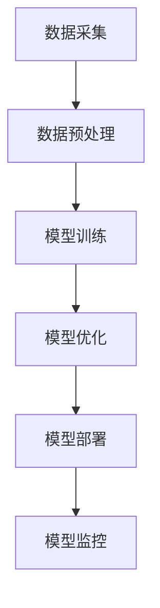
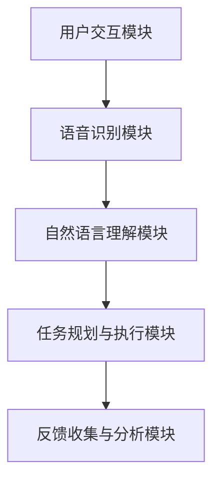

                 

# 基于AI大模型的个人助理产品开发

## 关键词

- AI大模型
- 个人助理产品
- 语音识别
- 自然语言理解
- 系统设计
- 算法实现
- 商业模式
- 市场策略
- 用户体验
- 功能优化

## 摘要

本文将探讨基于AI大模型的个人助理产品开发。首先，我们将介绍AI大模型的基本概念和技术基础，包括数据采集、预处理、模型训练、优化和部署等环节。接着，我们将探讨个人助理产品的定义、功能模块以及其与AI大模型的紧密联系。随后，我们将深入分析语音识别和自然语言理解算法的原理，包括数学模型和伪代码的详细讲解。然后，我们将描述个人助理产品的架构设计和系统开发与部署策略。在核心算法实现部分，我们将展示语音识别和自然语言理解的代码实现及解读。接着，我们将讨论产品优化和迭代的策略，包括用户反馈分析和功能完善。随后，我们将分析个人助理产品的商业模式和市场策略，并提供成功案例研究。最后，我们将展望个人助理产品的未来发展趋势和社会影响，以及应对挑战的策略。

---

## 第一部分：AI大模型与个人助理产品概述

### 第1章：AI大模型技术基础

#### 1.1 AI大模型概述

##### 1.1.1 AI大模型的核心概念

AI大模型是近年来人工智能领域的一项重大突破，它们在处理复杂数据和任务方面展现出卓越的性能。AI大模型的核心概念包括数据采集、数据预处理、模型训练、模型优化和模型部署等环节。

**Mermaid流程图：** AI大模型技术架构


- **数据采集**：AI大模型首先需要大量的高质量数据来训练模型。数据可以来源于互联网、数据库、传感器等多种渠道。
- **数据预处理**：收集到的数据需要进行清洗、去噪、标准化等预处理操作，以确保数据的质量和一致性。
- **模型训练**：在预处理后的数据集上，通过训练算法（如深度学习）来训练模型，使其能够学会从数据中提取特征和模式。
- **模型优化**：训练好的模型需要不断地优化，以提高其性能和准确度。优化方法包括调整模型结构、参数调优和超参数调整等。
- **模型部署**：将训练好的模型部署到实际应用环境中，使其能够处理实际任务。
- **模型监控**：部署后的模型需要定期监控其性能和稳定性，以便及时发现和解决问题。

##### 1.1.2 AI大模型的关键技术

AI大模型的关键技术包括自监督预训练、生成对抗网络（GAN）、强化学习等。以下是自监督预训练算法的伪代码：

**伪代码：** 自监督预训练算法
```python
def self_supervised_pretraining(data, model, optimizer):
    for epoch in range(num_epochs):
        for x, y in data:
            optimizer.zero_grad()
            output = model(x)
            loss = loss_function(output, y)
            loss.backward()
            optimizer.step()
    return model
```

自监督预训练是一种不需要标注数据的预训练方法，它通过预测数据中的某些部分来学习数据中的特征。这种预训练方法在自然语言处理、计算机视觉等领域取得了显著的效果。

#### 1.2 个人助理产品概述

##### 1.2.1 个人助理产品的定义

个人助理产品是一种基于人工智能技术的智能助手，它能够帮助用户完成各种任务，如日程管理、任务提醒、信息查询等。个人助理产品通过语音识别、自然语言理解和任务规划等技术实现智能交互和任务执行。

##### 1.2.2 个人助理产品的功能模块

个人助理产品的功能模块通常包括用户交互模块、语音识别模块、自然语言理解模块、任务规划与执行模块、反馈收集与分析模块等。

**Mermaid流程图：** 个人助理产品架构


- **用户交互模块**：负责接收用户的语音或文本输入，并将其传递给后续模块。
- **语音识别模块**：将用户的语音输入转换为文本输入，以便后续的自然语言理解模块处理。
- **自然语言理解模块**：理解用户的意图和需求，并根据这些信息生成相应的任务指令。
- **任务规划与执行模块**：根据自然语言理解模块生成的任务指令，规划任务的执行步骤，并执行相应的操作。
- **反馈收集与分析模块**：收集用户对任务执行结果的反馈，并对这些反馈进行分析，以便优化产品的功能和服务。

### 第2章：数学模型与算法原理

#### 2.1 语音识别算法原理

语音识别算法是将语音信号转换为文本数据的过程。语音识别算法的基本原理包括语音信号处理、声学模型和语言模型。

##### 2.1.1 语音信号处理

语音信号处理是语音识别算法的第一步，它涉及将语音信号转换为适用于后续处理的特征表示。常用的语音信号处理方法包括短时傅里叶变换（STFT）和梅尔频率倒谱系数（MFCC）。

**伪代码：** MFCC特征提取
```python
def extract_mfcc(signal, sample_rate):
    spectrogram = get_spectrogram(signal, sample_rate)
    return mfcc(spectrogram)
```

MFCC特征提取过程主要包括以下步骤：

1. 对语音信号进行短时傅里叶变换（STFT），得到频谱图。
2. 对频谱图进行梅尔频率倒谱变换（MFCC），得到MFCC特征向量。

##### 2.1.2 声学模型

声学模型是语音识别算法的核心部分，它负责将MFCC特征向量映射到可能的语音序列。常用的声学模型包括高斯混合模型（GMM）和隐马尔可夫模型（HMM）。

**数学公式：** HMM状态转移概率
$$
P(X_t | H_t = i) = \frac{P(H_t = i) \times P(X_t | H_t = i)}{\sum_{j} P(H_t = j) \times P(X_t | H_t = j)}
$$

声学模型通过以下参数描述语音序列的概率：

1. **初始状态概率**：表示每个状态在序列开始时的概率。
2. **状态转移概率**：表示在给定当前状态的情况下，转移到下一个状态的概率。
3. **输出概率**：表示在给定当前状态和下一个状态的情况下，产生某个语音特征的概率。

##### 2.1.3 语言模型

语言模型是语音识别算法的另一个核心部分，它负责对可能的语音序列进行排序，以确定最可能的语音序列。常用的语言模型包括n元语法模型和基于神经网络的语言模型。

**数学公式：** n元语法模型
$$
P(w_1, w_2, \ldots, w_n) = \frac{C(w_1, w_2, \ldots, w_n)}{C(w_1, w_2, \ldots, w_{n-1})}
$$

其中，$C(w_1, w_2, \ldots, w_n)$ 表示单词序列 $w_1, w_2, \ldots, w_n$ 在训练数据中出现的次数。

#### 2.2 自然语言理解算法原理

自然语言理解（NLU）算法是个人助理产品中至关重要的部分，它负责解析用户的自然语言输入，并提取出其中的意图和实体信息。NLU算法主要包括词向量表示、语法分析和语义分析等步骤。

##### 2.2.1 词向量表示

词向量表示是将自然语言中的单词转换为向量表示的过程。常用的词向量表示方法包括Word2Vec和GloVe。

**数学公式：** Word2Vec训练过程
$$
\triangledown J(w) \approx \sum_{x \in X} \frac{1}{z(w, x)} \cdot \frac{\partial z(w, x)}{\partial w} \cdot \text{target}_{x}
$$

其中，$z(w, x)$ 表示单词 $w$ 和单词 $x$ 之间的相似度，$\text{target}_{x}$ 表示单词 $x$ 的目标分布。

##### 2.2.2 问答系统设计

问答系统是NLU算法的一个典型应用，它负责根据用户的问题生成相应的答案。问答系统通常基于知识图谱和神经网络模型。

**伪代码：** 知识图谱查询
```python
def query_knowledge_graph(question):
    question_embedding = embed(question)
    similar_entities = find_similar_entities(question_embedding)
    answer = get_answer_from_entities(similar_entities)
    return answer
```

问答系统的工作流程如下：

1. 对用户的问题进行嵌入，生成问题嵌入向量。
2. 在知识图谱中查找与问题嵌入向量相似的知识实体。
3. 根据找到的知识实体，生成相应的答案。

### 第3章：个人助理产品架构与系统设计

#### 3.1 产品架构设计

个人助理产品的架构设计是确保产品功能完整、性能优异、用户体验良好的关键。产品架构通常包括用户交互模块、语音识别模块、自然语言理解模块、任务规划与执行模块和反馈收集与分析模块。

**Mermaid流程图：** 个人助理产品架构


- **用户交互模块**：负责接收用户的语音或文本输入，并将其传递给后续模块。
- **语音识别模块**：将用户的语音输入转换为文本输入，以便后续的自然语言理解模块处理。
- **自然语言理解模块**：理解用户的意图和需求，并根据这些信息生成相应的任务指令。
- **任务规划与执行模块**：根据自然语言理解模块生成的任务指令，规划任务的执行步骤，并执行相应的操作。
- **反馈收集与分析模块**：收集用户对任务执行结果的反馈，并对这些反馈进行分析，以便优化产品的功能和服务。

#### 3.2 系统开发与部署

个人助理产品的系统开发与部署是产品实现的关键环节。系统开发主要包括模块开发、接口设计和系统集成等步骤。

**伪代码：** 系统接口设计
```python
class AssistantAPI:
    def recognize_speech(self, audio):
        # 语音识别逻辑
        pass

    def understand_language(self, text):
        # 自然语言理解逻辑
        pass

    def plan_and_execute_task(self, task):
        # 任务规划与执行逻辑
        pass

    def analyze_feedback(self, feedback):
        # 反馈分析逻辑
        pass
```

系统集成是将各个模块接口连接起来，实现整体功能的过程。系统集成完成后，需要进行系统测试和部署。

**伪代码：** 部署流程
```python
function deploy_model(model, endpoint):
    # 部署模型到服务器
    model.save(endpoint)
    # 启动服务
    server.start()
```

#### 3.3 系统监控与维护

个人助理产品在运行过程中需要实时监控系统的性能和稳定性。系统监控主要包括模型性能监控、系统资源监控和用户反馈监控等。

**伪代码：** 系统监控流程
```python
function monitor_system(model, server, feedback):
    # 模型性能监控
    model_performance = evaluate_model(model)
    # 系统资源监控
    system_resources = monitor_resources(server)
    # 用户反馈监控
    user_feedback = collect_feedback(feedback)
    # 处理监控结果
    handle_monitor_results(model_performance, system_resources, user_feedback)
```

### 第4章：核心算法实现与优化

#### 4.1 语音识别算法实现

语音识别算法是实现个人助理产品语音交互功能的核心部分。语音识别算法的实现主要包括声学模型和语言模型的训练和部署。

**伪代码：** 声学模型训练
```python
def train_acoustic_model(data, model):
    # 数据预处理
    preprocessed_data = preprocess_data(data)
    # 模型训练
    model.fit(preprocessed_data, epochs=num_epochs)
    # 模型保存
    model.save('acoustic_model.h5')
    return model
```

**伪代码：** 语言模型训练
```python
def train_language_model(data, model):
    # 数据预处理
    preprocessed_data = preprocess_data(data)
    # 模型训练
    model.fit(preprocessed_data, epochs=num_epochs)
    # 模型保存
    model.save('language_model.h5')
    return model
```

#### 4.2 自然语言理解算法实现

自然语言理解算法是实现个人助理产品理解用户指令和理解自然语言的核心。自然语言理解算法的实现主要包括词向量表示、语法分析和语义分析。

**伪代码：** 词向量表示
```python
def train_word2vec(data, model):
    # 数据预处理
    preprocessed_data = preprocess_data(data)
    # 模型训练
    model.fit(preprocessed_data, epochs=num_epochs)
    # 模型保存
    model.save('word2vec_model.h5')
    return model
```

**伪代码：** 语法分析
```python
def parse_sentence(sentence, model):
    # 句子预处理
    preprocessed_sentence = preprocess_sentence(sentence)
    # 语法分析
    parsed_sentence = model.parse(preprocessed_sentence)
    return parsed_sentence
```

**伪代码：** 语义分析
```python
def analyze_sentence(sentence, model):
    # 句子预处理
    preprocessed_sentence = preprocess_sentence(sentence)
    # 语义分析
    intent, entities = model.analyze(preprocessed_sentence)
    return intent, entities
```

### 第5章：个人助理产品优化与迭代

#### 5.1 用户反馈分析

用户反馈分析是优化个人助理产品的重要环节。通过分析用户反馈，可以发现产品的优点和不足，为产品的改进提供依据。

**伪代码：** 用户反馈收集与分析
```python
def collect_and_analyze_feedback(feedback_data):
    # 收集用户反馈
    feedbacks = load_feedback_data(feedback_data)
    # 分析反馈数据
    feedback_analysis = analyze_feedbacks(feedbacks)
    # 提取改进建议
    improvement_suggestions = extract_suggestions(feedback_analysis)
    return improvement_suggestions
```

#### 5.2 产品迭代与优化

产品迭代与优化是个人助理产品不断进步的关键。通过迭代和优化，可以不断提升产品的功能、性能和用户体验。

**伪代码：** 产品迭代与优化流程
```python
def iterate_and_optimize_product(product_version, improvement_suggestions):
    # 更新产品版本
    updated_product = update_product_version(product_version, improvement_suggestions)
    # 部署更新版本
    deploy_updated_product(updated_product)
    # 收集新版本的用户反馈
    new_feedback = collect_new_feedback(updated_product)
    # 重复迭代过程
    iterate_and_optimize_product(updated_product, new_feedback)
```

### 第6章：个人助理产品的商业化与市场策略

#### 6.1 商业模式分析

个人助理产品的商业模式主要包括订阅制、广告分成和企业合作定制等。

- **订阅制**：用户通过订阅服务来使用个人助理产品，订阅费用可以作为主要收入来源。
- **广告分成**：个人助理产品可以整合广告服务，通过展示广告来获得收入。
- **企业合作定制**：为特定企业定制个人助理产品，为企业提供定制化的服务，获得服务费用。

#### 6.2 市场推广策略

个人助理产品的市场推广策略主要包括品牌建设、合作伙伴关系建立和线上线下的推广活动。

- **品牌建设**：通过官方网站、社交媒体和线下活动来提升品牌知名度。
- **合作伙伴关系建立**：与硬件制造商、软件开发商和服务提供商建立合作关系，共同推广产品。
- **线上线下的推广活动**：通过线上广告投放、线下展会和活动来吸引用户关注和使用产品。

### 第7章：案例研究

#### 7.1 智能家居助理产品案例

智能家居助理产品是一种将个人助理技术与智能家居系统相结合的产品。该产品的核心功能包括家居设备控制、日程管理、智能提醒等。

**案例关键点：**

- **产品功能**：家居设备控制、日程管理、智能提醒等。
- **技术实现**：语音识别、自然语言理解、智能家居控制协议等。
- **商业模式**：订阅制和广告分成。
- **用户反馈**：用户对智能家居助理产品的评价较高，认为它大大提高了生活质量。

#### 7.2 企业级助理产品案例

企业级助理产品是一种为企业员工提供个性化服务的个人助理产品。该产品的核心功能包括日程管理、任务提醒、文档搜索等。

**案例关键点：**

- **产品特点**：个性化服务、多平台支持、集成企业应用等。
- **技术优势**：高效的自然语言理解、强大的任务规划与执行能力等。
- **商业成功因素**：为企业员工提供高效的工作辅助，提高工作效率，获得企业客户的认可。
- **用户评价**：企业员工对产品评价较高，认为它极大地提高了工作效率和生活质量。

### 第8章：未来展望

#### 8.1 技术发展趋势

随着人工智能技术的不断发展，个人助理产品的技术趋势将包括以下几个方面：

- **大数据与人工智能的结合**：通过大数据分析，为个人助理产品提供更准确的个性化服务。
- **新型AI大模型的发展**：生成对抗网络（GAN）、强化学习模型、自适应学习模型等新型AI大模型将进一步提升个人助理产品的能力。
- **多模态交互**：结合语音、文本、图像等多种交互方式，为用户提供更便捷的交互体验。

#### 8.2 个人助理产品的未来

个人助理产品的未来将包括以下几个方面：

- **智能家居领域**：个人助理产品将在智能家居领域发挥更大的作用，为用户提供更智能化的家居控制体验。
- **企业级应用**：个人助理产品将在企业级应用中发挥重要作用，为企业员工提供更高效的工作辅助。
- **个性化服务**：通过不断优化算法和模型，个人助理产品将提供更加个性化的服务，满足用户的不同需求。

#### 8.3 社会影响与挑战

个人助理产品的发展将对社会产生深远的影响，同时也将面临一系列挑战：

- **隐私保护**：个人助理产品将收集大量的用户数据，如何保护用户隐私将成为重要议题。
- **伦理道德**：个人助理产品的智能决策可能涉及伦理道德问题，如何制定相应的伦理规范将成为挑战。
- **法律法规**：随着个人助理产品的普及，需要制定相应的法律法规来规范其使用和行为。

### 结论

本文系统地介绍了基于AI大模型的个人助理产品开发。通过对AI大模型技术基础、个人助理产品概述、数学模型与算法原理、产品架构与系统设计、核心算法实现与优化、商业化与市场策略、案例研究和未来展望等方面的详细探讨，我们为读者提供了全面、系统的个人助理产品开发指南。随着人工智能技术的不断进步，个人助理产品将越来越智能，为我们的生活和工作带来更多的便利和效率。同时，我们也需要关注其社会影响和挑战，确保其在安全、合法和道德的框架内发展。

