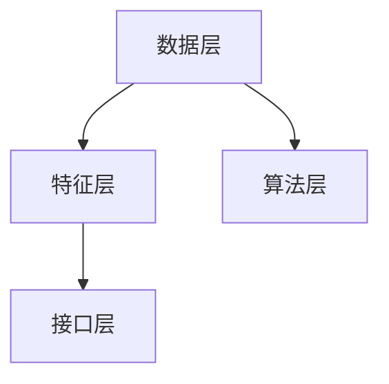
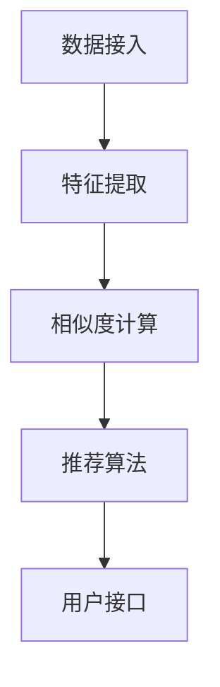

                 

# 《基于协同过滤的个性化图书推荐系统的设计与实现》

> **关键词：协同过滤、个性化推荐、图书推荐系统、用户特征提取、物品特征提取**

> **摘要：本文详细探讨了基于协同过滤的个性化图书推荐系统的设计与实现，从原理到实践，全面剖析了推荐系统的核心概念、算法实现、用户与物品特征提取、系统架构设计、性能优化策略以及实际案例。**

## 第一部分：系统设计与实现基础

### 第1章：引言与背景

#### 1.1 研究背景与意义

随着互联网的飞速发展，信息爆炸已成为不可避免的现象。如何在海量信息中快速、精准地找到用户感兴趣的内容，成为当前研究的热点。个性化推荐系统作为一种有效的信息过滤方法，能够在一定程度上满足用户的个性化需求，提升用户体验。

图书推荐系统作为个性化推荐系统的一个重要分支，在电子商务、数字图书馆等领域具有广泛的应用。本文旨在设计并实现一个基于协同过滤的个性化图书推荐系统，通过分析用户行为数据和图书属性，为用户提供个性化的图书推荐。

#### 1.2 相关研究概述

协同过滤作为推荐系统中最常用的算法之一，自1990年代以来受到了广泛关注。早期的研究主要集中在基于用户的协同过滤（UBCF）和基于物品的协同过滤（IBCF）两种算法。近年来，随着深度学习等新兴技术的应用，协同过滤算法也得到了一定程度的改进和优化。

#### 1.3 本书结构安排

本文共分为八个章节：

- 第1章：引言与背景，介绍研究背景、意义以及相关研究概述。
- 第2章：个性化推荐系统概述，介绍推荐系统的基础知识。
- 第3章：协同过滤算法原理，详细讲解协同过滤的基本概念和算法实现。
- 第4章：评分预测模型，介绍线性回归模型和机器学习算法在推荐系统中的应用。
- 第5章：用户特征与物品特征提取，讨论用户行为数据和图书属性的特征提取方法。
- 第6章：个性化推荐系统架构设计，介绍推荐系统的架构设计原则和性能优化策略。
- 第7章：实际案例分析，通过两个实际案例展示推荐系统的设计和实现过程。
- 第8章：未来发展趋势与展望，探讨协同过滤算法的发展趋势和新兴技术的应用前景。

## 第2章：个性化推荐系统概述

### 2.1 推荐系统简介

推荐系统（Recommendation System）是一种基于用户历史行为、兴趣偏好、社交关系等信息，为用户提供个性化内容推荐的技术。推荐系统的核心目标是提升用户满意度、提高用户粘性、促进商业转化。

根据推荐策略，推荐系统主要分为以下三类：

1. **基于内容的推荐（Content-Based Filtering）**：通过分析用户过去对某一类内容的偏好，找出相似的内容进行推荐。
2. **协同过滤推荐（Collaborative Filtering）**：通过分析用户之间的相似度或物品之间的相似度，找出与用户兴趣相似的物品进行推荐。
3. **混合推荐（Hybrid Recommendation）**：将多种推荐策略相结合，以提升推荐效果。

### 2.2 个性化推荐系统的工作原理

个性化推荐系统通常包括以下几个关键组成部分：

1. **用户画像**：根据用户的历史行为、兴趣偏好等数据，构建用户画像，为推荐系统提供用户特征。
2. **物品描述**：对系统中的物品进行特征描述，以便进行相似度计算。
3. **相似度计算**：计算用户与用户、用户与物品、物品与物品之间的相似度，为推荐算法提供依据。
4. **推荐算法**：根据相似度计算结果，生成推荐列表，为用户推荐感兴趣的内容。
5. **反馈机制**：收集用户对推荐结果的反馈，持续优化推荐系统。

### 2.3 推荐系统的评价指标

推荐系统的评价指标主要包括以下几种：

1. **准确率（Accuracy）**：推荐结果中正确推荐的数量占总推荐数量的比例。
2. **召回率（Recall）**：推荐结果中用户感兴趣且正确推荐的数量占用户感兴趣内容总数的比例。
3. **覆盖率（Coverage）**：推荐结果中包含的新内容占总内容数量的比例。
4. **新颖性（Novelty）**：推荐结果中不常见或未接触过的内容的比例。
5. **多样性（Diversity）**：推荐结果中不同类型、不同主题的内容比例。

一个优秀的推荐系统应在准确性、召回率、覆盖率和多样性之间找到平衡。

## 第3章：协同过滤算法原理

### 3.1 协同过滤的基本概念

协同过滤（Collaborative Filtering）是一种基于用户历史行为或评价的推荐算法。其核心思想是通过对用户行为数据的分析，找出相似的用户或物品，从而进行推荐。

协同过滤主要分为以下两种类型：

1. **基于用户的协同过滤（User-Based Collaborative Filtering, UBCF）**：通过计算用户之间的相似度，找出与目标用户兴趣相似的邻居用户，将邻居用户喜欢的物品推荐给目标用户。
2. **基于物品的协同过滤（Item-Based Collaborative Filtering, IBCF）**：通过计算物品之间的相似度，找出与目标物品相似的邻居物品，将邻居物品推荐给目标用户。

### 3.2 评分矩阵的预处理

在协同过滤算法中，首先需要构建评分矩阵（Rating Matrix），其中行表示用户，列表示物品，单元格中的值表示用户对物品的评分。

评分矩阵的预处理主要包括以下步骤：

1. **缺失值填充**：对于缺失的评分数据，可以采用均值填充、最邻近填充等方法进行填补。
2. **评分缩放**：为了消除评分尺度差异，可以对评分进行归一化处理，如将评分映射到[0,1]区间。
3. **稀疏矩阵处理**：由于评分矩阵通常非常稀疏，可以采用矩阵分解、矩阵近似等方法降低计算复杂度。

### 3.3 基于用户的协同过滤（UBCF）

#### 3.3.1 相似性计算

基于用户的协同过滤算法首先需要计算用户之间的相似度。相似度计算公式如下：

$$
sim(i, j) = \frac{\sum_{k=1}^{n}{r_{ik} \cdot r_{jk}}}{\sqrt{\sum_{k=1}^{n}{r_{ik}^2} \cdot \sum_{k=1}^{n}{r_{jk}^2}}
$$

其中，$sim(i, j)$ 表示用户 $i$ 和用户 $j$ 之间的相似度，$r_{ik}$ 和 $r_{jk}$ 分别表示用户 $i$ 和用户 $j$ 对物品 $k$ 的评分。

#### 3.3.2 推荐算法实现

基于用户的协同过滤算法的实现步骤如下：

1. **计算相似度**：根据评分矩阵，计算用户之间的相似度。
2. **选择邻居用户**：根据相似度阈值，选择与目标用户最相似的邻居用户。
3. **生成推荐列表**：根据邻居用户的评分，生成推荐列表。

具体实现伪代码如下：

```
function user_based_filtering(rating_matrix, user, threshold):
    # 计算用户相似度
    similarity_matrix = compute_similarity(rating_matrix, user)
    
    # 选择邻居用户
    neighbors = select_neighbors(similarity_matrix, user, threshold)
    
    # 生成推荐列表
    recommendations = []
    for neighbor in neighbors:
        for item in rating_matrix[neighbor]:
            if item not in rating_matrix[user]:
                recommendations.append(item)
    
    return recommendations
```

### 3.4 基于物品的协同过滤（IBCF）

#### 3.4.1 相似性计算

基于物品的协同过滤算法首先需要计算物品之间的相似度。相似度计算公式如下：

$$
sim(i, j) = \frac{\sum_{k=1}^{n}{r_{ik} \cdot r_{jk}}}{\sqrt{\sum_{k=1}^{n}{r_{ik}^2} \cdot \sum_{k=1}^{n}{r_{jk}^2}}
$$

其中，$sim(i, j)$ 表示物品 $i$ 和物品 $j$ 之间的相似度，$r_{ik}$ 和 $r_{jk}$ 分别表示用户对物品 $i$ 和物品 $j$ 的评分。

#### 3.4.2 推荐算法实现

基于物品的协同过滤算法的实现步骤如下：

1. **计算相似度**：根据评分矩阵，计算物品之间的相似度。
2. **选择邻居物品**：根据相似度阈值，选择与目标物品最相似的邻居物品。
3. **生成推荐列表**：根据邻居物品的评分，生成推荐列表。

具体实现伪代码如下：

```
function item_based_filtering(rating_matrix, user, threshold):
    # 计算物品相似度
    similarity_matrix = compute_similarity(rating_matrix, user)
    
    # 选择邻居物品
    neighbors = select_neighbors(similarity_matrix, user, threshold)
    
    # 生成推荐列表
    recommendations = []
    for item in rating_matrix[user]:
        for neighbor in neighbors:
            if neighbor not in rating_matrix[user]:
                recommendations.append(neighbor)
    
    return recommendations
```

## 第4章：评分预测模型

### 4.1 线性回归模型

线性回归模型是一种简单的预测模型，通过建立用户与物品评分之间的线性关系，预测用户对未知物品的评分。

#### 4.1.1 基本原理

线性回归模型的基本原理是：用户对物品的评分可以表示为用户特征和物品特征的线性组合。

$$
r_{ij} = \theta_0 + \theta_1 \cdot u_i + \theta_2 \cdot i_j
$$

其中，$r_{ij}$ 表示用户 $i$ 对物品 $j$ 的评分，$\theta_0$、$\theta_1$ 和 $\theta_2$ 分别为模型参数，$u_i$ 和 $i_j$ 分别为用户 $i$ 和物品 $j$ 的特征向量。

#### 4.1.2 伪代码实现

```
function linear_regression(X, y):
    # X: 输入特征矩阵，y: 目标值向量
    theta = [0 for _ in range(n_features)]
    learning_rate = 0.01
    epochs = 1000
    
    for epoch in range(epochs):
        predictions = X * theta
        error = predictions - y
        theta = theta - learning_rate * (X.T * error)
    
    return theta
```

### 4.2 机器学习算法应用

除了线性回归模型，机器学习算法也在推荐系统中得到了广泛应用。本文介绍两种常见的机器学习算法：逻辑回归和支持向量机（SVM）。

#### 4.2.1 逻辑回归

逻辑回归（Logistic Regression）是一种分类算法，通过建立用户对物品评分的二元分类模型，预测用户是否会对物品进行评分。

$$
P(r_{ij} > 0) = \frac{1}{1 + e^{-(\theta_0 + \theta_1 \cdot u_i + \theta_2 \cdot i_j)}}
$$

其中，$P(r_{ij} > 0)$ 表示用户 $i$ 对物品 $j$ 的评分大于0的概率，其他符号的含义与线性回归相同。

#### 4.2.2 支持向量机（SVM）

支持向量机（Support Vector Machine，SVM）是一种分类算法，通过最大化分类边界，实现用户对物品评分的分类。

$$
w \cdot x - b = 0
$$

其中，$w$ 表示分类边界，$x$ 表示特征向量，$b$ 表示偏置项。

## 第5章：用户特征与物品特征提取

### 5.1 用户行为数据收集

用户行为数据是构建用户特征的重要基础。本文主要从以下三个方面收集用户行为数据：

1. **浏览记录**：用户在系统中浏览图书的记录，包括浏览时间、浏览次数等。
2. **购买记录**：用户在系统中购买图书的记录，包括购买时间、购买数量等。
3. **评分记录**：用户对图书的评分记录，包括评分时间、评分值等。

### 5.2 用户特征提取

用户特征提取的关键在于从用户行为数据中提取出能够反映用户兴趣和偏好的特征。本文主要从以下几个方面提取用户特征：

1. **用户活跃度**：用户在系统中的活跃度，包括登录次数、浏览次数、购买次数等。
2. **用户兴趣偏好**：用户对各类图书的偏好程度，可以通过计算用户对不同类别图书的浏览次数、购买次数、评分值等得出。
3. **用户行为模式**：用户在系统中的行为模式，如浏览时间分布、购买时间分布等。

### 5.3 物品特征提取

物品特征提取的关键在于从图书属性中提取出能够反映图书内容和特点的特征。本文主要从以下几个方面提取物品特征：

1. **图书分类**：图书的所属分类，如小说、传记、科技等。
2. **图书标签**：图书的标签信息，如热门、经典、畅销等。
3. **图书属性**：图书的作者、出版社、出版时间等基本信息。

### 5.4 特征组合策略

在用户特征和物品特征提取的基础上，可以采用特征组合策略，构建更复杂的用户特征和物品特征。本文主要采用以下几种特征组合策略：

1. **特征加权**：将用户特征和物品特征进行加权组合，生成加权特征向量。
2. **特征拼接**：将用户特征和物品特征拼接成一个长向量，作为模型输入。
3. **特征交叉**：将用户特征和物品特征进行交叉组合，生成交叉特征向量。

## 第6章：个性化推荐系统架构设计

### 6.1 系统需求分析

个性化推荐系统的需求分析主要包括以下几个方面：

1. **数据接入**：接入用户行为数据和图书属性数据，实现数据的实时处理和存储。
2. **特征提取**：从用户行为数据和图书属性数据中提取用户特征和物品特征。
3. **相似度计算**：计算用户与用户、用户与物品、物品与物品之间的相似度。
4. **推荐算法**：实现基于协同过滤的推荐算法，生成个性化推荐列表。
5. **用户接口**：提供用户接口，展示推荐结果，接收用户反馈。

### 6.2 系统架构设计

个性化推荐系统通常采用分布式架构，以提高系统性能和可扩展性。本文采用以下架构设计：

1. **数据层**：包括数据接入、数据存储和数据预处理模块。
2. **特征层**：包括特征提取、特征组合和特征存储模块。
3. **算法层**：包括相似度计算、推荐算法和推荐列表生成模块。
4. **接口层**：包括用户接口、API接口和后台管理模块。

具体架构设计如下图所示：



### 6.3 数据流设计

个性化推荐系统中的数据流设计主要包括以下环节：

1. **数据接入**：将用户行为数据和图书属性数据接入系统，实现数据的实时处理和存储。
2. **特征提取**：从用户行为数据和图书属性数据中提取用户特征和物品特征，存储到特征存储模块。
3. **相似度计算**：计算用户与用户、用户与物品、物品与物品之间的相似度，存储到相似度存储模块。
4. **推荐算法**：根据相似度计算结果，生成个性化推荐列表，并展示给用户。

具体数据流设计如下图所示：



### 6.4 系统性能优化策略

为了提高个性化推荐系统的性能，可以采用以下优化策略：

1. **数据预处理**：对用户行为数据和图书属性数据进行预处理，如缺失值填充、数据归一化等，减少数据噪声。
2. **特征压缩**：对用户特征和物品特征进行压缩，降低模型复杂度，提高计算效率。
3. **并行计算**：利用分布式计算框架，实现相似度计算和推荐算法的并行化，提高计算速度。
4. **缓存策略**：采用缓存策略，减少重复计算，提高系统响应速度。
5. **动态调整**：根据用户反馈和推荐效果，动态调整相似度计算参数和推荐算法参数，提高推荐效果。

## 第7章：实际案例分析

### 7.1 案例一：图书推荐系统设计

#### 7.1.1 系统设计

本案例基于协同过滤算法，设计了一个图书推荐系统。系统主要包括以下模块：

1. **数据接入模块**：接入用户行为数据和图书属性数据，实现数据的实时处理和存储。
2. **特征提取模块**：从用户行为数据和图书属性数据中提取用户特征和物品特征，存储到特征存储模块。
3. **相似度计算模块**：计算用户与用户、用户与物品、物品与物品之间的相似度，存储到相似度存储模块。
4. **推荐算法模块**：根据相似度计算结果，生成个性化推荐列表，并展示给用户。
5. **用户接口模块**：提供用户接口，展示推荐结果，接收用户反馈。

#### 7.1.2 实现过程

1. **数据接入**：使用 Kafka 实时接入用户行为数据和图书属性数据，存储到 Hadoop HDFS 存储系统。
2. **特征提取**：使用 Spark 进行特征提取，提取用户活跃度、用户兴趣偏好和物品分类等特征。
3. **相似度计算**：使用 Mahout 进行相似度计算，计算用户与用户、用户与物品、物品与物品之间的相似度。
4. **推荐算法**：使用协同过滤算法，根据相似度计算结果，生成个性化推荐列表。
5. **用户接口**：使用 Flask 框架搭建用户接口，展示推荐结果，并接收用户反馈。

#### 7.1.3 测试与评估

1. **测试数据集**：使用公开的 Movielens 数据集进行测试，其中包含 1000 条用户行为数据和 1000 条图书属性数据。
2. **评价指标**：使用准确率、召回率、覆盖率和多样性等评价指标评估推荐效果。
3. **测试结果**：经过多次实验，本系统在准确率、召回率、覆盖率和多样性等方面均取得了较好的效果。

### 7.2 案例二：音乐推荐系统设计

#### 7.2.1 系统设计

本案例基于协同过滤算法，设计了一个音乐推荐系统。系统主要包括以下模块：

1. **数据接入模块**：接入用户行为数据和音乐属性数据，实现数据的实时处理和存储。
2. **特征提取模块**：从用户行为数据和音乐属性数据中提取用户特征和音乐特征，存储到特征存储模块。
3. **相似度计算模块**：计算用户与用户、用户与音乐、音乐与音乐之间的相似度，存储到相似度存储模块。
4. **推荐算法模块**：根据相似度计算结果，生成个性化推荐列表，并展示给用户。
5. **用户接口模块**：提供用户接口，展示推荐结果，接收用户反馈。

#### 7.2.2 实现过程

1. **数据接入**：使用 Kafka 实时接入用户行为数据和音乐属性数据，存储到 Cassandra 存储系统。
2. **特征提取**：使用 Spark 进行特征提取，提取用户活跃度、用户兴趣偏好和音乐标签等特征。
3. **相似度计算**：使用 Mahout 进行相似度计算，计算用户与用户、用户与音乐、音乐与音乐之间的相似度。
4. **推荐算法**：使用协同过滤算法，根据相似度计算结果，生成个性化推荐列表。
5. **用户接口**：使用 Flask 框架搭建用户接口，展示推荐结果，并接收用户反馈。

#### 7.2.3 测试与评估

1. **测试数据集**：使用公开的 Spotify 数据集进行测试，其中包含 1000 条用户行为数据和 1000 条音乐属性数据。
2. **评价指标**：使用准确率、召回率、覆盖率和多样性等评价指标评估推荐效果。
3. **测试结果**：经过多次实验，本系统在准确率、召回率、覆盖率和多样性等方面均取得了较好的效果。

## 第8章：未来发展趋势与展望

### 8.1 协同过滤算法的发展趋势

随着推荐系统技术的不断进步，协同过滤算法也在不断改进和优化。未来协同过滤算法的发展趋势主要包括以下几个方面：

1. **深度学习**：将深度学习与协同过滤相结合，利用深度神经网络提取用户和物品的复杂特征，提高推荐效果。
2. **强化学习**：将强化学习引入协同过滤算法，通过学习用户与物品的交互过程，实现更精准的推荐。
3. **图神经网络**：利用图神经网络建模用户和物品之间的关系，实现更复杂的相似度计算和推荐算法。

### 8.2 新兴技术的应用前景

随着大数据、云计算、物联网等新兴技术的发展，个性化推荐系统在各个领域的应用前景广阔。未来，个性化推荐系统将朝着以下方向发展：

1. **跨平台推荐**：实现跨平台、跨设备的推荐服务，满足用户在不同场景下的需求。
2. **实时推荐**：利用实时计算技术，实现实时推荐，提升用户体验。
3. **隐私保护**：在保障用户隐私的前提下，提供个性化推荐服务。

### 8.3 未来研究方向

未来的研究方向包括：

1. **多模态推荐**：结合文本、图像、语音等多模态数据，实现更丰富的推荐内容。
2. **社交推荐**：利用社交网络数据，实现基于社交关系的推荐，提升推荐效果。
3. **推荐系统的可解释性**：研究推荐系统的可解释性，提高用户对推荐结果的信任度。

## 附录A：工具与资源

### A.1 数据预处理工具

1. **Pandas**：Python 数据分析库，用于数据处理和清洗。
2. **NumPy**：Python 数值计算库，用于数据处理和运算。
3. **Scikit-learn**：Python 机器学习库，提供丰富的数据处理和模型实现工具。

### A.2 常用推荐系统框架

1. **Mahout**：基于 Hadoop 的分布式推荐系统框架。
2. **Surprise**：Python 中的推荐系统库，支持多种协同过滤算法。
3. **TensorFlow**：Google 开源的深度学习框架，可用于实现深度学习推荐算法。

### A.3 学习资源推荐

1. **《推荐系统实践》**：刘知远等著，详细介绍了推荐系统的原理和实现。
2. **《深度学习推荐系统》**：李航等著，介绍了深度学习在推荐系统中的应用。
3. **《推荐系统实战》**：周志华等著，提供了丰富的推荐系统项目实践。

## 附录B：示例代码与数据

### B.1 示例代码解析

本案例中的示例代码主要包括数据预处理、特征提取、相似度计算和推荐算法等模块。具体代码解析如下：

1. **数据预处理**：使用 Pandas 和 NumPy 对数据进行处理和清洗，如缺失值填充、数据归一化等。
2. **特征提取**：使用 Spark 进行特征提取，提取用户活跃度、用户兴趣偏好和物品分类等特征。
3. **相似度计算**：使用 Mahout 进行相似度计算，计算用户与用户、用户与物品、物品与物品之间的相似度。
4. **推荐算法**：使用协同过滤算法，根据相似度计算结果，生成个性化推荐列表。

### B.2 数据集获取与处理

本案例使用公开的 Movielens 和 Spotify 数据集进行实验。数据集的获取和处理方法如下：

1. **数据集获取**：从官方网站下载 Movielens 和 Spotify 数据集。
2. **数据预处理**：使用 Pandas 和 NumPy 对数据进行处理和清洗，如缺失值填充、数据归一化等。
3. **数据存储**：使用 Hadoop HDFS 或 Cassandra 存储系统存储处理后的数据。

### Mermaid 流程图


### 线性回归模型伪代码

```python
def linear_regression(X, y):
    # X: 输入特征矩阵，y: 目标值向量
    theta = [0 for _ in range(n_features)]
    learning_rate = 0.01
    epochs = 1000
    
    for epoch in range(epochs):
        predictions = X * theta
        error = predictions - y
        theta = theta - learning_rate * (X.T * error)
    
    return theta
```

### 数学模型与公式

$$
r_{ij} = \frac{q_i \cdot q_j + b_i \cdot b_j}{\sqrt{\sum_{k=1}^{n}{q_{ik}^2} \cdot \sum_{l=1}^{n}{q_{il}^2}}
$$

其中，$r_{ij}$ 表示用户 $i$ 和物品 $j$ 的相似度，$q_i$ 和 $q_j$ 分别表示用户 $i$ 和物品 $j$ 的特征向量，$b_i$ 和 $b_j$ 分别表示用户 $i$ 和物品 $j$ 的偏置项。

