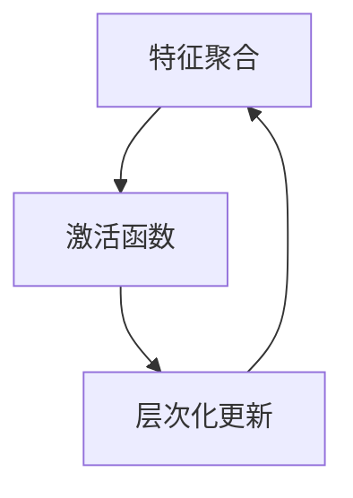
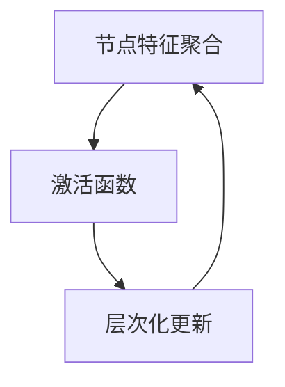

                 

# 基于图神经网络的LLM知识图谱一致性评估

## 关键词
- 图神经网络
- LLM知识图谱
- 一致性评估
- 图卷积网络
- 图注意力网络
- 知识图谱应用

## 摘要
本文将深入探讨基于图神经网络的LLM（大型语言模型）知识图谱一致性评估方法。首先，我们将介绍图神经网络和知识图谱的基础知识，并详细解释图卷积网络、图注意力网络等核心算法。接着，我们将探讨如何设计评估指标和数学模型，以评估知识图谱的一致性。文章随后将展示一个实际应用案例，详细说明开发环境搭建、代码实现和评估结果分析。最后，我们将总结知识图谱一致性评估中的挑战和未来发展方向。

### 《基于图神经网络的LLM知识图谱一致性评估》目录大纲

#### 第一部分：图神经网络与知识图谱概述

**第1章：图神经网络基础**

**1.1 图神经网络的概念与原理**
- **核心概念**：图神经网络（Graph Neural Networks, GNN）
- **原理介绍**：图神经网络如何处理图数据
- **Mermaid流程图**：GNN基本结构流程图

**1.2 知识图谱的构成与作用**
- **知识图谱的定义**
- **知识图谱的结构**：实体、关系、属性
- **知识图谱的应用**：信息检索、自然语言处理、推理与预测

**1.3 LLM知识图谱一致性评估的背景与意义**
- **背景介绍**：知识图谱不一致性的问题来源
- **意义阐述**：一致性评估对知识图谱应用的重要性

**第2章：图神经网络核心算法**

**2.1 图卷积网络（GCN）原理与实现**
- **原理介绍**：图卷积操作
- **伪代码**：GCN算法伪代码

**2.2 图注意力网络（GAT）详解**
- **原理介绍**：注意力机制在GNN中的应用
- **伪代码**：GAT算法伪代码

**2.3 图变换器网络（GTN）架构**
- **原理介绍**：GTN如何增强图数据的处理能力
- **伪代码**：GTN算法伪代码

#### 第二部分：LLM知识图谱一致性评估方法

**第3章：LLM知识图谱一致性评估指标**

**3.1 一致性评估指标分类**
- **分类介绍**：全局一致性、局部一致性、逻辑一致性

**3.2 评估指标设计**
- **设计原则**：可解释性、准确性、计算效率
- **详细讲解**：一致性分数、一致性距离、一致性比例

**3.3 数学模型与公式推导**
- **公式推导**：一致性评估的数学基础
- **示例说明**：如何使用公式计算一致性分数

**第4章：基于图神经网络的评估方法**

**4.1 GNN在知识图谱一致性评估中的应用**
- **应用介绍**：如何使用GNN评估知识图谱一致性
- **算法描述**：基于GCN的评估方法

**4.2 图注意力机制在一致性评估中的作用**
- **作用分析**：注意力机制如何提高评估精度
- **实现细节**：GAT在一致性评估中的应用

**4.3 实时评估与动态更新**
- **实时评估**：如何实现知识图谱的一致性实时评估
- **动态更新**：一致性评估的动态调整机制

**第5章：LLM知识图谱一致性评估应用案例**

**5.1 案例背景与目标**
- **背景介绍**：案例选择的背景与原因
- **评估目标**：案例中需要评估的知识图谱一致性目标

**5.2 案例实现步骤**
- **开发环境搭建**：配置开发环境与所需工具
- **代码实现**：详细代码实现步骤
- **代码解读**：对关键代码的解读与分析

**5.3 案例评估结果分析**
- **评估结果**：评估过程中的数据与结果
- **结果分析**：评估结果的深度分析与讨论

**第6章：知识图谱一致性评估的挑战与未来展望**

**6.1 评估中的挑战**
- **计算效率问题**：如何提高评估效率
- **模型泛化能力**：如何应对不同的知识图谱类型

**6.2 未来发展方向**
- **技术进展**：未来GNN与知识图谱的结合方向
- **应用前景**：知识图谱一致性评估在各个领域的潜在应用

**6.3 开放性问题与研究方向**
- **问题列举**：目前存在的主要问题
- **研究方向**：未来研究的潜在方向

#### 附录

**附录A：相关资源与进一步阅读**

**A.1 参考文献**
- **学术文献**：与本书主题相关的经典论文和报告
- **技术文档**：开源框架与工具的官方文档

**A.2 开源代码与数据集**
- **代码链接**：本书中提及的代码实现与实验数据集链接
- **数据集来源**：用于评估实验的知识图谱数据集来源说明

**A.3 实践资源**
- **在线教程**：相关主题的在线教程与课程
- **社区讨论**：参与知识图谱与GNN相关社区的途径

### 第一部分：图神经网络与知识图谱概述

#### 第1章：图神经网络基础

##### 1.1 图神经网络的概念与原理

图神经网络（Graph Neural Networks, GNN）是一种专门用于处理图数据的神经网络。在传统神经网络中，数据通常以向量或张量的形式表示，而在GNN中，数据以图的形式表示。图由节点（Node）和边（Edge）组成，节点表示数据中的实体，边表示实体之间的关系。

**核心概念**：

- **节点特征**：每个节点都有一个特征向量，用于表示节点的属性。
- **边特征**：每条边都有一个特征向量，用于表示边的关系性质。
- **图结构**：整个图的结构，包括节点和边的连接关系。

**原理介绍**：

GNN的基本原理是通过节点和边之间的相互作用来更新节点的特征。具体来说，GNN通过以下步骤处理图数据：

1. **特征聚合**：对于每个节点，聚合其邻居节点的特征，形成一个新的特征向量。
2. **激活函数**：对新的特征向量进行激活，以生成最终的节点表示。
3. **层次化更新**：通过递归方式，逐层更新所有节点的特征向量。

下面是一个简单的Mermaid流程图，展示了GNN的基本结构：



**Mermaid流程图**：



##### 1.2 知识图谱的构成与作用

知识图谱是一种用于表示实体及其关系的语义网络。它将现实世界中的各种实体和它们之间的关系抽象成图结构，使得信息检索、自然语言处理和推理等任务变得更加高效。

**知识图谱的定义**：

知识图谱是一个由实体、关系和属性构成的有向无环图（DAG）。其中：

- **实体**：知识图谱中的个体，如人、地点、组织等。
- **关系**：实体之间的关联，如“出生地”、“属于”等。
- **属性**：实体的附加信息，如“年龄”、“职位”等。

**知识图谱的结构**：

知识图谱通常包含以下三个层次的结构：

- **底层**：节点表示实体，边表示实体之间的关系。
- **中层**：节点表示实体之间的关系，边表示关系的属性。
- **顶层**：节点表示概念或类别，边表示概念之间的继承关系。

**知识图谱的应用**：

知识图谱在多个领域都有广泛的应用，包括：

- **信息检索**：通过知识图谱，可以快速定位相关实体和关系，提高搜索效率。
- **自然语言处理**：知识图谱提供了丰富的背景知识，有助于语义理解、问答系统和机器翻译等任务。
- **推理与预测**：基于知识图谱中的关系，可以推断新的实体属性或发现潜在关系。

##### 1.3 LLM知识图谱一致性评估的背景与意义

在知识图谱的应用中，一致性评估是一个重要的环节。不一致性可能导致信息丢失、错误推断和不良用户体验。

**背景介绍**：

知识图谱的一致性问题主要来源于以下几个方面：

- **数据来源不一致**：不同来源的数据可能存在不同的版本、格式和语义。
- **数据更新不及时**：知识图谱中的数据可能未及时更新，导致信息过时。
- **数据质量不佳**：存在错误、重复或缺失的数据，影响知识图谱的一致性。

**意义阐述**：

一致性评估对于知识图谱的应用具有重要意义：

- **提高数据质量**：通过一致性评估，可以识别和修复不一致性，提高知识图谱的数据质量。
- **优化查询结果**：一致性评估有助于提高查询结果的相关性和准确性，提升用户体验。
- **增强推理能力**：一致性的知识图谱能够更好地支持推理和预测任务，提高系统智能。

接下来，我们将进一步探讨图神经网络的核心算法，如图卷积网络（GCN）、图注意力网络（GAT）和图变换器网络（GTN）。

### 第二部分：图神经网络核心算法

在第一部分，我们介绍了图神经网络（GNN）的基本概念和原理。本部分将深入探讨GNN的核心算法，包括图卷积网络（GCN）、图注意力网络（GAT）和图变换器网络（GTN）。这些算法在处理图数据方面具有不同的特点和优势，广泛应用于知识图谱的一致性评估等领域。

#### 第2章：图神经网络核心算法

##### 2.1 图卷积网络（GCN）原理与实现

图卷积网络（Graph Convolutional Network，GCN）是GNN的一种基础算法。GCN通过节点邻居的信息聚合来更新节点的特征表示，从而能够学习图数据中的局部和全局结构。

**原理介绍**：

GCN的核心思想是：对于每个节点，聚合其邻居节点的特征，并通过一个可学习的权重矩阵进行线性变换，得到新的节点特征表示。具体步骤如下：

1. **特征聚合**：对于每个节点 \( v_i \)，聚合其邻居节点 \( v_{j} \) 的特征，计算一个聚合特征向量。
   \[
   h_i^{(l+1)} = \sigma \left( \sum_{j \in N(i)} W^{(l)} h_j^{(l)} + b^{(l)} \right)
   \]
   其中， \( h_i^{(l)} \) 表示第 \( l \) 层节点 \( i \) 的特征表示， \( N(i) \) 表示节点 \( i \) 的邻居节点集合， \( W^{(l)} \) 和 \( b^{(l)} \) 分别是第 \( l \) 层的权重矩阵和偏置向量。

2. **激活函数**：对聚合后的特征向量进行激活函数处理，如ReLU或Sigmoid函数，以引入非线性变换。

3. **层次化更新**：重复上述过程，逐层更新所有节点的特征表示，直到达到预定的层数或收敛条件。

**伪代码**：

```python
def GCN(inputs, neighbors, weights, biases, num_layers, activation='relu'):
    # inputs: 输入节点特征
    # neighbors: 输入节点邻居特征
    # weights: 权重矩阵
    # biases: 偏置向量
    # num_layers: 层数
    # activation: 激活函数

    for l in range(num_layers):
        h = neighbors @ weights[l] + biases[l]  # 特征聚合
        if activation == 'relu':
            h = activation(h)  # 激活函数
        # 其他激活函数处理

    return h
```

##### 2.2 图注意力网络（GAT）详解

图注意力网络（Graph Attention Network，GAT）是GCN的一种扩展，通过引入注意力机制来动态调整节点间特征聚合的权重，从而更好地捕捉图数据中的关系。

**原理介绍**：

GAT的核心思想是：对于每个节点，利用注意力机制为其邻居节点分配不同的权重，使得邻居节点的特征在聚合时具有不同的影响力。具体步骤如下：

1. **注意力计算**：对于每个节点 \( v_i \) 和其邻居节点 \( v_j \)，计算一个注意力分数 \( \alpha_{ij} \)。
   \[
   \alpha_{ij} = \sigma \left( \theta^T [h_i, h_j] W_a \right)
   \]
   其中， \( \theta \) 是注意力权重向量， \( W_a \) 是注意力权重矩阵。

2. **特征加权聚合**：使用注意力分数对邻居节点的特征进行加权平均，得到新的节点特征表示。
   \[
   h_i^{(l+1)} = \sum_{j \in N(i)} \alpha_{ij} h_j^{(l)}
   \]

3. **激活函数**：对加权聚合后的特征向量进行激活函数处理。

4. **层次化更新**：重复上述过程，逐层更新所有节点的特征表示。

**伪代码**：

```python
def GAT(inputs, neighbors, weights, biases, num_layers, activation='relu', attn_heads=1):
    # inputs: 输入节点特征
    # neighbors: 输入节点邻居特征
    # weights: 权重矩阵
    # biases: 偏置向量
    # num_layers: 层数
    # activation: 激活函数
    # attn_heads: 注意力头数

    for l in range(num_layers):
        h = neighbors @ weights[l] + biases[l]  # 特征聚合
        attn_weights = Activation(AttnScores(h))  # 注意力计算
        h = attn_weights @ neighbors  # 特征加权聚合
        if activation == 'relu':
            h = activation(h)  # 激活函数
        # 其他激活函数处理

    return h
```

##### 2.3 图变换器网络（GTN）架构

图变换器网络（Graph Transformer Network，GTN）是一种基于Transformer架构的GNN，旨在利用自注意力机制增强图数据的表示能力。

**原理介绍**：

GTN的核心思想是：通过自注意力机制和多层变换，对图数据进行全局和局部的特征提取，从而提高图表示的质量。具体步骤如下：

1. **多头自注意力**：对于每个节点，计算其所有邻居节点的自注意力分数，并加权聚合邻居节点的特征。
   \[
   h_i^{(l+1)} = \text{softmax}\left(\frac{QW_q h_i + K}

