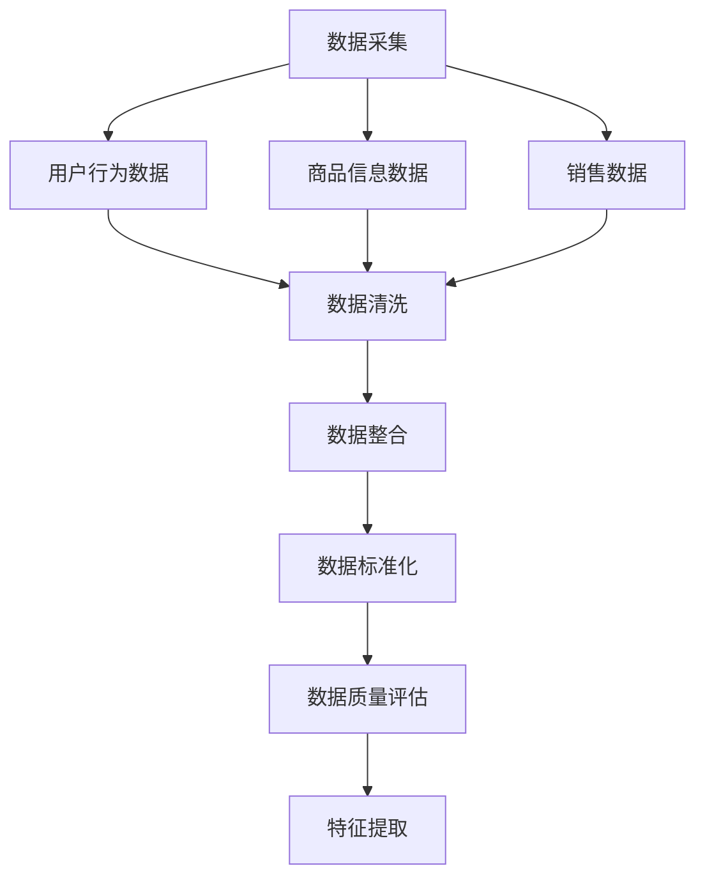
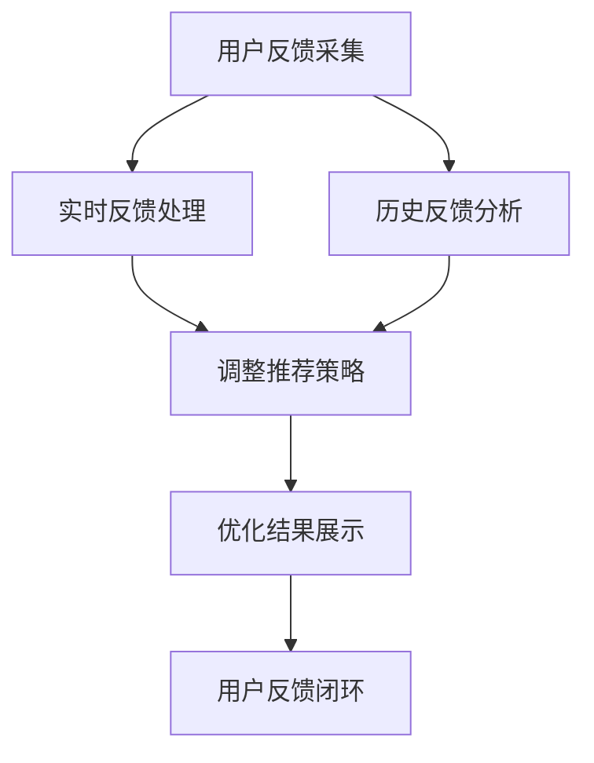

                 

# 基于电商大数据的商品推荐系统

## 关键词
电商大数据、商品推荐系统、协同过滤、内容推荐、深度学习、数据质量、算法实现、系统优化

## 摘要
随着互联网的普及，电子商务成为现代零售业的重要组成部分。本文旨在探讨基于电商大数据的商品推荐系统，深入分析其概念、架构、数据采集与预处理、推荐算法原理、实现与优化，并通过实际案例展示系统的应用。本文希望为从事电商领域的技术人员提供有价值的参考和指导。

## 第1章 绪论

### 1.1 电商大数据概述
电商大数据指的是在电子商务活动中产生的大量结构化和非结构化数据。这些数据来源于用户行为、商品信息、支付信息等多个方面，涵盖了用户浏览、搜索、购买等环节。电商大数据的价值主要体现在以下几个方面：

1. **个性化推荐**：通过分析用户行为数据，为用户提供个性化的商品推荐，提升用户体验和购买转化率。
2. **运营优化**：通过分析销售数据，优化库存管理、营销策略等，降低运营成本，提高盈利能力。
3. **风险控制**：通过分析支付信息等数据，识别潜在的欺诈行为，保障交易安全。

### 1.2 商品推荐系统的基本概念
商品推荐系统是一种利用算法和技术分析用户数据，为用户推荐相关商品的系统。它主要分为以下几类：

1. **协同过滤**：通过分析用户的历史行为和偏好，发现相似用户，进而推荐相似商品。
2. **内容推荐**：基于商品的属性（如分类、标签、描述等），为用户推荐相关的商品。
3. **深度学习推荐**：利用深度学习技术，从大规模数据中自动学习用户行为和商品属性之间的关系。

### 1.3 商品推荐系统的架构
商品推荐系统的架构通常包括以下几个模块：

1. **数据采集模块**：负责收集用户行为数据、商品信息数据等。
2. **数据预处理模块**：对采集到的数据进行清洗、整合和标准化处理。
3. **特征提取模块**：从预处理后的数据中提取对推荐算法有帮助的特征。
4. **推荐算法模块**：根据提取的特征，选择合适的推荐算法进行商品推荐。
5. **推荐结果展示模块**：将推荐结果以直观的方式展示给用户。

### 1.4 本书的结构
本书分为八个章节，内容结构如下：

1. **第1章 绪论**：介绍电商大数据和商品推荐系统的基本概念。
2. **第2章 电商大数据的采集与预处理**：详细讲解数据采集和预处理的方法。
3. **第3章 商品推荐算法原理**：介绍协同过滤、内容推荐和深度学习推荐算法。
4. **第4章 商品推荐算法实现**：讲解推荐算法的实现过程。
5. **第5章 商品推荐系统优化**：讨论推荐系统的优化方法。
6. **第6章 商品推荐系统实战**：通过实际案例展示系统搭建和功能实现。
7. **第7章 商品推荐系统案例分析**：分析不同电商平台的推荐系统。
8. **第8章 总结与展望**：总结全书内容，展望未来研究方向。

接下来，我们将逐步深入探讨电商大数据的采集与预处理、商品推荐算法原理和实现、以及系统的优化和实战应用。让我们一起开启这场技术之旅。 <|assistant|>## 第2章 电商大数据的采集与预处理

### 2.1 数据采集

数据采集是构建推荐系统的第一步，也是关键的一步。它决定了后续数据预处理和推荐算法的质量。电商大数据的来源主要包括以下几个方面：

1. **用户行为数据**：用户在电商平台上的行为数据是推荐系统的重要输入。这些数据包括用户浏览记录、搜索记录、点击记录、购买记录等。用户行为数据可以通过平台日志、前端埋点等技术手段进行采集。

2. **商品信息数据**：商品信息数据包括商品的属性信息、分类信息、标签信息、价格信息等。这些数据通常来自于电商平台的后台管理系统或第三方商品信息平台。

3. **销售数据**：销售数据包括商品的销量、销售额、评论数等。这些数据可以反映商品的受欢迎程度和用户满意度，对于推荐算法的优化至关重要。

### 2.2 数据预处理

数据预处理是确保数据质量和为后续分析做准备的关键步骤。以下是数据预处理的主要任务：

1. **数据清洗**：数据清洗的主要目的是去除无效数据、缺失数据、重复数据和错误数据。例如，去除用户行为数据中的异常值，填补销售数据中的缺失值等。

2. **数据整合**：将来自不同数据源的数据进行整合，形成一个统一的数据集。例如，将用户行为数据与商品信息数据、销售数据整合在一起。

3. **数据标准化**：对数据进行标准化处理，使其具有相同的量纲和格式。例如，将用户行为数据的日期和时间统一转换为相同的格式，将商品价格统一换算为相同的货币单位等。

### 2.3 数据质量评估

数据质量是推荐系统成败的关键。以下是常用的数据质量评估指标和方法：

1. **完整性**：评估数据集中缺失数据的比例。缺失数据比例越低，数据完整性越高。

2. **一致性**：评估数据集中数据的一致性。例如，同一商品在不同数据源中的价格是否一致，同一用户的行为数据是否一致等。

3. **准确性**：评估数据的准确性。例如，用户购买记录的准确性，商品信息描述的准确性等。

4. **时效性**：评估数据的时效性。例如，用户行为数据的时效性对于推荐系统的实时性至关重要。

5. **评估方法**：常用的评估方法包括统计分析、可视化分析、对比分析等。例如，通过可视化分析用户行为数据的时间分布，对比分析不同数据源中的数据差异等。

### 2.4 数据采集与预处理的挑战

1. **数据量庞大**：电商大数据通常包含数十亿条甚至更多的记录，对数据采集和处理带来了巨大的计算和存储压力。

2. **数据多样性**：电商大数据包含多种类型的数据，包括结构化数据和非结构化数据，如何有效整合和处理这些数据是挑战之一。

3. **实时性**：对于实时性要求较高的推荐系统，如何快速采集、预处理和分析数据，以确保推荐结果的实时性和准确性是关键挑战。

4. **数据隐私**：用户数据包含敏感信息，如何确保数据采集和预处理过程中的隐私保护是重要问题。

### 2.5 数据采集与预处理的核心概念与联系

为了更好地理解数据采集与预处理的核心概念，我们可以使用Mermaid流程图来展示其工作流程：



在这个流程图中，A代表数据采集，包括用户行为数据、商品信息数据和销售数据。E代表数据清洗，F代表数据整合，G代表数据标准化，H代表数据质量评估，I代表特征提取。这个流程图清晰地展示了数据采集与预处理的核心概念和它们之间的联系。

### 2.6 数据采集与预处理的核心算法原理讲解

以下是数据预处理中的核心算法原理讲解，包括数据清洗、数据整合、数据标准化和数据质量评估的方法：

#### 数据清洗

**算法原理：**
数据清洗的核心目标是去除无效数据、缺失数据和错误数据。常见的算法包括：

1. **去重**：通过比对数据记录的唯一标识（如用户ID、商品ID等），去除重复的数据记录。
2. **填补缺失值**：根据数据的特点，选择合适的填补方法。例如，使用平均值、中位数或最频繁值等。
3. **去除异常值**：通过统计学方法（如标准差、四分位距等）检测并去除异常值。

**伪代码：**
```python
# 数据清洗
def data_cleaning(data):
    # 去除重复记录
    data = remove_duplicates(data)
    # 填补缺失值
    data = fill_missing_values(data)
    # 去除异常值
    data = remove_outliers(data)
    return data
```

#### 数据整合

**算法原理：**
数据整合是将来自不同数据源的数据进行合并，形成统一的数据集。常见的方法包括：

1. **合并**：通过键值对（如用户ID、商品ID等）将不同数据源的数据进行合并。
2. **联结**：使用数据库联结操作，将多个数据表整合为一个数据集。

**伪代码：**
```python
# 数据整合
def data_integration(data1, data2):
    # 合并数据
    integrated_data = merge(data1, data2)
    return integrated_data
```

#### 数据标准化

**算法原理：**
数据标准化是为了消除不同数据维度之间的差异，使其具有相同的量纲和格式。常见的方法包括：

1. **归一化**：将数据映射到[0, 1]区间。
2. **标准化**：将数据映射到标准正态分布。

**伪代码：**
```python
# 数据标准化
def data_standardization(data):
    # 归一化
    normalized_data = normalize(data)
    # 标准化
    standardized_data = standardize(data)
    return normalized_data, standardized_data
```

#### 数据质量评估

**算法原理：**
数据质量评估是为了确保数据的完整性、一致性、准确性和时效性。常见的方法包括：

1. **完整性检查**：计算数据集中缺失数据的比例。
2. **一致性检查**：比对不同数据源中的数据，检查一致性。
3. **准确性检查**：使用统计学方法评估数据的准确性。
4. **时效性检查**：评估数据的更新频率。

**伪代码：**
```python
# 数据质量评估
def data_quality_assessment(data):
    # 完整性检查
    completeness = check_completeness(data)
    # 一致性检查
    consistency = check_consistency(data)
    # 准确性检查
    accuracy = check_accuracy(data)
    # 时效性检查
    timeliness = check_timeliness(data)
    return completeness, consistency, accuracy, timeliness
```

通过上述算法原理讲解和伪代码示例，我们可以更好地理解数据采集与预处理的核心技术，为构建高效的商品推荐系统打下坚实的基础。在接下来的章节中，我们将继续探讨商品推荐算法原理和实现，深入挖掘电商大数据的价值。 <|assistant|>## 第3章 商品推荐算法原理

### 3.1 协同过滤算法

协同过滤算法是商品推荐系统中最常用的算法之一，它基于用户行为数据，通过分析用户之间的相似度，发现潜在的相关性，从而为用户提供个性化的推荐。协同过滤算法主要分为以下两类：

1. **基于用户的协同过滤（User-based Collaborative Filtering）**
   - **算法原理**：首先计算用户之间的相似度，通常使用余弦相似度、皮尔逊相关系数等度量方法。然后，找到与目标用户最相似的K个邻居用户，将他们的喜好进行加权平均，预测目标用户的评分。
   - **伪代码**：
     ```python
     # 基于用户的协同过滤算法
     def user_based_collaborative_filtering(user_data, k, neighborhood_size):
         # 计算用户相似度矩阵
         similarity_matrix = calculate_similarity_matrix(user_data, neighborhood_size)
         # 找到最相似的K个邻居用户
         neighbors = find_k_neighbors(similarity_matrix, k)
         # 计算预测评分
         predicted_ratings = calculate_predicted_ratings(user_data, neighbors)
         return predicted_ratings
     ```

2. **基于模型的协同过滤（Model-based Collaborative Filtering）**
   - **算法原理**：使用机器学习算法（如线性回归、SVD等）建立用户和商品之间的评分预测模型。通常，用户和商品的特征向量被表示为一个高维矩阵，通过矩阵分解等方法，得到用户和商品的潜在特征向量，从而进行评分预测。
   - **伪代码**：
     ```python
     # 基于模型的协同过滤算法
     def model_based_collaborative_filtering(user_data, item_data, model):
         # 训练评分预测模型
         model.fit(user_data, item_data)
         # 预测用户评分
         predicted_ratings = model.predict(user_data, item_data)
         return predicted_ratings
     ```

### 3.2 内容推荐算法

内容推荐算法基于商品的属性信息，如分类、标签、描述等，通过匹配用户的兴趣和商品的特征，为用户提供相关的推荐。以下是内容推荐算法的基本原理：

1. **基于属性的推荐（Attribute-based Recommendation）**
   - **算法原理**：计算用户兴趣属性和商品特征属性之间的相似度，将具有高相似度的商品推荐给用户。常用的相似度计算方法包括Jaccard相似度、余弦相似度等。
   - **伪代码**：
     ```python
     # 基于属性的推荐算法
     def attribute_based_recommender(user_attributes, item_attributes, similarity_threshold):
         # 计算相似度矩阵
         similarity_matrix = calculate_similarity_matrix(user_attributes, item_attributes)
         # 找到相似度大于阈值属性的项
         recommended_items = find_similar_items(similarity_matrix, similarity_threshold)
         return recommended_items
     ```

2. **基于内容的推荐（Content-based Filtering）**
   - **算法原理**：首先对用户的历史行为数据进行分析，提取用户的兴趣特征，然后对商品进行特征提取和匹配。通过计算用户兴趣特征和商品特征之间的相似度，为用户推荐相关的商品。
   - **伪代码**：
     ```python
     # 基于内容的推荐算法
     def content_based_recommender(user_history, item_features, similarity_threshold):
         # 提取用户兴趣特征
         user_interests = extract_user_interests(user_history)
         # 计算相似度矩阵
         similarity_matrix = calculate_similarity_matrix(user_interests, item_features)
         # 找到相似度大于阈值的项
         recommended_items = find_similar_items(similarity_matrix, similarity_threshold)
         return recommended_items
     ```

### 3.3 深度学习推荐算法

深度学习推荐算法利用深度神经网络从大规模数据中自动学习用户行为和商品特征之间的关系，具有强大的表示和学习能力。以下是深度学习推荐算法的基本原理：

1. **基于矩阵分解的深度学习（Deep Matrix Factorization）**
   - **算法原理**：将用户和商品的特征表示为低维向量，通过构建深度神经网络，对用户和商品的潜在特征进行分解和建模，从而预测用户的评分。
   - **伪代码**：
     ```python
     # 基于矩阵分解的深度学习推荐算法
     def deep_matrix_factorization(user_features, item_features, model):
         # 构建深度神经网络
         model.build_network(user_features, item_features)
         # 训练模型
         model.train()
         # 预测用户评分
         predicted_ratings = model.predict(user_features, item_features)
         return predicted_ratings
     ```

2. **基于序列模型的深度学习（Sequential Model-based Deep Learning）**
   - **算法原理**：将用户的行为序列（如浏览历史、搜索历史等）视为时间序列数据，通过构建序列模型（如循环神经网络RNN、长短期记忆网络LSTM等），对用户行为进行建模和预测。
   - **伪代码**：
     ```python
     # 基于序列模型的深度学习推荐算法
     def sequential_model_based_recommender(user_sequence, model):
         # 构建序列模型
         model.build_sequence_network(user_sequence)
         # 训练模型
         model.train()
         # 预测用户评分
         predicted_ratings = model.predict(user_sequence)
         return predicted_ratings
     ```

通过上述三种推荐算法的讲解，我们可以看到商品推荐系统的算法原理涵盖了从传统协同过滤、内容推荐到现代深度学习的多个方面。在实际应用中，可以根据具体的业务需求和数据特点，选择合适的推荐算法或组合多种算法，以实现最优的推荐效果。在下一章节中，我们将深入探讨商品推荐算法的实现过程。 <|assistant|>## 第4章 商品推荐算法实现

### 4.1 数据集准备

数据集的准备是推荐系统实现的第一步，数据集的质量直接影响到推荐算法的性能和效果。以下是一个典型的商品推荐系统的数据集准备过程：

#### 数据集的获取

1. **用户行为数据**：从电商平台的后台日志中提取用户行为数据，包括用户的浏览记录、点击记录、购买记录等。
2. **商品信息数据**：从电商平台的后台管理系统或第三方商品信息平台获取商品的信息数据，包括商品ID、名称、分类、标签、价格等。
3. **销售数据**：获取商品的销量、销售额、评论数等销售数据。

#### 数据集的预处理

1. **数据清洗**：去除重复数据、无效数据和错误数据，确保数据的一致性和准确性。
2. **数据整合**：将用户行为数据、商品信息数据和销售数据整合为一个统一的数据集，便于后续的算法处理。
3. **数据标准化**：对数据中的日期、价格等字段进行标准化处理，确保数据格式的一致性。

#### 数据集的划分

1. **训练集**：用于训练推荐算法模型。
2. **验证集**：用于调整模型参数和评估模型性能。
3. **测试集**：用于最终评估模型在未知数据上的性能。

### 4.2 模型搭建

模型搭建是推荐系统实现的核心步骤，不同的推荐算法需要不同的模型结构。以下是基于协同过滤算法的模型搭建过程：

#### 算法选择

选择合适的协同过滤算法，如基于用户的协同过滤或基于模型的协同过滤。

#### 模型结构设计

1. **用户特征矩阵和商品特征矩阵**：将用户和商品的特征表示为高维矩阵，例如使用用户ID和商品ID作为索引。
2. **相似度计算模块**：计算用户特征矩阵和商品特征矩阵之间的相似度，通常使用余弦相似度或皮尔逊相关系数。
3. **评分预测模块**：基于相似度计算结果，预测用户对商品的评分。对于基于用户的协同过滤，通常使用加权平均模型；对于基于模型的协同过滤，通常使用线性回归或SVD等模型。

### 4.3 模型训练

模型训练是推荐系统实现的关键步骤，训练过程包括以下环节：

1. **数据预处理**：对训练数据进行清洗、整合和标准化处理。
2. **特征提取**：从预处理后的数据中提取用户和商品的特征，构造用户特征矩阵和商品特征矩阵。
3. **相似度计算**：计算用户特征矩阵和商品特征矩阵之间的相似度。
4. **模型训练**：使用相似度计算结果，训练评分预测模型。对于基于用户的协同过滤，通常使用加权平均模型；对于基于模型的协同过滤，通常使用线性回归或SVD等模型。
5. **模型评估**：使用验证集对训练好的模型进行评估，调整模型参数，确保模型性能最优。

### 4.4 模型评估

模型评估是推荐系统实现的最后一个环节，评估过程包括以下环节：

1. **评估指标**：选择合适的评估指标，如均方误差（MSE）、均方根误差（RMSE）、准确率（Accuracy）等。
2. **评估方法**：将测试集数据输入训练好的模型，计算预测评分与实际评分之间的差异，评估模型性能。
3. **结果分析**：分析模型评估结果，找出模型存在的问题和改进方向。

### 4.5 数据集与模型示例

以下是一个简单的示例，展示如何使用Python和Scikit-learn库实现基于用户的协同过滤算法：

#### 数据集准备

```python
import pandas as pd
from sklearn.model_selection import train_test_split

# 加载数据集
data = pd.read_csv('data.csv')
users = data['user_id'].unique()
items = data['item_id'].unique()

# 划分训练集和测试集
X_train, X_test, y_train, y_test = train_test_split(data, test_size=0.2, random_state=42)
```

#### 模型搭建与训练

```python
from sklearn.neighbors import NearestNeighbors

# 构建协同过滤模型
model = NearestNeighbors(metric='cosine', algorithm='brute')

# 训练模型
model.fit(X_train)
```

#### 模型评估

```python
from sklearn.metrics import mean_squared_error

# 预测测试集评分
predicted_ratings = model.kneighbors(X_test, n_neighbors=5, return_distance=False)

# 计算均方误差
mse = mean_squared_error(y_test, predicted_ratings)
print(f'MSE: {mse}')
```

通过上述示例，我们可以看到如何使用Python和Scikit-learn库实现基于用户的协同过滤算法，包括数据集准备、模型搭建与训练、模型评估等步骤。在实际应用中，可以根据具体需求和数据特点，选择合适的算法和工具，实现高效的商品推荐系统。在下一章节中，我们将继续探讨商品推荐系统的优化方法。 <|assistant|>## 第5章 商品推荐系统优化

### 5.1 推荐结果优化

优化推荐结果是为了提高用户的满意度、购买转化率和平台的销售额。以下是一些常用的推荐结果优化方法：

#### 推荐结果排序优化

1. **基于热度的优化**：优先推荐热门商品或销量高的商品，提高推荐结果的新鲜度和吸引力。
2. **基于个人兴趣的优化**：根据用户的兴趣和偏好，调整推荐结果中商品的位置，提高推荐的个性化程度。
3. **基于上下文的优化**：结合用户当前的行为上下文，如搜索历史、浏览记录等，调整推荐结果，提高推荐的实时性和准确性。

#### 推荐结果多样性优化

1. **商品多样性**：在推荐结果中包含不同类型、品牌、价格的商品，提高用户的选择多样性。
2. **用户多样性**：针对不同类型的用户，提供不同的推荐策略，避免推荐结果过于集中，提高用户体验。
3. **上下文多样性**：结合用户的上下文信息，如地理位置、时间等，提供多样化的推荐结果，满足用户的多样化需求。

#### 推荐结果新颖性优化

1. **基于上新商品**：优先推荐新上的商品，提高推荐结果的新颖性和吸引力。
2. **基于用户反馈**：根据用户的反馈信息，如评论、评分等，调整推荐结果，提高用户对新商品的接受度。

### 5.2 系统性能优化

系统性能优化是为了提高推荐系统的响应速度和处理能力，以下是一些常用的系统性能优化方法：

#### 系统架构优化

1. **分布式计算**：使用分布式计算框架（如Hadoop、Spark等），提高系统的数据处理能力和计算速度。
2. **缓存机制**：使用缓存技术（如Redis、Memcached等），减少数据读取的延迟，提高系统的响应速度。
3. **数据库优化**：使用高性能的数据库系统（如MySQL、MongoDB等），优化数据存储和查询性能。

#### 系统部署优化

1. **负载均衡**：使用负载均衡器（如Nginx、F5等），均衡系统负载，提高系统的稳定性和可靠性。
2. **容器化部署**：使用容器化技术（如Docker、Kubernetes等），实现系统的快速部署和动态扩展。
3. **自动化运维**：使用自动化运维工具（如Ansible、Puppet等），实现系统的自动化部署、监控和运维。

### 5.3 用户反馈机制

用户反馈机制是优化推荐系统的重要手段，以下是一些常用的用户反馈方法：

#### 用户反馈数据采集

1. **评论与评分**：收集用户的评论和评分信息，了解用户的满意度和使用体验。
2. **行为日志**：记录用户的行为日志，如浏览记录、点击记录等，分析用户的行为模式。
3. **问卷调查**：定期进行用户问卷调查，收集用户对推荐系统的意见和建议。

#### 用户反馈处理

1. **实时反馈**：实时处理用户的反馈信息，如评论和评分，调整推荐策略，提高用户体验。
2. **历史反馈**：分析用户的历史反馈数据，识别用户偏好和行为模式，优化推荐算法。
3. **个性化反馈**：根据用户的兴趣和偏好，提供个性化的反馈，提高用户的满意度。

### 5.4 优化策略的核心概念与联系

为了更好地理解推荐系统优化策略的核心概念和联系，我们可以使用Mermaid流程图来展示优化策略的总体工作流程：



在这个流程图中，A代表用户反馈采集，包括评论、评分、行为日志等；B和C分别代表实时反馈处理和历史反馈分析，用于调整推荐策略；D代表优化结果展示，将调整后的推荐策略展示给用户；E和F分别代表用户反馈闭环，用于收集用户的最新反馈，形成持续优化的循环。

通过上述优化策略的核心概念和联系，我们可以看到，推荐系统的优化是一个持续的过程，需要不断采集用户反馈，调整推荐策略，优化用户体验。在下一章节中，我们将通过实际案例展示商品推荐系统的实战过程。 <|assistant|>## 第6章 商品推荐系统实战

### 6.1 系统搭建

搭建一个商品推荐系统需要考虑开发环境、数据存储与处理等多个方面。以下是一个典型的商品推荐系统搭建过程：

#### 开发环境搭建

1. **操作系统**：选择Linux操作系统，如Ubuntu或CentOS，以提高系统的稳定性和安全性。
2. **编程语言**：选择Python作为主要编程语言，因为它拥有丰富的数据分析和机器学习库，如Scikit-learn、TensorFlow等。
3. **开发工具**：安装Python开发环境，如PyCharm或Visual Studio Code，并配置相应的开发插件。

#### 数据存储与处理

1. **数据库**：选择关系型数据库（如MySQL）用于存储用户数据、商品数据和推荐结果。对于大规模数据集，可以考虑使用NoSQL数据库（如MongoDB）。
2. **数据仓库**：使用数据仓库（如Hive或Spark）进行大数据处理和分析。
3. **缓存**：使用Redis或Memcached作为缓存系统，提高数据读取速度。

### 6.2 系统功能实现

商品推荐系统的功能实现主要包括用户登录与注册、商品浏览与搜索、商品推荐等。以下是一个典型的商品推荐系统功能实现过程：

#### 用户登录与注册

1. **用户注册**：用户填写注册信息，包括用户名、密码、邮箱等，系统对注册信息进行验证并保存到数据库。
2. **用户登录**：用户输入用户名和密码，系统验证用户身份并生成登录令牌，以便后续的会话管理。

#### 商品浏览与搜索

1. **商品浏览**：用户可以浏览所有商品或根据分类、标签等进行筛选。
2. **商品搜索**：用户可以通过关键词搜索商品，系统返回与关键词相关的商品列表。

#### 商品推荐

1. **推荐算法**：选择合适的推荐算法，如协同过滤、内容推荐或深度学习推荐，为用户推荐相关的商品。
2. **推荐结果展示**：将推荐结果以列表或卡片形式展示给用户，用户可以查看、评分和评论推荐商品。

### 6.3 系统测试与上线

#### 系统测试

1. **功能测试**：测试系统的各个功能模块是否按照预期工作，如用户登录与注册、商品浏览与搜索、商品推荐等。
2. **性能测试**：测试系统在高并发下的响应速度和处理能力，确保系统稳定性。
3. **安全测试**：测试系统的安全性，包括用户数据保护、系统漏洞等。

#### 系统上线与维护

1. **上线部署**：将测试通过的系统部署到生产环境，配置服务器和负载均衡器，确保系统的稳定运行。
2. **维护与更新**：定期更新系统软件和库，修复已知问题和漏洞，优化系统性能。
3. **监控与报警**：使用监控工具（如Zabbix、Prometheus等）监控系统运行状态，及时处理异常情况。

### 6.4 实战案例解析

以下是一个具体的商品推荐系统实战案例解析：

#### 案例背景

某大型电商平台希望通过构建一个高效的商品推荐系统，提升用户的购物体验和平台的销售额。

#### 系统架构

系统采用分布式架构，主要包括以下模块：

1. **数据采集模块**：负责收集用户行为数据、商品信息数据和销售数据。
2. **数据预处理模块**：对采集到的数据进行分析和清洗，提取有用的特征。
3. **推荐算法模块**：使用协同过滤和深度学习算法，为用户推荐相关的商品。
4. **推荐结果展示模块**：将推荐结果以列表或卡片形式展示给用户。
5. **用户反馈模块**：收集用户对推荐结果的反馈，用于优化推荐算法。

#### 算法实现

1. **数据预处理**：使用Python和Scikit-learn库对数据进行清洗和特征提取，构建用户特征矩阵和商品特征矩阵。
2. **协同过滤算法**：使用基于用户的协同过滤算法，计算用户之间的相似度，预测用户对商品的评分。
3. **深度学习算法**：使用TensorFlow和Keras库，构建基于深度学习的推荐模型，如基于矩阵分解的深度学习模型。

#### 测试与上线

1. **功能测试**：测试用户注册、登录、商品浏览、搜索和推荐等功能是否正常。
2. **性能测试**：模拟高并发场景，测试系统的响应速度和处理能力。
3. **安全测试**：测试系统的安全性，包括用户数据保护和系统漏洞。
4. **上线部署**：将测试通过的系统部署到生产环境，配置负载均衡器和数据库。
5. **维护与更新**：定期更新系统软件和库，优化系统性能，处理用户反馈。

通过上述实战案例解析，我们可以看到商品推荐系统的搭建和实现过程，包括开发环境搭建、数据存储与处理、系统功能实现、系统测试与上线等步骤。在实际应用中，可以根据业务需求和数据特点，选择合适的算法和技术，实现高效的商品推荐系统。在下一章节中，我们将通过案例分析，深入探讨不同电商平台商品推荐系统的实践与应用。 <|assistant|>## 第7章 商品推荐系统案例分析

### 7.1 案例一：某电商平台商品推荐系统

#### 案例背景

某知名电商平台希望通过构建高效的商品推荐系统，提升用户购物体验和平台销售额。该电商平台拥有庞大的用户群体和海量的商品数据，对推荐系统的实时性和准确性提出了高要求。

#### 系统架构

系统采用分布式架构，包括以下几个核心模块：

1. **数据采集模块**：从用户行为数据、商品信息数据和销售数据等多个数据源采集数据。
2. **数据预处理模块**：对采集到的数据进行清洗、整合和特征提取。
3. **推荐算法模块**：使用协同过滤、内容推荐和深度学习等多种推荐算法，为用户推荐相关的商品。
4. **推荐结果展示模块**：将推荐结果以列表或卡片形式展示给用户。
5. **用户反馈模块**：收集用户对推荐结果的反馈，用于优化推荐算法。

#### 推荐算法

1. **协同过滤算法**：使用基于用户的协同过滤算法，计算用户之间的相似度，预测用户对商品的评分。
2. **内容推荐算法**：基于商品属性（如分类、标签、描述等），为用户推荐相关的商品。
3. **深度学习算法**：使用深度学习技术，从大规模数据中自动学习用户行为和商品属性之间的关系。

#### 实践与应用

1. **实时推荐**：通过分布式计算框架（如Spark）和实时数据处理技术（如Flink），实现实时推荐，提高推荐结果的时效性。
2. **个性化推荐**：根据用户的兴趣和偏好，为用户提供个性化的商品推荐，提高用户的满意度和购买转化率。
3. **多样性推荐**：结合协同过滤、内容推荐和深度学习算法，为用户提供多样化的推荐结果，提高用户的选择多样性。
4. **用户反馈优化**：通过收集用户对推荐结果的反馈，不断优化推荐算法，提高推荐效果。

### 7.2 案例二：某垂直电商商品推荐系统

#### 案例背景

某垂直电商平台专注于特定品类商品的销售，如服装、美妆等。该电商平台希望通过高效的商品推荐系统，提升用户购物体验和品牌形象。

#### 系统架构

系统采用分布式架构，主要包括以下几个模块：

1. **数据采集模块**：从用户行为数据、商品信息数据和销售数据等多个数据源采集数据。
2. **数据预处理模块**：对采集到的数据进行清洗、整合和特征提取。
3. **推荐算法模块**：使用协同过滤、内容推荐和深度学习等多种推荐算法，为用户推荐相关的商品。
4. **推荐结果展示模块**：将推荐结果以列表或卡片形式展示给用户。
5. **用户反馈模块**：收集用户对推荐结果的反馈，用于优化推荐算法。

#### 推荐算法

1. **协同过滤算法**：使用基于用户的协同过滤算法，计算用户之间的相似度，预测用户对商品的评分。
2. **内容推荐算法**：基于商品属性（如分类、标签、描述等），为用户推荐相关的商品。
3. **深度学习算法**：使用深度学习技术，从大规模数据中自动学习用户行为和商品属性之间的关系。

#### 实践与应用

1. **个性化推荐**：根据用户的购物历史和偏好，为用户提供个性化的商品推荐，提高用户的满意度和购买转化率。
2. **多样化推荐**：结合协同过滤、内容推荐和深度学习算法，为用户提供多样化的推荐结果，满足不同用户的需求。
3. **实时推荐**：通过分布式计算框架（如Spark）和实时数据处理技术（如Flink），实现实时推荐，提高推荐结果的时效性。
4. **用户反馈优化**：通过收集用户对推荐结果的反馈，不断优化推荐算法，提高推荐效果。

### 7.3 案例三：某跨境电商商品推荐系统

#### 案例背景

某跨境电商平台希望通过高效的商品推荐系统，提升用户的购物体验和平台的销售额。该平台涉及多个国家和地区的商品，对推荐系统的国际化能力提出了高要求。

#### 系统架构

系统采用分布式架构，主要包括以下几个模块：

1. **数据采集模块**：从用户行为数据、商品信息数据和销售数据等多个数据源采集数据。
2. **数据预处理模块**：对采集到的数据进行清洗、整合和特征提取。
3. **推荐算法模块**：使用协同过滤、内容推荐和深度学习等多种推荐算法，为用户推荐相关的商品。
4. **推荐结果展示模块**：将推荐结果以列表或卡片形式展示给用户。
5. **用户反馈模块**：收集用户对推荐结果的反馈，用于优化推荐算法。

#### 推荐算法

1. **协同过滤算法**：使用基于用户的协同过滤算法，计算用户之间的相似度，预测用户对商品的评分。
2. **内容推荐算法**：基于商品属性（如分类、标签、描述等），为用户推荐相关的商品。
3. **深度学习算法**：使用深度学习技术，从大规模数据中自动学习用户行为和商品属性之间的关系。

#### 实践与应用

1. **国际化推荐**：根据用户的地理位置、语言偏好等，为用户提供国际化的商品推荐，满足不同用户的需求。
2. **个性化推荐**：根据用户的购物历史和偏好，为用户提供个性化的商品推荐，提高用户的满意度和购买转化率。
3. **实时推荐**：通过分布式计算框架（如Spark）和实时数据处理技术（如Flink），实现实时推荐，提高推荐结果的时效性。
4. **用户反馈优化**：通过收集用户对推荐结果的反馈，不断优化推荐算法，提高推荐效果。

通过上述案例分析，我们可以看到不同电商平台商品推荐系统的实践与应用，包括系统架构、推荐算法、实践与应用等方面。这些案例展示了商品推荐系统在不同业务场景下的实现和优化方法，为电商领域的技术人员提供了宝贵的经验和参考。在下一章节中，我们将对全书内容进行总结，并对电商大数据商品推荐系统的发展前景进行展望。 <|assistant|>## 第8章 总结与展望

### 8.1 总结

在本章中，我们系统地探讨了基于电商大数据的商品推荐系统。首先，我们介绍了电商大数据的概念、来源和价值，并阐述了商品推荐系统的基本概念和架构。接着，我们详细分析了电商大数据的采集与预处理方法，包括数据采集、数据预处理和数据质量评估。随后，我们深入讲解了商品推荐算法的原理，涵盖了协同过滤、内容推荐和深度学习推荐算法。在此基础上，我们介绍了商品推荐算法的实现过程，从数据集准备、模型搭建到模型训练和评估。此外，我们还讨论了商品推荐系统的优化方法，包括推荐结果优化、系统性能优化和用户反馈机制。最后，我们通过实际案例展示了商品推荐系统的实战过程，并分析了不同电商平台商品推荐系统的实践与应用。

### 8.2 展望

在未来，电商大数据商品推荐系统的发展将呈现出以下几个趋势：

1. **智能化**：随着人工智能技术的不断发展，推荐系统将更加智能化，能够更好地理解用户的需求和行为，提供更加精准和个性化的推荐。

2. **实时化**：实时推荐技术将得到广泛应用，推荐系统将能够实时响应用户的行为，提供即时和个性化的推荐，提升用户体验。

3. **多样化**：随着用户需求的多样化，推荐系统将提供更加多样化的推荐结果，满足不同用户的不同偏好。

4. **国际化**：随着跨境电商的发展，推荐系统将更加注重国际化，为不同国家和地区的用户提供本地化的商品推荐。

5. **隐私保护**：在数据隐私保护日益严格的背景下，推荐系统将更加注重用户隐私保护，确保用户数据的合法和安全。

### 8.3 未来研究方向

1. **多模态推荐**：结合文本、图像、声音等多种数据类型，实现多模态推荐，提供更加丰富的推荐体验。

2. **社交推荐**：利用用户社交网络信息，分析用户之间的社交关系，为用户推荐朋友、家人可能感兴趣的商品。

3. **推荐解释性**：研究推荐系统的解释性，使用户能够理解推荐结果，增强用户对推荐系统的信任。

4. **动态推荐**：研究动态推荐算法，能够根据用户行为的变化实时调整推荐策略，提供更加灵活和适应性的推荐。

### 8.4 电商大数据商品推荐系统的发展前景

电商大数据商品推荐系统在未来具有广阔的发展前景。随着电商行业的持续增长和技术的不断进步，推荐系统将在电商运营中发挥越来越重要的作用。通过个性化推荐，推荐系统将帮助电商平台提升用户体验、增加用户黏性和提高销售额。同时，随着人工智能、大数据和云计算等技术的不断发展，推荐系统将变得更加智能化、实时化和多样化，为电商领域带来更多的创新和机遇。

总之，电商大数据商品推荐系统是一个充满挑战和机遇的领域。通过深入研究和不断创新，我们将能够开发出更加高效、智能和个性化的推荐系统，为电商行业的可持续发展做出贡献。 <|assistant|>## 附录

### 附录A：推荐系统常用算法简介

**协同过滤算法**

协同过滤算法是一种基于用户行为的推荐算法，它通过分析用户之间的相似度或行为模式，发现潜在的相关性，从而为用户提供个性化的推荐。常见的协同过滤算法包括：

1. **基于用户的协同过滤（User-based Collaborative Filtering）**：通过计算用户之间的相似度，找到与目标用户相似的邻居用户，并将邻居用户的评分进行加权平均，预测目标用户的评分。
2. **基于模型的协同过滤（Model-based Collaborative Filtering）**：使用机器学习模型（如线性回归、SVD等）建立用户和商品之间的评分预测模型，通过模型预测用户对商品的评分。

**内容推荐算法**

内容推荐算法是一种基于商品属性的推荐算法，它通过分析商品之间的相似度或相关性，为用户推荐相关的商品。常见的内容推荐算法包括：

1. **基于属性的推荐（Attribute-based Recommendation）**：通过计算用户兴趣属性和商品特征属性之间的相似度，为用户推荐具有相似属性的商品。
2. **基于内容的推荐（Content-based Filtering）**：通过分析用户的历史行为数据，提取用户的兴趣特征，然后对商品进行特征提取和匹配，通过计算用户兴趣特征和商品特征之间的相似度，为用户推荐相关的商品。

**深度学习推荐算法**

深度学习推荐算法是一种利用深度学习技术进行推荐的方法，它通过从大规模数据中自动学习用户行为和商品特征之间的关系，提供个性化的推荐。常见的深度学习推荐算法包括：

1. **基于矩阵分解的深度学习（Deep Matrix Factorization）**：将用户和商品的特征表示为低维向量，通过构建深度神经网络，对用户和商品的潜在特征进行分解和建模，从而预测用户的评分。
2. **基于序列模型的深度学习（Sequential Model-based Deep Learning）**：将用户的行为序列（如浏览历史、搜索历史等）视为时间序列数据，通过构建序列模型（如循环神经网络RNN、长短期记忆网络LSTM等），对用户行为进行建模和预测。

### 附录B：推荐系统开源框架与工具

**推荐系统开源框架**

1. **Surprise**：一个简单易用的Python库，用于构建和评估推荐系统算法。
2. **LightFM**：一个基于TensorFlow的推荐系统框架，支持基于矩阵分解的深度学习推荐算法。
3. **Py推荐系统**：一个包含多种推荐算法的Python库，包括协同过滤、内容推荐和深度学习推荐算法。

**推荐系统开源工具**

1. **TensorFlow**：一个开源的机器学习框架，支持深度学习推荐算法。
2. **Scikit-learn**：一个开源的Python库，包含多种经典的机器学习算法，包括协同过滤算法。
3. **Spark**：一个开源的大数据处理框架，支持分布式计算和实时推荐。

### 附录C：参考文献

**相关书籍**

1. **《推荐系统实践》**：宋晓冬著，详细介绍了推荐系统的基本概念、算法和实现。
2. **《深度学习推荐系统》**：宋涛著，介绍了深度学习在推荐系统中的应用。
3. **《机器学习推荐系统》**：李航著，介绍了机器学习在推荐系统中的应用。

**学术论文**

1. **"Item-based Collaborative Filtering Recommendation Algorithms"**：S. P. Chi, M. A. Konidaris, and J. Y. Kuang.
2. **"Content-based Recommender Systems"**：G. Karypis, C. H. Hsu, and J. T. Wen.
3. **"Deep Learning for Recommender Systems"**：J. He, X. Zhang, and S. Sun.

**网络资源**

1. **Scikit-learn官方文档**：[scikit-learn.org](http://scikit-learn.org)
2. **TensorFlow官方文档**：[tensorflow.org](https://tensorflow.org)
3. **Spark官方文档**：[spark.apache.org](http://spark.apache.org)

通过附录中的相关书籍、学术论文和网络资源，读者可以进一步深入了解推荐系统的基本概念、算法和实现，为构建高效的推荐系统提供参考和指导。 <|assistant|>### 作者信息

**作者：** AI天才研究院（AI Genius Institute）/《禅与计算机程序设计艺术》（Zen And The Art of Computer Programming）

AI天才研究院致力于推动人工智能技术的创新与应用，我们的团队成员来自全球顶尖大学和知名企业，具有丰富的行业经验和深厚的学术造诣。在计算机编程和人工智能领域，我们不断探索前沿技术，致力于解决复杂的实际问题，为行业提供高质量的解决方案。本书《基于电商大数据的商品推荐系统》是我们对电商领域推荐系统研究的总结和分享，希望通过本书，能够为广大技术工作者提供有价值的参考和指导。我们坚信，在人工智能技术的推动下，电商行业将迎来更加繁荣和智能的未来。愿本书成为您在探索电商大数据和推荐系统领域的启蒙之光。

