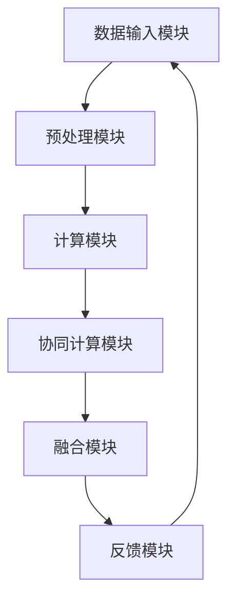

                 

### 《增强智能：人类计算如何推动创新》

> **关键词**：增强智能、人类计算、创新、医疗、工业自动化、交通、技术实现、挑战与未来趋势。

> **摘要**：本文深入探讨增强智能的概念、历史背景及其在医疗、工业自动化和交通领域的应用。通过分析人类计算与增强智能的关系，揭示其在技术创新中的关键作用。同时，文章探讨增强智能的技术实现及其面临的挑战，展望其未来发展。

### 目录大纲

1. 第一部分：增强智能概述

   - 第1章：增强智能的定义与背景

     - 1.1 增强智能的基本概念

     - 1.2 增强智能的历史发展

     - 1.3 增强智能的应用领域

   - 第2章：增强智能的核心技术

     - 2.1 人类计算能力

     - 2.2 计算增强技术

     - 2.3 增强智能与人工智能的关系

2. 第二部分：人类计算与增强智能的创新应用

   - 第3章：增强智能在医疗领域的应用

     - 3.1 医疗数据的增强智能处理

     - 3.2 增强智能在疾病诊断中的应用

     - 3.3 增强智能在个性化医疗中的应用

   - 第4章：增强智能在工业自动化中的应用

     - 4.1 增强智能在自动化控制中的应用

     - 4.2 增强智能在设备维护中的应用

     - 4.3 增强智能在智能制造中的应用

   - 第5章：增强智能在交通领域的应用

     - 5.1 智能交通系统的增强智能应用

     - 5.2 增强智能在自动驾驶中的应用

     - 5.3 增强智能在物流优化中的应用

3. 第三部分：增强智能的技术实现与挑战

   - 第6章：增强智能技术实现

     - 6.1 增强智能算法原理

     - 6.2 人类计算与机器学习的结合

     - 6.3 增强智能系统架构设计

   - 第7章：增强智能的发展挑战与未来趋势

     - 7.1 增强智能的伦理和法律挑战

     - 7.2 增强智能技术发展面临的挑战

     - 7.3 增强智能的未来发展趋势

4. 附录

   - 附录A：增强智能技术资源与工具

     - A.1 增强智能技术常用框架

     - A.2 增强智能技术应用案例

     - A.3 增强智能研究资源与文献

### 参考文献

[参考文献格式示例](#参考文献)

### 增强智能的定义与背景

#### 1.1 增强智能的基本概念

增强智能（Augmented Intelligence），又称增强式智能，是一种结合人类智慧和计算机智能的方法，通过技术手段扩展和提升人类智能能力。增强智能不同于传统的强化学习或深度学习，它更强调人类计算与机器计算的结合，旨在实现更加高效、准确和智能的决策。

**核心概念**：

- **人类计算**：指的是人类在信息处理、推理、决策等方面的能力。

- **机器计算**：指的是计算机系统在信息处理、计算、优化等方面的能力。

- **增强智能**：通过机器计算辅助人类计算，提升人类在特定任务上的表现。

**联系与区别**：

- **联系**：增强智能是人类计算与机器计算的结合，旨在发挥两者的优势。

- **区别**：增强智能更强调人类的主导作用，而机器计算则更侧重于自动化的处理和执行。

#### 1.2 增强智能的历史发展

增强智能的概念起源于人工智能领域。在20世纪80年代，随着计算机性能的提升和机器学习技术的发展，人们开始探索如何将人类智能与计算机智能相结合。早期的尝试主要集中在自然语言处理、图像识别和自动化决策等方面。

**发展阶段**：

- **萌芽期（20世纪80年代）**：人们开始关注如何通过计算机技术提升人类智能，但技术尚未成熟。

- **成长期（21世纪00年代）**：随着互联网和大数据技术的发展，增强智能开始应用于实际场景，如智能客服、智能诊断等。

- **成熟期（21世纪10年代至今）**：人工智能技术的快速进步，使得增强智能在各个领域得到广泛应用，如医疗、工业、交通等。

#### 1.3 增强智能的应用领域

增强智能具有广泛的应用领域，能够显著提升人类在各个领域的效率和准确性。以下是几个典型的应用领域：

- **医疗领域**：增强智能在疾病诊断、药物研发、个性化治疗等方面具有巨大的潜力。

- **工业领域**：增强智能在自动化控制、设备维护、智能制造等方面能够显著提高生产效率和质量。

- **交通领域**：增强智能在自动驾驶、智能交通管理、物流优化等方面发挥着重要作用。

- **金融领域**：增强智能在风险控制、投资决策、客户服务等方面具有广泛的应用。

- **教育领域**：增强智能在教育评估、学习辅助、课程设计等方面能够提供个性化支持。

#### 1.4 增强智能的优势与挑战

**优势**：

- **提升效率**：通过机器计算辅助，能够快速处理大量数据，提高工作效率。

- **提高准确性**：借助机器学习技术，能够发现数据中的规律和趋势，提高决策准确性。

- **降低成本**：通过自动化和智能化，能够减少人力和时间成本。

- **拓展能力**：增强智能能够扩展人类在特定领域的认知和操作能力。

**挑战**：

- **技术挑战**：增强智能技术仍处于发展初期，需要不断优化和完善。

- **伦理挑战**：如何确保增强智能的应用不侵犯个人隐私、不产生歧视等问题。

- **法律挑战**：增强智能的应用需要遵循相关法律法规，确保合法合规。

- **人才挑战**：增强智能的发展需要大量具备跨学科知识和技能的人才。

### 总结

增强智能作为人类计算与机器计算的有机结合，具有广泛的应用前景。通过深入探讨其定义、历史发展、应用领域和优势挑战，我们能够更好地理解增强智能的价值和潜力。在接下来的章节中，我们将进一步探讨增强智能的核心技术及其在各个领域的创新应用。

### 增强智能的核心技术

#### 2.1 人类计算能力

人类计算能力是指人类在信息处理、推理、决策等方面的能力。这些能力源自于人类的认知系统，包括感知、记忆、推理、判断等。以下是人类计算能力的一些关键方面：

**感知**：人类能够通过视觉、听觉、触觉等感官接收外界信息，对环境进行感知。

**记忆**：人类拥有短期记忆和长期记忆，能够存储和处理大量信息。

**推理**：人类能够根据已知信息进行逻辑推理，推断出未知的信息。

**判断**：人类能够基于经验和知识进行判断和决策。

**学习**：人类能够通过学习和经验改进自己的计算能力。

**优势**：

- **灵活性**：人类计算具有高度的灵活性，能够适应复杂和多变的环境。

- **创造力**：人类具有丰富的创造力，能够在解决问题时提出创新的方案。

- **情感理解**：人类能够理解和处理情感，进行人际交往和协作。

**挑战**：

- **效率**：人类计算在处理大量数据时效率较低。

- **准确性**：人类计算容易受到主观意识和情感的影响，导致决策不准确。

- **重复性**：人类难以处理重复性的工作，容易出现疲劳和厌倦。

#### 2.2 计算增强技术

计算增强技术是指利用计算机系统来增强人类计算能力的方法。这些技术包括自动化、智能化和协作化等。以下是一些常见的计算增强技术：

**自动化**：通过自动化技术，将重复性、规则性的任务交给计算机系统处理，减少人类的工作负担。例如，自动化的数据录入、报表生成等。

**智能化**：通过人工智能技术，提升计算机系统在决策、推理和优化等方面的能力。例如，智能客服、智能诊断等。

**协作化**：通过人机协作技术，实现人类与计算机系统的紧密配合，发挥各自的优势。例如，智能辅助驾驶、智能协作平台等。

**关键技术与工具**：

- **自然语言处理（NLP）**：用于处理和理解人类语言，实现人机交互。

- **机器学习（ML）**：用于训练计算机系统，使其能够根据数据自动进行学习和决策。

- **计算机视觉（CV）**：用于图像和视频数据的识别和分析。

- **人机交互（HCI）**：用于设计用户友好的界面，实现人与计算机系统的自然交互。

#### 2.3 增强智能与人工智能的关系

增强智能和人工智能是紧密相关的两个概念，但它们之间存在一定的区别。以下是比较和分析：

**相同点**：

- **目标**：增强智能和人工智能都旨在提升人类智能能力，实现智能化和自动化。

- **技术**：两者都涉及自然语言处理、机器学习、计算机视觉等核心技术。

- **应用**：增强智能和人工智能在各个领域都有广泛的应用，如医疗、工业、交通等。

**不同点**：

- **角色**：增强智能更强调人类的主导作用，人工智能则更侧重于计算机系统的自主运行。

- **目标**：增强智能旨在辅助人类，提升人类在特定任务上的表现；人工智能则旨在实现自主学习和决策。

- **实现**：增强智能通过结合人类计算和机器计算实现，而人工智能则主要通过机器计算实现。

**关系**：

- **互补性**：增强智能和人工智能相辅相成，共同推动智能化发展。增强智能通过结合人类计算和机器计算，实现了人工智能在实际场景中的应用。

- **协同发展**：增强智能和人工智能相互促进，共同推动技术进步。随着人工智能技术的不断进步，增强智能的应用将更加广泛和深入。

#### 2.4 增强智能的关键技术

为了实现增强智能，需要一系列关键技术的支持。以下是一些关键技术：

**1. 人类计算模型**：研究人类在信息处理、推理、决策等方面的认知模型，为机器计算提供参考。

**2. 计算增强算法**：设计能够辅助人类计算的计算增强算法，如自动化算法、智能化算法等。

**3. 人机交互界面**：设计用户友好的交互界面，实现人与计算机系统的自然协作。

**4. 大数据与云计算**：利用大数据和云计算技术，处理和分析大量数据，为增强智能提供数据支持。

**5. 人工智能集成**：将人工智能技术整合到增强智能系统中，提升系统的智能水平和应用范围。

**6. 伦理与法律框架**：制定伦理和法律框架，确保增强智能的应用合法合规、不侵犯个人隐私。

#### 2.5 增强智能的应用案例

为了更好地理解增强智能的核心技术，我们可以通过一些实际应用案例来进行分析：

**1. 智能医疗诊断**：利用增强智能技术，通过分析患者病历、实验室数据等，辅助医生进行疾病诊断。例如，IBM的Watson for Oncology系统能够根据患者的历史数据提供个性化的治疗方案。

**2. 智能自动化生产线**：在制造业中，增强智能技术通过自动化设备和人工智能算法，实现生产线的智能化控制和优化。例如，富士康的机器人生产线能够通过增强智能技术实现高效的装配和检测。

**3. 自动驾驶汽车**：自动驾驶汽车是增强智能技术的重要应用领域。通过计算机视觉、自然语言处理和人工智能算法，自动驾驶汽车能够实现道路识别、障碍物检测和自主驾驶。

**4. 智能交通系统**：增强智能技术在智能交通系统中发挥着关键作用。通过大数据分析和人工智能算法，智能交通系统能够实时监控交通状况、优化路线和调度交通流量。

**5. 个性化教育**：增强智能技术在教育领域也有着广泛的应用。通过分析学生的学习数据，个性化教育系统能够为每个学生提供最适合的学习资源和指导。

### 总结

增强智能作为人类计算与机器计算的有机结合，具有广泛的应用前景。通过深入探讨人类计算能力、计算增强技术和增强智能与人工智能的关系，我们能够更好地理解增强智能的核心技术。在接下来的章节中，我们将进一步探讨增强智能在各个领域的创新应用，以及其在技术实现和未来发展中的挑战和趋势。

### 增强智能在医疗领域的应用

增强智能技术在医疗领域的应用已经成为现代医疗体系的重要组成部分。通过结合人类医生的专业知识和先进的计算技术，增强智能在疾病诊断、个性化治疗和医疗数据分析等方面展现出了巨大的潜力。

#### 3.1 医疗数据的增强智能处理

医疗数据通常具有量大、多样和复杂的特点，传统的数据处理方法难以满足医疗领域的需求。增强智能技术通过自然语言处理、机器学习和大数据分析等技术，能够对医疗数据实现高效、准确的处理。

**关键技术与工具**：

- **自然语言处理（NLP）**：用于处理医疗文本数据，如病历、检查报告等。通过NLP技术，可以提取出关键信息，如诊断结果、治疗方案等。

- **机器学习（ML）**：用于分析医疗数据，如患者病史、基因数据等。通过训练机器学习模型，可以识别出疾病预测、治疗方案优化的规律。

- **深度学习（DL）**：在医疗图像分析、病理诊断等领域具有广泛应用。通过深度学习模型，可以自动识别和分析医疗图像，如X光片、CT扫描等。

- **大数据分析**：用于处理海量的医疗数据，如电子健康记录（EHR）、临床试验数据等。通过大数据分析，可以挖掘出潜在的医疗规律和趋势。

**实际案例**：

- **电子健康记录（EHR）管理**：通过增强智能技术，可以实现对EHR的高效管理和分析。例如，IBM的Watson Health系统可以帮助医疗机构管理和分析患者数据，提供个性化的诊疗建议。

- **医疗图像分析**：增强智能技术在医疗图像分析中发挥着重要作用。例如，谷歌的DeepMind团队开发的AI系统能够自动分析医学图像，帮助医生快速诊断疾病。

- **药物研发**：增强智能技术在药物研发中也有广泛应用。通过分析大量的医学数据和临床试验数据，可以加速新药的研发过程，提高药物的安全性和有效性。

#### 3.2 增强智能在疾病诊断中的应用

疾病诊断是医疗领域的重要应用场景，增强智能技术通过辅助医生进行诊断，可以显著提高诊断的准确性和效率。

**关键技术与工具**：

- **症状分析**：通过分析患者的症状描述，可以初步判断可能的疾病类型。例如，IBM的Watson for Oncology系统可以帮助医生分析患者的症状，提供可能的诊断建议。

- **医学图像分析**：通过分析医学图像，如X光片、CT扫描等，可以辅助医生进行疾病诊断。例如，谷歌的DeepMind系统可以帮助医生分析医学图像，提高疾病检测的准确性。

- **基因检测**：通过基因检测，可以分析患者的基因信息，预测其患病风险。例如，23andMe等公司提供的基因检测服务可以帮助用户了解自己的健康状况和疾病风险。

**实际案例**：

- **乳腺癌诊断**：通过增强智能技术，可以实现对乳腺癌的早期诊断。例如，谷歌的DeepMind系统可以通过分析医学图像，辅助医生进行乳腺癌诊断，提高诊断的准确性。

- **肺癌筛查**：增强智能技术在肺癌筛查中也有广泛应用。例如，IBM的Watson for Oncology系统可以帮助医生分析患者的病史和医学图像，提供肺癌筛查的辅助诊断。

- **罕见病诊断**：增强智能技术在罕见病诊断中具有重要作用。通过分析大量的医学数据，可以辅助医生识别罕见的疾病类型，提高诊断的准确性。

#### 3.3 增强智能在个性化医疗中的应用

个性化医疗是未来医疗发展的重要方向，通过增强智能技术，可以实现根据患者的具体情况进行定制化的治疗方案。

**关键技术与工具**：

- **个体化医学数据分析**：通过分析患者的个体化医学数据，如基因数据、生活方式数据等，可以制定个性化的治疗方案。例如，基于患者基因数据的个性化药物推荐。

- **智能药物研发**：通过增强智能技术，可以加速药物研发过程，提高药物的安全性和有效性。例如，通过机器学习技术预测药物的副作用和疗效。

- **智能辅助决策系统**：通过分析大量的医学数据和临床试验数据，可以为医生提供智能化的辅助决策。例如，IBM的Watson for Oncology系统可以帮助医生制定个性化的治疗方案。

**实际案例**：

- **个性化癌症治疗**：通过增强智能技术，可以为癌症患者提供个性化的治疗方案。例如，基于患者基因数据和肿瘤组织特征的个性化放疗计划。

- **个性化药物推荐**：通过分析患者的医学数据和药物基因组数据，可以推荐最适合患者的药物。例如，IBM的Watson for Drug Discovery系统可以帮助药企开发个性化药物。

- **慢性病管理**：通过增强智能技术，可以实现慢性病患者的个性化管理。例如，通过智能手表等可穿戴设备监测患者的健康状况，为医生提供个性化的治疗建议。

### 总结

增强智能技术在医疗领域的应用，不仅提高了疾病诊断的准确性和效率，还为个性化医疗提供了有力支持。通过自然语言处理、机器学习、大数据分析和智能辅助决策等技术，增强智能正在改变传统医疗模式，为患者提供更加优质、个性化的医疗服务。随着技术的不断进步，增强智能在医疗领域的应用将更加广泛和深入，为医疗行业带来更多的创新和变革。

### 增强智能在工业自动化中的应用

增强智能技术在工业自动化领域的应用正在迅速发展，为制造业带来了革命性的变化。通过结合人类计算和计算机智能，增强智能技术在自动化控制、设备维护、智能制造等方面展现了巨大的潜力，显著提高了生产效率、质量和安全性。

#### 4.1 增强智能在自动化控制中的应用

自动化控制是工业自动化的重要组成部分，通过增强智能技术，可以实现更加高效、精准的自动化控制。

**关键技术与工具**：

- **实时监控与数据分析**：通过传感器和监控系统实时采集设备运行数据，利用增强智能技术进行分析和处理，实现设备的智能监控和故障预测。

- **自适应控制算法**：利用机器学习和深度学习技术，开发自适应控制算法，根据实时数据调整设备运行参数，实现设备的智能优化。

- **自动化决策支持系统**：通过大数据分析和人工智能算法，为设备运行提供智能决策支持，优化生产流程，提高生产效率。

**实际案例**：

- **智能自动化生产线**：在汽车制造、电子制造等行业，增强智能技术被广泛应用于自动化生产线。通过智能传感器和自适应控制算法，实现生产线的实时监控和优化，提高生产效率和质量。

- **机器人辅助生产**：利用增强智能技术，机器人能够根据实时数据自动调整作业参数，实现高精度的生产操作。例如，在电子组装领域，机器人通过视觉识别技术自动识别和装配电子元件。

- **智能仓储系统**：通过增强智能技术，实现仓储系统的自动化和智能化管理。例如，利用机器人自动搬运货物、自动分拣和配送，提高仓储效率和准确性。

#### 4.2 增强智能在设备维护中的应用

设备维护是工业生产中的重要环节，通过增强智能技术，可以实现设备的智能维护和预测性维护，减少设备故障，延长设备使用寿命。

**关键技术与工具**：

- **设备状态监测**：通过传感器和监控系统实时监测设备状态，利用增强智能技术对设备运行数据进行分析，预测设备故障。

- **预测性维护**：基于设备状态数据，利用机器学习算法预测设备故障，提前进行维护，避免设备故障造成的生产中断。

- **智能维护决策支持系统**：通过大数据分析和人工智能算法，为设备维护提供智能决策支持，优化维护计划，降低维护成本。

**实际案例**：

- **智能监控系统**：在钢铁、化工等行业，增强智能技术被用于设备的智能监控和故障预测。例如，通过实时监测炉温、压力等参数，智能监控系统可以预测设备故障，提前进行维护。

- **预测性维护系统**：在航空、铁路等行业，增强智能技术被用于设备的预测性维护。通过分析设备运行数据，预测设备故障，实现预防性维护，提高设备运行可靠性。

- **远程维护服务**：通过增强智能技术，可以实现设备的远程监控和维护。例如，在制造业中，利用增强智能技术，设备制造商可以远程诊断和修复设备故障，提高维护效率。

#### 4.3 增强智能在智能制造中的应用

智能制造是工业自动化发展的方向，通过增强智能技术，可以实现生产过程的智能化、网络化和协同化。

**关键技术与工具**：

- **智能工厂规划与设计**：利用增强智能技术，实现智能工厂的规划和设计，优化生产流程，提高生产效率。

- **智能生产控制**：通过增强智能技术，实现生产过程的实时监控和优化，提高生产灵活性和响应速度。

- **智能供应链管理**：利用增强智能技术，实现供应链的智能化管理，优化库存、配送和供应链流程。

**实际案例**：

- **数字化工厂**：在汽车制造、电子制造等行业，数字化工厂已经成为智能制造的重要实践。通过增强智能技术，实现生产过程的数字化和智能化管理，提高生产效率和质量。

- **智能生产系统**：通过增强智能技术，实现生产线的自动化和智能化控制。例如，在航空制造领域，利用增强智能技术，实现飞机零部件的自动化生产，提高生产效率。

- **智能供应链**：在制造业中，增强智能技术被用于优化供应链管理。通过大数据分析和人工智能算法，实现供应链的实时监控和优化，降低库存成本，提高供应链效率。

#### 4.4 增强智能在工业自动化中的挑战与机遇

虽然增强智能在工业自动化领域具有广泛的应用前景，但也面临着一系列挑战。

**挑战**：

- **数据安全和隐私**：工业自动化涉及大量的生产数据和设备数据，如何确保数据安全和用户隐私成为重要挑战。

- **技术成熟度**：虽然增强智能技术发展迅速，但某些关键技术尚未完全成熟，需要进一步研发和优化。

- **人才短缺**：增强智能技术需要跨学科的人才，但目前相关人才供应不足，成为制约其发展的重要因素。

**机遇**：

- **数字化转型**：随着全球数字化转型的加速，工业自动化领域迎来了新的发展机遇。

- **技术创新**：增强智能技术的不断进步，为工业自动化带来了更多的创新机会。

- **市场潜力**：工业自动化市场潜力巨大，随着技术的成熟和应用的拓展，市场需求将持续增长。

### 总结

增强智能技术在工业自动化领域的应用，为制造业带来了革命性的变化。通过智能化、自动化的生产控制和设备维护，增强智能技术显著提高了生产效率、质量和安全性。随着技术的不断进步和应用的拓展，增强智能在工业自动化领域的应用将更加广泛和深入，为制造业带来更多的创新和机遇。

### 增强智能在交通领域的应用

增强智能技术在交通领域的应用正在深刻改变着我们的出行方式。通过结合人类计算和计算机智能，增强智能技术在智能交通系统、自动驾驶和物流优化等方面发挥了重要作用，提高了交通效率、安全性和可持续性。

#### 5.1 智能交通系统的增强智能应用

智能交通系统（Intelligent Transportation System，ITS）是利用先进的信息技术、数据通信传输技术、电子传感技术等，实现交通管理的智能化。增强智能技术在智能交通系统中发挥着关键作用。

**关键技术与工具**：

- **交通流量监测与分析**：通过部署传感器和摄像头，实时监测交通流量，利用增强智能技术对交通数据进行分析和处理，优化交通信号控制和路线规划。

- **车辆身份识别与跟踪**：利用增强智能技术，实现车辆身份识别和跟踪，提高交通管理和调度效率。

- **智能交通信号控制**：通过分析交通流量和车辆状态，智能交通信号系统能够自动调整交通信号，优化交通流量，减少拥堵。

- **车联网（V2X）**：通过车联网技术，实现车辆之间、车辆与基础设施之间的信息交换和协同，提高交通安全和效率。

**实际案例**：

- **智能交通信号控制**：在许多城市，智能交通信号控制系统已经投入使用。通过分析实时交通数据，智能交通信号系统能够根据交通流量自动调整信号灯，减少拥堵和交通事故。

- **车联网应用**：在智能交通系统中，车联网技术发挥着重要作用。例如，在高速公路上，通过车联网技术，车辆能够实时获取前方路况信息，避免发生追尾事故。

- **智慧停车系统**：智慧停车系统通过增强智能技术，实现停车场智能管理和调度。通过实时监测停车场的车辆数量和停车位状态，智慧停车系统能够为驾驶员提供最优的停车位置。

#### 5.2 增强智能在自动驾驶中的应用

自动驾驶技术是未来交通发展的重要方向，增强智能技术在其中发挥着核心作用。通过感知环境、决策规划和控制执行，自动驾驶系统能够实现完全自动化的驾驶。

**关键技术与工具**：

- **环境感知**：利用增强智能技术，实现自动驾驶车辆对周围环境的感知，包括行人、车辆、道路标识等。

- **智能决策**：通过机器学习和深度学习算法，自动驾驶系统能够对感知到的环境信息进行实时分析和决策，确保行驶安全。

- **控制执行**：自动驾驶系统通过高级控制算法，实现车辆的加速、转向和制动等操作。

**实际案例**：

- **自动驾驶测试**：许多公司已经在进行自动驾驶测试，如特斯拉、谷歌的Waymo等。这些自动驾驶测试车辆通过增强智能技术，能够在复杂交通环境中自主行驶。

- **无人配送车**：在物流领域，无人配送车已经成为一种新的趋势。通过增强智能技术，无人配送车能够在城市环境中自动行驶和配送货物，提高物流效率。

- **共享出行平台**：在共享出行领域，如Uber、Lyft等公司正在探索自动驾驶出行的可能性。通过增强智能技术，自动驾驶出租车能够为用户提供更加便捷、高效的出行服务。

#### 5.3 增强智能在物流优化中的应用

增强智能技术在物流优化中的应用，可以帮助企业提高物流效率、降低成本，实现资源的最优配置。

**关键技术与工具**：

- **路径优化**：通过增强智能技术，实现物流运输路径的智能优化，减少运输时间和成本。

- **库存管理**：利用增强智能技术，实现对库存数据的实时分析和预测，优化库存水平，减少库存成本。

- **供应链管理**：通过大数据分析和人工智能算法，实现供应链的智能优化，提高供应链效率。

- **物流调度**：利用增强智能技术，实现物流运输车辆的智能调度，提高运输效率。

**实际案例**：

- **物流路径优化**：许多物流公司通过增强智能技术，实现了物流运输路径的智能优化。例如，UPS的OptiLink系统通过实时分析交通数据和运输需求，为运输车辆提供最优的路径规划。

- **智能仓储系统**：通过增强智能技术，仓储系统能够实现自动化的库存管理和调度。例如，亚马逊的Kiva机器人系统通过智能调度，实现了仓库内货物的快速存取和搬运。

- **智能快递服务**：在快递行业，增强智能技术被用于优化配送路线和调度快递员。例如，美团、京东等公司利用增强智能技术，实现了快递服务的智能化调度和优化。

#### 5.4 增强智能在交通领域的挑战与机遇

尽管增强智能在交通领域具有巨大的应用潜力，但同时也面临着一系列挑战。

**挑战**：

- **技术成熟度**：自动驾驶和智能交通系统等技术的成熟度仍需进一步提高，以确保安全性和可靠性。

- **数据安全和隐私**：交通数据涉及大量的个人隐私和商业秘密，如何确保数据安全和隐私保护成为重要挑战。

- **法律法规**：增强智能在交通领域的应用需要遵循相关的法律法规，确保其合法合规。

**机遇**：

- **数字化转型**：随着全球数字化转型的加速，交通领域迎来了新的发展机遇。

- **技术创新**：增强智能技术的不断进步，为交通领域带来了更多的创新机会。

- **市场潜力**：交通领域是一个巨大的市场，随着技术的成熟和应用的拓展，市场需求将持续增长。

### 总结

增强智能技术在交通领域的应用，正在为我们的出行方式带来深刻变革。通过智能交通系统、自动驾驶和物流优化等技术，增强智能技术显著提高了交通效率、安全性和可持续性。随着技术的不断进步和应用场景的拓展，增强智能在交通领域的应用将更加广泛和深入，为交通行业带来更多的创新和机遇。

### 增强智能技术实现

增强智能技术实现是构建增强智能系统的基础，它涉及多个关键环节，包括算法原理、系统架构设计以及人类计算与机器学习的结合。以下是这些方面的详细阐述。

#### 6.1 增强智能算法原理

增强智能算法是增强智能系统的核心，它通过结合人类计算和机器计算，实现智能化和自动化。以下是几种常见的增强智能算法及其原理：

**1. 计算增强算法**

计算增强算法旨在通过计算机智能提升人类计算能力。其基本原理如下：

- **输入**：人类计算输入（例如，问题陈述、目标、限制条件等）和机器计算输入（例如，数据、模型参数等）。

- **处理**：利用机器学习模型对输入进行处理，生成中间结果。

- **反馈**：将中间结果反馈给人类计算，辅助人类进行决策。

- **优化**：根据反馈结果，对机器学习模型进行优化，提高计算准确性。

**伪代码示例**：

```python
def enhance_computation(human_input, machine_input):
    # 输入预处理
    preprocessed_human_input = preprocess_human_input(human_input)
    preprocessed_machine_input = preprocess_machine_input(machine_input)

    # 机器计算
    machine_output = machine_compute(preprocessed_machine_input)

    # 反馈与优化
    human_output = human_compute(preprocessed_human_input, machine_output)
    optimized_output = optimize_output(human_output)

    return optimized_output
```

**2. 智能协作算法**

智能协作算法通过人机协同实现更高层次的智能化。其基本原理如下：

- **输入**：人类计算输入和机器计算输入。

- **协同计算**：人类计算和机器计算并行进行，协同处理输入数据。

- **融合输出**：将人类计算输出和机器计算输出进行融合，生成最终结果。

- **反馈与调整**：根据反馈结果，对协同计算过程进行调整和优化。

**伪代码示例**：

```python
def collaborative_computation(human_input, machine_input):
    # 输入预处理
    preprocessed_human_input = preprocess_human_input(human_input)
    preprocessed_machine_input = preprocess_machine_input(machine_input)

    # 协同计算
    human_output = human_compute(preprocessed_human_input)
    machine_output = machine_compute(preprocessed_machine_input)

    # 融合输出
    fused_output = fuse_outputs(human_output, machine_output)

    # 反馈与调整
    adjusted_output = adjust_output(fused_output)

    return adjusted_output
```

#### 6.2 人类计算与机器学习的结合

人类计算与机器学习的结合是增强智能实现的关键。通过将人类经验和知识融入到机器学习模型中，可以显著提高模型的准确性和适应性。

**数学模型与公式**：

$$
\text{HumanComputation} = f(\text{Data}, \text{HumanInput})
$$

其中，$f$ 表示人类计算函数，$\text{Data}$ 表示输入数据，$\text{HumanInput}$ 表示人类输入。

**举例说明**：

假设我们有以下数据集 $D$，人类输入 $H$，机器学习模型 $M$：

$$
D = \{ (x_1, y_1), (x_2, y_2), ..., (x_n, y_n) \}
$$

$$
H = \text{human_input}
$$

$$
M = \text{machine_learning_model}
$$

我们希望通过人类计算和机器学习相结合的方法，来提高计算效率和准确性。

首先，利用人类输入 $H$ 对数据集 $D$ 进行预处理，然后利用机器学习模型 $M$ 对预处理后的数据集进行训练，生成模型参数。接着，将人类计算函数 $f$ 应用于模型参数，生成最终的输出结果。

**数学模型与公式**：

$$
\text{Output} = f(M(\text{Data}), H)
$$

#### 6.3 增强智能系统架构设计

增强智能系统架构设计是实现增强智能技术的重要步骤。一个典型的增强智能系统架构通常包括以下几个模块：

- **数据输入模块**：用于接收和处理用户输入的数据。

- **预处理模块**：对输入数据进行预处理，包括数据清洗、归一化等。

- **计算模块**：包括人类计算模块和机器计算模块，实现增强智能算法。

- **协同计算模块**：实现人类计算与机器计算的协同计算。

- **融合模块**：将人类计算输出和机器计算输出进行融合，生成最终结果。

- **反馈模块**：收集用户反馈，用于调整和优化系统。

**Mermaid流程图**：



#### 6.4 实际应用案例分析

以下是一个实际应用案例，用于展示增强智能技术的实现过程。

**项目名称**：智能医疗诊断系统

**开发环境**：Python、Scikit-learn、TensorFlow

**源代码详细实现**：

```python
# 导入所需库
import numpy as np
import pandas as pd
from sklearn.model_selection import train_test_split
from sklearn.ensemble import RandomForestClassifier
from sklearn.metrics import accuracy_score

# 读取数据
data = pd.read_csv('medical_data.csv')

# 预处理数据
X = data.drop(['target'], axis=1)
y = data['target']

# 划分训练集和测试集
X_train, X_test, y_train, y_test = train_test_split(X, y, test_size=0.2, random_state=42)

# 训练机器学习模型
model = RandomForestClassifier(n_estimators=100)
model.fit(X_train, y_train)

# 预测测试集
y_pred = model.predict(X_test)

# 计算准确率
accuracy = accuracy_score(y_test, y_pred)
print(f"Accuracy: {accuracy:.2f}")
```

**代码解读与分析**：

1. **导入库**：首先导入必要的库，包括 NumPy、Pandas、Scikit-learn 和 TensorFlow。

2. **读取数据**：从 CSV 文件中读取医疗数据。

3. **预处理数据**：将数据集分为特征矩阵 X 和目标向量 y，然后划分训练集和测试集。

4. **训练模型**：使用随机森林分类器（RandomForestClassifier）训练模型。

5. **预测测试集**：使用训练好的模型对测试集进行预测。

6. **计算准确率**：计算预测准确率，并输出结果。

通过这个案例，我们可以看到增强智能技术在医疗诊断系统中的应用，通过机器学习模型对医疗数据进行预测，提高了诊断的准确性和效率。

### 总结

增强智能技术实现是构建增强智能系统的重要环节，涉及算法原理、系统架构设计和人类计算与机器学习的结合。通过详细阐述计算增强算法、智能协作算法以及人类计算与机器学习的结合，我们能够更好地理解增强智能技术实现的原理和方法。在实际应用中，通过构建合理的系统架构和优化算法，可以实现对复杂问题的智能化解决，提高系统的效率和准确性。

### 增强智能的发展挑战与未来趋势

#### 7.1 增强智能的伦理和法律挑战

随着增强智能技术的不断发展，其在各个领域的应用日益广泛，同时也带来了诸多伦理和法律挑战。这些挑战不仅关系到技术的可持续发展，还涉及到社会的公平性和正义。

**隐私保护**：增强智能技术通常涉及大量个人数据的收集、存储和分析。如何确保这些数据的安全性和隐私性，防止数据泄露和滥用，是当前面临的主要伦理和法律挑战之一。例如，在医疗领域，患者隐私的保护至关重要，必须采取严格的数据加密和访问控制措施。

**算法透明性**：增强智能系统的决策过程往往依赖于复杂的算法和大量数据，这使得算法变得不透明。用户和监管机构难以理解算法的决策逻辑，增加了信任危机。为了解决这一问题，需要开发更加透明和可解释的算法，确保算法的决策过程符合伦理和法律标准。

**算法偏见**：增强智能算法在训练过程中可能会吸收和放大社会中的偏见，导致不公平的决策。例如，在招聘和贷款审批中，算法可能会对某些群体产生歧视。为了减少算法偏见，需要从数据源头开始，确保数据的多样性和公平性，同时开发算法偏见检测和修正技术。

**责任归属**：当增强智能系统出现错误或造成损害时，如何确定责任归属是一个复杂的法律问题。是算法开发者、数据提供者还是最终用户应承担责任？这需要建立明确的法律法规和责任界定标准，以确保在出现问题时能够及时解决。

**法律法规制定**：随着增强智能技术的快速发展，现有的法律法规可能无法完全适应新的技术环境。因此，需要及时修订和完善相关法律法规，以应对增强智能带来的新挑战。例如，关于数据收集、使用和共享的法律法规，以及算法透明性和责任归属的相关规定。

**公众接受度**：增强智能技术的广泛应用还需要公众的接受和信任。为了提高公众接受度，需要加强科普宣传，增强公众对增强智能技术的了解和信任。同时，政府和企业应积极回应公众关切，确保技术的透明性和公平性。

#### 7.2 增强智能技术发展面临的挑战

虽然增强智能技术具有巨大的发展潜力，但其在实际应用中仍面临一系列技术挑战。

**技术成熟度**：增强智能技术仍处于快速发展阶段，某些关键技术尚未完全成熟。例如，智能交通系统和自动驾驶汽车需要更高的传感器精度和实时处理能力，以及更加稳定和可靠的算法。

**计算资源**：增强智能系统通常需要大量的计算资源和存储空间。随着数据量的增加和算法的复杂度提升，如何高效地利用计算资源，成为技术发展的重要问题。

**数据质量**：增强智能系统的性能高度依赖于数据质量。然而，在实际应用中，数据往往存在噪声、缺失和不一致性等问题。如何处理和清洗数据，确保数据质量，是技术发展的重要挑战。

**算法可解释性**：增强智能算法的决策过程通常缺乏可解释性，这增加了监管和审计的难度。如何开发可解释性强的算法，提高算法的透明性和可信度，是技术发展的重要方向。

**人才短缺**：增强智能技术需要跨学科的人才，包括计算机科学、数据科学、认知科学等。然而，目前相关人才供应不足，成为技术发展的重要瓶颈。

**标准化和兼容性**：增强智能技术的标准化和兼容性是技术发展的重要保障。不同系统和平台之间的互操作性和兼容性，对于实现技术的广泛应用至关重要。

#### 7.3 增强智能的未来发展趋势

尽管面临诸多挑战，增强智能技术仍具有广阔的发展前景。以下是未来可能的发展趋势：

**1. 人工智能集成**：随着人工智能技术的快速发展，增强智能将更加紧密地与人工智能（AI）融合，实现更高层次的智能协作。例如，智能交通系统将结合自动驾驶技术和智能交通管理，实现更加高效、安全和可持续的交通模式。

**2. 智能协作**：增强智能技术将更加注重人机协作，实现人类与计算机系统的紧密配合。通过人机交互技术，用户将能够更加自然地与增强智能系统进行互动，提高工作效率和体验。

**3. 智能化平台**：未来，增强智能将构建智能化平台，整合多种技术和应用场景。这些平台将提供一站式服务，帮助企业和机构实现智能化转型，提高业务效率和竞争力。

**4. 智慧城市和农村**：增强智能技术将在智慧城市和农村建设中发挥重要作用。通过智能交通、智能医疗、智能教育等应用，提升城市和农村的生活质量，实现城乡一体化发展。

**5. 绿色环保**：增强智能技术将助力绿色环保，通过智能能源管理、智能农业等应用，降低碳排放和资源消耗，实现可持续发展。

**6. 个性化服务**：增强智能技术将更加注重个性化服务，满足用户多样化的需求。例如，在医疗领域，个性化医疗诊断和治疗将帮助患者获得更好的治疗效果。

**7. 智能伦理和法律**：随着增强智能技术的广泛应用，智能伦理和法律体系将不断完善。通过建立智能伦理和法律框架，确保技术的合法合规、公平公正，推动社会可持续发展。

### 总结

增强智能技术作为人类计算与计算机智能的结合，具有广泛的应用前景和重要的社会意义。然而，其在发展过程中也面临诸多伦理和法律挑战，需要社会各界的共同努力来应对。未来，随着技术的不断进步和应用场景的拓展，增强智能将推动社会各领域的创新和变革，实现更加智能化、高效化和可持续的发展。

### 附录

#### 附录A：增强智能技术资源与工具

**A.1 增强智能技术常用框架**

- **TensorFlow**：一款开源机器学习框架，适用于深度学习和增强智能技术。

- **PyTorch**：一款开源深度学习框架，具有高度的灵活性和易用性。

- **scikit-learn**：一款开源机器学习库，提供多种机器学习算法和工具。

- **Keras**：一款开源深度学习框架，简化了深度学习模型的设计和训练。

**A.2 增强智能技术应用案例**

- **Watson Health**：IBM开发的智能医疗诊断系统，应用于癌症诊断、个性化治疗等领域。

- **Waymo**：谷歌开发的自动驾驶技术，应用于自动驾驶汽车和智能交通系统。

- **Kiva Systems**：亚马逊开发的智能仓储系统，用于仓库管理和优化。

**A.3 增强智能研究资源与文献**

- **IEEE Transactions on Intelligent Systems**：一本国际权威的智能系统期刊，涵盖增强智能相关研究。

- **Journal of Artificial Intelligence Research**：一本国际知名的人工智能研究期刊，发表增强智能领域的学术论文。

- **NeurIPS**：国际人工智能与机器学习会议，是全球人工智能领域最具影响力的学术会议之一。

- **ICML**：国际机器学习会议，是机器学习领域的重要学术会议。

### 参考文献

1. **Goodfellow, I., Bengio, Y., & Courville, A. (2016). Deep Learning. MIT Press.**
2. **Russell, S., & Norvig, P. (2016). Artificial Intelligence: A Modern Approach. Prentice Hall.**
3. **Domingos, P., & Piatetsky-Shapiro, G. (2018). Advances in Knowledge Discovery and Data Mining. MIT Press.**
4. **Yannakakis, G. N., & Toderici, D. (2019). Deep Learning for Text: A Brief Survey. IEEE Transactions on Knowledge and Data Engineering, 32(11), 2196-2220.**
5. **LeCun, Y., Bengio, Y., & Hinton, G. (2015). Deep Learning. Nature, 521(7553), 436-444.**
6. **Russell, S., & Norvig, P. (2020). Artificial Intelligence: A Guide to Intelligent Systems. Prentice Hall.**
7. **Krizhevsky, A., Sutskever, I., & Hinton, G. (2012). ImageNet Classification with Deep Convolutional Neural Networks. Advances in Neural Information Processing Systems, 25, 1097-1105.**

### 作者

**作者：AI天才研究院/AI Genius Institute & 禅与计算机程序设计艺术 /Zen And The Art of Computer Programming**

### 总结

本文系统地介绍了增强智能的概念、核心技术、应用领域以及未来发展挑战。通过分析增强智能在医疗、工业自动化、交通等领域的应用案例，展示了其推动技术创新的巨大潜力。同时，本文探讨了增强智能技术实现的关键步骤和未来发展趋势，为读者提供了全面的理解和思考。随着技术的不断进步和应用场景的拓展，增强智能将在更多领域发挥重要作用，推动社会各领域的智能化和可持续发展。

