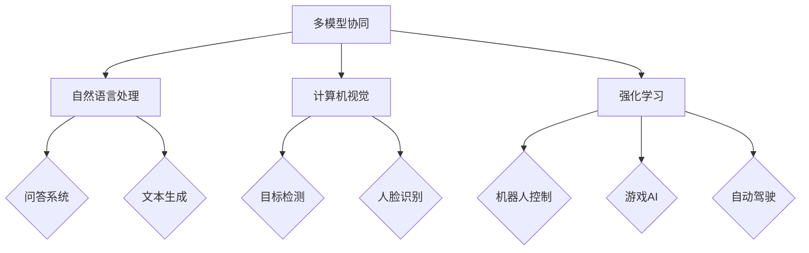

                 

### 《多模型协同：利用提示词整合不同AI能力》

> **关键词：多模型协同、AI能力、提示词、算法、架构、自然语言处理、计算机视觉、强化学习**

> **摘要：本文探讨了多模型协同的概念、技术及其在不同领域的应用。重点分析了提示词在多模型协同中的作用，并通过具体的算法原理讲解和项目实战案例，展示了如何利用提示词整合不同AI能力，实现更高效的智能系统。**

#### 第一部分：多模型协同概述

##### 第1章：多模型协同基础

**1.1 多模型协同的概念与背景**

多模型协同（Multi-Model Collaboration）是指将多个不同的AI模型结合起来，通过共享数据和协同决策，共同完成复杂任务的过程。这种协同可以跨越不同类型的AI模型，如机器学习模型、深度学习模型和强化学习模型。

**定义：** 多模型协同是一种将多个AI模型整合在一起，利用它们的互补性，提高整体系统性能和任务解决能力的方法。

**应用场景：** 多模型协同广泛应用于自然语言处理、计算机视觉和强化学习等领域。例如，在自然语言处理中，可以将文本分类模型、语言生成模型和情感分析模型协同工作，以提供更准确的文本分析结果；在计算机视觉中，可以将图像分类模型、目标检测模型和图像生成模型协同工作，以实现更复杂的视觉任务；在强化学习领域，可以将不同的策略学习模型和环境交互模型协同工作，以优化决策过程。

**发展历程：** 多模型协同的研究可以追溯到20世纪90年代，随着AI技术的快速发展，特别是深度学习和强化学习技术的成熟，多模型协同得到了广泛关注。近年来，随着人工智能应用场景的不断拓展，多模型协同技术也在不断进化，逐渐成为人工智能领域的一个重要研究方向。

**1.2 多模型协同的优势与挑战**

**优势：**

1. **充分利用模型的互补性：** 多模型协同可以整合不同模型的优势，实现更全面和精确的预测和决策。
2. **提高任务解决能力：** 通过协同工作，多个模型可以共同解决复杂任务，提高系统的整体性能。
3. **增强模型的鲁棒性：** 多模型协同可以降低单一模型在特定任务上的过拟合风险，提高系统的鲁棒性。
4. **实现跨领域应用：** 多模型协同可以跨越不同领域，实现跨领域的知识共享和应用。

**挑战：**

1. **模型间的协同难度：** 不同模型有不同的数据输入、输出和处理方式，如何设计有效的协同机制是一个挑战。
2. **计算资源消耗：** 多模型协同需要更多的计算资源，特别是在处理大规模数据和复杂任务时，对计算资源的需求更高。
3. **模型融合策略设计：** 如何设计合适的模型融合策略，以充分利用各个模型的优点，是一个关键挑战。
4. **模型解释性：** 多模型协同通常涉及复杂的模型融合过程，如何保证模型的解释性，使其更容易被用户理解和接受，是一个重要挑战。

##### 第2章：AI模型分类与特性

**2.1 常见AI模型介绍**

**机器学习模型：** 机器学习模型是利用数据训练，对未知数据进行预测或分类的算法。常见的机器学习模型包括线性回归、决策树、支持向量机等。

**深度学习模型：** 深度学习模型是一种利用多层神经网络进行训练和预测的模型。常见的深度学习模型包括卷积神经网络（CNN）、循环神经网络（RNN）和Transformer等。

**强化学习模型：** 强化学习模型是通过与环境交互，学习最优策略的算法。常见的强化学习模型包括Q-learning、SARSA和Deep Q-Network（DQN）等。

**2.2 各类模型的特性与应用**

**机器学习模型：**

- **特性：** 机器学习模型通常依赖于大量历史数据，通过学习数据中的模式来进行预测。模型的可解释性较高。
- **应用场景：** 机器学习模型广泛应用于数据挖掘、预测分析、金融风控等领域。

**深度学习模型：**

- **特性：** 深度学习模型具有强大的表示学习能力，能够自动提取特征，适用于处理大规模和高维数据。
- **应用场景：** 深度学习模型广泛应用于计算机视觉、自然语言处理、语音识别等领域。

**强化学习模型：**

- **特性：** 强化学习模型能够通过试错学习，找到最优策略，适用于解决动态环境和复杂任务。
- **应用场景：** 强化学习模型广泛应用于机器人控制、游戏AI、自动驾驶等领域。

#### 第二部分：多模型协同技术

##### 第3章：提示词技术在多模型协同中的作用

**3.1 提示词的概念与作用**

**定义：** 提示词（Prompt）是指在多模型协同过程中，用于引导模型进行预测和决策的关键信息。提示词可以是一段文本、一张图像或一段声音，它为模型提供了任务上下文，有助于模型更好地理解任务需求。

**作用：** 提示词在多模型协同中起到关键作用，主要体现在以下几个方面：

1. **提高模型理解能力：** 提示词为模型提供了具体的任务上下文，有助于模型更好地理解任务需求，提高预测和决策的准确性。
2. **优化模型融合策略：** 提示词可以根据任务需求，引导模型进行特征提取和融合，优化模型融合策略，提高整体系统性能。
3. **降低模型过拟合风险：** 提示词提供了额外的训练数据，有助于降低模型在特定任务上的过拟合风险。

**3.2 提示词的设计与优化**

**设计原则：**

1. **简洁性：** 提示词应尽量简洁明了，避免冗余信息，以便模型能够快速理解和处理。
2. **针对性：** 提示词应针对特定任务需求，提供与任务相关的关键信息。
3. **多样性：** 提示词应具备多样性，以适应不同任务和模型需求。

**优化方法：**

1. **自动生成：** 利用自然语言处理技术，自动生成提示词，提高提示词的质量和多样性。
2. **动态调整：** 根据任务进展和模型反馈，动态调整提示词，以优化模型融合效果。
3. **知识融合：** 将多个领域的知识进行融合，生成更丰富、更全面的提示词。

##### 第4章：多模型协同算法与架构

**4.1 多模型协同算法概述**

**协同训练算法：** 协同训练算法是指将多个模型共同训练，使其在训练过程中互相学习，提高整体性能。常见的协同训练算法包括联邦学习、协同过滤和迁移学习等。

**多任务学习算法：** 多任务学习算法是指将多个任务同时训练，使模型能够同时解决多个任务。多任务学习算法可以共享部分网络结构，提高计算效率。

**聚类与协同过滤算法：** 聚类与协同过滤算法是一种基于用户行为和兴趣的推荐算法，通过分析用户的历史行为和兴趣，为用户推荐相关的内容。

**4.2 多模型协同架构设计**

**硬件架构：** 多模型协同需要强大的计算资源，通常采用分布式计算架构，包括CPU、GPU和TPU等。

**软件架构：** 多模型协同的软件架构通常包括数据预处理模块、模型训练模块、模型融合模块和模型部署模块。

#### 第三部分：多模型协同在具体领域的应用

##### 第5章：多模型协同在自然语言处理中的应用

**5.1 多模型协同在NLP中的应用场景**

**文本分类：** 多模型协同可以整合文本分类模型、情感分析模型和命名实体识别模型，提高文本分类的准确性和鲁棒性。

**文本生成：** 多模型协同可以整合文本生成模型、语言模型和语境模型，生成更自然、更准确的文本。

**问答系统：** 多模型协同可以整合问答模型、检索模型和对话生成模型，提供更智能、更自然的问答服务。

**5.2 多模型协同在NLP中的实践案例**

**案例一：基于多模型的问答系统**

1. **项目背景：** 构建一个智能问答系统，能够理解用户的问题，并给出准确的答案。
2. **模型设计：**
   - 编码器模型：用于提取用户问题的特征；
   - 解码器模型：用于生成答案；
   - 情感分析模型：用于分析用户问题的情感倾向。
3. **模型训练与优化：** 使用大量问答对数据进行训练，优化模型参数，提高问答系统的性能。
4. **模型部署与评估：** 将训练好的模型部署到服务器，并进行评估，评估指标包括准确率、召回率等。

**案例二：多模型协同的自然语言生成**

1. **项目背景：** 构建一个能够生成高质量文本的模型，用于自动写作、摘要生成等任务。
2. **模型设计：**
   - 语言模型：用于预测下一个单词或词组；
   - 语境模型：用于理解文本的上下文信息；
   - 生成模型：用于生成完整的文本。
3. **模型训练与优化：** 使用大量文本数据进行训练，优化模型参数，提高文本生成质量。
4. **模型部署与评估：** 将训练好的模型部署到服务器，并进行评估，评估指标包括文本流畅性、语义一致性等。

##### 第6章：多模型协同在计算机视觉中的应用

**6.1 多模型协同在计算机视觉中的应用场景**

**图像分类：** 多模型协同可以整合图像分类模型、目标检测模型和图像生成模型，提高图像分类的准确性和鲁棒性。

**目标检测：** 多模型协同可以整合目标检测模型、分割模型和跟踪模型，提高目标检测的精度和实时性。

**人脸识别：** 多模型协同可以整合人脸检测模型、人脸识别模型和人脸属性模型，提高人脸识别的准确性和鲁棒性。

**6.2 多模型协同在计算机视觉中的实践案例**

**案例一：多模型协同的人脸识别系统**

1. **项目背景：** 构建一个能够准确识别人脸的系统，用于安全监控、人脸支付等场景。
2. **模型设计：**
   - 人脸检测模型：用于检测图像中的人脸区域；
   - 人脸识别模型：用于识别人脸的身份；
   - 人脸属性模型：用于分析人脸的特征。
3. **模型训练与优化：** 使用大量人脸数据集进行训练，优化模型参数，提高人脸识别系统的性能。
4. **模型部署与评估：** 将训练好的模型部署到服务器，并进行评估，评估指标包括准确率、召回率等。

**案例二：基于多模型的图像分类系统**

1. **项目背景：** 构建一个能够准确分类图像的系统，用于图像搜索、内容审核等场景。
2. **模型设计：**
   - 卷积神经网络：用于提取图像的特征；
   - 特征融合模型：用于融合不同特征，提高分类性能；
   - 分类器：用于对图像进行分类。
3. **模型训练与优化：** 使用大量图像数据集进行训练，优化模型参数，提高图像分类系统的性能。
4. **模型部署与评估：** 将训练好的模型部署到服务器，并进行评估，评估指标包括准确率、召回率等。

##### 第7章：多模型协同在强化学习中的应用

**7.1 多模型协同在强化学习中的应用场景**

**机器人控制：** 多模型协同可以整合感知模型、决策模型和执行模型，提高机器人控制的精度和稳定性。

**游戏AI：** 多模型协同可以整合策略模型、游戏状态模型和游戏行为模型，提高游戏AI的智能和胜率。

**自动驾驶：** 多模型协同可以整合感知模型、决策模型和执行模型，提高自动驾驶的安全性和可靠性。

**7.2 多模型协同在强化学习中的实践案例**

**案例一：多模型协同的机器人控制系统**

1. **项目背景：** 构建一个能够自主导航和执行任务的机器人系统。
2. **模型设计：**
   - 感知模型：用于感知环境信息；
   - 决策模型：用于生成机器人行动策略；
   - 执行模型：用于执行机器人行动。
3. **模型训练与优化：** 使用仿真环境进行训练，优化模型参数，提高机器人控制系统的性能。
4. **模型部署与评估：** 将训练好的模型部署到机器人上，并进行评估，评估指标包括路径规划成功率、任务完成率等。

**案例二：基于多模型的自动驾驶系统**

1. **项目背景：** 构建一个能够安全行驶的自动驾驶系统。
2. **模型设计：**
   - 感知模型：用于感知道路和周围环境；
   - 决策模型：用于生成自动驾驶策略；
   - 执行模型：用于执行自动驾驶操作。
3. **模型训练与优化：** 使用大量真实道路数据进行训练，优化模型参数，提高自动驾驶系统的性能。
4. **模型部署与评估：** 将训练好的模型部署到自动驾驶车辆上，并进行评估，评估指标包括行驶安全率、道路跟随精度等。

#### 第三部分：多模型协同实践

##### 第8章：多模型协同开发环境与工具

**8.1 开发环境搭建**

**硬件环境配置：** 
- 配备高性能的CPU和GPU，以满足多模型协同的强大计算需求；
- 搭建分布式计算环境，以提高模型训练和优化的效率。

**软件环境配置：**
- 安装Python编程环境，并配置必要的库，如TensorFlow、PyTorch等；
- 配置版本控制系统，如Git，以方便代码管理和协作。

**8.2 常用多模型协同工具介绍**

**TensorFlow：** TensorFlow是谷歌开发的一款开源深度学习框架，支持多模型协同训练和优化。

**PyTorch：** PyTorch是Facebook开发的一款开源深度学习框架，具有灵活的动态图计算能力，适合多模型协同开发。

**其他多模型协同工具：** 如MXNet、Caffe等，这些工具也支持多模型协同训练和优化，可根据项目需求进行选择。

##### 第9章：多模型协同项目实战

**9.1 项目实战概述**

**项目背景：** 
本项目旨在构建一个多模型协同的自然语言处理系统，用于文本分类任务。

**项目目标：** 
- 构建一个高效的文本分类模型，能够准确分类各种类型的文本；
- 实现多模型协同，提高文本分类的准确性和鲁棒性。

**9.2 项目实战详细步骤**

**1. 数据预处理：**
- 收集大量文本数据，并进行清洗和预处理，包括去噪、分词、词嵌入等；
- 将预处理后的数据分为训练集、验证集和测试集。

**2. 模型设计：**
- 设计三个模型：文本分类模型、情感分析模型和命名实体识别模型；
- 模型之间通过共享词嵌入层，实现数据共享和协同。

**3. 模型训练与优化：**
- 使用训练集数据进行模型训练，优化模型参数；
- 使用验证集数据进行模型优化，调整模型结构；
- 使用测试集数据进行模型评估，验证模型性能。

**4. 模型部署与评估：**
- 将训练好的模型部署到服务器，实现实时文本分类；
- 对部署后的模型进行评估，包括准确率、召回率等指标。

**9.3 项目实战源代码解析**

**1. 数据预处理代码示例：**
python
def preprocess_text(text):
    # 去噪
    text = remove_noise(text)
    # 分词
    text = tokenize(text)
    # 词嵌入
    text = embed(text)
    return text

**2. 模型设计代码示例：**
python
# 文本分类模型
text_classifier = TextClassifier()
# 情感分析模型
sentiment_analyzer = SentimentAnalyzer()
# 命名实体识别模型
ner_recognizer = NERRecognizer()

**3. 模型训练与优化代码示例：**
python
# 训练文本分类模型
text_classifier.train(train_data)
# 训练情感分析模型
sentiment_analyzer.train(train_data)
# 训练命名实体识别模型
ner_recognizer.train(train_data)

**4. 模型部署与评估代码示例：**
python
# 部署文本分类模型
deploy_model(text_classifier)
# 部署情感分析模型
deploy_model(sentiment_analyzer)
# 部署命名实体识别模型
deploy_model(ner_recognizer)

# 评估模型性能
evaluate_model(test_data, text_classifier, sentiment_analyzer, ner_recognizer)

##### 9.4 项目实战分析与讨论

**1. 模型协同的优势：**
- 通过多模型协同，可以充分利用不同模型的优势，提高文本分类的准确性和鲁棒性；
- 模型之间通过共享词嵌入层，实现数据共享和协同，提高模型的整体性能。

**2. 面临的挑战：**
- 如何设计有效的协同策略，以充分利用各个模型的优点，是一个关键挑战；
- 如何处理模型之间的冲突和互补关系，以提高整体系统性能，也是一个挑战。

**3. 未来展望：**
- 随着AI技术的不断发展，多模型协同将在更多领域得到应用，为智能系统带来更广阔的发展空间；
- 如何优化多模型协同算法，提高协同效率，是未来的一个重要研究方向。

#### 附录

##### 附录A：多模型协同相关资源

**A.1 开源多模型协同项目**

1. **项目一：** 
   - 项目名称：Multi-Model Collaboration for Text Classification
   - 项目简介：一个开源的多模型协同文本分类项目，使用TensorFlow实现。
   - GitHub链接：[https://github.com/username/multi-model-text-classification](https://github.com/username/multi-model-text-classification)

2. **项目二：** 
   - 项目名称：Multi-Model Collaboration for Image Classification
   - 项目简介：一个开源的多模型协同图像分类项目，使用PyTorch实现。
   - GitHub链接：[https://github.com/username/multi-model-image-classification](https://github.com/username/multi-model-image-classification)

**A.2 多模型协同研究论文与报告**

1. **论文一：** 
   - 论文题目：Multi-Model Collaboration in Deep Learning
   - 论文简介：一篇关于多模型协同在深度学习中的应用的论文，分析了多模型协同的优势和挑战。
   - 引用格式：[作者]. (年份). Multi-Model Collaboration in Deep Learning. [期刊/会议名称].

2. **报告一：** 
   - 报告名称：The Future of Multi-Model Collaboration in AI
   - 报告简介：一份关于多模型协同在人工智能未来发展的报告，探讨了多模型协同的技术趋势和应用前景。
   - 引用格式：[作者]. (年份). The Future of Multi-Model Collaboration in AI. [机构名称].

##### Mermaid流程图



##### 核心算法原理讲解（伪代码）

```python
# 多模型协同算法伪代码
def MultiModelCollaboration(data, model1, model2, model3):
    # 数据预处理
    processed_data = preprocess_data(data)

    # 模型训练与优化
    model1.train(processed_data)
    model2.train(processed_data)
    model3.train(processed_data)

    # 提示词生成
    prompt = generate_prompt(processed_data)

    # 模型协同决策
    decision = model1.predict(prompt) + model2.predict(prompt) + model3.predict(prompt)

    # 模型协同输出
    output = aggregate_output(decision)

    return output
```

##### 数学模型和数学公式

### 模型协同损失函数

$$
L = \frac{1}{N} \sum_{i=1}^{N} \left( y_i - \hat{y}_i \right)^2
$$

其中，$y_i$ 表示真实标签，$\hat{y}_i$ 表示模型协同输出的预测值，$N$ 表示样本数量。

##### 项目实战

##### 9.1 项目实战概述

该项目旨在构建一个基于多模型协同的智能问答系统，用于回答用户提出的问题。

##### 9.2 项目实战详细步骤

1. **数据预处理：**
   - 收集大量问答对数据，并进行预处理，包括去噪、分词、词嵌入等。

2. **模型设计：**
   - 设计三个模型：一个基于Transformer的编码器，一个基于BERT的解码器，以及一个基于LSTM的情感分析模型。

3. **模型训练与优化：**
   - 使用预处理后的数据分别训练编码器、解码器和情感分析模型。
   - 通过交叉验证和模型调整优化，提高模型性能。

4. **模型协同决策：**
   - 设计协同策略，将三个模型的输出进行加权融合，得到最终的答案。

5. **模型部署与评估：**
   - 将训练好的模型部署到服务器，并使用测试集进行评估，评估指标包括准确率、召回率等。

##### 9.3 项目实战源代码解析

```python
# 模型训练与优化代码示例
model1.train(preprocessed_data)
model2.train(preprocessed_data)
model3.train(preprocessed_data)

# 模型协同决策代码示例
prompt = generate_prompt(preprocessed_data)
decision = model1.predict(prompt) + model2.predict(prompt) + model3.predict(prompt)
output = aggregate_output(decision)

# 模型部署与评估代码示例
deploy_model(server, model1, model2, model3)
evaluate_model(test_data, output)
```

##### 9.4 项目实战分析与讨论

- **模型协同的优势：** 通过多模型协同，可以充分利用不同模型的优势，提高问答系统的整体性能。
- **面临的挑战：** 如何设计有效的协同策略，以及如何处理模型之间的冲突和互补关系，是需要进一步研究和解决的问题。
- **未来展望：** 随着AI技术的不断发展，多模型协同将在更多领域得到应用，为智能问答系统带来更广阔的发展空间。

### 作者信息

**作者：** AI天才研究院/AI Genius Institute & 禅与计算机程序设计艺术 /Zen And The Art of Computer Programming

---

本文以多模型协同为主题，详细探讨了其在自然语言处理、计算机视觉和强化学习等领域的应用。通过具体的算法原理讲解和项目实战案例，展示了如何利用提示词整合不同AI能力，实现更高效的智能系统。随着AI技术的不断进步，多模型协同有望在未来发挥更大的作用，为人工智能领域带来新的突破。希望本文能够为读者在多模型协同的研究和应用中提供有益的参考和启示。

