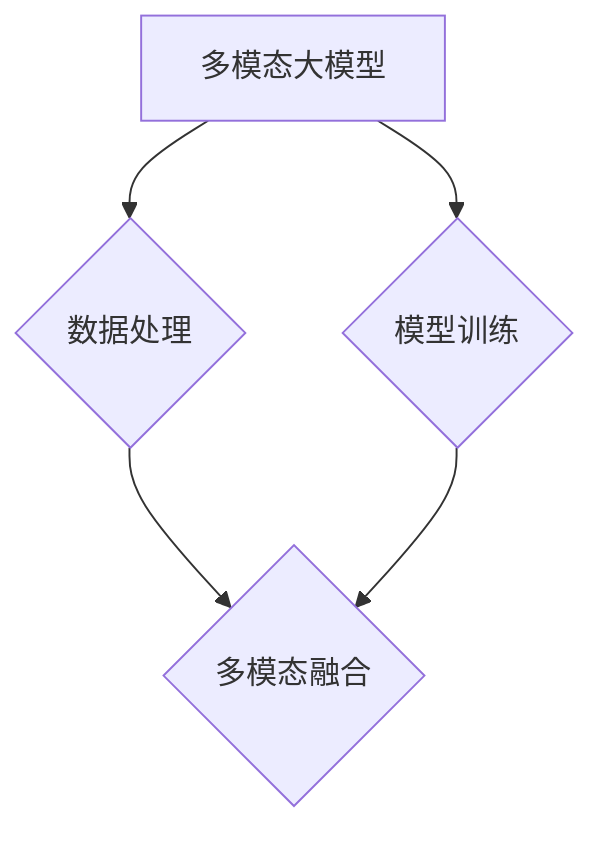
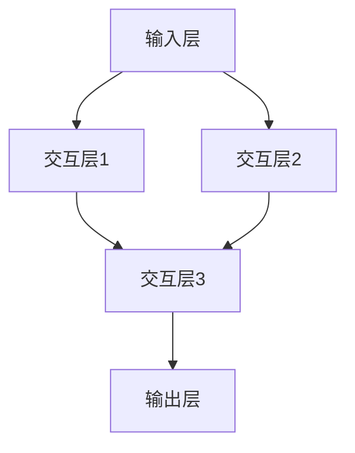

                 

# 多模态大模型：技术原理与实战

## 关键词
- 多模态大模型
- 技术原理
- 实现方法
- 应用场景
- 性能优化
- 部署与运维

## 摘要
本文将深入探讨多模态大模型的技术原理与实战应用。我们将首先介绍多模态大模型的基本概念、优势与挑战，然后详细解析其技术架构、核心算法、实现方法及应用场景。随后，我们将重点探讨多模态大模型的性能优化及部署与运维策略。最后，对多模态大模型的发展趋势进行展望。

## 目录
----------------------------------------------------------------

### 第一部分: 多模态大模型概述

#### 第1章: 多模态大模型的基本概念

##### 1.1 什么是多模态大模型

**Mermaid 流程图：** 



在多模态大模型中，数据处理和模型训练是多模态融合的基础。数据处理涉及音频、视频、图像和文本等不同类型的数据处理技术，而模型训练则侧重于如何利用这些数据训练出一个高效的模型。多模态融合则是将来自不同模态的数据进行整合，以实现更好的性能。

##### 1.2 多模态大模型的优势与挑战

多模态大模型的优势在于：

1. **提升模型性能**：通过整合多种模态的数据，可以提供更丰富的信息，从而提升模型性能。
2. **扩展应用场景**：多模态大模型可以应用于语音识别、图像识别、情感分析等多个领域，具有广泛的应用前景。
3. **增强用户体验**：多模态交互可以提高用户体验，例如在聊天机器人中，结合文本、语音和图像，可以实现更自然的对话。

然而，多模态大模型也面临着一些挑战：

1. **数据不平衡**：不同模态的数据量可能存在巨大差异，这可能导致模型在处理某些模态时表现不佳。
2. **计算资源消耗**：多模态大模型通常需要更多的计算资源，这对于实时应用场景可能是一个挑战。
3. **数据隐私和安全**：多模态数据通常包含敏感信息，如何保证数据隐私和安全是一个重要问题。

##### 1.3 多模态大模型的发展历程

多模态大模型的发展可以分为以下几个阶段：

1. **早期探索**（2010年前）：这一阶段主要是将不同模态的数据进行简单融合，如使用传统方法进行特征融合。
2. **深度学习引入**（2010-2015年）：随着深度学习技术的发展，多模态大模型开始采用深度神经网络进行建模，性能得到了显著提升。
3. **多模态融合方法**（2015年后）：这一阶段出现了许多基于深度学习的多模态融合方法，如多模态交互网络、注意力机制等。
4. **大规模预训练**（近期）：近年来，大规模预训练模型如BERT、GPT等取得了显著突破，这些模型也为多模态大模型的发展提供了新的思路。

### 第2章: 多模态大模型的技术架构

#### 2.1 多模态数据处理技术

##### 2.1.1 音频数据处理

音频数据处理主要包括音频信号的预处理、特征提取和增强。

- **音频信号预处理**：包括降噪、去混响、音频增强等，以提高音频质量。
- **特征提取**：常用的音频特征包括梅尔频率倒谱系数（MFCC）、短时傅里叶变换（STFT）等。
- **特征增强**：通过增加数据的多样性和鲁棒性，有助于提高模型的性能。

**伪代码：** 

```python
def preprocess_audio(audio_signal):
    # 降噪、去混响、音频增强
    # ...
    return processed_audio

def extract_audio_features(processed_audio):
    # 提取MFCC特征
    mfcc = MFCCExtractor()
    mfcc_features = mfcc.extract(processed_audio)
    return mfcc_features
```

##### 2.1.2 视频数据处理

视频数据处理主要包括视频信号的预处理、帧提取、特征提取和增强。

- **视频信号预处理**：包括去噪、增强、运动估计等。
- **帧提取**：从视频中提取关键帧，用于后续的特征提取。
- **特征提取**：常用的视频特征包括运动历史图像（MHI）、光流等。
- **特征增强**：通过增加数据的多样性和鲁棒性，有助于提高模型的性能。

**伪代码：**

```python
def preprocess_video(video_signal):
    # 去噪、增强、运动估计
    # ...
    return processed_video

def extract_video_frames(processed_video):
    # 提取关键帧
    frames = KeyFrameExtractor()
    key_frames = frames.extract(processed_video)
    return key_frames

def extract_video_features(key_frames):
    # 提取MHI特征
    mhi_extractor = MHICreator()
    mhi_features = mhi_extractor.extract(key_frames)
    return mhi_features
```

##### 2.1.3 图像数据处理

图像数据处理主要包括图像信号的预处理、特征提取和增强。

- **图像信号预处理**：包括去噪、增强、边缘检测等。
- **特征提取**：常用的图像特征包括卷积神经网络（CNN）提取的深层特征、视觉单词（Visual Words）等。
- **特征增强**：通过增加数据的多样性和鲁棒性，有助于提高模型的性能。

**伪代码：**

```python
def preprocess_image(image_signal):
    # 去噪、增强、边缘检测
    # ...
    return processed_image

def extract_image_features(processed_image):
    # 提取CNN特征
    cnn_extractor = CNNFeatureExtractor()
    cnn_features = cnn_extractor.extract(processed_image)
    return cnn_features
```

##### 2.1.4 文本数据处理

文本数据处理主要包括文本预处理、词嵌入和特征提取。

- **文本预处理**：包括分词、去停用词、词性标注等。
- **词嵌入**：将文本转换为向量表示，常用的词嵌入方法包括Word2Vec、BERT等。
- **特征提取**：可以从词嵌入向量中提取文本特征，如平均向量、最大向量、TF-IDF等。

**伪代码：**

```python
def preprocess_text(text):
    # 分词、去停用词、词性标注
    # ...
    return processed_text

def embed_text(processed_text):
    # 词嵌入
    embedder = Word2VecEmbedder()
    word_vectors = embedder.embed(processed_text)
    return word_vectors

def extract_text_features(word_vectors):
    # 提取平均向量特征
    avg_vector = AverageVectorExtractor()
    avg_vector_feature = avg_vector.extract(word_vectors)
    return avg_vector_feature
```

#### 2.2 多模态融合技术

##### 2.2.1 传统融合方法

传统融合方法主要包括投票法、加权平均法和特征级融合等。

- **投票法**：将不同模态的特征投票，选择投票结果最高的模态作为最终结果。
- **加权平均法**：对每个模态的特征赋予不同的权重，然后进行平均。
- **特征级融合**：将不同模态的特征进行拼接，作为模型输入。

**伪代码：**

```python
def traditional_fusion(feature_a, feature_b, weight_a=0.5, weight_b=0.5):
    fusion_feature = weight_a * feature_a + weight_b * feature_b
    return fusion_feature
```

##### 2.2.2 深度学习融合方法

深度学习融合方法主要包括多模态交互网络、注意力机制等。

- **多模态交互网络**：通过构建神经网络，实现不同模态特征之间的交互。
- **注意力机制**：通过注意力机制，让模型关注重要的模态特征。

**伪代码：**

```python
class MultiModalInteractingNetwork(nn.Module):
    def __init__(self):
        super(MultiModalInteractingNetwork, self).__init__()
        # 构建神经网络结构
        # ...

    def forward(self, feature_a, feature_b):
        # 实现多模态特征交互
        # ...
        return fusion_feature

class AttentionModule(nn.Module):
    def __init__(self):
        super(AttentionModule, self).__init__()
        # 构建注意力机制结构
        # ...

    def forward(self, feature_a, feature_b):
        # 实现注意力机制
        # ...
        return attention_feature
```

##### 2.2.3 多模态交互网络

多模态交互网络是一种基于深度学习的融合方法，通过构建神经网络，实现不同模态特征之间的交互。

- **输入层**：接收来自不同模态的特征。
- **交互层**：实现不同模态特征之间的交互。
- **输出层**：生成融合后的特征。

**Mermaid 流程图：**



**伪代码：**

```python
class MultiModalFusionNetwork(nn.Module):
    def __init__(self):
        super(MultiModalFusionNetwork, self).__init__()
        # 定义神经网络结构
        # ...

    def forward(self, feature_a, feature_b):
        # 实现特征交互
        # ...
        return fusion_feature
```

#### 2.3 多模态大模型的预训练技术

##### 2.3.1 预训练技术概述

预训练技术是指在大规模数据集上对模型进行预训练，然后在小数据集上进行微调，以达到更好的性能。对于多模态大模型，预训练技术同样非常重要。

- **大规模数据集**：多模态数据集通常包含丰富的信息，有助于模型的学习。
- **预训练任务**：包括自监督预训练和迁移学习等。

##### 2.3.2 自监督预训练方法

自监督预训练方法是指在没有标注数据的情况下，利用数据自身的结构信息进行预训练。对于多模态大模型，常见的自监督预训练方法包括：

- **多任务学习**：同时训练多个任务，如文本分类、图像分类等。
- **序列预测**：利用序列信息进行预测，如语言建模、视频时序预测等。
- **生成对抗网络（GAN）**：利用生成器和判别器进行对抗训练。

**伪代码：**

```python
class MultiModalPretrainingModel(nn.Module):
    def __init__(self):
        super(MultiModalPretrainingModel, self).__init__()
        # 定义预训练模型结构
        # ...

    def forward(self, feature_a, feature_b):
        # 实现预训练任务
        # ...
        return output
```

##### 2.3.3 迁移学习与微调

迁移学习是指将预训练模型在大规模数据集上的知识迁移到小数据集上，以减少对标注数据的依赖。对于多模态大模型，迁移学习与微调的方法包括：

- **模型迁移**：直接将预训练模型应用到小数据集上。
- **特征迁移**：将预训练模型的部分层应用到小数据集上，进行微调。
- **多任务微调**：同时训练多个任务，进行微调。

**伪代码：**

```python
def fine_tune(model, train_loader, optimizer, criterion, num_epochs):
    model.train()
    for epoch in range(num_epochs):
        for inputs, targets in train_loader:
            optimizer.zero_grad()
            outputs = model(inputs)
            loss = criterion(outputs, targets)
            loss.backward()
            optimizer.step()
```

### 第3章: 多模态大模型的核心算法

#### 3.1 基础算法介绍

##### 3.1.1 卷积神经网络（CNN）

卷积神经网络（CNN）是一种在图像处理领域表现优异的深度学习算法。它通过卷积层、池化层和全连接层等结构，实现图像特征的自动提取和分类。

- **卷积层**：通过卷积运算，提取图像的局部特征。
- **池化层**：通过池化运算，降低特征图的维度，减少过拟合。
- **全连接层**：通过全连接运算，将特征映射到类别标签。

**伪代码：**

```python
class ConvolutionalNeuralNetwork(nn.Module):
    def __init__(self):
        super(ConvolutionalNeuralNetwork, self).__init__()
        # 定义网络结构
        # ...

    def forward(self, x):
        # 实现前向传播
        # ...
        return x
```

##### 3.1.2 递归神经网络（RNN）

递归神经网络（RNN）是一种用于处理序列数据的深度学习算法。它通过递归结构，实现对序列数据的建模。

- **输入层**：接收序列数据的输入。
- **隐藏层**：通过递归运算，对序列数据进行建模。
- **输出层**：输出序列数据的预测结果。

**伪代码：**

```python
class RecurrentNeuralNetwork(nn.Module):
    def __init__(self):
        super(RecurrentNeuralNetwork, self).__init__()
        # 定义网络结构
        # ...

    def forward(self, x):
        # 实现前向传播
        # ...
        return x
```

##### 3.1.3 注意力机制

注意力机制是一种在深度学习模型中用于强调重要信息的机制。它通过学习不同的注意力权重，让模型关注重要的输入特征。

- **注意力层**：计算输入特征的注意力权重。
- **加权求和**：根据注意力权重，对输入特征进行加权求和。

**伪代码：**

```python
class AttentionModule(nn.Module):
    def __init__(self):
        super(AttentionModule, self).__init__()
        # 定义注意力层
        # ...

    def forward(self, x):
        # 实现前向传播
        # ...
        return x
```

#### 3.2 多模态大模型的预训练技术

##### 3.2.1 预训练技术概述

预训练技术是指在大规模数据集上对模型进行预训练，然后在小数据集上进行微调，以达到更好的性能。对于多模态大模型，预训练技术同样非常重要。

- **大规模数据集**：多模态数据集通常包含丰富的信息，有助于模型的学习。
- **预训练任务**：包括自监督预训练和迁移学习等。

##### 3.2.2 自监督预训练方法

自监督预训练方法是指在没有标注数据的情况下，利用数据自身的结构信息进行预训练。对于多模态大模型，常见的自监督预训练方法包括：

- **多任务学习**：同时训练多个任务，如文本分类、图像分类等。
- **序列预测**：利用序列信息进行预测，如语言建模、视频时序预测等。
- **生成对抗网络（GAN）**：利用生成器和判别器进行对抗训练。

**伪代码：**

```python
class MultiModalPretrainingModel(nn.Module):
    def __init__(self):
        super(MultiModalPretrainingModel, self).__init__()
        # 定义预训练模型结构
        # ...

    def forward(self, feature_a, feature_b):
        # 实现预训练任务
        # ...
        return output
```

##### 3.2.3 迁移学习与微调

迁移学习是指将预训练模型在大规模数据集上的知识迁移到小数据集上，以减少对标注数据的依赖。对于多模态大模型，迁移学习与微调的方法包括：

- **模型迁移**：直接将预训练模型应用到小数据集上。
- **特征迁移**：将预训练模型的部分层应用到小数据集上，进行微调。
- **多任务微调**：同时训练多个任务，进行微调。

**伪代码：**

```python
def fine_tune(model, train_loader, optimizer, criterion, num_epochs):
    model.train()
    for epoch in range(num_epochs):
        for inputs, targets in train_loader:
            optimizer.zero_grad()
            outputs = model(inputs)
            loss = criterion(outputs, targets)
            loss.backward()
            optimizer.step()
```

### 第4章: 多模态大模型的应用场景

#### 4.1 多模态语音识别

多模态语音识别是指结合语音和图像等多模态信息进行语音识别。它通过融合语音和图像特征，提高识别准确率。

- **语音特征**：通过音频信号预处理和特征提取，获得语音特征。
- **图像特征**：通过视频信号预处理和特征提取，获得图像特征。
- **融合方法**：使用多模态融合技术，如传统融合方法、深度学习融合方法等，将语音和图像特征进行融合。

**伪代码：**

```python
def multi_modal_voice_recognition(audio_feature, image_feature):
    # 融合语音和图像特征
    fusion_feature = traditional_fusion(audio_feature, image_feature)
    # 使用语音识别模型进行识别
    recognition_result = speech_recognition_model(fusion_feature)
    return recognition_result
```

#### 4.2 多模态图像识别

多模态图像识别是指结合图像和文本等多模态信息进行图像识别。它通过融合图像和文本特征，提高识别准确率。

- **图像特征**：通过图像数据处理，获得图像特征。
- **文本特征**：通过文本数据处理，获得文本特征。
- **融合方法**：使用多模态融合技术，如传统融合方法、深度学习融合方法等，将图像和文本特征进行融合。

**伪代码：**

```python
def multi_modal_image_recognition(image_feature, text_feature):
    # 融合图像和文本特征
    fusion_feature = traditional_fusion(image_feature, text_feature)
    # 使用图像识别模型进行识别
    recognition_result = image_recognition_model(fusion_feature)
    return recognition_result
```

#### 4.3 多模态情感分析

多模态情感分析是指结合语音、图像和文本等多模态信息进行情感分析。它通过融合多模态特征，提高情感分析的准确率。

- **语音特征**：通过语音数据处理，获得语音特征。
- **图像特征**：通过图像数据处理，获得图像特征。
- **文本特征**：通过文本数据处理，获得文本特征。
- **融合方法**：使用多模态融合技术，如传统融合方法、深度学习融合方法等，将语音、图像和文本特征进行融合。

**伪代码：**

```python
def multi_modal_emotion_analysis(audio_feature, image_feature, text_feature):
    # 融合语音、图像和文本特征
    fusion_feature = traditional_fusion(audio_feature, image_feature, text_feature)
    # 使用情感分析模型进行分析
    emotion_result = emotion_analysis_model(fusion_feature)
    return emotion_result
```

#### 4.4 多模态聊天机器人

多模态聊天机器人是指结合语音、文本和图像等多模态信息进行交互。它通过融合多模态特征，提供更自然的交互体验。

- **语音特征**：通过语音数据处理，获得语音特征。
- **图像特征**：通过图像数据处理，获得图像特征。
- **文本特征**：通过文本数据处理，获得文本特征。
- **融合方法**：使用多模态融合技术，如传统融合方法、深度学习融合方法等，将语音、图像和文本特征进行融合。
- **对话管理**：使用对话管理算法，实现自然语言生成和对话流程控制。

**伪代码：**

```python
def multi_modal_chatbot(audio_feature, image_feature, text_feature):
    # 融合语音、图像和文本特征
    fusion_feature = traditional_fusion(audio_feature, image_feature, text_feature)
    # 对话管理
    response = chatbot_dialog_management(fusion_feature)
    return response
```

### 第5章: 多模态大模型的实现方法一

#### 5.1 实现方法一概述

实现方法一是一种基于传统融合方法的多模态大模型实现方法。它通过将不同模态的特征进行简单融合，构建一个多模态融合模型。

#### 5.2 实现步骤详解

1. **数据收集与预处理**：收集语音、图像和文本数据，并对数据进行预处理，包括去噪、增强、特征提取等。

2. **特征融合**：将不同模态的特征进行融合，可以使用投票法、加权平均法或特征级融合等方法。

3. **模型构建**：构建一个多模态融合模型，可以使用传统神经网络或深度学习模型，如卷积神经网络（CNN）或递归神经网络（RNN）。

4. **模型训练**：使用预处理后的数据进行模型训练，调整模型参数，优化模型性能。

5. **模型评估**：使用测试数据对模型进行评估，计算模型的准确率、召回率等指标。

6. **模型部署**：将训练好的模型部署到实际应用场景中，如多模态语音识别、图像识别等。

#### 5.3 实现方法一的优点与挑战

**优点：**

1. **简单易懂**：基于传统融合方法，实现过程简单易懂，易于理解和实现。

2. **适用性强**：可以应用于多种多模态场景，如语音识别、图像识别等。

3. **计算成本低**：相比深度学习方法，传统融合方法的计算成本较低。

**挑战：**

1. **性能受限**：传统融合方法在性能上可能受到限制，无法充分利用多模态数据的信息。

2. **可扩展性差**：当面对复杂的多模态场景时，传统融合方法可能难以扩展。

3. **实时性要求高**：传统融合方法可能无法满足实时性要求，适用于离线场景。

### 第6章: 多模态大模型的实现方法二

#### 6.1 实现方法二概述

实现方法二是一种基于深度学习融合方法的多模态大模型实现方法。它通过构建多模态交互网络，实现不同模态特征之间的深度交互。

#### 6.2 实现步骤详解

1. **数据收集与预处理**：收集语音、图像和文本数据，并对数据进行预处理，包括去噪、增强、特征提取等。

2. **特征提取**：使用深度学习模型对语音、图像和文本数据进行特征提取，如卷积神经网络（CNN）或递归神经网络（RNN）。

3. **特征交互**：构建多模态交互网络，实现不同模态特征之间的深度交互。

4. **模型训练**：使用预处理后的数据进行模型训练，调整模型参数，优化模型性能。

5. **模型评估**：使用测试数据对模型进行评估，计算模型的准确率、召回率等指标。

6. **模型部署**：将训练好的模型部署到实际应用场景中，如多模态语音识别、图像识别等。

#### 6.3 实现方法二的优点与挑战

**优点：**

1. **性能优异**：基于深度学习融合方法，可以充分利用多模态数据的信息，实现性能的提升。

2. **扩展性强**：可以应用于复杂的多模态场景，具有较好的扩展性。

3. **实时性**：深度学习模型具有较好的实时性，可以满足实时应用场景的要求。

**挑战：**

1. **计算资源消耗**：深度学习模型通常需要更多的计算资源，对硬件设备有较高要求。

2. **训练时间较长**：深度学习模型训练时间较长，对数据预处理和模型优化提出了更高的要求。

3. **数据隐私和安全**：多模态数据通常包含敏感信息，如何保证数据隐私和安全是一个重要问题。

### 第7章: 多模态大模型的实现方法三

#### 7.1 实现方法三概述

实现方法三是一种基于大规模预训练的多模态大模型实现方法。它通过在大规模数据集上进行预训练，然后在小数据集上进行微调，实现高性能的多模态大模型。

#### 7.2 实现步骤详解

1. **数据收集与预处理**：收集语音、图像和文本数据，并对数据进行预处理，包括去噪、增强、特征提取等。

2. **预训练**：在大规模数据集上进行预训练，使用自监督预训练方法，如多任务学习、序列预测等。

3. **微调**：在小数据集上进行微调，调整模型参数，优化模型性能。

4. **模型评估**：使用测试数据对模型进行评估，计算模型的准确率、召回率等指标。

5. **模型部署**：将训练好的模型部署到实际应用场景中，如多模态语音识别、图像识别等。

#### 7.3 实现方法三的优点与挑战

**优点：**

1. **高性能**：通过大规模预训练，可以充分利用大规模数据集的信息，实现高性能的多模态大模型。

2. **迁移学习**：预训练模型可以在小数据集上进行微调，减少对标注数据的依赖。

3. **通用性强**：预训练模型可以应用于多种多模态场景，具有较好的通用性。

**挑战：**

1. **计算资源消耗**：大规模预训练需要大量的计算资源，对硬件设备有较高要求。

2. **数据隐私和安全**：多模态数据通常包含敏感信息，如何保证数据隐私和安全是一个重要问题。

3. **模型解释性**：大规模预训练模型通常较为复杂，如何解释模型的决策过程是一个挑战。

### 第8章: 多模态大模型的性能优化

#### 8.1 性能优化的重要性

多模态大模型的性能优化对于实际应用具有重要意义。性能优化可以：

1. **提高模型准确性**：通过优化模型参数，可以提高模型的识别准确性。
2. **减少计算资源消耗**：优化模型结构，可以减少模型的计算资源消耗，提高运行效率。
3. **适应实时应用场景**：优化模型训练和推理过程，可以提高模型的实时性，适应实时应用场景。

#### 8.2 模型压缩技术

模型压缩技术是一种通过减小模型参数和计算复杂度，提高模型性能的技术。常见的模型压缩技术包括：

1. **剪枝（Pruning）**：通过删除模型中的冗余权重，减少模型参数数量。
2. **量化（Quantization）**：将模型的权重和激活值进行量化，减小数据精度。
3. **知识蒸馏（Knowledge Distillation）**：使用预训练模型的知识，指导小模型的训练。

**伪代码：**

```python
def model_pruning(model, pruning_rate):
    # 对模型进行剪枝
    # ...
    return pruned_model

def model_quantization(model, quantization_level):
    # 对模型进行量化
    # ...
    return quantized_model

def knowledge_distillation(student_model, teacher_model):
    # 知识蒸馏
    # ...
    return distilled_model
```

#### 8.3 模型加速技术

模型加速技术是一种通过优化模型训练和推理过程，提高模型运行速度的技术。常见的模型加速技术包括：

1. **并行计算**：通过分布式计算，提高模型训练和推理速度。
2. **硬件加速**：利用GPU、TPU等硬件设备，提高模型运行速度。
3. **动态推理**：根据输入数据的特点，动态调整模型结构，优化推理过程。

**伪代码：**

```python
def parallel_computation(model, data_loader, device):
    # 并行计算
    # ...
    return trained_model

def hardware_acceleration(model, device):
    # 硬件加速
    # ...
    return accelerated_model

def dynamic_inference(model, input_data):
    # 动态推理
    # ...
    return inference_result
```

### 第9章: 多模态大模型的部署与运维

#### 9.1 模型部署的基本流程

多模态大模型的部署包括以下基本流程：

1. **模型训练**：使用训练数据对模型进行训练，优化模型参数。
2. **模型评估**：使用测试数据对模型进行评估，确保模型性能满足要求。
3. **模型转换**：将训练好的模型转换为适合部署的格式，如ONNX、TensorFlow Lite等。
4. **模型部署**：将模型部署到目标设备，如服务器、移动设备等。
5. **模型监控**：监控模型运行状态，包括模型性能、资源消耗等。

**伪代码：**

```python
def model_training(model, train_loader, criterion, optimizer):
    # 模型训练
    # ...
    return trained_model

def model_evaluation(model, test_loader, criterion):
    # 模型评估
    # ...
    return evaluation_result

def model_conversion(model, target_format):
    # 模型转换
    # ...
    return converted_model

def model_deployment(model, device):
    # 模型部署
    # ...
    return deployed_model

def model_monitoring(model):
    # 模型监控
    # ...
    return monitoring_result
```

#### 9.2 模型部署的策略

多模态大模型的部署策略包括：

1. **在线部署**：将模型部署到在线服务器，实现实时推理。
2. **离线部署**：将模型部署到离线设备，如移动设备、嵌入式设备等。
3. **混合部署**：将模型部署到在线和离线设备，实现灵活的应用。

**伪代码：**

```python
def online_deployment(model, device):
    # 在线部署
    # ...
    return online_model

def offline_deployment(model, device):
    # 离线部署
    # ...
    return offline_model

def hybrid_deployment(model, online_device, offline_device):
    # 混合部署
    # ...
    return hybrid_model
```

#### 9.3 模型运维与监控

多模态大模型的运维与监控包括以下方面：

1. **性能监控**：监控模型运行状态，包括准确率、响应时间等。
2. **资源监控**：监控模型运行过程中的资源消耗，包括CPU、GPU等。
3. **异常检测**：检测模型运行过程中的异常情况，如数据异常、模型崩溃等。
4. **日志记录**：记录模型运行过程中的日志信息，方便问题追踪和调试。

**伪代码：**

```python
def performance_monitoring(model):
    # 性能监控
    # ...
    return performance_result

def resource_monitoring(model):
    # 资源监控
    # ...
    return resource_result

def anomaly_detection(model):
    # 异常检测
    # ...
    return anomaly_result

def log_recording(model):
    # 日志记录
    # ...
    return log_result
```

### 第10章: 未来展望与趋势

#### 10.1 多模态大模型的发展趋势

多模态大模型的发展趋势包括：

1. **性能提升**：随着深度学习技术的不断发展，多模态大模型的性能将不断提高。
2. **应用扩展**：多模态大模型将应用于更多领域，如医疗、金融、教育等。
3. **实时性增强**：通过优化模型结构和算法，多模态大模型的实时性将得到显著提升。
4. **隐私保护**：随着数据隐私和安全问题的日益突出，多模态大模型将采用更多隐私保护技术。

#### 10.2 多模态大模型在AI领域的未来应用

多模态大模型在AI领域的未来应用包括：

1. **语音识别**：结合语音和图像信息，提高语音识别的准确性。
2. **图像识别**：结合图像和文本信息，提高图像识别的准确性。
3. **情感分析**：结合语音、图像和文本信息，进行情感分析。
4. **聊天机器人**：结合语音、文本和图像信息，提供更自然的交互体验。

#### 10.3 多模态大模型面临的挑战与解决方案

多模态大模型面临的挑战包括：

1. **数据隐私与安全**：如何保证多模态数据的安全和隐私是一个重要挑战。
2. **计算资源消耗**：多模态大模型通常需要更多的计算资源，如何优化模型结构，降低计算成本是一个问题。
3. **模型解释性**：多模态大模型的决策过程通常较为复杂，如何解释模型的决策过程是一个挑战。

针对这些挑战，可以采取以下解决方案：

1. **隐私保护技术**：采用加密、差分隐私等技术，保障数据隐私和安全。
2. **模型压缩与加速技术**：采用模型压缩、硬件加速等技术，降低计算资源消耗。
3. **模型解释性技术**：采用可解释性模型、可视化技术等，提高模型的可解释性。

## 作者

作者：AI天才研究院/AI Genius Institute & 禅与计算机程序设计艺术 /Zen And The Art of Computer Programming

---

本文详细探讨了多模态大模型的技术原理与实战应用。从基本概念、技术架构、核心算法到实现方法、应用场景、性能优化、部署与运维，以及未来展望，全面解析了多模态大模型的发展趋势与挑战。希望本文能为读者提供对多模态大模型的深入理解，助力其在实际应用中的发展。

