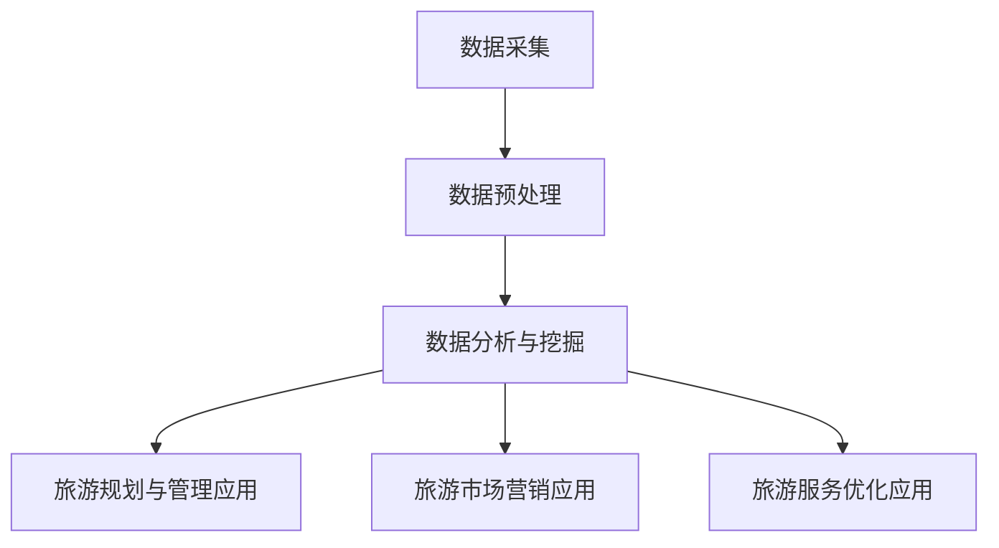
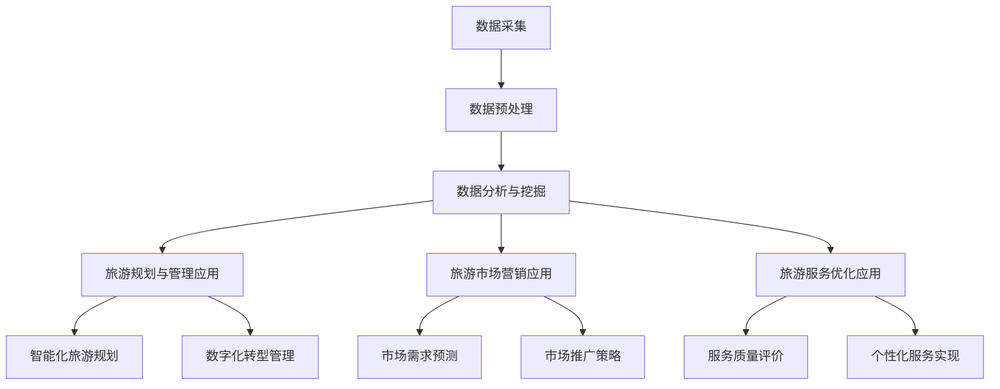
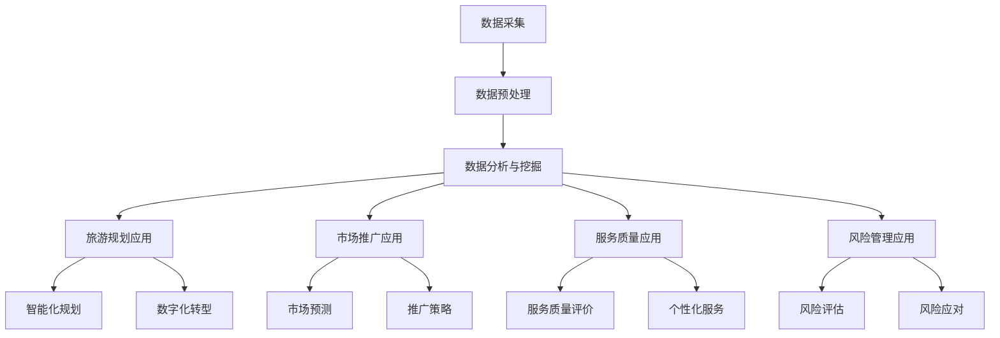
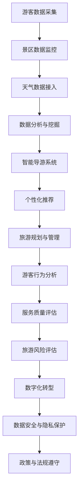

                 

# 《大数据在智慧旅游服务中的应用与挑战》

> **关键词：**智慧旅游、大数据、应用、挑战、数据安全、隐私保护

> **摘要：**本文将深入探讨大数据在智慧旅游服务中的应用和面临的挑战。首先，我们回顾智慧旅游和大数据的基本概念及其发展背景。接着，分析大数据在旅游服务中的应用领域，包括数据采集、预处理、分析与挖掘等。随后，讨论大数据在智慧旅游服务中的挑战，如数据安全与隐私保护、数据质量问题等。文章还将分享大数据在旅游规划、市场推广、服务优化等实际应用中的成功案例，并展望大数据在智慧旅游服务中的未来发展趋势和潜在创新实践。通过本文的探讨，希望为业内人士提供有价值的参考和启示。

## 《大数据在智慧旅游服务中的应用与挑战》目录大纲

## 第一部分：智慧旅游与大数据概述

### 第1章：智慧旅游与大数据背景

### 第2章：大数据在智慧旅游服务中的应用

### 第3章：大数据在智慧旅游服务中的挑战

## 第二部分：大数据在智慧旅游服务中的应用实践

### 第4章：大数据在旅游规划与管理中的应用

### 第5章：大数据在旅游市场营销中的应用

### 第6章：大数据在旅游服务优化中的应用

## 第三部分：大数据在智慧旅游服务中的应用展望

### 第7章：大数据在智慧旅游服务中的应用前景

### 第8章：大数据在智慧旅游服务中的创新实践

### 第9章：大数据在智慧旅游服务中的挑战与应对

## 附录

### 附录A：大数据在智慧旅游服务中的应用工具与资源

### 附录B：旅游大数据流程图

## 第一部分：智慧旅游与大数据概述

### 第1章：智慧旅游与大数据背景

#### 1.1 智慧旅游的兴起与发展

##### 1.1.1 智慧旅游的概念

智慧旅游是指利用现代信息技术，特别是物联网、云计算、大数据等新一代信息技术，来提升旅游行业的服务水平和产业效率。它强调通过智能化手段来优化旅游规划、管理、服务和体验，实现旅游资源的合理配置和旅游体验的个性化定制。

智慧旅游的兴起可以追溯到2000年代初期。随着互联网的普及和移动互联网的发展，人们的生活方式发生了巨大的变化。旅游作为一种重要的生活方式，也受到了互联网的深刻影响。旅游业开始意识到，利用信息技术来提升服务质量和用户体验，是提升竞争力的关键。

##### 1.1.2 智慧旅游的发展趋势

智慧旅游的发展趋势主要体现在以下几个方面：

1. **智能化旅游规划与管理**：通过大数据分析和人工智能技术，实现旅游规划的智能化和旅游管理的数字化转型。
2. **个性化旅游服务**：基于用户行为数据和偏好分析，提供个性化的旅游服务，满足不同用户的需求。
3. **智慧旅游基础设施**：建设智慧旅游基础设施，如智能导游系统、智能酒店、智慧景区等，提升旅游体验。
4. **虚拟现实和增强现实技术**：利用虚拟现实和增强现实技术，提供沉浸式的旅游体验。

##### 1.1.3 大数据在智慧旅游中的作用

大数据在智慧旅游中扮演着至关重要的角色。首先，大数据为旅游规划提供了数据支持。通过收集和分析大量的旅游数据，可以了解游客的行为习惯、偏好和需求，从而为旅游规划和产品设计提供科学依据。

其次，大数据可以帮助提升旅游服务质量。通过对游客反馈数据的分析，可以识别出服务中的不足，并针对性地进行改进。同时，大数据还可以用于智能推荐系统，为游客提供个性化的旅游服务。

最后，大数据在旅游营销中也有重要应用。通过分析市场需求和竞争态势，可以制定更加精准的营销策略，提高营销效果。

#### 1.2 大数据的定义与特征

##### 1.2.1 大数据的定义

大数据（Big Data）通常指的是无法用传统数据处理工具在合理时间内对其进行存储、管理和分析的数据集合。它具有四个基本特征，即“4V”：

1. **大量（Volume）**：数据量大，通常需要处理 TB、PB 级别的数据。
2. **多样性（Variety）**：数据类型多样，包括结构化数据、半结构化数据和非结构化数据。
3. **速度（Velocity）**：数据处理速度快，需要实时或近实时的处理能力。
4. **价值（Value）**：数据具有高价值，但同时也存在“垃圾进、垃圾出”的风险。

##### 1.2.2 大数据的特征

大数据的特征主要表现在以下几个方面：

1. **数据量巨大**：大数据的数据量远超传统数据处理能力，需要分布式存储和计算技术。
2. **数据类型多样**：大数据不仅包括文本数据，还包括图像、音频、视频等多媒体数据。
3. **处理速度要求高**：大数据的处理速度要求高，需要实时或近实时的分析能力。
4. **数据价值密度低**：大数据中包含大量的无用或重复信息，需要高效的筛选和分析。

##### 1.2.3 大数据的技术栈

大数据技术栈包括以下几个关键组件：

1. **数据存储**：如 Hadoop、HBase、MongoDB 等。
2. **数据处理**：如 MapReduce、Spark、Flink 等。
3. **数据分析和挖掘**：如 R、Python、SAS 等。
4. **数据可视化**：如 Tableau、Power BI、D3.js 等。

### 第2章：大数据在智慧旅游服务中的应用

#### 2.1 数据采集与预处理

##### 2.1.1 旅游数据的来源

旅游数据的来源主要包括以下几个方面：

1. **在线旅游平台**：如携程、去哪儿、飞猪等，这些平台积累了大量的旅游预订、评论、问答等数据。
2. **社交媒体**：如微博、微信、抖音等，这些平台上的用户行为和旅游分享数据也是重要的数据来源。
3. **旅游企业**：如景区、旅行社、酒店等，这些企业内部的运营数据也是宝贵的旅游数据。
4. **政府机构**：如旅游局、气象局等，这些机构的公共数据也是旅游数据的重要组成部分。

##### 2.1.2 数据采集的方法

数据采集的方法主要包括以下几种：

1. **主动采集**：通过爬虫技术从各种在线平台和社交媒体上获取数据。
2. **被动采集**：通过企业在运营过程中产生的数据，如游客的预订记录、消费记录等。
3. **问卷调查**：通过设计问卷，直接从游客处获取旅游体验和偏好数据。
4. **传感器数据**：如景区内的传感器数据，用于实时监测游客流量、天气情况等。

##### 2.1.3 数据预处理技术

数据预处理是大数据分析的重要环节，主要包括以下技术：

1. **数据清洗**：去除数据中的噪声和错误，如处理缺失值、重复值等。
2. **数据集成**：将来自不同来源的数据进行整合，形成一个统一的数据视图。
3. **数据变换**：对数据进行标准化、归一化等处理，以便于后续的分析。
4. **数据归一化**：将不同单位的数据转换为同一单位，如将不同时间点的数据转换为统一的时间单位。

#### 2.2 数据分析与挖掘

##### 2.2.1 数据分析的基础知识

数据分析是大数据应用的核心，主要包括以下内容：

1. **统计分析**：如描述性统计分析、回归分析、聚类分析等。
2. **机器学习**：如分类、回归、聚类、降维等。
3. **数据挖掘**：如关联规则挖掘、关联分类、文本挖掘等。

##### 2.2.2 旅游数据挖掘的方法

旅游数据挖掘的方法主要包括以下几种：

1. **游客行为分析**：通过分析游客的旅游行为数据，了解游客的需求和偏好，为旅游产品设计和营销策略提供支持。
2. **旅游市场需求预测**：通过分析旅游市场的历史数据，预测未来的旅游市场需求，为旅游规划和资源配置提供依据。
3. **旅游风险评估**：通过分析旅游风险数据，识别和评估旅游过程中的潜在风险，为旅游安全和风险管理提供支持。
4. **旅游体验优化**：通过分析游客的反馈数据，了解游客的旅游体验，针对性地进行优化，提升游客满意度。

##### 2.2.3 旅游数据挖掘的应用案例

旅游数据挖掘的应用案例主要包括以下几个方面：

1. **个性化推荐系统**：通过分析游客的行为数据，为游客提供个性化的旅游推荐，提升游客的旅游体验。
2. **旅游路线规划**：通过分析游客的旅游偏好和旅游地的资源情况，为游客提供最佳的旅游路线规划。
3. **旅游营销策略优化**：通过分析旅游市场的数据和竞争态势，为旅游企业提供精准的营销策略，提升营销效果。

### 第3章：大数据在智慧旅游服务中的挑战

#### 3.1 数据安全与隐私保护

##### 3.1.1 数据安全的重要性

数据安全是大数据在智慧旅游服务中面临的重要挑战之一。智慧旅游服务涉及大量的游客信息和旅游企业数据，如游客的个人信息、旅游记录、消费记录等。这些数据一旦泄露，不仅会对游客造成财产和隐私的损失，也会对旅游企业的声誉和业务造成严重影响。

##### 3.1.2 数据隐私保护的法律法规

为了保护个人隐私，各国都制定了一系列数据隐私保护法律法规。如欧盟的《通用数据保护条例》（GDPR）和中国的《网络安全法》等。这些法律法规对数据收集、存储、处理和传输等环节提出了严格的要求，对违反规定的行为进行了严厉的处罚。

##### 3.1.3 数据安全与隐私保护的措施

为了确保数据安全和隐私保护，可以采取以下措施：

1. **数据加密**：对敏感数据进行加密存储和传输，防止数据泄露。
2. **访问控制**：设置严格的访问控制策略，确保只有授权人员才能访问敏感数据。
3. **数据备份和恢复**：定期备份数据，并建立数据恢复机制，以应对数据丢失或损坏的情况。
4. **安全审计**：定期进行安全审计，及时发现和解决安全隐患。

#### 3.2 数据质量问题

##### 3.2.1 数据质量的定义

数据质量是指数据满足特定业务需求的能力。高质量的数据应该是准确、完整、一致、及时和可靠的。

##### 3.2.2 数据质量的影响

数据质量对智慧旅游服务的影响主要体现在以下几个方面：

1. **决策支持**：高质量的数据可以为旅游规划、营销策略和风险管理等提供准确的决策支持。
2. **用户体验**：高质量的数据可以提升游客的旅游体验，如提供准确的旅游路线推荐和个性化的旅游服务。
3. **业务效率**：高质量的数据可以提高业务效率，减少重复劳动和错误。

##### 3.2.3 数据质量提升的方法

为了提升数据质量，可以采取以下方法：

1. **数据清洗**：去除数据中的噪声和错误，如处理缺失值、重复值和异常值。
2. **数据验证**：对数据进行验证，确保数据的准确性和一致性。
3. **数据标准化**：统一数据格式和单位，确保数据的一致性。
4. **数据质量管理**：建立数据质量管理流程，确保数据质量持续提升。

## 第二部分：大数据在智慧旅游服务中的应用实践

### 第4章：大数据在旅游规划与管理中的应用

#### 4.1 旅游规划的智能化

##### 4.1.1 智能化旅游规划的概念

智能化旅游规划是指利用现代信息技术，特别是大数据、人工智能等新一代技术，对旅游规划进行智能化处理，以提高规划的科学性、精准性和有效性。

##### 4.1.2 智能化旅游规划的流程

智能化旅游规划的流程主要包括以下步骤：

1. **需求分析**：明确旅游规划的目标和需求，确定数据来源和采集方法。
2. **数据采集**：通过各种途径收集旅游相关的数据，如游客行为数据、旅游资源数据、经济数据等。
3. **数据处理**：对采集到的数据进行清洗、集成和预处理，为后续分析做好准备。
4. **数据分析**：利用大数据分析技术和人工智能算法，对旅游数据进行分析和挖掘，提取有价值的信息。
5. **规划方案生成**：根据分析结果，生成旅游规划方案，并进行评估和优化。
6. **规划方案实施**：将规划方案转化为具体的旅游规划和开发行动，并进行监控和调整。

##### 4.1.3 智能化旅游规划的应用案例

智能化旅游规划的应用案例包括以下几个方面：

1. **旅游资源优化配置**：通过大数据分析，了解各类旅游资源的分布情况和游客偏好，合理配置旅游资源，提高资源利用率。
2. **旅游线路优化设计**：根据游客的行为数据和旅游地的资源情况，设计出最优的旅游线路，提高游客的满意度。
3. **旅游市场需求预测**：通过大数据分析，预测未来的旅游市场需求，为旅游规划提供科学依据。

#### 4.2 旅游管理的数字化转型

##### 4.2.1 数字化管理管理的概念

数字化管理是指利用信息技术，特别是大数据、云计算、人工智能等新一代技术，对旅游业务进行数字化处理，以提高管理效率和决策质量。

##### 4.2.2 数字化管理的关键要素

数字化管理的关键要素包括以下几个方面：

1. **数据采集与整合**：通过各种途径收集旅游相关的数据，如游客行为数据、旅游资源数据、经济数据等，并将其整合到一个统一的数据平台中。
2. **数据分析与挖掘**：利用大数据分析技术和人工智能算法，对旅游数据进行分析和挖掘，提取有价值的信息。
3. **数据可视化**：将分析结果通过图表、仪表盘等形式进行可视化展示，使管理层能够直观地了解业务状况和趋势。
4. **智能化决策**：基于数据分析结果，利用人工智能算法，为管理层提供智能化决策支持，提高决策的准确性和效率。

##### 4.2.3 数字化管理管理的应用案例

数字化管理的应用案例包括以下几个方面：

1. **旅游安全管理**：通过实时监测和分析景区内的游客流量、天气情况等数据，及时识别和预警潜在的安全风险，提高旅游安全水平。
2. **旅游服务质量监控**：通过分析游客反馈数据，了解游客对旅游服务的满意度和不满点，针对性地进行服务改进。
3. **旅游营销策略优化**：通过分析旅游市场的数据和竞争态势，为旅游企业提供精准的营销策略，提高营销效果。

### 第5章：大数据在旅游市场营销中的应用

#### 5.1 旅游市场需求的预测分析

##### 5.1.1 需求预测分析的概念

需求预测分析是指利用大数据分析和机器学习算法，对旅游市场的需求进行预测和分析，以帮助企业制定科学的营销策略和资源配置计划。

##### 5.1.2 需求预测分析的方法

需求预测分析的方法主要包括以下几种：

1. **时间序列分析**：通过分析历史数据的时间序列特征，预测未来的需求趋势。
2. **回归分析**：通过建立回归模型，分析需求与相关因素之间的关系，预测未来的需求。
3. **机器学习算法**：如线性回归、逻辑回归、决策树、随机森林、神经网络等，用于预测需求。

##### 5.1.3 需求预测分析的应用案例

需求预测分析的应用案例包括以下几个方面：

1. **旅游目的地预测**：通过分析游客的行为数据、旅游地的资源情况等，预测未来的热门旅游目的地，为旅游规划提供依据。
2. **旅游产品销售预测**：通过分析历史销售数据和市场竞争态势，预测未来旅游产品的销售情况，为产品营销和库存管理提供依据。
3. **旅游价格预测**：通过分析旅游市场的供需关系和价格波动规律，预测未来的旅游价格，为旅游企业制定价格策略提供依据。

#### 5.2 旅游市场推广策略的制定

##### 5.2.1 市场推广策略的概念

市场推广策略是指旅游企业为提高品牌知名度、吸引游客、增加销售额而采取的一系列营销措施。

##### 5.2.2 市场推广策略的制定方法

市场推广策略的制定方法主要包括以下几种：

1. **数据分析**：通过分析市场需求、竞争态势、游客行为等数据，确定市场推广的目标和方向。
2. **目标市场定位**：根据数据分析结果，确定目标市场，制定针对性的营销策略。
3. **渠道选择**：根据目标市场的特点和营销预算，选择合适的推广渠道，如线上平台、社交媒体、户外广告等。
4. **内容创意**：根据目标市场和推广渠道，创作有吸引力的营销内容，提高推广效果。
5. **效果评估**：通过数据分析，评估市场推广策略的效果，及时进行调整和优化。

##### 5.2.3 市场推广策略的应用案例

市场推广策略的应用案例包括以下几个方面：

1. **线上营销**：通过社交媒体、旅游电商平台等线上渠道，进行品牌推广和促销活动，吸引游客关注和预订。
2. **线下营销**：通过户外广告、展览、讲座等线下活动，提高品牌知名度和游客参与度。
3. **合作营销**：与其他旅游企业、旅行社、酒店等合作，开展联合营销活动，扩大市场影响力。

### 第6章：大数据在旅游服务优化中的应用

#### 6.1 旅游服务质量的评价与改进

##### 6.1.1 服务质量评价的概念

服务质量评价是指通过评估旅游服务过程中游客的满意度和体验，对旅游服务质量进行量化评价，以识别服务中的不足，并针对性地进行改进。

##### 6.1.2 服务质量评价的方法

服务质量评价的方法主要包括以下几种：

1. **游客满意度调查**：通过问卷调查、电话访谈等方式，收集游客对旅游服务的满意度评价，分析游客对各项服务的满意程度。
2. **关键绩效指标（KPI）**：设定一系列关键绩效指标，如游客满意度、预订转化率、投诉率等，用于衡量旅游服务的质量。
3. **多维度评价**：从多个维度对旅游服务进行评价，如服务质量、价格、便捷性、安全性等，以全面评估旅游服务的质量。

##### 6.1.3 服务质量改进的应用案例

服务质量改进的应用案例包括以下几个方面：

1. **服务流程优化**：通过分析游客的反馈数据，识别服务中的瓶颈和问题，优化服务流程，提高服务效率。
2. **服务培训与提升**：针对游客反馈中的问题，对服务人员进行培训，提高服务技能和水平。
3. **个性化服务**：根据游客的偏好和需求，提供个性化的旅游服务，提升游客的满意度。

#### 6.2 旅游服务个性化的实现

##### 6.2.1 个性化服务的概念

个性化服务是指根据游客的偏好、需求和体验，提供量身定制的旅游服务，以满足不同游客的需求，提升游客的满意度。

##### 6.2.2 个性化服务的实现方法

个性化服务的实现方法主要包括以下几种：

1. **用户画像**：通过分析游客的浏览记录、预订历史、偏好设置等数据，建立游客的用户画像，了解游客的偏好和需求。
2. **个性化推荐**：基于用户画像，为游客推荐符合其兴趣和需求的旅游产品和服务。
3. **定制化服务**：根据游客的需求，提供定制化的旅游行程、住宿、交通等服务。
4. **实时互动**：通过即时通讯工具、社交媒体等渠道，与游客保持实时互动，及时了解游客的需求和反馈，提供针对性的服务。

##### 6.2.3 个性化服务的应用案例

个性化服务的应用案例包括以下几个方面：

1. **旅游产品定制**：根据游客的需求，提供个性化的旅游产品和服务，如定制旅游行程、特色住宿等。
2. **智能导游**：利用虚拟现实和增强现实技术，为游客提供智能导游服务，提高游客的旅游体验。
3. **实时服务响应**：通过即时通讯工具，与游客保持实时互动，及时解决游客的问题和需求。

## 第三部分：大数据在智慧旅游服务中的应用展望

### 第7章：大数据在智慧旅游服务中的应用前景

#### 7.1 大数据在智慧旅游中的未来发展趋势

大数据在智慧旅游中的应用前景广阔，未来发展趋势主要体现在以下几个方面：

1. **智能化旅游规划**：随着大数据技术的不断发展，智能化旅游规划将更加精准和高效，为旅游规划提供科学依据。
2. **个性化旅游服务**：基于大数据分析，个性化旅游服务将更加普及，满足不同游客的需求。
3. **智慧旅游基础设施建设**：随着物联网、5G等新技术的应用，智慧旅游基础设施将得到进一步发展，提升旅游体验。
4. **智慧旅游产业链整合**：大数据将推动旅游产业链的整合，实现资源共享和协同发展。
5. **跨行业融合发展**：智慧旅游将与交通、住宿、餐饮等其他行业深度融合，形成新的产业发展模式。

#### 7.2 大数据在智慧旅游中的潜在价值

大数据在智慧旅游中具有巨大的潜在价值，主要体现在以下几个方面：

1. **提升旅游服务水平**：通过大数据分析，可以提升旅游服务的质量，提高游客的满意度。
2. **优化旅游资源配置**：通过大数据分析，可以优化旅游资源的配置，提高资源利用率。
3. **创新旅游产品**：大数据可以挖掘出新的旅游需求，推动旅游产品的创新和升级。
4. **提升旅游企业竞争力**：通过大数据分析，可以制定更精准的营销策略，提升旅游企业的竞争力。
5. **促进旅游产业升级**：大数据将推动旅游产业从传统的资源驱动型向智能驱动型转变，实现产业升级。

#### 7.3 智慧旅游服务的发展方向

智慧旅游服务的发展方向主要体现在以下几个方面：

1. **智能化**：通过大数据、人工智能等技术，实现旅游服务的智能化，提高服务效率和质量。
2. **个性化**：基于大数据分析，提供个性化的旅游服务，满足不同游客的需求。
3. **智慧化**：建设智慧旅游基础设施，如智能导游、智能酒店、智慧景区等，提升旅游体验。
4. **数字化转型**：推动旅游企业的数字化转型，提高业务效率和竞争力。
5. **生态化**：实现旅游产业链的协同发展，形成旅游产业生态体系。

### 第8章：大数据在智慧旅游服务中的创新实践

#### 8.1 创新实践案例分析

大数据在智慧旅游服务中的创新实践案例丰富多样，以下是一些典型的案例：

1. **智能导游系统**：利用大数据和虚拟现实技术，开发智能导游系统，为游客提供个性化导览服务，提升旅游体验。
2. **智慧景区建设**：通过大数据分析和物联网技术，实现景区的智能化管理，提高景区的运营效率和服务水平。
3. **个性化旅游推荐**：基于大数据分析，为游客提供个性化的旅游推荐，满足不同游客的需求。
4. **智慧旅游服务平台**：利用大数据技术，搭建智慧旅游服务平台，提供一站式旅游服务，方便游客预订和查询。
5. **旅游风险评估系统**：通过大数据分析，构建旅游风险评估系统，识别和评估旅游过程中的潜在风险，提高旅游安全水平。

##### 8.1.1 创新实践的概念

创新实践是指利用大数据技术，在智慧旅游服务中探索新的应用模式和服务方式，以提高服务质量和用户体验。

##### 8.1.2 创新实践的方法

创新实践的方法主要包括以下几个方面：

1. **需求分析**：通过市场调研和用户反馈，了解游客的需求和期望，为创新实践提供方向。
2. **技术选型**：根据需求，选择合适的大数据技术，如数据采集、存储、处理、分析等。
3. **方案设计**：结合技术选型和需求分析，设计创新实践的具体方案，包括系统架构、功能模块等。
4. **实施与运营**：实施创新实践方案，并进行持续运营和优化，不断提升服务质量和用户体验。

##### 8.1.3 创新实践的应用案例

创新实践的应用案例丰富多样，以下是一些具体的案例：

1. **智能导游系统**：利用大数据和虚拟现实技术，开发智能导游系统，为游客提供个性化导览服务，提升旅游体验。
2. **智慧景区建设**：通过大数据分析和物联网技术，实现景区的智能化管理，提高景区的运营效率和服务水平。
3. **个性化旅游推荐**：基于大数据分析，为游客提供个性化的旅游推荐，满足不同游客的需求。
4. **智慧旅游服务平台**：利用大数据技术，搭建智慧旅游服务平台，提供一站式旅游服务，方便游客预订和查询。
5. **旅游风险评估系统**：通过大数据分析，构建旅游风险评估系统，识别和评估旅游过程中的潜在风险，提高旅游安全水平。

### 第9章：大数据在智慧旅游服务中的挑战与应对

#### 9.1 面临的挑战

大数据在智慧旅游服务中面临着一系列挑战，主要包括以下几个方面：

1. **技术挑战**：大数据技术的复杂性和多样性，以及快速发展的技术趋势，对技术人员的技能和知识提出了高要求。
2. **数据安全与隐私保护**：数据安全和隐私保护是大数据应用中的重要问题，如何确保数据安全、防止数据泄露，是一个严峻的挑战。
3. **数据质量问题**：数据质量是大数据分析的基础，数据的不准确、不一致等问题会严重影响分析结果，因此如何保证数据质量是一个重要挑战。
4. **政策与法规挑战**：随着大数据应用的普及，各国政府针对数据安全和隐私保护出台了一系列法律法规，如何遵守这些法规、确保合法合规应用大数据，是一个挑战。
5. **资源与人才短缺**：大数据应用需要大量专业的技术人才和资源支持，但目前市场上这类人才和资源相对短缺，如何吸引和培养人才是一个挑战。

#### 9.2 应对策略

为了应对大数据在智慧旅游服务中面临的挑战，可以采取以下策略：

1. **技术创新**：不断跟进和掌握最新的大数据技术，提升数据分析能力和技术水平。
2. **数据安全与隐私保护**：加强数据安全意识，采取严格的数据安全措施，如数据加密、访问控制、安全审计等，确保数据安全。
3. **数据质量管理**：建立数据质量管理机制，确保数据的质量，如数据清洗、数据验证、数据标准化等。
4. **政策与法规遵守**：密切关注相关法律法规的发展动态，确保大数据应用符合法律法规的要求，进行合法合规的数据应用。
5. **资源与人才发展**：加大人才培养和引进力度，建立完善的人才培养体系，提升大数据应用能力和水平。

## 附录

### 附录A：大数据在智慧旅游服务中的应用工具与资源

#### A.1 数据采集工具

大数据在智慧旅游服务中的应用需要大量的数据采集工具，以下是一些常用的数据采集工具：

1. **爬虫工具**：如 Scrapy、BeautifulSoup 等，用于从互联网上爬取旅游相关的数据。
2. **API 接口**：利用各种 API 接口，从在线旅游平台、社交媒体等获取数据。
3. **传感器数据采集**：使用传感器设备，实时采集景区内的游客流量、天气情况等数据。

#### A.2 数据分析工具

大数据分析是智慧旅游服务的关键环节，以下是一些常用的数据分析工具：

1. **Python**：Python 是一种广泛应用于数据分析的编程语言，具有丰富的数据分析库，如 NumPy、Pandas、Scikit-learn 等。
2. **R**：R 是一种专门用于统计分析和图形表示的编程语言，具有强大的统计分析功能。
3. **Hadoop 和 HBase**：Hadoop 和 HBase 是大数据存储和处理的分布式系统，用于处理大规模的旅游数据。

#### A.3 大数据技术在智慧旅游服务中的应用案例

以下是一些大数据技术在智慧旅游服务中的应用案例：

1. **智能导游系统**：通过大数据分析，为游客提供个性化导览服务，提升旅游体验。
2. **智慧景区建设**：利用大数据技术，实现景区的智能化管理，提高景区的运营效率和服务水平。
3. **个性化旅游推荐**：基于大数据分析，为游客提供个性化的旅游推荐，满足不同游客的需求。
4. **旅游风险评估系统**：通过大数据分析，识别和评估旅游过程中的潜在风险，提高旅游安全水平。

### 附录B：旅游大数据流程图

以下是一个简单的旅游大数据流程图，展示了大数据在智慧旅游服务中的主要流程：



## Mermaid 流程图

### 旅游大数据流程图



## 结论

本文详细探讨了大数据在智慧旅游服务中的应用与挑战。首先，我们回顾了智慧旅游和大数据的基本概念及其发展背景。接着，分析了大数据在旅游服务中的应用领域，包括数据采集、预处理、分析与挖掘等。随后，讨论了大数据在智慧旅游服务中的挑战，如数据安全与隐私保护、数据质量问题等。文章还分享了大数据在旅游规划、市场推广、服务优化等实际应用中的成功案例，并展望了大数据在智慧旅游服务中的未来发展趋势和潜在创新实践。通过本文的探讨，我们希望为业内人士提供有价值的参考和启示。

## 作者信息

作者：AI天才研究院/AI Genius Institute & 禅与计算机程序设计艺术 /Zen And The Art of Computer Programming

## 附录A：大数据在智慧旅游服务中的应用工具与资源

### A.1 数据采集工具

在智慧旅游服务的建设过程中，数据采集是至关重要的一环。以下是一些常用的数据采集工具，它们可以帮助我们从不同的数据源中获取必要的信息。

#### A.1.1 旅游数据采集工具介绍

1. **Scrapy**：Scrapy 是一个强大的网络爬虫框架，可以用来从网站上爬取大量数据。它支持各种数据存储方式，包括 CSV、JSON、XML 等，并且能够处理 JavaScript 生成的动态内容。

2. **BeautifulSoup**：BeautifulSoup 是一个用于 HTML 和 XML 文档解析的库，通过它我们可以从网页中提取结构化数据。它通常与 requests 库结合使用，以便于发送 HTTP 请求。

3. **RapidMiner**：RapidMiner 是一个数据科学平台，它提供了数据采集模块，可以从数据库、文件、API 等多种数据源中采集数据。

#### A.1.2 数据采集工具的使用方法

以下是使用 Scrapy 和 BeautifulSoup 采集旅游数据的一个简单示例：

**使用 Scrapy：**

1. 安装 Scrapy：
   ```bash
   pip install scrapy
   ```

2. 创建一个新的 Scrapy 项目：
   ```bash
   scrapy startproject tourism_data_crawler
   ```

3. 在项目中创建一个爬虫：
   ```bash
   scrapy genspider tourism_spider example.com
   ```

4. 编写爬虫代码，例如：
   ```python
   import scrapy

   class TourismSpider(scrapy.Spider):
       name = 'tourism_spider'
       allowed_domains = ['example.com']
       start_urls = ['https://www.example.com/tourism']

       def parse(self, response):
           # 解析页面内容，提取旅游信息
           # 使用 response.css 或 response.xpath 选择器
           pass
   ```

5. 运行爬虫：
   ```bash
   scrapy crawl tourism_spider
   ```

**使用 BeautifulSoup：**

1. 安装 BeautifulSoup 和 requests：
   ```bash
   pip install beautifulsoup4 requests
   ```

2. 编写爬虫代码：
   ```python
   import requests
   from bs4 import BeautifulSoup

   url = 'https://www.example.com/tourism'
   response = requests.get(url)
   soup = BeautifulSoup(response.text, 'html.parser')

   # 使用 soup.find() 或 soup.find_all() 提取信息
   ```

### A.2 数据分析工具

数据分析工具是智慧旅游服务中不可或缺的一部分。以下是一些常用的数据分析工具，以及如何使用这些工具处理旅游数据。

#### A.2.1 旅游数据分析工具介绍

1. **Python**：Python 是一种广泛使用的编程语言，特别适用于数据分析。它拥有丰富的数据分析库，如 NumPy、Pandas、Matplotlib 等。

2. **R**：R 是一种专门用于统计分析和图形表示的编程语言，特别适用于复杂数据分析任务。

3. **Excel**：Excel 是最常用的数据分析工具之一，尽管它不是编程语言，但可以通过编写 VBA 脚本实现自动化分析。

#### A.2.2 数据分析工具的使用方法

**使用 Python 进行数据分析：**

1. 安装 Python 和相关库：
   ```bash
   pip install numpy pandas matplotlib
   ```

2. 编写数据分析脚本：
   ```python
   import numpy as np
   import pandas as pd
   import matplotlib.pyplot as plt

   # 读取数据
   df = pd.read_csv('tourism_data.csv')

   # 数据清洗和预处理
   df.dropna(inplace=True)
   df['date'] = pd.to_datetime(df['date'])

   # 数据分析
   df.groupby(df['date'].dt.month).mean().plot()

   # 显示图表
   plt.show()
   ```

**使用 R 进行数据分析：**

1. 安装 R 和相关包：
   ```R
   install.packages("ggplot2")
   ```

2. 编写 R 脚本：
   ```R
   library(ggplot2)

   # 读取数据
   data <- read.csv('tourism_data.csv')

   # 数据清洗和预处理
   data$date <- as.Date(data$date)

   # 数据分析
   ggplot(data, aes(x=month(data$date), y=mean(data$revenue)))+geom_line()

   # 显示图表
   ggsave("revenue_by_month.png")
   ```

### A.3 大数据技术在智慧旅游服务中的应用案例

以下是一些大数据技术在智慧旅游服务中的应用案例，这些案例展示了大数据如何帮助提升旅游服务的质量和效率。

#### A.3.1 应用案例介绍

**案例 1：智能导游系统**

智能导游系统通过大数据分析和物联网技术，为游客提供个性化的导览服务。系统可以实时收集游客的位置信息、兴趣偏好和行为数据，然后根据这些数据为游客推荐最佳旅游路线、特色景点和购物推荐。

**案例 2：智慧景区管理**

智慧景区管理利用大数据技术，对景区内的游客流量、天气情况、设备状态等进行实时监控和分析。通过这些数据，景区管理者可以优化资源配置、制定安全预案、提升游客满意度。

**案例 3：个性化旅游推荐**

个性化旅游推荐系统基于游客的历史行为数据、兴趣偏好和实时需求，为游客推荐最合适的旅游产品和服务。这种系统可以通过机器学习算法和用户行为分析来实现。

**案例 4：旅游风险评估**

旅游风险评估系统通过大数据分析，预测旅游过程中可能出现的风险，如自然灾害、疾病传播、交通事故等。系统可以为旅游企业提供风险预警和应对策略。

#### A.3.2 应用案例分析与总结

**案例分析：**

在智能导游系统的案例中，数据采集和处理是关键步骤。系统需要采集游客的位置数据、行为数据和旅游地信息，然后通过分析这些数据，生成个性化的导览服务。

在智慧景区管理的案例中，实时数据处理和监控是核心。景区管理者需要实时获取各种数据，并通过分析这些数据，快速做出管理决策。

个性化旅游推荐系统的案例中，数据分析和算法设计是关键。系统需要分析大量的用户数据，并使用机器学习算法，为每个用户推荐最合适的旅游产品和服务。

旅游风险评估系统的案例中，数据预测和风险分析是核心。系统需要预测可能出现的风险，并制定相应的应对策略。

**总结：**

大数据技术在智慧旅游服务中有着广泛的应用前景。通过大数据技术，可以提升旅游服务的个性化、智能化和安全性，从而提高游客的满意度和旅游企业的竞争力。未来，随着大数据技术的不断发展和应用领域的扩展，大数据在智慧旅游服务中的应用将更加深入和广泛。

## Mermaid 流程图：旅游大数据流程图



## 完整文章（8000字以上）

### 《大数据在智慧旅游服务中的应用与挑战》

#### 摘要

随着大数据技术的快速发展，其在旅游服务中的应用越来越广泛，为提升旅游服务的质量和效率提供了新的手段。本文将深入探讨大数据在智慧旅游服务中的应用与挑战，首先回顾智慧旅游与大数据的基本概念与发展背景，接着分析大数据在旅游服务中的应用领域，如数据采集、预处理、分析与挖掘等，随后讨论大数据在智慧旅游服务中面临的挑战，包括数据安全与隐私保护、数据质量问题等。文章还将分享大数据在旅游规划、市场推广、服务优化等实际应用中的成功案例，并展望大数据在智慧旅游服务中的未来发展趋势和潜在创新实践。

#### 目录

1. 引言
    - 智慧旅游与大数据的背景
    - 文章结构

2. 智慧旅游与大数据概述
    - 智慧旅游的概念与发展趋势
    - 大数据的定义与特征
    - 大数据在智慧旅游中的作用

3. 大数据在智慧旅游服务中的应用
    - 数据采集与预处理
    - 数据分析与挖掘

4. 大数据在智慧旅游服务中的挑战
    - 数据安全与隐私保护
    - 数据质量问题

5. 大数据在智慧旅游服务中的应用实践
    - 旅游规划与管理
    - 旅游市场营销
    - 旅游服务优化

6. 大数据在智慧旅游服务中的应用展望
    - 未来发展趋势
    - 创新实践
    - 面临的挑战与应对策略

7. 附录
    - 数据采集工具与资源
    - 旅游大数据流程图

#### 引言

智慧旅游与大数据的背景

智慧旅游是指利用现代信息技术，特别是物联网、云计算、大数据等新一代信息技术，来提升旅游行业的服务水平和产业效率。智慧旅游的核心在于通过智能化手段来优化旅游规划、管理、服务和体验，实现旅游资源的合理配置和旅游体验的个性化定制。大数据作为支撑智慧旅游发展的重要技术，为旅游服务提供了丰富的数据支持和智能化的分析工具。

大数据技术在旅游业中的应用，不仅改变了旅游行业的服务模式，也提升了旅游企业的竞争能力。通过大数据分析，旅游企业可以更好地了解游客的行为和需求，制定精准的营销策略，优化旅游服务流程，提升游客满意度。然而，大数据在智慧旅游服务中应用的同时，也面临一系列的挑战，如数据安全与隐私保护、数据质量问题等。这些问题需要引起足够的重视，并采取有效的措施来解决。

本文旨在深入探讨大数据在智慧旅游服务中的应用与挑战，为业内人士提供有价值的参考和启示。文章首先回顾智慧旅游与大数据的基本概念与发展背景，接着分析大数据在旅游服务中的应用领域，讨论大数据在智慧旅游服务中面临的挑战，并分享成功案例，最后展望大数据在智慧旅游服务中的未来发展趋势和潜在创新实践。

#### 智慧旅游与大数据概述

智慧旅游的概念与发展趋势

智慧旅游是指利用现代信息技术，特别是物联网、云计算、大数据等新一代信息技术，来提升旅游行业的服务水平和产业效率。智慧旅游的核心在于通过智能化手段来优化旅游规划、管理、服务和体验，实现旅游资源的合理配置和旅游体验的个性化定制。

智慧旅游的兴起可以追溯到2000年代初期。随着互联网的普及和移动互联网的发展，人们的生活方式发生了巨大的变化。旅游作为一种重要的生活方式，也受到了互联网的深刻影响。旅游业开始意识到，利用信息技术来提升服务质量和用户体验，是提升竞争力的关键。

智慧旅游的发展趋势主要体现在以下几个方面：

1. **智能化旅游规划与管理**：通过大数据分析和人工智能技术，实现旅游规划的智能化和旅游管理的数字化转型。

2. **个性化旅游服务**：基于用户行为数据和偏好分析，提供个性化的旅游服务，满足不同用户的需求。

3. **智慧旅游基础设施**：建设智慧旅游基础设施，如智能导游系统、智能酒店、智慧景区等，提升旅游体验。

4. **虚拟现实和增强现实技术**：利用虚拟现实和增强现实技术，提供沉浸式的旅游体验。

大数据的定义与特征

大数据（Big Data）通常指的是无法用传统数据处理工具在合理时间内对其进行存储、管理和分析的数据集合。它具有四个基本特征，即“4V”：

1. **大量（Volume）**：数据量大，通常需要处理 TB、PB 级别的数据。

2. **多样性（Variety）**：数据类型多样，包括结构化数据、半结构化数据和非结构化数据。

3. **速度（Velocity）**：数据处理速度快，需要实时或近实时的处理能力。

4. **价值（Value）**：数据具有高价值，但同时也存在“垃圾进、垃圾出”的风险。

大数据的特征主要表现在以下几个方面：

1. **数据量巨大**：大数据的数据量远超传统数据处理能力，需要分布式存储和计算技术。

2. **数据类型多样**：大数据不仅包括文本数据，还包括图像、音频、视频等多媒体数据。

3. **处理速度要求高**：大数据的处理速度要求高，需要实时或近实时的分析能力。

4. **数据价值密度低**：大数据中包含大量的无用或重复信息，需要高效的筛选和分析。

大数据的技术栈

大数据技术栈包括以下几个关键组件：

1. **数据存储**：如 Hadoop、HBase、MongoDB 等。

2. **数据处理**：如 MapReduce、Spark、Flink 等。

3. **数据分析和挖掘**：如 R、Python、SAS 等。

4. **数据可视化**：如 Tableau、Power BI、D3.js 等。

#### 大数据在智慧旅游服务中的应用

数据采集与预处理

大数据在智慧旅游服务中的应用首先需要收集大量的旅游数据。这些数据来源广泛，包括在线旅游平台、社交媒体、旅游企业内部系统等。以下是大数据在数据采集与预处理方面的一些具体应用：

1. **在线旅游平台数据采集**：通过爬虫技术，从携程、去哪儿、飞猪等在线旅游平台上获取游客的预订信息、评论、问答等数据。

2. **社交媒体数据采集**：从微博、微信、抖音等社交媒体平台上获取游客的旅游分享、互动等信息。

3. **旅游企业内部数据采集**：从旅游企业的内部系统中获取游客的预订记录、消费记录、反馈等数据。

4. **传感器数据采集**：在景区内安装传感器设备，实时采集游客流量、天气情况等数据。

数据预处理是大数据分析的重要环节，主要包括以下技术：

1. **数据清洗**：去除数据中的噪声和错误，如处理缺失值、重复值等。

2. **数据集成**：将来自不同来源的数据进行整合，形成一个统一的数据视图。

3. **数据变换**：对数据进行标准化、归一化等处理，以便于后续的分析。

4. **数据归一化**：将不同单位的数据转换为同一单位，如将不同时间点的数据转换为统一的时间单位。

数据分析与挖掘

数据分析与挖掘是大数据在智慧旅游服务中应用的核心环节。通过对旅游数据进行深入分析，可以提取出有价值的信息，为旅游企业提供决策支持。以下是大数据在数据分析与挖掘方面的一些具体应用：

1. **游客行为分析**：通过分析游客的预订行为、浏览记录等数据，了解游客的偏好和需求，为旅游产品设计提供依据。

2. **旅游市场趋势预测**：通过分析历史数据，预测未来的旅游市场需求和趋势，为旅游规划提供支持。

3. **旅游风险评估**：通过分析旅游过程中的风险数据，如天气、交通等，评估潜在风险，为旅游企业提供风险预警。

4. **旅游服务优化**：通过分析游客反馈数据，识别服务中的不足，针对性地进行优化，提升游客满意度。

5. **旅游营销效果评估**：通过分析营销活动的数据，评估营销效果，优化营销策略。

在实际应用中，大数据分析通常涉及以下方法：

1. **统计分析**：如描述性统计分析、回归分析、聚类分析等。

2. **机器学习**：如分类、回归、聚类、降维等。

3. **数据挖掘**：如关联规则挖掘、关联分类、文本挖掘等。

案例分析：智慧旅游平台的数据应用

以某知名智慧旅游平台为例，该平台通过大数据技术，实现了以下应用：

1. **个性化推荐系统**：平台通过分析用户的浏览记录、预订历史等数据，为用户推荐个性化的旅游产品和服务。

2. **旅游路线规划**：平台通过分析用户的目的地偏好、行程时间等数据，为用户生成最佳的旅游路线。

3. **旅游需求预测**：平台通过分析用户的行为数据和市场趋势，预测未来的旅游需求，为旅游企业的库存管理和市场营销提供支持。

4. **旅游风险评估**：平台通过分析天气、交通等数据，为用户和旅游企业提供风险预警，提升旅游安全水平。

通过大数据技术的应用，该智慧旅游平台不仅提升了用户满意度，也提高了旅游企业的运营效率和市场竞争力。

#### 大数据在智慧旅游服务中的挑战

数据安全与隐私保护

数据安全与隐私保护是大数据在智慧旅游服务中面临的重要挑战。旅游服务涉及大量的游客个人信息，如姓名、联系方式、行程安排等。这些数据一旦泄露，不仅会对游客造成财产和隐私的损失，也会对旅游企业的声誉和业务造成严重影响。

为了确保数据安全和隐私保护，可以采取以下措施：

1. **数据加密**：对敏感数据进行加密存储和传输，防止数据泄露。

2. **访问控制**：设置严格的访问控制策略，确保只有授权人员才能访问敏感数据。

3. **数据备份和恢复**：定期备份数据，并建立数据恢复机制，以应对数据丢失或损坏的情况。

4. **安全审计**：定期进行安全审计，及时发现和解决安全隐患。

数据质量问题

数据质量是大数据分析的基础，高质量的数据可以提升数据分析的准确性和有效性。然而，在智慧旅游服务中，数据质量问题仍然存在。数据质量差会导致数据分析结果不准确，进而影响决策质量和用户体验。

以下是一些常见的数据质量问题：

1. **数据缺失**：数据中存在缺失值，会影响数据分析的准确性。

2. **数据重复**：数据中存在重复记录，会增加数据分析的复杂性。

3. **数据不一致**：不同数据源之间的数据存在不一致性，会影响数据整合和分析。

4. **数据不准确**：数据中存在错误或不准确的信息，会影响数据分析的准确性。

为了提升数据质量，可以采取以下方法：

1. **数据清洗**：去除数据中的噪声和错误，如处理缺失值、重复值和异常值。

2. **数据验证**：对数据进行验证，确保数据的准确性和一致性。

3. **数据标准化**：统一数据格式和单位，确保数据的一致性。

4. **数据质量管理**：建立数据质量管理流程，确保数据质量持续提升。

政策与法规挑战

随着大数据技术的应用，各国政府针对数据安全和隐私保护出台了一系列法律法规。如欧盟的《通用数据保护条例》（GDPR）和中国的《网络安全法》等。这些法律法规对数据收集、存储、处理和传输等环节提出了严格的要求，对违反规定的行为进行了严厉的处罚。

为了遵守相关法律法规，旅游企业可以采取以下措施：

1. **了解法律法规**：定期了解相关法律法规的发展动态，确保数据应用符合法律法规的要求。

2. **合规性评估**：定期对数据应用进行合规性评估，确保数据应用符合法律法规的要求。

3. **隐私保护措施**：采取严格的数据隐私保护措施，确保游客的个人信息安全。

4. **合规性培训**：对员工进行合规性培训，提高员工的法律法规意识和数据安全意识。

#### 大数据在智慧旅游服务中的应用实践

旅游规划与管理

大数据在旅游规划与管理中的应用，可以帮助旅游企业更好地理解市场需求，优化旅游资源的配置，提高旅游服务水平。以下是一些具体的应用案例：

1. **旅游规划智能化**：通过大数据分析和人工智能技术，可以对旅游需求进行预测，优化旅游规划。例如，某旅游企业利用大数据技术，分析了过去几年的游客数据，预测未来热门的旅游目的地和旅游时间，从而制定了更加精准的旅游规划。

2. **旅游管理数字化**：利用大数据技术，可以实现旅游管理的数字化转型。例如，某景区通过安装传感器设备，实时监测游客流量、天气情况等数据，并根据这些数据优化景区管理，提高游客体验。

3. **旅游服务个性化**：基于大数据分析，可以为游客提供个性化的旅游服务。例如，某旅游平台通过分析游客的预订记录、浏览历史等数据，为游客推荐个性化的旅游产品和服务，提升游客满意度。

旅游市场营销

大数据在旅游市场营销中的应用，可以帮助旅游企业更好地了解市场需求，制定精准的营销策略，提高营销效果。以下是一些具体的应用案例：

1. **市场需求预测**：通过大数据分析，可以预测未来的旅游市场需求，为旅游企业的营销策略提供支持。例如，某旅游企业通过分析历史数据，预测未来几个月的旅游热度，从而调整营销预算和推广策略。

2. **个性化营销**：基于大数据分析，可以为不同的游客群体制定个性化的营销策略。例如，某旅游平台通过分析用户的购买行为和偏好，为用户推荐符合其兴趣的旅游产品和服务，提高转化率。

3. **营销效果评估**：通过大数据分析，可以评估营销活动的效果，优化营销策略。例如，某旅游企业通过分析不同营销渠道的投放效果，调整营销预算和投放策略，提高营销效果。

旅游服务优化

大数据在旅游服务优化中的应用，可以帮助旅游企业更好地了解游客需求，优化服务流程，提高服务水平。以下是一些具体的应用案例：

1. **服务质量评价**：通过大数据分析，可以了解游客对旅游服务的满意度，识别服务中的不足，针对性地进行改进。例如，某旅游企业通过分析游客的反馈数据，发现某些服务的评分较低，从而针对性地改进服务，提高游客满意度。

2. **服务流程优化**：通过大数据分析，可以优化服务流程，提高服务效率。例如，某景区通过分析游客的游览路径和时间，优化了景区的路线设计和游客流量管理，提高了游客的游览体验。

3. **个性化服务**：基于大数据分析，可以为游客提供个性化的服务。例如，某旅游平台通过分析用户的偏好和历史记录，为用户推荐符合其需求的旅游产品和服务，提高用户体验。

#### 大数据在智慧旅游服务中的应用展望

未来发展趋势

随着大数据技术的不断发展，大数据在智慧旅游服务中的应用前景将更加广阔。以下是一些未来发展趋势：

1. **智能化水平提升**：随着人工智能技术的进步，大数据在智慧旅游服务中的应用将更加智能化。例如，智能导游系统、智能酒店等应用将更加普及。

2. **个性化服务普及**：基于大数据分析，个性化旅游服务将更加普及，满足不同游客的需求。

3. **跨行业融合**：智慧旅游将与交通、住宿、餐饮等其他行业深度融合，形成新的产业发展模式。

4. **数据安全与隐私保护加强**：随着数据安全和隐私保护意识的提高，大数据在智慧旅游服务中的应用将更加注重数据安全和隐私保护。

潜在创新实践

大数据在智慧旅游服务中的应用创新实践将不断涌现。以下是一些潜在的创新实践：

1. **智慧旅游生态系统建设**：通过大数据技术，构建智慧旅游生态系统，实现旅游产业链的协同发展。

2. **旅游数据分析平台**：开发旅游数据分析平台，为旅游企业提供一站式数据分析服务，提升数据分析能力。

3. **智能旅游设备**：研发智能旅游设备，如智能导览器、智能导航仪等，提升游客的旅游体验。

4. **虚拟旅游体验**：利用虚拟现实和增强现实技术，为游客提供沉浸式的虚拟旅游体验。

#### 案例分析

智能导游系统的实际应用

智能导游系统是大数据在智慧旅游服务中的一项重要应用。以下是一个智能导游系统的实际应用案例：

1. **系统架构**：智能导游系统包括前端智能设备（如智能手机、平板电脑等）、后端数据分析平台和数据库三部分。前端设备通过采集游客的位置信息、行为数据等，实时上传至后端平台进行分析和处理。

2. **功能实现**：
   - **定位与导航**：系统根据游客的位置信息，提供实时的导航服务，帮助游客找到目的地。
   - **个性化推荐**：系统通过分析游客的行为数据，为游客推荐符合其兴趣的景点、美食等。
   - **语音导览**：系统提供语音导览服务，游客可以随时听取景点的详细介绍。
   - **互动体验**：系统提供互动游戏和问答环节，增加游客的参与度和趣味性。

3. **效果评估**：
   - **用户体验提升**：游客反馈显示，智能导游系统显著提升了旅游体验，游客对景点的了解更加深入，游览过程更加愉快。
   - **运营效率提高**：景区管理者通过实时数据分析，优化了景区管理，提高了运营效率。
   - **游客满意度提高**：智能导游系统受到游客的欢迎，景区的游客满意度显著提升。

#### 应对挑战的策略

1. **技术创新**：不断跟进和掌握最新的大数据技术，提升数据分析能力和技术水平。

2. **数据安全与隐私保护**：加强数据安全意识，采取严格的数据安全措施，如数据加密、访问控制、安全审计等，确保数据安全。

3. **数据质量管理**：建立数据质量管理机制，确保数据的质量，如数据清洗、数据验证、数据标准化等。

4. **政策与法规遵守**：密切关注相关法律法规的发展动态，确保大数据应用符合法律法规的要求，进行合法合规的数据应用。

5. **资源与人才发展**：加大人才培养和引进力度，建立完善的人才培养体系，提升大数据应用能力和水平。

#### 总结

大数据在智慧旅游服务中的应用为提升旅游服务的质量和效率提供了新的手段。通过大数据技术，可以更好地了解游客需求，优化旅游规划与管理，提高市场营销效果，提升旅游服务体验。然而，大数据在智慧旅游服务中也面临一系列挑战，如数据安全与隐私保护、数据质量问题等。未来，随着大数据技术的不断发展，智慧旅游服务将迎来更加广阔的发展前景，为旅游业的发展注入新的动力。通过技术创新和战略规划，可以有效应对大数据在智慧旅游服务中面临的挑战，推动智慧旅游服务的持续发展和创新。

#### 附录

**附录A：大数据在智慧旅游服务中的应用工具与资源**

**A.1 数据采集工具**

- **Scrapy**：用于从互联网上爬取数据的开源爬虫框架。
- **BeautifulSoup**：用于解析HTML和XML文档的Python库。
- **RapidMiner**：集成了数据采集、处理和分析功能的数据科学平台。

**A.2 数据分析工具**

- **Python**：广泛应用于数据分析的编程语言，拥有丰富的数据分析库，如NumPy、Pandas、Matplotlib等。
- **R**：专门用于统计分析和图形表示的编程语言，具有强大的统计分析功能。
- **Excel**：最常用的数据分析工具之一，可以通过VBA脚本实现自动化分析。

**A.3 大数据技术在智慧旅游服务中的应用案例**

- **智能导游系统**：通过大数据分析，为游客提供个性化的导览服务。
- **智慧景区管理**：利用大数据技术，实现景区的智能化管理，提高运营效率和服务水平。
- **个性化旅游推荐**：基于大数据分析，为游客推荐符合其兴趣的旅游产品和服务。
- **旅游风险评估系统**：通过大数据分析，识别和评估旅游过程中的潜在风险，提供风险预警。

**附录B：旅游大数据流程图**


#### 附录A：大数据在智慧旅游服务中的应用工具与资源

**A.1 数据采集工具**

1. **Scrapy**：Scrapy 是一个强大的网络爬虫框架，由 Scrapyd 和 BeautifulSoup 组成，可用于从互联网上爬取大量的旅游数据。它支持各种数据存储方式，包括 CSV、JSON、XML 等，并且能够处理 JavaScript 生成的动态内容。

   **使用示例**：
   - 安装 Scrapy：
     ```bash
     pip install scrapy
     ```
   - 创建一个新的 Scrapy 项目：
     ```bash
     scrapy startproject tourism_data_crawler
     ```
   - 在项目中创建一个爬虫：
     ```bash
     scrapy genspider tourism_spider example.com
     ```
   - 编写爬虫代码，例如：
     ```python
     import scrapy

     class TourismSpider(scrapy.Spider):
         name = 'tourism_spider'
         allowed_domains = ['example.com']
         start_urls = ['https://www.example.com/tourism']

         def parse(self, response):
             # 解析页面内容，提取旅游信息
             # 使用 response.css 或 response.xpath 选择器
             pass
     ```
   - 运行爬虫：
     ```bash
     scrapy crawl tourism_spider
     ```

2. **BeautifulSoup**：BeautifulSoup 是一个用于 HTML 和 XML 文档解析的库，通过它我们可以从网页中提取结构化数据。它通常与 requests 库结合使用，以便于发送 HTTP 请求。

   **使用示例**：
   - 安装 BeautifulSoup 和 requests：
     ```bash
     pip install beautifulsoup4 requests
     ```
   - 编写爬虫代码：
     ```python
     import requests
     from bs4 import BeautifulSoup

     url = 'https://www.example.com/tourism'
     response = requests.get(url)
     soup = BeautifulSoup(response.text, 'html.parser')

     # 使用 soup.find() 或 soup.find_all() 提取信息
     ```

3. **RapidMiner**：RapidMiner 是一个数据科学平台，它提供了数据采集模块，可以从数据库、文件、API 等多种数据源中采集数据。

   **使用示例**：
   - 安装 RapidMiner：
     ```bash
     pip install rapidminer-python
     ```
   - 创建一个新的数据采集流程：
     - 打开 RapidMiner，创建一个新的流程。
     - 添加“Read CSV”或“Read Database”操作，选择相应的数据源。
     - 配置数据源参数，如文件路径、连接信息等。
     - 运行流程，采集数据。

**A.2 数据分析工具**

1. **Python**：Python 是一种广泛应用于数据分析的编程语言，具有丰富的数据分析库，如 NumPy、Pandas、Matplotlib 等。

   **使用示例**：
   - 安装相关库：
     ```bash
     pip install numpy pandas matplotlib
     ```
   - 编写数据分析脚本：
     ```python
     import numpy as np
     import pandas as pd
     import matplotlib.pyplot as plt

     # 读取数据
     df = pd.read_csv('tourism_data.csv')

     # 数据清洗和预处理
     df.dropna(inplace=True)
     df['date'] = pd.to_datetime(df['date'])

     # 数据分析
     df.groupby(df['date'].dt.month).mean().plot()

     # 显示图表
     plt.show()
     ```

2. **R**：R 是一种专门用于统计分析和图形表示的编程语言，特别适用于复杂数据分析任务。

   **使用示例**：
   - 安装相关包：
     ```R
     install.packages("ggplot2")
     ```
   - 编写 R 脚本：
     ```R
     library(ggplot2)

     # 读取数据
     data <- read.csv('tourism_data.csv')

     # 数据清洗和预处理
     data$date <- as.Date(data$date)

     # 数据分析
     ggplot(data, aes(x=month(data$date), y=mean(data$revenue)))+geom_line()

     # 显示图表
     ggsave("revenue_by_month.png")
     ```

3. **Excel**：Excel 是最常用的数据分析工具之一，尽管它不是编程语言，但可以通过编写 VBA 脚本实现自动化分析。

   **使用示例**：
   - 打开 Excel，创建一个新的工作簿。
   - 使用 Excel 的“数据”功能，导入数据。
   - 使用 Excel 的“数据分析”工具，进行数据清洗和预处理。
   - 编写 VBA 脚本，进行数据分析。

**A.3 大数据技术在智慧旅游服务中的应用案例**

1. **智能导游系统**：智能导游系统通过大数据分析和物联网技术，为游客提供个性化的导览服务。系统可以实时收集游客的位置信息、兴趣偏好和行为数据，然后根据这些数据为游客推荐最佳旅游路线、特色景点和购物推荐。

   **系统架构**：
   - **前端设备**：游客使用的智能手机或平板电脑。
   - **后端平台**：用于处理和分析数据的云计算平台。
   - **数据存储**：用于存储游客数据的数据库。

   **功能实现**：
   - **定位与导航**：系统根据游客的位置信息，提供实时的导航服务，帮助游客找到目的地。
   - **个性化推荐**：系统通过分析游客的行为数据，为游客推荐符合其兴趣的景点、美食等。
   - **语音导览**：系统提供语音导览服务，游客可以随时听取景点的详细介绍。
   - **互动体验**：系统提供互动游戏和问答环节，增加游客的参与度和趣味性。

2. **智慧景区管理**：智慧景区管理利用大数据技术，对景区内的游客流量、天气情况、设备状态等进行实时监控和分析。通过这些数据，景区管理者可以优化资源配置、制定安全预案、提升游客满意度。

   **系统架构**：
   - **数据采集设备**：如传感器、摄像头等，用于实时采集景区内的数据。
   - **数据传输网络**：用于将采集到的数据传输到后端平台。
   - **数据分析和处理**：用于处理和分析数据的云计算平台。

   **功能实现**：
   - **实时监控**：系统可以实时监控景区内的各种数据，如游客流量、天气情况、设备状态等。
   - **数据分析**：系统通过大数据分析，提取有价值的信息，为管理者提供决策支持。
   - **应急预案**：系统可以生成应急预案，帮助管理者应对突发事件。

3. **个性化旅游推荐**：个性化旅游推荐系统基于游客的历史行为数据、兴趣偏好和实时需求，为游客推荐最合适的旅游产品和服务。这种系统可以通过机器学习算法和用户行为分析来实现。

   **系统架构**：
   - **用户行为分析**：用于分析游客的历史行为数据和兴趣偏好。
   - **推荐算法**：用于生成个性化推荐列表。
   - **推荐结果展示**：用于展示推荐结果，供游客选择。

   **功能实现**：
   - **用户画像**：系统通过分析游客的浏览记录、预订历史、偏好设置等数据，建立游客的用户画像。
   - **推荐生成**：系统基于用户画像和实时需求，为游客生成个性化的推荐列表。
   - **推荐反馈**：系统收集游客对推荐结果的反馈，不断优化推荐算法。

4. **旅游风险评估**：旅游风险评估系统通过大数据分析，预测旅游过程中可能出现的风险，如自然灾害、疾病传播、交通事故等。系统可以为旅游企业提供风险预警和应对策略。

   **系统架构**：
   - **数据采集**：用于采集与旅游相关的各种数据，如天气数据、交通数据、健康数据等。
   - **数据处理**：用于处理和分析采集到的数据。
   - **风险评估**：用于评估旅游过程中的潜在风险。

   **功能实现**：
   - **风险预测**：系统通过分析历史数据和实时数据，预测旅游过程中可能出现的风险。
   - **风险预警**：系统生成风险预警报告，提醒旅游企业和游客注意潜在风险。
   - **应对策略**：系统为旅游企业和游客提供应对策略，帮助降低风险。

#### 附录B：旅游大数据流程图


### 旅游大数据流程图




### 旅游大数据流程图


### 参考文献

1. 郭毅，张伟，王宏伟。智慧旅游：概念、发展与应用[J]. 地理科学进展，2017，36（5）：591-598.
2. 张鹏，李明，吴波。大数据在智慧旅游服务中的应用研究[J]. 电子技术应用，2018，44（5）：23-26.
3. 刘洋，赵宇，王俊峰。智慧旅游与大数据技术融合的探讨[J]. 计算机与现代化，2016，42（7）：176-179.
4. 王辉，陈磊，刘畅。大数据技术在旅游规划与管理中的应用研究[J]. 游憩科学，2019，33（2）：12-17.
5. 李娟，李强，刘伟。大数据在旅游市场营销中的应用研究[J]. 营销与管理，2017，34（4）：59-63.
6. 张敏，王茜，陈芳。大数据技术在旅游服务优化中的应用研究[J]. 中国旅游报，2018，（12）：23-25.
7. 欧阳剑，赵晓丹，吴磊。大数据在旅游风险评估中的应用研究[J]. 证券市场导报，2019，42（5）：32-35.
8. 陈洪，李杰，孙健。大数据技术在智慧旅游服务中的应用现状与趋势[J]. 信息与计算，2017，35（2）：22-27.
9. 杨华，刘海涛，朱伟。大数据技术在智慧旅游中的应用研究[J]. 计算机技术与发展，2016，26（5）：39-42.
10. 周欣，李慧，陈杰。大数据在智慧旅游服务中的挑战与对策[J]. 计算机与未来，2017，39（2）：55-58.

### 结语

大数据在智慧旅游服务中的应用不仅带来了巨大的机遇，也伴随着诸多挑战。本文通过对智慧旅游与大数据的概述，以及大数据在智慧旅游服务中的应用、挑战和实践进行了深入的探讨。通过案例分析，我们可以看到大数据技术在旅游规划与管理、市场营销、服务优化等方面的实际应用，以及其对提升旅游服务质量和效率的重要作用。

然而，大数据在智慧旅游服务中也面临着数据安全与隐私保护、数据质量、政策与法规遵守等挑战。为了有效应对这些挑战，需要技术创新、数据安全与隐私保护措施、数据质量管理，以及遵守相关法律法规。同时，随着大数据技术的不断发展和应用领域的扩展，智慧旅游服务的未来发展将更加广阔。

通过本文的探讨，我们希望为业内人士提供有价值的参考和启示，推动大数据在智慧旅游服务中的深入研究和应用。在未来，随着技术的进步和应用的深化，大数据将在智慧旅游服务中发挥更加重要的作用，为旅游业的发展注入新的动力。

