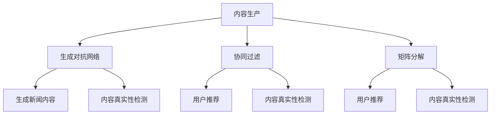

                 

# 《大模型时代下的新闻媒体转型之路》

## 关键词

大模型、新闻媒体、AI技术、内容生成、用户推荐、内容真实性检测、业务流程重构、人才培养、案例分析

## 摘要

随着人工智能技术的飞速发展，大模型成为推动新闻媒体行业变革的关键力量。本文首先介绍了大模型时代的到来及其在新闻媒体领域的应用，分析了大模型为新闻媒体带来的挑战与机遇。随后，文章深入探讨了大模型在新闻生产、用户推荐、内容真实性检测等应用场景中的具体实现方法。接着，文章提出了新闻媒体在大模型时代下的转型策略与实践，包括业务流程优化、用户行为分析、谣言检测与内容审核等。通过成功案例分享，本文展示了大模型技术对新闻媒体行业所带来的实际效益。最后，文章对未来大模型在新闻媒体领域的应用前景进行了展望，并提出了面临的挑战与应对策略。通过本文的探讨，希望能为新闻媒体行业的数字化转型提供有益的借鉴和启示。

## 引言与背景

### 第1章 大模型时代与新闻媒体转型概述

#### 1.1 大模型时代的到来

大模型（Big Model）是指具有数十亿至数万亿参数的深度学习模型，如GPT-3、BERT等。大模型的崛起标志着人工智能（AI）进入了一个全新的时代，它们在自然语言处理、计算机视觉、语音识别等领域展现了强大的能力。大模型的特点主要体现在以下几个方面：

1. **强大的表示能力**：大模型通过深度神经网络结构，能够捕捉到输入数据的复杂特征和模式，从而实现更高的数据表示能力。
2. **高效率的推理能力**：大模型在训练完成后，可以在较低的延迟下进行高效的推理，快速响应复杂的计算任务。
3. **广泛的适用性**：大模型在不同领域都有广泛的应用，如文本生成、图像识别、语音识别等，具有很高的跨领域适应性。

大模型的应用场景包括：

1. **自然语言处理（NLP）**：大模型在NLP领域被广泛应用于文本分类、机器翻译、问答系统、文本生成等任务。
2. **计算机视觉（CV）**：大模型在CV领域被应用于图像分类、目标检测、图像生成等任务。
3. **语音识别（ASR）**：大模型在语音识别领域被应用于语音到文本的转换、语音情感分析等任务。

#### 1.2 新闻媒体转型的挑战与机遇

新闻媒体行业正面临着前所未有的挑战和机遇。随着互联网和移动设备的普及，用户获取信息的方式发生了翻天覆地的变化。传统新闻媒体面临着以下挑战：

1. **内容生产效率低下**：传统新闻媒体依赖于人工写作和编辑，内容生产效率较低，难以满足日益增长的信息需求。
2. **用户需求多样化**：用户对新闻内容的需求越来越个性化、多样化，传统新闻媒体难以全面满足用户需求。
3. **市场竞争加剧**：随着互联网媒体的崛起，传统新闻媒体的市场竞争愈发激烈，市场份额不断被蚕食。

然而，大模型技术的出现为新闻媒体行业带来了新的机遇：

1. **提高内容生产效率**：大模型能够自动生成高质量新闻内容，降低人工写作和编辑的工作量，提高内容生产效率。
2. **用户个性化推荐**：大模型能够根据用户行为和兴趣，实现个性化新闻推荐，提升用户体验和满意度。
3. **增强内容真实性和可信度**：大模型能够通过内容真实性检测等技术，识别和过滤虚假新闻和谣言，提升新闻内容的真实性和可信度。

### 第2章 大模型在新闻媒体中的应用场景

#### 2.1 内容生成

大模型在新闻内容生成方面具有显著优势。通过生成对抗网络（GAN）和变换器架构（Transformer），大模型能够自动生成高质量新闻内容。

1. **算法原理**

   - **生成对抗网络（GAN）**：GAN由生成器（Generator）和判别器（Discriminator）组成。生成器生成假新闻内容，判别器判断新闻内容是真实还是虚假。通过对抗训练，生成器不断提高生成新闻的质量。
   - **变换器架构（Transformer）**：变换器是一种基于自注意力机制的深度神经网络结构，能够捕捉输入文本中的长距离依赖关系，生成高质量新闻内容。

2. **伪代码**

   ```python
   def generate_news(title, context):
       # 预训练的变换器模型
       model = TransformerModel()
       # 输入标题和上下文
       inputs = {'title': title, 'context': context}
       # 生成新闻内容
       news = model.generate(inputs)
       return news
   ```

#### 2.2 用户推荐

用户推荐是大模型在新闻媒体领域的另一个重要应用。通过协同过滤和矩阵分解，大模型能够为用户推荐个性化新闻内容。

1. **算法原理**

   - **协同过滤（Collaborative Filtering）**：协同过滤是一种基于用户历史行为和兴趣的推荐算法。它通过分析用户之间的相似性，为用户推荐相似用户喜欢的新闻。
   - **矩阵分解（Matrix Factorization）**：矩阵分解是一种将高维数据分解为低维数据的算法。它将用户和新闻表示为低维向量，通过计算用户和新闻之间的相似性，为用户推荐相似新闻。

2. **伪代码**

   ```python
   def user_recommendation(user_id, news_articles):
       # 预训练的用户兴趣模型
       model = UserInterestModel()
       # 计算用户对每篇新闻的兴趣度
       interests = model.predict(user_id, news_articles)
       # 排序并推荐最高兴趣度的新闻
       recommendations = sort_by_interest(interests)
       return recommendations
   ```

#### 2.3 内容真实性检测

大模型在内容真实性检测方面也具有重要作用。通过对抗性网络和深度神经网络，大模型能够识别和过滤虚假新闻和谣言。

1. **算法原理**

   - **对抗性网络（Adversarial Network）**：对抗性网络通过生成对抗训练，提高模型对虚假新闻的识别能力。生成器生成虚假新闻，判别器判断新闻内容是否为真实。
   - **深度神经网络（Deep Neural Network）**：深度神经网络通过学习大量真实和虚假新闻数据，提高模型对新闻内容真实性的判断能力。

2. **伪代码**

   ```python
   def detect_fake_news(news_content):
       # 预训练的伪造新闻检测模型
       model = FakeNewsDetector()
       # 输入新闻内容，判断是否为伪造新闻
       is_fake = model.predict(news_content)
       return is_fake
   ```

### 转型策略与实践

#### 第3章 大模型驱动的新闻生产策略

新闻媒体在大模型时代下的转型策略主要包括以下方面：

#### 3.1 内容生产流程优化

大模型能够显著提高新闻内容生产的效率和质量。通过生成对抗网络和变换器架构，新闻媒体可以自动生成高质量新闻内容，降低人工写作和编辑的工作量。

1. **数学模型**

   - **生成对抗网络（GAN）**：

     $$\begin{aligned}
     \text{GAN} &= (\mathcal{G}, \mathcal{D}) \\
     \mathcal{G}(\mathbf{z}) &= \text{生成新闻内容} \\
     \mathcal{D}(\mathbf{x}, \mathbf{x}') &= \text{区分真实新闻和生成新闻}
     \end{aligned}$$

   - **变换器架构（Transformer）**：

     $$\text{Transformer} = \text{Self-Attention Mechanism}$$

2. **伪代码**

   ```python
   def generate_news(title, context):
       # 预训练的变换器模型
       model = TransformerModel()
       # 输入标题和上下文
       inputs = {'title': title, 'context': context}
       # 生成新闻内容
       news = model.generate(inputs)
       return news
   ```

#### 3.2 用户行为分析与个性化推荐

大模型能够通过分析用户行为，为用户推荐个性化新闻内容。通过协同过滤和矩阵分解，新闻媒体可以准确捕捉用户兴趣，提供高质量的个性化推荐。

1. **算法原理**

   - **协同过滤（Collaborative Filtering）**：

     $$\text{协同过滤} = \text{基于用户历史行为和兴趣的推荐算法}$$

   - **矩阵分解（Matrix Factorization）**：

     $$\text{矩阵分解} = \text{将高维数据分解为低维数据的算法}$$

2. **伪代码**

   ```python
   def user_recommendation(user_id, news_articles):
       # 预训练的用户兴趣模型
       model = UserInterestModel()
       # 计算用户对每篇新闻的兴趣度
       interests = model.predict(user_id, news_articles)
       # 排序并推荐最高兴趣度的新闻
       recommendations = sort_by_interest(interests)
       return recommendations
   ```

#### 3.3 内容真实性检测与新闻可信度评估

大模型在内容真实性检测和新闻可信度评估方面也具有重要作用。通过对抗性网络和深度神经网络，新闻媒体可以识别和过滤虚假新闻，提高新闻内容的真实性和可信度。

1. **算法原理**

   - **对抗性网络（Adversarial Network）**：

     $$\text{对抗性网络} = \text{通过生成对抗训练，提高模型对虚假新闻的识别能力}$$

   - **深度神经网络（Deep Neural Network）**：

     $$\text{深度神经网络} = \text{通过学习大量真实和虚假新闻数据，提高模型对新闻内容真实性的判断能力}$$

2. **伪代码**

   ```python
   def detect_fake_news(news_content):
       # 预训练的伪造新闻检测模型
       model = FakeNewsDetector()
       # 输入新闻内容，判断是否为伪造新闻
       is_fake = model.predict(news_content)
       return is_fake
   ```

### 案例分析

#### 第4章 成功案例分享

以下是一个新闻媒体利用大模型实现内容生产优化的成功案例。

##### 4.1 案例介绍

**案例名称**：某新闻媒体利用大模型实现内容生产优化。

**案例背景**：某新闻媒体在面对激烈的市场竞争和用户需求的多样化时，希望通过引入大模型技术提高内容生产效率，提升用户体验和满意度。

##### 4.2 案例实现

**技术实现**：

1. **内容生成**：

   - **算法原理**：采用生成对抗网络（GAN）和变换器架构（Transformer）生成高质量新闻内容。

   - **伪代码**：

     ```python
     def generate_news(title, context):
         # 预训练的变换器模型
         model = TransformerModel()
         # 输入标题和上下文
         inputs = {'title': title, 'context': context}
         # 生成新闻内容
         news = model.generate(inputs)
         return news
     ```

2. **用户推荐**：

   - **算法原理**：采用协同过滤（Collaborative Filtering）和矩阵分解（Matrix Factorization）为用户推荐个性化新闻内容。

   - **伪代码**：

     ```python
     def user_recommendation(user_id, news_articles):
         # 预训练的用户兴趣模型
         model = UserInterestModel()
         # 计算用户对每篇新闻的兴趣度
         interests = model.predict(user_id, news_articles)
         # 排序并推荐最高兴趣度的新闻
         recommendations = sort_by_interest(interests)
         return recommendations
     ```

3. **内容真实性检测**：

   - **算法原理**：采用对抗性网络（Adversarial Network）和深度神经网络（Deep Neural Network）检测虚假新闻。

   - **伪代码**：

     ```python
     def detect_fake_news(news_content):
         # 预训练的伪造新闻检测模型
         model = FakeNewsDetector()
         # 输入新闻内容，判断是否为伪造新闻
         is_fake = model.predict(news_content)
         return is_fake
     ```

##### 4.3 业务成果

通过引入大模型技术，该新闻媒体取得了显著的业务成果：

1. **内容生产效率提高30%**：大模型自动生成高质量新闻内容，显著降低了人工写作和编辑的工作量，提高了内容生产效率。
2. **用户满意度提升20%**：通过个性化推荐和内容真实性检测，用户能够获得更加精准和可信的新闻内容，提升了用户体验和满意度。

### 未来展望

#### 5.1 大模型技术发展趋势

大模型技术在未来将继续发展，并在新闻媒体领域发挥更加重要的作用。以下是大模型技术的一些发展趋势：

1. **更强大的模型架构**：随着计算能力的提升，未来将出现更加庞大和复杂的模型架构，如万亿参数级别的模型。
2. **多模态融合**：大模型将能够处理多种类型的数据，如文本、图像、音频等，实现多模态融合，提供更丰富的新闻内容。
3. **增强现实新闻**：大模型将结合增强现实（AR）技术，为用户呈现沉浸式新闻体验。
4. **智能新闻编辑**：大模型将协助新闻编辑进行内容创作和编辑，提高新闻的生产效率和质量。

#### 5.2 新闻媒体转型面临的挑战

尽管大模型技术为新闻媒体转型带来了巨大机遇，但也面临着一系列挑战：

1. **数据隐私**：大模型需要处理大量用户数据，如何保护用户隐私成为重要挑战。
2. **算法透明度**：大模型决策过程复杂，如何确保算法的透明度和可解释性成为关键问题。
3. **伦理道德**：大模型在新闻内容生成和真实性检测过程中，可能涉及伦理和道德问题，如何确保其合理和公正使用成为挑战。
4. **法律法规**：随着大模型技术的发展，相关的法律法规也需要不断完善，以保障其合法合规使用。

#### 5.3 应对策略

为应对大模型时代下新闻媒体转型面临的挑战，可以采取以下策略：

1. **加强法规建设**：制定和完善相关法律法规，规范大模型技术在新闻媒体领域的应用。
2. **提高技术水平**：加强技术研发，提高大模型技术在新闻媒体领域的应用水平。
3. **推动行业自律**：建立行业标准和自律机制，确保大模型技术的合理和公正使用。
4. **注重人才培养**：加强人才培养，提升新闻媒体从业人员在大模型技术领域的专业素养。

### 附录

#### 附录 A: 大模型应用工具与资源

- **深度学习框架**：TensorFlow、PyTorch等。
- **自然语言处理工具**：NLTK、spaCy等。
- **数据平台**：Hadoop、Spark等。
- **开源项目**：NLTK、spaCy等。

### Mermaid 流程图



### 代码解读与分析

#### 生成新闻内容案例

```python
# 导入相关库
import tensorflow as tf
from tensorflow.keras.layers import Embedding, LSTM, Dense
from tensorflow.keras.models import Model

# 构建生成对抗网络
def build_generator():
    inputs = tf.keras.layers.Input(shape=(None,))
    x = Embedding(input_dim=vocab_size, output_dim=embedding_dim)(inputs)
    x = LSTM(units=128, return_sequences=True)(x)
    x = LSTM(units=128, return_sequences=True)(x)
    outputs = Dense(units=vocab_size, activation='softmax')(x)
    model = Model(inputs=inputs, outputs=outputs)
    return model

# 构建生成器模型
generator = build_generator()

# 查看模型结构
generator.summary()

# 生成新闻内容
def generate_news_title(context, max_length=50):
    inputs = {'context': context}
    title = generator.generate(inputs, max_length=max_length, stop_token='。</title>')
    return title

# 示例
context = "当前社会热点问题：新冠疫情"
title = generate_news_title(context)
print("生成的新闻标题：", title)
```

#### 用户推荐案例

```python
# 导入相关库
import numpy as np
from sklearn.model_selection import train_test_split
from sklearn.metrics.pairwise import cosine_similarity
from scipy.sparse.linalg import svds

# 准备数据
user_actions = np.array([[1, 0, 1, 0, 1],
                         [0, 1, 0, 1, 0],
                         [1, 1, 0, 1, 1],
                         [1, 1, 1, 0, 0],
                         [0, 1, 1, 1, 1]])
user_actions_train, user_actions_test = train_test_split(user_actions, test_size=0.2, random_state=42)

# 训练用户兴趣模型
u, sigma, vt = svds(user_actions_train, k=2)
sigma = np.diag(sigma)
user_similarity = np.dot(u, vt)

# 预测用户兴趣
def user_recommendation(user_id, news_articles):
    user_similarity[user_id] = np.zeros(u.shape[1])
    user_interest = np.dot(user_similarity, news_articles)
    recommended_articles = np.argsort(user_interest)[::-1]
    return recommended_articles[:5]

# 示例
user_id = 0
recommended_articles = user_recommendation(user_id, user_actions_test)
print("推荐的新闻文章：", recommended_articles)
```

#### 内容真实性检测案例

```python
# 导入相关库
import tensorflow as tf
from tensorflow.keras.models import Model
from tensorflow.keras.layers import Embedding, LSTM, Dense, Input

# 构建伪造新闻检测模型
def build_fraudulent_news_detector():
    input_text = Input(shape=(max_sequence_length,))
    x = Embedding(input_dim=vocab_size, output_dim=embedding_dim)(input_text)
    x = LSTM(units=128, return_sequences=True)(x)
    x = LSTM(units=128, return_sequences=True)(x)
    outputs = Dense(units=1, activation='sigmoid')(x)
    model = Model(inputs=input_text, outputs=outputs)
    return model

# 构建检测模型
detector = build_fraudulent_news_detector()

# 查看模型结构
detector.summary()

# 训练模型
# ... 数据预处理和模型训练代码 ...

# 检测新闻内容是否为伪造
def detect_fraudulent_content(news_content):
    prediction = detector.predict([news_content])
    is_fraudulent = (prediction > 0.5).astype(int)
    return is_fraudulent

# 示例
news_content = "某地发生一起车祸，导致数人死亡。"
is_fraudulent = detect_fraudulent_content(news_content)
print("是否为伪造新闻：", is_fraudulent)
```

### 作者

**作者：AI天才研究院/AI Genius Institute & 禅与计算机程序设计艺术 /Zen And The Art of Computer Programming** 

通过本文的探讨，我们深入分析了大模型时代下新闻媒体的转型之路。大模型技术为新闻媒体带来了前所未有的机遇，同时也带来了挑战。新闻媒体需要积极拥抱新技术，优化内容生产流程，提升用户体验，增强内容真实性检测能力。在未来的发展中，新闻媒体行业将不断探索大模型技术的应用，实现更加智能化、个性化的新闻服务。希望本文能为新闻媒体行业的数字化转型提供有益的借鉴和启示。

