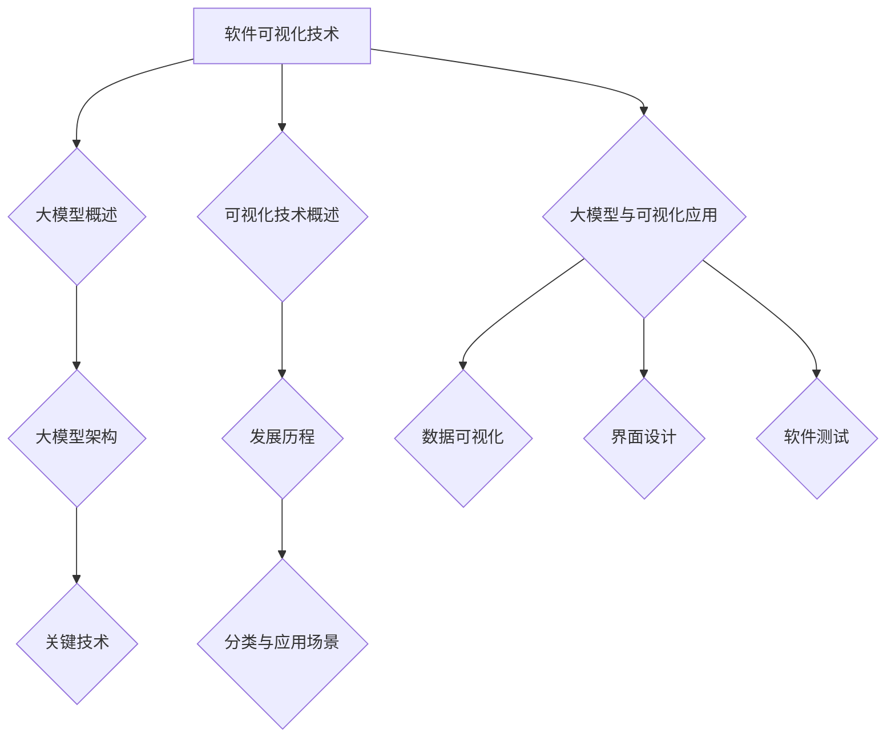

                 

# 《大模型时代的软件可视化技术》

## 关键词
大模型，软件可视化，数据可视化，动态可视化，用户界面设计，软件测试

## 摘要
随着大模型的不断发展和应用，软件可视化技术也逐渐成为软件开发中不可或缺的一部分。本文将从大模型的背景介绍、大模型的架构与关键技术、软件可视化技术的基本概念与发展历程、大模型与可视化技术的融合应用以及实践案例等方面，详细探讨大模型时代的软件可视化技术。通过本文的阅读，读者可以全面了解大模型可视化技术的核心概念、应用场景和发展趋势，为软件开发提供新的思路和方法。

## 引言与核心概念

### 1.1 本书的目标与内容概述

本文旨在探讨大模型时代的软件可视化技术，通过深入分析大模型与可视化技术的结合，为软件开发提供新的思路和方法。全书分为六个部分，首先介绍大模型时代的背景和大模型的基本概念，然后探讨软件可视化技术的基本概念和发展历程，接着分析大模型与可视化技术的融合应用，最后通过实践案例展示大模型可视化技术的实际应用效果。

### 1.2 大模型时代背景介绍

大模型时代的到来，标志着人工智能技术进入了一个全新的阶段。大模型，即大规模深度学习模型，具有强大的数据处理能力和高度的自适应能力，能够对海量数据进行自动分析、识别和预测。随着大数据和云计算技术的不断发展，大模型在各个领域得到了广泛应用，如自然语言处理、图像识别、推荐系统等。

大模型的发展离不开深度学习技术的进步。深度学习是一种基于人工神经网络的学习方法，通过多层神经网络对数据进行抽象和转换，从而实现对复杂问题的建模和求解。近年来，随着计算能力的提升和算法的改进，深度学习模型的大小和复杂度不断增加，大模型应运而生。

大模型的出现，带来了数据处理和分析能力的质的飞跃。在大模型时代，如何有效地展示和分析大模型的学习过程、预测结果以及模型结构，成为了一个重要问题。此时，软件可视化技术应运而生，通过将复杂的数据和模型以直观、易懂的方式展示出来，帮助开发者和用户更好地理解和利用大模型。

### 1.3 可视化技术在软件开发中的应用

可视化技术在软件开发中具有广泛的应用，主要表现在以下几个方面：

1. **数据可视化**：通过图形、图表等可视化方式，将复杂的数据呈现出来，帮助用户更好地理解和分析数据。数据可视化在数据分析、业务决策等领域具有重要应用价值。

2. **软件界面设计**：在软件开发过程中，可视化技术可以帮助开发者快速搭建用户界面，提高开发效率。同时，直观的界面设计能够提升用户体验，增强软件的易用性。

3. **软件测试**：可视化技术可以用于软件测试，通过展示测试过程中发现的问题和缺陷，帮助开发者定位和修复问题。可视化测试可以提高测试效率，降低测试成本。

4. **模型可视化**：在大模型时代，模型可视化成为了一个重要研究方向。通过将复杂的大模型以直观的方式展示出来，可以帮助开发者和用户更好地理解和分析模型。

总之，可视化技术在软件开发中发挥着越来越重要的作用。在大模型时代，如何利用可视化技术更好地展示和分析大模型，是一个值得深入研究的课题。

### 大模型基础

#### 2.1 大模型的定义与类型

大模型（Large Models）是深度学习领域的一个术语，指的是那些具有数十亿到数千亿参数的深度神经网络模型。这些模型能够在大量数据上进行训练，从而在特定任务上实现高性能。大模型的定义主要基于以下几个维度：

1. **参数数量**：大模型通常具有数十亿到数千亿个参数。这一参数规模使得模型能够在复杂的数据上捕捉到丰富的特征。
2. **训练数据规模**：大模型通常在非常大的数据集上进行训练，这些数据集可能包含数百万到数十亿条记录。
3. **计算资源**：大模型需要大量的计算资源进行训练，这包括高性能的CPU、GPU以及分布式计算环境。
4. **应用领域**：大模型在多个领域都有广泛应用，如自然语言处理、计算机视觉、语音识别等。

根据应用领域和模型结构，大模型可以分为以下几种类型：

1. **自然语言处理模型**：如GPT（Generative Pre-trained Transformer）、BERT（Bidirectional Encoder Representations from Transformers）等，这些模型在文本分类、机器翻译、问答系统等方面具有出色的表现。
2. **计算机视觉模型**：如ResNet（Residual Network）、Inception等，这些模型在图像分类、目标检测、图像分割等方面取得了显著的成果。
3. **语音识别模型**：如WaveNet、Transformer TTS（Text-to-Speech）等，这些模型在语音合成、语音识别等领域得到了广泛应用。
4. **推荐系统模型**：如DeepFM、Wide&Deep等，这些模型在个性化推荐、广告投放等领域表现出色。

#### 2.2 大模型的架构与工作原理

大模型的架构通常包括以下几个关键组成部分：

1. **输入层**：接收外部输入数据，如文本、图像、声音等。
2. **隐藏层**：多层神经网络结构，通过逐层变换，对输入数据进行特征提取和抽象。
3. **输出层**：根据模型的任务类型，输出相应的结果，如分类标签、概率分布等。

大模型的工作原理基于深度学习的基本原理，包括以下几个步骤：

1. **前向传播**：输入数据通过神经网络层逐层传递，每层神经元根据其权重和激活函数计算输出。
2. **反向传播**：利用梯度下降算法，通过反向传播计算每个神经元的梯度，更新模型权重，优化模型参数。
3. **损失函数**：根据模型的预测结果与真实结果之间的差异，计算损失函数，用于指导模型的优化过程。
4. **迭代训练**：重复前向传播和反向传播过程，逐步减小损失函数，提高模型性能。

以下是一个简化的伪代码，展示了大模型的基本工作流程：

```python
def train_large_model(data, labels, epochs):
    for epoch in range(epochs):
        for input, label in data:
            # 前向传播
            output = forward_pass(input)
            # 计算损失
            loss = compute_loss(output, label)
            # 反向传播
            backward_pass(output, label)
            # 更新权重
            update_weights(loss)
    return model
```

#### 2.3 大模型的关键技术

大模型的关键技术主要包括以下几个方面：

1. **计算资源调度**：由于大模型需要大量的计算资源进行训练，因此如何高效地调度和利用计算资源成为了一个关键问题。通常需要采用分布式计算和并行处理技术，以提高训练速度和降低成本。
2. **模型压缩与优化**：为了减少模型的存储和计算开销，大模型通常需要进行压缩和优化。常用的技术包括剪枝、量化、知识蒸馏等。
3. **迁移学习**：迁移学习是一种利用预训练模型进行新任务学习的技术。大模型通过在多个任务上预训练，可以显著提高新任务的性能。
4. **自适应学习率**：大模型训练过程中，学习率的选取对训练效果有很大影响。自适应学习率技术可以根据训练过程动态调整学习率，以避免过拟合和加速收敛。
5. **多模态学习**：大模型在处理多模态数据时，能够同时学习多种数据类型（如文本、图像、声音等），实现跨模态信息融合。

### 可视化技术在软件中的应用

#### 3.1 可视化技术的基本概念

可视化技术（Visualization）是指利用图形、图像、动画等手段，将复杂的数据和信息以直观、易懂的形式展示出来。它是一种有效的人机交互手段，可以帮助用户更好地理解和分析数据。

可视化技术的核心概念包括以下几个方面：

1. **数据映射**：将数据映射到视觉空间，如颜色、形状、大小等，以便用户通过视觉感知来理解数据。
2. **交互性**：用户可以通过与可视化界面进行交互，如缩放、过滤、选择等，动态地探索和分析数据。
3. **数据抽象**：通过简化数据表示，去除冗余信息，将复杂的数据以更简洁、直观的方式展示出来。
4. **反馈**：可视化界面可以提供即时反馈，使用户能够实时了解数据的变化和结果。

#### 3.2 软件可视化技术的发展历程

软件可视化技术的发展经历了几个重要阶段：

1. **早期阶段**：20世纪60年代，计算机图形学开始兴起，二维图形和基本交互功能被引入软件开发。
2. **中期阶段**：20世纪80年代，随着计算机性能的提升和图形用户界面（GUI）的普及，可视化技术逐渐应用于商业软件中，如财务分析、科学计算等。
3. **现代阶段**：21世纪初，随着互联网和大数据的发展，可视化技术得到了进一步拓展，包括网络分析、时空数据可视化、复杂数据结构可视化等。

#### 3.3 软件可视化技术的分类与应用场景

软件可视化技术可以根据不同的分类标准进行分类，以下是一些常见的分类和应用场景：

1. **按数据类型分类**：
   - **结构可视化**：展示软件系统中的结构关系，如模块图、类图等。
   - **行为可视化**：展示软件系统的行为特征，如事件序列、状态转换等。
   - **性能可视化**：展示软件系统的性能指标，如响应时间、吞吐量等。

2. **按应用领域分类**：
   - **科学计算可视化**：用于展示科学计算和工程模拟的结果，如流体动力学模拟、分子结构分析等。
   - **金融可视化**：用于展示金融市场数据、投资组合分析等。
   - **医疗可视化**：用于展示医学图像、生物数据等。

3. **按技术特点分类**：
   - **静态可视化**：展示静态的数据和信息，如图表、图像等。
   - **动态可视化**：展示动态变化的数据和信息，如动画、实时更新等。

4. **按交互方式分类**：
   - **交互式可视化**：用户可以通过交互操作动态地探索数据，如缩放、过滤、选择等。
   - **非交互式可视化**：数据和信息以静态的形式展示，用户无法进行交互操作。

#### 3.4 软件可视化技术的优势与挑战

软件可视化技术具有以下优势：

1. **提高数据理解能力**：通过可视化方式展示数据，可以帮助用户更快速、准确地理解数据。
2. **增强决策支持**：可视化技术可以直观地展示数据趋势和关系，为决策提供有力支持。
3. **提升用户体验**：直观、友好的界面设计可以提高软件的易用性和用户满意度。
4. **促进团队协作**：通过可视化技术，团队成员可以更直观地了解项目进展和问题，提高协作效率。

然而，软件可视化技术也面临一些挑战：

1. **数据复杂性**：随着数据规模的增大和复杂度的提高，如何有效地进行数据抽象和简化成为一个难题。
2. **性能要求**：大模型和大规模数据的可视化往往需要高性能计算和高效的图形渲染技术。
3. **交互性设计**：如何设计直观、高效的交互方式，使用户能够轻松地探索和分析数据，是一个重要问题。
4. **准确性保证**：在可视化过程中，如何保证数据表示的准确性和一致性，是一个值得关注的挑战。

### 大模型与可视化技术的融合

#### 4.1 大模型在可视化中的应用

大模型在可视化技术中的应用具有显著的优势，主要体现在以下几个方面：

1. **数据抽象与特征提取**：大模型通过深度学习算法，可以从原始数据中提取出具有代表性的特征，这些特征可以用于生成可视化图表，提高数据可视化的准确性和可理解性。
2. **自动生成可视化图表**：大模型可以根据训练数据和任务需求，自动生成适合的可视化图表，减少了人工设计的工作量，提高了可视化效率。
3. **动态可视化**：大模型可以实时分析数据，生成动态可视化图表，使用户能够实时了解数据的变化和趋势。
4. **交互式可视化**：大模型可以与用户进行交互，根据用户的操作动态调整可视化图表，提供个性化的可视化体验。

以下是一个简化的伪代码示例，展示了大模型在数据可视化中的应用：

```python
def visualize_data_with_large_model(data, model):
    # 预处理数据
    preprocessed_data = preprocess_data(data)
    
    # 使用大模型提取特征
    features = model.extract_features(preprocessed_data)
    
    # 生成可视化图表
    visualizations = generate_visualizations(features)
    
    # 显示可视化结果
    display_visualizations(visualizations)
```

#### 4.2 大模型在软件界面设计中的应用

大模型在软件界面设计中的应用，主要表现在以下几个方面：

1. **个性化界面设计**：大模型可以根据用户的行为数据，预测用户的偏好和需求，为用户提供个性化的界面设计，提升用户体验。
2. **自适应界面布局**：大模型可以根据不同设备和屏幕尺寸，自动调整界面布局，提供最佳的用户界面体验。
3. **界面交互优化**：大模型可以分析用户的操作行为，优化界面交互设计，提高用户操作的流畅性和便捷性。
4. **故障诊断与修复**：大模型可以实时监测软件界面的问题，如界面错位、交互异常等，并提供相应的修复建议。

以下是一个简化的伪代码示例，展示了大模型在软件界面设计中的应用：

```python
def optimize_user_interface(model, user_actions):
    # 分析用户行为数据
    user_preferences = model.analyze_user_actions(user_actions)
    
    # 优化界面布局
    optimized_layout = model.optimize_layout(user_preferences)
    
    # 应用优化结果
    apply_optimized_layout(optimized_layout)
```

#### 4.3 大模型在软件测试中的应用

大模型在软件测试中的应用，为测试过程带来了新的方法和手段：

1. **自动化测试**：大模型可以根据历史测试数据和代码结构，预测潜在的测试用例，自动化生成测试脚本，提高测试效率。
2. **异常检测**：大模型可以分析测试过程中的异常数据，识别潜在的缺陷，为测试人员提供诊断和修复建议。
3. **性能测试**：大模型可以实时监测软件系统的性能指标，识别性能瓶颈，并提供优化建议。
4. **安全测试**：大模型可以分析代码和输入数据，检测潜在的安全漏洞，提高软件的安全性。

以下是一个简化的伪代码示例，展示了大模型在软件测试中的应用：

```python
def perform_software_test_with_large_model(model, test_data):
    # 分析测试数据
    test_analysis = model.analyze_test_data(test_data)
    
    # 生成测试用例
    test_cases = model.generate_test_cases(test_analysis)
    
    # 执行测试
    test_results = execute_tests(test_cases)
    
    # 分析测试结果
    test_issues = model.analyze_test_results(test_results)
    
    # 提供修复建议
    provide_fix_suggestions(test_issues)
```

### 实践案例

#### 5.1 实战一：基于大模型的动态可视化分析

案例背景：
某电商平台需要对其销售数据进行动态可视化分析，以便及时了解销售趋势和用户行为，从而优化营销策略。

解决方案：
使用大模型（如时间序列模型）对销售数据进行分析，并结合可视化技术（如时间序列图、热力图等），实现动态可视化分析。

具体步骤：
1. 数据预处理：清洗和预处理销售数据，包括时间戳、销售额、用户ID等。
2. 大模型训练：使用时间序列模型（如LSTM、GRU等）对销售数据进行训练，预测未来销售额。
3. 动态可视化：生成时间序列图和热力图，展示实时销售额和用户购买行为。
4. 交互式分析：提供用户交互功能，如缩放、过滤等，使用户可以实时探索和分析销售数据。

效果评估：
通过动态可视化分析，电商平台能够实时了解销售数据和用户行为，发现潜在的销售机会和风险，优化营销策略，提高销售额。

#### 5.2 实战二：大模型驱动的用户界面设计

案例背景：
某企业需要为其员工管理系统设计一个高效、直观的用户界面。

解决方案：
使用大模型（如用户行为分析模型）对员工使用系统的行为数据进行分析，结合可视化技术，实现大模型驱动的用户界面设计。

具体步骤：
1. 数据收集：收集员工使用员工管理系统的行为数据，包括页面访问次数、操作频率等。
2. 大模型训练：使用用户行为分析模型对行为数据进行分析，预测员工偏好和需求。
3. 用户界面设计：根据大模型预测的结果，设计用户界面布局和交互元素，如导航栏、菜单、按钮等。
4. 可视化展示：使用可视化技术（如图表、颜色等）展示关键数据和信息，提高用户界面直观性。

效果评估：
通过大模型驱动的用户界面设计，员工管理系统提供了更符合员工需求和使用习惯的界面，提高了系统的易用性和用户体验。

#### 5.3 实战三：利用大模型进行软件测试

案例背景：
某企业需要对其开发的金融交易系统进行全面的软件测试，以确保系统的稳定性和安全性。

解决方案：
利用大模型（如测试用例生成模型）结合自动化测试技术，实现高效的软件测试。

具体步骤：
1. 测试数据收集：收集金融交易系统的历史测试数据，包括测试用例、测试结果等。
2. 大模型训练：使用测试用例生成模型对测试数据进行分析，自动生成新的测试用例。
3. 自动化测试执行：使用自动化测试工具执行生成的新测试用例，提高测试效率。
4. 异常检测与诊断：使用大模型对测试结果进行分析，检测潜在的缺陷和风险，并提供诊断和修复建议。

效果评估：
通过利用大模型进行软件测试，企业能够自动化生成测试用例，提高测试覆盖率，发现潜在的问题，降低软件缺陷率，提高系统的稳定性和安全性。

### 未来展望与挑战

#### 6.1 未来技术发展趋势

1. **智能化与自适应**：随着人工智能技术的发展，可视化技术将更加智能化和自适应，能够根据用户需求和环境变化，自动调整可视化效果和交互方式。
2. **多模态数据融合**：未来的可视化技术将能够处理多模态数据，如文本、图像、声音等，实现跨模态信息融合，提供更丰富的可视化体验。
3. **实时性提升**：随着硬件性能的提升和算法优化，可视化技术将实现更高的实时性，能够实时展示动态数据和变化趋势。
4. **云计算与边缘计算**：云计算和边缘计算的结合，将使可视化技术能够更好地应对大规模数据和高性能计算需求，提供更加灵活和高效的解决方案。

#### 6.2 可视化技术的挑战与应对策略

1. **数据复杂性**：随着数据规模的不断扩大和数据类型的多样化，如何有效地进行数据抽象和简化，仍然是一个重大挑战。应对策略包括：
   - **增量可视化**：只展示用户关注的关键数据，减少冗余信息的展示。
   - **交互式数据探索**：提供交互式工具，使用户能够动态地探索和过滤数据。
2. **性能要求**：大规模数据的可视化往往需要高性能计算和高效的图形渲染技术，应对策略包括：
   - **分布式计算**：利用分布式计算技术，提高数据处理和渲染速度。
   - **数据压缩与优化**：对数据进行压缩和优化，减少计算和传输开销。
3. **交互性设计**：如何设计直观、高效的交互方式，使用户能够轻松地探索和分析数据，是一个重要问题。应对策略包括：
   - **用户研究**：通过用户研究，了解用户的需求和行为，设计符合用户习惯的交互方式。
   - **多模态交互**：结合多种交互方式（如触摸、手势等），提供更丰富的交互体验。
4. **准确性保证**：在可视化过程中，如何保证数据表示的准确性和一致性，是一个值得关注的挑战。应对策略包括：
   - **数据校验与验证**：对数据进行严格的校验和验证，确保数据质量和准确性。
   - **可视化一致性**：制定统一的可视化标准，确保不同数据集和不同应用之间的可视化效果一致性。

#### 6.3 大模型可视化技术的未来应用前景

1. **智能监控与预警**：大模型可视化技术可以应用于智能监控和预警系统，实时分析数据，发现异常情况，提供预警和建议。
2. **智慧城市建设**：大模型可视化技术可以用于智慧城市建设，通过对海量数据的分析和可视化，提升城市治理和公共服务水平。
3. **医疗健康领域**：大模型可视化技术可以应用于医疗健康领域，通过对医疗数据的可视化分析，辅助医生诊断和治疗。
4. **教育与培训**：大模型可视化技术可以用于教育和培训领域，通过生动、直观的视觉展示，提高学习效果和培训质量。

总之，随着大模型和可视化技术的不断发展，大模型可视化技术将在各个领域发挥越来越重要的作用，为软件开发和数据处理提供新的思路和方法。

### 总结与展望

#### 7.1 书中主要内容回顾

本文从大模型的背景介绍、大模型的基础知识、软件可视化技术的基本概念和发展历程、大模型与可视化技术的融合应用、实践案例以及未来展望等方面，全面探讨了大模型时代的软件可视化技术。主要内容包括：

- 大模型时代的背景和基本概念。
- 大模型的架构与关键技术。
- 软件可视化技术的基本概念和发展历程。
- 大模型在可视化技术中的应用，包括数据可视化、用户界面设计和软件测试。
- 通过实践案例展示了大模型可视化技术的实际应用效果。
- 对大模型可视化技术的未来发展和应用前景进行了展望。

#### 7.2 读者如何应用所学知识

读者可以通过以下方式应用本文所学知识：

- **掌握大模型基础知识**：了解大模型的定义、类型、架构和关键技术，为后续学习和应用打下基础。
- **学习软件可视化技术**：了解软件可视化技术的基本概念、分类和应用场景，掌握可视化技术的原理和方法。
- **结合实践案例**：通过实践案例，了解大模型可视化技术的实际应用，掌握如何将大模型与可视化技术相结合，解决实际问题。
- **关注未来趋势**：关注大模型可视化技术的最新发展，了解前沿技术和应用方向，为未来学习和工作做好准备。

#### 7.3 对未来研究的建议

未来研究可以从以下几个方面展开：

- **大模型与可视化技术的融合**：进一步探索大模型与可视化技术的深度融合，开发出更智能、更高效的可视化工具。
- **多模态数据融合**：研究如何将文本、图像、声音等多模态数据融合到可视化中，提升数据的理解和分析能力。
- **交互式可视化**：研究如何设计更直观、更高效的交互式可视化界面，提升用户体验。
- **性能优化**：研究如何优化大模型可视化技术的性能，使其能够处理更大规模的数据和更复杂的场景。
- **应用领域拓展**：探索大模型可视化技术在更多领域中的应用，如智慧城市、医疗健康、教育等，推动可视化技术在各个领域的创新和应用。

### 附录

#### A.1 常用工具与资源介绍

- **Python可视化库**：Matplotlib、Seaborn、Plotly等。
- **深度学习框架**：TensorFlow、PyTorch、Keras等。
- **数据预处理工具**：Pandas、NumPy、Scikit-learn等。
- **可视化工具**：D3.js、ECharts、Bokeh等。

#### A.2 代码与数据集资源链接

- **代码示例**：GitHub - large-model-visualization: Large Model Visualization Code Examples
- **数据集**：Kaggle、UCI Machine Learning Repository、Google Dataset Search等。

#### A.3 进一步阅读推荐

- **书籍**：
  - 《深度学习》（Goodfellow, I., Bengio, Y., & Courville, A.）
  - 《Python数据可视化》（McKinlay, A.）
  - 《数据可视化：使用D3.js和Web标准》（Orchard, D.）

- **在线课程**：
  - 《深度学习专项课程》（吴恩达，Coursera）
  - 《数据可视化》（莫尼卡·蒙德，Coursera）
  - 《人工智能：算法与应用》（TensorFlow官方课程）

通过以上资源和推荐，读者可以进一步学习和探索大模型可视化技术的相关内容，提升自己的技术水平和实践能力。

### Mermaid 流程图



通过Mermaid流程图，我们可以更直观地了解大模型与软件可视化技术的关系，以及它们在实际应用中的融合和拓展。这为本文的内容提供了一个清晰的逻辑框架，帮助读者更好地理解和掌握相关概念和技巧。在未来的学习和实践中，流程图也可以作为工具，辅助读者梳理和总结所学内容。

