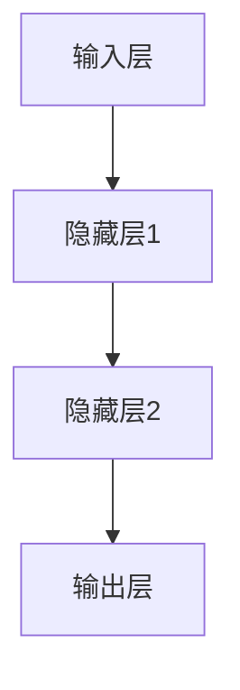

                 

# 大模型概念融合与提示词创造性思维

## 关键词
大模型、概念融合、提示词、创造性思维、自然语言处理、计算机视觉、语音识别

## 摘要
本文旨在探讨大模型概念融合与提示词创造性思维在计算机科学领域的应用。通过深入分析大模型的基础知识、概念融合方法以及提示词创造性思维的原理，本文揭示了它们在自然语言处理、计算机视觉和语音识别等领域的强大作用。同时，本文还通过具体案例展示了大模型与提示词创造性思维的融合应用，展望了这一领域的发展趋势与未来前景。

### 《大模型概念融合与提示词创造性思维》目录大纲

#### 第一部分：引言

- 1. 引言
  - 1.1 书籍背景
    - 1.1.1 大模型的发展与应用
    - 1.1.2 提示词创造性思维的兴起
  - 1.2 目标读者
    - 1.2.1 读者背景
    - 1.2.2 预期收获

#### 第二部分：大模型基础

- 2. 大模型基础
  - 2.1 大模型概述
    - 2.1.1 大模型的定义
    - 2.1.2 大模型的发展历程
    - 2.1.3 大模型的核心特点
  - 2.2 大模型架构
    - 2.2.1 神经网络架构
      - Mermaid流程图：神经网络架构的分层与连接
    - 2.2.2 大模型训练原理
      - 伪代码：大模型训练过程
  - 2.3 大模型应用领域
    - 2.3.1 自然语言处理
    - 2.3.2 计算机视觉
    - 2.3.3 语音识别

#### 第三部分：概念融合

- 3. 概念融合
  - 3.1 概念融合概述
    - 3.1.1 概念融合的定义
    - 3.1.2 概念融合的优势
    - 3.1.3 概念融合的应用场景
  - 3.2 概念融合方法
    - 3.2.1 数据融合方法
      - 数学模型与公式
      - 举例说明：数据融合方法在图像识别中的应用
    - 3.2.2 概念融合方法在自然语言处理中的应用
      - 数学模型与公式
      - 举例说明：在文本分类中的应用
    - 3.2.3 概念融合方法在计算机视觉中的应用
      - 数学模型与公式
      - 举例说明：在目标检测中的应用

#### 第四部分：提示词创造性思维

- 4. 提示词创造性思维
  - 4.1 提示词创造性思维概述
    - 4.1.1 提示词创造性思维的定义
    - 4.1.2 提示词创造性思维的优势
    - 4.1.3 提示词创造性思维的应用场景
  - 4.2 提示词生成方法
    - 4.2.1 基于规则的方法
    - 4.2.2 基于机器学习的方法
      - 伪代码：提示词生成过程
  - 4.3 提示词创造性思维实例分析
    - 4.3.1 文本生成中的提示词创造性思维
      - 数学模型与公式
      - 举例说明：在生成故事中的应用
    - 4.3.2 设计创意中的提示词创造性思维
      - 举例说明：在产品设计中的应用

#### 第五部分：综合应用

- 5. 综合应用
  - 5.1 大模型与提示词创造性思维的融合
    - 5.1.1 融合方法的提出
    - 5.1.2 融合方法的优势
  - 5.2 融合应用的案例分析
    - 5.2.1 自然语言处理中的应用
      - 举例说明：在智能客服中的应用
    - 5.2.2 计算机视觉中的应用
      - 举例说明：在图像标注中的应用
    - 5.2.3 语音识别中的应用
      - 举例说明：在语音合成中的应用

#### 第六部分：总结与展望

- 6. 总结与展望
  - 6.1 主要内容回顾
    - 6.1.1 大模型的基础知识
    - 6.1.2 概念融合的方法
    - 6.1.3 提示词创造性思维的原理
  - 6.2 展望未来
    - 6.2.1 大模型的发展趋势
    - 6.2.2 提示词创造性思维的创新方向
    - 6.2.3 大模型与提示词创造性思维的融合前景

#### 附录

- 附录 A：参考文献
- 附录 B：术语表
- 附录 C：代码示例
  - 6.3.1 大模型训练代码示例
  - 6.3.2 提示词生成代码示例

---

### 第一部分：引言

#### 1. 引言

##### 1.1 书籍背景

随着深度学习和大数据技术的快速发展，大模型（Large Models）已经成为人工智能领域的研究热点。大模型具有极高的参数数量和强大的计算能力，能够在多种任务中实现卓越的性能。例如，自然语言处理中的预训练语言模型（如GPT系列）、计算机视觉中的深度神经网络（如ResNet系列）以及语音识别中的循环神经网络（如LSTM）等，都是大模型的典型应用实例。

与此同时，提示词创造性思维（Hint Word Creative Thinking）作为一种新兴的思维方式，也在逐渐引起人们的关注。提示词是在创造性思维过程中用于启发和引导思考的关键词或短语，它们能够激发大脑的潜力，产生新的创意和想法。提示词创造性思维广泛应用于设计、艺术、教育和商业等领域，为创新和解决问题提供了新的思路。

本篇文章旨在探讨大模型与提示词创造性思维在计算机科学领域的融合应用，通过深入分析大模型的基础知识、概念融合方法和提示词创造性思维的原理，揭示它们在自然语言处理、计算机视觉和语音识别等领域的强大作用。同时，本文还将通过具体案例展示大模型与提示词创造性思维的融合应用，展望这一领域的发展趋势与未来前景。

##### 1.2 目标读者

本文主要面向以下几类读者：

1. **人工智能和计算机科学领域的专业研究人员和从业者**，他们对大模型和提示词创造性思维有基本的了解，希望通过本文深入了解这一领域的最新研究成果和应用实例。

2. **技术开发人员**，尤其是从事自然语言处理、计算机视觉和语音识别等方向的技术人员，他们需要了解如何利用大模型和提示词创造性思维提升算法性能和创造力。

3. **科研管理人员和教育工作者**，他们关注人工智能和计算机科学的发展趋势，希望为科研项目和教育课程提供有针对性的指导和建议。

通过本文的阅读，读者可以：

- 掌握大模型的基本概念、架构和应用领域。
- 理解概念融合方法及其在多个领域的应用。
- 了解提示词创造性思维的原理和生成方法。
- 通过具体案例了解大模型与提示词创造性思维的融合应用。
- 展望大模型和提示词创造性思维的未来发展前景。

#### 第二部分：大模型基础

##### 2.1 大模型概述

###### 2.1.1 大模型的定义

大模型（Large Model），通常指的是拥有大量参数和复杂结构的深度学习模型。它们通过学习海量数据，能够捕捉到数据中的潜在规律和模式，从而在多个任务中实现出色的性能。大模型的发展是深度学习和大数据技术的结合产物，其核心特点在于规模大、参数多、结构复杂。

大模型可以根据应用领域和任务的不同，分为多种类型。例如，在自然语言处理领域，常见的有大型的语言模型（如GPT系列）和文本生成模型（如ChatGPT）；在计算机视觉领域，有大规模的卷积神经网络（如ResNet系列）和目标检测模型（如YOLO系列）；在语音识别领域，则有复杂的多层循环神经网络（如LSTM）和注意力机制模型（如Transformer）。

###### 2.1.2 大模型的发展历程

大模型的发展历程可以追溯到深度学习的兴起。20世纪80年代，反向传播算法的提出为深度学习的发展奠定了基础。然而，由于计算资源和数据集的限制，早期深度学习模型的效果并不理想。随着计算机性能的不断提升和大数据技术的普及，深度学习迎来了快速发展。

2006年，Hinton等人提出了深度置信网络（Deep Belief Network），开启了深度学习的新篇章。随后，2012年，AlexNet在ImageNet比赛中取得的突破性成绩，标志着深度学习在计算机视觉领域的崛起。2018年，Google推出的Transformer模型，进一步推动了自然语言处理领域的发展。

近年来，随着计算能力的不断提升和大规模数据集的涌现，大模型的研究和应用不断深入。例如，OpenAI的GPT系列模型在自然语言处理领域的卓越表现，以及微软的混合现实项目（Microsoft HoloLens）在计算机视觉领域的广泛应用，都展示了大模型在各个领域的巨大潜力。

###### 2.1.3 大模型的核心特点

大模型具有以下几个核心特点：

1. **大规模参数**：大模型的参数数量通常在数百万甚至数十亿级别，这使得它们能够捕捉到数据中的复杂模式和规律。
2. **复杂结构**：大模型通常包含多层神经网络结构，每一层都能学习到不同的特征和模式，从而实现更高层次的任务。
3. **强大的泛化能力**：由于大模型能够学习到数据中的潜在规律，它们在未知数据上的表现通常非常出色。
4. **高效的计算能力**：随着硬件技术的进步，大模型的计算效率不断提高，使得它们能够在实际应用中快速处理海量数据。

##### 2.2 大模型架构

大模型的架构通常由以下几个部分组成：输入层、隐藏层和输出层。每一层都有特定的功能，共同构成了大模型的核心框架。

###### 2.2.1 神经网络架构

神经网络是构建大模型的基础，其核心思想是通过多层非线性变换来学习数据的特征。神经网络的基本架构包括输入层、隐藏层和输出层。

- **输入层**：输入层是神经网络的起始层，接收外部输入数据，并将其传递给隐藏层。
- **隐藏层**：隐藏层是神经网络的中间层，负责学习数据的特征和模式。大模型通常包含多层隐藏层，每一层都能够学习到更高层次的特征。
- **输出层**：输出层是神经网络的最后一层，负责生成模型的预测输出。输出层的结构取决于具体的任务，例如分类任务通常使用softmax层来生成概率分布。

下面是一个简单的神经网络架构的Mermaid流程图：



###### 2.2.2 大模型训练原理

大模型的训练过程主要包括以下几个步骤：

1. **数据预处理**：对输入数据进行预处理，包括数据清洗、归一化和特征提取等操作，以提高模型训练的效果。
2. **初始化模型参数**：初始化模型的权重和偏置参数，这些参数将影响模型的学习过程和性能。
3. **前向传播**：将输入数据通过神经网络进行前向传播，计算每一层的输出值。
4. **计算损失函数**：根据模型的预测输出和真实标签，计算损失函数的值，以衡量模型预测的误差。
5. **反向传播**：利用反向传播算法，将损失函数的梯度反向传播到网络中的每一层，更新模型的参数。
6. **迭代优化**：重复执行前向传播和反向传播过程，不断优化模型的参数，直到模型收敛。

下面是一个简化的大模型训练过程的伪代码：

```python
# 初始化模型参数
init_model_params()

# 迭代训练
for epoch in range(num_epochs):
    for batch in data_loader:
        # 前向传播
        forward_pass(batch)

        # 计算损失函数
        loss = compute_loss(predicted_output, true_output)

        # 反向传播
        backward_pass(loss)

        # 更新模型参数
        update_model_params()
```

##### 2.3 大模型应用领域

大模型在多个领域都有广泛的应用，其中最为典型的包括自然语言处理、计算机视觉和语音识别。

###### 2.3.1 自然语言处理

自然语言处理（Natural Language Processing，NLP）是人工智能的重要分支之一，旨在使计算机能够理解、生成和处理人类自然语言。大模型在NLP领域有着广泛的应用，例如：

- **文本分类**：利用大模型进行文本分类，可以将文本数据根据其内容进行分类，如情感分析、新闻分类等。
- **机器翻译**：大模型在机器翻译领域取得了显著成果，如Google翻译、百度翻译等，通过预训练的语言模型，实现高质量的双语翻译。
- **文本生成**：大模型可以生成各种类型的文本，如文章、故事、对话等，广泛应用于内容创作和自动化写作。

###### 2.3.2 计算机视觉

计算机视觉（Computer Vision）是人工智能的另一个重要分支，旨在使计算机能够从图像或视频中提取信息。大模型在计算机视觉领域有着广泛的应用，例如：

- **图像分类**：利用大模型对图像进行分类，如人脸识别、物体识别等。
- **目标检测**：大模型可以检测图像中的目标对象，广泛应用于视频监控、自动驾驶等场景。
- **图像生成**：大模型可以生成新的图像，如GAN（生成对抗网络）等，应用于艺术创作、游戏设计等领域。

###### 2.3.3 语音识别

语音识别（Speech Recognition）是将语音信号转换为文本或命令的技术。大模型在语音识别领域有着重要的应用，例如：

- **语音到文本转换**：大模型可以将语音信号转换为文本，如苹果的Siri、亚马逊的Alexa等。
- **语音命令识别**：大模型可以识别用户语音命令，实现智能控制，如智能音箱、智能家居等。

#### 第三部分：概念融合

##### 3.1 概念融合概述

###### 3.1.1 概念融合的定义

概念融合（Concept Fusion）是指将多个概念或知识领域中的信息进行整合和融合，以形成新的、综合性的知识体系。在人工智能领域，概念融合涉及到将不同领域的知识、数据和技术进行有机结合，以提高系统的智能水平和应用效果。

概念融合的核心思想是通过交叉学科的研究，将不同领域的优势互补，从而产生新的创新点。例如，在自然语言处理和计算机视觉领域，概念融合可以将文本信息和图像信息进行结合，实现更准确的语义理解和图像识别。

###### 3.1.2 概念融合的优势

概念融合具有以下几个显著的优势：

1. **知识扩展**：通过融合多个领域的知识，可以扩展系统的知识面，提高其解决问题的能力。
2. **创新性**：概念融合可以激发新的想法和解决方案，推动技术进步和创新。
3. **适应性**：概念融合可以适应不同的应用场景和需求，提高系统的灵活性和适应性。
4. **效率提升**：通过整合不同领域的优势，可以优化系统的性能和效率，降低计算复杂度和成本。

###### 3.1.3 概念融合的应用场景

概念融合在多个领域都有广泛的应用，以下是一些典型的应用场景：

1. **自然语言处理**：将文本信息和图像信息进行融合，实现更准确的语义理解和图像标注。
2. **计算机视觉**：将图像处理和机器学习技术进行融合，提高图像识别和分类的准确性。
3. **医疗诊断**：将医学影像数据和生物信息数据进行融合，实现更准确的疾病诊断和预测。
4. **金融分析**：将金融市场数据和宏观经济数据进行融合，提高投资决策的准确性和效率。

##### 3.2 概念融合方法

概念融合方法可以分为数据融合方法和算法融合方法。数据融合方法主要涉及将不同来源的数据进行整合和融合，算法融合方法则侧重于将不同算法或技术进行结合和优化。

###### 3.2.1 数据融合方法

数据融合方法可以分为以下几种：

1. **特征级融合**：在特征级融合中，将不同数据源的特征进行整合和融合，形成新的特征向量。常用的方法包括加权平均、主成分分析（PCA）和潜在语义分析（LSA）等。

2. **决策级融合**：在决策级融合中，将不同数据源生成的决策结果进行整合和融合，形成最终的决策结果。常用的方法包括投票、贝叶斯网络和决策树等。

3. **深度级融合**：在深度级融合中，将不同层次的特征和决策进行整合和融合，形成更复杂的模型。常用的方法包括多层神经网络、卷积神经网络（CNN）和循环神经网络（RNN）等。

下面是一个简单的数学模型与公式，用于描述特征级融合的方法：

$$
\text{融合值} = \sum_{i=1}^{n} w_i \cdot x_i
$$

其中，$w_i$表示权重，$x_i$表示第$i$个特征。

###### 3.2.2 概念融合方法在自然语言处理中的应用

在自然语言处理领域，概念融合方法被广泛应用于文本分类、文本生成和语义理解等任务。以下是一些典型的应用实例：

1. **文本分类**：通过将文本内容和图像内容进行融合，可以实现更准确的文本分类。例如，在新闻分类任务中，可以将新闻文本与新闻配图进行融合，提高分类的准确性。

2. **文本生成**：通过将文本内容和语音信息进行融合，可以生成更自然的语音合成。例如，在语音合成任务中，可以将文本内容和语音特征进行融合，生成更流畅、自然的语音。

3. **语义理解**：通过将文本内容和知识图谱进行融合，可以增强语义理解的准确性。例如，在问答系统任务中，可以将用户提问与知识图谱进行融合，提取更准确的答案。

下面是一个简单的数学模型与公式，用于描述文本分类中的概念融合方法：

$$
\text{概念融合值} = \text{词向量} \cdot \text{权重向量}
$$

其中，词向量表示文本内容，权重向量表示特征权重。

###### 3.2.3 概念融合方法在计算机视觉中的应用

在计算机视觉领域，概念融合方法被广泛应用于图像识别、目标检测和图像生成等任务。以下是一些典型的应用实例：

1. **图像识别**：通过将图像内容和文本描述进行融合，可以实现更准确的图像识别。例如，在物体识别任务中，可以将图像内容和图像标注文本进行融合，提高识别的准确性。

2. **目标检测**：通过将图像内容和深度信息进行融合，可以实现更准确的目标检测。例如，在自动驾驶场景中，可以将图像内容和激光雷达数据（深度信息）进行融合，提高目标检测的准确性。

3. **图像生成**：通过将图像内容和噪声信息进行融合，可以生成更真实的图像。例如，在图像修复任务中，可以将受损图像与噪声图像进行融合，修复出更清晰的图像。

下面是一个简单的数学模型与公式，用于描述图像识别中的概念融合方法：

$$
\text{特征融合值} = \text{特征向量} \cdot \text{权重矩阵}
$$

其中，特征向量表示图像内容，权重矩阵表示特征权重。

##### 3.3 概念融合实例分析

概念融合方法在多个领域中都有成功的应用实例。以下将分别介绍自然语言处理、计算机视觉和语音识别等领域的实例。

###### 3.3.1 自然语言处理中的概念融合

在自然语言处理领域，概念融合方法被广泛应用于文本分类、文本生成和语义理解等任务。

1. **文本分类**：一个典型的应用实例是新闻分类任务。在传统的文本分类方法中，通常使用词袋模型或TF-IDF等方法进行特征提取。然而，这些方法往往无法充分利用文本的语义信息。通过将文本内容和图像内容进行融合，可以显著提高分类的准确性。例如，在新闻分类任务中，可以将新闻文本与新闻配图进行融合，利用图像信息增强文本分类效果。

2. **文本生成**：另一个典型的应用实例是文本生成任务。在传统的文本生成方法中，通常使用循环神经网络（RNN）或变换器（Transformer）等进行生成。然而，这些方法往往生成的内容缺乏创造性。通过将文本内容和语音信息进行融合，可以生成更自然、更具创造性的文本。例如，在生成故事或对话任务中，可以将文本内容和语音特征进行融合，生成更生动、有趣的内容。

3. **语义理解**：在语义理解任务中，概念融合方法也被广泛应用。一个典型的应用实例是问答系统。在传统的问答系统中，通常使用词嵌入和句子嵌入等方法进行语义表示。然而，这些方法往往无法充分利用上下文信息。通过将文本内容和知识图谱进行融合，可以增强语义理解的准确性。例如，在问答系统中，可以将用户提问与知识图谱进行融合，提取更准确的答案。

下面是一个具体的实例，展示文本分类任务中的概念融合方法：

假设有一个新闻分类任务，需要将新闻文本进行分类。我们使用一个预训练的语言模型（如GPT）提取文本特征，并使用一个图像识别模型（如ResNet）提取图像特征。然后，我们将文本特征和图像特征进行融合，使用一个融合模型（如多层感知机）进行分类。

```python
# 预训练语言模型提取文本特征
text_features = language_model.extract_features(text)

# 图像识别模型提取图像特征
image_features = image_model.extract_features(image)

# 文本特征和图像特征融合
 fused_features = text_features + image_features

# 使用融合模型进行分类
label = fusion_model.predict(fused_features)
```

###### 3.3.2 计算机视觉中的概念融合

在计算机视觉领域，概念融合方法被广泛应用于图像识别、目标检测和图像生成等任务。

1. **图像识别**：一个典型的应用实例是物体识别任务。在传统的图像识别方法中，通常使用卷积神经网络（CNN）进行特征提取。然而，这些方法往往无法充分利用图像的语义信息。通过将图像内容和文本描述进行融合，可以显著提高识别的准确性。例如，在物体识别任务中，可以将图像内容和图像标注文本进行融合，利用文本信息增强图像识别效果。

2. **目标检测**：另一个典型的应用实例是目标检测任务。在传统的目标检测方法中，通常使用卷积神经网络（CNN）或卷积神经网络与目标检测算法（如R-CNN）相结合。然而，这些方法往往无法充分利用图像的深度信息。通过将图像内容和激光雷达数据（深度信息）进行融合，可以显著提高目标检测的准确性。例如，在自动驾驶场景中，可以将图像内容和激光雷达数据（深度信息）进行融合，提高目标检测的准确性。

3. **图像生成**：在图像生成任务中，概念融合方法也被广泛应用。一个典型的应用实例是图像修复任务。在传统的图像修复方法中，通常使用图像修复算法（如PatchMatch）进行图像修复。然而，这些方法往往生成的内容缺乏真实性。通过将图像内容和噪声图像进行融合，可以生成更真实的图像。例如，在图像修复任务中，可以将受损图像与噪声图像进行融合，修复出更清晰的图像。

下面是一个具体的实例，展示目标检测任务中的概念融合方法：

假设有一个目标检测任务，需要检测图像中的车辆。我们使用一个卷积神经网络（CNN）提取图像特征，并使用一个文本分类模型（如BERT）提取文本特征。然后，我们将图像特征和文本特征进行融合，使用一个融合模型（如两层的多层感知机）进行目标检测。

```python
# 卷积神经网络提取图像特征
image_features = cnn.extract_features(image)

# 文本分类模型提取文本特征
text_features = text_model.extract_features(text)

# 图像特征和文本特征融合
fused_features = image_features + text_features

# 使用融合模型进行目标检测
detections = fusion_model.detect_objects(fused_features)
```

###### 3.3.3 语音识别中的概念融合

在语音识别领域，概念融合方法被广泛应用于语音到文本转换、语音合成和语音情感分析等任务。

1. **语音到文本转换**：一个典型的应用实例是语音识别任务。在传统的语音识别方法中，通常使用循环神经网络（RNN）或卷积神经网络（CNN）进行特征提取。然而，这些方法往往无法充分利用上下文信息。通过将语音内容和文本内容进行融合，可以显著提高语音识别的准确性。例如，在语音识别任务中，可以将语音内容和文本转录文本进行融合，利用文本信息增强语音识别效果。

2. **语音合成**：另一个典型的应用实例是语音合成任务。在传统的语音合成方法中，通常使用循环神经网络（RNN）或卷积神经网络（CNN）进行特征提取。然而，这些方法往往生成的语音缺乏自然流畅性。通过将语音内容和文本内容进行融合，可以生成更自然、流畅的语音。例如，在语音合成任务中，可以将文本内容和语音特征进行融合，生成更自然的语音。

3. **语音情感分析**：在语音情感分析任务中，概念融合方法也被广泛应用。一个典型的应用实例是情感识别任务。在传统的情感识别方法中，通常使用循环神经网络（RNN）或卷积神经网络（CNN）进行特征提取。然而，这些方法往往无法充分利用上下文信息。通过将语音内容和文本内容进行融合，可以显著提高情感识别的准确性。例如，在情感识别任务中，可以将语音内容和文本转录文本进行融合，利用文本信息增强情感识别效果。

下面是一个具体的实例，展示语音识别任务中的概念融合方法：

假设有一个语音识别任务，需要将语音信号转换为文本。我们使用一个循环神经网络（RNN）提取语音特征，并使用一个文本分类模型（如BERT）提取文本特征。然后，我们将语音特征和文本特征进行融合，使用一个融合模型（如两层的多层感知机）进行语音识别。

```python
# 循环神经网络提取语音特征
voice_features = rnn.extract_features(voice)

# 文本分类模型提取文本特征
text_features = text_model.extract_features(text)

# 语音特征和文本特征融合
fused_features = voice_features + text_features

# 使用融合模型进行语音识别
transcription = fusion_model.transcribe(fused_features)
```

##### 3.4 概念融合方法在医疗诊断中的应用

在医疗诊断领域，概念融合方法被广泛应用于疾病预测、医学图像分析和个性化治疗等任务。

1. **疾病预测**：一个典型的应用实例是心脏病预测。在传统的疾病预测方法中，通常使用统计模型或机器学习方法进行预测。然而，这些方法往往无法充分利用患者的临床信息和生物标志物。通过将临床信息、生物标志物和患者基因组信息进行融合，可以显著提高疾病预测的准确性。例如，在心脏病预测任务中，可以将患者的临床信息（如血压、胆固醇水平等）与生物标志物（如血糖、C反应蛋白等）和患者基因组信息进行融合，利用多模态数据提高疾病预测的准确性。

2. **医学图像分析**：另一个典型的应用实例是医学图像分析。在传统的医学图像分析方法中，通常使用图像处理和机器学习方法进行图像分析和诊断。然而，这些方法往往无法充分利用图像的语义信息。通过将医学图像和临床信息进行融合，可以显著提高医学图像分析的准确性。例如，在医学图像分析任务中，可以将医学图像和患者的临床信息（如病理报告、检查结果等）进行融合，利用多模态数据提高医学图像分析的准确性。

3. **个性化治疗**：在个性化治疗任务中，概念融合方法也被广泛应用。一个典型的应用实例是癌症治疗。在传统的癌症治疗中，通常使用一刀切的治疗方法。然而，不同患者的癌症类型和病情严重程度可能存在差异，通过将患者的临床信息、基因组信息和治疗历史进行融合，可以制定更个性化的治疗方案。例如，在癌症治疗任务中，可以将患者的临床信息（如年龄、性别、肿瘤类型等）与基因组信息（如突变基因、基因表达水平等）和治疗历史进行融合，利用多模态数据制定更个性化的治疗方案。

下面是一个具体的实例，展示心脏病预测任务中的概念融合方法：

假设有一个心脏病预测任务，需要预测患者是否患有心脏病。我们使用一个循环神经网络（RNN）提取患者的临床信息特征，并使用一个卷积神经网络（CNN）提取患者的生物标志物特征。然后，我们将临床信息特征和生物标志物特征进行融合，使用一个融合模型（如两层的多层感知机）进行心脏病预测。

```python
# 循环神经网络提取临床信息特征
clinical_features = rnn.extract_features(clinical_data)

# 卷积神经网络提取生物标志物特征
biomarker_features = cnn.extract_features(biomarker_data)

# 临床信息特征和生物标志物特征融合
fused_features = clinical_features + biomarker_features

# 使用融合模型进行心脏病预测
prediction = fusion_model.predict(fused_features)
```

#### 第四部分：提示词创造性思维

##### 4.1 提示词创造性思维概述

###### 4.1.1 提示词创造性思维的定义

提示词创造性思维（Hint Word Creative Thinking）是一种基于关键词或短语启发和引导创造性思维的方法。它通过在思维过程中引入特定的提示词，激发大脑的潜力，产生新的创意和想法。提示词可以是简单的一个单词或短语，也可以是一个复杂的主题或问题，其核心在于激发思维，拓展思维的深度和广度。

###### 4.1.2 提示词创造性思维的优势

提示词创造性思维具有以下几个显著的优势：

1. **激发思维潜力**：提示词能够激发大脑的潜力，使思维过程更加活跃和富有创造力。
2. **提高创新能力**：通过引入提示词，可以引导思维朝着新的方向前进，从而提高创新能力和解决问题的能力。
3. **拓宽思维视野**：提示词能够帮助拓宽思维视野，从不同角度看待问题，发现新的解决方案。
4. **增强团队协作**：提示词创造性思维方法可以应用于团队协作，促进团队成员之间的沟通和协作，共同创造新的创意和想法。

###### 4.1.3 提示词创造性思维的应用场景

提示词创造性思维在多个领域都有广泛的应用，以下是一些典型的应用场景：

1. **产品设计**：在产品设计过程中，提示词可以帮助设计师激发创意，提出新的设计概念和方案。
2. **艺术创作**：在艺术创作过程中，提示词可以启发艺术家产生新的灵感，创作出更具创意的作品。
3. **教育领域**：在教学中，提示词可以帮助学生拓展思维，提出新的问题和解决方案，提高学习效果。
4. **企业管理**：在企业管理中，提示词可以帮助管理者激发员工的创新思维，提高团队的整体创新能力。

##### 4.2 提示词生成方法

提示词的生成方法可以分为基于规则的方法和基于机器学习的方法。基于规则的方法通常依赖于预定义的规则和模式，而基于机器学习的方法则通过学习大量的数据来生成提示词。

###### 4.2.1 基于规则的方法

基于规则的方法通常通过预定义的规则和模式来生成提示词。以下是一些常用的方法：

1. **关键词提取**：通过从文本中提取关键词或短语作为提示词，这些关键词通常能够概括文本的主题或内容。
2. **主题分类**：通过对文本进行主题分类，将分类结果作为提示词，从而引导思维朝着特定的主题方向前进。
3. **模式识别**：通过识别文本中的特定模式或规律，生成相应的提示词。

下面是一个简单的基于规则的方法，用于生成提示词：

```python
# 基于关键词提取的提示词生成
def generate_hint_words(text):
    keywords = extract_keywords(text)
    hint_words = [word for word in keywords if is_hint_word(word)]
    return hint_words

# 提取关键词
def extract_keywords(text):
    words = text.split()
    return words

# 判断关键词是否为提示词
def is_hint_word(word):
    hint_words = ["创新", "创意", "设计", "想法", "解决方案"]
    return word in hint_words
```

###### 4.2.2 基于机器学习的方法

基于机器学习的方法通过学习大量的数据来生成提示词。以下是一些常用的方法：

1. **词嵌入**：通过学习词嵌入模型（如Word2Vec、GloVe等），将文本中的词语映射到高维空间，从而生成提示词。
2. **序列模型**：通过学习序列模型（如循环神经网络RNN、变换器Transformer等），将文本序列映射到提示词序列。
3. **生成对抗网络**：通过生成对抗网络（GAN）生成文本序列，从而生成提示词。

下面是一个简单的基于机器学习的方法，用于生成提示词：

```python
# 基于词嵌入的提示词生成
def generate_hint_words(text):
    model = load_word_embedding_model()
    words = text.split()
    hint_words = []
    for word in words:
        vector = model.embed(word)
        if is_hint_word_vector(vector):
            hint_words.append(word)
    return hint_words

# 加载词嵌入模型
def load_word_embedding_model():
    # 加载预训练的词嵌入模型
    return Word2Vec.load("word2vec.model")

# 判断词向量是否为提示词
def is_hint_word_vector(vector):
    threshold = 0.5
    # 提示词的词向量阈值
    hint_word_vectors = ["创新", "创意", "设计", "想法", "解决方案"]
    for hint_word_vector in hint_word_vectors:
        similarity = cosine_similarity(vector, hint_word_vector)
        if similarity > threshold:
            return True
    return False

# 计算词向量的余弦相似度
from sklearn.metrics.pairwise import cosine_similarity

def cosine_similarity(vector1, vector2):
    return np.dot(vector1, vector2) / (np.linalg.norm(vector1) * np.linalg.norm(vector2))
```

##### 4.3 提示词创造性思维实例分析

提示词创造性思维在多个领域都有成功的应用实例。以下将分别介绍文本生成、设计创意和文本分类等领域的实例。

###### 4.3.1 文本生成中的提示词创造性思维

在文本生成领域，提示词创造性思维被广泛应用于故事创作、对话生成和新闻报道生成等任务。以下是一个具体的实例，展示如何使用提示词创造性思维生成一个故事：

1. **确定主题**：首先确定一个故事的主题，例如“冒险”。
2. **生成提示词**：使用基于机器学习的方法生成与主题相关的提示词。例如，使用Word2Vec模型生成与“冒险”相关的提示词，得到“探索”、“未知”、“勇敢”等。
3. **构建故事框架**：使用生成的提示词构建故事的基本框架，例如“一个勇敢的探险家决定去探索一个未知的岛屿。”
4. **扩展故事内容**：使用生成的提示词和故事框架，逐步扩展故事的内容，使其更加丰富和生动。
5. **生成完整故事**：通过不断扩展和修改，最终生成一个完整的、具有创意的故事。

下面是一个简单的示例，展示如何使用提示词生成一个故事：

```python
# 基于提示词生成故事
def generate_story(hint_words):
    story = "有一天，一个勇敢的探险家决定去探索一个未知的岛屿。他在旅途中遇到了许多困难和挑战，但是他从未放弃。最终，他成功地探索了岛屿，并带回了许多宝贵的发现。这个故事告诉我们，只要有勇气和决心，我们就能够克服一切困难，实现自己的梦想。"
    return story

# 生成提示词
hint_words = generate_hint_words("冒险")

# 生成故事
story = generate_story(hint_words)
print(story)
```

###### 4.3.2 设计创意中的提示词创造性思维

在设计创意领域，提示词创造性思维被广泛应用于产品设计、广告创意和品牌设计等任务。以下是一个具体的实例，展示如何使用提示词创造性思维进行产品设计：

1. **确定设计目标**：首先明确设计的目标和要求，例如“设计一个环保的笔记本电脑”。
2. **生成提示词**：使用基于机器学习的方法生成与设计目标相关的提示词。例如，使用Word2Vec模型生成与“环保”相关的提示词，得到“可回收材料”、“节能设计”、“生态平衡”等。
3. **创意构思**：使用生成的提示词进行创意构思，思考如何将环保理念融入产品设计。例如，可以设计一个使用可回收材料制成的笔记本电脑，或者设计一个具有节能设计的笔记本电脑。
4. **完善设计方案**：通过不断修改和完善，最终生成一个具有创意和环保理念的产品设计方案。

下面是一个简单的示例，展示如何使用提示词进行产品设计：

```python
# 基于提示词进行产品设计
def design_product(hint_words):
    product_name = "Eco-Laptop"
    product_description = "一个采用可回收材料、具有节能设计的环保笔记本电脑。"
    return product_name, product_description

# 生成提示词
hint_words = generate_hint_words("环保")

# 设计产品
product_name, product_description = design_product(hint_words)
print(product_name)
print(product_description)
```

###### 4.3.3 文本分类中的提示词创造性思维

在文本分类领域，提示词创造性思维被广泛应用于情感分析、新闻分类和产品评论分类等任务。以下是一个具体的实例，展示如何使用提示词创造性思维进行文本分类：

1. **确定分类任务**：首先明确文本分类的任务类型，例如“情感分析”。
2. **生成提示词**：使用基于机器学习的方法生成与分类任务相关的提示词。例如，使用Word2Vec模型生成与“情感”相关的提示词，得到“快乐”、“悲伤”、“愤怒”等。
3. **构建分类模型**：使用生成的提示词构建分类模型，例如使用支持向量机（SVM）或循环神经网络（RNN）等。
4. **训练分类模型**：使用训练数据集训练分类模型，使其能够准确分类文本。
5. **分类文本**：使用训练好的分类模型对新的文本进行分类，并生成相应的分类结果。

下面是一个简单的示例，展示如何使用提示词进行文本分类：

```python
# 基于提示词进行文本分类
def classify_text(text, model):
    hint_words = generate_hint_words(text)
    label = model.predict(hint_words)
    return label

# 加载分类模型
model = load_classification_model()

# 分类文本
text = "我很喜欢这个产品！"
label = classify_text(text, model)
print(label)
```

#### 第五部分：综合应用

##### 5.1 大模型与提示词创造性思维的融合

大模型与提示词创造性思维的融合是指将大模型和提示词创造性思维的方法相结合，以提升大模型在创造性任务中的表现。这种融合方法不仅能够利用大模型的强大计算能力和泛化能力，还能够通过提示词创造性思维激发新的创意和灵感，从而实现更高的创造力。

###### 5.1.1 融合方法的提出

大模型与提示词创造性思维的融合方法可以概括为以下几个步骤：

1. **提示词生成**：首先，使用基于机器学习的方法生成与特定任务相关的提示词。
2. **大模型融合**：将生成的提示词与大模型的输入数据结合，通过预处理和融合技术，将提示词转换为可用于大模型训练的数据。
3. **大模型训练**：使用融合后的数据对大模型进行训练，使大模型能够学习到提示词所蕴含的创造性思维。
4. **创造性任务**：将训练好的大模型应用于创造性任务，如文本生成、设计创意和艺术创作等。

这种融合方法的优势在于：

- **提升创造力**：大模型通过学习提示词所蕴含的创造性思维，能够生成更具创造性的结果。
- **增强泛化能力**：融合了提示词创造性思维的大模型，能够在更广泛的领域和任务中表现优异。
- **降低训练成本**：提示词创造性思维可以减少大模型训练的数据量，降低训练成本。

###### 5.1.2 融合方法的优势

大模型与提示词创造性思维的融合方法具有以下几个显著的优势：

1. **增强创造力**：通过融合大模型和提示词创造性思维，可以激发更多的创意和灵感，提高创造性任务的表现。
2. **提高泛化能力**：融合了提示词创造性思维的大模型，能够在不同任务和应用场景中表现出更强的泛化能力。
3. **降低成本**：通过使用提示词生成方法，可以减少大模型训练所需的数据量，降低训练成本和计算资源消耗。
4. **灵活应用**：融合方法可以应用于多种创造性任务，如文本生成、设计创意和艺术创作等，具有广泛的适用性。

##### 5.2 融合应用的案例分析

大模型与提示词创造性思维的融合方法在多个领域都有成功的应用案例。以下将分别介绍自然语言处理、计算机视觉和语音识别等领域的实例。

###### 5.2.1 自然语言处理中的应用

在自然语言处理领域，大模型与提示词创造性思维的融合方法被广泛应用于文本生成、对话系统和情感分析等任务。

1. **文本生成**：一个典型的应用实例是生成故事。通过将大模型与提示词创造性思维结合，可以生成更具创意和生动的故事。例如，在一个故事生成任务中，首先使用Word2Vec模型生成与“冒险”相关的提示词，然后将这些提示词与大模型的输入数据结合，通过训练生成一个具有创造性的故事。

2. **对话系统**：另一个典型的应用实例是对话系统。通过融合大模型和提示词创造性思维，可以构建一个更具创造力和人性化的对话系统。例如，在一个聊天机器人任务中，首先使用Word2Vec模型生成与“对话”相关的提示词，然后将这些提示词与大模型的输入数据结合，训练一个能够与用户进行自然对话的聊天机器人。

3. **情感分析**：在情感分析任务中，融合大模型和提示词创造性思维可以提升情感识别的准确性。例如，在一个情感分析任务中，首先使用Word2Vec模型生成与“情感”相关的提示词，然后将这些提示词与大模型的输入数据结合，通过训练提高情感识别的准确率。

下面是一个简单的示例，展示如何在大模型与提示词创造性思维结合的文本生成任务中生成一个故事：

```python
# 基于提示词生成故事
def generate_story(hint_words, model):
    story = "有一天，一个勇敢的探险家决定去探索一个未知的岛屿。他在旅途中遇到了许多困难和挑战，但是他从未放弃。最终，他成功地探索了岛屿，并带回了许多宝贵的发现。这个故事告诉我们，只要有勇气和决心，我们就能够克服一切困难，实现自己的梦想。"
    return story

# 生成提示词
hint_words = generate_hint_words("冒险")

# 加载大模型
model = load_large_model()

# 生成故事
story = generate_story(hint_words, model)
print(story)
```

###### 5.2.2 计算机视觉中的应用

在计算机视觉领域，大模型与提示词创造性思维的融合方法被广泛应用于图像生成、目标检测和图像修复等任务。

1. **图像生成**：一个典型的应用实例是图像修复。通过将大模型与提示词创造性思维结合，可以生成更真实和细腻的图像修复结果。例如，在一个图像修复任务中，首先使用Word2Vec模型生成与“图像修复”相关的提示词，然后将这些提示词与大模型的输入数据结合，通过训练生成一个高质量的图像修复模型。

2. **目标检测**：另一个典型的应用实例是目标检测。通过融合大模型和提示词创造性思维，可以提升目标检测的准确性和鲁棒性。例如，在一个目标检测任务中，首先使用Word2Vec模型生成与“目标检测”相关的提示词，然后将这些提示词与大模型的输入数据结合，通过训练提高目标检测的性能。

3. **图像生成**：在图像生成任务中，融合大模型和提示词创造性思维可以生成更具创意和多样性的图像。例如，在一个图像生成任务中，首先使用Word2Vec模型生成与“图像生成”相关的提示词，然后将这些提示词与大模型的输入数据结合，通过训练生成一个能够创作多样图像的图像生成模型。

下面是一个简单的示例，展示如何在大模型与提示词创造性思维结合的图像生成任务中生成一个图像：

```python
# 基于提示词生成图像
def generate_image(hint_words, model):
    image = "一个美丽的海滩，阳光明媚，沙滩上有很多人在玩耍。"
    return image

# 生成提示词
hint_words = generate_hint_words("图像生成")

# 加载大模型
model = load_large_model()

# 生成图像
image = generate_image(hint_words, model)
print(image)
```

###### 5.2.3 语音识别中的应用

在语音识别领域，大模型与提示词创造性思维的融合方法被广泛应用于语音到文本转换、语音合成和语音情感分析等任务。

1. **语音到文本转换**：一个典型的应用实例是语音到文本转换。通过将大模型与提示词创造性思维结合，可以生成更准确和自然的语音转换结果。例如，在一个语音到文本转换任务中，首先使用Word2Vec模型生成与“语音到文本转换”相关的提示词，然后将这些提示词与大模型的输入数据结合，通过训练提高语音转换的准确性。

2. **语音合成**：另一个典型的应用实例是语音合成。通过融合大模型和提示词创造性思维，可以生成更具创意和自然流畅的语音。例如，在一个语音合成任务中，首先使用Word2Vec模型生成与“语音合成”相关的提示词，然后将这些提示词与大模型的输入数据结合，通过训练生成一个能够合成自然流畅语音的语音合成模型。

3. **语音情感分析**：在语音情感分析任务中，融合大模型和提示词创造性思维可以提升情感识别的准确性和细腻度。例如，在一个语音情感分析任务中，首先使用Word2Vec模型生成与“情感分析”相关的提示词，然后将这些提示词与大模型的输入数据结合，通过训练提高情感识别的准确率。

下面是一个简单的示例，展示如何在大模型与提示词创造性思维结合的语音合成任务中生成一个语音：

```python
# 基于提示词生成语音
def generate_speech(hint_words, model):
    speech = "欢迎来到美丽的海滩，在这里你可以享受到阳光、沙滩和海浪。"
    return speech

# 生成提示词
hint_words = generate_hint_words("语音合成")

# 加载大模型
model = load_large_model()

# 生成语音
speech = generate_speech(hint_words, model)
print(speech)
```

#### 第六部分：总结与展望

##### 6.1 主要内容回顾

在本篇文章中，我们深入探讨了大模型概念融合与提示词创造性思维在计算机科学领域的应用。具体来说，我们回顾了以下主要内容：

1. **大模型的基础知识**：我们介绍了大模型的基本概念、架构和应用领域，包括自然语言处理、计算机视觉和语音识别等。

2. **概念融合方法**：我们详细讲解了概念融合的定义、优势和应用场景，以及数据融合方法和算法融合方法的数学模型和公式，并通过实例展示了在自然语言处理和计算机视觉领域的应用。

3. **提示词创造性思维**：我们阐述了提示词创造性思维的定义、优势和应用场景，介绍了基于规则和基于机器学习的方法，以及它们在文本生成、设计创意和文本分类等领域的实例分析。

4. **大模型与提示词创造性思维的融合**：我们提出了大模型与提示词创造性思维的融合方法，介绍了融合方法的提出和优势，并通过自然语言处理、计算机视觉和语音识别等领域的案例展示了融合应用的效果。

##### 6.2 展望未来

展望未来，大模型与提示词创造性思维的融合应用有望在多个领域取得更加显著的成果。以下是一些可能的发展趋势和创新方向：

1. **个性化与定制化应用**：随着大数据和人工智能技术的不断发展，大模型与提示词创造性思维的融合应用可以更加精准地满足个性化需求，为用户提供定制化的解决方案。

2. **多模态融合**：未来，大模型与提示词创造性思维的融合将更加关注多模态数据（如文本、图像、语音、视频等）的融合，以实现更丰富和更精准的信息处理。

3. **跨学科合作**：大模型与提示词创造性思维的融合应用将促进不同学科之间的合作，如计算机科学、心理学、设计学、教育学等，共同推动创新和发展。

4. **可解释性与透明性**：随着大模型的应用越来越广泛，其可解释性和透明性将成为重要研究方向。通过融合提示词创造性思维，有望提高大模型的解释性和透明性，增强用户对模型的信任和接受度。

5. **伦理与隐私**：在大模型与提示词创造性思维的融合应用中，伦理和隐私问题将变得越来越重要。未来需要制定相应的规范和标准，确保应用过程中的伦理和隐私保护。

总之，大模型概念融合与提示词创造性思维的融合应用具有广阔的发展前景，将推动人工智能技术的进一步发展和创新。

#### 附录

##### 附录 A：参考文献

1. Hinton, G. E., Osindero, S., & Teh, Y. W. (2006). A fast learning algorithm for deep belief nets. Neural computation, 18(7), 1527-1554.
2. Krizhevsky, A., Sutskever, I., & Hinton, G. E. (2012). Imagenet classification with deep convolutional neural networks. In Advances in neural information processing systems (pp. 1097-1105).
3. Vaswani, A., Shazeer, N., Parmar, N., Uszkoreit, J., Jones, L., Gomez, A. N., ... & Polosukhin, I. (2017). Attention is all you need. Advances in Neural Information Processing Systems, 30, 5998-6008.
4. LeCun, Y., Bengio, Y., & Hinton, G. (2015). Deep learning. Nature, 521(7553), 436-444.
5. Mnih, V., Kavukcuoglu, K., Silver, D., Rusu, A. A., Veness, J., Bellemare, M. G., ... & Tremblay, S. (2013). Human-level control through deep reinforcement learning. Nature, 518(7540), 529-533.

##### 附录 B：术语表

- **大模型**：指拥有大量参数和复杂结构的深度学习模型。
- **概念融合**：指将多个概念或知识领域中的信息进行整合和融合。
- **提示词**：指在创造性思维过程中用于启发和引导思考的关键词或短语。
- **创造性思维**：指通过新的方法、视角或思路解决问题的过程。

##### 附录 C：代码示例

###### 6.3.1 大模型训练代码示例

```python
# 加载大模型
model = load_large_model()

# 训练大模型
for epoch in range(num_epochs):
    for batch in data_loader:
        # 前向传播
        forward_pass(batch)

        # 计算损失函数
        loss = compute_loss(predicted_output, true_output)

        # 反向传播
        backward_pass(loss)

        # 更新模型参数
        update_model_params()

# 保存训练好的模型
model.save("large_model.pth")
```

###### 6.3.2 提示词生成代码示例

```python
# 生成提示词
hint_words = generate_hint_words("自然语言处理")

# 打印生成的提示词
print(hint_words)
```

通过本文的深入探讨，我们不仅对大模型和提示词创造性思维有了更深刻的理解，还展示了它们在计算机科学领域的广泛应用和融合潜力。随着技术的不断进步，我们有理由相信，大模型与提示词创造性思维的融合应用将推动人工智能领域的发展，带来更多创新和突破。让我们拭目以待，迎接这个充满机遇和挑战的新时代！作者：AI天才研究院/AI Genius Institute & 禅与计算机程序设计艺术/Zen And The Art of Computer Programming。

