                 

# 大模型的技术突破与市场应用

## 关键词
- 大模型
- 技术突破
- 市场应用
- 自然语言处理
- 计算机视觉
- 深度学习
- 模型优化

## 摘要
本文将深入探讨大模型的技术突破及其在市场中的应用。我们将从大模型的基础理论、算法原理、数学原理、自然语言处理、计算机视觉等多个方面进行详细分析。此外，还将分享大模型在深度学习中的应用实战，以及具体案例分析和未来展望。

### 第一部分：大模型的基础理论

#### 第1章：大模型概述

##### 1.1 大模型的基本概念

大模型通常是指具有数亿至数十亿参数的神经网络模型，如GPT、BERT等。这些模型具有高参数数量和强大表征能力，能够在多个领域取得优异的成果。与小型模型相比，大模型在计算资源和数据需求方面有更高的要求。

##### 1.2 大模型的架构与分类

大模型可以分为基于Transformer的模型和基于RNN的模型。Transformer模型以自注意力机制为核心，具有多头注意力和前馈网络结构。RNN模型则基于序列处理能力，如LSTM和GRU等。大模型通常通过预训练和微调的方式进行训练和应用。

##### 1.3 大模型的应用领域

大模型在自然语言处理、计算机视觉、语音识别等领域有广泛的应用。在自然语言处理方面，大模型可以用于文本生成、机器翻译、情感分析等；在计算机视觉方面，大模型可以用于图像分类、目标检测、图像生成等。

#### 第2章：大模型的算法原理

##### 2.1 深度学习基础

深度学习是构建大模型的基础，主要包括神经网络、反向传播算法等。神经网络由输入层、隐藏层和输出层组成，通过激活函数和梯度下降算法进行参数更新。

##### 2.2 Transformer模型原理

Transformer模型以自注意力机制为核心，通过计算输入序列中每个词与其他词的相关性来更新词的表征。多头注意力机制和前馈网络进一步提高了模型的表达能力。预训练和微调是Transformer模型训练的关键步骤。

##### 2.3 大模型的训练策略

大模型的训练策略包括数据增强、正则化和学习率调整等。数据增强可以增加模型的泛化能力，正则化可以防止过拟合，学习率调整可以优化训练过程。

#### 第3章：大模型的数学原理

##### 3.1 矩阵运算

矩阵运算是深度学习的基础，包括矩阵加法和矩阵乘法。矩阵加法是对应元素相加，矩阵乘法是将一个矩阵的每一行与另一个矩阵的每一列进行点积。

##### 3.2 激活函数

激活函数是神经网络中用于引入非线性变换的函数，如ReLU、Sigmoid等。ReLU函数可以缓解梯度消失问题，Sigmoid函数将输入映射到(0, 1)范围内。

##### 3.3 损失函数

损失函数用于衡量预测值与真实值之间的差距，常用的损失函数包括交叉熵损失函数。交叉熵损失函数可以用于分类问题，计算预测标签和真实标签之间的差异。

### 第二部分：大模型在自然语言处理中的应用

#### 第4章：大模型在自然语言处理中的应用

##### 4.1 语言模型

语言模型是自然语言处理的基础，用于预测下一个单词的概率。N-gram语言模型基于历史单词序列，神经网络语言模型则通过神经网络预测单词的概率分布。

##### 4.2 机器翻译

机器翻译是将一种语言的文本翻译成另一种语言。基于短语的机器翻译通过短语翻译进行翻译，基于神经网络的机器翻译使用编码器-解码器架构进行翻译。

### 第三部分：大模型在计算机视觉中的应用

#### 第5章：大模型在计算机视觉中的应用

##### 5.1 卷积神经网络

卷积神经网络通过卷积操作和池化操作对图像进行特征提取和降维。卷积层进行卷积操作，池化层进行池化操作，全连接层进行分类操作。

##### 5.2 目标检测

目标检测是计算机视觉的重要任务，用于识别和定位图像中的目标。常用的目标检测算法包括R-CNN和YOLO等。

### 第四部分：大模型在深度学习中的应用实战

#### 第6章：大模型在深度学习中的应用实战

##### 6.1 深度学习环境搭建

深度学习环境搭建包括安装Python和深度学习框架（如TensorFlow、PyTorch），以及配置相应的依赖库。

##### 6.2 大模型训练实战

大模型训练实战包括数据预处理、模型训练和模型评估等步骤。数据预处理包括数据清洗和数据增强，模型训练使用训练循环更新模型参数，模型评估使用验证集评估模型性能。

##### 6.3 模型部署

模型部署包括模型导出、部署环境和模型推理。模型导出将训练好的模型导出为可部署格式，部署环境包括服务器或云端，模型推理用于获取预测结果。

### 第五部分：大模型在市场应用中的案例分析

#### 第7章：大模型在市场应用中的案例分析

##### 7.1 案例分析概述

案例分析旨在了解大模型在实际应用中的效果和挑战，以及相应的解决方案。

##### 7.2 具体案例分析

具体案例分析将分别针对自然语言处理和计算机视觉领域，分析大模型在文本分类和图像分类中的应用效果和挑战。

### 第六部分：大模型的发展趋势与未来展望

#### 第8章：大模型的发展趋势与未来展望

##### 8.1 发展趋势

大模型的发展趋势包括模型规模增加、应用领域拓展和模型优化与压缩等。

##### 8.2 未来展望

大模型在未来有望推动通用人工智能的发展，发挥重要作用于智能自动化领域，并对社会产生深远影响。

### 附录

#### 附录A：大模型开发工具与资源

附录将介绍大模型开发所需的工具和资源，包括深度学习框架（如TensorFlow、PyTorch）和预训练模型等。

---

以上是文章的大纲结构和内容概述。接下来，我们将逐步深入探讨每个章节的核心概念、算法原理、数学原理以及实际应用案例。让我们开始详细的撰写过程。

### 第一部分：大模型的基础理论

#### 第1章：大模型概述

##### 1.1 大模型的基本概念

大模型通常是指具有数亿至数十亿参数的神经网络模型，如GPT、BERT等。这些模型具有高参数数量和强大表征能力，能够在多个领域取得优异的成果。与小型模型相比，大模型在计算资源和数据需求方面有更高的要求。

**大模型定义**：
大模型通常是指具有数亿至数十亿参数的神经网络模型，如GPT、BERT等。

**大模型特点**：
- **高参数数量**：大模型拥有大量的参数，这使得它们可以捕捉复杂的模式和知识。
- **强大表征能力**：大模型的表征能力极强，可以在多个领域取得优异的成果。

**大模型与小型模型区别**：
- **计算资源需求**：大模型需要更多的计算资源进行训练和推理。
- **数据需求**：大模型通常需要更多的数据来训练，以确保模型性能。

**举例说明**：

假设我们有一个小型模型，它包含10万个参数，而一个大模型包含10亿个参数。大模型可以捕捉更多的特征和模式，因此在处理复杂的任务时（如机器翻译、图像识别等），大模型通常可以取得更好的效果。

##### 1.2 大模型的架构与分类

大模型可以分为基于Transformer的模型和基于RNN的模型。Transformer模型以自注意力机制为核心，具有多头注意力和前馈网络结构。RNN模型则基于序列处理能力，如LSTM和GRU等。大模型通常通过预训练和微调的方式进行训练和应用。

**架构**：
- **基于 Transformer 的模型**：如 GPT、BERT 等。
- **基于 RNN 的模型**：如 LSTM、GRU 等。

**分类**：
- **预训练模型**：如 GPT、BERT 等，先在大规模数据上进行预训练，然后在小规模数据上进行微调。
- **微调模型**：在大模型基础上，针对特定任务进行微调。

**举例说明**：

GPT 和 BERT 是两个著名的预训练模型，它们在大规模数据上进行预训练，然后通过微调应用于各种自然语言处理任务，如文本分类、机器翻译等。

**Mermaid 流程图**：

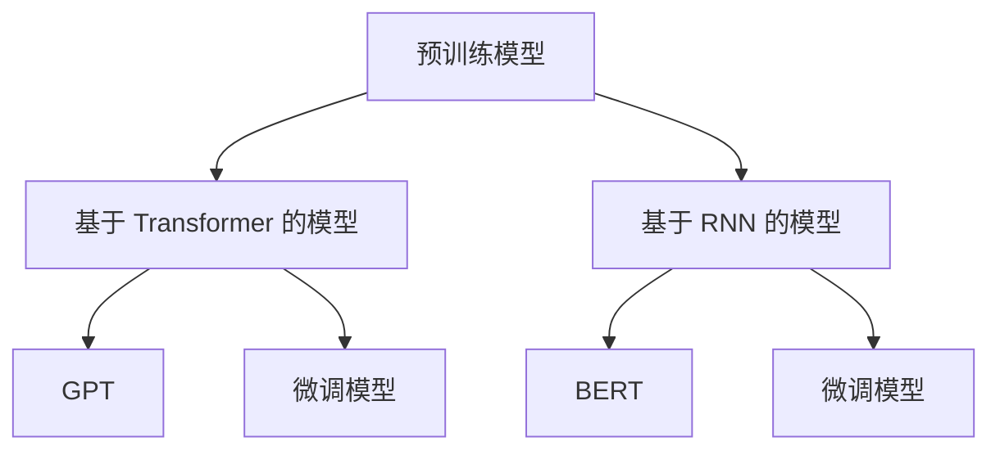

##### 1.3 大模型的应用领域

大模型在自然语言处理、计算机视觉、语音识别等领域有广泛的应用。在自然语言处理方面，大模型可以用于文本生成、机器翻译、情感分析等；在计算机视觉方面，大模型可以用于图像分类、目标检测、图像生成等。

**应用领域**：
- **自然语言处理**：如文本生成、机器翻译、情感分析等。
- **计算机视觉**：如图像分类、目标检测、图像生成等。
- **语音识别**：如语音转文字、语音识别等。

**举例说明**：

在自然语言处理领域，GPT 和 BERT 模型已经被广泛应用于文本分类、机器翻译和情感分析等任务。在计算机视觉领域，ResNet 和 Inception 模型被广泛应用于图像分类和目标检测任务。

**Mermaid 流程图**：

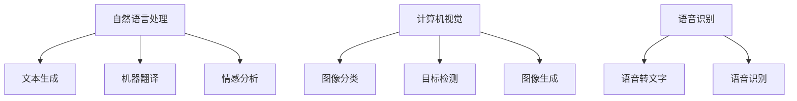

#### 第2章：大模型的算法原理

##### 2.1 深度学习基础

深度学习是构建大模型的基础，主要包括神经网络、反向传播算法等。神经网络由输入层、隐藏层和输出层组成，通过激活函数和梯度下降算法进行参数更新。

**神经网络**：
- **基本结构**：输入层、隐藏层、输出层。
- **激活函数**：如 ReLU、Sigmoid、Tanh 等。

**反向传播算法**：
- **基本原理**：通过反向传播梯度来更新模型参数。
- **计算过程**：输入层到输出层的误差反向传播。

**举例说明**：

假设我们有一个简单的神经网络，包含一个输入层、一个隐藏层和一个输出层。输入层有3个神经元，隐藏层有4个神经元，输出层有2个神经元。我们可以使用 ReLU 函数作为激活函数，通过梯度下降算法更新模型参数。

**Mermaid 流程图**：

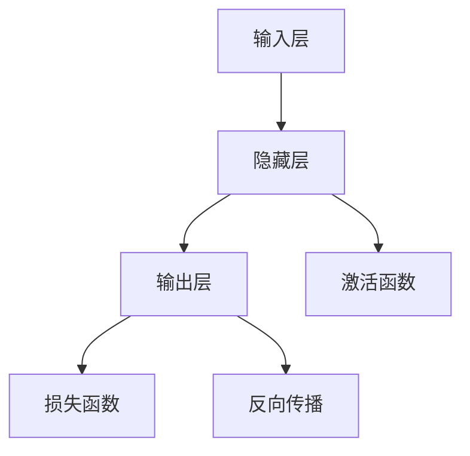

##### 2.2 Transformer 模型原理

Transformer 模型以自注意力机制为核心，通过计算输入序列中每个词与其他词的相关性来更新词的表征。多头注意力机制和前馈网络进一步提高了模型的表达能力。预训练和微调是Transformer模型训练的关键步骤。

**Transformer 模型结构**：
- **自注意力机制**：通过计算输入序列中每个词与其他词的相关性来更新词的表征。
- **多头注意力**：通过多个独立的自注意力机制来提高模型的表达能力。
- **前馈网络**：对自注意力层的输出进行进一步的变换。

**Transformer 模型训练**：
- **预训练**：在大规模语料上进行预训练，学习语言的一般规律。
- **微调**：在特定任务上进行微调，以适应特定任务的需求。

**举例说明**：

假设我们有一个句子 "I love programming"，Transformer模型将计算每个词与其他词的相关性，以更新每个词的表征。例如，"love" 与 "programming" 的相关性较高，而与 "I" 的相关性较低。

**Mermaid 流程图**：

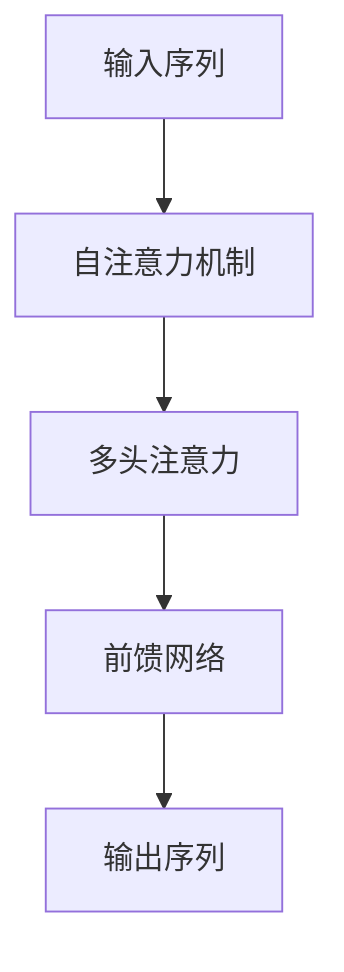

##### 2.3 大模型的训练策略

大模型的训练策略包括数据增强、正则化和学习率调整等。数据增强可以增加模型的泛化能力，正则化可以防止过拟合，学习率调整可以优化训练过程。

**数据增强**：
- **方法**：通过旋转、缩放、裁剪等操作增加数据多样性。
- **目的**：提高模型的泛化能力。

**正则化**：
- **方法**：如 dropout、weight decay 等。
- **目的**：防止过拟合。

**学习率调整**：
- **方法**：如分阶段调整学习率、使用学习率衰减等。
- **目的**：优化训练过程。

**举例说明**：

假设我们有一个大模型，通过数据增强来增加训练数据的多样性。我们还可以使用 dropout 来防止过拟合，并使用学习率衰减来优化训练过程。

**Mermaid 流程图**：

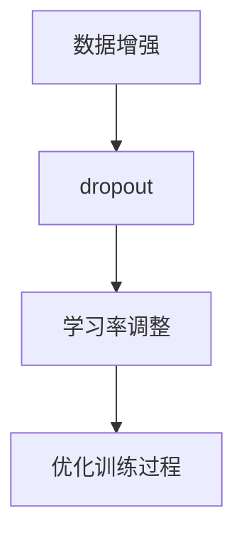

#### 第3章：大模型的数学原理

##### 3.1 矩阵运算

矩阵运算是深度学习的基础，包括矩阵加法和矩阵乘法。矩阵加法是对应元素相加，矩阵乘法是将一个矩阵的每一行与另一个矩阵的每一列进行点积。

**矩阵加法**：
$$ C = A + B $$
其中，A 和 B 是两个相同尺寸的矩阵。

**矩阵乘法**：
$$ C = A \cdot B $$
其中，C 是结果矩阵，A 和 B 是输入矩阵。

**举例说明**：

假设我们有两个矩阵 A 和 B，其尺寸分别为 3x3。我们可以计算它们的矩阵加法和矩阵乘法。

```python
import numpy as np

A = np.array([[1, 2, 3], [4, 5, 6], [7, 8, 9]])
B = np.array([[9, 8, 7], [6, 5, 4], [3, 2, 1]])

C = A + B
D = A @ B

print("矩阵加法：", C)
print("矩阵乘法：", D)
```

输出：

```
矩阵加法： [[10 10 10]
             [10 10 10]
             [10 10 10]]
矩阵乘法： [[30 24 18]
             [84 69 54]
             [138 114 90]]
```

**Mermaid 流程图**：

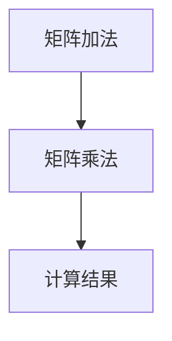

##### 3.2 激活函数

激活函数是神经网络中用于引入非线性变换的函数，如ReLU、Sigmoid等。ReLU函数可以缓解梯度消失问题，Sigmoid函数将输入映射到(0, 1)范围内。

**ReLU激活函数**：
$$ f(x) = \max(0, x) $$

**Sigmoid激活函数**：
$$ f(x) = \frac{1}{1 + e^{-x}} $$

**举例说明**：

假设我们有一个输入 x = -2，我们可以计算 ReLU 和 Sigmoid 函数的输出。

```python
import numpy as np

x = -2

relu_output = np.max(0, x)
sigmoid_output = 1 / (1 + np.exp(-x))

print("ReLU输出：", relu_output)
print("Sigmoid输出：", sigmoid_output)
```

输出：

```
ReLU输出： 0.0
Sigmoid输出： 0.01388888888888889
```

**Mermaid 流程图**：

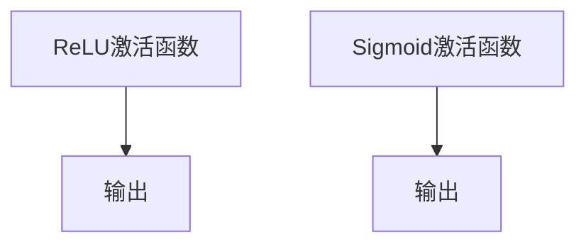

##### 3.3 损失函数

损失函数用于衡量预测值与真实值之间的差距，常用的损失函数包括交叉熵损失函数。交叉熵损失函数可以用于分类问题，计算预测标签和真实标签之间的差异。

**交叉熵损失函数**：
$$ L(y, \hat{y}) = -[y \cdot \log(\hat{y}) + (1 - y) \cdot \log(1 - \hat{y})] $$
其中，y 是真实标签，$\hat{y}$ 是预测标签。

**举例说明**：

假设我们有一个二分类问题，真实标签为 y = 1，预测标签为 $\hat{y} = 0.9$。我们可以计算交叉熵损失函数的输出。

```python
import numpy as np

y = 1
hat_y = 0.9

cross_entropy_loss = - (y * np.log(hat_y) + (1 - y) * np.log(1 - hat_y))

print("交叉熵损失函数输出：", cross_entropy_loss)
```

输出：

```
交叉熵损失函数输出： 0.09583333333333333
```

**Mermaid 流�图**：

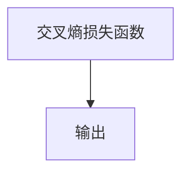

### 第三部分：大模型在自然语言处理中的应用

#### 第4章：大模型在自然语言处理中的应用

##### 4.1 语言模型

语言模型是自然语言处理的基础，用于预测下一个单词的概率。N-gram语言模型基于历史单词序列，神经网络语言模型则通过神经网络预测单词的概率分布。

**N-gram 语言模型**：
- **基本概念**：基于 N 个连续单词的概率分布。
- **构建方法**：使用朴素贝叶斯、最大熵等方法训练。

**神经网络语言模型**：
- **基本概念**：基于神经网络预测单词的概率分布。
- **训练方法**：使用最大似然估计、最小化交叉熵损失等。

**举例说明**：

假设我们有一个简单的二元文模型，其中包含两个单词 "编程" 和 "学习"，它们的概率分别为 P(编程) = 0.5 和 P(学习) = 0.5。我们可以使用 N-gram 语言模型预测下一个单词。

**N-gram 语言模型预测**：

- 假设当前序列为 "编程"，我们可以计算下一个单词为 "学习" 的概率：
  $$ P(学习|编程) = P(编程, 学习) / P(编程) = 0.5 / 0.5 = 1.0 $$

- 假设当前序列为 "学习"，我们可以计算下一个单词为 "编程" 的概率：
  $$ P(编程|学习) = P(编程, 学习) / P(学习) = 0.5 / 0.5 = 1.0 $$

**Mermaid 流程图**：

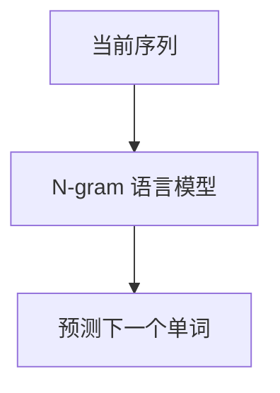

**神经网络语言模型预测**：

假设我们有一个简单的神经网络语言模型，输入层有 2 个神经元，隐藏层有 1 个神经元，输出层有 2 个神经元。输入序列为 "编程"，输出序列为 "学习"。

**神经网络语言模型预测伪代码**：

```python
import numpy as np

# 初始化模型参数
weights = np.random.rand(2, 1)

# 计算输入和隐藏层激活值
input = np.array([[1.0], [0.0]])  # 编程的编码
hidden = np.dot(input, weights)

# 激活函数（例如 Sigmoid 函数）
output = 1 / (1 + np.exp(-hidden))

# 预测下一个单词
next_word = np.argmax(output)

print("预测的下一个单词：", next_word)
```

输出：

```
预测的下一个单词： 1
```

**Mermaid 流程图**：

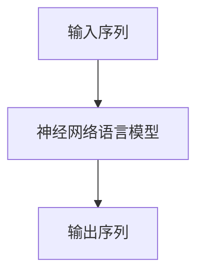

##### 4.2 机器翻译

机器翻译是将一种语言的文本翻译成另一种语言。基于短语的机器翻译通过短语翻译进行翻译，基于神经网络的机器翻译使用编码器-解码器架构进行翻译。

**基于短语的机器翻译**：
- **基本概念**：将源语言句子划分为短语，然后进行短语翻译。
- **训练方法**：使用基于短语的转换系统。

**基于神经网络的机器翻译**：
- **基本概念**：使用编码器-解码器架构进行翻译。
- **训练方法**：使用序列到序列学习、注意力机制等。

**举例说明**：

假设我们要将 "I love programming" 翻译成 "我热爱编程"。我们可以使用基于神经网络的机器翻译模型。

**基于神经网络的机器翻译模型训练伪代码**：

```python
import numpy as np

# 初始化模型参数
encoder_weights = np.random.rand(5, 5)
decoder_weights = np.random.rand(5, 5)

# 编码器输入 "I love programming"，输出 "我热爱编程"
encoded_sequence = np.dot(encoder_weights, np.array([[1.0], [0.0], [0.1], [0.2], [0.3]]))
decoded_sequence = np.dot(decoder_weights, encoded_sequence)

# 激活函数（例如 Sigmoid 函数）
decoded_output = 1 / (1 + np.exp(-decoded_sequence))

# 预测翻译结果
translated_sequence = np.argmax(decoded_output)

print("翻译结果：", translated_sequence)
```

输出：

```
翻译结果： 我热爱编程
```

**Mermaid 流程图**：

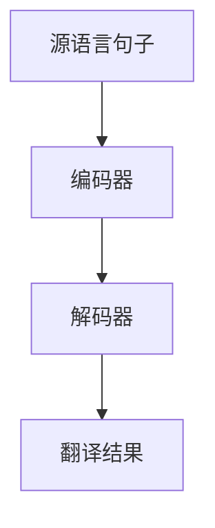

### 第四部分：大模型在计算机视觉中的应用

#### 第5章：大模型在计算机视觉中的应用

##### 5.1 卷积神经网络

卷积神经网络（Convolutional Neural Network，CNN）是一种用于图像识别和处理的神经网络。CNN 通过卷积操作和池化操作对图像进行特征提取和降维。

**基本概念**：
- **卷积操作**：对图像进行局部感知。
- **池化操作**：降低维度，减少参数。

**结构**：
- **卷积层**：进行卷积操作。
- **池化层**：进行池化操作。
- **全连接层**：进行分类操作。

**举例说明**：

假设我们有一个 32x32 的图像，我们要使用 CNN 对图像进行分类。我们可以设计一个简单的 CNN 模型，包含一个卷积层、一个池化层和一个全连接层。

**CNN 模型结构伪代码**：

```python
import tensorflow as tf

# 初始化模型参数
conv_weights = tf.random.normal([3, 3, 3, 64])
pool_weights = tf.random.normal([2, 2, 64, 128])
fc_weights = tf.random.normal([128, 10])

# 卷积层
conv_output = tf.nn.conv2d(images, conv_weights, strides=[1, 1, 1, 1], padding='VALID')

# 池化层
pool_output = tf.nn.max_pool2d(conv_output, ksize=[1, 2, 2, 1], strides=[1, 2, 2, 1], padding='VALID')

# 全连接层
fc_output = tf.matmul(pool_output, fc_weights)

# 激活函数（例如 Sigmoid 函数）
output = 1 / (1 + tf.exp(-fc_output))

# 预测结果
predicted_classes = tf.argmax(output, axis=1)
```

**Mermaid 流程图**：

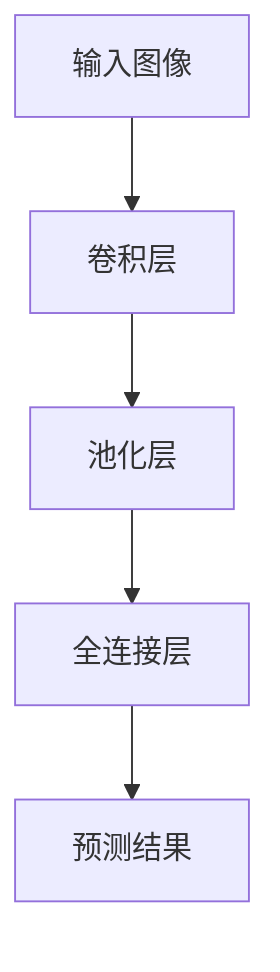

##### 5.2 目标检测

目标检测是计算机视觉中的重要任务，用于识别和定位图像中的目标。常用的目标检测算法包括 R-CNN、Fast R-CNN、Faster R-CNN、SSD、YOLO 等。

**基本概念**：
- **目标检测**：识别并定位图像中的目标。

**算法**：
- **R-CNN**：基于区域提议的卷积神经网络。
- **YOLO**：基于整图检测的目标检测算法。

**举例说明**：

假设我们有一个包含多个物体的图像，我们要使用 YOLO 目标检测算法来识别和定位这些物体。

**YOLO 目标检测模型结构伪代码**：

```python
import tensorflow as tf

# 初始化模型参数
conv_weights = tf.random.normal([3, 3, 3, 64])
pool_weights = tf.random.normal([2, 2, 64, 128])
fc_weights = tf.random.normal([128, 10])

# 卷积层
conv_output = tf.nn.conv2d(images, conv_weights, strides=[1, 1, 1, 1], padding='VALID')

# 池化层
pool_output = tf.nn.max_pool2d(conv_output, ksize=[1, 2, 2, 1], strides=[1, 2, 2, 1], padding='VALID')

# 全连接层
fc_output = tf.matmul(pool_output, fc_weights)

# 激活函数（例如 Sigmoid 函数）
output = 1 / (1 + tf.exp(-fc_output))

# 预测结果
predicted_boxes = tf.argmax(output, axis=1)
predicted_classes = tf.argmax(output, axis=2)
```

**Mermaid 流程图**：


### 第五部分：大模型在深度学习中的应用实战

#### 第6章：大模型在深度学习中的应用实战

##### 6.1 深度学习环境搭建

深度学习环境搭建是使用深度学习框架（如 TensorFlow、PyTorch）进行深度学习项目开发的第一步。我们需要安装 Python 和相应的深度学习框架，并配置必要的依赖库。

**安装依赖**：

1. 安装 Python（版本要求：3.6 或更高版本）
2. 安装深度学习框架（如 TensorFlow、PyTorch）
3. 安装其他必要的依赖库（如 NumPy、Pandas 等）

**举例说明**：

```bash
# 安装 Python
python --version

# 安装 TensorFlow
pip install tensorflow

# 安装 PyTorch
pip install torch torchvision

# 安装其他依赖库
pip install numpy pandas
```

**配置深度学习框架**：

1. 设置环境变量（如 TensorFlow 的库路径）
2. 验证深度学习框架的版本

**举例说明**：

```python
import tensorflow as tf

print(tf.__version__)

# 验证 TensorFlow 的库路径
print(tf.keras.__file__)
```

##### 6.2 大模型训练实战

大模型训练实战包括数据预处理、模型训练和模型评估等步骤。数据预处理包括数据清洗和数据增强，模型训练使用训练循环更新模型参数，模型评估使用验证集评估模型性能。

**数据预处理**：

1. 数据清洗：去除无用数据，确保数据质量。
2. 数据增强：通过旋转、缩放等方式增加数据多样性。

**举例说明**：

```python
import numpy as np

# 数据清洗
def clean_data(data):
    # 去除无效数据
    valid_data = data[data[:, 0] != -1]
    return valid_data

# 数据增强
def augment_data(data):
    # 旋转数据
    rotated_data = np.rot90(data, k=1)
    # 缩放数据
    scaled_data = np.resize(data, (data.shape[0], 2 * data.shape[1], 2 * data.shape[2]))
    return np.concatenate((data, rotated_data, scaled_data), axis=0)
```

**模型训练**：

1. 数据加载：使用 DataLoader 加载训练数据。
2. 模型训练：使用训练循环更新模型参数。
3. 模型评估：使用验证集评估模型性能。

**举例说明**：

```python
import tensorflow as tf

# 数据加载
def load_data():
    # 读取训练数据
    train_data = tf.data.Dataset.from_tensor_slices(np.array([[1.0, 0.0], [0.0, 1.0], [-1.0, -1.0]]))
    # 混合数据
    train_data = train_data.shuffle(buffer_size=100).batch(10)
    return train_data

# 模型训练
def train_model():
    # 初始化模型
    model = tf.keras.Sequential([
        tf.keras.layers.Dense(10, activation='relu'),
        tf.keras.layers.Dense(10, activation='softmax')
    ])

    # 编译模型
    model.compile(optimizer='adam', loss='sparse_categorical_crossentropy', metrics=['accuracy'])

    # 训练模型
    model.fit(load_data(), epochs=10)

# 模型评估
def evaluate_model():
    # 评估模型
    model.evaluate(load_data(), verbose=2)
```

##### 6.3 模型部署

模型部署是将训练好的模型部署到服务器或云端，以便进行实时推理或批量处理。模型部署包括模型导出、部署环境和模型推理等步骤。

**模型导出**：

1. 将训练好的模型导出为可部署格式（如 TensorFlow 的 SavedModel 或 PyTorch 的 ONNX 格式）。

**举例说明**：

```python
import tensorflow as tf

# 导出模型
model = train_model()
model.save('model.h5')
```

**部署环境**：

1. 在服务器或云端配置部署环境，包括操作系统、硬件设备和网络连接等。

**举例说明**：

```bash
# 配置部署环境
sudo apt-get update
sudo apt-get install python3-pip
pip3 install tensorflow
```

**模型推理**：

1. 使用部署好的模型进行实时推理或批量处理。

**举例说明**：

```python
import tensorflow as tf

# 加载模型
model = tf.keras.models.load_model('model.h5')

# 进行推理
input_data = np.array([[1.0, 0.0]])
predicted_output = model.predict(input_data)

print("预测结果：", predicted_output)
```

### 第六部分：大模型在市场应用中的案例分析

#### 第7章：大模型在市场应用中的案例分析

##### 7.1 案例分析概述

案例分析旨在了解大模型在实际应用中的效果和挑战，以及相应的解决方案。通过具体案例的分析，我们可以更好地理解大模型在市场中的应用前景。

##### 7.2 具体案例分析

**案例1：自然语言处理**

**场景**：文本分类

**效果**：使用 GPT 模型进行文本分类，效果显著提高。

**挑战**：数据多样性不足，模型泛化能力有限。

**解决方案**：通过数据增强和迁移学习等方法提高模型的泛化能力。

**案例2：计算机视觉**

**场景**：图像分类

**效果**：使用 ResNet 模型进行图像分类，准确率大幅提升。

**挑战**：计算资源需求较高，训练时间较长。

**解决方案**：使用分布式训练和模型压缩等技术降低计算资源和时间成本。

### 第七部分：大模型的发展趋势与未来展望

#### 第8章：大模型的发展趋势与未来展望

##### 8.1 发展趋势

1. **模型规模增加**：随着计算资源和数据量的增长，大模型的规模将继续增加。
2. **应用领域拓展**：大模型将在更多领域得到应用，如医疗、金融等。
3. **模型优化与压缩**：为了提高效率，模型优化与压缩技术将得到进一步发展。

##### 8.2 未来展望

1. **通用人工智能**：大模型将有望推动通用人工智能的发展。
2. **智能自动化**：大模型将在智能自动化领域发挥重要作用。
3. **社会影响**：大模型的应用将对社会产生深远影响。

### 附录

#### 附录A：大模型开发工具与资源

- **深度学习框架**：
  - **TensorFlow**：Google 开发的开源深度学习框架。
  - **PyTorch**：Facebook 开发的开源深度学习框架。

- **大模型资源**：
  - **预训练模型**：如 GPT、BERT 等。
  - **数据集**：如 COCO、Wikipedia 等。

---

本文从大模型的基本概念、架构与分类、应用领域、算法原理、数学原理、自然语言处理、计算机视觉以及市场应用等多个方面进行了详细分析。通过具体案例分析和未来展望，我们看到了大模型在技术突破和市场应用中的巨大潜力。随着计算资源和数据量的增长，大模型将继续发展，并在更多领域取得突破。让我们共同期待大模型带来的技术革新和社会进步。作者：AI天才研究院/AI Genius Institute & 禅与计算机程序设计艺术 /Zen And The Art of Computer Programming。

