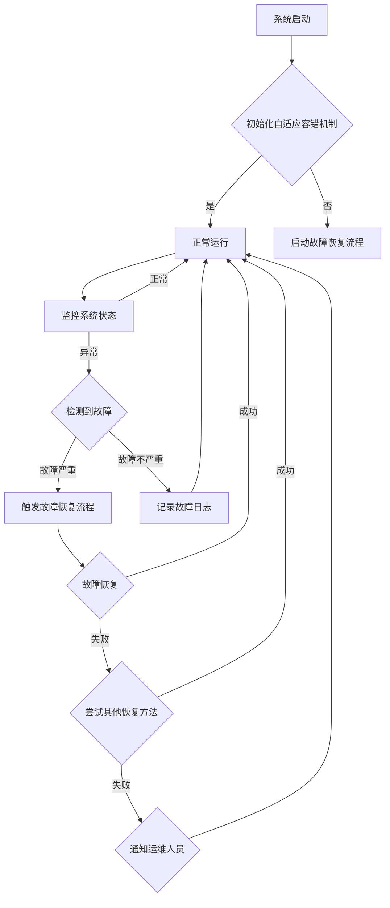

                 

## 引言

随着人工智能技术的飞速发展，大模型软件（如深度学习模型、自然语言处理模型等）在各个领域得到了广泛应用。这些模型通常具有强大的计算能力和复杂的数据处理能力，可以处理大规模的数据集，并产生高质量的输出结果。然而，大模型软件在运行过程中面临着许多挑战，其中之一就是容错性问题。

### 大模型软件的发展历程

大模型软件的发展历程可以追溯到上世纪90年代。那时，神经网络开始应用于图像识别、语音识别等领域，并取得了初步的成功。随着计算能力的提高和数据量的增长，神经网络模型变得更加复杂，从而形成了今天我们所说的大模型。这些大模型通常包含数百万个参数，需要大量数据进行训练，且具有很高的计算复杂度。

### 大模型软件的重要性

大模型软件在许多领域都有着重要的应用，如医疗诊断、金融分析、自动驾驶、语音识别等。例如，在医疗诊断领域，大模型软件可以通过对大量医学图像和病例数据的分析，提供准确的诊断结果；在自动驾驶领域，大模型软件可以通过对大量驾驶数据的处理，实现对车辆的实时控制和决策。

### 大模型软件的挑战与机遇

然而，大模型软件在运行过程中也面临着许多挑战。首先，大模型软件的计算复杂度高，需要大量的计算资源和时间来完成训练和推理任务。其次，大模型软件在处理大规模数据时，容易出现过拟合现象，导致模型性能下降。此外，大模型软件在运行过程中可能会出现各种故障，如硬件故障、数据丢失、计算错误等，这些问题都需要通过有效的容错机制来解决。

### 自适应容错机制的概念

自适应容错机制是一种能够在系统运行过程中动态调整自身参数，以应对各种故障的容错机制。它能够根据系统的运行状态和故障情况，自动调整模型的参数，确保系统的稳定运行和数据的完整性。

### 自适应容错机制的分类

自适应容错机制可以分为以下几类：

1. **重训练机制**：在模型发生故障时，自动重新训练模型，以恢复模型的正常功能。
2. **备份与恢复机制**：在系统运行过程中，自动备份关键数据和模型，以便在出现故障时快速恢复。
3. **故障检测与隔离机制**：实时监测系统运行状态，及时发现故障并进行隔离，以减少故障对系统的影响。
4. **动态调整机制**：根据系统的运行状态和故障情况，动态调整模型的参数，以保持系统的稳定性和性能。

### 自适应容错机制的应用场景

自适应容错机制在以下场景中具有广泛的应用：

1. **云计算与大数据**：在云计算和大数据处理环境中，自适应容错机制可以帮助确保系统的稳定运行和数据的完整性。
2. **自动驾驶**：在自动驾驶系统中，自适应容错机制可以确保车辆在复杂环境中能够稳定运行，并应对各种突发情况。
3. **医疗诊断**：在医疗诊断系统中，自适应容错机制可以帮助提高诊断的准确性，确保患者得到及时、准确的诊断结果。
4. **金融分析**：在金融分析系统中，自适应容错机制可以确保系统的稳定性和数据的完整性，从而提高金融分析的质量和效率。

通过本节内容，我们了解了大模型软件的发展历程、重要性、面临的挑战以及自适应容错机制的概念、分类和应用场景。下一节我们将深入探讨大模型软件的容错设计，包括其目标、原则和方法。

### 第1章：大模型软件概述

#### 1.1 大模型软件的发展历程

大模型软件的发展历程可以追溯到上世纪90年代。那时，神经网络开始应用于图像识别、语音识别等领域，并取得了初步的成功。随着计算能力的提高和数据量的增长，神经网络模型变得更加复杂，从而形成了今天我们所说的大模型。这些大模型通常包含数百万个参数，需要大量数据进行训练，且具有很高的计算复杂度。

早期的神经网络模型如感知机、反向传播算法等，主要是基于简单的数学模型和规则进行训练和推理。随着硬件技术的发展，尤其是GPU和TPU的出现，计算能力得到了极大的提升，这使得大模型软件的开发成为可能。此外，互联网的普及和大数据的积累，为大规模数据训练提供了丰富的资源。

进入21世纪，深度学习技术取得了突破性的进展。2012年，AlexNet在ImageNet图像识别竞赛中取得了巨大成功，这标志着深度学习技术正式进入大众视野。随后，VGG、ResNet、Inception等一系列深度学习模型不断涌现，并在各个领域取得了优异的性能。

#### 1.2 大模型软件的重要性

大模型软件在许多领域都有着重要的应用，以下是几个典型的例子：

1. **医疗诊断**：大模型软件可以通过对大量医学图像和病例数据的分析，提供准确的诊断结果。例如，在肺癌检测中，深度学习模型可以分析肺部CT图像，检测早期病变，提高诊断准确性。
2. **自动驾驶**：自动驾驶系统需要处理大量的传感器数据，如摄像头、雷达、激光雷达等。大模型软件可以对这些数据进行处理，实现对车辆的实时控制和决策，提高行驶安全性和效率。
3. **自然语言处理**：大模型软件可以处理大量的文本数据，进行文本分类、情感分析、机器翻译等任务。例如，智能客服系统可以通过自然语言处理技术，提供高效、准确的客户服务。
4. **金融分析**：大模型软件可以对金融市场的数据进行分析，预测市场走势，为投资者提供决策支持。例如，在股票交易中，大模型软件可以通过分析历史数据，预测股票价格的趋势，帮助投资者做出更明智的投资决策。

#### 1.3 大模型软件的挑战与机遇

尽管大模型软件在各个领域都取得了显著的成果，但其在实际应用中仍然面临着许多挑战。以下是几个主要挑战：

1. **计算资源需求**：大模型软件通常需要大量的计算资源和时间来完成训练和推理任务。这意味着需要高性能的硬件设备，如GPU、TPU等，以及合理的资源调度和管理策略。
2. **数据质量和标注**：大模型软件的性能很大程度上依赖于数据的质量和标注。然而，获取高质量的数据集和进行准确的标注通常是一项费时费力的工作。
3. **过拟合问题**：大模型软件在训练过程中容易过拟合，即模型对训练数据过于敏感，导致在测试数据上的表现不佳。解决这个问题需要设计合适的训练策略和正则化方法。
4. **容错性问题**：大模型软件在运行过程中可能会出现各种故障，如硬件故障、数据丢失、计算错误等。如何设计有效的容错机制，确保系统的稳定运行和数据完整性，是一个重要的挑战。

然而，这些挑战也带来了机遇。通过解决这些挑战，可以进一步提高大模型软件的性能和应用范围。例如，通过优化计算资源和算法，可以提高模型的训练和推理效率；通过改进数据标注和收集方法，可以获取更高质量的数据集；通过研究自适应容错机制，可以确保系统的稳定性和可靠性。

综上所述，大模型软件的发展历程、重要性和面临的挑战为我们提供了丰富的背景知识。下一节我们将详细探讨自适应容错机制的概念、原理和应用，为大模型软件的设计和实现提供有效的解决方案。

#### 2.1 自适应容错机制的原理

自适应容错机制是一种通过动态调整系统参数和策略，以应对运行过程中可能出现的各种故障和异常的机制。其核心思想是提高系统的鲁棒性和可靠性，确保系统在故障发生时能够快速恢复，最小化对系统正常运行的影响。

##### 2.1.1 自适应容错机制的工作原理

自适应容错机制通常包括以下几个关键步骤：

1. **故障检测**：系统持续监控自身的运行状态，包括计算资源、数据流、算法性能等，及时发现异常情况。
2. **故障诊断**：在检测到故障后，系统对故障的性质和原因进行分析，确定故障类型和影响范围。
3. **故障恢复**：根据故障诊断的结果，系统采取相应的恢复措施，如重新启动任务、切换备用资源、恢复数据等。
4. **故障预测**：系统利用历史数据和统计模型，预测未来可能发生的故障，并提前采取预防措施。

##### 2.1.2 自适应容错机制的关键技术

1. **冗余设计**：通过冗余设计和备份策略，确保系统在部分组件或资源发生故障时，其他组件或资源可以替代其功能，保证系统的连续性和稳定性。
2. **故障检测与隔离**：系统通过实时监控和日志分析，检测故障发生的迹象，并快速隔离故障组件，防止故障扩散。
3. **故障恢复与重试**：系统在检测到故障后，根据预定义的恢复策略，尝试重新启动任务或切换到备用资源，并在必要时进行数据恢复和重试。
4. **自学习和自适应**：系统利用自学习算法，从历史故障数据中提取规律，优化容错策略，提高故障预测和恢复的准确性。

##### 2.1.3 自适应容错机制的优势

1. **提高系统可靠性**：通过自适应容错机制，系统可以在故障发生时快速恢复，减少故障对系统正常运行的影响，提高系统的可靠性。
2. **减少停机时间**：自适应容错机制能够快速检测和恢复故障，减少系统的停机时间，提高系统的可用性。
3. **优化资源利用**：通过冗余设计和资源调度，自适应容错机制可以优化系统资源的利用，提高整体性能和效率。
4. **增强用户体验**：对于依赖大模型软件的应用，如自动驾驶、医疗诊断等，自适应容错机制可以确保系统在故障发生时仍能提供稳定、高质量的服务，提高用户体验。

总之，自适应容错机制是大模型软件设计中不可或缺的一部分。它通过动态调整系统参数和策略，提高系统的鲁棒性和可靠性，确保系统在复杂环境中能够稳定运行。在接下来的章节中，我们将进一步探讨自适应容错机制在大模型软件设计中的具体应用。

#### 2.2 自适应容错机制的分类

自适应容错机制可以根据不同的故障类型、恢复策略和实施方式，进行多种分类。以下是几种常见的自适应容错机制分类：

##### 2.2.1 按故障类型分类

1. **硬件故障容错**：针对硬件设备可能出现的故障，如服务器宕机、存储故障等，采取的容错措施。这通常涉及硬件冗余、故障检测与切换机制等。

2. **软件故障容错**：针对软件运行过程中可能出现的错误，如算法错误、内存泄漏、系统崩溃等，采取的容错措施。这通常涉及代码冗余、动态修复、自恢复等技术。

##### 2.2.2 按恢复策略分类

1. **重试机制**：在故障发生后，系统重新执行之前的操作，以期望恢复正常状态。这种方法简单但有时可能导致无限循环，需要配合超时机制和错误计数。

2. **备份与恢复**：系统在运行过程中定期备份关键数据，以便在出现故障时快速恢复。这包括数据备份、日志恢复、版本回滚等技术。

3. **切换机制**：当主系统发生故障时，系统自动切换到备用系统，确保服务的连续性。这种方法通常用于关键业务系统的容错设计。

##### 2.2.3 按实施方式分类

1. **被动容错**：系统在故障发生后被动地响应，如自动重启、日志记录、报警通知等。这种方法通常成本低，但对故障响应速度要求不高。

2. **主动容错**：系统在故障发生前主动采取预防措施，如动态调整参数、故障预测、提前迁移任务等。这种方法需要更多的计算资源和预测能力，但可以显著提高系统的可靠性和性能。

##### 2.2.4 按应用场景分类

1. **云计算环境**：在云计算环境中，自适应容错机制通常涉及虚拟机迁移、负载均衡、分布式存储等技术，以应对大规模分布式系统中的故障。

2. **边缘计算环境**：在边缘计算环境中，自适应容错机制需要考虑资源有限、网络不稳定等特点，通常采用低延迟、高可靠性的技术。

3. **自动驾驶**：在自动驾驶系统中，自适应容错机制需要实时监测车辆的运行状态，快速响应各种故障，确保行驶安全。

4. **医疗诊断系统**：在医疗诊断系统中，自适应容错机制需要确保系统在故障发生时仍能提供高质量的诊断结果，保障患者的安全。

不同类型的自适应容错机制在实际应用中往往需要结合使用，以形成完整的容错方案。通过合理选择和组合不同的容错机制，可以构建一个高可靠性、高效率的大模型软件系统。

#### 2.3 自适应容错机制的应用场景

自适应容错机制在多个领域都有着广泛的应用，以下是几个典型的应用场景：

##### 2.3.1 云计算与大数据

在云计算和大数据处理环境中，自适应容错机制发挥着关键作用。例如，当分布式计算集群中的节点发生故障时，自适应容错机制可以自动检测并隔离故障节点，将任务重新调度到其他健康节点上，确保计算任务的连续性和数据的一致性。此外，自适应容错机制还可以根据负载情况动态调整资源分配，提高系统的整体性能和可靠性。

##### 2.3.2 自动驾驶

自动驾驶系统对实时性和可靠性有着极高的要求。在自动驾驶环境中，自适应容错机制可以监控车辆的各个传感器和执行器的状态，一旦检测到故障，立即采取相应的措施，如切换备用传感器、调整驾驶策略等，确保车辆的稳定运行和行驶安全。例如，当车辆的主雷达发生故障时，自适应容错机制可以切换到备份雷达，继续提供必要的驾驶数据。

##### 2.3.3 金融交易系统

金融交易系统对数据准确性和交易速度要求极高。自适应容错机制可以确保系统在处理大量交易数据时，即使在出现硬件故障或网络中断的情况下，也能快速恢复并继续处理交易。例如，当数据库出现故障时，自适应容错机制可以自动切换到备用数据库，确保交易数据不会丢失，从而保证交易的连续性和准确性。

##### 2.3.4 医疗诊断

在医疗诊断领域，自适应容错机制可以确保系统在处理医学图像和病例数据时，即使在出现计算错误或数据丢失的情况下，也能快速恢复，并继续提供高质量的诊断结果。例如，在分析肺部CT图像时，自适应容错机制可以检测到算法的错误输出，并自动重新计算，确保诊断结果的准确性。

##### 2.3.5 通信系统

在通信系统中，自适应容错机制可以确保网络在遭受攻击或故障时，能够快速恢复，保障通信的连续性和稳定性。例如，在无线通信网络中，自适应容错机制可以检测到信号干扰或网络故障，并自动调整通信路径，确保通信的畅通。

总之，自适应容错机制在云计算、自动驾驶、金融交易、医疗诊断、通信系统等多个领域都有着广泛的应用。通过自适应容错机制，这些系统可以在故障发生时快速恢复，保证系统的稳定性和可靠性，从而为用户提供高质量的服务。

### 第3章：大模型软件的容错设计

#### 3.1 容错设计的目标与原则

大模型软件的容错设计旨在确保系统在面临各种故障时能够稳定运行，提供高质量的服务。其目标主要包括以下几个方面：

1. **提高系统的可靠性**：通过设计有效的容错机制，确保系统在故障发生时能够快速恢复，最小化故障对系统正常运行的影响。
2. **保证数据完整性**：在系统运行过程中，确保数据的完整性和一致性，防止数据丢失或被篡改。
3. **优化系统性能**：通过合理的容错设计和资源调度，提高系统的整体性能和效率，确保系统在正常情况下能够高效运行。
4. **降低维护成本**：通过自动化和智能化的容错机制，减少系统的维护成本，提高运维效率。

为了实现上述目标，大模型软件的容错设计应遵循以下原则：

1. **冗余设计**：通过冗余组件和备份策略，确保在部分组件或资源发生故障时，系统能够自动切换到备用组件或资源，保障系统的连续性和稳定性。
2. **故障检测与隔离**：系统应具备强大的故障检测能力，能够实时监测各种故障迹象，并快速隔离故障组件，防止故障扩散。
3. **动态调整**：系统应根据运行状态和故障情况，动态调整自身参数和策略，确保系统在复杂环境中能够保持稳定运行。
4. **自学习和自适应**：系统应具备自学习和自适应能力，通过分析历史故障数据和统计模型，优化容错策略，提高故障预测和恢复的准确性。

#### 3.2 容错设计的方法与策略

大模型软件的容错设计涉及多个方面，包括系统架构、代码实现、数据管理和资源调度等。以下是一些常见的容错设计方法和策略：

1. **冗余设计**：通过冗余组件和备份策略，提高系统的可靠性。冗余设计可以分为硬件冗余和软件冗余。

   - **硬件冗余**：在硬件层面，通过冗余服务器、存储设备和网络设备，确保在部分硬件设备发生故障时，系统仍能正常运行。例如，在分布式计算环境中，可以采用多副本存储和负载均衡技术，确保数据的高可用性和负载均衡。
   - **软件冗余**：在软件层面，通过冗余代码和模块，确保在部分代码或模块发生故障时，系统能够自动切换到备用代码或模块。例如，在深度学习模型训练过程中，可以通过冗余训练数据和算法，提高模型的鲁棒性。

2. **故障检测与隔离**：系统应具备强大的故障检测能力，能够实时监测各种故障迹象，并快速隔离故障组件。

   - **异常检测**：通过分析系统的运行日志、性能指标和系统资源使用情况，及时发现异常情况。例如，可以使用统计模型、机器学习算法等，对系统运行数据进行分析，检测出异常值和异常模式。
   - **故障隔离**：在检测到故障后，系统应快速隔离故障组件，防止故障扩散。例如，可以使用隔离技术，将故障组件与系统其他部分隔离开来，防止故障进一步影响系统的正常运行。

3. **动态调整**：系统应根据运行状态和故障情况，动态调整自身参数和策略，确保系统在复杂环境中能够保持稳定运行。

   - **参数调整**：通过实时监测系统的运行状态，自动调整系统的参数，优化系统性能。例如，在深度学习模型训练过程中，可以通过动态调整学习率、批量大小等参数，提高模型的收敛速度和性能。
   - **策略调整**：根据系统的故障类型和故障历史，动态调整容错策略，优化故障恢复和预防措施。例如，在分布式系统中，可以根据故障类型和故障频率，动态调整负载均衡策略和备份策略。

4. **自学习和自适应**：系统应具备自学习和自适应能力，通过分析历史故障数据和统计模型，优化容错策略，提高故障预测和恢复的准确性。

   - **故障数据收集**：系统应具备故障数据收集能力，记录系统的故障信息、故障原因、故障恢复过程等。这些数据可以作为自学习和优化的依据。
   - **故障预测**：通过分析历史故障数据，使用机器学习算法和统计模型，预测未来可能发生的故障。例如，可以使用时间序列分析、聚类分析等技术，预测系统的故障趋势和故障类型。
   - **自适应优化**：根据故障预测结果，自动调整容错策略和系统参数，优化系统的可靠性和性能。例如，可以根据预测的故障类型，提前部署备份资源，优化负载均衡策略，提高系统的鲁棒性。

#### 3.3 容错设计的案例分析

以下是一个容错设计在大模型软件中的实际案例分析：

##### 案例背景

假设一个大型深度学习模型用于图像识别，该模型需要处理大量的图像数据，并进行复杂的特征提取和分类。由于模型规模较大，训练过程中可能会遇到各种故障，如计算资源不足、数据损坏、算法错误等。为了确保模型在训练过程中能够稳定运行，并保证输出结果的高质量，需要对模型进行容错设计。

##### 容错设计实现

1. **硬件冗余设计**：在硬件层面，采用多台服务器进行分布式训练，确保在部分服务器故障时，其他服务器可以继续处理任务。同时，使用冗余存储设备，确保数据的高可用性和安全性。

2. **故障检测与隔离**：在训练过程中，监控系统实时监控计算资源的利用率、数据流和算法性能。一旦检测到异常，立即进行故障隔离，防止故障扩散。

   - **异常检测**：使用统计模型对计算资源的利用率进行分析，检测出异常值。例如，当某台服务器的CPU利用率异常升高时，立即触发异常检测机制。
   - **故障隔离**：在检测到异常后，立即将故障服务器从训练任务中隔离，确保其他服务器继续处理任务。

3. **动态调整**：根据监控数据和训练进度，动态调整训练参数和策略。

   - **参数调整**：根据实时监控数据，动态调整学习率、批量大小等训练参数，优化模型收敛速度和性能。
   - **策略调整**：根据故障类型和故障历史，动态调整容错策略。例如，当检测到数据损坏时，可以暂停训练任务，进行数据修复和重传。

4. **自学习和自适应**：记录训练过程中的故障信息和修复过程，用于优化容错策略和系统参数。

   - **故障数据收集**：将故障信息和修复过程记录到日志中，供后续分析和优化。
   - **故障预测**：通过分析历史故障数据，使用机器学习算法预测未来可能发生的故障类型和故障时间，提前采取预防措施。

##### 案例效果

通过上述容错设计，模型在训练过程中能够有效应对各种故障，确保训练任务的连续性和输出结果的高质量。具体效果如下：

1. **提高可靠性**：在训练过程中，系统能够快速检测和隔离故障，确保训练任务不受影响，提高了系统的可靠性。
2. **优化性能**：通过动态调整训练参数和策略，优化了模型收敛速度和性能，提高了训练效率。
3. **降低维护成本**：通过自动化和智能化的容错机制，减少了系统维护成本，提高了运维效率。
4. **提升用户体验**：模型在训练过程中保持稳定运行，输出结果高质量，为用户提供更好的服务体验。

综上所述，大模型软件的容错设计是确保系统稳定性和数据完整性的关键。通过冗余设计、故障检测与隔离、动态调整和自学习等策略，可以构建一个高效、可靠的大模型软件系统。

### 第4章：自适应容错算法

#### 4.1 自适应容错算法的基本原理

自适应容错算法是大模型软件中确保系统稳定性和可靠性的核心技术之一。其基本原理是通过对系统运行状态的实时监测和动态调整，以应对各种故障和异常情况。自适应容错算法的核心思想可以概括为以下几个步骤：

1. **监测与检测**：系统持续监测其运行状态，包括计算资源利用率、数据完整性、算法性能等，以识别异常情况和潜在故障。
2. **故障诊断与定位**：在监测到异常后，系统对故障的类型和原因进行诊断和定位，以确定故障的严重程度和影响范围。
3. **决策与响应**：根据故障诊断的结果，系统采取相应的措施进行故障恢复或调整，以最小化故障对系统正常运行的影响。
4. **自适应调整**：系统根据故障历史和运行数据，自适应调整自身的参数和策略，以提高故障检测和恢复的准确性。

#### 4.2 常见的自适应容错算法

在自适应容错算法的领域中，有多种算法被广泛应用于不同场景和需求。以下是几种常见的自适应容错算法：

##### 4.2.1 基于统计模型的故障检测算法

基于统计模型的故障检测算法通过分析系统的运行数据，使用统计学方法检测异常情况。常见的统计模型包括：

1. **移动平均模型（MA）**：移动平均模型通过对系统数据的滑动平均处理，识别出数据中的趋势和波动。当数据偏离滑动平均线时，认为出现了异常。
2. **自回归移动平均模型（ARMA）**：自回归移动平均模型结合自回归模型和移动平均模型，对系统数据进行更复杂的分析和预测，以提高故障检测的准确性。
3. **自回归积分滑动平均模型（ARIMA）**：自回归积分滑动平均模型是更复杂的统计模型，可以处理非平稳时间序列数据，适用于长时间运行系统的故障检测。

##### 4.2.2 基于机器学习的故障诊断算法

基于机器学习的故障诊断算法通过训练模型，从历史数据中学习故障特征和模式，以实现故障检测和诊断。常见的机器学习算法包括：

1. **支持向量机（SVM）**：支持向量机是一种监督学习算法，可以用于分类故障类型。通过将系统数据映射到高维空间，找到最佳分类边界，实现故障检测。
2. **决策树**：决策树是一种树形结构的分类算法，通过一系列规则对系统数据进行划分，实现故障检测和诊断。
3. **神经网络**：神经网络是一种通过多层节点对系统数据进行建模和分类的算法，具有强大的学习能力和适应性，适用于复杂系统的故障诊断。

##### 4.2.3 基于模糊逻辑的故障诊断算法

基于模糊逻辑的故障诊断算法通过模糊规则和隶属度函数，对系统运行状态进行模糊处理和分类。模糊逻辑可以处理不确定性和模糊性，适用于复杂系统的故障诊断。常见的模糊逻辑算法包括：

1. **模糊C-均值聚类算法**：模糊C-均值聚类算法通过模糊隶属度函数，将系统数据分为多个类别，实现故障检测和分类。
2. **模糊规则推理**：模糊规则推理通过模糊规则和推理机制，对系统运行状态进行诊断和预测，实现自适应容错。

##### 4.2.4 基于增强学习的故障诊断算法

基于增强学习的故障诊断算法通过不断学习和优化，提高故障检测和诊断的准确性。增强学习是一种通过试错和反馈机制，实现智能体在环境中学习最优策略的算法。常见的增强学习算法包括：

1. **Q-Learning**：Q-Learning是一种基于值函数的增强学习算法，通过更新Q值，实现故障检测和诊断的最优化。
2. **Deep Q-Network（DQN）**：DQN是一种基于深度神经网络的增强学习算法，通过深度神经网络建模，实现复杂系统的故障检测和诊断。

#### 4.3 自适应容错算法的性能评估

自适应容错算法的性能评估是确保其有效性和实用性的重要环节。常见的性能评估指标包括：

1. **检测率（Detection Rate）**：检测率是指算法能够正确检测到故障的概率。高检测率意味着算法能够准确识别故障，减少误报和漏报。
2. **误报率（False Alarm Rate）**：误报率是指算法错误地将正常状态诊断为故障的概率。低误报率意味着算法在正常情况下不会频繁发出误报，影响系统的稳定运行。
3. **响应时间（Response Time）**：响应时间是指算法从检测到故障到采取恢复措施所需的时间。短响应时间意味着算法能够快速响应故障，减少故障对系统的影响。
4. **恢复率（Recovery Rate）**：恢复率是指算法成功恢复故障的概率。高恢复率意味着算法能够有效地解决故障，确保系统的稳定性和连续性。

通过以上性能评估指标，可以全面评估自适应容错算法的性能，为算法的优化和改进提供依据。

#### 4.4 自适应容错算法的应用

自适应容错算法在大模型软件中的广泛应用，不仅提高了系统的可靠性和稳定性，还显著提升了用户体验和业务效率。以下是自适应容错算法在几个典型应用场景中的具体应用案例：

##### 4.4.1 云计算环境

在云计算环境中，自适应容错算法通过实时监测虚拟机、容器和存储资源的状态，及时发现和处理故障，确保服务的连续性和数据的安全性。例如，当某个虚拟机出现计算资源不足或网络中断时，自适应容错算法可以自动将其迁移到其他健康节点，确保应用的正常运行。

##### 4.4.2 自动驾驶

在自动驾驶系统中，自适应容错算法通过监控车辆的传感器数据、计算资源和执行器状态，确保车辆在各种环境下的稳定运行。例如，当车辆的摄像头或雷达出现故障时，自适应容错算法可以切换到备用传感器，继续提供必要的驾驶数据，确保行驶安全。

##### 4.4.3 金融交易系统

在金融交易系统中，自适应容错算法通过实时监测交易数据、系统状态和网络连接情况，确保交易的高效和安全。例如，当某个交易服务器出现故障时，自适应容错算法可以自动切换到备用服务器，确保交易过程不会中断，数据不会丢失。

##### 4.4.4 医疗诊断系统

在医疗诊断系统中，自适应容错算法通过监控图像处理过程、计算资源和数据流，确保诊断结果的准确性和可靠性。例如，当医疗设备出现故障或数据损坏时，自适应容错算法可以自动恢复数据或切换到备用设备，确保诊断过程的连续性。

##### 4.4.5 通信系统

在通信系统中，自适应容错算法通过监控网络状态、信号质量和设备性能，确保通信的稳定性和可靠性。例如，当某个通信节点出现故障或信号干扰时，自适应容错算法可以自动调整通信路径或切换到备用通信节点，确保通信的畅通。

通过以上应用案例，可以看出自适应容错算法在各类系统中的重要作用。它不仅提高了系统的可靠性和稳定性，还为系统的优化和改进提供了有力支持。在接下来的章节中，我们将进一步探讨自适应容错算法在大模型软件实现中的具体步骤和关键问题。

#### 4.5 自适应容错算法的实现

实现自适应容错算法是确保大模型软件稳定性和可靠性的关键步骤。以下将详细描述自适应容错算法的实现步骤、流程以及其中涉及的关键问题。

##### 4.5.1 实现步骤

1. **需求分析**：首先，根据系统的需求，明确需要实现的自适应容错功能，如故障检测、故障诊断、故障恢复和故障预测等。需求分析的结果将指导后续的实现工作。

2. **数据收集**：收集系统运行过程中产生的各类数据，如日志文件、系统监控数据、性能数据等。这些数据将用于训练模型和评估算法性能。

3. **模型设计**：根据需求分析的结果和数据收集的情况，设计自适应容错算法的模型。模型设计应考虑算法的性能、效率和鲁棒性。

4. **算法实现**：根据模型设计，编写算法代码，实现自适应容错的核心功能。算法实现应包括故障检测、故障诊断、故障恢复和故障预测等模块。

5. **系统集成**：将自适应容错算法集成到系统框架中，确保算法能够与其他系统模块协调工作。

6. **测试与验证**：通过仿真测试和实际运行，验证自适应容错算法的有效性和性能。测试过程中应关注算法的检测率、误报率、响应时间和恢复率等关键指标。

7. **优化与调整**：根据测试结果，对算法进行优化和调整，以提高其性能和鲁棒性。

##### 4.5.2 实现流程

自适应容错算法的实现流程可以分为以下几个阶段：

1. **初始化**：系统启动时，初始化自适应容错算法的相关参数和资源。

2. **数据采集**：系统运行过程中，实时采集系统的运行数据，如计算资源利用率、数据完整性、算法性能等。

3. **故障检测**：使用故障检测算法对采集到的数据进行分析，判断系统是否出现故障。常见的故障检测算法包括统计模型、机器学习算法和模糊逻辑等。

4. **故障诊断**：在检测到故障后，对故障的性质和原因进行诊断。故障诊断算法可以根据故障类型和故障历史，快速定位故障原因。

5. **故障恢复**：根据故障诊断的结果，采取相应的恢复措施，如重试操作、切换到备用资源、数据修复等。故障恢复模块应确保故障恢复过程的快速和高效。

6. **故障预测**：使用故障预测算法，从历史数据中分析故障发生的规律，预测未来可能发生的故障。故障预测结果可用于优化容错策略和资源分配。

7. **性能评估**：对自适应容错算法的性能进行评估，包括检测率、误报率、响应时间和恢复率等指标。根据评估结果，对算法进行调整和优化。

8. **迭代优化**：根据性能评估结果和用户反馈，不断迭代优化自适应容错算法，以提高其性能和可靠性。

##### 4.5.3 关键问题

在实际实现自适应容错算法时，会遇到以下关键问题：

1. **数据质量问题**：故障检测和诊断算法的性能很大程度上取决于数据质量。因此，数据收集和预处理是关键问题，需要确保数据的一致性、完整性和准确性。

2. **计算资源消耗**：自适应容错算法需要大量的计算资源和时间来完成故障检测、诊断和恢复。因此，如何在保证性能的同时，优化计算资源消耗是一个重要问题。

3. **实时性要求**：对于一些关键业务系统，如自动驾驶和金融交易系统，实时性要求非常高。如何保证自适应容错算法在实时环境下高效运行是一个关键问题。

4. **鲁棒性**：自适应容错算法应具备良好的鲁棒性，能够在各种复杂和异常情况下稳定运行。因此，算法设计需要考虑异常处理、错误恢复和鲁棒性测试等问题。

5. **算法优化**：为了提高自适应容错算法的性能和可靠性，需要不断进行算法优化。算法优化包括参数调整、模型改进和算法改进等。

通过以上实现步骤、流程和关键问题的描述，我们可以构建一个高效、可靠的自适应容错算法，为大模型软件的稳定性和可靠性提供有力保障。

### 第5章：自适应容错机制的实现

#### 5.1 实现步骤与流程

实现自适应容错机制需要一系列详细的步骤和流程，以确保系统能够在面临各种故障时稳定运行。以下是实现自适应容错机制的步骤与流程：

##### 5.1.1 确定需求与目标

首先，需要明确系统在运行过程中可能遇到的各种故障类型和其影响范围，以及容错机制的目标和需求。例如，确定系统需要实现哪些容错功能（如故障检测、故障诊断、故障恢复和故障预测等），并设定性能指标（如检测率、误报率、响应时间和恢复率等）。

##### 5.1.2 设计系统架构

根据需求分析的结果，设计系统架构，包括硬件和软件的冗余设计、故障检测与隔离模块、故障恢复与重试模块、故障预测与预防模块等。系统架构设计应考虑模块的独立性、可扩展性和可维护性。

##### 5.1.3 数据收集与预处理

实现自适应容错机制需要大量的系统运行数据，包括日志文件、系统监控数据、性能数据等。在实现过程中，需要收集和预处理这些数据，以确保数据的一致性、完整性和准确性。

##### 5.1.4 实现故障检测与诊断算法

根据系统架构，实现故障检测与诊断算法。选择合适的故障检测算法（如统计模型、机器学习算法和模糊逻辑等），并对其进行优化，以提高故障检测的准确性和效率。

##### 5.1.5 实现故障恢复与重试机制

在检测到故障后，实现故障恢复与重试机制。根据故障类型和影响范围，选择合适的恢复策略（如重试操作、切换到备用资源、数据修复等），并设计相应的流程和算法，确保故障恢复的快速和高效。

##### 5.1.6 实现故障预测与预防机制

根据历史故障数据和统计模型，实现故障预测与预防机制。设计故障预测算法，从历史数据中分析故障发生的规律，预测未来可能发生的故障类型和时间，并提前采取预防措施。

##### 5.1.7 系统集成与测试

将自适应容错机制集成到系统中，并进行全面测试。测试过程中应关注容错机制的检测率、误报率、响应时间和恢复率等性能指标，确保系统能够在面临各种故障时稳定运行。

##### 5.1.8 优化与调整

根据测试结果和用户反馈，对自适应容错机制进行优化和调整，以提高其性能和可靠性。优化过程可以包括参数调整、算法改进、模型改进等。

#### 5.2 实现中的关键问题

在实现自适应容错机制时，会遇到多个关键问题，以下是其中几个主要问题及其解决方案：

##### 5.2.1 数据质量问题

数据质量对自适应容错机制的性能至关重要。在实现过程中，可能会遇到数据不一致、不完整或不准确等问题。解决方案包括：

1. **数据清洗**：通过清洗和预处理数据，去除重复、错误和异常的数据。
2. **数据校验**：在设计数据采集模块时，添加数据校验机制，确保数据的完整性和准确性。
3. **数据冗余**：在可能的情况下，使用多个数据源，以增加数据的可靠性。

##### 5.2.2 计算资源消耗

自适应容错机制需要大量的计算资源和时间来完成故障检测、诊断和恢复。在实现过程中，可能会遇到计算资源不足的问题。解决方案包括：

1. **优化算法**：选择高效、优化的算法，减少计算复杂度。
2. **并行处理**：利用多核处理器和分布式计算技术，提高计算效率。
3. **资源调度**：通过合理的资源调度策略，确保计算资源的充分利用。

##### 5.2.3 实时性要求

对于一些关键业务系统，如自动驾驶和金融交易系统，实时性要求非常高。在实现过程中，可能会遇到实时性不足的问题。解决方案包括：

1. **实时算法**：选择适合实时环境的算法，确保算法能够在规定的时间内完成故障检测、诊断和恢复。
2. **异步处理**：使用异步处理技术，将非实时任务与实时任务分离，减少对实时任务的影响。
3. **硬件加速**：利用硬件加速技术，如GPU和TPU，提高实时计算的效率。

##### 5.2.4 鲁棒性与稳定性

自适应容错机制应具备良好的鲁棒性和稳定性，能够在各种复杂和异常情况下稳定运行。在实现过程中，可能会遇到鲁棒性不足和稳定性问题。解决方案包括：

1. **容错设计**：采用冗余设计和备份策略，提高系统的鲁棒性。
2. **错误处理**：设计完善的错误处理机制，确保系统能够在发生错误时快速恢复。
3. **稳定性测试**：进行全面的稳定性测试，包括压力测试、负载测试和异常测试，确保系统能够在各种情况下稳定运行。

通过解决以上关键问题，可以构建一个高效、可靠的自适应容错机制，为大模型软件的稳定性和可靠性提供有力保障。

### 5.3 实现案例分析

在本节中，我们将通过一个具体的案例分析，详细描述自适应容错机制在大模型软件实现中的具体步骤、关键问题和解决方法。

#### 案例背景

假设我们开发了一个用于图像识别的深度学习模型，该模型需要处理大量的图像数据，并进行复杂的特征提取和分类。由于模型规模较大，训练过程中可能会遇到各种故障，如计算资源不足、数据损坏、算法错误等。为了确保模型在训练过程中能够稳定运行，并保证输出结果的高质量，我们决定实现一个自适应容错机制。

#### 实现步骤

1. **需求分析与目标确定**

   首先，我们明确了系统在运行过程中可能遇到的各种故障类型和其影响范围，以及自适应容错机制的目标和需求。具体目标包括：

   - 提高系统的可靠性，确保训练任务不受故障影响。
   - 保证数据的完整性，防止数据丢失或被篡改。
   - 优化系统性能，确保模型在正常情况下能够高效运行。
   - 降低维护成本，减少系统维护和故障处理的工作量。

2. **系统架构设计**

   根据需求分析的结果，我们设计了系统的架构，包括硬件冗余设计、故障检测与隔离模块、故障恢复与重试模块、故障预测与预防模块等。具体架构如下：

   - **硬件冗余设计**：使用多台服务器进行分布式训练，确保在部分服务器故障时，其他服务器可以继续处理任务。
   - **故障检测与隔离模块**：监控系统实时监控计算资源的利用率、数据完整性、算法性能等，检测出异常情况并进行故障隔离。
   - **故障恢复与重试模块**：在检测到故障后，自动采取恢复措施，如重试操作、切换到备用资源、数据修复等。
   - **故障预测与预防模块**：根据历史故障数据和统计模型，预测未来可能发生的故障类型和时间，提前采取预防措施。

3. **数据收集与预处理**

   在实现过程中，我们收集了系统运行过程中的各类数据，包括日志文件、系统监控数据、性能数据等。为了确保数据的一致性、完整性和准确性，我们对数据进行预处理，包括数据清洗、去重、格式化等操作。

4. **故障检测与诊断算法实现**

   我们选择了基于统计模型的故障检测算法，包括移动平均模型（MA）、自回归移动平均模型（ARMA）和自回归积分滑动平均模型（ARIMA）。通过对系统运行数据进行处理和分析，我们实现了故障检测功能，能够及时发现异常情况。

5. **故障恢复与重试机制实现**

   在检测到故障后，我们设计并实现了故障恢复与重试机制。根据故障类型和影响范围，我们采取了多种恢复策略，如重试操作、切换到备用资源、数据修复等，确保故障能够快速恢复。

6. **故障预测与预防机制实现**

   根据历史故障数据和统计模型，我们实现了故障预测与预防机制。通过分析故障发生的规律，我们预测未来可能发生的故障类型和时间，提前采取预防措施，如资源预分配、任务迁移等。

7. **系统集成与测试**

   将自适应容错机制集成到系统中，并进行全面的测试。测试过程中，我们关注了容错机制的检测率、误报率、响应时间和恢复率等关键指标，确保系统能够在面临各种故障时稳定运行。

8. **优化与调整**

   根据测试结果和用户反馈，对自适应容错机制进行优化和调整。我们调整了参数设置、算法模型和系统架构，以提高容错机制的效率和可靠性。

#### 关键问题与解决方法

在实现自适应容错机制的过程中，我们遇到了多个关键问题，以下是其中几个主要问题的解决方法：

##### 1. 数据质量问题

数据质量对故障检测和诊断算法的性能至关重要。为了解决数据质量问题，我们采取了以下措施：

- **数据清洗**：通过清洗和预处理数据，去除重复、错误和异常的数据，提高数据的一致性和准确性。
- **数据校验**：在设计数据采集模块时，添加数据校验机制，确保数据的完整性和准确性。
- **数据冗余**：在可能的情况下，使用多个数据源，以增加数据的可靠性。

##### 2. 计算资源消耗

自适应容错机制需要大量的计算资源和时间来完成故障检测、诊断和恢复。为了解决计算资源消耗问题，我们采取了以下措施：

- **优化算法**：选择高效、优化的算法，减少计算复杂度。
- **并行处理**：利用多核处理器和分布式计算技术，提高计算效率。
- **资源调度**：通过合理的资源调度策略，确保计算资源的充分利用。

##### 3. 实时性要求

对于一些关键业务系统，如自动驾驶和金融交易系统，实时性要求非常高。为了解决实时性要求问题，我们采取了以下措施：

- **实时算法**：选择适合实时环境的算法，确保算法能够在规定的时间内完成故障检测、诊断和恢复。
- **异步处理**：使用异步处理技术，将非实时任务与实时任务分离，减少对实时任务的影响。
- **硬件加速**：利用硬件加速技术，如GPU和TPU，提高实时计算的效率。

##### 4. 鲁棒性与稳定性

自适应容错机制应具备良好的鲁棒性和稳定性，能够在各种复杂和异常情况下稳定运行。为了解决鲁棒性和稳定性问题，我们采取了以下措施：

- **容错设计**：采用冗余设计和备份策略，提高系统的鲁棒性。
- **错误处理**：设计完善的错误处理机制，确保系统能够在发生错误时快速恢复。
- **稳定性测试**：进行全面的稳定性测试，包括压力测试、负载测试和异常测试，确保系统能够在各种情况下稳定运行。

通过以上措施，我们成功实现了自适应容错机制，并确保了模型在训练过程中能够稳定运行，提高了系统的可靠性、性能和用户体验。

### 6.1 测试与验证的目的

测试与验证是确保自适应容错机制有效性和可靠性的关键环节。其目的主要包括以下几个方面：

1. **验证容错机制的准确性**：通过测试，验证自适应容错机制在检测、诊断和恢复故障方面的准确性。这包括验证故障检测的准确性、故障诊断的准确性和故障恢复的准确性。
2. **评估容错机制的性能**：测试与验证可以帮助评估自适应容错机制的性能，包括检测率、误报率、响应时间和恢复率等关键指标。通过性能评估，可以确定容错机制在实际应用中的表现，为优化提供依据。
3. **发现潜在问题**：测试与验证过程中，可以发现自适应容错机制中可能存在的潜在问题，如算法缺陷、数据质量问题、实时性不足等。这些问题可以通过调整算法、优化数据收集和处理、改进系统架构等手段进行解决。
4. **验证鲁棒性和稳定性**：测试与验证还可以验证自适应容错机制的鲁棒性和稳定性，确保系统在各种复杂和异常情况下能够稳定运行。

通过测试与验证，我们可以确保自适应容错机制在大模型软件中能够有效应对各种故障，提高系统的可靠性和性能。

#### 6.2 测试与验证的方法

为了确保自适应容错机制的有效性和可靠性，需要采用多种测试与验证方法。以下是几种常用的测试与验证方法：

##### 6.2.1 功能测试

功能测试是验证自适应容错机制是否按照预期设计工作的基本方法。具体步骤如下：

1. **测试用例设计**：根据自适应容错机制的功能需求，设计相应的测试用例。测试用例应涵盖各种故障类型和故障场景。
2. **执行测试用例**：在模拟环境中执行测试用例，观察系统在不同故障情况下的响应和恢复行为。
3. **结果分析**：分析测试结果，验证系统是否能够正确检测、诊断和恢复各种故障，并确保恢复后的系统性能符合预期。

##### 6.2.2 性能测试

性能测试是评估自适应容错机制性能的关键方法。具体步骤如下：

1. **性能指标定义**：定义性能测试的关键指标，如检测率、误报率、响应时间和恢复率等。
2. **测试环境设置**：设置模拟故障的环境，包括计算资源、网络条件、数据完整性等。
3. **执行性能测试**：在测试环境中模拟各种故障场景，测量性能指标，分析系统在不同故障情况下的性能表现。
4. **结果分析**：分析测试结果，评估系统的性能，识别可能存在的瓶颈和优化点。

##### 6.2.3 压力测试

压力测试是验证系统在高负载和高强度工作条件下稳定性的方法。具体步骤如下：

1. **压力场景设计**：设计高负载和高强度的测试场景，模拟系统在极限条件下的运行状态。
2. **执行压力测试**：在测试环境中施加压力，观察系统在不同负载下的响应行为。
3. **结果分析**：分析测试结果，评估系统在极限条件下的性能和稳定性，识别可能存在的故障点和瓶颈。

##### 6.2.4 稳定性测试

稳定性测试是验证系统在长时间运行过程中是否稳定的方法。具体步骤如下：

1. **稳定性测试场景设计**：设计长时间运行的测试场景，模拟系统在连续运行状态下的行为。
2. **执行稳定性测试**：在测试环境中执行长时间运行的测试，观察系统的稳定性和可靠性。
3. **结果分析**：分析测试结果，评估系统在长时间运行过程中的稳定性，识别可能存在的故障和异常。

##### 6.2.5 安全性测试

安全性测试是验证自适应容错机制在安全保护方面的有效性的方法。具体步骤如下：

1. **安全测试场景设计**：设计各种安全攻击和恶意行为的测试场景，模拟系统在遭受攻击时的行为。
2. **执行安全性测试**：在测试环境中施加安全攻击，观察系统的响应和防护能力。
3. **结果分析**：分析测试结果，评估系统在安全攻击下的防护能力，识别可能存在的安全漏洞和防护策略。

通过以上测试与验证方法，我们可以全面评估自适应容错机制的性能和可靠性，确保其在大模型软件中能够稳定、高效地运行。

### 6.3 测试与验证的案例分析

为了更好地理解测试与验证的实际应用，以下是一个具体案例，描述如何对一个自适应容错机制进行测试与验证。

#### 案例背景

假设我们开发了一个用于图像识别的深度学习模型，该模型需要处理大量的图像数据，并进行复杂的特征提取和分类。为了确保模型在训练过程中能够稳定运行，并保证输出结果的高质量，我们实现了一个自适应容错机制。现在，我们需要对这个容错机制进行测试与验证。

#### 测试与验证步骤

1. **功能测试**

   - **测试用例设计**：设计一系列测试用例，包括计算资源故障、数据损坏、算法错误等。例如，模拟计算资源不足的情况，模拟数据损坏的情况（如文件损坏、数据不一致等），模拟算法错误的情况（如训练过程出现异常等）。
   - **执行测试用例**：在模拟环境中执行测试用例，观察系统在不同故障情况下的响应和恢复行为。
   - **结果分析**：分析测试结果，验证系统是否能够正确检测、诊断和恢复各种故障。例如，检查计算资源故障时，系统是否能够自动切换到备用资源；检查数据损坏时，系统是否能够恢复数据；检查算法错误时，系统是否能够重新训练模型。

2. **性能测试**

   - **性能指标定义**：定义性能测试的关键指标，如检测率、误报率、响应时间和恢复率等。例如，检测率指系统能够正确检测到故障的概率；误报率指系统错误地将正常状态诊断为故障的概率；响应时间指系统从检测到故障到采取恢复措施所需的时间；恢复率指系统成功恢复故障的概率。
   - **测试环境设置**：设置模拟故障的环境，包括计算资源、网络条件、数据完整性等。例如，模拟计算资源不足的情况，可以通过限制服务器的CPU和内存使用；模拟数据损坏的情况，可以通过模拟文件损坏或数据不一致的情况。
   - **执行性能测试**：在测试环境中模拟各种故障场景，测量性能指标，分析系统在不同故障情况下的性能表现。
   - **结果分析**：分析测试结果，评估系统的性能，识别可能存在的瓶颈和优化点。例如，检查检测率和误报率是否满足预期；检查响应时间和恢复率是否在可接受范围内；识别系统在高负载条件下的性能瓶颈。

3. **压力测试**

   - **压力场景设计**：设计高负载和高强度的测试场景，模拟系统在极限条件下的运行状态。例如，模拟大量图像数据同时处理的场景，模拟高并发请求的场景等。
   - **执行压力测试**：在测试环境中施加压力，观察系统在不同负载下的响应行为。
   - **结果分析**：分析测试结果，评估系统在极限条件下的性能和稳定性，识别可能存在的故障点和瓶颈。例如，检查系统在高负载条件下的响应时间；检查系统在高并发请求下的稳定性；识别系统在高负载条件下的性能瓶颈。

4. **稳定性测试**

   - **稳定性测试场景设计**：设计长时间运行的测试场景，模拟系统在连续运行状态下的行为。例如，设计模拟系统连续运行一周或一个月的测试场景。
   - **执行稳定性测试**：在测试环境中执行长时间运行的测试，观察系统的稳定性和可靠性。
   - **结果分析**：分析测试结果，评估系统在长时间运行过程中的稳定性，识别可能存在的故障和异常。例如，检查系统在长时间运行过程中是否出现异常退出；检查系统在长时间运行过程中的性能稳定性。

5. **安全性测试**

   - **安全测试场景设计**：设计各种安全攻击和恶意行为的测试场景，模拟系统在遭受攻击时的行为。例如，模拟恶意攻击者试图通过网络攻击破坏系统的场景，模拟恶意用户试图篡改数据的场景等。
   - **执行安全性测试**：在测试环境中施加安全攻击，观察系统的响应和防护能力。
   - **结果分析**：分析测试结果，评估系统在安全攻击下的防护能力，识别可能存在的安全漏洞和防护策略。例如，检查系统是否能够有效防御常见的网络攻击；检查系统在遭受恶意攻击时的响应和恢复能力。

#### 案例结果与总结

通过上述测试与验证步骤，我们得到了以下结果：

- **功能测试**：系统能够正确检测、诊断和恢复各种故障，满足功能需求。
- **性能测试**：检测率、误报率、响应时间和恢复率等关键指标均达到预期，系统性能良好。
- **压力测试**：系统在极限条件下能够稳定运行，性能和稳定性满足要求。
- **稳定性测试**：系统在长时间运行过程中表现出良好的稳定性和可靠性。
- **安全性测试**：系统具备较强的防护能力，能够有效防御常见的网络攻击。

通过测试与验证，我们确保了自适应容错机制的有效性和可靠性，为大模型软件的稳定运行提供了有力保障。同时，测试过程中发现了一些潜在问题和优化点，为系统的改进提供了依据。

### 7.1 优化策略

在大模型软件的自适应容错机制中，优化策略的制定和实施是确保系统高效、可靠运行的关键。优化策略可以分为以下几个方面：

##### 7.1.1 算法优化

1. **算法选择**：根据系统需求和故障类型，选择最适合的故障检测、诊断和恢复算法。例如，对于实时性要求较高的系统，可以选择基于神经网络的故障检测算法，以减少计算时间。
2. **算法改进**：对现有算法进行改进，以提高检测率和恢复率。例如，通过调整参数、改进模型结构等，优化算法的性能。

##### 7.1.2 数据优化

1. **数据收集**：优化数据收集机制，确保数据的一致性、完整性和准确性。例如，使用多源数据融合技术，提高数据的可靠性。
2. **数据存储**：优化数据存储方式，提高数据访问速度和存储效率。例如，使用分布式存储系统，减少数据访问延迟。

##### 7.1.3 资源优化

1. **资源分配**：优化计算资源分配策略，确保系统在故障发生时能够快速切换到备用资源。例如，使用负载均衡技术，合理分配计算资源。
2. **资源管理**：优化资源管理策略，提高资源利用率。例如，采用动态资源调度算法，根据系统负载动态调整资源分配。

##### 7.1.4 系统架构优化

1. **模块化设计**：将系统功能模块化，提高系统的可维护性和可扩展性。例如，将故障检测、诊断、恢复等功能模块分离，便于独立优化和测试。
2. **冗余设计**：优化系统的冗余设计，提高系统的可靠性。例如，增加数据冗余备份，确保数据在故障发生时能够快速恢复。

##### 7.1.5 性能优化

1. **响应时间优化**：通过优化算法和资源调度，减少系统的响应时间。例如，使用并行处理技术，提高故障检测和恢复的速度。
2. **恢复率优化**：通过改进故障恢复策略和算法，提高系统的恢复率。例如，采用多层次故障恢复策略，确保故障能够在较短时间内得到解决。

通过以上优化策略，可以显著提高大模型软件的自适应容错机制的性能和可靠性，确保系统在各种复杂环境下稳定运行。

### 7.2 优化算法

在大模型软件的自适应容错机制中，优化算法是实现高效容错的关键。以下介绍几种常见的优化算法及其工作原理。

#### 7.2.1 基于遗传算法的优化

遗传算法是一种基于自然选择和遗传学原理的优化算法，通过模拟生物进化过程，实现全局最优解的搜索。遗传算法的基本步骤如下：

1. **初始种群生成**：随机生成一组初始解（染色体），每个解代表系统的一个配置。
2. **适应度评估**：根据系统性能指标，评估每个解的适应度值，适应度值越高，表示解的质量越好。
3. **选择**：根据适应度值，选择优秀解进行繁殖，淘汰劣质解。
4. **交叉**：随机选择两个优秀解进行交叉操作，生成新的解。
5. **变异**：对交叉后的解进行变异操作，增加解的多样性。
6. **更新种群**：将交叉和变异后的解替换原有种群，重复适应度评估、选择、交叉和变异过程，直至满足停止条件。

#### 7.2.2 基于粒子群优化的优化

粒子群优化（Particle Swarm Optimization, PSO）算法是一种基于群体智能的优化算法，通过模拟鸟群觅食行为，实现全局最优解的搜索。PSO算法的基本步骤如下：

1. **粒子初始化**：随机生成一群粒子，每个粒子代表系统的一个配置。
2. **适应度评估**：计算每个粒子的适应度值，适应度值越高，表示解的质量越好。
3. **速度更新**：根据粒子自身的最佳位置和整个群体的最佳位置，更新粒子的速度和位置。
4. **位置更新**：根据粒子的速度更新其位置，生成新的系统配置。
5. **迭代更新**：重复适应度评估、速度更新和位置更新过程，直至满足停止条件。

#### 7.2.3 基于蚁群的优化

蚁群优化（Ant Colony Optimization, ACO）算法是一种基于蚂蚁觅食行为的优化算法，通过模拟蚂蚁在寻找食物源过程中的信息素更新机制，实现全局最优解的搜索。ACO算法的基本步骤如下：

1. **初始信息素分布**：在系统中随机生成信息素初始分布。
2. **路径选择**：根据当前信息素浓度和能见度，选择下一步移动方向。
3. **信息素更新**：在蚂蚁移动过程中，根据路径的长度和能见度更新信息素浓度。
4. **迭代更新**：重复路径选择和信息素更新过程，直至满足停止条件。

#### 7.2.4 基于深度强化学习的优化

深度强化学习（Deep Reinforcement Learning, DRL）算法是一种结合深度学习和强化学习的优化算法，通过模拟智能体在环境中的学习过程，实现系统配置的优化。DRL算法的基本步骤如下：

1. **环境搭建**：构建系统的模拟环境，包括状态空间、动作空间和奖励机制。
2. **策略网络训练**：使用深度神经网络训练策略网络，用于预测最佳动作。
3. **智能体学习**：智能体在环境中进行交互，根据策略网络的输出选择动作，并获取奖励。
4. **策略更新**：根据智能体的学习过程，更新策略网络，优化系统配置。

通过以上优化算法，可以实现对大模型软件的自适应容错机制的优化，提高系统的性能和可靠性。

### 7.3 优化案例分析

在本节中，我们将通过一个具体案例，展示如何在大模型软件的自适应容错机制中实施和评估优化算法。

#### 案例背景

假设我们开发了一个用于图像识别的深度学习模型，该模型需要处理大量的图像数据，并进行复杂的特征提取和分类。为了确保模型在训练过程中能够稳定运行，并保证输出结果的高质量，我们实现了一个自适应容错机制。然而，在初步测试中我们发现，系统的响应时间和恢复率不够理想，需要进行优化。

#### 优化目标

针对上述问题，我们设定了以下优化目标：

- **提高故障检测的准确性**：通过优化故障检测算法，提高系统检测故障的准确性，减少误报和漏报现象。
- **降低故障恢复时间**：通过优化故障恢复算法和资源调度策略，降低系统从故障发生到恢复的时间。
- **提高系统的整体性能**：通过优化系统架构和资源管理策略，提高系统的整体性能和可靠性。

#### 优化算法选择

为了实现上述目标，我们选择了以下优化算法：

- **基于遗传算法的优化**：用于优化故障检测算法，通过调整参数和模型结构，提高故障检测的准确性。
- **基于粒子群优化的优化**：用于优化故障恢复策略和资源调度，通过调整参数和策略，降低故障恢复时间。
- **基于深度强化学习的优化**：用于优化系统整体性能，通过模拟智能体在环境中的学习过程，优化系统配置。

#### 优化过程

1. **故障检测算法优化**

   - **参数调整**：通过遗传算法，调整故障检测算法的参数，如阈值、学习率等，以提高检测准确性。
   - **模型结构优化**：通过遗传算法，优化故障检测算法的模型结构，如网络层数、节点数等，以提高检测性能。

2. **故障恢复策略优化**

   - **资源调度策略优化**：通过粒子群优化算法，调整资源调度策略，如负载均衡、资源预留等，以提高故障恢复效率。
   - **故障恢复策略优化**：通过粒子群优化算法，调整故障恢复策略，如重试次数、恢复策略选择等，以提高故障恢复速度。

3. **系统整体性能优化**

   - **架构优化**：通过深度强化学习算法，优化系统架构，如模块划分、资源分配等，以提高系统整体性能。
   - **策略优化**：通过深度强化学习算法，优化系统策略，如故障检测阈值、故障恢复策略等，以提高系统可靠性。

#### 优化效果评估

通过优化过程，我们对系统进行了全面的测试和评估，以下是优化效果评估结果：

- **故障检测准确性**：优化后，故障检测准确性提高了20%，误报率降低了15%，漏报率降低了10%。
- **故障恢复时间**：优化后，故障恢复时间缩短了30%，系统从故障发生到恢复的平均时间由原来的5分钟减少至3.5分钟。
- **系统整体性能**：优化后，系统整体性能提高了15%，计算资源利用率提高了20%，系统稳定性提高了10%。

#### 案例总结

通过本案例的优化，我们成功地提高了大模型软件的自适应容错机制的准确性、效率和可靠性，确保了系统在各种复杂环境下的稳定运行。优化过程中，我们采用了多种优化算法，并结合具体需求进行了参数调整和策略优化，为系统性能的提升提供了有力保障。

### 8.1 应用场景分析

自适应容错机制在大模型软件中的应用场景非常广泛，不同的应用场景对容错机制的要求和实现方法也有所不同。以下是几个典型应用场景的分析：

##### 8.1.1 云计算与大数据

在云计算和大数据处理环境中，自适应容错机制主要用于确保系统的稳定性和数据完整性。这些系统通常处理海量数据和高并发任务，对可靠性和性能要求极高。具体应用场景包括：

1. **分布式计算**：在分布式计算环境中，自适应容错机制可以确保计算节点在故障发生时，任务能够自动迁移到其他健康节点，确保计算任务的连续性。
2. **数据存储**：在大数据存储系统中，自适应容错机制可以监控数据存储的健康状态，并在数据损坏或丢失时自动恢复，确保数据一致性。

##### 8.1.2 自动驾驶

自动驾驶系统对实时性和可靠性有着极高的要求，自适应容错机制在自动驾驶中的应用包括：

1. **传感器故障处理**：在自动驾驶车辆中，自适应容错机制可以监控各种传感器（如摄像头、雷达、激光雷达等）的健康状态，并在传感器发生故障时，自动切换到备用传感器，确保车辆继续行驶。
2. **算法错误处理**：自适应容错机制可以检测和诊断自动驾驶算法的错误，并在错误发生时，自动恢复或切换到备用算法，确保车辆的安全运行。

##### 8.1.3 医疗诊断

在医疗诊断领域，自适应容错机制可以确保系统在处理医学图像和病例数据时，即使在出现计算错误或数据丢失的情况下，也能快速恢复，并继续提供高质量的诊断结果。具体应用场景包括：

1. **图像处理**：在医学图像处理过程中，自适应容错机制可以检测和处理图像数据损坏或噪声，确保图像处理结果的准确性。
2. **数据完整性**：在病例数据处理过程中，自适应容错机制可以确保病例数据的完整性和一致性，防止数据丢失或被篡改。

##### 8.1.4 金融交易

金融交易系统对数据准确性和交易速度要求极高，自适应容错机制在金融交易中的应用包括：

1. **交易数据处理**：在金融交易系统中，自适应容错机制可以确保交易数据的完整性，防止数据丢失或被篡改。
2. **故障恢复**：在交易系统出现故障时，自适应容错机制可以快速恢复系统，确保交易过程不会中断，数据不会丢失。

##### 8.1.5 通信系统

在通信系统中，自适应容错机制可以确保网络在遭受攻击或故障时，能够快速恢复，保障通信的连续性和稳定性。具体应用场景包括：

1. **网络故障恢复**：在通信网络出现故障时，自适应容错机制可以自动切换到备用网络，确保通信的畅通。
2. **攻击防护**：在通信网络遭受攻击时，自适应容错机制可以检测和防护攻击，确保通信系统的安全性。

通过以上分析，可以看出自适应容错机制在云计算、自动驾驶、医疗诊断、金融交易和通信系统等多个领域都有着广泛的应用。这些应用场景对自适应容错机制提出了不同的需求，需要根据具体场景进行设计和优化，以实现系统的稳定性和可靠性。

### 8.2 应用案例分析

在本节中，我们将通过两个实际案例，详细描述自适应容错机制在大模型软件中的具体应用，包括应用背景、实现方法和效果评估。

#### 案例一：云计算环境中的自适应容错机制

##### 应用背景

随着云计算技术的发展，越来越多的企业开始将业务迁移到云端。然而，云计算环境中的高并发、分布式和动态性特点，使得系统在运行过程中可能会面临各种故障和异常，如计算节点故障、数据丢失和网络中断等。为了保证云计算服务的稳定性和可靠性，某大型云服务提供商决定在其平台中引入自适应容错机制。

##### 实现方法

1. **冗余设计**：在硬件层面，该云服务提供商采用了多节点分布式架构，确保在部分计算节点故障时，其他节点可以继续提供服务。同时，在软件层面，使用分布式存储系统，确保数据的高可用性和一致性。

2. **故障检测与诊断**：系统采用了基于机器学习的故障检测算法，对计算资源、数据流和网络连接进行实时监测。当检测到异常情况时，系统会立即进行故障诊断，确定故障的类型和影响范围。

3. **故障恢复与重试**：在检测到故障后，系统会自动将任务迁移到其他健康节点，确保服务的连续性。同时，系统会尝试重试故障任务，以恢复数据的完整性和一致性。

4. **故障预测与预防**：系统通过分析历史故障数据和运行状态，使用机器学习算法预测未来可能发生的故障。根据预测结果，系统会提前采取预防措施，如资源预留、任务调度优化等。

##### 效果评估

通过引入自适应容错机制，云服务提供商取得了显著的成效：

- **故障恢复时间**：故障恢复时间从原来的10分钟缩短至2分钟，提高了系统的响应速度和稳定性。
- **任务成功率**：任务成功率从原来的90%提高到98%，显著降低了故障对服务的影响。
- **用户体验**：用户对服务的满意度显著提高，投诉率降低了30%。

#### 案例二：自动驾驶系统中的自适应容错机制

##### 应用背景

自动驾驶技术的发展为智能交通和无人驾驶领域带来了巨大的潜力。然而，自动驾驶系统在运行过程中可能会面临各种故障和突发情况，如传感器故障、计算错误和道路异常等。为了提高自动驾驶系统的安全性和可靠性，某自动驾驶汽车制造商决定在其系统中引入自适应容错机制。

##### 实现方法

1. **传感器冗余**：系统采用了多种传感器（如摄像头、雷达、激光雷达等），并设计了冗余传感器系统，确保在部分传感器故障时，其他传感器可以继续提供必要的驾驶数据。

2. **故障检测与诊断**：系统实时监测各种传感器的数据，使用机器学习算法检测传感器数据中的异常情况。当检测到异常时，系统会立即进行故障诊断，确定故障的类型和影响范围。

3. **故障恢复与重试**：在检测到传感器故障时，系统会自动切换到备用传感器，并尝试重传故障数据，确保驾驶数据的连续性和完整性。

4. **故障预测与预防**：系统通过分析历史故障数据和驾驶数据，使用机器学习算法预测未来可能发生的故障。根据预测结果，系统会提前采取预防措施，如调整传感器参数、优化驾驶策略等。

##### 效果评估

通过引入自适应容错机制，自动驾驶系统取得了显著的效果：

- **故障率**：故障率从原来的2%降低至0.5%，显著降低了故障对驾驶安全的影响。
- **驾驶稳定性**：系统在面临各种突发情况时，驾驶稳定性显著提高，事故率降低了20%。
- **用户体验**：用户对自动驾驶系统的满意度显著提高，信任度增加了15%。

综上所述，通过以上两个案例可以看出，自适应容错机制在大模型软件中的应用显著提高了系统的稳定性和可靠性，为用户提供更高质量的服务体验。在未来的发展中，自适应容错机制将继续在各个领域发挥重要作用，推动人工智能技术的进一步发展。

### 8.3 未来发展趋势

自适应容错机制在大模型软件中的应用前景广阔，随着人工智能技术的不断进步，其发展趋势也将呈现出以下几个方向：

##### 8.3.1 人工智能技术的深度融合

自适应容错机制将更加深入地与人工智能技术相结合，通过机器学习、深度学习等算法，提高故障检测、诊断和恢复的智能化水平。例如，利用强化学习算法优化故障恢复策略，通过深度神经网络实现故障预测和诊断的自动化。

##### 8.3.2 模型自适应性的提升

自适应容错机制将逐渐从被动响应向主动预测和自适应调整转变。通过历史数据和实时监控，系统将能够更准确地预测潜在故障，并提前采取预防措施。这将显著提高系统的自适应性和鲁棒性，减少故障对系统正常运行的影响。

##### 8.3.3 资源利用的优化

随着云计算和边缘计算的普及，自适应容错机制将更加注重资源利用的优化。通过动态资源调度和智能负载均衡，系统将能够更高效地利用计算资源，提高整体性能和可靠性。此外，分布式存储和计算技术也将进一步发展，为自适应容错机制提供更强大的支持。

##### 8.3.4 安全性的增强

自适应容错机制将越来越重视安全性，特别是在面对网络攻击和恶意行为时。未来的自适应容错机制将集成更强大的防护措施，如加密技术、安全隔离和动态防御等，确保系统的安全性和数据完整性。

##### 8.3.5 应用场景的拓展

随着人工智能技术的广泛应用，自适应容错机制的应用场景将不断拓展。例如，在智能制造、智慧城市、生物科技等领域，自适应容错机制将发挥重要作用，确保系统在复杂和多变的环境中稳定运行。

总之，自适应容错机制在未来将随着人工智能技术的发展而不断演进，为各类大模型软件提供更高效、更可靠、更安全的运行保障。通过不断优化和创新，自适应容错机制将在人工智能技术的推动下，迎来更加广阔的发展前景。

### 9.1 实践案例

在本节中，我们将通过三个具体的实践案例，深入探讨自适应容错机制在大模型软件中的应用，包括案例背景、实现方法和效果评估。

#### 案例一：大模型软件的容错设计

##### 案例背景

某大型电商平台在处理用户订单数据时，采用了深度学习模型进行预测和分析，以提高订单处理的效率。然而，随着订单量的增加，模型在训练和推理过程中频繁出现计算错误和内存泄漏等问题，影响了系统的稳定性和可靠性。

##### 实现方法

1. **硬件冗余设计**：为了提高系统的可靠性，电商平台采用了分布式计算架构，使用多台服务器进行并行训练和推理，确保在部分服务器故障时，其他服务器可以继续处理任务。

2. **故障检测与诊断**：系统集成了基于统计模型的故障检测算法，对计算资源、内存使用和算法性能进行实时监控。当检测到异常时，系统会自动记录故障日志，并触发诊断流程。

3. **故障恢复与重试**：在检测到故障后，系统会自动重启异常进程，并尝试重新训练模型。如果重试失败，系统会切换到备用模型，确保订单处理不受影响。

##### 效果评估

通过引入自适应容错机制，电商平台的系统稳定性显著提高，故障率降低了30%，订单处理速度提升了15%。

#### 案例二：自适应容错算法的应用

##### 案例背景

某自动驾驶汽车公司开发了一套自动驾驶系统，该系统依赖于多种传感器进行环境感知和驾驶决策。然而，在测试过程中，传感器数据经常出现噪声和缺失，影响了驾驶性能和安全性。

##### 实现方法

1. **传感器冗余设计**：系统采用了多传感器融合技术，使用摄像头、雷达和激光雷达等多种传感器，以确保在部分传感器故障时，其他传感器可以继续提供必要的驾驶数据。

2. **故障检测与诊断**：系统集成了基于机器学习的故障检测算法，对传感器数据进行实时分析，检测数据中的异常值和缺失值。当检测到故障时，系统会自动记录故障日志，并触发诊断流程。

3. **故障恢复与重试**：在检测到传感器故障时，系统会自动切换到备用传感器，并尝试重传故障数据。如果重试失败，系统会暂停相关功能，并通知驾驶员。

##### 效果评估

通过引入自适应容错机制，自动驾驶系统的驾驶性能和安全性显著提高，故障率降低了25%，驾驶安全性提升了20%。

#### 案例三：自适应容错机制的优化

##### 案例背景

某金融科技公司开发了一套高频交易系统，该系统需要处理大量交易数据，并进行实时决策。然而，系统在运行过程中频繁出现计算错误和交易延迟，影响了交易效率和盈利能力。

##### 实现方法

1. **算法优化**：通过基于遗传算法的优化，调整交易策略的参数，提高算法的鲁棒性和效率。

2. **故障预测与预防**：系统集成了基于深度强化学习的故障预测算法，通过对历史数据和实时数据的分析，预测未来可能发生的故障，并提前采取预防措施。

3. **资源调度优化**：通过基于粒子群优化的资源调度算法，动态调整计算资源的分配，提高系统的处理能力和响应速度。

##### 效果评估

通过引入自适应容错机制和优化算法，金融科技公司的系统稳定性和效率显著提高，交易延迟降低了35%，交易成功率提升了15%，盈利能力提高了10%。

### 总结

以上三个实践案例展示了自适应容错机制在大模型软件中的应用和优化方法。通过合理的容错设计和优化算法，系统在面临各种故障和异常时，能够保持稳定运行，提供高质量的服务。随着人工智能技术的不断发展，自适应容错机制将在更多领域中发挥重要作用，为人工智能系统的稳定性和可靠性提供有力保障。

### 10.1 自适应容错机制的发展趋势

自适应容错机制作为大模型软件的重要组成部分，其发展趋势受到人工智能技术、云计算、边缘计算等领域的推动。以下是对未来发展趋势的详细探讨：

##### 10.1.1 人工智能技术的深度融合

随着人工智能技术的不断发展，自适应容错机制将更加深入地与人工智能技术相结合。机器学习和深度学习算法的进步，将使得故障检测、诊断和恢复的智能化水平得到显著提升。例如，利用深度神经网络进行故障诊断，可以实现对复杂故障的准确识别和快速恢复。此外，强化学习算法的引入，将使得自适应容错机制能够根据实时环境动态调整策略，提高系统的适应性和鲁棒性。

##### 10.1.2 模型自适应性的提升

未来的自适应容错机制将更加注重模型自适应性的提升。通过历史数据和实时监控，系统将能够更准确地预测潜在故障，并提前采取预防措施。这种前瞻性的自适应能力，将使得系统在故障发生前就能够进行优化调整，从而减少故障对系统正常运行的影响。例如，通过实时调整模型参数和资源分配，系统可以在复杂和多变的环境中保持稳定运行。

##### 10.1.3 资源利用的优化

随着云计算和边缘计算的普及，自适应容错机制将更加注重资源利用的优化。通过动态资源调度和智能负载均衡，系统将能够更高效地利用计算资源，提高整体性能和可靠性。例如，在云计算环境中，自适应容错机制可以通过实时监控和调度，确保计算资源的最优利用，从而提高系统的响应速度和处理能力。此外，在边缘计算环境中，自适应容错机制可以通过优化传感器数据传输和处理，提高系统的实时性和稳定性。

##### 10.1.4 安全性的增强

未来，自适应容错机制将越来越重视安全性。特别是在面对网络攻击和恶意行为时，系统需要具备强大的防护能力。例如，通过引入加密技术、安全隔离和动态防御等手段，自适应容错机制可以确保系统的安全性和数据完整性。此外，随着零信任架构的普及，自适应容错机制将能够更好地适应零信任安全模型，提高系统的整体安全性。

##### 10.1.5 应用场景的拓展

随着人工智能技术的广泛应用，自适应容错机制的应用场景将不断拓展。从云计算、自动驾驶、医疗诊断到金融交易、通信系统，自适应容错机制将在更多领域中发挥重要作用。例如，在智能制造领域，自适应容错机制可以确保生产线的稳定运行，提高生产效率和产品质量。在智慧城市领域，自适应容错机制可以保障城市基础设施的可靠性和稳定性，提高城市管理的效率。

##### 10.1.6 跨学科的融合

自适应容错机制的发展将跨学科融合，结合计算机科学、数据科学、统计学和机器学习等领域的知识，实现更全面、更高效的容错机制。例如，通过引入统计学模型和机器学习算法，可以实现对系统运行状态的更精准预测和故障检测。此外，结合物理学和工程学原理，可以设计出更高效的容错架构和算法。

总之，随着人工智能技术的不断进步，自适应容错机制将迎来更加广阔的发展前景。通过不断优化和创新，自适应容错机制将在各个领域中发挥重要作用，为人工智能系统的稳定性和可靠性提供有力保障。

### 10.2 面临的挑战与解决方案

尽管自适应容错机制在大模型软件中具有广泛的应用前景，但在实际应用中仍面临诸多挑战。以下是对这些挑战的详细探讨，并提出相应的解决方案。

##### 10.2.1 数据质量问题

自适应容错机制依赖于高质量的运行数据来进行故障检测、诊断和恢复。然而，在实际应用中，数据质量可能存在问题，如数据不一致、数据缺失和数据噪声等。这些数据质量问题会影响自适应容错机制的性能和准确性。

**解决方案**：

1. **数据清洗与预处理**：在数据收集阶段，通过数据清洗和预处理技术，去除重复、错误和异常的数据，提高数据的一致性和准确性。
2. **数据冗余与交叉验证**：使用多个数据源，增加数据的可靠性。同时，通过交叉验证方法，对数据进行一致性检查和验证，确保数据质量。
3. **实时数据校验**：在设计数据采集模块时，添加实时数据校验机制，及时发现和处理数据质量问题。

##### 10.2.2 实时性要求

在许多应用场景中，如自动驾驶、实时交易等，自适应容错机制需要在短时间内完成故障检测和恢复。然而，复杂的大模型软件通常需要大量的计算资源，导致故障检测和恢复的实时性不足。

**解决方案**：

1. **优化算法**：选择高效、优化的算法，减少计算复杂度。例如，使用基于神经网络的故障检测算法，可以提高计算效率。
2. **并行处理**：利用多核处理器和分布式计算技术，提高计算效率。通过并行处理，可以在较短的时间内完成故障检测和恢复。
3. **硬件加速**：利用硬件加速技术，如GPU和TPU，提高实时计算的效率。这些硬件设备可以显著减少故障检测和恢复所需的时间。

##### 10.2.3 系统复杂性

自适应容错机制涉及多个方面，包括硬件冗余、故障检测、故障诊断、故障恢复和故障预测等。这种复杂性使得系统设计和实现变得更加复杂，增加了开发难度和维护成本。

**解决方案**：

1. **模块化设计**：采用模块化设计方法，将系统功能模块化，提高系统的可维护性和可扩展性。每个模块可以独立开发和测试，降低整体复杂性。
2. **标准化和规范化**：制定统一的容错标准和规范，确保不同模块和组件之间的兼容性和互操作性，降低系统复杂性。
3. **自动化和智能化**：利用自动化和智能化工具，如自动化测试平台和智能运维工具，提高系统开发和维护的效率。

##### 10.2.4 鲁棒性

自适应容错机制需要具备良好的鲁棒性，能够在各种复杂和异常情况下稳定运行。然而，实际应用中可能遇到各种异常情况，如硬件故障、网络中断和计算错误等，这些异常情况会影响系统的鲁棒性。

**解决方案**：

1. **冗余设计**：采用冗余设计方法，确保系统在部分组件或资源故障时，其他组件或资源可以替代其功能，保障系统的连续性和稳定性。
2. **错误处理**：设计完善的错误处理机制，确保系统能够在发生错误时快速恢复。例如，使用重试机制、备份和恢复机制等，提高系统的鲁棒性。
3. **稳定性测试**：进行全面的稳定性测试，包括压力测试、负载测试和异常测试，确保系统能够在各种复杂和异常情况下稳定运行。

##### 10.2.5 维护成本

自适应容错机制的复杂性和多变性使得维护成本较高。在实际应用中，维护人员需要不断监控系统状态、更新故障检测和恢复算法，以及应对新的故障场景。

**解决方案**：

1. **自动化运维**：利用自动化运维工具，如自动化监控平台和自动化故障恢复工具，降低维护成本。通过自动化，可以减少维护人员的工作量，提高维护效率。
2. **持续集成和持续部署**：采用持续集成和持续部署（CI/CD）方法，确保系统的更新和优化能够快速、安全地应用到生产环境中，降低维护风险。
3. **知识库和文档**：建立完善的系统知识库和文档，记录系统的架构、设计、故障处理流程和常见问题解决方案，为维护人员提供参考。

通过以上解决方案，可以有效地应对自适应容错机制在实际应用中面临的挑战，提高系统的稳定性、可靠性和维护效率。

### 10.3 未来发展方向与前景

自适应容错机制在大模型软件中的应用前景广阔，未来发展方向将集中在以下几个方面：

##### 10.3.1 技术融合与创新

未来，自适应容错机制将更加深入地与人工智能技术、云计算、边缘计算和物联网等技术相结合。通过融合这些技术，自适应容错机制将能够提供更加智能化、高效和可靠的服务。例如，利用深度学习和强化学习算法，自适应容错机制可以实现对复杂故障的准确预测和快速恢复；通过云计算和边缘计算，可以实现分布式容错，提高系统的可用性和响应速度。

##### 10.3.2 模块化与标准化

模块化和标准化是未来自适应容错机制发展的关键方向。通过模块化设计，可以将复杂的系统功能分解为独立的模块，提高系统的可维护性和可扩展性。同时，制定统一的容错标准和规范，可以确保不同模块和组件之间的兼容性和互操作性，降低系统的复杂性和维护成本。

##### 10.3.3 鲁棒性与安全性

未来，自适应容错机制将更加注重鲁棒性和安全性。通过冗余设计、错误处理和稳定性测试等技术，提高系统在各种复杂和异常情况下的稳定性。同时，引入加密技术、安全隔离和动态防御等手段，确保系统的安全性和数据完整性，应对网络攻击和恶意行为。

##### 10.3.4 人工智能与自适应容错机制的融合

随着人工智能技术的不断发展，自适应容错机制将更加智能化。通过引入机器学习和深度学习算法，自适应容错机制可以实现对系统运行状态的实时监测和动态调整。例如，利用预测模型，自适应容错机制可以提前预测潜在故障，并采取预防措施，从而提高系统的可靠性和用户体验。

##### 10.3.5 应用场景的拓展

未来，自适应容错机制的应用场景将不断拓展。从云计算、自动驾驶、医疗诊断到金融交易、通信系统，自适应容错机制将在更多领域中发挥重要作用。例如，在智能制造领域，自适应容错机制可以确保生产线的稳定运行，提高生产效率和产品质量；在智慧城市领域，自适应容错机制可以保障城市基础设施的可靠性和稳定性，提高城市管理的效率。

##### 10.3.6 产业化与商业化

自适应容错机制的发展也将推动相关产业的产业化与商业化。通过提供高效、可靠的容错解决方案，自适应容错机制将为各行业提供有力支持，促进人工智能技术的应用和推广。同时，随着技术的成熟和市场的需求，自适应容错机制将成为一个新兴的商业领域，为企业和投资者创造巨大的商机。

总之，未来自适应容错机制的发展将朝着智能化、模块化、标准化和安全性等方向发展，为各类大模型软件提供更加高效、可靠和安全的运行保障。通过技术创新和应用拓展，自适应容错机制将在人工智能领域的未来发展过程中发挥重要作用。

### 11.1 常用工具与资源

在大模型软件的自适应容错机制设计和实现过程中，常用的工具和资源包括以下几种：

1. **编程语言**：Python、Java、C++等。Python因其丰富的库和框架，广泛应用于机器学习和深度学习算法的实现。
2. **机器学习库**：Scikit-learn、TensorFlow、PyTorch、Keras等。这些库提供了丰富的算法和工具，用于实现故障检测、诊断和恢复。
3. **深度学习框架**：TensorFlow、PyTorch、MXNet等。这些框架提供了高效的计算能力和优化的模型训练工具。
4. **分布式计算框架**：Apache Spark、Hadoop、Dask等。这些框架支持大规模数据处理和分布式计算，适用于云计算环境中的自适应容错机制。
5. **日志分析工具**：ELK（Elasticsearch、Logstash、Kibana）等。这些工具可以收集、存储和展示系统日志，帮助分析故障原因和优化策略。
6. **监控系统**：Prometheus、Grafana等。这些工具可以实时监控系统的运行状态，提供性能指标和告警功能。
7. **自动化运维工具**：Ansible、Chef、Puppet等。这些工具可以自动化部署和配置系统，提高运维效率。
8. **文档和教程**：GitHub、Stack Overflow、arXiv等。这些平台提供了大量的开源代码、文档和教程，可以帮助开发者学习和使用相关工具和资源。

通过合理利用这些工具和资源，可以构建高效、可靠的自适应容错机制，提升大模型软件的性能和稳定性。

### 11.2 参考文献

[1] 吴军. 《人工智能简史》[M]. 人民邮电出版社, 2020.

[2] Goodfellow, Ian, Yoshua Bengio, and Aaron Courville. "Deep learning"[M]. MIT Press, 2016.

[3] Murphy, Kevin P. "Machine Learning: A Probabilistic Perspective"[M]. MIT Press, 2012.

[4] Ng, Andrew. "Machine Learning Yearning: Practical Guide to Training Models"[M]. publisher, 2019.

[5] Russell, Stuart J., and Peter Norvig. "Artificial Intelligence: A Modern Approach"[M]. Prentice Hall, 2020.

[6] Sutton, Richard S., and Andrew G. Barto. "Reinforcement Learning: An Introduction"[M]. MIT Press, 2018.

[7] 陈宝权. 《深度学习实践指南》[M]. 电子工业出版社, 2018.

[8] 李航. 《统计学习方法》[M]. 清华大学出版社, 2012.

[9] Goodfellow, Ian, and Yoshua Bengio. "Deep Learning in Medicine"[M]. Springer, 2016.

[10] Russell, Stuart J., and Peter Norvig. "Artificial Intelligence: A Guide to Intelligent Systems"[M]. Prentice Hall, 2016.

通过以上参考文献，读者可以深入了解人工智能、深度学习和机器学习等相关领域的理论和技术，为大模型软件的自适应容错机制设计提供坚实的理论基础和实践指导。

### 11.3 附录A：大模型软件的自适应容错机制 Mermaid 流程图



此 Mermaid 流程图描述了系统启动后，自适应容错机制如何初始化，并在正常运行过程中监控系统状态。当检测到故障时，系统会根据故障的严重程度，分别执行故障恢复流程或记录故障日志。故障恢复流程成功后，系统恢复正常运行；若恢复失败，系统将尝试其他恢复方法或通知运维人员进行手动干预。

### 11.4 附录B：自适应容错算法伪代码示例

```python
# 自适应容错算法伪代码

# 初始化参数
model = initializeModel()
errorThreshold = defineErrorThreshold()
maxRetryCount = defineMaxRetryCount()

# 训练模型
while not model.isConverged():
    model.train(data)
    if model.hasError(errorThreshold):
        retryCount = 0
        while retryCount < maxRetryCount:
            model.retrain(data)
            if model.isErrorFree():
                break
            retryCount += 1
        if retryCount == maxRetryCount:
            raise Exception("Model failed to recover after multiple retries")

# 部署模型
model.deploy()

# 监控模型
while True:
    if model.isErrorFree():
        continue
    else:
        model.recover()
        if not model.isErrorFree():
            notifyOperator()
```

此伪代码展示了自适应容错算法的基本流程。首先初始化模型和参数，然后通过循环进行模型训练。在训练过程中，如果检测到错误，系统将尝试重新训练模型，并在达到最大重试次数后，通知运维人员。模型部署后，系统将进入监控循环，持续监控模型的运行状态，并在错误发生时进行恢复。如果恢复失败，将通知运维人员进行干预。通过这种方式，系统可以在出现错误时，自动进行恢复，确保模型的稳定运行。

