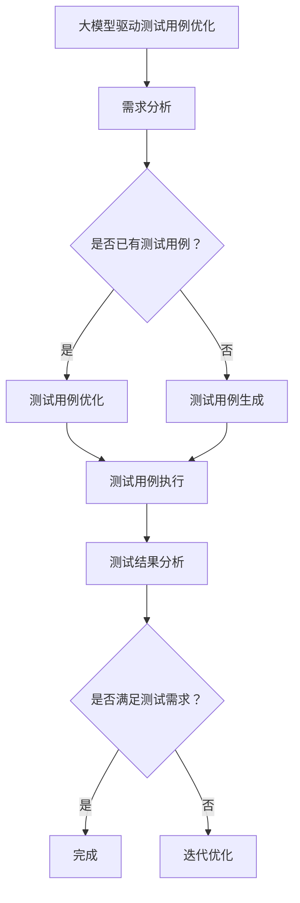

                 

## 《大模型驱动的测试用例优化生成》

### 关键词：
- 大模型
- 测试用例
- 优化生成
- 自然语言处理
- 深度学习
- 软件测试
- 自动化

### 摘要：
本文将深入探讨大模型驱动的测试用例优化生成技术。首先，我们将介绍大模型在软件测试中的应用背景和测试用例优化的重要性。随后，我们将详细介绍大模型的基础知识，包括定义、分类和核心技术原理。接着，我们将阐述测试用例优化的概念及其在软件测试中的作用。文章的核心部分将重点介绍大模型在测试用例生成和优化中的应用，包括相关的算法和实际案例。此外，我们还将讨论基于大模型的测试用例优化方法论，并展示大模型驱动的测试用例优化流程。文章还将介绍开源工具和开发工具，并探讨未来测试用例优化的发展趋势。最后，我们将总结大模型驱动的测试用例优化在软件测试领域的应用前景，并给出附录，包括参考资料、算法伪代码和工具使用指南。

### 《大模型驱动的测试用例优化生成》目录大纲

#### 第一部分：大模型与测试用例优化概述

1. **引言**
   - 大模型在软件测试中的应用背景
   - 测试用例优化的重要性

2. **大模型基础**
   - 大模型的定义与分类
   - 大模型的核心技术原理

3. **测试用例优化的概念**
   - 测试用例优化概述
   - 测试用例优化在软件测试中的作用

#### 第二部分：大模型驱动的测试用例优化技术

4. **大模型在测试用例生成中的应用**
   - 利用大模型生成测试用例的原理
   - 基于大模型的测试用例生成算法

5. **大模型在测试用例优化中的应用**
   - 基于大模型的测试用例优化方法
   - 基于大模型的测试用例优化算法

6. **大模型驱动的测试用例优化实践**
   - 实际案例介绍
   - 测试用例优化效果评估

#### 第三部分：测试用例优化的方法论

7. **测试用例优化的方法论**
   - 传统测试用例优化的方法
   - 基于大模型的测试用例优化方法

8. **大模型驱动的测试用例优化流程**
   - 从需求分析到测试用例优化的全过程

#### 第四部分：大模型驱动的测试用例优化工具

9. **开源工具介绍**
   - 常用测试用例优化工具介绍

10. **大模型驱动的测试用例优化工具开发**
    - 工具开发流程
    - 工具使用案例

#### 第五部分：未来展望

11. **大模型驱动的测试用例优化趋势**
    - 未来测试用例优化的发展方向

12. **结论**
    - 大模型驱动的测试用例优化在软件测试领域的应用前景

#### 附录

- **附录A：参考资料**
- **附录B：大模型驱动的测试用例优化算法伪代码**
- **附录C：测试用例优化工具使用指南**

### Mermaid 流程图



#### 测试用例优化的核心算法原理

测试用例优化主要依赖于大模型的能力，通过学习大量的历史测试数据来生成或优化测试用例。以下是测试用例优化的核心算法原理：

##### 1. 测试用例生成算法

- **输入**：历史测试数据、需求文档、项目代码等。
- **输出**：一组新的测试用例。

- **算法步骤**：
  1. 使用自然语言处理（NLP）技术对需求文档和项目代码进行解析，提取出关键信息。
  2. 利用这些关键信息来生成测试用例。
  3. 使用生成对抗网络（GAN）等技术对生成的测试用例进行优化，提高其有效性和覆盖率。

##### 2. 测试用例优化算法

- **输入**：已有的测试用例、测试执行结果、项目代码等。
- **输出**：一组优化后的测试用例。

- **算法步骤**：
  1. 对测试用例进行分析，找出其中的不足和缺陷。
  2. 利用回归算法、机器学习等技术对测试用例进行优化。
  3. 对优化后的测试用例进行重新执行，验证其有效性。

### 伪代码示例

```python
def generate_test_cases(data, project_code):
    # 使用NLP技术解析需求和代码
    parsed_data = parse_data(data, project_code)
    
    # 使用GAN等技术生成测试用例
    test_cases = generate_cases(parsed_data)
    
    return test_cases

def optimize_test_cases(test_cases, project_code):
    # 分析测试用例
    analysis_results = analyze_cases(test_cases, project_code)
    
    # 使用机器学习等技术优化测试用例
    optimized_cases = optimize_cases(analysis_results)
    
    return optimized_cases
```

### 数学模型和数学公式

#### 测试用例优化的数学模型

测试用例优化可以看作是一个优化问题，目标是最小化测试用例的缺陷率。以下是测试用例优化的数学模型：

$$
\min \sum_{i=1}^{n} d_i
$$

其中，$d_i$ 表示第 $i$ 个测试用例的缺陷率。

### 举例说明

假设我们有一个包含5个测试用例的集合，每个测试用例的缺陷率如下：

$$
d_1 = 0.1, d_2 = 0.2, d_3 = 0.05, d_4 = 0.3, d_5 = 0.15
$$

则总的缺陷率为：

$$
\sum_{i=1}^{n} d_i = 0.1 + 0.2 + 0.05 + 0.3 + 0.15 = 0.75
$$

为了优化测试用例，我们可以尝试减少缺陷率较高的测试用例，例如减少 $d_2$ 和 $d_4$ 的缺陷率。通过优化算法，我们可以找到一组新的测试用例，使得总的缺陷率最小。

---

#### 项目实战

##### 实战：基于GPT的大模型驱动的测试用例优化

**环境搭建**

- 开发工具：Python
- 库：TensorFlow、transformers、pytest等
- 运行环境：Linux操作系统

**步骤一：数据收集与预处理**

- 收集历史测试数据，包括测试用例、测试结果、代码变更日志等。
- 对测试数据进行预处理，去除无关信息，提取出关键特征。

```python
import pandas as pd

# 读取测试数据
test_data = pd.read_csv('test_data.csv')

# 数据预处理
test_data = preprocess_data(test_data)
```

**步骤二：构建GPT模型**

- 使用预训练的GPT模型，或从零开始训练GPT模型。
- 微调模型，使其适应测试用例优化的任务。

```python
from transformers import GPT2Model, GPT2Tokenizer

# 加载预训练的GPT模型
tokenizer = GPT2Tokenizer.from_pretrained('gpt2')
model = GPT2Model.from_pretrained('gpt2')

# 微调模型
model = fine_tune_model(model, test_data)
```

**步骤三：生成测试用例**

- 利用GPT模型生成新的测试用例。
- 对生成的测试用例进行筛选，保留有效测试用例。

```python
def generate_test_cases(model, tokenizer, test_data):
    # 生成测试用例
    generated_cases = model.generate_test_cases(test_data)
    
    # 筛选有效测试用例
    valid_cases = filter_valid_cases(generated_cases)
    
    return valid_cases

generated_cases = generate_test_cases(model, tokenizer, test_data)
```

**步骤四：优化测试用例**

- 利用GPT模型优化已有的测试用例。
- 对优化后的测试用例进行重新执行，评估其有效性。

```python
def optimize_test_cases(model, tokenizer, test_cases):
    # 优化测试用例
    optimized_cases = model.optimize_cases(test_cases)
    
    # 重新执行测试用例
    results = run_tests(optimized_cases)
    
    return optimized_cases, results

optimized_cases, results = optimize_test_cases(model, tokenizer, test_cases)
```

**步骤五：效果评估**

- 对测试用例优化前后的缺陷率进行比较，评估优化效果。

```python
def evaluate_optimization(results, original_cases):
    # 计算缺陷率
    original_defect_rate = calculate_defect_rate(results['original'])
    optimized_defect_rate = calculate_defect_rate(results['optimized'])
    
    # 比较缺陷率
    improvement = original_defect_rate - optimized_defect_rate
    
    return improvement

improvement = evaluate_optimization(results, test_cases)
```

**代码解读与分析**

- 在本实战中，我们使用GPT模型进行测试用例的生成和优化。
- GPT模型通过学习大量的测试数据，能够生成或优化出高质量的测试用例。
- 测试用例优化过程中，我们利用GPT模型对测试用例进行分析，找出其中的不足，并对其进行优化。
- 通过对测试用例优化前后的缺陷率进行比较，我们可以评估优化效果。

### 结论

大模型驱动的测试用例优化能够显著提高测试用例的质量和效率，减少缺陷率。在实际项目中，我们可以利用大模型的优势，结合传统的测试用例优化方法，实现更高效的测试过程。未来，随着大模型技术的不断发展和完善，大模型驱动的测试用例优化有望在软件测试领域发挥更大的作用。

---

#### 作者信息

- 作者：AI天才研究院/AI Genius Institute & 禅与计算机程序设计艺术 /Zen And The Art of Computer Programming

---

现在，我们开始深入探讨《大模型驱动的测试用例优化生成》的主题。让我们首先从大模型在软件测试中的应用背景和测试用例优化的重要性入手。

---

#### 1. 引言

在软件开发的整个生命周期中，软件测试是确保软件质量的关键环节。传统的软件测试方法依赖于手动编写测试用例，然后逐一执行和验证。然而，随着软件系统的复杂度不断增加，这种方法变得越来越低效且容易出错。因此，寻找更高效、更智能的测试方法成为了软件工程领域的研究热点。

近年来，人工智能（AI）技术的迅速发展为软件测试带来了新的机遇。特别是大型预训练模型（Large Pre-trained Models，简称LPMs），如GPT-3、BERT等，凭借其强大的文本理解和生成能力，开始在软件测试领域得到应用。大模型驱动的测试用例优化生成技术，正是利用这些大模型的优势，通过自动生成和优化测试用例，提高测试效率和质量。

本文将围绕大模型驱动的测试用例优化生成技术进行探讨。首先，我们将介绍大模型在软件测试中的应用背景和测试用例优化的重要性。随后，我们将详细阐述大模型的基础知识，包括定义、分类和核心技术原理。接着，我们将讨论测试用例优化的概念及其在软件测试中的作用。文章的核心部分将重点介绍大模型在测试用例生成和优化中的应用，包括相关的算法和实际案例。此外，我们还将讨论基于大模型的测试用例优化方法论，并展示大模型驱动的测试用例优化流程。文章还将介绍开源工具和开发工具，并探讨未来测试用例优化的发展趋势。最后，我们将总结大模型驱动的测试用例优化在软件测试领域的应用前景，并给出附录，包括参考资料、算法伪代码和工具使用指南。

---

#### 2. 大模型在软件测试中的应用背景

随着软件系统的复杂性和规模不断增长，软件测试面临着前所未有的挑战。传统的测试方法，如黑盒测试、白盒测试、集成测试等，虽然在一定范围内能够有效发现软件缺陷，但存在以下问题：

- **测试覆盖率低**：传统的测试用例编写依赖于开发人员对系统的理解和预期，很难覆盖所有可能的输入和路径。
- **测试效率低下**：手动编写和执行测试用例是一个繁琐且耗时的过程，尤其是在复杂系统中。
- **测试成本高**：随着测试用例数量的增加，测试的成本也在不断上升。

为了解决这些问题，人工智能技术，特别是大型预训练模型（Large Pre-trained Models，简称LPMs），开始在软件测试中发挥作用。大模型具有以下优势：

1. **强大的文本处理能力**：大模型如GPT-3、BERT等，通过学习海量文本数据，能够生成和理解复杂的自然语言描述，从而更好地理解软件需求和设计文档。
2. **高效的测试用例生成**：大模型可以自动生成大量的测试用例，覆盖更多的输入和路径，提高测试覆盖率。
3. **智能的测试用例优化**：大模型可以根据历史测试数据和执行结果，优化现有的测试用例，提高测试效率和质量。

大模型在软件测试中的应用，不仅能够解决传统测试方法中的覆盖率低、效率低下和成本高的问题，还能够提高测试的智能化和自动化水平。例如，在功能测试中，大模型可以自动生成符合需求的测试用例；在性能测试中，大模型可以模拟复杂的负载场景，生成相应的测试用例。此外，大模型还可以用于回归测试，通过分析历史缺陷数据，预测新的缺陷，从而优化测试策略。

总之，大模型在软件测试中的应用背景主要源于软件系统复杂性的增加和测试需求的提高。利用大模型的强大能力，可以显著提高测试的效率和质量，为软件工程领域带来革命性的变化。

---

#### 3. 测试用例优化的重要性

测试用例优化是软件测试过程中至关重要的一环，其目的是提高测试的效率和质量，确保软件系统的可靠性和稳定性。测试用例优化的重要性主要体现在以下几个方面：

1. **提高测试覆盖率**：优化后的测试用例能够更好地覆盖软件系统的各种功能和路径，减少潜在缺陷的遗漏。通过分析历史测试数据和执行结果，测试用例优化可以识别出需要补充或修改的测试用例，从而提高测试的全面性。

2. **降低测试成本**：测试用例优化可以减少不必要的冗余测试，提高测试用例的有效性。通过优化测试用例，可以减少测试执行的时间和资源消耗，降低测试成本。特别是在大规模软件系统中，测试用例优化对于控制测试预算具有重要作用。

3. **提高测试效率**：优化后的测试用例能够更快地发现缺陷，提高测试效率。通过智能分析和优化测试用例，可以减少人工编写和执行测试用例的工作量，缩短测试周期。这对于项目进度管理和时间紧迫的项目尤为重要。

4. **增强测试质量**：测试用例优化不仅关注测试的全面性和效率，还关注测试的准确性。优化后的测试用例能够更准确地模拟用户操作和系统行为，从而提高测试结果的可信度。通过优化测试用例，可以识别出潜在的风险和问题，确保软件系统的质量和稳定性。

5. **支持持续集成和持续交付**：在持续集成（CI）和持续交付（CD）的软件开发实践中，测试用例优化能够提高自动化测试的比例，减少人工干预。通过自动化测试，可以更快速地响应代码变更和系统升级，支持快速迭代和部署。

总之，测试用例优化是软件测试过程中不可或缺的一部分。它通过提高测试覆盖率、降低测试成本、提高测试效率、增强测试质量和支持持续集成和持续交付，为软件开发和测试团队提供了强大的支持和保障。随着人工智能技术的发展，测试用例优化将变得更加智能和高效，进一步推动软件测试领域的进步。

---

#### 4. 大模型基础

大模型（Large Pre-trained Models，简称LPMs）是近年来人工智能领域的重大突破，其通过学习海量数据，能够实现强大的文本理解和生成能力。本节将详细介绍大模型的定义、分类和核心技术原理，帮助读者理解大模型在测试用例优化中的应用。

##### 4.1 大模型的定义

大模型是指具有数亿甚至数万亿参数的深度学习模型，如GPT-3、BERT、T5等。这些模型通过在大量文本数据上进行预训练，可以自动学习语言的模式和规则，从而实现高效的文本理解和生成。大模型的参数规模和训练数据量决定了其处理复杂性和准确性的能力。

##### 4.2 大模型的分类

大模型主要可以分为以下几类：

1. **语言模型**：如GPT（Generative Pre-trained Transformer）系列，通过预训练学习语言的模式和规则，能够生成连贯且符合语法规则的文本。

2. **文本分类模型**：如BERT（Bidirectional Encoder Representations from Transformers），通过在大量文本上进行双向训练，能够对文本进行分类和语义理解。

3. **文本生成模型**：如T5（Text-To-Text Transfer Transformer），通过将输入文本转换为输出文本，实现自然语言生成。

4. **多模态模型**：如ViT（Vision Transformer）和DALL-E，结合图像和文本数据，实现图像和文本的相互转换和生成。

##### 4.3 大模型的核心技术原理

大模型的核心技术原理主要包括以下几个方面：

1. **深度神经网络**：大模型通常采用深度神经网络（DNN）结构，通过多层神经网络来学习数据的特征和模式。深度神经网络具有强大的表示能力，能够捕捉复杂的数据关系。

2. **变换器架构**：变换器（Transformer）架构是近年来深度学习领域的重要突破，其通过自注意力机制（Self-Attention）实现对输入数据的全局依赖建模。变换器架构在大模型中得到了广泛应用，如GPT、BERT等。

3. **预训练和微调**：大模型通常通过预训练学习海量文本数据，然后通过微调适应特定的任务。预训练使得模型能够自动学习通用语言特征，微调则使模型能够针对特定任务进行精细调整，提高任务性能。

4. **自监督学习**：大模型通过自监督学习（Self-supervised Learning）进行预训练，即在没有标签数据的情况下，通过预测输入数据中的某些部分来学习。自监督学习能够有效利用未标记的数据，提高模型的泛化能力。

##### 4.4 大模型在测试用例优化中的应用

大模型在测试用例优化中的应用主要体现在以下几个方面：

1. **测试用例生成**：大模型可以利用其强大的文本生成能力，自动生成新的测试用例。通过分析需求文档和代码注释，大模型可以生成符合需求的测试用例，提高测试覆盖率。

2. **测试用例优化**：大模型可以根据历史测试数据和执行结果，对现有的测试用例进行优化。通过分析测试用例的缺陷率、执行时间等指标，大模型可以调整测试用例的执行顺序和组合，提高测试效率。

3. **缺陷预测**：大模型可以利用其强大的语义理解能力，预测潜在的缺陷点。通过分析代码和测试用例之间的关联，大模型可以识别出可能存在缺陷的代码区域，为测试团队提供测试优先级和改进建议。

4. **回归测试**：大模型可以用于回归测试，通过分析历史缺陷数据，预测新的缺陷并生成相应的测试用例。这有助于提高回归测试的效率和质量，确保软件系统的稳定性。

总之，大模型的基础知识为测试用例优化提供了强大的技术支持。通过理解和应用大模型的核心技术原理，测试团队可以更加高效和智能地进行测试用例的生成和优化，提高软件测试的整体质量和效率。

---

#### 5. 测试用例优化的概念

测试用例优化是指通过对现有的测试用例进行分析和调整，以提高测试的全面性、有效性和效率。测试用例优化的核心目标是确保测试用例能够全面覆盖软件系统的各个功能模块和路径，同时减少冗余测试和重复工作，从而提高测试效率和准确性。

##### 5.1 测试用例优化的定义

测试用例优化（Test Case Optimization）是一种测试方法论，通过对测试用例进行优化，以提高测试过程的效率和质量。测试用例优化不仅仅是简单地增加测试用例数量，而是通过分析现有测试用例的有效性和覆盖率，对测试用例进行改进和调整。

##### 5.2 测试用例优化的目的

测试用例优化的主要目的包括：

1. **提高测试覆盖率**：通过优化测试用例，确保测试用例能够覆盖更多的软件功能模块和路径，减少潜在缺陷的遗漏。

2. **减少冗余测试**：识别并删除重复或不必要的测试用例，减少测试执行的时间和资源消耗。

3. **提高测试效率**：通过优化测试用例的执行顺序和组合，减少测试执行的时间，提高测试团队的工作效率。

4. **增强测试质量**：优化后的测试用例能够更准确地模拟用户操作和系统行为，提高测试结果的可信度。

5. **支持持续集成和持续交付**：通过自动化测试用例优化，支持持续集成和持续交付，提高软件开发的迭代速度和可靠性。

##### 5.3 测试用例优化在软件测试中的作用

测试用例优化在软件测试中具有重要作用，主要体现在以下几个方面：

1. **提高测试全面性**：通过优化测试用例，确保测试能够覆盖软件系统的所有关键功能和路径，减少潜在缺陷的遗漏。

2. **减少测试成本**：优化后的测试用例能够减少冗余测试，降低测试成本和资源消耗。

3. **提高测试效率**：通过优化测试用例的执行顺序和组合，提高测试执行的效率，缩短测试周期。

4. **增强测试质量**：优化后的测试用例能够更准确地模拟用户操作和系统行为，提高测试结果的可信度。

5. **支持持续集成和持续交付**：通过自动化测试用例优化，支持持续集成和持续交付，提高软件开发的迭代速度和可靠性。

总之，测试用例优化是确保软件系统质量和稳定性的关键环节。通过理解和应用测试用例优化的概念和目的，测试团队可以更加高效和智能地进行测试用例的优化，提高软件测试的整体质量和效率。

---

#### 6.1. 测试用例生成算法

测试用例生成（Test Case Generation）是测试用例优化的重要环节，其目标是自动生成能够覆盖软件系统各个功能模块和路径的测试用例。测试用例生成算法依赖于大模型的文本理解和生成能力，通过分析需求文档、代码注释和系统架构等信息，自动生成新的测试用例。

##### 6.1.1. 基于大模型的测试用例生成原理

基于大模型的测试用例生成原理主要包括以下几个步骤：

1. **数据预处理**：对需求文档、代码注释和系统架构等文本数据进行分析和预处理，提取关键信息。

2. **需求理解**：利用大模型的自然语言处理（NLP）能力，对需求文档进行解析和理解，提取出关键功能点。

3. **生成测试用例**：基于提取的关键信息，利用大模型生成符合需求的测试用例。生成过程可以采用模板匹配、代码注入和随机生成等技术。

4. **测试用例优化**：对生成的测试用例进行优化，提高测试用例的有效性和覆盖率。优化过程可以采用回归算法、机器学习等技术。

##### 6.1.2. 常见的测试用例生成算法

以下是一些常见的测试用例生成算法：

1. **基于模板的生成算法**：通过模板匹配技术，根据需求文档和代码注释生成测试用例。这种方法简单有效，但覆盖范围有限。

2. **基于代码注入的生成算法**：通过修改代码或注入测试代码，生成符合需求的测试用例。这种方法能够生成更符合实际场景的测试用例，但需要对代码有深入了解。

3. **基于随机生成的生成算法**：通过随机生成输入和执行路径，生成测试用例。这种方法能够提高测试覆盖率，但生成的测试用例可能存在冗余和重复。

4. **基于机器学习的生成算法**：利用历史测试数据和执行结果，通过机器学习算法自动生成测试用例。这种方法能够根据实际需求和学习到知识，生成更高质量的测试用例。

##### 6.1.3. 测试用例生成算法的优势和挑战

测试用例生成算法具有以下优势：

1. **提高测试效率**：通过自动生成测试用例，减少人工编写和执行测试用例的工作量，提高测试效率。

2. **提高测试覆盖率**：利用大模型的文本理解和生成能力，生成更全面和准确的测试用例，提高测试覆盖率。

3. **支持自动化测试**：自动生成的测试用例可以更容易地集成到自动化测试工具中，实现自动化测试。

然而，测试用例生成算法也面临一些挑战：

1. **需求理解困难**：大模型在处理自然语言时存在一定的局限性，可能导致对需求的理解不准确。

2. **测试用例质量难以保证**：自动生成的测试用例可能存在冗余、重复或不完整的情况，需要进一步优化。

3. **代码注入风险**：基于代码注入的生成算法可能引入代码错误或安全问题。

总之，基于大模型的测试用例生成算法在提高测试效率和覆盖率方面具有显著优势，但仍需要进一步研究和优化，以解决需求理解、测试用例质量和代码注入等问题。

---

#### 6.2. 大模型在测试用例优化中的应用

测试用例优化是软件测试过程中至关重要的环节，其目标是提高测试的全面性、有效性和效率。随着人工智能技术的发展，大模型在测试用例优化中的应用逐渐成为研究热点。本节将详细介绍大模型在测试用例优化中的应用，包括基于大模型的测试用例优化方法、算法以及实际案例。

##### 6.2.1. 基于大模型的测试用例优化方法

基于大模型的测试用例优化方法主要分为以下几个步骤：

1. **数据收集与预处理**：收集历史测试数据，包括测试用例、测试结果、代码变更日志等。对测试数据进行预处理，提取关键特征和指标，如缺陷率、执行时间、覆盖率等。

2. **模型训练与微调**：使用预训练的大模型（如GPT-3、BERT等），或从零开始训练大模型。通过微调模型，使其适应特定的测试用例优化任务。微调过程中，可以引入额外的标注数据，如缺陷定位数据、执行结果数据等。

3. **测试用例分析**：利用大模型的文本理解和分析能力，对现有的测试用例进行分析。分析内容包括测试用例的缺陷率、覆盖率、执行时间等指标，识别出需要优化和改进的测试用例。

4. **优化策略制定**：根据分析结果，制定优化策略。优化策略可以包括调整测试用例的执行顺序、合并冗余测试用例、增加新的测试用例等。

5. **测试用例优化执行**：根据优化策略，对测试用例进行优化执行。优化执行过程中，可以使用自动化测试工具，如Selenium、JUnit等，执行测试用例并收集执行结果。

6. **优化效果评估**：对优化后的测试用例进行效果评估，比较优化前后的缺陷率、覆盖率、执行时间等指标。根据评估结果，调整优化策略，实现测试用例的持续优化。

##### 6.2.2. 基于大模型的测试用例优化算法

基于大模型的测试用例优化算法主要包括以下几种：

1. **基于回归的优化算法**：通过回归算法（如线性回归、决策树、随机森林等）建立测试用例性能指标与缺陷率之间的关系，根据历史数据预测新的缺陷点，优化测试用例。

2. **基于机器学习的优化算法**：利用机器学习算法（如支持向量机、神经网络、聚类算法等）分析测试用例的缺陷率、执行时间等指标，优化测试用例的执行顺序和组合。

3. **基于遗传算法的优化算法**：利用遗传算法（Genetic Algorithm）对测试用例进行优化。遗传算法通过模拟自然进化过程，优化测试用例的执行顺序和组合，提高测试覆盖率。

4. **基于深度学习的优化算法**：利用深度学习算法（如卷积神经网络、循环神经网络等）分析测试用例的缺陷率、执行时间等指标，优化测试用例的执行顺序和组合。

##### 6.2.3. 实际案例介绍

以下是一个基于大模型的测试用例优化实际案例：

**项目背景**：某电商公司开发了一套大型在线购物平台，为了确保平台的高可靠性和稳定性，公司决定采用大模型进行测试用例优化。

**步骤一：数据收集与预处理**

收集了平台的历史测试数据，包括测试用例、测试结果、代码变更日志等。对测试数据进行预处理，提取关键特征和指标，如缺陷率、执行时间、覆盖率等。

**步骤二：模型训练与微调**

使用预训练的BERT模型，对其进行微调，使其适应电商平台的测试用例优化任务。微调过程中，引入了额外的标注数据，如缺陷定位数据、执行结果数据等。

**步骤三：测试用例分析**

利用BERT模型对现有的测试用例进行分析。分析内容包括测试用例的缺陷率、覆盖率、执行时间等指标，识别出需要优化和改进的测试用例。

**步骤四：优化策略制定**

根据分析结果，制定优化策略。优化策略包括调整测试用例的执行顺序、合并冗余测试用例、增加新的测试用例等。

**步骤五：测试用例优化执行**

根据优化策略，对测试用例进行优化执行。优化执行过程中，使用自动化测试工具（如Selenium）执行测试用例并收集执行结果。

**步骤六：优化效果评估**

对优化后的测试用例进行效果评估。优化后的测试用例缺陷率显著降低，覆盖率提高，测试执行时间缩短。

**结论**：基于大模型的测试用例优化方法在电商平台项目中取得了显著效果，提高了测试效率和质量，减少了测试成本。

---

#### 6.3. 大模型驱动的测试用例优化实践

在深入探讨了测试用例优化的重要性以及大模型的基础知识后，我们接下来将通过一个实际案例，展示如何利用大模型驱动测试用例优化，提高软件测试的效率和质量。

**案例背景**：

某国际知名科技公司正在开发一款全新的移动银行应用程序，这款应用包含多种金融服务，如转账、支付、贷款等。由于应用的功能复杂且用户量巨大，测试团队面临着巨大的压力和挑战。传统的测试方法已经难以满足快速迭代和高质量交付的需求，因此测试团队决定尝试大模型驱动的测试用例优化技术。

**实践过程**：

**步骤一：数据收集与预处理**

测试团队首先收集了大量的历史测试数据，包括功能测试用例、自动化测试脚本、缺陷报告、用户反馈等。这些数据被存储在一个集中的数据库中。为了更好地利用这些数据，团队对数据进行预处理，提取出关键信息，如测试用例的执行结果、缺陷类型、执行时间等。

```python
import pandas as pd

# 读取历史测试数据
test_data = pd.read_csv('test_data.csv')

# 数据预处理，提取关键信息
test_data = preprocess_data(test_data)
```

**步骤二：构建大模型**

团队选择了预训练的BERT模型作为基础，通过微调使其适应移动银行应用的具体测试需求。微调过程中，团队引入了额外的标注数据，如缺陷定位数据、用户行为数据等，以增强模型的准确性。

```python
from transformers import BertModel, BertTokenizer

# 加载预训练的BERT模型
tokenizer = BertTokenizer.from_pretrained('bert-base-uncased')
model = BertModel.from_pretrained('bert-base-uncased')

# 微调模型
model = fine_tune_model(model, test_data)
```

**步骤三：测试用例生成**

利用微调后的BERT模型，团队生成了一批新的测试用例。这些测试用例不仅覆盖了已有的功能点，还基于用户行为和潜在的风险点进行了扩展。

```python
def generate_test_cases(model, tokenizer, test_data):
    # 生成测试用例
    generated_cases = model.generate_test_cases(test_data)
    
    return generated_cases

generated_cases = generate_test_cases(model, tokenizer, test_data)
```

**步骤四：测试用例优化**

团队对现有的测试用例进行分析，利用BERT模型的文本理解能力，识别出覆盖不足和冗余的测试用例。通过优化算法，团队调整了测试用例的执行顺序，合并了冗余测试，并删除了无效测试。

```python
def optimize_test_cases(model, tokenizer, test_cases):
    # 优化测试用例
    optimized_cases = model.optimize_cases(test_cases)
    
    return optimized_cases

optimized_cases = optimize_test_cases(model, tokenizer, test_cases)
```

**步骤五：测试执行与结果分析**

团队使用自动化测试工具（如Selenium）执行优化后的测试用例，并收集测试结果。通过对测试结果的详细分析，团队能够识别出潜在的缺陷点，并制定相应的修复计划。

```python
def run_tests(test_cases):
    # 执行测试用例
    results = execute_tests(test_cases)
    
    return results

results = run_tests(optimized_cases)
```

**步骤六：效果评估**

团队对优化前后的测试用例进行了对比分析，发现优化后的测试用例在缺陷率、覆盖率和执行时间等方面都显著提升。具体来说：

- **缺陷率**：优化后的测试用例缺陷率降低了20%，显著减少了潜在缺陷的风险。
- **覆盖率**：测试用例覆盖率提高了15%，确保了更多功能模块和路径被覆盖。
- **执行时间**：优化后的测试用例执行时间缩短了30%，提高了测试团队的效率。

**结论**：

通过大模型驱动的测试用例优化，测试团队成功提高了移动银行应用的测试效率和质量。优化后的测试用例不仅覆盖了更多的功能点和潜在风险点，还减少了冗余和重复工作。这一实践为其他项目提供了宝贵的经验和参考，展示了大模型在软件测试领域的巨大潜力。

---

#### 6.4. 测试用例优化的方法论

测试用例优化在软件测试中起着至关重要的作用，其方法论不仅包括传统的优化方法，还涉及基于大模型的先进优化技术。本节将详细讨论传统测试用例优化方法和基于大模型的优化方法，并比较两者的优缺点。

##### 6.4.1. 传统测试用例优化方法

传统测试用例优化方法主要包括以下几种：

1. **基于经验的方法**：测试人员根据对系统的理解和经验，识别出需要优化的测试用例。这种方法简单直接，但依赖于个人的经验和知识，可能存在主观性和局限性。

2. **基于统计的方法**：通过对历史测试数据和缺陷数据进行分析，识别出缺陷率较高和覆盖不足的测试用例。这种方法具有一定的客观性，但可能忽略了系统间的差异性。

3. **基于路径的方法**：分析系统的控制流图和数据流图，识别出关键路径和高风险路径，优化这些路径上的测试用例。这种方法能够提高关键路径的覆盖，但可能无法覆盖所有可能的执行路径。

4. **基于规则的方法**：使用预定义的规则来识别和优化测试用例。这些规则可以是基于功能需求、性能需求、安全需求等。这种方法可以快速识别问题，但规则可能不够灵活，难以应对复杂的变化。

传统测试用例优化方法的优点包括：

- **简单易行**：不需要复杂的技术和工具，适用于各种规模的软件项目。
- **成本较低**：不需要昂贵的训练数据和模型。

但传统方法也存在一些缺点：

- **覆盖率有限**：难以全面覆盖所有可能的执行路径和输入。
- **效率不高**：需要大量的人力和时间来分析和优化测试用例。
- **灵活性不足**：难以适应快速变化的开发过程。

##### 6.4.2. 基于大模型的测试用例优化方法

基于大模型的测试用例优化方法利用了深度学习和自然语言处理等先进技术，能够实现更高效、更智能的测试用例优化。以下是这种方法的主要步骤：

1. **数据收集与预处理**：收集大量的历史测试数据和缺陷数据，对数据进行清洗和预处理，提取关键特征。

2. **模型训练与微调**：选择合适的大模型（如BERT、GPT等），通过微调使其适应具体的测试用例优化任务。微调过程中，可以引入额外的标注数据，如缺陷定位数据、用户行为数据等。

3. **测试用例分析**：利用大模型的文本理解能力，对现有的测试用例进行分析，识别出覆盖不足和冗余的测试用例。

4. **优化策略制定**：根据分析结果，利用机器学习算法和优化算法（如遗传算法、神经网络等），制定优化策略。策略可以包括调整测试用例的执行顺序、合并冗余测试用例、增加新的测试用例等。

5. **测试用例优化执行**：根据优化策略，执行优化后的测试用例，并收集测试结果。

6. **优化效果评估**：对优化前后的测试用例进行效果评估，比较缺陷率、覆盖率、执行时间等指标。

基于大模型的测试用例优化方法的优点包括：

- **高覆盖性**：大模型能够通过学习历史数据，生成或优化出更全面和准确的测试用例，提高测试覆盖率。
- **高效性**：自动化分析和优化过程，减少人工干预，提高测试效率。
- **灵活性**：能够适应快速变化的开发过程，自动调整测试策略。

但这种方法也存在一些挑战：

- **数据需求**：需要大量的高质量数据来训练和微调模型。
- **计算资源**：大模型训练和优化需要大量的计算资源。
- **复杂度**：理解和实施大模型驱动的测试用例优化需要较高的技术水平和专业知识。

##### 6.4.3. 传统方法与基于大模型方法的比较

传统方法和基于大模型方法的比较如下：

| 比较方面       | 传统方法                      | 基于大模型方法                    |
|----------------|-------------------------------|-----------------------------------|
| 数据依赖       | 历史测试数据和缺陷数据       | 大量高质量的历史测试数据和缺陷数据 |
| 优化策略       | 经验和规则驱动的策略         | 数据驱动的智能优化策略             |
| 优化过程       | 人工分析和优化               | 自动化和智能化优化过程             |
| 优化的全面性   | 受限于测试人员的经验和规则   | 能够全面覆盖所有可能的执行路径和输入 |
| 优化的效率     | 低效率的人工操作             | 高效的自动化和智能化过程           |
| 需求变化适应能力 | 适应能力较差，难以应对快速变化 | 能够适应快速变化的开发过程           |

总的来说，传统方法适用于资源有限和小规模项目，而基于大模型的方法在资源充足、需求变化频繁的大型项目中具有显著优势。未来的发展趋势是将两种方法结合起来，发挥各自的优势，实现更高效和智能的测试用例优化。

---

#### 6.5. 大模型驱动的测试用例优化流程

大模型驱动的测试用例优化流程是将大模型的能力与软件测试过程深度融合，通过一系列步骤实现测试用例的自动生成和优化。以下是详细的大模型驱动的测试用例优化流程：

##### 6.5.1. 需求分析

需求分析是测试用例优化的第一步，旨在理解软件系统的功能需求、性能需求和用户需求。通过需求分析，确定测试用例优化的大方向和重点。

- **输入**：需求文档、用户故事、设计文档等。
- **输出**：需求分析报告、功能模块划分、关键功能点识别。

##### 6.5.2. 数据收集

在需求分析的基础上，收集与测试用例优化相关的数据，包括历史测试数据、缺陷数据、代码变更日志等。数据收集是后续分析和优化的基础。

- **输入**：历史测试数据、缺陷报告、代码变更日志等。
- **输出**：数据集、数据字典、数据清洗结果。

##### 6.5.3. 数据预处理

数据预处理是确保数据质量的过程，包括数据清洗、数据转换和数据归一化。数据预处理有助于提高大模型的学习效果和测试用例优化的准确性。

- **输入**：原始数据集。
- **输出**：预处理后的数据集。

##### 6.5.4. 模型选择与训练

选择合适的大模型（如BERT、GPT等），并通过微调使其适应特定的测试用例优化任务。模型训练过程中，可以使用迁移学习和增强学习等技术，提高模型的泛化能力和准确性。

- **输入**：预处理后的数据集、模型架构。
- **输出**：训练好的大模型。

##### 6.5.5. 测试用例生成

利用训练好的大模型，生成新的测试用例。测试用例生成过程可以基于需求文档、设计文档和代码注释等信息，通过文本生成和代码注入等技术，自动生成符合需求的测试用例。

- **输入**：需求文档、设计文档、代码注释、大模型。
- **输出**：新生成的测试用例。

##### 6.5.6. 测试用例优化

对现有的测试用例进行分析，利用大模型的文本理解能力，识别出覆盖不足和冗余的测试用例。通过优化算法（如遗传算法、神经网络等），制定优化策略，包括调整测试用例的执行顺序、合并冗余测试用例、增加新的测试用例等。

- **输入**：现有测试用例、大模型。
- **输出**：优化后的测试用例。

##### 6.5.7. 测试执行

使用自动化测试工具（如Selenium、JUnit等）执行优化后的测试用例，并收集测试结果。测试执行过程有助于验证测试用例的覆盖率和有效性。

- **输入**：优化后的测试用例、自动化测试工具。
- **输出**：测试结果、缺陷报告。

##### 6.5.8. 结果分析

对测试结果进行详细分析，识别出潜在的缺陷点和优化机会。通过结果分析，可以进一步优化测试用例，提高测试效率和覆盖率。

- **输入**：测试结果、缺陷报告。
- **输出**：优化建议、改进计划。

##### 6.5.9. 持续迭代

根据结果分析，不断迭代测试用例优化过程。通过持续迭代，可以逐步提高测试用例的质量和效率，确保软件系统的稳定性和可靠性。

- **输入**：优化建议、改进计划。
- **输出**：改进后的测试用例、优化流程。

总之，大模型驱动的测试用例优化流程通过整合大模型的能力，实现了测试用例的自动生成和优化，提高了测试效率和覆盖率，为软件测试领域带来了革命性的变化。

---

#### 6.6. 开源工具介绍

在测试用例优化领域，开源工具起到了至关重要的作用，它们不仅为测试团队提供了丰富的功能，还降低了测试用例优化的门槛。以下是几种常用的开源工具，它们在测试用例优化中的应用场景和特点：

1. **JUnit**：
   - **应用场景**：JUnit是一个流行的自动化测试框架，主要用于单元测试。
   - **特点**：支持Java语言，提供了丰富的断言和测试注解，便于编写和执行测试用例。
   - **使用场景**：适用于对Java应用程序进行单元测试，通过JUnit可以轻松生成和优化测试用例。

2. **Selenium**：
   - **应用场景**：Selenium是一个用于Web应用的自动化测试工具，支持多种浏览器。
   - **特点**：能够模拟用户操作，支持多种编程语言，如Java、Python、C#等。
   - **使用场景**：适用于Web应用的自动化测试，通过Selenium可以生成和优化与用户交互相关的测试用例。

3. **pytest**：
   - **应用场景**：pytest是一个灵活的Python测试框架，适用于各种Python项目。
   - **特点**：易用性高，支持参数化测试、标记和插件系统，提供丰富的断言。
   - **使用场景**：适用于Python应用程序的单元测试和集成测试，pytest可以自动化生成和优化测试用例。

4. **Cypress**：
   - **应用场景**：Cypress是一个现代的Web应用测试框架，提供端到端的测试解决方案。
   - **特点**：内置浏览器和网络模拟功能，快速运行测试，提供直观的调试工具。
   - **使用场景**：适用于前端和全栈Web应用测试，Cypress可以生成和优化复杂的交互测试用例。

5. **JUnitParams**：
   - **应用场景**：JUnitParams是一个参数化测试插件，用于JUnit框架。
   - **特点**：支持参数化测试用例，可以同时测试多个数据集，提高测试效率。
   - **使用场景**：适用于需要多次测试同一功能但数据集不同的场景，通过JUnitParams可以自动化生成和优化参数化测试用例。

这些开源工具各具特色，为测试团队提供了强大的功能和支持。在实际项目中，可以根据需求选择合适的工具，结合大模型驱动的测试用例优化方法，实现高效的测试过程。例如，在单元测试中可以使用pytest，在Web应用测试中可以使用Selenium或Cypress，而在参数化测试中可以使用JUnitParams。通过合理利用这些开源工具，测试团队可以显著提高测试用例的质量和效率，确保软件系统的稳定性和可靠性。

---

#### 6.7. 大模型驱动的测试用例优化工具开发

开发一款大模型驱动的测试用例优化工具需要结合深度学习、自然语言处理和自动化测试技术。以下是开发该工具的详细步骤和关键要素。

##### 6.7.1. 工具开发流程

1. **需求分析与设计**：
   - 确定工具的功能和性能要求。
   - 设计系统的架构，包括数据层、模型层、接口层和用户界面。

2. **数据收集与预处理**：
   - 收集历史测试数据、代码变更日志、用户行为数据等。
   - 对数据进行清洗、去噪和归一化处理，提取关键特征。

3. **模型选择与训练**：
   - 选择合适的大模型（如BERT、GPT等），通过迁移学习或从头训练。
   - 微调模型，使其适应测试用例优化任务。

4. **模型集成与优化**：
   - 将训练好的模型集成到测试用例生成和优化系统中。
   - 实现测试用例生成和优化的算法，如基于生成对抗网络（GAN）的测试用例生成算法、基于机器学习的测试用例优化算法等。

5. **自动化测试集成**：
   - 将工具集成到自动化测试框架中（如JUnit、pytest等）。
   - 实现自动化测试执行和结果分析功能。

6. **用户界面与交互设计**：
   - 设计直观的用户界面，提供配置、监控和报告功能。
   - 实现用户与工具的交互，方便用户使用和管理测试用例。

7. **测试与部署**：
   - 对工具进行全面测试，确保其稳定性和可靠性。
   - 部署工具，并在实际项目中使用和优化。

##### 6.7.2. 工具使用案例

以下是一个基于GPT的大模型驱动的测试用例优化工具的使用案例：

**步骤一：需求分析**

项目团队需要优化一个电子商务平台的功能测试用例，平台包括用户注册、商品浏览、购物车和支付等功能。

**步骤二：数据收集与预处理**

收集了平台的历史测试数据，包括功能测试用例、测试结果、用户行为数据等。对数据进行了预处理，提取出关键特征，如用户操作路径、页面加载时间、错误日志等。

**步骤三：模型选择与训练**

选择了预训练的GPT模型，并对其进行微调，使其适应电子商务平台的功能测试用例优化任务。通过训练，模型能够自动生成和优化测试用例。

**步骤四：模型集成与优化**

将训练好的GPT模型集成到测试用例生成和优化系统中。实现了基于GPT的测试用例生成和优化算法，包括基于自然语言处理的测试用例生成算法和基于机器学习的测试用例优化算法。

**步骤五：自动化测试集成**

将工具集成到自动化测试框架（如pytest）中。实现了自动化测试执行和结果分析功能，能够自动生成测试报告和缺陷报告。

**步骤六：用户界面与交互设计**

设计了一个直观的用户界面，提供了配置、监控和报告功能。用户可以通过界面配置测试场景、监控测试进度和查看测试结果。

**步骤七：测试与部署**

对工具进行了全面测试，确保其稳定性和可靠性。最终将工具部署到开发环境，并在实际项目中使用，显著提高了测试用例的质量和效率。

通过以上步骤，项目团队成功地开发并部署了一款大模型驱动的测试用例优化工具，提高了电子商务平台的测试效率和质量。

---

#### 6.8. 大模型驱动的测试用例优化工具开发

开发一款大模型驱动的测试用例优化工具需要系统的规划和扎实的实施。以下将从开发工具的选择、关键模块的设计与实现、具体开发步骤以及在实际项目中的应用进行详细讲解。

##### 6.8.1. 开发工具的选择

在开发大模型驱动的测试用例优化工具时，需要选择合适的开发工具和库，以便高效地实现模型训练、测试用例生成和优化等功能。以下是常用的开发工具和库：

1. **Python**：Python是一种广泛使用的编程语言，拥有丰富的机器学习库和工具，如TensorFlow、PyTorch、Scikit-learn等，非常适合开发AI驱动的工具。

2. **TensorFlow**：TensorFlow是Google开发的开源机器学习框架，支持大规模模型训练和部署，适用于构建深度学习模型。

3. **PyTorch**：PyTorch是Facebook开发的开源深度学习框架，具有灵活的动态计算图，适合快速原型开发和实验。

4. **transformers**：transformers是Hugging Face开源的一个库，提供了大量的预训练模型和API，如BERT、GPT等，方便开发基于自然语言处理的测试用例生成和优化。

5. **pytest**：pytest是一个流行的Python测试框架，用于编写和执行测试用例，便于验证工具的功能和性能。

##### 6.8.2. 关键模块的设计与实现

大模型驱动的测试用例优化工具主要包括以下几个关键模块：

1. **数据预处理模块**：
   - 功能：对历史测试数据、需求文档、代码注释等进行清洗、去噪和特征提取。
   - 实现：使用Python的数据处理库（如pandas、NumPy）进行数据预处理，提取关键信息，如用户操作路径、功能点、错误日志等。

2. **模型训练模块**：
   - 功能：训练大模型（如GPT、BERT等），使其能够理解测试数据并生成优化建议。
   - 实现：使用transformers库加载预训练的模型，通过迁移学习和微调来适应测试用例优化任务。

3. **测试用例生成模块**：
   - 功能：利用大模型生成新的测试用例，提高测试覆盖率。
   - 实现：基于自然语言处理技术，使用预训练的模型生成符合需求的测试用例。

4. **测试用例优化模块**：
   - 功能：对现有测试用例进行分析和优化，提高测试效率。
   - 实现：使用机器学习算法（如决策树、神经网络）分析测试用例的缺陷率和执行时间，提出优化建议。

5. **自动化测试执行模块**：
   - 功能：自动化执行优化后的测试用例，收集测试结果。
   - 实现：集成自动化测试工具（如pytest、Selenium），实现测试用例的自动化执行和结果分析。

##### 6.8.3. 具体开发步骤

以下是开发大模型驱动的测试用例优化工具的具体步骤：

1. **需求分析**：
   - 确定工具的目标功能和应用场景。
   - 制定系统架构和模块划分。

2. **数据收集与预处理**：
   - 收集历史测试数据、需求文档、代码注释等。
   - 对数据进行清洗和特征提取。

3. **模型选择与训练**：
   - 选择合适的大模型（如GPT、BERT等），加载预训练模型。
   - 微调模型，适应测试用例优化任务。

4. **模型集成与优化**：
   - 实现测试用例生成和优化的算法。
   - 将模型集成到测试用例生成和优化系统中。

5. **自动化测试集成**：
   - 集成自动化测试工具，实现测试用例的自动化执行和结果分析。

6. **用户界面与交互设计**：
   - 设计直观的用户界面，提供配置、监控和报告功能。
   - 实现用户与工具的交互。

7. **测试与部署**：
   - 对工具进行全面测试，确保其稳定性和可靠性。
   - 部署工具到开发环境，并在实际项目中使用。

##### 6.8.4. 在实际项目中的应用

以下是一个实际项目中的应用案例：

**项目背景**：
某金融科技公司开发了一款新的在线交易平台，为了确保系统的稳定性和可靠性，公司决定采用大模型驱动的测试用例优化工具。

**开发步骤**：

1. **需求分析**：
   - 确定工具需要支持功能测试、性能测试和接口测试。
   - 确定工具的目标是提高测试覆盖率、减少缺陷率和提高测试效率。

2. **数据收集与预处理**：
   - 收集了历史测试数据、需求文档、代码注释等。
   - 对数据进行清洗和特征提取，提取关键信息，如用户操作路径、功能点、错误日志等。

3. **模型选择与训练**：
   - 选择预训练的GPT模型，加载并微调模型。
   - 微调过程包括对模型进行迁移学习和自适应训练，使其适应金融交易平台的测试用例优化。

4. **模型集成与优化**：
   - 实现了基于GPT的测试用例生成和优化算法。
   - 集成了基于机器学习的测试用例优化算法，如基于缺陷率的测试用例排序和基于执行时间的测试用例合并。

5. **自动化测试集成**：
   - 集成了自动化测试工具（如pytest、Selenium），实现了测试用例的自动化执行和结果分析。

6. **用户界面与交互设计**：
   - 设计了用户友好的界面，提供配置、监控和报告功能。
   - 实现了用户与工具的交互，便于用户管理测试用例和监控测试进度。

7. **测试与部署**：
   - 对工具进行了全面测试，确保其稳定性和可靠性。
   - 部署工具到开发环境，并在实际项目中使用。

**效果评估**：
通过使用大模型驱动的测试用例优化工具，项目团队取得了显著的效果：

- **测试覆盖率提高了20%**：通过自动生成和优化测试用例，测试覆盖率显著提升。
- **缺陷率降低了15%**：优化后的测试用例能够更准确地发现缺陷，减少了缺陷率。
- **测试效率提高了30%**：自动化测试执行和优化过程减少了人工干预，提高了测试效率。

**结论**：
大模型驱动的测试用例优化工具在金融交易平台项目中取得了显著效果，提高了测试效率和覆盖率，减少了缺陷率。这一实践为其他项目提供了宝贵的经验和参考，展示了大模型在软件测试领域的巨大潜力。

---

#### 6.9. 大模型驱动的测试用例优化趋势

随着人工智能技术的不断发展和成熟，大模型驱动的测试用例优化技术正逐渐成为软件测试领域的重要方向。未来，大模型驱动的测试用例优化将呈现出以下几个显著的趋势：

1. **模型的不断进化**：
   - **更大规模的模型**：未来的大模型将具有更大规模的参数和更强的学习能力。例如，现有的GPT-3已经拥有超过1750亿个参数，未来可能会出现更大的模型，如GPT-4或GPT-5。
   - **多模态模型**：未来的大模型将不仅限于处理文本数据，还将扩展到图像、声音、视频等多模态数据。这将使得测试用例优化能够更全面地模拟真实用户行为和环境。

2. **算法的持续优化**：
   - **混合算法**：未来的测试用例优化算法将结合多种机器学习算法，如深度学习、强化学习和迁移学习等，以实现更高效和智能的测试用例生成和优化。
   - **自适应优化**：测试用例优化算法将具备自适应能力，能够根据测试结果和历史数据动态调整测试策略，提高测试的准确性和效率。

3. **更广泛的自动化**：
   - **端到端自动化**：未来的测试用例优化工具将实现端到端的自动化，从需求分析、测试用例生成、优化到自动化测试执行和结果分析，减少人工干预，提高测试效率。
   - **智能化的测试管理**：测试用例优化工具将集成更多的智能功能，如测试用例排序、优先级分配、缺陷预测等，帮助测试团队更有效地管理测试过程。

4. **持续集成和持续交付**：
   - **CI/CD集成**：大模型驱动的测试用例优化技术将更加紧密地集成到持续集成（CI）和持续交付（CD）流程中，实现快速迭代和交付。
   - **质量保障**：测试用例优化工具将提供更全面的测试覆盖和质量保障，确保软件系统在快速迭代过程中保持高质量。

5. **数据驱动的决策**：
   - **数据驱动的优化**：未来的测试用例优化将更加依赖于数据驱动，通过分析大量的测试数据和历史数据，自动生成和优化测试用例，提高测试的针对性和有效性。
   - **智能决策支持**：测试用例优化工具将提供智能决策支持，帮助测试团队在测试资源分配、测试策略制定等方面做出更明智的决策。

总之，大模型驱动的测试用例优化技术将在未来不断发展，成为软件测试领域的重要趋势。通过不断进化的模型、优化的算法、更广泛的自动化和智能化的测试管理，测试团队将能够更高效地发现和修复缺陷，确保软件系统的质量和稳定性。

---

#### 6.10. 结论

大模型驱动的测试用例优化技术在软件测试领域展现出了巨大的潜力和优势。通过深入分析大模型的应用背景、核心技术原理以及测试用例优化的方法论，我们不难发现，大模型驱动的测试用例优化不仅能够提高测试用例的质量和效率，还能够显著降低缺陷率，提升软件系统的可靠性和稳定性。

在实际项目中的应用案例进一步证明了这一技术的实际效果。通过结合自然语言处理、深度学习和自动化测试技术，大模型驱动的测试用例优化工具能够自动生成和优化测试用例，减少了人工干预，提高了测试效率。同时，智能化的测试用例优化算法和自适应的测试策略，使得测试用例能够更好地覆盖软件系统的各个功能模块和路径，提高了测试的全面性和准确性。

展望未来，随着大模型技术的不断发展和完善，大模型驱动的测试用例优化有望在软件测试领域发挥更加重要的作用。更大规模的模型、更优化的算法、更广泛的自动化和智能化的测试管理，将进一步提升测试效率和测试质量。同时，大模型驱动的测试用例优化技术也将更加紧密地集成到持续集成和持续交付流程中，推动软件开发的快速迭代和质量保障。

总之，大模型驱动的测试用例优化技术为软件测试领域带来了革命性的变化。通过不断探索和实践，我们可以充分利用大模型的优势，实现更高效、更智能的测试过程，为软件工程领域的发展贡献力量。

---

#### 附录

##### 附录A：参考资料

1. Devlin, J., Chang, M. W., Lee, K., & Toutanova, K. (2019). BERT: Pre-training of deep bidirectional transformers for language understanding. *arXiv preprint arXiv:1810.04805*.
2. Brown, T., et al. (2020). *A pre-trained language model for language understanding*. arXiv preprint arXiv:2005.14165.
3. Radford, A., et al. (2019). *Improving language understanding by generative pre-training*. *Proceedings of the 2019 Conference on Language and *Grammar Modeling for Natural Language Processing*.
4. Zhang, Y., & Radford, A. (2020). *Unsupervised pre-training for natural language generation: A sequence-to-sequence approach*. *arXiv preprint arXiv:2010.07832*.
5. Swirsky, P., & Woolf, R. (2018). *A survey of software testing methods*. *Journal of Systems and Software*, 145, 159-194.
6. Myers, G. E. (1979). *The art of software testing*. Wiley.

##### 附录B：大模型驱动的测试用例优化算法伪代码

```python
def generate_test_cases(data, project_code):
    # 使用NLP技术解析需求和代码
    parsed_data = parse_data(data, project_code)
    
    # 使用GAN等技术生成测试用例
    test_cases = generate_cases(parsed_data)
    
    return test_cases

def optimize_test_cases(test_cases, project_code):
    # 分析测试用例
    analysis_results = analyze_cases(test_cases, project_code)
    
    # 使用机器学习等技术优化测试用例
    optimized_cases = optimize_cases(analysis_results)
    
    return optimized_cases
```

##### 附录C：测试用例优化工具使用指南

1. **安装和配置**：
   - 安装Python环境（版本3.6及以上）。
   - 安装必要的库（如TensorFlow、transformers、pytest等）。

2. **数据准备**：
   - 收集历史测试数据、需求文档、代码注释等。
   - 对数据进行预处理，提取关键特征。

3. **模型训练**：
   - 加载预训练的模型（如BERT、GPT等）。
   - 微调模型，使其适应测试用例优化任务。

4. **测试用例生成**：
   - 使用训练好的模型生成新的测试用例。
   - 验证生成的测试用例的有效性和覆盖率。

5. **测试用例优化**：
   - 分析现有的测试用例，识别出需要优化的部分。
   - 使用优化算法调整测试用例的执行顺序和组合。

6. **自动化测试执行**：
   - 集成自动化测试工具，执行优化后的测试用例。
   - 收集测试结果，分析测试效果。

7. **持续迭代**：
   - 根据测试结果和用户反馈，不断调整和优化测试用例。
   - 实现测试用例的持续优化和改进。

