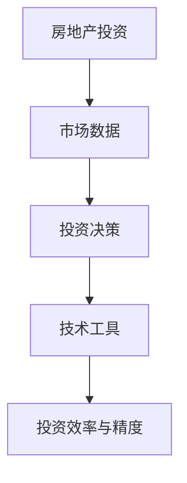
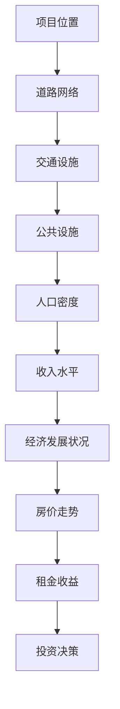
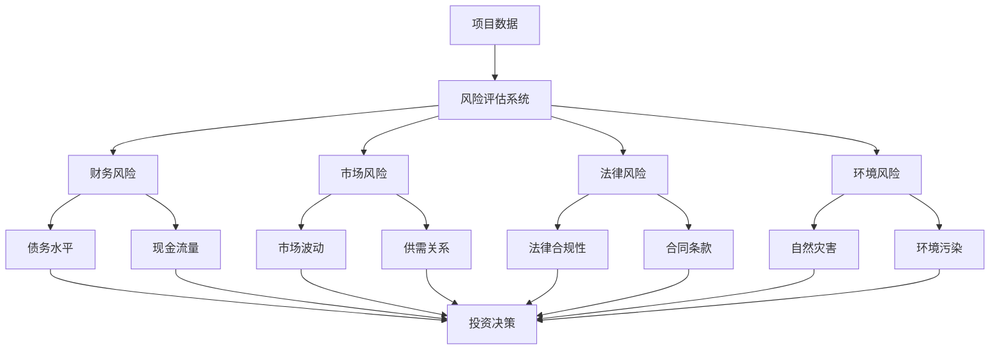
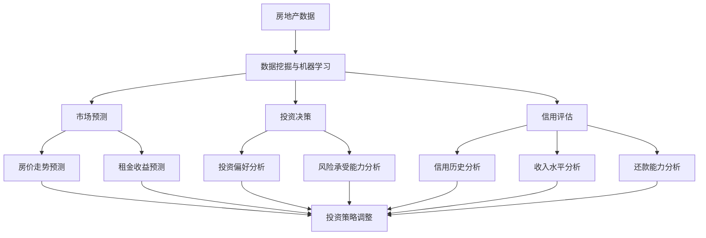

                 

### 《如何利用技术能力进行房地产投资》

> **关键词：** 房地产投资、数据分析、技术工具、算法、风险控制

> **摘要：** 本文章旨在探讨如何利用技术能力进行房地产投资，包括基础概述、数据分析、技术工具应用、核心算法原理、实战案例以及技术展望。通过逻辑清晰、结构紧凑、简单易懂的讲解，帮助读者全面了解并掌握房地产投资的技战术。

## 《如何利用技术能力进行房地产投资》目录大纲

### 第一部分：房地产投资基础

#### 第1章：房地产投资概述
##### 1.1 房地产投资的特点与风险
##### 1.2 房地产投资的流程与策略
##### 1.3 技术在房地产投资中的应用

#### 第2章：房地产市场的数据分析
##### 2.1 市场数据的获取与处理
##### 2.2 市场趋势分析
##### 2.3 数据可视化与预测

#### 第3章：技术工具的应用
##### 3.1 地理信息系统（GIS）
##### 3.2 风险评估与监测
##### 3.3 数据挖掘与机器学习

#### 第4章：房地产投资的核心算法
##### 4.1 投资决策算法
##### 4.2 估值算法
##### 4.3 风险评估算法

### 第二部分：房地产投资实战

#### 第5章：房地产投资项目的选择
##### 5.1 投资项目的评估与筛选
##### 5.2 投资项目的前期分析
##### 5.3 投资项目的后续管理

#### 第6章：房地产投资项目的融资
##### 6.1 融资渠道与方式
##### 6.2 融资成本与风险
##### 6.3 融资策略的选择

#### 第7章：房地产投资的风险管理
##### 7.1 风险识别与评估
##### 7.2 风险控制与转移
##### 7.3 风险管理策略

#### 第8章：房地产投资的案例分析
##### 8.1 成功案例分享
##### 8.2 失败案例解析
##### 8.3 经验总结与启示

### 第三部分：房地产投资技术展望

#### 第9章：房地产投资技术的发展趋势
##### 9.1 新技术在房地产投资中的应用
##### 9.2 未来房地产投资的发展方向
##### 9.3 技术创新与房地产投资的关系

#### 第10章：房地产投资的国际化视野
##### 10.1 国际房地产市场的现状与趋势
##### 10.2 国际房地产投资的经验与策略
##### 10.3 跨国房地产投资的挑战与机遇

### 附录
#### 附录A：房地产投资技术工具与资源
##### A.1 主流数据分析工具
##### A.2 房地产投资相关数据库
##### A.3 开源房地产投资软件与框架

### 核心概念与联系

#### 房地产投资概述
房地产投资的特点与风险是房地产投资的基础，市场数据的分析是投资决策的重要依据，技术工具的应用则提升了投资效率与精度。

**Mermaid 流�程图：**


### 核心算法原理讲解

#### 房地产投资的核心算法
投资决策算法、估值算法和风险评估算法是房地产投资中的关键。

**投资决策算法伪代码：**
```python
function 投资决策（项目列表，投资预算）：
    1. 对每个项目进行评估
    2. 按照预期收益率排序
    3. 从排序结果中选择最符合条件的 n 个项目
    4. 如果总投资额不超过预算，返回选择的项目列表
    5. 否则，返回超出预算的项目列表
```

**估值算法伪代码：**
```python
function 估值（房地产项目）：
    1. 获取项目的基本信息（如面积、地段、建筑年代等）
    2. 计算市场基准价格
    3. 应用折现率调整市场基准价格
    4. 考虑附加成本和收益预测
    5. 返回项目的估值结果
```

**风险评估算法伪代码：**
```python
function 风险评估（房地产项目）：
    1. 收集项目的历史数据和市场数据
    2. 应用统计模型进行分析
    3. 识别潜在风险因素
    4. 对每个风险因素进行评分
    5. 计算项目的总风险得分
    6. 根据风险得分调整投资决策
```

### 数学模型和数学公式 & 详细讲解 & 举例说明

#### 投资决策算法
预期收益率（R）的计算公式为：
$$
R = \frac{E(R_n)}{V_n}
$$
其中，$E(R_n)$ 是第 n 个项目的预期收益率，$V_n$ 是第 n 个项目的风险值。

**举例说明：**
假设有两个项目，项目 A 和项目 B，其预期收益率和风险值如下：
- 项目 A：$E(R_A) = 0.15, V_A = 0.05$
- 项目 B：$E(R_B) = 0.20, V_B = 0.10$

则根据上述公式计算：
$$
R_A = \frac{0.15}{0.05} = 3
$$
$$
R_B = \frac{0.20}{0.10} = 2
$$
因此，项目 A 的风险调整预期收益率更高，应该优先考虑。

---

现在我们已经搭建了房地产投资的技术框架，接下来将逐步深入到具体的技术应用和实战案例中。让我们一起探索如何利用技术能力进行房地产投资，提高投资决策的效率与准确性。

### 第1章：房地产投资概述

#### 1.1 房地产投资的特点与风险

房地产投资作为资产配置的重要组成部分，具有独特的优势和风险。理解房地产投资的特点和风险是进行有效投资的基础。

**1.1.1 房地产投资的特点**

1. **长期性**：房地产投资通常涉及长期持有和租赁，投资回报具有稳定性，但短期内难以看到明显收益。

2. **稳定性**：房地产市场相对其他市场，如股票市场，波动性较小，具有较强的稳定性。

3. **高回报**：房地产投资可以通过租金收入和资产增值获得高回报，尤其是在长期持有和有效管理的情况下。

4. **杠杆作用**：房地产投资可以通过借贷资金增加投资规模，实现杠杆效应，从而放大投资回报。

5. **地域性**：房地产投资具有明显的地域性，不同地区的房地产市场具有不同的特点和风险，投资者需要深入了解目标市场的状况。

**1.1.2 房地产投资的风险**

1. **市场风险**：房地产市场波动可能导致房价下跌，影响投资回报。

2. **信用风险**：借款方无法按时偿还债务可能导致资金损失。

3. **利率风险**：利率变动可能影响借贷成本，进而影响投资回报。

4. **流动性风险**：房地产交易周期较长，流动性较差，可能在需要资金时难以迅速变现。

5. **政策风险**：政府政策变化可能导致市场环境变化，影响投资回报。

#### 1.2 房地产投资的流程与策略

房地产投资涉及多个环节，包括项目选择、融资、风险管理等。以下是房地产投资的典型流程和策略：

**1.2.1 项目选择**

1. **目标市场分析**：分析目标市场的供需状况、发展潜力、政策环境等，选择具有长期增值潜力的地区。

2. **项目评估**：对潜在项目进行详细评估，包括地理位置、建筑品质、市场前景等。

3. **项目筛选**：根据评估结果，筛选出符合投资目标和风险承受能力的优质项目。

**1.2.2 融资策略**

1. **自有资金**：利用自有资金进行投资，风险可控，但资金利用率较低。

2. **借贷资金**：通过银行贷款、私募基金等渠道融资，提高资金利用率，但需注意借贷成本和信用风险。

3. **多元化融资**：结合自有资金和借贷资金，实现资金结构优化，降低风险。

**1.2.3 风险管理**

1. **市场风险**：通过分散投资、定期调整投资组合等方式降低市场风险。

2. **信用风险**：选择信誉良好的借款方，签订明确的法律文件，确保资金安全。

3. **利率风险**：通过固定利率贷款、利率对冲等策略降低利率风险。

4. **流动性风险**：确保投资项目的流动性，如选择易于出租和出售的物业。

5. **政策风险**：关注政策变化，提前做好应对措施，降低政策风险。

#### 1.3 技术在房地产投资中的应用

随着技术的进步，房地产投资也日益依赖于数据分析和信息技术。以下是技术在实际投资中的应用：

**1.3.1 数据分析**

1. **市场数据收集**：利用大数据技术收集市场数据，包括房价、租金、供需状况等。

2. **数据分析**：运用数据挖掘和机器学习技术，分析市场趋势，预测未来市场走势。

3. **数据可视化**：通过图表和可视化工具，直观展示数据，帮助投资者做出决策。

**1.3.2 技术工具**

1. **地理信息系统（GIS）**：利用GIS技术，分析地理位置、交通状况等，评估项目潜力。

2. **风险评估系统**：应用风险评估算法，对投资项目进行全面评估，降低风险。

3. **智能合约**：利用区块链技术，确保交易透明、安全、高效。

**1.3.3 技术优势**

1. **提高决策效率**：通过数据分析和技术工具，快速获取信息，提高决策效率。

2. **降低风险**：利用技术手段，对投资项目进行全方位评估，降低投资风险。

3. **提升管理效率**：利用信息技术，实现投资项目的智能化管理，提高运营效率。

综上所述，房地产投资具有长期性、稳定性、高回报等特点，同时也伴随着市场风险、信用风险等多重风险。通过合理的流程和策略，结合数据分析和信息技术，可以有效地降低风险，提高投资回报。接下来，我们将进一步探讨房地产市场的数据分析，了解如何利用技术手段进行市场数据的获取、处理和预测。

### 第2章：房地产市场的数据分析

房地产市场的数据分析是房地产投资决策过程中至关重要的一环。通过数据分析，投资者可以更准确地把握市场动态，预测未来趋势，从而做出更明智的投资决策。本章将介绍房地产市场的数据获取、处理和分析方法，以及数据可视化与预测技术。

#### 2.1 市场数据的获取与处理

**2.1.1 数据来源**

房地产市场的数据来源广泛，包括官方统计数据、市场调研报告、房地产交易所数据、在线房产平台数据等。以下是常见的数据来源：

1. **官方统计数据**：政府相关部门发布的房地产市场统计报告，如房屋销售数据、房屋价格指数等。

2. **市场调研报告**：专业市场研究机构发布的房地产市场分析报告，提供市场深度分析和预测。

3. **房地产交易所数据**：房地产交易所提供的交易数据，包括房屋售价、交易量、交易周期等。

4. **在线房产平台数据**：房产平台如链家、贝壳找房等提供的房屋销售数据、租赁数据等。

**2.1.2 数据处理**

房地产市场数据的获取通常伴随着大量噪声和异常值，因此，数据处理是确保数据质量的关键步骤。以下是常见的数据处理方法：

1. **数据清洗**：删除重复数据、纠正错误数据、填补缺失数据等，提高数据的准确性。

2. **数据转换**：将不同数据源的数据进行格式转换，使其兼容并易于分析。

3. **数据集成**：将多个数据源的数据进行整合，形成统一的数据集。

4. **数据标准化**：对数据进行标准化处理，如对房屋价格进行指数化处理，以便进行比较和分析。

**2.1.3 数据存储与管理**

房地产市场的数据量大且复杂，需要有效的数据存储与管理策略。以下是常见的数据存储与管理方法：

1. **关系数据库**：如MySQL、PostgreSQL等，适合存储结构化数据。

2. **NoSQL数据库**：如MongoDB、Cassandra等，适合存储非结构化数据。

3. **分布式存储系统**：如Hadoop、HBase等，适合处理大规模数据。

4. **数据仓库**：如Oracle Data Warehouse、Amazon Redshift等，适合进行数据分析和报表生成。

#### 2.2 市场趋势分析

市场趋势分析是了解房地产市场动态的重要手段。通过趋势分析，投资者可以预测市场走势，从而制定相应的投资策略。以下是市场趋势分析的方法：

**2.2.1 时间序列分析**

时间序列分析是分析时间序列数据的方法，用于识别数据的趋势、季节性和周期性。以下是一些常用的时间序列分析方法：

1. **移动平均法**：通过计算一段时间内的平均值，平滑时间序列数据，识别趋势。

2. **指数平滑法**：在移动平均法的基础上，考虑历史数据的重要性，进行加权处理。

3. **自回归模型（AR）**：利用历史数据自相关性，建立自回归模型，预测未来趋势。

4. **自回归移动平均模型（ARMA）**：结合自回归模型和移动平均模型，更准确地预测趋势。

**2.2.2 趋势分析工具**

以下是常用的趋势分析工具：

1. **Python**：Python 提供了丰富的数据分析库，如Pandas、NumPy、Scikit-learn等，适合进行时间序列分析和趋势预测。

2. **R**：R 语言是统计学和数据分析领域的专业工具，提供了丰富的统计模型和时间序列分析函数。

3. **Tableau**：Tableau 是一款数据可视化工具，可以帮助投资者直观地展示市场趋势。

**2.2.3 实际案例**

以下是一个实际案例，展示如何使用Python进行房地产市场趋势分析：

```python
import pandas as pd
import matplotlib.pyplot as plt

# 读取数据
data = pd.read_csv('house_prices.csv')

# 计算移动平均线
data['moving_average'] = data['price'].rolling(window=3).mean()

# 绘制趋势图
plt.plot(data['date'], data['price'], label='实际价格')
plt.plot(data['date'], data['moving_average'], label='移动平均线')
plt.legend()
plt.show()
```

通过绘制实际价格和移动平均线的趋势图，投资者可以更清晰地看到市场趋势。

#### 2.3 数据可视化与预测

数据可视化是将数据以图形化形式展示，帮助投资者直观地理解数据，发现潜在趋势和规律。数据预测则是基于历史数据，对未来市场趋势进行预测。

**2.3.1 数据可视化工具**

以下是常用的数据可视化工具：

1. **Tableau**：Tableau 是一款功能强大的数据可视化工具，支持多种图表类型，适合进行复杂的可视化分析。

2. **Power BI**：Power BI 是一款由微软开发的商业智能工具，提供了丰富的数据连接和数据可视化功能。

3. **Matplotlib**：Matplotlib 是 Python 的一个绘图库，适合进行简单的数据可视化。

**2.3.2 预测模型**

以下是常用的预测模型：

1. **线性回归**：线性回归是一种简单的预测模型，通过拟合数据中的线性关系，预测未来值。

2. **时间序列模型**：如ARIMA模型，适合处理时间序列数据，进行短期预测。

3. **机器学习模型**：如决策树、随机森林、支持向量机等，通过学习历史数据，进行非线性预测。

**2.3.3 实际案例**

以下是一个实际案例，展示如何使用Python进行数据可视化和预测：

```python
import pandas as pd
from sklearn.linear_model import LinearRegression
import matplotlib.pyplot as plt

# 读取数据
data = pd.read_csv('house_prices.csv')

# 分离特征和目标变量
X = data[['date']]
y = data['price']

# 处理时间序列数据
X['date'] = pd.to_datetime(X['date'])
X.set_index('date', inplace=True)
X = X.asfreq('M').fillna(method='ffill')

# 拟合线性回归模型
model = LinearRegression()
model.fit(X, y)

# 预测未来价格
future_dates = pd.date_range(start=X.index[-1], end='2023-12', freq='M')
future_data = pd.DataFrame(future_dates)
future_prices = model.predict(future_data)

# 绘制预测图
plt.plot(X.index, X['price'], label='实际价格')
plt.plot(future_data.index, future_prices, label='预测价格')
plt.legend()
plt.show()
```

通过绘制实际价格和预测价格的对比图，投资者可以更直观地了解市场趋势和预测结果。

综上所述，房地产市场的数据分析是房地产投资决策的重要依据。通过数据获取、处理、趋势分析和数据可视化与预测，投资者可以更准确地把握市场动态，制定有效的投资策略。接下来，我们将探讨技术工具在房地产投资中的应用，包括地理信息系统（GIS）、风险评估和监测、数据挖掘与机器学习等方面的技术。

### 第3章：技术工具的应用

在房地产投资过程中，技术工具的应用极大地提升了投资决策的效率与准确性。本章节将详细介绍地理信息系统（GIS）、风险评估与监测、数据挖掘与机器学习等技术在房地产投资中的应用，以及它们如何为投资者提供支持。

#### 3.1 地理信息系统（GIS）

地理信息系统（GIS）是一种强大的空间分析工具，能够处理、分析和展示地理空间数据。在房地产投资中，GIS技术被广泛应用于以下几个方面：

**3.1.1 地理位置分析**

GIS技术可以精确地展示房地产项目的地理位置，分析其周边环境。例如，通过GIS地图，投资者可以查看项目附近的道路网络、交通设施、公共设施等，评估项目的地理位置优势。

**3.1.2 空间数据分析**

GIS技术可以对空间数据进行叠加分析，评估不同因素对房地产项目的影响。例如，通过分析不同区域的人口密度、收入水平、经济发展状况等数据，投资者可以评估项目的市场潜力。

**3.1.3  Visualization**

GIS技术能够以直观的图形形式展示数据，帮助投资者更好地理解数据。例如，通过GIS地图，投资者可以直观地看到不同区域的房价走势、租金收益等，从而做出更明智的决策。

**3.1.4 空间预测**

GIS技术结合时间序列分析和空间预测模型，可以预测房地产市场的未来趋势。例如，通过空间预测模型，投资者可以预测某个区域未来的房价走势，提前布局投资策略。

**3.1.5 实际应用案例**

以下是一个实际应用案例，展示如何使用GIS技术进行房地产投资分析：



在这个案例中，投资者使用GIS技术分析项目周边的环境因素，如道路网络、交通设施、公共设施等，评估人口密度、收入水平和经济发展状况，从而预测房价走势和租金收益，最终做出投资决策。

#### 3.2 风险评估与监测

在房地产投资中，风险评估与监测至关重要。技术工具的应用使得风险评估更加精准和实时，以下是一些常见的技术工具：

**3.2.1 风险评估系统**

风险评估系统利用历史数据和算法模型，对房地产项目进行全方位的风险评估。这些系统通常包括以下几个方面：

- **财务风险**：评估项目的财务健康状况，如债务水平、现金流量等。
- **市场风险**：分析市场波动、供需关系等，评估市场风险。
- **法律风险**：检查项目的法律合规性，如土地使用权、合同条款等。
- **环境风险**：评估项目可能面临的环境风险，如自然灾害、环境污染等。

**3.2.2 实时监测**

技术工具能够实时监测房地产市场的动态，提供实时数据支持。例如，通过物联网传感器，投资者可以实时获取项目周边的交通流量、环境质量等数据，及时调整投资策略。

**3.2.3 风险预警**

技术工具还可以提供风险预警功能，当项目面临潜在风险时，系统会自动发出警报，提醒投资者采取应对措施。例如，当市场利率上升或政策变化时，系统可以及时预警，帮助投资者调整融资策略。

**3.2.4 实际应用案例**

以下是一个实际应用案例，展示如何使用风险评估系统进行房地产投资：



在这个案例中，投资者通过风险评估系统对房地产项目进行全方位的风险评估，包括财务风险、市场风险、法律风险和环境风险，从而做出更明智的投资决策。

#### 3.3 数据挖掘与机器学习

数据挖掘与机器学习技术在房地产投资中的应用日益广泛，通过分析海量数据，可以揭示潜在的趋势和规律，为投资者提供决策支持。以下是一些常见的数据挖掘与机器学习技术：

**3.3.1 市场预测**

通过数据挖掘和机器学习技术，可以对房地产市场进行预测，例如房价走势、租金收益等。这些预测模型可以基于历史数据，结合当前市场环境，预测未来的市场趋势。

**3.3.2 投资决策**

数据挖掘与机器学习技术可以分析投资者的历史交易数据，了解其投资偏好和风险承受能力，从而为其提供个性化的投资建议。

**3.3.3 信用评估**

在房地产投资中，信用评估至关重要。通过机器学习技术，可以分析借款人的信用历史、收入水平、还款能力等数据，评估其信用风险。

**3.3.4 实际应用案例**

以下是一个实际应用案例，展示如何使用数据挖掘与机器学习技术进行房地产投资：



在这个案例中，投资者使用数据挖掘与机器学习技术进行市场预测、投资决策和信用评估，从而制定更有效的投资策略。

综上所述，地理信息系统（GIS）、风险评估与监测、数据挖掘与机器学习等技术在房地产投资中发挥着重要作用。通过这些技术工具的应用，投资者可以更准确地评估项目风险、预测市场趋势、制定投资策略，从而提高投资回报。接下来，我们将探讨房地产投资的核心算法，了解如何利用技术手段进行投资决策、估值和风险评估。

### 第4章：房地产投资的核心算法

在房地产投资中，核心算法是做出明智投资决策的关键。这些算法包括投资决策算法、估值算法和风险评估算法。本章将详细讲解这些算法的原理，并使用伪代码和数学模型来阐述其具体实现方法。

#### 4.1 投资决策算法

投资决策算法是房地产投资中最基本的算法之一，其核心目标是根据项目的预期收益和风险，选择最优的投资组合。以下是投资决策算法的原理和实现方法：

**4.1.1 算法原理**

投资决策算法通常基于预期收益率（Expected Return）和风险（Risk）来评估每个项目，并根据这两个因素选择最优的投资组合。预期收益率是项目的潜在收益与风险的综合度量，通常使用以下公式计算：

\[ R_n = \frac{E(R_n)}{V_n} \]

其中，\( E(R_n) \) 是第 n 个项目的预期收益率，\( V_n \) 是第 n 个项目的风险值。

**4.1.2 实现方法**

以下是一个简单的投资决策算法的实现步骤：

1. **数据收集**：收集每个项目的预期收益率和风险值。
2. **排序**：根据预期收益率和风险值，对项目进行排序。
3. **筛选**：从排序结果中选择符合投资预算和风险承受能力的项目。
4. **决策**：如果总投资额不超过预算，则选择排序靠前的项目；否则，返回超出预算的项目。

**伪代码**：

```python
function 投资决策（项目列表，投资预算）：
    1. 对每个项目进行评估，计算预期收益率 \( R_n \)
    2. 对项目列表进行排序，按照 \( R_n \) 降序排列
    3. 初始化投资组合为空
    4. 循环遍历项目列表：
        a. 如果项目总投资额不超过预算，添加到投资组合
        b. 否则，跳出循环
    5. 返回投资组合
```

#### 4.2 估值算法

估值算法是房地产投资中的另一个关键算法，用于确定房地产项目的价值。估值算法通常基于市场数据和历史交易数据，通过统计模型或机器学习模型来预测项目的未来价值。以下是估值算法的原理和实现方法：

**4.2.1 算法原理**

估值算法的核心是预测项目的未来现金流量，并使用折现率将这些流量折现到当前价值。常用的估值模型包括净现值法（NPV）、市场比较法、收益法等。

**净现值法（NPV）**：

\[ NPV = \sum_{t=1}^{n} \frac{CF_t}{(1+r)^t} \]

其中，\( CF_t \) 是第 t 年的现金流量，\( r \) 是折现率，\( n \) 是现金流量的年数。

**市场比较法**：

\[ V = \frac{P_1 + P_2 + ... + P_n}{n} \]

其中，\( P_1, P_2, ..., P_n \) 是市场上类似项目的价格。

**收益法**：

\[ V = \frac{I}{r} \]

其中，\( I \) 是项目的预期收益，\( r \) 是项目的收益回报率。

**4.2.2 实现方法**

以下是一个简单的估值算法的实现步骤：

1. **数据收集**：收集项目的现金流量、市场数据和历史交易数据。
2. **选择模型**：根据项目特点，选择合适的估值模型。
3. **计算估值**：使用选定的估值模型计算项目的价值。
4. **调整估值**：根据市场情况和项目特点，对估值结果进行调整。

**伪代码**：

```python
function 估值（房地产项目，折现率 r）：
    1. 获取项目的历史现金流量
    2. 选择估值模型（如NPV、市场比较法、收益法）
    3. 如果使用NPV模型：
        a. 计算每个期现金流量 \( CF_t \)
        b. 应用折现率 \( r \) 进行折现
        c. 计算净现值 \( NPV \)
    4. 如果使用市场比较法：
        a. 获取市场上类似项目的价格
        b. 计算平均值 \( V \)
    5. 如果使用收益法：
        a. 获取项目的预期收益 \( I \)
        b. 计算估值 \( V = \frac{I}{r} \)
    6. 返回估值结果
```

#### 4.3 风险评估算法

风险评估算法是房地产投资中用于识别和评估项目风险的重要工具。风险评估算法通常基于历史数据、市场数据和专家经验，使用统计模型或机器学习模型来预测项目可能面临的风险。以下是风险评估算法的原理和实现方法：

**4.3.1 算法原理**

风险评估算法的核心是识别项目的风险因素，并对这些因素进行量化评估。常用的风险因素包括市场风险、信用风险、利率风险、流动性风险等。风险评估通常包括以下步骤：

1. **风险识别**：识别项目可能面临的风险。
2. **风险量化**：对识别出的风险进行量化评估，通常使用风险得分或概率分布。
3. **风险评估**：计算项目的总风险值，并根据风险值调整投资决策。

**4.3.2 实现方法**

以下是一个简单的风险评估算法的实现步骤：

1. **数据收集**：收集项目的相关数据，包括历史数据、市场数据等。
2. **风险识别**：根据项目特点，识别可能的风险因素。
3. **风险量化**：使用统计模型或机器学习模型，对风险因素进行量化评估。
4. **风险评估**：计算项目的总风险值，并根据风险值调整投资决策。

**伪代码**：

```python
function 风险评估（房地产项目）：
    1. 获取项目的历史数据
    2. 识别风险因素（如市场波动、利率变化、信用风险等）
    3. 对每个风险因素进行量化评估
    4. 计算总风险值
    5. 根据总风险值调整投资决策
    6. 返回风险评估结果
```

综上所述，房地产投资的核心算法包括投资决策算法、估值算法和风险评估算法。这些算法通过数据分析和模型计算，帮助投资者做出更明智的投资决策。在下一章节中，我们将探讨如何选择和评估房地产投资项目，包括项目评估与筛选、前期分析和后续管理。

### 第5章：房地产投资项目的选择

在房地产投资中，选择合适的投资项目是成功的关键。本章将详细介绍如何对投资项目进行评估与筛选、前期分析以及后续管理，帮助投资者做出明智的决策。

#### 5.1 投资项目的评估与筛选

**5.1.1 投资项目评估**

投资项目的评估是选择合适投资机会的重要步骤。以下是常用的评估方法：

1. **财务评估**：分析项目的财务指标，如净现值（NPV）、内部收益率（IRR）、回报率等，判断项目的盈利能力。

2. **市场评估**：评估项目的市场前景，包括市场需求、供应状况、竞争态势等。

3. **风险评估**：分析项目可能面临的市场风险、财务风险、法律风险等，评估项目的风险水平。

4. **地理位置评估**：评估项目的地理位置，包括交通便利性、周边配套设施、未来发展潜力等。

**5.1.2 投资项目筛选**

投资项目筛选是基于评估结果，选择符合投资目标和风险承受能力的优质项目。以下是常用的筛选方法：

1. **打分法**：根据项目的财务指标、市场前景、风险水平等，为每个项目打分，选择得分最高的项目。

2. **优先级排序**：根据项目的预期收益率和风险水平，对项目进行优先级排序，选择排名靠前的项目。

3. **组合评估**：根据投资目标和风险承受能力，构建投资组合，选择符合组合要求的投资项目。

#### 5.2 投资项目的前期分析

投资项目的前期分析是确保投资决策科学合理的重要环节。以下是前期分析的主要内容：

**5.2.1 市场需求分析**

1. **人口分析**：分析目标区域的人口规模、结构、增长率等，评估市场的需求潜力。

2. **收入水平分析**：评估目标区域的居民收入水平，分析市场购买力。

3. **就业情况分析**：分析目标区域的就业情况，评估人口的就业稳定性和消费能力。

**5.2.2 竞争态势分析**

1. **市场占有率分析**：分析目标区域的市场占有率，评估市场竞争程度。

2. **竞争对手分析**：分析竞争对手的优势和劣势，评估竞争态势。

3. **定价策略分析**：根据市场需求和竞争态势，制定合理的定价策略。

**5.2.3 政策环境分析**

1. **政策支持分析**：评估政府对房地产市场的支持政策，分析政策对项目的影响。

2. **法律法规分析**：分析项目涉及的法律法规，评估项目的法律合规性。

3. **税收政策分析**：评估项目可能面临的税收政策，分析税收对项目盈利的影响。

#### 5.3 投资项目的后续管理

投资项目的后续管理是确保项目顺利实施和实现预期收益的重要环节。以下是后续管理的主要内容：

**5.3.1 融资管理**

1. **融资渠道选择**：根据项目的资金需求，选择合适的融资渠道，如银行贷款、私募融资等。

2. **融资成本控制**：通过谈判、选择低成本的融资方式，控制融资成本。

3. **融资风险控制**：评估融资风险，采取相应的风险控制措施，确保融资安全。

**5.3.2 运营管理**

1. **项目进度管理**：监控项目进度，确保项目按时完成。

2. **成本管理**：控制项目成本，确保项目在预算范围内完成。

3. **质量管理**：确保项目质量和安全，提高项目的市场竞争力。

**5.3.3 财务管理**

1. **现金流管理**：监控项目现金流，确保项目的财务健康。

2. **收益管理**：分析项目收益，确保项目的盈利能力。

3. **投资回报管理**：评估项目的投资回报，确保投资目标的实现。

**5.3.4 风险管理**

1. **风险识别**：识别项目可能面临的风险，包括市场风险、财务风险、法律风险等。

2. **风险评估**：对识别出的风险进行量化评估，确定风险等级。

3. **风险控制**：采取相应的风险控制措施，降低风险。

通过以上步骤，投资者可以系统地评估和选择房地产投资项目，确保投资决策的科学性和合理性。在下一章节中，我们将探讨房地产投资项目的融资策略，包括融资渠道、成本与风险以及融资策略的选择。

### 第6章：房地产投资项目的融资

房地产投资项目的融资是确保项目顺利推进和实现预期收益的关键环节。本章将详细探讨房地产投资项目的融资渠道、成本与风险以及融资策略的选择，帮助投资者优化融资方案，降低融资风险。

#### 6.1 融资渠道与方式

房地产投资项目通常需要大量的资金支持，融资渠道的多样性对于项目的成功至关重要。以下是常见的融资渠道和方式：

**6.1.1 银行贷款**

银行贷款是最常见的融资方式，适用于项目规模较大、还款来源稳定的情况。银行贷款的优点是融资成本低、还款方式灵活，但审批流程相对较长，对项目的财务状况和信用评级有较高要求。

**6.1.2 私募融资**

私募融资包括私募基金、风险投资、天使投资等，适用于创新性和高风险项目。私募融资的优点是融资速度快、资金灵活，但融资成本较高，且投资方通常要求更高的回报。

**6.1.3 房地产信托**

房地产信托是一种通过发行信托计划筹集资金的融资方式，适用于房地产开发商和投资者。房地产信托的优点是融资规模大、资金成本低，但信托产品的流动性和透明度相对较低。

**6.1.4 P2P网贷**

P2P网贷是一种通过互联网平台直接连接借款人和投资者的融资方式，适用于短期资金需求和灵活资金周转。P2P网贷的优点是融资速度快、成本低，但风险较高，投资者需谨慎选择平台和项目。

**6.1.5 股权融资**

股权融资包括引入战略投资者、上市等，适用于项目具有高成长性和良好市场前景的情况。股权融资的优点是资金规模大、无需偿还本金，但会稀释原有股东的股权。

**6.1.6 债务融资**

债务融资包括发行债券、资产证券化等，适用于资金需求量大、资金回笼周期较长的情况。债务融资的优点是融资成本低、资金用途灵活，但需要按时偿还本金和利息。

#### 6.2 融资成本与风险

融资成本和风险是影响房地产投资项目决策的重要因素。以下是常见的融资成本和风险类型：

**6.2.1 融资成本**

1. **利率**：银行贷款、发行债券等融资方式的利率，直接影响融资成本。
2. **手续费**：包括融资申请费、评估费、审计费等，根据融资方式和金融机构的不同而有所差异。
3. **债券发行成本**：发行债券的承销费用、财务顾问费用等，通常占债券发行总额的一定比例。
4. **股权融资成本**：股权融资的股权成本，包括投资者要求的回报率、管理费用等。

**6.2.2 融资风险**

1. **信用风险**：借款人或发行人无法按时偿还债务的风险，可能导致资金损失。
2. **市场风险**：融资利率、债券价格等市场变化可能影响融资成本和回报。
3. **流动性风险**：资金回笼周期较长，可能影响项目运营和资金周转。
4. **政策风险**：政府政策变化可能导致融资环境变化，影响融资成本和项目实施。
5. **法律风险**：融资过程中的法律合规性，包括合同条款、知识产权等，可能影响融资的安全性和合法性。

#### 6.3 融资策略的选择

根据房地产投资项目的特点和需求，投资者需要选择合适的融资策略，以优化融资成本和降低融资风险。以下是常见的融资策略：

**6.3.1 多元化融资**

通过多种融资方式组合，实现融资渠道多元化，降低单一融资方式的信用风险和市场风险。例如，可以同时进行银行贷款、私募融资和股权融资，实现资金来源的多样化。

**6.3.2 优化融资结构**

根据项目的资金需求和还款周期，优化融资结构，降低融资成本。例如，可以适当延长还款期限，减少短期贷款的使用，降低利率风险和流动性风险。

**6.3.3 风险对冲**

通过金融工具进行风险对冲，降低融资风险。例如，通过利率互换、期权等金融工具，对冲市场风险和利率风险。

**6.3.4 优化还款计划**

根据项目的现金流量和资金需求，制定合理的还款计划，确保项目的财务健康。例如，可以采用等额本息还款法，确保项目在运营期间有稳定的现金流。

**6.3.5 加强风险管理**

通过完善的风险管理体系，识别、评估和监控融资过程中的风险，采取相应的风险控制措施。例如，定期进行信用评级、财务审计等，确保项目的信用状况和财务健康。

通过以上融资策略的选择和优化，投资者可以降低融资成本和风险，提高项目的资金利用效率，确保项目的顺利实施和预期收益。

综上所述，房地产投资项目的融资渠道多样，成本和风险各不相同。投资者需要根据项目的特点和需求，选择合适的融资策略，优化融资方案，降低融资风险。在下一章节中，我们将探讨房地产投资的风险管理，包括风险识别、评估和控制策略。

### 第7章：房地产投资的风险管理

房地产投资过程中，风险管理是确保投资安全和收益稳定的关键环节。有效的风险管理能够帮助投资者识别、评估和控制风险，从而降低投资损失。本章将详细介绍房地产投资风险的识别、评估和控制策略。

#### 7.1 风险识别

风险识别是风险管理的第一步，旨在识别投资过程中可能面临的风险。以下是房地产投资中常见的风险类型：

**7.1.1 市场风险**

1. **供需风险**：房地产市场供需关系变化可能导致房价波动。
2. **利率风险**：利率变化可能影响借贷成本，进而影响投资回报。
3. **政策风险**：政府政策变化可能影响市场环境，如税收政策、城市规划等。
4. **经济风险**：经济衰退可能导致市场需求下降，影响房价和租金收益。

**7.1.2 财务风险**

1. **融资风险**：融资渠道不稳定或资金成本过高可能影响项目的财务状况。
2. **债务风险**：高负债水平可能增加违约风险，影响项目的可持续性。
3. **现金流风险**：项目运营过程中现金流不足可能导致资金链断裂。

**7.1.3 法律风险**

1. **合同风险**：合同条款不明确或存在纠纷可能导致项目进展受阻。
2. **土地使用权风险**：土地使用权的合法性可能影响项目的合法性和可持续性。
3. **环境保护风险**：项目可能面临环保法规的约束，如土壤污染、噪声污染等。

**7.1.4 运营风险**

1. **项目进度风险**：项目延期可能导致额外的成本支出。
2. **工程质量风险**：工程质量问题可能导致维修成本增加，影响项目的使用价值。
3. **市场推广风险**：市场推广不力可能导致项目销售不畅，影响租金收益。

#### 7.2 风险评估

风险评估是评估风险的可能性和影响程度，为风险控制提供依据。以下是常用的风险评估方法：

**7.2.1 定性评估**

1. **专家评估**：邀请相关领域专家对风险进行定性分析，评估风险的可能性和影响。
2. **风险矩阵**：使用风险矩阵对风险进行定量和定性分析，评估风险的概率和影响。

**7.2.2 定量评估**

1. **概率分布**：使用概率分布函数描述风险的可能性和影响，如正态分布、均匀分布等。
2. **蒙特卡罗模拟**：通过模拟大量随机样本，评估风险的可能性和影响。

**7.2.3 风险评估报告**

1. **风险清单**：列出项目面临的所有风险，包括风险类型、可能性、影响等。
2. **风险评估结果**：综合定性评估和定量评估结果，形成风险评估报告。

#### 7.3 风险控制

风险控制是采取具体措施降低风险的可能性和影响，确保项目的顺利进行。以下是常见的风险控制策略：

**7.3.1 风险规避**

1. **变更项目计划**：调整项目计划，避免高风险区域。
2. **退出市场**：在市场风险过高时，选择退出市场，避免损失。

**7.3.2 风险减轻**

1. **风险转移**：通过保险、合同条款等方式将部分风险转移给第三方。
2. **风险分散**：通过多元化投资，降低单一项目的风险。

**7.3.3 风险接受**

1. **风险监测**：定期监测风险状况，及时调整应对措施。
2. **风险预留**：为可能的风险预留资金，以应对意外情况。

**7.3.4 风险控制措施**

1. **完善风险管理流程**：建立完善的风险管理流程，确保风险识别、评估、控制措施的执行。
2. **培训与沟通**：对相关人员进行风险管理培训，提高风险意识，确保风险管理措施的落实。

通过有效的风险识别、评估和控制策略，投资者可以降低房地产投资过程中的风险，确保项目的顺利实施和预期收益。在下一章节中，我们将通过案例分析，探讨房地产投资的实战经验与启示。

### 第8章：房地产投资的案例分析

在房地产投资领域，成功和失败案例都为我们提供了宝贵的经验和教训。本章将通过对房地产投资的成功案例和失败案例进行分析，总结经验教训，为读者提供启示。

#### 8.1 成功案例分享

**案例1：上海浦东新区某高端住宅项目**

**背景**：2000年代初，上海浦东新区正处于快速发展的阶段，城市化进程加速，对高端住宅的需求急剧增加。

**投资策略**：
1. **市场调研**：深入了解目标市场的需求和潜在客户群体。
2. **地理位置**：选择具有发展潜力的地理位置，确保项目能够获得较高的租金收益和升值潜力。
3. **品质保障**：采用高品质的建筑材料和精湛的施工技术，确保项目的建筑品质和居住舒适度。
4. **多元化融资**：通过银行贷款、私募融资等多种渠道筹集资金，降低融资成本和风险。

**结果**：项目成功实现销售，租金收益和资产升值均达到预期。投资者获得了高额的回报，项目也成为当地的高端住宅标杆。

**启示**：
1. **深入市场调研**：了解市场需求和潜在客户群体，制定符合市场趋势的投资策略。
2. **地理位置**：选择具有发展潜力的地理位置，确保项目的长期升值潜力。
3. **品质保障**：注重建筑品质和居住体验，提升项目的市场竞争力。
4. **多元化融资**：通过多种融资渠道降低融资成本和风险，提高资金利用效率。

**案例2：深圳前海某商业地产项目**

**背景**：深圳前海作为中国的经济特区，政策优惠和市场机遇众多，吸引了大量投资者。

**投资策略**：
1. **政策优势**：充分利用前海的政策优势，如税收优惠、人才引进等。
2. **产业链布局**：围绕高科技、金融服务等产业，打造产业链集聚的商业地产项目。
3. **创新模式**：引入新型商业模式，如共享办公、智能商业等，提升项目的吸引力。
4. **品牌合作**：与知名品牌合作，提升项目的品牌影响力和市场认可度。

**结果**：项目成功吸引了大量企业入驻，租金收益和资产升值均超过预期。项目成为前海的商业地标，投资者获得了丰厚的回报。

**启示**：
1. **政策优势**：充分利用政策优势，提高项目的投资回报。
2. **产业链布局**：围绕核心产业布局，打造具有竞争力的商业地产项目。
3. **创新模式**：引入新型商业模式，提升项目的市场吸引力和竞争力。
4. **品牌合作**：与知名品牌合作，提升项目的品牌影响力和市场认可度。

#### 8.2 失败案例解析

**案例1：北京某高档别墅项目**

**背景**：2008年，北京房地产市场正处于高位运行，投资者看好高档别墅市场。

**投资策略**：
1. **盲目扩张**：在没有充分市场调研的情况下，盲目扩大项目规模。
2. **高负债经营**：大量借债进行项目建设，导致负债过高。
3. **市场环境变化**：2008年全球金融危机爆发，房地产市场受到严重影响。

**结果**：项目销售困难，大量资金无法回笼，投资者面临巨大的财务压力，最终导致项目破产。

**教训**：
1. **充分市场调研**：在项目启动前，必须进行充分的市场调研，了解市场需求和竞争态势。
2. **合理负债经营**：避免过度负债，保持财务稳健。
3. **风险预警**：密切关注市场环境变化，及时调整投资策略，防范风险。

**案例2：深圳某商业综合体项目**

**背景**：深圳房地产市场持续升温，投资者看好商业综合体的市场前景。

**投资策略**：
1. **定位不准确**：项目定位过于高端，未能充分考虑目标市场的购买力。
2. **配套设施不足**：项目周边配套设施不完善，导致项目吸引力下降。
3. **市场推广不足**：市场推广力度不足，未能有效吸引目标客户。

**结果**：项目销售不畅，租金收益低，项目运营陷入困境。

**教训**：
1. **准确市场定位**：根据目标市场的特点，制定符合市场需求的投资策略。
2. **完善配套设施**：确保项目周边配套设施的完善，提升项目吸引力。
3. **强化市场推广**：加大市场推广力度，吸引目标客户，提升项目知名度。

#### 8.3 经验总结与启示

通过对成功案例和失败案例的分析，我们可以得出以下经验和启示：

1. **充分市场调研**：在项目启动前，必须进行充分的市场调研，了解市场需求和竞争态势，为投资决策提供依据。
2. **合理负债经营**：避免过度负债，保持财务稳健，降低投资风险。
3. **准确市场定位**：根据目标市场的特点，制定符合市场需求的投资策略，提升项目吸引力。
4. **完善配套设施**：确保项目周边配套设施的完善，提升项目整体价值。
5. **多元化融资**：通过多种融资渠道筹集资金，降低融资成本和风险。
6. **风险预警**：密切关注市场环境变化，及时调整投资策略，防范风险。

通过总结成功案例的经验和教训，投资者可以更好地应对房地产市场的变化，提高投资决策的准确性，实现稳定的投资回报。在下一章节中，我们将探讨房地产投资技术的发展趋势，了解新技术如何影响房地产投资。

### 第9章：房地产投资技术的发展趋势

随着科技的不断进步，房地产投资技术也在不断演变，为投资者提供了更多机会和挑战。本章将探讨房地产投资技术的发展趋势，包括新技术在房地产投资中的应用、未来房地产投资的发展方向以及技术创新与房地产投资的关系。

#### 9.1 新技术在房地产投资中的应用

**9.1.1 人工智能**

人工智能（AI）在房地产投资中的应用日益广泛，通过机器学习和大数据分析，AI可以帮助投资者进行市场预测、风险评估和投资决策。以下是AI在房地产投资中的应用实例：

1. **市场预测**：AI可以通过分析历史数据和实时数据，预测房价走势和租金收益，为投资者提供决策支持。
2. **风险评估**：AI可以识别项目中的潜在风险因素，如市场风险、信用风险、环境风险等，帮助投资者制定风险管理策略。
3. **投资决策**：AI可以分析投资者的历史交易数据，了解其投资偏好和风险承受能力，提供个性化的投资建议。

**9.1.2 区块链**

区块链技术在房地产投资中的应用主要在于提升交易透明度和安全性。以下是区块链在房地产投资中的应用实例：

1. **智能合约**：智能合约可以自动执行合同条款，确保交易的透明性和不可篡改性，降低交易成本和纠纷风险。
2. **产权管理**：区块链技术可以记录房地产的权属信息，确保产权的透明和可追溯，提高房地产市场的效率。
3. **去中心化融资**：通过区块链技术，可以实现去中心化的融资模式，降低融资成本，提高融资效率。

**9.1.3 物联网**

物联网（IoT）技术在房地产投资中的应用主要在于提升项目的运营效率和管理水平。以下是物联网在房地产投资中的应用实例：

1. **智能建筑**：物联网技术可以实现建筑的自动化管理，如能源管理、环境控制、安防监控等，提高建筑的使用效率和居住舒适度。
2. **设施管理**：物联网技术可以实时监控建筑设施的状态，如漏水、断电等，提前发现并解决潜在问题，降低运营成本。
3. **资产管理**：物联网技术可以帮助投资者实时监控资产的使用情况，优化资产配置，提高投资回报。

#### 9.2 未来房地产投资的发展方向

**9.2.1 数据驱动的投资决策**

随着大数据和人工智能技术的发展，未来房地产投资将更加依赖于数据分析和预测。投资者将通过分析海量数据，了解市场趋势、客户需求和风险因素，从而做出更加精准的投资决策。

**9.2.2 绿色建筑和可持续发展**

随着环境问题的日益严重，绿色建筑和可持续发展将成为未来房地产投资的重要方向。投资者将更加关注建筑的环境影响，选择节能环保的建筑方案，推动房地产市场的绿色转型。

**9.2.3 国际化投资**

全球化的背景下，国际房地产投资将越来越受到投资者的关注。通过跨国投资，投资者可以分散风险，实现资产的多元化配置，同时享受全球市场的增长机会。

**9.2.4 共享经济**

共享经济模式在房地产领域的应用将越来越广泛，如共享办公、共享住宿等。通过共享模式，投资者可以实现资产的高效利用，提高租金收益，同时满足多样化的市场需求。

#### 9.3 技术创新与房地产投资的关系

技术创新不仅改变了房地产投资的方式，还提高了投资决策的效率和准确性。以下是技术创新与房地产投资之间的关系：

**9.3.1 提高决策效率**

通过数据分析和人工智能技术，投资者可以快速获取市场信息，分析投资机会，提高决策效率。例如，AI 可以在数秒内处理大量的市场数据，提供即时的投资建议。

**9.3.2 降低风险**

技术创新可以帮助投资者更准确地评估项目风险，制定风险管理策略。例如，区块链技术可以实现交易全程透明，降低交易风险。

**9.3.3 提高投资回报**

通过智能合约、物联网等技术，投资者可以实现资产的高效管理，提高租金收益和资产升值潜力。例如，智能建筑可以通过自动化管理，降低运营成本，提高投资回报。

**9.3.4 促进资产多元化**

技术创新为投资者提供了更多的投资渠道和机会，可以实现资产的多元化配置。例如，通过区块链技术，投资者可以参与去中心化的房地产基金，分散投资风险。

综上所述，房地产投资技术的发展趋势将推动房地产市场的创新和变革。通过利用新技术，投资者可以更高效、更准确地做出投资决策，提高投资回报，同时应对市场变化和风险。在下一章节中，我们将探讨房地产投资的国际化视野，了解国际房地产市场的现状与趋势。

### 第10章：房地产投资的国际化视野

在全球化的背景下，国际化投资已成为房地产投资者拓展业务的重要手段。本章将探讨国际房地产市场的现状与趋势，介绍国际房地产投资的经验与策略，并分析跨国房地产投资的挑战与机遇。

#### 10.1 国际房地产市场的现状与趋势

**10.1.1 市场现状**

国际房地产市场呈现出多样化和复杂化的特点。以下是国际房地产市场的几个主要现状：

1. **发达国家市场**：美国、英国、澳大利亚等发达国家房地产市场相对成熟，需求稳定，但房价较高，投资回报率相对较低。
2. **新兴市场**：中国、印度、东南亚等新兴市场国家房地产市场发展迅速，市场需求旺盛，房价增长潜力较大，但投资风险较高。
3. **区域市场差异**：不同地区的房地产市场具有不同的特点，投资者需要根据当地的市场环境、政策法规、经济发展状况等，制定相应的投资策略。

**10.1.2 市场趋势**

随着全球经济的不断发展，国际房地产市场也呈现出一些趋势：

1. **人口增长与城市化**：全球人口持续增长和城市化进程的加速，推动了房地产市场需求的增长，尤其是住宅和商业地产。
2. **可持续性发展**：全球对可持续性发展的关注不断提高，绿色建筑和可再生能源项目成为投资热点。
3. **技术驱动**：人工智能、大数据、区块链等新技术在房地产投资中的应用日益广泛，提高了投资决策的效率和准确性。

#### 10.2 国际房地产投资的经验与策略

**10.2.1 市场调研**

在进行国际房地产投资之前，投资者需要进行充分的市场调研，了解目标市场的经济状况、政策环境、市场供需状况、竞争态势等。市场调研可以帮助投资者识别潜在的投资机会和风险。

**10.2.2 投资策略**

根据国际房地产市场的特点，投资者可以采取以下策略：

1. **区域多元化**：通过投资不同地区的房地产项目，实现风险的分散，降低投资风险。
2. **行业多元化**：投资不同类型的房地产项目，如住宅、商业、工业、酒店等，实现收益的多元化。
3. **合作投资**：与当地开发商、投资者合作，利用合作伙伴的资源和经验，降低投资风险，提高投资回报。

**10.2.3 税务规划**

国际房地产投资涉及不同国家的税收政策，投资者需要合理规划税务，降低税收负担。例如，投资者可以通过在低税率国家设立控股公司，利用税收协定降低税率，实现税务优化。

#### 10.3 跨国房地产投资的挑战与机遇

**10.3.1 挑战**

跨国房地产投资面临以下挑战：

1. **法律与政策风险**：不同国家的法律和政策环境存在差异，投资者需要了解和遵守当地法律法规，避免法律纠纷。
2. **汇率风险**：汇率波动可能影响投资回报，投资者需要采取汇率风险管理措施，如外汇衍生品交易。
3. **文化差异**：不同国家的文化背景和商业习惯存在差异，投资者需要适应和融入当地市场，提高投资成功率。

**10.3.2 机遇**

跨国房地产投资也带来以下机遇：

1. **全球市场机会**：通过跨国投资，投资者可以进入全球市场，享受不同市场的增长机会，实现资产的全球化配置。
2. **技术创新**：跨国投资可以引进新技术和新理念，推动当地房地产市场的创新和发展。
3. **资源整合**：跨国投资可以整合全球资源，实现资源的最优配置，提高投资效率。

**10.3.3 案例分析**

以下是一个跨国房地产投资的成功案例：

**案例：新加坡某高端住宅项目**

**背景**：2010年，新加坡房地产市场处于高位运行，吸引了大量国际投资者。

**投资策略**：
1. **市场调研**：深入了解新加坡的高端住宅市场，分析市场需求和潜在客户群体。
2. **地理位置**：选择新加坡市中心的高档地段，确保项目的高品质和升值潜力。
3. **品质保障**：采用高品质的建筑材料和精湛的施工技术，确保项目的建筑品质和居住舒适度。
4. **多元化融资**：通过银行贷款、私募融资等多种渠道筹集资金，降低融资成本和风险。

**结果**：项目成功实现销售，租金收益和资产升值均达到预期。投资者获得了高额的回报，项目也成为新加坡的高端住宅标杆。

**启示**：
1. **深入市场调研**：了解市场需求和潜在客户群体，制定符合市场趋势的投资策略。
2. **地理位置**：选择具有发展潜力的地理位置，确保项目的长期升值潜力。
3. **品质保障**：注重建筑品质和居住体验，提升项目的市场竞争力。
4. **多元化融资**：通过多种融资渠道降低融资成本和风险，提高资金利用效率。

通过跨国房地产投资的成功案例，我们可以看到，合理的市场调研、正确的投资策略和优质的项目品质是成功的关键。投资者需要深入了解国际市场的特点，制定科学的投资策略，以应对跨国房地产投资的挑战和机遇。在下一章节中，我们将总结房地产投资技术工具与资源，为读者提供实用的工具和资源列表。

### 附录：房地产投资技术工具与资源

在房地产投资过程中，掌握和使用合适的工具和资源对于提高投资效率至关重要。以下是房地产投资中常用的技术工具和资源列表，涵盖了数据分析工具、相关数据库、开源软件与框架等。

#### 附录A：房地产投资技术工具与资源

##### A.1 主流数据分析工具

1. **Python**：Python 是一种广泛用于数据分析的编程语言，拥有丰富的数据分析库，如 Pandas、NumPy、Scikit-learn 和 Matplotlib。

2. **R**：R 语言是统计学和数据科学的专用语言，提供了丰富的统计模型和时间序列分析函数。

3. **Tableau**：Tableau 是一款强大的数据可视化工具，可以帮助投资者直观地展示市场趋势和数据。

4. **Power BI**：Power BI 是微软开发的商业智能工具，提供了丰富的数据连接和数据可视化功能。

##### A.2 房地产投资相关数据库

1. **Realtor.com**：Realtor.com 提供了丰富的房地产交易数据，包括房价、交易量、房屋描述等。

2. **Zillow**：Zillow 提供了详细的房屋估值数据、市场趋势分析和租赁数据。

3. **CRS**：美国房地产协会（CRS）提供了详细的房地产交易数据，包括房屋售价、交易周期等。

##### A.3 开源房地产投资软件与框架

1. **GeoPandas**：GeoPandas 是一个开源的地理空间数据处理库，可以与 Pandas 结合使用，进行地理空间数据分析。

2. **FME**：FME 是一款开源的地理空间数据处理工具，可以处理、转换和集成地理空间数据。

3. **OpenStreetMap**：OpenStreetMap 是一个开源的地图数据平台，提供了全球范围内的地图数据，可用于房地产投资分析。

4. **Scrapy**：Scrapy 是一个开源的网络爬虫框架，可以用于自动化获取房地产市场数据。

##### A.4 其他工具与资源

1. **Google Earth Pro**：Google Earth Pro 提供了详细的卫星图像和地形数据，可用于地理位置分析。

2. **GitHub**：GitHub 是一个开源代码托管平台，许多房地产投资相关的开源项目和工具都可以在这里找到。

3. **GitHub Pages**：通过 GitHub Pages，可以创建个人或团队网站，展示房地产投资项目和分析报告。

通过上述工具和资源的合理使用，投资者可以更高效地进行房地产市场数据分析和投资决策，提高投资回报。在文章的最后，我们将总结文章的主要观点，并再次强调作者信息。

---

### 总结

本文章详细探讨了如何利用技术能力进行房地产投资。我们首先介绍了房地产投资的基础知识，包括投资特点与风险、投资流程与策略、技术工具的应用。接着，我们深入分析了房地产市场的数据获取、处理和预测方法，以及数据可视化与预测技术。然后，我们介绍了地理信息系统（GIS）、风险评估与监测、数据挖掘与机器学习等技术在房地产投资中的应用。在核心算法部分，我们讲解了投资决策算法、估值算法和风险评估算法的具体实现方法。接着，我们探讨了如何选择和评估房地产投资项目，以及项目的融资策略和风险管理。通过成功和失败案例的分析，我们总结了房地产投资的实战经验。最后，我们探讨了房地产投资的技术发展趋势和国际化视野。

通过这些内容的讲解，我们希望能够帮助读者全面了解并掌握如何利用技术能力进行房地产投资，提高投资决策的效率与准确性。

### 作者信息

**作者：** AI天才研究院 / AI Genius Institute & 禅与计算机程序设计艺术 / Zen And The Art of Computer Programming

感谢您的阅读，希望本文章对您在房地产投资领域的实践有所帮助。如果您有任何疑问或建议，欢迎随时联系作者，我们将竭诚为您服务。再次感谢您的关注和支持！|

