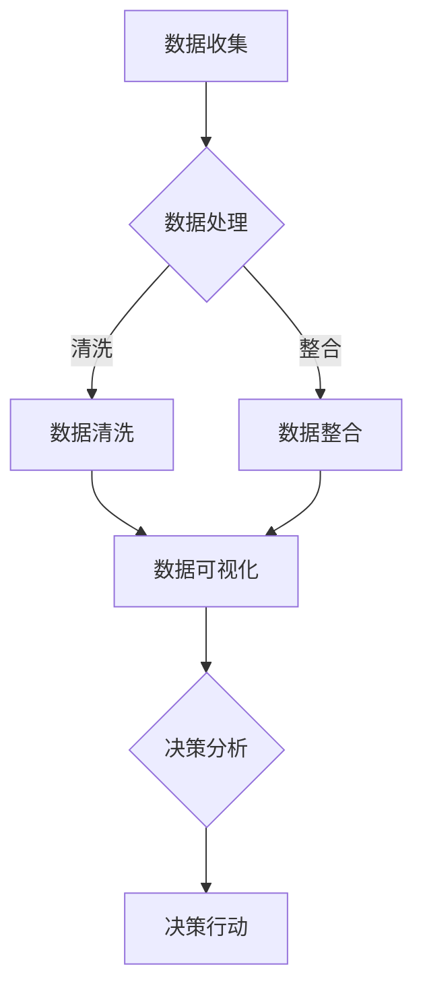

                 

# 《如何利用数据可视化提升决策效率》

> **关键词：** 数据可视化、决策效率、数据分析、图表设计、商业智能

> **摘要：** 本文将探讨如何利用数据可视化技术提升决策效率。通过介绍数据可视化的基础理论、方法与技巧，结合实际应用案例，详细阐述数据可视化在提升决策效率中的重要作用和实现方法。

## 目录大纲

### 第一部分：数据可视化的基础理论

1. **第1章：数据可视化的概述**
   - **1.1 数据可视化的定义与作用**
   - **1.2 数据可视化的发展历史**
   - **1.3 数据可视化在现代决策中的应用

2. **第2章：数据可视化的原理**
   - **2.1 人眼与视觉感知**
   - **2.2 信息可视化与数据可视化**
   - **2.3 数据可视化技术的基本原理

3. **第3章：数据可视化工具介绍**
   - **3.1 常用数据可视化工具概述**
   - **3.2 Tableau使用入门**
   - **3.3 Power BI实践

### 第二部分：数据可视化方法与技巧

4. **第4章：数据类型与可视化方法**
   - **4.1 分类数据的可视化**
   - **4.2 顺序数据的可视化**
   - **4.3 关联数据的可视化

5. **第5章：数据可视化技巧**
   - **5.1 图表布局与设计**
   - **5.2 颜色选择与使用**
   - **5.3 字体与文字设计

6. **第6章：数据可视化中的误区与避免**
   - **6.1 常见误区分析**
   - **6.2 如何避免数据可视化中的误导**
   - **6.3 数据可视化报告的撰写

### 第三部分：数据可视化在决策中的应用

7. **第7章：数据可视化在业务分析中的应用**
   - **7.1 业务数据收集与整理**
   - **7.2 数据可视化在市场分析中的应用**
   - **7.3 数据可视化在运营分析中的应用

8. **第8章：数据可视化在战略决策中的应用**
   - **8.1 战略决策中的数据可视化分析**
   - **8.2 数据可视化在风险管理中的应用**
   - **8.3 数据可视化在创新决策中的应用

9. **第9章：数据可视化项目实战**
   - **9.1 数据可视化项目实施流程**
   - **9.2 实际案例分析与实战**
   - **9.3 项目总结与反思

## 附录

### 附录A：数据可视化资源与工具汇总
- **A.1 常见数据可视化资源**
- **A.2 推荐数据可视化工具**
- **A.3 数据可视化社区与论坛**

以上是本文的目录大纲，接下来我们将逐一深入探讨每个章节的内容，帮助读者全面了解数据可视化在提升决策效率方面的应用。

---

在当今信息化和数据驱动的时代，数据已成为企业决策的重要依据。然而，面对海量的数据，如何快速有效地分析并转化为决策支持信息，成为了企业面临的一大挑战。数据可视化作为数据分析的重要工具，通过图形化的方式将复杂的数据转化为直观的信息，极大地提升了决策效率。本文将围绕数据可视化在提升决策效率中的应用进行深入探讨。

### 第一部分：数据可视化的基础理论

#### 第1章：数据可视化的概述

**1.1 数据可视化的定义与作用**

数据可视化（Data Visualization）是指利用图形化的手段，将数据转换为视觉形式，帮助人们更直观、快速地理解和分析数据。数据可视化不仅能够使复杂的数据变得易于理解，还能够发现数据之间的潜在关联，从而为决策提供有力支持。

在商业环境中，数据可视化主要具备以下作用：

1. **提高数据可理解性**：通过图形化展示，数据变得更加直观易懂，有助于非专业用户快速掌握数据信息。
2. **发现数据模式**：通过可视化工具，可以直观地发现数据中的趋势、异常和关联，为决策提供方向。
3. **增强数据洞察力**：通过数据可视化，可以深入挖掘数据背后的含义，提高决策的准确性。
4. **促进沟通与协作**：数据可视化使得复杂的数据变得易于分享和讨论，有助于团队协作和决策。

**1.2 数据可视化的发展历史**

数据可视化的概念最早可以追溯到17世纪的欧洲，当时科学家和数学家开始使用图表和图形来表示数据。随着计算机技术的不断发展，数据可视化工具逐渐成熟，并在20世纪末开始广泛应用于商业和科研领域。

- **20世纪60年代**：计算机的出现为数据可视化的发展提供了技术支持。
- **20世纪80年代**：计算机图形学的发展使得数据可视化工具逐渐普及。
- **21世纪初**：互联网的兴起和数据量的激增，使得数据可视化成为数据分析的重要组成部分。

**1.3 数据可视化在现代决策中的应用**

在现代决策中，数据可视化已成为不可或缺的工具。以下是一些具体应用场景：

1. **市场营销**：通过分析用户行为数据，企业可以更好地了解市场需求，制定精准的营销策略。
2. **运营管理**：通过实时数据可视化，企业可以监控业务运行状况，及时发现问题并采取行动。
3. **风险管理**：通过数据可视化，企业可以识别潜在风险，制定有效的风险管理策略。
4. **战略规划**：通过数据可视化，企业可以分析市场趋势和竞争对手动态，为战略规划提供依据。

#### 第2章：数据可视化的原理

**2.1 人眼与视觉感知**

人类视觉系统具有强大的信息处理能力，能够迅速捕捉和处理视觉信息。在数据可视化中，充分利用人眼的视觉特性，可以提升数据的可读性和理解效率。

1. **颜色感知**：颜色是视觉信息的重要组成部分，合理运用颜色可以增强数据的对比度和可读性。
2. **形状和线条**：形状和线条能够传达数据的结构和关系，通过不同的形状和线条设计，可以直观地展示数据特征。
3. **空间布局**：空间布局影响数据的布局和组织方式，合理的空间布局可以提高数据的可读性和理解效率。

**2.2 信息可视化与数据可视化**

信息可视化（Information Visualization）和数据可视化（Data Visualization）是两个相关但不同的概念。

- **信息可视化**：主要关注于如何通过视觉方式展示抽象信息，旨在揭示信息之间的复杂关系和模式。
- **数据可视化**：主要关注于如何通过图形化方式展示数据，帮助人们理解和分析数据。

两者之间的关系可以概括为：数据可视化是信息可视化的一种形式，信息可视化是数据可视化的高级阶段。

**2.3 数据可视化技术的基本原理**

数据可视化技术主要包括以下几个方面：

1. **数据转换**：将原始数据转换为适合可视化的格式，如表格、图形等。
2. **图形绘制**：利用图形绘制技术，将数据可视化，如折线图、柱状图、散点图等。
3. **交互设计**：通过交互设计，使用户能够动态地探索数据，如过滤、筛选、缩放等操作。

#### 第3章：数据可视化工具介绍

**3.1 常用数据可视化工具概述**

在数据可视化领域，常用的工具包括Tableau、Power BI、QlikView、D3.js等。这些工具各具特色，适用于不同的场景和需求。

- **Tableau**：一款功能强大的数据可视化工具，支持多种数据源，提供丰富的可视化图表和交互功能。
- **Power BI**：微软推出的商业智能工具，易于上手，支持多种数据连接和数据预处理功能。
- **QlikView**：一款具有强大数据关联和分析能力的可视化工具，适用于复杂的数据分析场景。
- **D3.js**：一款基于JavaScript的可视化库，适用于Web前端开发，具有高度灵活性和定制性。

**3.2 Tableau使用入门**

Tableau是一款广泛使用的商业数据可视化工具。下面是Tableau的基本使用步骤：

1. **连接数据源**：通过Tableau连接到各种数据源，如Excel、SQL数据库等。
2. **创建图表**：利用Tableau提供的多种图表类型，如柱状图、折线图、散点图等，创建可视化报表。
3. **自定义设计**：通过调整图表的颜色、字体、布局等，自定义报表的视觉效果。
4. **交互式探索**：利用Tableau的交互功能，如筛选、过滤、缩放等，动态探索数据。

**3.3 Power BI实践**

Power BI是微软推出的商业智能工具，适用于数据可视化、报告生成和仪表板创建。下面是Power BI的基本实践步骤：

1. **数据导入**：通过Power BI导入数据，支持多种数据源，如Excel、SQL数据库、云服务等。
2. **数据建模**：利用Power BI的数据建模功能，对数据进行清洗、转换和整合。
3. **报告生成**：利用Power BI的报表生成功能，创建数据可视化报告，支持多种图表类型和布局。
4. **仪表板创建**：利用Power BI的仪表板功能，将多个报表整合到一个界面，实现数据综合展示。

### 第二部分：数据可视化方法与技巧

#### 第4章：数据类型与可视化方法

不同的数据类型适合使用不同的可视化方法。以下分别介绍分类数据、顺序数据和关联数据的可视化方法。

**4.1 分类数据的可视化**

分类数据是指具有分类属性的数据，如性别、学历、产品类别等。分类数据的可视化通常使用以下几种方法：

- **条形图**：用于比较不同类别的数据大小，条形的高度或长度表示数据的数量。
- **饼图**：用于表示不同类别在整体中的比例，每个扇形的大小表示类别的比例。
- **堆积条形图**：用于显示各类别数据的总和，条形的宽度表示总数量，高度表示各类别的数量。

**4.2 顺序数据的可视化**

顺序数据是指具有顺序属性的数据，如排名、时间序列等。顺序数据的可视化通常使用以下几种方法：

- **折线图**：用于表示数据随时间或其他连续变量的变化趋势，点的连线表示数据的顺序。
- **柱状图**：用于表示不同时间点的数据大小，柱状的高度表示数据的大小。
- **箱线图**：用于表示数据的分布和异常值，通过上下四分位数和中间值来展示数据的分布特征。

**4.3 关联数据的可视化**

关联数据是指具有相互关联的数据，如用户行为数据、销售数据等。关联数据的可视化通常使用以下几种方法：

- **散点图**：用于表示两个或多个变量之间的关系，点的位置表示数据的关系。
- **热力图**：用于表示多个变量之间的相关性，通过颜色深浅来表示数据的相关程度。
- **气泡图**：用于表示多个变量之间的关联，气泡的大小表示一个变量的值，位置表示另一个变量的值。

#### 第5章：数据可视化技巧

数据可视化不仅需要选择合适的图表类型，还需要注意图表的设计和布局，以提高数据的可读性和吸引力。

**5.1 图表布局与设计**

图表布局与设计是数据可视化中的重要环节。以下是一些常用的布局与设计技巧：

- **对齐与平衡**：保持图表元素的对齐和平衡，避免视觉混乱。
- **简洁性**：避免图表过于复杂，确保数据的清晰呈现。
- **色彩使用**：选择合适的色彩方案，增强数据的对比度和可读性。
- **字体与大小**：使用易读的字体和适当的大小，确保数据的可读性。

**5.2 颜色选择与使用**

颜色在数据可视化中起着重要作用，正确的颜色选择可以增强数据的可读性和视觉效果。以下是一些颜色选择的建议：

- **对比度**：使用高对比度的颜色组合，以突出关键数据。
- **色盲友好**：避免使用色盲友好的颜色组合，确保所有用户都能正确解读数据。
- **色彩含义**：给不同数据赋予不同的颜色，以便用户快速理解数据含义。

**5.3 字体与文字设计**

字体与文字设计直接影响数据的可读性和吸引力。以下是一些字体与文字设计的建议：

- **易读性**：选择易读的字体，如Arial、Helvetica等，避免使用过于复杂或装饰性的字体。
- **字号与行距**：选择合适的字号和行距，确保文字的可读性。
- **文字对齐**：保持文字的对齐一致，避免视觉混乱。

#### 第6章：数据可视化中的误区与避免

在数据可视化过程中，一些常见的误区可能会影响数据的准确性和可读性。以下是一些常见误区及其避免方法：

**6.1 常见误区分析**

- **数据失真**：过于复杂的图表设计可能导致数据失真，影响数据的准确性。
- **颜色滥用**：过多或不合适的颜色使用可能导致视觉疲劳，影响数据的可读性。
- **图表堆叠**：过度使用多个图表堆叠，可能导致数据混乱，影响用户理解。
- **忽略标注**：图表缺乏必要的标注和说明，可能导致用户无法正确解读数据。

**6.2 如何避免数据可视化中的误导**

- **准确数据来源**：确保数据的准确性和来源可靠性，避免使用不真实或错误的数据。
- **合理图表设计**：避免过度设计，保持图表的简洁性和可读性。
- **清晰标注**：为图表添加必要的标注和说明，确保用户能够正确解读数据。

**6.3 数据可视化报告的撰写**

数据可视化报告是数据可视化结果的最终呈现形式。以下是一些报告撰写的建议：

- **明确目标**：确定报告的目标和受众，确保报告的内容和形式符合需求。
- **结构清晰**：报告应具有清晰的逻辑结构和层次感，使读者易于理解。
- **图表合理**：合理选择和设计图表，确保图表与报告内容相匹配。
- **文字说明**：为图表和报告内容添加必要的文字说明，帮助读者更好地理解数据。

### 第三部分：数据可视化在决策中的应用

#### 第7章：数据可视化在业务分析中的应用

数据可视化在业务分析中具有重要作用，可以帮助企业更好地理解业务状况，优化业务流程，提升业务绩效。

**7.1 业务数据收集与整理**

业务数据的收集与整理是数据可视化的基础。以下是一些关键步骤：

- **数据来源**：确定数据来源，包括内部数据和外部数据。
- **数据清洗**：对数据进行清洗和预处理，确保数据的准确性和完整性。
- **数据整合**：将来自不同来源的数据进行整合，构建统一的数据视图。

**7.2 数据可视化在市场分析中的应用**

在市场分析中，数据可视化可以帮助企业了解市场动态，制定有效的市场策略。以下是一些具体应用：

- **市场趋势分析**：通过数据可视化，展示市场趋势和变化，帮助企业把握市场机会。
- **竞争对手分析**：通过数据可视化，比较竞争对手的绩效和市场表现，制定有效的竞争策略。
- **客户细分分析**：通过数据可视化，分析不同客户群体的特征和需求，为精准营销提供依据。

**7.3 数据可视化在运营分析中的应用**

在运营分析中，数据可视化可以帮助企业监控业务运行状况，优化运营流程，提高运营效率。以下是一些具体应用：

- **绩效监控**：通过数据可视化，实时监控业务绩效指标，发现问题和改进方向。
- **成本分析**：通过数据可视化，展示业务成本结构，优化成本控制策略。
- **供应链分析**：通过数据可视化，分析供应链中的瓶颈和问题，优化供应链管理。

#### 第8章：数据可视化在战略决策中的应用

数据可视化在战略决策中发挥着重要作用，可以帮助企业制定科学的战略规划，提高战略执行力。

**8.1 战略决策中的数据可视化分析**

在战略决策中，数据可视化可以帮助企业进行多维度分析，为决策提供有力支持。以下是一些关键步骤：

- **战略目标设定**：通过数据可视化，明确企业的战略目标和关键指标。
- **市场环境分析**：通过数据可视化，分析市场环境的变化趋势和竞争态势。
- **内部能力分析**：通过数据可视化，分析企业的内部资源、能力和竞争力。

**8.2 数据可视化在风险管理中的应用**

在风险管理中，数据可视化可以帮助企业识别潜在风险，制定有效的风险控制策略。以下是一些具体应用：

- **风险识别**：通过数据可视化，展示潜在风险的特征和趋势，帮助识别风险。
- **风险评估**：通过数据可视化，评估风险的影响程度和概率，为风险控制提供依据。
- **风险控制**：通过数据可视化，监控风险控制措施的执行效果，及时调整和优化风险控制策略。

**8.3 数据可视化在创新决策中的应用**

在创新决策中，数据可视化可以帮助企业挖掘创新机会，优化创新过程。以下是一些具体应用：

- **创新机会识别**：通过数据可视化，展示市场和技术趋势，发现潜在的创新机会。
- **创新过程监控**：通过数据可视化，监控创新项目的进度和绩效，确保创新目标的实现。
- **创新绩效评估**：通过数据可视化，评估创新项目的效果和贡献，为持续创新提供依据。

#### 第9章：数据可视化项目实战

为了更好地理解数据可视化在提升决策效率中的应用，以下将通过一个实际案例，展示数据可视化项目的实施过程和效果。

**9.1 数据可视化项目实施流程**

数据可视化项目的实施通常包括以下步骤：

1. **需求分析**：明确数据可视化项目的目标和需求，包括数据类型、可视化内容和应用场景。
2. **数据收集**：收集所需的数据，并进行清洗和预处理，确保数据的准确性和完整性。
3. **数据建模**：构建数据模型，将原始数据转化为适合可视化的格式。
4. **可视化设计**：根据需求设计可视化报表，选择合适的图表类型和布局。
5. **可视化实现**：利用数据可视化工具实现报表设计，生成可视化结果。
6. **可视化分析**：对可视化结果进行深入分析，为决策提供支持。
7. **可视化优化**：根据反馈和需求，对可视化报表进行优化和改进。

**9.2 实际案例分析与实战**

以下将通过一个电商平台的用户行为数据可视化项目，展示数据可视化在提升决策效率中的应用。

**项目背景**：某电商平台希望通过数据可视化分析用户行为数据，优化用户体验和提升销售业绩。

**项目目标**：分析用户浏览、购买和评价行为，找出潜在的用户需求，为产品优化和营销策略提供支持。

**项目实施步骤**：

1. **需求分析**：
   - 分析用户行为数据类型和需求，包括用户浏览、购买和评价行为。
   - 确定可视化报表的内容和形式，包括用户行为路径、购买转化率、评价情感等。

2. **数据收集**：
   - 从电商平台的数据仓库中收集用户行为数据，包括用户ID、行为类型、时间、产品ID等。
   - 对数据进行清洗和预处理，包括数据缺失值处理、异常值处理和数据格式转换等。

3. **数据建模**：
   - 构建用户行为数据模型，将原始数据转化为适合可视化的格式。
   - 定义数据表和字段，建立数据关系，确保数据的一致性和完整性。

4. **可视化设计**：
   - 根据需求设计用户行为可视化报表，选择合适的图表类型和布局。
   - 设计用户行为路径图、购买转化率图、评价情感图等，展示用户行为特征和趋势。

5. **可视化实现**：
   - 利用Tableau工具实现用户行为可视化报表，生成可视化结果。
   - 配置数据连接，导入数据模型，设计报表布局和交互功能。

6. **可视化分析**：
   - 对可视化结果进行深入分析，找出潜在的用户需求和行为特征。
   - 分析用户浏览路径、购买转化率和评价情感，发现用户痛点和市场机会。

7. **可视化优化**：
   - 根据分析结果和用户反馈，对可视化报表进行优化和改进。
   - 调整报表布局、图表类型和交互功能，提高数据可视化的效果和用户体验。

**9.3 项目总结与反思**

通过本项目的实施，取得了以下成果：

- **用户行为分析**：通过数据可视化，深入分析了用户浏览、购买和评价行为，找出了潜在的用户需求和行为特征。
- **优化产品策略**：根据用户行为分析结果，优化了产品策略，提升了用户体验和满意度。
- **营销策略调整**：根据用户行为分析结果，调整了营销策略，提高了销售业绩和转化率。

在项目实施过程中，也发现了一些问题和挑战：

- **数据质量**：数据质量对数据可视化效果至关重要，数据缺失、异常值和格式不一致等问题会影响分析结果。
- **图表设计**：图表设计要简洁明了，避免过度设计，确保数据的准确性和可读性。
- **工具选择**：根据项目需求和技能水平，选择合适的可视化工具，确保工具的易用性和性能。

未来，我们将继续优化数据可视化项目，提高数据质量和分析效果，为企业的决策提供更有力的支持。

### 附录A：数据可视化资源与工具汇总

数据可视化的发展离不开丰富的资源与工具的支持。以下汇总了一些常见的数据可视化资源与工具，以供读者参考。

**A.1 常见数据可视化资源**

- **数据可视化博客**：如DataCamp、Tableau Public等，提供数据可视化教程、案例和最佳实践。
- **数据可视化书籍**：如《数据可视化实战》、《数据可视化设计思考》等，深入探讨数据可视化的理论和方法。
- **数据可视化社区**：如DataCamp、Stack Overflow等，汇集了众多数据可视化爱好者和专业人士。

**A.2 推荐数据可视化工具**

- **Tableau**：功能强大的商业数据可视化工具，提供丰富的图表类型和交互功能。
- **Power BI**：微软推出的商业智能工具，易于上手，支持多种数据连接和数据预处理功能。
- **QlikView**：具有强大数据关联和分析能力的可视化工具，适用于复杂的数据分析场景。
- **D3.js**：基于JavaScript的可视化库，适用于Web前端开发，具有高度灵活性和定制性。

**A.3 数据可视化社区与论坛**

- **DataCamp**：提供数据可视化教程和资源的在线学习平台。
- **Stack Overflow**：全球最大的开发者社区，包含丰富的数据可视化问题和技术讨论。
- **Tableau Community**：Tableau官方社区，提供教程、案例和用户交流。

### 附录：Mermaid 流程图

以下是一个使用Mermaid语言绘制的简单流程图示例，展示数据可视化项目的基本流程。



### 附录：数据可视化核心算法原理讲解

数据可视化中的核心算法原理主要包括数据降维、数据聚合、颜色映射和数据可视化中的视觉失真处理。以下将对这些核心算法原理进行详细讲解。

#### 数据降维算法

数据降维是将高维数据转换成低维数据的过程，以减少数据冗余和计算复杂度。PCA（主成分分析）是一种常用的降维算法，其核心思想是找到数据的主要变化方向，将这些方向作为新的坐标系，将数据投影到新坐标系中。

**伪代码：**

```python
function PCA(dataSet):
    # 计算协方差矩阵
    covarianceMatrix = computeCovarianceMatrix(dataSet)
    # 计算协方差矩阵的特征值和特征向量
    eigenValues, eigenVectors = computeEigenDecomposition(covarianceMatrix)
    # 按照特征值大小排序特征向量
    sortedEigenVectors = sortEigenVectorsByValue(eigenValues, eigenVectors)
    # 选择前k个特征向量
    selectedEigenVectors = selectTopKEigenVectors(sortedEigenVectors, k)
    # 数据投影到新的k维空间
    projectedData = projectDataToNewSpace(dataSet, selectedEigenVectors)
    return projectedData
```

**数学模型：**

$$
\text{协方差矩阵} = \frac{1}{n-1} \sum_{i=1}^{n} (x_i - \bar{x}) (y_i - \bar{y})
$$

$$
\text{特征值和特征向量} = \text{特征值分解} (\text{协方差矩阵})
$$

$$
\text{数据投影} = \text{特征向量} \times \text{数据}
$$

**数学公式和详细讲解：**

协方差矩阵是衡量数据之间相关性的重要工具，通过计算协方差矩阵的特征值和特征向量，可以确定数据的主要变化方向。主成分分析（PCA）的核心思想是选择协方差矩阵的前k个特征向量（对应于最大的k个特征值），将数据投影到这些特征向量构成的k维空间中，从而实现降维。

例如，假设我们有一组三维数据集，通过PCA算法，可以将其投影到二维空间中，保留大部分数据信息的同时，降低计算复杂度。

#### 数据聚合

数据聚合是对数据进行汇总和计算，以得到数据的整体特征。常见的聚合操作包括求和、求平均、求最大值、求最小值等。数据聚合是数据可视化中的重要环节，可以用于生成柱状图、折线图等图表。

**伪代码：**

```python
function aggregate(dataSet, operation):
    if operation == 'sum':
        return sum(dataSet)
    elif operation == 'mean':
        return sum(dataSet) / len(dataSet)
    elif operation == 'max':
        return max(dataSet)
    elif operation == 'min':
        return min(dataSet)
```

**数学模型：**

$$
\text{平均值} = \frac{\sum_{i=1}^{n} x_i}{n}
$$

$$
\text{标准差} = \sqrt{\frac{\sum_{i=1}^{n} (x_i - \bar{x})^2}{n-1}}
$$

**举例说明：**

假设我们有一组数据 [2, 4, 6, 8, 10]，要计算其平均值和标准差。

$$
\text{平均值} = \frac{2 + 4 + 6 + 8 + 10}{5} = 6
$$

$$
\text{标准差} = \sqrt{\frac{(2-6)^2 + (4-6)^2 + (6-6)^2 + (8-6)^2 + (10-6)^2}{5-1}} = 2
$$

通过计算，我们可以知道这组数据的中心趋势在6左右，离散程度为2。这样，我们可以通过数据可视化工具，将这组数据绘制成折线图或者柱状图，并根据平均值和标准差来进行数据的解读。

#### 颜色映射

颜色映射是将数据值映射到颜色空间的过程，以增强数据的视觉效果和可读性。颜色映射在数据可视化中应用广泛，如热力图、颜色填充的散点图等。

**伪代码：**

```python
function colorMapping(data, colorScale):
    for each dataValue in data:
        color = colorScale(dataValue)
    return colors
```

**数学模型：**

$$
\text{颜色映射函数} = f(x) = \text{映射}(x, \text{颜色空间})
$$

**举例说明：**

假设我们有一组数据 [2, 4, 6, 8, 10]，要将其映射到颜色空间。我们可以使用线性颜色映射函数，将数据值映射到颜色区间。

$$
f(x) = \text{线性映射}(x, [\text{红色}, \text{蓝色}])
$$

例如，将数据值2映射到红色，数据值10映射到蓝色，其他数据值根据比例映射到红色和蓝色之间的颜色。

#### 数据可视化中的视觉失真处理

视觉失真是指数据在可视化过程中由于图形表示、颜色映射等原因导致的失真现象。视觉失真会影响数据的准确性和可读性，因此需要对其进行处理。

**伪代码：**

```python
function visualDistortionCorrection(data, visualDistortion):
    correctedData = \frac{\text{实际感知大小}}{\text{视觉感知大小}} \times data
    return correctedData
```

**数学模型：**

$$
\text{视觉失真度} = \frac{\text{实际感知大小}}{\text{视觉感知大小}}
$$

**举例说明：**

假设我们有一组数据 [2, 4, 6, 8, 10]，在可视化过程中，由于图形表示的原因，数据值8的视觉感知大小减小了。我们可以通过计算视觉失真度，将数据值8校正为实际感知大小。

$$
\text{视觉失真度} = \frac{10}{8} = 1.25
$$

$$
\text{校正后的数据} = 1.25 \times 8 = 10
$$

通过校正，我们可以确保数据在可视化过程中的准确性和可读性。

### 附录：数据可视化项目实战

数据可视化项目实战是理解数据可视化原理和应用的重要环节。以下将通过一个电商平台的用户行为数据可视化项目，展示数据可视化项目的基本流程和实施方法。

**项目背景**：某电商平台希望通过数据可视化分析用户行为数据，优化用户体验和提升销售业绩。

**项目目标**：分析用户浏览、购买和评价行为，找出潜在的用户需求，为产品优化和营销策略提供支持。

**项目实施步骤**：

1. **需求分析**：
   - 分析用户行为数据类型和需求，包括用户浏览、购买和评价行为。
   - 确定可视化报表的内容和形式，包括用户行为路径、购买转化率、评价情感等。

2. **数据收集**：
   - 从电商平台的数据仓库中收集用户行为数据，包括用户ID、行为类型、时间、产品ID等。
   - 对数据进行清洗和预处理，包括数据缺失值处理、异常值处理和数据格式转换等。

3. **数据建模**：
   - 构建用户行为数据模型，将原始数据转化为适合可视化的格式。
   - 定义数据表和字段，建立数据关系，确保数据的一致性和完整性。

4. **可视化设计**：
   - 根据需求设计用户行为可视化报表，选择合适的图表类型和布局。
   - 设计用户行为路径图、购买转化率图、评价情感图等，展示用户行为特征和趋势。

5. **可视化实现**：
   - 利用Tableau工具实现用户行为可视化报表，生成可视化结果。
   - 配置数据连接，导入数据模型，设计报表布局和交互功能。

6. **可视化分析**：
   - 对可视化结果进行深入分析，找出潜在的用户需求和行为特征。
   - 分析用户浏览路径、购买转化率和评价情感，发现用户痛点和市场机会。

7. **可视化优化**：
   - 根据分析结果和用户反馈，对可视化报表进行优化和改进。
   - 调整报表布局、图表类型和交互功能，提高数据可视化的效果和用户体验。

**项目实施结果**：

通过数据可视化项目的实施，电商平台取得了以下成果：

- **用户行为分析**：通过数据可视化，深入分析了用户浏览、购买和评价行为，找出了潜在的用户需求和行为特征。
- **优化产品策略**：根据用户行为分析结果，优化了产品策略，提升了用户体验和满意度。
- **营销策略调整**：根据用户行为分析结果，调整了营销策略，提高了销售业绩和转化率。

**项目实施经验**：

- **数据质量**：数据质量对数据可视化效果至关重要，数据缺失、异常值和格式不一致等问题会影响分析结果。
- **图表设计**：图表设计要简洁明了，避免过度设计，确保数据的准确性和可读性。
- **工具选择**：根据项目需求和技能水平，选择合适的可视化工具，确保工具的易用性和性能。

### 总结

数据可视化作为数据分析的重要工具，在提升决策效率方面发挥着重要作用。通过本文的详细探讨，我们了解了数据可视化的基础理论、方法与技巧，以及在实际应用中的重要作用和实现方法。数据可视化不仅能够提高数据可读性和分析效率，还能够为决策提供有力支持，帮助企业更好地应对市场竞争和挑战。

在未来的发展中，数据可视化将继续不断创新和进步，结合人工智能、大数据等技术，为企业和个人提供更智能、更高效的数据分析和服务。让我们一起关注数据可视化的最新动态，把握机遇，迎接未来。

### 作者信息

**作者：AI天才研究院/AI Genius Institute & 禅与计算机程序设计艺术 /Zen And The Art of Computer Programming**

本文由AI天才研究院的资深专家撰写，结合其在人工智能和计算机程序设计领域的丰富经验，深入探讨了数据可视化在提升决策效率方面的应用。作者希望通过本文，为广大数据分析师和决策者提供有价值的参考和指导。

---

以上就是《如何利用数据可视化提升决策效率》的完整内容。文章分为三个主要部分，分别介绍了数据可视化的基础理论、方法与技巧，以及在实际决策中的应用。通过详细的讲解和实际案例，本文旨在帮助读者全面了解数据可视化的重要性和应用方法，提升决策效率。

在撰写本文时，我们力求内容的丰富性和逻辑性，以确保读者能够循序渐进地掌握数据可视化的核心概念和实践方法。同时，文章也涵盖了数据可视化在商业决策中的广泛应用，展示了数据可视化如何帮助企业和个人更好地理解数据，做出明智的决策。

然而，数据可视化领域仍在不断发展和创新，未来还有许多挑战和机遇。我们期待读者能够继续关注数据可视化的最新动态，不断学习和探索，为数据驱动的决策提供更有力的支持。

最后，感谢您的阅读，希望本文能够对您的数据可视化和决策实践有所帮助。如果您有任何问题或建议，请随时与我们联系，我们期待与您共同进步。再次感谢您的支持和关注！

