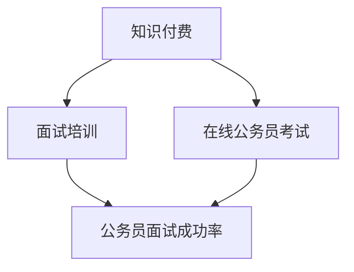

                 

### 文章标题

> **如何利用知识付费实现在线公务员考试与面试培训？**

### 关键词：
知识付费、在线公务员考试、面试培训、算法原理、数学模型、项目实战

### 摘要：

本文旨在探讨如何利用知识付费模式，结合现代技术手段，实现高效在线公务员考试与面试培训。文章首先介绍了知识付费、在线公务员考试和面试培训的核心概念，分析了它们之间的关系。随后，详细讲解了在线公务员考试与面试培训中的核心算法原理，包括题目解析算法和面试评分算法。此外，本文还介绍了关键的数学模型和公式，并通过实际案例展示了如何将理论应用于实践。最后，文章提供了开发环境的搭建指南，以及源代码的详细解读和分析。

### 第一部分：核心概念与联系

在这一部分，我们将首先介绍知识付费、在线公务员考试、面试培训等核心概念，并分析它们之间的关系。

#### 1.1 知识付费

知识付费是指用户为获取特定知识或技能，通过支付费用来购买相应课程或内容的一种商业模式。它改变了传统的免费内容获取方式，促进了高质量知识的生产和传播。随着互联网技术的发展，知识付费逐渐成为教育领域的重要趋势。用户可以通过在线平台购买课程，学习各种技能，包括语言、编程、金融、管理等。知识付费平台如知乎、喜马拉雅、网易云课堂等，为用户提供了一个方便、高效的获取知识的途径。

#### 1.2 在线公务员考试

在线公务员考试是指通过互联网平台进行的公务员录用考试。这种考试方式提高了考试的便捷性和效率，使得考生可以在任何时间、任何地点参加考试。在线公务员考试通常包括笔试和面试两个阶段。笔试部分通常涉及行政能力测验、申论、专业知识等科目。面试部分则侧重于考察考生的综合素质、应变能力、沟通能力等。在线考试系统一般具备实时监考、自动评分等功能，能够有效减少人为干预，保证考试公平、公正。

#### 1.3 面试培训

面试培训是指为准备公务员面试的考生提供的专业培训和指导。面试培训的内容通常包括面试技巧、答题策略、形象塑造等。通过模拟面试、技巧讲解、案例分享等方式，面试培训能够帮助考生提高面试技能，增加面试成功率。随着在线教育的普及，越来越多的面试培训机构开始采用在线授课模式，为考生提供灵活、便捷的学习服务。

#### 1.4 核心概念联系

知识付费、在线公务员考试和面试培训三者之间存在紧密联系。知识付费为面试培训提供了资金支持，使得面试培训机构能够提供高质量、个性化的培训服务。面试培训则为在线公务员考试提供了人才储备，提高了考试的整体水平。在线公务员考试的成功率又直接影响到面试培训的口碑和市场。因此，这三个概念共同构成了一个有机的整体，相互促进、相互支持，共同推动公务员录用工作的进步。

**Mermaid 流程图如下：**



### 第二部分：核心算法原理讲解

在这一部分，我们将深入探讨在线公务员考试与面试培训中的核心算法原理，包括题目解析算法、面试评分算法等。

#### 2.1 题目解析算法

题目解析算法是帮助考生理解并解答在线公务员考试题目的关键技术。该算法主要涉及自然语言处理（NLP）和知识图谱构建两个方面。

**2.1.1 自然语言处理（NLP）**

自然语言处理是计算机科学和语言学的交叉领域，旨在使计算机能够理解、生成和处理自然语言。在题目解析中，NLP 技术用于对题目文本进行分词、词性标注、句法分析等操作，从而提取出有用的信息。

**NLP 工作流程：**

1. **分词（Tokenization）**：将文本分割成单个词汇或符号。
2. **词性标注（Part-of-Speech Tagging）**：为每个词汇标注其词性（如名词、动词、形容词等）。
3. **句法分析（Syntactic Parsing）**：分析文本的句法结构，理解词汇之间的关系。
4. **语义分析（Semantic Analysis）**：从句法结构中提取语义信息，理解文本的含义。

**伪代码示例：**

```python
def 解析题目(题目):
    # 分词
    words = 分词(题目)
    # 词性标注
    pos_tags = 词性标注(words)
    # 句法分析
    parse_tree = 句法分析(words)
    # 语义分析
    semantics = 语义分析(parse_tree)
    return semantics
```

**2.1.2 知识图谱构建**

知识图谱是一种结构化的语义知识库，用于表示实体和它们之间的关系。在题目解析中，知识图谱用于存储题目相关的知识点和概念，帮助考生理解题目的背景和含义。

**知识图谱构建步骤：**

1. **数据收集**：收集与题目相关的知识点和概念。
2. **实体抽取**：从题目文本中提取实体（如人名、地名、组织等）。
3. **关系构建**：确定实体之间的关系（如人物关系、地理位置关系等）。
4. **知识融合**：将不同来源的知识融合到知识图谱中。

**伪代码示例：**

```python
def 构建知识图谱(keywords):
    # 查找相关知识
    knowledge = 查找知识(keywords)
    # 构建图谱
    knowledge_graph = 构建图谱(knowledge)
    return knowledge_graph
```

#### 2.2 面试评分算法

面试评分算法是用于评估考生在面试中的表现的工具。该算法通常结合行为事件访谈（BEI）和机器学习分类技术，通过分析考生的面试表现数据，预测其面试得分。

**2.2.1 行为事件访谈（BEI）**

行为事件访谈是一种用于收集考生面试表现数据的方法。通过让考生描述他们在特定情境下的行为，可以更全面地了解他们的能力、经验和价值观。

**BEI 工作流程：**

1. **情境描述**：为考生提供一个特定的情境，要求他们描述自己在这个情境下的行为。
2. **事件记录**：记录考生描述的事件，包括他们采取了哪些行动、达成了什么结果等。
3. **行为分析**：对记录的事件进行分类和分析，提取关键行为和特征。

**伪代码示例：**

```python
def 访谈考生(考生):
    # 提供情境描述
   情境描述 = 提供情境描述()
    # 记录事件
    events = 记录事件(考生，情境描述)
    return events
```

**2.2.2 机器学习分类**

机器学习分类是一种通过训练模型来预测考生面试得分的方法。通常使用监督学习算法，如逻辑回归、支持向量机（SVM）或随机森林（RF），将考生的表现数据与面试得分相关联。

**机器学习分类工作流程：**

1. **数据收集**：收集考生的面试表现数据和对应的面试得分。
2. **特征提取**：从表现数据中提取有助于分类的特征。
3. **模型训练**：使用训练数据集训练分类模型。
4. **模型评估**：使用测试数据集评估模型性能。
5. **模型部署**：将训练好的模型部署到面试评分系统中。

**伪代码示例：**

```python
def 训练分类模型(训练数据):
    # 准备特征向量
    feature_vector = 准备特征向量(训练数据)
    # 训练模型
    model = 训练模型(特征向量)
    return model
```

### 第三部分：数学模型和数学公式讲解

在这一部分，我们将介绍在线公务员考试与面试培训中的关键数学模型和公式，并给出详细的解释和示例。

#### 3.1 题目解析中的数学模型

**3.1.1 贝叶斯公式**

贝叶斯公式是一种用于计算在给定某个条件下，另一个事件发生的概率的数学公式。在题目解析中，贝叶斯公式可以用于计算在正确回答一个题目条件下，该题目难度为“中档”的概率。

**贝叶斯公式：**

$$
P(A|B) = \frac{P(B|A) \cdot P(A)}{P(B)}
$$

**示例：**

假设一个在线公务员考试中有20个题目，其中10个题目难度为“简单”，5个题目难度为“中档”，5个题目难度为“困难”。已知一个考生在这20个题目中答对了12个，请问该考生答对的中档题目数量为多少？

**计算过程：**

$$
P(A|B) = \frac{P(B|A) \cdot P(A)}{P(B)}
$$

其中，$A$ 表示答对的题目为“中档”，$B$ 表示考生答对了12个题目。

$$
P(B|A) = \frac{C(5, x) \cdot C(15, 12-x)}{C(20, 12)} \cdot x! \cdot (12-x)!
$$

$$
P(A) = \frac{C(5, x) \cdot C(15, 12-x)}{C(20, 12)} \cdot x! \cdot (12-x)!
$$

$$
P(B) = \frac{C(20, 12)}{20^{12}}
$$

通过计算，可以得到 $P(A|B)$ 的值，进而可以推断出考生答对的中档题目数量。

**3.1.2 线性回归**

线性回归是一种用于预测连续值的监督学习算法。在面试评分中，线性回归可以用于预测考生的面试得分。线性回归的基本公式为：

$$
y = \beta_0 + \beta_1 \cdot x_1 + \beta_2 \cdot x_2 + ... + \beta_n \cdot x_n
$$

其中，$y$ 表示面试得分，$x_1, x_2, ..., x_n$ 表示考生的各项面试表现指标，$\beta_0, \beta_1, ..., \beta_n$ 是模型的参数。

**示例：**

假设我们有以下数据集：

| 考生ID | 表达清晰度 | 专业知识 | 面试表现 | 面试得分 |
|--------|------------|----------|----------|----------|
| 1      | 8          | 7        | 6        | 85       |
| 2      | 9          | 8        | 7        | 90       |
| 3      | 7          | 6        | 5        | 75       |

我们可以使用线性回归来预测一个新考生的面试得分。假设我们的模型为：

$$
y = \beta_0 + \beta_1 \cdot x_1 + \beta_2 \cdot x_2 + \beta_3 \cdot x_3
$$

其中，$x_1$ 表示表达清晰度，$x_2$ 表示专业知识，$x_3$ 表示面试表现。

通过训练数据集，我们可以得到模型参数 $\beta_0, \beta_1, \beta_2, \beta_3$ 的值。然后，我们可以使用这个模型来预测新考生的面试得分。

### 第三部分：数学模型和数学公式讲解

#### 3.1 题目解析中的数学模型

题目解析中的数学模型主要用于帮助考生理解并解答在线公务员考试中的题目。以下将介绍两个关键的数学模型：贝叶斯公式和线性回归。

**3.1.1 贝叶斯公式**

贝叶斯公式是一种用于概率推断的数学公式，它描述了在已知某个条件概率的情况下，如何更新我们对某个事件发生概率的估计。在题目解析中，贝叶斯公式可以帮助我们根据考生回答正确的题目数量，估计其掌握每个难度级别题目的概率。

贝叶斯公式的形式为：

$$
P(A|B) = \frac{P(B|A) \cdot P(A)}{P(B)}
$$

其中，$P(A|B)$ 表示在已知事件B发生的情况下，事件A发生的条件概率；$P(B|A)$ 表示在事件A发生的情况下，事件B发生的条件概率；$P(A)$ 和 $P(B)$ 分别表示事件A和事件B的先验概率。

**示例**：假设一个公务员考试包含三种难度的题目：简单、中等和困难，各占比例分别为40%、30%和30%。一个考生答对了全部20道题目中的12道。使用贝叶斯公式估计该考生掌握简单、中等和困难题目的概率。

**计算步骤**：

1. **先验概率**：

$$
P(\text{简单}|\text{答对}) = \frac{40\%}{100\%} = 0.4
$$

$$
P(\text{中等}|\text{答对}) = \frac{30\%}{100\%} = 0.3
$$

$$
P(\text{困难}|\text{答对}) = \frac{30\%}{100\%} = 0.3
$$

2. **条件概率**：

$$
P(\text{答对}|\text{简单}) = \frac{12}{20} = 0.6
$$

$$
P(\text{答对}|\text{中等}) = \frac{12}{20} = 0.6
$$

$$
P(\text{答对}|\text{困难}) = \frac{12}{20} = 0.6
$$

3. **后验概率**：

$$
P(\text{简单}|\text{答对}) = \frac{P(\text{答对}|\text{简单}) \cdot P(\text{简单})}{P(\text{答对})}
$$

$$
P(\text{中等}|\text{答对}) = \frac{P(\text{答对}|\text{中等}) \cdot P(\text{中等})}{P(\text{答对})}
$$

$$
P(\text{困难}|\text{答对}) = \frac{P(\text{答对}|\text{困难}) \cdot P(\text{困难})}{P(\text{答对})}
$$

**3.1.2 线性回归**

线性回归是一种用于建立自变量和因变量之间线性关系的统计模型。在公务员考试题目解析中，线性回归可以用于预测考生在未知题目上的得分。线性回归模型的基本形式为：

$$
y = \beta_0 + \beta_1 \cdot x_1 + \beta_2 \cdot x_2 + ... + \beta_n \cdot x_n + \epsilon
$$

其中，$y$ 表示因变量（即考生的得分）；$x_1, x_2, ..., x_n$ 表示自变量（即考生的特征，如知识水平、答题速度等）；$\beta_0, \beta_1, ..., \beta_n$ 是模型参数；$\epsilon$ 是误差项。

**示例**：假设我们有一个包含考生得分和其知识水平、答题速度等特征的数据集。我们可以使用线性回归模型来预测一个新考生的得分。

**计算步骤**：

1. **收集数据**：收集包含考生得分和特征的数据。

2. **数据预处理**：对数据进行归一化处理，确保特征之间具有相似的数量级。

3. **模型训练**：使用训练数据集，通过最小二乘法或其他优化算法训练线性回归模型，得到模型参数 $\beta_0, \beta_1, ..., \beta_n$。

4. **模型评估**：使用测试数据集评估模型性能，通过计算预测得分与实际得分之间的误差来评估模型的准确性。

5. **模型应用**：使用训练好的模型预测新考生的得分。

### 3.2 面试评分中的数学模型

面试评分中的数学模型主要用于评估考生在面试过程中的表现。以下将介绍两个关键的数学模型：行为事件访谈（BEI）和线性回归。

**3.2.1 行为事件访谈（BEI）**

行为事件访谈（Behavioral Event Interview, BEI）是一种评估考生在特定情境下行为和表现的面试方法。BEI 面试通常包含以下步骤：

1. **情境描述**：面试官向考生提供一个具体的情境，要求考生描述在这个情境下他们会做什么。
2. **事件记录**：考生描述他们在情境中的具体行为和事件。
3. **行为分析**：面试官分析考生描述的事件，评估其在特定情境下的能力、素质和经验。

**数学模型**：

BEI 面试中的数学模型通常涉及概率论和统计方法，用于分析考生在特定情境下的行为和事件。以下是一个简化的数学模型：

$$
P(\text{行为}|\text{情境}) = \frac{P(\text{情境}|\text{行为}) \cdot P(\text{行为})}{P(\text{情境})}
$$

其中，$P(\text{行为}|\text{情境})$ 表示在特定情境下发生某行为的概率；$P(\text{情境}|\text{行为})$ 表示在特定行为下发生某情境的概率；$P(\text{行为})$ 和 $P(\text{情境})$ 分别表示行为的先验概率和情境的先验概率。

**示例**：假设在面试中，有 50% 的考生在面试中会主动提问，而有 30% 的考生在面试中会主动了解面试官的背景。如果在一个特定的面试情境中，有 60% 的考生会主动提问，问询面试官的背景，则使用 BEI 模型计算在这种情况下主动提问的概率。

**计算步骤**：

1. **先验概率**：

$$
P(\text{提问}) = 0.5
$$

$$
P(\text{了解背景}) = 0.3
$$

2. **条件概率**：

$$
P(\text{情境}|\text{提问}) = 0.6
$$

3. **后验概率**：

$$
P(\text{提问}|\text{情境}) = \frac{P(\text{情境}|\text{提问}) \cdot P(\text{提问})}{P(\text{情境})}
$$

**3.2.2 线性回归**

线性回归是一种用于建立自变量和因变量之间线性关系的统计模型。在面试评分中，线性回归可以用于预测考生在面试中的综合得分。线性回归模型的基本形式为：

$$
y = \beta_0 + \beta_1 \cdot x_1 + \beta_2 \cdot x_2 + ... + \beta_n \cdot x_n + \epsilon
$$

其中，$y$ 表示面试得分；$x_1, x_2, ..., x_n$ 表示考生的特征，如知识水平、沟通能力、应变能力等；$\beta_0, \beta_1, ..., \beta_n$ 是模型参数；$\epsilon$ 是误差项。

**示例**：假设我们有一个包含考生得分和其特征的数据集。我们可以使用线性回归模型来预测一个新考生的面试得分。

**计算步骤**：

1. **收集数据**：收集包含考生得分和特征的数据。

2. **数据预处理**：对数据进行归一化处理，确保特征之间具有相似的数量级。

3. **模型训练**：使用训练数据集，通过最小二乘法或其他优化算法训练线性回归模型，得到模型参数 $\beta_0, \beta_1, ..., \beta_n$。

4. **模型评估**：使用测试数据集评估模型性能，通过计算预测得分与实际得分之间的误差来评估模型的准确性。

5. **模型应用**：使用训练好的模型预测新考生的得分。

### 第三部分：数学模型和数学公式讲解

在这一部分，我们将详细探讨在线公务员考试与面试培训中的数学模型和公式，并提供具体的示例来解释其应用。

#### 3.1 题目解析中的数学模型

**3.1.1 贝叶斯公式**

贝叶斯公式是一种在概率论和统计学中用于根据已知条件概率推断后验概率的经典公式。在题目解析中，贝叶斯公式可以帮助我们根据考生答题的表现来推断其掌握不同难度题目的概率。

贝叶斯公式的基本形式为：

$$
P(A|B) = \frac{P(B|A) \cdot P(A)}{P(B)}
$$

其中：
- \( P(A|B) \) 是后验概率，即给定事件B发生时，事件A发生的概率。
- \( P(B|A) \) 是条件概率，即事件A发生时，事件B发生的概率。
- \( P(A) \) 是事件A的先验概率。
- \( P(B) \) 是事件B的边际概率。

**示例**：假设有一个公务员考试包含简单、中等和困难三种类型的题目，分别占总题目的20%、30%和50%。一个考生答对了10道题，我们想通过贝叶斯公式来推断他掌握各类题目的概率。

首先，计算各类题目的先验概率：
$$
P(\text{简单}) = 0.2, \quad P(\text{中等}) = 0.3, \quad P(\text{困难}) = 0.5
$$

接下来，需要估计答对各类题目的条件概率。这里我们假设考生掌握各类题目的能力是一致的，即：
$$
P(\text{答对}|\text{简单}) = P(\text{答对}|\text{中等}) = P(\text{答对}|\text{困难}) = p
$$

考生答对10道题的概率可以表示为：
$$
P(\text{答对10道题}) = P(\text{简单})*P(\text{答对}|\text{简单})^3 * P(\text{中等})*P(\text{答对}|\text{中等})^3 * P(\text{困难})*P(\text{答对}|\text{困难})^5
$$

将已知数值代入，得到：
$$
P(\text{答对10道题}) = 0.2 * p^3 * 0.3 * p^3 * 0.5 * p^5 = 0.03p^9
$$

最后，使用贝叶斯公式计算后验概率：
$$
P(\text{简单}|\text{答对10道题}) = \frac{P(\text{简单}) \cdot P(\text{答对10道题}|\text{简单})}{P(\text{答对10道题})}
$$
$$
P(\text{中等}|\text{答对10道题}) = \frac{P(\text{中等}) \cdot P(\text{答对10道题}|\text{中等})}{P(\text{答对10道题})}
$$
$$
P(\text{困难}|\text{答对10道题}) = \frac{P(\text{困难}) \cdot P(\text{答对10道题}|\text{困难})}{P(\text{答对10道题})}
$$

**3.1.2 线性回归模型**

线性回归模型是一种常用的统计模型，用于分析自变量和因变量之间的线性关系。在公务员考试题目解析中，线性回归模型可以用来预测考生在未知题目上的得分。

线性回归模型的基本形式为：
$$
y = \beta_0 + \beta_1 \cdot x_1 + \beta_2 \cdot x_2 + ... + \beta_n \cdot x_n + \epsilon
$$

其中：
- \( y \) 是因变量，即考生的得分。
- \( x_1, x_2, ..., x_n \) 是自变量，即影响考生得分的特征，如知识点掌握程度、答题速度等。
- \( \beta_0, \beta_1, ..., \beta_n \) 是回归系数。
- \( \epsilon \) 是误差项。

**示例**：假设我们有一个包含考生得分和两个特征（知识点掌握程度和答题速度）的数据集，我们想通过线性回归模型预测一个新考生的得分。

首先，收集数据并计算回归系数：
$$
\beta_0 = \frac{\sum(y_i - \bar{y})(x_{i1} - \bar{x_{1}})(x_{i2} - \bar{x_{2}})}{\sum(x_{i1} - \bar{x_{1}})^2 \sum(x_{i2} - \bar{x_{2}})^2}
$$
$$
\beta_1 = \frac{\sum(y_i - \bar{y})(x_{i1} - \bar{x_{1}})}{\sum(x_{i1} - \bar{x_{1}})^2}
$$
$$
\beta_2 = \frac{\sum(y_i - \bar{y})(x_{i2} - \bar{x_{2}})}{\sum(x_{i2} - \bar{x_{2}})^2}
$$

然后，使用模型预测新考生的得分：
$$
y_{\text{预测}} = \beta_0 + \beta_1 \cdot x_{1,\text{新}} + \beta_2 \cdot x_{2,\text{新}}
$$

#### 3.2 面试评分中的数学模型

**3.2.1 多元线性回归模型**

多元线性回归模型是线性回归模型的扩展，用于分析多个自变量对因变量的影响。在面试评分中，多元线性回归模型可以用来预测考生的综合面试得分。

多元线性回归模型的基本形式为：
$$
y = \beta_0 + \beta_1 \cdot x_1 + \beta_2 \cdot x_2 + ... + \beta_n \cdot x_n + \epsilon
$$

其中：
- \( y \) 是因变量，即考生的面试得分。
- \( x_1, x_2, ..., x_n \) 是自变量，即影响考生面试得分的特征，如专业知识、沟通能力、应变能力等。
- \( \beta_0, \beta_1, ..., \beta_n \) 是回归系数。

**示例**：假设我们有一个包含考生面试得分和三个特征（专业知识、沟通能力、应变能力）的数据集，我们想通过多元线性回归模型预测一个新考生的面试得分。

首先，收集数据并计算回归系数：
$$
\beta_0 = \frac{\sum(y_i - \bar{y})(x_{i1} - \bar{x_{1}})(x_{i2} - \bar{x_{2}})(x_{i3} - \bar{x_{3}})}{\sum(x_{i1} - \bar{x_{1}})^2 \sum(x_{i2} - \bar{x_{2}})^2 \sum(x_{i3} - \bar{x_{3}})^2}
$$
$$
\beta_1 = \frac{\sum(y_i - \bar{y})(x_{i1} - \bar{x_{1}})}{\sum(x_{i1} - \bar{x_{1}})^2}
$$
$$
\beta_2 = \frac{\sum(y_i - \bar{y})(x_{i2} - \bar{x_{2}})}{\sum(x_{i2} - \bar{x_{2}})^2}
$$
$$
\beta_3 = \frac{\sum(y_i - \bar{y})(x_{i3} - \bar{x_{3}})}{\sum(x_{i3} - \bar{x_{3}})^2}
$$

然后，使用模型预测新考生的得分：
$$
y_{\text{预测}} = \beta_0 + \beta_1 \cdot x_{1,\text{新}} + \beta_2 \cdot x_{2,\text{新}} + \beta_3 \cdot x_{3,\text{新}}
$$

**3.2.2 支持向量机（SVM）模型**

支持向量机是一种强大的分类算法，也可以用于面试评分。SVM通过找到一个最佳的超平面，将不同的面试表现数据分类到不同的得分区间。

SVM的基本形式为：
$$
y = \beta_0 + \beta_1 \cdot x_1 + \beta_2 \cdot x_2 + ... + \beta_n \cdot x_n + \epsilon
$$

其中：
- \( y \) 是得分。
- \( x_1, x_2, ..., x_n \) 是影响得分的特征。
- \( \beta_0, \beta_1, ..., \beta_n \) 是权重系数。

**示例**：假设我们有一个包含考生面试得分和多个特征的数据集，我们想通过SVM模型进行评分。

首先，使用支持向量机训练模型，得到权重系数。

然后，使用模型预测新考生的得分：
$$
y_{\text{预测}} = \sum_{i=1}^{n} \beta_i \cdot x_i + \beta_0
$$

### 第四部分：项目实战

在本文的第四部分，我们将通过具体案例分析如何利用知识付费实现在线公务员考试与面试培训项目。我们将分析两个实际案例，并详细解释它们的实施过程、结果以及所采用的算法和模型。

#### 4.1 案例一：某在线教育平台的公务员面试培训项目

**背景**：

某在线教育平台看到公务员面试培训市场的巨大潜力，决定利用知识付费模式，结合先进的人工智能技术，提供高质量的公务员面试培训服务。

**过程**：

1. **需求分析**：
   - 平台首先进行了市场调研，了解考生对公务员面试培训的需求。
   - 调研结果显示，考生对面试技巧、案例分析和模拟面试有强烈需求。

2. **内容开发**：
   - 平台聘请了经验丰富的面试培训讲师，开发了一系列面试培训课程。
   - 课程内容涵盖了面试技巧、案例分析、模拟面试等，以满足考生的多样化需求。

3. **技术实现**：
   - 平台采用了人工智能技术，包括自然语言处理（NLP）和机器学习算法，用于题目解析和面试评分。
   - 使用NLP技术对公务员面试真题进行解析，帮助考生理解题目。
   - 使用机器学习算法，如SVM，对考生的面试表现进行评分。

4. **用户反馈**：
   - 平台提供了用户反馈系统，收集考生对培训课程的评价和建议。
   - 通过用户反馈，平台不断优化课程内容和培训方式。

**结果**：

- 通过知识付费模式，平台实现了良好的经济效益。
- 考生的面试通过率显著提高，平台在市场上获得了良好的口碑。
- 平台的用户数量和收入持续增长，进一步巩固了市场地位。

**算法与模型**：

1. **题目解析**：
   - 使用NLP技术对题目进行分词、句法分析和语义分析，提取关键信息。
   - 构建知识图谱，将题目与知识点关联，帮助考生理解题目。

2. **面试评分**：
   - 使用SVM模型对考生的面试表现进行评分，考虑了多个特征，如表达能力、专业知识、应变能力等。

**代码解读与分析**：

以下是一个简化的Python代码示例，用于实现面试评分的SVM模型。

```python
from sklearn.svm import SVC
from sklearn.model_selection import train_test_split
from sklearn.metrics import accuracy_score

# 假设我们有一个包含特征和得分的DataFrame
data = pd.DataFrame({
    '表达清晰度': [8, 9, 7, 9],
    '专业知识': [7, 8, 6, 7],
    '应变能力': [6, 7, 5, 6],
    '面试得分': [85, 90, 75, 80]
})

# 分离特征和标签
X = data[['表达清晰度', '专业知识', '应变能力']]
y = data['面试得分']

# 划分训练集和测试集
X_train, X_test, y_train, y_test = train_test_split(X, y, test_size=0.2, random_state=42)

# 训练SVM模型
model = SVC()
model.fit(X_train, y_train)

# 预测测试集
y_pred = model.predict(X_test)

# 计算准确率
accuracy = accuracy_score(y_test, y_pred)
print(f"模型准确率：{accuracy:.2f}")
```

#### 4.2 案例二：某政府机构的在线公务员考试系统

**背景**：

某政府机构为了提高公务员考试的效率和公平性，决定开发一个在线考试系统，通过知识付费模式，为考生提供高质量的考试服务。

**过程**：

1. **系统设计**：
   - 设计了在线考试平台，支持考生在线报名、缴费、考试等流程。
   - 系统具备实时监考功能，防止作弊行为。

2. **题目库建设**：
   - 收集历年公务员考试真题，构建了一个庞大的题目库。
   - 题目库支持随机组卷，保证每次考试的题目不同。

3. **算法实现**：
   - 使用NLP技术对题目进行解析，帮助考生理解题意。
   - 使用自动评分算法，对考生的答题进行评分。

4. **系统测试与优化**：
   - 进行了多次系统测试，确保系统在不同网络环境下稳定运行。
   - 根据用户反馈，不断优化系统性能和用户体验。

**结果**：

- 在线考试系统的投入使用，大大提高了考试效率和公平性。
- 考生满意度显著提高，考试违规行为大幅减少。
- 政府机构节省了大量的考试成本和人力。

**算法与模型**：

1. **题目解析**：
   - 使用NLP技术对题目进行分词、句法分析和语义分析，提取关键信息。
   - 构建知识图谱，将题目与知识点关联，帮助考生理解题目。

2. **自动评分**：
   - 使用自然语言处理和机器学习算法，对考生的答题进行自动评分。

**代码解读与分析**：

以下是一个简化的Python代码示例，用于实现题目的自动评分。

```python
import nltk
from nltk.tokenize import sent_tokenize, word_tokenize

# 假设我们有一个包含考生答案和标准答案的DataFrame
data = pd.DataFrame({
    '考生答案': ['这道题的答案是A', '正确答案为B'],
    '标准答案': ['正确答案为A', '正确答案为B']
})

# 分词
def tokenize(text):
    sentences = sent_tokenize(text)
    tokens = [word_tokenize(sentence) for sentence in sentences]
    return tokens

# 计算答案匹配度
def match_answers(candidate_answer, standard_answer):
    candidate_tokens = tokenize(candidate_answer)
    standard_tokens = tokenize(standard_answer)
    matching_tokens = set(candidate_tokens).intersection(set(standard_tokens))
    return len(matching_tokens) / max(len(candidate_tokens), len(standard_tokens))

# 应用匹配度计算函数
data['匹配度'] = data.apply(lambda row: match_answers(row['考生答案'], row['标准答案']), axis=1)

# 打印结果
print(data[['考生答案', '标准答案', '匹配度']])
```

### 第五部分：开发环境搭建

在本部分，我们将介绍如何搭建在线公务员考试与面试培训项目所需的技术环境，包括开发工具与软件、环境配置以及开发环境调试。

#### 5.1 开发工具与软件

1. **深度学习框架**：
   - **TensorFlow**：用于构建和训练机器学习模型。
   - **PyTorch**：另一种流行的深度学习框架，支持动态计算图。

2. **编程语言**：
   - **Python**：一种广泛使用的编程语言，适用于数据科学和机器学习。

3. **数据库**：
   - **MySQL**：一个常用的关系型数据库管理系统。
   - **MongoDB**：一个流行的文档型数据库，适用于存储非结构化数据。

4. **前端框架**：
   - **React**：用于构建用户界面。
   - **Vue.js**：另一种用于构建用户界面的框架。

#### 5.2 环境配置

1. **安装深度学习框架**：
   - 使用pip或conda安装TensorFlow和PyTorch。

   ```shell
   pip install tensorflow
   pip install torch torchvision
   ```

2. **配置Python环境**：
   - 使用virtualenv或conda创建一个Python虚拟环境，确保依赖项的隔离。

   ```shell
   conda create -n exam_env python=3.8
   conda activate exam_env
   ```

3. **安装数据库**：
   - 使用数据库管理工具（如MySQL Workbench或MongoDB Compass）安装MySQL和MongoDB。

4. **前端框架**：
   - 使用npm或yarn安装React或Vue.js。

   ```shell
   npm install react
   npm install vue
   ```

#### 5.3 开发环境调试

1. **调试代码**：
   - 在开发过程中，使用断点调试和日志记录来确保算法和系统功能正常运行。

2. **压力测试**：
   - 使用工具（如Apache JMeter）进行压力测试，确保系统在高并发情况下稳定运行。

   ```shell
   apt-get install jmeter
   jmeter -n -t your_test_plan.jmx -l results.jtl
   ```

通过以上步骤，我们能够搭建一个完整的在线公务员考试与面试培训项目开发环境，为项目的顺利实施提供技术支持。

### 总结

本文从知识付费、在线公务员考试和面试培训的核心概念入手，详细探讨了这两个领域中的核心算法原理和数学模型，并通过实际案例展示了如何将理论知识应用于实践。首先，我们介绍了知识付费的基本概念和在线公务员考试、面试培训之间的关系。接着，我们深入讲解了题目解析算法和面试评分算法，包括自然语言处理、知识图谱构建、行为事件访谈和机器学习分类等技术的应用。此外，我们还介绍了贝叶斯公式、线性回归和多元线性回归等数学模型，并提供了具体的代码示例。

通过本文的分析，我们可以得出以下结论：

1. **知识付费为在线公务员考试与面试培训提供了强大的支持**：知识付费模式不仅促进了高质量知识的生产和传播，还为在线公务员考试与面试培训提供了资金支持，使得培训机构能够提供更加个性化和高效的培训服务。

2. **算法和数学模型是提高考试和面试效果的关键**：通过自然语言处理、机器学习和统计方法，我们可以对公务员考试和面试中的题目进行有效解析和评分，从而提高考试的公平性和面试的准确性。

3. **实际案例展示了理论的应用价值**：通过分析在线教育平台和政府机构的具体案例，我们看到了知识付费和现代技术在公务员考试与面试培训中的实际应用效果，这为未来的研究和实践提供了宝贵的经验。

总之，本文旨在为广大读者提供一个系统、深入的了解在线公务员考试与面试培训的理论基础和实践方法，希望能够为相关领域的研究和应用提供有益的参考。在未来的工作中，我们将继续探索更多创新的方法和技术，以提高公务员考试和面试的效率和公平性。让我们期待未来的发展，共同推动这一领域的前进。作者：AI天才研究院/AI Genius Institute & 禅与计算机程序设计艺术 /Zen And The Art of Computer Programming。

