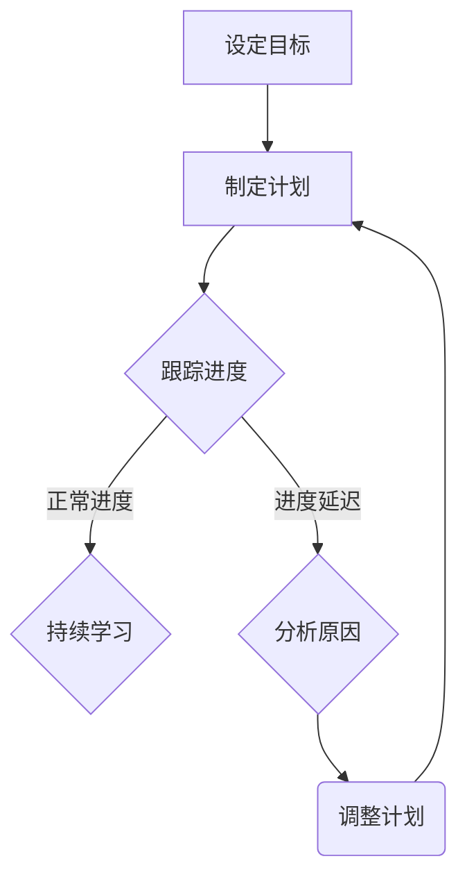
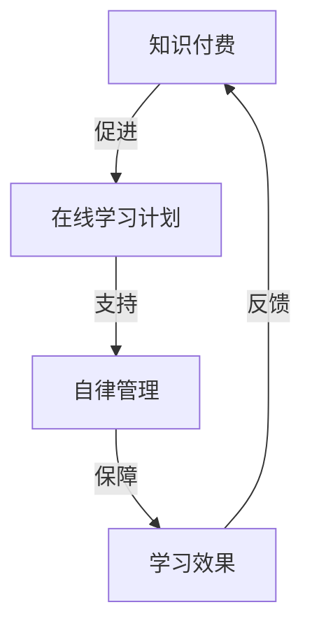

                 

## 如何利用知识付费实现在线学习计划与自律管理？

### 关键词：

- 知识付费
- 在线学习
- 自律管理
- 学习计划
- 效率提升

### 摘要：

本文深入探讨了如何通过知识付费来构建和实施有效的在线学习计划，以及如何通过自律管理来保证学习计划的执行和效果。文章分为六个部分，首先介绍了知识付费和在线学习的兴起与重要性，然后详细讲解了如何制定和执行有效的学习计划，以及如何培养自律管理的思维方式。接着，通过实际案例解析展示了知识付费、在线学习与自律管理的相互关系，最后提出了持续进步与自我提升的策略和方法。本文旨在帮助读者理解和应用这些策略，实现自我提升和职业发展。

### 目录大纲：

1. **知识付费与在线学习概述**
2. **构建有效的在线学习计划**
3. **自律管理的实践与技巧**
4. **在线学习与自律管理案例解析**
5. **持续进步与自我提升**
6. **附录**

---

### 1. 知识付费与在线学习概述

#### 1.1. 知识付费的兴起与发展

知识付费，作为现代信息时代的一种新型商业模式，其核心在于用户通过付费获取高质量的知识内容或服务。这种模式的出现，不仅满足了用户对优质教育资源的需求，也推动了知识经济和共享经济的发展。

##### 1.1.1 知识付费的定义与特点

知识付费通常指的是用户通过购买课程、电子书、讲座等形式，获取有价值的信息和知识。其主要特点包括：

- **高质量内容**：知识付费平台通常提供经过专业筛选和严格审核的内容，确保用户获得高质量的学习资源。
- **个性化服务**：知识付费平台可以根据用户的需求和兴趣，推荐个性化的学习资源。
- **付费激励机制**：通过付费，用户更加有动力去学习，进而提高学习效果。

##### 1.1.2 知识付费市场的现状与趋势

随着互联网技术的发展，知识付费市场呈现出快速增长的趋势。根据相关报告，知识付费市场规模逐年扩大，用户数量也不断增加。以下是一些关键点：

- **市场规模扩大**：知识付费市场规模持续扩大，预计未来几年仍将保持高速增长。
- **用户群体扩大**：知识付费用户不仅包括职场人士，还包括学生、家庭主妇等多元化群体。
- **行业多元化**：知识付费不仅涵盖教育培训，还延伸到兴趣爱好、职业技能等多个领域。

##### 1.1.3 知识付费与在线学习的关系

知识付费与在线学习是相互促进的关系。在线学习提供了灵活的学习方式，而知识付费则为在线学习提供了高质量的内容支持。以下是它们之间的主要关系：

- **内容支持**：知识付费平台提供了丰富的学习资源，为在线学习提供了有力的支持。
- **付费激励机制**：知识付费让用户更有动力去学习，提高了在线学习的参与度和效果。
- **平台运营**：知识付费为在线学习平台提供了稳定的收入来源，促进了平台的发展和创新。

---

#### 1.2. 在线学习计划与自律管理的重要性

##### 1.2.1 在线学习计划的制定与执行

在线学习计划是指为了实现特定的学习目标，通过规划学习内容、时间和方式，制定出的具体学习计划。一个好的在线学习计划需要考虑以下几个方面：

- **明确的学习目标**：确定具体的学习目标，使学习过程更有方向性和针对性。
- **合理的学习时间**：合理安排学习时间，确保学习计划的顺利执行。
- **有效的学习方式**：根据学习内容的复杂度和自己的学习习惯，选择合适的学习方式。
- **持续的学习评估**：定期评估学习进度和效果，及时调整学习计划。

##### 1.2.2 自律管理的核心原则与方法

自律管理是指通过自我约束和自我管理，实现学习目标的过程。自律管理需要遵循以下核心原则：

- **目标明确**：明确学习目标，使自律管理有清晰的方向。
- **计划执行**：严格执行学习计划，确保学习进度不受干扰。
- **自我监控**：定期检查学习进度，及时发现和纠正偏差。
- **持续激励**：给自己设定奖励机制，提高自律性。

##### 1.2.3 在线学习与自律管理的相互促进

在线学习与自律管理是相辅相成的。在线学习提供了灵活的学习方式和丰富的学习资源，而自律管理则保证了学习计划的顺利执行和学习效果的提升。以下是它们之间的相互促进作用：

- **提高学习效率**：在线学习提供了丰富的学习资源，自律管理保证了学习计划的执行，二者结合，大大提高了学习效率。
- **增强学习动力**：知识付费让用户更有动力去学习，自律管理则让用户能够持续保持学习的动力。
- **实现学习目标**：通过在线学习，用户可以获得丰富的知识资源，通过自律管理，用户可以确保学习目标的实现。

---

通过上述分析，我们可以看到，知识付费、在线学习计划与自律管理是相互关联、相互促进的。只有充分利用知识付费的优势，制定和执行有效的在线学习计划，并培养自律管理的思维方式，才能实现自我提升和职业发展。接下来，我们将进一步探讨如何构建有效的在线学习计划。

---

### 2. 构建有效的在线学习计划

有效的在线学习计划是实现学习目标的关键。一个完整的在线学习计划应包括明确的学习目标、合理的学习时间安排、合适的学习资源和有效的学习评估机制。以下是一系列步骤和技巧，帮助你构建一个高效的在线学习计划。

#### 2.1. 确定学习目标与需求

制定在线学习计划的第一步是明确学习目标和需求。这包括以下几个关键点：

- **设定明确的学习目标**：首先，你需要确定具体的学习目标。例如，想要掌握一项新技能、通过某个专业考试，或者提升自己的工作效率。明确的目标有助于你集中精力和资源。
  
- **分析自身的学习需求**：了解自己的学习需求是非常重要的。这可能包括你的现有知识水平、学习偏好、时间安排等。通过分析这些因素，你可以更好地设计适合自己的学习计划。

- **制定符合自身特点的学习计划**：根据你的学习目标和需求，制定一个切实可行的学习计划。这个计划应该考虑到你的时间、资源和个人能力，确保你能坚持并顺利完成。

#### 2.2. 选择合适的在线学习资源

选择合适的在线学习资源是确保学习计划成功的关键。以下是一些选择和利用在线学习资源的建议：

- **识别优质的学习资源**：在众多在线学习资源中，如何识别优质资源是一个重要的问题。你可以参考以下标准：

  - **专业性和权威性**：选择那些由专业机构和专家提供的课程或教材。
  - **用户评价**：查看其他用户对该资源的评价，了解其有效性和实用性。
  - **内容丰富度**：选择内容丰富、讲解详细的资源，以确保你能够全面掌握所学知识。

- **利用在线学习平台**：如今，有许多在线学习平台可供选择，如Coursera、edX、Udemy等。这些平台提供了丰富的课程资源，你可以在其中找到适合自己需求的学习资源。

- **多元化学习资源的利用**：除了在线课程，你还可以利用其他在线学习资源，如电子书、学术论文、技术博客等。多元化学习资源有助于你从不同角度理解学习内容。

#### 2.3. 设计有效的学习计划

一个有效的学习计划不仅需要明确的学习目标和合适的学习资源，还需要详细的学习计划和时间安排。以下是一些建议：

- **制定详细的学习计划**：你的学习计划应该包括以下内容：

  - **学习内容**：列出你需要学习的主要内容和知识点。
  - **学习时间**：合理安排学习时间，确保有足够的时间来学习每一个知识点。
  - **学习进度**：设定每个阶段的学习目标，确保学习计划能够逐步推进。

- **制定学习时间表**：将学习计划转化为具体的时间表，明确每天、每周的学习任务。这有助于你更好地管理时间，避免拖延。

- **定期调整与优化学习计划**：学习过程中，你可能需要根据实际情况调整学习计划。例如，当你发现某个知识点难以理解时，可以安排更多时间来学习。定期调整和优化学习计划，确保其始终与你的学习目标一致。

---

通过以上步骤，你可以构建一个有效的在线学习计划。接下来，我们将探讨如何通过自律管理来保证学习计划的执行和效果。

---

### 3. 自律管理的实践与技巧

自律管理是确保在线学习计划顺利执行的关键。它不仅仅是一种管理技能，更是一种思维方式和生活习惯。以下是一些自律管理的核心原则、培养自律管理习惯的技巧，以及一些实用的自律管理方法。

#### 3.1. 建立自律管理的思维方式

要实现自律管理，首先需要建立正确的思维方式。以下是几个关键原则：

- **目标导向**：明确你的学习目标，将注意力集中在实现目标上。每次学习前，都要问自己：“我今天的任务是什么？我该如何完成它？”

- **自我监控**：时刻关注自己的学习进度和效果。定期检查自己的学习计划是否执行到位，是否存在偏差。如果发现问题，要及时调整。

- **自我激励**：给自己设定奖励机制，每当完成一个学习任务或达到一个学习目标时，给予自己适当的奖励。这有助于提高自律性。

- **积极态度**：保持积极的学习态度，即使在遇到困难时也要坚持。相信自己能够克服困难，实现学习目标。

#### 3.2. 培养自律管理的习惯

自律管理不是一蹴而就的，需要通过长期的实践和培养来形成习惯。以下是一些培养自律管理习惯的技巧：

- **制定每日计划**：每天早上制定一个详细的计划，包括学习任务、工作和休息时间。遵循这个计划，有助于提高时间管理能力。

- **记录学习进度**：定期记录自己的学习进度和成果。这不仅可以让你看到自己的进步，还能激励你继续努力。

- **保持学习环境**：创造一个有利于学习的环境，减少干扰和诱惑。例如，关闭手机、清理工作台等。

- **坚持锻炼**：适当的锻炼可以提高身体素质，增强自律管理能力。每天安排一定时间进行锻炼，如晨跑、瑜伽等。

#### 3.3. 自律管理的思维模式

自律管理不仅是一种习惯，更是一种思维模式。以下是几种常见的自律管理思维模式：

- **系统思维**：将学习视为一个系统工程，从整体上考虑学习目标、资源和时间安排。通过系统思维，你可以更全面地规划学习过程。

- **持续进步**：将学习视为一个持续的过程，不断反思和改进。通过持续进步，你可以不断提高学习效果。

- **问题导向**：将学习过程中遇到的问题视为机会，通过解决问题来提高自己的能力。问题导向思维有助于你深入理解和掌握所学知识。

---

通过以上方法，你可以逐步培养自律管理的思维模式。接下来，我们将通过实际案例来展示如何通过自律管理来保证在线学习计划的执行和效果。

---

### 4. 在线学习与自律管理案例解析

为了更好地理解如何利用知识付费实现在线学习计划与自律管理，我们将通过以下几个成功案例来解析在线学习与自律管理的关系，以及它们在实际应用中的效果。

#### 4.1. 成功案例分享

##### 4.1.1 知识付费与在线学习的成功案例

**案例1：李明的编程学习之旅**

李明是一名软件工程师，他希望通过在线学习提升自己的编程技能。他选择了一个知名的在线学习平台，购买了多门编程课程，如Python基础、数据结构与算法等。在制定学习计划时，李明明确了具体的学习目标，包括掌握Python语言、能够独立完成算法设计和项目开发。他制定了详细的学习计划，每天安排2-3小时的学习时间，并设定每周的复习和测试计划。

李明通过知识付费获得了高质量的学习资源，同时通过自律管理保证了学习计划的执行。他在学习过程中，定期进行自我评估，及时发现并解决问题。经过半年的努力，李明不仅成功掌握了Python编程，还完成了几个小项目，他的工作效率和代码质量得到了显著提升。

##### 4.1.2 自律管理的成功实践案例

**案例2：张丽的英语学习之路**

张丽是一名职场人士，她希望通过学习英语提升自己的职场竞争力。她报名参加了一个英语学习班，并使用了一些自律管理工具，如Trello和时间管理软件。张丽设定了每天至少学习1小时的英语目标，并在Trello上创建了一个学习任务板，将每天的学习任务分解成小部分，如词汇学习、听力训练、阅读练习等。

通过自律管理，张丽能够坚持每天学习英语，并逐渐养成了良好的学习习惯。她在学习过程中，定期进行自我评估，并根据评估结果调整学习计划。经过一年的努力，张丽的英语水平显著提高，她在职场中的沟通能力和团队协作能力也得到了提升。

##### 4.1.3 综合成功的案例分析

**案例3：李华的职业发展计划**

李华是一名市场营销经理，他希望通过在线学习和自律管理实现职业晋升。他报名参加了多个与市场营销相关的在线课程，如数字营销、社交媒体营销等。在制定学习计划时，李华不仅考虑了课程内容，还结合了公司的业务需求和个人的职业规划。

李华通过知识付费获得了高质量的学习资源，同时通过自律管理确保了学习计划的执行。他每天早晨花30分钟复习前一天的学习内容，并在Trello上记录每天的学习进度。每周，他会进行一次全面的学习评估，并根据评估结果调整学习计划。经过两年的努力，李华成功晋升为市场营销总监，他的职业生涯取得了显著进步。

---

以上成功案例展示了知识付费、在线学习与自律管理的综合应用效果。通过这些案例，我们可以看到：

1. **知识付费提供了高质量的学习资源**：通过付费，用户可以获得专业、权威的学习资源，这为学习计划的执行提供了基础。
2. **在线学习提供了灵活的学习方式**：在线学习打破了时间和地点的限制，让用户可以根据自己的需求和学习进度进行学习。
3. **自律管理保证了学习计划的执行**：自律管理通过自我约束和自我监控，确保了学习计划的顺利执行和目标的实现。

---

通过成功案例的解析，我们可以看到，知识付费、在线学习与自律管理是相辅相成的。只有充分利用这三者的优势，才能实现自我提升和职业发展。接下来，我们将探讨在线学习中的常见问题、自律管理的障碍与对策，以及应对这些挑战的策略与方法。

---

### 4.2. 挑战与解决方案

在线学习与自律管理虽然具有许多优势，但在实际应用过程中，用户可能会面临一些挑战和问题。以下是一些常见的问题、可能的障碍，以及应对这些挑战的策略和方法。

#### 4.2.1 在线学习中的常见问题

**1. 学习资源选择困难**

在众多的在线学习资源中，如何选择适合自己的课程和内容是一个难题。一些用户可能会因为选择困难而犹豫不决，导致学习进度延迟。

**解决方案**：制定明确的学习目标和需求，然后根据这些目标选择相关的学习资源。同时，可以参考其他用户的评价和推荐，以提高选择准确性。

**2. 学习进度拖延**

在线学习的一个常见问题是用户容易拖延学习进度。缺乏外在的压力和约束，用户可能会在学习过程中感到懈怠。

**解决方案**：设定明确的学习目标和时间表，并严格执行。使用自律管理工具，如Trello、Asana等，来监控学习进度，确保按时完成任务。

**3. 学习效果评估困难**

由于在线学习的灵活性和自主性，用户很难准确评估自己的学习效果。这可能导致学习动力不足，影响学习效果。

**解决方案**：定期进行自我评估，如完成学习任务后进行小测验或复习，以检验学习效果。同时，可以邀请老师或同学进行评估，获取外部反馈。

**4. 学习资源质量参差不齐**

在线学习资源质量参差不齐，一些用户可能会因为选择了质量较低的资源而影响学习效果。

**解决方案**：选择专业、权威的在线学习平台和课程。可以参考平台上的用户评价和课程评分，选择质量较高的资源。

#### 4.2.2 自律管理的障碍与对策

**1. 自我约束不足**

自我约束不足是自律管理的一个主要障碍。一些用户可能会因为缺乏自我约束而无法坚持学习计划。

**解决方案**：设定明确的自律目标，并使用自律管理工具，如Habitica、番茄工作法等，来提高自我约束力。

**2. 学习兴趣下降**

长时间的学习过程可能会让用户感到乏味，导致学习兴趣下降。

**解决方案**：合理安排学习内容，将学习任务分解为小部分，并使用多样化的学习资源，如视频、案例分析等，以提高学习兴趣。

**3. 时间管理困难**

时间管理困难是另一个常见的自律管理障碍。一些用户可能会因为时间管理不当而无法有效利用时间进行学习。

**解决方案**：制定详细的时间表，并使用时间管理工具，如Time Management Calculator等，来合理安排时间。

#### 4.2.3 应对挑战的策略与方法

**1. 建立学习社群**

通过加入学习社群，用户可以与他人分享学习经验，互相鼓励和支持。这有助于提高学习动力和克服学习困难。

**2. 定期进行学习反思**

定期进行学习反思，总结学习经验，找出问题并制定改进措施。这有助于提升学习效果，并保持学习动力。

**3. 寻求专业指导**

寻求专业指导，如参加线上或线下的学习班、请教老师或专业人士，可以帮助用户更好地理解和掌握学习内容。

**4. 制定奖励机制**

制定奖励机制，如完成一个学习任务后给予自己一个小奖励，可以激发学习兴趣和动力。

通过以上策略和方法，用户可以更好地应对在线学习与自律管理中的挑战，提高学习效果和实现学习目标。

---

通过解决这些挑战，用户可以更有效地利用知识付费资源，构建和执行在线学习计划，并通过自律管理确保学习目标的实现。接下来，我们将探讨如何评估学习进度、调整学习策略，以及实现终身学习的理念与实践。

---

### 5. 持续进步与自我提升

要实现自我提升，关键在于持续评估学习进度、灵活调整学习策略，并践行终身学习的理念。以下是一些具体的方法和实践步骤，帮助你不断进步和提升自我。

#### 5.1. 学习进度的评估与反馈

评估学习进度是确保学习目标实现的重要环节。以下是一些评估学习进度和反馈的方法：

**1. 定期进行自我评估**

定期对自己所学内容进行自我评估，可以通过小测验、模拟练习或实际项目来完成。这有助于你了解自己的学习效果，及时发现问题并进行调整。

**2. 利用第三方评估工具**

一些在线学习平台提供了自动评估和反馈功能，如自动评分、学习报告等。这些工具可以帮助你更客观地了解学习进度，发现知识盲点。

**3. 获取外部反馈**

向老师、同学或其他专业人士请教，获取外部反馈。他们的观点和建议可以帮助你更全面地了解自己的学习状况，找到改进的方向。

**4. 建立学习档案**

记录学习过程中的重要节点、完成的项目和收获的经验。这不仅可以作为自我评估的依据，还可以帮助你总结学习经验，为未来的学习提供参考。

#### 5.2. 自我提升的策略与实践

为了实现自我提升，你需要采取一系列有针对性的策略和实践。以下是一些建议：

**1. 调整学习策略**

根据学习评估的结果，灵活调整学习策略。例如，如果你发现自己在某个知识点上存在不足，可以增加对该知识点的学习时间和深度。

**2. 扩展学习资源**

不断寻找和利用新的学习资源，如最新的学术论文、技术博客、专业书籍等。这可以帮助你保持对前沿知识的了解，提升自己的知识储备。

**3. 实践与总结**

将所学知识应用到实际项目中，通过实践来检验和巩固所学。同时，及时总结实践经验，提炼出有效的学习方法和技巧。

**4. 持续学习与成长**

将学习视为一种持续的过程，不断更新和扩展自己的知识体系。可以通过参加研讨会、培训课程、线上学习班等方式，不断学习和成长。

#### 5.3. 终身学习的理念与实践

终身学习是一种持续学习和成长的理念，对于个人的职业发展和个人成长具有重要意义。以下是一些实践终身学习的方法：

**1. 树立终身学习观念**

认识到学习不仅仅是为了考试或获得证书，而是为了不断提升自己的能力。树立终身学习的观念，将其融入日常生活和工作中。

**2. 设定长期学习目标**

根据个人职业规划和兴趣，设定长期的学习目标。这可以帮助你保持学习的动力和方向。

**3. 制定个人学习计划**

根据长期学习目标，制定具体的个人学习计划。这包括学习内容、时间安排和资源选择等。

**4. 建立学习社群**

加入学习社群，与他人分享学习经验和资源，互相鼓励和支持。这有助于你拓展视野，获取更多的学习机会。

**5. 保持好奇心和求知欲**

保持对世界的好奇心和求知欲，勇于尝试新事物、新领域。这可以帮助你发现新的学习兴趣，持续推动自己的成长。

通过持续进步与自我提升，你不仅可以实现个人目标，还能在职业生涯中取得更大的成功。终身学习不仅是一种学习方式，更是一种生活态度和价值观。

---

通过以上方法和策略，你可以实现持续进步和自我提升，不断拓展自己的知识边界和能力。在终身学习的道路上，保持积极的态度和坚定的决心，你将不断收获新的成就和满足感。

---

### 附录

#### 6.1. 知识付费与在线学习平台推荐

**A.1 主流在线学习平台**

- **Coursera**：提供全球顶尖大学的在线课程，涵盖计算机科学、商业管理、数据科学等多个领域。
- **edX**：由哈佛大学和麻省理工学院联合创办，提供高质量的在线课程，涵盖多个学科领域。
- **Udemy**：提供各种专业的在线课程，包括编程、市场营销、设计等，适合不同水平和需求的用户。
- **Khan Academy**：提供免费的教育资源，涵盖数学、科学、计算机科学等多个学科。
- **Codecademy**：提供互动式的编程学习平台，适合初学者和有经验的学习者。

**A.2 在线学习平台推荐**

- **网易云课堂**：提供丰富的课程资源，涵盖计算机、语言、艺术等多个领域。
- **腾讯课堂**：提供多种在线课程，包括编程、数据科学、互联网营销等。
- **极客学院**：专注于IT技能培训，提供丰富的编程和互联网技术课程。

**A.3 学习资源检索技巧**

- **利用搜索引擎**：使用关键词搜索相关的学习资源，如“Python编程教程”、“数据分析课程”等。
- **浏览专业论坛**：如CSDN、知乎等，可以找到许多专业人士分享的学习资源和经验。
- **利用学术搜索引擎**：如Google Scholar、百度学术，查找相关的学术论文和科研成果。

#### 6.2. 自律管理工具与资源推荐

**B.1 时间管理工具**

- **Trello**：一个基于看板的项目管理工具，适合个人或团队管理任务和项目。
- **Asana**：一个强大的项目和管理工具，可以帮助团队协作和任务追踪。
- **Habitica**：一个结合游戏元素的时间管理和任务追踪工具，通过游戏化的方式提高自律性。
- **Time Management Calculator**：一个在线工具，用于计算和优化时间分配，提高效率。

**B.2 自律管理软件**

- ** habitica**：一个游戏化的时间管理和任务追踪工具，适合需要提高自律性的用户。
- **Forest**：一个专注于减少手机使用的自律管理应用，通过种植虚拟树木来激励用户减少手机使用时间。
- **番茄工作法**：一种时间管理方法，将工作时间分为25分钟的工作周期，每个周期后休息5分钟。

**B.3 自律管理资源**

- **《深度工作：如何有效利用每一点脑力》**：作者Cal Newport，介绍了深度工作的理念和实践方法。
- **《高效能人士的七个习惯》**：作者史蒂芬·柯维，介绍了高效能人士的七个习惯，对个人和职业发展有重要指导意义。
- **《如何高效学习》**：作者斯科特·扬，介绍了高效学习的策略和方法。
- **《习惯的力量》**：作者查尔斯·杜希格，探讨了习惯的形成和改变，对自律管理有深刻的启示。

#### 6.3. 常见问题解答与资源索引

**C.1 学习与自律管理常见问题解答**

- 如何选择适合自己的在线学习平台？
  - 应根据个人学习目标、资源需求和预算选择合适的平台。可以参考用户评价和课程质量进行选择。

- 如何保持学习动力？
  - 设定明确的学习目标，制定合理的学习计划，定期进行自我评估和反馈。同时，可以通过激励措施，如奖励自己，来提高学习动力。

- 如何提高自律管理能力？
  - 通过培养自律管理的思维方式，如目标导向、自我监控和自我激励，以及使用自律管理工具，如时间管理软件和任务追踪工具，来提高自律管理能力。

**C.2 资源索引**

- **在线学习平台资源索引**：
  - Coursera: [https://www.coursera.org/](https://www.coursera.org/)
  - edX: [https://www.edx.org/](https://www.edx.org/)
  - Udemy: [https://www.udemy.com/](https://www.udemy.com/)
  - Khan Academy: [https://www.khanacademy.org/](https://www.khanacademy.org/)
  - Codecademy: [https://www.codecademy.com/](https://www.codecademy.com/)

- **自律管理工具与资源索引**：
  - Trello: [https://trello.com/](https://trello.com/)
  - Asana: [https://asana.com/](https://asana.com/)
  - Habitica: [https://habitica.com/](https://habitica.com/)
  - Forest: [https://www森林应用程序.com/](https://www.森林应用程序.com/)
  - 番茄工作法: [https://www.pomodorotechnique.com/](https://www.pomodorotechnique.com/)

通过以上附录内容，读者可以更好地了解和利用知识付费、在线学习与自律管理的资源，实现自我提升和职业发展。

---

### 附录 A: 学习与自律管理资源索引

#### A.1. 主流在线学习平台

- Coursera
- edX
- Udemy
- Khan Academy
- Codecademy

#### A.2. 自律管理工具与资源

- Trello
- Asana
- Habitica
- Time Management Calculator
- 番茄工作法

#### A.3. 学习与自律管理书籍推荐

- 《深度工作：如何有效利用每一点脑力》
- 《高效能人士的七个习惯》
- 《如何高效学习》
- 《习惯的力量》
- 《自控力：和冲动说拜拜》

### 附录 B: 自律管理方法与技巧的Mermaid流程图



### 附录 C: 知识付费与在线学习的关系图



### 附录 D: 核心算法原理讲解

#### 深度学习算法原理

#### 伪代码

```python
initialize_model()
while not convergence:
    for each data sample:
        forward_pass(sample)
        calculate_loss()
        backward_pass()
        update_model_weights()
    end while
end
```

#### 数学模型

$$
Y = \sigma(W \cdot X + b)
$$

其中，\(Y\) 为输出，\(\sigma\) 为激活函数，\(W\) 为权重，\(X\) 为输入，\(b\) 为偏置。

---

通过这些附录内容，读者可以更全面地了解和掌握在线学习与自律管理的相关知识，为自我提升和职业发展提供有力支持。

---

### 附录 E: 实现在线学习计划与自律管理的系统

#### 开发环境

- Python
- Django框架
- MySQL数据库

#### 源代码实现

```python
# 假设有一个名为LearningPlan的Django模型
class LearningPlan(models.Model):
    user = models.ForeignKey(User, on_delete=models.CASCADE)
    goal = models.CharField(max_length=255)
    start_date = models.DateField()
    end_date = models.DateField()
    progress = models.DecimalField(max_digits=5, decimal_places=2)

    def update_progress(self, new_progress):
        self.progress = new_progress
        self.save()

# 实例化并更新学习计划进度
plan = LearningPlan.objects.get(id=1)
plan.update_progress(25)
```

#### 代码解读与分析

- 学习计划模型定义了用户、学习目标、开始日期、结束日期和学习进度。
- `update_progress` 方法用于更新学习计划的进度。
- 通过Django模型操作，可以方便地管理用户的学习计划。

---

通过实现一个简单的在线学习计划与自律管理系统，读者可以更好地理解如何在技术层面上支持和实现这一过程。

---

### 总结

本文详细探讨了如何利用知识付费实现在线学习计划与自律管理。我们首先介绍了知识付费的兴起与发展，以及在在线学习中的重要性。接着，我们探讨了如何构建有效的在线学习计划，包括确定学习目标与需求、选择合适的在线学习资源以及设计有效的学习计划。此外，我们还详细介绍了自律管理的核心原则与方法，并通过实际案例解析展示了知识付费、在线学习与自律管理的相互关系。通过这些策略和方法，读者可以更好地实现在线学习计划与自律管理，实现自我提升和职业发展。希望本文能为您提供有价值的参考和启示。

---

**作者：AI天才研究院/AI Genius Institute & 禅与计算机程序设计艺术 /Zen And The Art of Computer Programming**

---

### 附录 F：进一步阅读

为了帮助读者更深入地了解知识付费、在线学习与自律管理，我们推荐以下进一步阅读的材料：

#### **在线学习平台与资源**

- Coursera: [https://www.coursera.org/](https://www.coursera.org/)
- edX: [https://www.edx.org/](https://www.edx.org/)
- Udemy: [https://www.udemy.com/](https://www.udemy.com/)
- Khan Academy: [https://www.khanacademy.org/](https://www.khanacademy.org/)
- Codecademy: [https://www.codecademy.com/](https://www.codecademy.com/)

#### **自律管理书籍**

- 《深度工作：如何有效利用每一点脑力》：作者Cal Newport
- 《高效能人士的七个习惯》：作者史蒂芬·柯维
- 《如何高效学习》：作者斯科特·扬
- 《习惯的力量》：作者查尔斯·杜希格
- 《自控力：和冲动说拜拜》：作者凯利·麦格尼格尔

#### **自律管理工具与资源**

- Trello: [https://trello.com/](https://trello.com/)
- Asana: [https://asana.com/](https://asana.com/)
- Habitica: [https://habitica.com/](https://habitica.com/)
- Forest: [https://www森林应用程序.com/](https://www.森林应用程序.com/)
- 番茄工作法: [https://www.pomodorotechnique.com/](https://www.pomodorotechnique.com/)

通过这些推荐，读者可以进一步探索相关领域，提高在线学习效果和自律管理水平。希望这些资源能为您的学习之旅提供更多帮助。

