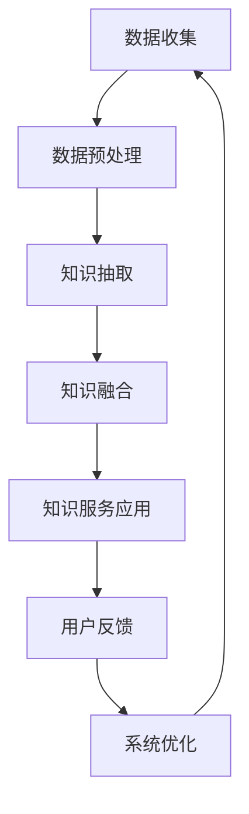
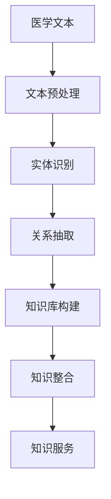

                 

### 《如何实现医疗健康领域的知识服务创新》

#### 关键词：医疗健康，知识服务，人工智能，大数据，知识图谱，创新

> 摘要：本文将探讨如何通过创新技术实现医疗健康领域的知识服务。我们将分析医疗健康领域知识服务的现状、挑战和未来趋势，并深入探讨知识服务的技术基础、关键技术、应用案例、实施与优化策略，以及知识服务的商业模式和创新路径。通过本篇文章，读者将了解医疗健康知识服务的发展现状、关键技术和实现方法，为未来医疗健康知识服务的发展提供参考。

### 第一部分：背景与概述

#### 第1章：医疗健康领域知识服务概述

医疗健康领域知识服务是指利用先进的技术手段，对医疗健康领域中的知识进行挖掘、整合、分析和应用，以提供更为精准、高效和个性化的医疗服务。这种知识服务不仅有助于提高医疗服务的质量，还能为医疗研究人员、医生和患者提供有力的支持。

#### 1.1 医疗健康知识服务的概念与重要性

医疗健康知识服务是一种基于知识的医疗服务，其核心在于将医疗健康领域的知识进行有效组织、管理和应用。这些知识可以包括医学文献、临床试验数据、医生经验、患者病史等。通过这些知识的服务，可以为医生提供辅助诊断和治疗方案，为患者提供健康咨询和个性化医疗服务。

医疗健康知识服务的重要性主要体现在以下几个方面：

1. **提高医疗服务质量**：知识服务可以帮助医生获取最新的医疗信息，提高诊断和治疗的准确性和效率。
2. **个性化医疗服务**：通过分析患者的病史、基因信息等，可以为患者提供个性化的治疗方案和健康指导。
3. **医疗资源优化**：知识服务可以帮助医疗机构更好地管理和利用医疗资源，提高医疗服务效率。
4. **医学研究支持**：知识服务可以为医学研究提供丰富的数据支持，加速医学研究的进展。

#### 1.2 医疗健康领域知识服务的现状

目前，医疗健康领域知识服务已经取得了一定的进展。主要表现在以下几个方面：

1. **知识库建设**：许多医疗机构和研究机构已经建立了医学知识库，收集和整理了大量的医学文献、临床试验数据和医生经验等。
2. **人工智能与大数据应用**：人工智能和大数据技术已经在医疗健康领域得到广泛应用，为知识服务提供了强大的技术支持。
3. **知识图谱与语义分析**：知识图谱和语义分析技术被用于医疗健康领域，帮助医生和患者更好地理解和应用医疗知识。

然而，当前医疗健康领域知识服务仍面临一些挑战，例如数据质量问题、隐私保护问题、知识服务系统的性能优化等。这些问题需要我们在未来的发展中不断解决。

#### 1.3 医疗健康领域知识服务的挑战

医疗健康领域知识服务面临以下主要挑战：

1. **数据质量问题**：医疗健康数据来源广泛，数据质量参差不齐，需要进行有效的数据清洗和预处理。
2. **隐私保护问题**：医疗健康数据涉及患者隐私，需要确保数据的安全性和隐私保护。
3. **知识服务系统的性能优化**：知识服务系统需要处理海量数据，需要不断提升系统的性能和响应速度。
4. **知识服务的标准化**：医疗健康知识服务需要建立一套统一的标准，以确保知识服务的质量和互操作性。

#### 1.4 医疗健康领域知识服务的未来趋势

随着人工智能、大数据、云计算等技术的发展，医疗健康领域知识服务将迎来新的发展机遇。以下是医疗健康领域知识服务的未来趋势：

1. **人工智能与医疗健康深度融合**：人工智能技术将在医疗健康领域得到更广泛的应用，为知识服务提供更强大的支持。
2. **知识服务个性化**：知识服务将更加注重个性化，根据患者的需求和特点提供定制化的医疗服务。
3. **知识服务一体化**：知识服务将实现一体化，将不同来源的知识进行整合，提供更为全面和精准的医疗服务。
4. **知识服务国际化**：随着全球医疗健康领域的交流与合作，知识服务将实现国际化，为全球患者提供医疗服务。

通过以上分析，我们可以看到医疗健康领域知识服务的重要性以及未来发展的趋势。在接下来的章节中，我们将深入探讨知识服务的技术基础、关键技术、应用案例、实施与优化策略，以及知识服务的商业模式和创新路径，为医疗健康领域知识服务的发展提供有力支持。

#### 第2章：知识服务的技术基础

在探讨如何实现医疗健康领域的知识服务创新之前，了解知识服务的技术基础至关重要。本章将重点介绍人工智能与机器学习、数据库与数据仓库、知识图谱与语义网、大数据技术等四个关键领域，这些技术在医疗健康知识服务中发挥着重要作用。

##### 2.1 人工智能与机器学习在医疗健康领域的应用

人工智能（AI）与机器学习（ML）是现代科技发展的重要驱动力，它们在医疗健康领域的应用正在不断拓展和深化。

**1. 人工智能在医疗健康领域的应用：**

- **疾病预测与诊断**：人工智能可以通过分析大量的医疗数据，如电子健康记录、实验室检测结果等，预测疾病的发生概率和趋势。例如，IBM的Watson for Oncology系统能够根据患者的病史、基因信息等数据，为医生提供个性化的治疗方案。
- **医学图像分析**：深度学习算法在医学图像分析中表现出色，如肿瘤检测、心脏病诊断等。Google Health的DeepMind团队开发的AI系统已经在眼科、皮肤科等领域取得了显著成果。
- **药物研发**：人工智能可以加速新药的研发过程，通过筛选和优化药物分子结构，提高药物研发的成功率和效率。

**2. 机器学习在医疗健康领域的应用：**

- **个性化医疗**：机器学习技术可以根据患者的基因、病史、生活习惯等数据，为其提供个性化的医疗建议和治疗方案。
- **智能健康管理**：通过分析患者的健康数据，如步数、心率等，机器学习可以帮助患者监控健康状况，提供健康预警和建议。

##### 2.2 数据库与数据仓库在医疗健康知识服务中的作用

数据库和数据仓库是存储和管理医疗健康数据的核心基础设施。它们在知识服务中的作用不可替代。

**1. 数据库在医疗健康知识服务中的作用：**

- **电子健康记录（EHR）**：数据库用于存储和管理患者的电子健康记录，如病史、检查报告、用药记录等，为医生提供实时、准确的患者信息。
- **临床试验数据库**：数据库用于存储和管理临床试验的数据，为医学研究提供可靠的数据支持。

**2. 数据仓库在医疗健康知识服务中的作用：**

- **数据集成与整合**：数据仓库可以将来自不同来源的医疗数据进行整合，提供统一的视图，为知识服务提供丰富的数据基础。
- **数据挖掘与分析**：数据仓库存储的海量数据可以用于数据挖掘和分析，发现潜在的医学规律和趋势，为医生和研究人员提供参考。

##### 2.3 知识图谱与语义网

知识图谱与语义网技术是构建医疗健康知识服务的关键技术，它们能够将离散的医疗知识进行关联和组织，实现知识的语义理解和智能推理。

**1. 知识图谱在医疗健康领域的应用：**

- **医学知识图谱**：通过将医学概念、术语、关系等进行结构化表示，知识图谱可以帮助医生快速理解复杂的医学知识，提供智能辅助诊断和治疗建议。
- **药物知识图谱**：知识图谱可以关联药物的成分、作用、副作用等信息，为药物研发和监管提供支持。

**2. 语义网在医疗健康领域的应用：**

- **语义搜索引擎**：通过语义网技术，语义搜索引擎可以更好地理解用户查询，提供更加精准的搜索结果。
- **语义数据整合**：语义网技术可以帮助不同来源的医疗数据实现语义整合，提供统一的视图，为知识服务提供丰富的数据支持。

##### 2.4 大数据技术在医疗健康领域的应用

大数据技术在医疗健康领域具有广泛的应用前景，它能够处理海量医疗数据，挖掘数据中的价值，为知识服务提供强大的支持。

**1. 大数据在医疗健康领域的应用：**

- **实时数据处理**：大数据技术可以实时处理医疗数据，如患者的实时健康状况、医疗设备的监控数据等，为医生提供实时决策支持。
- **医疗数据分析**：大数据技术可以对海量医疗数据进行分析，发现潜在的医学规律和趋势，为医疗研究提供支持。
- **个性化健康服务**：通过大数据分析，可以为患者提供个性化的健康服务，如健康预警、疾病预防等。

**2. 大数据技术的挑战：**

- **数据隐私保护**：大数据技术需要确保患者数据的隐私和安全，避免数据泄露和滥用。
- **数据处理效率**：大数据处理需要高效的方法和算法，以应对海量数据的挑战。

通过本章对人工智能与机器学习、数据库与数据仓库、知识图谱与语义网、大数据技术等四个领域的基础知识的介绍，我们可以看到这些技术在医疗健康领域知识服务中的重要作用。在接下来的章节中，我们将进一步探讨医疗健康知识服务的关键技术、应用案例、实施与优化策略，为医疗健康领域知识服务的发展提供更为深入的见解。

### 第二部分：知识服务的关键技术

在了解了知识服务的技术基础后，我们接下来将深入探讨医疗健康领域知识服务的关键技术。这些技术包括医疗健康数据的处理与清洗、知识抽取与语义分析、知识融合与整合等。通过掌握这些核心技术，我们可以更有效地构建和利用医疗健康知识服务体系。

#### 第3章：医疗健康数据的处理与清洗

医疗健康数据是医疗健康知识服务的基础，然而这些数据通常来源于多个渠道，存在格式不统一、质量参差不齐等问题。因此，对医疗健康数据进行处理与清洗是知识服务的关键步骤。

##### 3.1 医疗健康数据的来源与类型

医疗健康数据的来源多种多样，包括但不限于以下几种：

1. **电子健康记录（EHR）**：EHR包含了患者的医疗历史记录、诊断信息、治疗方案等，是医疗健康数据的重要来源。
2. **医疗设备数据**：医疗设备如CT扫描仪、MRI设备等可以生成大量的医学图像数据。
3. **临床试验数据**：临床试验数据包括患者的用药情况、治疗效果、副作用等，是医学研究的重要依据。
4. **医学文献**：医学文献包含了大量的医学研究成果和临床实践经验，是知识服务的重要知识来源。

医疗健康数据类型主要包括：

1. **结构化数据**：如电子健康记录中的患者信息、诊断结果等，这些数据通常以表格或数据库的形式存储。
2. **半结构化数据**：如医学图像数据、基因组数据等，这些数据具有一定的结构，但需要特定的工具和方法进行解析。
3. **非结构化数据**：如医学文献、医生笔记等，这些数据没有固定的格式，需要进行文本处理和分析。

##### 3.2 医疗健康数据清洗的挑战与方法

医疗健康数据清洗面临以下主要挑战：

1. **数据完整性**：医疗健康数据可能存在缺失值、重复记录等问题，需要确保数据的完整性。
2. **数据一致性**：由于不同来源的数据格式和术语可能不一致，需要统一数据格式和术语。
3. **数据质量**：医疗健康数据可能存在错误、异常值等，需要检测和修正。
4. **数据隐私保护**：在数据清洗过程中，需要遵循隐私保护原则，避免敏感信息泄露。

针对以上挑战，医疗健康数据清洗的方法主要包括：

1. **数据去重**：通过比较数据记录的唯一标识，如患者ID，去除重复记录。
2. **数据标准化**：对数据进行统一的格式转换和术语规范化，如将不同的诊断名称统一转换为标准术语。
3. **缺失值处理**：采用填补缺失值的方法，如平均值填补、插值法等，或者根据数据特点删除缺失值严重的记录。
4. **错误值检测与修正**：利用统计学方法和规则，检测和修正数据中的错误值和异常值。
5. **隐私保护**：采用数据加密、匿名化等技术，确保数据清洗过程中的隐私保护。

##### 3.3 医疗健康数据的标准化与规范化

医疗健康数据的标准化与规范化是确保数据一致性和兼容性的重要步骤。标准化与规范化的目标包括：

1. **数据格式统一**：将不同来源的数据格式转换为统一的格式，如XML、JSON等。
2. **术语规范化**：统一医学术语，如将“高血压”和“高血压病”统一为“高血压”。
3. **编码标准**：采用统一的编码标准，如ICD-10诊断编码、SNOMED CT术语编码等。

标准化与规范化的方法包括：

1. **术语标准化**：通过医学术语数据库，如UMLS（统一医学语言系统），对医学术语进行统一和规范化。
2. **数据格式转换**：使用数据转换工具，如ETL（提取、转换、加载）工具，将不同格式的数据转换为统一的格式。
3. **数据验证与测试**：对转换后的数据进行验证和测试，确保数据格式和内容的正确性。

通过本章对医疗健康数据清洗与处理技术的介绍，我们可以看到数据处理与清洗在医疗健康知识服务中的重要性。在接下来的章节中，我们将继续探讨知识抽取与语义分析、知识融合与整合等关键技术，为构建高效、精准的医疗健康知识服务体系奠定基础。

#### 第4章：知识抽取与语义分析

在医疗健康知识服务中，知识抽取和语义分析是关键步骤，它们有助于从大量医疗数据中提取有用信息，并对这些信息进行深入理解。本章将详细介绍知识抽取的基本概念与方法、医学文本的语义分析，以及医学实体识别与关系抽取。

##### 4.1 知识抽取的基本概念与方法

**1. 知识抽取的概念：**

知识抽取（Knowledge Extraction）是从非结构化数据中提取出结构化知识的过程，这些知识可以被用于各种应用，如信息检索、问答系统、智能诊断等。在医疗健康领域，知识抽取的目标是从医学文献、电子健康记录、医学图像等数据源中提取出相关的医学知识。

**2. 知识抽取的方法：**

知识抽取的方法主要包括以下几种：

- **规则方法**：基于预定义的规则，从文本中抽取知识。这种方法需要手工编写大量规则，适用于规则明确、结构简单的场景。
- **统计方法**：利用机器学习算法，从大量文本数据中学习知识抽取的模型。这种方法不需要手工编写规则，但需要大量训练数据和计算资源。
- **深度学习方法**：利用深度神经网络，如卷积神经网络（CNN）和递归神经网络（RNN），从文本数据中自动学习特征和抽取知识。这种方法在处理复杂、非结构化数据时表现出色。

**3. 知识抽取的步骤：**

- **文本预处理**：对原始文本进行清洗、分词、去停用词等预处理，将文本转换为适合模型输入的形式。
- **特征提取**：从预处理后的文本中提取特征，如词频、词向量、句子结构等。
- **模式识别**：利用规则、统计模型或深度学习模型，从特征中识别出知识，如医学实体、关系等。
- **知识存储**：将抽取出的知识存储到知识库中，以便后续查询和使用。

##### 4.2 医学文本的语义分析

医学文本的语义分析是指对医学文本进行语义层面的理解，以提取出文本中的医学知识。医学文本的语义分析主要包括以下内容：

**1. 医学实体识别：**

医学实体识别（Medical Entity Recognition）是指从医学文本中识别出医学相关的实体，如疾病、药物、症状等。医学实体识别是语义分析的基础，对于构建医学知识库和智能诊断系统具有重要意义。

- **基于规则的方法**：通过预定义的规则，识别出医学文本中的实体。这种方法需要大量手工编写的规则，但在规则覆盖的情况下表现较好。
- **基于统计的方法**：利用统计模型，如条件概率模型、隐马尔可夫模型（HMM）等，从医学文本中识别实体。这种方法不需要手工编写规则，但需要大量训练数据和计算资源。
- **基于深度学习的方法**：利用深度学习模型，如卷积神经网络（CNN）和递归神经网络（RNN），从医学文本中自动识别实体。这种方法在处理复杂、非结构化数据时表现出色。

**2. 医学关系抽取：**

医学关系抽取（Medical Relation Extraction）是指从医学文本中识别出实体之间的关系，如“患者患有某种疾病”、“药物用于治疗某种症状”等。医学关系抽取是语义分析的重要环节，有助于构建医学知识图谱和智能诊断系统。

- **基于规则的方法**：通过预定义的规则，识别出医学文本中的关系。这种方法需要大量手工编写的规则，但在规则覆盖的情况下表现较好。
- **基于统计的方法**：利用统计模型，如条件概率模型、支持向量机（SVM）等，从医学文本中识别关系。这种方法不需要手工编写规则，但需要大量训练数据和计算资源。
- **基于深度学习的方法**：利用深度学习模型，如卷积神经网络（CNN）和递归神经网络（RNN），从医学文本中自动识别关系。这种方法在处理复杂、非结构化数据时表现出色。

##### 4.3 医学实体识别与关系抽取

医学实体识别和关系抽取是医疗健康知识服务中的核心技术，它们有助于构建和利用医学知识库。

**1. 医学实体识别的流程：**

- **数据准备**：收集和清洗医学文本数据，进行预处理。
- **特征提取**：从预处理后的文本中提取特征，如词向量、句子结构等。
- **模型训练**：利用训练数据，训练实体识别模型。
- **模型评估**：使用验证集评估模型性能，调整模型参数。
- **实体识别**：使用训练好的模型，对新的医学文本进行实体识别。

**2. 医学关系抽取的流程：**

- **数据准备**：收集和清洗医学文本数据，进行预处理。
- **特征提取**：从预处理后的文本中提取特征，如词向量、句子结构等。
- **模型训练**：利用训练数据，训练关系抽取模型。
- **模型评估**：使用验证集评估模型性能，调整模型参数。
- **关系抽取**：使用训练好的模型，对新的医学文本进行关系抽取。

通过本章对知识抽取与语义分析技术的介绍，我们可以看到这些技术在医疗健康知识服务中的重要性。在接下来的章节中，我们将继续探讨知识融合与整合技术，以实现医疗健康知识的有效组织和利用。

#### 第5章：知识融合与整合

在医疗健康领域，知识融合与整合是指将来自不同来源、不同格式、不同结构的医疗数据进行整合，形成一个统一、完整且可交互的知识体系。这种知识融合与整合有助于提高医疗服务的质量和效率，实现个性化医疗和智能诊断。本章将介绍知识融合的概念与目的、医学知识库的构建与整合，以及知识融合的算法与策略。

##### 5.1 知识融合的概念与目的

**1. 知识融合的概念：**

知识融合（Knowledge Fusion）是指将多个独立的知识源中的信息进行整合，生成一个更加全面、准确和一致的知识体系。在医疗健康领域，知识融合的目标是将不同来源的医疗数据（如电子健康记录、医学文献、临床试验数据等）进行整合，形成一个统一的知识库，以便为医生和患者提供全面、准确的医疗信息。

**2. 知识融合的目的：**

- **提高医疗服务的质量和效率**：通过知识融合，医生可以获得更全面的患者信息，从而做出更准确的诊断和治疗方案。
- **实现个性化医疗**：知识融合可以帮助医生根据患者的具体情况，提供个性化的医疗建议和治疗方案。
- **支持医学研究**：知识融合可以为医学研究提供全面的数据支持，加速医学研究的进展。
- **降低医疗成本**：通过知识融合，可以减少重复检查和诊断，降低医疗成本。

##### 5.2 医学知识库的构建与整合

**1. 医学知识库的概念：**

医学知识库（Medical Knowledge Base）是指一个结构化的知识存储库，包含各种医疗相关的知识，如疾病信息、治疗方案、药物信息等。医学知识库是医疗健康知识服务的重要基础，可以为医生和患者提供丰富的医疗知识。

**2. 医学知识库的构建：**

医学知识库的构建包括以下步骤：

- **数据收集**：收集各种医疗数据源，如电子健康记录、医学文献、临床试验数据等。
- **数据清洗**：对收集到的医疗数据进行清洗，去除重复、错误和无关的数据。
- **数据预处理**：对清洗后的数据进行预处理，如标准化术语、统一格式等。
- **数据整合**：将来自不同来源和格式的医疗数据进行整合，形成一个统一的知识库。
- **知识表示**：使用知识表示技术，如知识图谱、本体论等，将整合后的知识进行结构化表示。

**3. 医学知识库的整合：**

医学知识库的整合包括以下内容：

- **术语标准化**：统一不同数据源中的术语，如疾病名称、药物名称等，确保知识库的一致性和可互操作性。
- **数据融合**：将不同来源的数据进行融合，如将电子健康记录中的诊断信息与医学文献中的研究数据进行整合。
- **知识推理**：利用知识推理技术，如本体推理、规则推理等，从知识库中提取新的知识。

##### 5.3 知识融合的算法与策略

**1. 知识融合的算法：**

知识融合的算法主要包括以下几种：

- **基于规则的方法**：通过预定义的规则，将不同来源的知识进行融合。这种方法适用于知识结构简单且规则明确的情况。
- **基于统计的方法**：利用统计模型，如贝叶斯网络、支持向量机等，将不同来源的知识进行融合。这种方法适用于具有大量数据的情况。
- **基于深度学习的方法**：利用深度学习模型，如卷积神经网络（CNN）、递归神经网络（RNN）等，将不同来源的知识进行融合。这种方法在处理复杂、非结构化数据时表现出色。

**2. 知识融合的策略：**

知识融合的策略主要包括以下几种：

- **数据集成策略**：将不同来源的数据进行集成，形成一个统一的数据视图。这种方法可以提高数据的利用效率和一致性。
- **知识融合策略**：通过知识融合算法，将不同来源的知识进行融合，形成一个更加完整和一致的知识体系。这种方法可以提高知识的利用效率和准确性。
- **知识评估策略**：对融合后的知识进行评估，确保知识的准确性和一致性。这种方法可以确保知识服务的质量和可靠性。

通过本章对知识融合与整合技术的介绍，我们可以看到这些技术在医疗健康知识服务中的重要性。在接下来的章节中，我们将继续探讨知识服务的应用案例，以展示这些技术在实际场景中的应用效果。

#### 第6章：知识服务应用案例分析

在前几章中，我们详细探讨了医疗健康领域知识服务的关键技术和方法。为了更好地理解这些技术在实际应用中的效果，本章将结合具体案例，分析知识服务在医疗健康领域的实际应用，包括智能医疗诊断系统、医疗健康知识图谱应用和基于大数据的个性化健康服务。

##### 6.1 智能医疗诊断系统

智能医疗诊断系统是利用人工智能和大数据技术，辅助医生进行疾病诊断和治疗方案制定。以下是一个具体的案例：

**案例：智能肺癌诊断系统**

- **背景**：肺癌是世界上最常见的恶性肿瘤之一，早期诊断和准确治疗对提高患者生存率至关重要。
- **技术方案**：该系统利用深度学习和图像处理技术，对患者的CT扫描图像进行分析。系统首先通过卷积神经网络（CNN）提取图像特征，然后利用这些特征进行肺癌的检测和分类。同时，系统还可以结合患者的电子健康记录和生物标志物数据，进行综合分析，提供更准确的诊断结果。
- **应用效果**：该系统已经在多家医院进行试点，结果表明，其诊断准确率显著高于传统方法，能够显著缩短诊断时间，提高诊断效率。

**案例解读**：

- **技术核心**：智能医疗诊断系统依赖于深度学习技术和大数据分析，通过大量的医疗图像和临床数据训练模型，实现高效、准确的疾病诊断。
- **优势**：智能医疗诊断系统可以快速处理大量数据，提供实时诊断结果，有助于提高诊断准确性和效率。

##### 6.2 医疗健康知识图谱应用

医疗健康知识图谱是将医学概念、术语、关系等进行结构化表示，形成一个知识网络。以下是一个具体案例：

**案例：医疗健康知识图谱构建**

- **背景**：医疗健康知识图谱可以帮助医生快速理解和应用复杂的医学知识，提供智能辅助诊断和治疗建议。
- **技术方案**：该案例构建了一个综合性的医疗健康知识图谱，包括疾病、药物、症状、治疗方案等。知识图谱使用RDF（资源描述框架）进行表示，通过本体论构建知识模型，使用图数据库进行存储。此外，系统还利用自然语言处理（NLP）技术，从医学文本中抽取实体和关系，将它们添加到知识图谱中。
- **应用效果**：该知识图谱已经应用于多家医院的临床工作，医生可以通过图谱查询医学信息，快速获得治疗方案和临床建议。

**案例解读**：

- **技术核心**：医疗健康知识图谱结合了语义网技术和自然语言处理，实现了医学知识的结构化和语义理解。
- **优势**：知识图谱可以提供高效、精准的医学信息查询，支持医生进行智能辅助诊断和治疗。

##### 6.3 基于大数据的个性化健康服务

基于大数据的个性化健康服务是指利用大数据技术，为患者提供个性化的健康建议和医疗服务。以下是一个具体案例：

**案例：个性化健康管理系统**

- **背景**：随着健康意识的提高，越来越多的患者关注自己的健康状况，希望获得个性化的健康服务。
- **技术方案**：该系统利用大数据技术，收集和分析患者的健康数据，如体重、血压、心率、运动数据等。系统通过机器学习算法，分析患者的健康趋势和风险因素，为患者提供个性化的健康建议。此外，系统还可以根据患者的偏好和需求，提供定制化的健康管理计划。
- **应用效果**：该系统已经在多家医疗机构上线，受到了患者和医生的广泛好评，有助于提高患者的健康管理意识和效果。

**案例解读**：

- **技术核心**：基于大数据的个性化健康服务依赖于大数据收集和分析技术，以及机器学习算法的应用。
- **优势**：个性化健康服务可以提供精准、个性化的健康建议，有助于提高患者的健康水平和生活质量。

通过以上案例分析，我们可以看到知识服务在医疗健康领域的广泛应用和显著效果。这些案例不仅展示了知识服务技术的实际应用，也为未来的医疗健康知识服务发展提供了有益的借鉴和启示。

### 第三部分：实施与优化

#### 第7章：知识服务系统的设计与实现

知识服务系统的设计与实现是医疗健康知识服务落地的重要环节。本章将详细介绍知识服务系统的架构设计、开发流程和性能优化策略。

##### 7.1 知识服务系统的架构设计

**1. 系统架构概述**

知识服务系统通常采用分布式架构，以应对海量数据的处理和高并发访问需求。常见的系统架构包括：

- **客户端-服务器架构**：客户端负责用户交互，服务器负责处理业务逻辑和数据存储。
- **微服务架构**：将系统功能划分为多个微服务，每个微服务负责特定的业务功能，通过API进行通信。
- **云计算架构**：利用云计算资源，实现系统的弹性扩展和高效资源利用。

**2. 关键组件**

知识服务系统的关键组件包括：

- **数据层**：负责数据存储和管理，包括关系数据库、NoSQL数据库、数据仓库等。
- **服务层**：负责业务逻辑处理，包括数据清洗、知识抽取、知识融合等。
- **应用层**：负责用户交互，包括Web前端、移动应用等。
- **接口层**：负责系统与其他系统或平台的集成，提供API服务。

**3. 架构设计原则**

- **模块化**：系统应具有清晰的模块划分，便于维护和升级。
- **可扩展性**：系统应支持水平扩展，以应对数据量和访问量的增长。
- **高可用性**：系统应具备高可用性，确保在故障情况下仍能提供服务。
- **安全性**：系统应确保数据安全和用户隐私保护。

##### 7.2 知识服务系统的开发流程

知识服务系统的开发流程包括以下几个关键步骤：

**1. 需求分析**

- **用户需求调研**：了解用户需求和期望，确定系统功能模块。
- **业务流程梳理**：分析业务流程，确定数据流动和处理流程。

**2. 系统设计**

- **架构设计**：根据需求分析，设计系统的整体架构。
- **详细设计**：设计各模块的详细实现方案，包括数据结构、接口定义等。

**3. 系统开发**

- **模块开发**：根据详细设计文档，逐步开发各个模块。
- **单元测试**：对开发完成的模块进行单元测试，确保模块功能正确。

**4. 系统集成**

- **接口集成**：集成各个模块，实现系统功能。
- **系统测试**：进行系统测试，确保系统整体功能正确和稳定。

**5. 部署上线**

- **环境搭建**：搭建系统运行环境，包括服务器、数据库等。
- **部署上线**：将开发完成的系统部署到生产环境，进行实际应用。

##### 7.3 知识服务系统的性能优化

性能优化是知识服务系统设计和实现的重要环节，以下是一些常见的性能优化策略：

**1. 数据库优化**

- **索引优化**：合理设计数据库索引，提高数据查询效率。
- **分库分表**：根据数据量和访问量，对数据库进行分库分表，降低查询压力。

**2. 缓存优化**

- **缓存策略**：采用缓存策略，减少数据库查询次数，提高系统响应速度。
- **缓存一致性**：确保缓存数据的一致性，防止数据不一致问题。

**3. 网络优化**

- **负载均衡**：采用负载均衡技术，分散访问压力，提高系统并发处理能力。
- **网络优化**：优化网络通信，减少数据传输延迟。

**4. 系统监控**

- **性能监控**：实时监控系统性能，包括CPU、内存、磁盘使用情况等。
- **故障预警**：设置故障预警机制，及时发现和处理系统故障。

**5. 代码优化**

- **代码优化**：对系统代码进行优化，减少资源消耗，提高执行效率。
- **异步处理**：采用异步处理技术，减少系统阻塞，提高并发处理能力。

通过以上对知识服务系统设计与实现、开发流程和性能优化策略的介绍，我们可以看到构建一个高效、稳定和可扩展的知识服务系统的重要性。在接下来的章节中，我们将继续探讨知识服务的评估与改进、商业模式与创新，以及医疗健康知识服务的未来发展趋势。

#### 第8章：知识服务的评估与改进

知识服务的评估与改进是确保其质量和效果的关键环节。通过科学、系统的评估方法，可以识别知识服务的优势和不足，为持续改进提供依据。本章将详细介绍知识服务的评估指标、效果评估方法和持续改进策略。

##### 8.1 知识服务的评估指标

评估知识服务质量和效果的关键指标包括：

1. **准确性**：知识服务提供的答案或建议的准确性。准确性越高，知识服务的价值越大。
2. **响应速度**：知识服务对用户请求的响应时间。响应速度越快，用户体验越好。
3. **覆盖率**：知识库中可用的知识条目数量与总需求知识条目数量的比值。覆盖率越高，知识服务越全面。
4. **用户满意度**：用户对知识服务的满意度评价。用户满意度是衡量知识服务效果的重要指标。
5. **可用性**：知识服务界面和功能设计的易用性。可用性越高，用户使用知识服务的难度越小。
6. **安全性**：知识服务的安全性和数据隐私保护能力。安全性越高，用户越放心使用。

##### 8.2 知识服务的效果评估方法

知识服务的效果评估方法主要包括定量评估和定性评估。

**1. 定量评估方法**

- **用户调查问卷**：通过设计问卷，收集用户对知识服务的满意度、准确性、响应速度等指标的反馈。
- **关键绩效指标（KPI）**：设置具体的KPI，如查询命中率、问题解决率等，对知识服务进行量化评估。
- **实验方法**：设计实验，比较使用知识服务前后的差异，评估知识服务对医疗质量和效率的影响。

**2. 定性评估方法**

- **用户访谈**：通过与用户进行深入访谈，了解他们对知识服务的实际使用体验和改进建议。
- **案例研究**：分析成功案例，总结知识服务的最佳实践和经验教训。
- **专家评审**：邀请领域专家对知识服务进行评估，提供专业的意见和建议。

##### 8.3 知识服务的持续改进策略

为了确保知识服务持续改进，可以采取以下策略：

**1. 用户反馈机制**

- **建立反馈渠道**：提供用户反馈渠道，如在线反馈表、用户论坛等，鼓励用户提出意见和建议。
- **定期收集反馈**：定期收集用户反馈，分析反馈内容，识别问题所在。

**2. 持续迭代优化**

- **定期评估**：定期对知识服务进行评估，根据评估结果调整和优化系统。
- **迭代开发**：采用敏捷开发方法，快速迭代，不断优化知识服务的功能和质量。

**3. 数据分析与挖掘**

- **数据监测**：实时监测知识服务系统的运行数据，如查询量、问题解决率等。
- **数据挖掘**：利用数据挖掘技术，分析用户行为和反馈数据，发现改进机会。

**4. 技术更新与升级**

- **跟进新技术**：关注前沿技术动态，引入新技术，提升知识服务的性能和智能化水平。
- **系统升级**：定期对知识服务系统进行升级，修复漏洞，优化性能。

**5. 人才培养与知识共享**

- **人才培养**：加强团队成员的专业培训，提高技术能力和业务理解。
- **知识共享**：鼓励团队成员分享经验和知识，促进知识服务的持续改进。

通过以上评估与改进策略，知识服务可以不断提升其质量和效果，为医疗健康领域提供更有价值的支持。

### 第9章：知识服务的商业模式与创新

在医疗健康领域，知识服务的商业模式和创新路径对推动行业发展具有重要意义。本章将分析知识服务的商业模式，探讨创新路径，并探讨知识服务的社会影响与伦理问题。

##### 9.1 知识服务的商业模式分析

知识服务在医疗健康领域的商业模式主要包括以下几种：

**1. 产品销售模式**

- **软件销售**：知识服务系统作为软件产品进行销售，适用于中小型医疗机构。
- **硬件销售**：知识服务系统集成的硬件设备，如智能诊断设备、健康监测设备等，可以进行销售。

**2. 订阅服务模式**

- **按需订阅**：医疗机构按需订阅知识服务系统，根据使用量付费。
- **套餐订阅**：医疗机构购买包含多个知识服务功能的套餐，享受更优惠的价格。

**3. 合作模式**

- **与医疗机构合作**：知识服务提供商与医疗机构合作，共同开发适用于特定场景的知识服务系统。
- **与药品企业合作**：知识服务提供商与药品企业合作，提供药物信息查询、临床试验数据支持等服务。

**4. 营销模式**

- **线上营销**：利用互联网渠道，如网站、社交媒体等，进行知识服务产品的推广和销售。
- **线下推广**：通过参加医学会议、展会等活动，与潜在客户建立联系，推广知识服务产品。

##### 9.2 知识服务的创新路径

知识服务的创新路径主要包括以下方面：

**1. 技术创新**

- **人工智能与大数据融合**：结合人工智能和大数据技术，提升知识服务的智能化水平，实现更精准的诊断和个性化服务。
- **云计算与边缘计算**：利用云计算和边缘计算技术，实现知识服务的弹性扩展和高效资源利用。

**2. 服务模式创新**

- **个性化健康服务**：根据用户需求，提供个性化的健康服务，如健康管理、疾病预防等。
- **智慧医院建设**：整合医疗资源，实现智慧医院的全面建设，提供一站式医疗服务。

**3. 商业模式创新**

- **平台化运营**：构建知识服务平台，汇集各类医疗资源，提供一站式知识服务。
- **跨界合作**：与医疗、药品、保险等领域的企业合作，共同打造创新性的知识服务模式。

##### 9.3 知识服务的社会影响与伦理问题

知识服务在医疗健康领域的发展对社会和伦理产生了深远影响。

**1. 社会影响**

- **提高医疗服务质量**：知识服务有助于提升医疗服务的质量和效率，减少误诊和漏诊，提高患者满意度。
- **降低医疗成本**：通过知识服务，可以实现医疗资源的优化配置，降低医疗成本，提高医疗可及性。
- **推动医学研究**：知识服务可以为医学研究提供丰富的数据支持，加速医学研究的进展。

**2. 伦理问题**

- **数据隐私保护**：医疗健康数据涉及患者隐私，需要确保数据的安全性和隐私保护。
- **算法偏见**：知识服务系统可能存在算法偏见，导致不公平的诊断和治疗建议。
- **知识产权保护**：知识服务过程中，如何保护知识产权，避免侵权问题，是一个重要的伦理问题。

为了解决这些伦理问题，需要采取以下措施：

- **数据隐私保护**：建立健全的数据隐私保护制度，采取数据加密、匿名化等技术手段，确保患者数据安全。
- **算法透明度**：提高算法的透明度，确保算法的公正性和可解释性，减少算法偏见。
- **知识产权保护**：加强知识产权保护，建立完善的知识产权管理体系，促进知识服务的健康发展。

通过本章对知识服务的商业模式、创新路径和社会影响与伦理问题的分析，我们可以看到知识服务在医疗健康领域的重要性和发展潜力。在未来的发展中，需要不断创新商业模式，提升服务质量，同时关注社会影响和伦理问题，实现知识服务的可持续发展。

### 第四部分：展望与未来趋势

#### 第10章：知识服务的未来发展趋势

随着人工智能、大数据、云计算等技术的不断发展，医疗健康领域的知识服务正迎来新的发展机遇。以下将探讨知识服务的未来发展趋势，包括人工智能与医疗健康领域的深度融合、知识服务在公共卫生中的应用，以及知识服务在其他领域的拓展。

##### 10.1 人工智能与医疗健康领域的深度融合

人工智能（AI）技术在医疗健康领域的应用已经取得了显著成果，未来将继续深化与医疗健康的融合，具体表现在：

- **智能诊断与治疗**：通过深度学习、自然语言处理等技术，AI将能够更精准地分析医学图像和文本数据，辅助医生进行疾病诊断和治疗。
- **个性化医疗**：AI技术可以分析海量患者数据，为每位患者提供个性化的诊断、治疗和健康管理方案。
- **智能药物研发**：利用AI技术，可以加速新药的研发过程，通过模拟和优化药物分子结构，提高药物研发的成功率和效率。

##### 10.2 知识服务在公共卫生中的应用

知识服务在公共卫生中的应用前景广阔，有助于提升公共卫生管理水平，具体包括：

- **公共卫生监测与预警**：通过大数据分析和人工智能技术，实时监测疫情发展，预测疾病流行趋势，提前采取防控措施。
- **健康风险评估与预测**：利用大数据和机器学习技术，对公众的健康风险进行评估和预测，为健康干预提供依据。
- **疾病预防与控制**：通过知识服务，为公共卫生决策者提供科学依据，制定有效的疾病预防与控制策略。

##### 10.3 知识服务在其他领域的拓展

知识服务的应用不仅限于医疗健康领域，还将在其他领域得到拓展，具体包括：

- **智慧城市**：知识服务可以帮助城市管理者优化资源配置，提高城市管理效率，如交通管理、环境保护等。
- **金融健康**：利用知识服务，金融机构可以为用户提供个性化的金融产品和服务，提高客户满意度。
- **智慧农业**：通过知识服务，农业领域可以实现精准农业，提高农作物产量和质量。

#### 第11章：医疗健康知识服务的发展策略

为了推动医疗健康知识服务的发展，需要从政策支持、技术创新和人才培养等方面制定相应的发展策略。

##### 11.1 政策支持与产业合作

政策支持是推动医疗健康知识服务发展的重要保障。以下是一些政策支持的建议：

- **制定相关政策法规**：明确医疗健康知识服务的法律地位和监管框架，保护患者隐私和数据安全。
- **加强政策引导**：通过政策引导，鼓励企业和研究机构投入医疗健康知识服务领域，推动技术创新和应用。
- **产业合作**：推动医疗健康机构、企业和研究机构之间的合作，共同推进医疗健康知识服务的发展。

##### 11.2 技术创新与人才培养

技术创新是医疗健康知识服务发展的核心动力。以下是一些建议：

- **加大科研投入**：鼓励科研机构和高校加大在医疗健康知识服务领域的研究投入，推动技术突破。
- **推动跨学科合作**：鼓励医学、计算机科学、大数据等领域的跨学科合作，推动知识服务的创新和发展。
- **人才培养**：加强医疗健康知识服务相关人才的培养，提高人才的业务能力和技术水平。

##### 11.3 知识服务的可持续发展

为了实现医疗健康知识服务的可持续发展，以下是一些建议：

- **建立完善的知识服务体系**：构建一体化的知识服务体系，实现知识的有效组织和共享。
- **加强数据资源建设**：通过政策引导和产业合作，建立丰富的医疗健康数据资源库，为知识服务提供数据支持。
- **促进知识服务的市场化**：推动知识服务的市场化进程，实现知识服务的商业化运营，提高知识服务的质量和效益。

通过以上发展策略，可以推动医疗健康知识服务的持续发展，为医疗健康领域提供更高效、精准和个性化的服务。

### 附录

#### 附录A：常用工具与资源

**A.1 人工智能与大数据处理工具**

1. **TensorFlow**：开源的机器学习框架，适用于构建和训练深度学习模型。
2. **PyTorch**：另一种流行的深度学习框架，具有良好的灵活性和易用性。
3. **Scikit-learn**：用于数据挖掘和数据分析的Python库，提供了丰富的机器学习算法。
4. **Hadoop**：分布式数据存储和处理平台，适用于大数据处理。
5. **Spark**：基于内存的分布式数据处理引擎，提供了丰富的机器学习和数据分析功能。

**A.2 医学知识图谱与语义分析工具**

1. **OpenKG**：开源的中文知识图谱构建与服务平台，支持本体构建、知识抽取和知识融合等功能。
2. **Medical Knowledge Graph**：基于OWL（Web本体语言）的医学知识图谱，提供了丰富的医学知识表示和推理功能。
3. **PubMed**：PubMed是NIH（美国国家卫生研究院）提供的医学文献数据库，可用于知识图谱构建和语义分析。

**A.3 开源代码与数据集资源**

1. **Kaggle**：一个数据科学竞赛平台，提供了大量医疗健康相关的数据集和开源代码。
2. **GitHub**：全球最大的开源代码托管平台，可以找到许多与医疗健康知识服务相关的开源项目。
3. **Data.gov**：美国政府提供的开放数据平台，包含了大量的公共医疗健康数据。

#### 附录B：Mermaid流程图

**B.1 医疗健康知识服务流程图**



**B.2 医学知识抽取与整合流程图**



#### 附录C：数学公式与算法伪代码

**C.1 数据清洗算法伪代码**

```plaintext
function dataCleaning(dataSet):
    for each record in dataSet:
        if missingValue(record):
            handleMissingValue(record)
        if errorValue(record):
            correctErrorValue(record)
    return cleanedDataSet
```

**C.2 知识融合算法伪代码**

```plaintext
function knowledgeFusion(knowledgeSources):
    fusedKnowledge = {}
    for each source in knowledgeSources:
        for each concept in source:
            if concept not in fusedKnowledge:
                fusedKnowledge[concept] = []
            fusedKnowledge[concept].append(source[concept])
    return fusedKnowledge
```

**C.3 医学实体识别算法伪代码**

```plaintext
function entityRecognition(text):
    entities = []
    tokens = tokenize(text)
    for each token in tokens:
        if isMedicalEntity(token):
            entities.append(token)
    return entities
```

#### 附录D：案例代码解读与分析

**D.1 智能医疗诊断系统代码解读**

由于篇幅限制，本部分将简要介绍智能医疗诊断系统的核心代码结构，不涉及详细代码实现。

1. **数据预处理**：加载和预处理医学图像数据。
2. **特征提取**：利用卷积神经网络提取图像特征。
3. **疾病分类**：利用训练好的深度学习模型对疾病进行分类。
4. **结果输出**：输出诊断结果和置信度。

**D.2 医疗健康知识图谱应用代码解读**

1. **知识图谱构建**：从医学文献中抽取实体和关系，构建知识图谱。
2. **知识查询**：通过知识图谱进行快速查询，获取相关医学知识。
3. **推理**：利用知识图谱进行推理，生成新的医学知识。

**D.3 基于大数据的个性化健康服务代码解读**

1. **数据收集**：收集用户的健康数据，如体重、血压、心率等。
2. **数据分析**：利用机器学习算法分析健康数据，预测健康风险。
3. **个性化建议**：根据分析结果，为用户提供个性化的健康建议。

通过以上解读，读者可以初步了解医疗健康知识服务的实现方法和核心代码结构。在具体实施过程中，需要根据实际需求和数据特点，进行详细的代码设计和实现。

