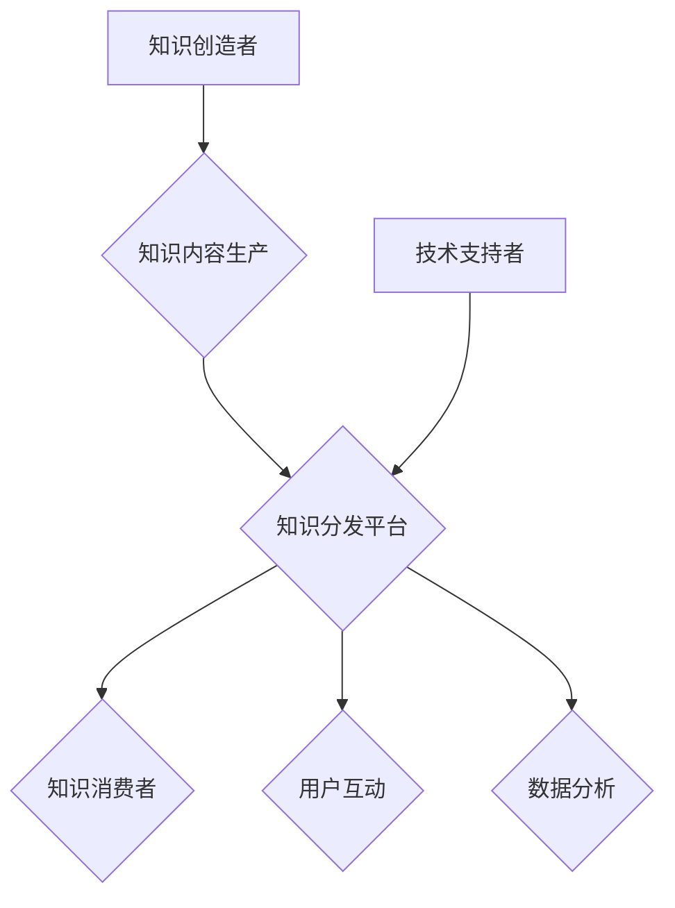

                 

# 如何打造个人知识付费生态圈

> 关键词：个人知识付费、生态圈、内容生产、平台运营、安全合规、技术创新

> 摘要：本文将深入探讨如何打造个人知识付费生态圈，包括了解生态圈概述、构建要素、内容生产、平台运营、安全与合规以及未来发展趋势。通过详细讲解核心概念、算法原理、实战项目和案例研究，帮助读者全面掌握个人知识付费生态圈的建设与运营策略。

## 第1章：了解个人知识付费生态圈概述

### 1.1 个人知识付费生态圈的概念与重要性

**个人知识付费生态圈**指的是围绕个人知识付费活动形成的一个完整产业链和生态系统。在这个生态圈中，知识创造者、知识分发平台、知识消费者和技术支持者共同构成一个相互依存的生态系统，通过各方的互动和合作，实现知识的生产、传播、消费和增值。

**重要性**：

1. **知识价值**：个人通过付费获取知识，有助于提升自身能力和竞争力。知识付费为个人提供了系统化、专业化的学习资源，使得学习更加高效和有针对性。

2. **经济收益**：知识付费为知识创造者提供了收入来源，激励了知识的生产和创新。通过知识付费，知识创造者可以将自己的知识和经验转化为实际的经济回报。

3. **行业规范**：知识付费推动知识付费市场规范化、透明化，提高了服务质量和用户体验。通过制定行业规范和标准，可以减少市场混乱，保护知识创造者和消费者的权益。

### 1.2 个人知识付费生态圈的主要参与者

**知识创造者**：知识创造者是生态圈的核心，他们通过生产高质量的知识内容，为用户提供有价值的学习资源。知识创造者可以是专家、学者、行业从业人员，也可以是具有专业知识和经验的个人。

**知识分发平台**：知识分发平台是连接知识创造者和消费者的桥梁，为知识内容的展示、销售和交易提供渠道。常见的知识分发平台有知乎、得到、网易云课堂等。

**知识消费者**：知识消费者是生态圈的服务对象，他们通过付费购买知识内容，满足自身的学习需求。知识消费者可以是个人用户，也可以是企业、机构等组织。

**技术支持者**：技术支持者提供技术支持和服务，帮助知识创造者、分发平台和消费者更加高效地运行。技术支持者包括在线教育平台的技术开发团队、数据分析团队等。

### 1.3 个人知识付费生态圈的发展趋势

1. **个性化定制**：随着大数据和人工智能技术的发展，个性化定制将成为知识付费的重要趋势。知识分发平台将根据用户的历史行为和偏好，提供个性化的知识服务，提高用户满意度。

2. **内容多样化**：知识内容的形式将更加多样化，涵盖音频、视频、图文、直播等多种形式。知识创造者将根据用户需求和市场需求，不断创新和丰富内容形式。

3. **跨界融合**：知识付费将与电商、娱乐、社交等领域深度融合，形成跨界知识付费生态圈。知识付费产品将更加贴近用户日常生活，满足用户的多样化需求。

### 1.4 个人知识付费生态圈的核心环节

**内容生产**：知识创造者是生态圈的核心，他们通过创作高质量的知识内容，满足用户的需求。内容生产是知识付费生态圈的基础，直接影响到用户满意度。

**内容分发**：知识分发平台负责将知识内容展示、销售和交易给消费者。内容分发环节是连接知识创造者和消费者的桥梁，对生态圈的发展起着关键作用。

**用户互动**：用户互动是生态圈的重要组成部分，通过平台提供的评论、点赞、分享等功能，用户可以与其他用户进行交流和互动，提高知识获取效果。

**数据分析**：数据分析是生态圈的重要环节，通过对用户行为数据、内容效果数据等进行分析，可以帮助平台优化内容推荐、提升用户体验，实现精细化运营。

### 1.5 个人知识付费生态圈的挑战与机遇

**挑战**：

1. **内容质量**：确保知识内容的专业性和实用性是生态圈面临的挑战之一。知识创造者需要不断提升自己的专业素养，创作出高质量的知识内容。

2. **用户体验**：提高平台的交互体验，满足用户需求，是生态圈发展的关键。平台需要不断优化用户界面和功能，提升用户体验。

3. **版权问题**：保护知识创造者的版权，避免侵权行为，是生态圈需要解决的难题。平台需要建立健全的版权保护机制，确保知识创造者的权益。

**机遇**：

1. **市场扩大**：随着知识付费市场的不断扩大，个人知识付费生态圈将迎来更多的发展机遇。知识创造者和平台可以通过不断创新和优化，吸引更多用户和合作伙伴。

2. **技术创新**：大数据、人工智能、区块链等技术的快速发展，为个人知识付费生态圈提供了更多创新和发展的空间。通过技术创新，可以实现个性化推荐、智能问答、版权保护等功能。

3. **行业规范**：随着行业规范的逐步建立，个人知识付费生态圈将更加规范和有序。通过行业规范，可以推动整个行业的发展，提高整体水平。

---

### Mermaid 流程图



### 个人知识付费生态圈的核心概念联系

个人知识付费生态圈包括知识创造者、知识分发平台、知识消费者等核心参与者。知识创造者生产知识内容，通过知识分发平台进行传播和销售，知识消费者通过付费获取知识，从而实现知识付费生态圈的循环。技术支持者在这个过程中提供技术支持和服务，帮助各个环节更加高效地运行。

### 个人知识付费生态圈中的核心算法原理讲解

个人知识付费生态圈中的核心算法主要包括推荐算法、支付算法等。

#### 推荐算法：

推荐算法是一种通过预测用户对特定项目的兴趣，从而为用户推荐相关内容的技术。推荐算法可以分为基于内容的推荐、基于协同过滤的推荐和基于深度学习的推荐。

**基于内容的推荐**：

基于内容的推荐算法通过分析内容特征，为用户推荐相似的内容。其核心思想是计算内容之间的相似度，并根据相似度为用户推荐相关内容。

**伪代码**：

```python
# 基于内容的推荐算法
def content_based_recommendation(content_features, user_preferences):
    # 计算内容之间的相似度
    similarity_matrix = calculate_similarity(content_features)

    # 计算用户对内容的兴趣度
    interest_matrix = calculate_interest(similarity_matrix, user_preferences)

    # 推荐内容
    recommended_contents = find_recommended_contents(interest_matrix)
    return recommended_contents
```

**基于协同过滤的推荐**：

基于协同过滤的推荐算法通过分析用户之间的相似度，为用户推荐他们可能感兴趣的内容。协同过滤算法可以分为基于用户的协同过滤和基于物品的协同过滤。

**伪代码**：

```python
# 基于用户的协同过滤算法
def user_based协同过滤(user_behavior_data):
    # 计算用户之间的相似度
    similarity_matrix = calculate_similarity(user_behavior_data)

    # 计算用户对所有内容的兴趣度
    interest_matrix = calculate_interest(similarity_matrix)

    # 推荐内容
    recommended_contents = find_recommended_contents(interest_matrix)
    return recommended_contents

# 基于物品的协同过滤算法
def item_based协同过滤(item_behavior_data):
    # 计算内容之间的相似度
    similarity_matrix = calculate_similarity(item_behavior_data)

    # 计算用户对内容的兴趣度
    interest_matrix = calculate_interest(similarity_matrix)

    # 推荐内容
    recommended_contents = find_recommended_contents(interest_matrix)
    return recommended_contents
```

**基于深度学习的推荐**：

基于深度学习的推荐算法通过构建深度神经网络模型，从用户行为数据中挖掘潜在的兴趣点，为用户推荐相关内容。常见的深度学习模型有协同过滤模型、卷积神经网络（CNN）和循环神经网络（RNN）等。

**伪代码**：

```python
# 基于深度学习的推荐算法
def deep_learning_recommendation(user_behavior_data, content_features):
    # 构建深度神经网络模型
    model = build_neural_network(content_features)

    # 训练模型
    model.fit(user_behavior_data)

    # 预测用户对内容的兴趣度
    interest_matrix = model.predict(user_behavior_data)

    # 推荐内容
    recommended_contents = find_recommended_contents(interest_matrix)
    return recommended_contents
```

#### 支付算法：

支付算法是知识付费生态圈中的重要组成部分，用于处理支付过程，确保支付的安全性和便捷性。

**安全性**：

支付算法需要采用加密算法，确保支付过程的安全。加密算法可以将敏感信息进行加密，防止信息泄露和篡改。

**便捷性**：

支付算法需要支持多种支付方式，如银行卡支付、移动支付等，提高支付的便捷性。同时，支付算法还需要优化支付处理速度，降低支付失败率。

**伪代码**：

```python
# 支付算法
def payment_algorithm(payment_data):
    # 加密支付数据
    encrypted_data = encrypt(payment_data)

    # 验证支付数据
    if verify(encrypted_data):
        # 执行支付
        execute_payment(encrypted_data)
    else:
        # 支付失败
        raise PaymentError("支付数据验证失败")
```

### 数学模型和数学公式讲解

#### 推荐算法中的相似度计算

相似度计算是推荐算法中的核心步骤，用于计算用户或内容之间的相似度。常见的相似度计算方法包括余弦相似度、皮尔逊相似度等。

**余弦相似度**：

余弦相似度是一种基于向量空间模型计算相似度的方法，其计算公式如下：

$$
similarity(A, B) = \frac{A \cdot B}{\|A\|_2 \|B\|_2}
$$

其中，$A$ 和 $B$ 分别表示两个用户或内容的特征向量，$similarity(A, B)$ 为它们之间的相似度。

**伪代码**：

```python
# 计算余弦相似度
def cosine_similarity(A, B):
    dot_product = np.dot(A, B)
    norm_A = np.linalg.norm(A)
    norm_B = np.linalg.norm(B)
    similarity = dot_product / (norm_A * norm_B)
    return similarity
```

**皮尔逊相似度**：

皮尔逊相似度是一种基于概率论计算相似度的方法，其计算公式如下：

$$
similarity(A, B) = \frac{A - \mu_A}{\sigma_A} \cdot \frac{B - \mu_B}{\sigma_B}
$$

其中，$A$ 和 $B$ 分别表示两个用户或内容的评分向量，$\mu_A$ 和 $\mu_B$ 分别表示它们的均值，$\sigma_A$ 和 $\sigma_B$ 分别表示它们的标准差。

**伪代码**：

```python
# 计算皮尔逊相似度
def pearson_similarity(A, B):
    mean_A = np.mean(A)
    mean_B = np.mean(B)
    std_A = np.std(A)
    std_B = np.std(B)
    similarity = (A - mean_A) * (B - mean_B) / (std_A * std_B)
    return similarity
```

#### 支付算法中的加密算法

加密算法是一种用于保护敏感信息的加密技术，其目的是确保数据在传输和存储过程中的安全性和完整性。常见的加密算法有对称加密和非对称加密等。

**对称加密**：

对称加密算法使用相同的密钥进行加密和解密，其计算公式如下：

$$
c = E_K(m)
$$

其中，$c$ 表示加密后的数据，$m$ 表示明文数据，$K$ 表示加密密钥。

**伪代码**：

```python
# 对称加密算法
def symmetric_encryption(m, K):
    c = encrypt(m, K)
    return c
```

**非对称加密**：

非对称加密算法使用一对密钥（公钥和私钥）进行加密和解密，其计算公式如下：

$$
c = E_{K_{public}}(m)
$$

其中，$c$ 表示加密后的数据，$m$ 表示明文数据，$K_{public}$ 表示公钥。

**伪代码**：

```python
# 非对称加密算法
def asymmetric_encryption(m, K_public):
    c = encrypt(m, K_public)
    return c
```

### 数学公式举例说明

#### 推荐算法中的相似度计算实例

假设用户 $A$ 和用户 $B$ 的行为数据分别为：

$$
A = \begin{bmatrix}
1 & 0 & 1 \\
0 & 1 & 0 \\
1 & 1 & 1
\end{bmatrix}, \quad
B = \begin{bmatrix}
1 & 1 & 0 \\
0 & 1 & 1 \\
1 & 0 & 1
\end{bmatrix}
$$

计算它们之间的相似度：

$$
similarity(A, B) = \frac{AB^T}{\|A\|_2 \|B\|_2} = \frac{\begin{bmatrix}
1 & 0 & 1 \\
0 & 1 & 0 \\
1 & 1 & 1
\end{bmatrix} \begin{bmatrix}
1 & 1 & 0 \\
0 & 1 & 1 \\
1 & 0 & 1
\end{bmatrix}}{\sqrt{1^2 + 0^2 + 1^2} \sqrt{1^2 + 1^2 + 0^2}} = \frac{2}{\sqrt{2} \sqrt{2}} = 1
$$

因此，用户 $A$ 和用户 $B$ 之间的相似度为 1，表示它们的行为数据高度相似。

### 第2章：构建个人知识付费生态圈

#### 2.1 个人知识付费生态圈的构建要素

个人知识付费生态圈的构建需要涉及多个方面的要素，包括知识创造者、知识分发平台、知识消费者和技术支持者等。

**知识创造者**：知识创造者是生态圈的核心，他们通过生产高质量的知识内容，满足用户的学习需求。知识创造者可以是专家、学者、行业从业人员，也可以是具有专业知识和经验的个人。

**知识分发平台**：知识分发平台是连接知识创造者和消费者的桥梁，为知识内容的展示、销售和交易提供渠道。常见的知识分发平台有知乎、得到、网易云课堂等。

**知识消费者**：知识消费者是生态圈的服务对象，他们通过付费购买知识内容，满足自身的学习需求。知识消费者可以是个人用户，也可以是企业、机构等组织。

**技术支持者**：技术支持者是生态圈的重要组成部分，他们提供技术支持和服务，帮助知识创造者、分发平台和消费者更加高效地运行。技术支持者包括在线教育平台的技术开发团队、数据分析团队等。

#### 2.2 知识创造者的选择与培养

**选择标准**：

1. **专业领域背景**：知识创造者应具备深厚专业知识和实践经验，能够在特定领域提供有价值的知识内容。

2. **内容创新能力**：知识创造者应具备良好的内容创新能力，能够持续产出高质量的知识内容。

3. **社交影响力**：知识创造者应在特定领域具有较高知名度和影响力，能够吸引和影响更多用户。

**培养策略**：

1. **专业培训**：为知识创造者提供专业知识培训和技能提升机会，帮助他们提升专业素养和内容创作能力。

2. **内容指导**：为知识创造者提供内容创作和优化的指导，帮助他们创作出高质量的知识内容。

3. **知识变现指导**：为知识创造者提供知识变现的指导，帮助他们了解知识付费模式，实现知识变现。

#### 2.3 知识分发平台的搭建与运营

**平台功能**：

1. **内容展示**：提供知识内容展示和分类导航，方便用户查找和浏览知识内容。

2. **交易支付**：支持知识内容购买和支付功能，为用户提供便捷的支付渠道。

3. **用户互动**：提供评论、点赞、分享等互动功能，促进用户之间的交流和互动。

4. **数据分析**：收集用户行为数据，进行数据分析和用户画像构建，优化平台服务和推荐策略。

**运营策略**：

1. **内容审核**：建立内容审核机制，确保知识内容的专业性和实用性。

2. **活动推广**：举办线上线下活动，提高平台知名度和用户参与度。

3. **用户服务**：提供用户咨询和售后支持，提高用户满意度和忠诚度。

#### 2.4 知识消费者的需求分析

**需求类型**：

1. **学习提升**：为职业发展或兴趣爱好付费学习，提升自身能力和竞争力。

2. **解决问题**：为特定问题付费寻求解决方案，快速获取有价值的信息。

3. **社交交流**：通过付费知识内容结交志同道合的朋友，拓宽社交圈子。

**需求特点**：

1. **个性化**：消费者希望获取个性化推荐和定制化服务，满足个性化学习需求。

2. **高效性**：消费者希望快速获取有价值的信息，提高学习效率。

3. **便捷性**：消费者希望支付和获取知识内容的过程简便，方便快捷。

#### 2.5 技术支持的作用与实现

**技术支持内容**：

1. **平台开发**：搭建知识分发平台的技术架构，包括前端和后端开发。

2. **数据分析**：收集用户行为数据，进行数据分析和用户画像构建。

3. **安全保障**：确保平台数据安全和用户隐私保护。

**技术实现**：

1. **前端技术**：采用HTML、CSS、JavaScript等技术实现用户界面和交互。

2. **后端技术**：采用Python、Java、Node.js等技术实现服务器端逻辑。

3. **数据库技术**：采用MySQL、MongoDB等数据库存储和管理数据。

#### 2.6 个人知识付费生态圈中的合作与共赢

**合作模式**：

1. **内容合作**：知识创造者与平台合作，共同推广知识内容。

2. **资源共享**：平台与相关企业或机构合作，共享用户资源和市场。

3. **技术合作**：平台与技术开发者合作，共同优化平台功能和性能。

**共赢策略**：

1. **利益分配**：合理分配知识创造者和平台的收益，确保双方利益最大化。

2. **品牌建设**：共同打造知识付费品牌，提升市场竞争力。

3. **生态扩展**：通过合作扩大生态圈影响力，吸引更多参与者。

### 项目实战

#### 搭建一个简单的个人知识付费生态圈平台

**开发环境**：

- 前端技术：HTML、CSS、JavaScript
- 后端技术：Python（Flask）
- 数据库：MySQL

**源代码实现**：

**1. 前端界面**：

```html
<!DOCTYPE html>
<html>
<head>
    <title>个人知识付费平台</title>
    <style>
        /* CSS 样式 */
        body {
            font-family: Arial, sans-serif;
        }
        header, footer {
            background-color: #f1f1f1;
            padding: 10px;
            text-align: center;
        }
        main {
            margin: 15px;
        }
        .content {
            margin-bottom: 20px;
        }
        .content h2 {
            margin-top: 0;
        }
        .content p {
            margin-bottom: 10px;
        }
        footer p {
            margin-top: 0;
        }
    </style>
</head>
<body>
    <header>
        <h1>个人知识付费平台</h1>
    </header>
    <main>
        <div class="content">
            <h2>知识内容1</h2>
            <p>这里是知识内容1的介绍。</p>
        </div>
        <div class="content">
            <h2>知识内容2</h2>
            <p>这里是知识内容2的介绍。</p>
        </div>
        <!-- 更多知识内容 -->
    </main>
    <footer>
        <p>版权所有 &copy; 个人知识付费平台</p>
    </footer>
</body>
</html>
```

**2. 后端服务器**：

```python
# app.py
from flask import Flask, request, jsonify
from flask_cors import CORS

app = Flask(__name__)
CORS(app)

# 假设已经建立了一个MySQL数据库，并创建了知识内容表（knowledge_contents）
# 以下为后端API示例，用于获取知识内容列表

@app.route('/api/knowledge_contents', methods=['GET'])
def get_knowledge_contents():
    # 这里应当连接MySQL数据库，查询知识内容表，并返回数据
    # 示例数据：
    knowledge_contents = [
        {"id": 1, "title": "知识内容1", "description": "这里是知识内容1的详细介绍"},
        {"id": 2, "title": "知识内容2", "description": "这里是知识内容2的详细介绍"}
    ]
    return jsonify(knowledge_contents)

if __name__ == '__main__':
    app.run(debug=True)
```

**3. 数据库搭建**：

```sql
-- 创建数据库
CREATE DATABASE knowledge_platform;

-- 使用数据库
USE knowledge_platform;

-- 创建知识内容表
CREATE TABLE knowledge_contents (
    id INT AUTO_INCREMENT PRIMARY KEY,
    title VARCHAR(255) NOT NULL,
    description TEXT
);

-- 插入示例数据
INSERT INTO knowledge_contents (title, description) VALUES
('知识内容1', '这里是知识内容1的详细介绍'),
('知识内容2', '这里是知识内容2的详细介绍');
```

**4. 代码解读与分析**：

- **前端代码**：负责展示知识内容列表，采用HTML和CSS实现，通过JavaScript与后端API进行交互，获取和展示知识内容数据。
- **后端代码**：采用Flask框架实现，提供RESTful API接口，用于获取知识内容列表。这里使用了Flask-CORS插件处理跨域请求。
- **数据库搭建**：在MySQL中创建了一个名为`knowledge_platform`的数据库，并创建了一个名为`knowledge_contents`的表，用于存储知识内容的数据。

通过这个简单的项目，我们可以了解如何搭建一个个人知识付费平台的基本结构，包括前端界面设计、后端API开发、数据库搭建等。在实际应用中，还需要进一步扩展功能，如用户注册、登录、支付等。

### 第3章：个人知识付费内容生产

#### 3.1 知识创造者的角色与职责

知识创造者是个人知识付费生态圈的核心，他们通过生产高质量的知识内容，满足用户的学习需求。知识创造者的角色和职责包括以下几个方面：

1. **内容创作**：知识创造者需要根据用户需求和市场趋势，创作有针对性的知识内容。内容创作是知识创造者的核心职责，直接影响用户对平台的满意度和忠诚度。

2. **内容优化**：知识创造者需要对已有内容进行持续优化，提升内容质量和用户体验。内容优化包括对内容的结构、逻辑、语言等方面进行调整，使其更加符合用户需求。

3. **互动交流**：知识创造者需要与用户进行互动交流，了解用户反馈和需求，持续改进内容。互动交流有助于建立知识创造者与用户之间的信任关系，提升用户满意度。

4. **知识管理**：知识创造者需要管理和维护自己的知识库，确保知识的准确性和完整性。知识管理包括对已有知识内容进行分类、标注、归档等，方便用户查找和利用。

#### 3.2 内容生产工具与技术

为了提高内容生产效率和质量，知识创造者需要掌握一系列工具和技术。以下是一些常见的内容生产工具和技术：

1. **写作工具**：Markdown、Google文档、Notepad++等。Markdown是一种轻量级的文本格式，适用于撰写和编辑文章；Google文档提供在线协作和版本控制功能；Notepad++是一款功能强大的文本编辑器。

2. **音频/视频录制工具**：Audacity、OBS Studio、Camtasia等。Audacity是一款免费、开源的音频编辑软件，适用于录制和编辑音频；OBS Studio是一款免费、开源的视频录制和直播软件；Camtasia是一款功能强大的视频编辑软件，适用于制作教学视频和演示视频。

3. **图像处理工具**：Photoshop、Canva、GIMP等。Photoshop是一款专业的图像处理软件，适用于图像的编辑和修饰；Canva是一款设计工具，适用于制作海报、宣传单等设计作品；GIMP是一款免费、开源的图像编辑软件，与Photoshop功能类似。

4. **内容管理系统（CMS）**：WordPress、Joomla、Drupal等。WordPress是一款功能强大的CMS，适用于搭建个人博客、企业网站等；Joomla和Drupal也是两款知名的CMS，具有丰富的插件和主题资源。

5. **在线教育平台**：Khan Academy、Udemy、Coursera等。Khan Academy是一款非营利性在线教育平台，提供丰富的免费教育资源；Udemy和Coursera是两款知名的在线教育平台，提供付费课程和认证证书。

#### 3.3 内容生产流程

内容生产流程是知识创造者创作高质量知识内容的关键环节。以下是一个典型的内容生产流程：

1. **需求分析**：了解用户需求和市场趋势，确定内容主题和方向。需求分析可以通过问卷调查、用户反馈、市场调研等方式进行。

2. **内容创作**：根据需求分析，进行知识内容的创作。内容创作包括撰写文章、录制音频/视频、制作图片等。在创作过程中，要注意内容的结构、逻辑和语言，确保内容的质量和可读性。

3. **内容审核**：对创作完成的知识内容进行审核，确保内容的专业性、准确性和实用性。内容审核可以邀请同行、专家或专业团队进行。

4. **内容发布**：将审核通过的知识内容发布到知识分发平台，供用户学习和交流。发布内容时，要确保内容的格式、标签、分类等信息准确无误。

5. **内容优化**：根据用户反馈和数据分析结果，对已有内容进行优化和迭代。内容优化可以包括修改内容、调整结构、增加图片、视频等。

6. **持续更新**：定期发布新内容，保持内容的新鲜度和时效性。同时，要关注用户需求和市场变化，及时调整内容策略。

#### 3.4 内容质量控制

内容质量控制是确保知识内容质量和用户体验的关键环节。以下是一些常见的质量控制方法：

1. **专业度**：确保知识内容具备专业性和权威性。知识创造者要具备相关领域的专业知识和实践经验，确保内容的专业度和准确性。

2. **原创性**：确保知识内容的原创性，避免抄袭和剽窃。知识创造者要尊重他人的知识产权，严禁抄袭他人的作品。

3. **准确性**：确保知识内容的准确性和实用性。知识创造者在创作内容时，要进行充分的调研和验证，确保内容的准确性和实用性。

4. **一致性**：保持内容风格和表达方式的一致性，提升用户体验。知识创造者要制定内容风格指南，确保不同内容之间的一致性。

5. **互动性**：增强知识内容的互动性，提高用户参与度。知识创造者可以设置评论、问答、讨论等功能，鼓励用户参与内容讨论和互动。

#### 3.5 内容知识产权保护

内容知识产权保护是确保知识创造者权益的重要环节。以下是一些常见的知识产权保护方法：

1. **版权声明**：在知识内容发布时，明确声明内容的版权归属，保护知识创造者的知识产权。

2. **版权登记**：对原创内容进行版权登记，提高法律保护力度。知识创造者可以申请版权登记，确保内容的版权归属。

3. **维权措施**：发现侵权行为，及时采取措施维权。知识创造者可以通过法律手段、投诉举报等方式，维护自己的知识产权。

4. **合作机制**：建立与知识分发平台的合作机制，确保平台的合规运营。知识创造者可以与平台签订合作协议，明确双方的权利和义务。

#### 3.6 内容生产案例分析

**案例一**：某领域专家通过个人博客发布专业文章，积累了大量粉丝，形成个人品牌，实现知识变现。该专家在内容创作过程中，注重专业知识的专业性和实用性，定期更新文章，与粉丝互动交流，提升了个人品牌价值和影响力。

**案例二**：某职业人士通过在线教育平台开设课程，分享实战经验和专业知识，吸引了大量学员，实现收入增长。该职业人士在内容创作过程中，结合实际工作经验，设计课程结构，注重课程内容的实用性和互动性，提高了学员的学习效果和满意度。

**案例三**：某新媒体运营者通过短视频平台制作科普内容，吸引粉丝关注，进行内容付费推广，获得广告收入。该运营者在内容创作过程中，注重科普知识的趣味性和易懂性，结合短视频形式，提高了内容的传播效果和用户参与度。

### 第4章：个人知识付费平台运营

#### 4.1 平台运营概述

个人知识付费平台的运营是指围绕平台日常管理、推广、用户服务等方面的工作，旨在提高平台影响力和用户满意度，实现平台盈利和可持续发展。平台运营主要包括以下方面：

1. **内容运营**：内容运营是平台运营的核心，包括内容创作、内容审核、内容推广等。内容运营的目标是确保平台拥有高质量、有吸引力的知识内容，满足用户需求。

2. **用户运营**：用户运营是平台运营的重要环节，包括用户增长、用户活跃度提升、用户留存等。用户运营的目标是吸引更多用户、提高用户参与度和忠诚度。

3. **活动运营**：活动运营是通过举办各种线上线下活动，提高用户参与度和平台知名度。活动运营的目标是通过活动吸引用户参与，提升用户满意度和忠诚度。

4. **数据运营**：数据运营是通过收集、分析用户数据，了解用户需求和行为，优化平台运营策略。数据运营的目标是通过数据驱动，提升平台运营效率和效果。

#### 4.2 用户增长策略

用户增长是平台运营的关键目标之一，以下是一些有效的用户增长策略：

1. **内容营销**：通过高质量的内容吸引用户，增加平台访问量。内容营销可以通过撰写专业文章、发布原创视频、进行知识分享等方式实现。

2. **社交媒体推广**：利用微博、微信、抖音等社交媒体平台，扩大平台影响力。通过发布有趣、有价值的内容，吸引粉丝关注和分享，提高平台知名度。

3. **合作推广**：与其他平台、机构或个人进行合作推广，共同扩大用户基础。合作推广可以包括内容合作、活动合作、广告合作等。

4. **活动策划**：举办线上线下活动，提高用户参与度和活跃度。活动策划可以包括线上讲座、线下沙龙、知识竞赛等，吸引更多用户参与。

5. **优惠活动**：举办限时优惠活动，刺激用户购买行为。优惠活动可以包括折扣优惠、免费试读、限时特价等，提高用户购买意愿。

#### 4.3 用户互动与社群管理

用户互动和社群管理是提升用户满意度和忠诚度的重要手段，以下是一些有效的策略：

1. **社区建设**：搭建用户社区，为用户提供交流和互动的平台。社区可以包括论坛、问答板块、学习小组等，鼓励用户参与讨论、分享经验。

2. **用户反馈**：及时收集用户反馈，了解用户需求和意见。通过用户反馈，可以优化平台服务和功能，提高用户体验。

3. **社群运营**：通过社群活动，增强用户归属感和忠诚度。社群运营可以包括线上讨论、线下聚会、知识分享会等，促进用户之间的互动和交流。

4. **用户激励**：通过积分、奖励、认证等方式激励用户参与和活跃。用户激励可以包括签到奖励、知识竞赛奖励、优秀学员认证等，提高用户活跃度。

#### 4.4 数据分析与优化

数据分析是平台运营的重要工具，通过对用户行为数据、内容效果数据等进行分析，可以优化平台运营策略，提高运营效果。以下是一些数据分析与优化的方法：

1. **用户数据分析**：分析用户行为数据，了解用户需求和行为习惯。用户数据分析可以包括用户来源、用户活跃度、用户留存率等指标。

2. **内容数据分析**：分析内容表现数据，了解不同类型内容的表现和用户喜好。内容数据分析可以包括内容点击率、内容分享量、内容评价等指标。

3. **营销数据分析**：评估不同营销活动的效果，优化营销策略。营销数据分析可以包括活动效果、转化率、ROI等指标。

4. **平台优化**：根据数据分析结果，优化平台功能和用户体验。平台优化可以包括界面优化、功能优化、流程优化等。

5. **运营策略调整**：根据数据分析结果，调整运营策略，提高运营效果。运营策略调整可以包括内容策略、推广策略、活动策略等。

#### 4.5 营销策略

营销策略是平台运营的重要组成部分，以下是一些有效的营销策略：

1. **广告投放**：通过广告投放，扩大平台知名度和用户覆盖面。广告投放可以包括搜索引擎广告、社交媒体广告、信息流广告等。

2. **内容合作**：与知名博主、KOL（意见领袖）进行内容合作，共同推广知识内容。内容合作可以包括文章合作、视频合作、直播合作等。

3. **活动推广**：举办线上线下活动，提高用户参与度和活跃度。活动推广可以包括知识竞赛、讲座、沙龙等。

4. **优惠活动**：举办限时优惠活动，刺激用户购买行为。优惠活动可以包括折扣优惠、免费试读、限时特价等。

5. **会员服务**：推出会员服务，提供额外优惠和特权。会员服务可以包括会员专享课程、会员专属优惠、会员活动等。

6. **口碑营销**：通过用户口碑传播，提高平台知名度和信誉度。口碑营销可以包括用户推荐、学员评价、案例分享等。

#### 4.6 盈利模式探索

个人知识付费平台的盈利模式多种多样，以下是一些常见的盈利模式：

1. **内容付费**：通过销售知识内容获得收入。内容付费可以包括课程销售、电子书销售、知识付费专栏等。

2. **广告收入**：通过在平台上投放广告获得收入。广告收入可以包括展示广告、点击广告、推广广告等。

3. **会员服务**：通过提供会员服务获得收入。会员服务可以包括会员专享课程、会员专属优惠、会员活动等。

4. **培训服务**：提供付费培训服务，如在线课程、线下培训班等，获得收入。

5. **咨询服务**：提供专业咨询服务，如一对一辅导、项目咨询等，获得收入。

6. **版权授权**：将知识内容授权给其他平台或机构使用，获得收入。

7. **知识付费平台合作**：与其他知识付费平台合作，共同推广知识内容，获得分成收入。

#### 4.7 平台运营案例分析

**案例一**：某在线教育平台通过内容营销和社交媒体推广，吸引了大量用户。平台定期发布高质量的教育视频和文章，与知名博主合作，共同推广平台内容。通过一系列的用户增长策略，平台在短时间内实现了用户规模的快速增长。

**案例二**：某知识付费平台通过用户互动和社群管理，提高了用户满意度和忠诚度。平台搭建了完善的用户社区，鼓励用户参与讨论、分享经验。同时，平台举办各种线上线下活动，增强了用户之间的互动和交流。通过这些运营策略，平台成功提高了用户活跃度和留存率。

**案例三**：某知识付费平台通过数据分析与优化，不断优化平台运营策略。平台通过分析用户行为数据，了解用户需求和偏好。根据数据分析结果，平台调整了内容推荐策略、推广策略和优惠活动等，提高了用户购买意愿和平台收益。

### 第5章：个人知识付费平台的安全与合规

#### 5.1 安全风险与挑战

个人知识付费平台在运营过程中面临多种安全风险和挑战，以下是一些常见的安全风险和挑战：

1. **数据安全**：平台需要处理大量的用户数据和内容创作者的数据，包括用户个人信息、购买记录、学习进度等。数据泄露可能导致用户隐私泄露、经济损失等问题。

2. **网络安全**：平台需要防范黑客攻击、病毒入侵等网络威胁。网络攻击可能导致平台数据丢失、系统瘫痪，影响平台正常运营。

3. **内容合规**：平台需要确保知识内容符合相关法律法规和平台规范，避免违规内容传播。内容合规问题可能导致平台面临法律风险、用户投诉等问题。

4. **版权问题**：平台需要保护内容创作者的版权，避免侵权行为。版权问题可能导致平台面临法律纠纷、经济损失等问题。

5. **支付安全**：平台需要确保支付过程的安全，防范支付欺诈、资金盗刷等问题。支付安全问题可能导致用户损失、平台声誉受损等问题。

#### 5.2 安全策略与措施

为了应对上述安全风险和挑战，个人知识付费平台需要采取一系列安全策略和措施：

1. **数据加密**：采用加密算法，对用户数据和内容创作者的数据进行加密存储和传输，确保数据在传输和存储过程中的安全性。

2. **访问控制**：设置严格的访问控制机制，确保只有授权人员才能访问敏感信息。访问控制可以包括身份验证、权限分配等。

3. **备份与恢复**：定期备份数据，确保数据在发生意外时可以及时恢复。备份策略可以包括本地备份、云备份等。

4. **安全审计**：定期进行安全审计，检查系统漏洞和安全问题。安全审计可以包括漏洞扫描、安全测试等。

5. **安全培训**：提高员工的安全意识，定期进行安全培训。安全培训可以包括网络安全知识、数据保护知识等。

6. **安全工具**：采用安全工具，如防火墙、入侵检测系统、反病毒软件等，提高平台的安全性。

#### 5.3 合规要求与应对

个人知识付费平台需要遵守相关法律法规和行业规范，确保平台合法合规运营。以下是一些常见的合规要求与应对策略：

1. **法律法规**：了解并遵守相关法律法规，如《网络安全法》、《个人信息保护法》等。平台需要建立合规管理体系，确保运营合法合规。

2. **内容审核**：建立内容审核机制，确保知识内容符合相关法律法规和平台规范。内容审核可以包括内容分类、关键词过滤、人工审核等。

3. **用户协议**：制定用户协议，明确用户权益和责任。用户协议可以包括用户行为规范、隐私保护政策等。

4. **隐私保护**：遵守隐私保护法规，保护用户个人信息。隐私保护可以包括用户信息收集和使用规范、用户隐私保护措施等。

5. **版权保护**：建立版权保护机制，确保内容创作者的权益。版权保护可以包括版权登记、版权维权等。

6. **合规检查**：定期接受相关部门的合规检查，确保平台运营合规。合规检查可以包括政府监管、第三方评估等。

### 第6章：个人知识付费生态圈的未来发展趋势

#### 6.1 技术创新带来的影响

技术创新是个人知识付费生态圈发展的重要驱动力，以下是一些技术创新对个人知识付费生态圈的影响：

1. **人工智能**：人工智能技术可以提高内容推荐、智能问答、个性化学习等服务的质量和效率。通过大数据分析和机器学习算法，平台可以为用户提供更加精准和个性化的知识服务。

2. **大数据**：大数据技术可以帮助平台深入了解用户需求和行为，优化内容生产和推荐策略。通过对用户行为数据的分析，平台可以更好地了解用户喜好，提供更加针对性的知识服务。

3. **区块链**：区块链技术可以提高知识付费的透明度和安全性。通过区块链技术，平台可以确保知识内容的版权归属，减少侵权行为。同时，区块链技术还可以提供去中心化的支付方式，提高支付的安全性和便捷性。

4. **虚拟现实（VR）和增强现实（AR）**：虚拟现实和增强现实技术可以为用户提供更加沉浸式的学习体验。通过VR和AR技术，用户可以身临其境地学习知识，提高学习效果和兴趣。

5. **物联网（IoT）**：物联网技术可以将知识付费与智能家居、智能穿戴设备等相结合，提供更加智能化的知识服务。例如，用户可以通过智能家居设备学习健康知识，提高生活质量。

#### 6.2 行业规范与监管

随着个人知识付费生态圈的快速发展，行业规范和监管也日益重要。以下是一些行业规范和监管的发展趋势：

1. **法律法规**：政府将加强对知识付费市场的监管，制定相关法律法规，规范市场秩序。例如，《网络安全法》、《个人信息保护法》等法律法规将加强对用户隐私和数据安全的保护。

2. **行业规范**：行业协会和标准化组织将制定行业规范和标准，提高知识付费服务的质量和透明度。行业规范可以包括知识内容审核标准、用户权益保护标准等。

3. **认证体系**：建立知识付费认证体系，对知识内容的专业性、实用性进行评估。认证体系可以包括内容认证、讲师认证等。

4. **监管机构**：政府将设立专门的监管机构，对知识付费市场进行监管，确保市场健康有序发展。

#### 6.3 跨界融合

个人知识付费生态圈的发展也将与其他行业进行深度融合，以下是一些跨界融合的趋势：

1. **电商融合**：知识付费与电商的结合，可以为用户提供更加多样化的购买方式。例如，用户可以通过电商平台购买知识付费课程，享受优惠券、分期付款等优惠。

2. **娱乐融合**：知识付费与娱乐内容的融合，可以为用户提供更加丰富和有趣的学习体验。例如，通过短视频、直播等形式，将知识内容与娱乐元素相结合，提高用户的学习兴趣。

3. **社交融合**：知识付费与社交平台的融合，可以为用户提供更加社交化的学习体验。例如，用户可以通过社交平台分享学习心得、讨论问题等，与其他用户进行互动。

4. **跨界合作**：知识付费平台可以与其他行业的企业、机构等进行合作，共同开发知识产品。例如，与医疗、金融、法律等领域的专业机构合作，提供专业化的知识服务。

#### 6.4 未来发展趋势总结

个人知识付费生态圈的未来发展趋势包括：

1. **技术创新**：人工智能、大数据、区块链等技术创新将继续推动个人知识付费生态圈的发展。

2. **行业规范**：行业规范和监管将逐步建立，提高知识付费服务的质量和透明度。

3. **跨界融合**：知识付费将与其他行业进行深度融合，为用户提供更加丰富和多样化的知识服务。

4. **个性化定制**：个性化定制将成为个人知识付费生态圈的重要趋势，平台将根据用户需求和行为数据，提供更加精准和个性化的知识服务。

5. **可持续发展**：个人知识付费生态圈将实现可持续发展，通过技术创新和行业规范，提高服务质量，满足用户需求，实现经济和社会效益的双赢。

### 第7章：案例研究与实战经验分享

#### 7.1 成功案例分析

**案例一**：某知名知识博主通过个人博客，积累大量粉丝，实现知识变现。该博主专注于某一领域，持续输出高质量的内容，与粉丝保持互动，建立了良好的口碑和品牌。通过内容付费、广告收入、会员服务等多种方式，实现了知识变现，年收入过百万。

**案例二**：某在线教育平台，通过内容付费和会员服务，实现盈利。该平台与知名专家学者合作，提供高质量的课程内容。通过会员订阅、课程购买等方式，吸引了大量用户。同时，平台还提供个性化推荐和互动功能，提高了用户满意度和留存率。通过精细化运营和持续优化，实现了盈利。

**案例三**：某知识付费社群，通过用户互动和社群运营，提高用户粘性。该社群围绕某一主题，聚集了一批志同道合的用户。社群定期举办线上活动，分享经验和知识，促进了用户之间的互动和交流。通过社群运营，提高了用户的参与度和忠诚度，实现了社群的可持续发展。

#### 7.2 实战经验分享

**内容创作**：成功的内容创作者需要具备以下几个方面的经验：

1. **明确目标**：确定自己的内容创作目标，明确自己的定位和受众群体。

2. **持续学习**：不断学习新知识、新技能，提升自己的专业素养和内容创作能力。

3. **保持原创**：避免抄袭和剽窃，坚持原创，提高内容的质量和独特性。

4. **互动交流**：与粉丝保持互动，了解用户需求和意见，不断优化内容。

**用户运营**：成功的用户运营需要注重以下几个方面：

1. **用户调研**：定期进行用户调研，了解用户需求和偏好，优化产品和服务。

2. **社群运营**：建立社群，为用户提供交流和互动的平台，增强用户归属感和忠诚度。

3. **用户激励**：通过积分、奖励、认证等方式，激励用户参与和活跃。

4. **个性化推荐**：根据用户行为数据，提供个性化的知识服务，提高用户满意度。

**平台运营**：成功的平台运营需要关注以下几个方面：

1. **内容审核**：建立严格的审核机制，确保知识内容的专业性和合法性。

2. **活动策划**：定期举办线上线下活动，提高用户参与度和活跃度。

3. **数据分析**：收集用户行为数据，进行数据分析和用户画像构建，优化运营策略。

4. **用户服务**：提供优质的用户服务，解答用户疑问，解决用户问题，提高用户满意度。

#### 7.3 面临的挑战与应对

**内容质量**：内容质量是知识付费生态圈的核心，面临的挑战包括：

1. **原创性**：确保内容原创，避免抄袭和剽窃。

2. **专业性**：确保内容的专业性和权威性，提供有价值的学习资源。

3. **实用性**：确保内容实用，解决用户的实际问题。

应对策略：

1. **专业培训**：为知识创造者提供专业培训和指导，提升内容创作能力。

2. **内容审核**：建立严格的审核机制，确保内容的质量和合法性。

3. **用户反馈**：收集用户反馈，优化内容创作和推荐策略。

**用户满意度**：提高用户满意度是知识付费生态圈的挑战之一，面临的挑战包括：

1. **用户体验**：优化用户界面和功能，提供便捷的使用体验。

2. **个性化服务**：根据用户需求和行为数据，提供个性化的知识服务。

3. **售后服务**：提供优质的售后服务，解决用户问题，提高用户满意度。

应对策略：

1. **用户体验优化**：不断优化用户界面和功能，提高用户满意度。

2. **个性化推荐**：根据用户行为数据，提供个性化的知识服务。

3. **用户服务培训**：为客服团队提供培训，提高服务质量和效率。

**市场竞争**：在激烈的市场竞争中，知识付费生态圈面临的挑战包括：

1. **品牌建设**：建立强大的品牌形象，提高市场竞争力。

2. **技术创新**：持续创新，提供差异化的知识服务。

3. **合作伙伴**：建立广泛的合作伙伴关系，共同拓展市场。

应对策略：

1. **品牌建设**：通过高质量的内容和优质的服务，建立强大的品牌形象。

2. **技术创新**：不断引入新技术，提升平台的服务质量和用户体验。

3. **合作拓展**：与相关企业、机构、专家等建立合作关系，共同拓展市场。

### 附录

#### A.1 资源与工具推荐

**知识创造者工具**：

1. **写作工具**：Markdown编辑器（Typora、MacDown）、Google文档、Notepad++等。

2. **音频/视频录制工具**：Audacity、OBS Studio、Camtasia等。

3. **图像处理工具**：Photoshop、Canva、GIMP等。

4. **内容管理系统（CMS）**：WordPress、Joomla、Drupal等。

5. **在线教育平台**：Khan Academy、Udemy、Coursera等。

**平台运营工具**：

1. **数据分析工具**：Google Analytics、Tableau、Python数据分析库等。

2. **内容管理系统（CMS）**：WordPress、Joomla、Drupal等。

3. **社交媒体管理工具**：Hootsuite、Buffer、Sprout Social等。

4. **广告投放平台**：百度推广、今日头条、微博广告等。

**安全合规工具**：

1. **网络安全防护工具**：防火墙、入侵检测系统、反病毒软件等。

2. **内容审核系统**：ContentWise、Kafka、Watson等。

3. **隐私保护工具**：DataMasker、DataGuard、OnePassword等。

#### A.2 行业报告与文献

1. **知识付费市场研究报告**：《2021年中国知识付费行业研究报告》、《2022年中国在线教育行业报告》等。

2. **法律法规**：《中华人民共和国网络安全法》、《中华人民共和国个人信息保护法》等。

3. **行业规范**：《在线教育服务规范》、《知识付费服务规范》等。

4. **学术论文**：相关领域的学术论文和专著。

#### A.3 社交媒体资源

1. **官方微博**：

   - 得到：weibo.com/dedao

   - 知乎：weibo.com/zhihu

   - 网易云课堂：weibo.com/yunclass

2. **官方公众号**：

   - 得到：dedao2014

   - 知乎：知乎日报

   - 网易云课堂：NCloudClass

#### A.4 知识付费平台推荐

1. **得到**：dedao.com

2. **知乎**：zhihu.com

3. **网易云课堂**：study.163.com

4. **腾讯课堂**：ke.qq.com

5. **网易云课堂**：study.163.com

---

### 总结与展望

本文深入探讨了个人知识付费生态圈的概念、构建要素、内容生产、平台运营、安全合规以及未来发展趋势。通过对核心概念、算法原理、实战项目和案例研究的详细讲解，为读者提供了全面的个人知识付费生态圈建设与运营策略。

**总结**：

1. **核心概念**：个人知识付费生态圈包括知识创造者、知识分发平台、知识消费者和技术支持者，通过各方的互动和合作，实现知识的生产、传播、消费和增值。

2. **内容生产**：知识创造者通过高质量的内容生产，满足用户的学习需求。内容生产工具和技术包括写作工具、音频/视频录制工具、图像处理工具和内容管理系统。

3. **平台运营**：知识分发平台通过内容营销、用户互动、数据分析等策略，提升用户满意度和平台知名度。有效的营销策略包括内容营销、社交媒体推广、合作推广等。

4. **安全合规**：个人知识付费平台需要采取数据加密、访问控制、备份与恢复、安全审计等措施，确保平台数据安全和用户隐私保护。同时，遵守法律法规和行业规范，确保平台合法合规运营。

5. **未来发展趋势**：随着技术创新、行业规范和跨界融合的发展，个人知识付费生态圈将实现可持续发展，为用户带来更加丰富和个性化的知识服务。

**展望**：

未来，个人知识付费生态圈将继续发展，技术创新和行业规范将推动生态圈的进一步优化和升级。平台将更加注重用户体验，提供更加个性化和智能化的知识服务。同时，知识创造者和平台将不断探索新的盈利模式，实现可持续的经济和社会效益。

让我们一起期待个人知识付费生态圈的精彩未来，共同创造更加美好的知识付费时代！

---

**作者信息**：

作者：AI天才研究院/AI Genius Institute & 禅与计算机程序设计艺术 /Zen And The Art of Computer Programming

---

**文章标题**：如何打造个人知识付费生态圈

**关键词**：个人知识付费、生态圈、内容生产、平台运营、安全合规、技术创新

**摘要**：本文深入探讨了个人知识付费生态圈的构建、内容生产、平台运营、安全合规以及未来发展趋势。通过详细讲解核心概念、算法原理、实战项目和案例研究，帮助读者全面掌握个人知识付费生态圈的建设与运营策略。本文旨在为读者提供一套完整的个人知识付费生态圈建设指南，助力知识付费事业的蓬勃发展。

