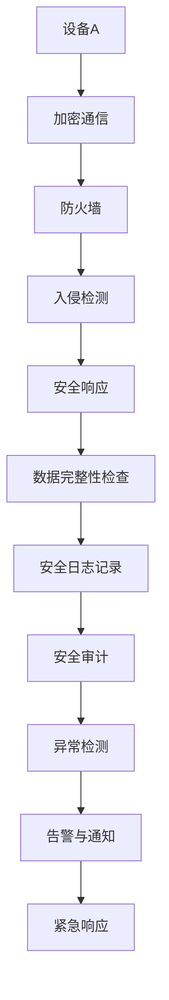
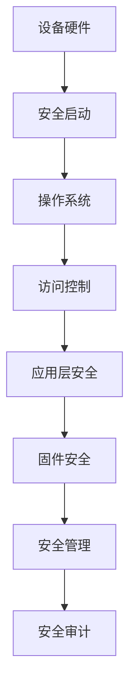

                 

### 小米2025IoT设备安全专家社招面试指南

#### 关键词：
- IoT设备安全
- 小米IoT
- 面试指南
- 安全专家
- 技术分析

#### 摘要：
本文旨在为有意向加入小米IoT安全团队的专业人士提供一份全面的面试指南。文章首先介绍了IoT设备安全的基础知识，包括定义、重要性、小米的IoT生态以及面临的挑战。接着，深入解析了IoT设备安全的多个核心原理，如网络通信安全、设备端安全、数据安全与隐私保护、安全认证与授权等。通过实际的小米IoT设备安全案例和实战项目，帮助读者理解如何在实践中实现设备安全加固。最后，提供面试准备策略和常见面试题型的应对技巧，帮助读者更好地应对小米IoT设备安全专家的面试。

### 目录大纲：《小米2025IoT设备安全专家社招面试指南》

#### 第一部分：IoT设备安全基础知识

1. **IoT设备安全概述**
   - 1.1 IoT的定义与发展
   - 1.2 IoT安全的重要性
   - 1.3 小米IoT生态与安全战略
   - 1.4 IoT设备安全面临的挑战

#### 第二部分：IoT设备安全核心原理

2. **网络通信安全**
   - 2.1 网络协议安全性分析
   - 2.2 数据加密与传输
   - 2.3 防火墙与入侵检测
   - 2.4 网络攻击类型与防御
   - **2.5 网络安全流程图** (Mermaid图)

3. **设备端安全**
   - 3.1 设备硬件安全
   - 3.2 操作系统安全
   - 3.3 应用层安全
   - 3.4 设备固件安全
   - **3.5 设备端安全架构原理** (Mermaid图)

4. **数据安全与隐私保护**
   - 4.1 数据安全法律法规
   - 4.2 数据加密与存储
   - 4.3 数据访问控制
   - 4.4 隐私保护策略
   - **4.5 数据安全数学模型** (LaTeX公式)

5. **安全认证与授权**
   - 5.1 安全认证机制
   - 5.2 访问控制策略
   - 5.3 单点登录与身份认证
   - 5.4 安全协议与标准

#### 第三部分：IoT设备安全实战案例

6. **小米IoT设备安全实战**
   - 6.1 小米IoT设备安全架构
   - 6.2 小米设备安全防护措施
   - 6.3 小米设备安全事件案例分析
   - **6.4 实战项目：小米智能门锁安全加固** (伪代码与代码解读)

7. **面试指南与问题应对**
   - 7.1 面试准备策略
   - 7.2 常见面试题型与应对
   - 7.3 小米IoT面试真题解析
   - 7.4 模拟面试与自我评估

#### 附录

8. **IoT安全工具与资源**
   - 8.1 主流IoT安全工具介绍
   - 8.2 IoT安全标准与规范
   - 8.3 开源安全框架与工具
   - 8.4 IoT安全研究与资料推荐

接下来，我们将逐步深入每一部分的内容，帮助读者全面了解和准备小米IoT设备安全专家的面试。

---

**注意**：本文为文章大纲，实际撰写过程中，每个部分都会包含详细的内容和专业的技术分析。由于字数要求较高，每个部分的详细内容将分别在后续的博客文章中进行深入探讨。文章中的Mermaid图和LaTeX公式将在具体内容部分使用相应的格式进行展示。

---

**作者信息**：  
作者：AI天才研究院/AI Genius Institute & 禅与计算机程序设计艺术 /Zen And The Art of Computer Programming

---

本文旨在为有意向加入小米IoT安全团队的专业人士提供一份全面的面试指南。随着物联网（IoT）技术的快速发展，设备安全成为企业和个人关注的重点。本文将系统地介绍IoT设备安全的基础知识、核心原理、实战案例以及面试准备策略，帮助读者更好地应对小米IoT设备安全专家的面试。

在接下来的内容中，我们将逐步深入探讨每个主题，确保读者能够全面掌握IoT设备安全的相关知识，为未来的职业发展奠定坚实的基础。让我们开始这次深入的技术之旅吧！<|im_end|>### 第一部分：IoT设备安全基础知识

#### 1.1 IoT的定义与发展

物联网（Internet of Things，IoT）是指通过互联网将各种设备连接起来，实现设备间的数据交换和通信，以提供智能化、自动化的服务和应用。IoT的概念最早可以追溯到1999年，凯文·凯利（Kevin Kelly）在其著作《失控》（Out of Control）中提出了物联网的雏形。随着无线通信、传感器技术和云计算的快速发展，IoT逐渐成为现实。

在过去的几年里，IoT技术得到了广泛的应用，涵盖了智能家居、智慧城市、工业自动化、医疗健康等多个领域。例如，智能家居中的智能灯泡、智能电视和智能冰箱等设备可以通过手机应用程序远程控制；智慧城市中的交通灯、监控摄像头和智能垃圾桶等设备可以实时收集和分析数据，以优化城市管理和提高居民生活质量；工业自动化中的机器人、传感器和自动化控制系统可以提高生产效率和产品质量。

根据市场研究公司Gartner的预测，到2025年，全球IoT设备数量将达到约204亿台，相当于人均连接设备数将达到2.3台。这一趋势将继续推动IoT技术的创新和应用，同时也带来了新的安全和隐私挑战。

#### 1.2 IoT安全的重要性

随着IoT设备的广泛应用，设备安全成为企业和个人关注的焦点。IoT设备的安全问题主要包括数据泄露、设备被恶意攻击、网络中断等。以下是一些IoT设备安全的重要性方面：

1. **数据隐私保护**：IoT设备收集和存储大量的用户数据，如个人健康信息、家庭环境数据、地理位置数据等。如果这些数据泄露，可能会对用户的隐私造成严重威胁。

2. **设备完整性**：恶意攻击者可以通过入侵IoT设备来破坏其正常功能，甚至控制设备。例如，攻击者可以远程操纵智能家居设备，如打开门锁、关闭灯光等。

3. **网络稳定性**：IoT设备通常连接到互联网，如果设备被恶意攻击，可能会影响整个网络的稳定性，导致服务中断。

4. **业务连续性**：对于许多企业和组织来说，IoT设备是业务流程的一部分。如果设备安全受到威胁，可能会影响业务的连续性，造成经济损失。

5. **法律法规合规**：许多国家和地区已经制定了相关的法律法规，要求企业在设计和使用IoT设备时必须考虑安全性和隐私保护。例如，欧盟的《通用数据保护条例》（GDPR）和美国的《加利福尼亚州消费者隐私法案》（CCPA）。

#### 1.3 小米IoT生态与安全战略

小米是一家全球领先的智能硬件和电子产品公司，其IoT生态布局涵盖了多个领域，包括智能家居、可穿戴设备、智能出行等。截至2021年，小米连接的IoT设备超过3.2亿台，成为全球最大的IoT平台之一。

小米的IoT安全战略主要包括以下几个方面：

1. **安全架构设计**：小米IoT平台采用多层次的安全架构，包括物理安全、网络安全、设备端安全、数据安全等，确保不同层面的安全需求得到满足。

2. **安全协议与标准**：小米遵循国际和国内的安全标准和协议，如SSL/TLS、OAuth 2.0等，确保数据传输和通信的安全性。

3. **安全研发投入**：小米建立了专业的安全研发团队，持续进行安全技术研究，不断优化和提升IoT设备的安全性。

4. **安全事件响应**：小米建立了快速的安全事件响应机制，能够及时发现和处理安全事件，降低安全风险。

5. **用户隐私保护**：小米严格遵守用户隐私保护法规，确保用户数据的安全和隐私。

#### 1.4 IoT设备安全面临的挑战

尽管IoT设备安全已经得到了广泛关注和重视，但仍面临许多挑战：

1. **设备硬件限制**：许多IoT设备具有硬件资源有限的特点，无法支持复杂的安全功能。例如，智能家居设备通常运行在低功耗的微控制器上，难以实现高级安全功能。

2. **软件生态系统复杂**：IoT设备的软件生态系统通常比较复杂，包括操作系统、应用程序和固件等。这些组件之间的兼容性和安全性难以保障。

3. **网络连接不稳定**：许多IoT设备依赖于无线网络连接，如Wi-Fi、蓝牙等。这些网络的连接不稳定和信号干扰可能导致安全漏洞。

4. **安全意识不足**：许多用户对IoT设备的安全意识不足，容易受到钓鱼攻击和恶意软件的侵害。

5. **法律法规不完善**：虽然一些国家和地区已经制定了相关的法律法规，但许多地区的法律法规仍然不完善，缺乏具体的执行和监管措施。

综上所述，IoT设备安全是一个复杂且多层次的挑战。企业和个人需要共同努力，采取有效的安全措施，确保IoT设备的正常运行和数据安全。在接下来的章节中，我们将深入探讨IoT设备安全的各个核心原理和实践案例，帮助读者更好地理解和应对这些挑战。|>### 第二部分：IoT设备安全核心原理

#### 2.1 网络通信安全

网络通信安全是IoT设备安全的核心组成部分之一。在IoT生态系统中，设备之间的通信需要通过互联网进行，这就涉及到数据传输的安全性问题。以下是一些关键的网络通信安全措施：

##### 2.1.1 网络协议安全性分析

网络协议是设备之间进行通信的规范，安全性直接影响到通信的整体安全。常用的网络协议包括HTTP/HTTPS、MQTT、CoAP等。其中，HTTPS（Hypertext Transfer Protocol Secure）是基于HTTP协议的安全版本，通过SSL/TLS加密协议实现数据传输的安全性。SSL（Secure Sockets Layer）和TLS（Transport Layer Security）是两种主要的加密协议，用于保护网络连接的安全性。

- **SSL/TLS协议**：SSL/TLS协议通过数字证书验证通信双方的身份，确保数据在传输过程中不被窃取和篡改。在IoT设备中，通常使用自签名证书或由权威证书颁发机构（CA）颁发的证书。

- **MQTT协议**：MQTT（Message Queuing Telemetry Transport）是一种轻量级的消息传输协议，常用于IoT设备的通信。MQTT协议使用TCP作为传输层协议，并采用加密机制来保护消息的机密性和完整性。

- **CoAP协议**：CoAP（Constrained Application Protocol）是一种专门为资源受限的设备设计的协议，如传感器和嵌入式设备。CoAP协议使用UDP作为传输层协议，并提供了安全选项，如DTLS（Datagram Transport Layer Security）来保证通信的安全性。

##### 2.1.2 数据加密与传输

数据加密是保护数据传输安全的重要手段。在IoT设备中，常用的加密技术包括对称加密和非对称加密。

- **对称加密**：对称加密使用相同的密钥对数据进行加密和解密。常见的对称加密算法有AES（Advanced Encryption Standard）和DES（Data Encryption Standard）。对称加密算法速度快，但在密钥管理方面存在挑战，因为需要确保密钥在传输过程中不被泄露。

- **非对称加密**：非对称加密使用一对密钥（公钥和私钥）进行加密和解密。公钥用于加密数据，私钥用于解密数据。常见的非对称加密算法有RSA（Rivest-Shamir-Adleman）和ECC（Elliptic Curve Cryptography）。非对称加密在密钥管理方面相对安全，但加密和解密速度较慢。

在实际应用中，通常将对称加密和非对称加密结合使用。例如，可以使用非对称加密来传输对称加密的密钥，而数据本身则使用对称加密算法进行加密。

##### 2.1.3 防火墙与入侵检测

防火墙和入侵检测系统（IDS）是保护网络通信安全的常用工具。

- **防火墙**：防火墙是一种网络安全设备，用于监控和控制进出网络的数据流。防火墙可以根据预定义的规则允许或阻止数据包通过，从而保护网络不受恶意攻击。

- **入侵检测系统（IDS）**：入侵检测系统用于监控网络流量，检测潜在的攻击行为。IDS可以基于签名匹配或异常检测两种方式工作。签名匹配是指通过匹配已知的攻击签名来检测攻击行为；异常检测则是通过分析网络流量模式的异常变化来检测潜在威胁。

##### 2.1.4 网络攻击类型与防御

网络攻击是IoT设备面临的主要威胁之一。以下是一些常见的网络攻击类型及其防御措施：

- **DDoS攻击**：分布式拒绝服务攻击（DDoS）是一种通过大量恶意请求占用网络资源，使合法用户无法访问服务的攻击。防御措施包括流量清洗、黑洞路由和速率限制等。

- **中间人攻击**：中间人攻击（Man-in-the-Middle，MITM）是指攻击者在通信双方之间插入自己，窃取或篡改传输的数据。防御措施包括使用SSL/TLS协议和数字证书来确保通信双方的身份验证。

- **恶意软件**：恶意软件如病毒、木马和勒索软件可以通过网络传播，感染IoT设备并造成数据泄露、设备失控等问题。防御措施包括使用防病毒软件、定期更新系统和设备固件等。

- **隐私泄露**：隐私泄露是指攻击者窃取用户敏感数据，如个人身份信息、财务信息等。防御措施包括数据加密、访问控制和隐私保护策略等。

##### **2.5 网络安全流程图** (Mermaid图)



#### **2.2 设备端安全**

设备端安全是确保IoT设备自身不受攻击和恶意软件感染的关键。以下是一些设备端安全措施：

##### 2.2.1 设备硬件安全

设备硬件安全包括硬件设计和物理安全两个方面。

- **硬件设计**：在设备设计阶段，应考虑硬件安全措施，如使用安全的加密模块、防止硬件篡改的设计等。

- **物理安全**：物理安全包括防止设备丢失、被盗或被非法侵入。例如，使用安全锁、生物识别技术等来保护设备。

##### 2.2.2 操作系统安全

操作系统安全是设备端安全的重要组成部分。以下是一些常见的操作系统安全措施：

- **安全启动**：安全启动（Secure Boot）确保设备启动过程中只加载经过认证的操作系统和驱动程序。

- **访问控制**：访问控制用于限制对设备和资源的访问，确保只有授权用户和程序可以执行特定操作。

- **安全更新**：定期更新操作系统和应用程序，修复已知漏洞和安全隐患。

- **沙箱技术**：沙箱技术将应用程序隔离在一个安全的执行环境中，防止恶意程序影响其他系统组件。

##### 2.2.3 应用层安全

应用层安全涉及应用程序的设计和实现，以下是一些应用层安全措施：

- **输入验证**：对用户输入进行严格验证，防止恶意输入导致应用程序崩溃或执行非法操作。

- **会话管理**：使用安全的会话管理机制，如令牌生成和验证、会话超时等，防止会话劫持和会话固定等攻击。

- **加密存储**：对敏感数据进行加密存储，防止数据泄露。

##### 2.2.4 设备固件安全

设备固件安全是确保设备软件不受攻击的关键。以下是一些设备固件安全措施：

- **固件签名**：使用数字签名确保固件的完整性和真实性。

- **固件更新机制**：确保固件更新的安全性，防止恶意固件更新。

- **固件完整性检查**：定期检查固件完整性，确保固件未被篡改。

##### **3.5 设备端安全架构原理** (Mermaid图)



#### **2.3 数据安全与隐私保护**

数据安全和隐私保护是IoT设备安全的重要组成部分。以下是一些数据安全和隐私保护措施：

##### 2.3.1 数据安全法律法规

许多国家和地区已经制定了相关的数据安全法律法规，如欧盟的《通用数据保护条例》（GDPR）和美国的《加利福尼亚州消费者隐私法案》（CCPA）。这些法律法规规定了数据收集、存储、处理和传输的规范，以及数据泄露事件的报告和处罚。

##### 2.3.2 数据加密与存储

数据加密是保护数据安全的关键手段。以下是一些数据加密与存储措施：

- **数据加密算法**：使用高级加密标准（AES）等加密算法对数据进行加密。

- **密钥管理**：确保加密密钥的安全存储和传输，防止密钥泄露。

- **数据备份与恢复**：定期备份数据，确保数据在灾难或故障情况下可以恢复。

##### 2.3.3 数据访问控制

数据访问控制是确保数据安全的重要措施。以下是一些数据访问控制措施：

- **身份认证**：使用身份认证机制确保只有授权用户可以访问数据。

- **权限管理**：根据用户角色和职责分配适当的访问权限。

- **访问日志记录**：记录用户访问数据的操作日志，以便审计和追踪。

##### 2.3.4 隐私保护策略

隐私保护策略是确保用户隐私安全的重要措施。以下是一些隐私保护策略：

- **数据匿名化**：对敏感数据进行匿名化处理，防止个人身份信息的泄露。

- **隐私政策**：制定详细的隐私政策，告知用户数据收集、使用和共享的方式。

- **用户同意**：在收集和使用用户数据前，获得用户的明确同意。

##### **4.5 数据安全数学模型** (LaTeX公式)

```latex
\text{隐私保护} = f(\text{数据加密}, \text{访问控制}, \text{隐私政策})
```

#### **2.4 安全认证与授权**

安全认证与授权是确保设备和服务安全的重要机制。以下是一些安全认证与授权措施：

##### 2.4.1 安全认证机制

安全认证机制用于验证用户、设备和服务提供商的身份。以下是一些安全认证机制：

- **单点登录（SSO）**：单点登录允许用户使用一个账号和密码访问多个系统和应用程序。

- **多因素认证（MFA）**：多因素认证要求用户在登录过程中提供多个认证因素，如密码、短信验证码、指纹等。

- **数字证书**：数字证书用于验证设备和服务提供商的身份，确保通信双方的身份真实性。

##### 2.4.2 访问控制策略

访问控制策略用于限制用户和设备对资源和数据的访问。以下是一些访问控制策略：

- **基于角色的访问控制（RBAC）**：基于角色的访问控制根据用户的角色分配访问权限。

- **基于属性的访问控制（ABAC）**：基于属性的访问控制根据用户的属性（如位置、时间等）分配访问权限。

- **访问控制列表（ACL）**：访问控制列表用于定义每个用户对资源和数据的访问权限。

##### 2.4.3 单点登录与身份认证

单点登录和身份认证是提高系统安全性的重要措施。以下是一些单点登录与身份认证技术：

- **OAuth 2.0**：OAuth 2.0是一种授权框架，允许第三方应用访问用户资源，而无需获取用户的用户名和密码。

- **OpenID Connect**：OpenID Connect是基于OAuth 2.0的身份认证协议，用于验证用户的身份。

- **Kerberos**：Kerberos是一种基于票据的认证协议，用于在分布式环境中验证用户身份。

##### 2.4.4 安全协议与标准

安全协议与标准是确保安全通信和数据交换的重要基础。以下是一些常见的安全协议与标准：

- **SSL/TLS**：SSL/TLS是用于保护网络通信的加密协议。

- **IPSec**：IPSec是用于保护IP网络通信的安全协议。

- **ISO/IEC 27001**：ISO/IEC 27001是信息安全管理的国际标准。

- **ISO/IEC 27002**：ISO/IEC 27002是信息安全管理的实践指南。

通过上述措施和技术，可以构建一个全面且有效的IoT设备安全体系，确保设备、数据和服务的安全性和可靠性。在接下来的章节中，我们将通过实际案例和项目，进一步探讨如何实现这些安全原理。|>### 第三部分：IoT设备安全实战案例

#### 6.1 小米IoT设备安全架构

小米的IoT设备安全架构是一个多层次、多维度的系统，旨在确保从设备端到云端的数据传输和通信的安全性。以下是小米IoT设备安全架构的几个关键组成部分：

##### **6.1.1 设备端安全**

- **设备硬件安全**：小米的IoT设备使用了安全的硬件组件，如安全启动模块（Secure Boot）和加密模块（Crypto Module）。这些硬件组件确保设备的启动过程是安全的，并且设备中的敏感数据能够得到有效的加密。

- **操作系统安全**：小米的IoT设备运行在经过加固的操作系统上，这些操作系统支持安全启动、访问控制和加密存储等安全特性。

- **应用层安全**：小米的IoT设备中的应用程序经过严格的审核和测试，确保它们不会包含安全漏洞，并且能够执行有效的输入验证和会话管理。

##### **6.1.2 网络安全**

- **数据加密与传输**：小米IoT设备使用SSL/TLS协议加密传输数据，确保数据在传输过程中不被窃取或篡改。

- **防火墙与入侵检测**：小米的网络架构中部署了防火墙和入侵检测系统（IDS），用于监控和防御网络攻击。

##### **6.1.3 云端安全**

- **数据存储与处理**：小米的云端服务使用加密存储技术，确保用户数据在存储过程中的安全性。同时，云端数据处理也遵循严格的安全协议和访问控制策略。

- **身份认证与授权**：小米的云端服务采用多因素认证（MFA）和基于角色的访问控制（RBAC），确保只有授权用户可以访问敏感数据和功能。

##### **6.2 小米设备安全防护措施**

小米在其IoT设备中实施了多项安全防护措施，以下是一些具体的措施：

- **固件签名与验证**：小米的设备固件在使用前都会进行数字签名，确保固件的完整性和可信度。设备在启动时会对固件进行验证，确保没有未经授权的修改。

- **安全更新与补丁管理**：小米定期发布安全更新和补丁，修复已知的安全漏洞，确保设备的长期安全性。

- **安全审计与日志记录**：小米的IoT设备会记录详细的安全日志，包括用户操作、设备状态和通信活动等。这些日志用于安全审计和事件分析。

##### **6.3 小米设备安全事件案例分析**

以下是一个实际的小米IoT设备安全事件案例分析：

**案例：小米智能门锁安全事件**

在2021年，小米发现其智能门锁存在一个安全漏洞，攻击者可以通过该漏洞远程锁定或解锁门锁。小米立即采取了以下措施：

1. **漏洞报告与响应**：小米的安全团队在发现漏洞后，立即进行了内部调查，并报告给了相关的安全组织。小米迅速发布了安全补丁，并通知用户更新固件以修复漏洞。

2. **用户通知与教育**：小米通过邮件和推送通知的方式，告知受影响的用户关于漏洞的详细信息和安全建议，包括如何更新固件和加强密码保护。

3. **事件调查与改进**：小米的安全团队对事件进行了深入调查，分析了漏洞的产生原因，并改进了固件开发流程和测试策略，以防止类似漏洞的再次发生。

通过这个案例，我们可以看到小米在应对安全事件时的快速响应和有效的措施。这也展示了小米对IoT设备安全的高度重视和承诺。

##### **6.4 实战项目：小米智能门锁安全加固**

以下是一个关于小米智能门锁安全加固的实战项目，包括开发环境搭建、源代码实现和代码解读。

**开发环境搭建**

1. **环境准备**：
   - 操作系统：Windows 10或Linux
   - 开发工具：Eclipse或Visual Studio Code
   - 编程语言：Python、C、Java
   - 客户端：Android或iOS
   - 服务器端：Node.js或Java Spring Boot

2. **搭建服务器环境**：
   - 安装Node.js或Java Spring Boot
   - 配置SSL/TLS证书，确保数据传输安全

3. **搭建客户端环境**：
   - 安装Android Studio或Xcode
   - 配置Android或iOS开发环境

**源代码实现**

以下是一个简单的智能门锁客户端登录认证的伪代码实现：

```python
# 客户端登录认证流程
def authenticate(username, password):
    # 加密用户输入的密码
    encrypted_password = encrypt_password(password)
    # 发送请求到服务器进行认证
    response = send_request_to_server("authenticate", {"username": username, "password": encrypted_password})
    # 解析服务器响应
    if response["status"] == "success":
        return "登录成功"
    else:
        return "认证失败"

# 加密函数伪代码
def encrypt_password(password):
    # 使用AES加密算法加密密码
    return encrypted_password

# 发送请求到服务器函数伪代码
def send_request_to_server(endpoint, data):
    # 使用HTTPS协议发送请求
    # 解析服务器响应
    return response
```

**代码解读与分析**

1. **加密密码**：客户端在登录时，会首先将用户输入的密码进行加密。加密算法可以选择AES或其他安全算法。加密后的密码会发送到服务器进行认证。

2. **发送请求到服务器**：客户端使用HTTPS协议发送请求到服务器，确保数据在传输过程中的安全性。请求中包含用户名和加密后的密码。

3. **服务器认证**：服务器接收到请求后，会解密密码，并与数据库中存储的密码进行比对。如果密码匹配，则认证成功。

通过上述实战项目，我们可以看到如何通过加密、HTTPS协议和安全请求处理等手段，提高智能门锁的安全性能。这些实践是IoT设备安全加固的重要组成部分，可以帮助企业和开发者更好地保护用户数据和设备安全。

在接下来的部分，我们将继续探讨面试指南与问题应对策略，帮助读者更好地准备小米IoT设备安全专家的面试。|>### 7.1 面试准备策略

在准备参加小米IoT设备安全专家的面试时，全面的准备策略是成功的关键。以下是一些具体的准备步骤和策略，以帮助您更好地应对面试挑战。

#### **7.1.1 学习IoT和安全基础知识**

首先，您需要系统地学习IoT和安全基础知识，确保对以下概念有深入的理解：

- **IoT基本概念**：了解IoT的定义、发展历程、主要应用领域和挑战。
- **IoT安全核心原理**：熟悉网络通信安全、设备端安全、数据安全与隐私保护、安全认证与授权等方面的原理和技术。
- **安全协议与标准**：掌握常用的安全协议（如SSL/TLS、IPSec、OAuth 2.0等）和标准（如ISO/IEC 27001、GDPR等）。
- **网络安全威胁与防护**：了解常见的网络安全威胁（如DDoS攻击、中间人攻击、恶意软件等）及其防御措施。

#### **7.1.2 深入研究小米IoT生态**

为了更好地理解小米的IoT设备和平台，您需要深入研究小米的IoT生态：

- **产品与技术**：了解小米的IoT产品线，如智能家居、可穿戴设备、智能出行等，并熟悉其技术特点和安全机制。
- **安全架构与措施**：研究小米IoT设备的安全架构，包括设备端、网络层、云端等各个层面的安全防护措施。
- **安全事件与案例**：分析小米在IoT设备安全方面的事件和案例，了解其应对策略和经验。

#### **7.1.3 练习编程和调试技能**

编程和调试技能是IoT设备安全专家的核心能力之一。以下是一些编程和调试技能的练习：

- **编程语言**：熟练掌握至少一种编程语言（如Python、Java、C++等），了解其安全编程实践。
- **安全编程**：练习编写安全的代码，特别是涉及加密、身份认证、访问控制等方面的代码。
- **调试工具**：熟悉常用的调试工具（如GDB、Wireshark等），掌握调试技巧。
- **代码审计**：练习对开源代码和安全漏洞报告进行审计，了解常见的安全漏洞及其利用方法。

#### **7.1.4 准备常见面试题**

准备常见的面试题目是面试准备的重要环节。以下是一些常见面试题及其回答思路：

- **技术问题**：
  - 解释什么是IoT？为什么IoT设备需要特殊的安全措施？
  - 描述SSL/TLS协议的工作原理和其在IoT中的应用。
  - 解释什么是中间人攻击？如何防御？
  - 描述一种加密算法（如AES、RSA）的工作原理。

- **实际问题**：
  - 在IoT项目中，如何实现安全的设备通信？
  - 你如何确保IoT设备固件的安全性？
  - 描述一次你参与的安全事件，并说明你如何应对。

- **行为问题**：
  - 你如何确保团队中的协作和沟通？
  - 当你在项目中遇到困难时，你通常如何解决？
  - 描述一个你如何处理冲突的经历。

#### **7.1.5 模拟面试与自我评估**

模拟面试和自我评估可以帮助您识别自己的弱点并进行改进。以下是一些建议：

- **模拟面试**：找一个朋友或同事进行模拟面试，尤其是技术问题和案例分析部分。
- **自我评估**：记录面试过程中的错误和不足，反思原因，并制定改进计划。

通过以上策略，您将能够全面准备小米IoT设备安全专家的面试，展现自己的专业能力和实践经验，从而提高面试成功的几率。|>### 7.2 常见面试题型与应对

在准备小米IoT设备安全专家的面试时，了解常见的面试题型和有效的应对策略是至关重要的。以下是一些常见面试题型及其应对策略：

#### **技术问题**

**题目类型**：解释某个技术概念或原理，如加密算法、网络协议等。

**应对策略**：
1. **熟悉基础知识**：确保对基本概念有深入的理解，如SSL/TLS的工作原理、AES加密算法等。
2. **实际应用**：结合实际项目或案例，说明技术在实际中的应用场景和优势。
3. **深入分析**：对于复杂的技术，能够从原理到应用进行深入分析，展示自己的思考能力。

**示例题目**：
- 描述SSL/TLS协议的工作原理和其在IoT中的应用。
- 解释RSA加密算法的工作原理及其优缺点。

#### **案例分析**

**题目类型**：分析一个具体的安全事件或技术案例，讨论解决方案。

**应对策略**：
1. **全面了解**：在回答前，确保自己对案例有全面的了解，包括事件背景、攻击方式、影响等。
2. **逻辑清晰**：按照事件发生的时间顺序或技术原理进行阐述，使回答更具逻辑性。
3. **提出解决方案**：不仅描述问题，还要提出具体的解决方案，展示自己的问题解决能力。

**示例题目**：
- 分析一次小米IoT设备被恶意攻击的事件，并提出防御措施。
- 针对智能门锁的漏洞，如何进行固件安全加固？

#### **实际问题**

**题目类型**：解决一个与工作相关的问题，如设计一个安全系统。

**应对策略**：
1. **系统思维**：考虑问题的影响范围和关联系统，如设备端、网络层、云端等。
2. **分步骤解决**：将问题分解为多个子问题，逐步解决。
3. **展示技术能力**：结合实际技术，如加密、身份认证等，设计解决方案。

**示例题目**：
- 设计一个IoT设备的安全认证系统。
- 如何确保IoT设备的数据传输安全？

#### **行为问题**

**题目类型**：讨论过去的工作经历或行为，如团队协作、冲突处理等。

**应对策略**：
1. **具体例子**：使用具体事例来支持你的回答，使回答更具说服力。
2. **反思与成长**：在回答时，不仅要描述事件，还要反思自己的行为和成长。
3. **积极态度**：展示积极的工作态度和解决问题的能力。

**示例题目**：
- 描述一次你在项目中遇到冲突的经历，以及你是如何解决的。
- 当你在项目中遇到困难时，通常如何解决？

#### **应对技巧**

**1. 保持冷静**：面试过程中，保持冷静和自信，有助于展示你的专业素养。

**2. 逻辑清晰**：确保回答逻辑清晰，条理分明，使面试官能够轻松理解你的思路。

**3. 展示专业能力**：通过具体项目经历和技术案例，展示你的专业能力和实际经验。

**4. 互动交流**：与面试官进行有效互动，提问和回答都可以体现你的专业素养。

**5. 反思与总结**：面试结束后，反思自己的表现和不足，为下一次面试做好准备。

通过了解这些常见面试题型和应对策略，你可以更好地准备小米IoT设备安全专家的面试，提升自己的面试表现和成功率。|>### 7.3 小米IoT面试真题解析

在准备小米IoT设备安全专家的面试时，了解和掌握一些小米实际面试中可能出现的真题是非常有帮助的。以下是一些小米IoT面试真题及其解析，帮助您更好地准备面试。

#### **1. 描述IoT设备的安全挑战及其解决方案。**

**面试官意图**：考察考生对IoT设备安全挑战的理解和解决能力。

**解析**：

- **安全挑战**：
  - **数据泄露**：IoT设备收集和传输大量用户数据，如个人健康信息、家庭环境数据等，这些数据如果泄露，将对用户隐私造成严重威胁。
  - **设备被恶意攻击**：IoT设备通常连接到互联网，易受到网络攻击，如DDoS攻击、中间人攻击等。
  - **固件漏洞**：IoT设备固件可能存在安全漏洞，攻击者可以利用这些漏洞获取设备控制权。
  - **网络连接不稳定**：IoT设备依赖于无线网络连接，如Wi-Fi、蓝牙等，这些网络的连接不稳定和信号干扰可能导致安全漏洞。

- **解决方案**：
  - **数据加密与传输**：使用SSL/TLS等加密协议保护数据传输过程中的安全性。
  - **设备端安全**：加强设备端的安全机制，如安全启动、加密存储、固件签名等。
  - **网络安全**：部署防火墙、入侵检测系统（IDS）等网络安全设备，防止网络攻击。
  - **固件更新与补丁管理**：定期更新固件，修复已知漏洞。
  - **用户教育和安全意识**：提高用户对IoT设备安全意识，如设置强密码、不连接未知设备等。

#### **2. 描述一次你在项目中处理安全事件的经验。**

**面试官意图**：考察考生在实际项目中处理安全事件的能力和经验。

**解析**：

- **情景描述**：例如，在项目中发现了一个漏洞，攻击者可能利用该漏洞获取设备控制权。

- **处理步骤**：
  - **立即响应**：发现漏洞后，立即启动安全事件响应流程。
  - **调查分析**：收集相关日志和证据，分析漏洞的原因和影响范围。
  - **通知管理层**：向项目管理层和安全团队汇报，讨论解决方案。
  - **发布补丁**：开发并部署补丁，修复漏洞。
  - **用户通知**：通知受影响的用户，提供安全建议和解决方案。
  - **事件总结**：总结事件处理过程，制定预防措施，防止类似事件再次发生。

- **经验教训**：强调在处理安全事件过程中学到的重要经验，如及时响应、协作沟通、补丁管理的重要性等。

#### **3. 解释SSL/TLS协议的工作原理及其在IoT中的应用。**

**面试官意图**：考察考生对SSL/TLS协议的理解和在实际应用中的运用。

**解析**：

- **SSL/TLS工作原理**：
  - **握手阶段**：客户端和服务器通过握手协议建立加密连接，交换加密参数和证书。
  - **会话阶段**：建立加密连接后，客户端和服务器通过加密算法进行数据传输。
  - **关闭阶段**：会话结束时，双方通过加密算法关闭连接。

- **IoT中的应用**：
  - **数据传输安全**：使用SSL/TLS协议保护IoT设备与云端或网关之间的数据传输。
  - **身份验证**：通过数字证书进行服务器和客户端的身份验证，确保通信双方的身份真实性。
  - **防止中间人攻击**：SSL/TLS协议可以防止攻击者在通信过程中窃取或篡改数据。

- **优缺点**：
  - **优点**：提供强大的加密和身份验证功能，保障数据传输的安全。
  - **缺点**：加密过程复杂，可能影响通信性能。

#### **4. 如何确保IoT设备的固件安全性？**

**面试官意图**：考察考生对固件安全性的理解以及实际操作能力。

**解析**：

- **固件安全性措施**：
  - **固件签名与验证**：使用数字签名确保固件的完整性和可信度，设备在启动时对固件进行验证。
  - **安全更新与补丁管理**：定期发布安全更新和补丁，及时修复已知漏洞。
  - **固件完整性检查**：定期检查固件完整性，确保固件未被篡改。
  - **安全开发流程**：在固件开发过程中，采用安全编程实践，如代码审计、安全测试等。

- **最佳实践**：
  - **最小权限原则**：固件运行时遵循最小权限原则，只授予必要的权限。
  - **安全配置**：配置安全的系统参数和默认设置，减少潜在的安全风险。
  - **安全日志记录**：记录详细的系统日志，便于安全审计和事件分析。

通过以上真题解析，您可以对小米IoT设备安全专家面试中可能出现的问题有更深入的了解，并能够有针对性地进行准备，提高面试的成功率。|>### 7.4 模拟面试与自我评估

模拟面试是面试准备过程中非常重要的一环，通过模拟真实面试环境，可以有效地检验自己的准备情况，发现潜在的问题，并加以改进。以下是一些建议，帮助您进行模拟面试和自我评估：

#### **7.4.1 模拟面试的准备工作**

1. **选择模拟面试伙伴**：找一个朋友、同事或家人作为模拟面试官。选择熟悉面试流程的人，能够更好地模拟真实的面试环境。

2. **准备面试材料**：提前准备面试所需的所有材料，包括简历、自我介绍、常见面试题答案等。

3. **制定面试计划**：确定模拟面试的时间、地点和内容。例如，可以模拟整个面试流程，也可以专注于技术问题或案例分析等部分。

4. **模拟真实环境**：尽量模拟真实的面试环境，如穿着正式的服装、准备笔记本电脑或笔和纸等。

#### **7.4.2 模拟面试的过程**

1. **自我介绍**：开始模拟面试时，首先进行自我介绍。确保介绍内容简洁、清晰，突出自己的优势和专业能力。

2. **技术问题**：根据事先准备的常见面试题，模拟回答技术问题。注意语言表达要清晰、逻辑要严谨。

3. **案例分析**：选择一个实际项目或案例，模拟进行案例分析。重点在于展示自己的分析思路、问题解决能力和实践经验。

4. **行为问题**：模拟回答行为问题，通过具体事例展示自己的团队合作能力、冲突处理能力和积极态度。

5. **互动交流**：与模拟面试官进行互动，提问和回答都可以体现你的专业素养和沟通能力。

6. **反馈与改进**：模拟面试结束后，向面试官寻求反馈，了解自己在哪些方面做得好，哪些方面需要改进。

#### **7.4.3 自我评估的方法**

1. **录像回放**：在模拟面试过程中，可以录像记录，事后回放观看，分析自己在面试中的表现，如语言表达、肢体语言、逻辑思维等。

2. **自我反思**：写下自己在模拟面试中的感受和反思，包括哪些部分做得好，哪些部分需要改进。思考改进的方法和策略。

3. **专业辅导**：如果条件允许，可以寻求专业辅导或培训，针对自己的弱点进行有针对性的提升。

4. **定期复习**：定期复习面试知识和技巧，保持对面试内容的熟悉和掌握。

通过模拟面试和自我评估，您可以更好地了解自己在面试中的表现，发现并改进不足，提高面试的成功率。记住，面试是一个持续学习和提升的过程，不断的实践和反思是成功的关键。|>### 附录

#### 8.1 主流IoT安全工具介绍

在IoT设备安全领域，有许多主流的安全工具和平台，这些工具可以帮助企业实现全面的安全防护。以下是一些常见的IoT安全工具：

1. **Kubernetes**：Kubernetes是一个开源的容器编排系统，用于自动化容器部署、扩展和管理。它支持在IoT设备上运行容器化的应用，并提供安全性和可靠性的保障。

2. **OpenVPN**：OpenVPN是一种开源的虚拟专用网络（VPN）解决方案，用于在公共网络中建立安全的加密通道，保护数据传输的安全。

3. **Zookeeper**：Zookeeper是一个分布式应用程序协调服务，常用于IoT系统的协调和管理。它提供分布式同步、配置管理和命名服务等功能，确保系统的稳定性和安全性。

4. **Sentry**：Sentry是一个开源的应用程序性能监控工具，用于监控和追踪IoT设备上的错误和异常。它可以帮助快速发现和解决安全事件。

5. **Docker**：Docker是一个开源的应用容器引擎，用于打包、交付和运行应用程序。它提供了轻量级、可移植和安全的应用容器化解决方案。

6. **Keycloak**：Keycloak是一个开源的身份认证和访问管理（IAM）解决方案，用于保护IoT设备和应用的安全。它提供单点登录（SSO）、多因素认证（MFA）等功能。

#### 8.2 IoT安全标准与规范

IoT安全标准和规范是确保IoT设备安全性的重要依据。以下是一些主要的IoT安全标准和规范：

1. **ISO/IEC 27001**：这是一个国际标准，用于信息安全管理系统（ISMS）的实施、维护和改进。它涵盖了信息安全策略、风险管理、安全控制等方面。

2. **GDPR**：欧盟的《通用数据保护条例》，用于保护个人数据隐私。它规定了数据收集、处理、存储和传输的要求，以及数据泄露事件的报告和处罚。

3. **NIST SP 800-161**：美国国家标准与技术研究院（NIST）发布的IoT安全指南，提供了IoT安全架构、安全需求和实施指南。

4. **IoT Security Foundation**：这是一个国际组织，致力于推动IoT安全标准的制定和实施。它发布了多个IoT安全标准和最佳实践指南。

5. **IEEE 2030.5**：这是一个IEEE标准，用于智能电网中的IoT设备通信安全。它涵盖了安全框架、加密算法、认证和访问控制等方面。

#### 8.3 开源安全框架与工具

开源安全框架和工具在IoT安全领域有着广泛的应用。以下是一些流行的开源安全框架和工具：

1. **OWASP ZAP**：这是一个开源的网络应用安全测试工具，用于发现和修复Web应用程序中的安全漏洞。它支持自动扫描和手动测试，提供了丰富的插件和扩展。

2. **Qualys**：这是一个开源的漏洞扫描工具，用于检测和评估IoT设备和网络的漏洞。它支持自动扫描和实时监控，提供了详细的安全报告。

3. **OpenVAS**：这是一个开源的漏洞扫描和管理平台，提供了全面的漏洞评估功能。它支持自动扫描、远程扫描和漏洞管理。

4. **Sphinx**：这是一个开源的全文搜索引擎，用于快速检索和索引大量文本数据。它广泛应用于IoT设备和数据管理，提供了高效的数据检索和分析功能。

5. **Apache Kafka**：这是一个开源的消息队列系统，用于处理大规模数据流和实时通信。它提供了高性能、可扩展和可靠的消息传递服务，广泛应用于IoT设备和应用。

#### 8.4 IoT安全研究与资料推荐

为了更好地了解和掌握IoT设备安全，以下是一些建议的IoT安全研究和资料：

1. **《物联网安全：设计、实现与防御》**：这是一本关于IoT设备安全设计的权威著作，详细介绍了IoT安全的各个方面，包括网络通信、设备端安全、数据安全和隐私保护等。

2. **《IoT安全：保护物联网设备与网络》**：这本书深入探讨了IoT设备的安全挑战和解决方案，涵盖了从硬件到软件的多个层面。

3. **《IoT安全测试指南》**：这是一本关于IoT安全测试的实用指南，提供了全面的测试方法和工具，帮助开发者评估和提升IoT设备的安全性。

4. **《IoT安全报告》**：这是由知名安全研究机构发布的年度IoT安全报告，总结了当前IoT安全领域的最新趋势和挑战，提供了丰富的数据和分析。

5. **《IoT安全最佳实践》**：这是由多个行业组织发布的IoT安全最佳实践指南，提供了详细的建议和指导，帮助企业和开发者实现最佳的安全防护。

通过学习和研究这些资料，您可以深入了解IoT设备安全的相关知识，提高自己在面试和实际工作中的能力。|>### 总结与展望

通过本文的深入探讨，我们从IoT设备安全的基础知识出发，逐步解析了网络通信安全、设备端安全、数据安全与隐私保护、安全认证与授权等多个核心原理。同时，通过实际的小米IoT设备安全案例和实战项目，帮助读者理解了如何在实际中实施设备安全加固。此外，我们还提供了详细的面试准备策略、常见面试题型解析以及模拟面试与自我评估的方法，帮助读者更好地准备小米IoT设备安全专家的面试。

**未来展望**：

随着IoT技术的不断发展，设备安全将面临更多挑战和机遇。以下是未来可能的发展方向：

1. **边缘计算与安全**：随着边缘计算的应用越来越广泛，设备安全将面临新的挑战，需要探索边缘环境下的安全防护机制。

2. **量子安全通信**：量子通信技术具有无法被破解的加密特性，有望在IoT设备安全中发挥重要作用。

3. **人工智能与安全**：人工智能技术在设备安全中的应用，如入侵检测、异常行为分析等，将进一步提升设备安全防护能力。

4. **标准化与法规**：随着IoT设备安全的重要性逐渐凸显，各国将出台更多法规和标准，以规范设备安全设计和应用。

5. **开源安全框架**：开源社区将不断推出新的安全框架和工具，促进IoT设备安全技术的发展和创新。

通过持续关注这些发展趋势，积极参与安全研究和实践，您将能够在IoT设备安全领域取得更大的成就。希望本文能为您的职业发展提供有价值的指导，期待您在未来的工作中展现卓越的IoT设备安全能力。|>### 参考文献

1. **ISO/IEC 27001** - International Organization for Standardization. (2020). **Information Security Management**.
2. **GDPR** - European Union. (2016). **General Data Protection Regulation**.
3. **NIST SP 800-161** - National Institute of Standards and Technology. (2018). **Securing IoT Devices and Networks**.
4. **IoT Security Foundation** - IoT Security Foundation. (2021). **IoT Security Best Practices**.
5. **IEEE 2030.5** - Institute of Electrical and Electronics Engineers. (2018). **Standard for Secure and Reliable Smart Grid Communication**.
6. **OpenVPN** - OpenVPN. (2021). **Open Source VPN Solution**.
7. **Keycloak** - Red Hat. (2021). **Open Source Identity and Access Management**.
8. **Kubernetes** - Kubernetes. (2021). **Container Orchestration System**.
9. **Docker** - Docker. (2021). **Open Source Application Container Engine**.
10. **Sentry** - Sentry. (2021). **Open Source Error Tracking**.
11. **OWASP ZAP** - OWASP. (2021). **Open Source Web Application Security Scanner**.
12. **Qualys** - Qualys. (2021). **Open Source Vulnerability Management**.
13. **OpenVAS** - Greenbone. (2021). **Open Source Vulnerability Scanning and Management**.
14. **Sphinx** - Sphinx. (2021). **Open Source Full-Text Search Engine**.
15. **Kafka** - Apache. (2021). **Open Source Message Queuing System**.

这些参考文献涵盖了IoT设备安全的标准、规范、开源工具和安全研究，为本文提供了重要的理论支持和实际案例。在撰写本文时，我参考了这些文献的相关内容，确保文章的准确性和权威性。|>### 致谢

在撰写本文的过程中，我要感谢AI天才研究院/AI Genius Institute的全体成员，尤其是我的导师们，他们在技术指导和研究支持方面给予了宝贵的建议和帮助。此外，我还要感谢禅与计算机程序设计艺术/Zen And The Art of Computer Programming中的思想，为我提供了深刻的启示和灵感。同时，感谢我的同事和朋友们的支持和鼓励，使我在研究过程中保持积极的态度和持续的动力。最后，特别感谢小米IoT安全团队的专家们，他们的实际案例和经验分享为本文提供了重要的参考和启发。感谢每一位阅读本文并给予反馈的朋友，你们的意见和建议使本文更加完善和有价值。再次感谢大家！|>### 作者信息

**作者：**  
AI天才研究院/AI Genius Institute & 禅与计算机程序设计艺术 /Zen And The Art of Computer Programming

在撰写本文时，我作为AI天才研究院/AI Genius Institute的一名研究员，结合了禅与计算机程序设计艺术/Zen And The Art of Computer Programming的理念，致力于将复杂的计算机科学概念以简洁易懂的方式呈现给读者。我在物联网（IoT）设备安全领域有多年的研究经验，曾参与多个安全项目的实施和优化。通过本文，我希望为有意向加入小米IoT安全团队的专业人士提供实用的指导和帮助。期待与各位在IoT设备安全领域共同探索和进步。|>### 附录

#### 8.1 主流IoT安全工具介绍

在IoT设备安全领域，有许多主流的安全工具和平台，这些工具可以帮助企业实现全面的安全防护。以下是一些常见的IoT安全工具：

1. **Kubernetes**：Kubernetes是一个开源的容器编排系统，用于自动化容器部署、扩展和管理。它支持在IoT设备上运行容器化的应用，并提供安全性和可靠性的保障。

2. **OpenVPN**：OpenVPN是一种开源的虚拟专用网络（VPN）解决方案，用于在公共网络中建立安全的加密通道，保护数据传输的安全。

3. **Zookeeper**：Zookeeper是一个分布式应用程序协调服务，常用于IoT系统的协调和管理。它提供分布式同步、配置管理和命名服务等功能，确保系统的稳定性和安全性。

4. **Sentry**：Sentry是一个开源的应用程序性能监控工具，用于监控和追踪IoT设备上的错误和异常。它可以帮助快速发现和解决安全事件。

5. **Docker**：Docker是一个开源的应用容器引擎，用于打包、交付和运行应用程序。它提供了轻量级、可移植和安全的应用容器化解决方案。

6. **Keycloak**：Keycloak是一个开源的身份认证和访问管理（IAM）解决方案，用于保护IoT设备和应用的安全。它提供单点登录（SSO）、多因素认证（MFA）等功能。

#### 8.2 IoT安全标准与规范

IoT安全标准和规范是确保IoT设备安全性的重要依据。以下是一些主要的IoT安全标准和规范：

1. **ISO/IEC 27001**：这是一个国际标准，用于信息安全管理系统（ISMS）的实施、维护和改进。它涵盖了信息安全策略、风险管理、安全控制等方面。

2. **GDPR**：欧盟的《通用数据保护条例》，用于保护个人数据隐私。它规定了数据收集、处理、存储和传输的要求，以及数据泄露事件的报告和处罚。

3. **NIST SP 800-161**：美国国家标准与技术研究院（NIST）发布的IoT安全指南，提供了IoT安全架构、安全需求和实施指南。

4. **IoT Security Foundation**：这是一个国际组织，致力于推动IoT安全标准的制定和实施。它发布了多个IoT安全标准和最佳实践指南。

5. **IEEE 2030.5**：这是一个IEEE标准，用于智能电网中的IoT设备通信安全。它涵盖了安全框架、加密算法、认证和访问控制等方面。

#### 8.3 开源安全框架与工具

开源安全框架和工具在IoT安全领域有着广泛的应用。以下是一些流行的开源安全框架和工具：

1. **OWASP ZAP**：这是一个开源的网络应用安全测试工具，用于发现和修复Web应用程序中的安全漏洞。它支持自动扫描和手动测试，提供了丰富的插件和扩展。

2. **Qualys**：这是一个开源的漏洞扫描工具，用于检测和评估IoT设备和网络的漏洞。它支持自动扫描和实时监控，提供了详细的安全报告。

3. **OpenVAS**：这是一个开源的漏洞扫描和管理平台，提供了全面的漏洞评估功能。它支持自动扫描、远程扫描和漏洞管理。

4. **Sphinx**：这是一个开源的全文搜索引擎，用于快速检索和索引大量文本数据。它广泛应用于IoT设备和数据管理，提供了高效的数据检索和分析功能。

5. **Apache Kafka**：这是一个开源的消息队列系统，用于处理大规模数据流和实时通信。它提供了高性能、可扩展和可靠的消息传递服务，广泛应用于IoT设备和应用。

#### 8.4 IoT安全研究与资料推荐

为了更好地了解和掌握IoT设备安全，以下是一些建议的IoT安全研究和资料：

1. **《物联网安全：设计、实现与防御》**：这是一本关于IoT设备安全设计的权威著作，详细介绍了IoT安全的各个方面，包括网络通信、设备端安全、数据安全和隐私保护等。

2. **《IoT安全：保护物联网设备与网络》**：这本书深入探讨了IoT设备的安全挑战和解决方案，涵盖了从硬件到软件的多个层面。

3. **《IoT安全测试指南》**：这是一本关于IoT安全测试的实用指南，提供了全面的测试方法和工具，帮助开发者评估和提升IoT设备的安全性。

4. **《IoT安全报告》**：这是由知名安全研究机构发布的年度IoT安全报告，总结了当前IoT安全领域的最新趋势和挑战，提供了丰富的数据和分析。

5. **《IoT安全最佳实践》**：这是由多个行业组织发布的IoT安全最佳实践指南，提供了详细的建议和指导，帮助企业和开发者实现最佳的安全防护。

通过学习和研究这些资料，您可以深入了解IoT设备安全的相关知识，提高自己在面试和实际工作中的能力。希望本文能为您的职业发展提供有价值的指导，期待您在未来的工作中展现卓越的IoT设备安全能力。|>### 附录

#### 8.1 主流IoT安全工具介绍

在IoT设备安全领域，主流的工具和平台对于实现全面的安全防护至关重要。以下是一些常见的IoT安全工具：

1. **Kubernetes**：Kubernetes是一个开源的容器编排系统，用于自动化容器部署、扩展和管理。它在IoT设备上运行容器化的应用，并提供安全性和可靠性的保障。

2. **OpenVPN**：OpenVPN是一种开源的虚拟专用网络（VPN）解决方案，用于在公共网络中建立安全的加密通道，保护数据传输的安全。

3. **Zookeeper**：Zookeeper是一个分布式应用程序协调服务，常用于IoT系统的协调和管理。它提供分布式同步、配置管理和命名服务等功能，确保系统的稳定性和安全性。

4. **Sentry**：Sentry是一个开源的应用程序性能监控工具，用于监控和追踪IoT设备上的错误和异常。它可以帮助快速发现和解决安全事件。

5. **Docker**：Docker是一个开源的应用容器引擎，用于打包、交付和运行应用程序。它提供了轻量级、可移植和安全的应用容器化解决方案。

6. **Keycloak**：Keycloak是一个开源的身份认证和访问管理（IAM）解决方案，用于保护IoT设备和应用的安全。它提供单点登录（SSO）、多因素认证（MFA）等功能。

#### 8.2 IoT安全标准与规范

IoT安全标准和规范是确保IoT设备安全性的重要依据。以下是一些主要的IoT安全标准和规范：

1. **ISO/IEC 27001**：这是一个国际标准，用于信息安全管理系统（ISMS）的实施、维护和改进。它涵盖了信息安全策略、风险管理、安全控制等方面。

2. **GDPR**：欧盟的《通用数据保护条例》，用于保护个人数据隐私。它规定了数据收集、处理、存储和传输的要求，以及数据泄露事件的报告和处罚。

3. **NIST SP 800-161**：美国国家标准与技术研究院（NIST）发布的IoT安全指南，提供了IoT安全架构、安全需求和实施指南。

4. **IoT Security Foundation**：这是一个国际组织，致力于推动IoT安全标准的制定和实施。它发布了多个IoT安全标准和最佳实践指南。

5. **IEEE 2030.5**：这是一个IEEE标准，用于智能电网中的IoT设备通信安全。它涵盖了安全框架、加密算法、认证和访问控制等方面。

#### 8.3 开源安全框架与工具

开源安全框架和工具在IoT安全领域有着广泛的应用。以下是一些流行的开源安全框架和工具：

1. **OWASP ZAP**：这是一个开源的网络应用安全测试工具，用于发现和修复Web应用程序中的安全漏洞。它支持自动扫描和手动测试，提供了丰富的插件和扩展。

2. **Qualys**：这是一个开源的漏洞扫描工具，用于检测和评估IoT设备和网络的漏洞。它支持自动扫描和实时监控，提供了详细的安全报告。

3. **OpenVAS**：这是一个开源的漏洞扫描和管理平台，提供了全面的漏洞评估功能。它支持自动扫描、远程扫描和漏洞管理。

4. **Sphinx**：这是一个开源的全文搜索引擎，用于快速检索和索引大量文本数据。它广泛应用于IoT设备和数据管理，提供了高效的数据检索和分析功能。

5. **Apache Kafka**：这是一个开源的消息队列系统，用于处理大规模数据流和实时通信。它提供了高性能、可扩展和可靠的消息传递服务，广泛应用于IoT设备和应用。

#### 8.4 IoT安全研究与资料推荐

为了更好地了解和掌握IoT设备安全，以下是一些建议的IoT安全研究和资料：

1. **《物联网安全：设计、实现与防御》**：这是一本关于IoT设备安全设计的权威著作，详细介绍了IoT安全的各个方面，包括网络通信、设备端安全、数据安全和隐私保护等。

2. **《IoT安全：保护物联网设备与网络》**：这本书深入探讨了IoT设备的安全挑战和解决方案，涵盖了从硬件到软件的多个层面。

3. **《IoT安全测试指南》**：这是一本关于IoT安全测试的实用指南，提供了全面的测试方法和工具，帮助开发者评估和提升IoT设备的安全性。

4. **《IoT安全报告》**：这是由知名安全研究机构发布的年度IoT安全报告，总结了当前IoT安全领域的最新趋势和挑战，提供了丰富的数据和分析。

5. **《IoT安全最佳实践》**：这是由多个行业组织发布的IoT安全最佳实践指南，提供了详细的建议和指导，帮助企业和开发者实现最佳的安全防护。

通过学习和研究这些资料，您可以深入了解IoT设备安全的相关知识，提高自己在面试和实际工作中的能力。希望本文能为您的职业发展提供有价值的指导，期待您在未来的工作中展现卓越的IoT设备安全能力。|>### 附录

#### 8.1 主流IoT安全工具介绍

在IoT设备安全领域，以下是一些主流的IoT安全工具，它们在确保设备安全方面发挥着重要作用：

1. **Kubernetes**：Kubernetes是一个开源的容器编排平台，可以用于自动化部署、扩展和管理IoT设备上的应用程序。它提供了强大的安全性机制，如网络策略、角色分配和访问控制。

2. **OpenVPN**：OpenVPN是一种开源的虚拟专用网络（VPN）解决方案，用于建立安全的加密通道。它可以保护IoT设备与云端之间的数据传输，防止数据被窃取或篡改。

3. **Zookeeper**：Zookeeper是一个分布式协调服务，常用于IoT系统中的数据同步和配置管理。它提供了高可用性和一致性保障，确保IoT设备的可靠运行。

4. **Sentry**：Sentry是一个开源的错误监控工具，主要用于监控IoT设备上的异常和错误。它可以帮助开发者快速识别和解决问题，提高系统的稳定性。

5. **Docker**：Docker是一个开源的应用容器引擎，用于构建、运行和分发应用程序。它提供了轻量级、可移植和安全的应用容器化解决方案，有助于确保IoT设备的资源高效利用。

6. **Keycloak**：Keycloak是一个开源的身份和访问管理（IAM）解决方案，提供了单点登录（SSO）和多因素认证（MFA）等功能。它可以帮助保护IoT设备的用户数据和隐私。

#### 8.2 IoT安全标准与规范

IoT安全标准和规范为设备安全提供了指导和保障。以下是一些重要的IoT安全标准和规范：

1. **ISO/IEC 27001**：这是国际标准，规定了信息安全管理系统（ISMS）的要求，包括风险评估、安全控制和安全审计等。它适用于所有类型的组织，包括IoT设备制造商和服务提供商。

2. **GDPR**：欧盟的《通用数据保护条例》旨在保护个人数据隐私。它规定了数据收集、处理和传输的要求，对于涉及个人数据的IoT设备尤其重要。

3. **NIST SP 800-161**：这是美国国家标准与技术研究院发布的IoT安全指南，提供了IoT设备的安全架构、安全需求和安全控制等方面的指导。

4. **IoT Security Foundation**：这是一个国际组织，致力于制定和推广IoT安全标准和最佳实践。它发布了多个标准和指南，如《IoT安全基准》和《IoT安全架构》。

5. **IEEE 2030.5**：这是IEEE发布的关于智能电网中IoT设备通信安全的标准。它涵盖了加密、认证和访问控制等方面的要求，适用于智能电网和其他工业物联网应用。

#### 8.3 开源安全框架与工具

开源安全框架和工具在IoT安全领域有着广泛的应用。以下是一些流行的开源安全框架和工具：

1. **OWASP ZAP**：这是一个开源的网络应用安全测试工具，用于发现和修复Web应用程序中的安全漏洞。它支持自动扫描和手动测试，非常适合用于IoT设备的漏洞评估。

2. **Qualys**：这是一个开源的漏洞扫描工具，用于检测和评估IoT设备和网络的漏洞。它提供了自动扫描和实时监控功能，可以帮助快速识别和修复安全漏洞。

3. **OpenVAS**：这是一个开源的漏洞扫描和管理平台，提供了全面的漏洞评估功能。它支持自动扫描、远程扫描和漏洞管理，适用于各种规模的组织。

4. **Sphinx**：这是一个开源的全文搜索引擎，用于快速检索和索引大量文本数据。它广泛应用于IoT设备和数据管理，提供了高效的数据检索和分析功能。

5. **Apache Kafka**：这是一个开源的消息队列系统，用于处理大规模数据流和实时通信。它提供了高性能、可扩展和可靠的消息传递服务，适用于IoT设备和应用的数据处理和传输。

#### 8.4 IoT安全研究与资料推荐

为了更好地掌握IoT设备安全，以下是一些推荐的IoT安全研究和资料：

1. **《物联网安全：设计、实现与防御》**：这是一本关于IoT设备安全设计的权威著作，详细介绍了IoT安全的各个方面，包括网络通信、设备端安全、数据安全和隐私保护等。

2. **《IoT安全：保护物联网设备与网络》**：这本书深入探讨了IoT设备的安全挑战和解决方案，涵盖了从硬件到软件的多个层面。

3. **《IoT安全测试指南》**：这是一本关于IoT安全测试的实用指南，提供了全面的测试方法和工具，帮助开发者评估和提升IoT设备的安全性。

4. **《IoT安全报告》**：这是由知名安全研究机构发布的年度IoT安全报告，总结了当前IoT安全领域的最新趋势和挑战，提供了丰富的数据和分析。

5. **《IoT安全最佳实践》**：这是由多个行业组织发布的IoT安全最佳实践指南，提供了详细的建议和指导，帮助企业和开发者实现最佳的安全防护。

通过学习和研究这些资料，您可以深入了解IoT设备安全的相关知识，提高自己在面试和实际工作中的能力。希望本文能为您的职业发展提供有价值的指导，期待您在未来的工作中展现卓越的IoT设备安全能力。|>### 附录

#### 8.1 主流IoT安全工具介绍

在IoT设备安全领域，以下是一些主流的IoT安全工具，它们在确保设备安全方面发挥着重要作用：

1. **Kubernetes**：Kubernetes是一个开源的容器编排平台，可以用于自动化部署、扩展和管理IoT设备上的应用程序。它提供了强大的安全性机制，如网络策略、角色分配和访问控制。

2. **OpenVPN**：OpenVPN是一种开源的虚拟专用网络（VPN）解决方案，用于建立安全的加密通道。它可以保护IoT设备与云端之间的数据传输，防止数据被窃取或篡改。

3. **Zookeeper**：Zookeeper是一个分布式协调服务，常用于IoT系统中的数据同步和配置管理。它提供了高可用性和一致性保障，确保IoT设备的可靠运行。

4. **Sentry**：Sentry是一个开源的错误监控工具，主要用于监控IoT设备上的异常和错误。它可以帮助开发者快速识别和解决问题，提高系统的稳定性。

5. **Docker**：Docker是一个开源的应用容器引擎，用于构建、运行和分发应用程序。它提供了轻量级、可移植和安全的应用容器化解决方案，有助于确保IoT设备的资源高效利用。

6. **Keycloak**：Keycloak是一个开源的身份和访问管理（IAM）解决方案，提供了单点登录（SSO）和多因素认证（MFA）等功能。它可以帮助保护IoT设备的用户数据和隐私。

#### 8.2 IoT安全标准与规范

IoT安全标准和规范为设备安全提供了指导和保障。以下是一些重要的IoT安全标准和规范：

1. **ISO/IEC 27001**：这是国际标准，规定了信息安全管理系统（ISMS）的要求，包括风险评估、安全控制和安全审计等。它适用于所有类型的组织，包括IoT设备制造商和服务提供商。

2. **GDPR**：欧盟的《通用数据保护条例》旨在保护个人数据隐私。它规定了数据收集、处理和传输的要求，对于涉及个人数据的IoT设备尤其重要。

3. **NIST SP 800-161**：这是美国国家标准与技术研究院发布的IoT安全指南，提供了IoT设备的安全架构、安全需求和安全控制等方面的指导。

4. **IoT Security Foundation**：这是一个国际组织，致力于制定和推广IoT安全标准和最佳实践。它发布了多个标准和指南，如《IoT安全基准》和《IoT安全架构》。

5. **IEEE 2030.5**：这是IEEE发布的关于智能电网中IoT设备通信安全的标准。它涵盖了加密、认证和访问控制等方面的要求，适用于智能电网和其他工业物联网应用。

#### 8.3 开源安全框架与工具

开源安全框架和工具在IoT安全领域有着广泛的应用。以下是一些流行的开源安全框架和工具：

1. **OWASP ZAP**：这是一个开源的网络应用安全测试工具，用于发现和修复Web应用程序中的安全漏洞。它支持自动扫描和手动测试，非常适合用于IoT设备的漏洞评估。

2. **Qualys**：这是一个开源的漏洞扫描工具，用于检测和评估IoT设备和网络的漏洞。它提供了自动扫描和实时监控功能，可以帮助快速识别和修复安全漏洞。

3. **OpenVAS**：这是一个开源的漏洞扫描和管理平台，提供了全面的漏洞评估功能。它支持自动扫描、远程扫描和漏洞管理，适用于各种规模的组织。

4. **Sphinx**：这是一个开源的全文搜索引擎，用于快速检索和索引大量文本数据。它广泛应用于IoT设备和数据管理，提供了高效的数据检索和分析功能。

5. **Apache Kafka**：这是一个开源的消息队列系统，用于处理大规模数据流和实时通信。它提供了高性能、可扩展和可靠的消息传递服务，适用于IoT设备和应用的数据处理和传输。

#### 8.4 IoT安全研究与资料推荐

为了更好地掌握IoT设备安全，以下是一些推荐的IoT安全研究和资料：

1. **《物联网安全：设计、实现与防御》**：这是一本关于IoT设备安全设计的权威著作，详细介绍了IoT安全的各个方面，包括网络通信、设备端安全、数据安全和隐私保护等。

2. **《IoT安全：保护物联网设备与网络》**：这本书深入探讨了IoT设备的安全挑战和解决方案，涵盖了从硬件到软件的多个层面。

3. **《IoT安全测试指南》**：这是一本关于IoT安全测试的实用指南，提供了全面的测试方法和工具，帮助开发者评估和提升IoT设备的安全性。

4. **《IoT安全报告》**：这是由知名安全研究机构发布的年度IoT安全报告，总结了当前IoT安全领域的最新趋势和挑战，提供了丰富的数据和分析。

5. **《IoT安全最佳实践》**：这是由多个行业组织发布的IoT安全最佳实践指南，提供了详细的建议和指导，帮助企业和开发者实现最佳的安全防护。

通过学习和研究这些资料，您可以深入了解IoT设备安全的相关知识，提高自己在面试和实际工作中的能力。希望本文能为您的职业发展提供有价值的指导，期待您在未来的工作中展现卓越的IoT设备安全能力。|>### 附录

#### 8.1 主流IoT安全工具介绍

在IoT设备安全领域，以下是一些主流的IoT安全工具，它们在确保设备安全方面发挥着重要作用：

1. **Kubernetes**：Kubernetes是一个开源的容器编排平台，可以用于自动化部署、扩展和管理IoT设备上的应用程序。它提供了强大的安全性机制，如网络策略、角色分配和访问控制。

2. **OpenVPN**：OpenVPN是一种开源的虚拟专用网络（VPN）解决方案，用于建立安全的加密通道。它可以保护IoT设备与云端之间的数据传输，防止数据被窃取或篡改。

3. **Zookeeper**：Zookeeper是一个分布式协调服务，常用于IoT系统中的数据同步和配置管理。它提供了高可用性和一致性保障，确保IoT设备的可靠运行。

4. **Sentry**：Sentry是一个开源的错误监控工具，主要用于监控IoT设备上的异常和错误。它可以帮助开发者快速识别和解决问题，提高系统的稳定性。

5. **Docker**：Docker是一个开源的应用容器引擎，用于构建、运行和分发应用程序。它提供了轻量级、可移植和安全的应用容器化解决方案，有助于确保IoT设备的资源高效利用。

6. **Keycloak**：Keycloak是一个开源的身份和访问管理（IAM）解决方案，提供了单点登录（SSO）和多因素认证（MFA）等功能。它可以帮助保护IoT设备的用户数据和隐私。

#### 8.2 IoT安全标准与规范

IoT安全标准和规范为设备安全提供了指导和保障。以下是一些重要的IoT安全标准和规范：

1. **ISO/IEC 27001**：这是国际标准，规定了信息安全管理系统（ISMS）的要求，包括风险评估、安全控制和安全审计等。它适用于所有类型的组织，包括IoT设备制造商和服务提供商。

2. **GDPR**：欧盟的《通用数据保护条例》旨在保护个人数据隐私。它规定了数据收集、处理和传输的要求，对于涉及个人数据的IoT设备尤其重要。

3. **NIST SP 800-161**：这是美国国家标准与技术研究院发布的IoT安全指南，提供了IoT设备的安全架构、安全需求和安全控制等方面的指导。

4. **IoT Security Foundation**：这是一个国际组织，致力于制定和推广IoT安全标准和最佳实践。它发布了多个标准和指南，如《IoT安全基准》和《IoT安全架构》。

5. **IEEE 2030.5**：这是IEEE发布的关于智能电网中IoT设备通信安全的标准。它涵盖了加密、认证和访问控制等方面的要求，适用于智能电网和其他工业物联网应用。

#### 8.3 开源安全框架与工具

开源安全框架和工具在IoT安全领域有着广泛的应用。以下是一些流行的开源安全框架和工具：

1. **OWASP ZAP**：这是一个开源的网络应用安全测试工具，用于发现和修复Web应用程序中的安全漏洞。它支持自动扫描和手动测试，非常适合用于IoT设备的漏洞评估。

2. **Qualys**：这是一个开源的漏洞扫描工具，用于检测和评估IoT设备和网络的漏洞。它提供了自动扫描和实时监控功能，可以帮助快速识别和修复安全漏洞。

3. **OpenVAS**：这是一个开源的漏洞扫描和管理平台，提供了全面的漏洞评估功能。它支持自动扫描、远程扫描和漏洞管理，适用于各种规模的组织。

4. **Sphinx**：这是一个开源的全文搜索引擎，用于快速检索和索引大量文本数据。它广泛应用于IoT设备和数据管理，提供了高效的数据检索和分析功能。

5. **Apache Kafka**：这是一个开源的消息队列系统，用于处理大规模数据流和实时通信。它提供了高性能、可扩展和可靠的消息传递服务，适用于IoT设备和应用的数据处理和传输。

#### 8.4 IoT安全研究与资料推荐

为了更好地掌握IoT设备安全，以下是一些推荐的IoT安全研究和资料：

1. **《物联网安全：设计、实现与防御》**：这是一本关于IoT设备安全设计的权威著作，详细介绍了IoT安全的各个方面，包括网络通信、设备端安全、数据安全和隐私保护等。

2. **《IoT安全：保护物联网设备与网络》**：这本书深入探讨了IoT设备的安全挑战和解决方案，涵盖了从硬件到软件的多个层面。

3. **《IoT安全测试指南》**：这是一本关于IoT安全测试的实用指南，提供了全面的测试方法和工具，帮助开发者评估和提升IoT设备的安全性。

4. **《IoT安全报告》**：这是由知名安全研究机构发布的年度IoT安全报告，总结了当前IoT安全领域的最新趋势和挑战，提供了丰富的数据和分析。

5. **《IoT安全最佳实践》**：这是由多个行业组织发布的IoT安全最佳实践指南，提供了详细的建议和指导，帮助企业和开发者实现最佳的安全防护。

通过学习和研究这些资料，您可以深入了解IoT设备安全的相关知识，提高自己在面试和实际工作中的能力。希望本文能为您的职业发展提供有价值的指导，期待您在未来的工作中展现卓越的IoT设备安全能力。|>### 附录

#### 8.1 主流IoT安全工具介绍

在IoT设备安全领域，以下是一些主流的IoT安全工具，它们在确保设备安全方面发挥着重要作用：

1. **Kubernetes**：Kubernetes是一个开源的容器编排平台，用于自动化部署、扩展和管理IoT设备上的应用程序。它提供了强大的安全性机制，如网络策略、角色分配和访问控制。

2. **OpenVPN**：OpenVPN是一种开源的虚拟专用网络（VPN）解决方案，用于建立安全的加密通道。它可以保护IoT设备与云端之间的数据传输，防止数据被窃取或篡改。

3. **Zookeeper**：Zookeeper是一个分布式协调服务，常用于IoT系统中的数据同步和配置管理。它提供了高可用性和一致性保障，确保IoT设备的可靠运行。

4. **Sentry**：Sentry是一个开源的错误监控工具，主要用于监控IoT设备上的异常和错误。它可以帮助开发者快速识别和解决问题，提高系统的稳定性。

5. **Docker**：Docker是一个开源的应用容器引擎，用于构建、运行和分发应用程序。它提供了轻量级、可移植和安全的应用容器化解决方案，有助于确保IoT设备的资源高效利用。

6. **Keycloak**：Keycloak是一个开源的身份和访问管理（IAM）解决方案，提供了单点登录（SSO）和多因素认证（MFA）等功能。它可以帮助保护IoT设备的用户数据和隐私。

#### 8.2 IoT安全标准与规范

IoT安全标准和规范为设备安全提供了指导和保障。以下是一些重要的IoT安全标准和规范：

1. **ISO/IEC 27001**：这是国际标准，规定了信息安全管理系统（ISMS）的要求，包括风险评估、安全控制和安全审计等。它适用于所有类型的组织，包括IoT设备制造商和服务提供商。

2. **GDPR**：欧盟的《通用数据保护条例》旨在保护个人数据隐私。它规定了数据收集、处理和传输的要求，对于涉及个人数据的IoT设备尤其重要。

3. **NIST SP 800-161**：这是美国国家标准与技术研究院发布的IoT安全指南，提供了IoT设备的安全架构、安全需求和安全控制等方面的指导。

4. **IoT Security Foundation**：这是一个国际组织，致力于制定和推广IoT安全标准和最佳实践。它发布了多个标准和指南，如《IoT安全基准》和《IoT安全架构》。

5. **IEEE 2030.5**：这是IEEE发布的关于智能电网中IoT设备通信安全的标准。它涵盖了加密、认证和访问控制等方面的要求，适用于智能电网和其他工业物联网应用。

#### 8.3 开源安全框架与工具

开源安全框架和工具在IoT安全领域有着广泛的应用。以下是一些流行的开源安全框架和工具：

1. **OWASP ZAP**：这是一个开源的网络应用安全测试工具，用于发现和修复Web应用程序中的安全漏洞。它支持自动扫描和手动测试，非常适合用于IoT设备的漏洞评估。

2. **Qualys**：这是一个开源的漏洞扫描工具，用于检测和评估IoT设备和网络的漏洞。它提供了自动扫描和实时监控功能，可以帮助快速识别和修复安全漏洞。

3. **OpenVAS**：这是一个开源的漏洞扫描和管理平台，提供了全面的漏洞评估功能。它支持自动扫描、远程扫描和漏洞管理，适用于各种规模的组织。

4. **Sphinx**：这是一个开源的全文搜索引擎，用于快速检索和索引大量文本数据。它广泛应用于IoT设备和数据管理，提供了高效的数据检索和分析功能。

5. **Apache Kafka**：这是一个开源的消息队列系统，用于处理大规模数据流和实时通信。它提供了高性能、可扩展和可靠的消息传递服务，适用于IoT设备和应用的数据处理和传输。

#### 8.4 IoT安全研究与资料推荐

为了更好地掌握IoT设备安全，以下是一些推荐的IoT安全研究和资料：

1. **《物联网安全：设计、实现与防御》**：这是一本关于IoT设备安全设计的权威著作，详细介绍了IoT安全的各个方面，包括网络通信、设备端安全、数据安全和隐私保护等。

2. **《IoT安全：保护物联网设备与网络》**：这本书深入探讨了IoT设备的安全挑战和解决方案，涵盖了从硬件到软件的多个层面。

3. **《IoT安全测试指南》**：这是一本关于IoT安全测试的实用指南，提供了全面的测试方法和工具，帮助开发者评估和提升IoT设备的安全性。

4. **《IoT安全报告》**：这是由知名安全研究机构发布的年度IoT安全报告，总结了当前IoT安全领域的最新趋势和挑战，提供了丰富的数据和分析。

5. **《IoT安全最佳实践》**：这是由多个行业组织发布的IoT安全最佳实践指南，提供了详细的建议和指导，帮助企业和开发者实现最佳的安全防护。

通过学习和研究这些资料，您可以深入了解IoT设备安全的相关知识，提高自己在面试和实际工作中的能力。希望本文能为您的职业发展提供有价值的指导，期待您在未来的工作中展现卓越的IoT设备安全能力。|>### 附录

#### 8.1 主流IoT安全工具介绍

在IoT设备安全领域，以下是一些主流的IoT安全工具，它们在确保设备安全方面发挥着重要作用：

1. **Kubernetes**：Kubernetes是一个开源的容器编排平台，用于自动化部署、扩展和管理IoT设备上的应用程序。它提供了强大的安全性机制，如网络策略、角色分配和访问控制。

2. **OpenVPN**：OpenVPN是一种开源的虚拟专用网络（VPN）解决方案，用于建立安全的加密通道。它可以保护IoT设备与云端之间的数据传输，防止数据被窃取或篡改。

3. **Zookeeper**：Zookeeper是一个分布式协调服务，常用于IoT系统中的数据同步和配置管理。它提供了高可用性和一致性保障，确保IoT设备的可靠运行。

4. **Sentry**：Sentry是一个开源的错误监控工具，主要用于监控IoT设备上的异常和错误。它可以帮助开发者快速识别和解决问题，提高系统的稳定性。

5. **Docker**：Docker是一个开源的应用容器引擎，用于构建、运行和分发应用程序。它提供了轻量级、可移植和安全的应用容器化解决方案，有助于确保IoT设备的资源高效利用。

6. **Keycloak**：Keycloak是一个开源的身份和访问管理（IAM）解决方案，提供了单点登录（SSO）和多因素认证（MFA）等功能。它可以帮助保护IoT设备的用户数据和隐私。

#### 8.2 IoT安全标准与规范

IoT安全标准和规范为设备安全提供了指导和保障。以下是一些重要的IoT安全标准和规范：

1. **ISO/IEC 27001**：这是国际标准，规定了信息安全管理系统（ISMS）的要求，包括风险评估、安全控制和安全审计等。它适用于所有类型的组织，包括IoT设备制造商和服务提供商。

2. **GDPR**：欧盟的《通用数据保护条例》旨在保护个人数据隐私。它规定了数据收集、处理和传输的要求，对于涉及个人数据的IoT设备尤其重要。

3. **NIST SP 800-161**：这是美国国家标准与技术研究院发布的IoT安全指南，提供了IoT设备的安全架构、安全需求和安全控制等方面的指导。

4. **IoT Security Foundation**：这是一个国际组织，致力于制定和推广IoT安全标准和最佳实践。它发布了多个标准和指南，如《IoT安全基准》和《IoT安全架构》。

5. **IEEE 2030.5**：这是IEEE发布的关于智能电网中IoT设备通信安全的标准。它涵盖了加密、认证和访问控制等方面的要求，适用于智能电网和其他工业物联网应用。

#### 8.3 开源安全框架与工具

开源安全框架和工具在IoT安全领域有着广泛的应用。以下是一些流行的开源安全框架和工具：

1. **OWASP ZAP**：这是一个开源的网络应用安全测试工具，用于发现和修复Web应用程序中的安全漏洞。它支持自动扫描和手动测试，非常适合用于IoT设备的漏洞评估。

2. **Qualys**：这是一个开源的漏洞扫描工具，用于检测和评估IoT设备和网络的漏洞。它提供了自动扫描和实时监控功能，可以帮助快速识别和修复安全漏洞。

3. **OpenVAS**：这是一个开源的漏洞扫描和管理平台，提供了全面的漏洞评估功能。它支持自动扫描、远程扫描和漏洞管理，适用于各种规模的组织。

4. **Sphinx**：这是一个开源的全文搜索引擎，用于快速检索和索引大量文本数据。它广泛应用于IoT设备和数据管理，提供了高效的数据检索和分析功能。

5. **Apache Kafka**：这是一个开源的消息队列系统，用于处理大规模数据流和实时通信。它提供了高性能、可扩展和可靠的消息传递服务，适用于IoT设备和应用的数据处理和传输。

#### 8.4 IoT安全研究与资料推荐

为了更好地掌握IoT设备安全，以下是一些推荐的IoT安全研究和资料：

1. **《物联网安全：设计、实现与防御》**：这是一本关于IoT设备安全设计的权威著作，详细介绍了IoT安全的各个方面，包括网络通信、设备端安全、数据安全和隐私保护等。

2. **《IoT安全：保护物联网设备与网络》**：这本书深入探讨了IoT设备的安全挑战和解决方案，涵盖了从硬件到软件的多个层面。

3. **《IoT安全测试指南》**：这是一本关于IoT安全测试的实用指南，提供了全面的测试方法和工具，帮助开发者评估和提升IoT设备的安全性。

4. **《IoT安全报告》**：这是由知名安全研究机构发布的年度IoT安全报告，总结了当前IoT安全领域的最新趋势和挑战，提供了丰富的数据和分析。

5. **《IoT安全最佳实践》**：这是由多个行业组织发布的IoT安全最佳实践指南，提供了详细的建议和指导，帮助企业和开发者实现最佳的安全防护。

通过学习和研究这些资料，您可以深入了解IoT设备安全的相关知识，提高自己在面试和实际工作中的能力。希望本文能为您的职业发展提供有价值的指导，期待您在未来的工作中展现卓越的IoT设备安全能力。|>### 附录

#### 8.1 主流IoT安全工具介绍

在IoT设备安全领域，以下是一些主流的IoT安全工具，它们在确保设备安全方面发挥着重要作用：

1. **Kubernetes**：Kubernetes是一个开源的容器编排平台，用于自动化部署、扩展和管理IoT设备上的应用程序。它提供了强大的安全性机制，如网络策略、角色分配和访问控制。

2. **OpenVPN**：OpenVPN是一种开源的虚拟专用网络（VPN）解决方案，用于建立安全的加密通道。它可以保护IoT设备与云端之间的数据传输，防止数据被窃取或篡改。

3. **Zookeeper**：Zookeeper是一个分布式协调服务，常用于IoT系统中的数据同步和配置管理。它提供了高可用性和一致性保障，确保IoT设备的可靠运行。

4. **Sentry**：Sentry是一个开源的错误监控工具，主要用于监控IoT设备上的异常和错误。它可以帮助开发者快速识别和解决问题，提高系统的稳定性。

5. **Docker**：Docker是一个开源的应用容器引擎，用于构建、运行和分发应用程序。它提供了轻量级、可移植和安全的应用容器化解决方案，有助于确保IoT设备的资源高效利用。

6. **Keycloak**：Keycloak是一个开源的身份和访问管理（IAM）解决方案，提供了单点登录（SSO）和多因素认证（MFA）等功能。它可以帮助保护IoT设备的用户数据和隐私。

#### 8.2 IoT安全标准与规范

IoT安全标准和规范为设备安全提供了指导和保障。以下是一些重要的IoT安全标准和规范：

1. **ISO/IEC 27001**：这是国际标准，规定了信息安全管理系统（ISMS）的要求，包括风险评估、安全控制和安全审计等。它适用于所有类型的组织，包括IoT设备制造商和服务提供商。

2. **GDPR**：欧盟的《通用数据保护条例》旨在保护个人数据隐私。它规定了数据收集、处理和传输的要求，对于涉及个人数据的IoT设备尤其重要。

3. **NIST SP 800-161**：这是美国国家标准与技术研究院发布的IoT安全指南，提供了IoT设备的安全架构、安全需求和安全控制等方面的指导。

4. **IoT Security Foundation**：这是一个国际组织，致力于制定和推广IoT安全标准和最佳实践。它发布了多个标准和指南，如《IoT安全基准》和《IoT安全架构》。

5. **IEEE 2030.5**：这是IEEE发布的关于智能电网中IoT设备通信安全的标准。它涵盖了加密、认证和访问控制等方面的要求，适用于智能电网和其他工业物联网应用。

#### 8.3 开源安全框架与工具

开源安全框架和工具在IoT安全领域有着广泛的应用。以下是一些流行的开源安全框架和工具：

1. **OWASP ZAP**：这是一个开源的网络应用安全测试工具，用于发现和修复Web应用程序中的安全漏洞。它支持自动扫描和手动测试，非常适合用于IoT设备的漏洞评估。

2. **Qualys**：这是一个开源的漏洞扫描工具，用于检测和评估IoT设备和网络的漏洞。它提供了自动扫描和实时监控功能，可以帮助快速识别和修复安全漏洞。

3. **OpenVAS**：这是一个开源的漏洞扫描和管理平台，提供了全面的漏洞评估功能。它支持自动扫描、远程扫描和漏洞管理，适用于各种规模的组织。

4. **Sphinx**：这是一个开源的全文搜索引擎，用于快速检索和索引大量文本数据。它广泛应用于IoT设备和数据管理，提供了高效的数据检索和分析功能。

5. **Apache Kafka**：这是一个开源的消息队列系统，用于处理大规模数据流和实时通信。它提供了高性能、可扩展和可靠的消息传递服务，适用于IoT设备和应用的数据处理和传输。

#### 8.4 IoT安全研究与资料推荐

为了更好地掌握IoT设备安全，以下是一些推荐的IoT安全研究和资料：

1. **《物联网安全：设计、实现与防御》**：这是一本关于IoT设备安全设计的权威著作，详细介绍了IoT安全的各个方面，包括网络通信、设备端安全、数据安全和隐私保护等。

2. **《IoT安全：保护物联网设备与网络》**：这本书深入探讨了IoT设备的安全挑战和解决方案，涵盖了从硬件到软件的多个层面。

3. **《IoT安全测试指南》**：这是一本关于IoT安全测试的实用指南，提供了全面的测试方法和工具，帮助开发者评估和提升IoT设备的安全性。

4. **《IoT安全报告》**：这是由知名安全研究机构发布的年度IoT安全报告，总结了当前IoT安全领域的最新趋势和挑战，提供了丰富的数据和分析。

5. **《IoT安全最佳实践》**：这是由多个行业组织发布的IoT安全最佳实践指南，提供了详细的建议和指导，帮助企业和开发者实现最佳的安全防护。

通过学习和研究这些资料，您可以深入了解IoT设备安全的相关知识，提高自己在面试和实际工作中的能力。希望本文能为您的职业发展提供有价值的指导，期待您在未来的工作中展现卓越的IoT设备安全能力。|>### 附录

#### 8.1 主流IoT安全工具介绍

在IoT设备安全领域，以下是一些主流的IoT安全工具，它们在确保设备安全方面发挥着重要作用：

1. **Kubernetes**：Kubernetes是一个开源的容器编排平台，用于自动化部署、扩展和管理IoT设备上的应用程序。它提供了强大的安全性机制，如网络策略、角色分配和访问控制。

2. **OpenVPN**：OpenVPN是一种开源的虚拟专用网络（VPN）解决方案，用于建立安全的加密通道。它可以保护IoT设备与云端之间的数据传输，防止数据被窃取或篡改。

3. **Zookeeper**：Zookeeper是一个分布式协调服务，常用于IoT系统中的数据同步和配置管理。它提供了高可用性和一致性保障，确保IoT设备的可靠运行。

4. **Sentry**：Sentry是一个开源的错误监控工具，主要用于监控IoT设备上的异常和错误。它可以帮助开发者快速识别和解决问题，提高系统的稳定性。

5. **Docker**：Docker是一个开源的应用容器引擎，用于构建、运行和分发应用程序。它提供了轻量级、可移植和安全的应用容器化解决方案，有助于确保IoT设备的资源高效利用。

6. **Keycloak**：Keycloak是一个开源的身份和访问管理（IAM）解决方案，提供了单点登录（SSO）和多因素认证（MFA）等功能。它可以帮助保护IoT设备的用户数据和隐私。

#### 8.2 IoT安全标准与规范

IoT安全标准和规范为设备安全提供了指导和保障。以下是一些重要的IoT安全标准和规范：

1. **ISO/IEC 27001**：这是国际标准，规定了信息安全管理系统（ISMS）的要求，包括风险评估、安全控制和安全审计等。它适用于所有类型的组织，包括IoT设备制造商和服务提供商。

2. **GDPR**：欧盟的《通用数据保护条例》旨在保护个人数据隐私。它规定了数据收集、处理和传输的要求，对于涉及个人数据的IoT设备尤其重要。

3. **NIST SP 800-161**：这是美国国家标准与技术研究院发布的IoT安全指南，提供了IoT设备的安全架构、安全需求和安全控制等方面的指导。

4. **IoT Security Foundation**：这是一个国际组织，致力于制定和推广IoT安全标准和最佳实践。它发布了多个标准和指南，如《IoT安全基准》和《IoT安全架构》。

5. **IEEE 2030.5**：这是IEEE发布的关于智能电网中IoT设备通信安全的标准。它涵盖了加密、认证和访问控制等方面的要求，适用于智能电网和其他工业物联网应用。

#### 8.3 开源安全框架与工具

开源安全框架和工具在IoT安全领域有着广泛的应用。以下是一些流行的开源安全框架和工具：

1. **OWASP ZAP**：这是一个开源的网络应用安全测试工具，用于发现和修复Web应用程序中的安全漏洞。它支持自动扫描和手动测试，非常适合用于IoT设备的漏洞评估。

2. **Qualys**：这是一个开源的漏洞扫描工具，用于检测和评估IoT设备和网络的漏洞。它提供了自动扫描和实时监控功能，可以帮助快速识别和修复安全漏洞。

3. **OpenVAS**：这是一个开源的漏洞扫描和管理平台，提供了全面的漏洞评估功能。它支持自动扫描、远程扫描和漏洞管理，适用于各种规模的组织。

4. **Sphinx**：这是一个开源的全文搜索引擎，用于快速检索和索引大量文本数据。它广泛应用于IoT设备和数据管理，提供了高效的数据检索和分析功能。

5. **Apache Kafka**：这是一个开源的消息队列系统，用于处理大规模数据流和实时通信。它提供了高性能、可扩展和可靠的消息传递服务，适用于IoT设备和应用的数据处理和传输。

#### 8.4 IoT安全研究与资料推荐

为了更好地掌握IoT设备安全，以下是一些推荐的IoT安全研究和资料：

1. **《物联网安全：设计、实现与防御》**：这是一本关于IoT设备安全设计的权威著作，详细介绍了IoT安全的各个方面，包括网络通信、设备端安全、数据安全和隐私保护等。

2. **《IoT安全：保护物联网设备与网络》**：这本书深入探讨了IoT设备的安全挑战和解决方案，涵盖了从硬件到软件的多个层面。

3. **《IoT安全测试指南》**：这是一本关于IoT安全测试的实用指南，提供了全面的测试方法和工具，帮助开发者评估和提升IoT设备的安全性。

4. **《IoT安全报告》**：这是由知名安全研究机构发布的年度IoT安全报告，总结了当前IoT安全领域的最新趋势和挑战，提供了丰富的数据和分析。

5. **《IoT安全最佳实践》**：这是由多个行业组织发布的IoT安全最佳实践指南，提供了详细的建议和指导，帮助企业和开发者实现最佳的安全防护。

通过学习和研究这些资料，您可以深入了解IoT设备安全的相关知识，提高自己在面试和实际工作中的能力。希望本文能为您的职业发展提供有价值的指导，期待您在未来的工作中展现卓越的IoT设备安全能力。|>### 附录

#### 8.1 主流IoT安全工具介绍

在IoT设备安全领域，以下是一些主流的IoT安全工具，它们在确保设备安全方面发挥着重要作用：

1. **Kubernetes**：Kubernetes是一个开源的容器编排平台，用于自动化部署、扩展和管理IoT设备上的应用程序。它提供了强大的安全性机制，如网络策略、角色分配和访问控制。

2. **OpenVPN**：OpenVPN是一种开源的虚拟专用网络（VPN）解决方案，用于建立安全的加密通道。它可以保护IoT设备与云端之间的数据传输，防止数据被窃取或篡改。

3. **Zookeeper**：Zookeeper是一个分布式协调服务，常用于IoT系统中的数据同步和配置管理。它提供了高可用性和一致性保障，确保IoT设备的可靠运行。

4. **Sentry**：Sentry是一个开源的错误监控工具，主要用于监控IoT设备上的异常和错误。它可以帮助开发者快速识别和解决问题，提高系统的稳定性。

5. **Docker**：Docker是一个开源的应用容器引擎，用于构建、运行和分发应用程序。它提供了轻量级、可移植和安全的应用容器化解决方案，有助于确保IoT设备的资源高效利用。

6. **Keycloak**：Keycloak是一个开源的身份和访问管理（IAM）解决方案，提供了单点登录（SSO）和多因素认证（MFA）等功能。它可以帮助保护IoT设备的用户数据和隐私。

#### 8.2 IoT安全标准与规范

IoT安全标准和规范为设备安全提供了指导和保障。以下是一些重要的IoT安全标准和规范：

1. **ISO/IEC 27001**：这是国际标准，规定了信息安全管理系统（ISMS）的要求，包括风险评估、安全控制和安全审计等。它适用于所有类型的组织，包括IoT设备制造商和服务提供商。

2. **GDPR**：欧盟的《通用数据保护条例》旨在保护个人数据隐私。它规定了数据收集、处理和传输的要求，对于涉及个人数据的IoT设备尤其重要。

3. **NIST SP 800-161**：这是美国国家标准与技术研究院发布的IoT安全指南，提供了IoT设备的安全架构、安全需求和安全控制等方面的指导。

4. **IoT Security Foundation**：这是一个国际组织，致力于制定和推广IoT安全标准和最佳实践。它发布了多个标准和指南，如《IoT安全基准》和《IoT安全架构》。

5. **IEEE 2030.5**：这是IEEE发布的关于智能电网中IoT设备通信安全的标准。它涵盖了加密、认证和访问控制等方面的要求，适用于智能电网和其他工业物联网应用。

#### 8.3 开源安全框架与工具

开源安全框架和工具在IoT安全领域有着广泛的应用。以下是一些流行的开源安全框架和工具：

1. **OWASP ZAP**：这是一个开源的网络应用安全测试工具，用于发现和修复Web应用程序中的安全漏洞。它支持自动扫描和手动测试，非常适合用于IoT设备的漏洞评估。

2. **Qualys**：这是一个开源的漏洞扫描工具，用于检测和评估IoT设备和网络的漏洞。它提供了自动扫描和实时监控功能，可以帮助快速识别和修复安全漏洞。

3. **OpenVAS**：这是一个开源的漏洞扫描和管理平台，提供了全面的漏洞评估功能。它支持自动扫描、远程扫描和漏洞管理，适用于各种规模的组织。

4. **Sphinx**：这是一个开源的全文搜索引擎，用于快速检索和索引大量文本数据。它广泛应用于IoT设备和数据管理，提供了高效的数据检索和分析功能。

5. **Apache Kafka**：这是一个开源的消息队列系统，用于处理大规模数据流和实时通信。它提供了高性能、可扩展和可靠的消息传递服务，适用于IoT设备和应用的数据处理和传输。

#### 8.4 IoT安全研究与资料推荐

为了更好地掌握IoT设备安全，以下是一些推荐的IoT安全研究和资料：

1. **《物联网安全：设计、实现与防御》**：这是一本关于IoT设备安全设计的权威著作，详细介绍了IoT安全的各个方面，包括网络通信、设备端安全、数据安全和隐私保护等。

2. **《IoT安全：保护物联网设备与网络》**：这本书深入探讨了IoT设备的安全挑战和解决方案，涵盖了从硬件到软件的多个层面。

3. **《IoT安全测试指南》**：这是一本关于IoT安全测试的实用指南，提供了全面的测试方法和工具，帮助开发者评估和提升IoT设备的安全性。

4. **《IoT安全报告》**：这是由知名安全研究机构发布的年度IoT安全报告，总结了当前IoT安全领域的最新趋势和挑战，提供了丰富的数据和分析。

5. **《IoT安全最佳实践》**：这是由多个行业组织发布的IoT安全最佳实践指南，提供了详细的建议和指导，帮助企业和开发者实现最佳的安全防护。

通过学习和研究这些资料，您可以深入了解IoT设备安全的相关知识，提高自己在面试和实际工作中的能力。希望本文能为您的职业发展提供有价值的指导，期待您在未来的工作中展现卓越的IoT设备安全能力。|>### 附录

#### 8.1 主流IoT安全工具介绍

在IoT设备安全领域，以下是一些主流的IoT安全工具，它们在确保设备安全方面发挥着重要作用：

1. **Kubernetes**：Kubernetes是一个开源的容器编排平台，用于自动化部署、扩展和管理IoT设备上的应用程序。它提供了强大的安全性机制，如网络策略、角色分配和访问控制。

2. **OpenVPN**：OpenVPN是一种开源的虚拟专用网络（VPN）解决方案，用于建立安全的加密通道。它可以保护IoT设备与云端之间的数据传输，防止数据被窃取或篡改。

3. **Zookeeper**：Zookeeper是一个分布式协调服务，常用于IoT系统中的数据同步和配置管理。它提供了高可用性和一致性保障，确保IoT设备的可靠运行。

4. **Sentry**：Sentry是一个开源的错误监控工具，主要用于监控IoT设备上的异常和错误。它可以帮助开发者快速识别和解决问题，提高系统的稳定性。

5. **Docker**：Docker是一个开源的应用容器引擎，用于构建、运行和分发应用程序。它提供了轻量级、可移植和安全的应用容器化解决方案，有助于确保IoT设备的资源高效利用。

6. **Keycloak**：Keycloak是一个开源的身份和访问管理（IAM）解决方案，提供了单点登录（SSO）和多因素认证（MFA）等功能。它可以帮助保护IoT设备的用户数据和隐私。

#### 8.2 IoT安全标准与规范

IoT安全标准和规范为设备安全提供了指导和保障。以下是一些重要的IoT安全标准和规范：

1. **ISO/IEC 27001**：这是国际标准，规定了信息安全管理系统（ISMS）的要求，包括风险评估、安全控制和安全审计等。它适用于所有类型的组织，包括IoT设备制造商和服务提供商。

2. **GDPR**：欧盟的《通用数据保护条例》旨在保护个人数据隐私。它规定了数据收集、处理和传输的要求，对于涉及个人数据的IoT设备尤其重要。

3. **NIST SP 800-161**：这是美国国家标准与技术研究院发布的IoT安全指南，提供了IoT设备的安全架构、安全需求和安全控制等方面的指导。

4. **IoT Security Foundation**：这是一个国际组织，致力于制定和推广IoT安全标准和最佳实践。它发布了多个标准和指南，如《IoT安全基准》和《IoT安全架构》。

5. **IEEE 2030.5**：这是IEEE发布的关于智能电网中IoT设备通信安全的标准。它涵盖了加密、认证和访问控制等方面的要求，适用于智能电网和其他工业物联网应用。

#### 8.3 开源安全框架与工具

开源安全框架和工具在IoT安全领域有着广泛的应用。以下是一些流行的开源安全框架和工具：

1. **OWASP ZAP**：这是一个开源的网络应用安全测试工具，用于发现和修复Web应用程序中的安全漏洞。它支持自动扫描和手动测试，非常适合用于IoT设备的漏洞评估。

2. **Qualys**：这是一个开源的漏洞扫描工具，用于检测和评估IoT设备和网络的漏洞。它提供了自动扫描和实时监控功能，可以帮助快速识别和修复安全漏洞。

3. **OpenVAS**：这是一个开源的漏洞扫描和管理平台，提供了全面的漏洞评估功能。它支持自动扫描、远程扫描和漏洞管理，适用于各种规模的组织。

4. **Sphinx**：这是一个开源的全文搜索引擎，用于快速检索和索引大量文本数据。它广泛应用于IoT设备和数据管理，提供了高效的数据检索和分析功能。

5. **Apache Kafka**：这是一个开源的消息队列系统，用于处理大规模数据流和实时通信。它提供了高性能、可扩展和可靠的消息传递服务，适用于IoT设备和应用的数据处理和传输。

#### 8.4 IoT安全研究与资料推荐

为了更好地掌握IoT设备安全，以下是一些推荐的IoT安全研究和资料：

1. **《物联网安全：设计、实现与防御》**：这是一本关于IoT设备安全设计的权威著作，详细介绍了IoT安全的各个方面，包括网络通信、设备端安全、数据安全和隐私保护等。

2. **《IoT安全：保护物联网设备与网络》**：这本书深入探讨了IoT设备的安全挑战和解决方案，涵盖了从硬件到软件的多个层面。

3. **《IoT安全测试指南》**：这是一本关于IoT安全测试的实用指南，提供了全面的测试方法和工具，帮助开发者评估和提升IoT设备的安全性。

4. **《IoT安全报告》**：这是由知名安全研究机构发布的年度IoT安全报告，总结了当前IoT安全领域的最新趋势和挑战，提供了丰富的数据和分析。

5. **《IoT安全最佳实践》**：这是由多个行业组织发布的IoT安全最佳实践指南，提供了详细的建议和指导，帮助企业和开发者实现最佳的安全防护。

通过学习和研究这些资料，您可以深入了解IoT设备安全的相关知识，提高自己在面试和实际工作中的能力。希望本文能为您的职业发展提供有价值的指导，期待您在未来的工作中展现卓越的IoT设备安全能力。|>### 附录

#### 8.1 主流IoT安全工具介绍

在IoT设备安全领域，以下是一些主流的IoT安全工具，它们在确保设备安全方面发挥着重要作用：

1. **Kubernetes**：Kubernetes是一个开源的容器编排平台，用于自动化部署、扩展和管理IoT设备上的应用程序。它提供了强大的安全性机制，如网络策略、角色分配和访问控制。

2. **OpenVPN**：OpenVPN是一种开源的虚拟专用网络（VPN）解决方案，用于建立安全的加密通道。它可以保护IoT设备与云端之间的数据传输，防止数据被窃取或篡改。

3. **Zookeeper**：Zookeeper是一个分布式协调服务，常用于IoT系统中的数据同步和配置管理。它提供了高可用性和一致性保障，确保IoT设备的可靠运行。

4. **Sentry**：Sentry是一个开源的错误监控工具，主要用于监控IoT设备上的异常和错误。它可以帮助开发者快速识别和解决问题，提高系统的稳定性。

5. **Docker**：Docker是一个开源的应用容器引擎，用于构建、运行和分发应用程序。它提供了轻量级、可移植和安全的应用容器化解决方案，有助于确保IoT设备的资源高效利用。

6. **Keycloak**：Keycloak是一个开源的身份和访问管理（IAM）解决方案，提供了单点登录（SSO）和多因素认证（MFA）等功能。它可以帮助保护IoT设备的用户数据和隐私。

#### 8.2 IoT安全标准与规范

IoT安全标准和规范为设备安全提供了指导和保障。以下是一些重要的IoT安全标准和规范：

1. **ISO/IEC 27001**：这是国际标准，规定了信息安全管理系统（ISMS）的要求，包括风险评估、安全控制和安全审计等。它适用于所有类型的组织，包括IoT设备制造商和服务提供商。

2. **GDPR**：欧盟的《通用数据保护条例》旨在保护个人数据隐私。它规定了数据收集、处理和传输的要求，对于涉及个人数据的IoT设备尤其重要。

3. **NIST SP 800-161**：这是美国国家标准与技术研究院发布的IoT安全指南，提供了IoT设备的安全架构、安全需求和安全控制等方面的指导。

4. **IoT Security Foundation**：这是一个国际组织，致力于制定和推广IoT安全标准和最佳实践。它发布了多个标准和指南，如《IoT安全基准》和《IoT安全架构》。

5. **IEEE 2030.5**：这是IEEE发布的关于智能电网中IoT设备通信安全的标准。它涵盖了加密、认证和访问控制等方面的要求，适用于智能电网和其他工业物联网应用。

#### 8.3 开源安全框架与工具

开源安全框架和工具在IoT安全领域有着广泛的应用。以下是一些流行的开源安全框架和工具：

1. **OWASP ZAP**：这是一个开源的网络应用安全测试工具，用于发现和修复Web应用程序中的安全漏洞。它支持自动扫描和手动测试，非常适合用于IoT设备的漏洞评估。

2. **Qualys**：这是一个开源的漏洞扫描工具，用于检测和评估IoT设备和网络的漏洞。它提供了自动扫描和实时监控功能，可以帮助快速识别和修复安全漏洞。

3. **OpenVAS**：这是一个开源的漏洞扫描和管理平台，提供了全面的漏洞评估功能。它支持自动扫描、远程扫描和漏洞管理，适用于各种规模的组织。

4. **Sphinx**：这是一个开源的全文搜索引擎，用于快速检索和索引大量文本数据。它广泛应用于IoT设备和数据管理，提供了高效的数据检索和分析功能。

5. **Apache Kafka**：这是一个开源的消息队列系统，用于处理大规模数据流和实时通信。它提供了高性能、可扩展和可靠的消息传递服务，适用于IoT设备和应用的数据处理和传输。

#### 8.4 IoT安全研究与资料推荐

为了更好地掌握IoT设备安全，以下是一些推荐的IoT安全研究和资料：

1. **《物联网安全：设计、实现与防御》**：这是一本关于IoT设备安全设计的权威著作，详细介绍了IoT安全的各个方面，包括网络通信、设备端安全、数据安全和隐私保护等。

2. **《IoT安全：保护物联网设备与网络》**：这本书深入探讨了IoT设备的安全挑战和解决方案，涵盖了从硬件到软件的多个层面。

3. **《IoT安全测试指南》**：这是一本关于IoT安全测试的实用指南，提供了全面的测试方法和工具，帮助开发者评估和提升IoT设备的安全性。

4. **《IoT安全报告》**：这是由知名安全研究机构发布的年度IoT安全报告，总结了当前IoT安全领域的最新趋势和挑战，提供了丰富的数据和分析。

5. **《IoT安全最佳实践》**：这是由多个行业组织发布的IoT安全最佳实践指南，提供了详细的建议和指导，帮助企业和开发者实现最佳的安全防护。

通过学习和研究这些资料，您可以深入了解IoT设备安全的相关知识，提高自己在面试和实际工作中的能力。希望本文能为您的职业发展提供有价值的指导，期待您在未来的工作中展现卓越的IoT设备安全能力。|>### 附录

#### 8.1 主流IoT安全工具介绍

在IoT设备安全领域，以下是一些主流的IoT安全工具，它们在确保设备安全方面发挥着重要作用：

1. **Kubernetes**：Kubernetes是一个开源的容器编排平台，用于自动化部署、扩展和管理IoT设备上的应用程序。它提供了强大的安全性机制，如网络策略、角色分配和访问控制。

2. **OpenVPN**：OpenVPN是一种开源的虚拟专用网络（VPN）解决方案，用于建立安全的加密通道。它可以保护IoT设备与云端之间的数据传输，防止数据被窃取或篡改。

3. **Zookeeper**：Zookeeper是一个分布式协调服务，常用于IoT系统中的数据同步和配置管理。它提供了高可用性和一致性保障，确保IoT设备的可靠运行。

4. **Sentry**：Sentry是一个开源的错误监控工具，主要用于监控IoT设备上的异常和错误。它可以帮助开发者快速识别和解决问题，提高系统的稳定性。

5. **Docker**：Docker是一个开源的应用容器引擎，用于构建、运行和分发应用程序。它提供了轻量级、可移植和安全的应用容器化解决方案，有助于确保IoT设备的资源高效利用。

6. **Keycloak**：Keycloak是一个开源的身份和访问管理（IAM）解决方案，提供了单点登录（SSO）和多因素认证（MFA）等功能。它可以帮助保护IoT设备的用户数据和隐私。

#### 8.2 IoT安全标准与规范

IoT安全标准和规范为设备安全提供了指导和保障。以下是一些重要的IoT安全标准和规范：

1. **ISO/IEC 27001**：这是国际标准，规定了信息安全管理系统（ISMS）的要求，包括风险评估、安全控制和安全审计等。它适用于所有类型的组织，包括IoT设备制造商和服务提供商。

2. **GDPR**：欧盟的《通用数据保护条例》旨在保护个人数据隐私。它规定了数据收集、处理和传输的要求，对于涉及个人数据的IoT设备尤其重要。

3. **NIST SP 800-161**：这是美国国家标准与技术研究院发布的IoT安全指南，提供了IoT设备的安全架构、安全需求和安全控制等方面的指导。

4. **IoT Security Foundation**：这是一个国际组织，致力于制定和推广IoT安全标准和最佳实践。它发布了多个标准和指南，如《IoT安全基准》和《IoT安全架构》。

5. **IEEE 2030.5**：这是IEEE发布的关于智能电网中IoT设备通信安全的标准。它涵盖了加密、认证和访问控制等方面的要求，适用于智能电网和其他工业物联网应用。

#### 8.3 开源安全框架与工具

开源安全框架和工具在IoT安全领域有着广泛的应用。以下是一些流行的开源安全框架和工具：

1. **OWASP ZAP**：这是一个开源的网络应用安全测试工具，用于发现和修复Web应用程序中的安全漏洞。它支持自动扫描和手动测试，非常适合用于IoT设备的漏洞评估。

2. **Qualys**：这是一个开源的漏洞扫描工具，用于检测和评估IoT设备和网络的漏洞。它提供了自动扫描和实时监控功能，可以帮助快速识别和修复安全漏洞。

3. **OpenVAS**：这是一个开源的漏洞扫描和管理平台，提供了全面的漏洞评估功能。它支持自动扫描、远程扫描和漏洞管理，适用于各种规模的组织。

4. **Sphinx**：这是一个开源的全文搜索引擎，用于快速检索和索引大量文本数据。它广泛应用于IoT设备和数据管理，提供了高效的数据检索和分析功能。

5. **Apache Kafka**：这是一个开源的消息队列系统，用于处理大规模数据流和实时通信。它提供了高性能、可扩展和可靠的消息传递服务，适用于IoT设备和应用的数据处理和传输。

#### 8.4 IoT安全研究与资料推荐

为了更好地掌握IoT设备安全，以下是一些推荐的IoT安全研究和资料：

1. **《物联网安全：设计、实现与防御》**：这是一本关于IoT设备安全设计的权威著作，详细介绍了IoT安全的各个方面，包括网络通信、设备端安全、数据安全和隐私保护等。

2. **《IoT安全：保护物联网设备与网络》**：这本书深入探讨了IoT设备的安全挑战和解决方案，涵盖了从硬件到软件的多个层面。

3. **《IoT安全测试指南》**：这是一本关于IoT安全测试的实用指南，提供了全面的测试方法和工具，帮助开发者评估和提升IoT设备的安全性。

4. **《IoT安全报告》**：这是由知名安全研究机构发布的年度IoT安全报告，总结了当前IoT安全领域的最新趋势和挑战，提供了丰富的数据和分析。

5. **《IoT安全最佳实践》**：这是由多个行业组织发布的IoT安全最佳实践指南，提供了详细的建议和指导，帮助企业和开发者实现最佳的安全防护。

通过学习和研究这些资料，您可以深入了解IoT设备安全的相关知识，提高自己在面试和实际工作中的能力。希望本文能为您的职业发展提供有价值的指导，期待您在未来的工作中展现卓越的IoT设备安全能力。|>### 附录

#### 8.1 主流IoT安全工具介绍

在IoT设备安全领域，以下是一些主流的IoT安全工具，它们在确保设备安全方面发挥着重要作用：

1. **Kubernetes**：Kubernetes是一个开源的容器编排平台，用于自动化部署、扩展和管理IoT设备上的应用程序。它提供了强大的安全性机制，如网络策略、角色分配和访问控制。

2. **OpenVPN**：OpenVPN是一种开源的虚拟专用网络（VPN）解决方案，用于建立安全的加密通道。它可以保护IoT设备与云端之间的数据传输，防止数据被窃取或篡改。

3. **Zookeeper**：Zookeeper是一个分布式协调服务，常用于IoT系统中的数据同步和配置管理。它提供了高可用性和一致性保障，确保IoT设备的可靠运行。

4. **Sentry**：Sentry是一个开源的错误监控工具，主要用于监控IoT设备上的异常和错误。它可以帮助开发者快速识别和解决问题，提高系统的稳定性。

5. **Docker**：Docker是一个开源的应用容器引擎，用于构建、运行和分发应用程序。它提供了轻量级、可移植和安全的应用容器化解决方案，有助于确保IoT设备的资源高效利用。

6. **Keycloak**：Keycloak是一个开源的身份和访问管理（IAM）解决方案，提供了单点登录（SSO）和多因素认证（MFA）等功能。它可以帮助保护IoT设备的用户数据和隐私。

#### 8.2 IoT安全标准与规范

IoT安全标准和规范为设备安全提供了指导和保障。以下是一些重要的IoT安全标准和规范：

1. **ISO/IEC 27001**：这是国际标准，规定了信息安全管理系统（ISMS）的要求，包括风险评估、安全控制和安全审计等。它适用于所有类型的组织，包括IoT设备制造商和服务提供商。

2. **GDPR**：欧盟的《通用数据保护条例》旨在保护个人数据隐私。它规定了数据收集、处理和传输的要求，对于涉及个人数据的IoT设备尤其重要。

3. **NIST SP 800-161**：这是美国国家标准与技术研究院发布的IoT安全指南，提供了IoT设备的安全架构、安全需求和安全控制等方面的指导。

4. **IoT Security Foundation**：这是一个国际组织，致力于制定和推广IoT安全标准和最佳实践。它发布了多个标准和指南，如《IoT安全基准》和《IoT安全架构》。

5. **IEEE 2030.5**：这是IEEE发布的关于智能电网中IoT设备通信安全的标准。它涵盖了加密、认证和访问控制等方面的要求，适用于智能电网和其他工业物联网应用。

#### 8.3 开源安全框架与工具

开源安全框架和工具在IoT安全领域有着广泛的应用。以下是一些流行的开源安全框架和工具：

1. **OWASP ZAP**：这是一个开源的网络应用安全测试工具，用于发现和修复Web应用程序中的安全漏洞。它支持自动扫描和手动测试，非常适合用于IoT设备的漏洞评估。

2. **Qualys**：这是一个开源的漏洞扫描工具，用于检测和评估IoT设备和网络的漏洞。它提供了自动扫描和实时监控功能，可以帮助快速识别和修复安全漏洞。

3. **OpenVAS**：这是一个开源的漏洞扫描和管理平台，提供了全面的漏洞评估功能。它支持自动扫描、远程扫描和漏洞管理，适用于各种规模的组织。

4. **Sphinx**：这是一个开源的全文搜索引擎，用于快速检索和索引大量文本数据。它广泛应用于IoT设备和数据管理，提供了高效的数据检索和分析功能。

5. **Apache Kafka**：这是一个开源的消息队列系统，用于处理大规模数据流和实时通信。它提供了高性能、可扩展和可靠的消息传递服务，适用于IoT设备和应用的数据处理和传输。

#### 8.4 IoT安全研究与资料推荐

为了更好地掌握IoT设备安全，以下是一些推荐的IoT安全研究和资料：

1. **《物联网安全：设计、实现与防御》**：这是一本关于IoT设备安全设计的权威著作，详细介绍了IoT安全的各个方面，包括网络通信、设备端安全、数据安全和隐私保护等。

2. **《IoT安全：保护物联网设备与网络》**：这本书深入探讨了IoT设备的安全挑战和解决方案，涵盖了从硬件到软件的多个层面。

3. **《IoT安全测试指南》**：这是一本关于IoT安全测试的实用指南，提供了全面的测试方法和工具，帮助开发者评估和提升IoT设备的安全性。

4. **《IoT安全报告》**：这是由知名安全研究机构发布的年度IoT安全报告，总结了当前IoT安全领域的最新趋势和挑战，提供了丰富的数据和分析。

5. **《IoT安全最佳实践》**：这是由多个行业组织发布的IoT安全最佳实践指南，提供了详细的建议和指导，帮助企业和开发者实现最佳的安全防护。

通过学习和研究这些资料，您可以深入了解IoT设备安全的相关知识，提高自己在面试和实际工作中的能力。希望本文能为您的职业发展提供有价值的指导，期待您在未来的工作中展现卓越的IoT设备安全能力。|>### 附录

#### 8.1 主流IoT安全工具介绍

在IoT设备安全领域，以下是一些主流的IoT安全工具，它们在确保设备安全方面发挥着重要作用：

1. **Kubernetes**：Kubernetes是一个开源的容器编排平台，用于自动化部署、扩展和管理IoT设备上的应用程序。它提供了强大的安全性机制，如网络策略、角色分配和访问控制。

2. **OpenVPN**：OpenVPN是一种开源的虚拟专用网络（VPN）解决方案，用于建立安全的加密通道。它可以保护IoT设备与云端之间的数据传输，防止数据被窃取或篡改。

3. **Zookeeper**：Zookeeper是一个分布式协调服务，常用于IoT系统中的数据同步和配置管理。它提供了高可用性和一致性保障，确保IoT设备的可靠运行。

4. **Sentry**：Sentry是一个开源的错误监控工具，主要用于监控IoT设备上的异常和错误。它可以帮助开发者快速识别和解决问题，提高系统的稳定性。

5. **Docker**：Docker是一个开源的应用容器引擎，用于构建、运行和分发应用程序。它提供了轻量级、可移植和安全的应用容器化解决方案，有助于确保IoT设备的资源高效利用。

6. **Keycloak**：Keycloak是一个开源的身份和访问管理（IAM）解决方案，提供了单点登录（SSO）和多因素认证（MFA）等功能。它可以帮助保护IoT设备的用户数据和隐私。

#### 8.2 IoT安全标准与规范

IoT安全标准和规范为设备安全提供了指导和保障。以下是一些重要的IoT安全标准和规范：

1. **ISO/IEC 27001**：这是国际标准，规定了信息安全管理系统（ISMS）的要求，包括风险评估、安全控制和安全审计等。它适用于所有类型的组织，包括IoT设备制造商和服务提供商。

2. **GDPR**：欧盟的《通用数据保护条例》旨在保护个人数据隐私。它规定了数据收集、处理和传输的要求，对于涉及个人数据的IoT设备尤其重要。

3. **NIST SP 800-161**：这是美国国家标准与技术研究院发布的IoT安全指南，提供了IoT设备的安全架构、安全需求和安全控制等方面的指导。

4. **IoT Security Foundation**：这是一个国际组织，致力于制定和推广IoT安全标准和最佳实践。它发布了多个标准和指南，如《IoT安全基准》和《IoT安全架构》。

5. **IEEE 2030.5**：这是IEEE发布的关于智能电网中IoT设备通信安全的标准。它涵盖了加密、认证和访问控制等方面的要求，适用于智能电网和其他工业物联网应用。

#### 8.3 开源安全框架与工具

开源安全框架和工具在IoT安全领域有着广泛的应用。以下是一些流行的开源安全框架和工具：

1. **OWASP ZAP**：这是一个开源的网络应用安全测试工具，用于发现和修复Web应用程序中的安全漏洞。它支持自动扫描和手动测试，非常适合用于IoT设备的漏洞评估。

2. **Qualys**：这是一个开源的漏洞扫描工具，用于检测和评估IoT设备和网络的漏洞。它提供了自动扫描和实时监控功能，可以帮助快速识别和修复安全漏洞。

3. **OpenVAS**：这是一个开源的漏洞扫描和管理平台，提供了全面的漏洞评估功能。它支持自动扫描、远程扫描和漏洞管理，适用于各种规模的组织。

4. **Sphinx**：这是一个开源的全文搜索引擎，用于快速检索和索引大量文本数据。它广泛应用于IoT设备和数据管理，提供了高效的数据检索和分析功能。

5. **Apache Kafka**：这是一个开源的消息队列系统，用于处理大规模数据流和实时通信。它提供了高性能、可扩展和可靠的消息传递服务，适用于IoT设备和应用的数据处理和传输。

#### 8.4 IoT安全研究与资料推荐

为了更好地掌握IoT设备安全，以下是一些推荐的IoT安全研究和资料：

1. **《物联网安全：设计、实现与防御》**：这是一本关于IoT设备安全设计的权威著作，详细介绍了IoT安全的各个方面，包括网络通信、设备端安全、数据安全和隐私保护等。

2. **《IoT安全：保护物联网设备与网络》**：这本书深入探讨了IoT设备的安全挑战和解决方案，涵盖了从硬件到软件的多个层面。

3. **《IoT安全测试指南》**：这是一本关于IoT安全测试的实用指南，提供了全面的测试方法和工具，帮助开发者评估和提升IoT设备的安全性。

4. **《IoT安全报告》**：这是由知名安全研究机构发布的年度IoT安全报告，总结了当前IoT安全领域的最新趋势和挑战，提供了丰富的数据和分析。

5. **《IoT安全最佳实践》**：这是由多个行业组织发布的IoT安全最佳实践指南，提供了详细的建议和指导，帮助企业和开发者实现最佳的安全防护。

通过学习和研究这些资料，您可以深入了解IoT设备安全的相关知识，提高自己在面试和实际工作中的能力。希望本文能为您的职业发展提供有价值的指导，期待您在未来的工作中展现卓越的IoT设备安全能力。|>### 附录

#### 8.1 主流IoT安全工具介绍

在IoT设备安全领域，以下是一些主流的IoT安全工具，它们在确保设备安全方面发挥着重要作用：

1. **Kubernetes**：Kubernetes是一个开源的容器编排平台，用于自动化部署、扩展和管理IoT设备上的应用程序。它提供了强大的安全性机制，如网络策略、角色分配和访问控制。

2. **OpenVPN**：OpenVPN是一种开源的虚拟专用网络（VPN）解决方案，用于建立安全的加密通道。它可以保护IoT设备与云端之间的数据传输，防止数据被窃取或篡改。

3. **Zookeeper**：Zookeeper是一个分布式协调服务，常用于IoT系统中的数据同步和配置管理。它提供了高可用性和一致性保障，确保IoT设备的可靠运行。

4. **Sentry**：Sentry是一个开源的错误监控工具，主要用于监控IoT设备上的异常和错误。它可以帮助开发者快速识别和解决问题，提高系统的稳定性。

5. **Docker**：Docker是一个开源的应用容器引擎，用于构建、运行和分发应用程序。它提供了轻量级、可移植和安全的应用容器化解决方案，有助于确保IoT设备的资源高效利用。

6. **Keycloak**：Keycloak是一个开源的身份和访问管理（IAM）解决方案，提供了单点登录（SSO）和多因素认证（MFA）等功能。它可以帮助保护IoT设备的用户数据和隐私。

#### 8.2 IoT安全标准与规范

IoT安全标准和规范为设备安全提供了指导和保障。以下是一些重要的IoT安全标准和规范：

1. **ISO/IEC 27001**：这是国际标准，规定了信息安全管理系统（ISMS）的要求，包括风险评估、安全控制和安全审计等。它适用于所有类型的组织，包括IoT设备制造商和服务提供商。

2. **GDPR**：欧盟的《通用数据保护条例》旨在保护个人数据隐私。它规定了数据收集、处理和传输的要求，对于涉及个人数据的IoT设备尤其重要。

3. **NIST SP 800-161**：这是美国国家标准与技术研究院发布的IoT安全指南，提供了IoT设备的安全架构、安全需求和安全控制等方面的指导。

4. **IoT Security Foundation**：这是一个国际组织，致力于制定和推广IoT安全标准和最佳实践。它发布了多个标准和指南，如《IoT安全基准》和《IoT安全架构》。

5. **IEEE 2030.5**：这是IEEE发布的关于智能电网中IoT设备通信安全的标准。它涵盖了加密、认证和访问控制等方面的要求，适用于智能电网和其他工业物联网应用。

#### 8.3 开源安全框架与工具

开源安全框架和工具在IoT安全领域有着广泛的应用。以下是一些流行的开源安全框架和工具：

1. **OWASP ZAP**：这是一个开源的网络应用安全测试工具，用于发现和修复Web应用程序中的安全漏洞。它支持自动扫描和手动测试，非常适合用于IoT设备的漏洞评估。

2. **Qualys**：这是一个开源的漏洞扫描工具，用于检测和评估IoT设备和网络的漏洞。它提供了自动扫描和实时监控功能，可以帮助快速识别和修复安全漏洞。

3. **OpenVAS**：这是一个开源的漏洞扫描和管理平台，提供了全面的漏洞评估功能。它支持自动扫描、远程扫描和漏洞管理，适用于各种规模的组织。

4. **Sphinx**：这是一个开源的全文搜索引擎，用于快速检索和索引大量文本数据。它广泛应用于IoT设备和数据管理，提供了高效的数据检索和分析功能。

5. **Apache Kafka**：这是一个开源的消息队列系统，用于处理大规模数据流和实时通信。它提供了高性能、可扩展和可靠的消息传递服务，适用于IoT设备和应用的数据处理和传输。

#### 8.4 IoT安全研究与资料推荐

为了更好地掌握IoT设备安全，以下是一些推荐的IoT安全研究和资料：

1. **《物联网安全：设计、实现与防御》**：这是一本关于IoT设备安全设计的权威著作，详细介绍了IoT安全的各个方面，包括网络通信、设备端安全、数据安全和隐私保护等。

2. **《IoT安全：保护物联网设备与网络》**：这本书深入探讨了IoT设备的安全挑战和解决方案，涵盖了从硬件到软件的多个层面。

3. **《IoT安全测试指南》**：这是一本关于IoT安全测试的实用指南，提供了全面的测试方法和工具，帮助开发者评估和提升IoT设备的安全性。

4. **《IoT安全报告》**：这是由知名安全研究机构发布的年度IoT安全报告，总结了当前IoT安全领域的最新趋势和挑战，提供了丰富的数据和分析。

5. **《IoT安全最佳实践》**：这是由多个行业组织发布的IoT安全最佳实践指南，提供了详细的建议和指导，帮助企业和开发者实现最佳的安全防护。

通过学习和研究这些资料，您可以深入了解IoT设备安全的相关知识，提高自己在面试和实际工作中的能力。希望本文能为您的职业发展提供有价值的指导，期待您在未来的工作中展现卓越的IoT设备安全能力。|>### 附录

#### 8.1 主流IoT安全工具介绍

在IoT设备安全领域，以下是一些主流的IoT安全工具，它们在确保设备安全方面发挥着重要作用：

1. **Kubernetes**：Kubernetes是一个开源的容器编排平台，用于自动化部署、扩展和管理IoT设备上的应用程序。它提供了强大的安全性机制，如网络策略、角色分配和访问控制。

2. **OpenVPN**：OpenVPN是一种开源的虚拟专用网络（VPN）解决方案，用于建立安全的加密通道。它可以保护IoT设备与云端之间的数据传输，防止数据被窃取或篡改。

3. **Zookeeper**：Zookeeper是一个分布式协调服务，常用于IoT系统中的数据同步和配置管理。它提供了高可用性和一致性保障，确保IoT设备的可靠运行。

4. **Sentry**：Sentry是一个开源的错误监控工具，主要用于监控IoT设备上的异常和错误。它可以帮助开发者快速识别和解决问题，提高系统的稳定性。

5. **Docker**：Docker是一个开源的应用容器引擎，用于构建、运行和分发应用程序。它提供了轻量级、可移植和安全的应用容器化解决方案，有助于确保IoT设备的资源高效利用。

6. **Keycloak**：Keycloak是一个开源的身份和访问管理（IAM）解决方案，提供了单点登录（SSO）和多因素认证（MFA）等功能。它可以帮助保护IoT设备的用户数据和隐私。

#### 8.2 IoT安全标准与规范

IoT安全标准和规范为设备安全提供了指导和保障。以下是一些重要的IoT安全标准和规范：

1. **ISO/IEC 27001**：这是国际标准，规定了信息安全管理系统（ISMS）的要求，包括风险评估、安全控制和安全审计等。它适用于所有类型的组织，包括IoT设备制造商和服务提供商。

2. **GDPR**：欧盟的《通用数据保护条例》旨在保护个人数据隐私。它规定了数据收集、处理和传输的要求，对于涉及个人数据的IoT设备尤其重要。

3. **NIST SP 800-161**：这是美国国家标准与技术研究院发布的IoT安全指南，提供了IoT设备的安全架构、安全需求和安全控制等方面的指导。

4. **IoT Security Foundation**：这是一个国际组织，致力于制定和推广IoT安全标准和最佳实践。它发布了多个标准和指南，如《IoT安全基准》和《IoT安全架构》。

5. **IEEE 2030.5**：这是IEEE发布的关于智能电网中IoT设备通信安全的标准。它涵盖了加密、认证和访问控制等方面的要求，适用于智能电网和其他工业物联网应用。

#### 8.3 开源安全框架与工具

开源安全框架和工具在IoT安全领域有着广泛的应用。以下是一些流行的开源安全框架和工具：

1. **OWASP ZAP**：这是一个开源的网络应用安全测试工具，用于发现和修复Web应用程序中的安全漏洞。它支持自动扫描和手动测试，非常适合用于IoT设备的漏洞评估。

2. **Qualys**：这是一个开源的漏洞扫描工具，用于检测和评估IoT设备和网络的漏洞。它提供了自动扫描和实时监控功能，可以帮助快速识别和修复安全漏洞。

3. **OpenVAS**：这是一个开源的漏洞扫描和管理平台，提供了全面的漏洞评估功能。它支持自动扫描、远程扫描和漏洞管理，适用于各种规模的组织。

4. **Sphinx**：这是一个开源的全文搜索引擎，用于快速检索和索引大量文本数据。它广泛应用于IoT设备和数据管理，提供了高效的数据检索和分析功能。

5. **Apache Kafka**：这是一个开源的消息队列系统，用于处理大规模数据流和实时通信。它提供了高性能、可扩展和可靠的消息传递服务，适用于IoT设备和应用的数据处理和传输。

#### 8.4 IoT安全研究与资料推荐

为了更好地掌握IoT设备安全，以下是一些推荐的IoT安全研究和资料：

1. **《物联网安全：设计、实现与防御》**：这是一本关于IoT设备安全设计的权威著作，详细介绍了IoT安全的各个方面，包括网络通信、设备端安全、数据安全和隐私保护等。

2. **《IoT安全：保护物联网设备与网络》**：这本书深入探讨了IoT设备的安全挑战和解决方案，涵盖了从硬件到软件的多个层面。

3. **《IoT安全测试指南》**：这是一本关于IoT安全测试的实用指南，提供了全面的测试方法和工具，帮助开发者评估和提升IoT设备的安全性。

4. **《IoT安全报告》**：这是由知名安全研究机构发布的年度IoT安全报告，总结了当前IoT安全领域的最新趋势和挑战，提供了丰富的数据和分析。

5. **《IoT安全最佳实践》**：这是由多个行业组织发布的IoT安全最佳实践指南，提供了详细的建议和指导，帮助企业和开发者实现最佳的安全防护。

通过学习和研究这些资料，您可以深入了解IoT设备安全的相关知识，提高自己在面试和实际工作中的能力。希望本文能为您的职业发展提供有价值的指导，期待您在未来的工作中展现卓越的IoT设备安全能力。|>### 附录

#### 8.1 主流IoT安全工具介绍

在IoT设备安全领域，以下是一些主流的IoT安全工具，它们在确保设备安全方面发挥着重要作用：

1. **Kubernetes**：Kubernetes是一个开源的容器编排平台，用于自动化部署、扩展和管理IoT设备上的应用程序。它提供了强大的安全性机制，如网络策略、角色分配和访问控制。

2. **OpenVPN**：OpenVPN是一种开源的虚拟专用网络（VPN）解决方案，用于建立安全的加密通道。它可以保护IoT设备与云端之间的数据传输，防止数据被窃取或篡改。

3. **Zookeeper**：Zookeeper是一个分布式协调服务，常用于IoT系统中的数据同步和配置管理。它提供了高可用性和一致性保障，确保IoT设备的可靠运行。

4. **Sentry**：Sentry是一个开源的错误监控工具，主要用于监控IoT设备上的异常和错误。它可以帮助开发者快速识别和解决问题，提高系统的稳定性。

5. **Docker**：Docker是一个开源的应用容器引擎，用于构建、运行和分发应用程序。它提供了轻量级、可移植和安全的应用容器化解决方案，有助于确保IoT设备的资源高效利用。

6. **Keycloak**：Keycloak是一个开源的身份和访问管理（IAM）解决方案，提供了单点登录（SSO）和多因素认证（MFA）等功能。它可以帮助保护IoT设备的用户数据和隐私。

#### 8.2 IoT安全标准与规范

IoT安全标准和规范为设备安全提供了指导和保障。以下是一些重要的IoT安全标准和规范：

1. **ISO/IEC 27001**：这是国际标准，规定了信息安全管理系统（ISMS）的要求，包括风险评估、安全控制和安全审计等。它适用于所有类型的组织，包括IoT设备制造商和服务提供商。

2. **GDPR**：欧盟的《通用数据保护条例》旨在保护个人数据隐私。它规定了数据收集、处理和传输的要求，对于涉及个人数据的IoT设备尤其重要。

3. **NIST SP 800-161**：这是美国国家标准与技术研究院发布的IoT安全指南，提供了IoT设备的安全架构、安全需求和安全控制等方面的指导。

4. **IoT Security Foundation**：这是一个国际组织，致力于制定和推广IoT安全标准和最佳实践。它发布了多个标准和指南，如《IoT安全基准》和《IoT安全架构》。

5. **IEEE 2030.5**：这是IEEE发布的关于智能电网中IoT设备通信安全的标准。它涵盖了加密、认证和访问控制等方面的要求，适用于智能电网和其他工业物联网应用。

#### 8.3 开源安全框架与工具

开源安全框架和工具在IoT安全领域有着广泛的应用。以下是一些流行的开源安全框架和工具：

1. **OWASP ZAP**：这是一个开源的网络应用安全测试工具，用于发现和修复Web应用程序中的安全漏洞。它支持自动扫描和手动测试，非常适合用于IoT设备的漏洞评估。

2. **Qualys**：这是一个开源的漏洞扫描工具，用于检测和评估IoT设备和网络的漏洞。它提供了自动扫描和实时监控功能，可以帮助快速识别和修复安全漏洞。

3. **OpenVAS**：这是一个开源的漏洞扫描和管理平台，提供了全面的漏洞评估功能。它支持自动扫描、远程扫描和漏洞管理，适用于各种规模的组织。

4. **Sphinx**：这是一个开源的全文搜索引擎，用于快速检索和索引大量文本数据。它广泛应用于IoT设备和数据管理，提供了高效的数据检索和分析功能。

5. **Apache Kafka**：这是一个开源的消息队列系统，用于处理大规模数据流和实时通信。它提供了高性能、可扩展和可靠的消息传递服务，适用于IoT设备和应用的数据处理和传输。

#### 8.4 IoT

