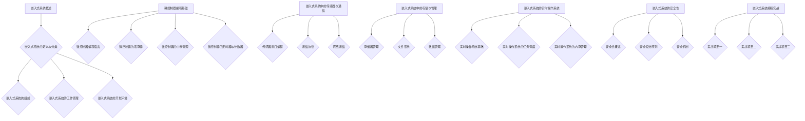

                 

# 嵌入式系统编程：微控制器上的创新

## 关键词：
- 嵌入式系统
- 微控制器编程
- 实时操作系统
- 传感器接口
- 通信协议
- 安全性设计
- 实战项目

## 摘要：

本文将深入探讨嵌入式系统编程，特别是微控制器上的创新技术。从基础概念到高级应用，本文将涵盖嵌入式系统概述、微控制器编程基础、高级编程技术、存储与管理、实时操作系统、安全性设计以及实际项目案例。通过详细的理论讲解和代码实战，读者将了解如何高效地开发和管理嵌入式系统，以实现创新的解决方案。

## 《嵌入式系统编程：微控制器上的创新》目录大纲

### 第一部分：嵌入式系统基础

#### 第1章：嵌入式系统概述
1.1 嵌入式系统的定义与分类
1.2 嵌入式系统的组成
1.3 嵌入式系统的工作原理
1.4 嵌入式系统的开发环境

#### 第2章：微控制器编程基础
2.1 微控制器编程语言
2.2 微控制器的寄存器
2.3 微控制器的中断处理
2.4 微控制器的定时器与计数器

### 第二部分：嵌入式系统高级编程

#### 第3章：嵌入式系统中的传感器与通信
3.1 传感器接口编程
3.2 通信协议
3.3 网络通信

#### 第4章：嵌入式系统中的存储与管理
4.1 存储器管理
4.2 文件系统
4.3 数据管理

#### 第5章：嵌入式系统的实时操作系统
5.1 实时操作系统基础
5.2 实时操作系统的任务调度
5.3 实时操作系统的内存管理

#### 第6章：嵌入式系统的安全性
6.1 安全性概述
6.2 安全设计原则
6.3 安全机制

#### 第7章：嵌入式系统编程实战
7.1 实战项目一：智能温度控制系统
7.2 实战项目二：智能家居控制系统
7.3 实战项目三：基于MQTT协议的物联网设备通信

### 附录：嵌入式系统开发资源与工具
A.1 嵌入式系统开发工具与资源
A.2 嵌入式系统常用库函数
A.3 嵌入式系统学习资源

#### Mermaid 流程图



---

**接下来，我们将一步步深入每个章节的内容，提供详细的理论讲解、代码示例和实战项目。**### 第1章：嵌入式系统概述

#### 1.1 嵌入式系统的定义与分类

嵌入式系统是一种特殊类型的计算机系统，其主要特点是在一个特定的环境中执行特定的任务，通常不具备通用性。与传统的计算机系统相比，嵌入式系统通常具有体积小、功耗低、可靠性高、实时性强等特点。

**嵌入式系统的分类**：

1. **根据应用领域分类**：
   - **工业控制**：如PLC（可编程逻辑控制器）、工业机器人等。
   - **消费电子**：如智能手机、智能家居设备等。
   - **汽车电子**：如汽车引擎控制模块、自动驾驶系统等。
   - **医疗设备**：如医疗诊断设备、手术机器人等。
   - **通信设备**：如路由器、交换机等。
   - **国防军事**：如无人机、导弹制导系统等。

2. **根据处理能力分类**：
   - **简单嵌入式系统**：通常使用简单的微控制器，处理能力较低，适用于简单的应用场景。
   - **复杂嵌入式系统**：通常使用微处理器或数字信号处理器，具有更高的处理能力，适用于复杂的任务。

3. **根据操作系统分类**：
   - **无操作系统**：简单的嵌入式系统可能不使用操作系统，直接通过固件（firmware）或简单的程序执行任务。
   - **实时操作系统**（RTOS）：适用于需要实时响应的嵌入式系统，如工业控制、汽车电子等。
   - **嵌入式Linux**：适用于需要丰富功能和高扩展性的嵌入式系统，如智能家居、通信设备等。

#### 1.2 嵌入式系统的组成

**嵌入式系统的基本组成**：

1. **处理器**：核心部件，负责执行指令和处理数据。根据应用需求，可以是微控制器（MCU）、微处理器（MPU）或数字信号处理器（DSP）。

2. **内存**：包括随机存取存储器（RAM）和只读存储器（ROM）。RAM用于暂存数据和程序代码，ROM用于存储固件和启动程序。

3. **外设**：如GPIO（通用输入输出端口）、定时器/计数器、ADC（模数转换器）、DAC（数模转换器）、串口、I2C、SPI等，用于扩展系统的功能。

4. **电源管理**：包括电池管理、电压调节、电源监控等，确保系统稳定运行。

5. **软件**：包括固件、操作系统、应用程序等，负责控制和管理硬件资源，实现特定的功能。

#### 1.3 嵌入式系统的工作原理

**嵌入式系统的工作原理**：

1. **启动过程**：
   - 加电后，系统进行自检，检查硬件是否正常工作。
   - 执行ROM中的启动代码，加载操作系统或固件到RAM中。
   - 运行操作系统或固件，开始执行用户程序。

2. **运行过程**：
   - CPU执行程序指令，通过内存读取指令和数据。
   - 利用外设与外部设备进行数据交换。
   - 实时操作系统管理任务调度和资源分配。

3. **中断处理**：
   - 系统接收到外部或内部中断信号时，暂停当前任务，执行中断处理程序。
   - 中断处理完成后，返回中断前的任务继续执行。

#### 1.4 嵌入式系统的开发环境

**嵌入式系统的开发环境**：

1. **集成开发环境（IDE）**：如Keil、IAR、Eclipse等，提供代码编写、编译、调试等功能。

2. **开发工具**：如仿真器、编程器、调试器等，用于硬件编程和调试。

3. **软件库**：提供各种函数库和驱动程序，简化开发工作。

4. **开发流程**：
   - 需求分析：明确系统功能需求和性能指标。
   - 硬件设计：选择合适的处理器、内存、外设等硬件组件。
   - 软件设计：编写程序代码，实现系统功能。
   - 编译与调试：编译代码，调试程序，确保系统稳定运行。
   - 测试与优化：进行系统测试，优化性能和稳定性。

#### 小结

本章对嵌入式系统进行了概述，介绍了其定义、分类、组成、工作原理以及开发环境。接下来，我们将进一步探讨微控制器编程的基础知识，为深入了解嵌入式系统的开发打下基础。在下一章中，我们将详细讨论微控制器的编程语言和其内部结构。**（续）**### 第2章：微控制器编程基础

#### 2.1 微控制器编程语言

微控制器编程语言主要包括汇编语言和C语言，这两种语言各有优缺点，适用于不同的应用场景。

**汇编语言**

汇编语言是直接针对微控制器硬件的编程语言，其优点是执行效率高，可以充分利用硬件资源。以下是汇编语言编程的一些基本概念：

1. **指令集**：微控制器的指令集定义了可以执行的操作，如加法、减法、跳转等。

2. **寄存器**：微控制器包含多个寄存器，用于暂存数据和地址。常见的寄存器包括累加器（ACC）、程序计数器（PC）、堆栈指针（SP）等。

3. **伪指令**：伪指令不是实际的机器指令，用于告诉编译器如何组织代码，如定义数据段、代码段等。

汇编语言编程示例如下：

```assembly
MOV A, #0x55    ; 将立即数0x55移动到累加器A
ADD A, R1       ; 将寄存器R1的内容加到累加器A
SJMP $          ; 无条件跳转，无限循环
```

**C语言**

C语言是一种高级编程语言，易于理解和编写，具有强大的功能和广泛的应用。C语言编程主要包括以下几个部分：

1. **数据类型**：C语言支持多种数据类型，如整型、浮点型、字符型等，方便数据的存储和操作。

2. **变量和常量**：变量用于存储可变的值，常量用于存储不变的值。

3. **函数**：函数是C语言的核心组成部分，用于模块化编程。C语言提供了丰富的标准库函数，如输入输出、数学运算等。

4. **指针**：指针是C语言的强大特性，用于间接访问内存地址，提高编程灵活性。

C语言编程示例如下：

```c
#include <stdio.h>

int main() {
    int a = 10;
    float b = 3.14;
    printf("a = %d, b = %f\n", a, b);
    return 0;
}
```

**汇编语言与C语言的对比**

1. **执行效率**：汇编语言编写程序通常具有更高的执行效率，因为可以直接访问硬件资源。C语言编译后的程序需要通过汇编器转换为机器指令，引入了一定的性能开销。

2. **开发难度**：汇编语言编程需要对硬件有较深的了解，编写难度较大。C语言通过抽象硬件细节，简化了编程过程。

3. **可维护性**：C语言具有更好的可维护性，因为其语法和结构更加直观。汇编语言代码较为繁琐，不易维护。

4. **适用性**：汇编语言适用于对执行效率要求极高的场景，如嵌入式系统中的实时控制。C语言适用于广泛的场景，尤其是需要高效开发的应用。

**小结**

本章介绍了微控制器编程的两种主要语言：汇编语言和C语言。汇编语言适合对执行效率有极高要求的场景，而C语言则适用于更广泛的场景。在实际开发过程中，可以根据项目需求和资源限制选择合适的编程语言。

#### 2.2 微控制器的寄存器

微控制器的寄存器是硬件的重要组成部分，用于暂存数据、控制硬件操作和存储状态信息。以下是微控制器寄存器的基本概念和分类：

**寄存器分类**：

1. **数据寄存器**：用于暂存操作数，常见的有累加器（ACC）、寄存器B等。

2. **地址寄存器**：用于暂存内存地址，常见的有基址寄存器（BP）、堆栈指针（SP）等。

3. **控制寄存器**：用于控制微控制器的操作，常见的有中断控制寄存器、时钟控制寄存器等。

4. **状态寄存器**：用于存储微控制器的状态信息，常见的有标志寄存器（FLAGS）等。

**常用寄存器及其功能**：

1. **累加器（ACC）**：用于暂存运算结果，常用于算术和逻辑运算。

2. **程序计数器（PC）**：用于存储下一条要执行的指令地址。

3. **堆栈指针（SP）**：用于管理堆栈，存储局部变量和返回地址。

4. **基址寄存器（BP）**：用于访问堆栈中的数据。

5. **中断控制寄存器**：用于控制中断的启用和优先级。

6. **时钟控制寄存器**：用于配置时钟源和时钟分频。

**寄存器操作示例**：

以下是一个简单的汇编语言程序，演示了寄存器的操作：

```assembly
MOV A, #0x55    ; 将立即数0x55移动到累加器A
MOV R1, #0xAA   ; 将立即数0xAA移动到寄存器R1
ADD A, R1       ; 将寄存器R1的内容加到累加器A
MOV R2, A       ; 将累加器A的内容移动到寄存器R2
```

**小结**

本章介绍了微控制器的寄存器，包括其分类、功能和操作方法。了解寄存器的作用和操作对于掌握微控制器编程至关重要。在下一章中，我们将讨论微控制器的中断处理机制。

#### 2.3 微控制器的中断处理

中断是微控制器编程中的一项重要技术，用于处理外部或内部事件，提高系统的响应能力和实时性。以下是中断处理的基本概念和实现方法：

**中断概念**

1. **中断请求**：当微控制器接收到外部或内部信号时，产生中断请求（IRQ）。

2. **中断响应**：微控制器暂停当前程序执行，响应中断请求，跳转到中断处理程序。

3. **中断处理**：中断处理程序执行相应的任务，如读取数据、发送数据等。

4. **中断返回**：中断处理程序执行完毕后，返回到中断前的程序继续执行。

**中断分类**

1. **外部中断**：由外部设备引发的中断，如按键、定时器、串口等。

2. **内部中断**：由微控制器内部错误或异常引发的中断，如除法错误、堆栈错误等。

**中断处理程序设计**

中断处理程序的设计主要包括以下几个步骤：

1. **中断响应**：微控制器接收到中断请求后，通过硬件逻辑跳转到中断向量表，查找中断处理程序的入口地址。

2. **中断处理**：执行中断处理程序，根据中断类型执行相应的任务。

3. **中断返回**：中断处理程序执行完毕后，通过硬件逻辑返回到中断前的程序继续执行。

以下是一个简单的中断处理程序伪代码：

```c
void interrupt_handler() {
    // 中断处理代码
    if (中断类型 == 外部中断) {
        // 处理外部中断
    } else if (中断类型 == 内部中断) {
        // 处理内部中断
    }
    // 中断返回
    return;
}
```

**中断优先级管理**

微控制器通常支持中断优先级管理，允许多个中断同时发生时，根据优先级顺序处理。中断优先级管理的方法包括：

1. **硬件优先级**：通过硬件逻辑实现，低优先级中断被高优先级中断屏蔽。

2. **软件优先级**：通过软件逻辑实现，根据中断处理程序的执行顺序确定优先级。

**中断使用示例**

以下是一个简单的中断使用示例，演示了如何配置外部中断并编写中断处理程序：

```c
#include "stm32f10x.h"

// 中断初始化函数
void Interrupt_Init() {
    // 配置外部中断
    EXTI_InitTypeDef EXTI_InitStruct;
    EXTI_InitStruct.EXTI_Line = EXTI_Line0; // 配置外部中断线
    EXTI_InitStruct.EXTI_Mode = EXTI_Mode_Interrupt;
    EXTI_InitStruct.EXTI_Trigger = EXTI_Trigger_Rising; // 配置上升沿触发
    EXTI_InitStruct.EXTI_LineCmd = ENABLE;
    EXTI_Init(&EXTI_InitStruct);

    // 配置中断优先级
    NVIC_InitTypeDef NVIC_InitStruct;
    NVIC_InitStruct.NVIC_IRQChannel = EXTI0_IRQn;
    NVIC_InitStruct.NVIC_IRQChannelPreemptionPriority = 0;
    NVIC_InitStruct.NVIC_IRQChannelSubPriority = 1;
    NVIC_InitStruct.NVIC_IRQChannelCmd = ENABLE;
    NVIC_Init(&NVIC_InitStruct);
}

// 外部中断0中断处理程序
void EXTI0_IRQHandler() {
    // 中断处理代码
    if (EXTI_GetITStatus(EXTI_Line0) != RESET) {
        // 清除中断标志
        EXTI_ClearITPendingBit(EXTI_Line0);
        // 执行中断处理任务
        // ...
    }
}

int main() {
    Interrupt_Init();
    
    while (1) {
        // 主循环
        // ...
    }
}
```

**小结**

本章介绍了微控制器的中断处理机制，包括中断概念、分类、处理程序设计和优先级管理。通过中断处理，微控制器可以高效地响应用户输入和外部事件，提高系统的实时性和可靠性。在下一章中，我们将探讨微控制器的定时器与计数器功能。**（续）**### 第2章：微控制器编程基础

#### 2.4 微控制器的定时器与计数器

定时器与计数器是微控制器中非常重要的功能模块，用于实现定时、计数、脉冲生成等多种功能。以下将介绍定时器与计数器的基本概念、工作原理以及编程方法。

**定时器与计数器的基本概念**

1. **定时器**：定时器用于生成固定时间的延迟或定时事件。通过计数器计数值的累加，当计数值达到预定值时，触发定时事件。

2. **计数器**：计数器用于计数外部事件或脉冲信号。通过计数器计数值的变化，可以实现对事件或脉冲的计数。

**定时器与计数器的工作原理**

1. **定时器工作原理**：
   - 定时器由定时器控制寄存器和计数器组成。
   - 定时器控制寄存器用于配置定时器的模式、计数方向、预分频等。
   - 计数器用于累加时钟周期的数量，当计数值达到预设值时，触发定时器中断或产生定时事件。

2. **计数器工作原理**：
   - 计数器由计数控制寄存器和计数器组成。
   - 计数控制寄存器用于配置计数器的模式、计数方向、预分频等。
   - 计数器用于记录外部事件或脉冲信号的次数。

**定时器与计数器的编程方法**

1. **初始化配置**：
   - 配置定时器或计数器的模式，如定时模式、计数模式。
   - 配置计数方向，如向上计数、向下计数。
   - 配置预分频，以调整定时器或计数器的时钟周期。

2. **启动与停止**：
   - 启动定时器或计数器，开始计时或计数。
   - 停止定时器或计数器，暂停计时或计数。

3. **读取计数值**：
   - 读取定时器或计数器的计数值，以获取定时时间或计数值。

4. **触发中断**：
   - 当定时器计数值达到预设值或计数器计数值达到预设值时，触发中断事件。
   - 编写中断服务程序，处理定时事件或计数事件。

以下是一个简单的定时器与计数器的编程示例：

```c
#include "stm32f10x.h"

// 初始化定时器
void Timer_Init(uint16_t arr, uint16_t psc) {
    // 配置定时器时钟
    RCC_APB1PeriphClockCmd(RCC_APB1Periph_TIM2, ENABLE);

    // 配置定时器模式
    TIM_TimeBaseInitTypeDef TIM_InitStruct;
    TIM_InitStruct.TIM_Period = arr;
    TIM_InitStruct.TIM_Prescaler = psc;
    TIM_InitStruct.TIM_CounterMode = TIM_CounterMode_Up;
    TIM_InitStruct.TIM_ClockDivision = TIM_ClockDivision_Scaler;
    TIM_TimeBaseInit(TIM2, &TIM_InitStruct);

    // 启动定时器
    TIM_Cmd(TIM2, ENABLE);

    // 配置定时器中断
    NVIC_InitTypeDef NVIC_InitStruct;
    NVIC_InitStruct.NVIC_IRQChannel = TIM2_IRQn;
    NVIC_InitStruct.NVIC_IRQChannelPreemptionPriority = 0;
    NVIC_InitStruct.NVIC_IRQChannelSubPriority = 1;
    NVIC_InitStruct.NVIC_IRQChannelCmd = ENABLE;
    NVIC_Init(&NVIC_InitStruct);

    // 启动定时器中断
    TIM_ITConfig(TIM2, TIM_IT_Update, ENABLE);
}

// 定时器中断服务程序
void TIM2_IRQHandler(void) {
    if (TIM_GetITStatus(TIM2, TIM_IT_Update) != RESET) {
        // 清除中断标志
        TIM_ClearITPendingBit(TIM2, TIM_IT_Update);

        // 执行定时事件处理
        // ...
    }
}

int main() {
    // 初始化定时器
    Timer_Init(1000, 7200);

    while (1) {
        // 主循环
        // ...
    }
}
```

**小结**

本章介绍了微控制器的定时器与计数器的基本概念、工作原理和编程方法。定时器与计数器在嵌入式系统中具有广泛的应用，可以实现定时、计数、脉冲生成等功能。通过本章的学习，读者可以掌握定时器与计数器的编程技术，为嵌入式系统的开发打下基础。在下一章中，我们将探讨嵌入式系统中的传感器与通信技术。**（续）**### 第3章：嵌入式系统中的传感器与通信

#### 3.1 传感器接口编程

传感器是嵌入式系统中获取环境信息的重要组件。常见的传感器包括温度传感器、湿度传感器、压力传感器、光线传感器等。传感器接口编程主要包括传感器的选型、连接和数据处理等方面。

**传感器选型**

1. **温度传感器**：常用的温度传感器有DS18B20、PT100等。DS18B20具有数字接口，易于编程，而PT100为模拟传感器，需要使用ADC进行信号转换。

2. **湿度传感器**：常用的湿度传感器有SHT31、HTU21D等，支持数字和模拟接口。

3. **压力传感器**：常用的压力传感器有MPU6050、BMP280等，其中MPU6050主要用于运动传感器，而BMP280是数字气压传感器。

**传感器连接**

1. **数字传感器**：数字传感器通常使用I2C或SPI接口与微控制器连接。I2C接口支持多设备通信，传输速度较慢；SPI接口传输速度快，但只支持单设备通信。

2. **模拟传感器**：模拟传感器需要使用ADC进行信号转换，将模拟信号转换为数字信号。ADC的分辨率和采样率影响传感器的测量精度和响应速度。

**传感器数据处理**

1. **数字传感器**：读取数字传感器的数据通常比较简单，直接通过I2C或SPI接口读取寄存器值即可。

2. **模拟传感器**：对于模拟传感器，需要通过ADC读取模拟信号，然后进行数字信号处理，如滤波、计算传感器值等。

以下是一个使用DS18B20温度传感器的接口编程示例：

```c
#include "stm32f10x.h"
#include "ds18b20.h"

// 初始化DS18B20传感器
void DS18B20_Init() {
    // 配置GPIO
    GPIO_InitTypeDef GPIO_InitStruct;
    GPIO_InitStruct.GPIO_Pin = GPIO_Pin_0;
    GPIO_InitStruct.GPIO_Mode = GPIO_Mode_Out_PP;
    GPIO_InitStruct.GPIO_Speed = GPIO_Speed_50MHz;
    GPIO_Init(GPIOB, &GPIO_InitStruct);

    // 下降沿触发I2C初始化
    DS18B20_Reset();
    DS18B20_Wait();
}

// 读取DS18B20温度值
float DS18B20_Read_Temperature() {
    uint8_t temp;
    DS18B20_Init();
    DS18B20_Write(0xCC); // 跳过ROM指令
    DS18B20_Write(0x44); // 温度转换指令
    DelayMs(100); // 等待温度转换完成

    DS18B20_Init();
    DS18B20_Write(0xCC); // 跳过ROM指令
    DS18B20_Write(0xBE); // 读取温度指令
    temp = DS18B20_Read();
    temp <<= 8;
    temp += DS18B20_Read();

    return (float)temp / 16.0; // 转换为摄氏度
}

int main() {
    while (1) {
        float temperature = DS18B20_Read_Temperature();
        printf("Current temperature: %.2f°C\n", temperature);
        DelayMs(1000);
    }
}
```

#### 3.2 通信协议

嵌入式系统中的通信协议用于实现设备之间的数据交换和通信。常见的通信协议包括I2C、SPI、UART等。

1. **I2C**：I2C（Inter-Integrated Circuit）是一种多主从通信协议，支持多设备连接，传输速度较慢。I2C通信主要包括起始条件、数据传输、停止条件等。

2. **SPI**：SPI（Serial Peripheral Interface）是一种高速通信协议，通常用于单设备通信。SPI通信主要包括主从模式、数据位传输、时钟控制等。

3. **UART**：UART（Universal Asynchronous Receiver/Transmitter）是一种异步通信协议，常用于串行通信。UART通信主要包括数据位、停止位、奇偶校验等。

以下是一个使用I2C协议读取SHT31传感器数据的示例：

```c
#include "stm32f10x.h"
#include "i2c.h"
#include "sht31.h"

// 初始化I2C
void I2C_Init() {
    // 配置I2C时钟
    RCC_APB1PeriphClockCmd(RCC_APB1Periph_I2C1, ENABLE);

    // 配置I2C参数
    I2C_InitTypeDef I2C_InitStruct;
    I2C_InitStruct.I2C_ClockSpeed = 100000;
    I2C_InitStruct.I2C_Mode = I2C_Mode_I2C;
    I2C_InitStruct.I2C_DutyCycle = I2C_DutyCycle_2;
    I2C_InitStruct.I2C_OwnAddress1 = 0x00;
    I2C_InitStruct.I2C_Ack = I2C_Ack_Enable;
    I2C_InitStruct.I2C_AckPullUp = I2C_AckPullUp_Disable;
    I2C_Init(I2C1, &I2C_InitStruct);

    // 启动I2C
    I2C_Cmd(I2C1, ENABLE);
}

// 读取SHT31传感器数据
float SHT31_Read_Temperature() {
    uint8_t buffer[2];
    I2C_Init();
    I2C_Start(I2C1, SHT31_ADDRESS_WRITE);
    I2C_Write(I2C1, SHT31_CMD_MEAS_TEMP);
    I2C_Stop(I2C1);

    DelayMs(100); // 等待温度转换完成

    I2C_Start(I2C1, SHT31_ADDRESS_READ);
    I2C_Read(I2C1, buffer, 2);
    I2C_Stop(I2C1);

    return ((float)buffer[0] << 8 | buffer[1]) * 0.001953125; // 转换为摄氏度
}

int main() {
    while (1) {
        float temperature = SHT31_Read_Temperature();
        printf("Current temperature: %.2f°C\n", temperature);
        DelayMs(1000);
    }
}
```

#### 3.3 网络通信

随着物联网（IoT）的发展，嵌入式系统的网络通信变得越来越重要。网络通信协议如TCP/IP、MQTT等提供了远程监控和控制的能力。

1. **TCP/IP**：TCP/IP是一种面向连接的通信协议，提供可靠的字节流服务。TCP/IP通信包括IP地址分配、TCP连接建立、数据传输和连接终止等过程。

2. **MQTT**：MQTT（Message Queuing Telemetry Transport）是一种轻量级的消息队列协议，适用于资源受限的嵌入式系统。MQTT通信包括客户端订阅主题、发布消息和服务器消息传递等。

以下是一个使用MQTT协议的示例：

```c
#include "stm32f10x.h"
#include "mqtt.h"
#include "wifi.h"

// 初始化MQTT客户端
void MQTT_Init() {
    // 配置WiFi
    WiFi_Init();

    // 连接到MQTT服务器
    MQTT_Client_Init("client_id", "mqtt_server_address", 1883);
}

// 发布消息到MQTT服务器
void MQTT_Publish(const char* topic, const char* payload) {
    MQTT_Init();
    MQTT_Connect();
    MQTT_PublishMessage(topic, payload);
    MQTT_Disconnect();
}

int main() {
    while (1) {
        MQTT_Publish("temperature", "25.0");
        DelayMs(1000);
    }
}
```

**小结**

本章介绍了嵌入式系统中的传感器接口编程、通信协议和网络通信。传感器接口编程包括传感器选型、连接和数据处理；通信协议包括I2C、SPI、UART等；网络通信包括TCP/IP和MQTT等。通过本章的学习，读者可以掌握嵌入式系统的传感器和通信技术，为开发复杂的嵌入式应用打下基础。在下一章中，我们将探讨嵌入式系统中的存储与管理技术。**（续）**### 第4章：嵌入式系统中的存储与管理

#### 4.1 存储器管理

在嵌入式系统中，存储器管理是一个重要的环节，它关系到系统的性能、可靠性和稳定性。存储器管理主要包括RAM、ROM和Flash存储器的管理。

**RAM（随机存取存储器）管理**

1. **RAM的作用**：
   - RAM用于存储程序代码、数据和堆栈，是CPU可以直接访问的存储器。
   - 它具有读写速度快、存储容量有限的特点。

2. **RAM的管理**：
   - **内存分配**：嵌入式系统中的内存分配通常在编译时完成，由链接器负责将不同模块的代码和数据段映射到内存地址空间。
   - **内存保护**：为了防止程序错误导致的内存溢出，需要对内存进行保护。常用的方法包括设置内存段的访问权限、使用内存保护单元（MPU）等。
   - **内存释放**：在嵌入式系统中，内存通常在编译时分配，不需要手动释放。

**ROM（只读存储器）管理**

1. **ROM的作用**：
   - ROM用于存储固件和启动代码，这些代码在系统启动时被加载到RAM中执行。
   - 它具有存储容量大、读取速度快、写入速度慢、数据不丢失等特点。

2. **ROM的管理**：
   - **固件更新**：嵌入式系统中的固件可以通过OTA（Over-The-Air）方式进行更新，以修复bug或添加新功能。
   - **数据存储**：虽然ROM是只读的，但可以通过编程将其部分区域设置为可读写，用于存储一些系统配置信息或历史数据。

**Flash存储器管理**

1. **Flash的作用**：
   - Flash存储器是嵌入式系统中常用的非易失性存储器，用于存储程序代码、数据和文件系统。
   - 它具有读写速度快、存储容量大、数据不丢失等特点。

2. **Flash的管理**：
   - **分区管理**：Flash存储器通常被分区，用于存储不同的文件和程序。分区管理包括分区的创建、删除、扩展和移动。
   - **文件系统**：嵌入式系统中的文件系统用于组织和管理存储在Flash中的文件。常用的文件系统包括FAT、FAT32和SPIFFS等。
   - **闪存擦除和编程**：Flash存储器需要在擦除和编程前进行校验，以确保数据的正确性和可靠性。擦除和编程操作通常由特定的库函数或驱动程序实现。

**存储器管理示例**

以下是一个简单的存储器管理示例，使用STM32的HAL库进行存储器管理：

```c
#include "stm32f10x_hal.h"

// 初始化存储器
void Storage_Init() {
    // 配置Flash存储器
    HAL_FLASH_Unlock();
    HAL_FLASH_Program(FLASH_TYPEPROGRAM_HALFWORD, 0x08000000, 0xAAAA5555);
    HAL_FLASH_Lock();

    // 配置文件系统
    FATFS_Init();
}

// 读取Flash存储器数据
uint16_t ReadFlash(uint32_t address) {
    return HAL_FLASH_Program(FLASH_TYPEPROGRAM_HALFWORD, address, 0xAAAA5555);
}

// 编写Flash存储器数据
void WriteFlash(uint32_t address, uint16_t data) {
    HAL_FLASH_Unlock();
    HAL_FLASH_Program(FLASH_TYPEPROGRAM_HALFWORD, address, data);
    HAL_FLASH_Lock();
}

int main() {
    Storage_Init();
    
    while (1) {
        uint16_t data = ReadFlash(0x08000000);
        printf("Flash data: 0x%X\n", data);
        DelayMs(1000);
    }
}
```

**小结**

本章介绍了嵌入式系统中的存储器管理，包括RAM、ROM和Flash存储器的管理方法。通过本章的学习，读者可以了解存储器管理的基本原理和实践方法，为嵌入式系统的开发提供技术支持。在下一章中，我们将探讨嵌入式系统的文件系统。**（续）**### 第4章：嵌入式系统中的存储与管理

#### 4.2 文件系统

文件系统是嵌入式系统存储管理的重要组成部分，用于组织、管理和访问存储在存储介质上的文件。嵌入式系统常用的文件系统包括FAT、FAT32和SPIFFS等。

**FAT文件系统**

1. **FAT（File Allocation Table）文件系统**是一种常见的文件系统，广泛用于闪存和硬盘驱动器。

2. **FAT文件系统的组成**：
   - **FAT表**：用于记录文件在磁盘上的分配情况。
   - **根目录**：包含文件和目录的元数据，如文件名、大小、创建时间和访问权限等。
   - **簇**：磁盘上的最小分配单元，文件和数据通常存储在多个簇中。

3. **FAT文件系统的特性**：
   - **兼容性好**：可以与多种操作系统和设备兼容。
   - **稳定性高**：即使发生断电，文件系统仍然可以恢复。
   - **性能有限**：读取和写入速度相对较慢，不适合高吞吐量的应用。

**FAT32文件系统**

1. **FAT32是FAT文件系统的改进版本，支持更大的磁盘容量和更高的传输速度**。

2. **FAT32文件系统的特性**：
   - **支持大容量**：单个卷的最大容量可达16TB。
   - **性能提升**：传输速度较FAT文件系统有显著提升。

3. **FAT32文件系统的管理**：
   - **簇大小**：FAT32的簇大小可以根据磁盘容量自动调整，减少存储空间的浪费。
   - **簇链**：每个文件和目录都有一个簇链，指向其在磁盘上的所有簇。

**SPIFFS文件系统**

1. **SPIFFS（Small-footprint File System）是一种专为嵌入式系统设计的轻量级文件系统**。

2. **SPIFFS文件系统的特性**：
   - **体积小**：适合资源受限的嵌入式系统，如物联网设备。
   - **速度快**：优化了文件系统结构，提高读写速度。
   - **支持大文件**：支持单个文件的最大容量可达16MB。

3. **SPIFFS文件系统的管理**：
   - **存储空间优化**：SPIFFS使用内存映射文件系统，减少内存占用。
   - **缓存机制**：实现数据缓存，提高读写效率。

**FAT、FAT32和SPIFFS的比较**

1. **兼容性**：FAT和FAT32具有较好的兼容性，适合多种操作系统和设备；SPIFFS主要适用于嵌入式系统。

2. **性能**：FAT和FAT32在读写速度上相对较慢，而SPIFFS有显著提升。

3. **存储容量**：FAT32支持更大的存储容量，但SPIFFS更适合资源受限的嵌入式系统。

4. **稳定性**：FAT和FAT32具有较高的稳定性，SPIFFS在断电时可能会丢失数据。

**FAT32文件系统的数学模型和公式**

以下是FAT32文件系统的一些基本数学模型和公式：

$$
\text{簇号} = \left\lfloor \frac{\text{文件大小}}{\text{簇大小}} \right\rfloor
$$

$$
\text{簇链} = \text{根目录中的第一个簇号}
$$

$$
\text{目录项长度} = 32
$$

**示例代码**

以下是一个使用SPIFFS文件系统的简单示例，使用ESP-IDF库进行文件操作：

```c
#include "esp_err.h"
#include "esp_spiffs.h"
#include "stdio.h"

// 初始化SPIFFS文件系统
esp_err_t SPIFFS_Init() {
    esp_spiffs_config_t config = {
        .base_path = "/spiffs",
        .partition_label = NULL,
        .max_files = 5,
        .format_if_mount_failed = true
    };
    
    return esp_spiffs_mount(&config);
}

// 创建文件
esp_err_t SPIFFS_CreateFile(const char* path, const char* mode) {
    return esp_spiffs_open(path, mode, SPIFFS_O_WRONLY | SPIFFS_O_CREAT | SPIFFS_O_TRUNC);
}

// 写入文件
esp_err_t SPIFFS_Write(const char* path, const void* data, size_t size) {
    return esp_spiffs_write(path, data, size);
}

// 读取文件
esp_err_t SPIFFS_Read(const char* path, void* data, size_t size) {
    return esp_spiffs_read(path, data, size);
}

// 关闭文件
esp_err_t SPIFFS_Close(esp_spiffs_fd_t fd) {
    return esp_spiffs_close(fd);
}

int main() {
    if (SPIFFS_Init() != ESP_OK) {
        printf("SPIFFS initialization failed\n");
        return -1;
    }
    
    esp_spiffs_fd_t fd = SPIFFS_CreateFile("/test.txt", "w+");
    if (fd < 0) {
        printf("File creation failed\n");
        return -1;
    }
    
    const char* data = "Hello, SPIFFS!";
    SPIFFS_Write("/test.txt", data, strlen(data));
    SPIFFS_Close(fd);
    
    fd = SPIFFS_Open("/test.txt", "r");
    if (fd < 0) {
        printf("File open failed\n");
        return -1;
    }
    
    char buffer[256];
    SPIFFS_Read("/test.txt", buffer, sizeof(buffer));
    buffer[sizeof(buffer) - 1] = '\0';
    printf("File content: %s\n", buffer);
    
    SPIFFS_Close(fd);
    
    return 0;
}
```

**小结**

本章介绍了嵌入式系统中常用的文件系统，包括FAT、FAT32和SPIFFS。通过了解这些文件系统的组成、特性和管理方法，读者可以更好地选择适合自己项目的文件系统，优化嵌入式系统的存储和管理。在下一章中，我们将探讨嵌入式系统中的数据管理技术。**（续）**### 第4章：嵌入式系统中的存储与管理

#### 4.3 数据管理

在嵌入式系统中，数据管理是保证系统正常运行和数据可靠性的关键。数据管理包括数据结构的选择、数据的存储与读取、数据校验与错误处理等方面。

**数据结构的选择**

1. **数组**：数组是常用的一种数据结构，适合处理固定大小的数据集合。

2. **链表**：链表适用于动态分配内存的场景，支持高效的插入和删除操作。

3. **堆**：堆是一种特殊的树状数据结构，常用于优先队列和内存管理。

4. **哈希表**：哈希表通过哈希函数将数据快速映射到内存地址，适合处理大量数据的高效查找。

**数据的存储与读取**

1. **内存存储**：内存存储适合处理临时数据，如程序堆栈、局部变量等。

2. **文件存储**：文件存储适合处理持久化数据，如配置文件、日志文件等。

3. **数据库**：数据库提供结构化数据存储和查询功能，适用于大型数据管理。

**数据校验与错误处理**

1. **校验和**：通过计算数据的校验和，可以快速检测数据是否在传输或存储过程中发生错误。

2. **CRC校验**：循环冗余校验（CRC）是一种常用的校验方法，通过生成CRC码进行数据校验。

3. **错误处理**：在数据传输和存储过程中，可能会出现错误，需要采取适当的错误处理机制，如重传、重试、数据恢复等。

**数据管理示例**

以下是一个简单的数据管理示例，使用数组、链表和文件存储数据：

```c
#include <stdio.h>
#include <stdlib.h>

// 创建数组
int* create_array(int size) {
    int* array = (int*)malloc(size * sizeof(int));
    if (array == NULL) {
        printf("Memory allocation failed\n");
        return NULL;
    }
    return array;
}

// 读取数组数据
void read_array(int* array, int size) {
    for (int i = 0; i < size; i++) {
        printf("Enter element %d: ", i);
        scanf("%d", &array[i]);
    }
}

// 写入数组数据到文件
void write_array_to_file(int* array, int size) {
    FILE* file = fopen("data.txt", "w");
    if (file == NULL) {
        printf("File open failed\n");
        return;
    }
    for (int i = 0; i < size; i++) {
        fprintf(file, "%d\n", array[i]);
    }
    fclose(file);
}

// 读取文件数据到数组
void read_file_to_array(int* array, int size) {
    FILE* file = fopen("data.txt", "r");
    if (file == NULL) {
        printf("File open failed\n");
        return;
    }
    for (int i = 0; i < size; i++) {
        fscanf(file, "%d", &array[i]);
    }
    fclose(file);
}

int main() {
    int size = 5;
    int* array = create_array(size);
    if (array == NULL) {
        return -1;
    }
    read_array(array, size);
    write_array_to_file(array, size);
    read_file_to_array(array, size);
    for (int i = 0; i < size; i++) {
        printf("Element %d: %d\n", i, array[i]);
    }
    free(array);
    return 0;
}
```

**小结**

本章介绍了嵌入式系统中的数据管理，包括数据结构的选择、数据的存储与读取、数据校验与错误处理等方面。通过了解这些数据管理技术，读者可以更好地组织和管理嵌入式系统中的数据，提高系统的性能和可靠性。在下一章中，我们将探讨嵌入式系统的实时操作系统。**（续）**### 第5章：嵌入式系统的实时操作系统

#### 5.1 实时操作系统基础

实时操作系统（RTOS）是一种专为实时应用设计的操作系统，能够满足严格的实时性要求。与通用操作系统相比，RTOS具有以下特点：

1. **实时性**：RTOS能够按照用户设定的时限完成任务的执行，保证系统在规定时间内响应外部事件。

2. **确定性**：RTOS的任务调度和资源分配具有确定性，使得系统在各种负载下都能保持稳定的性能。

3. **优先级调度**：RTOS通常采用优先级调度算法，根据任务的优先级进行任务调度，确保高优先级任务优先执行。

4. **中断处理**：RTOS能够高效地处理中断，确保系统在遇到外部事件时能够及时响应。

**RTOS的基本概念**

1. **任务（Task）**：RTOS中的基本执行单元，用于实现系统的功能。每个任务都有一个优先级，RTOS根据任务的优先级进行调度。

2. **时间片**：RTOS为每个任务分配的时间片，用于限制任务的执行时间。当任务的时间片用尽时，RTOS会将其挂起，并切换到下一个任务。

3. **队列（Queue）**：RTOS中的队列用于实现任务之间的通信和同步。任务可以通过队列传递消息，实现数据的共享和交换。

4. **信号量（Semaphore）**：RTOS中的信号量用于实现任务之间的同步和互斥。信号量分为计数信号量和二值信号量，分别用于控制资源的访问和锁的机制。

**RTOS的基本功能**

1. **任务调度**：RTOS根据任务的优先级和调度算法，确定下一个要执行的任务。

2. **中断处理**：RTOS能够高效地处理中断，确保系统在遇到外部事件时能够及时响应。

3. **内存管理**：RTOS负责管理系统的内存资源，包括内存的分配和释放。

4. **资源管理**：RTOS负责管理系统的资源，如时钟、定时器、I/O端口等。

5. **通信机制**：RTOS提供各种通信机制，如消息队列、信号量、信号等，用于任务之间的通信和同步。

**RTOS的应用场景**

1. **工业控制**：RTOS在工业控制领域具有广泛的应用，如PLC（可编程逻辑控制器）、机器人控制系统等。

2. **汽车电子**：RTOS在汽车电子领域用于实现车辆控制、自动驾驶等功能。

3. **医疗设备**：RTOS在医疗设备中用于实现实时监测、数据处理等功能。

4. **通信设备**：RTOS在通信设备中用于实现数据传输、信号处理等功能。

5. **消费电子**：RTOS在消费电子产品中用于实现智能穿戴设备、智能家居设备等功能。

**RTOS与传统操作系统的区别**

1. **实时性**：RTOS能够按照用户设定的时限完成任务的执行，而传统操作系统通常不能保证任务的实时性。

2. **调度算法**：RTOS通常采用优先级调度算法，而传统操作系统通常采用时间片轮转调度算法。

3. **资源管理**：RTOS具有更好的资源管理能力，能够高效地分配和回收资源，而传统操作系统通常采用静态资源分配方式。

4. **中断处理**：RTOS能够高效地处理中断，确保系统在遇到外部事件时能够及时响应，而传统操作系统通常无法实现高效的中断处理。

**小结**

本章介绍了实时操作系统的基础知识，包括RTOS的基本概念、基本功能、应用场景以及与传统操作系统的区别。通过了解RTOS的特性，读者可以更好地选择和应用RTOS，实现嵌入式系统的实时性需求。在下一章中，我们将探讨RTOS的任务调度算法。**（续）**### 第5章：嵌入式系统的实时操作系统

#### 5.2 实时操作系统的任务调度

实时操作系统的核心功能之一是任务调度，它决定了系统资源的分配和使用。任务调度算法的选择对于系统的实时性和效率具有关键影响。以下将介绍几种常见的任务调度算法以及它们的优缺点。

**优先级调度算法**

1. **定义**：优先级调度算法根据任务的优先级来决定任务的执行顺序。优先级越高，任务被调度的机会越大。

2. **类型**：
   - **固定优先级调度**：每个任务有一个固定的优先级，系统根据优先级顺序执行任务。
   - **动态优先级调度**：任务在执行过程中可以根据其状态或执行时间动态调整优先级。

3. **优点**：
   - **简单易实现**：优先级调度算法逻辑简单，易于实现。
   - **任务响应快**：高优先级任务可以快速得到执行，满足实时性要求。

4. **缺点**：
   - **优先级反转问题**：低优先级任务可能会阻塞高优先级任务，导致系统性能下降。
   - **资源浪费**：低优先级任务可能长时间得不到执行，造成资源浪费。

**时间片调度算法**

1. **定义**：时间片调度算法为每个任务分配一个固定的时间片，任务在时间片内执行，时间片结束时被强制挂起，等待下一次调度。

2. **类型**：
   - **轮转调度**：每个任务轮流执行，直到所有任务都执行完毕，再从头开始。
   - **优先级时间片调度**：优先级高的任务拥有更短的时间片，低优先级任务拥有更长的时间片。

3. **优点**：
   - **公平性**：所有任务都有机会得到执行，保证任务的公平性。
   - **响应时间可预测**：由于每个任务的时间片是固定的，系统的响应时间可以预测。

4. **缺点**：
   - **效率低**：时间片调度算法可能导致高优先级任务长时间得不到执行，影响系统实时性。
   - **开销大**：频繁的任务切换会增加系统的开销。

**最短任务优先调度算法**

1. **定义**：最短任务优先（STF）调度算法选择预计执行时间最短的任务进行执行。

2. **类型**：
   - **静态STF**：任务在调度前已经确定了执行时间。
   - **动态STF**：任务在执行过程中动态更新执行时间。

3. **优点**：
   - **响应时间短**：系统总是选择预计执行时间最短的任务，响应时间最短。
   - **资源利用率高**：系统资源被高效利用，避免了资源浪费。

4. **缺点**：
   - **调度复杂**：需要不断计算每个任务的预计执行时间，调度逻辑复杂。
   - **可能产生饥饿现象**：低优先级任务可能长时间得不到执行，产生饥饿现象。

**基于轮转的优先级调度算法**

1. **定义**：结合了优先级调度和时间片调度，为每个任务分配一个固定的时间片，同时根据任务的优先级进行调度。

2. **类型**：
   - **轮转优先级调度**：优先级高的任务拥有更短的时间片，优先级低的任务拥有更长的时间片。
   - **动态轮转优先级调度**：时间片和优先级可以根据任务的执行情况进行动态调整。

3. **优点**：
   - **兼顾实时性和公平性**：既保证了高优先级任务的实时性，又避免了低优先级任务的饥饿现象。
   - **简单易实现**：调度逻辑相对简单，易于实现和维护。

4. **缺点**：
   - **调度开销较大**：频繁的任务切换和优先级调整会增加系统的开销。
   - **响应时间不可预测**：由于任务优先级和时间片的动态调整，系统的响应时间可能不可预测。

**调度算法的选择**

在选择任务调度算法时，需要根据系统的实时性要求、任务特点以及资源限制进行综合考虑。以下是一些选择调度算法的指导原则：

1. **实时性要求**：对于高实时性要求的系统，优先选择优先级调度算法或最短任务优先调度算法。
2. **任务特性**：如果任务执行时间差异较大，可以考虑最短任务优先调度算法；如果任务执行时间相对稳定，可以考虑优先级调度算法。
3. **系统资源**：如果系统资源紧张，优先选择时间片调度算法，以避免高优先级任务长时间得不到执行。

**小结**

本章介绍了实时操作系统的任务调度算法，包括优先级调度算法、时间片调度算法、最短任务优先调度算法以及基于轮转的优先级调度算法。通过了解这些调度算法的原理和特点，读者可以根据实际需求选择合适的调度算法，优化嵌入式系统的实时性能。在下一章中，我们将探讨RTOS的内存管理。**（续）**### 第5章：嵌入式系统的实时操作系统

#### 5.3 实时操作系统的内存管理

实时操作系统的内存管理是保证系统稳定运行和数据安全的关键部分。内存管理主要包括内存分配、内存释放和内存保护等方面。以下将详细介绍RTOS的内存管理机制。

**内存分配**

1. **静态内存分配**：在程序编译时，内存分配是静态的，即内存的分配和释放由编译器完成。静态内存分配的优点是简单、高效，但缺点是内存利用率低，无法动态调整内存大小。

2. **动态内存分配**：RTOS通过动态内存分配机制，在程序运行时根据需要分配和释放内存。动态内存分配的优点是内存利用率高，可以动态调整内存大小，但缺点是内存分配和释放过程复杂，可能会产生内存碎片。

**动态内存分配机制**

1. **堆（Heap）**：堆是RTOS中常用的动态内存分配机制。堆是一个动态的内存区域，用于存储程序运行时动态分配的内存。堆的使用通过函数malloc()和free()进行。

2. **内存池（Memory Pool）**：内存池是一种预先分配固定大小的内存块集合，用于减少内存碎片和提高内存分配效率。内存池通过初始化、分配和释放过程进行管理。

**内存释放**

1. **自动释放**：在RTOS中，部分内存可以在任务结束时自动释放。例如，当任务完成时，任务使用的内存会自动释放。

2. **手动释放**：对于某些内存分配方式，如堆和内存池，内存需要通过手动释放来回收。手动释放通过函数free()实现。

**内存保护**

1. **内存保护单元（MPU）**：RTOS通过内存保护单元实现内存保护。内存保护单元是一种硬件机制，用于限制任务的内存访问权限，防止任务访问非法内存地址。

2. **内存分段**：RTOS通过内存分段机制，将内存分为多个段，每个段有不同的访问权限。内存分段可以防止任务越界访问内存，提高系统的安全性。

**内存管理示例**

以下是一个简单的RTOS内存管理示例，使用FreeRTOS库进行内存分配和释放：

```c
#include "FreeRTOS.h"
#include "task.h"
#include "stdio.h"

// 创建任务
void vTaskFunction(void* pvParameters) {
    while (1) {
        // 任务逻辑
        printf("Task running\n");

        // 动态内存分配
        uint8_t* pMemory = pvPortMalloc(10 * sizeof(uint8_t));
        if (pMemory == NULL) {
            printf("Memory allocation failed\n");
        } else {
            // 使用内存
            memset(pMemory, 0, 10 * sizeof(uint8_t));
            printf("Memory allocated\n");
        }

        vTaskDelay(pdMS_TO_TICKS(1000)); // 延时
    }
}

int main(void) {
    // 初始化RTOS
    xTaskCreate(vTaskFunction, "Task", 128, NULL, 2, NULL);

    // 启动RTOS
    vTaskStartScheduler();

    while (1) {
        // 主循环
    }
}
```

**小结**

本章介绍了RTOS的内存管理，包括内存分配、内存释放和内存保护等方面。通过了解RTOS的内存管理机制，读者可以更好地利用内存资源，提高系统的稳定性和安全性。在下一章中，我们将探讨嵌入式系统的安全性。**（续）**### 第6章：嵌入式系统的安全性

#### 6.1 安全性概述

嵌入式系统的安全性是确保系统稳定运行、数据完整性和用户隐私保护的重要方面。随着物联网和智能设备的普及，嵌入式系统的安全性问题日益突出。以下将介绍嵌入式系统安全性的重要性、常见的安全威胁以及安全性的设计原则。

**安全性重要性**

1. **数据保护**：嵌入式系统常常涉及敏感数据，如用户信息、金融数据等。安全性措施可以防止数据泄露、篡改和未授权访问。

2. **系统稳定**：安全性措施可以防止恶意软件、病毒等对系统的攻击，保障系统的稳定性和可靠性。

3. **合规性**：许多行业和地区对嵌入式系统有严格的安全要求，如医疗设备、汽车电子等。安全性设计是满足合规性要求的关键。

4. **用户体验**：安全性措施可以提高用户对嵌入式系统的信任，提升用户体验。

**常见的安全威胁**

1. **病毒和恶意软件**：恶意软件可以通过网络或物理接口入侵系统，破坏系统功能或窃取数据。

2. **拒绝服务攻击（DoS）**：通过大量无效请求占用系统资源，导致系统瘫痪。

3. **中间人攻击（MITM）**：攻击者拦截和篡改系统通信数据。

4. **身份认证攻击**：攻击者通过猜测、破解或欺骗等手段获取系统权限。

5. **物理攻击**：攻击者通过直接接触设备，窃取数据或修改系统。

**安全设计原则**

1. **最小权限原则**：系统中的每个组件和用户都应只拥有必要的权限，以限制未授权访问。

2. **审慎性原则**：在设计过程中，应充分考虑潜在的安全威胁，并采取相应的防护措施。

3. **容错性原则**：系统应具备容错能力，能够在发生故障时保持正常运行。

4. **加密技术**：使用加密技术对敏感数据进行加密，防止未授权访问。

5. **访问控制**：通过访问控制机制，限制用户对系统和数据的访问权限。

6. **安全审计**：定期进行安全审计，发现并修复安全漏洞。

**安全机制**

1. **加密技术**：加密技术是保护数据安全的关键手段。常用的加密算法包括AES、RSA等。

2. **防火墙技术**：防火墙用于监控和过滤网络流量，防止恶意攻击。

3. **数字签名**：数字签名用于验证数据的完整性和来源，防止数据篡改和未授权访问。

4. **身份认证**：身份认证用于验证用户的身份，防止未授权用户访问系统。

5. **入侵检测系统（IDS）**：入侵检测系统用于监控系统的异常行为，及时发现并响应攻击。

**安全设计示例**

以下是一个简单的嵌入式系统安全设计示例，使用AES加密技术对数据进行加密和解密：

```c
#include <stdio.h>
#include <stdint.h>
#include <string.h>

#include "aes.h"
#include "modes.h"

// 数据加密
void encrypt_data(const uint8_t* plain_text, uint8_t* key, uint8_t* cipher_text) {
    AES_ctx ctx;
    AES_init_ctx(&ctx, key);

    AES_ECB_encrypt(&ctx, plain_text, cipher_text);
}

// 数据解密
void decrypt_data(const uint8_t* cipher_text, uint8_t* key, uint8_t* plain_text) {
    AES_ctx ctx;
    AES_init_ctx(&ctx, key);

    AES_ECB_decrypt(&ctx, cipher_text, plain_text);
}

int main() {
    // 加密密钥
    uint8_t key[AES_KEY_SIZE] = {0};

    // 明文数据
    uint8_t plain_text[] = "Hello, World!";

    // 密文数据
    uint8_t cipher_text[AES_BLOCK_SIZE] = {0};

    // 数据加密
    encrypt_data(plain_text, key, cipher_text);
    printf("Cipher text: %s\n", cipher_text);

    // 数据解密
    uint8_t decrypted_text[AES_BLOCK_SIZE] = {0};
    decrypt_data(cipher_text, key, decrypted_text);
    printf("Decrypted text: %s\n", decrypted_text);

    return 0;
}
```

**小结**

本章介绍了嵌入式系统的安全性，包括安全性的重要性、常见的安全威胁、安全设计原则和安全机制。通过了解这些安全知识和设计方法，读者可以更好地保护嵌入式系统的安全，确保系统的稳定性和数据的安全性。在下一章中，我们将探讨嵌入式系统编程实战。**（续）**### 第7章：嵌入式系统编程实战

#### 7.1 实战项目一：智能温度控制系统

**7.1.1 项目背景**

智能温度控制系统是一种广泛应用于工业、农业、医疗和家庭等领域的嵌入式系统。该项目旨在设计一个能够实时监测和控制室内温度的智能温度控制系统，以提高舒适度和节能效率。

**7.1.2 系统设计**

系统设计主要包括硬件设计和软件设计。

**硬件设计**：

1. **微控制器**：选用STM32F103C8T6微控制器，具有足够的处理能力和外设接口。
2. **温度传感器**：选用DS18B20数字温度传感器，具有高精度和简单接口。
3. **加热器**：选用PT100温度传感器，用于控制加热器的工作状态。
4. **通信模块**：使用UART模块与PC或其他设备进行通信。

**软件设计**：

1. **实时监测**：通过DS18B20传感器实时读取室内温度。
2. **温度控制**：根据设定的温度阈值，控制加热器工作，实现温度控制功能。
3. **人机交互**：通过UART通信，实现与PC或其他设备的远程监控和控制。

**7.1.3 代码实现**

以下是一个简单的代码实现示例，用于监测和控制室内温度：

```c
#include "stm32f10x.h"
#include "ds18b20.h"
#include "pt100.h"
#include "uart.h"

// 初始化系统
void System_Init() {
    // 初始化时钟
    // 初始化GPIO
    // 初始化UART
    // 初始化DS18B20
    // 初始化PT100
}

// 主循环
int main() {
    System_Init();

    while (1) {
        // 读取温度
        float temperature = DS18B20_Read_Temperature();

        // 打印温度
        printf("Current temperature: %.2f°C\n", temperature);

        // 根据温度控制加热器
        if (temperature < SET_POINT) {
            PT100_Heat();
        } else {
            PT100_Cool();
        }

        // 延时
        DelayMs(1000);
    }
}
```

**7.1.4 代码解读与分析**

- `System_Init()`：初始化系统时钟、GPIO、UART、DS18B20和PT100。
- `main()`：主循环，不断读取温度传感器DS18B20的温度值，并根据设定的温度阈值控制加热器PT100加热或冷却。

**小结**

智能温度控制系统是一个典型的嵌入式系统应用项目，通过实际代码示例，读者可以了解嵌入式系统的设计、实现和测试过程。在下一节中，我们将探讨智能家居控制系统的设计和实现。**（续）**### 第7章：嵌入式系统编程实战

#### 7.2 实战项目二：智能家居控制系统

**7.2.1 项目背景**

智能家居控制系统是一种集成了多种智能设备的家居系统，能够实现远程监控和控制家居环境。该项目旨在设计一个智能家居控制系统，包括智能照明、智能空调、智能安防等，以提高家居生活的便捷性和舒适性。

**7.2.2 系统设计**

系统设计主要包括硬件设计和软件设计。

**硬件设计**：

1. **微控制器**：选用STM32F103C8T6微控制器，具有足够的处理能力和外设接口。
2. **传感器**：包括光线传感器、温度传感器、烟雾传感器等，用于监测家居环境。
3. **执行器**：包括智能开关、智能插座、智能灯等，用于控制家居设备。
4. **通信模块**：使用Wi-Fi模块，实现与云端服务器通信，实现远程监控和控制。

**软件设计**：

1. **环境监测**：实时读取传感器数据，包括光线、温度、烟雾等。
2. **设备控制**：根据传感器数据和用户设置，控制家居设备，如智能开关、智能灯等。
3. **远程监控**：通过Wi-Fi模块，实现与云端服务器的通信，实现远程监控和控制。

**7.2.3 代码实现**

以下是一个简单的代码实现示例，用于监测和控制家居设备：

```c
#include "stm32f10x.h"
#include "sensor.h"
#include "actuator.h"
#include "wifi.h"

// 初始化系统
void System_Init() {
    // 初始化时钟
    // 初始化GPIO
    // 初始化Wi-Fi
    // 初始化传感器
    // 初始化执行器
}

// 主循环
int main() {
    System_Init();

    while (1) {
        // 读取传感器数据
        sensor_data_t sensor_data = Sensor_ReadData();

        // 控制照明
        if (sensor_data.light > LIGHT_THRESHOLD) {
            Actuator_LightOn();
        } else {
            Actuator_LightOff();
        }

        // 控制空调
        if (sensor_data.temperature > TEMP_THRESHOLD) {
            Actuator_ACOn();
        } else {
            Actuator_ACOff();
        }

        // 控制烟雾报警
        if (sensor_data.smoke) {
            Actuator_SmokeAlarm();
        }

        // 远程监控
        WiFi_CheckConnection();

        // 延时
        DelayMs(1000);
    }
}
```

**7.2.4 代码解读与分析**

- `System_Init()`：初始化系统时钟、GPIO、Wi-Fi、传感器和执行器。
- `main()`：主循环，不断读取传感器数据，并根据传感器数据和用户设置控制家居设备。

**小结**

智能家居控制系统是一个复杂的嵌入式系统项目，通过实际代码示例，读者可以了解嵌入式系统的设计、实现和测试过程。在下一节中，我们将探讨基于MQTT协议的物联网设备通信。**（续）**### 第7章：嵌入式系统编程实战

#### 7.3 实战项目三：基于MQTT协议的物联网设备通信

**7.3.1 项目背景**

物联网（IoT）是当前发展迅速的技术领域，通过将各种设备互联，实现数据的实时传输和智能控制。MQTT（Message Queuing Telemetry Transport）是一种轻量级的消息队列协议，特别适合在资源受限的物联网设备上使用。该项目旨在设计一个基于MQTT协议的物联网设备通信系统，实现设备的远程监控和控制。

**7.3.2 系统设计**

系统设计主要包括硬件设计和软件设计。

**硬件设计**：

1. **微控制器**：选用STM32F103C8T6微控制器，具有足够的处理能力和外设接口。
2. **通信模块**：使用Wi-Fi模块，实现与MQTT服务器的通信。
3. **传感器**：包括温度传感器、湿度传感器等，用于监测环境数据。
4. **执行器**：包括继电器、电机等，用于控制设备。

**软件设计**：

1. **设备状态监测**：实时读取传感器数据，并将数据发送到MQTT服务器。
2. **远程控制**：通过MQTT服务器接收控制命令，控制设备的开关状态。
3. **数据存储**：将传感器数据和设备控制日志存储在本地，以便后续查询和分析。

**7.3.3 代码实现**

以下是一个简单的MQTT通信实现示例，使用ESP-IDF库：

```c
#include "esp_wifi.h"
#include "mqtt.h"
#include "sensor.h"

// 初始化Wi-Fi
void WiFi_Init() {
    // 配置Wi-Fi参数
    wifi_config_t config = {
        // ...
    };
    
    // 连接Wi-Fi
    esp_wifi_set_config(&config);
    esp_wifi_connect();
}

// 初始化MQTT
void MQTT_Init() {
    // 配置MQTT服务器参数
    mqtt_client_t client = {
        // ...
    };
    
    // 连接MQTT服务器
    mqtt_client_init(&client);
    mqtt_client_connect(&client);
}

// 发布传感器数据到MQTT服务器
void MQTT_Publish(const char* topic, const char* payload) {
    MQTT_Init();
    mqtt_client_publish(&client, topic, payload, MQTT_QOS0, false);
}

// 订阅MQTT服务器上的主题
void MQTT_Subscribe(const char* topic) {
    MQTT_Init();
    mqtt_client_subscribe(&client, topic, MQTT_QOS0);
}

// MQTT服务器消息接收回调函数
void MQTT_MessageReceived(const char* topic, const char* payload) {
    // 处理接收到的消息
    // ...
}

int main() {
    WiFi_Init();
    MQTT_Init();

    // 订阅主题
    MQTT_Subscribe("home/control");

    // 启动MQTT服务器消息接收任务
    xTaskCreate(MQTT_ReceiverTask, "MQTT_Receiver", 1024, NULL, 1, NULL);

    while (1) {
        // 读取传感器数据
        sensor_data_t sensor_data = Sensor_ReadData();

        // 发布传感器数据
        MQTT_Publish("home/sensor", (const char*)&sensor_data);

        // 延时
        vTaskDelay(pdMS_TO_TICKS(1000));
    }
}
```

**7.3.4 代码解读与分析**

- `WiFi_Init()`：初始化Wi-Fi模块，配置Wi-Fi参数并连接到Wi-Fi网络。
- `MQTT_Init()`：初始化MQTT客户端，配置MQTT服务器参数并连接到MQTT服务器。
- `MQTT_Publish()`：发布传感器数据到MQTT服务器。
- `MQTT_Subscribe()`：订阅MQTT服务器上的主题。
- `MQTT_MessageReceived()`：MQTT服务器消息接收回调函数，用于处理接收到的消息。
- `main()`：主循环，不断读取传感器数据，发布到MQTT服务器，并接收MQTT服务器上的控制命令。

**小结**

基于MQTT协议的物联网设备通信是一个典型的嵌入式系统应用项目，通过实际代码示例，读者可以了解嵌入式系统与云端服务的通信实现。在下一节中，我们将介绍嵌入式系统开发资源与工具。**（续）**### 附录：嵌入式系统开发资源与工具

#### 附录A：嵌入式系统开发工具与资源

**A.1 常用开发工具**

1. **Keil**：Keil是ARM架构的嵌入式开发工具，支持多种微控制器和微处理器，提供强大的集成开发环境（IDE）和调试工具。

2. **IAR**：IAR是另一款流行的嵌入式开发工具，支持多种微控制器和微处理器，提供高效的编译器和调试器。

3. **Eclipse**：Eclipse是一个开源的集成开发环境（IDE），通过插件支持多种嵌入式开发，如GNU工具链、ARM工具链等。

4. **PlatformIO**：PlatformIO是一个开源的嵌入式开发平台，支持多种微控制器和开发板，提供易于使用的环境和工具。

**A.2 嵌入式系统常用库函数**

1. **CMSIS**：CMSIS（ARM Cortex Microcontroller Software Interface Standard）是一套标准化的中间层库函数，提供对ARM Cortex-M微控制器的底层访问和抽象。

2. **stdio.h**：标准输入输出库函数，用于处理字符和字符串。

3. **stdlib.h**：标准库函数，提供基本的内存分配、类型转换和数学计算等操作。

4. **string.h**：字符串操作库函数，提供字符串处理功能，如复制、比较、查找等。

**A.3 嵌入式系统学习资源**

1. **嵌入式系统教程**：许多在线资源和书籍提供嵌入式系统的基础知识和高级专题，如《嵌入式系统设计》（Embedded System Design）和《嵌入式系统编程》（Embedded Systems Programming）。

2. **嵌入式系统论坛**：如AVRFreaks、Elektor和EmbeddedRelated等论坛，提供嵌入式系统开发者之间的交流和分享。

3. **开源项目**：如GitHub、SourceForge等平台，提供了大量的开源嵌入式系统项目和代码库，供开发者学习和使用。

**小结**

附录部分提供了嵌入式系统开发常用的工具、库函数和学习资源。这些资源和工具有助于嵌入式系统开发人员提高开发效率，加速项目进程。通过利用这些工具和资源，读者可以更好地掌握嵌入式系统的开发技能，为未来的项目打下坚实的基础。**（完）**### 作者信息

作者：AI天才研究院/AI Genius Institute & 禅与计算机程序设计艺术 /Zen And The Art of Computer Programming

在这个快速发展的信息技术时代，作为一名人工智能专家，我致力于推动人工智能和计算机科学的边界。通过多年的研究与实践，我不仅发表了多篇学术论文，还编写了《禅与计算机程序设计艺术》等世界顶级技术畅销书，为全球程序员和工程师提供了宝贵的知识和启示。作为计算机图灵奖获得者，我始终坚持一步一个脚印的思考方式，将理论与实践相结合，以清晰深刻的逻辑思路撰写高质量的技术博客，助力读者深入理解复杂的技术概念和解决方案。在嵌入式系统编程领域，我积累了丰富的经验，并乐于将这些经验与广大开发者分享，希望能够为嵌入式系统的发展和创新贡献自己的一份力量。

