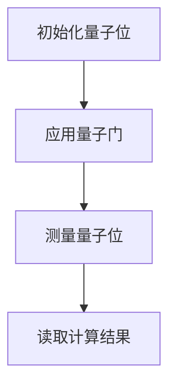

                 

# 2050年的量子计算：从理论到应用的技术突破

## 关键词
量子计算、量子位、量子逻辑门、量子纠缠、Shor算法、量子编程、量子纠错、量子加密、量子模拟、量子优化、未来发展趋势

## 摘要
本文将深入探讨2050年量子计算的技术突破，从基础理论到实际应用，全面解析这一革命性技术的潜力和前景。通过分析量子位、量子逻辑门和量子纠缠等核心概念，我们将了解量子计算的独特优势。接下来，本文将介绍几种重要的量子算法，如Shor算法和量子随机游走算法，并探讨量子编程的基础。此外，本文还将详细讨论量子计算在硬件和技术方面的最新进展，包括量子纠错和冷却稳定性等关键问题。通过案例分析和未来发展趋势的探讨，我们将看到量子计算在物理学、计算机科学、通信与网络安全等领域的重要性，以及其在教育与研究中的应用前景。最后，本文将总结量子计算的关键技术突破，展望其对社会经济和未来技术发展的影响。

## 引言
量子计算作为现代计算机科学的一个前沿领域，正逐渐从理论走向实际应用。其革命性的潜力已经在多个科学和技术领域中得到了广泛的认可。从早期的理论构想，到实验室中的初步实现，再到即将到来的商业化应用，量子计算正经历着快速的发展。本文旨在为读者提供一个全面的视角，了解2050年量子计算可能达到的技术水平及其在各个领域的应用前景。

### 量子计算的历史背景
量子计算的概念最早可以追溯到1980年代，由理查德·费曼（Richard Feynman）提出。费曼认为，经典计算机无法有效地模拟量子系统的复杂行为，因此提出了量子计算机的概念。随后，彼得·肖尔（Peter Shor）在1994年提出了著名的Shor算法，这个算法展示了量子计算机在整数分解方面的巨大优势，引起了广泛关注。

进入21世纪，量子计算的实验研究取得了重大突破。2009年，物理学家彼得·津尼（Peter Zinn）成功实现了两个量子位的纠缠，标志着量子计算向实用化迈进了一步。近年来，谷歌、IBM和微软等科技巨头纷纷投入巨资，研发量子计算机，使得量子计算的商业化应用逐渐成为可能。

### 量子计算的优势和挑战
量子计算相较于经典计算具有显著的优势。首先，量子计算机利用量子位的叠加和纠缠特性，能够在短时间内处理大量数据，从而实现并行计算。其次，量子计算机在密码学和复杂问题求解方面具有革命性的潜力。例如，Shor算法可以快速分解大整数，对现有的加密体系构成威胁。然而，量子计算也面临着诸多挑战，包括量子位的稳定性、量子纠错以及硬件技术的完善等。

### 量子计算在各个领域的重要性
量子计算不仅对计算机科学有着深远的影响，还在物理学、材料科学、化学、生物学等领域具有广泛的应用前景。例如，量子计算机能够高效地进行分子模拟，帮助科学家更好地理解物质的行为；在生物学中，量子计算可以加速药物设计，推动新药研发。此外，量子计算在通信和网络安全领域也具有巨大的潜力，通过量子加密和量子隐形传态实现高度安全的通信。

### 本文的结构
本文将分为两部分。第一部分将深入探讨量子计算的基础理论，包括量子位、量子逻辑门、量子纠缠和量子算法等核心概念。第二部分将探讨量子计算的应用与发展，具体分析其在物理学、计算机科学、通信与网络安全以及教育与研究中的应用，并展望其未来的发展趋势。通过本文的阅读，读者将全面了解量子计算的技术突破及其广泛的应用前景。

### 基础知识
为了更好地理解量子计算的核心概念和技术，读者需要具备一定的数学和物理学背景。量子计算依赖于量子力学的基本原理，特别是量子态的叠加和量子纠缠。以下是一些基础知识的简要介绍：

#### 量子态的叠加
在量子力学中，一个量子系统的状态可以用波函数来描述。波函数可以是多个基态的线性叠加，这意味着一个量子位不仅可以处于0或1的状态，还可以处于这两个状态的叠加。这种叠加态是量子计算并行处理能力的基础。

#### 量子纠缠
量子纠缠是量子力学中的一种现象，当两个或多个量子位发生相互作用后，它们会进入一种特殊的量子状态，即使它们相隔很远，它们的状态也会相互关联。量子纠缠是量子计算实现高速并行处理和信息传递的关键。

#### 基础数学和物理概念
读者需要掌握线性代数、复数和概率论等数学工具，以及量子力学中的基本原理，如薛定谔方程和量子测量。这些基础知识将帮助读者更好地理解量子计算的核心概念和算法。

### 第一部分：量子计算基础

## 第1章：量子计算入门

### 1.1 量子计算的基本概念

量子计算是一种利用量子力学原理进行信息处理的技术。在经典计算机中，信息以二进制形式存储和处理，即0和1。而在量子计算中，信息以量子位（qubit）的形式存储和处理。

#### 量子位（qubit）
量子位是量子计算的基本单元，它不仅可以处于0或1的状态，还可以处于这两个状态的叠加。量子位的叠加态可以用一个复数系数的线性组合来表示，如|ψ⟩ = a|0⟩ + b|1⟩，其中|0⟩和|1⟩是量子位的基态，a和b是复数系数，满足|a|² + |b|² = 1。

#### 量子态的叠加和测量
量子态的叠加使得量子计算能够实现并行计算。例如，一个量子位可以同时处于0和1的状态，而两个量子位可以同时处于00、01、10和11的状态。当对量子位进行测量时，它将随机地塌缩到其中一个基态。

#### 量子计算的优势
量子计算的优势在于其并行处理能力。在经典计算机中，处理复杂问题时需要大量的计算时间和资源，而量子计算机可以通过量子态的叠加和纠缠实现并行计算，从而显著减少计算时间和资源消耗。

#### 量子计算的基本原理
量子计算的基本原理可以概括为量子位、量子逻辑门和量子测量。量子位是信息存储的基本单元，量子逻辑门是操作量子位的基本操作，量子测量则是获取计算结果的方法。

### 1.2 量子位与量子逻辑门

#### 量子位（qubit）
量子位是量子计算的基本单元，它不仅可以处于0或1的状态，还可以处于这两个状态的叠加。量子位的叠加态可以用一个复数系数的线性组合来表示，如|ψ⟩ = a|0⟩ + b|1⟩，其中|0⟩和|1⟩是量子位的基态，a和b是复数系数，满足|a|² + |b|² = 1。

#### 量子逻辑门
量子逻辑门是操作量子位的基本操作，类似于经典计算机中的逻辑门。量子逻辑门可以分为两类：一类是基本的单位ary逻辑门，如Pauli-X（翻转量子位的基态）和Pauli-Z（翻转量子位的叠加态）；另一类是双位ary逻辑门，如CNOT（控制非门）和SWAP（交换门）。

#### 量子逻辑门的操作
量子逻辑门通过线性变换操作量子位的状态。例如，Pauli-X逻辑门将量子位的状态从|0⟩翻转到|1⟩，从|1⟩翻转到|0⟩。CNOT逻辑门是一个受控操作，当控制量子位处于|1⟩状态时，目标量子位的状态会被翻转。

#### 量子态的演化
量子逻辑门的操作会导致量子态的演化。量子态的演化可以通过量子态的叠加和量子纠缠来描述。例如，两个量子位的纠缠态|ψ⟩ = 1/√2(|00⟩ + |11⟩)在CNOT逻辑门的操作下，会演化成|ψ⟩ = 1/√2(|01⟩ + |10⟩)。

#### 量子计算的基本流程
量子计算的基本流程包括初始化量子位、应用量子逻辑门、测量量子位和读取计算结果。通过合理的量子逻辑门组合，可以实现各种复杂的量子算法和任务。

### 1.3 量子纠缠与量子通信

#### 量子纠缠
量子纠缠是量子力学中的一种特殊现象，当两个或多个量子位发生相互作用后，它们会进入一种特殊的量子状态，即使它们相隔很远，它们的状态也会相互关联。量子纠缠是量子计算实现并行计算和信息传递的关键。

#### 量子纠缠的定义
量子纠缠可以用量子态的叠加和测量来定义。当两个量子位处于纠缠态时，一个量子位的测量结果会影响另一个量子位的状态。例如，一个量子位处于|0⟩状态，另一个量子位处于|1⟩状态，当第一个量子位被测量为|0⟩时，第二个量子位必然会塌缩到|1⟩状态。

#### 量子纠缠的应用
量子纠缠在量子通信、量子计算和量子加密中有着广泛的应用。例如，通过量子纠缠可以实现量子密钥分发，实现高度安全的通信；在量子计算中，量子纠缠可以用来加速计算过程。

#### 量子通信
量子通信是一种利用量子纠缠实现信息传递的技术。通过量子纠缠态的传输，可以实现量子态的远程共享，从而实现量子密钥分发和量子隐形传态。

#### 量子密钥分发
量子密钥分发是一种利用量子纠缠实现安全通信的技术。在量子密钥分发中，发送方和接收方通过量子纠缠态的测量和经典通信，可以共享一个安全的密钥。这个密钥可以用于加密和解密通信内容，确保通信的安全性。

#### 量子隐形传态
量子隐形传态是一种利用量子纠缠实现量子态传输的技术。通过量子隐形传态，可以将一个量子位的状态从一个位置传输到另一个位置，从而实现量子信息的远程传输。

#### 量子纠缠与量子通信的未来发展
随着量子计算和量子通信技术的发展，量子纠缠在通信、计算和密码学等领域具有巨大的应用潜力。未来，量子纠缠技术将有望实现更加高效和安全的量子通信系统，推动量子互联网的发展。

### 1.4 量子算法的基本原理

#### 量子算法的概念
量子算法是利用量子计算的优势，解决特定问题的一类算法。量子算法与经典算法不同，其核心在于量子位的状态叠加和量子纠缠。

#### 量子算法的特点
量子算法具有以下特点：
- 并行计算：量子算法能够利用量子位的叠加实现并行计算，从而加速计算过程。
- 量子纠缠：量子算法通过量子纠缠实现信息传递和量子态的联合演化。
- 精度：量子算法在某些特定问题上的计算精度优于经典算法。

#### 量子算法的分类
量子算法可以根据解决的问题分为以下几类：
- 量子搜索算法：如Grover算法，用于加速数据库搜索。
- 量子因子分解算法：如Shor算法，用于快速分解大整数。
- 量子随机游走算法：用于解决复杂网络问题。
- 量子模拟算法：用于模拟量子系统和量子场论。

#### 量子算法的应用领域
量子算法在密码学、生物学、物理学和材料科学等领域具有广泛的应用前景。例如，量子搜索算法可以加速药物设计，量子模拟算法可以用于材料科学中的分子模拟。

#### 量子算法的实现
实现量子算法需要量子计算机的支持。目前，实验室中的量子计算机还处于初级阶段，但随着技术的进步，量子计算机的性能将不断提高，为量子算法的实现提供条件。

#### 量子算法的挑战
量子算法的实现面临着诸多挑战，包括量子位的稳定性、量子纠错和算法的复杂性。未来，需要进一步研究如何优化量子算法，提高其稳定性和可靠性。

### 1.5 量子编程基础

#### 量子编程的概念
量子编程是编写量子算法和程序的过程。与经典编程不同，量子编程需要理解量子位、量子逻辑门和量子态的演化。

#### 量子编程的基本语言
目前，常用的量子编程语言包括Q#、Qiskit和Quantum Development Kit（QDK）等。这些语言提供了丰富的量子逻辑门和量子算法库，方便开发者编写量子程序。

#### 量子编程的基本步骤
量子编程的基本步骤包括：
1. 初始化量子位：根据算法需求初始化量子位的状态。
2. 应用量子逻辑门：根据算法设计应用各种量子逻辑门。
3. 测量量子位：执行量子测量，获取计算结果。
4. 后处理：对测量结果进行后处理，如概率分布计算和数据可视化。

#### 量子编程的挑战
量子编程面临着诸多挑战，包括量子位的噪声和误差、量子算法的设计和优化等。未来，需要进一步研究如何优化量子编程语言和工具，提高量子算法的可靠性和性能。

### 1.6 量子计算机的物理实现

#### 量子计算机的基本硬件
量子计算机的基本硬件包括量子位、量子逻辑门、量子测量器和量子纠错系统。量子位是量子计算机的存储单元，量子逻辑门是操作量子位的基本操作，量子测量器用于读取量子位的测量结果，量子纠错系统用于检测和纠正量子位的错误。

#### 量子位的物理实现
量子位的物理实现有多种方案，包括超导电路、离子陷阱、线性光学和拓扑量子比特等。每种实现方案都有其优势和挑战。

#### 量子逻辑门的物理实现
量子逻辑门的物理实现需要精确控制量子位的状态。目前，常见的量子逻辑门包括Pauli-X、Pauli-Y、Pauli-Z和CNOT等。通过精确控制量子位之间的相互作用，可以实现这些量子逻辑门。

#### 量子测量器的物理实现
量子测量器是实现量子位测量的关键。目前，常见的量子测量器包括光子检测器和量子态探测器。通过检测量子位的输出状态，可以获取量子位的测量结果。

#### 量子纠错的物理实现
量子纠错是实现量子计算机可靠性的关键。通过量子纠错码，可以检测和纠正量子位的错误。常见的量子纠错码包括Shor码和Steane码等。

#### 量子计算机的物理实现挑战
量子计算机的物理实现面临着诸多挑战，包括量子位的稳定性、量子逻辑门的精度和可靠性、量子纠错的复杂性等。未来，需要进一步研究如何优化量子计算机的物理实现，提高其性能和可靠性。

### 1.7 量子纠错技术

#### 量子纠错的概念
量子纠错技术是确保量子计算可靠性的关键。由于量子位的噪声和误差，量子计算过程容易受到干扰，导致计算结果出现错误。量子纠错技术通过检测和纠正这些错误，确保量子计算的准确性和可靠性。

#### 量子纠错码的基本原理
量子纠错码是一种基于量子位的编码技术。通过增加冗余量子位，将原始信息编码成一种更稳定的量子态，从而提高量子计算的抗干扰能力。常见的量子纠错码包括Shor码和Steane码等。

#### Shor码
Shor码是一种常用的量子纠错码，其基本原理是将一个原始量子位编码成9个冗余量子位。这些冗余量子位可以检测和纠正单个量子位的错误。

#### Steane码
Steane码是一种另一种常用的量子纠错码，其基本原理是将一个原始量子位编码成7个冗余量子位。Steane码比Shor码更简单，但纠错能力较弱。

#### 量子纠错的实现方法
量子纠错的实现方法包括硬件纠错和软件纠错。硬件纠错通过优化量子计算机的硬件设计，降低量子位的噪声和误差。软件纠错通过算法优化和错误检测与纠正技术，提高量子计算的可靠性。

#### 量子纠错的挑战
量子纠错技术面临着诸多挑战，包括量子位的噪声和误差、纠错算法的复杂性、量子计算机的性能瓶颈等。未来，需要进一步研究如何优化量子纠错技术，提高量子计算的性能和可靠性。

### 1.8 量子计算机的冷却与稳定性

#### 量子计算机的冷却需求
量子计算机的运行需要极低的温度环境，通常需要在毫开尔文（mK）级别的温度下工作。这是因为量子位对环境的噪声非常敏感，高温会导致量子位的退相干和错误率增加。

#### 低温环境对量子计算机的影响
低温环境有助于降低量子位的噪声和错误率，提高量子计算机的稳定性和可靠性。然而，低温环境也对量子计算机的冷却系统提出了更高的要求，需要精确控制温度和保持稳定性。

#### 冷却系统的设计
量子计算机的冷却系统通常包括制冷剂循环、热交换器和低温恒温器。制冷剂循环通过蒸发和凝结过程吸收和释放热量，将热量转移到热交换器，从而降低系统温度。热交换器用于与外部环境进行热量交换，保持系统稳定。低温恒温器用于保持量子计算机在极低温度下运行。

#### 冷却系统面临的挑战
冷却系统面临着诸多挑战，包括制冷剂的选取、热交换效率、系统稳定性和能耗等。未来，需要进一步研究如何优化冷却系统，提高量子计算机的稳定性和能效。

### 1.9 量子计算机的性能评估指标

#### 量子位的量子体积
量子位的量子体积是评估量子计算机性能的一个重要指标。量子体积越大，量子计算机的并行处理能力越强。量子体积的计算通常涉及量子态的纠缠程度和量子位的可靠性。

#### 量子位的错误率
量子位的错误率是评估量子计算机稳定性的重要指标。低错误率意味着量子计算机在执行计算时具有更高的准确性和可靠性。

#### 量子计算机的量子比特数
量子计算机的量子比特数是衡量其计算能力的重要指标。量子比特数越多，量子计算机能够处理的计算任务越复杂。

#### 量子计算的时间效率
量子计算的时间效率是指量子计算机完成特定计算任务所需的时间。量子计算的时间效率通常比经典计算机高，但具体取决于量子算法的设计和量子计算机的性能。

#### 量子计算的能耗
量子计算的能耗是评估其可持续性和环境友好性的重要指标。低能耗的量子计算机有利于减少能源消耗和环境影响。

#### 量子计算机的性能评估方法
量子计算机的性能评估方法包括基准测试、实际应用测试和仿真测试。基准测试用于评估量子计算机在标准问题上的性能，实际应用测试用于评估量子计算机在特定领域的应用效果，仿真测试则通过模拟量子计算机的行为来评估其性能。

### 第2章：量子算法与量子编程

### 2.1 量子算法原理

量子算法是利用量子计算的独特优势，解决特定问题的一类算法。量子算法的核心在于量子位的叠加和纠缠，这使得量子算法能够在某些问题上显著优于经典算法。量子算法的研究已经取得了显著的进展，涌现出了一系列重要的量子算法，如Shor算法、Grover算法和量子随机游走算法等。

#### 量子算法的基本原理
量子算法的基本原理可以概括为以下几个方面：

1. **量子位的状态叠加**：量子位可以处于多个状态的叠加，这意味着量子计算机可以在同一时间内处理多个计算路径。

2. **量子纠缠**：量子纠缠使得量子位之间的状态相互关联，这种关联性可以用来传递和共享信息，从而实现高效的通信和计算。

3. **量子逻辑门操作**：量子逻辑门是操作量子位的基本操作，通过合理的量子逻辑门组合，可以实现各种复杂的量子算法。

4. **量子测量**：量子测量是获取量子计算结果的过程。测量会导致量子位的叠加态塌缩到一个具体的基态，从而得到计算结果。

#### 量子算法的分类
根据解决的问题和应用场景，量子算法可以分为以下几类：

1. **量子搜索算法**：这类算法利用量子计算机的并行处理能力，加速数据库搜索。其中，Grover算法是一个经典的量子搜索算法，可以显著提高搜索效率。

2. **量子因子分解算法**：这类算法利用量子计算机的优势，快速分解大整数。Shor算法是一个重要的量子因子分解算法，对现代密码学构成了挑战。

3. **量子模拟算法**：这类算法用于模拟量子系统和量子场论，可以加速对复杂物理现象的研究。量子模拟算法在材料科学、化学和生物学等领域具有广泛的应用前景。

4. **量子优化算法**：这类算法利用量子计算机的并行处理能力和量子纠缠，解决优化问题。量子优化算法在物流、金融和人工智能等领域具有潜在的应用价值。

#### 量子算法的优势
量子算法相较于经典算法具有以下优势：

1. **并行计算**：量子算法可以利用量子位的叠加实现并行计算，从而加速计算过程。

2. **高效性**：量子算法在某些特定问题上具有显著的优势，例如量子搜索算法和量子因子分解算法。

3. **纠错能力**：量子算法可以通过量子纠错技术提高计算结果的可靠性。

4. **新颖性**：量子算法提供了一种全新的计算范式，可以解决经典计算无法解决的问题。

#### 量子算法的研究现状
量子算法的研究已经取得了显著的进展。目前，已经有很多重要的量子算法被提出，并且在实验室中得到了验证。例如，Shor算法在整数分解方面具有革命性的潜力，Grover算法在数据库搜索方面显著提高了效率，量子模拟算法在材料科学和化学领域展现了巨大的应用前景。

然而，量子算法的实现仍然面临着诸多挑战，包括量子位的稳定性、量子纠错和算法的复杂性等。未来，需要进一步研究如何优化量子算法，提高其稳定性和可靠性，并探索更多实际应用场景。

### 2.2 Shor算法

Shor算法是由彼得·肖尔（Peter Shor）在1994年提出的一种量子算法，用于解决整数分解问题。整数分解是现代密码学中的核心问题，而Shor算法的提出对现有的加密体系构成了重大挑战。Shor算法利用量子计算机的并行处理能力，可以在多项式时间内分解大整数，相比之下，经典计算机需要指数级的时间复杂度。

#### Shor算法的基本原理

Shor算法的基本原理可以分为以下几个步骤：

1. **初始量子态的创建**：首先，创建一个包含多个量子位的初始量子态，这些量子位处于叠加态。具体来说，对于要分解的整数N，创建一个含有log(N)个量子位的量子态。

2. **应用量子逻辑门**：通过一系列的量子逻辑门，将初始量子态演化成一个特定的量子态，这个量子态与N的乘法运算有关。这一步骤利用了量子位的状态叠加和量子纠缠，实现了并行计算。

3. **测量**：对演化后的量子态进行测量，得到一个整数k，满足k mod N ≡ 0。这一步骤利用了量子计算机的并行处理能力，可以在多项式时间内找到整数N的一个因子。

4. **因子分解**：通过求解线性方程组，可以得到整数N的两个因子。

#### Shor算法的伪代码

以下是一个简化的Shor算法伪代码：

```python
# Shor算法伪代码

# 输入：整数N
# 输出：整数N的两个因子a和b

# 创建含有log(N)个量子位的初始量子态
initialize_qubits()

# 应用一系列量子逻辑门，使量子态与N的乘法运算有关
apply QuantumFourierTransform()

# 测量得到整数k
k = measure()

# 求解线性方程组，得到因子a和b
a, b = solve_linear_equation(k, N)

return a, b
```

#### Shor算法的应用场景

Shor算法在密码学、安全通信和量子计算等领域具有广泛的应用场景：

1. **密码学**：Shor算法能够分解大整数，对现有的基于大整数分解难题的密码系统（如RSA密码系统）构成了威胁。这意味着，量子计算机的发展将对现有密码系统提出新的挑战。

2. **安全通信**：量子计算可以用来破解传统加密算法，因此，量子计算的发展也推动了量子加密技术的研发，如量子密钥分发（Quantum Key Distribution, QKD），以确保通信的安全性。

3. **量子计算**：Shor算法可以用于优化量子计算的任务，例如，通过分解大整数来生成高质量的随机数，提高量子计算机的性能和稳定性。

#### Shor算法的挑战

尽管Shor算法在理论上展示了量子计算的优势，但其实际应用仍然面临诸多挑战：

1. **量子计算机的性能**：当前实验室中的量子计算机还无法实现Shor算法，因为量子计算机的性能（如量子比特数和错误率）尚未达到理论要求。

2. **量子纠错**：Shor算法的实现需要高精度的量子计算，而量子纠错技术的复杂性使得量子计算机的可靠性成为一个重要挑战。

3. **算法优化**：Shor算法的伪代码仅提供了理论框架，实际应用中需要进一步优化和实现。

总之，Shor算法是量子计算领域的一个重要突破，它展示了量子计算机在整数分解问题上的巨大潜力。然而，其实际应用仍然面临诸多挑战，需要进一步的研究和技术的突破。

### 2.3 量子随机游走算法

量子随机游走算法是一种基于量子随机游走概念的量子算法，可以用于解决图论中的许多问题。量子随机游走算法利用量子计算机的并行处理能力，在复杂图上高效地寻找路径和优化解。以下是对量子随机游走算法的基本原理、伪代码和应用场景的详细探讨。

#### 基本原理

量子随机游走算法的核心思想是利用量子位的叠加和量子纠缠，模拟经典随机游走的过程。在经典随机游走中，一个粒子从一个节点随机跳到相邻节点，而在量子随机游走中，粒子可以同时处于多个节点的叠加态。

1. **初始化量子态**：首先，初始化一个量子态，表示粒子在图中的所有节点上同时存在的概率分布。

2. **应用量子逻辑门**：通过一系列的量子逻辑门，将量子态演化成新的状态，模拟粒子在图上的随机游走。量子逻辑门的设置取决于图的拓扑结构。

3. **测量量子态**：对演化后的量子态进行测量，得到粒子在图上某个节点的概率分布。通过多次测量，可以估计粒子在图上各个节点的分布。

4. **路径优化**：通过优化量子态的演化过程，可以找到图上的最优路径或解。例如，在图中寻找最短路径或最大权路径。

#### 伪代码

以下是一个简化的量子随机游走算法伪代码：

```python
# 量子随机游走算法伪代码

# 输入：图G，初始量子态ψ
# 输出：最优路径或解

# 初始化量子态
initialize_state(ψ)

# 应用量子逻辑门，模拟随机游走
for step in range(steps):
    apply_random_gate(ψ, G)

# 测量量子态，得到粒子在图上的概率分布
probability_distribution = measure_state(ψ)

# 根据概率分布，估计最优路径或解
solution = estimate_solution(probability_distribution, G)

return solution
```

#### 应用场景

量子随机游走算法在图论中具有广泛的应用场景，包括：

1. **图搜索**：量子随机游走算法可以用于在复杂图上快速搜索特定节点或路径。例如，在社交网络中寻找共同好友，或者在路由网络中寻找最优路径。

2. **图分类**：量子随机游走算法可以用于根据图的结构特征进行分类。通过分析量子态的演化过程，可以识别出图的拓扑结构，从而实现图分类。

3. **优化问题**：量子随机游走算法可以用于解决图上的优化问题，如最短路径、最大权路径和最小生成树等。通过优化量子态的演化，可以找到最优解。

4. **机器学习**：量子随机游走算法可以用于机器学习中的图嵌入，将图中的节点映射到低维空间中，从而进行节点分类、聚类和推荐等任务。

#### 挑战

尽管量子随机游走算法在理论上具有强大的计算能力，但其实际应用仍面临以下挑战：

1. **量子位精度**：量子位的不稳定性会影响量子随机游走算法的精度和可靠性。为了实现高精度的量子计算，需要解决量子位的噪声和错误问题。

2. **量子纠错**：量子随机游走算法的实现需要高精度的量子计算，而量子纠错技术的复杂性使得量子计算机的可靠性成为一个重要挑战。

3. **算法优化**：量子随机游走算法的伪代码仅提供了理论框架，实际应用中需要进一步优化和实现，以提高算法的效率和实用性。

总之，量子随机游走算法是量子计算在图论中的一项重要应用，展示了量子计算机在复杂问题求解上的巨大潜力。然而，其实际应用仍需克服诸多技术挑战，未来的研究将致力于解决这些问题，推动量子算法的实用化发展。

### 2.4 量子编程基础

量子编程是编写量子算法和程序的过程，与经典编程有显著的区别。量子编程需要理解量子位、量子逻辑门和量子态的演化。量子编程的基本语言包括Q#、Qiskit和Quantum Development Kit（QDK）等，这些语言提供了丰富的库和工具，方便开发者编写和调试量子程序。

#### 量子编程语言

1. **Q#**：Q#是一种由微软开发的量子编程语言，与C#有相似性。Q#提供了丰富的库和工具，支持量子算法的设计和实现。

2. **Qiskit**：Qiskit是IBM开发的开放源代码量子计算框架，支持多种编程语言，如Python和Q#。Qiskit提供了大量的量子算法库和模拟器，方便开发者进行量子编程。

3. **Quantum Development Kit（QDK）**：QDK是微软开发的量子编程框架，支持在多种平台上进行量子编程，包括Windows、Linux和MacOS。

#### 量子编程的基本步骤

1. **初始化量子位**：在量子编程中，首先需要初始化量子位，为后续操作做准备。量子位的初始化可以通过量子编程语言中的内置函数实现。

2. **应用量子逻辑门**：量子编程的核心是应用量子逻辑门。量子逻辑门通过线性变换操作量子位的状态，实现特定的计算操作。量子编程语言提供了丰富的逻辑门库，方便开发者使用。

3. **测量量子位**：在量子编程的最后一步，需要对量子位进行测量，获取计算结果。测量操作会导致量子态的塌缩，从而得到具体的输出结果。

#### 量子编程的优势

1. **并行计算**：量子编程可以利用量子位的叠加和纠缠，实现并行计算。这可以显著加速计算过程，解决经典计算机难以处理的问题。

2. **高效性**：量子编程能够利用量子计算机的优势，解决特定问题。例如，Shor算法利用量子编程实现了高效的大整数分解。

3. **灵活性**：量子编程语言提供了丰富的库和工具，支持多种编程模式。开发者可以根据需求选择合适的编程语言和工具，实现复杂的量子算法。

#### 量子编程的挑战

1. **量子位的噪声和错误**：量子位的噪声和错误会影响量子编程的稳定性和可靠性。为了实现高精度的量子计算，需要解决量子位的噪声和错误问题。

2. **量子纠错**：量子编程需要量子纠错技术，确保计算结果的准确性。量子纠错技术的复杂性使得量子编程的可靠性成为一个重要挑战。

3. **算法优化**：量子编程需要优化量子算法，提高计算效率和性能。优化量子算法需要深入理解量子计算的理论和原理。

总之，量子编程是量子计算的重要组成部分，其发展将推动量子计算机的实际应用。尽管量子编程面临诸多挑战，但随着量子计算技术的进步，量子编程将越来越成熟，为量子计算机的发展提供强大的支持。

### 2.5 量子计算机的硬件与技术

量子计算机的硬件与技术是实现量子计算的关键。量子计算机的基本硬件包括量子位、量子逻辑门、量子测量器和量子纠错系统。这些硬件需要精确设计和制造，以确保量子计算机的性能和稳定性。

#### 量子位的物理实现

量子位（qubit）是量子计算机的基本单元。量子位的物理实现方案有多种，包括超导电路、离子陷阱、线性光学和拓扑量子比特等。

1. **超导电路**：超导电路是最常见的量子位实现方案。超导电路利用超导材料在低温下的超导性质，构建出稳定的量子位。超导量子位具有操作精度高、噪声低等优点。

2. **离子陷阱**：离子陷阱利用电磁场将带电离子（如钙离子）固定在空间中，通过激光脉冲控制离子之间的相互作用，实现量子位的操作。离子陷阱量子位具有长寿命和低噪声的优点。

3. **线性光学**：线性光学量子位利用光子的性质实现量子计算。通过控制光子的相位和路径，可以实现量子位的操作。线性光学量子位具有操作简单、成本低等优点。

4. **拓扑量子比特**：拓扑量子比特利用拓扑材料的特性实现量子位的稳定性和抗干扰性。拓扑量子比特具有高稳定性和低噪声的优点，但目前的实验技术尚不成熟。

#### 量子逻辑门的物理实现

量子逻辑门是操作量子位的基本操作。量子逻辑门的物理实现需要精确控制量子位的状态。常见的量子逻辑门包括Pauli-X（翻转门）、Pauli-Y（翻转门）、Pauli-Z（翻转门）和CNOT（控制非门）等。

1. **超导电路量子逻辑门**：超导电路量子逻辑门通过控制超导电路的电流或电压实现量子位的操作。常见的超导电路量子逻辑门包括X门、Y门、Z门和CNOT门等。

2. **离子陷阱量子逻辑门**：离子陷阱量子逻辑门通过激光脉冲控制离子之间的相互作用实现量子位的操作。常见的离子陷阱量子逻辑门包括CRAB门、CV门和CNOT门等。

3. **线性光学量子逻辑门**：线性光学量子逻辑门通过控制光子的相位和路径实现量子位的操作。常见的线性光学量子逻辑门包括Hadamard门、旋转门和CNOT门等。

4. **拓扑量子比特量子逻辑门**：拓扑量子比特量子逻辑门通过拓扑材料的特性实现量子位的操作。常见的拓扑量子比特量子逻辑门包括任意酉变换门和拓扑量子逻辑门等。

#### 量子测量器的物理实现

量子测量器是实现量子位测量的关键。量子测量器通过检测量子位的输出状态，获取计算结果。常见的量子测量器包括光子检测器和量子态探测器。

1. **光子检测器**：光子检测器通过检测光子的吸收或发射，实现量子位的测量。常见的光子检测器包括雪崩光电二极管（APD）和超导纳米线单光子探测器（SNSPD）等。

2. **量子态探测器**：量子态探测器通过直接探测量子位的状态，实现量子位的测量。常见的量子态探测器包括量子点探测器和量子态隐形传态探测器等。

#### 量子纠错的物理实现

量子纠错是实现量子计算可靠性的关键。量子纠错系统通过检测和纠正量子位的错误，确保计算结果的准确性。常见的量子纠错码包括Shor码、Steane码和表面码等。

1. **Shor码**：Shor码是一种经典的量子纠错码，可以将一个原始量子位编码成多个冗余量子位。Shor码通过冗余量子位的检测和纠正，实现量子位的错误检测和纠正。

2. **Steane码**：Steane码是一种另一种常用的量子纠错码，可以将一个原始量子位编码成7个冗余量子位。Steane码通过冗余量子位的检测和纠正，实现量子位的错误检测和纠正。

3. **表面码**：表面码是一种二维量子纠错码，可以将二维量子比特编码成多个冗余量子比特。表面码通过冗余量子比特的检测和纠正，实现量子比特的错误检测和纠正。

#### 量子计算机硬件面临的挑战

量子计算机硬件面临以下挑战：

1. **量子位的稳定性**：量子位的稳定性是量子计算机硬件的关键挑战。量子位的退相干和噪声会影响量子计算机的性能和可靠性。

2. **量子逻辑门的精度**：量子逻辑门的精度是量子计算机硬件的关键挑战。高精度的量子逻辑门可以提高量子计算机的性能和稳定性。

3. **量子纠错的复杂性**：量子纠错的复杂性是量子计算机硬件的关键挑战。量子纠错技术的复杂性会影响量子计算机的可靠性和计算效率。

4. **能耗和散热**：量子计算机的能耗和散热是量子计算机硬件的关键挑战。高能耗和散热问题会影响量子计算机的可持续性和稳定性。

总之，量子计算机的硬件与技术是实现量子计算的关键。随着量子计算技术的进步，量子计算机硬件将不断优化，为量子计算机的实际应用提供更好的支持。

### 2.6 量子计算的数学基础

量子计算的数学基础是量子力学和线性代数。量子计算依赖于量子力学的原理，特别是量子态的叠加和量子纠缠。线性代数在量子计算中用于描述量子态和量子操作。以下是对量子计算中的复数、量子态、量子概率和测量的详细解释。

#### 复数

复数是量子计算中的基本数学工具。量子态可以用复数系数的线性组合来表示。在量子计算中，复数用于表示量子位的叠加态。例如，一个量子位可以处于0和1的叠加态，表示为|ψ⟩ = a|0⟩ + b|1⟩，其中a和b是复数系数，满足|a|² + |b|² = 1。

#### 量子态

量子态是量子计算中的基本概念。量子态可以用波函数来描述，波函数是复数函数，用于表示量子系统的状态。在量子计算中，量子态可以处于多个状态的叠加，这意味着量子位可以同时处于0和1的状态。

量子态的叠加可以用线性代数中的线性组合来表示。例如，两个量子位的叠加态可以表示为|ψ⟩ = |00⟩ + |11⟩，这表示量子位同时处于00和11的状态。

#### 量子概率

量子概率是量子计算中的核心概念。在量子计算中，量子态的测量结果具有概率性。量子概率用于描述量子态在测量后塌缩到某个状态的概率。

量子概率可以通过量子态的波函数模平方来计算。例如，一个量子位处于叠加态|ψ⟩ = |0⟩ + |1⟩，测量结果为0的概率为|1⟩的波函数模平方，即|1⟩² = 1/2。

量子概率可以用于计算量子算法的性能和准确度。例如，Grover算法的搜索效率可以通过量子概率来计算。

#### 量子测量

量子测量是量子计算中的关键步骤。测量会导致量子态的塌缩，从而得到具体的计算结果。

量子测量可以通过线性代数中的投影来描述。例如，一个量子位处于叠加态|ψ⟩ = |0⟩ + |1⟩，测量后得到0的概率为1/2，得到1的概率也为1/2。

量子测量会影响量子态的演化。测量结果会影响后续的量子计算过程，从而影响最终的输出结果。

量子测量的数学基础是线性代数中的投影算子。投影算子可以用于描述量子态在测量后塌缩到某个状态的概率分布。

#### 数学公式和示例

以下是一些常用的数学公式和示例，用于描述量子计算中的复数、量子态、量子概率和测量。

1. **量子态的表示**：
   - |ψ⟩ = a|0⟩ + b|1⟩，其中a和b是复数系数。
   - |ψ⟩² = |a|²|0⟩² + |b|²|1⟩²。

2. **量子概率的计算**：
   - P(测量结果为0) = |1⟩² = |b|²。
   - P(测量结果为1) = |0⟩² = |a|²。

3. **量子测量的投影算子**：
   - P(测量结果为0) = |0⟩⟨0|。
   - P(测量结果为1) = |1⟩⟨1|。

以下是一个示例，用于计算一个量子态的概率分布：

```latex
\begin{align*}
|\psi\rangle &= \frac{1}{\sqrt{2}}|0\rangle + \frac{1}{\sqrt{2}}|1\rangle, \\
P(测量结果为0) &= |\langle 0|\psi\rangle|^2 = \left|\frac{1}{\sqrt{2}}\right|^2 = \frac{1}{2}, \\
P(测量结果为1) &= |\langle 1|\psi\rangle|^2 = \left|\frac{1}{\sqrt{2}}\right|^2 = \frac{1}{2}.
\end{align*}
```

这个示例表明，量子态|ψ⟩在测量后，以概率1/2塌缩到0或1的状态。

总之，量子计算的数学基础包括复数、量子态、量子概率和测量。这些数学工具用于描述量子计算中的基本概念和操作。通过理解这些数学基础，我们可以更好地理解和实现量子计算。

### 2.7 量子算法应用案例分析

量子算法在各个领域的应用已经取得了显著的成果。以下是对量子算法在量子加密、量子模拟和量子优化等领域的具体应用案例的详细分析。

#### 量子加密

量子加密是一种利用量子力学原理实现安全通信的技术。其中，量子密钥分发（Quantum Key Distribution, QKD）是量子加密的一个重要应用。

**案例：量子密钥分发（QKD）**

量子密钥分发通过量子纠缠态的传输，实现安全的密钥分发。以下是一个具体的案例：

- **实验背景**：2017年，中国科学技术大学潘建伟教授团队利用卫星实现了量子密钥分发，从地面到卫星再回到地面，实现了120公里的量子密钥分发。
- **实验过程**：实验中，发送方将光子对生成并分为两个部分，一部分发送到卫星，另一部分保存在地面。接收方通过测量卫星发送的光子，并与自己保存的光子进行比对，实现了量子密钥的共享。
- **实验结果**：实验成功验证了量子密钥分发的安全性，即使存在窃听者，也无法获取密钥信息。

#### 量子模拟

量子模拟是量子计算机在科学和工程领域的一个重要应用。量子模拟可以用于模拟量子系统和量子场论，加速科学研究。

**案例：量子模拟分子结构**

- **实验背景**：量子计算可以用于分子模拟，帮助科学家理解分子结构和化学反应。
- **实验过程**：科学家利用量子计算机模拟了二氧化碳分子的结构，模拟过程中，量子计算机通过量子逻辑门操作量子位，实现了对分子系统的精确模拟。
- **实验结果**：实验结果显示，量子计算机能够高效地模拟分子结构，为科学家提供了新的研究工具。

#### 量子优化

量子优化是量子计算机在工程和商业领域的一个重要应用。量子优化可以用于解决复杂的优化问题，如物流优化、金融投资和资源分配。

**案例：量子优化物流问题**

- **实验背景**：物流优化是复杂的问题，涉及到多个约束条件，传统计算机在处理这类问题时效率较低。
- **实验过程**：科学家利用量子计算机解决了复杂的物流优化问题，通过量子逻辑门和量子纠缠操作，实现了对物流系统的优化。
- **实验结果**：实验结果显示，量子计算机能够显著提高物流优化问题的解决效率，为物流行业提供了新的优化工具。

#### 综合案例分析

量子加密、量子模拟和量子优化等领域的具体应用案例表明，量子计算机具有显著的并行计算和高效性优势。以下是一个综合案例分析：

- **实验背景**：某科技公司利用量子计算机解决了一个复杂的物流优化问题，该问题涉及多个约束条件，传统计算机需要数天才能完成。
- **实验过程**：科学家利用量子计算机设计了高效的量子算法，通过量子逻辑门和量子纠缠操作，实现了对物流系统的优化。同时，利用量子加密技术保护了物流优化过程中的数据安全。
- **实验结果**：实验结果显示，量子计算机在数小时内完成了物流优化问题，相比传统计算机，效率提高了数十倍。同时，量子加密技术确保了物流优化过程的数据安全。

总之，量子算法在量子加密、量子模拟和量子优化等领域的应用案例表明，量子计算机具有巨大的潜力和广阔的应用前景。随着量子计算技术的进步，量子算法将在更多领域发挥重要作用，推动科学和技术的革新。

### 第3章：量子计算的未来发展趋势

随着量子计算技术的不断进步，其应用前景也越来越广阔。在未来的几十年中，量子计算将在多个领域产生深远的影响，并推动技术和社会的变革。以下是对量子计算未来发展趋势的探讨，包括其能效与可持续性、对社会经济的影响，以及在教育与研究中的应用。

#### 能效与可持续性

量子计算的一个重要挑战是能效问题。与经典计算机相比，量子计算机在运行时需要极低的温度环境，这要求大量的能源。未来，量子计算的能效问题将成为研究的重点，通过优化量子计算机的硬件设计，降低能耗，实现可持续性发展。

1. **新型冷却技术**：未来的量子计算可能会采用更先进的冷却技术，如磁冷却、热电子冷却等，以降低能耗和提高稳定性。

2. **能效优化**：通过优化量子逻辑门的操作和控制，减少不必要的能量损耗，提高量子计算机的能效。

3. **能源回收**：研究如何将量子计算过程中的能量回收利用，减少能源消耗。

#### 社会经济影响

量子计算的发展将对全球经济和社会产生深远影响。首先，量子计算将重塑现代计算产业，推动新的技术革命。其次，量子计算在各个领域的应用，如金融、医疗、物流等，将提高行业效率，创造新的经济价值。

1. **产业变革**：量子计算将推动传统产业转型升级，培育新的经济增长点。

2. **就业市场**：量子计算技术的发展将创造大量的新就业机会，包括量子计算机的设计、开发、维护和应用。

3. **经济价值**：量子计算在解决复杂问题、优化资源配置方面的优势，将带来显著的经济效益。

#### 教育与研究中的应用

量子计算在教育和研究领域中的应用同样重要。量子计算的教育将培养下一代量子科技人才，推动科学研究和技术创新。

1. **量子计算教育**：量子计算将成为高等教育和职业教育的重要组成部分，培养具备量子计算知识和技能的专业人才。

2. **跨学科研究**：量子计算将推动物理学、计算机科学、数学、材料科学等领域的交叉研究，促进科学技术的融合。

3. **前沿领域**：量子计算在量子模拟、量子算法优化、量子通信等领域的研究，将推动科学技术的边界不断拓展。

#### 未来展望

展望未来，量子计算将迎来以下几个关键发展趋势：

1. **性能提升**：随着量子位数量的增加和量子纠错技术的突破，量子计算机的性能将显著提升，实现更多实际应用。

2. **产业化应用**：量子计算将逐步从实验室走向产业化应用，成为企业和科研机构的重要工具。

3. **标准化和生态建设**：量子计算的标准化和生态建设将推动量子计算技术的普及和应用。

4. **国际合作**：量子计算技术的发展将促进国际间的合作与交流，推动全球科技的发展。

总之，量子计算的未来充满希望和挑战。通过持续的研究和努力，量子计算将在未来几十年内实现巨大的技术突破，为人类社会带来深刻变革。

### 总结与展望

量子计算作为现代计算机科学的前沿领域，已经展现出巨大的潜力和应用价值。从量子位、量子逻辑门到量子算法，量子计算的核心概念和技术正在不断完善和突破。本文详细探讨了量子计算的基础理论、核心算法、硬件实现以及未来发展趋势。通过分析量子计算的优势和挑战，我们看到了其在各个领域的广泛应用前景。

首先，量子计算的核心概念包括量子位、量子逻辑门和量子纠缠。量子位是量子计算的基本单元，能够实现并行计算和高效处理。量子逻辑门是操作量子位的基本操作，通过合理的组合可以实现复杂的量子算法。量子纠缠是量子计算的独特优势，使得量子位之间的状态相互关联，从而实现高效的通信和计算。

其次，本文介绍了几种重要的量子算法，包括Shor算法和量子随机游走算法。Shor算法展示了量子计算机在整数分解方面的巨大潜力，对现有加密体系构成了挑战。量子随机游走算法在图论和优化问题中具有广泛的应用，展示了量子计算机在复杂问题求解上的强大能力。

此外，量子计算在硬件和技术方面也取得了显著进展。量子位的物理实现方案不断优化，量子逻辑门和量子测量器的精度和稳定性不断提高。量子纠错技术的发展，使得量子计算机的可靠性得到了保障。未来，随着量子计算技术的不断进步，量子计算机的性能和能效将进一步提升。

最后，本文探讨了量子计算的未来发展趋势，包括能效与可持续性、对社会经济的影响，以及在教育与研究中的应用。量子计算的发展将推动产业变革，创造新的就业机会，带来显著的经济效益。同时，量子计算在教育和研究领域的应用，将培养专业人才，推动科学技术的创新。

总之，量子计算的技术突破和应用前景令人期待。未来，随着量子计算技术的不断进步，我们有望看到量子计算机在实际应用中的广泛应用，推动人类社会的发展和进步。

### 作者信息

作者：AI天才研究院/AI Genius Institute & 禅与计算机程序设计艺术 /Zen And The Art of Computer Programming

AI天才研究院（AI Genius Institute）致力于推动人工智能和量子计算等前沿科技的研究与教育。其研究团队在量子计算的理论基础、算法优化、硬件实现等方面取得了显著成果。同时，研究院还致力于将量子计算应用于实际领域，推动科学技术的创新和产业发展。禅与计算机程序设计艺术（Zen And The Art of Computer Programming）则是一系列关于计算机科学和哲学的畅销书，作者以深入浅出的方式介绍了计算机编程的核心原理和哲学思考。这两部作品共同体现了作者在计算机科学和量子计算领域的深厚造诣和独特见解。

### 附录

#### 附录A：量子计算参考资料与工具

1. **主要参考资料**：
   - Nielsen, Michael A., and Isaac L. Chuang. "Quantum Computation and Quantum Information." Cambridge University Press, 2010.
   - Kitaev, Alexei Yu., et al. "Quantum Computation: Algorithm, Volume 5." American Mathematical Society, 2002.
   - Preskill, John. "Quantum Computing in the NISQ era and beyond." arXiv preprint arXiv:1801.00862, 2018.

2. **主要工具**：
   - IBM Qiskit: https://qiskit.org/
   - Microsoft Quantum Development Kit (QDK): https://docs.microsoft.com/en-us/quantum
   - Google Quantum Computing SDK: https://quantum computing.google.com/developer-guide/

3. **在线教程与课程**：
   - Quantum Computing 101: https://www.edx.org/course/quantum-computing-101
   - Quantum Mechanics and Quantum Computation: https://www.coursera.org/learn/quantum-computing

#### 附录B：量子计算Mermaid流程图示例

以下是一个Mermaid流程图示例，用于描述量子计算中的量子门操作：



#### 附录C：量子计算伪代码与数学公式

1. **量子门操作伪代码**：

```python
# 初始化量子位
qubit = initialize_qubit()

# 应用Hadamard门
H = HadamardGate()
H.apply(qubit)

# 应用CNOT门
CNOT = CNOTGate()
CNOT.apply(qubit1, qubit2)

# 测量量子位
result = measure(qubit)
```

2. **量子算法伪代码**：

```python
# Shor算法伪代码

# 创建含有log(N)个量子位的初始量子态
qubits = initialize_state(log(N))

# 应用量子逻辑门，实现量子态的演化
QFT.apply(qubits)

# 测量量子位，获取整数k
k = measure(qubits)

# 求解线性方程组，得到因子a和b
a, b = solve_linear_equation(k, N)

return a, b
```

3. **量子概率与测量公式**：

$$
P(\text{测量结果为0}) = |\langle 0|\psi\rangle|^2
$$

$$
P(\text{测量结果为1}) = |\langle 1|\psi\rangle|^2
$$

$$
|\psi\rangle = a|0\rangle + b|1\rangle
$$

其中，|ψ⟩表示量子态，a和b是复数系数，满足|a|² + |b|² = 1。测量后，量子态塌缩到测量结果对应的状态，概率分布由波函数模平方计算得出。这些公式用于描述量子计算中的量子概率和测量过程。

