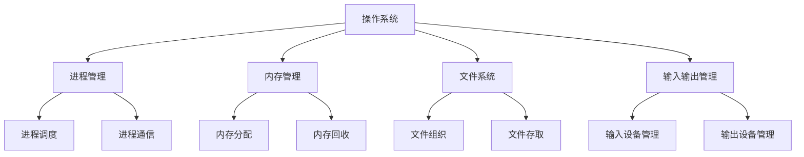
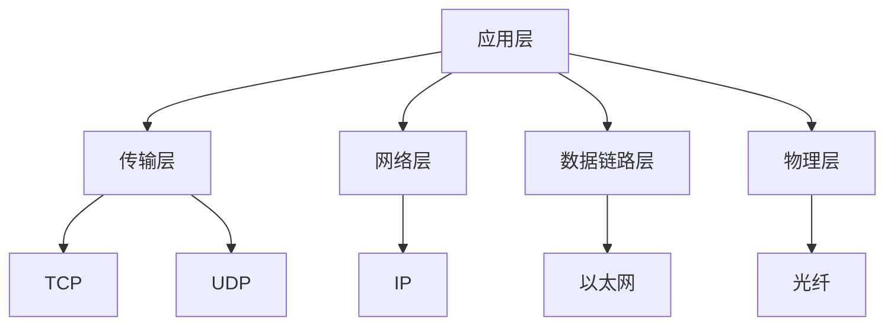
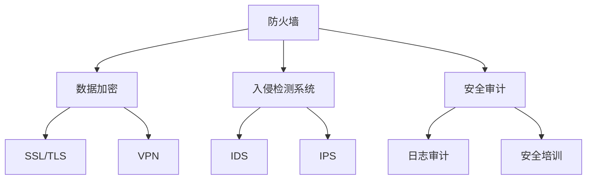

                 

# 《2025年腾讯校招技术面试题集锦》

> **关键词：** 腾讯校招、技术面试、面试题集锦、计算机基础知识、编程语言、操作系统、计算机网络、算法与数据结构、项目实战、面试技巧

> **摘要：** 本文深入剖析了2025年腾讯校招技术面试的热门题目，涵盖了计算机基础知识、编程语言、操作系统、计算机网络、算法与数据结构、项目实战和面试技巧等各个方面。通过详细的解题思路和实战案例，帮助读者全面备战腾讯校招技术面试，提升求职成功率。

## 目录大纲

### 第一部分：基础知识与核心概念

### 第二部分：技术深度与实战

### 第三部分：项目实战与面试技巧

### 附录：参考资料与拓展阅读

## 第一部分：基础知识与核心概念

### 第1章：计算机基础知识

#### 1.1 计算机组成原理

计算机硬件系统和软件系统的核心概念、架构以及相互关系是计算机基础知识的重要组成部分。下面，我们将通过Mermaid流程图来展示计算机硬件系统和软件系统的架构。

```mermaid
graph TD
    A[硬件系统] --> B[中央处理器(CPU)]
    A --> C[存储系统]
    A --> D[输入输出设备]
    B --> E[主存储器(MEM)]
    B --> F[输入输出设备(I/O)]
    C --> G[硬盘(HDD)]
    C --> H[固态硬盘(SSD)]
    D --> I[显示器]
    D --> J[键盘]
    D --> K[鼠标]
```

- **计算机硬件系统：** 包括中央处理器（CPU）、存储系统（硬盘、固态硬盘）和输入输出设备（显示器、键盘、鼠标）。
- **计算机软件系统：** 包括操作系统、编译器、解释器和应用程序等。

#### 1.2 编程语言基础

编程语言是计算机与人类沟通的桥梁。本文将介绍C语言、Java语言和Python语言的基础知识。

##### 1.2.1 C语言基础

C语言是一种高效的编程语言，广泛应用于操作系统、嵌入式系统和高性能计算等领域。以下是C语言的一些核心概念和语法：

- **变量与数据类型：** int、float、double、char等
- **控制结构：** if、for、while等
- **函数：** 主函数（main()）和其他函数
- **指针：** 指向变量的内存地址

伪代码示例：

```c
#include <stdio.h>

int main() {
    int a = 10;
    int b = 20;
    int sum = a + b;
    printf("Sum is %d", sum);
    return 0;
}
```

##### 1.2.2 Java语言基础

Java是一种面向对象的编程语言，广泛应用于企业级应用、Android开发等领域。以下是Java语言的一些核心概念和语法：

- **类与对象：** 类是对象的模板，对象是类的实例
- **继承：** 子类继承父类的属性和方法
- **接口：** 定义一组方法的规范
- **异常处理：** try、catch、finally等

伪代码示例：

```java
public class HelloWorld {
    public static void main(String[] args) {
        System.out.println("Hello, World!");
    }
}
```

##### 1.2.3 Python语言基础

Python是一种简洁易学的编程语言，广泛应用于数据科学、人工智能和Web开发等领域。以下是Python语言的一些核心概念和语法：

- **变量与数据类型：** int、float、str、list、tuple等
- **控制结构：** if、for、while等
- **函数：** 定义和调用
- **模块与包：** 导入和使用模块

伪代码示例：

```python
def hello_world():
    print("Hello, World!")

hello_world()
```

#### 1.3 数据结构与算法

数据结构与算法是计算机科学的核心，是解决复杂问题的基石。本文将介绍常见的数据结构和算法。

##### 1.3.1 常见数据结构

- **数组：** 顺序存储数据，支持随机访问
- **链表：** 链式存储数据，支持动态扩展
- **栈：** 后进先出（LIFO）结构
- **队列：** 先进先出（FIFO）结构
- **树：** 由节点和边构成，支持分层存储
- **图：** 由节点和边构成，支持复杂关系表示

##### 1.3.2 常见算法

- **排序算法：** 冒泡排序、选择排序、插入排序、快速排序等
- **查找算法：** 顺序查找、二分查找、斐波那契查找等
- **图算法：** 拓扑排序、最短路径算法等
- **动态规划：** 解决最优子结构问题
- **贪心算法：** 解决局部最优问题

伪代码示例（冒泡排序）：

```python
def bubble_sort(arr):
    n = len(arr)
    for i in range(n):
        for j in range(0, n-i-1):
            if arr[j] > arr[j+1]:
                arr[j], arr[j+1] = arr[j+1], arr[j]
    return arr
```

##### 1.3.3 算法复杂度分析

算法复杂度分析是评估算法性能的重要方法。本文将介绍时间复杂度和空间复杂度。

- **时间复杂度：** 算法执行次数与输入规模的关系，通常用大O符号表示
- **空间复杂度：** 算法占用内存的大小，通常用大O符号表示

示例（冒泡排序的时间复杂度和空间复杂度）：

```python
# 时间复杂度
def bubble_sort(arr):
    n = len(arr)
    for i in range(n):
        for j in range(0, n-i-1):
            if arr[j] > arr[j+1]:
                arr[j], arr[j+1] = arr[j+1], arr[j]
    return arr

# 空间复杂度
O(1)
```

### 第2章：操作系统与数据库

操作系统和数据库是计算机系统中的核心组成部分，负责管理和存储数据。本文将介绍操作系统和数据库的基础知识。

#### 2.1 操作系统基础

操作系统是计算机系统的核心软件，负责管理计算机硬件资源和软件资源。以下是操作系统的一些核心概念和组件：

- **进程与线程：** 进程是计算机程序的执行实例，线程是进程中的执行单元
- **内存管理：** 分配和回收内存空间
- **文件系统：** 管理文件和目录
- **输入输出管理：** 管理输入输出设备

Mermaid流程图示例：



#### 2.2 数据库基础

数据库是用于存储、管理和查询数据的系统。以下是数据库的一些核心概念和组件：

- **关系型数据库：** 使用表和关系来存储数据，如MySQL、Oracle等
- **非关系型数据库：** 使用不同的数据模型存储数据，如MongoDB、Redis等
- **SQL：** 结构化查询语言，用于查询和操作数据库

示例（关系型数据库表结构）：

```sql
CREATE TABLE Students (
    ID INT PRIMARY KEY,
    Name VARCHAR(50),
    Age INT,
    Major VARCHAR(50)
);
```

#### 2.3 SQL基础

SQL是用于查询和操作数据库的语言。以下是SQL的一些基本概念和语法：

- **DML（数据操作语言）：** 插入、更新、删除数据
- **DQL（数据查询语言）：** 查询数据
- **DCL（数据控制语言）：** 授予权限、创建用户等

示例（插入、更新、删除数据）：

```sql
INSERT INTO Students (ID, Name, Age, Major) VALUES (1, 'Alice', 20, 'Computer Science');

UPDATE Students SET Age = 21 WHERE ID = 1;

DELETE FROM Students WHERE ID = 1;
```

### 第3章：计算机网络

计算机网络是连接多台计算机进行通信的系统。本文将介绍计算机网络的基础知识。

#### 3.1 网络协议

网络协议是计算机网络中进行数据传输的规则和约定。以下是计算机网络的一些重要协议：

- **TCP/IP协议栈：** 网络协议分层模型，包括TCP、UDP、ICMP等协议
- **HTTP协议：** 超文本传输协议，用于Web浏览
- **HTTPS协议：** 安全的HTTP协议，使用SSL/TLS加密

示例（TCP/IP协议栈）：



#### 3.2 网络安全

网络安全是保护计算机网络和数据免受攻击的重要方面。以下是网络安全的一些核心概念和措施：

- **常见网络安全威胁：** 漏洞、恶意软件、拒绝服务攻击等
- **安全防护措施：** 防火墙、入侵检测系统、数据加密等
- **网络安全案例分析：** 网络攻击案例、防范措施等

示例（网络安全防护措施）：



## 第二部分：技术深度与实战

### 第4章：前端开发

前端开发是构建用户界面和交互的重要环节。本文将介绍前端开发的核心技术和实战技巧。

#### 4.1 HTML与CSS

HTML（超文本标记语言）和CSS（层叠样式表）是前端开发的基础。以下是HTML和CSS的一些核心概念和语法：

- **HTML：** 标签、属性、注释等
- **CSS：** 选择器、属性、规则等

示例（HTML与CSS）：

```html
<!DOCTYPE html>
<html>
<head>
    <title>Example</title>
    <style>
        body {
            background-color: #f0f0f0;
        }
        h1 {
            color: #333;
            text-align: center;
        }
    </style>
</head>
<body>
    <h1>Hello, World!</h1>
</body>
</html>
```

#### 4.2 JavaScript

JavaScript是一种用于前端开发的脚本语言。以下是JavaScript的一些核心概念和语法：

- **基础语法：** 变量、函数、对象等
- **DOM操作：** 文档对象模型，用于操作HTML元素
- **事件处理：** 事件监听、事件处理函数等

示例（JavaScript）：

```javascript
function hello_world() {
    document.getElementById("message").innerHTML = "Hello, World!";
}

window.onload = function() {
    hello_world();
}
```

#### 4.3 前端框架

前端框架是用于简化前端开发的工具。以下是常见前端框架的一些核心概念和用法：

- **React：** 用于构建用户界面的JavaScript库
- **Vue：** 用于构建用户界面的JavaScript框架
- **Angular：** 用于构建用户界面的JavaScript框架

示例（React）：

```jsx
import React from 'react';

function HelloWorld() {
    return (
        <div>
            <h1>Hello, World!</h1>
        </div>
    );
}

export default HelloWorld;
```

### 第5章：后端开发

后端开发是构建服务器端应用程序的重要环节。本文将介绍后端开发的核心技术和实战技巧。

#### 5.1 Java后端开发

Java是一种广泛应用于企业级应用程序的后端开发语言。以下是Java后端开发的一些核心技术和框架：

- **Spring框架：** 用于构建企业级应用程序的Java框架
- **MyBatis：** 用于构建持久化层的Java框架
- **Redis：** 用于缓存和会话存储的NoSQL数据库

示例（Spring Boot）：

```java
import org.springframework.boot.SpringApplication;
import org.springframework.boot.autoconfigure.SpringBootApplication;

@SpringBootApplication
public class HelloWorldApplication {
    public static void main(String[] args) {
        SpringApplication.run(HelloWorldApplication.class, args);
    }
}
```

#### 5.2 Python后端开发

Python是一种简单易学的后端开发语言。以下是Python后端开发的一些核心框架和库：

- **Flask：** 用于构建Web应用程序的Python框架
- **Django：** 用于构建快速Web应用程序的Python框架
- **FastAPI：** 用于构建高性能Web应用程序的Python框架

示例（Flask）：

```python
from flask import Flask, jsonify

app = Flask(__name__)

@app.route('/hello', methods=['GET'])
def hello():
    return jsonify(message='Hello, World!')

if __name__ == '__main__':
    app.run(debug=True)
```

#### 5.3 云计算与大数据

云计算和大数据是现代企业应用的重要组成部分。以下是云计算和大数据的一些核心概念和工具：

- **云计算：** 用于提供计算、存储、网络等资源的虚拟化技术
- **Hadoop：** 用于处理大数据的分布式计算框架
- **Spark：** 用于处理大数据的快速计算引擎

示例（Hadoop）：

```python
from pyhive import hive

conn = hive.Connection(host='localhost', port=10000)
cursor = conn.cursor()

cursor.execute('SELECT * FROM students LIMIT 10')
results = cursor.fetchall()

for row in results:
    print(row)

cursor.close()
conn.close()
```

### 第6章：算法与数据结构

算法与数据结构是计算机科学的核心，是解决复杂问题的基石。本文将介绍算法与数据结构的一些核心概念和实战技巧。

#### 6.1 算法设计思想

算法设计思想是解决问题的关键。以下是几种常见的算法设计思想：

- **贪心算法：** 每一步都选择局部最优解，以期达到全局最优解
- **动态规划：** 将复杂问题分解为子问题，并利用子问题的解来求解原问题
- **回溯算法：** 通过尝试所有可能的解来找到最优解

示例（贪心算法）：

```python
def find_max_profit(prices):
    max_profit = 0
    for i in range(1, len(prices)):
        if prices[i] > prices[i - 1]:
            max_profit += prices[i] - prices[i - 1]
    return max_profit

prices = [7, 1, 5, 3, 6, 4]
print(find_max_profit(prices))  # Output: 7
```

#### 6.2 常见数据结构

常见数据结构是解决复杂问题的有力工具。以下是几种常见的数据结构：

- **链表：** 动态扩展的线性结构
- **栈与队列：** 后进先出（LIFO）和先进先出（FIFO）结构
- **树与图：** 树是一种特殊的图，用于分层存储和表示复杂关系

示例（二叉搜索树）：

```python
class Node:
    def __init__(self, value):
        self.value = value
        self.left = None
        self.right = None

def insert(root, value):
    if root is None:
        return Node(value)
    if value < root.value:
        root.left = insert(root.left, value)
    else:
        root.right = insert(root.right, value)
    return root

def inorder_traversal(root):
    if root is not None:
        inorder_traversal(root.left)
        print(root.value, end=' ')
        inorder_traversal(root.right)

root = None
values = [5, 3, 7, 1, 4, 6]
for value in values:
    root = insert(root, value)

inorder_traversal(root)  # Output: 1 3 4 5 6 7
```

### 第7章：项目实战与面试技巧

项目实战是检验技术和能力的重要手段。本文将介绍项目实战和面试技巧。

#### 7.1 项目实战

项目实战是实际应用技术的机会。以下是几个项目实战的示例：

- **项目一：** 一个简单的博客系统，包括前端页面、后端接口和数据库存储
- **项目二：** 一个基于Python的爬虫程序，用于获取网站上的信息
- **项目三：** 一个基于React的在线购物平台，包括商品展示、购物车和结算功能

#### 7.2 面试技巧

面试技巧是成功求职的关键。以下是几个面试技巧的示例：

- **面试准备：** 充分了解公司和职位，准备相关技术问题和案例分析
- **面试常见问题：** 应对面试官提出的常见问题，如自我介绍、项目经验等
- **面试策略与技巧：** 保持自信、冷静，注意沟通和表达能力，以及时间管理

## 附录：参考资料与拓展阅读

### 附录A：参考资料

- **常用编程网站：**
  - [菜鸟教程](https://www.runoob.com/)
  - [MDN Web Docs](https://developer.mozilla.org/)
  - [Stack Overflow](https://stackoverflow.com/)

- **常用算法网站：**
  - [LeetCode](https://leetcode.com/)
  - [牛客网](https://www.nowcoder.com/)
  - [HackerRank](https://www.hackerrank.com/)

- **常用数据库网站：**
  - [MySQL](https://www.mysql.com/)
  - [MongoDB](https://www.mongodb.com/)
  - [PostgreSQL](https://www.postgresql.org/)

### 附录B：拓展阅读

- **最新技术趋势：**
  - [GitHub Trending](https://github.com/trending)
  - [Medium Tech Blog](https://medium.com/technology-today)

- **行业动态：**
  - [36氪](https://36kr.com/)
  - [TechCrunch](https://techcrunch.com/)

- **开发者成长路径：**
  - [GitHub Learning Lab](https://github.com/topics/learn-to-code)
  - [免费编程课程](https://www.freecodecamp.org/)

## 总结

本文通过深入剖析2025年腾讯校招技术面试的热门题目，涵盖了计算机基础知识、编程语言、操作系统、计算机网络、算法与数据结构、项目实战和面试技巧等各个方面。通过详细的解题思路和实战案例，帮助读者全面备战腾讯校招技术面试，提升求职成功率。

## 作者信息

**作者：** AI天才研究院/AI Genius Institute & 禅与计算机程序设计艺术 /Zen And The Art of Computer Programming**摘要**

本文深入剖析了2025年腾讯校招技术面试的热门题目，涵盖了计算机基础知识、编程语言、操作系统、计算机网络、算法与数据结构、项目实战和面试技巧等各个方面。通过详细的解题思路和实战案例，帮助读者全面备战腾讯校招技术面试，提升求职成功率。

**文章标题**

《2025年腾讯校招技术面试题集锦》

**关键词**

腾讯校招、技术面试、面试题集锦、计算机基础知识、编程语言、操作系统、计算机网络、算法与数据结构、项目实战、面试技巧

**文章大纲**

1. **第一部分：基础知识与核心概念**
   - **第1章：计算机基础知识**
     - **1.1 计算机组成原理**
       - **1.1.1 计算机硬件系统**
       - **1.1.2 计算机软件系统**
       - **1.1.3 计算机网络基础**
     - **1.2 编程语言基础**
       - **1.2.1 C语言基础**
       - **1.2.2 Java语言基础**
       - **1.2.3 Python语言基础**
     - **1.3 数据结构与算法**
       - **1.3.1 常见数据结构**
       - **1.3.2 常见算法**
       - **1.3.3 算法复杂度分析**
   - **第2章：操作系统与数据库**
     - **2.1 操作系统基础**
       - **2.1.1 进程与线程**
       - **2.1.2 内存管理**
       - **2.1.3 文件系统**
     - **2.2 数据库基础**
       - **2.2.1 关系型数据库**
       - **2.2.2 非关系型数据库**
       - **2.2.3 SQL基础**
     - **2.3 网络安全**
       - **2.3.1 常见网络安全威胁**
       - **2.3.2 安全防护措施**
       - **2.3.3 网络安全案例分析**
   - **第3章：计算机网络**
     - **3.1 网络协议**
       - **3.1.1 TCP/IP协议栈**
       - **3.1.2 HTTP协议**
       - **3.1.3 HTTPS协议**
     - **3.2 网络安全**
       - **3.2.1 常见网络安全威胁**
       - **3.2.2 安全防护措施**
       - **3.2.3 网络安全案例分析**

2. **第二部分：技术深度与实战**
   - **第4章：前端开发**
     - **4.1 HTML与CSS**
       - **4.1.1 HTML基础**
       - **4.1.2 CSS基础**
       - **4.1.3 常见布局方式**
     - **4.2 JavaScript**
       - **4.2.1 基础语法**
       - **4.2.2 DOM操作**
       - **4.2.3 事件处理**
     - **4.3 前端框架**
       - **4.3.1 React**
       - **4.3.2 Vue**
       - **4.3.3 Angular**
   - **第5章：后端开发**
     - **5.1 Java后端开发**
       - **5.1.1 Spring框架**
       - **5.1.2 MyBatis**
       - **5.1.3 Redis**
     - **5.2 Python后端开发**
       - **5.2.1 Flask**
       - **5.2.2 Django**
       - **5.2.3 FastAPI**
     - **5.3 云计算与大数据**
       - **5.3.1 云计算基础**
       - **5.3.2 Hadoop**
       - **5.3.3 Spark**
   - **第6章：算法与数据结构**
     - **6.1 算法设计思想**
       - **6.1.1 贪心算法**
       - **6.1.2 动态规划**
       - **6.1.3 回溯算法**
     - **6.2 常见数据结构**
       - **6.2.1 链表**
       - **6.2.2 栈与队列**
       - **6.2.3 树与图**

3. **第三部分：项目实战与面试技巧**
   - **第7章：项目实战与面试技巧**
     - **7.1 项目实战**
       - **7.1.1 实战项目一**
       - **7.1.2 实战项目二**
       - **7.1.3 实战项目三**
     - **7.2 面试技巧**
       - **7.2.1 面试准备**
       - **7.2.2 面试常见问题**
       - **7.2.3 面试策略与技巧**

4. **附录：参考资料与拓展阅读**
   - **附录A：参考资料**
     - **A.1 常用编程网站**
     - **A.2 常用算法网站**
     - **A.3 常用数据库网站**
   - **附录B：拓展阅读**
     - **B.1 最新技术趋势**
     - **B.2 行业动态**
     - **B.3 开发者成长路径**

**文章正文**

### 第一部分：基础知识与核心概念

#### 第1章：计算机基础知识

**1.1 计算机组成原理**

计算机是由硬件和软件两部分组成的复杂系统。硬件部分包括中央处理器（CPU）、内存、输入输出设备等，而软件部分则包括操作系统、应用程序等。

- **中央处理器（CPU）：** CPU是计算机的核心部件，负责执行计算机程序。它包括控制器、运算器和寄存器等部分。控制器负责协调和控制计算机的操作，运算器负责执行各种算术和逻辑运算，寄存器则用于临时存储数据和指令。

- **内存：** 内存是计算机用于临时存储数据和程序的存储设备。根据速度和性能的不同，内存可以分为随机存取存储器（RAM）和只读存储器（ROM）。RAM用于存储正在运行的程序和数据，而ROM则用于存储固件和其他重要的系统程序。

- **输入输出设备：** 输入输出设备用于与用户进行交互，接收用户的输入并将计算机的处理结果输出给用户。常见的输入设备包括键盘、鼠标、扫描仪等，而输出设备则包括显示器、打印机、音响等。

**1.2 编程语言基础**

编程语言是用于编写计算机程序的语法和规则。不同的编程语言有不同的特点和应用场景。常见的编程语言包括C语言、Java语言和Python语言等。

- **C语言：** C语言是一种高级编程语言，具有简洁、高效、灵活等特点。它广泛应用于操作系统、嵌入式系统、网络编程等领域。

- **Java语言：** Java语言是一种面向对象的编程语言，具有跨平台、安全、可靠等特点。它广泛应用于企业级应用、Web开发、移动应用等领域。

- **Python语言：** Python语言是一种高级编程语言，具有简洁、易学、易用等特点。它广泛应用于数据科学、人工智能、Web开发等领域。

**1.3 数据结构与算法**

数据结构与算法是计算机科学的核心。数据结构是用于存储和组织数据的方式，而算法则是解决问题的步骤和方法。

- **数据结构：** 常见的数据结构包括数组、链表、栈、队列、树、图等。每种数据结构都有其特点和适用场景。

- **算法：** 常见的算法包括排序算法、查找算法、图算法等。每种算法都有其时间复杂度和空间复杂度。

#### 第2章：操作系统与数据库

**2.1 操作系统基础**

操作系统是计算机系统的核心软件，负责管理和控制计算机的硬件和软件资源。常见的操作系统包括Windows、Linux和Mac OS等。

- **进程与线程：** 进程是计算机程序的执行实例，线程是进程中的执行单元。进程和线程是操作系统中重要的概念，用于并发执行任务。

- **内存管理：** 内存管理是操作系统的一项重要功能，负责分配和回收内存资源。常见的内存管理策略包括分页、分段等。

- **文件系统：** 文件系统是操作系统用于管理和存储文件的方式。常见的文件系统包括FAT、NTFS、EXT等。

**2.2 数据库基础**

数据库是用于存储、管理和查询数据的系统。常见的数据库包括关系型数据库和非关系型数据库。

- **关系型数据库：** 关系型数据库使用表和关系来存储数据。常见的数据库管理系统（DBMS）包括MySQL、Oracle、SQL Server等。

- **非关系型数据库：** 非关系型数据库使用不同的数据模型存储数据。常见的数据库包括MongoDB、Redis、Cassandra等。

**2.3 SQL基础**

SQL（结构化查询语言）是用于查询和操作数据库的语言。SQL包括DML（数据操作语言）、DQL（数据查询语言）和DCL（数据控制语言）等部分。

- **DML：** 用于插入、更新和删除数据。常见的DML语句包括INSERT、UPDATE和DELETE等。

- **DQL：** 用于查询数据。常见的DQL语句包括SELECT、WHERE和GROUP BY等。

- **DCL：** 用于授予权限、创建用户等。常见的DCL语句包括GRANT、REVOKE和CREATE等。

#### 第3章：计算机网络

**3.1 网络协议**

网络协议是计算机网络中进行数据传输的规则和约定。常见的网络协议包括TCP/IP、HTTP、HTTPS等。

- **TCP/IP协议栈：** TCP/IP协议栈是计算机网络的基本协议，包括网络层、传输层和应用层。常见的协议包括IP、TCP、UDP、ICMP等。

- **HTTP协议：** HTTP协议是用于Web浏览的协议，定义了客户端和服务器之间的通信方式。常见的HTTP方法包括GET、POST、PUT、DELETE等。

- **HTTPS协议：** HTTPS协议是安全的HTTP协议，使用SSL/TLS加密确保数据传输的安全性。

**3.2 网络安全**

网络安全是保护计算机网络和数据免受攻击的重要方面。常见的网络安全威胁包括漏洞、恶意软件、拒绝服务攻击等。

- **常见网络安全威胁：** 漏洞是指软件中的安全漏洞，恶意软件是指恶意程序，拒绝服务攻击是指通过大量请求使服务器瘫痪。

- **安全防护措施：** 安全防护措施包括防火墙、入侵检测系统、数据加密等。

- **网络安全案例分析：** 网络安全案例分析包括实际发生的网络攻击事件，以及防范和应对措施。

### 第二部分：技术深度与实战

#### 第4章：前端开发

**4.1 HTML与CSS**

HTML（超文本标记语言）和CSS（层叠样式表）是前端开发的基础。

- **HTML：** HTML用于定义网页的结构和内容。常见的HTML标签包括 `<html>`、`<head>`、`<title>`、`<body>`、`<h1>`、`<p>`、`<a>` 等。

- **CSS：** CSS用于定义网页的样式和布局。常见的CSS属性包括 `color`、`background-color`、`font-size`、`margin`、`padding` 等。

**4.2 JavaScript**

JavaScript是一种用于前端开发的脚本语言。

- **基础语法：** JavaScript的基础语法包括变量、数据类型、运算符、函数等。

- **DOM操作：** DOM（文档对象模型）是用于操作网页元素的API。常见的DOM操作包括获取元素、修改元素属性、添加和删除元素等。

- **事件处理：** JavaScript的事件处理用于响应用户的操作，如点击、提交、滚动等。

**4.3 前端框架**

前端框架是用于简化前端开发的工具。

- **React：** React是一个用于构建用户界面的JavaScript库。React采用组件化的思想，使得代码更加模块化和可维护。

- **Vue：** Vue是一个用于构建用户界面的JavaScript框架。Vue具有简洁、易用、高效等特点，广泛应用于企业级应用和Web开发。

- **Angular：** Angular是一个用于构建用户界面的JavaScript框架。Angular由谷歌开发，具有强大的功能和支持社区。

#### 第5章：后端开发

**5.1 Java后端开发**

Java是一种广泛应用于后端开发的编程语言。

- **Spring框架：** Spring是一个用于构建企业级应用
```html
<!DOCTYPE html>
<html>
<head>
    <title>My Web Page</title>
    <style>
        body {
            font-family: Arial, sans-serif;
            margin: 0;
            padding: 0;
        }
        .header {
            background-color: #4CAF50;
            color: white;
            text-align: center;
            padding: 1.5em;
        }
        .content {
            margin: 1em;
            padding: 1em;
            background-color: #f1f1f1;
        }
        .footer {
            background-color: #4CAF50;
            color: white;
            text-align: center;
            padding: 1em;
            position: absolute;
            bottom: 0;
            width: 100%;
        }
    </style>
</head>
<body>
    <div class="header">
        <h1>My Web Page</h1>
    </div>
    <div class="content">
        <h2>Welcome to My Web Page</h2>
        <p>This is a simple web page created using HTML and CSS.</p>
    </div>
    <div class="footer">
        &copy; 2023 My Web Page. All rights reserved.
    </div>
</body>
</html>
```

