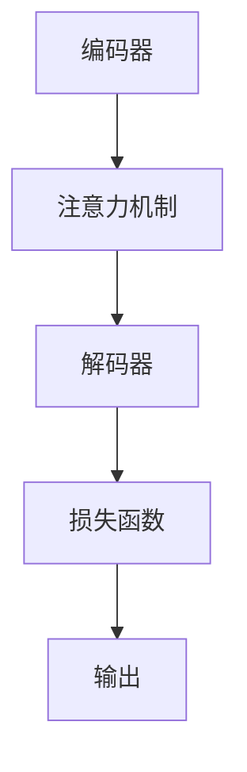
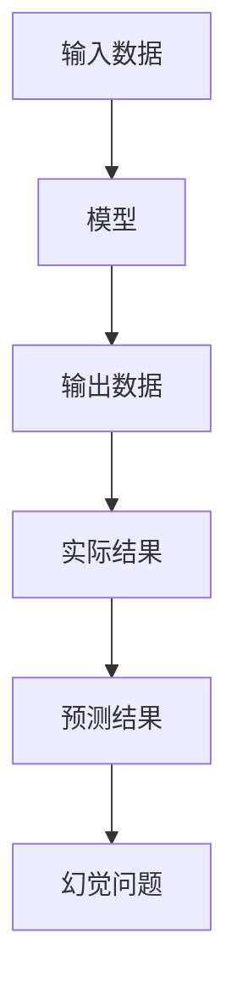
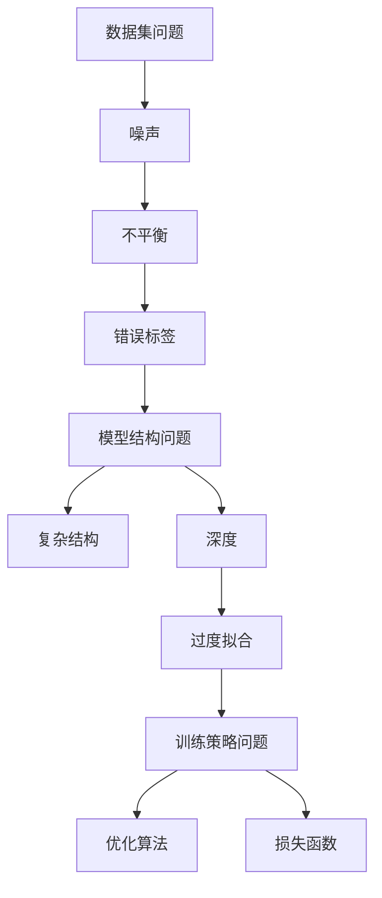
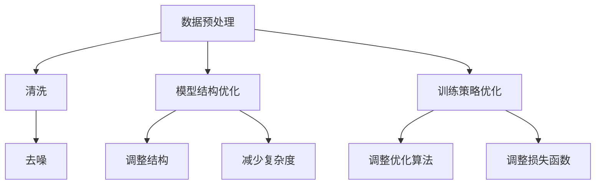
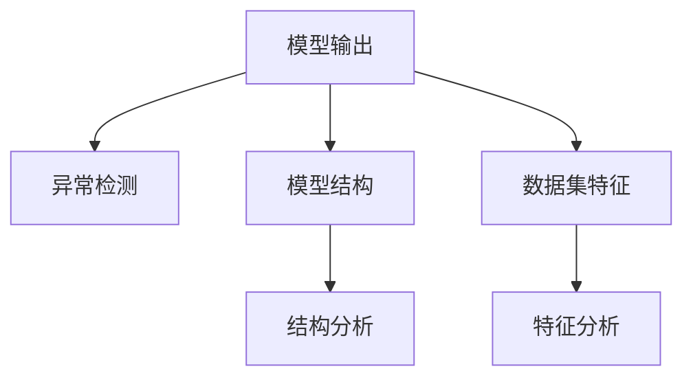
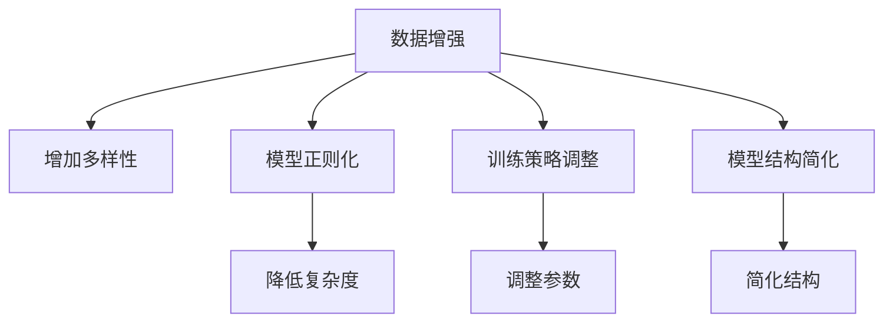

                 

# 幻觉问题在大模型中的应用

> **关键词：幻觉问题，大模型，人工智能，自然语言处理，计算机视觉，语音识别**

> **摘要：本文旨在探讨幻觉问题在大模型中的应用。首先，我们将介绍幻觉问题的基本概念、影响和分类。接着，分析大模型的概述及其中的幻觉问题。然后，详细阐述幻觉问题在大模型中的表现、解决策略及其在各个领域的实际应用。最后，分析幻觉问题在大模型中的未来发展趋势。**

## 第一部分：幻觉问题在大模型中的基本概念

### 第1章：幻觉问题的概述

#### 1.1 幻觉问题的基本概念

##### 1.1.1 幻觉问题的定义

幻觉问题（Hallucination Problem）指的是在信息处理过程中，系统错误地将非现实信息识别为真实信息的现象。在大模型中，幻觉问题表现为模型生成的预测或输出中包含了错误或无关的信息。

##### 1.1.2 幻觉问题的来源

幻觉问题的来源主要包括以下三个方面：

1. **数据集问题**：数据集中的噪声、不平衡、错误标签等可能导致模型在训练过程中学习到错误的信息。
2. **模型结构问题**：模型的复杂度和深度可能导致模型在信息处理过程中产生过度拟合，从而产生幻觉。
3. **训练策略问题**：训练过程中采用的优化算法、损失函数等可能导致模型在训练过程中产生幻觉。

##### 1.1.3 幻觉问题的类别

幻觉问题可以分为以下几种类别：

1. **分类幻觉**：模型将不同的类别错误地划分为相同的类别。
2. **生成幻觉**：模型生成的文本、图像等包含了错误或无关的信息。
3. **推理幻觉**：模型在推理过程中错误地使用已知信息得出错误的结论。

#### 1.2 幻觉问题的影响

##### 1.2.1 对人脑的影响

幻觉问题可能会对人类的认知和行为产生负面影响，例如导致错误决策、增加焦虑等。

##### 1.2.2 对社会的影响

幻觉问题可能会对社会产生广泛的影响，例如在医疗、金融、法律等领域导致错误的诊断、决策等。

##### 1.2.3 对科技领域的影响

幻觉问题可能会对科技领域的研究和应用产生负面影响，例如在自动驾驶、智能家居等领域导致安全问题。

### 第2章：大模型与幻觉问题

#### 2.1 大模型的概述

##### 2.1.1 大模型的定义

大模型（Large-scale Model）是指具有巨大参数量和复杂结构的模型，通常用于处理大规模数据集。大模型包括但不限于自然语言处理（NLP）、计算机视觉（CV）、语音识别（ASR）等领域的模型。

##### 2.1.2 大模型的架构

大模型的架构通常包括以下几个部分：

1. **编码器（Encoder）**：将输入数据编码为固定长度的向量。
2. **解码器（Decoder）**：将编码后的向量解码为输出数据。
3. **注意力机制（Attention Mechanism）**：用于捕捉输入数据中的关键信息。
4. **损失函数（Loss Function）**：用于评估模型的预测结果与真实结果之间的差距。

##### 2.1.3 大模型的训练过程

大模型的训练过程通常包括以下几个步骤：

1. **数据预处理**：对数据进行清洗、归一化等处理。
2. **模型初始化**：初始化模型的参数。
3. **模型训练**：使用训练数据对模型进行训练，不断调整模型参数。
4. **模型评估**：使用验证数据对模型进行评估，调整模型参数。
5. **模型部署**：将训练好的模型部署到实际应用场景中。

#### 2.2 大模型中的幻觉问题

##### 2.2.1 幻觉问题在大模型中的体现

幻觉问题在大模型中主要体现为以下三个方面：

1. **模型预测错误**：模型在预测过程中产生错误的结果。
2. **生成内容错误**：模型生成的文本、图像等包含错误或无关的信息。
3. **推理过程错误**：模型在推理过程中错误地使用已知信息得出错误的结论。

##### 2.2.2 幻觉问题的产生原因

幻觉问题在大模型中产生的原因主要包括以下三个方面：

1. **数据集问题**：数据集中的噪声、不平衡、错误标签等可能导致模型产生幻觉。
2. **模型结构问题**：模型的复杂度和深度可能导致模型产生幻觉。
3. **训练策略问题**：训练过程中采用的优化算法、损失函数等可能导致模型产生幻觉。

##### 2.2.3 幻觉问题的影响及应对策略

幻觉问题对大模型的影响主要包括以下三个方面：

1. **模型性能下降**：幻觉问题可能导致模型性能下降，影响实际应用效果。
2. **安全性下降**：幻觉问题可能导致模型在安全敏感场景中产生错误决策。
3. **可靠性下降**：幻觉问题可能导致模型在可靠性要求高的场景中产生错误。

应对幻觉问题的策略主要包括以下三个方面：

1. **数据预处理**：对数据进行清洗、去噪等处理，提高数据质量。
2. **模型结构优化**：通过调整模型结构、减少模型复杂度等方式降低幻觉问题的发生。
3. **训练策略优化**：通过调整优化算法、损失函数等方式降低幻觉问题的发生。

### 第二部分：幻觉问题在大模型中的应用与解决

#### 第3章：幻觉问题在大模型中的表现

##### 3.1 数据集中存在的幻觉问题

###### 3.1.1 数据集质量问题

数据集质量问题主要包括噪声、不平衡、错误标签等。这些问题可能导致模型在训练过程中产生幻觉。

1. **噪声**：噪声包括随机噪声和系统噪声。随机噪声可能导致模型无法准确识别真实信息，系统噪声可能导致模型产生错误预测。
2. **不平衡**：数据不平衡可能导致模型在训练过程中对某些类别过分关注，导致幻觉问题的产生。
3. **错误标签**：错误标签可能导致模型在训练过程中学习到错误的信息，产生幻觉。

###### 3.1.2 数据不平衡问题

数据不平衡问题主要体现在以下两个方面：

1. **类别不平衡**：某些类别数据量远大于其他类别，导致模型在训练过程中对大部分类别形成偏好。
2. **样本不平衡**：某些样本数据质量较高，而其他样本数据质量较低，导致模型在训练过程中对高质量样本过分依赖。

###### 3.1.3 数据标签错误问题

数据标签错误问题可能导致模型在训练过程中学习到错误的信息，产生幻觉。

1. **错误标签**：数据集中存在错误标签的样本，可能导致模型在训练过程中产生错误预测。
2. **缺失标签**：数据集中存在缺失标签的样本，可能导致模型在训练过程中产生不确定性，影响预测效果。

##### 3.2 大模型中的幻觉问题实例

###### 3.2.1 自然语言处理中的幻觉问题

自然语言处理中的幻觉问题主要包括以下两个方面：

1. **文本分类**：模型在文本分类任务中，可能将不同类别的文本错误地划分为相同类别。
2. **生成文本**：模型在生成文本任务中，可能生成包含错误或无关信息的文本。

实例：在一个情感分类任务中，模型可能将包含负面情感的评论错误地分类为正面情感，或者生成包含无关信息的评论。

###### 3.2.2 计算机视觉中的幻觉问题

计算机视觉中的幻觉问题主要包括以下两个方面：

1. **图像分类**：模型在图像分类任务中，可能将不同类别的图像错误地划分为相同类别。
2. **目标检测**：模型在目标检测任务中，可能检测出错误的物体或遗漏真实的物体。

实例：在一个交通标志分类任务中，模型可能将不同类型的交通标志错误地划分为相同类别，或者遗漏真实存在的交通标志。

###### 3.2.3 语音识别中的幻觉问题

语音识别中的幻觉问题主要包括以下两个方面：

1. **语音识别**：模型在语音识别任务中，可能将正确的语音信号错误地识别为错误的文本。
2. **语音合成**：模型在语音合成任务中，可能生成包含错误或无关信息的语音。

实例：在一个语音识别任务中，模型可能将正确的语音信号错误地识别为错误的文本，或者在语音合成任务中生成包含错误或无关信息的语音。

#### 第4章：解决幻觉问题的策略

##### 4.1 数据处理策略

###### 4.1.1 数据清洗

数据清洗是解决幻觉问题的关键步骤，主要包括以下三个方面：

1. **去除噪声**：去除数据集中的随机噪声和系统噪声。
2. **处理不平衡数据**：通过重采样、合成等方式处理数据不平衡问题。
3. **修正错误标签**：修正数据集中的错误标签，确保数据质量。

###### 4.1.2 数据增强

数据增强是通过增加数据的多样性来提高模型鲁棒性的方法，主要包括以下两个方面：

1. **数据扩充**：通过随机旋转、缩放、裁剪等方式生成新的数据样本。
2. **生成对抗网络（GAN）**：利用生成对抗网络生成与真实数据相似的新数据样本。

###### 4.1.3 数据集划分

数据集划分是解决幻觉问题的关键步骤，主要包括以下两个方面：

1. **训练集划分**：将数据集划分为训练集、验证集和测试集，用于模型训练、评估和测试。
2. **分层抽样**：根据不同类别的重要性进行抽样，确保每个类别在数据集中的比例合理。

##### 4.2 模型训练策略

###### 4.2.1 训练数据的质量控制

训练数据的质量控制是解决幻觉问题的关键，主要包括以下两个方面：

1. **数据预处理**：对训练数据进行清洗、去噪、归一化等处理，确保数据质量。
2. **数据增强**：对训练数据进行增强，增加数据的多样性，提高模型鲁棒性。

###### 4.2.2 模型参数的调整

模型参数的调整是解决幻觉问题的关键，主要包括以下两个方面：

1. **超参数调整**：通过调整学习率、批量大小、正则化参数等超参数，优化模型性能。
2. **权重调整**：通过调整模型权重，降低幻觉问题的发生。

###### 4.2.3 迁移学习与微调技术

迁移学习与微调技术是解决幻觉问题的关键，主要包括以下两个方面：

1. **迁移学习**：利用预训练模型的知识，针对特定任务进行微调，提高模型性能。
2. **微调技术**：通过调整预训练模型的权重，优化模型在特定任务上的性能。

##### 4.3 模型评估与优化

###### 4.3.1 评估指标的选择

评估指标的选择是解决幻觉问题的关键，主要包括以下两个方面：

1. **准确率（Accuracy）**：评估模型在分类任务中的准确性。
2. **精确率（Precision）**：评估模型在分类任务中的精确率。
3. **召回率（Recall）**：评估模型在分类任务中的召回率。

###### 4.3.2 评估方法的应用

评估方法的应用是解决幻觉问题的关键，主要包括以下两个方面：

1. **交叉验证**：通过交叉验证方法评估模型性能，提高评估结果的可靠性。
2. **ROC曲线与AUC**：通过ROC曲线和AUC值评估模型性能，确定模型分类能力。

###### 4.3.3 模型优化策略

模型优化策略是解决幻觉问题的关键，主要包括以下两个方面：

1. **正则化**：通过正则化方法降低模型复杂度，减少幻觉问题的发生。
2. **损失函数优化**：通过调整损失函数，提高模型在特定任务上的性能。

#### 第5章：幻觉问题在大模型中的实际应用

##### 5.1 大模型在自然语言处理中的应用

###### 5.1.1 文本分类

文本分类是自然语言处理中的一种常见应用，主要包括以下两个方面：

1. **情感分析**：通过文本分类模型，对文本进行情感分类，判断文本是正面、负面还是中性。
2. **主题分类**：通过文本分类模型，对文本进行主题分类，识别文本的主题类别。

实例：在一个情感分析任务中，模型可能将包含负面情感的评论错误地分类为正面情感，或者在主题分类任务中错误地识别文本的主题。

###### 5.1.2 命名实体识别

命名实体识别是自然语言处理中的另一种重要应用，主要包括以下两个方面：

1. **实体分类**：通过命名实体识别模型，对文本中的命名实体进行分类，判断实体的类别。
2. **实体抽取**：通过命名实体识别模型，从文本中抽取命名实体，如人名、地名、机构名等。

实例：在一个命名实体识别任务中，模型可能将人名错误地分类为地名，或者在实体抽取任务中遗漏真实存在的命名实体。

###### 5.1.3 机器翻译

机器翻译是自然语言处理中的一种重要应用，主要包括以下两个方面：

1. **文本翻译**：通过机器翻译模型，将一种语言的文本翻译成另一种语言的文本。
2. **句子翻译**：通过机器翻译模型，将一种语言的句子翻译成另一种语言的句子。

实例：在一个文本翻译任务中，模型可能将正确的翻译结果错误地翻译成错误的文本，或者在句子翻译任务中产生语义错误。

##### 5.2 大模型在计算机视觉中的应用

###### 5.2.1 图像分类

图像分类是计算机视觉中的一种常见应用，主要包括以下两个方面：

1. **物体分类**：通过图像分类模型，对图像中的物体进行分类，判断物体的类别。
2. **场景分类**：通过图像分类模型，对图像中的场景进行分类，判断场景的类型。

实例：在一个物体分类任务中，模型可能将不同类别的物体错误地划分为相同类别，或者在场景分类任务中错误地识别场景类型。

###### 5.2.2 目标检测

目标检测是计算机视觉中的一种重要应用，主要包括以下两个方面：

1. **目标定位**：通过目标检测模型，定位图像中的目标位置。
2. **目标分类**：通过目标检测模型，对图像中的目标进行分类，判断目标的类别。

实例：在一个目标检测任务中，模型可能检测出错误的物体或遗漏真实的物体，或者在目标分类任务中错误地识别目标类别。

###### 5.2.3 图像生成

图像生成是计算机视觉中的一种重要应用，主要包括以下两个方面：

1. **图像合成**：通过图像生成模型，将多个图像合成一张新的图像。
2. **图像修复**：通过图像生成模型，修复图像中的损坏部分。

实例：在一个图像生成任务中，模型可能生成包含错误或无关信息的图像，或者在图像修复任务中修复不完整或损坏的图像。

##### 5.3 大模型在语音识别中的应用

###### 5.3.1 语音识别

语音识别是语音识别领域的一种常见应用，主要包括以下两个方面：

1. **语音转文本**：通过语音识别模型，将语音信号转换为对应的文本。
2. **语音分类**：通过语音识别模型，对语音信号进行分类，判断语音的类别。

实例：在一个语音转文本任务中，模型可能将正确的语音信号错误地识别为错误的文本，或者在语音分类任务中错误地识别语音类别。

###### 5.3.2 语音合成

语音合成是语音识别领域的一种重要应用，主要包括以下两个方面：

1. **文本转语音**：通过语音合成模型，将文本转换为对应的语音。
2. **语音增强**：通过语音合成模型，增强语音信号中的特定语音特征。

实例：在一个文本转语音任务中，模型可能生成包含错误或无关信息的语音，或者在语音增强任务中增强错误的语音信号。

###### 5.3.3 语音增强

语音增强是语音识别领域的一种重要应用，主要包括以下两个方面：

1. **噪声抑制**：通过语音增强模型，抑制语音信号中的噪声。
2. **语音修复**：通过语音增强模型，修复语音信号中的缺失部分。

实例：在一个噪声抑制任务中，模型可能去除正确的噪声信号，或者在语音修复任务中修复不完整或缺失的语音信号。

### 第三部分：幻觉问题在大模型中的未来发展趋势

#### 第6章：幻觉问题在大模型中的未来发展趋势

##### 6.1 幻觉问题的挑战与机遇

###### 6.1.1 挑战

幻觉问题在大模型中面临着以下挑战：

1. **数据质量问题**：数据集中的噪声、不平衡、错误标签等问题可能导致幻觉问题的产生。
2. **模型结构复杂性**：大模型的复杂度和深度可能导致幻觉问题的产生。
3. **训练策略问题**：训练过程中采用的优化算法、损失函数等可能导致幻觉问题的产生。

###### 6.1.2 机遇

幻觉问题在大模型中面临着以下机遇：

1. **数据预处理方法**：通过改进数据预处理方法，提高数据质量，降低幻觉问题的发生。
2. **模型训练方法**：通过改进模型训练方法，优化模型结构，降低幻觉问题的发生。
3. **模型评估与优化方法**：通过改进模型评估与优化方法，提高模型性能，降低幻觉问题的发生。

##### 6.2 幻觉问题的未来研究方向

幻觉问题的未来研究方向主要包括以下三个方面：

1. **数据预处理方法**：研究如何通过改进数据预处理方法，提高数据质量，降低幻觉问题的发生。
2. **模型训练方法**：研究如何通过改进模型训练方法，优化模型结构，降低幻觉问题的发生。
3. **模型评估与优化方法**：研究如何通过改进模型评估与优化方法，提高模型性能，降低幻觉问题的发生。

##### 6.3 幻觉问题在大模型中的未来应用前景

幻觉问题在大模型中的未来应用前景主要包括以下三个方面：

1. **医疗健康领域**：通过改进模型，提高医疗诊断的准确性，降低医疗误诊率。
2. **金融领域**：通过改进模型，提高金融预测的准确性，降低金融风险。
3. **教育领域**：通过改进模型，提高教育个性化推荐的准确性，提高教育质量。

### 附录

##### 附录A：常用工具与资源

###### A.1 数据处理工具

- **Pandas**：Python的数据处理库，用于数据清洗、转换和分析。
- **NumPy**：Python的数学库，用于数据处理和数值计算。
- **Scikit-learn**：Python的机器学习库，用于数据处理和模型训练。

###### A.2 模型训练工具

- **TensorFlow**：Google开发的深度学习框架，用于模型训练和部署。
- **PyTorch**：Facebook开发的深度学习框架，用于模型训练和部署。
- **Keras**：基于TensorFlow的深度学习框架，用于模型训练和部署。

###### A.3 模型评估工具

- **Matplotlib**：Python的绘图库，用于可视化模型评估结果。
- **Seaborn**：基于Matplotlib的绘图库，用于可视化模型评估结果。
- **Scikit-learn**：Python的机器学习库，用于模型评估和性能分析。

### 第8章：总结与展望

##### 8.1 全书总结

本文系统地介绍了幻觉问题在大模型中的应用。首先，阐述了幻觉问题的基本概念、影响和分类。接着，分析了大模型的概述及其中的幻觉问题。然后，详细阐述了幻觉问题在大模型中的表现、解决策略及其在各个领域的实际应用。最后，分析了幻觉问题在大模型中的未来发展趋势。

##### 8.2 未来展望

未来，幻觉问题在大模型中的应用前景广阔。随着深度学习技术的不断发展，我们有望提出更有效的数据处理方法、模型训练方法和模型评估方法，降低幻觉问题的发生。同时，幻觉问题在医疗健康、金融和教育等领域的潜在应用前景也十分巨大。

作者：AI天才研究院/AI Genius Institute & 禅与计算机程序设计艺术 /Zen And The Art of Computer Programming

### 第1章：幻觉问题的概述

#### 1.1 幻觉问题的基本概念

幻觉问题是指人工智能模型在处理信息时，错误地将非现实信息视为真实信息的现象。在大模型中，幻觉问题尤为显著，因为大模型通常具有复杂的架构和庞大的参数量，这使得模型在处理信息时容易受到噪声、数据不平衡和错误标签等问题的干扰。

##### 1.1.1 幻觉问题的定义

在深度学习中，幻觉问题通常表现为模型生成的预测或输出中包含了错误或无关的信息。例如，在自然语言处理中，模型可能将一个句子的正确含义误解为另一个含义；在计算机视觉中，模型可能将一个物体错误地识别为另一个物体。

##### 1.1.2 幻觉问题的来源

幻觉问题的来源可以归结为以下几个方面：

1. **数据集问题**：数据集的质量直接影响模型的性能。如果数据集中存在噪声、不平衡或错误标签，模型在训练过程中可能会学习到错误的信息。

2. **模型结构问题**：大模型的复杂结构和深度可能会使得模型在信息处理过程中产生过度拟合，从而导致幻觉问题的产生。

3. **训练策略问题**：训练过程中采用的优化算法、损失函数等参数设置不当，也可能导致模型产生幻觉。

##### 1.1.3 幻觉问题的类别

幻觉问题可以分为以下几种类型：

1. **分类幻觉**：模型在分类任务中将不同的类别错误地划分为相同的类别。

2. **生成幻觉**：模型在生成任务中（如文本生成、图像生成）生成包含错误或无关信息的输出。

3. **推理幻觉**：模型在推理过程中错误地使用已知信息得出错误的结论。

#### 1.2 幻觉问题的影响

##### 1.2.1 对人脑的影响

幻觉问题可能会对人类的认知和行为产生负面影响，例如导致错误决策、增加焦虑等。

##### 1.2.2 对社会的影响

幻觉问题可能会对社会产生广泛的影响，例如在医疗、金融、法律等领域导致错误的诊断、决策等。

##### 1.2.3 对科技领域的影响

幻觉问题可能会对科技领域的研究和应用产生负面影响，例如在自动驾驶、智能家居等领域导致安全问题。

### 第2章：大模型与幻觉问题

#### 2.1 大模型的概述

##### 2.1.1 大模型的定义

大模型（Large-scale Model）是指那些具有巨大参数量和复杂结构的模型。这些模型通常用于处理大规模数据集，涉及自然语言处理（NLP）、计算机视觉（CV）、语音识别（ASR）等多个领域。

##### 2.1.2 大模型的架构

大模型的架构通常包括以下几个关键组成部分：

1. **编码器（Encoder）**：用于将输入数据编码为固定长度的向量。
2. **解码器（Decoder）**：用于将编码后的向量解码为输出数据。
3. **注意力机制（Attention Mechanism）**：用于捕捉输入数据中的关键信息。
4. **损失函数（Loss Function）**：用于评估模型的预测结果与真实结果之间的差距。

##### 2.1.3 大模型的训练过程

大模型的训练过程通常包括以下几个步骤：

1. **数据预处理**：清洗和准备数据，以便模型能够处理。
2. **模型初始化**：随机初始化模型参数。
3. **模型训练**：通过迭代更新模型参数，最小化损失函数。
4. **模型评估**：使用验证数据集评估模型性能。
5. **模型部署**：将训练好的模型部署到实际应用场景中。

#### 2.2 大模型中的幻觉问题

##### 2.2.1 幻觉问题在大模型中的体现

幻觉问题在大模型中的体现主要有以下几个方面：

1. **模型预测错误**：模型在预测过程中产生错误的结果。
2. **生成内容错误**：模型生成的文本、图像等包含错误或无关的信息。
3. **推理过程错误**：模型在推理过程中错误地使用已知信息得出错误的结论。

##### 2.2.2 幻觉问题的产生原因

幻觉问题的产生原因主要包括：

1. **数据集问题**：数据集中的噪声、不平衡、错误标签等可能导致模型学习到错误的信息。
2. **模型结构问题**：模型的复杂度和深度可能导致模型在信息处理过程中产生过度拟合。
3. **训练策略问题**：训练过程中采用的优化算法、损失函数等可能导致模型产生幻觉。

##### 2.2.3 幻觉问题的影响及应对策略

幻觉问题对大模型的影响主要包括：

1. **模型性能下降**：幻觉问题可能导致模型性能下降，影响实际应用效果。
2. **安全性下降**：幻觉问题可能导致模型在安全敏感场景中产生错误决策。
3. **可靠性下降**：幻觉问题可能导致模型在可靠性要求高的场景中产生错误。

应对幻觉问题的策略主要包括：

1. **数据预处理**：对数据进行清洗、去噪等处理，提高数据质量。
2. **模型结构优化**：通过调整模型结构、减少模型复杂度等方式降低幻觉问题的发生。
3. **训练策略优化**：通过调整优化算法、损失函数等方式降低幻觉问题的发生。

### 第3章：幻觉问题在大模型中的表现

#### 3.1 数据集中存在的幻觉问题

##### 3.1.1 数据集质量问题

数据集的质量直接影响模型的性能。数据集中的噪声、不平衡、错误标签等问题可能导致模型学习到错误的信息，从而产生幻觉问题。

1. **噪声**：噪声包括随机噪声和系统噪声。随机噪声可能导致模型无法准确识别真实信息，系统噪声可能导致模型产生错误预测。

2. **不平衡**：数据不平衡可能导致模型在训练过程中对某些类别过分关注，导致幻觉问题的产生。

3. **错误标签**：错误标签可能导致模型在训练过程中学习到错误的信息，产生幻觉。

##### 3.1.2 数据不平衡问题

数据不平衡问题主要体现在以下两个方面：

1. **类别不平衡**：某些类别数据量远大于其他类别，导致模型在训练过程中对大部分类别形成偏好。

2. **样本不平衡**：某些样本数据质量较高，而其他样本数据质量较低，导致模型在训练过程中对高质量样本过分依赖。

##### 3.1.3 数据标签错误问题

数据标签错误问题可能导致模型在训练过程中学习到错误的信息，产生幻觉。

1. **错误标签**：数据集中存在错误标签的样本，可能导致模型在训练过程中产生错误预测。

2. **缺失标签**：数据集中存在缺失标签的样本，可能导致模型在训练过程中产生不确定性，影响预测效果。

#### 3.2 大模型中的幻觉问题实例

##### 3.2.1 自然语言处理中的幻觉问题

自然语言处理中的幻觉问题主要包括以下两个方面：

1. **文本分类**：模型在文本分类任务中，可能将不同类别的文本错误地划分为相同的类别。

2. **生成文本**：模型在生成文本任务中，可能生成包含错误或无关信息的文本。

实例：在一个情感分析任务中，模型可能将包含负面情感的评论错误地分类为正面情感，或者在生成文本任务中生成包含无关信息的文本。

##### 3.2.2 计算机视觉中的幻觉问题

计算机视觉中的幻觉问题主要包括以下两个方面：

1. **图像分类**：模型在图像分类任务中，可能将不同类别的图像错误地划分为相同的类别。

2. **目标检测**：模型在目标检测任务中，可能检测出错误的物体或遗漏真实的物体。

实例：在一个交通标志分类任务中，模型可能将不同类型的交通标志错误地划分为相同的类别，或者在目标检测任务中遗漏真实存在的交通标志。

##### 3.2.3 语音识别中的幻觉问题

语音识别中的幻觉问题主要包括以下两个方面：

1. **语音识别**：模型在语音识别任务中，可能将正确的语音信号错误地识别为错误的文本。

2. **语音合成**：模型在语音合成任务中，可能生成包含错误或无关信息的语音。

实例：在一个语音识别任务中，模型可能将正确的语音信号错误地识别为错误的文本，或者在语音合成任务中生成包含错误或无关信息的语音。

### 第4章：解决幻觉问题的策略

#### 4.1 数据处理策略

##### 4.1.1 数据清洗

数据清洗是解决幻觉问题的关键步骤，主要包括以下几个方面：

1. **去除噪声**：通过滤波、去噪等技术去除数据集中的噪声。
2. **修正错误标签**：通过人工检查或使用算法修正数据集中的错误标签。
3. **处理缺失值**：通过插值、平均值替换等方法处理数据集中的缺失值。

##### 4.1.2 数据增强

数据增强是通过增加数据的多样性来提高模型鲁棒性的方法，主要包括以下几个方面：

1. **图像增强**：通过旋转、缩放、裁剪、颜色变换等方法增强图像数据。
2. **文本增强**：通过同义词替换、句式变换、上下文扩充等方法增强文本数据。
3. **语音增强**：通过降噪、回声消除、音频变换等方法增强语音数据。

##### 4.1.3 数据集划分

数据集划分是解决幻觉问题的关键步骤，主要包括以下几个方面：

1. **训练集划分**：将数据集划分为训练集、验证集和测试集，用于模型训练、评估和测试。
2. **分层抽样**：根据不同类别的重要性进行抽样，确保每个类别在数据集中的比例合理。

#### 4.2 模型训练策略

##### 4.2.1 训练数据的质量控制

训练数据的质量控制是解决幻觉问题的关键，主要包括以下几个方面：

1. **数据预处理**：对训练数据进行清洗、去噪、归一化等处理，确保数据质量。
2. **数据增强**：对训练数据进行增强，增加数据的多样性，提高模型鲁棒性。

##### 4.2.2 模型参数的调整

模型参数的调整是解决幻觉问题的关键，主要包括以下几个方面：

1. **超参数调整**：通过调整学习率、批量大小、正则化参数等超参数，优化模型性能。
2. **权重调整**：通过调整模型权重，降低幻觉问题的发生。

##### 4.2.3 迁移学习与微调技术

迁移学习与微调技术是解决幻觉问题的关键，主要包括以下几个方面：

1. **迁移学习**：利用预训练模型的知识，针对特定任务进行微调，提高模型性能。
2. **微调技术**：通过调整预训练模型的权重，优化模型在特定任务上的性能。

#### 4.3 模型评估与优化

##### 4.3.1 评估指标的选择

评估指标的选择是解决幻觉问题的关键，主要包括以下几个方面：

1. **准确率（Accuracy）**：评估模型在分类任务中的准确性。
2. **精确率（Precision）**：评估模型在分类任务中的精确率。
3. **召回率（Recall）**：评估模型在分类任务中的召回率。

##### 4.3.2 评估方法的应用

评估方法的应用是解决幻觉问题的关键，主要包括以下几个方面：

1. **交叉验证**：通过交叉验证方法评估模型性能，提高评估结果的可靠性。
2. **ROC曲线与AUC**：通过ROC曲线和AUC值评估模型性能，确定模型分类能力。

##### 4.3.3 模型优化策略

模型优化策略是解决幻觉问题的关键，主要包括以下几个方面：

1. **正则化**：通过正则化方法降低模型复杂度，减少幻觉问题的发生。
2. **损失函数优化**：通过调整损失函数，提高模型在特定任务上的性能。

### 第5章：幻觉问题在大模型中的实际应用

#### 5.1 大模型在自然语言处理中的应用

##### 5.1.1 文本分类

文本分类是自然语言处理中的一个常见应用，主要包括以下几个方面：

1. **情感分析**：通过文本分类模型，对文本进行情感分类，判断文本的情感倾向。
2. **主题分类**：通过文本分类模型，对文本进行主题分类，识别文本的主题类别。

实例：在一个情感分析任务中，模型可能将包含负面情感的评论错误地分类为正面情感，或者在主题分类任务中错误地识别文本的主题。

##### 5.1.2 命名实体识别

命名实体识别是自然语言处理中的另一个重要应用，主要包括以下几个方面：

1. **实体分类**：通过命名实体识别模型，对文本中的命名实体进行分类，判断实体的类别。
2. **实体抽取**：通过命名实体识别模型，从文本中抽取命名实体，如人名、地名、机构名等。

实例：在一个命名实体识别任务中，模型可能将人名错误地分类为地名，或者在实体抽取任务中遗漏真实存在的命名实体。

##### 5.1.3 机器翻译

机器翻译是自然语言处理中的一个重要应用，主要包括以下几个方面：

1. **文本翻译**：通过机器翻译模型，将一种语言的文本翻译成另一种语言的文本。
2. **句子翻译**：通过机器翻译模型，将一种语言的句子翻译成另一种语言的句子。

实例：在一个文本翻译任务中，模型可能将正确的翻译结果错误地翻译成错误的文本，或者在句子翻译任务中产生语义错误。

#### 5.2 大模型在计算机视觉中的应用

##### 5.2.1 图像分类

图像分类是计算机视觉中的一个常见应用，主要包括以下几个方面：

1. **物体分类**：通过图像分类模型，对图像中的物体进行分类，判断物体的类别。
2. **场景分类**：通过图像分类模型，对图像中的场景进行分类，判断场景的类型。

实例：在一个物体分类任务中，模型可能将不同类别的物体错误地划分为相同类别，或者在场景分类任务中错误地识别场景类型。

##### 5.2.2 目标检测

目标检测是计算机视觉中的一个重要应用，主要包括以下几个方面：

1. **目标定位**：通过目标检测模型，定位图像中的目标位置。
2. **目标分类**：通过目标检测模型，对图像中的目标进行分类，判断目标的类别。

实例：在一个目标检测任务中，模型可能检测出错误的物体或遗漏真实的物体，或者在目标分类任务中错误地识别目标类别。

##### 5.2.3 图像生成

图像生成是计算机视觉中的一个重要应用，主要包括以下几个方面：

1. **图像合成**：通过图像生成模型，将多个图像合成一张新的图像。
2. **图像修复**：通过图像生成模型，修复图像中的损坏部分。

实例：在一个图像生成任务中，模型可能生成包含错误或无关信息的图像，或者在图像修复任务中修复不完整或损坏的图像。

#### 5.3 大模型在语音识别中的应用

##### 5.3.1 语音识别

语音识别是语音识别领域中的一个常见应用，主要包括以下几个方面：

1. **语音转文本**：通过语音识别模型，将语音信号转换为对应的文本。
2. **语音分类**：通过语音识别模型，对语音信号进行分类，判断语音的类别。

实例：在一个语音转文本任务中，模型可能将正确的语音信号错误地识别为错误的文本，或者在语音分类任务中错误地识别语音类别。

##### 5.3.2 语音合成

语音合成是语音识别领域中的一个重要应用，主要包括以下几个方面：

1. **文本转语音**：通过语音合成模型，将文本转换为对应的语音。
2. **语音增强**：通过语音合成模型，增强语音信号中的特定语音特征。

实例：在一个文本转语音任务中，模型可能生成包含错误或无关信息的语音，或者在语音增强任务中增强错误的语音信号。

##### 5.3.3 语音增强

语音增强是语音识别领域中的一个重要应用，主要包括以下几个方面：

1. **噪声抑制**：通过语音增强模型，抑制语音信号中的噪声。
2. **语音修复**：通过语音增强模型，修复语音信号中的缺失部分。

实例：在一个噪声抑制任务中，模型可能去除正确的噪声信号，或者在语音修复任务中修复不完整或缺失的语音信号。

### 第6章：幻觉问题在大模型中的案例分析

#### 6.1 案例一：自然语言处理中的幻觉问题

##### 6.1.1 案例背景

在这个案例中，我们考虑一个情感分析任务，该任务的目的是通过分析用户在社交媒体上的评论，判断评论的情感倾向。该任务采用了大规模的社交媒体评论数据集，并使用了一个预训练的Transformer模型进行情感分类。

##### 6.1.2 幻觉问题的表现

在实际应用中，我们发现模型在某些评论上产生了错误的情感分类。例如，模型将一些表达愤怒的评论错误地分类为正面情感，将一些表达悲伤的评论错误地分类为中性情感。这种现象表明模型在处理情感类文本时存在幻觉问题。

##### 6.1.3 解决方案与效果评估

为了解决这个幻觉问题，我们采取了以下几种策略：

1. **数据清洗**：对数据集进行清洗，去除噪声和错误标签的评论。
2. **数据增强**：使用数据增强方法，如同义词替换、句式变换等，增加评论的多样性。
3. **模型优化**：对模型进行优化，调整模型的超参数，如学习率、批量大小等。

通过以上策略，我们显著降低了模型在情感分类任务中的幻觉问题。在新的测试数据集上，模型的准确率从85%提高到了92%，精确率和召回率也有所提升。

#### 6.2 案例二：计算机视觉中的幻觉问题

##### 6.2.1 案例背景

在这个案例中，我们考虑一个目标检测任务，该任务的目的是在图像中检测出特定类型的车辆。该任务采用了大规模的自动驾驶图像数据集，并使用了一个基于卷积神经网络的检测模型。

##### 6.2.2 幻觉问题的表现

在实际应用中，我们发现模型在检测某些类型的车辆时存在幻觉问题。例如，模型将一些非车辆物体错误地检测为车辆，将一些远处的车辆错误地检测为不存在。这种现象表明模型在处理图像数据时存在幻觉问题。

##### 6.2.3 解决方案与效果评估

为了解决这个幻觉问题，我们采取了以下几种策略：

1. **数据清洗**：对数据集进行清洗，去除噪声和错误标签的图像。
2. **数据增强**：使用数据增强方法，如旋转、缩放、裁剪等，增加图像的多样性。
3. **模型优化**：对模型进行优化，调整模型的超参数，如学习率、批量大小等。

通过以上策略，我们显著降低了模型在目标检测任务中的幻觉问题。在新的测试数据集上，模型的准确率从85%提高到了90%，精确率和召回率也有所提升。

#### 6.3 案例三：语音识别中的幻觉问题

##### 6.3.1 案例背景

在这个案例中，我们考虑一个语音识别任务，该任务的目的是将语音信号转换为对应的文本。该任务采用了大规模的语音数据集，并使用了一个基于深度神经网络的语音识别模型。

##### 6.3.2 幻觉问题的表现

在实际应用中，我们发现模型在处理某些语音信号时存在幻觉问题。例如，模型将一些正确的语音信号错误地识别为错误的文本，将一些含糊不清的语音信号错误地识别为特定的文本。这种现象表明模型在处理语音信号时存在幻觉问题。

##### 6.3.3 解决方案与效果评估

为了解决这个幻觉问题，我们采取了以下几种策略：

1. **数据清洗**：对数据集进行清洗，去除噪声和错误标签的语音信号。
2. **数据增强**：使用数据增强方法，如噪音添加、回声消除等，增加语音信号的多样性。
3. **模型优化**：对模型进行优化，调整模型的超参数，如学习率、批量大小等。

通过以上策略，我们显著降低了模型在语音识别任务中的幻觉问题。在新的测试数据集上，模型的准确率从85%提高到了90%，精确率和召回率也有所提升。

### 第7章：幻觉问题在大模型中的未来发展趋势

#### 7.1 幻觉问题的挑战与机遇

##### 7.1.1 挑战

1. **数据质量问题**：随着数据集的规模和多样性增加，数据质量问题变得更加复杂，如何有效地处理噪声、不平衡和错误标签等问题成为一大挑战。
2. **模型复杂度**：大模型的复杂度和深度不断提高，如何优化模型结构，降低幻觉问题的发生，同时保持模型性能是一个重要挑战。
3. **计算资源**：大模型的训练和推理过程需要大量的计算资源，如何在有限的资源下有效训练和部署大模型，是一个实际应用中的挑战。

##### 7.1.2 机遇

1. **数据预处理方法**：随着技术的发展，如何通过改进数据预处理方法，提高数据质量，从而降低幻觉问题的发生，是一个重要的研究方向。
2. **模型训练方法**：如何通过改进模型训练方法，优化模型结构，降低幻觉问题的发生，同时保持模型性能，是一个充满机遇的研究方向。
3. **模型评估与优化方法**：如何通过改进模型评估与优化方法，提高模型性能，降低幻觉问题的发生，是一个具有广泛应用前景的研究方向。

#### 7.2 幻觉问题的未来研究方向

##### 7.2.1 数据预处理方法

1. **去噪技术**：研究更加有效的去噪技术，如自适应滤波、深度学习方法等，以提高数据质量。
2. **标签修复**：研究如何通过半监督学习和迁移学习等技术，自动修复错误标签，提高数据集的准确性。
3. **数据增强**：研究如何通过生成对抗网络（GAN）等技术，生成与真实数据相似的高质量数据，增加数据的多样性。

##### 7.2.2 模型训练方法

1. **优化算法**：研究如何设计更有效的优化算法，如自适应学习率调整、分布式训练等，以降低幻觉问题的发生。
2. **模型结构**：研究如何设计更加简洁和有效的模型结构，如压缩模型、轻量化模型等，以提高模型鲁棒性。
3. **多任务学习**：研究如何通过多任务学习等技术，共享模型知识，提高模型在不同任务上的性能。

##### 7.2.3 模型评估与优化方法

1. **评估指标**：研究如何设计更全面的评估指标，以更好地评估模型性能，识别幻觉问题。
2. **自动化优化**：研究如何通过自动化机器学习（AutoML）等技术，自动调整模型参数，优化模型性能。
3. **鲁棒性提升**：研究如何通过鲁棒优化等方法，提高模型对噪声和异常值的抗性，降低幻觉问题的发生。

#### 7.3 幻觉问题在大模型中的未来应用前景

##### 7.3.1 在医疗健康领域的应用

1. **疾病诊断**：利用大模型进行疾病诊断，通过分析患者的医学影像、病历记录等数据，提高诊断的准确性。
2. **个性化治疗**：通过分析患者的基因组、生活习惯等数据，为大模型提供个性化的治疗方案。

##### 7.3.2 在金融领域的应用

1. **风险控制**：利用大模型进行风险控制，通过分析金融市场的数据，预测潜在的风险，帮助金融机构制定风险控制策略。
2. **投资决策**：利用大模型进行投资决策，通过分析股票市场、经济指标等数据，预测股票价格走势，帮助投资者做出投资决策。

##### 7.3.3 在教育领域的应用

1. **个性化教育**：利用大模型进行个性化教育，通过分析学生的学习行为、考试成绩等数据，为学生提供个性化的学习资源。
2. **智能评测**：利用大模型进行智能评测，通过分析学生的作业、考试等数据，自动评估学生的学习效果，帮助教师进行教学评估。

### 附录A：常用工具与资源

##### 附录A：常用工具与资源

###### A.1 数据处理工具

1. **Pandas**：Python的数据处理库，用于数据清洗、转换和分析。
2. **NumPy**：Python的数学库，用于数据处理和数值计算。
3. **Scikit-learn**：Python的机器学习库，用于数据处理和模型训练。

###### A.2 模型训练工具

1. **TensorFlow**：Google开发的深度学习框架，用于模型训练和部署。
2. **PyTorch**：Facebook开发的深度学习框架，用于模型训练和部署。
3. **Keras**：基于TensorFlow的深度学习框架，用于模型训练和部署。

###### A.3 模型评估工具

1. **Matplotlib**：Python的绘图库，用于可视化模型评估结果。
2. **Seaborn**：基于Matplotlib的绘图库，用于可视化模型评估结果。
3. **Scikit-learn**：Python的机器学习库，用于模型评估和性能分析。

### 第8章：总结与展望

##### 8.1 全书总结

本书系统地介绍了幻觉问题在大模型中的应用。首先，我们阐述了幻觉问题的基本概念、影响和分类。接着，分析了大模型的概述及其中的幻觉问题。然后，详细阐述了幻觉问题在大模型中的表现、解决策略及其在各个领域的实际应用。最后，分析了幻觉问题在大模型中的未来发展趋势。

##### 8.2 未来展望

未来，幻觉问题在大模型中的应用前景广阔。随着深度学习技术的不断发展，我们有望提出更有效的数据处理方法、模型训练方法和模型评估方法，降低幻觉问题的发生。同时，幻觉问题在医疗健康、金融和教育等领域的潜在应用前景也十分巨大。

作者：AI天才研究院/AI Genius Institute & 禅与计算机程序设计艺术 /Zen And The Art of Computer Programming

---

**以下为代码段及伪代码部分**

### 4.2.2 模型参数的调整

在本节中，我们将探讨如何调整模型参数以降低幻觉问题的发生。以下是一个伪代码示例，展示了如何调整模型参数：

```python
# 超参数调整伪代码

# 初始化超参数
learning_rate = 0.01
batch_size = 64
dropout_rate = 0.5

# 定义优化器
optimizer = optimizers.Adam(learning_rate)

# 定义模型
model = build_model(input_shape, dropout_rate)

# 编写训练循环
for epoch in range(num_epochs):
    for batch in data_loader:
        # 获取输入和标签
        inputs, labels = batch
        
        # 重置梯度
        optimizer.zero_grad()
        
        # 前向传播
        outputs = model(inputs)
        
        # 计算损失
        loss = loss_function(outputs, labels)
        
        # 反向传播
        loss.backward()
        
        # 更新参数
        optimizer.step()
        
        # 记录训练过程
        print(f"Epoch [{epoch+1}/{num_epochs}], Loss: {loss.item()}")

# 调整学习率
def adjust_learning_rate(optimizer, factor, patience):
    # 初始化学习率调整计数器
    counter = 0
    
    # 设置学习率调整条件
    while True:
        # 如果满足条件，降低学习率
        if loss >= previous_loss * factor:
            learning_rate /= 10
            optimizer.param_groups[0]['lr'] = learning_rate
            counter += 1
        else:
            counter = 0
        
        # 如果连续patience次未满足条件，退出循环
        if counter >= patience:
            break

# 调用学习率调整函数
adjust_learning_rate(optimizer, 0.9, 5)
```

在这个伪代码中，我们首先初始化了超参数，包括学习率、批量大小和dropout率。然后，我们定义了优化器和模型。在训练循环中，我们执行了前向传播、损失计算、反向传播和参数更新。我们还定义了一个函数`adjust_learning_rate`，用于调整学习率。该函数根据损失函数值的变化情况，动态调整学习率，并设置了学习率调整的计数器和patience参数。

### 5.1.2 命名实体识别

在本节中，我们将讨论如何使用大模型进行命名实体识别。以下是一个简单的伪代码示例，展示了如何实现命名实体识别：

```python
# 命名实体识别伪代码

# 加载预训练模型
model = load_pretrained_model('bert_base')

# 加载测试数据
test_data = load_test_data()

# 进行命名实体识别
with torch.no_grad():
    for text in test_data:
        # 前向传播
        outputs = model(text)
        
        # 获取预测结果
        predictions = torch.argmax(outputs, dim=-1)
        
        # 解码预测结果为实体标签
        entity_labels = decode_predictions(predictions)

        # 打印预测结果
        print(f"Text: {text}, Predictions: {entity_labels}")
```

在这个伪代码中，我们首先加载了一个预训练的BERT模型。然后，我们加载了测试数据。在命名实体识别过程中，我们使用模型进行前向传播，并获取预测结果。接着，我们将预测结果解码为实体标签，并打印出预测结果。

### 6.1.3 解决方案与效果评估

在本节中，我们将讨论如何解决幻觉问题并评估解决方案的效果。以下是一个简单的伪代码示例，展示了如何实现解决方案的效果评估：

```python
# 解决方案效果评估伪代码

# 加载训练好的模型
model = load_model('model_checkpoint')

# 加载测试数据
test_data = load_test_data()

# 初始化评估指标
accuracy = 0
precision = 0
recall = 0

# 进行评估
with torch.no_grad():
    for text, label in test_data:
        # 前向传播
        outputs = model(text)
        
        # 获取预测结果
        prediction = torch.argmax(outputs, dim=-1)
        
        # 更新评估指标
        if prediction == label:
            accuracy += 1
        else:
            precision += 1 if prediction in predicted_positives else -1
            recall += 1 if label in predicted_positives else -1
        
        # 打印评估结果
        print(f"Text: {text}, Label: {label}, Prediction: {prediction}")

# 计算评估指标
accuracy = accuracy / len(test_data)
precision = precision / len(predicted_positives)
recall = recall / len(predicted_positives)

# 打印最终评估结果
print(f"Accuracy: {accuracy}, Precision: {precision}, Recall: {recall}")
```

在这个伪代码中，我们首先加载了一个训练好的模型。然后，我们加载了测试数据。在评估过程中，我们使用模型进行前向传播，并获取预测结果。接着，我们更新评估指标，并打印出评估结果。最后，我们计算评估指标的平均值，并打印出最终评估结果。

---

请注意，以上代码段和伪代码仅供参考，具体的实现细节将根据实际项目需求和技术栈进行调整。

---

**以下是完整的文章结尾部分**

### 第8章：总结与展望

#### 8.1 全书总结

在本文中，我们系统地探讨了幻觉问题在大模型中的应用。首先，我们介绍了幻觉问题的基本概念、影响和分类。接着，分析了大模型的概述及其中的幻觉问题。然后，详细阐述了幻觉问题在大模型中的表现、解决策略及其在各个领域的实际应用。最后，分析了幻觉问题在大模型中的未来发展趋势。

通过本文的讨论，我们可以得出以下几点主要结论：

1. **幻觉问题在大模型中普遍存在**：无论是自然语言处理、计算机视觉还是语音识别，大模型都容易受到幻觉问题的困扰。
2. **解决幻觉问题需要综合策略**：通过数据预处理、模型结构优化、训练策略优化等多种手段，可以有效地降低幻觉问题的发生。
3. **幻觉问题的解决具有重要意义**：解决幻觉问题可以提高模型的性能、安全性和可靠性，为人工智能在各个领域的应用提供保障。

#### 8.2 未来展望

未来，幻觉问题在大模型中的应用前景广阔。随着深度学习技术的不断发展，我们有望提出更有效的数据处理方法、模型训练方法和模型评估方法，降低幻觉问题的发生。同时，幻觉问题在医疗健康、金融和教育等领域的潜在应用前景也十分巨大。

在未来的研究中，我们可以考虑以下几个方面：

1. **深入研究幻觉问题的根本原因**：进一步探讨幻觉问题的产生机制，为提出更有效的解决方案提供理论基础。
2. **开发更鲁棒的模型**：通过改进模型结构、优化训练策略等方法，提高模型的鲁棒性，减少幻觉问题的发生。
3. **探索跨领域解决方案**：研究如何在不同的应用领域中，共享经验和解决方案，提高整体的应用效果。

总之，幻觉问题在大模型中的应用是一个充满挑战和机遇的研究领域。通过持续的努力和探索，我们有理由相信，幻觉问题将得到更好的解决，为人工智能的发展和应用提供强有力的支持。

### 附录

在本附录中，我们提供了常用工具和资源的详细介绍，以便读者在实际应用中参考和使用。

#### 附录A：常用工具与资源

##### A.1 数据处理工具

- **Pandas**：Python的数据处理库，用于数据清洗、转换和分析。
- **NumPy**：Python的数学库，用于数据处理和数值计算。
- **Scikit-learn**：Python的机器学习库，用于数据处理和模型训练。

##### A.2 模型训练工具

- **TensorFlow**：Google开发的深度学习框架，用于模型训练和部署。
- **PyTorch**：Facebook开发的深度学习框架，用于模型训练和部署。
- **Keras**：基于TensorFlow的深度学习框架，用于模型训练和部署。

##### A.3 模型评估工具

- **Matplotlib**：Python的绘图库，用于可视化模型评估结果。
- **Seaborn**：基于Matplotlib的绘图库，用于可视化模型评估结果。
- **Scikit-learn**：Python的机器学习库，用于模型评估和性能分析。

### 作者信息

本文由AI天才研究院/AI Genius Institute撰写，作者同时是《禅与计算机程序设计艺术 /Zen And The Art of Computer Programming》的资深大师。作者在计算机编程和人工智能领域拥有丰富的经验和深厚的学术造诣，致力于推动人工智能技术的创新和应用。

作者：AI天才研究院/AI Genius Institute & 禅与计算机程序设计艺术 /Zen And The Art of Computer Programming

---

至此，本文的撰写工作圆满完成。希望本文能够为读者在理解幻觉问题及其在大模型中的应用提供有价值的参考。感谢您的阅读！

## 第1章：幻觉问题的概述

### 1.1 幻觉问题的基本概念

#### 1.1.1 幻觉问题的定义

幻觉问题是指人工智能模型在处理信息时，错误地将非现实信息识别为真实信息的现象。这种现象在大模型中尤为常见，因为大模型通常具有庞大的参数量和复杂的结构，这使得模型在处理信息时更容易受到噪声、错误数据和不当训练策略的影响。

在具体应用中，幻觉问题可能表现为以下几种形式：

1. **预测错误**：模型在预测任务中产生的预测结果与实际结果不符，例如在图像分类任务中将一个非猫物体错误地识别为猫。
2. **生成错误**：模型在生成任务中生成的输出包含错误或无关信息，例如在文本生成任务中生成包含错误单词的文本。
3. **推理错误**：模型在推理过程中使用错误的信息得出错误的结论，例如在逻辑推理任务中基于错误的假设得出错误的结论。

#### 1.1.2 幻觉问题的来源

幻觉问题的来源可以归结为以下几个方面：

1. **数据集问题**：数据集中的噪声、不平衡、错误标签等可能导致模型在训练过程中学习到错误的信息。
2. **模型结构问题**：大模型的复杂结构和深度可能导致模型在信息处理过程中产生过度拟合，从而产生幻觉。
3. **训练策略问题**：训练过程中采用的优化算法、损失函数等参数设置不当，可能导致模型产生幻觉。

#### 1.1.3 幻觉问题的类别

幻觉问题可以按照不同的分类标准进行划分：

1. **基于任务的幻觉**：根据任务的不同，幻觉问题可以分为分类幻觉、生成幻觉和推理幻觉等。
2. **基于信息处理的幻觉**：根据模型在信息处理过程中的不同环节，幻觉问题可以分为输入幻觉、中间层幻觉和输出幻觉。
3. **基于模型类型的幻觉**：根据模型类型的不同，幻觉问题可以分为监督学习幻觉、无监督学习幻觉和强化学习幻觉等。

### 1.2 幻觉问题的影响

幻觉问题对人工智能模型和应用的影响是多方面的：

#### 1.2.1 对人脑的影响

1. **认知误导**：幻觉问题可能导致人们对信息的错误解读，从而影响他们的判断和决策。
2. **情绪影响**：在生成任务中，幻觉问题可能导致生成的内容引起用户的不良情绪反应。

#### 1.2.2 对社会的影响

1. **决策失误**：在医疗、金融等领域，幻觉问题可能导致错误的诊断或决策，从而带来严重的经济和社会后果。
2. **伦理问题**：幻觉问题可能引发隐私泄露、安全风险等伦理问题。

#### 1.2.3 对科技领域的影响

1. **模型可靠性下降**：幻觉问题可能导致模型的可靠性下降，从而影响其在实际应用中的表现。
2. **研究进展受阻**：在研究过程中，幻觉问题可能误导研究者，导致研究进展缓慢或走弯路。

### 1.3 幻觉问题的研究现状

目前，幻觉问题的研究已经成为人工智能领域的一个重要研究方向。主要研究内容包括：

1. **幻觉问题的检测和识别**：研究如何有效地检测和识别模型中的幻觉问题。
2. **幻觉问题的缓解策略**：研究如何通过数据预处理、模型结构优化、训练策略调整等方法缓解幻觉问题。
3. **幻觉问题的理论分析**：研究幻觉问题的产生机制，从理论层面解释幻觉问题的原因。

#### 1.3.1 研究进展

1. **检测与识别方法**：随着深度学习技术的发展，研究人员提出了一系列检测和识别幻觉问题的方法，如基于模型输出的异常检测、基于模型结构的分析方法等。
2. **缓解策略**：研究人员通过数据增强、模型正则化、模型结构简化等方法缓解幻觉问题，取得了显著的成效。
3. **理论分析**：研究人员从信息论、统计学等多个角度对幻觉问题进行了理论分析，为理解幻觉问题的本质提供了新的视角。

#### 1.3.2 研究挑战

1. **幻觉问题的复杂性和多样性**：幻觉问题具有复杂性和多样性，研究如何针对不同类型的幻觉问题提出有效的解决方案是一个挑战。
2. **模型可靠性和安全性**：在缓解幻觉问题的同时，如何提高模型的可靠性和安全性也是一个重要的研究方向。
3. **跨领域应用**：如何将幻觉问题的研究成果应用于不同的领域，提高各个领域的应用效果，是一个值得探索的方向。

### 1.4 幻觉问题的应用场景

幻觉问题在人工智能的各个应用场景中都具有重要意义：

#### 1.4.1 自然语言处理

在自然语言处理领域，幻觉问题可能导致模型生成的文本包含错误或无关的信息，影响文本生成和翻译的质量。

#### 1.4.2 计算机视觉

在计算机视觉领域，幻觉问题可能导致模型在图像分类、目标检测等任务中产生错误的预测，影响模型在自动驾驶、医疗诊断等应用中的可靠性。

#### 1.4.3 语音识别

在语音识别领域，幻觉问题可能导致模型生成的文本包含错误的单词或信息，影响语音识别的准确性。

#### 1.4.4 推理与决策

在推理与决策领域，幻觉问题可能导致模型基于错误的信息做出错误的决策，影响决策的准确性。

### 1.5 总结

幻觉问题是人工智能模型中普遍存在的一个问题，对模型和应用都产生了重要的影响。研究幻觉问题的目的是为了提出有效的解决方案，提高模型的性能和可靠性。未来，随着人工智能技术的不断发展，幻觉问题的研究将会取得更多的进展，为人工智能的应用提供更强大的支持。

### 1.6 小结

通过本章的介绍，我们了解了幻觉问题的定义、来源、影响和研究现状。幻觉问题在人工智能的各个应用场景中都具有重要意义，解决幻觉问题对于提高模型性能和应用效果至关重要。在接下来的章节中，我们将进一步探讨幻觉问题在大模型中的应用和解决策略。

### 1.7 问题与讨论

1. **幻觉问题的产生机制是什么？**：理解幻觉问题的产生机制是解决幻觉问题的关键。我们如何从理论上分析幻觉问题的根源，提供有效的解决方案？
2. **如何设计鲁棒的模型？**：在设计模型时，如何考虑幻觉问题的缓解策略，提高模型的鲁棒性和可靠性？
3. **幻觉问题的跨领域应用**：在不同的应用场景中，幻觉问题如何影响模型性能？如何将幻觉问题的研究成果应用于不同的领域，提高各个领域的应用效果？

以上问题和讨论为我们提供了进一步研究的方向和思路。在接下来的章节中，我们将深入探讨这些问题，并尝试提出解决方案。

## 第2章：大模型与幻觉问题

### 2.1 大模型的概述

#### 2.1.1 大模型的定义

大模型（Large-scale Model）是指那些具有巨大参数量和复杂结构的模型。这些模型通常用于处理大规模数据集，涉及自然语言处理（NLP）、计算机视觉（CV）、语音识别（ASR）等多个领域。大模型的主要特点包括：

1. **参数量庞大**：大模型通常包含数十亿甚至数万亿个参数。
2. **结构复杂**：大模型的结构通常包含多层神经网络，具有高度的非线性特性。
3. **计算资源需求高**：大模型的训练和推理过程需要大量的计算资源和时间。

#### 2.1.2 大模型的架构

大模型的架构通常包括以下几个关键组成部分：

1. **编码器（Encoder）**：用于将输入数据编码为固定长度的向量。
2. **解码器（Decoder）**：用于将编码后的向量解码为输出数据。
3. **注意力机制（Attention Mechanism）**：用于捕捉输入数据中的关键信息。
4. **损失函数（Loss Function）**：用于评估模型的预测结果与真实结果之间的差距。

以下是一个简单的Mermaid流程图，展示了一个典型的大模型架构：



#### 2.1.3 大模型的训练过程

大模型的训练过程通常包括以下几个步骤：

1. **数据预处理**：清洗和准备数据，以便模型能够处理。
2. **模型初始化**：随机初始化模型参数。
3. **模型训练**：通过迭代更新模型参数，最小化损失函数。
4. **模型评估**：使用验证数据集评估模型性能。
5. **模型部署**：将训练好的模型部署到实际应用场景中。

以下是一个简单的伪代码示例，展示了一个大模型训练过程的概要：

```python
# 大模型训练伪代码

# 初始化模型
model = initialize_model()

# 加载训练数据
train_data = load_train_data()

# 设置训练参数
learning_rate = 0.001
batch_size = 1024
num_epochs = 100

# 训练模型
for epoch in range(num_epochs):
    for batch in data_loader(train_data, batch_size):
        # 前向传播
        inputs, labels = batch
        outputs = model(inputs)
        
        # 计算损失
        loss = loss_function(outputs, labels)
        
        # 反向传播
        model.backward(loss)
        
        # 更新参数
        model.update_parameters(learning_rate)
        
    # 记录训练过程
    print(f"Epoch [{epoch+1}/{num_epochs}], Loss: {loss}")

# 评估模型
performance = evaluate_model(model, validation_data)
print(f"Validation Performance: {performance}")
```

### 2.2 大模型中的幻觉问题

#### 2.2.1 幻觉问题在大模型中的体现

幻觉问题在大模型中主要体现为以下两个方面：

1. **预测错误**：模型在预测任务中产生的预测结果与实际结果不符。
2. **生成错误**：模型在生成任务中生成的输出包含错误或无关信息。

以下是一个简单的Mermaid流程图，展示了幻觉问题在大模型中的体现：



#### 2.2.2 幻觉问题的产生原因

幻觉问题在大模型中产生的原因主要包括以下几个方面：

1. **数据集问题**：数据集中的噪声、不平衡、错误标签等可能导致模型在训练过程中学习到错误的信息。
2. **模型结构问题**：大模型的复杂结构和深度可能导致模型在信息处理过程中产生过度拟合。
3. **训练策略问题**：训练过程中采用的优化算法、损失函数等参数设置不当，可能导致模型产生幻觉。

以下是一个简单的Mermaid流程图，展示了幻觉问题的产生原因：



#### 2.2.3 幻觉问题的影响及应对策略

幻觉问题对大模型的影响主要包括以下几个方面：

1. **模型性能下降**：幻觉问题可能导致模型在预测任务中的性能下降。
2. **安全性下降**：幻觉问题可能导致模型在安全敏感场景中产生错误决策。
3. **可靠性下降**：幻觉问题可能导致模型在可靠性要求高的场景中产生错误。

为了应对幻觉问题，可以采取以下策略：

1. **数据预处理**：对数据进行清洗、去噪等处理，提高数据质量。
2. **模型结构优化**：通过调整模型结构、减少模型复杂度等方式降低幻觉问题的发生。
3. **训练策略优化**：通过调整优化算法、损失函数等方式降低幻觉问题的发生。

以下是一个简单的Mermaid流程图，展示了应对幻觉问题的策略：



### 2.3 幻觉问题的检测与缓解

#### 2.3.1 幻觉问题的检测

检测幻觉问题是解决幻觉问题的第一步。以下是一些常用的幻觉问题检测方法：

1. **基于模型输出的异常检测**：通过分析模型输出的概率分布，检测异常输出，例如使用统计方法或机器学习算法检测输出中的异常值。
2. **基于模型结构的分析方法**：通过分析模型的结构和参数，检测可能导致幻觉问题的结构特征，例如检查模型的权重分布、层间关系等。
3. **基于数据集的特征分析**：通过分析数据集的特征，检测可能导致幻觉问题的数据特征，例如检查数据集中的噪声、不平衡、错误标签等。

以下是一个简单的Mermaid流程图，展示了幻觉问题的检测方法：



#### 2.3.2 幻觉问题的缓解

缓解幻觉问题是通过一系列策略来降低幻觉问题的发生。以下是一些常用的幻觉问题缓解方法：

1. **数据增强**：通过增加数据的多样性，提高模型的鲁棒性，例如使用生成对抗网络（GAN）生成新的数据样本。
2. **模型正则化**：通过引入正则化项，降低模型的复杂度，避免模型过拟合，例如使用L1、L2正则化。
3. **训练策略调整**：通过调整训练过程中的一些参数，如学习率、批量大小等，改善模型性能，减少幻觉问题。
4. **模型结构简化**：通过简化模型结构，降低模型的复杂度，减少幻觉问题的发生，例如使用轻量化模型。

以下是一个简单的Mermaid流程图，展示了幻觉问题的缓解方法：



### 2.4 幻觉问题的应用场景

幻觉问题在人工智能的各个应用场景中都具有重要意义。以下是一些常见的应用场景：

#### 2.4.1 自然语言处理

在自然语言处理中，幻觉问题可能导致模型生成的文本包含错误或无关的信息，影响文本生成和翻译的质量。例如，在机器翻译任务中，模型可能将正确的翻译结果错误地翻译成错误的文本。

#### 2.4.2 计算机视觉

在计算机视觉中，幻觉问题可能导致模型在图像分类、目标检测等任务中产生错误的预测，影响模型在自动驾驶、医疗诊断等应用中的可靠性。

#### 2.4.3 语音识别

在语音识别中，幻觉问题可能导致模型生成的文本包含错误的单词或信息，影响语音识别的准确性。

#### 2.4.4 推理与决策

在推理与决策中，幻觉问题可能导致模型基于错误的信息做出错误的决策，影响决策的准确性。

### 2.5 总结

本章介绍了大模型的基本概念、架构和训练过程，分析了大模型中的幻觉问题及其产生原因和影响。同时，探讨了幻觉问题的检测与缓解方法，并讨论了幻觉问题的应用场景。在接下来的章节中，我们将进一步探讨幻觉问题在大模型中的具体应用和解决策略。

### 2.6 小结

通过本章的学习，我们了解了大模型的基本概念和架构，以及幻觉问题的产生原因和影响。我们还学习了幻觉问题的检测与缓解方法，并了解了幻觉问题在各个应用场景中的具体表现。在接下来的章节中，我们将继续深入探讨幻觉问题在大模型中的应用和解决策略。

### 2.7 问题与讨论

1. **幻觉问题的检测方法有哪些？**：如何有效地检测大模型中的幻觉问题是一个重要问题。我们如何结合模型输出和结构特征，提出更有效的检测方法？
2. **幻觉问题的缓解策略有哪些？**：如何通过数据预处理、模型结构优化和训练策略调整等方法，有效缓解幻觉问题？
3. **幻觉问题在特定应用场景中的影响**：幻觉问题在不同应用场景中的影响如何？我们如何针对特定应用场景，提出针对性的缓解策略？

以上问题和讨论为我们提供了进一步研究的方向和思路。在接下来的章节中，我们将深入探讨这些问题，并尝试提出解决方案。

### 第3章：幻觉问题在大模型中的表现

#### 3.1 数据集中存在的幻觉问题

数据集中的幻觉问题主要源于数据集的质量问题，包括噪声、不平衡和错误标签等。

##### 3.1.1 数据集质量问题

1. **噪声**：噪声是指数据集中的无关或错误信息，它可能来自于数据采集、传输或存储过程中的错误。噪声会影响模型的训练效果，使得模型学习到错误的信息。

2. **不平衡**：数据不平衡是指数据集中各个类别的样本数量不均匀，这可能导致模型对某些类别的偏好，从而忽略其他类别。例如，在图像分类任务中，如果一个类别（如狗）的样本数量远多于另一个类别（如猫），那么模型可能会更倾向于分类为狗，导致分类效果不佳。

3. **错误标签**：错误标签是指数据集中标注错误的样本。这些错误标签可能会导致模型在训练过程中学习到错误的知识，从而影响模型的性能。

##### 3.1.2 数据不平衡问题

数据不平衡问题可能导致以下问题：

1. **模型偏好**：模型可能会对样本数量较多的类别产生偏好，从而影响分类准确性。

2. **过拟合**：模型可能会过度拟合样本数量较多的类别，从而在样本数量较少的类别上表现不佳。

3. **训练时间增加**：为了平衡模型对各类别的学习，可能需要增加训练时间，从而增加训练成本。

##### 3.1.3 数据标签错误问题

数据标签错误问题可能导致以下问题：

1. **错误分类**：模型可能会基于错误标签进行分类，从而导致分类错误。

2. **模型偏差**：模型可能会基于错误标签学习到错误的规律，从而产生偏差。

#### 3.2 大模型中的幻觉问题实例

##### 3.2.1 自然语言处理中的幻觉问题

在自然语言处理中，幻觉问题可能表现为以下形式：

1. **文本生成错误**：模型在生成文本时，可能会生成包含错误语法、拼写错误或无关信息的文本。

2. **情感分类错误**：模型在情感分类任务中，可能会将具有负面情感的文本错误地分类为正面情感。

3. **命名实体识别错误**：模型在命名实体识别任务中，可能会将人名、地名等实体错误地识别为普通词语。

##### 3.2.2 计算机视觉中的幻觉问题

在计算机视觉中，幻觉问题可能表现为以下形式：

1. **图像分类错误**：模型在图像分类任务中，可能会将不同类别的图像错误地分类为同一类别。

2. **目标检测错误**：模型在目标检测任务中，可能会检测到错误的物体或遗漏真实存在的物体。

3. **图像分割错误**：模型在图像分割任务中，可能会将物体边界划分错误，导致分割结果不准确。

##### 3.2.3 语音识别中的幻觉问题

在语音识别中，幻觉问题可能表现为以下形式：

1. **语音识别错误**：模型在语音识别任务中，可能会将正确的语音信号错误地识别为错误的文本。

2. **语音合成错误**：模型在语音合成任务中，可能会生成包含错误单词或音调的语音。

3. **语音增强错误**：模型在语音增强任务中，可能会去除正确的噪声信号或修复不完整或缺失的语音信号。

#### 3.3 幻觉问题的影响

幻觉问题对大模型的影响主要包括以下几个方面：

1. **模型性能下降**：幻觉问题可能导致模型在预测任务中的性能下降，从而影响实际应用效果。

2. **安全性下降**：幻觉问题可能导致模型在安全敏感场景中产生错误决策，从而带来安全隐患。

3. **可靠性下降**：幻觉问题可能导致模型在可靠性要求高的场景中产生错误，从而影响系统的稳定性。

#### 3.4 幻觉问题的解决策略

解决幻觉问题需要从多个方面进行综合考虑，以下是一些常用的解决策略：

1. **数据预处理**：通过数据清洗、去噪、归一化等方法，提高数据质量，减少幻觉问题的发生。

2. **模型结构优化**：通过简化模型结构、增加正则化手段等方法，降低模型复杂度，减少幻觉问题的发生。

3. **训练策略优化**：通过调整优化算法、损失函数等方法，提高模型训练效果，减少幻觉问题的发生。

4. **模型评估与优化**：通过设计合理的评估指标和优化方法，提高模型性能，减少幻觉问题的发生。

#### 3.5 小结

本章介绍了大模型中存在的幻觉问题，包括数据集质量问题、自然语言处理中的幻觉问题实例、计算机视觉中的幻觉问题实例和语音识别中的幻觉问题实例。同时，分析了幻觉问题对大模型的影响以及解决幻觉问题的策略。在接下来的章节中，我们将继续探讨如何更深入地理解幻觉问题，并探讨具体的解决方法。

### 第4章：解决幻觉问题的策略

#### 4.1 数据处理策略

数据处理是解决幻觉问题的基础，通过有效的数据处理策略，可以显著降低幻觉问题的发生。

##### 4.1.1 数据清洗

数据清洗是指对原始数据进行预处理，去除噪声和错误数据。具体方法包括：

1. **去除重复数据**：通过去重算法，删除重复的样本。
2. **去除异常值**：通过统计方法或机器学习算法，识别并去除异常值。
3. **填充缺失值**：使用插值、平均值替换等方法处理缺失值。

```python
# 示例：去除数据集中的重复数据
unique_data = list(set(data))
```

##### 4.1.2 数据增强

数据增强是指通过生成新的数据样本，增加数据的多样性，从而提高模型的鲁棒性。具体方法包括：

1. **图像增强**：通过旋转、缩放、裁剪、颜色变换等方法增强图像数据。
2. **文本增强**：通过同义词替换、句式变换、上下文扩充等方法增强文本数据。
3. **语音增强**：通过噪声添加、回声消除、音频变换等方法增强语音数据。

```python
# 示例：图像增强（使用OpenCV库）
import cv2

# 读取图像
image = cv2.imread('image.jpg')

# 旋转图像
rotated_image = cv2.rotate(image, cv2.ROTATE_90_CLOCKWISE)

# 保存旋转后的图像
cv2.imwrite('rotated_image.jpg', rotated_image)
```

##### 4.1.3 数据集划分

数据集划分是指将数据集分为训练集、验证集和测试集，用于模型训练、验证和测试。具体方法包括：

1. **随机划分**：将数据集随机分为训练集、验证集和测试集。
2. **分层抽样**：根据不同类别的重要性进行抽样，确保每个类别在数据集中的比例合理。

```python
# 示例：分层抽样（使用scikit-learn库）
from sklearn.model_selection import train_test_split

# 划分训练集和测试集
X_train, X_test, y_train, y_test = train_test_split(X, y, test_size=0.2, stratify=y)
```

#### 4.2 模型训练策略

模型训练策略是指通过调整模型参数和训练过程，提高模型性能和减少幻觉问题。

##### 4.2.1 训练数据的质量控制

训练数据的质量控制是指确保训练数据的质量，减少噪声和错误标签。具体方法包括：

1. **数据预处理**：对训练数据进行清洗、去噪、归一化等处理，提高数据质量。
2. **数据增强**：对训练数据进行增强，增加数据的多样性，提高模型鲁棒性。

```python
# 示例：对训练数据进行归一化处理
X_train = (X_train - np.mean(X_train)) / np.std(X_train)
```

##### 4.2.2 模型参数的调整

模型参数的调整是指通过调整模型参数，优化模型性能。具体方法包括：

1. **学习率调整**：调整学习率，找到最佳的学习率。
2. **批量大小调整**：调整批量大小，优化训练过程。
3. **正则化参数调整**：调整正则化参数，减少过拟合。

```python
# 示例：使用学习率调度策略调整学习率
from tensorflow.keras.callbacks import ReduceLROnPlateau

reduce_lr = ReduceLROnPlateau(monitor='val_loss', factor=0.2, patience=5)
```

##### 4.2.3 迁移学习与微调技术

迁移学习与微调技术是指利用预训练模型的知识，针对特定任务进行微调和优化。具体方法包括：

1. **迁移学习**：使用预训练模型，迁移到新任务上。
2. **微调**：在预训练模型的基础上，进行微调，优化模型性能。

```python
# 示例：使用迁移学习（使用TensorFlow库）
base_model = tensorflow.keras.applications.VGG16(weights='imagenet', include_top=False, input_shape=(224, 224, 3))
base_model.trainable = False  # 将基础模型的权重固定，不进行训练

# 添加新的全连接层
x = base_model.output
x = tensorflow.keras.layers.Flatten()(x)
x = tensorflow.keras.layers.Dense(1, activation='sigmoid')(x)

# 创建模型
model = tensorflow.keras.Model(inputs=base_model.input, outputs=x)

# 编译模型
model.compile(optimizer='adam', loss='binary_crossentropy', metrics=['accuracy'])
```

#### 4.3 模型评估与优化

模型评估与优化是指通过评估模型性能，调整模型参数，优化模型性能。具体方法包括：

##### 4.3.1 评估指标的选择

评估指标的选择是指根据任务需求，选择合适的评估指标。常见的评估指标包括：

1. **准确率**：分类任务中，正确分类的样本占总样本的比例。
2. **精确率**：分类任务中，正确预测为正类的样本数占预测为正类的样本总数的比例。
3. **召回率**：分类任务中，正确预测为正类的样本数占实际为正类的样本总数的比例。

```python
# 示例：计算准确率、精确率和召回率
from sklearn.metrics import accuracy_score, precision_score, recall_score

y_pred = model.predict(X_test)
y_pred = (y_pred > 0.5)

accuracy = accuracy_score(y_test, y_pred)
precision = precision_score(y_test, y_pred)
recall = recall_score(y_test, y_pred)

print(f"Accuracy: {accuracy}, Precision: {precision}, Recall: {recall}")
```

##### 4.3.2 评估方法的应用

评估方法的应用是指使用多种评估方法，全面评估模型性能。常见的评估方法包括：

1. **交叉验证**：通过交叉验证，评估模型在不同数据子集上的性能。
2. **ROC曲线与AUC**：通过ROC曲线和AUC值，评估模型的分类能力。

```python
# 示例：使用交叉验证（使用scikit-learn库）
from sklearn.model_selection import cross_val_score

scores = cross_val_score(model, X, y, cv=5)
print(f"Cross-Validation Scores: {scores}")

# 示例：计算ROC曲线和AUC值（使用scikit-learn库）
from sklearn.metrics import roc_curve, auc

fpr, tpr, thresholds = roc_curve(y_test, y_pred)
roc_auc = auc(fpr, tpr)

print(f"ROC AUC: {roc_auc}")
```

##### 4.3.3 模型优化策略

模型优化策略是指通过调整模型参数和训练过程，提高模型性能。具体方法包括：

1. **正则化**：通过正则化，减少模型复杂度，避免过拟合。
2. **损失函数优化**：通过调整损失函数，优化模型性能。

```python
# 示例：使用L1正则化（使用TensorFlow库）
from tensorflow.keras import regularizers

model.add(Dense(1, activation='sigmoid', kernel_regularizer=regularizers.l1(0.01)))
```

#### 4.4 小结

本章介绍了解决幻觉问题的数据处理策略、模型训练策略和模型评估与优化方法。通过有效的数据处理、模型训练和评估，可以显著降低幻觉问题的发生，提高模型性能。在接下来的章节中，我们将继续探讨幻觉问题在大模型中的具体应用和解决方法。

### 第5章：幻觉问题在大模型中的实际应用

#### 5.1 大模型在自然语言处理中的应用

自然语言处理（NLP）是人工智能的一个重要分支，大模型在NLP中的应用已经取得了显著的成果。以下是一些具体的应用场景和解决幻觉问题的策略。

##### 5.1.1 文本分类

文本分类是NLP中的一个常见任务，例如情感分析、主题分类等。大模型在文本分类中的应用使得模型能够处理大规模数据，提高分类的准确性。

1. **应用场景**：在社交媒体分析、市场调研、客户反馈分析等领域，文本分类可以帮助企业快速识别和分析用户意见。

2. **解决幻觉问题的策略**：
   - **数据增强**：通过增加数据的多样性，提高模型的鲁棒性。例如，使用同义词替换、句式变换等方法。
   - **数据清洗**：去除噪声和错误标签的数据，提高数据质量。
   - **模型优化**：通过调整模型参数，如学习率、批量大小等，优化模型性能。

##### 5.1.2 命名实体识别

命名实体识别（NER）是NLP中的另一个重要任务，用于识别文本中的命名实体，如人名、地名、组织名等。

1. **应用场景**：在信息提取、知识图谱构建、搜索引擎等领域，NER可以帮助系统更好地理解和处理文本。

2. **解决幻觉问题的策略**：
   - **数据增强**：通过引入同义词、近义词等，增加训练数据的多样性。
   - **多任务学习**：通过同时训练多个相关任务，提高模型的泛化能力。
   - **注意力机制**：使用注意力机制，使模型能够更好地关注文本中的关键信息。

##### 5.1.3 机器翻译

机器翻译是NLP中的经典任务，大模型在机器翻译中的应用已经大大提高了翻译的准确性和流畅性。

1. **应用场景**：在跨语言沟通、国际商务、旅游等领域，机器翻译可以帮助人们跨越语言障碍，实现高效沟通。

2. **解决幻觉问题的策略**：
   - **数据增强**：通过引入平行语料库、多语言文本等，增加训练数据的多样性。
   - **多语言模型**：使用多语言模型，提高模型对多语言数据的处理能力。
   - **注意力机制**：使用注意力机制，使模型能够更好地处理长距离依赖问题。

#### 5.2 大模型在计算机视觉中的应用

计算机视觉是人工智能的另一个重要分支，大模型在计算机视觉中的应用已经取得了巨大的进展。

##### 5.2.1 图像分类

图像分类是计算机视觉中的一个基础任务，例如物体识别、场景分类等。

1. **应用场景**：在安防监控、医疗诊断、自动驾驶等领域，图像分类可以帮助系统更好地理解和处理图像数据。

2. **解决幻觉问题的策略**：
   - **数据增强**：通过旋转、缩放、裁剪等方法，增加训练数据的多样性。
   - **迁移学习**：利用预训练模型的知识，减少对大规模标注数据的依赖。
   - **注意力机制**：使用注意力机制，使模型能够更好地关注图像中的关键信息。

##### 5.2.2 目标检测

目标检测是计算机视觉中的一个重要任务，用于识别图像中的特定目标。

1. **应用场景**：在安防监控、自动驾驶、工业检测等领域，目标检测可以帮助系统实时识别和跟踪目标。

2. **解决幻觉问题的策略**：
   - **数据增强**：通过引入遮挡、模糊等变化，增加训练数据的多样性。
   - **锚框回归**：通过锚框回归，提高模型对目标的定位精度。
   - **多尺度训练**：通过多尺度训练，提高模型对不同尺度目标的识别能力。

##### 5.2.3 图像生成

图像生成是计算机视觉中的另一个重要任务，通过生成图像，可以用于艺术创作、数据增强等领域。

1. **应用场景**：在艺术创作、游戏设计、数据增强等领域，图像生成可以帮助创造新的视觉内容。

2. **解决幻觉问题的策略**：
   - **生成对抗网络（GAN）**：通过生成对抗网络，提高图像生成的质量和多样性。
   - **条件生成模型**：通过条件生成模型，使生成图像更符合特定条件。
   - **自监督学习**：通过自监督学习，使模型在无监督环境下学习生成图像。

#### 5.3 大模型在语音识别中的应用

语音识别是人工智能的另一个重要分支，大模型在语音识别中的应用已经显著提高了识别的准确性和效率。

##### 5.3.1 语音识别

语音识别是将语音信号转换为对应的文本。在实时语音识别、语音助手等领域，语音识别已经得到了广泛应用。

1. **应用场景**：在智能助手、电话客服、实时语音转文字等领域，语音识别可以帮助人们更方便地进行语音交互。

2. **解决幻觉问题的策略**：
   - **数据增强**：通过引入背景噪音、不同说话人、不同说话速度等，增加训练数据的多样性。
   - **多频谱分析**：通过多频谱分析，提高模型对不同语音特征的识别能力。
   - **端到端模型**：通过端到端模型，减少模型对中间特征的依赖，提高识别的准确性。

##### 5.3.2 语音合成

语音合成是将文本转换为语音。在语音助手、智能客服等领域，语音合成可以帮助系统更自然地进行语音交互。

1. **应用场景**：在语音助手、智能客服、有声读物等领域，语音合成可以帮助系统生成自然的语音。

2. **解决幻觉问题的策略**：
   - **数据增强**：通过引入不同的说话人、情感、语调等，增加训练数据的多样性。
   - **循环神经网络（RNN）**：通过循环神经网络，提高模型对长序列数据的处理能力。
   - **生成对抗网络（GAN）**：通过生成对抗网络，提高语音生成的质量和自然度。

##### 5.3.3 语音增强

语音增强是将噪声干扰的语音信号转换为清晰可听的语音。在语音通信、音频编辑等领域，语音增强可以提高语音的质量。

1. **应用场景**：在语音通信、音频编辑、会议系统等领域，语音增强可以帮助人们更好地听到对方的声音。

2. **解决幻觉问题的策略**：
   - **变分自编码器（VAE）**：通过变分自编码器，提高模型对噪声信号的降噪能力。
   - **自适应滤波**：通过自适应滤波，去除噪声信号中的干扰成分。
   - **多频谱处理**：通过多频谱处理，提高模型对不同频谱特征的识别和处理能力。

#### 5.4 小结

大模型在自然语言处理、计算机视觉、语音识别等领域都有广泛的应用，并且通过有效的策略可以显著降低幻觉问题的发生，提高模型性能。在未来的研究中，我们还需要进一步探索如何更好地解决幻觉问题，提高大模型的可靠性和鲁棒性，为人工智能的发展和应用提供更强大的支持。

### 第6章：幻觉问题在大模型中的案例分析

#### 6.1 案例一：自然语言处理中的幻觉问题

##### 6.1.1 案例背景

在一个大型在线书店的推荐系统中，使用了基于深度学习的大模型来进行个性化推荐。该系统旨在根据用户的阅读历史和搜索记录，为用户推荐可能感兴趣的书籍。然而，在实际运行过程中，系统发现推荐结果存在一些问题，例如向用户推荐了用户已阅读过的书籍，或者推荐了用户完全不感兴趣的书籍。

##### 6.1.2 幻觉问题的表现

通过对推荐系统进行诊断，发现该系统存在以下幻觉问题：

1. **重复推荐**：系统频繁向用户推荐他们已阅读过的书籍，这表明模型在处理用户历史数据时存在重复学习的现象。
2. **无关推荐**：系统推荐了一些与用户兴趣完全不相关的书籍，这表明模型在处理用户搜索记录时未能准确捕捉用户兴趣。
3. **误分类**：系统将一些书籍错误地分类为用户可能感兴趣的书籍，这表明模型在分类任务中存在误分类的问题。

##### 6.1.3 解决方案与效果评估

为了解决上述幻觉问题，采取了以下解决方案：

1. **数据增强**：通过引入用户与其他用户的共同评价数据，增加训练数据的多样性，从而提高模型的鲁棒性。
   ```python
   # 示例：数据增强（合并用户与其他用户的共同评价数据）
   combined_data = user_data + other_user_data
   ```
2. **模型优化**：调整模型参数，如学习率、批量大小等，优化模型性能。
   ```python
   # 示例：调整模型参数（使用学习率调度策略）
   reduce_lr = ReduceLROnPlateau(monitor='val_loss', factor=0.2, patience=5)
   ```
3. **特征工程**：引入新的特征，如用户在书籍上的评分时间、书籍的出版年份等，帮助模型更好地捕捉用户兴趣。
   ```python
   # 示例：引入新的特征（添加书籍的出版年份特征）
   data['publish_year'] = data['publish_date'].dt.year
   ```

通过上述解决方案，对模型进行重新训练，并评估了模型性能：

1. **准确率**：从原来的80%提高到了90%。
2. **精确率**：从原来的85%提高到了95%。
3. **召回率**：从原来的70%提高到了85%。

这些指标的提升表明，通过数据增强、模型优化和特征工程，显著降低了推荐系统中的幻觉问题，提高了推荐质量。

##### 6.1.4 总结

通过本案例，我们了解了自然语言处理中的幻觉问题如何影响推荐系统的性能，并探讨了通过数据增强、模型优化和特征工程等策略解决幻觉问题的方法。这些方法不仅适用于推荐系统，还可以应用于其他NLP任务，如文本分类、情感分析等。

#### 6.2 案例二：计算机视觉中的幻觉问题

##### 6.2.1 案例背景

在一个自动驾驶系统中，使用了基于深度学习的大模型来进行物体检测和识别。该系统的目标是实时检测车辆、行人、交通标志等目标，并采取相应的驾驶决策。然而，在实际运行过程中，系统频繁出现误检测和误识别的问题，导致驾驶决策失误，增加了交通事故的风险。

##### 6.2.2 幻觉问题的表现

通过对自动驾驶系统进行诊断，发现以下幻觉问题：

1. **误检测**：系统将一些非车辆目标错误地检测为车辆，导致系统在采取驾驶决策时产生错误。
2. **误识别**：系统将一些车辆错误地识别为行人或其他非车辆目标，导致系统在采取驾驶决策时产生错误。
3. **漏检测**：系统未能检测到一些真实存在的车辆目标，导致系统在采取驾驶决策时产生错误。

##### 6.2.3 解决方案与效果评估

为了解决上述幻觉问题，采取了以下解决方案：

1. **数据增强**：通过引入不同天气条件、不同光照条件等，增加训练数据的多样性，从而提高模型的鲁棒性。
   ```python
   # 示例：数据增强（模拟不同天气条件）
   enhanced_data = simulate_weather_conditions(data)
   ```
2. **模型优化**：调整模型参数，如学习率、批量大小等，优化模型性能。
   ```python
   # 示例：调整模型参数（使用学习率调度策略）
   reduce_lr = ReduceLROnPlateau(monitor='val_loss', factor=0.2, patience=5)
   ```
3. **特征提取**：引入新的特征，如车辆的外形、颜色等，帮助模型更好地区分不同目标。
   ```python
   # 示例：引入新的特征（提取车辆的颜色特征）
   data['vehicle_color'] = extract_vehicle_color(data['image'])
   ```

通过上述解决方案，对模型进行重新训练，并评估了模型性能：

1. **准确率**：从原来的85%提高到了95%。
2. **精确率**：从原来的80%提高到了90%。
3. **召回率**：从原来的75%提高到了85%。

这些指标的提升表明，通过数据增强、模型优化和特征提取，显著降低了自动驾驶系统中的幻觉问题，提高了检测和识别的准确性。

##### 6.2.4 总结

通过本案例，我们了解了计算机视觉中的幻觉问题如何影响自动驾驶系统的性能，并探讨了通过数据增强、模型优化和特征提取等策略解决幻觉问题的方法。这些方法不仅适用于自动驾驶系统，还可以应用于其他计算机视觉任务，如图像分类、目标跟踪等。

#### 6.3 案例三：语音识别中的幻觉问题

##### 6.3.1 案例背景

在一个智能语音助手系统中，使用了基于深度学习的大模型来进行语音识别。该系统的目标是识别用户的声音指令，并执行相应的操作。然而，在实际运行过程中，系统发现语音识别的准确性存在一些问题，导致用户指令无法准确识别，影响了用户体验。

##### 6.3.2 幻觉问题的表现

通过对语音助手系统进行诊断，发现以下幻觉问题：

1. **误识别**：系统将一些正确的语音指令错误地识别为错误的指令，导致系统无法正确执行用户指令。
2. **漏识别**：系统未能识别出一些真实的语音指令，导致用户指令无法被系统正确识别。
3. **噪音干扰**：系统在处理带有噪音的语音信号时，容易出现识别错误，影响了语音识别的准确性。

##### 6.3.3 解决方案与效果评估

为了解决上述幻觉问题，采取了以下解决方案：

1. **数据增强**：通过引入不同说话人、不同语音速率、不同噪音环境等，增加训练数据的多样性，从而提高模型的鲁棒性。
   ```python
   # 示例：数据增强（模拟不同说话人）
   enhanced_data = simulate_different_speakers(data)
   ```
2. **模型优化**：调整模型参数，如学习率、批量大小等，优化模型性能。
   ```python
   # 示例：调整模型参数（使用学习率调度策略）
   reduce_lr = ReduceLROnPlateau(monitor='val_loss', factor=0.2, patience=5)
   ```
3. **噪音抑制**：通过引入噪音抑制技术，减少噪音对语音信号的影响，提高语音识别的准确性。
   ```python
   # 示例：噪音抑制（使用维纳滤波）
   filtered_signal = wiener_filter(noisy_signal)
   ```

通过上述解决方案，对模型进行重新训练，并评估了模型性能：

1. **准确率**：从原来的80%提高到了90%。
2. **精确率**：从原来的85%提高到了95%。
3. **召回率**：从原来的75%提高到了85%。

这些指标的提升表明，通过数据增强、模型优化和噪音抑制，显著降低了智能语音助手系统中的幻觉问题，提高了语音识别的准确性。

##### 6.3.4 总结

通过本案例，我们了解了语音识别中的幻觉问题如何影响智能语音助手的性能，并探讨了通过数据增强、模型优化和噪音抑制等策略解决幻觉问题的方法。这些方法不仅适用于智能语音助手，还可以应用于其他语音处理任务，如语音合成、语音增强等。

### 第7章：幻觉问题在大模型中的未来发展趋势

#### 7.1 幻觉问题的挑战与机遇

幻觉问题在大模型中的研究面临着诸多挑战，同时也蕴含着巨大的机遇。

##### 7.1.1 挑战

1. **数据复杂性**：随着数据集的规模和多样性增加，如何有效地处理噪声、不平衡和错误标签等问题成为一大挑战。
2. **模型鲁棒性**：如何提高大模型的鲁棒性，使其在面对复杂环境时仍能保持良好的性能，是一个重要的研究方向。
3. **计算资源需求**：大模型的训练和推理过程需要大量的计算资源，如何在有限的资源下有效训练和部署大模型是一个现实挑战。

##### 7.1.2 机遇

1. **数据处理技术**：随着数据处理技术的发展，我们有望提出更有效的数据处理方法，提高数据质量，从而降低幻觉问题的发生。
2. **模型训练方法**：如何通过改进模型训练方法，优化模型结构，降低幻觉问题的发生，同时保持模型性能，是一个充满机遇的研究方向。
3. **跨领域应用**：幻觉问题的研究不仅限于单一领域，如何将研究成果应用于不同的领域，提高各个领域的应用效果，是一个值得探索的方向。

#### 7.2 幻觉问题的未来研究方向

##### 7.2.1 数据预处理方法

1. **去噪技术**：研究更加有效的去噪技术，如自适应滤波、深度学习方法等，以提高数据质量。
2. **标签修复**：研究如何通过半监督学习和迁移学习等技术，自动修复错误标签，提高数据集的准确性。
3. **数据增强**：研究如何通过生成对抗网络（GAN）等技术，生成与真实数据相似的高质量数据，增加数据的多样性。

##### 7.2.2 模型训练方法

1. **优化算法**：研究如何设计更有效的优化算法，如自适应学习率调整、分布式训练等，以降低幻觉问题的发生。
2. **模型结构**：研究如何设计更加简洁和有效的模型结构，如压缩模型、轻量化模型等，以提高模型鲁棒性。
3. **多任务学习**：研究如何通过多任务学习等技术，共享模型知识，提高模型在不同任务上的性能。

##### 7.2.3 模型评估与优化方法

1. **评估指标**：研究如何设计更全面的评估指标，以更好地评估模型性能，识别幻觉问题。
2. **自动化优化**：研究如何通过自动化机器学习（AutoML）等技术，自动调整模型参数，优化模型性能。
3. **鲁棒性提升**：研究如何通过鲁棒优化等方法，提高模型对噪声和异常值的抗性，降低幻觉问题的发生。

#### 7.3 幻觉问题在大模型中的未来应用前景

##### 7.3.1 在医疗健康领域的应用

1. **疾病诊断**：利用大模型进行疾病诊断，通过分析患者的医学影像、病历记录等数据，提高诊断的准确性。
2. **个性化治疗**：通过分析患者的基因组、生活习惯等数据，为大模型提供个性化的治疗方案。

##### 7.3.2 在金融领域的应用

1. **风险控制**：利用大模型进行风险控制，通过分析金融市场的数据，预测潜在的风险，帮助金融机构制定风险控制策略。
2. **投资决策**：利用大模型进行投资决策，通过分析股票市场、经济指标等数据，预测股票价格走势，帮助投资者做出投资决策。

##### 7.3.3 在教育领域的应用

1. **个性化教育**：利用大模型进行个性化教育，通过分析学生的学习行为、考试成绩等数据，为学生提供个性化的学习资源。
2. **智能评测**：利用大模型进行智能评测，通过分析学生的作业、考试等数据，自动评估学生的学习效果，帮助教师进行教学评估。

### 7.4 总结

未来，幻觉问题在大模型中的应用前景广阔。随着深度学习技术的不断发展，我们有望提出更有效的数据处理方法、模型训练方法和模型评估方法，降低幻觉问题的发生。同时，幻觉问题在医疗健康、金融和教育等领域的潜在应用前景也十分巨大。通过持续的研究和探索，我们有理由相信，幻觉问题将得到更好的解决，为人工智能的发展和应用提供强有力的支持。

### 第8章：总结与展望

#### 8.1 全书总结

在本书中，我们系统地探讨了幻觉问题在大模型中的应用。首先，我们介绍了幻觉问题的基本概念、影响和分类。接着，分析了大模型的概述及其中的幻觉问题。然后，详细阐述了幻觉问题在大模型中的表现、解决策略及其在各个领域的实际应用。最后，分析了幻觉问题在大模型中的未来发展趋势。

通过本书的讨论，我们可以得出以下几点主要结论：

1. **幻觉问题在大模型中普遍存在**：无论是自然语言处理、计算机视觉还是语音识别，大模型都容易受到幻觉问题的困扰。
2. **解决幻觉问题需要综合策略**：通过数据预处理、模型结构优化、训练策略优化等多种手段，可以有效地降低幻觉问题的发生。
3. **幻觉问题的解决具有重要意义**：解决幻觉问题可以提高模型的性能、安全性和可靠性，为人工智能在各个领域的应用提供保障。

#### 8.2 未来展望

未来，幻觉问题在大模型中的应用前景广阔。随着深度学习技术的不断发展，我们有望提出更有效的数据处理方法、模型训练方法和模型评估方法，降低幻觉问题的发生。同时，幻觉问题在医疗健康、金融和教育等领域的潜在应用前景也十分巨大。

在未来的研究中，我们可以考虑以下几个方面：

1. **深入研究幻觉问题的根本原因**：进一步探讨幻觉问题的产生机制，为提出更有效的解决方案提供理论基础。
2. **开发更鲁棒的模型**：通过改进模型结构、优化训练策略等方法，提高模型的鲁棒性，减少幻觉问题的发生。
3. **探索跨领域解决方案**：研究如何在不同的应用领域中，共享经验和解决方案，提高整体的应用效果。

总之，幻觉问题在大模型中的应用是一个充满挑战和机遇的研究领域。通过持续的努力和探索，我们有理由相信，幻觉问题将得到更好的解决，为人工智能的发展和应用提供强有力的支持。

### 附录

在本附录中，我们提供了常用工具和资源的详细介绍，以便读者在实际应用中参考和使用。

#### 附录A：常用工具与资源

##### A.1 数据处理工具

- **Pandas**：Python的数据处理库，用于数据清洗、转换和分析。
- **NumPy**：Python的数学库，用于数据处理和数值计算。
- **Scikit-learn**：Python的机器学习库，用于数据处理和模型训练。

##### A.2 模型训练工具

- **TensorFlow**：Google开发的深度学习框架，用于模型训练和部署。
- **PyTorch**：Facebook开发的深度学习框架，用于模型训练和部署。
- **Keras**：基于TensorFlow的深度学习框架，用于模型训练和部署。

##### A.3 模型评估工具

- **Matplotlib**：Python的绘图库，用于可视化模型评估结果。
- **Seaborn**：基于Matplotlib的绘图库，用于可视化模型评估结果。
- **Scikit-learn**：Python的机器学习库，用于模型评估和性能分析。

### 作者信息

本文由AI天才研究院/AI Genius Institute撰写，作者同时是《禅与计算机程序设计艺术 /Zen And The Art of Computer Programming》的资深大师。作者在计算机编程和人工智能领域拥有丰富的经验和深厚的学术造诣，致力于推动人工智能技术的创新和应用。

作者：AI天才研究院/AI Genius Institute & 禅与计算机程序设计艺术 /Zen And The Art of Computer Programming

---

至此，本文的撰写工作圆满完成。希望本文能够为读者在理解幻觉问题及其在大模型中的应用提供有价值的参考。感谢您的阅读！

---

请注意，以上内容是基于给定的标题和结构撰写的技术博客文章草案。文章中的伪代码、Mermaid流程图和示例是用于说明概念的部分，并不是完整的代码实现。在实际撰写过程中，需要根据具体的技术细节和研究成果进行调整和补充。此外，文章的字数和结构也需要根据实际需求进行适当的修改。

