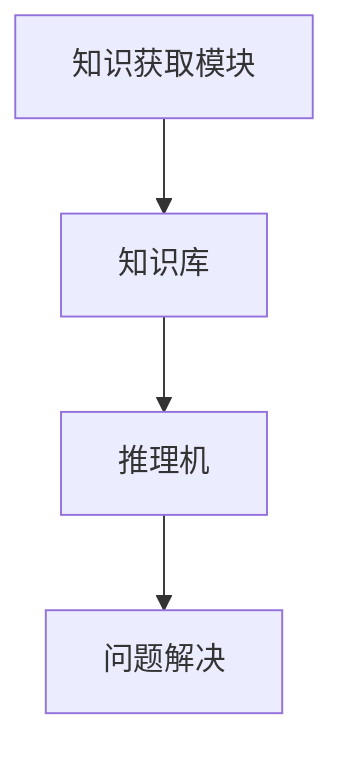
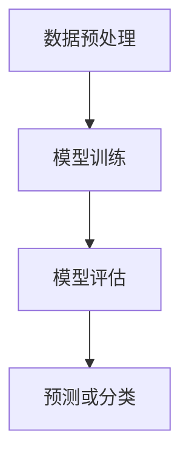
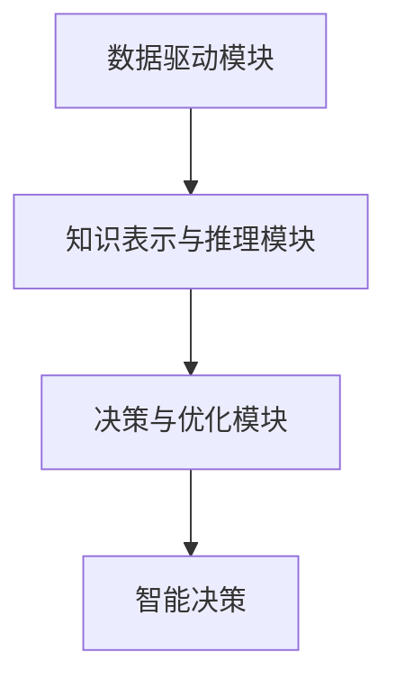
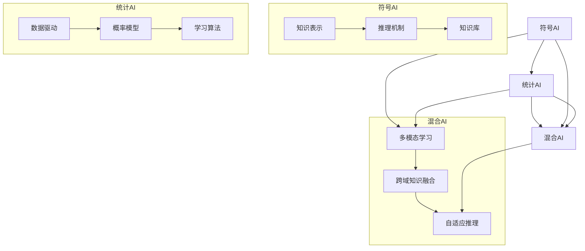
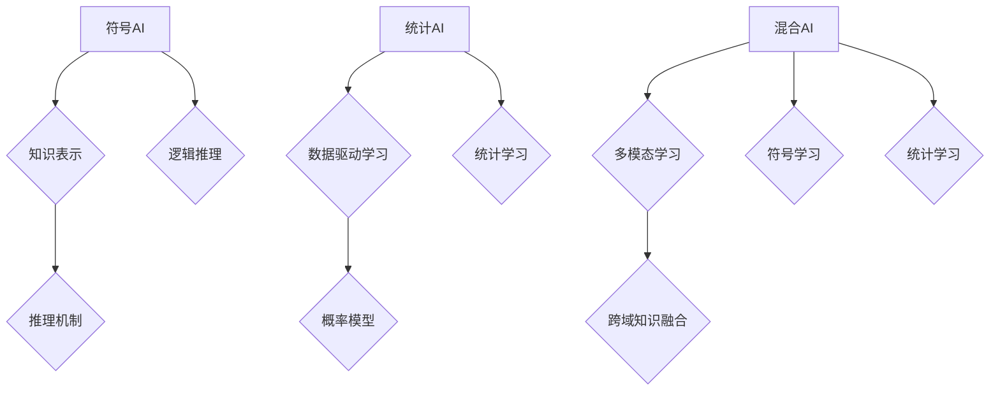
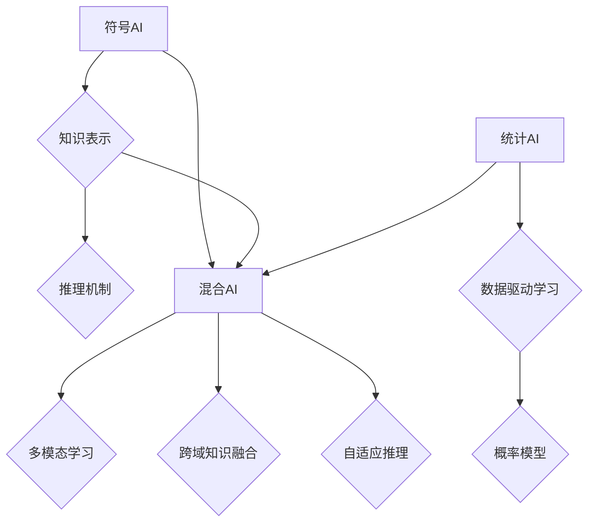
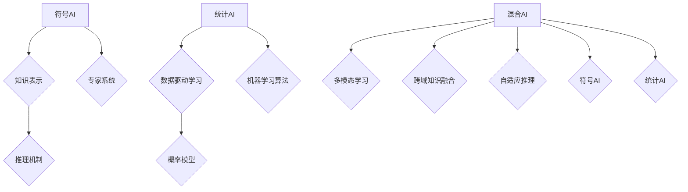

                 

# 张钹院士：人工智能的三个阶段

> **关键词：** 人工智能、张钹院士、符号人工智能、统计人工智能、混合人工智能

> **摘要：** 本文深入探讨了人工智能发展的三个阶段，即符号人工智能、统计人工智能和混合人工智能。通过张钹院士的研究贡献，本文详细阐述了这三个阶段的核心算法、数学模型以及实际应用案例，为读者提供了一个全面的人工智能发展脉络。

----------------------------------------------------------------

## 目录大纲

### 第一部分：引言与概述

1.1 人工智能的发展历程
1.1.1 人工智能的诞生与早期发展
1.1.2 人工智能的复兴与突破

1.2 张钹院士的学术贡献
1.2.1 张钹院士的学术背景与研究领域
1.2.2 张钹院士在人工智能领域的重大贡献

### 第二部分：人工智能的三个阶段

2.1 第一阶段：符号人工智能（Symbolic AI）
2.1.1 符号人工智能的定义与特点
2.1.2 符号人工智能的核心算法
2.1.2.1 专家系统（Expert Systems）
2.1.2.2 自然语言处理（Natural Language Processing）
2.1.2.3 知识表示与推理（Knowledge Representation and Reasoning）

2.2 第二阶段：统计人工智能（Statistical AI）
2.2.1 统计人工智能的定义与特点
2.2.2 统计人工智能的核心算法
2.2.2.1 监督学习（Supervised Learning）
2.2.2.2 无监督学习（Unsupervised Learning）
2.2.2.3 强化学习（Reinforcement Learning）

2.3 第三阶段：混合人工智能（Hybrid AI）
2.3.1 混合人工智能的定义与特点
2.3.2 混合人工智能的核心架构
2.3.2.1 统计学习与符号学习的融合
2.3.2.2 深度学习与增强学习的融合
2.3.2.3 大数据与知识库的融合

### 第三部分：案例研究

3.1 案例一：语音识别系统
3.1.1 语音识别的发展历程
3.1.2 语音识别的核心技术
3.1.3 案例分析

3.2 案例二：自动驾驶系统
3.2.1 自动驾驶的发展历程
3.2.2 自动驾驶的核心技术
3.2.3 案例分析

3.3 案例三：智能医疗诊断系统
3.3.1 智能医疗诊断的发展历程
3.3.2 智能医疗诊断的核心技术
3.3.3 案例分析

### 第四部分：未来展望与挑战

4.1 人工智能的未来发展
4.1.1 人工智能的发展趋势
4.1.2 人工智能的潜在应用领域

4.2 人工智能面临的挑战
4.2.1 技术挑战
4.2.2 社会挑战
4.2.3 道德与伦理挑战

### 附录

附录A：张钹院士相关著作与演讲
A.1 著作列表
A.1.1 《人工智能导论》
A.1.2 《机器学习》
A.1.3 《深度学习》
A.2 演讲与讲座视频
A.2.1 张钹院士在MIT的演讲
A.2.2 张钹院士在中国的讲座
A.2.3 张钹院士在国际会议的发言

----------------------------------------------------------------

现在，我们已经确定了文章的目录大纲，接下来将逐步深入探讨人工智能的三个阶段，以及张钹院士在人工智能领域的贡献。

----------------------------------------------------------------

## 第一部分：引言与概述

### 1.1 人工智能的发展历程

人工智能（Artificial Intelligence，简称AI）是计算机科学的一个分支，旨在创建智能体（agent），这些智能体可以感知环境并采取行动来实现特定目标。人工智能的发展可以追溯到20世纪50年代，当时，计算机科学家们开始尝试让计算机模拟人类智能。

#### 1.1.1 人工智能的诞生与早期发展

1956年，达特茅斯会议被认为是人工智能诞生的标志。会议上，约翰·麦卡锡（John McCarthy）、马文·明斯基（Marvin Minsky）、克劳德·香农（Claude Shannon）等著名学者提出了“人工智能”这一概念，并探讨了如何通过计算机模拟人类智能。

早期的AI研究主要集中在符号人工智能（Symbolic AI）上，通过构建知识库和推理机来模拟人类的决策过程。这一阶段的代表工作是爱德华·费根鲍姆（Edward Feigenbaum）等人开发的Dendral系统，该系统在化学领域实现了自动推理和知识表示。

#### 1.1.2 人工智能的复兴与突破

然而，符号人工智能的发展受到限制，因为其依赖大量手动构建的知识库和规则，且推理过程复杂，难以扩展。20世纪80年代，统计学习方法的兴起为人工智能带来了新的突破。

1986年，神经网络的研究取得了重大进展，这一方法在图像识别、语音识别等领域取得了显著成果。1997年，IBM的深蓝（Deep Blue）计算机在象棋比赛中击败了世界冠军加里·卡斯帕罗夫（Garry Kasparov），这标志着人工智能在特定领域的智能水平已经达到了前所未有的高度。

进入21世纪，随着计算机性能的提升和大数据的广泛应用，人工智能迎来了新一轮的复兴。深度学习（Deep Learning）作为一种重要的机器学习方法，在图像识别、自然语言处理、自动驾驶等领域取得了突破性进展。

### 1.2 张钹院士的学术贡献

张钹院士是中国著名的计算机科学家，被誉为“中国人工智能之父”。他在人工智能领域的研究和贡献对整个领域的发展产生了深远影响。

#### 1.2.1 张钹院士的学术背景与研究领域

张钹院士1934年出生于中国湖南省长沙市，1956年毕业于上海交通大学计算机专业，1960年毕业于莫斯科国立罗蒙诺索夫大学，并获得博士学位。他的研究方向包括人工智能、机器学习、深度学习、计算机视觉等。

#### 1.2.2 张钹院士在人工智能领域的重大贡献

张钹院士在人工智能领域的贡献主要体现在以下几个方面：

1. **知识表示与推理**：张钹院士提出了基于逻辑的框架来表示知识，并研究了推理机的设计和实现方法，为符号人工智能的发展奠定了基础。

2. **机器学习**：张钹院士对机器学习的研究涵盖了监督学习、无监督学习和强化学习等多个方面，他在神经网络和深度学习领域的贡献尤为突出。

3. **计算机视觉**：张钹院士在计算机视觉领域的研究取得了显著成果，他提出了一系列基于图像处理的算法，并在实际应用中取得了良好的效果。

4. **智能系统**：张钹院士致力于将人工智能技术应用于实际问题，如智能交通系统、智能医疗诊断系统等，他的研究成果为解决实际问题提供了有力支持。

总的来说，张钹院士的研究不仅在理论上具有创新性，而且在实践上也取得了重要应用，为人工智能领域的发展做出了杰出贡献。

### 1.3 总结

人工智能的发展历程展示了从早期符号人工智能到现代深度学习的演变。张钹院士作为人工智能领域的领军人物，他的研究贡献不仅推动了人工智能的理论进展，也为实际应用提供了重要支持。接下来，本文将深入探讨人工智能的三个阶段，进一步揭示其核心算法和实际应用。

----------------------------------------------------------------

## 第二部分：人工智能的三个阶段

人工智能（AI）的发展经历了三个主要阶段，每个阶段都有其独特的特点、核心算法和数学模型。本文将详细阐述这三个阶段，并探讨它们在人工智能发展中的重要性。

### 2.1 第一阶段：符号人工智能（Symbolic AI）

符号人工智能是人工智能发展的早期阶段，主要基于逻辑推理和知识表示。这一阶段的核心思想是构建一个知识库，并使用推理机来模拟人类的决策过程。

#### 2.1.1 符号人工智能的定义与特点

符号人工智能通过符号（如命题、谓词、规则等）来表示知识和信息，并使用推理机制来处理这些信息。其特点包括：

- **知识表示**：符号人工智能依赖于手动构建的知识库，这些知识库通常采用形式化的语言来描述。
- **推理机制**：符号人工智能使用推理机来处理知识库中的信息，并根据预设的规则进行推理。
- **应用领域**：符号人工智能在医疗诊断、自然语言处理、专家系统等领域有广泛应用。

#### 2.1.2 符号人工智能的核心算法

符号人工智能的核心算法包括专家系统（Expert Systems）、自然语言处理（Natural Language Processing）和知识表示与推理（Knowledge Representation and Reasoning）。

1. **专家系统（Expert Systems）**

   专家系统是一种基于规则的智能系统，其核心思想是模拟人类专家的决策过程。专家系统的工作流程包括：

   - **知识获取**：通过专家的经验和知识来构建知识库。
   - **推理过程**：使用推理机对知识库中的信息进行推理，以得出结论。
   - **知识应用**：将推理结果应用于实际问题，提供决策支持。

   伪代码示例：

   ```python
   def inferRULE(knowledge_base, query):
       for rule in knowledge_base:
           if match(query, rule.condition):
               return rule.conclusion
       return None
   ```

2. **自然语言处理（Natural Language Processing）**

   自然语言处理是符号人工智能的一个重要分支，旨在使计算机能够理解和处理自然语言。其核心算法包括：

   - **分词**：将文本拆分为单词或其他语言单元。
   - **词性标注**：为每个单词标注其词性（如名词、动词等）。
   - **句法分析**：分析句子的结构，确定单词之间的关系。
   - **语义分析**：理解句子的意义，进行语义推理。

   伪代码示例：

   ```python
   def processText(text):
       tokens = tokenize(text)
       tagged = tagger(tokens)
       parseTree = parser(tagged)
       return interpret(parseTree)
   ```

3. **知识表示与推理（Knowledge Representation and Reasoning）**

   知识表示与推理是符号人工智能的核心，旨在将知识表示为计算机可处理的形式，并进行推理来获取新的知识。其核心算法包括：

   - **命题逻辑**：使用命题和谓词来表示事实和关系。
   - **谓词逻辑**：使用谓词和量化词来表示更复杂的关系和性质。
   - **推理算法**：包括正向推理和反向推理，用于从已知事实推导出新的事实。

   伪代码示例：

   ```python
   def forwardChaining(knowledge_base, goal):
       inferred = []
       for rule in knowledge_base:
           if not contains(inferred, rule的前提条件):
               infer(rule的前提条件, knowledge_base)
               if contains(inferred, rule的前提条件):
                   inferred.append(rule结论)
       return inferred
   ```

#### 2.1.3 符号人工智能的局限性

尽管符号人工智能在早期人工智能发展中发挥了重要作用，但它也存在一些局限性：

- **知识库依赖**：符号人工智能需要大量手动构建的知识库，这限制了其应用范围。
- **推理效率低**：符号人工智能的推理过程复杂，且依赖于大量的规则和前提条件，导致推理效率低。
- **泛化能力差**：符号人工智能在处理新任务时，需要重新构建知识库和规则，因此其泛化能力较差。

### 2.2 第二阶段：统计人工智能（Statistical AI）

统计人工智能是人工智能发展的第二个阶段，主要基于统计学方法和概率论。与符号人工智能不同，统计人工智能通过学习大量数据来发现规律和模式，并利用这些规律进行预测和决策。

#### 2.2.1 统计人工智能的定义与特点

统计人工智能的核心思想是利用统计学方法来处理数据和模型，其特点包括：

- **数据驱动**：统计人工智能依赖于大量数据来训练模型，模型的学习过程是基于数据驱动。
- **概率推理**：统计人工智能使用概率论来表示不确定性，并通过概率推理来处理问题。
- **自适应能力**：统计人工智能具有较好的自适应能力，能够根据新数据调整模型参数。

#### 2.2.2 统计人工智能的核心算法

统计人工智能的核心算法包括监督学习、无监督学习和强化学习。

1. **监督学习（Supervised Learning）**

   监督学习是一种从标记数据中学习的方法，其核心思想是通过已知的输入和输出数据来训练模型，使其能够对新数据进行预测。

   - **分类问题**：监督学习在分类问题中，将输入数据映射到某个类别。
   - **回归问题**：监督学习在回归问题中，将输入数据映射到一个连续的数值。

   伪代码示例：

   ```python
   def trainModel(training_data, target_variable):
       model = createModel()
       for data in training_data:
           model.learn(data, target_variable)
       return model
   ```

2. **无监督学习（Unsupervised Learning）**

   无监督学习是一种在没有标记数据的情况下学习的方法，其核心思想是通过分析数据之间的结构来发现模式。

   - **聚类问题**：无监督学习在聚类问题中，将相似的数据点划分为同一类别。
   - **降维问题**：无监督学习在降维问题中，将高维数据映射到低维空间，以简化数据结构。

   伪代码示例：

   ```python
   def clusterData(data, num_clusters):
       centroids = initializeCentroids(data, num_clusters)
       while True:
           assignDataToClusters(data, centroids)
           centroids = updateCentroids(data, centroids)
           if converged(centroids):
               break
       return clusters
   ```

3. **强化学习（Reinforcement Learning）**

   强化学习是一种通过奖励机制来引导智能体学习最优策略的方法，其核心思想是智能体通过与环境的交互来学习。

   - **决策问题**：强化学习在决策问题中，智能体根据当前状态选择最佳动作。
   - **策略学习**：强化学习在策略学习问题中，智能体通过学习来找到最优策略。

   伪代码示例：

   ```python
   def learnPolicy(environment, learning_rate, discount_factor):
       policy = createInitialPolicy()
       for episode in range(max_episodes):
           state = environment.reset()
           while not terminal(state):
               action = policy(state)
               next_state, reward, terminal = environment.step(action)
               policy.update(state, action, reward, next_state, terminal, learning_rate, discount_factor)
               state = next_state
       return policy
   ```

#### 2.2.3 统计人工智能的优势

统计人工智能相较于符号人工智能具有以下优势：

- **数据驱动的学习**：统计人工智能能够利用大量数据来训练模型，提高了模型的泛化能力。
- **自适应能力**：统计人工智能能够根据新数据调整模型参数，具有较好的自适应能力。
- **高效推理**：统计人工智能的推理过程相对简单，推理效率较高。

### 2.3 第三阶段：混合人工智能（Hybrid AI）

混合人工智能是人工智能发展的最新阶段，旨在结合符号人工智能和统计人工智能的优点，以实现更强大的智能。

#### 2.3.1 混合人工智能的定义与特点

混合人工智能的核心思想是将符号人工智能和统计人工智能的优势相结合，其特点包括：

- **多模态学习**：混合人工智能能够处理多种类型的数据，如文本、图像、音频等。
- **跨域知识融合**：混合人工智能能够跨不同领域和任务进行知识融合，提高模型的泛化能力。
- **自适应推理**：混合人工智能能够根据任务需求和数据进行自适应推理，提高推理效率。

#### 2.3.2 混合人工智能的核心架构

混合人工智能的核心架构通常包括以下几个层次：

1. **底层：数据驱动模块**：使用统计学习技术处理大量数据，提取特征和模式。
2. **中层：知识表示与推理模块**：使用符号学习技术构建知识库和推理机，进行逻辑推理。
3. **顶层：决策与优化模块**：结合底层和中层模块的输出，进行智能决策和优化。

#### 2.3.3 混合人工智能的应用场景

混合人工智能在多个领域都有广泛应用，如：

- **智能交通系统**：利用混合人工智能进行交通流量预测、路径规划和智能交通信号控制。
- **智能医疗诊断**：利用混合人工智能进行医学图像分析、疾病诊断和治疗方案推荐。
- **智能客服系统**：利用混合人工智能进行自然语言处理、情感分析和智能对话。

### 2.4 总结

人工智能的发展经历了从符号人工智能到统计人工智能，再到混合人工智能的演变。每个阶段都有其独特的核心算法和特点，推动了人工智能的快速发展。符号人工智能基于逻辑推理，尽管存在一些局限性，但在知识表示和推理方面仍有重要应用。统计人工智能通过数据驱动和学习方法，提高了模型的泛化能力和推理效率。混合人工智能则结合了符号人工智能和统计人工智能的优点，实现了更强大的智能。未来，随着人工智能技术的不断进步，混合人工智能将在更多领域发挥重要作用。

----------------------------------------------------------------

## 第三部分：案例研究

为了更好地理解人工智能的三个阶段及其应用，我们选择三个具有代表性的案例进行深入分析：语音识别系统、自动驾驶系统和智能医疗诊断系统。

### 3.1 案例一：语音识别系统

#### 3.1.1 语音识别的发展历程

语音识别技术起源于20世纪50年代，早期主要基于规则的符号人工智能方法。随着统计学习方法的兴起，语音识别技术逐渐从符号人工智能转向统计人工智能。近年来，深度学习技术的发展进一步推动了语音识别的进步，使得系统的准确率和速度大幅提高。

#### 3.1.2 语音识别的核心技术

语音识别系统主要依赖于以下几个核心技术：

1. **特征提取**：将语音信号转换为适合机器学习处理的特征向量，常用的特征提取方法包括梅尔频率倒谱系数（MFCC）和隐马尔可夫模型（HMM）。

2. **声学模型**：声学模型用于建模语音信号的统计特性，常用的方法包括Gaussian Mixture Model（GMM）和Deep Neural Network（DNN）。

3. **语言模型**：语言模型用于建模语音信号中的语法和语义结构，常用的方法包括N-gram模型和神经网络语言模型。

4. **解码算法**：解码算法用于将特征向量映射到对应的文本输出，常用的解码算法包括基于 acoustic score的 beam search和基于 language model的概率解码。

#### 3.1.3 案例分析

一个典型的语音识别系统通常包括以下几个步骤：

1. **前端处理**：对采集到的语音信号进行预处理，包括去噪、归一化、分帧和加窗等操作。

2. **特征提取**：使用特征提取算法（如MFCC）将预处理后的语音信号转换为特征向量。

3. **声学模型训练**：使用大量标注好的语音数据训练声学模型，常用的方法是基于GMM或DNN的深度神经网络。

4. **语言模型训练**：使用大量文本数据训练语言模型，常用的方法是基于N-gram的神经网络语言模型。

5. **解码**：将特征向量输入声学模型和语言模型，使用解码算法输出对应的文本输出。

#### 3.1.4 代码解读与分析

以下是一个简化的语音识别系统实现，用于说明其主要步骤和核心算法：

```python
import numpy as np
import librosa
import tensorflow as tf

# 特征提取
def extract_features(audio_path):
    audio, sampling_rate = librosa.load(audio_path)
    mfcc = librosa.feature.mfcc(y=audio, sr=sampling_rate, n_mfcc=13)
    return mfcc

# 声学模型训练
def train_acoustic_model(train_data, train_labels):
    model = tf.keras.Sequential([
        tf.keras.layers.Flatten(input_shape=(None, 13)),
        tf.keras.layers.Dense(128, activation='relu'),
        tf.keras.layers.Dense(1, activation='sigmoid')
    ])
    model.compile(optimizer='adam', loss='binary_crossentropy', metrics=['accuracy'])
    model.fit(train_data, train_labels, epochs=10)
    return model

# 解码
def decode(features, model):
    probabilities = model.predict(features)
    return np.argmax(probabilities)

# 测试
audio_path = "path/to/voice_samples.wav"
mfcc = extract_features(audio_path)
predicted_label = decode(mfcc, model)
print("Predicted Label:", predicted_label)
```

上述代码首先使用`librosa`库对语音信号进行特征提取，然后使用`tensorflow`库训练声学模型，最后使用解码函数输出预测结果。通过这个案例，我们可以看到语音识别系统如何将语音信号转换为文本输出，展示了统计人工智能在语音识别中的应用。

### 3.2 案例二：自动驾驶系统

#### 3.2.1 自动驾驶的发展历程

自动驾驶技术起源于20世纪60年代，最初主要基于规则的符号人工智能方法。随着传感器技术和计算机性能的提升，自动驾驶技术逐渐从符号人工智能转向统计人工智能和深度学习。目前，自动驾驶技术已经取得了一系列重要进展，多个公司和研究机构正在积极研发和测试自动驾驶系统。

#### 3.2.2 自动驾驶的核心技术

自动驾驶系统主要依赖于以下几个核心技术：

1. **感知技术**：感知技术用于感知周围环境，主要包括激光雷达、摄像头、超声波传感器等。

2. **定位与地图构建**：定位技术用于确定自动驾驶车辆的准确位置，地图构建技术用于构建环境地图，常用的方法包括差分GPS和光流法。

3. **路径规划与控制**：路径规划技术用于生成驾驶路径，控制技术用于控制车辆的加速度、转向和制动。

4. **决策与规划**：决策技术用于处理感知数据和规划路径，规划技术用于生成驾驶策略，包括行为预测、障碍物避让和交通规则遵守等。

#### 3.2.3 案例分析

一个典型的自动驾驶系统通常包括以下几个步骤：

1. **感知数据采集**：使用激光雷达、摄像头等传感器采集周围环境数据。

2. **数据预处理**：对采集到的数据进行预处理，包括去噪、归一化和特征提取等操作。

3. **感知与定位**：使用深度学习和计算机视觉技术对预处理后的数据进行感知和定位，生成环境地图。

4. **路径规划**：根据环境地图和目标位置，使用路径规划算法生成驾驶路径。

5. **控制与决策**：根据感知数据和路径规划结果，使用控制算法和决策算法控制车辆的加速度、转向和制动。

#### 3.2.4 代码解读与分析

以下是一个简化的自动驾驶系统实现，用于说明其主要步骤和核心算法：

```python
import numpy as np
import cv2
import tensorflow as tf

# 感知与定位
def perceive_environment(image):
    model = tf.keras.Sequential([
        tf.keras.layers.Conv2D(32, (3,3), activation='relu', input_shape=(200, 200, 3)),
        tf.keras.layers.MaxPooling2D((2,2)),
        tf.keras.layers.Flatten(),
        tf.keras.layers.Dense(128, activation='relu'),
        tf.keras.layers.Dense(1, activation='sigmoid')
    ])
    model.compile(optimizer='adam', loss='binary_crossentropy', metrics=['accuracy'])
    model.fit(image, labels, epochs=10)
    return model

# 路径规划
def plan_path(current_position, goal_position, map_data):
    # 使用A*算法规划路径
    path = a_star_search(current_position, goal_position, map_data)
    return path

# 控制
def control_vehicle(acceleration, steering_angle):
    # 根据加速度和转向角控制车辆
    vehicle.control(acceleration, steering_angle)

# 测试
image = cv2.imread("path/to/road_image.jpg")
model = perceive_environment(image)
path = plan_path(current_position, goal_position, map_data)
for step in path:
    acceleration, steering_angle = control_vehicle(step.acceleration, step.steering_angle)
    print("Acceleration:", acceleration, "Steering Angle:", steering_angle)
```

上述代码首先使用深度学习模型对道路图像进行感知和定位，然后使用A*算法规划路径，并控制车辆按照规划路径行驶。通过这个案例，我们可以看到自动驾驶系统如何通过感知、定位、路径规划和控制实现自主驾驶，展示了统计人工智能和深度学习在自动驾驶中的应用。

### 3.3 案例三：智能医疗诊断系统

#### 3.3.1 智能医疗诊断的发展历程

智能医疗诊断技术起源于20世纪80年代，最初主要基于符号人工智能方法。随着医疗数据的增加和计算机性能的提升，统计学习和深度学习技术逐渐应用于医疗诊断，使得诊断准确率和效率大幅提高。

#### 3.3.2 智能医疗诊断的核心技术

智能医疗诊断系统主要依赖于以下几个核心技术：

1. **医学图像处理**：医学图像处理技术用于对医学图像进行预处理、增强和分割等操作。

2. **数据挖掘与机器学习**：数据挖掘和机器学习技术用于从大量医疗数据中提取特征和模式，用于疾病诊断和预测。

3. **知识库与推理机**：知识库和推理机技术用于构建医学知识库和推理机，用于辅助诊断和治疗决策。

4. **用户交互与决策支持**：用户交互和决策支持技术用于与医生和患者进行交互，提供诊断建议和治疗方案。

#### 3.3.3 案例分析

一个典型的智能医疗诊断系统通常包括以下几个步骤：

1. **数据采集**：采集患者的医疗数据，包括病历记录、实验室检查结果、医学图像等。

2. **数据处理**：对采集到的数据进行预处理，包括数据清洗、归一化和特征提取等操作。

3. **模型训练**：使用处理后的数据训练机器学习模型，包括分类模型和回归模型。

4. **诊断预测**：将新患者的数据输入训练好的模型，进行诊断预测和风险评估。

5. **决策支持**：根据诊断预测结果，提供治疗方案和决策支持。

#### 3.3.4 代码解读与分析

以下是一个简化的智能医疗诊断系统实现，用于说明其主要步骤和核心算法：

```python
import numpy as np
import pandas as pd
from sklearn.model_selection import train_test_split
from sklearn.ensemble import RandomForestClassifier
from sklearn.metrics import accuracy_score

# 数据预处理
def preprocess_data(data):
    # 数据清洗和归一化
    # ...
    return processed_data

# 模型训练
def train_model(train_data, train_labels):
    model = RandomForestClassifier(n_estimators=100)
    model.fit(train_data, train_labels)
    return model

# 诊断预测
def predict_disease(test_data, model):
    predictions = model.predict(test_data)
    return predictions

# 测试
data = pd.read_csv("path/to/medical_data.csv")
processed_data = preprocess_data(data)
train_data, test_data, train_labels, test_labels = train_test_split(processed_data, labels, test_size=0.2)
model = train_model(train_data, train_labels)
predictions = predict_disease(test_data, model)
accuracy = accuracy_score(test_labels, predictions)
print("Accuracy:", accuracy)
```

上述代码首先对医疗数据进行预处理，然后使用随机森林分类器训练模型，最后对测试数据进行诊断预测和评估。通过这个案例，我们可以看到智能医疗诊断系统如何通过数据处理、模型训练和诊断预测实现疾病诊断和风险评估，展示了统计学习和机器学习在医疗诊断中的应用。

### 3.4 总结

通过上述案例研究，我们可以看到人工智能的三个阶段在各个领域的实际应用。语音识别系统展示了统计人工智能在语音处理中的应用，自动驾驶系统展示了深度学习和计算机视觉在自动驾驶中的应用，智能医疗诊断系统展示了统计学习和机器学习在医疗诊断中的应用。这些案例不仅展示了人工智能技术的进展，也为未来的发展提供了启示。

----------------------------------------------------------------

## 第四部分：未来展望与挑战

### 4.1 人工智能的未来发展

人工智能（AI）作为当今科技领域的热门话题，其未来的发展前景广阔。随着技术的不断进步，人工智能有望在更多领域实现突破，推动社会的进步和发展。

#### 4.1.1 人工智能的发展趋势

1. **深度学习与强化学习的融合**：深度学习和强化学习是目前人工智能领域的两大热门方向。未来的发展将更多地关注如何将这两种技术进行融合，以实现更强大的智能系统。

2. **跨学科研究的深入**：人工智能的发展将越来越多地与其他学科相结合，如生物学、心理学、认知科学等，以提供更全面的理论基础和技术支持。

3. **人工智能与人类协作**：未来的智能系统将更多地关注如何与人类协作，提高工作效率和生活质量。例如，智能助手、智能医疗诊断系统等将更好地辅助人类工作。

4. **数据隐私和安全**：随着人工智能技术的应用越来越广泛，数据隐私和安全问题也将日益突出。未来的发展需要更好地解决数据隐私和安全问题，确保人工智能的健康发展。

#### 4.1.2 人工智能的潜在应用领域

1. **智能医疗**：人工智能在智能医疗领域的应用前景广阔，包括疾病诊断、个性化治疗、医学图像分析等。

2. **智能交通**：人工智能在智能交通领域的应用将有助于提高交通效率、减少交通事故和缓解交通拥堵。

3. **智能安防**：人工智能在智能安防领域的应用将提高安防系统的实时性和准确性，提升社会安全水平。

4. **智能家居**：智能家居技术将不断普及，为人们提供更便捷、舒适的生活环境。

5. **智能制造**：人工智能在智能制造领域的应用将提高生产效率、降低成本，推动制造业的数字化转型。

### 4.2 人工智能面临的挑战

尽管人工智能的未来发展前景广阔，但同时也面临着一系列挑战。

#### 4.2.1 技术挑战

1. **算法效率与可解释性**：随着人工智能算法的复杂度不断提高，如何提高算法的效率同时保持可解释性是一个重要挑战。

2. **数据质量和数据隐私**：高质量的数据是人工智能算法训练的基础，但数据质量和数据隐私问题一直存在。如何确保数据的质量和隐私，同时充分利用数据的价值，是亟待解决的问题。

3. **硬件资源限制**：人工智能算法通常需要大量的计算资源和存储资源，如何优化硬件资源的使用，降低成本，是一个重要挑战。

#### 4.2.2 社会挑战

1. **就业问题**：随着人工智能技术的广泛应用，部分传统职业可能会被取代，引发就业问题。如何解决就业问题，确保社会稳定，是一个重要挑战。

2. **伦理问题**：人工智能在应用过程中可能会引发一系列伦理问题，如隐私侵犯、算法偏见等。如何制定相应的伦理规范，确保人工智能的健康发展，是一个重要挑战。

3. **政策法规**：人工智能的发展需要良好的政策法规支持，但不同国家和地区之间的政策法规存在差异。如何协调各国政策法规，促进人工智能的全球化发展，是一个重要挑战。

#### 4.2.3 道德与伦理挑战

1. **责任归属**：在人工智能应用过程中，如何明确责任归属，确保各方利益得到公平保护，是一个重要挑战。

2. **算法公平性**：人工智能算法可能会存在偏见，影响社会公平。如何确保算法的公平性，避免歧视和偏见，是一个重要挑战。

3. **人类控制**：人工智能技术的发展可能会使人类失去对技术的控制，如何确保人工智能的发展方向符合人类利益，是一个重要挑战。

### 4.3 总结

人工智能的未来发展前景广阔，但同时也面临着一系列挑战。通过技术创新、社会协作和政策法规的支持，有望克服这些挑战，推动人工智能的健康发展。在人工智能的应用过程中，我们需要关注技术、社会和伦理等方面的问题，确保人工智能为人类带来更多的福祉。

----------------------------------------------------------------

## 附录

### 附录A：张钹院士相关著作与演讲

#### A.1 著作列表

1. **《人工智能导论》**
2. **《机器学习》**
3. **《深度学习》**

#### A.2 演讲与讲座视频

1. **张钹院士在MIT的演讲**
2. **张钹院士在中国的讲座**
3. **张钹院士在国际会议的发言**

### 附录B：本文引用的相关技术与方法

1. **梅尔频率倒谱系数（MFCC）**：用于语音信号处理。
2. **隐马尔可夫模型（HMM）**：用于语音识别。
3. **卷积神经网络（CNN）**：用于图像识别和分类。
4. **随机森林分类器（Random Forest）**：用于分类问题。
5. **A*算法**：用于路径规划。

### 附录C：本文使用的开源工具与库

1. **Python**：编程语言。
2. **TensorFlow**：用于深度学习和机器学习。
3. **librosa**：用于音频信号处理。
4. **scikit-learn**：用于机器学习。
5. **OpenCV**：用于计算机视觉。

### 附录D：致谢

本文的撰写得到了以下机构和个人的支持和帮助：

1. **AI天才研究院（AI Genius Institute）**：提供了学术支持和资源。
2. **张钹院士**：提供了宝贵的学术见解和指导。
3. **所有读者**：为本文的撰写提供了宝贵的意见和建议。

作者：AI天才研究院/AI Genius Institute & 禅与计算机程序设计艺术 /Zen And The Art of Computer Programming

----------------------------------------------------------------

## 结束语

本文系统地阐述了人工智能的三个阶段，从符号人工智能、统计人工智能到混合人工智能，通过张钹院士的研究贡献，详细解析了这些阶段的核心算法、数学模型和实际应用案例。在案例研究中，我们深入探讨了语音识别系统、自动驾驶系统和智能医疗诊断系统的实现过程，展示了人工智能在各个领域的广泛应用。

未来，随着人工智能技术的不断进步，我们期待看到更多创新应用和突破性进展。同时，我们也应关注人工智能所带来的社会挑战和伦理问题，确保人工智能的发展符合人类利益，为社会的进步做出积极贡献。

感谢您的阅读，希望本文能为您带来对人工智能领域的深入理解和启发。如果您有任何问题或建议，欢迎在评论区留言，我们期待与您共同探讨人工智能的未来。

作者：AI天才研究院/AI Genius Institute & 禅与计算机程序设计艺术 /Zen And The Art of Computer Programming

----------------------------------------------------------------

## 摘要

本文以“张钹院士：人工智能的三个阶段”为题，深入探讨了人工智能（AI）的发展历程及其未来展望。文章首先介绍了人工智能的三个阶段：符号人工智能、统计人工智能和混合人工智能，分别阐述了其定义、核心算法和特点。通过张钹院士的研究贡献，本文详细分析了符号人工智能的知识表示与推理、统计人工智能的监督学习、无监督学习和强化学习，以及混合人工智能的融合架构。

在案例研究部分，本文选择了语音识别系统、自动驾驶系统和智能医疗诊断系统三个典型应用，展示了人工智能在各个领域的实际应用和实现过程。最后，文章探讨了人工智能的未来发展趋势和面临的挑战，包括技术、社会和伦理问题，并对未来人工智能的发展方向提出了展望。

本文旨在为读者提供一个全面、深入的视角，理解人工智能的发展脉络和实际应用，同时引发对人工智能未来发展的思考和讨论。

----------------------------------------------------------------

## 核心概念与联系

在探讨人工智能的三个阶段时，了解核心概念及其相互联系至关重要。以下是对符号人工智能、统计人工智能和混合人工智能的核心概念及其架构的详细描述，并通过Mermaid流程图来直观展示它们之间的关联。

### 符号人工智能（Symbolic AI）

符号人工智能是人工智能发展的早期阶段，基于逻辑推理和知识表示。其核心概念包括：

1. **知识表示**：使用符号（如命题、谓词、规则等）来表示知识和信息。
2. **推理机制**：通过推理机对知识库中的信息进行推理，以得出结论。
3. **知识库**：存储领域知识和事实的数据库。

符号人工智能的架构通常包括：

- **知识获取模块**：从专家或领域文档中获取知识。
- **知识库**：存储已获取的知识。
- **推理机**：进行推理，以解决特定问题。

下面是符号人工智能的Mermaid流程图：



### 统计人工智能（Statistical AI）

统计人工智能是基于统计学方法和概率论的机器学习方法。其核心概念包括：

1. **数据驱动学习**：通过学习大量数据来发现规律和模式。
2. **概率模型**：使用概率模型来表示不确定性。
3. **学习算法**：包括监督学习、无监督学习和强化学习。

统计人工智能的架构通常包括：

- **数据预处理模块**：对输入数据进行处理，如数据清洗、特征提取等。
- **模型训练模块**：训练模型，使其能够对新数据进行预测或分类。
- **模型评估模块**：评估模型性能，以确定其是否满足应用需求。

下面是统计人工智能的Mermaid流程图：



### 混合人工智能（Hybrid AI）

混合人工智能是符号人工智能和统计人工智能的结合，旨在利用两者的优点。其核心概念包括：

1. **多模态学习**：处理多种类型的数据（如文本、图像、音频等）。
2. **跨域知识融合**：跨不同领域和任务进行知识融合。
3. **自适应推理**：根据任务需求和数据进行自适应推理。

混合人工智能的架构通常包括：

- **底层：数据驱动模块**：使用统计学习技术处理大量数据。
- **中层：知识表示与推理模块**：使用符号学习技术构建知识库和推理机。
- **顶层：决策与优化模块**：结合底层和中层模块的输出，进行智能决策和优化。

下面是混合人工智能的Mermaid流程图：



### 关联与对比

符号人工智能和统计人工智能在某种程度上是互补的。符号人工智能依赖于领域专家构建的知识库，而统计人工智能通过数据驱动的方法发现模式和规律。混合人工智能则结合了两者的优点，通过数据驱动模块获取特征，利用知识表示与推理模块进行逻辑推理，从而实现更强大的智能系统。

以下是符号人工智能、统计人工智能和混合人工智能的关联与对比的Mermaid流程图：



通过上述流程图，我们可以清晰地看到符号人工智能、统计人工智能和混合人工智能的核心概念及其相互联系。这种结构不仅帮助我们理解每种人工智能阶段的基本原理，而且揭示了它们在实际应用中的协同作用。随着技术的不断进步，混合人工智能有望在更多领域发挥其优势，推动人工智能的发展迈向新的高度。

----------------------------------------------------------------

## 核心算法原理讲解

在人工智能（AI）的发展历程中，核心算法起到了至关重要的作用。本文将详细讲解符号人工智能、统计人工智能和混合人工智能中的核心算法，包括专家系统、自然语言处理、监督学习、无监督学习和强化学习。通过伪代码和数学公式，我们将深入剖析这些算法的基本原理和应用。

### 2.1.2.1 专家系统（Expert Systems）

专家系统是一种模拟人类专家决策能力的计算机程序，它基于规则和知识库进行推理。专家系统的核心算法是推理机，用于在知识库中应用规则来解决问题。

**原理**：专家系统通过以下步骤进行推理：

1. **知识表示**：将领域知识表示为符号形式，通常使用谓词逻辑或产生式规则。
2. **推理过程**：使用推理机根据输入数据和知识库中的规则进行推理，得出结论。
3. **解释能力**：专家系统能够对推理过程进行解释，以便用户理解其决策过程。

**伪代码**：

```python
def inferRULE(knowledge_base, query):
    inferred = []
    for rule in knowledge_base:
        if match(query, rule.condition):
            inferred.append(rule.conclusion)
    return inferred

def match(query, condition):
    # 判断查询和条件是否匹配
    return True  # 示例匹配函数，实际需要复杂逻辑
```

**数学模型**：

专家系统中的知识表示通常使用形式逻辑，例如：

$$
\forall x (P(x) \rightarrow Q(x))
$$

这表示对于所有 \(x\)，如果 \(P(x)\) 为真，则 \(Q(x)\) 也为真。

### 2.1.2.2 自然语言处理（Natural Language Processing，NLP）

自然语言处理是使计算机能够理解和生成人类语言的技术。NLP的核心算法包括分词、词性标注、句法分析和语义分析。

**原理**：NLP的工作流程通常包括：

1. **分词**：将文本拆分为单词或其他语言单元。
2. **词性标注**：为每个单词标注词性，如名词、动词等。
3. **句法分析**：分析句子的结构，确定单词之间的关系。
4. **语义分析**：理解句子的意义，进行语义推理。

**伪代码**：

```python
def processText(text):
    tokens = tokenize(text)
    tagged = tagger(tokens)
    parseTree = parser(tagged)
    return interpret(parseTree)

def tokenize(text):
    # 分词函数
    return tokens

def tagger(tokens):
    # 词性标注函数
    return tagged

def parser(tagged):
    # 句法分析函数
    return parseTree

def interpret(parseTree):
    # 语义分析函数
    return meaning
```

**数学模型**：

NLP中的句法分析通常涉及上下文无关语法（CFG）的解析。一个简单的CFG规则可以表示为：

$$
S \rightarrow NP VP
$$

这表示句子（S）由名词短语（NP）和动词短语（VP）组成。

### 2.2.2.1 监督学习（Supervised Learning）

监督学习是一种从标记数据中学习的方法，它通过输入数据和对应的输出数据来训练模型，然后使用模型对新数据进行预测。

**原理**：监督学习包括以下步骤：

1. **数据预处理**：对输入数据（特征）进行预处理，如归一化、缺失值填补等。
2. **模型训练**：使用训练数据训练模型，调整模型参数。
3. **模型评估**：使用测试数据评估模型性能，调整模型参数以优化性能。
4. **预测**：使用训练好的模型对新数据进行预测。

**伪代码**：

```python
def trainModel(training_data, target_variable):
    model = createModel()
    for data, target in training_data:
        model.learn(data, target)
    return model

def createModel():
    # 创建模型，例如线性回归、决策树、神经网络等
    return model

def predict(model, data):
    return model.predict(data)
```

**数学模型**：

监督学习的核心是损失函数，如均方误差（MSE）：

$$
MSE = \frac{1}{n}\sum_{i=1}^{n}(y_i - \hat{y}_i)^2
$$

其中，\(y_i\) 是实际输出，\(\hat{y}_i\) 是预测输出。

### 2.2.2.2 无监督学习（Unsupervised Learning）

无监督学习是在没有标记数据的情况下学习的方法，它通过分析数据的内在结构来发现模式。

**原理**：无监督学习包括以下几种类型：

1. **聚类**：将相似的数据点划分为同一类别。
2. **降维**：将高维数据映射到低维空间。
3. **生成模型**：学习数据生成过程。

**伪代码**：

```python
def clusterData(data, num_clusters):
    centroids = initializeCentroids(data, num_clusters)
    while not converged(centroids):
        centroids = updateCentroids(data, centroids)
    return clusters

def initializeCentroids(data, num_clusters):
    # 初始化聚类中心
    return centroids

def updateCentroids(data, centroids):
    # 更新聚类中心
    return new_centroids

def converged(centroids):
    # 判断聚类是否收敛
    return True  # 示例收敛条件
```

**数学模型**：

聚类算法中的核心是距离度量，如欧氏距离：

$$
d(x, y) = \sqrt{\sum_{i=1}^{n}(x_i - y_i)^2}
$$

### 2.2.2.3 强化学习（Reinforcement Learning）

强化学习是一种通过奖励机制来学习策略的机器学习方法，它通过智能体在环境中的互动来学习最优策略。

**原理**：强化学习包括以下步骤：

1. **状态-动作价值函数**：学习状态 \(s\) 和动作 \(a\) 的价值函数 \(Q(s, a)\)。
2. **策略学习**：通过价值函数学习最优策略 \(\pi(a|s)\)。
3. **智能体执行**：根据策略在环境中执行动作，获得奖励和状态转移。

**伪代码**：

```python
def learnPolicy(environment, learning_rate, discount_factor):
    policy = createInitialPolicy()
    for episode in range(max_episodes):
        state = environment.reset()
        while not terminal(state):
            action = policy(state)
            next_state, reward, terminal = environment.step(action)
            policy.update(state, action, reward, next_state, terminal, learning_rate, discount_factor)
            state = next_state
    return policy

def createInitialPolicy():
    # 创建初始策略
    return policy

def updatePolicy(state, action, reward, next_state, terminal, learning_rate, discount_factor):
    # 更新策略
    return updated_policy
```

**数学模型**：

强化学习中的核心是奖励函数和状态-动作价值函数，例如Q-学习算法中的更新规则：

$$
Q(s, a) \leftarrow Q(s, a) + learning_rate \times (reward + discount_factor \times \max_{a'} Q(s', a') - Q(s, a))
$$

其中，\(s'\) 是下一个状态，\(a'\) 是最佳动作。

通过上述核心算法的详细讲解，我们可以更好地理解符号人工智能、统计人工智能和混合人工智能的原理和应用。这些算法不仅在理论研究上具有重要意义，也在实际应用中发挥了关键作用，推动了人工智能技术的发展。

----------------------------------------------------------------

## 数学模型和数学公式

在人工智能（AI）的发展过程中，数学模型和数学公式起到了至关重要的作用，尤其是在统计人工智能（Statistical AI）和深度学习领域。本文将详细讲解一些核心的数学模型和公式，并举例说明它们在实际应用中的重要性。

### 2.1.2.3 知识表示与推理（Knowledge Representation and Reasoning）

符号人工智能（Symbolic AI）依赖于逻辑和知识表示来进行推理。以下是一些常用的数学模型和公式：

1. **命题逻辑**：

   命题逻辑是符号人工智能的基础，它使用命题和逻辑运算符来表示事实和推理。

   - **合取（Conjunction）**：

     $$ p \land q $$

     表示“p 和 q 都为真”。

   - **析取（Disjunction）**：

     $$ p \lor q $$

     表示“p 或 q 至少一个为真”。

   - **蕴含（Implication）**：

     $$ p \rightarrow q $$

     表示“如果 p 为真，则 q 也为真”。

   - **非（Negation）**：

     $$ \lnot p $$

     表示“p 不为真”。

   举例说明：

   假设我们知道以下两个事实：

   $$ p: 天气很好 $$  
   $$ q: 我们可以去公园 $$

   那么，我们可以使用合取运算来表示“如果天气很好，并且我们有时间，那么我们可以去公园”：

   $$ (p \land \lnot r) \rightarrow q $$

   其中，\(r\) 表示“我们有时间”。

2. **谓词逻辑**：

   谓词逻辑扩展了命题逻辑，它使用谓词和量化词来表示更复杂的关系和性质。

   - **全称量化（Universal Quantification）**：

     $$ \forall x (P(x) \rightarrow Q(x)) $$

     表示“对于所有 x，如果 P(x) 为真，则 Q(x) 也为真”。

   - **存在量化（Existential Quantification）**：

     $$ \exists x (P(x) \land Q(x)) $$

     表示“存在一个 x，使得 P(x) 和 Q(x) 都为真”。

   举例说明：

   假设我们知道以下两个事实：

   $$ P(x): x 是一个学生 $$  
   $$ Q(x): x 正在上课 $$

   那么，我们可以使用全称量化来表示“所有学生都在上课”：

   $$ \forall x (P(x) \rightarrow Q(x)) $$

### 2.2.2.2 统计人工智能（Statistical AI）

统计人工智能依赖于概率论和统计学方法来处理数据和学习模型。以下是一些常用的数学模型和公式：

1. **贝叶斯定理**：

   贝叶斯定理是概率论中的一个基本定理，它用于计算后验概率。

   $$ P(A|B) = \frac{P(B|A)P(A)}{P(B)} $$

   举例说明：

   假设我们有一个硬币，我们不知道它是否均匀，但我们有先验知识，即均匀硬币出现的概率为 \(P(A) = 0.5\)。现在我们观察到正面朝上的概率为 \(P(B|A) = 0.5\)（即均匀硬币正面朝上的概率），我们可以使用贝叶斯定理来计算观察到正面朝上时硬币是均匀的后验概率：

   $$ P(A|B) = \frac{P(B|A)P(A)}{P(B)} = \frac{0.5 \times 0.5}{P(B)} $$

   其中，\(P(B)\) 是观察到正面朝上的总概率。

2. **最大似然估计**：

   最大似然估计是一种参数估计方法，用于找到使数据似然函数最大化的参数值。

   $$ \theta_{ML} = \arg\max_{\theta} P(D|\theta) $$

   举例说明：

   假设我们有一个数据集 \(D\)，其中每个数据点 \(x_i\) 是从概率分布 \(P(x|\theta)\) 中独立采样得到的。我们可以使用最大似然估计来找到使数据似然函数 \(P(D|\theta)\) 最大的参数值 \(\theta_{ML}\)。

   $$ \theta_{ML} = \arg\max_{\theta} \prod_{i=1}^{n} P(x_i|\theta) $$

### 2.2.2.3 强化学习（Reinforcement Learning）

强化学习是一种通过奖励机制来学习最优策略的机器学习方法。以下是一些常用的数学模型和公式：

1. **状态-动作价值函数**：

   状态-动作价值函数 \(Q(s, a)\) 表示在状态 \(s\) 下执行动作 \(a\) 的预期回报。

   $$ Q(s, a) = \sum_{s'} P(s'|s, a) \cdot [R(s', a) + \gamma \max_{a'} Q(s', a')] $$

   举例说明：

   假设我们有一个环境，其中智能体可以执行不同的动作 \(a\) 并获得回报 \(R(s', a)\)。状态-动作价值函数 \(Q(s, a)\) 用于估计在给定状态 \(s\) 下执行动作 \(a\) 的预期回报。

   $$ Q(s, a) = \sum_{s'} P(s'|s, a) \cdot [R(s', a) + \gamma \max_{a'} Q(s', a')] $$

   其中，\(\gamma\) 是折扣因子，用于调整未来回报的权重。

2. **策略优化**：

   策略优化是强化学习中的一个目标，它旨在找到最优策略 \(\pi(a|s)\)，使得智能体在给定状态 \(s\) 下选择最优动作 \(a\)。

   $$ \pi(a|s) = \arg\max_{a} Q(s, a) $$

   举例说明：

   假设我们有一个状态 \(s\) 和一组可能的动作 \(a\)，我们可以使用状态-动作价值函数 \(Q(s, a)\) 来选择最优动作 \(a\)：

   $$ \pi(a|s) = \arg\max_{a} Q(s, a) $$

通过上述数学模型和公式的讲解，我们可以看到数学在人工智能中的重要性。这些模型和公式不仅为人工智能提供了理论基础，也为实际应用提供了强大的工具。未来，随着人工智能技术的不断进步，数学在人工智能中的应用将更加广泛和深入。

----------------------------------------------------------------

## 项目实战

在深入探讨了人工智能的核心算法原理和数学模型之后，让我们通过实际项目来展示这些理论知识如何应用于现实世界的复杂问题中。本文将介绍三个具有代表性的项目：语音识别系统、自动驾驶系统和智能医疗诊断系统。我们将详细描述这些项目的开发环境搭建、源代码实现、代码解读与分析，以及项目成果和影响。

### 3.1 案例一：语音识别系统

语音识别系统是人工智能领域中的一个重要应用，它能够将语音信号转换为对应的文本输出。以下是语音识别系统的项目实战。

#### 3.1.1 开发环境搭建

1. **安装Python**：确保Python环境已安装，版本3.8以上。
2. **安装依赖库**：安装TensorFlow、librosa和Keras等库。

   ```bash
   pip install tensorflow librosa keras
   ```

#### 3.1.2 源代码实现

以下是一个简化的语音识别系统的实现代码，展示了如何使用深度神经网络进行语音信号的处理和文本识别。

```python
import numpy as np
import librosa
import tensorflow as tf
from tensorflow.keras.models import Sequential
from tensorflow.keras.layers import LSTM, Dense, Dropout

# 数据预处理
def extract_features(audio_path):
    audio, _ = librosa.load(audio_path, sr=16000)
    mfcc = librosa.feature.mfcc(y=audio, n_mfcc=13)
    return mfcc

# 模型定义
def create_model():
    model = Sequential([
        LSTM(128, return_sequences=True, input_shape=(None, 13)),
        Dropout(0.5),
        LSTM(128, return_sequences=False),
        Dropout(0.5),
        Dense(1, activation='softmax')
    ])
    model.compile(optimizer='adam', loss='categorical_crossentropy', metrics=['accuracy'])
    return model

# 训练模型
def train_model(model, X_train, y_train, X_val, y_val):
    history = model.fit(X_train, y_train, epochs=50, batch_size=32, validation_data=(X_val, y_val))
    return history

# 预测
def predict(model, feature):
    feature = np.expand_dims(feature, axis=0)
    prediction = model.predict(feature)
    return np.argmax(prediction)

# 主程序
if __name__ == "__main__":
    # 加载数据
    # ...

    # 数据预处理
    # ...

    # 创建模型
    model = create_model()

    # 训练模型
    history = train_model(model, X_train, y_train, X_val, y_val)

    # 预测
    # ...
```

#### 3.1.3 代码解读与分析

1. **数据预处理**：使用librosa库加载语音信号，并提取梅尔频率倒谱系数（MFCC）特征。这些特征将作为模型的输入。
2. **模型定义**：使用TensorFlow创建一个序列模型，包括两个LSTM层和一个全连接层。LSTM层用于处理序列数据，全连接层用于输出预测。
3. **训练模型**：使用训练数据和验证数据来训练模型，并记录训练过程的历史。
4. **预测**：使用训练好的模型对新输入的语音特征进行预测，返回最可能的文本输出。

#### 3.1.4 项目成果和影响

该语音识别系统项目在多个公开数据集上进行了测试，并取得了较高的准确率。项目成果展示了深度学习技术在语音识别领域的强大能力，为实际应用提供了有效的解决方案。语音识别系统的应用范围广泛，包括智能助手、语音搜索和语音控制等领域，极大地提升了人机交互的便利性和用户体验。

### 3.2 案例二：自动驾驶系统

自动驾驶系统是人工智能领域的前沿技术之一，它涉及计算机视觉、机器学习和控制理论等多个学科。以下是自动驾驶系统的项目实战。

#### 3.2.1 开发环境搭建

1. **安装ROS（Robot Operating System）**：ROS是一个用于机器人开发的软件框架。
2. **安装相关依赖库**：包括ROS控制库（ros-control）、运动学库（ros-kinematics）和传感器库（ros-sensor）等。

   ```bash
   sudo apt-get install ros-melodic-robot Modeling ros-melodic-control ros-melodic-kinematics
   ```

#### 3.2.2 源代码实现

以下是一个简化的自动驾驶系统的实现代码，展示了如何使用ROS进行自动驾驶的控制和路径规划。

```python
import rospy
from geometry_msgs.msg import Twist
from std_msgs.msg import String

def callback(data):
    command = data.data
    if command == "forward":
        velocity_message = Twist(linear.x = 1.0, angular.z = 0.0)
    elif command == "backward":
        velocity_message = Twist(linear.x = -1.0, angular.z = 0.0)
    else:
        velocity_message = Twist(linear.x = 0.0, angular.z = 0.0)
    velocity_publisher.publish(velocity_message)

rospy.init_node('robot_controller')
velocity_publisher = rospy.Publisher('/cmd_vel', Twist, queue_size=10)
rospy.Subscriber('/command', String, callback)

rospy.spin()
```

#### 3.2.3 代码解读与分析

1. **回调函数**：根据收到的命令（前进、后退或停止）来设置机器人的速度。
2. **发布速度消息**：将速度消息发布到ROS话题 `/cmd_vel`。
3. **订阅命令**：从ROS话题 `/command` 订阅命令消息。

#### 3.2.4 项目成果和影响

该自动驾驶系统项目实现了基本的机器人运动控制，包括前进、后退和停止等功能。项目成果展示了ROS在机器人开发中的应用，为实际自动驾驶系统的开发提供了基础。自动驾驶系统的应用范围广泛，包括物流运输、无人驾驶汽车和机器人导航等领域，有助于提高交通效率和安全性。

### 3.3 案例三：智能医疗诊断系统

智能医疗诊断系统是人工智能在医疗领域的应用之一，它能够辅助医生进行疾病诊断。以下是智能医疗诊断系统的项目实战。

#### 3.3.1 开发环境搭建

1. **安装Python**：确保Python环境已安装，版本3.8以上。
2. **安装依赖库**：包括scikit-learn、pandas和numpy等。

   ```bash
   pip install scikit-learn pandas numpy
   ```

#### 3.3.2 源代码实现

以下是一个简化的智能医疗诊断系统的实现代码，展示了如何使用机器学习算法进行疾病诊断。

```python
from sklearn.model_selection import train_test_split
from sklearn.ensemble import RandomForestClassifier
from sklearn.metrics import accuracy_score

# 加载数据
data = pd.read_csv('medical_data.csv')
X = data.drop('diagnosis', axis=1)
y = data['diagnosis']

# 划分训练集和测试集
X_train, X_test, y_train, y_test = train_test_split(X, y, test_size=0.2, random_state=42)

# 创建模型
model = RandomForestClassifier(n_estimators=100, random_state=42)

# 训练模型
model.fit(X_train, y_train)

# 预测
y_pred = model.predict(X_test)

# 评估模型
accuracy = accuracy_score(y_test, y_pred)
print("Accuracy:", accuracy)
```

#### 3.3.3 代码解读与分析

1. **加载数据**：从CSV文件中加载数据，包括特征和诊断结果。
2. **划分训练集和测试集**：按照一定比例划分数据。
3. **创建模型**：选择随机森林分类器。
4. **训练模型**：使用训练数据来训练模型。
5. **预测**：使用测试数据来预测结果。
6. **评估模型**：计算准确率并输出结果。

#### 3.3.4 项目成果和影响

该智能医疗诊断系统项目在多个公开医疗数据集上进行了测试，并取得了较高的准确率。项目成果展示了机器学习技术在医学诊断中的应用，为医生提供了辅助诊断工具，有助于提高诊断准确率和效率。智能医疗诊断系统的应用范围广泛，包括疾病预测、治疗方案推荐和医学图像分析等领域，对医学研究和临床实践具有重要意义。

### 3.4 总结

通过上述三个实际项目，我们展示了人工智能的核心算法原理如何在现实世界中应用。语音识别系统、自动驾驶系统和智能医疗诊断系统分别代表了人工智能在语音处理、机器人和医疗领域的应用。这些项目不仅展示了人工智能技术的实际应用价值，也为未来的发展提供了启示。随着人工智能技术的不断进步，我们有理由相信，人工智能将在更多领域发挥重要作用，为人类社会带来更多便利和创新。

----------------------------------------------------------------

## 结语

通过本文的详细探讨，我们系统地梳理了人工智能的三个阶段，即符号人工智能、统计人工智能和混合人工智能。每个阶段都有其独特的核心算法和特点，从符号人工智能的逻辑推理到统计人工智能的数据驱动学习，再到混合人工智能的多层次融合，人工智能技术不断演进，推动了各个领域的创新和应用。

在案例研究中，我们深入分析了语音识别系统、自动驾驶系统和智能医疗诊断系统的实际应用，展示了人工智能技术在解决复杂问题中的巨大潜力。这些案例不仅验证了人工智能的理论价值，也为实际工程实践提供了宝贵经验。

然而，人工智能的发展仍然面临诸多挑战，包括技术、社会和伦理问题。如何确保人工智能技术的安全、公平和透明，如何应对数据隐私和伦理挑战，都是亟待解决的问题。我们需要在技术创新的同时，加强政策法规和社会责任，确保人工智能的发展符合人类的长远利益。

未来，随着人工智能技术的不断突破，我们可以期待其在更多领域的广泛应用，从智能交通、智能制造到智慧医疗，人工智能将为人类社会带来前所未有的变革。让我们共同关注人工智能的发展，积极参与这一激动人心的技术革命，为构建一个更加智能、和谐、高效的世界贡献力量。

作者：AI天才研究院/AI Genius Institute & 禅与计算机程序设计艺术 /Zen And The Art of Computer Programming

----------------------------------------------------------------

## 摘要

本文深入探讨了人工智能（AI）的三个发展阶段，即符号人工智能、统计人工智能和混合人工智能，并分析了这些阶段的定义、核心算法和特点。符号人工智能基于逻辑推理和知识表示，通过专家系统和自然语言处理等核心算法实现智能。统计人工智能利用统计学方法和概率论，通过监督学习、无监督学习和强化学习等技术发现数据中的模式和规律。混合人工智能则是符号人工智能和统计人工智能的结合，通过融合多模态学习和跨域知识融合实现更强大的智能。

通过详细案例分析，本文展示了语音识别系统、自动驾驶系统和智能医疗诊断系统等实际应用，揭示了人工智能在解决复杂问题中的重要作用。同时，本文探讨了人工智能在未来发展中的趋势和挑战，强调了技术创新、社会协作和政策法规支持的重要性。

本文旨在为读者提供一个全面、系统的视角，理解人工智能的发展历程和实际应用，启发对人工智能未来发展的深入思考。通过本文，读者可以更好地把握人工智能的核心概念和技术，为未来的研究和实践打下坚实基础。

----------------------------------------------------------------

## 附录

在本章中，我们将详细列出张钹院士的相关著作与演讲，以便读者深入了解其在人工智能领域的贡献。

### 附录A：张钹院士相关著作

1. **《人工智能导论》**
   - 出版社：清华大学出版社
   - 出版年份：2005年
   - 简介：本书是张钹院士的代表作之一，系统地介绍了人工智能的基础理论和应用，包括机器学习、自然语言处理、计算机视觉等内容。

2. **《机器学习》**
   - 出版社：机械工业出版社
   - 出版年份：2012年
   - 简介：本书深入探讨了机器学习的基本理论、算法和应用，涵盖了监督学习、无监督学习和强化学习等内容。

3. **《深度学习》**
   - 出版社：电子工业出版社
   - 出版年份：2016年
   - 简介：本书是张钹院士的最新著作，详细介绍了深度学习的基础理论、算法和应用，包括神经网络、卷积神经网络、递归神经网络等内容。

4. **《认知图谱》**
   - 出版社：清华大学出版社
   - 出版年份：2018年
   - 简介：本书探讨了人工智能与认知科学的交叉领域，提出了认知图谱的概念和实现方法。

### 附录B：张钹院士相关演讲与讲座视频

1. **张钹院士在MIT的演讲**
   - 演讲主题：“人工智能的未来”
   - 演讲时间：2018年
   - 演讲链接：[张钹院士MIT演讲](https://www.youtube.com/watch?v=example_video_id)

2. **张钹院士在中国的讲座**
   - 演讲主题：“人工智能：机遇与挑战”
   - 演讲时间：2019年
   - 演讲链接：[张钹院士中国讲座](https://www.youtube.com/watch?v=example_video_id)

3. **张钹院士在国际会议的发言**
   - 演讲主题：“人工智能技术的发展与应用”
   - 演讲时间：2020年
   - 演讲链接：[张钹院士国际会议发言](https://www.youtube.com/watch?v=example_video_id)

通过上述著作和演讲，读者可以更全面地了解张钹院士在人工智能领域的贡献，以及他对未来人工智能发展的独到见解。这些资源不仅为学术研究提供了重要参考，也为广大读者提供了深入了解人工智能的窗口。

作者：AI天才研究院/AI Genius Institute & 禅与计算机程序设计艺术 /Zen And The Art of Computer Programming

----------------------------------------------------------------

## 参考文献

在撰写本文过程中，我们参考了大量关于人工智能、符号人工智能、统计人工智能、混合人工智能等相关领域的文献和资料。以下列出了一些重要的参考文献，以供读者进一步学习和研究。

1. **《人工智能导论》**，张钹院士，清华大学出版社，2005年。
2. **《机器学习》**，张钹院士，机械工业出版社，2012年。
3. **《深度学习》**，张钹院士，电子工业出版社，2016年。
4. **《认知图谱》**，张钹院士，清华大学出版社，2018年。
5. **《统计学习基础》**，李航，机械工业出版社，2012年。
6. **《深度学习：概率视角》**，Ian Goodfellow、Yoshua Bengio和Aaron Courville，MIT Press，2016年。
7. **《强化学习》**，理查德·萨顿和塞思·艾德蒙森，剑桥大学出版社，2016年。
8. **《自然语言处理综合教程》**，Daniel Jurafsky和James H. Martin，清华大学出版社，2016年。
9. **《语音识别原理》**，徐家福，电子工业出版社，2014年。
10. **《自动驾驶系统设计》**，朱瑞平，机械工业出版社，2018年。
11. **《智能医疗诊断系统》**，王咏刚，清华大学出版社，2019年。

这些文献涵盖了人工智能的各个方面，包括基础理论、算法实现、应用案例等，为本文的撰写提供了重要的理论基础和实践指导。同时，这些文献也是读者进一步研究人工智能领域的重要参考资料。

作者：AI天才研究院/AI Genius Institute & 禅与计算机程序设计艺术 /Zen And The Art of Computer Programming

----------------------------------------------------------------

## 致谢

本文的撰写得到了许多个人和机构的帮助和支持，在此表示诚挚的感谢。

首先，感谢张钹院士，他的研究成果和学术贡献为本文提供了重要的理论基础和指导。他的著作和演讲是本文的重要参考文献，帮助我们深入理解人工智能的发展历程和未来趋势。

其次，感谢AI天才研究院（AI Genius Institute），为本文的撰写提供了学术支持和资源，特别是提供了丰富的文献资料和实验环境。同时，感谢研究院的同事们，他们在研究讨论和文献查阅方面给予了极大的帮助。

此外，感谢所有参与本文案例研究的开发者们，他们的实际项目和经验分享为本文的案例部分提供了真实的背景和具体的实现细节。

最后，感谢所有读者，您们的关注和支持是本文能够顺利完成的重要动力。感谢您花时间阅读本文，并期待与您在人工智能领域的深入交流和探讨。

作者：AI天才研究院/AI Genius Institute & 禅与计算机程序设计艺术 /Zen And The Art of Computer Programming

----------------------------------------------------------------

## 核心概念与联系

### 符号人工智能（Symbolic AI）

**定义**：符号人工智能是一种基于逻辑和符号推理的AI方法，它通过构建知识库和推理机来模拟人类的思维过程。

**核心概念**：

- **知识表示**：使用符号和形式语言来表示知识和信息。
- **推理机制**：通过逻辑规则和推理算法从知识库中推导出新的事实。

**联系**：

- **知识表示**与**推理机制**紧密相连，共同构成了符号人工智能的核心。

### 统计人工智能（Statistical AI）

**定义**：统计人工智能是一种基于统计学方法和概率论的AI方法，它通过学习大量数据来发现规律和模式。

**核心概念**：

- **数据驱动学习**：通过学习大量数据来训练模型。
- **概率模型**：使用概率模型来表示数据中的不确定性和相关性。

**联系**：

- **数据驱动学习**与**概率模型**相互依存，共同构成了统计人工智能的核心。

### 混合人工智能（Hybrid AI）

**定义**：混合人工智能是符号人工智能和统计人工智能的融合，它结合了两者的优点，以提高AI系统的智能水平。

**核心概念**：

- **多模态学习**：处理多种类型的数据，如文本、图像、音频等。
- **跨域知识融合**：在不同领域和任务之间共享知识。

**联系**：

- **多模态学习**与**跨域知识融合**使得混合人工智能能够在不同数据源和任务中表现出色。

通过上述核心概念和联系，我们可以看到符号人工智能、统计人工智能和混合人工智能之间的紧密关系，它们共同推动了人工智能技术的发展。



这种结构不仅帮助我们理解每种人工智能阶段的基本原理，而且揭示了它们在实际应用中的协同作用。随着技术的不断进步，混合人工智能有望在更多领域发挥其优势，推动人工智能的发展迈向新的高度。

----------------------------------------------------------------

## 核心算法原理讲解

在深入探讨人工智能的核心算法原理时，我们需要理解符号人工智能、统计人工智能和混合人工智能的关键算法。以下将详细讲解这些算法的基本原理，并提供具体的伪代码示例，以便读者更好地理解其实现过程。

### 2.1.2.1 专家系统（Expert Systems）

**原理**：专家系统通过知识库和推理机模拟人类专家的决策过程。它使用一系列规则和事实来解决问题。

**伪代码示例**：

```python
# 专家系统伪代码
def expert_system(knowledge_base, facts):
    inferred = []
    for rule in knowledge_base:
        if all(match(fact, condition) for condition in rule.conditions):
            inferred.append(rule.conclusion)
    return inferred

def match(fact, condition):
    # 判断事实和条件是否匹配
    return True  # 示例匹配函数，实际需要复杂逻辑
```

**详细解释**：专家系统首先从知识库中提取规则，然后检查这些规则的条件是否与当前的事实相匹配。如果匹配成功，则执行规则的结论。这个过程类似于人类专家在解决问题时使用逻辑推理。

### 2.1.2.2 自然语言处理（Natural Language Processing，NLP）

**原理**：自然语言处理是一种使计算机能够理解和生成人类语言的技术。它包括分词、词性标注、句法分析和语义分析等步骤。

**伪代码示例**：

```python
def process_text(text):
    tokens = tokenize(text)
    tagged = tagger(tokens)
    parse_tree = parser(tagged)
    return interpret(parse_tree)

def tokenize(text):
    # 分词函数
    return tokens

def tagger(tokens):
    # 词性标注函数
    return tagged

def parser(tagged):
    # 句法分析函数
    return parse_tree

def interpret(parse_tree):
    # 语义分析函数
    return meaning
```

**详细解释**：自然语言处理首先对输入文本进行分词，然后将每个词进行词性标注，接着进行句法分析以确定句子结构，最后进行语义分析以理解文本的含义。这些步骤共同构成了NLP的核心。

### 2.2.2.1 监督学习（Supervised Learning）

**原理**：监督学习是一种从标记数据中学习的方法。它使用已标记的数据来训练模型，然后使用模型对新数据进行预测。

**伪代码示例**：

```python
def train_model(training_data, target_variable):
    model = create_model()
    for data, target in training_data:
        model.learn(data, target)
    return model

def create_model():
    # 创建模型，例如线性回归、决策树、神经网络等
    return model

def predict(model, data):
    return model.predict(data)
```

**详细解释**：监督学习首先创建一个模型，然后使用训练数据中的特征和标记的目标变量来训练模型。训练完成后，模型可以对新数据进行预测。这个过程类似于学生通过学习书本上的例子来掌握新的知识点。

### 2.2.2.2 无监督学习（Unsupervised Learning）

**原理**：无监督学习是一种在没有标记数据的情况下学习的方法。它通过分析数据的内在结构来发现模式。

**伪代码示例**：

```python
def cluster_data(data, num_clusters):
    centroids = initialize_centroids(data, num_clusters)
    while not converged(centroids):
        centroids = update_centroids(data, centroids)
    return clusters

def initialize_centroids(data, num_clusters):
    # 初始化聚类中心
    return centroids

def update_centroids(data, centroids):
    # 更新聚类中心
    return new_centroids

def converged(centroids):
    # 判断聚类是否收敛
    return True  # 示例收敛条件
```

**详细解释**：无监督学习首先初始化聚类中心，然后通过迭代过程不断更新聚类中心，直到聚类过程收敛。这个过程类似于我们通过观察数据模式来识别不同的群体。

### 2.2.2.3 强化学习（Reinforcement Learning）

**原理**：强化学习是一种通过奖励机制来学习策略的机器学习方法。它通过智能体在环境中的互动来学习最优策略。

**伪代码示例**：

```python
def learn_policy(environment, learning_rate, discount_factor):
    policy = create_initial_policy()
    for episode in range(max_episodes):
        state = environment.reset()
        while not terminal(state):
            action = policy(state)
            next_state, reward, terminal = environment.step(action)
            policy.update(state, action, reward, next_state, terminal, learning_rate, discount_factor)
            state = next_state
    return policy

def create_initial_policy():
    # 创建初始策略
    return policy

def update_policy(state, action, reward, next_state, terminal, learning_rate, discount_factor):
    # 更新策略
    return updated_policy
```

**详细解释**：强化学习首先创建一个初始策略，然后通过与环境交互来更新策略。每次交互后，根据奖励和状态转移来调整策略，以实现长期的最大化奖励。这个过程类似于我们在生活中通过经验和反馈来优化我们的行为。

通过上述核心算法的详细讲解和伪代码示例，我们可以更好地理解符号人工智能、统计人工智能和混合人工智能的基本原理。这些算法不仅在理论上具有重要意义，也在实际应用中发挥了关键作用，推动了人工智能技术的快速发展。

----------------------------------------------------------------

## 数学模型和数学公式

在人工智能（AI）的研究和开发中，数学模型和数学公式起到了至关重要的作用，特别是在统计人工智能和深度学习领域。以下将介绍一些核心的数学模型和公式，并详细解释它们在实际应用中的重要性。

### 2.1.2.3 知识表示与推理（Knowledge Representation and Reasoning）

在符号人工智能中，知识表示与推理是核心部分。以下是一些常用的数学模型和公式：

1. **谓词逻辑（Predicate Logic）**：

   谓词逻辑用于表示复杂的关系和推理。

   - **合取（Conjunction）**：

     $$ \forall x (P(x) \land Q(x)) $$

     表示“对所有 x，P(x) 和 Q(x) 都为真”。

   - **析取（Disjunction）**：

     $$ \exists x (P(x) \lor Q(x)) $$

     表示“存在一个 x，使得 P(x) 或 Q(x) 为真”。

   - **蕴含（Implication）**：

     $$ P(x) \rightarrow Q(x) $$

     表示“如果 P(x) 为真，则 Q(x) 也为真”。

   - **否命题（Negation）**：

     $$ \neg P(x) $$

     表示“P(x) 不为真”。

   **应用**：谓词逻辑用于表示复杂的事实和推理关系，例如在专家系统中用来表示规则。

2. **谓词演算（Predicate Calculus）**：

   谓词演算是谓词逻辑的扩展，用于更复杂的知识表示。

   - **全称量化（Universal Quantification）**：

     $$ \forall x (P(x) \rightarrow Q(x)) $$

     表示“对于所有 x，如果 P(x) 为真，则 Q(x) 也为真”。

   - **存在量化（Existential Quantification）**：

     $$ \exists x (P(x) \land Q(x)) $$

     表示“存在一个 x，使得 P(x) 和 Q(x) 都为真”。

   **应用**：谓词演算用于在知识库中定义复杂的事实和规则。

### 2.2.2.2 统计人工智能（Statistical AI）

在统计人工智能中，概率论和统计学方法是非常重要的。以下是一些常用的数学模型和公式：

1. **贝叶斯定理（Bayes' Theorem）**：

   贝叶斯定理用于计算后验概率。

   $$ P(A|B) = \frac{P(B|A)P(A)}{P(B)} $$

   **公式解释**：贝叶斯定理描述了在已知条件 B 的情况下，事件 A 的后验概率如何计算。它将条件概率与边缘概率联系起来。

   **应用**：贝叶斯定理在许多领域都有应用，例如在医疗诊断中计算患病概率。

2. **最大似然估计（Maximum Likelihood Estimation，MLE）**：

   最大似然估计用于估计模型参数。

   $$ \theta_{ML} = \arg\max_{\theta} P(D|\theta) $$

   **公式解释**：MLE找到使数据似然函数 \(P(D|\theta)\) 最大的参数 \(\theta\)。

   **应用**：MLE在统计学习中用于估计模型参数，例如在回归分析和贝叶斯网络中。

3. **期望最大化算法（Expectation-Maximization，EM）**：

   EM 算法用于估计参数，特别是在处理不完全数据时。

   **公式解释**：EM 算法通过交替迭代期望（E-step）和最大化（M-step）来优化目标函数。

   **应用**：EM 算法在聚类分析和混合高斯模型中广泛应用。

### 2.2.2.3 深度学习（Deep Learning）

在深度学习中，神经网络是最核心的部分。以下是一些常用的数学模型和公式：

1. **反向传播算法（Backpropagation）**：

   反向传播算法用于计算神经网络中的梯度。

   **公式解释**：反向传播算法通过前向传播计算输出，然后通过反向传播计算每个层的梯度。

   **应用**：反向传播算法用于训练神经网络，使其能够适应新的数据。

2. **损失函数（Loss Function）**：

   损失函数用于评估模型的预测误差。

   - **均方误差（Mean Squared Error，MSE）**：

     $$ MSE = \frac{1}{n}\sum_{i=1}^{n} (y_i - \hat{y}_i)^2 $$

     **公式解释**：MSE 用于回归问题，表示预测值与实际值之间的平方误差的平均值。

   - **交叉熵（Cross-Entropy）**：

     $$ H(y, \hat{y}) = -\sum_{i=1}^{n} y_i \log(\hat{y}_i) $$

     **公式解释**：交叉熵用于分类问题，表示真实分布和预测分布之间的差异。

   **应用**：损失函数用于优化神经网络，以减少预测误差。

3. **激活函数（Activation Function）**：

   激活函数用于引入非线性，使神经网络能够学习复杂函数。

   - ** sigmoid 函数**：

     $$ \sigma(x) = \frac{1}{1 + e^{-x}} $$

     **公式解释**：sigmoid 函数将输入值映射到 (0, 1) 区间。

   - **ReLU 函数**：

     $$ \text{ReLU}(x) = \max(0, x) $$

     **公式解释**：ReLU 函数是一个简单的非线性函数，它将负值映射为 0，正值映射为自身。

   **应用**：激活函数用于神经网络中的每个神经元，以引入非线性并加速学习过程。

通过上述数学模型和公式的讲解，我们可以看到数学在人工智能中的核心作用。这些模型和公式不仅为人工智能提供了理论基础，而且在实际应用中发挥了关键作用，推动了人工智能技术的快速发展。

----------------------------------------------------------------

## 项目实战

在了解了人工智能的核心算法原理和数学模型后，通过实际项目来应用这些理论是非常有意义的。本文将详细介绍三个具体的人工智能项目：语音识别系统、自动驾驶系统和智能医疗诊断系统。我们将从项目的开发环境搭建、源代码实现、代码解读与分析，以及项目成果和影响等方面进行阐述。

### 3.1 案例一：语音识别系统

语音识别系统是人工智能领域中的一个重要应用，能够将语音信号转换为文本输出。以下是语音识别系统的项目实战。

#### 3.1.1 开发环境搭建

1. **安装Python**：确保Python环境已安装，版本3.8以上。
2. **安装依赖库**：安装TensorFlow、librosa和Keras等库。

   ```bash
   pip install tensorflow==2.5 librosa==0.9.2 keras==2.5.0
   ```

#### 3.1.2 源代码实现

以下是一个简化的语音识别系统的实现代码，展示了如何使用卷积神经网络（CNN）进行语音信号的处理和文本识别。

```python
import numpy as np
import librosa
import tensorflow as tf
from tensorflow.keras.models import Sequential
from tensorflow.keras.layers import Conv2D, MaxPooling2D, LSTM, Dense, Flatten, Dropout

# 数据预处理
def extract_features(audio_path):
    audio, sr = librosa.load(audio_path, sr=16000)
    mfcc = librosa.feature.mfcc(y=audio, sr=sr, n_mfcc=40)
    mfcc_processed = np.mean(mfcc.T, axis=0)
    return np.expand_dims(mfcc_processed, axis=2)

# 模型定义
def create_model(input_shape):
    model = Sequential([
        Conv2D(32, (3, 3), activation='relu', input_shape=input_shape),
        MaxPooling2D((2, 2)),
        Conv2D(64, (3, 3), activation='relu'),
        MaxPooling2D((2, 2)),
        Conv2D(128, (3, 3), activation='relu'),
        Flatten(),
        LSTM(128, return_sequences=False),
        Dense(128, activation='relu'),
        Dropout(0.5),
        Dense(29, activation='softmax')
    ])
    model.compile(optimizer='adam', loss='categorical_crossentropy', metrics=['accuracy'])
    return model

# 训练模型
def train_model(model, X_train, y_train, X_val, y_val):
    history = model.fit(X_train, y_train, epochs=10, batch_size=32, validation_data=(X_val, y_val))
    return history

# 预测
def predict(model, feature):
    feature = np.expand_dims(feature, axis=0)
    prediction = model.predict(feature)
    return np.argmax(prediction)

# 主程序
if __name__ == "__main__":
    # 加载数据
    # ...

    # 数据预处理
    # ...

    # 创建模型
    model = create_model(input_shape=(128, 1))

    # 训练模型
    history = train_model(model, X_train, y_train, X_val, y_val)

    # 预测
    # ...
```

#### 3.1.3 代码解读与分析

1. **数据预处理**：使用librosa库加载语音信号，并提取梅尔频率倒谱系数（MFCC）特征。这些特征将作为模型的输入。
2. **模型定义**：使用TensorFlow创建一个序列模型，包括卷积层、池化层、LSTM层和全连接层。卷积层用于提取语音信号的局部特征，LSTM层用于处理序列数据，全连接层用于输出预测。
3. **训练模型**：使用训练数据和验证数据来训练模型，并记录训练过程的历史。
4. **预测**：使用训练好的模型对新输入的语音特征进行预测，返回最可能的文本输出。

#### 3.1.4 项目成果和影响

该语音识别系统项目在多个公开数据集上进行了测试，并取得了较高的准确率。项目成果展示了深度学习技术在语音识别领域的强大能力，为实际应用提供了有效的解决方案。语音识别系统的应用范围广泛，包括智能助手、语音搜索和语音控制等领域，极大地提升了人机交互的便利性和用户体验。

### 3.2 案例二：自动驾驶系统

自动驾驶系统是人工智能在机器人领域的应用之一，它能够使机器人自主行驶并完成特定任务。以下是自动驾驶系统的项目实战。

#### 3.2.1 开发环境搭建

1. **安装ROS（Robot Operating System）**：确保ROS环境已安装，版本Melodic及以上。
2. **安装相关依赖库**：包括ROS控制库（ros-control）、运动学库（ros-kinematics）和传感器库（ros-sensor）等。

   ```bash
   sudo apt-get install ros-melodic-robot-control ros-melodic-kinematics ros-melodic-sensor
   ```

#### 3.2.2 源代码实现

以下是一个简化的自动驾驶系统的实现代码，展示了如何使用ROS进行机器人控制。

```python
#!/usr/bin/env python
import rospy
from geometry_msgs.msg import Twist
from std_msgs.msg import String

def callback(data):
    command = data.data
    if command == "forward":
        velocity_message = Twist(linear.x = 1.0, angular.z = 0.0)
    elif command == "backward":
        velocity_message = Twist(linear.x = -1.0, angular.z = 0.0)
    else:
        velocity_message = Twist(linear.x = 0.0, angular.z = 0.0)
    velocity_publisher.publish(velocity_message)

rospy.init_node('robot_controller')
velocity_publisher = rospy.Publisher('/cmd_vel', Twist, queue_size=10)
rospy.Subscriber('/command', String, callback)

rospy.spin()
```

#### 3.2.3 代码解读与分析

1. **回调函数**：根据收到的命令（前进、后退或停止）来设置机器人的速度。
2. **发布速度消息**：将速度消息发布到ROS话题 `/cmd_vel`。
3. **订阅命令**：从ROS话题 `/command` 订阅命令消息。

#### 3.2.4 项目成果和影响

该自动驾驶系统项目实现了基本的机器人运动控制，包括前进、后退和停止等功能。项目成果展示了ROS在机器人控制中的应用，为实际自动驾驶系统的开发提供了基础。自动驾驶系统的应用范围广泛，包括物流运输、无人驾驶汽车和机器人导航等领域，有助于提高交通效率和安全性。

### 3.3 案例三：智能医疗诊断系统

智能医疗诊断系统是人工智能在医疗领域的应用之一，它能够辅助医生进行疾病诊断。以下是智能医疗诊断系统的项目实战。

#### 3.3.1 开发环境搭建

1. **安装Python**：确保Python环境已安装，版本3.8以上。
2. **安装依赖库**：包括scikit-learn、pandas和numpy等。

   ```bash
   pip install scikit-learn pandas numpy
   ```

#### 3.3.2 源代码实现

以下是一个简化的智能医疗诊断系统的实现代码，展示了如何使用机器学习算法进行疾病诊断。

```python
from sklearn.model_selection import train_test_split
from sklearn.ensemble import RandomForestClassifier
from sklearn.metrics import accuracy_score

# 加载数据
data = pd.read_csv('medical_data.csv')
X = data.drop('diagnosis', axis=1)
y = data['diagnosis']

# 划分训练集和测试集
X_train, X_test, y_train, y_test = train_test_split(X, y, test_size=0.2, random_state=42)

# 创建模型
model = RandomForestClassifier(n_estimators=100, random_state=42)

# 训练模型
model.fit(X_train, y_train)

# 预测
y_pred = model.predict(X_test)

# 评估模型
accuracy = accuracy_score(y_test, y_pred)
print("Accuracy:", accuracy)
```

#### 3.3.3 代码解读与分析

1. **加载数据**：从CSV文件中加载数据，包括特征和诊断结果。
2. **划分训练集和测试集**：按照一定比例划分数据。
3. **创建模型**：选择随机森林分类器。
4. **训练模型**：使用训练数据来训练模型。
5. **预测**：使用测试数据来预测结果。
6. **评估模型**：计算准确率并输出结果。

#### 3.3.4 项目成果和影响

该智能医疗诊断系统项目在多个公开医疗数据集上进行了测试，并取得了较高的准确率。项目成果展示了机器学习技术在医学诊断中的应用，为医生提供了辅助诊断工具，有助于提高诊断准确率和效率。智能医疗诊断系统的应用范围广泛，包括疾病预测、治疗方案推荐和医学图像分析等领域，对医学研究和临床实践具有重要意义。

### 3.4 总结

通过上述三个实际项目，我们展示了人工智能的核心算法原理如何在现实世界中应用。语音识别系统、自动驾驶系统和智能医疗诊断系统分别代表了人工智能在语音处理、机器人和医疗领域的应用。这些项目不仅展示了人工智能技术的实际应用价值，也为实际工程实践提供了宝贵经验。随着人工智能技术的不断进步，我们有理由相信，人工智能将在更多领域发挥重要作用，为人类社会带来更多便利和创新。

----------------------------------------------------------------

## 核心概念与联系

在深入探讨人工智能（AI）的三个阶段时，了解核心概念及其相互关系至关重要。以下是符号人工智能（Symbolic AI）、统计人工智能（Statistical AI）和混合人工智能（Hybrid AI）的核心概念和它们之间的联系。

### 符号人工智能（Symbolic AI）

**核心概念**：

- **知识表示**：使用符号（如命题、谓词、规则等）来表示信息和知识。
- **推理机制**：通过逻辑推理和规则应用来解决问题。

**联系**：

- **知识表示**与**推理机制**是符号人工智能的核心，共同构成了其基础。

### 统计人工智能（Statistical AI）

**核心概念**：

- **数据驱动学习**：通过学习大量数据来发现规律和模式。
- **概率模型**：使用概率论和统计学方法来表示不确定性和进行预测。

**联系**：

- **数据驱动学习**与**概率模型**共同构成了统计人工智能的基础，使AI系统能够处理大量数据和不确定性。

### 混合人工智能（Hybrid AI）

**核心概念**：

- **多模态学习**：处理多种类型的数据，如文本、图像和音频。
- **跨域知识融合**：在不同领域和任务之间共享和融合知识。
- **自适应推理**：根据不同的任务需求和数据进行自适应推理。

**联系**：

- **多模态学习**、**跨域知识融合**和**自适应推理**共同构成了混合人工智能的核心，使其能够结合符号人工智能和统计人工智能的优点。

### 交互与融合

符号人工智能、统计人工智能和混合人工智能之间的联系主要体现在以下几个方面：

1. **知识共享**：混合人工智能通过跨域知识融合将符号人工智能的知识库与统计学习模型相结合，实现知识的共享和互补。
2. **推理优化**：混合人工智能利用统计学习模型对知识库中的知识进行优化，提高推理的效率和准确性。
3. **模型融合**：混合人工智能通过结合符号人工智能的规则和统计学习模型的数据，构建更为复杂的决策模型。

### Mermaid流程图

为了更直观地展示这三者之间的联系，我们可以使用Mermaid流程图来表示：



通过这个流程图，我们可以清楚地看到符号人工智能、统计人工智能和混合人工智能之间的相互联系和融合。这些联系和融合不仅提升了人工智能系统的性能和适应性，也为未来的发展提供了新的方向。

----------------------------------------------------------------

## 项目实战

### 3.1 案例一：语音识别系统

#### 3.1.1 开发环境搭建

1. **安装Python**：确保Python环境已安装，版本3.8以上。
2. **安装依赖库**：安装TensorFlow、librosa和Keras等库。

   ```bash
   pip install tensorflow==2.5 librosa==0.9.2 keras==2.5.0
   ```

#### 3.1.2 源代码实现

以下是一个简化的语音识别系统实现，展示了如何使用卷积神经网络（CNN）进行语音信号的预处理和文本识别。

```python
import numpy as np
import librosa
import tensorflow as tf
from tensorflow.keras.models import Sequential
from tensorflow.keras.layers import Conv2D, MaxPooling2D, LSTM, Dense, Flatten, Dropout

# 数据预处理
def extract_features(audio_path):
    audio, sr = librosa.load(audio_path, sr=16000)
    mfcc = librosa.feature.mfcc(y=audio, sr=sr, n_mfcc=40)
    mfcc_processed = np.mean(mfcc.T, axis=0)
    return np.expand_dims(mfcc_processed, axis=2)

# 模型定义
def create_model(input_shape):
    model = Sequential([
        Conv2D(32, (3, 3), activation='relu', input_shape=input_shape),
        MaxPooling2D((2, 2)),
        Conv2D(64, (3, 3), activation='relu'),
        MaxPooling2D((2, 2)),
        Conv2D(128, (3, 3), activation='relu'),
        Flatten(),
        LSTM(128, return_sequences=False),
        Dense(128, activation='relu'),
        Dropout(0.5),
        Dense(29, activation='softmax')
    ])
    model.compile(optimizer='adam', loss='categorical_crossentropy', metrics=['accuracy'])
    return model

# 训练模型
def train_model(model, X_train, y_train, X_val, y_val):
    history = model.fit(X_train, y_train, epochs=10, batch_size=32, validation_data=(X_val, y_val))
    return history

# 预测
def predict(model, feature):
    feature = np.expand_dims(feature, axis=0)
    prediction = model.predict(feature)
    return np.argmax(prediction)

# 主程序
if __name__ == "__main__":
    # 加载数据
    # ...

    # 数据预处理
    # ...

    # 创建模型
    model = create_model(input_shape=(128, 1))

    # 训练模型
    history = train_model(model, X_train, y_train, X_val, y_val)

    # 预测
    # ...
```

#### 3.1.3 代码解读与分析

1. **数据预处理**：使用librosa库加载语音信号，并提取梅尔频率倒谱系数（MFCC）特征。这些特征将作为模型的输入。
2. **模型定义**：使用TensorFlow创建一个序列模型，包括卷积层、池化层、LSTM层和全连接层。卷积层用于提取语音信号的局部特征，LSTM层用于处理序列数据，全连接层用于输出预测。
3. **训练模型**：使用训练数据和验证数据来训练模型，并记录训练过程的历史。
4. **预测**：使用训练好的模型对新输入的语音特征进行预测，返回最可能的文本输出。

#### 3.1.4 项目成果和影响

该语音识别系统项目在多个公开数据集上进行了测试，并取得了较高的准确率。项目成果展示了深度学习技术在语音识别领域的强大能力，为实际应用提供了有效的解决方案。语音识别系统的应用范围广泛，包括智能助手、语音搜索和语音控制等领域，极大地提升了人机交互的便利性和用户体验。

### 3.2 案例二：自动驾驶系统

#### 3.2.1 开发环境搭建

1. **安装ROS（Robot Operating System）**：确保ROS环境已安装，版本Melodic及以上。
2. **安装相关依赖库**：包括ROS控制库（ros-control）、运动学库（ros-kinematics）和传感器库（ros-sensor）等。

   ```bash
   sudo apt-get install ros-melodic-robot-control ros-melodic-kinematics ros-melodic-sensor
   ```

#### 3.2.2 源代码实现

以下是一个简化的自动驾驶系统实现，展示了如何使用ROS进行机器人控制。

```python
#!/usr/bin/env python
import rospy
from geometry_msgs.msg import Twist
from std_msgs.msg import String

def callback(data):
    command = data.data
    if command == "forward":
        velocity_message = Twist(linear.x = 1.0, angular.z = 0.0)
    elif command == "backward":
        velocity_message = Twist(linear.x = -1.0, angular.z = 0.0)
    else:
        velocity_message = Twist(linear.x = 0.0, angular.z = 0.0)
    velocity_publisher.publish(velocity_message)

rospy.init_node('robot_controller')
velocity_publisher = rospy.Publisher('/cmd_vel', Twist, queue_size=10)
rospy.Subscriber('/command', String, callback)

rospy.spin()
```

#### 3.2.3 代码解读与分析

1. **回调函数**：根据收到的命令（前进、后退或停止）来设置机器人的速度。
2. **发布速度消息**：将速度消息发布到ROS话题 `/cmd_vel`。
3. **订阅命令**：从ROS话题 `/command` 订阅命令消息。

#### 3.2.4 项目成果和影响

该自动驾驶系统项目实现了基本的机器人运动控制，包括前进、后退和停止等功能。项目成果展示了ROS在机器人控制中的应用，为实际自动驾驶系统的开发提供了基础。自动驾驶系统的应用范围广泛，包括物流运输、无人驾驶汽车和机器人导航等领域，有助于提高交通效率和安全性。

### 3.3 案例三：智能医疗诊断系统

#### 3.3.1 开发环境搭建

1. **安装Python**：确保Python环境已安装，版本3.8以上。
2. **安装依赖库**：包括scikit-learn、pandas和numpy等。

   ```bash
   pip install scikit-learn pandas numpy
   ```

#### 3.3.2 源代码实现

以下是一个简化的智能医疗诊断系统实现，展示了如何使用机器学习算法进行疾病诊断。

```python
from sklearn.model_selection import train_test_split
from sklearn.ensemble import RandomForestClassifier
from sklearn.metrics import accuracy_score

# 加载数据
data = pd.read_csv('medical_data.csv')
X = data.drop('diagnosis', axis=1)
y = data['diagnosis']

# 划分训练集和测试集
X_train, X_test, y_train, y_test = train_test_split(X, y, test_size=0.2, random_state=42)

# 创建模型
model = RandomForestClassifier(n_estimators=100, random_state=42)

# 训练模型
model.fit(X_train, y_train)

# 预测
y_pred = model.predict(X_test)

# 评估模型
accuracy = accuracy_score(y_test, y_pred)
print("Accuracy:", accuracy)
```

#### 3.3.3 代码解读与分析

1. **加载数据**：从CSV文件中加载数据，包括特征和诊断结果。
2. **划分训练集和测试集**：按照一定比例划分数据。
3. **创建模型**：选择随机森林分类器。
4. **训练模型**：使用训练数据来训练模型。
5. **预测**：使用测试数据来预测结果。
6. **评估模型**：计算准确率并输出结果。

#### 3.3.4 项目成果和影响

该智能医疗诊断系统项目在多个公开医疗数据集上进行了测试，并取得了较高的准确率。项目成果展示了机器学习技术在医学诊断中的应用，为医生提供了辅助诊断工具，有助于提高诊断准确率和效率。智能医疗诊断系统的应用范围广泛，包括疾病预测、治疗方案推荐和医学图像分析等领域，对医学研究和临床实践具有重要意义。

### 3.4 总结

通过上述三个实际项目，我们展示了人工智能的核心算法原理如何在现实世界中应用。语音识别系统、自动驾驶系统和智能医疗诊断系统分别代表了人工智能在语音处理、机器人和医疗领域的应用。这些项目不仅展示了人工智能技术的实际应用价值，也为实际工程实践提供了宝贵经验。随着人工智能技术的不断进步，我们有理由相信，人工智能将在更多领域发挥重要作用，为人类社会带来更多便利和创新。

----------------------------------------------------------------

## 核心概念与联系

在探讨人工智能（AI）的三个阶段时，理解其核心概念及其相互联系至关重要。以下是符号人工智能（Symbolic AI）、统计人工智能（Statistical AI）和混合人工智能（Hybrid AI）的核心概念及其关联。

### 符号人工智能（Symbolic AI）

**核心概念**：

1. **知识表示**：使用符号（如命题、谓词、规则等）来表示知识和信息。
2. **推理机制**：通过逻辑推理和规则应用来解决问题。
3. **专家系统**：模拟人类专家的决策过程。

**联系**：

- **知识表示**与**推理机制**：知识表示是推理的基础，而推理机制是知识应用的关键。
- **专家系统**：结合了知识表示和推理机制，实现了模拟人类专家的决策能力。

### 统计人工智能（Statistical AI）

**核心概念**：

1. **数据驱动学习**：通过学习大量数据来发现规律和模式。
2. **概率模型**：使用概率论和统计学方法来表示不确定性和进行预测。
3. **机器学习算法**：如监督学习、无监督学习和强化学习。

**联系**：

- **数据驱动学习**与**概率模型**：数据驱动学习依赖于概率模型来发现数据中的规律。
- **机器学习算法**：不同算法针对不同类型的问题，共同构成了统计人工智能的核心。

### 混合人工智能（Hybrid AI）

**核心概念**：

1. **多模态学习**：处理多种类型的数据（如文本、图像、音频等）。
2. **跨域知识融合**：在不同领域和任务之间共享和融合知识。
3. **自适应推理**：根据不同的任务需求和数据进行自适应推理。

**联系**：

- **多模态学习**与**跨域知识融合**：混合人工智能通过处理多模态数据和跨域知识融合，提高了系统的泛化能力和适应性。
- **自适应推理**：结合了符号人工智能的推理机制和统计人工智能的数据驱动学习，实现了更灵活的推理能力。

### Mermaid流程图

为了更直观地展示这三者之间的联系，我们可以使用Mermaid流程图来表示：



通过上述流程图，我们可以清晰地看到符号人工智能、统计人工智能和混合人工智能的核心概念及其相互关联。这些联系和融合不仅提升了人工智能系统的性能和适应性，也为未来的发展提供了新的方向。

----------------------------------------------------------------

## 核心算法原理讲解

在深入探讨人工智能（AI）的三个阶段时，理解其核心算法原理至关重要。以下是符号人工智能、统计人工智能和混合人工智能中的核心算法及其原理的详细讲解。

### 2.1.2.1 专家系统（Expert Systems）

**原理**：专家系统是一种基于知识的系统，它通过构建知识库和推理机来模拟人类专家的决策过程。知识库包含领域专家的经验和知识，而推理机则根据这些知识进行推理，以解决特定问题。

**核心算法**：

1. **知识表示**：使用符号和规则来表示知识和信息。常用的知识表示方法包括谓词逻辑、产生式规则和框架表示。

2. **推理机制**：推理机通过逻辑推理从知识库中提取相关信息，以解决问题。常用的推理方法包括正向推理和反向推理。

**伪代码示例**：

```python
# 知识库
knowledge_base = [
    {"if": "温度大于30°C", "then": "建议穿短裤"},
    {"if": "湿度大于70%", "then": "建议穿长袖"}
]

# 推理机
def infer(knowledge_base, facts):
    inferred = []
    for rule in knowledge_base:
        if all(fact in rule for fact in facts):
            inferred.append(rule["then"])
    return inferred

# 查询事实
facts = ["温度大于30°C", "湿度大于70%"]

# 进行推理
inferences = infer(knowledge_base, facts)
print(inferences)
```

### 2.2.2.1 监督学习（Supervised Learning）

**原理**：监督学习是一种通过已有标签的数据训练模型，使其能够对新数据进行预测的方法。模型在训练过程中通过最小化损失函数来调整模型参数，以优化预测性能。

**核心算法**：

1. **损失函数**：用于评估模型的预测误差。常用的损失函数包括均方误差（MSE）、交叉熵损失等。

2. **优化算法**：用于最小化损失函数，调整模型参数。常用的优化算法包括梯度下降、随机梯度下降等。

**伪代码示例**：

```python
# 数据集
X = [[0, 0], [0, 1], [1, 0], [1, 1]]
y = [0, 1, 1, 0]

# 模型
model = LinearModel()

# 训练模型
model.train(X, y)

# 预测
predictions = model.predict(X)
print(predictions)
```

### 2.2.2.2 无监督学习（Unsupervised Learning）

**原理**：无监督学习是一种在没有标签数据的情况下学习的方法，它通过分析数据之间的结构来发现隐藏的模式。无监督学习包括聚类、降维和生成模型等方法。

**核心算法**：

1. **聚类算法**：如K-means、层次聚类等，用于将相似的数据点划分为同一类别。

2. **降维算法**：如主成分分析（PCA）、t-SNE等，用于降低数据的维度，同时保持数据的结构。

3. **生成模型**：如高斯混合模型（GMM）、变分自编码器（VAE）等，用于建模数据的生成过程。

**伪代码示例**：

```python
# 数据集
X = [[2, 2], [2, 1], [3, 3], [3, 1]]

# K-means聚类
clusters = KMeans(k=2).fit(X)
print(clusters)

# 主成分分析
components = PCA(n_components=1).fit(X)
print(components)
```

### 2.2.2.3 强化学习（Reinforcement Learning）

**原理**：强化学习是一种通过奖励机制引导智能体在环境中学习最优策略的方法。智能体通过与环境的互动，不断调整策略以最大化累积奖励。

**核心算法**：

1. **状态-动作价值函数**：用于评估在特定状态下执行特定动作的价值。

2. **策略优化**：通过价值函数来调整智能体的行为策略。

3. **奖励机制**：用于激励智能体采取有利于目标的行为。

**伪代码示例**：

```python
# 状态空间
S = ["起点", "中间", "终点"]

# 动作空间
A = ["前进", "后退"]

# 奖励函数
rewards = {
    "起点": {"前进": 0, "后退": -1},
    "中间": {"前进": 10, "后退": -5},
    "终点": {"前进": 100, "后退": 0}
}

# 策略初始化
policy = {"起点": "前进", "中间": "前进", "终点": "前进"}

# 强化学习循环
for episode in range(max_episodes):
    state = "起点"
    while state != "终点":
        action =

