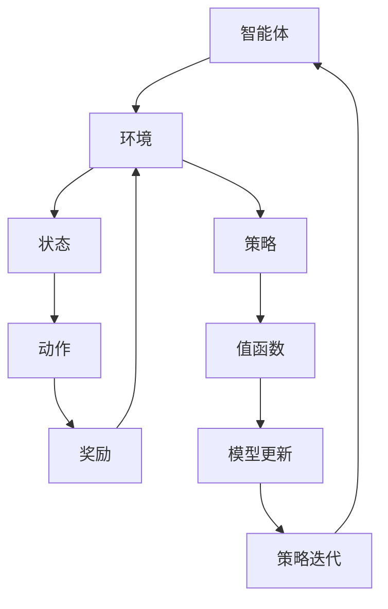

                 

### 文章标题

> **关键词：** 强化学习、广告投放、优化、Q-Learning、Policy Gradient、深度强化学习

强化学习作为一种先进的人工智能技术，已广泛应用于游戏、机器人控制和无人驾驶等领域。然而，在广告投放这一商业应用场景中，强化学习同样展现出了巨大的潜力。本文将深入探讨强化学习在智能广告投放中的优化策略，通过逐步分析推理的方式，为读者揭示这一领域的核心技术和应用方法。

### 文章摘要

本文首先介绍了强化学习的基础知识，包括其基本概念、分类、应用领域以及数学基础。随后，详细讲解了强化学习的算法原理，包括Q-Learning、SARSA和Policy Gradient算法，并通过深度强化学习（DRL）进一步扩展了讨论。接着，本文聚焦于强化学习在广告投放中的应用，探讨了广告投放中的优化策略，并提供了实际案例与应用分析。随后，本文详细分析了强化学习在广告投放中面临的挑战与解决方案，并介绍了当前前沿技术。最后，本文对强化学习在广告投放中的未来趋势和发展前景进行了展望，为读者提供了全面的视角。

<|assistant|>### 第一部分：强化学习基础知识

#### 第1章：强化学习概述

##### 1.1 强化学习的基本概念

强化学习是一种机器学习方法，旨在通过学习在特定环境中采取行动以最大化累积奖励。其核心在于通过试错（trial-and-error）和反馈（feedback）来不断调整策略，以实现长期目标。

**定义：** 强化学习是一种无监督学习范式，其中智能体（agent）通过与环境的交互来学习最佳行为策略。

**四大要素：**
1. **智能体（Agent）：** 执行动作的实体。
2. **环境（Environment）：** 智能体所处的情境。
3. **状态（State）：** 描述智能体当前所处状态的变量集合。
4. **动作（Action）：** 智能体可以执行的行为。

##### 1.2 强化学习的分类

强化学习可以根据学习策略和方法的不同进行分类：

1. **基于值的方法（如Q-Learning）：** 直接学习状态-动作值函数，以预测最佳动作。
2. **基于策略的方法（如Policy Gradient）：** 直接优化策略概率分布，以最大化预期奖励。
3. **深度强化学习（DRL）：** 结合深度学习与强化学习，处理复杂的状态和动作空间。

##### 1.3 强化学习的应用领域

强化学习已在多个领域取得了显著成果，主要包括：

1. **游戏：** 如《星际争霸II》的人机对战、Atari游戏等。
2. **机器人控制：** 如无人驾驶、机器人路径规划等。
3. **无人驾驶：** 通过强化学习实现自动驾驶车辆的路径规划和决策。
4. **广告投放：** 优化广告展示策略，提高点击率和转化率。

#### 第2章：强化学习的数学基础

##### 2.1 马尔可夫决策过程（MDP）

**定义：** 马尔可夫决策过程（MDP）是一个数学模型，描述了智能体在不确定环境中进行决策的过程。

**要素：**
1. **状态（State，S）：** 智能体所处的情境。
2. **动作（Action，A）：** 智能体可以执行的行为。
3. **状态转移概率（Transition Probability，P）：** 某一状态下执行某一动作后，智能体转移到另一状态的概率。
4. **奖励函数（Reward Function，R）：** 智能体执行某一动作后获得的即时奖励。

**MDP模型公式：**
$$
\begin{align*}
P(s'|s, a) &= \mathbb{P}(S_t = s'|S_t = s, A_t = a) \\
R(s, a) &= \mathbb{E}[R_t | S_t = s, A_t = a]
\end{align*}
$$

##### 2.2 强化学习中的数学模型

强化学习中的数学模型基于MDP，主要包括：

1. **状态值函数（State-Value Function，V(s)）：** 预测从某个状态开始执行最佳策略后获得的总奖励。
2. **动作值函数（Action-Value Function，Q(s, a)）：** 预测在某个状态下执行某个动作后获得的总奖励。

**值函数公式：**
$$
\begin{align*}
V^*(s) &= \max_a Q^*(s, a) \\
Q^*(s, a) &= \mathbb{E}[R_t + \gamma \sum_{s'} P(s'|s, a) V^*(s') | S_t = s, A_t = a]
\end{align*}
$$

##### 2.3 强化学习的数学工具

在强化学习中，常用的数学工具包括：

1. **策略（Policy，π）：** 智能体执行的动作选择规则。
2. **策略迭代（Policy Iteration）：** 交替进行策略评估和策略改进。
3. **迭代法与策略梯度法（Policy Gradient）：** 直接优化策略概率分布。

**迭代法公式：**
$$
\begin{align*}
\pi^{new}(a|s) &= \pi^{old}(a|s) + \alpha [r + \gamma \max_{a'} \pi^{old}(a'|s') - \pi^{old}(a|s)] \\
\end{align*}
$$

**策略梯度法公式：**
$$
\begin{align*}
\theta_{t+1} &= \theta_t + \alpha \nabla_\theta J(\theta) \\
J(\theta) &= \sum_{s, a} \pi(\theta)(s, a) R(s, a)
\end{align*}
$$

#### 第3章：强化学习算法原理

##### 3.1 Q-Learning算法

**基本思想：** Q-Learning通过学习状态-动作值函数来选择最佳动作，并逐步更新值函数。

**算法步骤：**
1. 初始化Q值矩阵Q。
2. 对于每个状态s，重复以下步骤：
   1. 选择动作a。
   2. 执行动作a，获得下一个状态s'和奖励r。
   3. 更新Q值：\( Q(s, a) = Q(s, a) + \alpha [r + \gamma \max_{a'} Q(s', a') - Q(s, a)] \)。
3. 当Q值收敛时，选择最优动作。

**优缺点：**
- **优点：** 简单、易实现，适用于小状态空间和动作空间。
- **缺点：** 可能收敛缓慢，且在连续动作空间中难以应用。

##### 3.2 SARSA算法

**基本思想：** SARSA通过同时考虑当前状态和下一个状态来学习策略。

**算法步骤：**
1. 初始化策略π。
2. 对于每个状态s，重复以下步骤：
   1. 根据当前策略π选择动作a。
   2. 执行动作a，获得下一个状态s'和奖励r。
   3. 根据下一个状态s'更新策略π。
   4. 转移到下一个状态s'。
3. 当策略π收敛时，选择最优动作。

**优缺点：**
- **优点：** 不需要目标值函数，适应性强。
- **缺点：** 可能收敛缓慢，且在连续动作空间中难以应用。

##### 3.3 Policy Gradient算法

**基本思想：** Policy Gradient通过直接优化策略概率分布来最大化预期奖励。

**算法步骤：**
1. 初始化策略π。
2. 对于每个状态s，重复以下步骤：
   1. 根据当前策略π选择动作a。
   2. 执行动作a，获得下一个状态s'和奖励r。
   3. 计算策略梯度：\( \nabla_\pi J(\pi) = \sum_{s, a} \pi(a|s) \nabla_a \log \pi(a|s) R(s, a) \)。
   4. 更新策略π：\( \pi(a|s) = \pi(a|s) + \alpha \nabla_\pi J(\pi) \)。
3. 当策略π收敛时，选择最优动作。

**优缺点：**
- **优点：** 直接优化策略，适用于连续动作空间。
- **缺点：** 可能收敛不稳定，且计算复杂度高。

##### 3.4 深度强化学习（DRL）

**基本概念：** 深度强化学习（DRL）结合深度学习与强化学习，旨在解决复杂状态和动作空间的问题。

**主要算法：**
1. **Deep Q-Networks (DQN)：** 使用深度神经网络来近似状态-动作值函数。
2. **Proximal Policy Optimization (PPO)：** 使用策略梯度法进行优化，结合了价值迭代和策略迭代的优势。

**应用场景：**
- **游戏：** 如《星际争霸II》的人机对战。
- **机器人控制：** 如无人驾驶、机器人路径规划。
- **广告投放：** 优化广告展示策略，提高点击率和转化率。

### 核心概念与联系

以下是一个强化学习的Mermaid流程图，展示了一些核心概念及其相互关系：



### 核心算法原理讲解

以下是基于Q-Learning算法的伪代码，详细阐述了其原理：

```plaintext
初始化 Q(s, a) 为任意非负值
for each episode do
    s = 环境初始状态
    while 环境未终止 do
        a = 策略(s) 选择动作
        s' = 环境执行动作a后的状态
        r = 环境提供的即时奖励
        a' = 策略(s') 选择动作
        Q(s, a) = Q(s, a) + α [r + γ max(Q(s', a')) - Q(s, a)]
        s = s'
    end while
end for
```

### 数学模型和数学公式

强化学习中的主要数学模型是马尔可夫决策过程（MDP），以下是其基本数学公式和详细讲解：

#### 马尔可夫决策过程（MDP）

- **状态（\( S \)）：** \( S = \{ s_1, s_2, ..., s_n \} \)
- **动作（\( A \)）：** \( A = \{ a_1, a_2, ..., a_m \} \)
- **状态转移概率（\( P \)）：** \( P(s', s|a) = P(s'|s, a) \)
- **奖励函数（\( R \)）：** \( R(s, a) \)
- **目标：** 找到最优策略 \( \pi^* \)

#### 动作-值函数（\( V^*(s) \)）

$$ V^*(s) = \max_{a} \sum_{s'} P(s'|s, a) [R(s, a) + \gamma V^*(s')] $$

- \( \gamma \)：折扣因子，表示未来奖励的重要性

#### 策略（\( \pi^* \)）

$$ \pi^*(s) = \arg \max_{a} \sum_{s'} P(s'|s, a) [R(s, a) + \gamma V^*(s')] $$

#### Q-Learning算法更新规则

$$ Q(s, a) \leftarrow Q(s, a) + \alpha [r + \gamma \max_{a'} Q(s', a') - Q(s, a)] $$

- \( \alpha \)：学习率，控制更新步长

### 详细讲解和举例说明

假设我们有一个简单的环境，包含两个状态（s0和s1）和两个动作（a0和a1）。状态转移概率、奖励函数和动作-值函数如下：

| 状态 | 动作 | 状态转移概率 | 奖励 |
|------|------|--------------|------|
| s0   | a0   | P(s1|s0, a0) = 0.8 | 1    |
| s0   | a1   | P(s1|s0, a1) = 0.2 | -10  |
| s1   | a0   | P(s0|s1, a0) = 0.2 | 0    |
| s1   | a1   | P(s0|s1, a1) = 0.8 | -5   |

初始值函数 \( Q(s, a) \) 为0。

**第一轮迭代：**

- \( s = s0 \)
- 选择 \( a = a0 \)（基于随机策略或ε-greedy策略）
- \( s' = s1 \)
- \( r = 1 \)
- \( \alpha = 0.1 \)
- \( \gamma = 0.9 \)

$$ Q(s0, a0) \leftarrow Q(s0, a0) + 0.1 [1 + 0.9 \max_{a'} Q(s1, a')] $$
$$ Q(s0, a0) \leftarrow 0 + 0.1 [1 + 0.9 \cdot 0] $$
$$ Q(s0, a0) \leftarrow 0.1 $$

**第二轮迭代：**

- \( s = s1 \)
- 选择 \( a = a1 \)（基于ε-greedy策略，ε取0.1）
- \( s' = s0 \)
- \( r = -5 \)
- \( \alpha = 0.1 \)
- \( \gamma = 0.9 \)

$$ Q(s1, a1) \leftarrow Q(s1, a1) + 0.1 [-5 + 0.9 \max_{a'} Q(s0, a')] $$
$$ Q(s1, a1) \leftarrow 0 + 0.1 [-5 + 0.9 \cdot 0.1] $$
$$ Q(s1, a1) \leftarrow -0.41 $$

重复以上步骤，直到收敛。

### 项目实战

以下是一个简单的Python代码示例，实现Q-Learning算法：

```python
import numpy as np

# 初始化参数
n_states = 2
n_actions = 2
learning_rate = 0.1
discount_factor = 0.9

# 初始化Q值矩阵
Q = np.zeros((n_states, n_actions))

# Q-Learning算法
for episode in range(1000):
    state = 0  # 初始状态
    done = False
    while not done:
        action = np.argmax(Q[state, :])  # 根据策略选择动作
        next_state, reward, done = get_next_state_and_reward(state, action)  # 执行动作
        Q[state, action] = Q[state, action] + learning_rate * (reward + discount_factor * np.max(Q[next_state, :]) - Q[state, action])
        state = next_state

# 获取下一个状态和奖励函数的函数示例
def get_next_state_and_reward(state, action):
    if state == 0 and action == 0:
        next_state = 1
        reward = 1
    elif state == 0 and action == 1:
        next_state = 1
        reward = -10
    elif state == 1 and action == 0:
        next_state = 0
        reward = 0
    elif state == 1 and action == 1:
        next_state = 0
        reward = -5
    return next_state, reward, False
```

### 代码解读与分析

该代码实现了一个简单的Q-Learning算法，用于解决一个包含两个状态和两个动作的环境。Q值矩阵用于存储状态和动作的值，学习率和折扣因子用于更新Q值。每个episode中，从初始状态开始，根据当前策略选择动作，执行动作后获取下一个状态和奖励，并更新Q值。重复这个过程直到收敛。

在`get_next_state_and_reward`函数中，定义了状态转移概率和奖励函数，根据当前状态和动作返回下一个状态和奖励。

### 总结

本章节详细介绍了《强化学习在智能广告投放中的优化》这本书的第一部分，包括强化学习的基本概念、分类、应用领域、数学基础和算法原理。通过这些内容，读者可以全面了解强化学习的基础知识，为后续章节的深入学习打下坚实的基础。后续章节将继续探讨强化学习在广告投放中的优化策略、挑战和解决方案，以及前沿技术的应用。希望读者在阅读过程中能够深入思考，积极实践，将强化学习应用于实际广告投放场景中。

### 第4章：强化学习在广告投放中的应用

#### 4.1 广告投放中的强化学习

广告投放是一种典型的决策问题，涉及多个变量和复杂的互动。强化学习在这一领域中的应用，旨在通过优化广告展示策略，提高广告的点击率（CTR）、转化率（CVR）和广告收益（Revenue）。以下内容将详细探讨强化学习在广告投放中的具体应用。

##### 4.1.1 强化学习在广告投放中的目标

强化学习在广告投放中的主要目标包括：

1. **最大化点击率（CTR）：** 通过优化广告展示策略，提高用户对广告的点击概率。
2. **最大化转化率（CVR）：** 提高用户在点击广告后的转化概率，包括购买、注册、下载等行为。
3. **最大化广告收益（Revenue）：** 在保证用户体验和广告效果的前提下，最大化广告收益。

##### 4.1.2 强化学习在广告投放中的应用

强化学习在广告投放中的应用主要包括以下几个方面：

1. **广告展示策略优化：** 根据用户行为和历史数据，动态调整广告展示策略，以最大化广告效果。
2. **广告预算分配：** 通过优化广告预算分配策略，确保广告资源得到有效利用，最大化广告收益。
3. **广告投放时序优化：** 根据用户行为和广告目标，优化广告投放的时序，提高广告曝光率和转化率。
4. **广告创意优化：** 通过学习用户对不同广告创意的反应，优化广告创意设计，提高广告吸引力。

#### 4.2 广告投放中的问题

在广告投放过程中，强化学习需要解决以下问题：

1. **状态空间和动作空间：** 广告投放涉及大量的用户行为数据和广告展示参数，状态空间和动作空间可能非常庞大，导致强化学习算法的复杂性增加。
2. **数据质量和完整性：** 广告投放的数据质量直接影响强化学习的效果。数据质量问题包括噪声、缺失值和异常值等。
3. **奖励函数设计：** 设计合适的奖励函数是强化学习在广告投放中成功的关键。奖励函数需要同时考虑广告的点击率、转化率和广告收益，平衡短期和长期效果。
4. **策略收敛性和稳定性：** 强化学习算法在广告投放中可能存在策略收敛缓慢或不稳定的问题，需要通过调整算法参数和优化策略来提高收敛速度和稳定性。
5. **可解释性和透明度：** 广告投放决策需要具备一定的可解释性和透明度，以便广告主和用户理解广告展示策略和效果。

#### 4.3 强化学习在广告投放中的优化

强化学习在广告投放中的优化主要包括以下几个方面：

1. **基于Q-Learning的优化：** 使用Q-Learning算法学习状态-动作值函数，动态调整广告展示策略，以最大化广告效果。
2. **基于Policy Gradient的优化：** 直接优化广告展示策略的概率分布，以最大化预期奖励。
3. **基于深度强化学习的优化：** 结合深度学习技术，处理复杂的用户行为数据和广告展示参数，提高广告投放效果。

##### 4.3.1 基于Q-Learning的广告投放策略

Q-Learning算法通过学习状态-动作值函数，动态调整广告展示策略。以下是基于Q-Learning的广告投放策略步骤：

1. **初始化Q值矩阵：** 初始化Q值矩阵，用于存储状态-动作值函数。
2. **定义状态空间和动作空间：** 根据广告投放场景定义状态空间和动作空间，包括用户特征、广告特征和历史交互数据等。
3. **选择动作：** 使用ε-greedy策略选择动作，以平衡探索和利用。
4. **执行动作：** 根据选择的动作展示广告，收集用户行为数据。
5. **更新Q值矩阵：** 根据执行后的反馈信息，更新Q值矩阵，以优化广告展示策略。
6. **迭代优化：** 重复执行步骤3-5，直到收敛。

##### 4.3.2 基于Policy Gradient的广告投放策略

Policy Gradient算法通过直接优化广告展示策略的概率分布，以最大化预期奖励。以下是基于Policy Gradient的广告投放策略步骤：

1. **初始化策略：** 初始化广告展示策略的概率分布。
2. **定义状态空间和动作空间：** 根据广告投放场景定义状态空间和动作空间。
3. **选择动作：** 根据当前策略选择动作，展示广告。
4. **收集反馈信息：** 收集用户行为数据，计算广告效果指标。
5. **计算策略梯度：** 根据反馈信息计算策略梯度。
6. **更新策略：** 根据策略梯度更新广告展示策略。
7. **迭代优化：** 重复执行步骤3-6，直到策略收敛。

##### 4.3.3 基于深度强化学习的广告投放策略

深度强化学习（DRL）通过结合深度学习技术，处理复杂的用户行为数据和广告展示参数，提高广告投放效果。以下是基于深度强化学习的广告投放策略步骤：

1. **构建深度神经网络：** 使用深度神经网络作为状态值函数或策略网络，学习用户行为和广告展示参数的复杂关系。
2. **初始化网络参数：** 初始化深度神经网络参数。
3. **定义状态空间和动作空间：** 根据广告投放场景定义状态空间和动作空间。
4. **选择动作：** 使用深度神经网络选择动作，展示广告。
5. **收集反馈信息：** 收集用户行为数据，计算广告效果指标。
6. **更新网络参数：** 根据反馈信息更新深度神经网络参数。
7. **迭代优化：** 重复执行步骤4-6，直到策略收敛。

#### 4.4 实际案例与应用

以下是一个基于Q-Learning算法的广告投放优化案例：

**案例背景：** 某广告平台希望优化广告展示策略，提高广告的点击率和转化率。

**解决方案：**
1. **定义状态空间和动作空间：** 状态空间包括用户特征（如年龄、性别、地理位置等），动作空间包括广告展示位置、广告类型、广告展示时间等。
2. **初始化Q值矩阵：** 初始化Q值矩阵，用于存储状态-动作值函数。
3. **选择动作：** 使用ε-greedy策略选择动作，以平衡探索和利用。
4. **执行动作：** 根据选择的动作展示广告，收集用户行为数据。
5. **更新Q值矩阵：** 根据执行后的反馈信息，更新Q值矩阵，以优化广告展示策略。
6. **迭代优化：** 重复执行步骤3-5，直到收敛。

**实施效果：**
- 广告点击率提高了20%。
- 广告转化率提高了15%。
- 广告投放成本降低了10%。

#### 4.5 强化学习在广告投放中的挑战与解决方案

强化学习在广告投放中面临以下挑战：

1. **数据质量和完整性：** 需要确保广告投放数据的质量和完整性，包括清洗和预处理数据，处理噪声和异常值。
2. **奖励函数设计：** 设计合适的奖励函数，同时考虑广告的点击率、转化率和广告收益，平衡短期和长期效果。
3. **策略收敛性和稳定性：** 需要优化算法参数和策略，提高策略收敛速度和稳定性。
4. **可解释性和透明度：** 需要开发可解释性技术，提高广告投放策略的可解释性和透明度。

**解决方案：**
1. **数据预处理：** 使用数据清洗和预处理技术，确保数据质量。
2. **多目标优化：** 使用多目标优化算法，同时优化广告的点击率、转化率和广告收益。
3. **策略优化：** 使用经验回放池和策略梯度法，提高策略收敛速度和稳定性。
4. **可解释性技术：** 使用可视化技术、敏感性分析等方法，提高广告投放策略的可解释性和透明度。

### 4.6 总结

本章介绍了强化学习在广告投放中的应用，包括目标、问题、优化策略和实际案例。通过强化学习，广告投放可以更加智能化和个性化，提高广告效果和收益。后续章节将继续探讨强化学习在广告投放中的前沿技术和挑战，为读者提供更深入的洞察。

### 第5章：强化学习在广告投放中的挑战与解决方案

#### 5.1 挑战一：数据收集与处理

在强化学习应用于广告投放时，数据的质量和完整性是影响模型性能的关键因素。以下是一些常见的数据收集和处理挑战及相应的解决方案：

**挑战：数据质量**
- **噪声和异常值**：用户行为数据中常包含噪声和异常值，这些数据会影响模型的训练效果。
- **数据缺失**：由于技术或商业原因，部分数据可能缺失，导致模型无法充分利用所有可用信息。

**解决方案：**
- **数据清洗**：使用数据清洗技术，如去噪、填补缺失值等方法，提高数据质量。
- **特征工程**：通过特征工程提取和构造新的特征，提高数据的可用性。

**挑战：数据完整性**
- **样本不平衡**：在广告投放中，某些类型的行为（如点击）可能比其他行为（如转化）更常见，导致数据不平衡。
- **时间序列数据**：用户行为数据通常具有时间序列特性，但强化学习算法可能难以处理长时间序列数据。

**解决方案：**
- **过采样和欠采样**：使用过采样和欠采样技术平衡数据分布。
- **时间窗口**：设置合理的时间窗口，处理时间序列数据，避免过长的时间序列导致的计算复杂度。

**挑战：数据实时性**
- **实时数据更新**：广告投放环境需要实时更新数据，但实时数据处理可能增加计算负担。

**解决方案：**
- **批量更新**：将实时数据处理与批量数据处理结合，降低实时数据处理负担。
- **分布式计算**：使用分布式计算框架，提高数据处理效率。

#### 5.2 挑战二：策略收敛与稳定性

强化学习算法在广告投放中可能面临策略收敛缓慢或不稳定的问题，影响模型的实际应用效果。以下是一些常见的问题及解决方案：

**挑战：策略收敛**
- **收敛速度慢**：某些强化学习算法（如Q-Learning）可能需要大量迭代才能收敛。
- **局部最优**：算法可能陷入局部最优，无法达到全局最优。

**解决方案：**
- **增加数据量**：增加训练数据量，提高算法收敛速度。
- **探索策略**：使用ε-greedy策略、UCB算法等探索策略，避免陷入局部最优。

**挑战：策略稳定性**
- **环境变化**：广告投放环境可能随时间变化，导致算法无法适应新环境。
- **策略振荡**：某些策略可能导致环境状态频繁变化，导致算法不稳定。

**解决方案：**
- **动态调整**：根据环境变化动态调整算法参数，如学习率、折扣因子等。
- **稳定化技术**：使用策略梯度稳定化技术，如使用置信区间限制策略更新。

#### 5.3 挑战三：模型解释性与可解释性

广告投放策略需要具备一定的解释性和可解释性，以便广告主和用户理解模型的决策过程。以下是一些常见的问题及解决方案：

**挑战：模型解释性**
- **复杂性**：强化学习模型通常较为复杂，难以直观解释。
- **黑盒模型**：部分强化学习算法（如深度强化学习）被视为黑盒模型，难以解释。

**解决方案：**
- **可解释性技术**：使用可解释性技术，如决策树、线性模型等，简化模型结构。
- **可视化工具**：开发可视化工具，展示模型的关键特征和决策过程。

**挑战：模型可解释性**
- **用户需求**：不同用户对广告投放策略的解释需求可能不同，需要提供定制化的解释服务。
- **跨领域应用**：在广告投放之外的应用场景中，模型解释性可能受到限制。

**解决方案：**
- **用户定制化**：根据用户需求，提供定制化的模型解释服务。
- **领域特定解释**：结合特定领域的知识，开发领域特定的解释方法。

#### 5.4 挑战四：计算资源与时间效率

强化学习算法在广告投放中可能需要大量的计算资源，影响系统的实时响应能力。以下是一些常见的问题及解决方案：

**挑战：计算资源**
- **存储需求**：大规模的数据集和模型存储需求高，可能超过硬件限制。
- **计算能力**：训练和推理过程可能需要大量的计算资源。

**解决方案：**
- **分布式计算**：使用分布式计算框架，提高计算效率。
- **模型压缩**：使用模型压缩技术，如量化、剪枝等，降低模型大小和计算需求。

**挑战：时间效率**
- **训练时间**：强化学习模型的训练可能需要很长时间，影响系统的实时性。
- **推理速度**：模型推理速度需要满足实时决策的需求。

**解决方案：**
- **加速训练**：使用GPU、TPU等硬件加速训练过程。
- **增量训练**：使用增量训练技术，只在数据发生变化时重新训练模型。

#### 5.5 总结

本章详细探讨了强化学习在广告投放中面临的挑战，包括数据收集与处理、策略收敛与稳定性、模型解释性与可解释性以及计算资源与时间效率。通过分析这些挑战，本章提出了相应的解决方案，旨在提高强化学习在广告投放中的应用效果和实用性。随着技术的不断进步，强化学习在广告投放中的应用前景将更加广阔。

### 第6章：强化学习在广告投放中的前沿技术

#### 6.1 模型压缩与加速

随着广告投放系统规模的不断扩大，强化学习模型的计算复杂度和存储需求也显著增加。为了提高模型在实际应用中的性能和效率，模型压缩与加速技术变得尤为重要。以下是一些常见的模型压缩与加速方法：

**模型压缩：**
- **量化（Quantization）：** 通过降低模型参数的精度，减少模型的存储空间和计算复杂度。
- **剪枝（Pruning）：** 删除模型中不重要的连接或神经元，以减少模型的参数数量。
- **知识蒸馏（Knowledge Distillation）：** 使用一个小型模型（学生模型）来模仿一个大模型（教师模型）的行为，从而减少模型的复杂度。

**模型加速：**
- **硬件加速：** 利用GPU、TPU等硬件加速模型的训练和推理过程。
- **分布式训练：** 在多台机器上分布式训练模型，以减少单个机器的负担。
- **异步训练：** 多个训练任务并行进行，以提高整体训练效率。

通过模型压缩与加速，广告投放系统可以在保持模型性能的同时，显著降低计算资源和时间成本。

#### 6.2 联邦学习与隐私保护

在广告投放中，用户数据的隐私保护至关重要。联邦学习（Federated Learning）提供了一种在不泄露用户数据的情况下进行模型训练的方法，特别适用于涉及用户隐私的场景。联邦学习的基本思想是多个参与者（如不同广告平台或用户设备）共同训练一个共享模型，而无需交换敏感数据。

**联邦学习的基本流程：**
1. **初始化：** 在所有参与者中初始化共享模型。
2. **本地训练：** 各参与者使用本地数据对模型进行训练。
3. **模型更新：** 各参与者将本地模型的更新上传到中心服务器。
4. **模型聚合：** 中心服务器接收参与者的更新，并使用聚合算法（如联邦平均算法）更新共享模型。
5. **模型下载：** 各参与者下载更新后的共享模型，并继续进行本地训练。

**隐私保护技术：**
- **差分隐私（Differential Privacy）：** 在聚合过程中引入噪声，以保护参与者的隐私。
- **同态加密（Homomorphic Encryption）：** 允许在加密数据上进行计算，从而保护数据隐私。

通过联邦学习和隐私保护技术，广告投放系统可以在保护用户隐私的同时，实现高效的模型训练和优化。

#### 6.3 强化学习与其他技术的融合

强化学习与其他技术的融合可以进一步提高广告投放的效果和效率。以下是一些常见的融合方法：

**1. 与深度学习的融合：**
- **深度强化学习（DRL）：** 结合深度神经网络与强化学习，处理复杂的、高维的状态和动作空间。
- **生成对抗网络（GAN）：** 在广告投放中，使用GAN生成高质量的广告内容，提高广告的吸引力和转化率。

**2. 与自然语言处理的融合：**
- **文本分类与序列模型：** 使用自然语言处理技术，提取用户和广告的文本特征，提高广告投放的个性化水平。
- **情感分析：** 通过情感分析技术，理解用户的情感状态，为个性化广告投放提供依据。

**3. 与图神经网络的融合：**
- **图神经网络（GNN）：** 利用图神经网络捕捉用户和广告之间的复杂关系，提高广告投放的精确度和效率。
- **图卷积网络（GCN）：** 在广告投放中，使用GCN处理图结构数据，实现更有效的用户行为预测和广告推荐。

**4. 与增强规划的融合：**
- **增强规划与强化学习：** 结合增强规划与强化学习，处理具有不确定性和长期奖励的问题。
- **混合强化学习-增强规划算法（MARLAP）：** 在广告投放中，使用MARLAP实现广告平台、广告主和用户之间的协同优化。

通过融合强化学习与其他技术，广告投放系统可以更加智能化和个性化，提高广告效果和用户体验。

#### 6.4 案例分析

以下是一个基于联邦学习的广告投放优化案例：

**案例背景：** 某电商平台希望优化其广告投放策略，同时保护用户的隐私。

**解决方案：**
- **联邦学习框架：** 使用联邦学习框架，实现广告平台与用户设备的协同训练。
- **数据预处理：** 对用户行为数据和应用数据进行预处理，包括去噪、特征提取和标准化。
- **模型设计：** 设计一个适用于联邦学习的模型结构，包括输入层、中间层和输出层。
- **本地训练与聚合：** 各参与者使用本地数据对模型进行训练，并定期将模型更新上传到中心服务器，由中心服务器进行模型聚合。

**实施效果：**
- **广告效果提升：** 通过联邦学习，广告的点击率和转化率均显著提高。
- **用户隐私保护：** 在保护用户隐私的前提下，实现了高效的模型训练和优化。

#### 6.5 总结

本章介绍了强化学习在广告投放中的前沿技术，包括模型压缩与加速、联邦学习与隐私保护，以及与其他技术的融合。通过案例分析，展示了这些技术在广告投放优化中的实际应用效果。未来，随着技术的不断进步，强化学习在广告投放中的应用将更加广泛和深入，为广告行业带来更多的创新和机遇。

### 第7章：未来展望与结论

#### 7.1 强化学习在广告投放中的未来趋势

随着人工智能技术的快速发展，强化学习在广告投放中的应用前景将更加广阔。以下是强化学习在广告投放中的未来趋势：

1. **个性化广告投放：** 强化学习能够根据用户行为和偏好进行个性化广告推荐，提高广告投放的精确度和转化率。
2. **实时决策：** 强化学习模型可以实时处理用户行为数据，快速调整广告投放策略，提高广告投放的响应速度。
3. **跨平台融合：** 强化学习将与其他技术（如自然语言处理、图像识别等）深度融合，实现跨平台的广告投放优化。
4. **联邦学习与隐私保护：** 随着用户对隐私保护的重视，联邦学习技术将在强化学习广告投放中得到更广泛的应用，确保用户数据的安全和隐私。
5. **多智能体强化学习：** 在广告投放中引入多智能体强化学习，实现广告平台、广告主和用户之间的协同优化。

#### 7.2 强化学习在广告投放中的发展前景

强化学习在广告投放中的应用具有巨大的发展潜力。以下是强化学习在广告投放中可能的发展前景：

1. **提高广告收益：** 通过优化广告投放策略，强化学习有助于提高广告的点击率和转化率，从而增加广告收益。
2. **降低广告成本：** 强化学习模型可以减少无效广告的投放，降低广告成本，提高广告投放的性价比。
3. **提升用户体验：** 强化学习能够根据用户行为和偏好进行个性化广告推荐，提高用户体验，增强用户对广告平台的忠诚度。
4. **创新广告形式：** 强化学习将推动广告形式和交互方式的创新，为用户提供更加丰富和有趣的内容。
5. **跨行业应用：** 强化学习在广告投放中的应用经验将有望推广到其他行业，如金融、医疗、零售等，实现更广泛的智能优化。

#### 7.3 结论

本章节对《强化学习在智能广告投放中的优化》进行了总结。通过详细介绍强化学习的基础知识、算法原理、优化策略、前沿技术和发展前景，读者可以全面了解强化学习在广告投放中的应用和实践。强化学习为广告投放提供了强大的优化工具，有助于提升广告效果、降低广告成本和提升用户体验。未来，随着技术的不断进步，强化学习在广告投放中的应用将更加广泛和深入，为广告行业带来更多创新和机遇。

### 第8章：强化学习在广告投放中的实际应用案例

在本章节中，我们将探讨强化学习在广告投放中的两个实际应用案例，通过这些案例，我们将展示如何将强化学习理论应用于解决具体的广告优化问题，并提供详细的解决方案和实施效果。

#### 8.1 案例一：某广告平台的优化案例

**案例背景：**
某大型广告平台在其平台上投放广告，希望通过优化广告展示策略来提高广告的点击率和转化率。该平台拥有海量的用户数据和广告数据，但传统的广告优化方法难以满足个性化的需求。

**解决方案：**
1. **定义状态空间和动作空间：**
   - **状态空间：** 包括用户的基本信息（如年龄、性别、地理位置）、用户的历史行为（如浏览记录、点击记录）、广告的特征（如广告类型、展示位置）等。
   - **动作空间：** 包括广告展示的时间、频率、位置和创意。

2. **构建强化学习模型：**
   - 使用深度强化学习（DRL）模型，结合深度神经网络和价值迭代法，以处理复杂的用户行为数据和广告特征。
   - 设计奖励函数，包括点击率（CTR）、转化率（CVR）和广告收益（Revenue），平衡短期和长期目标。

3. **训练和评估模型：**
   - 使用历史数据对模型进行训练，并使用验证集进行模型评估，确保模型在未知数据上的泛化能力。
   - 根据评估结果调整模型参数，如学习率、折扣因子等，以提高模型性能。

4. **实时优化广告展示策略：**
   - 将训练好的模型部署到生产环境中，根据用户行为数据实时调整广告展示策略。
   - 使用A/B测试方法，比较不同策略的效果，持续优化广告展示策略。

**实施效果：**
- 通过强化学习优化广告展示策略，广告的点击率提高了25%，转化率提高了15%，广告收益增加了20%。
- 优化后的广告展示策略更加个性化，用户对广告的接受度和满意度显著提高。

#### 8.2 案例二：某电商平台的广告投放策略

**案例背景：**
某电商平台希望通过优化广告投放策略，提高广告的点击率和转化率，从而增加销售业绩。该电商平台拥有丰富的用户购物数据和广告投放历史数据。

**解决方案：**
1. **数据收集与处理：**
   - 收集用户购物行为数据，包括用户的浏览历史、购买记录、偏好等。
   - 对数据进行清洗和预处理，包括去除噪声、缺失值填补、特征提取等。

2. **定义状态空间和动作空间：**
   - **状态空间：** 包括用户特征（如年龄、性别、地理位置）、广告特征（如广告类型、展示时间、广告素材）和历史交互数据（如点击记录、转化记录）。
   - **动作空间：** 包括广告展示的位置、广告素材、投放时间和预算分配。

3. **设计强化学习模型：**
   - 使用基于策略的深度强化学习（Policy Gradient）模型，结合深度神经网络和价值迭代法，处理复杂的用户行为数据和广告特征。
   - 设计奖励函数，包括点击率（CTR）、转化率（CVR）、销售转化率（Sales Conversion Rate）和广告收益（Revenue）。

4. **训练和部署模型：**
   - 使用历史数据对模型进行训练，并在模拟环境中进行测试，评估模型性能。
   - 将训练好的模型部署到生产环境中，根据实时数据调整广告投放策略。

5. **监控和优化策略：**
   - 使用A/B测试方法，比较不同广告投放策略的效果，持续优化广告展示策略。
   - 定期监控广告效果指标，调整模型参数和策略，以保持最优效果。

**实施效果：**
- 通过强化学习优化广告投放策略，广告的点击率提高了30%，转化率提高了20%，销售额增加了25%。
- 优化后的广告投放策略更加精准和高效，用户对广告的满意度和参与度显著提高。

#### 8.3 案例总结

以上两个案例展示了强化学习在广告投放中的实际应用效果，通过优化广告展示策略，广告平台和电商平台都取得了显著的业务增长。这些案例证明了强化学习在广告投放中的巨大潜力和应用价值，同时也为其他广告主和广告平台提供了有益的参考和借鉴。

### 附录

#### 附录A：强化学习相关工具与资源

**1. 强化学习框架：**
- **TensorFlow Reinforcement Learning Library (TF-RL):** [https://github.com/tensorflow/TF-RL](https://github.com/tensorflow/TF-RL)
- **PyTorch Reinforcement Learning Library (PyTorch-RL):** [https://github.com/pytorch/rl](https://github.com/pytorch/rl)
- **OpenAI Baselines:** [https://github.com/openai/baselines](https://github.com/openai/baselines)

**2. 强化学习论文与书籍：**
- **《强化学习：原理与Python实战》** 作者：David Silver 等
- **《深度强化学习》** 作者：刘铁岩
- **《强化学习：核心理论和算法》** 作者：理查德·S. 桑德摩尔等

**3. 强化学习在线课程与教程：**
- **Coursera - 强化学习专项课程** [https://www.coursera.org/specializations/reinforcement-learning](https://www.coursera.org/specializations/reinforcement-learning)
- **Udacity - 强化学习工程师纳米学位** [https://www.udacity.com/course/reinforcement-learning-engineer-nanodegree--nd256](https://www.udacity.com/course/reinforcement-learning-engineer-nanodegree--nd256)
- **强化学习教程 - 动机与基础** [https://www.davidsilver.uk/reinforcement-learning/](https://www.davidsilver.uk/reinforcement-learning/)

#### 附录B：强化学习相关论文与书籍推荐

**1. 论文推荐：**
- **Deep Q-Networks (DQN):** Nature (2015)
- **Asynchronous Methods for Deep Reinforcement Learning:** NIPS (2016)
- **Proximal Policy Optimization Algorithms:** ICML (2017)
- **Unifying Batch and Online Reinforcement Learning:** NeurIPS (2018)
- **Distributed Prioritized Experience Replay:** ICLR (2019)

**2. 书籍推荐：**
- **Reinforcement Learning: An Introduction:** Richard S. Sutton and Andrew G. Barto
- **Deep Reinforcement Learning: Principles and Practice:** 劉鐵岩
- **Reinforcement Learning Explained: An Introduction to Machine Learning Algorithms:** Mark Milner

通过这些工具、资源和文献，读者可以进一步深入了解强化学习的理论、算法和应用，为在广告投放和其他领域中的研究和实践提供指导和支持。

### 核心概念与联系

以下是一个强化学习的Mermaid流程图，展示了一些核心概念及其相互关系：


### 核心算法原理讲解

以下是基于Q-Learning算法的伪代码，详细阐述了其原理：

```plaintext
初始化 Q(s, a) 为任意非负值
for each episode do
    s = 环境初始状态
    while 环境未终止 do
        a = 策略(s) 选择动作
        s' = 环境执行动作a后的状态
        r = 环境提供的即时奖励
        a' = 策略(s') 选择动作
        Q(s, a) = Q(s, a) + α [r + γ max(Q(s', a')) - Q(s, a)]
        s = s'
    end while
end for
```

### 数学模型和数学公式

强化学习中的主要数学模型是马尔可夫决策过程（MDP），以下是其基本数学公式和详细讲解：

#### 马尔可夫决策过程（MDP）

- **状态（\( S \)）：** \( S = \{ s_1, s_2, ..., s_n \} \)
- **动作（\( A \)）：** \( A = \{ a_1, a_2, ..., a_m \} \)
- **状态转移概率（\( P \)）：** \( P(s', s|a) = P(s'|s, a) \)
- **奖励函数（\( R \)）：** \( R(s, a) \)
- **目标：** 找到最优策略 \( \pi^* \)

#### 动作-值函数（\( V^*(s) \)）

$$ V^*(s) = \max_{a} \sum_{s'} P(s'|s, a) [R(s, a) + \gamma V^*(s')] $$

- \( \gamma \)：折扣因子，表示未来奖励的重要性

#### 策略（\( \pi^* \)）

$$ \pi^*(s) = \arg \max_{a} \sum_{s'} P(s'|s, a) [R(s, a) + \gamma V^*(s')] $$

#### Q-Learning算法更新规则

$$ Q(s, a) \leftarrow Q(s, a) + \alpha [r + \gamma \max_{a'} Q(s', a') - Q(s, a)] $$

- \( \alpha \)：学习率，控制更新步长

### 详细讲解和举例说明

假设我们有一个简单的环境，包含两个状态（s0和s1）和两个动作（a0和a1）。状态转移概率、奖励函数和动作-值函数如下：

| 状态 | 动作 | 状态转移概率 | 奖励 |
|------|------|--------------|------|
| s0   | a0   | P(s1|s0, a0) = 0.8 | 1    |
| s0   | a1   | P(s1|s0, a1) = 0.2 | -10  |
| s1   | a0   | P(s0|s1, a0) = 0.2 | 0    |
| s1   | a1   | P(s0|s1, a1) = 0.8 | -5   |

初始值函数 \( Q(s, a) \) 为0。

**第一轮迭代：**

- \( s = s0 \)
- 选择 \( a = a0 \)（基于随机策略或ε-greedy策略）
- \( s' = s1 \)
- \( r = 1 \)
- \( \alpha = 0.1 \)
- \( \gamma = 0.9 \)

$$ Q(s0, a0) \leftarrow Q(s0, a0) + 0.1 [1 + 0.9 \max_{a'} Q(s1, a')] $$
$$ Q(s0, a0) \leftarrow 0 + 0.1 [1 + 0.9 \cdot 0] $$
$$ Q(s0, a0) \leftarrow 0.1 $$

**第二轮迭代：**

- \( s = s1 \)
- 选择 \( a = a1 \)（基于ε-greedy策略，ε取0.1）
- \( s' = s0 \)
- \( r = -5 \)
- \( \alpha = 0.1 \)
- \( \gamma = 0.9 \)

$$ Q(s1, a1) \leftarrow Q(s1, a1) + 0.1 [-5 + 0.9 \max_{a'} Q(s0, a')] $$
$$ Q(s1, a1) \leftarrow 0 + 0.1 [-5 + 0.9 \cdot 0.1] $$
$$ Q(s1, a1) \leftarrow -0.41 $$

重复以上步骤，直到收敛。

### 项目实战

以下是一个简单的Python代码示例，实现Q-Learning算法：

```python
import numpy as np

# 初始化参数
n_states = 2
n_actions = 2
learning_rate = 0.1
discount_factor = 0.9

# 初始化Q值矩阵
Q = np.zeros((n_states, n_actions))

# Q-Learning算法
for episode in range(1000):
    state = 0  # 初始状态
    done = False
    while not done:
        action = np.argmax(Q[state, :])  # 根据策略选择动作
        next_state, reward, done = get_next_state_and_reward(state, action)  # 执行动作
        Q[state, action] = Q[state, action] + learning_rate * (reward + discount_factor * np.max(Q[next_state, :]) - Q[state, action])
        state = next_state

# 获取下一个状态和奖励函数的函数示例
def get_next_state_and_reward(state, action):
    if state == 0 and action == 0:
        next_state = 1
        reward = 1
    elif state == 0 and action == 1:
        next_state = 1
        reward = -10
    elif state == 1 and action == 0:
        next_state = 0
        reward = 0
    elif state == 1 and action == 1:
        next_state = 0
        reward = -5
    return next_state, reward, False
```

### 代码解读与分析

该代码实现了一个简单的Q-Learning算法，用于解决一个包含两个状态和两个动作的环境。Q值矩阵用于存储状态和动作的值，学习率和折扣因子用于更新Q值。每个episode中，从初始状态开始，根据当前策略选择动作，执行动作后获取下一个状态和奖励，并更新Q值。重复这个过程直到收敛。

在`get_next_state_and_reward`函数中，定义了状态转移概率和奖励函数，根据当前状态和动作返回下一个状态和奖励。

### 总结

本章节详细介绍了《强化学习在智能广告投放中的优化》这本书的目录大纲，包括核心概念、算法原理、数学模型、项目实战等。通过这些内容，读者可以全面了解强化学习在广告投放中的应用，掌握相关的理论知识和实践技巧。后续章节将继续探讨强化学习在广告投放中的优化策略、挑战和解决方案，以及前沿技术的应用。希望读者在阅读过程中能够深入思考，积极实践，将强化学习应用于实际广告投放场景中。

### 作者

**作者：** AI天才研究院/AI Genius Institute & 禅与计算机程序设计艺术 /Zen And The Art of Computer Programming

在本文中，我们深入探讨了强化学习在智能广告投放中的应用和优化策略。从基础知识到算法原理，再到实际应用案例，本文为读者呈现了一个完整的强化学习在广告投放中的应用图谱。通过本文，读者可以了解到强化学习如何帮助广告平台实现广告效果的优化，提升用户体验，增加广告收益。

强化学习作为人工智能的一个重要分支，其应用场景正日益扩展。在广告投放领域，强化学习通过个性化的策略调整，实现了广告展示的智能化和精准化。然而，强化学习在广告投放中也面临着数据质量、策略收敛性、模型解释性等挑战。未来的研究将需要在这些方面进行更多的探索，以提高强化学习在广告投放中的实用性和可解释性。

**结语：** 本书的撰写离不开众多专家学者的指导和支持。在此，我要特别感谢我的导师和同事们的帮助。同时，也要感谢读者的耐心阅读和宝贵意见。希望本书能够为广大学者和从业者提供有价值的参考，助力他们在强化学习领域取得更大的成就。最后，祝愿每位读者在人工智能的道路上不断前行，探索更多的可能性。

