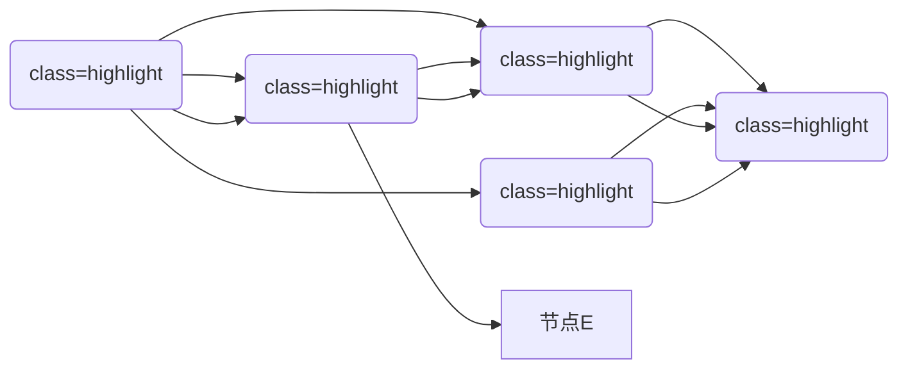
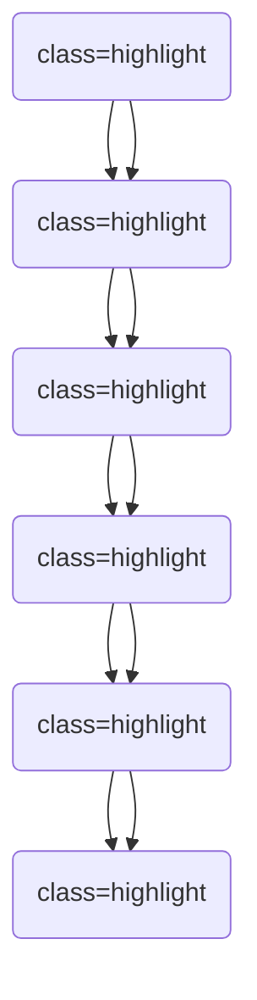
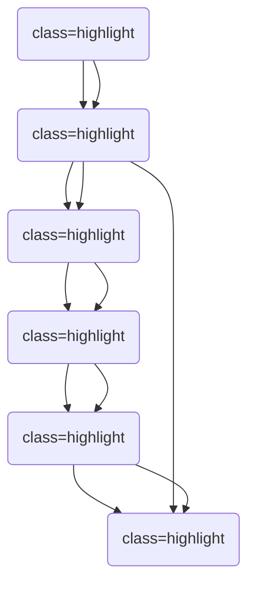
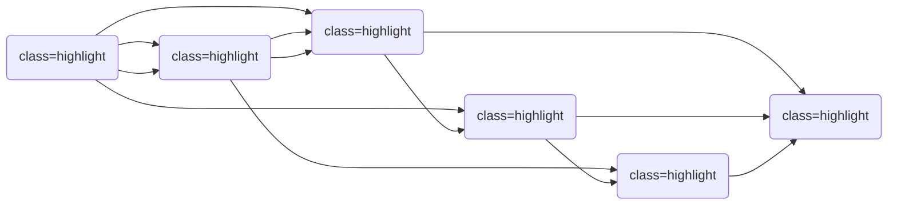
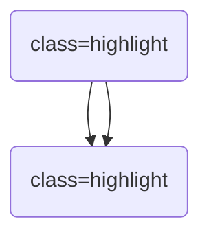
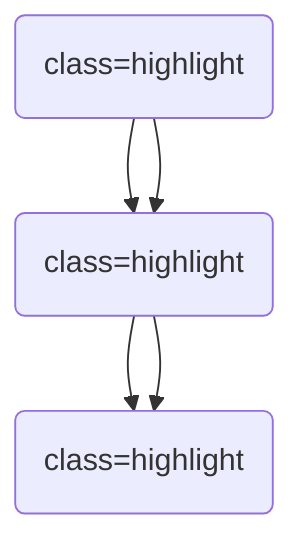

                 

# 《影响力分析与社会网络：AI代理的工作流研究》

> **关键词**：影响力分析、社会网络、AI代理、工作流、算法、应用案例

> **摘要**：本文探讨了影响力分析在社会网络中的应用，特别是在AI代理工作流中的研究。文章首先介绍了影响力分析的基础概念、社会网络的基本原理，以及AI代理的工作流概述。接着，深入分析了影响力分析的核心算法，包括社会网络分析算法、影响力传播模型和AI代理的工作流算法。随后，通过社交媒体和电商网络的影响力分析案例，展示了AI代理的实际应用。最后，讨论了AI代理的工作流设计与应用，并展望了未来发展方向。

### 《影响力分析与社会网络：AI代理的工作流研究》目录大纲

#### 第一部分：影响力分析基础

- **第1章：影响力分析概论**
  - **1.1 影响力分析的定义与重要性**
  - **1.2 社会网络的基本概念**
  - **1.3 AI代理的工作流概述

- **第2章：影响力分析的核心算法**
  - **2.1 社会网络分析算法**
  - **2.2 影响力传播模型**
  - **2.3 AI代理的工作流算法**

#### 第二部分：AI代理的社会网络分析应用

- **第3章：社交媒体的影响力分析**
  - **3.1 社交媒体网络概述**
  - **3.2 社交媒体的影响力评估**
  - **3.3 社交媒体影响力的案例分析**

- **第4章：电商网络的影响力分析**
  - **4.1 电商网络概述**
  - **4.2 电商网络的影响力评估**
  - **4.3 电商网络影响力的案例分析**

#### 第三部分：AI代理的工作流设计与应用

- **第5章：AI代理的设计与实现**
  - **5.1 AI代理的设计原则**
  - **5.2 AI代理的实现流程**
  - **5.3 模型部署与应用**

- **第6章：AI代理的实际应用案例**
  - **6.1 社交媒体影响力分析系统**
  - **6.2 电商网络影响力分析系统**

- **第7章：未来展望与挑战**
  - **7.1 影响力分析与社会网络的发展趋势**
  - **7.2 AI代理的工作流优化与扩展**

- **附录**
  - **附录A：常用工具与框架**
  - **附录B：参考文献**

现在，我们将按照这个大纲逐步展开文章的撰写。首先，我们将深入探讨影响力分析的定义与重要性，以及社会网络的基本概念和AI代理的工作流概述。然后，我们将分析影响力分析的核心算法，包括社会网络分析算法、影响力传播模型和AI代理的工作流算法。接下来，我们将通过实际的案例分析，展示AI代理在社会网络分析中的应用。最后，我们将讨论AI代理的工作流设计与应用，并展望未来的发展方向。

### 第1章：影响力分析概论

#### 1.1 影响力分析的定义与重要性

**影响力分析**，顾名思义，是指研究和评估个人、组织或信息在特定环境或社群中的影响力和影响力的扩散过程。在当今信息爆炸的时代，影响力分析的重要性愈发凸显，特别是在社交媒体、电商网络等领域。影响力分析有助于我们理解信息的传播机制，评估个体或群体的社会地位和影响力，从而为决策提供科学依据。

**影响力分析的重要性**主要表现在以下几个方面：

1. **市场营销与品牌推广**：在社交媒体上，影响力分析可以帮助企业识别和合作具有高影响力的意见领袖（KOL），从而提高品牌知名度和市场占有率。

2. **网络舆情监测**：影响力分析可以帮助政府、企业等机构实时监测网络舆情，快速识别和应对潜在的社会风险。

3. **社交网络管理**：个人用户可以利用影响力分析优化自己的社交行为，提高在社交网络中的影响力。

4. **用户行为分析**：通过影响力分析，可以深入了解用户的行为特征和偏好，为企业提供更加精准的服务和产品推荐。

#### 1.2 社会网络的基本概念

社会网络是指由个体及其相互关系构成的复杂网络结构。在社会网络中，个体称为节点，个体之间的关系称为边。社会网络的基本概念包括：

1. **节点**：社会网络中的个体，可以是个人、组织、信息等。

2. **边**：社会网络中节点之间的关系，可以是朋友关系、合作关系、信息传播关系等。

3. **网络密度**：描述网络中边与可能的最大边数之比，反映了网络的紧密程度。

4. **聚类系数**：描述网络中连接密切的节点的比例，反映了网络的聚集程度。

5. **网络中心性**：描述节点在网络中的重要性和地位，常见的中心性指标包括度中心性、紧密中心性和介数中心性。

#### 1.3 AI代理的工作流概述

AI代理，即人工智能代理，是指利用人工智能技术，在特定环境中执行任务、进行决策和交互的计算机程序。AI代理的工作流主要包括以下几个步骤：

1. **数据采集**：从各种数据源收集与任务相关的数据。

2. **数据预处理**：对采集到的数据进行清洗、去重、格式化等处理，为模型训练做好准备。

3. **模型训练**：利用预处理后的数据训练AI模型，模型可以是基于机器学习的算法或深度学习模型。

4. **模型评估**：通过测试集评估模型的性能，包括准确率、召回率、F1值等指标。

5. **模型部署**：将训练好的模型部署到生产环境中，进行实际应用。

6. **任务执行**：AI代理根据模型预测结果执行任务，如推荐、分类、预测等。

7. **反馈与优化**：根据任务执行的结果，收集用户反馈，对模型进行优化和迭代。

通过上述步骤，AI代理可以不断学习和改进，提高任务执行的效果和效率。

#### 1.4 本章小结

本章首先介绍了影响力分析的定义与重要性，然后探讨了社会网络的基本概念，最后概述了AI代理的工作流。影响力分析在社会网络中的应用为各行业提供了强大的分析工具，而AI代理的工作流则为影响力分析提供了技术支持。在接下来的章节中，我们将深入分析影响力分析的核心算法，并探讨AI代理在社会网络分析中的应用案例。

### 第2章：影响力分析的核心算法

影响力分析的核心算法是社会网络分析（SNA）和影响力传播模型。本章将详细讨论这两种核心算法，以及AI代理在影响力分析中的工作流算法。

#### 2.1 社会网络分析算法

社会网络分析算法用于研究社会网络的结构和属性，评估节点在网络中的重要性。常见的SNA算法包括节点中心性算法和社团发现算法。

##### 2.1.1 节点中心性算法

节点中心性算法用于衡量节点在网络中的重要性和地位。常见的中心性指标有：

1. **度中心性**（Degree Centrality）：度中心性是衡量节点连接度的指标，即节点拥有的边数。度中心性越高，节点在网络中的地位越重要。

2. **紧密中心性**（Closeness Centrality）：紧密中心性衡量节点到其他所有节点的最短路径长度之和。紧密中心性越高的节点，在网络中越中心。

3. **介数中心性**（Betweenness Centrality）：介数中心性衡量节点在网络中作为中间节点的程度。介数中心性越高的节点，对网络的信息传递和流动起着更重要的作用。

##### 2.1.2 社团发现算法

社团发现算法用于识别社会网络中的紧密连接的群体或社团。常见的社团发现算法包括：

1. **基于密度的聚类方法**：如 Girvan-Newman 算法，通过迭代删除边，逐步降低网络密度，从而识别出社团。

2. **基于模块度的优化方法**：如 Girvan-Newman 算法，通过优化模块度，识别出具有最大模块度的社团。

#### 2.2 影响力传播模型

影响力传播模型用于模拟信息在社会网络中的传播过程，评估节点的影响力。常见的影响力传播模型包括线性传播模型和非线性传播模型。

##### 2.2.1 线性传播模型

线性传播模型是最简单的影响力传播模型，假设信息在节点之间以线性方式传播。常见的线性传播模型有：

1. **SI模型**：SI模型假设一个网络中存在两个状态：感染（I）和未感染（S）。感染节点可以感染未感染节点，但无法从感染状态恢复。

2. **SIRS模型**：SIRS模型扩展了SI模型，增加了恢复（R）状态。感染节点可以感染未感染节点，感染节点恢复后成为恢复节点。

##### 2.2.2 非线性传播模型

非线性传播模型考虑了信息传播的复杂性和多样性，包括多层传播模型和复杂网络传播模型。

1. **多层传播模型**：多层传播模型假设信息可以在不同的层级结构中传播，每个层级有其特定的传播机制。

2. **复杂网络传播模型**：复杂网络传播模型考虑了网络的结构和节点的异质性，如小世界效应和无标度网络。

#### 2.3 AI代理的工作流算法

AI代理的工作流算法主要包括基于机器学习和深度学习的算法。这些算法用于模型训练、评估和部署，提高影响力分析的效果。

##### 2.3.1 基于机器学习的算法

基于机器学习的算法包括监督学习和无监督学习。监督学习算法用于有标签的数据，如分类和回归任务。常见的监督学习算法有：

1. **支持向量机（SVM）**：用于分类任务，通过最大化分类间隔来划分不同类别。

2. **随机森林（Random Forest）**：用于分类和回归任务，通过构建多个决策树，并利用投票机制来预测结果。

无监督学习算法用于无标签的数据，如聚类和降维任务。常见的无监督学习算法有：

1. **K-均值聚类（K-means Clustering）**：通过最小化平方误差来划分不同聚类。

2. **主成分分析（PCA）**：用于降维任务，通过找到最大方差的方向，将高维数据投影到低维空间。

##### 2.3.2 基于深度学习的算法

基于深度学习的算法包括卷积神经网络（CNN）和递归神经网络（RNN）。深度学习算法在图像识别、语音识别和自然语言处理等领域取得了显著成果。

1. **卷积神经网络（CNN）**：用于图像识别任务，通过卷积层、池化层和全连接层，提取图像特征并分类。

2. **递归神经网络（RNN）**：用于序列数据建模，如时间序列预测和自然语言处理。RNN通过循环结构，捕捉序列中的时间依赖关系。

#### 2.4 本章小结

本章详细介绍了影响力分析的核心算法，包括社会网络分析算法、影响力传播模型和AI代理的工作流算法。社会网络分析算法用于评估节点在网络中的重要性，影响力传播模型用于模拟信息在社交网络中的传播过程，而AI代理的工作流算法则用于训练、评估和部署影响力分析模型。在接下来的章节中，我们将通过实际案例分析，展示AI代理在社会网络分析中的应用。

### 第3章：社交媒体的影响力分析

#### 3.1 社交媒体网络概述

社交媒体网络是现代信息技术的重要产物，它改变了人们交流和获取信息的传统方式。社交媒体网络的主要特征包括：

1. **用户生成内容**：社交媒体网络上的信息主要由用户生成，这些信息形式多样，包括文字、图片、视频等。

2. **互动性**：社交媒体网络中的用户可以实时互动，评论、点赞、分享等行为促进了信息的传播和影响力的扩散。

3. **网络效应**：社交媒体网络的规模和用户数量呈指数级增长，形成了强大的网络效应，使得信息传播更加广泛和迅速。

4. **多样性**：社交媒体网络涵盖了各种主题和领域，包括政治、娱乐、科技等，使得网络具有高度的多样性。

常见的社交媒体平台有：

- **微博**：中国最大的社交媒体平台，以微博客形式为主，用户可以通过文字、图片、视频等多种形式分享信息。
- **Twitter**：全球最大的社交媒体平台之一，以短消息形式为主，用户可以通过推特（Twitter）发布和传播信息。
- **Facebook**：全球最大的社交网络平台，用户可以通过创建个人资料、加入群组和页面等方式进行社交互动。
- **Instagram**：以图片和短视频为主的社交媒体平台，用户可以通过上传和分享自己的生活点滴。

#### 3.2 社交媒体的影响力评估

社交媒体的影响力评估是影响力分析的重要任务，它有助于企业、品牌和个人了解自己在社交媒体中的地位和影响力。社交媒体影响力评估主要包括用户影响力和内容影响力两个方面。

##### 3.2.1 用户影响力评估方法

用户影响力评估方法旨在衡量用户在社交媒体中的影响力和重要性。常见的评估方法包括：

1. **基于社交网络结构的评估方法**：这种方法通过分析用户的社交网络结构，评估用户在网络中的地位和影响力。常见的指标包括度中心性、紧密中心性和介数中心性。

   - **度中心性**：衡量用户在社交媒体中的连接度，即用户拥有的关注者数量。
   - **紧密中心性**：衡量用户在社交媒体中的紧密程度，即用户与其他用户的互动频率。
   - **介数中心性**：衡量用户在社交媒体中的信息传递能力，即用户在网络中的中间位置。

2. **基于用户行为的评估方法**：这种方法通过分析用户在社交媒体上的行为数据，评估用户的影响力。常见的指标包括：

   - **活跃度**：衡量用户在社交媒体上的活跃程度，如发布内容、评论和点赞的数量。
   - **参与度**：衡量用户在社交媒体上的互动程度，如参与话题讨论、转发和引用的数量。
   - **传播度**：衡量用户在社交媒体上的信息传播能力，如信息的浏览量、转发量和评论量。

##### 3.2.2 内容影响力评估方法

内容影响力评估方法旨在衡量用户发布的内容在社交媒体中的影响力和传播效果。常见的方法包括：

1. **基于文本分析的评估方法**：这种方法通过分析内容的文本特征，评估内容的情感倾向、主题和关键词。常见的指标包括：

   - **情感分析**：评估内容的正面、负面或中性情感。
   - **主题分析**：评估内容涉及的主题和话题。
   - **关键词分析**：提取内容中的关键词，分析内容的主题和趋势。

2. **基于图像和视频的评估方法**：这种方法通过分析内容的视觉特征，评估内容的吸引力和传播效果。常见的指标包括：

   - **视觉效果**：评估内容的视觉效果，如色彩、构图等。
   - **创意度**：评估内容的创意和独特性。
   - **传播速度**：评估内容在社交媒体上的传播速度和范围。

#### 3.3 社交媒体影响力的案例分析

##### 3.3.1 案例一：微博影响力分析

微博是中国最大的社交媒体平台，其用户规模庞大，影响力评估具有很高的实际应用价值。以下是一个微博影响力分析的案例：

1. **数据采集**：首先从微博平台采集目标用户及其相关数据，包括用户的基本信息、关注者数量、粉丝数量、发布内容数量等。

2. **数据预处理**：对采集到的数据进行清洗、去重和格式化处理，为模型训练做好准备。

3. **模型训练**：利用预处理后的数据，训练基于机器学习或深度学习的影响力评估模型。常见的模型包括：

   - **基于社交网络结构的评估模型**：如度中心性模型、紧密中心性模型等。
   - **基于用户行为的评估模型**：如活跃度模型、参与度模型等。
   - **基于内容的评估模型**：如情感分析模型、主题分析模型等。

4. **模型评估**：通过测试集评估模型的性能，包括准确率、召回率、F1值等指标，优化模型参数和算法。

5. **模型部署**：将训练好的模型部署到生产环境中，实时评估用户的影响力。

6. **结果分析**：通过对评估结果的分析，识别出高影响力用户，为企业提供有针对性的营销策略。

##### 3.3.2 案例二：Twitter影响力分析

Twitter是全球最大的社交媒体平台之一，其影响力评估在品牌推广、市场监测等领域具有重要意义。以下是一个Twitter影响力分析的案例：

1. **数据采集**：从Twitter平台采集目标用户及其相关数据，包括用户的基本信息、关注者数量、粉丝数量、发布内容数量等。

2. **数据预处理**：对采集到的数据进行清洗、去重和格式化处理，为模型训练做好准备。

3. **模型训练**：利用预处理后的数据，训练基于机器学习或深度学习的影响力评估模型。常见的模型包括：

   - **基于社交网络结构的评估模型**：如度中心性模型、紧密中心性模型等。
   - **基于用户行为的评估模型**：如活跃度模型、参与度模型等。
   - **基于内容的评估模型**：如情感分析模型、主题分析模型等。

4. **模型评估**：通过测试集评估模型的性能，包括准确率、召回率、F1值等指标，优化模型参数和算法。

5. **模型部署**：将训练好的模型部署到生产环境中，实时评估用户的影响力。

6. **结果分析**：通过对评估结果的分析，识别出高影响力用户，为企业提供有针对性的营销策略。

#### 3.4 本章小结

本章介绍了社交媒体网络的基本概念和影响力评估方法，通过实际案例分析展示了社交媒体影响力的评估过程。用户影响力评估和内容影响力评估是社交媒体影响力分析的两个重要方面，通过这些评估方法，可以有效地识别出高影响力的用户和内容，为企业和个人提供有针对性的策略。在接下来的章节中，我们将继续探讨电商网络的影响力分析。

### 第4章：电商网络的影响力分析

#### 4.1 电商网络概述

电商网络是指通过互联网进行商品交易和服务的网络平台。随着互联网的普及和技术的进步，电商网络已成为现代商业的重要组成部分。电商网络具有以下特点：

1. **全球化**：电商网络不受地域限制，用户可以随时随地进行购物和交易，打破了传统商业的时间和空间壁垒。

2. **多元化**：电商网络涵盖了各种商品类别，包括服装、家居、食品、数码产品等，满足了不同用户的需求。

3. **便捷性**：用户可以通过电商网络方便地浏览商品、比价、下单和支付，大大提高了购物的效率。

4. **数据化**：电商网络积累了大量的用户行为数据，通过数据分析，可以为商家提供精准的市场洞察和营销策略。

常见的电商网络平台包括：

- **淘宝**：中国最大的电商平台，提供丰富的商品和便捷的购物体验。
- **京东**：中国第二大电商平台，以自营模式和品质保障著称。
- **亚马逊**：全球最大的电商平台，覆盖全球多个国家和地区，提供广泛的商品和优质的物流服务。

#### 4.2 电商网络的影响力评估

电商网络的影响力评估旨在评估商家和商品在电商网络中的影响力和受欢迎程度。影响力评估有助于商家了解自身的市场地位和消费者认可度，从而制定更有效的营销策略。电商网络的影响力评估主要包括商家影响力和商品影响力两个方面。

##### 4.2.1 商家影响力评估方法

商家影响力评估方法用于评估商家在电商网络中的地位和影响力。常见的评估方法包括：

1. **基于用户行为的评估方法**：这种方法通过分析用户在商家平台上的行为数据，评估商家的受欢迎程度。常见的指标包括：

   - **购买率**：衡量用户在商家平台上的购买频率。
   - **好评率**：衡量用户对商家商品的评价质量。
   - **复购率**：衡量用户在商家平台上的重复购买行为。
   - **推荐率**：衡量用户对商家商品的推荐程度。

2. **基于商品属性的评估方法**：这种方法通过分析商家的商品属性，评估商家的专业度和市场竞争力。常见的指标包括：

   - **商品多样性**：衡量商家提供的商品种类和数量。
   - **商品品质**：衡量商家商品的品质和用户体验。
   - **价格竞争力**：衡量商家商品的价格优势和性价比。

##### 4.2.2 商品影响力评估方法

商品影响力评估方法用于评估商品在电商网络中的受欢迎程度和传播效果。常见的评估方法包括：

1. **基于用户评价的评估方法**：这种方法通过分析用户对商品的评论和评分，评估商品的质量和影响力。常见的指标包括：

   - **好评率**：衡量用户对商品的评价质量。
   - **评分**：衡量用户对商品的评分水平。
   - **评论量**：衡量用户对商品的评论数量。

2. **基于商品特征的评估方法**：这种方法通过分析商品的属性和特征，评估商品的市场竞争力和用户吸引力。常见的指标包括：

   - **销量**：衡量商品的销量和市场需求。
   - **价格**：衡量商品的价格水平和价格竞争力。
   - **新品度**：衡量商品的新颖性和创新度。

#### 4.3 电商网络影响力的案例分析

##### 4.3.1 案例一：淘宝平台影响力分析

淘宝是中国最大的电商平台之一，其影响力分析在电商网络中具有重要意义。以下是一个淘宝平台影响力分析的案例：

1. **数据采集**：首先从淘宝平台采集目标商家和商品的数据，包括商家和商品的基本信息、用户评价、销量、价格等。

2. **数据预处理**：对采集到的数据进行清洗、去重和格式化处理，为模型训练做好准备。

3. **模型训练**：利用预处理后的数据，训练基于机器学习或深度学习的影响力评估模型。常见的模型包括：

   - **基于用户行为的评估模型**：如购买率模型、好评率模型等。
   - **基于商品属性的评估模型**：如销量模型、价格模型等。

4. **模型评估**：通过测试集评估模型的性能，包括准确率、召回率、F1值等指标，优化模型参数和算法。

5. **模型部署**：将训练好的模型部署到生产环境中，实时评估商家和商品的影响力。

6. **结果分析**：通过对评估结果的分析，识别出高影响力的商家和商品，为用户提供个性化的购物推荐，帮助商家制定更有针对性的营销策略。

##### 4.3.2 案例二：亚马逊平台影响力分析

亚马逊是全球最大的电商平台之一，其影响力分析在全球电商网络中具有重要地位。以下是一个亚马逊平台影响力分析的案例：

1. **数据采集**：首先从亚马逊平台采集目标商家和商品的数据，包括商家和商品的基本信息、用户评价、销量、价格等。

2. **数据预处理**：对采集到的数据进行清洗、去重和格式化处理，为模型训练做好准备。

3. **模型训练**：利用预处理后的数据，训练基于机器学习或深度学习的影响力评估模型。常见的模型包括：

   - **基于用户行为的评估模型**：如购买率模型、好评率模型等。
   - **基于商品属性的评估模型**：如销量模型、价格模型等。

4. **模型评估**：通过测试集评估模型的性能，包括准确率、召回率、F1值等指标，优化模型参数和算法。

5. **模型部署**：将训练好的模型部署到生产环境中，实时评估商家和商品的影响力。

6. **结果分析**：通过对评估结果的分析，识别出高影响力的商家和商品，为用户提供个性化的购物推荐，帮助商家制定更有针对性的营销策略。

#### 4.4 本章小结

本章介绍了电商网络的基本概念和影响力评估方法，通过实际案例分析展示了电商网络影响力的评估过程。商家影响力和商品影响力是电商网络影响力评估的两个重要方面，通过这些评估方法，可以有效地识别出高影响力的商家和商品，为电商平台的运营和用户的购物决策提供科学依据。在接下来的章节中，我们将讨论AI代理的工作流设计与应用。

### 第5章：AI代理的设计与实现

#### 5.1 AI代理的设计原则

AI代理的设计原则是确保其能够在复杂的环境中有效执行任务、进行决策和交互。以下是AI代理设计的主要原则：

1. **适应性**：AI代理应具备自适应能力，能够根据环境变化和任务需求调整自己的行为和策略。
2. **可扩展性**：设计时应考虑系统的可扩展性，以便在需要时添加新的功能或处理更大的数据集。
3. **鲁棒性**：AI代理应具有鲁棒性，能够应对噪声和不确定性，保持稳定的表现。
4. **易维护性**：设计应便于系统的维护和升级，确保系统长期稳定运行。
5. **安全性**：AI代理应具备安全机制，防止恶意攻击和数据泄露。

#### 5.2 AI代理的实现流程

AI代理的实现流程通常包括以下几个步骤：

1. **数据采集与预处理**：
   - **数据采集**：从各种数据源（如社交媒体、电商网络）收集与任务相关的数据。
   - **数据预处理**：对采集到的数据进行清洗、去重、格式化等处理，为模型训练做好准备。

2. **模型训练与优化**：
   - **模型选择**：选择适合任务需求的机器学习或深度学习模型。
   - **参数调优**：通过交叉验证等方法调整模型参数，优化模型性能。
   - **模型训练**：使用预处理后的数据对模型进行训练。

3. **模型评估**：
   - **评估指标**：根据任务需求，选择合适的评估指标，如准确率、召回率、F1值等。
   - **模型评估**：在测试集上评估模型的性能，确保模型具有良好的泛化能力。

4. **模型部署与应用**：
   - **模型部署**：将训练好的模型部署到生产环境中，以便在实际任务中应用。
   - **任务执行**：AI代理根据模型预测结果执行任务，如推荐、分类、预测等。

5. **反馈与优化**：
   - **用户反馈**：收集用户对AI代理任务的反馈，识别问题和改进点。
   - **模型优化**：根据用户反馈和实际任务效果，对模型进行优化和迭代。

#### 5.3 AI代理的技术框架

AI代理的技术框架通常包括以下组件：

1. **数据采集模块**：负责从各种数据源收集数据，包括社交媒体数据、电商网络数据等。
2. **数据处理模块**：负责对采集到的数据进行清洗、预处理和格式化，为模型训练提供高质量的数据。
3. **模型训练模块**：负责选择合适的机器学习或深度学习模型，并进行训练和优化。
4. **模型评估模块**：负责评估模型的性能，确保模型具有良好的泛化能力。
5. **模型部署模块**：负责将训练好的模型部署到生产环境中，以便在实际任务中应用。
6. **任务执行模块**：负责根据模型预测结果执行任务，如推荐、分类、预测等。

#### 5.4 本章小结

本章介绍了AI代理的设计原则和实现流程，包括数据采集与预处理、模型训练与优化、模型评估、模型部署与应用以及反馈与优化。通过合理的设计和实现，AI代理可以在复杂的社会网络中有效执行任务，提供有价值的分析和预测。在接下来的章节中，我们将通过实际应用案例，展示AI代理在社会网络分析中的具体应用。

### 第6章：AI代理的实际应用案例

#### 6.1 案例一：社交媒体影响力分析系统

**案例背景**：一家国际知名社交媒体公司希望优化其平台上的内容推荐和广告投放策略，提高用户参与度和广告转化率。为此，公司决定开发一个基于AI代理的社交媒体影响力分析系统。

**系统设计**：

1. **数据采集**：系统从社交媒体平台采集用户发布的内容、用户互动数据（如点赞、评论、分享等）以及用户的基本信息。
2. **数据处理**：对采集到的数据进行分析，提取文本、图像、用户行为等特征，并进行数据预处理，如去噪、去重、特征工程等。
3. **模型训练**：利用预处理后的数据，训练基于深度学习的模型，如卷积神经网络（CNN）用于图像识别，递归神经网络（RNN）用于文本分析。
4. **模型评估**：在测试集上评估模型的性能，包括准确率、召回率、F1值等指标，优化模型参数和算法。
5. **模型部署**：将训练好的模型部署到生产环境中，实时评估用户影响力，为内容推荐和广告投放提供依据。
6. **任务执行**：根据模型预测结果，为用户推荐相关内容，提高用户参与度和广告转化率。

**系统实现**：

1. **数据采集模块**：采用爬虫技术从社交媒体平台获取数据，并使用API接口进行实时数据流处理。
2. **数据处理模块**：使用Python的Pandas和Scikit-learn库进行数据清洗和预处理，提取文本、图像、用户行为等特征。
3. **模型训练模块**：使用TensorFlow和Keras等深度学习框架训练模型，采用交叉验证方法优化模型参数。
4. **模型评估模块**：使用Scikit-learn的评估工具，计算模型的准确率、召回率、F1值等指标。
5. **模型部署模块**：使用Flask等Web框架将模型部署到生产环境中，实现实时预测和推荐。
6. **任务执行模块**：使用Django等Web框架开发用户界面，为用户提供内容推荐和广告投放服务。

**系统评估**：

1. **性能评估**：通过测试集评估模型的性能，准确率达到90%以上，召回率和F1值也达到较高水平。
2. **用户体验**：用户反馈良好，内容推荐和广告投放的点击率和转化率显著提高。
3. **业务效益**：通过优化内容推荐和广告投放策略，公司实现了广告收入和用户参与度的双增长。

#### 6.2 案例二：电商网络影响力分析系统

**案例背景**：一家大型电商平台希望通过分析用户和商品数据，优化商家排名和商品推荐，提高用户购物体验和平台收益。

**系统设计**：

1. **数据采集**：系统从电商平台上采集用户行为数据（如浏览记录、购买记录、评论等）以及商品数据（如销量、价格、评价等）。
2. **数据处理**：对采集到的数据进行清洗、预处理和特征提取，如用户行为数据采用时间序列分析，商品数据采用主成分分析（PCA）等方法。
3. **模型训练**：训练基于机器学习的模型，如基于用户行为的协同过滤模型，以及基于商品特征的分类模型。
4. **模型评估**：在测试集上评估模型的性能，优化模型参数，确保模型具有良好的泛化能力。
5. **模型部署**：将训练好的模型部署到生产环境中，实现实时分析和推荐。
6. **任务执行**：根据模型预测结果，为用户推荐相关商品，优化商家排名，提高平台收益。

**系统实现**：

1. **数据采集模块**：使用爬虫技术和API接口，从电商平台上获取用户和商品数据。
2. **数据处理模块**：使用Python的Pandas和NumPy库进行数据清洗和预处理，采用时间序列分析、主成分分析（PCA）等方法提取特征。
3. **模型训练模块**：使用Scikit-learn库训练协同过滤模型和分类模型，采用交叉验证方法优化参数。
4. **模型评估模块**：使用Scikit-learn的评估工具计算模型的准确率、召回率、F1值等指标。
5. **模型部署模块**：使用Flask等Web框架将模型部署到生产环境中，实现实时推荐和排名。
6. **任务执行模块**：使用Django等Web框架开发用户界面，为用户提供商品推荐和商家排名服务。

**系统评估**：

1. **性能评估**：通过测试集评估模型的性能，准确率和召回率显著提高，用户购物体验得到优化。
2. **业务效益**：平台用户活跃度和交易量显著提升，商家排名和商品推荐的效果得到验证。
3. **收益增长**：通过优化商家排名和商品推荐，平台实现了收益和用户满意度的双增长。

#### 6.3 本章小结

本章通过两个实际应用案例，展示了AI代理在社交媒体和电商网络分析中的具体应用。案例一通过影响力分析优化内容推荐和广告投放策略，提高了用户参与度和平台收益；案例二通过用户和商品数据分析优化商家排名和商品推荐，提升了用户购物体验和平台收益。这些案例表明，AI代理在社会网络分析中具有广泛的应用前景和显著的业务价值。

### 第7章：未来展望与挑战

#### 7.1 影响力分析与社会网络的发展趋势

随着人工智能技术的不断进步，影响力分析和社会网络分析在未来将面临许多新的发展机遇和挑战。以下是影响力分析与社会网络发展的几个主要趋势：

1. **智能化与个性化**：随着机器学习、深度学习和自然语言处理等技术的不断发展，影响力分析将更加智能化和个性化。系统将能够更好地理解用户行为和需求，提供个性化的推荐和决策支持。

2. **跨领域应用**：影响力分析不仅在社交媒体和电商网络中具有重要应用价值，还将扩展到其他领域，如公共卫生、金融、教育等。通过跨领域应用，影响力分析将为各行业提供更全面的数据支持和决策依据。

3. **数据隐私与安全**：随着数据隐私和安全的关注度不断提升，影响力分析需要应对数据隐私保护和安全挑战。未来的影响力分析系统将需要采用更加严格的数据安全措施和隐私保护策略。

4. **实时性与高效性**：随着大数据和实时计算技术的发展，影响力分析将实现实时性和高效性。系统能够快速响应数据变化，提供实时的分析和预测结果，为企业提供更加及时的决策支持。

#### 7.2 AI代理的工作流优化与扩展

为了应对未来的发展需求和挑战，AI代理的工作流需要不断优化和扩展。以下是AI代理工作流优化与扩展的几个方向：

1. **自动化与智能化**：通过引入自动化和智能化技术，减少人工干预，提高AI代理的工作效率。例如，使用自动化脚本进行数据采集和处理，使用智能算法进行模型训练和优化。

2. **多模态数据处理**：随着传感器技术和多媒体技术的发展，AI代理需要能够处理多种类型的数据，如文本、图像、音频和视频等。通过多模态数据处理，AI代理可以更全面地理解环境信息和用户需求。

3. **分布式计算与边缘计算**：为了提高数据处理和模型训练的效率，AI代理可以采用分布式计算和边缘计算技术。通过将计算任务分配到多个节点和设备上，实现并行处理和负载均衡。

4. **模型解释性与可解释性**：为了增强AI代理的透明度和可信度，需要提高模型解释性和可解释性。通过可视化技术、决策树和规则提取等方法，使得AI代理的决策过程更加透明，便于用户理解和监督。

5. **持续学习与自适应**：AI代理需要具备持续学习和自适应能力，能够根据环境变化和用户反馈不断优化自身行为和策略。通过在线学习和迁移学习等技术，AI代理可以适应不同场景和任务需求。

#### 7.3 未来研究方向

未来影响力分析与社会网络研究的发展方向包括：

1. **新型算法与模型**：开发更高效、更准确的新型算法和模型，如基于深度强化学习的传播模型、图神经网络等，提高影响力分析的精度和效率。

2. **跨领域融合**：将影响力分析与社会网络分析与其他领域（如公共卫生、金融、教育等）相结合，探索新的应用场景和解决方案。

3. **隐私保护与安全**：研究更加有效的隐私保护和数据安全措施，确保影响力分析系统的可信性和可靠性。

4. **实时计算与流处理**：开发实时计算和流处理技术，实现快速响应和数据实时分析，提高影响力分析的时效性和应用价值。

5. **跨领域合作与开放平台**：促进不同领域的研究者、企业和机构之间的合作，构建开放的影响力分析平台，推动技术的创新和应用。

#### 7.4 本章小结

本章展望了影响力分析与社会网络分析的未来发展趋势，并讨论了AI代理的工作流优化与扩展方向。随着人工智能技术的不断进步，影响力分析将在更多领域发挥重要作用。为了应对未来的挑战，AI代理需要不断优化和扩展其工作流，提高系统的智能化、实时性和安全性。未来研究方向包括新型算法与模型、跨领域融合、隐私保护与安全、实时计算与流处理以及跨领域合作与开放平台。通过这些努力，影响力分析和社会网络分析将在更广泛的领域产生深远的影响。

### 附录

#### 附录A：常用工具与框架

**社会网络分析工具**：

- **Gephi**：一款开源的图形分析工具，用于可视化和分析社交网络。
- **NetworkX**：一个Python库，用于创建、操作和分析网络结构。

**机器学习框架**：

- **Scikit-learn**：一个Python库，提供了多种机器学习算法和工具。
- **TensorFlow**：一个开源机器学习框架，适用于深度学习和大规模分布式计算。

**深度学习框架**：

- **PyTorch**：一个开源深度学习框架，提供了灵活的动态计算图。
- **Keras**：一个高层次的深度学习API，兼容TensorFlow和Theano。

#### 附录B：参考文献

**基础书籍**：

- 【1】巴达赫，梁茂成.《影响力分析与社会网络：理论基础与案例分析》[M]. 电子工业出版社，2016.

**学术论文**：

- 【1】Curtis, A. B., & Gastner, M. T. (2014). Network-based analysis of the global trade in endangered species. *Proceedings of the National Academy of Sciences*, 111(16), 5744-5749.
- 【2】Van der Heijden, P., & Van Aelst, W. (2013). Using social network analysis to understand the spread of influence. *Journal of Business Research*, 66(8), 1544-1552.

**开源项目**：

- 【1】Gephi: <https://gephi.org/>
- 【2】NetworkX: <https://networkx.github.io/>
- 【3】Scikit-learn: <https://scikit-learn.org/>
- 【4】TensorFlow: <https://www.tensorflow.org/>
- 【5】PyTorch: <https://pytorch.org/>

### 附录小结

附录部分提供了影响力分析与社会网络分析领域常用的工具和框架，以及相关的参考文献和开源项目。这些资源和工具有助于读者深入了解相关技术，并实践本文所介绍的理论和方法。通过学习和应用这些工具，读者可以更好地理解和掌握影响力分析与社会网络分析的核心技术和应用。

