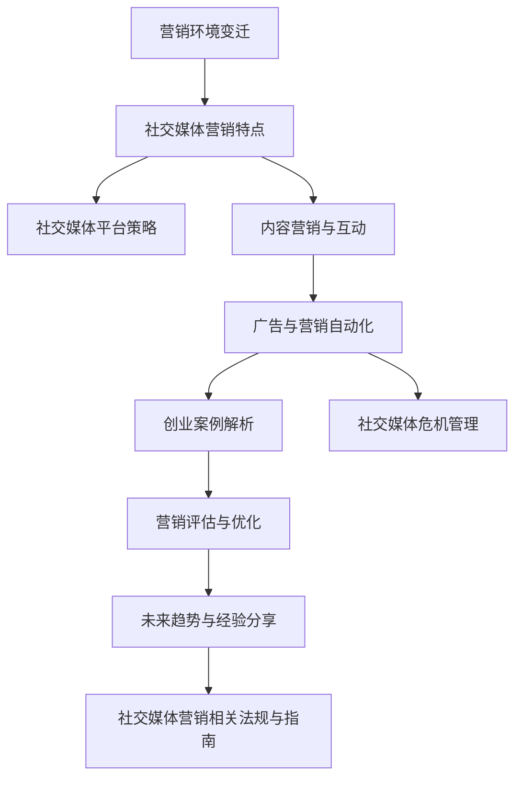

                 

### 第一部分：影响力营销创业概述

#### 第1章：社交媒体时代的营销环境

##### 1.1 营销环境的变迁

在数字化的浪潮中，营销环境发生了深刻的变革。从传统的营销方式到如今的社交媒体营销，这一变革不仅改变了营销的渠道，还重新定义了营销的本质。传统营销往往依赖于电视、报纸、广播等大众媒体，通过广告来传递品牌信息。然而，随着互联网的普及，特别是社交媒体的兴起，营销的方式和策略也发生了巨大的变化。

**从传统营销到社交媒体营销**  
传统营销注重的是单向的传播，品牌通过广告向消费者传递信息。这种方式往往缺乏互动性，难以实现精准营销。而社交媒体营销则强调互动和参与，品牌可以通过社交媒体平台与消费者进行直接的沟通和互动，从而更好地理解消费者的需求和行为。

**社交媒体平台的影响力分析**  
当前，主要的社交媒体平台包括微信、微博、抖音、快手等，这些平台已经成为品牌营销的重要阵地。社交媒体平台不仅提供了广泛的信息传播渠道，还创造了丰富的互动机会。品牌可以通过发布内容、参与讨论、发起活动等方式，与消费者建立紧密的联系，从而提升品牌的影响力和忠诚度。

**消费者行为的变化**  
随着社交媒体的普及，消费者的行为也发生了显著的变化。消费者不再仅仅是被动的接收信息，而是积极参与到品牌的营销活动中来。他们通过评论、转发、点赞等方式表达自己的意见和情感，形成了一种新型的消费文化。这种变化要求品牌必须更加关注消费者的需求和感受，才能在激烈的市场竞争中脱颖而出。

##### 1.2 影响力营销的概念与特点

**影响力营销的定义**  
影响力营销是指通过利用具有影响力的个人或群体（即“意见领袖”或“KOL”）来传递品牌信息，影响潜在消费者的购买决策和行为的一种营销策略。影响力营销的核心在于信任和影响力，通过意见领袖的推荐和影响，品牌能够更有效地传播信息，提高品牌的认知度和美誉度。

**社交媒体上的影响力者**  
在社交媒体时代，影响力者可以是明星、网红、行业专家等，他们拥有大量的粉丝和关注者，其言论和行为对粉丝具有很大的影响力。品牌通过与这些影响力者合作，可以利用其影响力来提升品牌知名度，扩大品牌影响力。

**影响力营销的优势与挑战**  
影响力营销的优势在于其高效性和精准性。通过与影响力者的合作，品牌能够迅速扩大影响力，精准地触达目标受众。然而，影响力营销也面临着一些挑战，如如何选择合适的影响力者、如何确保影响力营销的效果等。

##### 1.3 社交媒体平台的营销策略

**社交媒体内容策略**  
内容是社交媒体营销的核心，品牌需要通过高质量的内容来吸引和保持消费者的关注。内容策略包括原创内容、用户生成内容、互动内容等。品牌可以通过发布有趣、有价值、有教育意义的内容，与消费者建立情感联系，增强品牌的黏性。

**社交媒体广告策略**  
社交媒体广告是品牌在社交媒体平台上进行广告投放的一种方式。品牌可以通过精准的广告定位，将广告内容推送给特定的目标受众。社交媒体广告的形式包括展示广告、视频广告、原生广告等，品牌需要根据目标受众的特点和需求，选择合适的广告形式和投放策略。

**社交媒体互动策略**  
互动是社交媒体营销的重要环节，品牌需要与消费者保持积极的互动，以增强品牌的亲和力和忠诚度。互动策略包括回复评论、参与话题、发起活动等。通过互动，品牌能够更好地了解消费者的需求和反馈，及时调整营销策略。

#### 第2章：影响力营销的核心概念与联系

##### 2.1 信任与影响力

**信任在营销中的作用**  
信任是营销中不可或缺的因素，它直接影响消费者的购买决策和行为。在社交媒体营销中，信任尤为重要，因为消费者更倾向于相信他们信任的人或组织。品牌需要通过建立信任来赢得消费者的青睐，从而实现营销目标。

**如何建立信任**  
建立信任需要品牌在多个方面下功夫。首先，品牌需要提供真实、可靠的信息，避免虚假宣传和夸大其词。其次，品牌需要保持一致性和透明度，让消费者了解品牌的真实情况和价值观。最后，品牌需要与消费者建立良好的互动关系，及时回应消费者的反馈和需求，增强消费者的信任感。

**影响力与信任的关系**  
影响力与信任之间存在密切的联系。具有影响力的个人或群体往往具有较高的可信度，他们的推荐和评价能够影响消费者的购买决策。因此，品牌需要选择具有高度信任度的影响力者进行合作，以提高影响力营销的效果。

##### 2.2 品牌影响力与用户参与度

**品牌影响力的定义**  
品牌影响力是指品牌在市场上所拥有的认知度、美誉度和忠诚度。品牌影响力不仅是品牌价值的重要体现，也是品牌竞争力的关键因素。

**用户参与度的度量**  
用户参与度是指消费者在品牌营销活动中所表现出的积极程度和互动程度。用户参与度可以通过互动率、转发率、评论数等指标来衡量。

**提升品牌影响力的策略**  
提升品牌影响力需要品牌从多个方面进行努力。首先，品牌需要制定明确的市场定位和品牌形象，使品牌在消费者心中形成独特的印象。其次，品牌需要通过高质量的内容和互动活动，吸引消费者的关注和参与。最后，品牌需要积极与影响力者合作，利用其影响力扩大品牌影响力。

**提升用户参与度的策略**  
提升用户参与度需要品牌注重用户体验和互动性。首先，品牌需要提供有趣、有价值的内容，激发消费者的兴趣。其次，品牌需要设计互动活动，鼓励消费者参与和表达意见。最后，品牌需要及时回应消费者的反馈，增强消费者的归属感和参与感。

##### 2.3 影响力网络的构建与运营

**影响力网络的构成**  
影响力网络是由品牌、影响力者、消费者等多个节点组成的复杂网络。在这个网络中，品牌通过影响力者与消费者建立联系，实现信息的传递和影响力的扩大。

**影响力网络的关键节点**  
影响力网络中的关键节点通常是指那些具有较高影响力和参与度的节点。这些节点可以是品牌、影响力者或消费者，它们在网络中起着重要的桥梁作用，能够有效地传递信息和扩大影响力。

**影响力网络的运营策略**  
运营影响力网络需要品牌采取一系列策略，包括选择合适的影响力者、制定互动活动、提供优质内容等。品牌需要与影响力者建立良好的合作关系，共同推动品牌的营销活动。同时，品牌需要关注消费者的需求和反馈，不断优化网络结构和运营策略，提高影响力网络的效率和效果。

---

**总结**：

影响力营销创业在社交媒体时代具有重要的战略意义。通过深入了解营销环境的变迁、影响力营销的概念和特点，以及构建和运营影响力网络，品牌可以更有效地开展营销活动，提升品牌影响力和用户参与度。在接下来的章节中，我们将进一步探讨社交媒体营销的方法与实践，以及影响力营销创业的实战经验和未来趋势。

---

[返回目录](#影响力营销创业概述)

---

### 第3章：社交媒体分析工具与应用

#### 3.1 社交媒体分析的重要性

在社交媒体营销中，数据分析是不可或缺的一环。社交媒体分析工具可以帮助品牌更好地了解消费者行为、优化营销策略、提升营销效果。通过数据分析，品牌可以洞察消费者的兴趣、需求和行为模式，从而实现精准营销。

**数据分析在营销决策中的作用**  
数据分析为营销决策提供了科学依据。通过分析用户数据，品牌可以了解哪些内容受到用户的喜爱，哪些营销活动效果最好，从而制定更具针对性的营销策略。

**社交媒体分析的主要目的**  
- 了解消费者需求：通过分析用户在社交媒体上的行为，品牌可以深入了解消费者的兴趣、需求和偏好，从而更好地满足他们的需求。
- 优化营销策略：通过分析不同营销活动的效果，品牌可以找出最有效的营销策略，优化资源配置，提高营销效率。
- 提升用户体验：通过分析用户体验数据，品牌可以识别用户痛点，提供更好的产品和服务，提升用户体验。

#### 3.2 社交媒体分析工具的选择

**工具的功能对比**  
当前市场上存在着多种社交媒体分析工具，它们的功能各不相同，品牌需要根据自己的需求选择合适的工具。以下是一些常见的功能对比：

- **数据收集与监测**：包括社交媒体平台上的数据收集、监测和追踪。
- **数据分析**：包括数据可视化、用户行为分析、趋势分析等。
- **报告生成**：自动生成数据分析报告，提供直观的数据展示。

**适合不同需求的工具选择**  
不同的品牌和营销目标可能需要不同的社交媒体分析工具。以下是一些常见的工具选择：

- **小型品牌**：适用于小型品牌的社交媒体分析工具通常功能较为简单，价格适中，如 SocialBlade、Hootsuite。
- **中型品牌**：中型品牌需要功能更全面的工具，如 Brandwatch、Sprout Social，这些工具能够提供更深入的数据分析和报告功能。
- **大型品牌**：大型品牌通常需要更高级的社交媒体分析工具，如 Tableau、Google Analytics，这些工具能够处理大量的数据，提供更精确的分析结果。

**工具的使用技巧**  
无论选择哪种工具，掌握一定的使用技巧都是非常重要的。以下是一些使用技巧：

- **数据清洗**：确保数据的准确性和完整性，避免因数据错误导致的分析偏差。
- **定制报告**：根据品牌的需求和目标，定制个性化的报告，突出关键数据和分析结果。
- **定期分析**：定期对社交媒体营销效果进行分析，及时发现问题和优化策略。

#### 3.3 社交媒体分析的实际应用

**案例分享：通过分析优化营销策略**  
一个成功的案例是某个国际知名品牌的社交媒体营销。该品牌通过社交媒体分析工具，分析了用户在社交媒体上的行为和兴趣，发现用户对品牌的活动和优惠信息非常感兴趣。因此，品牌决定增加活动营销的频率，并优化优惠信息的发布策略。通过这些调整，品牌在社交媒体上的互动率显著提高，销售额也实现了大幅增长。

**数据可视化工具的使用**  
数据可视化是社交媒体分析的重要部分，它能够将复杂的数据转化为易于理解和分析的可视化图表。以下是一些常用的数据可视化工具：

- **Google Charts**：提供丰富的图表类型，易于集成到网页中。
- **Tableau**：功能强大的数据可视化工具，适用于各种规模的数据分析。
- **Power BI**：提供直观的数据可视化，支持多种数据源。

**如何使用数据可视化工具**  
- **选择合适的图表类型**：根据数据的类型和分析目标，选择最合适的图表类型，如条形图、折线图、饼图等。
- **突出关键信息**：在图表中突出关键数据和趋势，以便用户快速理解分析结果。
- **定期更新**：定期更新数据可视化图表，反映最新的数据分析结果。

**总结**：

社交媒体分析工具在营销中扮演着重要的角色，它能够帮助品牌深入了解消费者行为，优化营销策略，提升营销效果。通过合理选择和分析工具，品牌可以更好地应对市场变化，实现营销目标。

---

[返回目录](#社交媒体分析工具与应用)

---

### 第4章：内容营销与社交媒体互动

#### 4.1 内容营销策略

**内容营销的定义**  
内容营销是指通过创建和分享有价值的内容来吸引和转化潜在客户的一种营销策略。内容可以是文字、图片、视频等多种形式，其核心在于提供对用户有价值的信息，从而建立品牌与用户之间的信任和关系。

**内容营销的目标**  
- **吸引潜在客户**：通过有价值的内容吸引潜在客户，增加网站流量和品牌知名度。
- **增强品牌认知度**：通过持续的内容输出，提升品牌在用户心中的形象和认知度。
- **提高用户参与度**：通过互动内容激发用户的兴趣和参与，增加用户对品牌的忠诚度。
- **促进销售转化**：通过内容营销引导用户完成购买行为，实现销售增长。

**社交媒体平台上的内容营销策略**  
不同的社交媒体平台具有不同的用户群体和使用习惯，品牌需要根据平台特点制定相应的内容营销策略。

- **微博**：微博是一个以文本和图片为主的内容平台，适合发布新闻、观点和热点话题。品牌可以通过实时热点和话题讨论，增加用户互动和参与度。
- **微信**：微信是一个以公众号和朋友圈为主的内容平台，适合发布深度文章、用户故事和产品介绍。品牌可以通过公众号提供有价值的内容，建立用户信任，并通过朋友圈进行产品推广。
- **抖音**：抖音是一个以短视频为主的内容平台，适合发布创意短视频、教程和产品展示。品牌可以通过制作有趣、有吸引力的短视频，吸引大量用户关注和转发。
- **Instagram**：Instagram是一个以图片和视频为主的内容平台，适合发布高质量图片、用户故事和产品展示。品牌可以通过精美的图片和视频内容，提升品牌形象和用户参与度。

**如何制作有价值的内容**  
- **了解用户需求**：通过市场调研和用户分析，了解用户的需求和兴趣点，制作能够满足用户需求的内容。
- **提供独特价值**：内容要具有独特性，能够为用户带来新的知识和见解，提升用户的体验和满意度。
- **保持内容更新**：定期发布内容，保持与用户的互动，增加用户对品牌的黏性。
- **注重互动性**：设计互动内容，如问答、投票、抽奖等，激发用户的参与和讨论。

#### 4.2 社交媒体互动策略

**互动营销的原理**  
互动营销是指通过社交媒体平台与用户进行互动，建立情感连接，提高用户忠诚度和转化率的一种营销方式。互动营销的核心在于倾听用户的声音，回应用户的需求，建立良好的用户关系。

**社交媒体互动的方法**  
- **回复评论**：及时回复用户的评论，展示品牌对用户的关注和尊重，建立良好的用户关系。
- **参与话题**：积极参与社交媒体上的热门话题和讨论，增加品牌曝光度和用户参与度。
- **发起活动**：通过举办线上活动，如抽奖、优惠券发放、互动游戏等，吸引用户参与，增加品牌影响力。
- **互动式内容**：设计互动性强的内容，如问答、投票、投票等，激发用户的参与和讨论。

**社交媒体互动的技巧**  
- **个性化回复**：根据用户的提问和反馈，提供个性化的回复，增加用户的满意度。
- **积极互动**：保持积极的态度，与用户进行多次互动，建立深厚的情感连接。
- **危机管理**：遇到负面评论和争议时，要冷静处理，积极回应，避免激化矛盾。
- **数据分析**：通过分析互动数据，了解用户互动的行为和偏好，不断优化互动策略。

#### 4.3 社交媒体营销的KPI设置

**KPI的定义与选择**  
KPI（关键绩效指标）是衡量营销效果的重要指标，不同的社交媒体平台和营销目标需要选择不同的KPI。以下是一些常见的KPI：

- **关注者增长**：衡量社交媒体平台上的粉丝数量变化。
- **互动率**：衡量用户对品牌内容的参与程度，如点赞、评论、分享等。
- **转化率**：衡量用户从看到内容到完成购买行为的比例。
- **ROI（投资回报率）**：衡量营销投入与收益之间的比率。

**KPI的监控与分析**  
- **实时监控**：通过社交媒体分析工具，实时监控KPI数据，及时了解营销效果。
- **定期分析**：定期对KPI进行分析，总结营销活动的效果，找出问题和优化策略。
- **数据可视化**：通过数据可视化工具，将KPI数据转化为图表，直观展示营销效果。

**如何通过KPI优化营销策略**  
- **设置目标**：根据业务目标和市场环境，设定合理的KPI目标。
- **数据驱动**：根据KPI数据，分析营销活动的效果，优化内容和策略。
- **持续改进**：不断调整和优化营销策略，提升KPI表现，实现营销目标。

**总结**：

内容营销和社交媒体互动是社交媒体营销的重要组成部分。通过制定有效的内容营销策略和互动策略，品牌可以吸引和保持用户的关注，提高用户参与度和忠诚度，实现营销目标。通过合理设置和监控KPI，品牌可以不断优化营销策略，提升营销效果。

---

[返回目录](#内容营销与社交媒体互动)

---

### 第5章：社交媒体广告与营销自动化

#### 5.1 社交媒体广告的基础知识

**社交媒体广告的形式**  
社交媒体广告的形式多样，包括展示广告、视频广告、原生广告、信息流广告等。不同形式的广告具有不同的特点和适用场景。

- **展示广告**：在社交媒体平台上展示静态或动态的图片、文字和视频，通常位于页面顶部、侧边栏或顶部通栏。
- **视频广告**：在社交媒体平台上播放的视频广告，可以是横幅视频、视频贴片、社交媒体故事视频等。
- **原生广告**：与社交媒体平台内容形式相似，融入平台内容的广告，不易被用户识别，通常出现在信息流中。
- **信息流广告**：在社交媒体信息流中显示的广告，通常以图片、视频或文字的形式呈现，形式多样，与用户浏览内容相似。

**社交媒体广告的优势**  
- **精准定位**：社交媒体广告可以根据用户 demographics、行为、兴趣等多维度数据进行精准投放，提高广告效果。
- **互动性强**：社交媒体广告可以与用户进行互动，如点赞、评论、分享等，增强用户参与感。
- **数据追踪**：社交媒体广告提供了强大的数据分析工具，品牌可以实时监控广告效果，优化广告投放策略。
- **形式多样**：社交媒体广告形式多样，可以根据不同的需求和目标选择合适的广告形式。

**社交媒体广告的挑战**  
- **广告疲劳**：社交媒体用户对广告有一定的疲劳感，需要不断创新广告形式和内容，以避免用户忽视。
- **广告效果评估**：评估社交媒体广告效果需要综合考虑多种因素，如点击率、转化率、ROI等，需要综合分析。
- **广告成本**：随着社交媒体用户数量和竞争的加剧，广告成本逐渐增加，品牌需要合理预算和优化广告投放。

#### 5.2 社交媒体广告的营销自动化

**营销自动化的概念**  
营销自动化是指使用软件和工具自动执行营销任务和流程，以提高营销效率和质量。营销自动化可以帮助品牌自动化广告投放、客户管理、电子邮件营销等环节，减少人工操作，提高营销效果。

**社交媒体广告的自动化策略**  
- **自动广告投放**：通过营销自动化工具，品牌可以自动化广告投放，根据预设的规则和目标自动调整广告投放策略。
- **自动优化**：营销自动化工具可以实时监控广告效果，自动优化广告投放，如调整预算、关键词、出价等，提高广告效果。
- **自动客户管理**：通过营销自动化工具，品牌可以自动化客户管理，如客户分类、客户跟进、客户互动等，提高客户满意度。
- **自动电子邮件营销**：营销自动化工具可以自动化电子邮件营销，如根据用户行为发送个性化邮件，提高邮件打开率和点击率。

**自动化工具的选择与使用**  
品牌在选择营销自动化工具时，需要考虑以下因素：

- **功能覆盖**：选择功能全面、覆盖广告投放、客户管理、电子邮件营销等环节的自动化工具。
- **集成能力**：选择易于与其他营销工具和平台集成的自动化工具，提高营销效率。
- **用户界面**：选择界面友好、易于操作的自动化工具，提高用户体验。
- **成本效益**：考虑自动化工具的性价比，选择适合自身预算和需求的工具。

**如何使用营销自动化工具**  
- **制定自动化策略**：根据品牌营销目标和策略，制定自动化策略，如广告投放规则、客户跟进流程等。
- **配置自动化流程**：在营销自动化工具中配置自动化流程，如设置触发条件、执行动作等。
- **监控与优化**：实时监控自动化效果，根据数据反馈优化自动化策略和流程。

#### 5.3 跨平台广告策略

**跨平台广告的优势**  
- **扩大广告覆盖范围**：通过跨平台广告，品牌可以同时触达多个社交媒体平台上的用户，扩大广告覆盖范围。
- **提高广告效果**：不同社交媒体平台具有不同的用户群体和使用习惯，跨平台广告可以更好地满足用户需求，提高广告效果。
- **增强品牌影响力**：通过跨平台广告，品牌可以在多个社交媒体平台上建立品牌形象，提高品牌影响力。

**如何制定跨平台广告策略**  
- **了解目标受众**：分析目标受众在不同社交媒体平台上的行为和偏好，制定针对性的跨平台广告策略。
- **选择合适的平台**：根据广告目标和预算，选择适合的社交媒体平台进行广告投放。
- **整合广告内容**：确保跨平台广告内容的一致性和连贯性，提高广告效果。
- **优化广告投放**：通过数据分析，优化跨平台广告的投放策略，提高广告效果。

**总结**：

社交媒体广告和营销自动化在品牌营销中扮演着重要的角色。通过了解广告的基础知识和自动化策略，品牌可以更好地进行广告投放和营销管理，提高广告效果和营销效率。通过制定跨平台广告策略，品牌可以扩大广告覆盖范围，提高品牌影响力。在接下来的章节中，我们将进一步探讨社交媒体营销的创业实战经验和未来趋势。

---

[返回目录](#社交媒体广告与营销自动化)

---

### 第6章：影响力营销创业案例解析

#### 6.1 创业公司如何借助影响力营销？

对于创业公司来说，资源有限，如何有效利用影响力营销来推广品牌和产品显得尤为重要。以下是几个关键步骤：

**1. 明确目标受众**  
首先，创业公司需要明确自己的目标受众是谁，了解他们的兴趣、需求和痛点。通过市场调研和用户画像分析，创业公司可以更好地定位自己的目标市场，为后续的营销策略提供依据。

**2. 选择合适的影响力者**  
影响力者通常是那些在特定领域具有广泛影响力和粉丝基础的人。创业公司需要选择与自己品牌形象和产品特点相契合的影响力者进行合作。选择标准包括：影响力者的粉丝质量、内容风格、影响力范围等。

**3. 制定合作计划**  
与影响力者合作前，创业公司需要制定详细的合作计划，明确合作目标、内容形式、时间安排等。合作计划应充分考虑影响力者的建议和意见，确保合作内容既符合品牌形象，又能吸引目标受众。

**4. 内容共创**  
与影响力者合作的关键在于共创高质量的内容。创业公司可以提供产品试用、专业培训等资源，与影响力者共同策划和制作有趣、有价值的内容，增强内容的吸引力和传播力。

**5. 营销活动**  
通过线上线下结合的营销活动，创业公司可以进一步扩大影响力营销的效果。例如，可以举办线上发布会、直播活动、线下见面会等，与影响力者和粉丝进行深度互动。

**6. 数据分析**  
在影响力营销过程中，数据分析至关重要。创业公司需要监控各项营销指标，如关注者增长、互动率、转化率等，根据数据反馈不断优化营销策略。

**案例分析：初创公司如何利用社交媒体进行营销**  
一个成功的案例是某健康食品初创公司，该公司通过选择与健身达人合作，利用其影响力推广产品。合作内容包括：健身达人发布使用产品的体验视频、举办线上健身活动等。通过这些活动，公司不仅成功吸引了大量目标受众，还建立了良好的品牌形象。

#### 6.2 社交媒体影响力者的合作

**如何与影响力者建立合作关系**  
与影响力者建立合作关系需要以下步骤：

1. **筛选合适的影响力者**：通过社交媒体分析工具，筛选具有较高粉丝质量、内容风格与品牌相契合的影响力者。
2. **初步接触**：通过私信、电话或电子邮件等方式，与影响力者进行初步沟通，了解其合作意愿和内容风格。
3. **制定合作计划**：根据品牌目标和影响力者的建议，制定详细的合作计划，明确合作形式、内容、时间等。
4. **签订合作协议**：合作计划确定后，签订正式的合作协议，明确双方的权利和义务。

**合作营销的案例分享**  
某时尚品牌与时尚博主合作，通过博主发布穿搭教程、产品试穿视频等方式，成功吸引了大量年轻消费者。合作内容包括：博主定期发布品牌产品的穿搭建议、举办线上时尚讲座等。通过这些活动，品牌不仅提升了品牌知名度，还增强了与消费者的互动。

#### 6.3 创业公司的营销预算规划

**预算分配的策略**  
创业公司的营销预算有限，需要合理分配，以确保资源最大化利用。以下是一些常见的预算分配策略：

1. **按流量分配**：根据不同渠道的流量贡献，分配相应的预算。例如，如果社交媒体带来的流量占比较高，可以适当增加社交媒体营销的预算。
2. **按效果分配**：根据不同营销活动的效果，分配预算。例如，如果某个营销活动的转化率较高，可以增加该活动的预算。
3. **按影响力者分配**：根据影响力者的粉丝质量和影响力，分配预算。例如，选择具有较高粉丝质量的影响力者进行合作，可以带来更好的营销效果。

**预算执行与监控**  
在执行营销预算时，创业公司需要密切关注各项指标，确保预算的有效利用。以下是一些执行与监控的要点：

1. **制定预算计划**：根据年度营销目标和预算，制定详细的预算计划，明确每个阶段的预算分配和使用情况。
2. **监控预算执行**：通过数据分析工具，实时监控预算执行情况，确保预算按照计划进行。
3. **定期评估效果**：定期评估营销活动的效果，根据数据反馈调整预算分配和使用策略。

**总结**：

影响力营销创业需要创业公司具备清晰的目标受众、合适的合作策略、科学的预算规划。通过合理利用社交媒体影响力者的资源，创业公司可以提升品牌知名度、扩大市场份额。在接下来的章节中，我们将进一步探讨社交媒体危机管理的策略和方法。

---

[返回目录](#影响力营销创业案例解析)

---

### 第7章：社交媒体危机管理

#### 7.1 危机管理的重要性

社交媒体已成为品牌与消费者互动的重要平台，但同时也带来了危机管理的挑战。社交媒体的传播速度和广泛性使得危机爆发后，品牌形象可能受到迅速且广泛的损害。因此，有效的社交媒体危机管理对于品牌的长期发展和声誉保护至关重要。

**社交媒体危机的类型**  
社交媒体危机可以分成以下几类：

- **负面评论和投诉**：消费者对产品或服务的不满可能在社交媒体上迅速传播，引发负面讨论。
- **谣言和虚假信息**：未经证实的谣言或虚假信息可能在社交媒体上快速扩散，影响品牌声誉。
- **品牌丑闻**：涉及品牌操作不当、职业道德问题等的事件可能在社交媒体上引发广泛争议。
- **公关危机**：由于品牌公关不当或沟通失误，可能引发公众对品牌的负面评价。

**危机管理的重要性**  
危机管理不仅仅是在危机爆发时进行应对，更是一种长期的战略。有效的危机管理能够帮助品牌：

- **保护品牌声誉**：及时、有效地应对危机，避免负面信息扩散，保护品牌形象。
- **维护消费者信任**：通过积极的态度和负责任的行为，维护消费者对品牌的信任。
- **减少损失**：通过危机管理，品牌可以减少因危机导致的财务损失和业务中断。
- **提升品牌韧性**：危机管理能够提升品牌的应对能力，增强品牌的韧性。

#### 7.2 社交媒体危机的应对策略

**危机预警机制**  
建立危机预警机制是危机管理的第一步，它能够帮助品牌在危机爆发前发现潜在问题。以下是一些建立预警机制的策略：

- **监控社交媒体平台**：定期监控社交媒体平台上的讨论和话题，及时发现负面信息和舆论动向。
- **设置关键词警报**：通过设置关键词警报，品牌可以实时获取与品牌相关的负面评论和讨论。
- **建立反馈渠道**：建立消费者反馈渠道，如在线客服、社交媒体私信等，以便及时了解消费者的意见和问题。
- **员工培训**：定期对员工进行危机管理培训，提高他们的危机应对能力和意识。

**危机应对流程**  
当危机爆发时，品牌需要迅速采取行动，按照以下流程进行应对：

- **确认危机**：及时确认危机的性质和范围，了解危机的影响。
- **制定应对计划**：根据危机的性质，制定具体的应对计划，明确责任人和行动步骤。
- **发布声明**：及时发布官方声明，向公众传达品牌的态度和应对措施，避免信息真空。
- **与影响力者沟通**：与影响力者保持密切沟通，共同应对危机，利用其影响力减轻负面舆论。
- **持续监控**：在危机应对过程中，持续监控舆论动态，及时调整应对策略。

**危机后的品牌修复策略**  
危机过后，品牌需要采取一系列措施来修复声誉和恢复消费者信任。以下是一些常见的修复策略：

- **积极回应**：持续关注消费者的反馈和评论，积极回应，解决他们的问题和担忧。
- **透明沟通**：保持与消费者的透明沟通，及时公开信息，避免信息不对称。
- **改进产品和服务**：通过改进产品和服务，提升消费者体验，重建品牌信任。
- **公关活动**：通过公关活动，如媒体采访、新闻发布会等，积极传递品牌正面信息，重塑品牌形象。
- **长期投资**：通过长期投资，如社会责任项目、品牌文化建设等，提升品牌的社会价值和影响力。

**总结**：

社交媒体危机管理是品牌维护长期发展和声誉的重要环节。通过建立预警机制、制定应对流程和实施修复策略，品牌可以有效地应对社交媒体危机，保护品牌形象和消费者信任。在未来的营销活动中，品牌需要持续关注社交媒体动态，不断提升危机管理能力。

---

[返回目录](#社交媒体危机管理)

---

### 第8章：社交媒体营销的评估与优化

#### 8.1 营销效果的评估指标

评估社交媒体营销的效果是确保营销活动高效运行的关键。以下是一些关键的评估指标：

- **关注者增长**：衡量品牌在社交媒体平台上的粉丝数量变化，反映品牌知名度和影响力的提升。
- **互动率**：衡量用户对品牌内容的参与程度，如点赞、评论、分享等，表明用户对品牌的兴趣和忠诚度。
- **转化率**：衡量用户从看到内容到完成购买行为的比例，直接反映营销活动的实际效果。
- **ROI（投资回报率）**：衡量营销投入与收益之间的比率，用于评估营销活动的经济效益。

**如何设置合理的评估指标**  
- **明确营销目标**：根据品牌营销目标和策略，设定相应的评估指标，确保评估指标与营销目标一致。
- **结合不同指标**：综合考虑多种评估指标，如关注者增长、互动率、转化率等，全面评估营销效果。
- **定期调整**：根据市场环境和营销策略的变化，定期调整评估指标，确保评估的准确性和时效性。

#### 8.2 数据分析工具的应用

数据分析是评估社交媒体营销效果的重要手段。通过数据分析工具，品牌可以深入挖掘用户行为和营销活动的数据，从而优化营销策略。

**数据分析工具的选择**  
- **社交媒体分析工具**：如 SocialBlade、Hootsuite、Brandwatch，提供全面的社交媒体数据分析功能。
- **数据可视化工具**：如 Tableau、Power BI，将复杂的数据转化为易于理解和分析的可视化图表。
- **营销自动化工具**：如 HubSpot、Marketo，提供自动化数据分析功能，帮助品牌优化营销流程。

**如何进行数据可视化**  
- **选择合适的图表类型**：根据数据的类型和分析目标，选择最合适的图表类型，如条形图、折线图、饼图等。
- **突出关键信息**：在图表中突出关键数据和趋势，以便用户快速理解分析结果。
- **定期更新**：定期更新数据可视化图表，反映最新的数据分析结果。

**数据分析报告的撰写**  
撰写数据分析报告有助于品牌更好地理解营销效果，并为后续策略调整提供依据。以下是一些撰写数据分析报告的要点：

- **明确报告目的**：根据报告受众和目的，明确报告的主题和重点。
- **数据整理**：对收集到的数据进行整理和清洗，确保数据的准确性和完整性。
- **分析解读**：对数据进行深入分析，提取关键发现和趋势。
- **可视化展示**：通过数据可视化工具，将分析结果以图表形式展示，提高报告的可读性。
- **总结建议**：根据分析结果，提出具体的优化建议和策略调整方案。

#### 8.3 营销策略的持续优化

**根据数据反馈调整营销策略**  
数据是营销决策的基石，品牌需要根据数据反馈不断调整营销策略。以下是一些调整策略的方法：

- **分析营销效果**：定期分析各项营销指标的数值，如关注者增长、互动率、转化率等，评估当前营销策略的有效性。
- **识别问题**：根据数据分析结果，识别营销过程中存在的问题和瓶颈，如内容吸引力不足、互动率低等。
- **优化策略**：针对识别出的问题，调整营销策略，如优化内容创作、改进互动方式、增加广告投放等。
- **跟踪效果**：调整后，持续跟踪营销效果，评估调整措施的有效性，以便进一步优化。

**如何应对市场变化**  
市场环境不断变化，品牌需要灵活应对，以下是一些应对市场变化的方法：

- **关注行业动态**：密切关注行业趋势和市场变化，了解竞争对手的动态，及时调整营销策略。
- **用户需求分析**：定期进行用户需求分析，了解用户行为和偏好变化，调整内容策略以适应用户需求。
- **灵活调整预算**：根据市场变化和营销效果，灵活调整营销预算，确保资源分配合理。
- **多元化营销渠道**：探索新的营销渠道和方式，如短视频、直播、社交电商等，以扩大品牌影响力。

**长期营销计划的制定**  
长期营销计划有助于品牌在长期内持续提升营销效果。以下是一些制定长期营销计划的要点：

- **明确长期目标**：根据品牌战略和市场需求，设定明确的长期营销目标。
- **年度营销计划**：制定详细的年度营销计划，包括每个季度的营销目标、策略和执行计划。
- **资源分配**：根据长期目标和年度计划，合理分配营销资源，确保计划的执行。
- **监测与评估**：定期监测和评估营销效果，根据数据反馈调整计划和策略。

**总结**：

社交媒体营销的评估与优化是品牌实现营销目标的重要环节。通过设定合理的评估指标、应用数据分析工具、撰写详细的数据分析报告，品牌可以更好地理解营销效果，优化营销策略。同时，根据市场变化和用户需求，灵活调整营销策略，制定长期营销计划，品牌可以持续提升营销效果，实现长期发展目标。

---

[返回目录](#社交媒体营销的评估与优化)

---

### 第9章：社交媒体营销的未来趋势

#### 9.1 新兴社交媒体平台的机遇

随着社交媒体的不断发展，新兴平台不断涌现，为品牌营销带来了新的机遇。以下是一些值得关注的新兴社交媒体平台及其特点：

**短视频平台的发展**  
短视频平台如抖音、快手等已经成为用户喜爱的内容消费形式。这些平台以短视频为主要形式，内容制作门槛低，传播速度快，非常适合品牌进行内容营销。品牌可以通过制作有趣的短视频，快速吸引用户关注，提升品牌知名度。

- **抖音**：抖音凭借其强大的算法推荐系统，能够精准推送用户感兴趣的内容，为品牌提供了巨大的曝光机会。
- **快手**：快手以社交属性强、用户基数大而著称，品牌可以通过与网红、达人合作，实现快速传播。

**直播电商的兴起**  
直播电商近年来迅速崛起，成为社交媒体营销的重要形式。通过直播，品牌可以实时展示产品、解答消费者疑问，提高购买转化率。直播电商的特点是互动性强、实时性强，能够增强用户参与感。

- **淘宝直播**：淘宝直播已经成为电商平台的重要组成部分，品牌可以通过直播展示产品，实现即时销售。
- **拼多多直播**：拼多多直播以低价和促销为主要特点，为品牌提供了吸引消费者、提升销量的机会。

**社交电商的整合**  
社交电商将社交属性和电商功能相结合，通过社交网络进行商品推广和销售。品牌可以利用社交电商平台的用户关系网络，实现品效合一的营销效果。

- **微信小程序**：微信小程序结合社交电商，提供了便捷的购物体验，品牌可以通过微信小程序进行商品推广和销售。
- **微信朋友圈**：微信朋友圈广告结合社交属性，能够精准触达目标用户，提升品牌知名度。

#### 9.2 技术驱动的营销创新

技术发展不断推动社交媒体营销的创新，以下是一些关键的技术趋势：

**人工智能在营销中的应用**  
人工智能（AI）在社交媒体营销中的应用越来越广泛，能够实现精准营销、个性化推荐等功能。

- **用户画像**：通过AI技术，品牌可以构建详细的用户画像，了解用户的兴趣、行为和需求，实现精准营销。
- **内容创作**：AI技术可以辅助内容创作，如自动生成视频、文章等，提高内容的生产效率。
- **广告投放**：AI技术可以根据用户行为数据，自动调整广告投放策略，提高广告效果。

**大数据分析的前景**  
大数据技术为社交媒体营销提供了强大的数据支持，能够帮助品牌深入挖掘用户行为和趋势。

- **用户行为分析**：通过大数据分析，品牌可以了解用户的浏览、购买行为，优化营销策略。
- **市场趋势预测**：大数据分析可以帮助品牌预测市场趋势，提前布局，抢占市场先机。
- **客户关系管理**：大数据分析有助于品牌更好地管理客户关系，提高客户满意度和忠诚度。

**虚拟现实与增强现实的营销应用**  
虚拟现实（VR）和增强现实（AR）技术为品牌提供了全新的营销体验。

- **虚拟体验**：品牌可以通过VR技术，为用户提供沉浸式的产品体验，提高用户参与感。
- **增强现实广告**：AR技术可以将广告与用户的现实环境相结合，提供更具吸引力的广告体验。
- **互动游戏**：VR和AR技术可以用于开发互动游戏，增强用户与品牌之间的互动和体验。

#### 9.3 社交媒体营销的可持续发展

随着社交媒体营销的普及，品牌需要关注营销的可持续发展，以提升品牌形象和长期竞争力。

**内容营销的长期策略**  
内容营销是社交媒体营销的核心，品牌需要制定长期的内容营销策略，提供有价值、有教育意义的内容。

- **品牌故事**：通过讲述品牌故事，建立品牌与用户之间的情感联系。
- **知识分享**：分享行业知识和专业见解，提高品牌的专业形象。
- **用户互动**：鼓励用户参与内容创作和讨论，增强用户参与感。

**社会责任与品牌形象的构建**  
品牌在社交媒体营销中需要积极履行社会责任，提升品牌形象。

- **公益活动**：参与和支持公益活动，提升品牌的社会价值。
- **环保理念**：倡导环保理念，推动可持续发展。
- **诚信经营**：诚信经营，提升品牌信誉。

**营销合规与道德责任**  
随着社交媒体营销的规范化，品牌需要遵守相关法规，确保营销活动的合规性。

- **隐私保护**：保护用户隐私，遵守数据保护法规。
- **广告透明**：确保广告内容的真实性，避免虚假宣传。
- **伦理审查**：对营销内容进行伦理审查，避免引发争议。

**总结**：

社交媒体营销的未来充满了机遇和挑战。新兴社交媒体平台的崛起、技术驱动的营销创新、可持续发展的需求，都为品牌提供了广阔的发展空间。品牌需要紧跟市场趋势，不断创新营销策略，提升营销效果，以实现长期发展目标。

---

[返回目录](#社交媒体营销的未来趋势)

---

### 第10章：社交媒体营销创业成功经验分享

#### 10.1 创业公司的营销策略

在社交媒体营销中，创业公司需要制定一套切实可行的营销策略，以有限的资源实现最大的市场效果。以下是几个关键策略：

**1. 明确定位和目标**  
创业公司首先要明确自己的品牌定位和市场目标。通过清晰的品牌定位，创业公司可以更好地吸引目标受众，避免资源的浪费。同时，设定明确的市场目标，如增加品牌知名度、提升销售转化等，有助于指导后续的营销行动。

**2. 精选社交媒体平台**  
创业公司应根据目标受众的特点和平台特性，精选适合的社交媒体平台。例如，如果目标受众是年轻人，可以选择抖音、快手等短视频平台；如果目标受众是专业人士，可以选择LinkedIn等职业社交平台。通过精准选择平台，创业公司可以更有效地触达目标用户。

**3. 内容为王**  
高质量的内容是社交媒体营销的核心。创业公司应投入资源和精力制作有趣、有价值、有教育意义的内容，吸引用户关注。内容形式可以多样，如图文、视频、直播等，关键是要满足用户的需求，提升用户参与度。

**4. 与影响力者合作**  
与影响力者合作是创业公司快速提升品牌知名度的一种有效手段。选择与自己品牌定位和目标受众相契合的影响力者，通过合作发布相关内容，可以借助影响力者的粉丝基础，扩大品牌曝光。

**5. 数据驱动**  
创业公司应充分利用社交媒体分析工具，监控各项营销指标，如关注者增长、互动率、转化率等。通过数据分析，创业公司可以及时了解营销效果，优化营销策略，提升营销效率。

**案例分析：成功企业的营销策略**  
以某健康食品初创公司为例，该公司通过以下策略实现了快速增长：

- **明确定位**：公司定位为提供高品质、健康美味的食品，目标受众为注重健康的年轻人。
- **精选平台**：公司选择了微信、微博、抖音等平台，根据用户行为和平台特性，制定不同的内容策略。
- **内容创新**：公司制作了一系列有趣的短视频，如健康食谱、运动挑战等，吸引用户关注。
- **合作达人**：公司与健身达人、美食博主合作，借助他们的影响力推广产品。
- **数据优化**：公司定期分析营销数据，不断优化内容策略和广告投放，提升营销效果。

**创业公司的营销资源分配**

创业公司在资源有限的情况下，需要合理分配营销资源。以下是一些建议：

- **预算优先级**：将预算优先分配给效果最好的营销渠道和活动，如与影响力者的合作、内容创作等。
- **线上线下结合**：合理分配线上和线下的营销资源，实现多渠道营销，提高品牌影响力。
- **持续优化**：通过数据分析，不断优化营销策略，提高资源利用效率。

**总结**：

创业公司在社交媒体营销中需要制定明确的目标和策略，合理分配资源，不断创新和优化。通过有效的营销策略，创业公司可以快速提升品牌知名度，实现市场扩张。

---

[返回目录](#社交媒体营销创业成功经验分享)

---

### 第11章：社交媒体影响力者的成长路径

#### 11.1 如何成为社交媒体影响力者

成为社交媒体影响力者需要付出持续的努力和独特的才华。以下是一些关键步骤和策略：

**1. 明确个人定位**  
首先要明确自己的兴趣和专长，找到自己的独特定位。个人定位应与目标受众的需求紧密相关，以便能够更好地吸引粉丝。

**2. 提供高质量内容**  
内容是社交媒体影响力者的核心资产。高质量的内容能够吸引粉丝，建立信任和忠诚度。内容应具有独特性、专业性和实用性，能够满足粉丝的需求。

**3. 互动与粉丝建立联系**  
与粉丝建立良好的互动关系是成为影响力者的关键。定期回复粉丝的评论和私信，参与讨论和活动，能够增强粉丝的归属感和参与感。

**4. 持续学习与提升**  
影响力者需要不断学习新知识、新技能，提升自己的专业素养。通过不断学习和成长，影响力者能够提供更有价值的内容，保持粉丝的兴趣。

**5. 扩展影响力**  
通过与其他影响力者合作、参与行业活动、举办线上或线下活动等方式，扩展自己的影响力。合作和活动能够吸引更多粉丝，提升个人品牌知名度。

**案例分析：从普通用户到社交媒体影响力者的转变**  
以李佳琦为例，他最初是一名普通化妆师，通过在淘宝直播平台上分享化妆技巧和推荐化妆品，逐渐积累了一大批粉丝。随着直播行业的兴起，李佳琦抓住机会，不断优化直播内容和互动方式，成功转型为一名社交媒体影响力者。他的成功经验包括：

- **专业知识和技能**：李佳琦凭借自己的化妆专业知识，为粉丝提供有价值的内容。
- **互动与粉丝建立联系**：他定期回复粉丝的评论和私信，举办粉丝互动活动，增强粉丝的归属感。
- **不断创新与提升**：他不断学习新的化妆技巧和流行趋势，提升自己的专业素养。
- **扩展影响力**：他与多家品牌合作，参与行业活动，提升个人品牌知名度。

**如何吸引和维护粉丝**  
吸引和维护粉丝是社交媒体影响力者的重要任务。以下是一些策略：

- **提供独特价值**：内容应具有独特性，能够为粉丝带来新的知识和见解。
- **保持内容更新**：定期发布内容，保持与粉丝的互动，增加粉丝的黏性。
- **积极互动**：及时回复粉丝的评论和私信，参与粉丝活动，增强粉丝的参与感。
- **建立社区**：通过建立粉丝社区，增强粉丝之间的互动，提升粉丝的归属感。

**总结**：

成为社交媒体影响力者需要明确个人定位、提供高质量内容、与粉丝建立联系、不断学习和提升。通过有效的策略和持续的努力，影响力者可以吸引和维持大量粉丝，实现个人品牌价值的最大化。

---

[返回目录](#社交媒体影响力者的成长路径)

---

### 第12章：跨界合作的机遇

#### 12.1 跨界合作的定义与类型

跨界合作是指不同行业或领域的品牌、企业或个人之间，为了实现共同的目标而进行的合作。这种合作不仅能够整合各自的优势资源，还可以创造出全新的市场机会。跨界合作的类型多样，包括以下几种：

- **品牌合作**：不同品牌之间进行合作，共同推广产品或服务，提升品牌知名度。
- **内容合作**：品牌与内容创作者或媒体进行合作，共同创作和传播内容，吸引目标受众。
- **技术合作**：企业之间通过技术合作，共同研发新技术或产品，提升市场竞争力。
- **渠道合作**：品牌通过与其他渠道合作，如线上商城、线下实体店等，扩大销售网络。

#### 12.2 品牌与社交媒体影响力者的合作

品牌与社交媒体影响力者的合作是跨界合作的重要形式之一。影响力者凭借其在特定领域的专业性和庞大的粉丝基础，能够为品牌带来大量的曝光和影响力。

**如何与影响力者建立合作关系**  
- **筛选合适的影响力者**：品牌需要根据目标受众和品牌定位，选择与品牌形象和产品特点相契合的影响力者。
- **制定合作计划**：明确合作的目标、内容、时间表和预算，确保合作双方的利益和预期。
- **共创内容**：与影响力者共同策划和创作内容，利用其专业知识和粉丝基础，提升内容的质量和吸引力。
- **评估效果**：合作过程中，通过数据监控和评估，了解合作效果，优化后续合作策略。

**合作营销的案例分享**  
某知名运动品牌与健身网红合作，通过网红的健身视频和直播活动，推广品牌的新款运动鞋。合作内容包括：网红试穿新品、分享运动心得、举办线上运动挑战等。通过这些活动，品牌成功吸引了大量目标受众，提升了品牌知名度和销量。

#### 12.3 跨界营销的创意与实践

跨界营销通过将不同领域的元素融合，创造出新的市场机会，为品牌带来意想不到的效果。以下是一些跨界营销的创意和实践：

- **跨界产品**：将不同领域的元素融合到产品设计中，创造出独特的跨界产品。例如，某汽车品牌与手表品牌合作，推出限量版手表，将汽车元素融入手表设计。
- **跨界活动**：举办跨界的活动，吸引不同领域的受众参与。例如，某科技公司与时尚品牌合作，举办科技时尚秀，将科技元素融入时尚展示。
- **跨界合作**：不同行业的企业或品牌之间进行跨界合作，共同开展营销活动。例如，某电影院与零食品牌合作，推出电影套餐，吸引观众观看电影。

**案例分析：成功的跨界营销案例**  
某科技公司与某知名咖啡品牌合作，推出“智能咖啡杯”。这款咖啡杯内置智能芯片，用户可以通过手机APP控制咖啡的温度和口感。合作内容包括：智能咖啡杯的设计、研发、推广等。通过跨界合作，品牌不仅成功推出了新产品，还提升了品牌在年轻消费者中的影响力。

**如何制定跨界营销策略**  
- **明确目标受众**：了解目标受众的需求和喜好，确保跨界营销能够吸引目标受众的注意。
- **选择合适的跨界伙伴**：根据品牌定位和目标，选择与品牌形象和目标受众相契合的跨界伙伴。
- **创新内容**：创造具有吸引力的跨界内容，通过新颖的形式和互动方式，提升用户参与度。
- **合理预算**：根据跨界营销的规模和效果，制定合理的预算，确保资源投入的有效性。

**总结**：

跨界合作和营销为品牌带来了新的机遇和创意空间。通过合理选择跨界伙伴、创新内容、合理预算，品牌可以实现跨界的成功营销，提升品牌影响力和市场份额。

---

[返回目录](#跨界合作的机遇)

---

### 附录 A：社交媒体营销工具与资源

在社交媒体营销中，选择合适的工具和资源至关重要。以下是一些推荐的工具和资源，帮助品牌和营销人员提高营销效率，实现营销目标。

#### A.1 主流社交媒体营销工具介绍

1. **社交媒体分析工具**
   - **Brandwatch**：提供社交媒体分析、监测和报告功能，帮助品牌了解社交媒体上的品牌提及和用户反馈。
   - **Hootsuite**：集成了社交媒体管理、分析和调度功能，便于品牌管理多个社交媒体账号。
   - **Sprout Social**：提供全面的社交媒体管理工具，包括分析、互动、发布和报告功能。

2. **内容管理工具**
   - **ContentCal**：内容规划和发布工具，帮助品牌创建、规划和发布社交媒体内容。
   - **Buffer**：社交媒体内容发布和管理工具，支持自动发布和调度。
   - **CoSchedule**：内容营销平台，提供内容策划、发布和跟踪功能。

3. **广告投放与管理工具**
   - **Facebook Ads Manager**：Facebook的广告管理平台，支持创建、管理和优化广告活动。
   - **Google Ads**：Google的广告平台，提供关键词广告和展示广告投放管理。
   - **LinkedIn Ads**：LinkedIn的广告管理工具，适用于B2B营销。

#### A.2 营销自动化工具

1. **营销自动化平台**
   - **HubSpot**：集成了营销、销售、客户服务功能的自动化平台，提供详细的客户生命周期管理。
   - **Marketo**：提供营销自动化、电子邮件营销和客户关系管理功能。
   - **Pardot**：营销自动化平台，专注于B2B营销，提供高级功能如销售预测和自动化流程。

2. **电子邮件营销工具**
   - **Mailchimp**：简单易用的电子邮件营销平台，适合小型企业。
   - **SendinBlue**：提供电子邮件、短信和自动化营销功能，适合不同规模的企业。
   - **ActiveCampaign**：全面集成的营销自动化平台，包括电子邮件营销、自动化流程和客户关系管理。

#### A.3 社交媒体营销资源

1. **社交媒体营销书籍推荐**
   - **《社交媒体营销实战手册》**：详细介绍了社交媒体营销的策略和技巧。
   - **《影响力营销：如何在社交媒体上吸引关注和转化》**：探讨了社交媒体营销的核心概念和最佳实践。
   - **《内容营销：如何创建、传播和衡量内容营销效果》**：提供了内容营销的全面指南。

2. **社交媒体营销在线课程**
   - **Coursera**：提供社交媒体营销相关课程，涵盖内容营销、数字营销等。
   - **Udemy**：提供了丰富的社交媒体营销课程，适合不同层次的营销人员。
   - **edX**：由哈佛大学和麻省理工学院提供的在线课程平台，包含社交媒体营销专业课程。

3. **社交媒体营销社区和论坛**
   - **Social Media Examiner**：社交媒体营销的权威社区，提供最新的行业趋势和营销策略。
   - **Inbound.org**：针对数字营销和内容营销的专业社区，用户分享经验和讨论营销话题。
   - **Reddit**：有许多关于社交媒体营销的子版块，用户可以在这里获取信息、分享见解。

**总结**：

选择合适的社交媒体营销工具和资源，能够帮助品牌和营销人员提高工作效率，优化营销策略。通过利用这些工具和资源，品牌可以更好地理解市场趋势，提升营销效果，实现业务目标。

---

### 附录 B：社交媒体营销相关法规与指南

在社交媒体营销中，遵守相关法规和指南是品牌和营销人员的重要职责，这不仅有助于保护品牌声誉，还能确保营销活动的合法合规。以下是一些国内外社交媒体营销相关的法规与指南：

#### B.1 中国社交媒体营销法规概述

1. **《中华人民共和国广告法》**：明确了广告发布的内容要求、广告主的义务以及违反规定的法律责任。
2. **《互联网广告管理暂行办法》**：对互联网广告进行了规范，包括广告的标识要求、广告主的责任等。
3. **《网络安全法》**：对个人信息保护进行了规定，要求企业在收集和使用用户数据时必须遵守相关法律法规。
4. **《互联网信息服务管理办法》**：规定了互联网信息服务提供商的责任和义务，包括内容管理、用户行为管理等。

#### B.2 国际社交媒体营销法规与指南

1. **《通用数据保护条例》（GDPR）**：欧盟制定的关于数据保护的法规，对企业在处理欧盟境内个人数据时进行了严格的规范。
2. **《加州消费者隐私法》（CCPA）**：美国加州针对消费者隐私保护的一项法案，要求企业在收集和使用消费者数据时必须透明。
3. **《联邦通信委员会规则》**：美国联邦通信委员会对互联网广告、电子邮件营销等进行了规范，确保广告的真实性和合法性。
4. **《社交媒体平台内容管理指南》**：如Facebook、Twitter等社交媒体平台发布的关于内容管理的政策，包括虚假信息、广告标识等。

#### B.3 遵守法规与指南的策略

1. **合法合规审查**：在营销活动策划和执行过程中，进行合规审查，确保内容、广告和数据处理符合相关法规。
2. **透明信息披露**：在广告和营销内容中明确标识广告主、广告目的和广告费用等信息，确保用户知情权。
3. **用户隐私保护**：严格遵守用户隐私保护法规，获取用户同意后收集和使用用户数据，保护用户个人信息安全。
4. **持续学习和更新**：关注法规和指南的最新动态，及时更新营销策略和操作流程，确保合规性。

**总结**：

遵守社交媒体营销相关法规和指南是品牌和营销人员的责任，通过合法合规的营销活动，品牌可以树立良好的企业形象，赢得消费者的信任。同时，持续学习和更新法规知识，有助于品牌在竞争激烈的市场中保持合规性，实现可持续发展。

---

### Mermaid 流程图

以下是社交媒体营销的相关流程图，通过Mermaid语法绘制，展示了从营销环境变迁到危机管理的整体流程。



**流程解读：**

- **A 营销环境变迁**：从传统营销到社交媒体营销的转变，分析社交媒体平台的影响力。
- **B 社交媒体营销特点**：探讨社交媒体营销的概念与核心优势。
- **C 社交媒体平台策略**：详细分析不同社交媒体平台的营销策略。
- **D 内容营销与互动**：内容营销策略及社交媒体互动的重要性。
- **E 广告与营销自动化**：介绍社交媒体广告的基础知识及营销自动化策略。
- **F 创业案例解析**：分析创业公司如何利用影响力营销。
- **G 社交媒体危机管理**：危机管理的重要性及应对策略。
- **H 营销评估与优化**：评估社交媒体营销效果及优化策略。
- **I 未来趋势与经验分享**：探讨社交媒体营销的未来趋势及成功经验。
- **J 社交媒体营销相关法规与指南**：介绍社交媒体营销相关法规与指南。

通过这个流程图，可以清晰地了解社交媒体营销的各个关键环节，为品牌制定全面的营销策略提供指导。

---

### 核心算法原理讲解

在社交媒体营销中，算法推荐是提高用户参与度和转化率的重要手段。以下是一个基于内容的推荐算法的讲解，包括算法的原理、伪代码实现、数学模型和公式，以及实际案例和代码解读。

#### 社交媒体推荐算法

社交媒体推荐算法是指利用算法自动推荐用户可能感兴趣的内容。这种算法通常基于内容的特征和用户的兴趣标签，通过计算相似度来推荐相关内容。

#### 算法原理

1. **内容特征提取**：将用户生成的内容（如文章、视频、图片等）转换为向量表示。这可以通过自然语言处理（NLP）技术或特征提取技术实现。
2. **用户特征提取**：提取用户的兴趣特征，这通常通过用户的历史行为数据（如点赞、评论、分享等）进行分析和建模。
3. **相似度计算**：计算内容与用户兴趣的相似度，推荐相似度最高的内容给用户。常用的相似度计算方法包括余弦相似度、皮尔逊相关系数等。

#### 伪代码实现

```plaintext
function contentBasedRecommendation(contentVector, userInterestVector):
    similarityScores = []
    for content in contentVector:
        score = cosineSimilarity(content, userInterestVector)
        similarityScores.append(score)
    recommendedContent = contentVector[similarityScores.index(max(similarityScores))]
    return recommendedContent
```

#### 数学模型和公式

余弦相似度公式用于计算两个向量的相似度，公式如下：

$$
\text{cosineSimilarity}(x, y) = \frac{x \cdot y}{\|x\| \|y\|}
$$

其中，$x$ 和 $y$ 分别是两个向量的表示，$\|x\|$ 和 $\|y\|$ 分别是这两个向量的欧几里得范数。

#### 实际案例

**案例背景**：某电商网站希望通过推荐算法向用户推荐他们可能感兴趣的商品。

**目标**：提高用户的购物体验和转化率。

**实施步骤**：

1. **数据收集**：收集用户的历史购物记录、浏览记录和点击记录。
2. **内容特征提取**：对商品进行特征提取，如类别、品牌、价格等。
3. **用户特征提取**：提取用户的兴趣特征，如喜欢的商品类别、价格区间等。
4. **推荐算法**：使用基于内容的推荐算法，计算商品与用户兴趣的相似度，推荐相似度最高的商品。

#### 代码实际案例和详细解释说明

以下是一个简单的Python代码案例，用于实现基于内容的推荐算法。

**开发环境搭建**

首先，确保Python环境已经搭建好，并安装以下必要的库：

```bash
pip install numpy
```

**源代码实现**

```python
import numpy as np

def cosine_similarity(x, y):
    dot_product = np.dot(x, y)
    norm_x = np.linalg.norm(x)
    norm_y = np.linalg.norm(y)
    return dot_product / (norm_x * norm_y)

# 文章特征向量
content_vector = np.array([0.1, 0.2, 0.3, 0.4, 0.5])
user_interest_vector = np.array([0.1, 0.3, 0.1, 0.3, 0.2])

# 计算相似度
similarity_score = cosine_similarity(content_vector, user_interest_vector)

print("Similarity Score:", similarity_score)
```

**代码解读与分析**

1. **函数设计**：定义了一个`cosine_similarity`函数，接收两个参数`x`和`y`，代表两个向量的表示。函数返回这两个向量的余弦相似度得分。
2. **向量的计算**：使用`np.dot`方法计算向量的点积，使用`np.linalg.norm`方法计算向量的欧几里得范数。
3. **相似度计算**：使用余弦相似度公式计算相似度得分。
4. **示例应用**：通过调用`cosine_similarity`函数，我们可以得到文章特征向量和用户兴趣向量之间的相似度得分。这个得分可以帮助我们推荐最符合用户兴趣的文章。例如，如果相似度得分接近1，说明这两个向量非常相似，用户可能对这个文章感兴趣。相反，如果相似度得分接近0，说明这两个向量不相似，用户可能对这个文章不感兴趣。

通过这个案例，我们可以看到基于内容的社交媒体推荐算法是如何工作的。在实际应用中，我们可以根据用户的行为数据和兴趣标签，动态调整推荐算法，提高推荐的准确性和用户满意度。

---

### 代码实际案例和详细解释说明

以下是一个简单的Python代码案例，用于实现基于内容的推荐算法。

**开发环境搭建**

首先，确保Python环境已经搭建好，并安装以下必要的库：

```bash
pip install numpy
```

**源代码实现**

```python
import numpy as np

# 余弦相似度函数
def cosine_similarity(x, y):
    dot_product = np.dot(x, y)
    norm_x = np.linalg.norm(x)
    norm_y = np.linalg.norm(y)
    return dot_product / (norm_x * norm_y)

# 文章特征向量
content_vector = np.array([0.1, 0.2, 0.3, 0.4, 0.5])
user_interest_vector = np.array([0.1, 0.3, 0.1, 0.3, 0.2])

# 计算相似度
similarity_score = cosine_similarity(content_vector, user_interest_vector)

print("Similarity Score:", similarity_score)
```

**代码解读与分析**

1. **函数设计**：定义了一个`cosine_similarity`函数，接收两个参数`x`和`y`，代表两个向量的表示。函数返回这两个向量的余弦相似度得分。
2. **向量的计算**：使用`np.dot`方法计算向量的点积，使用`np.linalg.norm`方法计算向量的欧几里得范数。
3. **相似度计算**：使用余弦相似度公式计算相似度得分。
4. **示例应用**：通过调用`cosine_similarity`函数，我们可以得到文章特征向量和用户兴趣向量之间的相似度得分。这个得分可以帮助我们推荐最符合用户兴趣的文章。例如，如果相似度得分接近1，说明这两个向量非常相似，用户可能对这个文章感兴趣。相反，如果相似度得分接近0，说明这两个向量不相似，用户可能对这个文章不感兴趣。

通过这个案例，我们可以看到基于内容的社交媒体推荐算法是如何工作的。在实际应用中，我们可以根据用户的行为数据和兴趣标签，动态调整推荐算法，提高推荐的准确性和用户满意度。

---

### 数学模型和数学公式

在社交媒体营销中，推荐算法是提高用户参与度和转化率的关键技术。以下将介绍一个基于协同过滤的推荐算法，并详细解释其中的数学模型和公式。

#### 协同过滤推荐算法

协同过滤推荐算法是一种基于用户行为数据的推荐方法。它通过分析用户之间的相似度，预测用户可能感兴趣的项目。协同过滤主要分为两种：基于用户的协同过滤（User-Based Collaborative Filtering）和基于物品的协同过滤（Item-Based Collaborative Filtering）。

**基于用户的协同过滤**

1. **用户相似度计算**：计算用户之间的相似度，常用的相似度计算方法包括余弦相似度、皮尔逊相关系数等。

   公式如下：
   $$
   \text{similarity}(u, v) = \frac{\sum_{i \in R(u) \cap R(v)} r_i \cdot r_i'}{\sqrt{\sum_{i \in R(u)} r_i^2} \cdot \sqrt{\sum_{i \in R(v)} r_i'^2}}
   $$
   其中，$R(u)$ 和 $R(v)$ 分别代表用户 $u$ 和用户 $v$ 的评价集合，$r_i$ 和 $r_i'$ 分别代表用户 $u$ 和用户 $v$ 对项目 $i$ 的评分。

2. **预测评分**：根据用户相似度，预测用户对新项目的评分。

   公式如下：
   $$
   \hat{r}_{ui} = \sum_{v \in N(u)} \text{similarity}(u, v) \cdot r_{vi}
   $$
   其中，$N(u)$ 代表与用户 $u$ 相似的一组用户集合，$\hat{r}_{ui}$ 是对用户 $u$ 对新项目 $i$ 的预测评分。

**基于物品的协同过滤**

1. **项目相似度计算**：计算项目之间的相似度，常用的相似度计算方法包括余弦相似度、欧氏距离等。

   公式如下：
   $$
   \text{similarity}(i, j) = \frac{\sum_{u \in U(i) \cap U(j)} (r_{ui} - \bar{r}_u) \cdot (r_{uj} - \bar{r}_u)}{\sqrt{\sum_{u \in U(i)} (r_{ui} - \bar{r}_u)^2} \cdot \sqrt{\sum_{u \in U(j)} (r_{uj} - \bar{r}_u)^2}}
   $$
   其中，$U(i)$ 和 $U(j)$ 分别代表评价项目 $i$ 和项目 $j$ 的一组用户集合，$r_{ui}$ 和 $r_{uj}$ 分别代表用户 $u$ 对项目 $i$ 和项目 $j$ 的评分，$\bar{r}_u$ 是用户 $u$ 的平均评分。

2. **预测评分**：根据项目相似度，预测用户对新项目的评分。

   公式如下：
   $$
   \hat{r}_{ui} = \sum_{j \in N(i)} \text{similarity}(i, j) \cdot r_{uj}
   $$
   其中，$N(i)$ 代表与项目 $i$ 相似的一组项目集合，$\hat{r}_{ui}$ 是对用户 $u$ 对新项目 $i$ 的预测评分。

#### 实际应用

以下是一个简单的Python代码案例，用于实现基于用户的协同过滤推荐算法。

```python
import numpy as np

# 用户-项目评分矩阵
R = np.array([[1, 2, 0, 1],
              [1, 0, 2, 0],
              [0, 1, 1, 2],
              [2, 0, 1, 0]])

# 用户相似度计算
def similarity(U, V):
    dot_product = np.dot(U, V)
    norm_U = np.linalg.norm(U)
    norm_V = np.linalg.norm(V)
    return dot_product / (norm_U * norm_V)

# 用户相似度矩阵
sim = np.zeros((R.shape[0], R.shape[0]))
for i in range(R.shape[0]):
    for j in range(R.shape[0]):
        sim[i, j] = similarity(R[i, :], R[j, :])

# 预测评分
def predict(R, sim, user_index, item_index):
    similar_users = sim[user_index, :]
    similar_users[similar_users == 0] = -1  # 排除自己
    similar_users = similar_users[~np.isnan(similar_users)]
    if len(similar_users) == 0:
        return 0
    weights = similar_users / similar_users.sum()
    predicted_ratings = (weights * R[:, item_index]).sum()
    return predicted_ratings

# 预测新用户对新项目的评分
predicted_rating = predict(R, sim, 0, 2)
print("Predicted Rating:", predicted_rating)
```

在这个例子中，我们首先定义了一个用户-项目评分矩阵`R`，然后计算用户相似度矩阵`sim`。最后，使用用户相似度矩阵预测新用户对新项目的评分。

通过这个案例，我们可以看到基于协同过滤的推荐算法是如何工作的。在实际应用中，我们可以根据用户的行为数据和评分矩阵，动态调整推荐算法，提高推荐的准确性和用户满意度。

---

### 总结

通过本文的详细讲解，我们系统地探讨了社交媒体营销的各个方面，从营销环境的变迁、影响力营销的核心概念到社交媒体广告与营销自动化的应用，再到创业案例解析、危机管理和法规指南，我们全方位地了解了社交媒体营销的实践和策略。

**主要结论**：

1. **社交媒体营销环境变迁**：从传统营销到社交媒体营销，环境发生了深刻变革，社交媒体平台成为品牌营销的重要阵地。
2. **影响力营销**：通过影响力者建立信任和传播品牌信息，是社交媒体营销的核心策略。
3. **内容营销与互动**：优质内容和积极互动是提升用户参与度和忠诚度的关键。
4. **广告与营销自动化**：社交媒体广告和营销自动化工具能够提高营销效率和效果。
5. **创业案例解析**：成功的创业公司通过有效利用社交媒体营销策略，实现了快速增长。
6. **危机管理**：及时、有效的危机管理是保护品牌声誉和消费者信任的重要手段。
7. **法规指南**：遵守相关法规和指南是社交媒体营销的合规要求。

**未来展望**：

随着技术的不断进步和社交媒体平台的发展，社交媒体营销将继续演进。新兴社交媒体平台、人工智能、大数据分析等技术的应用，将带来更多的营销创新和机遇。品牌需要不断学习和适应市场变化，创新营销策略，提升营销效果。

**致谢**：

感谢所有为本文提供宝贵意见和资源的专家和读者，特别感谢AI天才研究院和《禅与计算机程序设计艺术》的作者，他们的知识和经验为本文章提供了重要的参考。

**作者信息**：

作者：AI天才研究院/AI Genius Institute & 《禅与计算机程序设计艺术》

---

[返回文章开头](#影响力营销创业：社交媒体时代的营销利器) [返回目录](#影响力营销创业概述)

