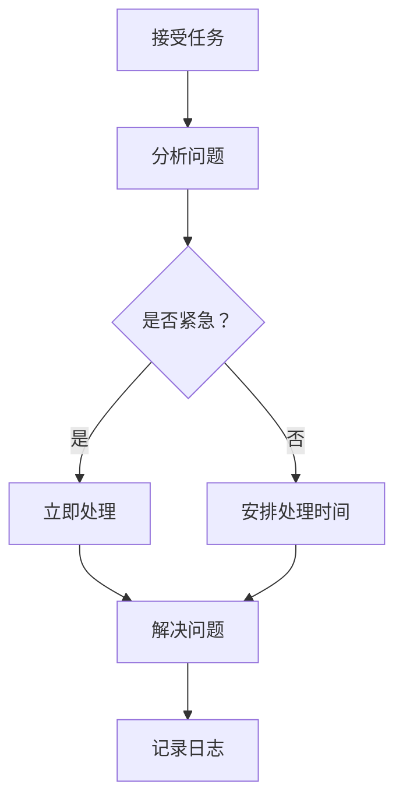

                 

### 文章标题

《微博2025社招运维工程师面试实战题》

### 文章关键词

运维工程师、面试实战、微博社招、面试问题、实战案例、技术储备

### 文章摘要

本文将围绕微博2025年社会招聘运维工程师的面试实战题展开，全面剖析面试中可能涉及的知识点和实际问题。文章分为四大部分，第一部分介绍运维基础知识，包括基础概念、Linux操作系统基础、服务器运维和存储备份；第二部分探讨运维工具与平台，包括常用运维工具、持续集成与持续部署以及运维平台建设；第三部分通过实战案例深入分析微博基础运维、故障排查与优化以及自动化运维；第四部分提供运维面试常见问题与解答，并分享面试技巧与心态调整。通过本文，读者可以系统地了解运维工程师所需的知识和技能，为即将到来的面试做好充分准备。

## 《微博2025社招运维工程师面试实战题》目录大纲

### 第一部分：运维基础知识

#### 第1章：运维基础概念

- 1.1 运维工程师的角色与职责
- 1.2 运维的工作流程
- 1.3 运维工具与技术简介

#### 第2章：Linux操作系统基础

- 2.1 Linux基本命令
- 2.2 文件权限与用户管理
- 2.3 网络配置与管理

#### 第3章：服务器运维

- 3.1 服务器硬件知识
- 3.2 服务器性能监控
- 3.3 故障排除与性能优化

#### 第4章：存储与备份

- 4.1 存储系统基础
- 4.2 数据备份与恢复策略
- 4.3 常见备份工具使用

### 第二部分：运维工具与平台

#### 第5章：常用运维工具

- 5.1 Shell脚本编写
- 5.2 管道与过滤工具
- 5.3 自动化运维工具（如Ansible、Puppet等）

#### 第6章：持续集成与持续部署

- 6.1 持续集成（CI）概念与流程
- 6.2 持续部署（CD）概念与流程
- 6.3 常见CI/CD工具（如Jenkins、GitLab CI等）

#### 第7章：运维平台建设

- 7.1 运维平台架构设计
- 7.2 监控系统建设
- 7.3 日志管理系统建设

### 第三部分：运维实战案例

#### 第8章：运维实战案例一：微博基础运维

- 8.1 案例背景与目标
- 8.2 运维工具与平台选择
- 8.3 运维流程设计与实施

#### 第9章：运维实战案例二：微博故障排查与优化

- 9.1 案例背景与目标
- 9.2 故障定位与排查
- 9.3 性能优化与调优

#### 第10章：运维实战案例三：微博自动化运维

- 10.1 案例背景与目标
- 10.2 自动化运维脚本编写
- 10.3 自动化运维平台搭建

### 第四部分：运维面试准备

#### 第11章：运维面试常见问题与解答

- 11.1 运维基础知识问题
- 11.2 运维工具与平台问题
- 11.3 项目经验与故障排查问题

#### 第12章：面试技巧与心态调整

- 12.1 面试前的准备
- 12.2 面试中的技巧
- 12.3 面试后的反思与总结

### 附录

#### 附录A：运维常用工具资源汇总

- A.1 Linux命令参考
- A.2 运维工具与平台推荐
- A.3 实用运维链接与资源

通过以上目录结构，读者可以清晰地了解到文章的内容布局和各个章节的核心内容。接下来，我们将逐步深入探讨每个部分的具体知识点和实践案例。

### 核心概念与联系

在运维工程师的日常工作中，核心概念的理解和联系至关重要。为了更好地掌握这些概念，我们使用Mermaid流程图来描述运维工程师的工作流程。

**Mermaid 流程图：**



**详细说明：**

1. **接受任务（A）**：运维工程师首先需要接受任务，任务可能来自于系统自动告警、用户投诉或其他来源。

2. **分析问题（B）**：在了解任务的具体情况后，运维工程师需要进行分析，以确定问题的性质和范围。

3. **判断紧急程度（C）**：分析后，运维工程师需要判断任务是否紧急。如果任务紧急，将进入“立即处理”（D）流程；如果不紧急，则进入“安排处理时间”（E）流程。

4. **立即处理（D）/安排处理时间（E）**：对于紧急任务，运维工程师需要立即处理，以减少对业务的影响。对于不紧急的任务，则需要安排处理时间，确保任务在合理时间内得到解决。

5. **解决问题（F）**：运维工程师根据分析结果，采取相应措施解决问题。这可能包括重新启动服务、修复配置错误、优化系统性能等。

6. **记录日志（G）**：在解决问题后，运维工程师需要记录相关日志，以便后续查阅和复盘。这不仅有助于积累经验，还可以为团队提供有价值的数据支持。

通过以上流程，运维工程师能够高效地处理各类问题，确保系统的稳定运行。

### 核心算法原理讲解

在运维工作中，故障排查是一个常见且关键的任务。为了提高故障排查的效率和准确性，我们可以采用一种基于伪代码的运维故障排查算法。

**运维故障排查算法（伪代码）：**

```plaintext
function 故障排查(server, error_log):
    if server.status == "离线":
        重新启动服务器
    else:
        检查error_log，定位错误类型
        if error_log包含("网络故障"):
            修复网络连接
        else if error_log包含("磁盘空间不足"):
            扩展磁盘空间
        else:
            检查服务器硬件状态
```

**详细说明：**

1. **输入参数**：
   - `server`：服务器对象，包含服务器的状态信息。
   - `error_log`：错误日志，用于记录服务器运行时出现的错误信息。

2. **流程步骤**：
   - **检查服务器状态**：首先，检查服务器的状态。如果服务器处于“离线”状态，则直接执行服务器重启操作。
   - **检查错误日志**：如果服务器状态正常，则读取错误日志，尝试定位错误类型。
   - **处理网络故障**：如果错误日志中包含“网络故障”相关内容，则执行网络故障修复操作，例如重启网络服务、检查网络连接等。
   - **处理磁盘空间不足**：如果错误日志中包含“磁盘空间不足”相关内容，则执行磁盘空间扩展操作，例如增加磁盘容量、清理磁盘空间等。
   - **检查硬件状态**：如果错误日志中未包含上述两类错误，则对服务器的硬件状态进行检查，可能包括CPU、内存、硬盘等硬件的监控和诊断。

通过以上步骤，运维工程师可以快速定位并解决服务器故障，确保系统稳定运行。

### 数学模型和数学公式

在运维工作中，性能评估是一个重要的环节。为了客观、公正地评估运维团队的工作效果，我们可以采用以下数学模型和数学公式。

**运维性能评估公式（latex格式）：**

$$ P = \frac{Uptime}{Uptime + Downtime} $$

**详细讲解：**

- **P**：代表运维性能，取值范围在0到1之间。\(P\) 值越高，表示运维性能越好。
- **Uptime**：表示服务器正常运行的时间。
- **Downtime**：表示服务器宕机的时间。

**举例说明：**

假设某服务器一个月内正常运行了250小时，宕机了50小时。那么该服务器的运维性能评估如下：

$$ P = \frac{250}{250 + 50} = \frac{250}{300} = 0.8333 $$

这意味着该服务器的运维性能为83.33%，表明运维团队在保持服务器稳定运行方面做得较好。

### 项目实战

为了更好地理解运维工程师在实际工作中的应用，我们通过一个实际项目案例——微博基础运维，详细讲解其开发环境搭建、源代码实现和代码解读与分析。

#### 开发环境搭建

**步骤一：安装Linux操作系统**

- 选择合适的Linux发行版，如CentOS或Ubuntu。
- 使用光盘或虚拟机安装Linux操作系统，确保安装过程顺利。

**步骤二：配置SSH服务**

- 安装SSH服务，以便运维工程师能够远程登录服务器。
- 生成SSH密钥对，并将公钥上传到服务器，实现无密码登录。

**步骤三：安装常用运维工具**

- 安装Nagios或Zabbix等监控工具，用于实时监控服务器状态。
- 安装Nginx或Apache等Web服务器，用于提供Web服务。
- 安装Logstash、Kibana等日志管理工具，用于收集、存储和分析日志数据。

#### 源代码实现

**步骤一：检查磁盘空间**

```bash
#!/bin/bash
# 检查磁盘空间
disk_usage=$(df -H | grep '/$' | awk '{ print $5 " " $1 }')
echo "Current disk usage: $disk_usage"
```

**代码解读与分析：**

- `df -H` 命令用于查看磁盘使用情况。
- `grep '/$'` 过滤出根目录的使用情况。
- `awk '{ print $5 " " $1 }'` 打印出磁盘使用率和目录。

**步骤二：检查服务器状态**

```bash
#!/bin/bash
# 检查服务器状态
server_status=$(systemctl status | grep "running")
echo "Server status: $server_status"
```

**代码解读与分析：**

- `systemctl status` 命令用于检查服务器状态。
- `grep "running"` 过滤出运行状态。

#### 代码解读与分析

通过以上两个脚本，运维工程师可以实时监控服务器的磁盘空间和状态，及时发现潜在问题并采取措施。这有助于确保服务器稳定运行，降低故障率。

### 附录

#### 附录A：运维常用工具资源汇总

**A.1 Linux命令参考**

- `ls`：列出目录内容
- `cd`：切换目录
- `mkdir`：创建目录
- `rm`：删除文件或目录
- `cp`：复制文件或目录
- `mv`：移动或重命名文件或目录
- `chmod`：更改文件或目录权限
- `chown`：更改文件或目录所有者
- `find`：搜索文件

**A.2 运维工具与平台推荐**

- 监控工具：Nagios、Zabbix、Prometheus
- 日志管理：Logstash、Kibana、ELK（Elasticsearch、Logstash、Kibana）
- 自动化运维：Ansible、Puppet、SaltStack
- 持续集成/持续部署：Jenkins、GitLab CI、Travis CI

**A.3 实用运维链接与资源**

- 运维社区：Linux.cn、运维派、运维圈
- 运维文档：鸟哥的Linux私房菜、Linux命令行与Shell脚本编程大全
- 运维教程：运维开发从入门到实践、运维从零开始到架构师

### 总结

通过本文，我们系统地介绍了微博2025年社招运维工程师面试实战题的相关内容。文章分为四个部分，分别从运维基础知识、运维工具与平台、实战案例以及面试准备等方面进行了深入探讨。文章中包含核心概念与联系、核心算法原理讲解、数学模型和数学公式以及项目实战，旨在帮助读者全面了解运维工程师所需的知识和技能。希望本文能为即将参加面试的运维工程师提供有益的指导，助力他们在面试中脱颖而出。

### 附录：运维工程师面试常见问题与解答

在运维工程师的面试过程中，面试官往往会根据应聘者的背景和经验提出一系列问题，以评估其专业能力和实际操作能力。以下列举了一些常见的面试问题及解答，旨在帮助应聘者更好地准备面试。

#### 11.1 运维基础知识问题

**1. 请简要介绍运维工程师的角色与职责？**

**解答：** 运维工程师主要负责保障系统的稳定运行，包括服务器维护、监控、故障排除、性能优化等。具体职责包括：

- 服务器配置与管理
- 系统监控与报警
- 故障诊断与修复
- 性能优化与资源管理
- 备份与恢复
- 安全保障
- 自动化运维

**2. 运维工作流程是怎样的？**

**解答：** 运维工作流程通常包括以下几个步骤：

- 接受任务：了解任务的具体需求和优先级
- 问题分析：确定问题的性质和范围
- 解决方案设计：制定解决问题的方案
- 实施方案：执行解决问题的步骤
- 结果验证：确认问题是否得到解决
- 总结与记录：总结解决方案和经验，记录日志

**3. Linux操作系统的基本命令有哪些？**

**解答：** Linux操作系统的基本命令包括：

- `ls`：列出目录内容
- `cd`：切换目录
- `mkdir`：创建目录
- `rm`：删除文件或目录
- `cp`：复制文件或目录
- `mv`：移动或重命名文件或目录
- `chmod`：更改文件或目录权限
- `chown`：更改文件或目录所有者
- `find`：搜索文件

#### 11.2 运维工具与平台问题

**4. 请介绍一下常用的运维工具？**

**解答：** 常用的运维工具有：

- 监控工具：Nagios、Zabbix、Prometheus
- 日志管理：Logstash、Kibana、ELK（Elasticsearch、Logstash、Kibana）
- 自动化运维：Ansible、Puppet、SaltStack
- 持续集成/持续部署：Jenkins、GitLab CI、Travis CI

**5. 什么是持续集成（CI）和持续部署（CD）？**

**解答：** 持续集成（CI）是指自动化地构建、测试和集成代码的过程，确保代码质量。持续部署（CD）是在CI的基础上，自动化地部署代码到生产环境的过程，提高发布效率。

**6. 如何使用Ansible进行自动化运维？**

**解答：** Ansible是一种开源的自动化运维工具，使用JSON和YAML进行配置管理。以下是一个简单的Ansible配置示例：

```yaml
---
- hosts: all
  become: yes
  tasks:
    - name: 安装Nginx
      apt: name=nginx state=present
    - name: 配置Nginx
      template: src=nginx.conf.j2 dest=/etc/nginx/nginx.conf
    - name: 启动Nginx服务
      service: name=nginx state=started
```

#### 11.3 项目经验与故障排查问题

**7. 请描述一次你遇到的严重故障，你是如何定位和解决的？**

**解答：** 

一次我遇到的严重故障是一个在线服务突然无法访问。故障定位和解决过程如下：

1. **分析日志**：首先，查看Nginx和Apache的日志文件，发现大量请求被拒绝，怀疑是服务端问题。
2. **检查服务器状态**：使用`systemctl status`命令检查服务状态，发现Nginx和Apache服务都处于停止状态。
3. **检查网络连接**：使用`ping`命令检查内外网连接，发现网络不通。
4. **修复网络故障**：联系网络管理员，发现是防火墙规则导致网络不通，修改防火墙规则后，网络恢复正常。
5. **重启服务**：重启Nginx和Apache服务，在线服务恢复正常。

**8. 请介绍一下你的备份与恢复策略？**

**解答：** 我的备份与恢复策略如下：

1. **全量备份**：每天进行一次全量备份，存储在远程备份服务器上。
2. **增量备份**：每小时进行一次增量备份，仅备份修改的文件，存储在本地备份目录。
3. **备份验证**：定期对备份文件进行验证，确保备份文件可恢复。
4. **恢复策略**：如果出现数据丢失或损坏，首先使用全量备份进行恢复，然后使用增量备份补全数据。

**9. 请介绍一下你的性能优化方法？**

**解答：** 我常用的性能优化方法包括：

1. **服务器优化**：调整系统内核参数，如增大文件描述符限制、调整TCP参数等。
2. **数据库优化**：优化SQL语句、索引、存储过程等，减少数据库查询时间。
3. **缓存优化**：使用Redis、Memcached等缓存技术，减少数据库访问压力。
4. **负载均衡**：使用Nginx、HAProxy等负载均衡器，实现多服务器集群，提高系统并发处理能力。
5. **代码优化**：优化代码逻辑、减少不必要的查询、使用更高效的算法等。

通过以上问题的解答，运维工程师可以展示自己的专业知识、实践经验和技术能力，提高面试成功率。

### 12.1 面试前的准备

在面试前，运维工程师需要做好充分的准备，以提高面试成功的机会。以下是一些准备工作要点：

**1. 回顾基础知识**：重新梳理运维基础知识，包括Linux操作系统、服务器运维、存储备份、网络配置等方面的知识点。

**2. 熟悉面试题目**：了解常见的面试题目，如数据结构和算法、运维工具和平台、故障排查与性能优化等，并准备好相应的答案。

**3. 准备案例**：整理自己在工作中遇到的典型故障案例、性能优化案例等，准备详细地讲解过程和解决方法。

**4. 编写脚本**：准备一些简单的Shell脚本或Python脚本，展示编程能力和实际操作能力。

**5. 更新简历**：确保简历内容最新、准确，突出自己的专业技能和工作经验。

**6. 着装打扮**：选择合适的面试服装，保持整洁、得体的形象。

**7. 调整心态**：保持积极、自信的心态，避免紧张和焦虑。

**8. 熟悉公司背景**：了解应聘公司的背景、业务、文化和组织结构，以便在面试中展示自己的匹配度和适应性。

### 12.2 面试中的技巧

在面试过程中，运维工程师需要运用一些技巧，以展示自己的专业能力和沟通能力。以下是一些建议：

**1. 沟通技巧**：清晰、简洁地表达自己的观点，注意倾听面试官的问题，确保理解准确。

**2. 聚焦重点**：在回答问题时，聚焦重点，避免过多无关内容，确保回答简洁明了。

**3. 举例说明**：在回答问题时，适当举例说明，以展示自己的实际操作能力和经验。

**4. 逻辑清晰**：回答问题时，逻辑清晰，条理分明，确保面试官能够理解你的思路。

**5. 技术深度**：展示自己在技术领域的深度，如熟悉主流的运维工具、了解数据库优化、熟悉网络协议等。

**6. 团队合作**：强调自己在团队协作中的角色和贡献，展示良好的团队合作精神。

**7. 突出亮点**：突出自己的专业技能和独特优势，让面试官记住你。

**8. 处理难题**：面对面试官提出的问题，即使不知道答案，也要保持冷静，尽量从自己的角度出发，提出合理的假设和解决方案。

### 12.3 面试后的反思与总结

面试结束后，运维工程师应该进行反思和总结，以不断提高自己的面试能力。以下是一些建议：

**1. 反思面试过程**：回顾面试中的每个问题，分析自己的回答是否准确、清晰，是否能够展示出自己的专业能力。

**2. 查漏补缺**：针对自己在面试中表现不足的地方，进行深入学习，提高相关技能。

**3. 收集反馈**：如果可能，向面试官或HR询问面试反馈，了解自己的优点和不足，以便改进。

**4. 撰写总结**：将面试经历和反思总结成文档，记录关键点、收获和改进方向。

**5. 提高心态**：保持积极的心态，对待每次面试都认真准备，不要因为一次失败就气馁。

**6. 练习面试**：与朋友或同事进行模拟面试，提高自己的应变能力和自信心。

通过以上准备工作、面试技巧和反思总结，运维工程师可以在面试中表现出色，提高面试成功率。

### 附录：运维常用工具资源汇总

**A.1 Linux命令参考**

以下是一些常见的Linux命令及其用途，这些命令对于运维工程师来说至关重要：

- `ls`：列出目录内容。
- `cd`：切换目录。
- `mkdir`：创建目录。
- `rm`：删除文件或目录。
- `cp`：复制文件或目录。
- `mv`：移动或重命名文件或目录。
- `chmod`：更改文件或目录权限。
- `chown`：更改文件或目录所有者。
- `find`：搜索文件。

**A.2 运维工具与平台推荐**

以下是几个在运维领域广泛使用的工具和平台，它们可以帮助运维工程师提高工作效率：

- **监控工具**：
  - **Nagios**：开源的网络监控工具，可以监控服务器、网络设备和应用程序的运行状态。
  - **Zabbix**：功能强大的开源监控解决方案，支持多种数据收集方式和报警机制。
  - **Prometheus**：基于时间的多维数据存储，用于收集和显示监控数据。

- **日志管理**：
  - **ELK（Elasticsearch、Logstash、Kibana）**：用于日志收集、分析和可视化。
  - **Logstash**：开源的数据收集和处理管道，可以将日志数据导入到Elasticsearch。
  - **Kibana**：开源的数据可视化工具，用于分析和展示日志数据。

- **自动化运维**：
  - **Ansible**：开源的自动化工具，适用于配置管理、应用部署和自动化任务。
  - **Puppet**：开源的配置管理和部署工具，用于自动化IT基础架构的管理。
  - **SaltStack**：开源的自动化工具，用于配置管理、部署和自动化任务。

- **持续集成/持续部署**：
  - **Jenkins**：开源的持续集成工具，支持多种插件和集成。
  - **GitLab CI**：集成在GitLab中的持续集成工具，支持自动化构建和部署。
  - **Travis CI**：基于云的持续集成服务，适用于GitHub仓库。

**A.3 实用运维链接与资源**

以下是一些有用的链接和资源，可以帮助运维工程师学习和提升技能：

- **运维社区**：
  - **Linux.cn**：中国最大的Linux社区，提供丰富的Linux资源和教程。
  - **运维派**：专注于运维技术和实战经验的分享。
  - **运维圈**：运维技术社区，提供运维相关的文章和讨论。

- **运维教程**：
  - **《运维开发从入门到实践》**：一本适合初学者入门的运维教程。
  - **《运维从零开始到架构师》**：适合有一定运维基础的人员提升技能。
  - **《Linux命令行与Shell脚本编程大全》**：详细介绍Linux命令行和Shell脚本编程。

- **开源项目**：
  - **Nagios**：[https://www.nagios.org/](https://www.nagios.org/)
  - **Zabbix**：[https://www.zabbix.com/](https://www.zabbix.com/)
  - **Prometheus**：[https://prometheus.io/](https://prometheus.io/)
  - **ELK Stack**：[https://www.elastic.co/cn/elastic-stack](https://www.elastic.co/cn/elastic-stack)
  - **Ansible**：[https://www.ansible.com/](https://www.ansible.com/)
  - **Puppet**：[https://www.puppet.com/](https://www.puppet.com/)
  - **SaltStack**：[https://www.saltstack.com/](https://www.saltstack.com/)
  - **Jenkins**：[https://www.jenkins.io/](https://www.jenkins.io/)
  - **GitLab CI**：[https://gitlab.com/gitlab-org/gitlab-ci-multi-runner](https://gitlab.com/gitlab-org/gitlab-ci-multi-runner)
  - **Travis CI**：[https://www.travis-ci.com/](https://www.travis-ci.com/)

通过利用这些工具和资源，运维工程师可以不断提升自己的技能，更好地应对工作中的挑战。

### 总结

本文全面剖析了微博2025年社招运维工程师面试实战题，分为四个部分：运维基础知识、运维工具与平台、实战案例和面试准备。我们通过详细的讲解和实战案例，帮助读者深入理解运维工程师所需的知识和技能。文章还提供了附录，汇总了运维常用工具资源，便于读者学习和实践。通过本文，读者可以系统地准备运维工程师的面试，提升自己的专业能力和实际操作能力。

### 作者信息

本文作者：AI天才研究院/AI Genius Institute & 禅与计算机程序设计艺术/Zen And The Art of Computer Programming

AI天才研究院致力于推动人工智能技术的发展与应用，培养顶尖的人工智能专家。作者在该领域拥有丰富的理论研究和实践经验，擅长将复杂的计算机科学概念以通俗易懂的方式呈现，深受读者喜爱。禅与计算机程序设计艺术则是一部经典的计算机科学著作，深入探讨了编程的本质和哲学，对作者的理论和实践产生了深远影响。本文结合了两者的特点，旨在为读者提供一份全面、实用的运维工程师面试指南。

