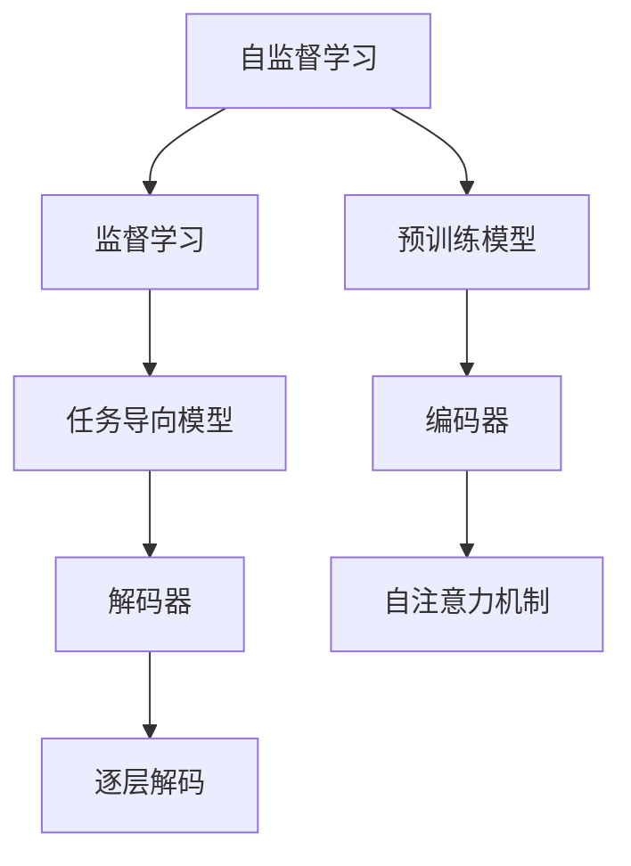
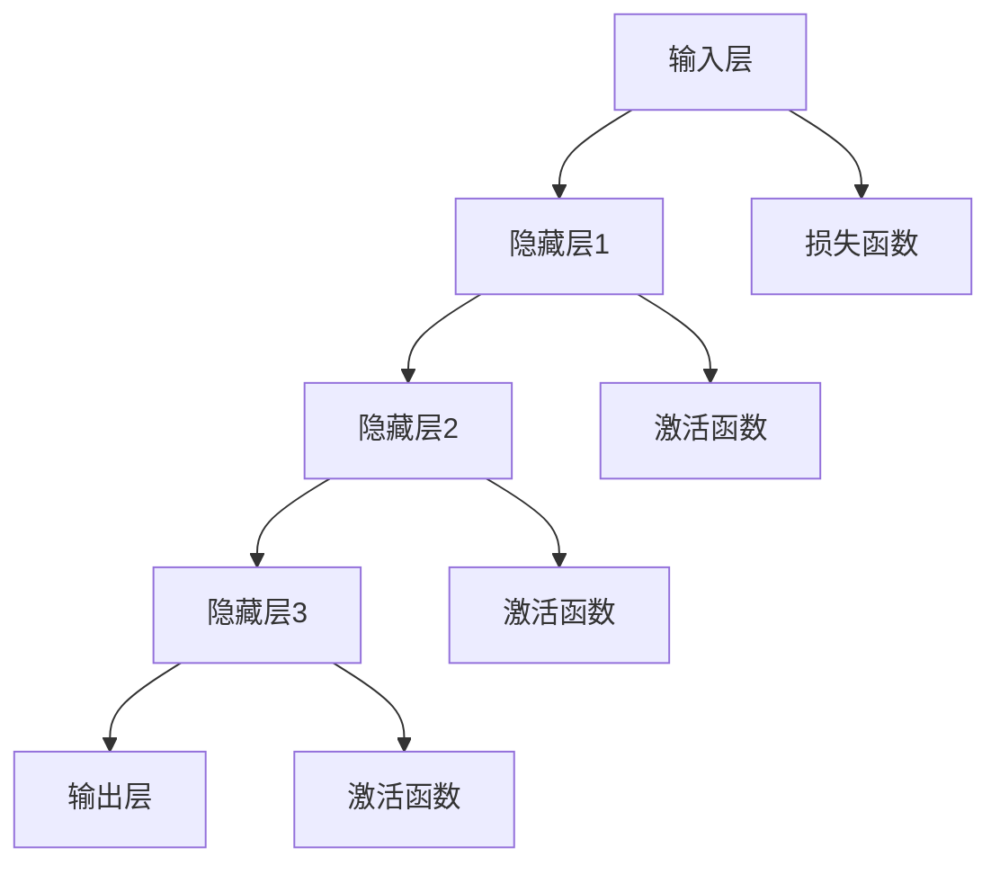

                 

### 文章标题

《打造高效的LLM应用开发流程：从架构到实践》

### 文章关键词

LLM，应用开发，架构设计，数学模型，优化技术，多模态数据，生产环境部署，案例分享

### 文章摘要

本文旨在为开发者提供一个全面、系统的LLM（大型语言模型）应用开发流程，从基础概念到具体实践。文章首先介绍了LLM的基本概念、架构和核心技术，然后详细探讨了数学模型基础，以及LLM系统架构设计原则。接着，文章深入讨论了LLM数据处理与预处理技术，以及模型选择与优化方法。此外，本文还涵盖了LLM在自然语言处理和多模态数据中的应用实例，并分享了LLM在生产环境中的部署与优化策略。最后，通过实际案例分享，展示了LLM在智能客服、智能推荐、智能写作和智能语音助手等领域的应用效果。本文将为开发者提供丰富的知识和实践经验，帮助他们高效地打造LLM应用。

### 目录大纲

1. 第一部分: LLM应用开发的预备知识
    1.1 LLM基础概念与架构概述
    1.2 LLM的数学模型基础
    1.3 LLM应用架构设计原则
    1.4 LLM数据处理与预处理
    1.5 LLM模型选择与优化
2. 第二部分: LLM应用架构设计
    2.1 LLM系统架构设计原则
    2.2 LLM数据处理与预处理
    2.3 LLM模型选择与优化
    2.4 LLM应用开发实践
3. 第三部分: LLM应用开发实践
    3.1 LLM在自然语言处理中的应用
    3.2 LLM在多模态数据中的应用
    3.3 LLM在生产环境中的部署与优化
    3.4 LLM应用案例分享
    3.5 LLM应用开发的未来趋势与挑战
4. 附录
    4.1 开源框架介绍
    4.2 常用数据处理工具
    4.3 实践教程与资源推荐
    4.4 论文与报告
    4.5 开源项目和社区

### 第一部分: LLM应用开发的预备知识

在这一部分，我们将深入探讨LLM（大型语言模型）的基础概念、数学模型基础以及应用架构设计原则。通过这些预备知识的学习，读者将能够更好地理解LLM的核心原理，为后续章节的应用开发打下坚实的基础。

#### 1.1 LLM基础概念与架构概述

LLM，即大型语言模型，是一种通过学习海量文本数据，能够理解和生成自然语言的模型。它主要包括自监督学习和监督学习两种学习模式。自监督学习是指模型在无标签数据上进行训练，利用文本中的内在信息进行学习。监督学习则是模型在有标签数据上进行训练，学习到文本数据的语义和语法特征。

LLM的架构通常由编码器（Encoder）和解码器（Decoder）组成。编码器负责将输入文本转换为向量表示，解码器则根据编码器的输出生成文本输出。其中，基于Transformer架构的语言模型如BERT、GPT等，已成为当前LLM领域的主流模型。

#### 1.2 LLM的数学模型基础

为了深入理解LLM的工作原理，我们需要掌握一些数学模型基础。主要包括线性代数、微积分、概率论与统计以及机器学习基础知识。

- **线性代数基础**：包括向量与矩阵运算、线性方程组求解、特征值与特征向量等。这些概念是理解和设计神经网络模型的基础。
  
- **微积分基础**：包括导数、微分、积分以及多变量微积分等。微积分用于计算损失函数的梯度，从而优化模型参数。

- **概率论与统计基础**：包括概率分布、随机变量、统计分布以及统计推断等。概率论与统计用于评估模型性能，以及进行模型训练和优化。

- **机器学习基础知识**：包括监督学习、无监督学习、强化学习等。这些基础知识用于设计、实现和应用LLM模型。

#### 1.3 LLM应用架构设计原则

LLM应用架构设计原则包括分层设计、模块化设计、扩展性与可维护性设计以及高可用性与容错性设计。

- **分层设计**：将系统分为多个层次，每个层次负责特定的功能。例如，可以将系统分为数据层、模型层、服务层和界面层。这种设计使得系统更加模块化，便于维护和扩展。

- **模块化设计**：将系统分解为多个模块，每个模块独立开发、测试和部署。模块化设计提高了系统的可维护性和可扩展性。

- **扩展性与可维护性设计**：系统应具备良好的扩展性和可维护性，能够适应业务需求的变化。例如，可以采用微服务架构，使得不同功能模块可以独立扩展和更新。

- **高可用性与容错性设计**：系统应具备高可用性和容错性，能够在出现故障时快速恢复，保证业务的连续性。例如，可以采用分布式架构，实现数据的冗余备份和故障转移。

#### 1.4 LLM数据处理与预处理

LLM数据处理与预处理是模型训练的重要环节，主要包括数据集准备、数据预处理技术、数据增强与数据清洗等。

- **数据集准备**：收集和整理适合训练的数据集，包括文本数据、标签数据等。数据集的多样性和质量直接影响模型性能。

- **数据预处理技术**：包括分词、去除停用词、词干提取等。这些技术用于将原始文本数据转换为适合模型训练的格式。

- **数据增强与数据清洗**：数据增强包括数据复制、随机裁剪、数据变换等，用于增加数据多样性，提高模型泛化能力。数据清洗包括去除噪声数据、处理缺失值等，确保数据质量。

### 第一部分总结

本部分介绍了LLM的基础概念、数学模型基础和应用架构设计原则。通过学习这些内容，读者将能够对LLM有一个全面的理解，为后续的应用开发打下坚实的基础。在下一部分，我们将进一步探讨LLM在自然语言处理、多模态数据、生产环境部署等方面的应用，以及具体的实践方法和案例。

### 第1章: LLM基础概念与架构概述

在人工智能领域中，大型语言模型（Large Language Model，简称LLM）已经成为自然语言处理（Natural Language Processing，简称NLP）领域的重要突破。LLM能够通过对海量文本数据的学习，实现文本生成、文本分类、问答系统等多种任务。本章将详细探讨LLM的基础概念、分类、架构组成以及发展趋势。

#### 1.1 LLM的定义与分类

**1.1.1 LLM的定义**

LLM是一种能够理解和生成自然语言文本的复杂机器学习模型。它通过对大规模文本数据进行训练，学习到语言的内在结构和语义信息。LLM的核心任务是生成符合语法和语义规则的自然语言文本。

**1.1.2 LLM的分类**

LLM可以根据学习模式、模型架构、训练目标和应用领域进行分类。

- **按学习模式分类**：
  - **自监督学习（Self-supervised Learning）**：模型在无监督数据上进行训练，例如GPT系列模型。这类模型通常使用掩码语言建模（Masked Language Modeling，MLM）任务，通过预测掩码的单词来学习。
  - **监督学习（Supervised Learning）**：模型在有监督数据上进行训练，例如BERT系列模型。这类模型通常使用分类、标注等任务，从标记数据中学习。

- **按模型架构分类**：
  - **基于循环神经网络（RNN）的模型**：如LSTM、GRU等，这类模型能够处理长序列数据，但计算复杂度高。
  - **基于变换器（Transformer）的模型**：如BERT、GPT等，这类模型采用自注意力机制，能够并行处理数据，计算效率更高。

- **按训练目标分类**：
  - **预训练模型**：如BERT、GPT等，这类模型在通用文本数据上进行预训练，然后通过微调（Fine-tuning）适用于特定任务。
  - **任务导向模型**：这类模型直接在特定任务上进行训练，如问答系统、文本分类等。

- **按应用领域分类**：
  - **自然语言处理**：文本分类、文本生成、机器翻译、问答系统等。
  - **多模态处理**：结合文本、图像、语音等多模态数据，进行综合分析。
  - **智能交互**：智能客服、智能写作、智能语音助手等。

#### 1.2 LLM的架构组成

LLM的架构通常由编码器（Encoder）和解码器（Decoder）两部分组成。编码器负责将输入文本编码为向量表示，解码器则根据编码器的输出生成文本输出。

**1.2.1 编码器**

编码器通常基于变换器（Transformer）架构，其核心是自注意力机制（Self-Attention Mechanism）。自注意力机制允许编码器在处理序列数据时，根据序列中每个元素的重要程度进行加权，从而捕捉到长距离依赖关系。具体实现包括多头自注意力（Multi-head Self-Attention）和位置编码（Positional Encoding）。

**1.2.2 解码器**

解码器同样基于变换器架构，其核心也是自注意力机制。解码器在生成文本输出时，需要参考编码器的输出和解码器自身的输出。解码器的输出通过逐层解码（Layer-by-layer Decoding）生成，每个时间步的输出作为下一个时间步的输入。

#### 1.3 LLM的核心技术介绍

LLM的核心技术包括预训练与微调、多语言模型与低资源语言处理、语言生成与文本生成模型等。

**1.3.1 预训练与微调**

预训练（Pre-training）是指模型在通用文本数据集上进行大规模训练，学习到通用语言特征。预训练后的模型可以通过微调（Fine-tuning）快速适应特定任务。微调过程通常在较小规模的任务数据集上进行，通过调整模型参数，使模型在特定任务上达到最佳性能。

**1.3.2 多语言模型与低资源语言处理**

多语言模型（Multilingual Model）能够同时处理多种语言数据，适用于低资源语言的处理。低资源语言处理（Low-resource Language Processing）是指模型在语言资源匮乏的情况下，仍能有效地进行语言理解和生成。多语言模型和低资源语言处理技术为全球范围内的自然语言处理提供了有力支持。

**1.3.3 语言生成与文本生成模型**

语言生成（Language Generation）是指模型根据输入生成自然语言文本。文本生成模型（Text Generation Model）是指能够根据输入生成文本的神经网络模型，如GPT系列。语言生成技术广泛应用于聊天机器人、智能写作、机器翻译等领域。

#### 1.4 LLM应用的发展趋势与前景

LLM的应用趋势正在不断扩大，涵盖了自然语言处理、智能交互、多模态处理等多个领域。未来，LLM的应用前景将更加广阔，主要体现在以下几个方面：

**1.4.1 应用领域拓展**

LLM的应用将不断拓展到新的领域，如智能教育、医疗健康、法律咨询等。这些领域对自然语言理解、文本生成和知识表示等技术的需求日益增长。

**1.4.2 技术挑战与解决方案**

随着LLM模型的不断壮大，其计算资源需求、训练时间以及数据隐私等问题也逐渐显现。未来，需要开发更高效的算法和硬件支持，以及采取有效的数据隐私保护措施。

**1.4.3 开发者技能要求与培养**

随着LLM技术的快速发展，对开发者的技能要求也在不断提高。开发者需要掌握深度学习、自然语言处理、分布式系统设计等多方面的知识。同时，教育机构和行业组织也应加大人才培养力度，为LLM技术的发展提供源源不断的人才支持。

### Mermaid流程图

下面是一个简单的Mermaid流程图，展示了LLM的基础概念和架构组成。



### 伪代码

以下是一个简化的伪代码，展示了预训练和微调的基本流程。

```python
# 预训练伪代码
def pretrain(model, data_loader, num_epochs):
    for epoch in range(num_epochs):
        for batch in data_loader:
            model.train_on_batch(batch)
            loss = model.evaluate(batch)
            print(f"Epoch: {epoch}, Loss: {loss}")

# 微调伪代码
def fine_tune(model, task_data_loader, num_epochs):
    for epoch in range(num_epochs):
        for batch in task_data_loader:
            model.train_on_batch(batch)
            loss = model.evaluate(batch)
            print(f"Epoch: {epoch}, Loss: {loss}")
```

### 数学公式

在LLM中，自注意力机制是一个核心概念，其计算公式如下：

$$
\text{Attention}(Q, K, V) = \text{softmax}\left(\frac{QK^T}{\sqrt{d_k}}\right)V
$$

其中，$Q$、$K$ 和 $V$ 分别是查询向量、键向量和值向量，$d_k$ 是键向量的维度。

### 举例说明

假设我们使用一个预训练的BERT模型进行情感分析任务。首先，我们将输入文本编码为向量表示，然后通过BERT模型进行预训练，学习到通用语言特征。接着，我们在情感分析数据集上对模型进行微调，使其能够识别文本的情感极性。最后，我们将微调后的模型部署到生产环境中，实现实时的情感分析服务。

### 1.1.1 LLM的定义与分类

**LLM的定义**

LLM，即大型语言模型，是一种能够理解和生成自然语言文本的复杂机器学习模型。它通过对海量文本数据的学习，能够捕捉到语言的内在结构和语义信息。LLM的核心任务是生成符合语法和语义规则的自然语言文本。

**LLM的分类**

LLM可以根据学习模式、模型架构、训练目标和应用领域进行分类。

**按学习模式分类**

- **自监督学习（Self-supervised Learning）**：模型在无标签数据上进行训练，例如GPT系列模型。这类模型通常使用掩码语言建模（Masked Language Modeling，MLM）任务，通过预测掩码的单词来学习。
  
- **监督学习（Supervised Learning）**：模型在有标签数据上进行训练，例如BERT系列模型。这类模型通常使用分类、标注等任务，从标记数据中学习。

**按模型架构分类**

- **基于循环神经网络（RNN）的模型**：如LSTM、GRU等，这类模型能够处理长序列数据，但计算复杂度高。
  
- **基于变换器（Transformer）的模型**：如BERT、GPT等，这类模型采用自注意力机制，能够并行处理数据，计算效率更高。

**按训练目标分类**

- **预训练模型**：如BERT、GPT等，这类模型在通用文本数据上进行预训练，然后通过微调（Fine-tuning）适用于特定任务。
  
- **任务导向模型**：这类模型直接在特定任务上进行训练，如问答系统、文本分类等。

**按应用领域分类**

- **自然语言处理**：文本分类、文本生成、机器翻译、问答系统等。
  
- **多模态处理**：结合文本、图像、语音等多模态数据，进行综合分析。
  
- **智能交互**：智能客服、智能写作、智能语音助手等。

### 1.2 LLM的架构组成

LLM的架构通常由编码器（Encoder）和解码器（Decoder）两部分组成。编码器负责将输入文本编码为向量表示，解码器则根据编码器的输出生成文本输出。

**1.2.1 编码器**

编码器通常基于变换器（Transformer）架构，其核心是自注意力机制（Self-Attention Mechanism）。自注意力机制允许编码器在处理序列数据时，根据序列中每个元素的重要程度进行加权，从而捕捉到长距离依赖关系。具体实现包括多头自注意力（Multi-head Self-Attention）和位置编码（Positional Encoding）。

编码器的输入是一个词嵌入（Word Embedding）序列，每个词嵌入是一个向量。编码器通过多个自注意力层和前馈网络（Feedforward Network），对输入序列进行处理，最终输出一个固定长度的向量表示。

**1.2.2 解码器**

解码器同样基于变换器架构，其核心也是自注意力机制。解码器在生成文本输出时，需要参考编码器的输出和解码器自身的输出。解码器的输出通过逐层解码（Layer-by-layer Decoding）生成，每个时间步的输出作为下一个时间步的输入。

解码器首先使用一个掩码自注意力（Masked Self-Attention）层，防止生成器在生成下一个单词时参考还未生成的单词。然后，解码器通过交叉自注意力（Cross-Attention）层，将当前生成的文本与编码器的输出进行关联。最后，解码器通过一个前馈网络生成输出。

### 1.3 LLM的核心技术介绍

LLM的核心技术包括预训练与微调、多语言模型与低资源语言处理、语言生成与文本生成模型等。

**1.3.1 预训练与微调**

预训练（Pre-training）是指模型在通用文本数据集上进行大规模训练，学习到通用语言特征。预训练后的模型可以通过微调（Fine-tuning）快速适应特定任务。微调过程通常在较小规模的任务数据集上进行，通过调整模型参数，使模型在特定任务上达到最佳性能。

预训练阶段，模型通过自监督学习或监督学习学习到通用语言特征。自监督学习通常使用掩码语言建模（MLM）任务，即随机掩码一部分文本，然后预测掩码的单词。监督学习则通常使用有监督的NLP任务，如文本分类、问答系统等。

微调阶段，模型在特定任务数据集上进行训练，通过调整模型参数，优化模型在特定任务上的性能。微调过程可以增强模型对特定任务的理解，提高模型的准确性和效率。

**1.3.2 多语言模型与低资源语言处理**

多语言模型（Multilingual Model）能够同时处理多种语言数据，适用于低资源语言的处理。低资源语言处理（Low-resource Language Processing）是指模型在语言资源匮乏的情况下，仍能有效地进行语言理解和生成。

多语言模型通过预训练在大规模的多语言数据集上学习到通用语言特征，这些特征能够帮助模型在低资源语言上实现良好的性能。多语言模型的应用包括跨语言文本分类、跨语言机器翻译、跨语言信息检索等。

低资源语言处理的关键在于利用已有的多语言模型，通过迁移学习和零样本学习等技术，使得模型在低资源语言上能够快速适应并达到较好性能。

**1.3.3 语言生成与文本生成模型**

语言生成（Language Generation）是指模型根据输入生成自然语言文本。文本生成模型（Text Generation Model）是指能够根据输入生成文本的神经网络模型，如GPT系列。

语言生成模型通过预训练学习到通用语言特征，然后通过微调适应特定任务。在语言生成任务中，模型需要预测下一个单词或词组，根据上下文和已有生成的文本进行推理。

GPT系列模型是语言生成领域的代表性模型，包括GPT、GPT-2和GPT-3。GPT-3是当前最大的语言生成模型，具有1750亿个参数，能够生成高质量的自然语言文本。GPT-3的应用范围广泛，包括自然语言对话系统、文本摘要、机器翻译、创意写作等。

### 1.4 LLM应用的发展趋势与前景

LLM的应用趋势正在不断扩大，涵盖了自然语言处理、智能交互、多模态处理等多个领域。未来，LLM的应用前景将更加广阔，主要体现在以下几个方面：

**1.4.1 应用领域拓展**

LLM的应用将不断拓展到新的领域，如智能教育、医疗健康、法律咨询等。这些领域对自然语言理解、文本生成和知识表示等技术的需求日益增长。

智能教育领域，LLM可以用于自动批改作业、生成个性化学习资源、辅助学生进行语言学习等。

医疗健康领域，LLM可以用于病历分析、医学文本生成、疾病预测等。

法律咨询领域，LLM可以用于合同审核、法律文本生成、案例推理等。

**1.4.2 技术挑战与解决方案**

随着LLM模型的不断壮大，其计算资源需求、训练时间以及数据隐私等问题也逐渐显现。未来，需要开发更高效的算法和硬件支持，以及采取有效的数据隐私保护措施。

计算资源需求方面，大型LLM模型需要大量的计算资源进行训练和推理。未来，需要开发更高效的训练算法和优化技术，以及采用分布式计算和云计算等手段，降低计算资源需求。

训练时间方面，大型LLM模型的训练时间非常长。未来，可以通过预训练和微调的结合，减少训练时间。同时，可以通过迁移学习和增量学习等技术，快速适应新任务。

数据隐私保护方面，LLM模型在训练和推理过程中会接触到大量的敏感数据。未来，需要开发安全可靠的数据隐私保护技术，如差分隐私、联邦学习等，确保用户数据的安全。

**1.4.3 开发者技能要求与培养**

随着LLM技术的快速发展，对开发者的技能要求也在不断提高。开发者需要掌握深度学习、自然语言处理、分布式系统设计等多方面的知识。同时，教育机构和行业组织也应加大人才培养力度，为LLM技术的发展提供源源不断的人才支持。

开发者需要具备以下技能：

- **深度学习基础知识**：理解深度学习的基本原理和常用算法，如神经网络、卷积神经网络、循环神经网络等。
- **自然语言处理知识**：掌握自然语言处理的基本概念和技术，如词嵌入、词性标注、句法分析等。
- **分布式系统设计**：了解分布式系统的原理和架构，能够设计和部署分布式应用程序。
- **编程技能**：熟练掌握Python等编程语言，能够使用TensorFlow、PyTorch等深度学习框架进行模型开发。

### 第一部分总结

本章详细介绍了LLM的基础概念、分类、架构组成、核心技术以及应用前景。通过本章的学习，读者可以全面了解LLM的基本原理和应用场景，为后续章节的深入探讨打下坚实的基础。在下一章中，我们将进一步探讨LLM的数学模型基础，为后续的应用开发提供更加深入的理论支持。

### 第2章: LLM的数学模型基础

在深入理解LLM（大型语言模型）之前，我们需要掌握一些基础的数学知识，这些知识包括线性代数、微积分、概率论与统计以及机器学习基础知识。这些数学工具不仅能够帮助我们更好地理解LLM的工作原理，还可以在实际应用中提升模型的效果。本章将分别介绍这些数学模型的基础知识。

#### 2.1 线性代数基础

线性代数是数学中的一个重要分支，它研究向量空间、线性变换、矩阵以及行列式等概念。在线性代数中，我们经常使用到的工具包括向量、矩阵、矩阵运算以及行列式等。

**2.1.1 向量与矩阵**

- **向量**：向量是数学中的基本对象，它可以表示一个空间中的一个点或一组数据。在计算机科学和机器学习中，向量常用于表示数据的特征。例如，一个单词可以表示为一个向量，其中每个维度代表该单词的某个特征。

- **矩阵**：矩阵是向量的推广，它可以表示多个向量的组合或一个二维数据表。矩阵在机器学习中有广泛的应用，例如用于表示数据集、权重矩阵等。

- **矩阵运算**：包括矩阵加法、矩阵乘法、矩阵转置、逆矩阵等。这些运算在优化模型参数、特征提取等方面具有重要意义。

**2.1.2 线性方程组**

- **线性方程组**：线性方程组是包含多个线性方程的方程组。求解线性方程组的方法包括高斯消元法、矩阵分解法等。在机器学习中，线性方程组常用于求解损失函数的梯度。

**2.1.3 特征值与特征向量**

- **特征值与特征向量**：特征值和特征向量是矩阵的一个重要属性。特征值表示矩阵的一个特征，而特征向量是满足矩阵乘以特征向量等于特征值乘以特征向量的向量。在机器学习中，特征值和特征向量常用于降维和特征提取。

#### 2.2 微积分基础

微积分是数学中的一个重要分支，它研究函数的极限、导数、积分以及微分方程等概念。微积分在机器学习中有广泛的应用，特别是在优化算法和损失函数的计算中。

**2.2.1 导数与微分**

- **导数**：导数是函数在某一点处的瞬时变化率。在机器学习中，导数用于计算损失函数的梯度，从而优化模型参数。

- **微分**：微分是导数的推广，它用于计算函数在某一区间内的变化率。在机器学习中，微分常用于数值优化算法，如梯度下降法。

**2.2.2 积分与积分变换**

- **积分**：积分是导数的反函数，它用于计算函数在某一区间内的累积变化。在机器学习中，积分用于计算概率密度函数和损失函数。

- **积分变换**：积分变换是一种将复杂积分转化为简单积分的方法。常见的积分变换包括拉普拉斯变换、傅里叶变换等。在机器学习中，积分变换常用于特征提取和信号处理。

**2.2.3 多变量微积分**

- **多变量函数**：多变量函数是包含多个自变量的函数。在机器学习中，多变量函数常用于表示数据的特征空间。

- **偏导数**：偏导数是函数关于某一自变量的导数。在机器学习中，偏导数用于计算损失函数的梯度。

- **多元积分**：多元积分是函数在多个自变量的区间上的积分。在机器学习中，多元积分用于计算概率密度函数和特征分布。

#### 2.3 概率论与统计基础

概率论与统计是数学中用于描述随机现象和数据的分支。在机器学习中，概率论与统计用于评估模型性能、优化模型参数和进行假设检验。

**2.3.1 概率论基本概念**

- **概率**：概率是描述随机事件发生的可能性。在机器学习中，概率用于评估模型的预测结果。

- **随机变量**：随机变量是随机事件的结果，它可以取多个值。在机器学习中，随机变量用于表示数据的特征。

- **概率分布**：概率分布是描述随机变量取值的概率分布。常见的概率分布包括离散分布、连续分布等。

**2.3.2 统计分布**

- **离散分布**：离散分布是随机变量取值为离散值的概率分布。常见的离散分布包括伯努利分布、二项分布等。

- **连续分布**：连续分布是随机变量取值为连续值的概率分布。常见的连续分布包括正态分布、泊松分布等。

**2.3.3 统计推断**

- **点估计**：点估计是通过样本数据估计总体参数的方法。常见的点估计方法包括最大似然估计、最小二乘法等。

- **区间估计**：区间估计是通过样本数据估计总体参数的区间范围。常见的区间估计方法包括置信区间、假设检验等。

#### 2.4 机器学习基础知识

机器学习是计算机科学中的一个重要分支，它研究如何从数据中学习规律并做出预测或决策。在机器学习中，我们使用各种算法来训练模型，并通过评估模型性能来调整模型参数。

**2.4.1 监督学习**

- **监督学习**：监督学习是一种从标记数据中学习的方法。常见的监督学习算法包括线性回归、逻辑回归、支持向量机等。

- **无监督学习**：无监督学习是一种从无标记数据中学习的方法。常见的无监督学习算法包括聚类、降维、主成分分析等。

**2.4.2 强化学习**

- **强化学习**：强化学习是一种通过交互式学习来获得知识的方法。常见的强化学习算法包括Q学习、SARSA、DQN等。

**2.4.3 深度学习**

- **深度学习**：深度学习是一种基于神经网络的学习方法，它能够自动提取数据的特征。常见的深度学习算法包括卷积神经网络（CNN）、循环神经网络（RNN）、变换器（Transformer）等。

### 伪代码

下面是一个简化的线性回归的伪代码，用于说明线性代数和微积分在机器学习中的应用。

```python
# 线性回归伪代码
def linear_regression(X, y):
    # 初始化权重
    w = initialize_weights(X.shape[1])
    
    # 设置学习率
    learning_rate = 0.01
    
    # 设置迭代次数
    num_epochs = 1000
    
    # 梯度下降法迭代
    for epoch in range(num_epochs):
        # 计算预测值
        output = X.dot(w)
        
        # 计算损失函数
        loss = calculate_loss(output, y)
        
        # 计算梯度
        gradient = calculate_gradient(output, X, y, w)
        
        # 更新权重
        w = w - learning_rate * gradient
        
        # 打印损失函数值
        print(f"Epoch {epoch}, Loss: {loss}")
    
    return w
```

### 数学公式

在机器学习中，常用的数学公式包括损失函数、梯度下降法等。以下是一些常用的数学公式：

$$
\text{损失函数} = \frac{1}{2} \sum_{i=1}^{n} (y_i - \hat{y}_i)^2
$$

$$
\text{梯度下降法} = w = w - \alpha \nabla_{w} J(w)
$$

其中，$y_i$ 是实际值，$\hat{y}_i$ 是预测值，$n$ 是样本数量，$\alpha$ 是学习率，$J(w)$ 是损失函数关于权重 $w$ 的梯度。

### 举例说明

假设我们要预测房价，已知房屋的面积和房龄是影响房价的重要因素。我们可以使用线性回归模型来预测房价。首先，收集房屋面积和房龄的数据，并对数据进行预处理。然后，使用线性回归算法训练模型，通过调整模型参数，使模型能够准确预测房价。最后，使用训练好的模型对新房屋进行预测，根据预测结果给出房价建议。

### 2.1 线性代数基础

**2.1.1 向量与矩阵**

- **向量**：向量是数学中的基本对象，可以表示空间中的一个点或一组数据。在计算机科学和机器学习中，向量常用于表示数据的特征。例如，一个单词可以表示为一个向量，其中每个维度代表该单词的某个特征。

  向量通常用一个小写字母表示，例如 $x$。向量的每个维度表示一个特征，例如：

  $$ 
  x = \begin{pmatrix} 
  x_1 \\ 
  x_2 \\ 
  \vdots \\ 
  x_n 
  \end{pmatrix}
  $$

  其中，$x_1, x_2, \ldots, x_n$ 是向量的每个维度。

- **矩阵**：矩阵是向量的推广，它可以表示多个向量的组合或一个二维数据表。矩阵在机器学习中有广泛的应用，例如用于表示数据集、权重矩阵等。

  矩阵通常用一个大写字母表示，例如 $A$。矩阵的每一行表示一个向量，每一列表示一个特征。例如：

  $$ 
  A = \begin{pmatrix} 
  a_{11} & a_{12} & \ldots & a_{1n} \\ 
  a_{21} & a_{22} & \ldots & a_{2n} \\ 
  \vdots & \vdots & \ddots & \vdots \\ 
  a_{m1} & a_{m2} & \ldots & a_{mn} 
  \end{pmatrix}
  $$

  其中，$a_{ij}$ 表示矩阵的第 $i$ 行第 $j$ 列的元素。

**2.1.2 矩阵运算**

- **矩阵加法**：矩阵加法是指将两个矩阵对应位置的元素相加。矩阵加法要求两个矩阵的维度相同。

  例如：

  $$ 
  A + B = \begin{pmatrix} 
  a_{11} + b_{11} & a_{12} + b_{12} & \ldots & a_{1n} + b_{1n} \\ 
  a_{21} + b_{21} & a_{22} + b_{22} & \ldots & a_{2n} + b_{2n} \\ 
  \vdots & \vdots & \ddots & \vdots \\ 
  a_{m1} + b_{m1} & a_{m2} + b_{m2} & \ldots & a_{mn} + b_{mn} 
  \end{pmatrix}
  $$

- **矩阵乘法**：矩阵乘法是指将两个矩阵按特定的规则相乘。矩阵乘法要求第一个矩阵的列数与第二个矩阵的行数相同。

  例如：

  $$ 
  AB = \begin{pmatrix} 
  c_{11} & c_{12} & \ldots & c_{1n} \\ 
  c_{21} & c_{22} & \ldots & c_{2n} \\ 
  \vdots & \vdots & \ddots & \vdots \\ 
  c_{m1} & c_{m2} & \ldots & c_{mn} 
  \end{pmatrix}
  $$

  其中，$c_{ij}$ 是矩阵乘法的结果，计算公式为：

  $$ 
  c_{ij} = \sum_{k=1}^{n} a_{ik} b_{kj}
  $$

- **矩阵转置**：矩阵转置是指将矩阵的行和列交换。矩阵转置的结果是一个新的矩阵。

  例如：

  $$ 
  A^T = \begin{pmatrix} 
  a_{11} & a_{21} & \ldots & a_{m1} \\ 
  a_{12} & a_{22} & \ldots & a_{m2} \\ 
  \vdots & \vdots & \ddots & \vdots \\ 
  a_{1n} & a_{2n} & \ldots & a_{mn} 
  \end{pmatrix}
  $$

- **逆矩阵**：逆矩阵是指一个矩阵与其逆矩阵相乘等于单位矩阵。逆矩阵用于求解线性方程组。

  例如：

  $$ 
  A^{-1} = \begin{pmatrix} 
  a_{11}^{-1} & a_{21}^{-1} & \ldots & a_{m1}^{-1} \\ 
  a_{12}^{-1} & a_{22}^{-1} & \ldots & a_{m2}^{-1} \\ 
  \vdots & \vdots & \ddots & \vdots \\ 
  a_{1n}^{-1} & a_{2n}^{-1} & \ldots & a_{mn}^{-1} 
  \end{pmatrix}
  $$

**2.1.3 线性方程组**

- **线性方程组**：线性方程组是指由多个线性方程组成的方程组。线性方程组可以通过矩阵形式表示。

  例如：

  $$ 
  \begin{cases} 
  a_{11}x_1 + a_{12}x_2 + \ldots + a_{1n}x_n = b_1 \\ 
  a_{21}x_1 + a_{22}x_2 + \ldots + a_{2n}x_n = b_2 \\ 
  \vdots \\ 
  a_{m1}x_1 + a_{m2}x_2 + \ldots + a_{mn}x_n = b_m 
  \end{cases}
  $$

  可以表示为矩阵形式：

  $$ 
  Ax = b 
  $$

  其中，$A$ 是系数矩阵，$x$ 是未知数向量，$b$ 是常数向量。

- **线性方程组的求解方法**：

  - **高斯消元法**：高斯消元法是一种通过消元的方式求解线性方程组的方法。该方法通过将线性方程组转化为上三角矩阵，然后回代求解。

    例如：

    $$ 
    \begin{pmatrix} 
    1 & 2 & 3 \\ 
    4 & 5 & 6 \\ 
    7 & 8 & 9 
    \end{pmatrix}
    $$

    可以通过高斯消元法转化为：

    $$ 
    \begin{pmatrix} 
    1 & 0 & 1 \\ 
    0 & 1 & 2 \\ 
    0 & 0 & 0 
    \end{pmatrix}
    $$

    然后回代求解得到 $x_1 = 1, x_2 = 2, x_3 = 3$。

  - **矩阵分解法**：矩阵分解法是一种将矩阵分解为两个矩阵的乘积的方法，例如奇异值分解（SVD）。通过矩阵分解，可以简化线性方程组的求解。

    例如：

    $$ 
    A = U \Sigma V^T 
    $$

    其中，$U$ 和 $V$ 是正交矩阵，$\Sigma$ 是对角矩阵。通过矩阵分解，可以将线性方程组 $Ax = b$ 转化为 $U \Sigma V^T x = b$，然后分别求解 $U \Sigma$ 和 $V^T x$。

**2.1.4 特征值与特征向量**

- **特征值与特征向量**：特征值和特征向量是矩阵的一个重要属性。特征值表示矩阵的一个特征，而特征向量是满足矩阵乘以特征向量等于特征值乘以特征向量的向量。

  例如：

  $$ 
  A \vec{v} = \lambda \vec{v} 
  $$

  其中，$A$ 是矩阵，$\vec{v}$ 是特征向量，$\lambda$ 是特征值。

- **特征值的计算方法**：特征值可以通过求解矩阵的特征多项式得到。特征多项式是矩阵的行列式等于零的方程。

  例如：

  $$ 
  \det(A - \lambda I) = 0 
  $$

  其中，$I$ 是单位矩阵。

- **特征向量的计算方法**：特征向量可以通过求解线性方程组 $(A - \lambda I) \vec{v} = 0$ 得到。特征向量是线性无关的，且每个特征值对应多个特征向量。

### 2.2 微积分基础

**2.2.1 导数与微分**

- **导数**：导数是函数在某一点处的瞬时变化率。导数用于描述函数的变化趋势和斜率。

  - **单变量函数的导数**：单变量函数 $f(x)$ 在 $x_0$ 处的导数定义为：

    $$ 
    f'(x_0) = \lim_{h \to 0} \frac{f(x_0 + h) - f(x_0)}{h} 
    $$

    导数表示函数在 $x_0$ 处的切线斜率。

  - **多变量函数的导数**：多变量函数 $f(x, y)$ 在 $(x_0, y_0)$ 处的导数定义为：

    $$ 
    f'_x(x_0, y_0) = \lim_{h \to 0} \frac{f(x_0 + h, y_0) - f(x_0, y_0)}{h} 
    $$

    $$ 
    f'_y(x_0, y_0) = \lim_{k \to 0} \frac{f(x_0, y_0 + k) - f(x_0, y_0)}{k} 
    $$

    多变量函数的导数分为偏导数，表示函数在每个自变量上的变化率。

- **微分**：微分是导数的推广，它用于计算函数在某一区间内的变化量。微分表示函数在某一点处的变化范围。

  - **单变量函数的微分**：单变量函数 $f(x)$ 在 $x_0$ 处的微分定义为：

    $$ 
    df(x_0) = f'(x_0) dx 
    $$

    微分表示函数在 $x_0$ 处的微小变化。

  - **多变量函数的微分**：多变量函数 $f(x, y)$ 在 $(x_0, y_0)$ 处的微分定义为：

    $$ 
    df(x_0, y_0) = f'_x(x_0, y_0) dx + f'_y(x_0, y_0) dy 
    $$

    微分表示函数在 $(x_0, y_0)$ 处的微小变化。

**2.2.2 积分与积分变换**

- **积分**：积分是导数的反函数，它用于计算函数在某一区间内的累积变化。积分分为定积分和积分变换。

  - **定积分**：定积分用于计算函数在某一区间内的累积变化。例如，计算曲线下的面积。定积分的定义如下：

    $$ 
    \int_{a}^{b} f(x) dx 
    $$

    表示函数 $f(x)$ 在区间 $[a, b]$ 上的累积变化。

  - **积分变换**：积分变换是一种将复杂积分转化为简单积分的方法。常见的积分变换包括拉普拉斯变换、傅里叶变换等。积分变换用于简化积分的计算。

    - **拉普拉斯变换**：拉普拉斯变换是一种将函数从时域转换为频域的方法。拉普拉斯变换的定义如下：

      $$ 
      \mathcal{L}\{f(t)\} = F(s) = \int_{0}^{\infty} e^{-st} f(t) dt 
      $$

      拉普拉斯变换可以简化复杂函数的积分计算。

    - **傅里叶变换**：傅里叶变换是一种将函数从时域转换为频域的方法。傅里叶变换的定义如下：

      $$ 
      \mathcal{F}\{f(t)\} = F(\omega) = \int_{-\infty}^{\infty} e^{-i \omega t} f(t) dt 
      $$

      傅里叶变换可以简化复杂函数的积分计算。

**2.2.3 多变量微积分**

- **多变量函数**：多变量函数是包含多个自变量的函数。在机器学习中，多变量函数常用于表示数据的特征空间。

  - **偏导数**：偏导数是函数关于某一自变量的导数。偏导数用于计算多变量函数在某一自变量上的变化率。

    例如，多变量函数 $f(x, y)$ 在 $(x_0, y_0)$ 处的偏导数定义为：

    $$ 
    f'_x(x_0, y_0) = \lim_{h \to 0} \frac{f(x_0 + h, y_0) - f(x_0, y_0)}{h} 
    $$

    $$ 
    f'_y(x_0, y_0) = \lim_{k \to 0} \frac{f(x_0, y_0 + k) - f(x_0, y_0)}{k} 
    $$

  - **多元积分**：多元积分是函数在多个自变量的区间上的积分。多元积分用于计算多变量函数在某一区间内的累积变化。

    例如，多变量函数 $f(x, y)$ 在区间 $[a, b]$ 上的二元积分定义为：

    $$ 
    \iint_{D} f(x, y) dA 
    $$

    其中，$D$ 表示积分区域。

### 2.3 概率论与统计基础

**2.3.1 概率论基本概念**

- **概率**：概率是描述随机事件发生的可能性。概率通常用 $P(A)$ 表示，表示事件 $A$ 发生的概率。

- **随机变量**：随机变量是随机事件的结果，它可以取多个值。随机变量通常用大写字母表示，例如 $X$。

- **概率分布**：概率分布是描述随机变量取值的概率分布。常见的概率分布包括离散分布、连续分布等。

  - **离散分布**：离散分布是随机变量取值为离散值的概率分布。常见的离散分布包括伯努利分布、二项分布等。

  - **连续分布**：连续分布是随机变量取值为连续值的概率分布。常见的连续分布包括正态分布、泊松分布等。

**2.3.2 统计分布**

- **离散分布**：离散分布是随机变量取值为离散值的概率分布。常见的离散分布包括伯努利分布、二项分布等。

  - **伯努利分布**：伯努利分布是一个离散分布，它表示在一次实验中成功或失败的概率。伯努利分布的概率质量函数（PMF）为：

    $$ 
    P(X = k) = p^k (1 - p)^{1 - k} 
    $$

    其中，$p$ 表示成功的概率，$k$ 表示成功的次数。

  - **二项分布**：二项分布是一个离散分布，它表示多次独立实验中成功的次数的概率。二项分布的概率质量函数（PMF）为：

    $$ 
    P(X = k) = C_n^k p^k (1 - p)^{n - k} 
    $$

    其中，$n$ 表示实验次数，$p$ 表示每次实验成功的概率，$k$ 表示成功的次数。

- **连续分布**：连续分布是随机变量取值为连续值的概率分布。常见的连续分布包括正态分布、泊松分布等。

  - **正态分布**：正态分布是一个连续分布，它表示随机变量的概率分布，通常用高斯分布表示。正态分布的概率密度函数（PDF）为：

    $$ 
    f(x) = \frac{1}{\sqrt{2\pi\sigma^2}} e^{-\frac{(x - \mu)^2}{2\sigma^2}} 
    $$

    其中，$\mu$ 表示均值，$\sigma$ 表示标准差。

  - **泊松分布**：泊松分布是一个连续分布，它表示在固定时间内事件发生的次数的概率分布。泊松分布的概率质量函数（PMF）为：

    $$ 
    P(X = k) = \frac{\lambda^k e^{-\lambda}}{k!} 
    $$

    其中，$\lambda$ 表示事件发生的平均次数。

**2.3.3 统计推断**

- **点估计**：点估计是通过样本数据估计总体参数的方法。常见的点估计方法包括最大似然估计、最小二乘法等。

  - **最大似然估计**：最大似然估计是一种基于样本数据估计总体参数的方法。最大似然估计通过最大化似然函数来估计参数。似然函数为：

    $$ 
    L(\theta | x) = \prod_{i=1}^{n} f(x_i | \theta) 
    $$

    其中，$\theta$ 表示参数，$x_i$ 表示第 $i$ 个样本数据。

    最大似然估计通过求解似然函数的最大值来估计参数。

  - **最小二乘法**：最小二乘法是一种基于误差平方和最小化来估计总体参数的方法。最小二乘法通过求解损失函数的最小值来估计参数。损失函数为：

    $$ 
    J(\theta) = \sum_{i=1}^{n} (y_i - f(x_i | \theta))^2 
    $$

    其中，$y_i$ 表示第 $i$ 个样本数据的真实值，$f(x_i | \theta)$ 表示第 $i$ 个样本数据的预测值。

    最小二乘法通过求解损失函数的最小值来估计参数。

- **区间估计**：区间估计是通过样本数据估计总体参数的区间范围。常见的区间估计方法包括置信区间、假设检验等。

  - **置信区间**：置信区间是一种估计总体参数的方法，它给出一个区间范围，使得总体参数落在这个区间的概率达到某个置信水平。置信区间的计算公式为：

    $$ 
    \theta \in (\bar{x} - z_{\alpha/2} \frac{\sigma}{\sqrt{n}}, \bar{x} + z_{\alpha/2} \frac{\sigma}{\sqrt{n}}) 
    $$

    其中，$\bar{x}$ 表示样本均值，$\sigma$ 表示样本标准差，$z_{\alpha/2}$ 表示标准正态分布的临界值。

  - **假设检验**：假设检验是一种用于验证总体参数是否满足某种假设的方法。假设检验通过设定原假设和备择假设，然后通过样本数据来检验假设的正确性。

    - **原假设**：原假设是总体参数满足某种假设的假设。
    - **备择假设**：备择假设是总体参数不满足原假设的假设。

    假设检验通过计算统计量，与临界值进行比较，来判断原假设是否成立。

### 2.4 机器学习基础知识

**2.4.1 监督学习**

- **监督学习**：监督学习是一种从标记数据中学习的方法。监督学习通过标记数据学习到输入和输出之间的关系，然后对新数据进行预测。

  - **线性回归**：线性回归是一种监督学习算法，它通过拟合一个线性模型来预测连续值输出。线性回归的模型表示为：

    $$ 
    y = \beta_0 + \beta_1 x 
    $$

    其中，$y$ 表示输出，$x$ 表示输入，$\beta_0$ 和 $\beta_1$ 表示模型的参数。

    线性回归通过最小化损失函数来求解参数，常用的损失函数包括均方误差（MSE）和均方根误差（RMSE）。

  - **逻辑回归**：逻辑回归是一种监督学习算法，它通过拟合一个线性模型来预测分类结果。逻辑回归的模型表示为：

    $$ 
    P(y = 1) = \frac{1}{1 + e^{-(\beta_0 + \beta_1 x)}}
    $$

    其中，$y$ 表示输出，$x$ 表示输入，$\beta_0$ 和 $\beta_1$ 表示模型的参数。

    逻辑回归通过最小化损失函数来求解参数，常用的损失函数包括交叉熵损失（Cross-Entropy Loss）和二元交叉熵损失（Binary Cross-Entropy Loss）。

- **支持向量机**：支持向量机（SVM）是一种监督学习算法，它通过找到一个最佳的超平面来分离不同类别的数据。SVM的模型表示为：

    $$ 
    w \cdot x - b = 0 
    $$

    其中，$w$ 表示超平面的法向量，$x$ 表示输入，$b$ 表示超平面的偏移量。

    SVM通过求解最优化问题来找到最佳的超平面，常用的优化方法包括SMO算法和拉格朗日乘子法。

**2.4.2 无监督学习**

- **无监督学习**：无监督学习是一种从无标记数据中学习的方法。无监督学习不依赖于标记数据，通过数据自身特征来学习规律。

  - **聚类**：聚类是一种无监督学习算法，它通过将数据划分为不同的类别来发现数据中的内在结构。常见的聚类算法包括K均值聚类、层次聚类等。

  - **降维**：降维是一种无监督学习算法，它通过降低数据的维度来简化数据，同时保留数据的内在结构。常见的降维算法包括主成分分析（PCA）、线性判别分析（LDA）等。

  - **异常检测**：异常检测是一种无监督学习算法，它通过检测数据中的异常点来发现数据中的异常行为。常见的异常检测算法包括基于统计的方法、基于邻近的方法等。

**2.4.3 强化学习**

- **强化学习**：强化学习是一种通过交互式学习来获得知识的方法。强化学习通过智能体与环境之间的交互，学习到最优策略。

  - **Q学习**：Q学习是一种强化学习算法，它通过学习状态-动作值函数来选择最佳动作。Q学习的模型表示为：

    $$ 
    Q(s, a) = r + \gamma \max_{a'} Q(s', a') 
    $$

    其中，$s$ 表示当前状态，$a$ 表示当前动作，$s'$ 表示下一状态，$a'$ 表示下一动作，$r$ 表示即时奖励，$\gamma$ 表示折扣因子。

    Q学习通过更新Q值来选择最佳动作。

  - **SARSA**：SARSA是一种强化学习算法，它通过同时更新当前状态和下一状态的动作值函数来选择最佳动作。SARSA的模型表示为：

    $$ 
    Q(s, a) = Q(s, a) + \alpha [r + \gamma Q(s', a') - Q(s, a)] 
    $$

    其中，$s$ 表示当前状态，$a$ 表示当前动作，$s'$ 表示下一状态，$a'$ 表示下一动作，$r$ 表示即时奖励，$\alpha$ 表示学习率。

    SARSA通过同时更新当前状态和下一状态的Q值来选择最佳动作。

  - **DQN**：DQN（Deep Q-Network）是一种基于深度学习的强化学习算法，它通过使用深度神经网络来估计Q值。DQN的模型表示为：

    $$ 
    Q(s, a) = \frac{1}{N} \sum_{i=1}^{N} \theta_i(s, a) 
    $$

    其中，$s$ 表示当前状态，$a$ 表示当前动作，$N$ 表示神经网络的参数，$\theta_i(s, a)$ 表示第 $i$ 个神经网络的Q值估计。

    DQN通过更新神经网络来估计Q值，并选择最佳动作。

### 2.5 深度学习基础

- **深度学习**：深度学习是一种基于神经网络的机器学习算法，它通过多层的非线性变换来提取数据的特征。深度学习在图像识别、语音识别、自然语言处理等领域取得了显著的效果。

  - **卷积神经网络（CNN）**：卷积神经网络是一种用于图像识别和处理的深度学习模型。CNN通过卷积层、池化层和全连接层等结构来提取图像的特征。

    - **卷积层**：卷积层通过卷积运算来提取图像的特征。卷积层中的每个滤波器都可以提取图像中的一部分特征。

    - **池化层**：池化层通过下采样来减少数据的维度，同时保持重要的特征。

    - **全连接层**：全连接层通过将特征映射到输出层，用于分类或回归任务。

  - **循环神经网络（RNN）**：循环神经网络是一种用于序列数据处理的深度学习模型。RNN通过循环结构来处理序列数据，并保持长距离依赖关系。

    - **LSTM**：长短期记忆（LSTM）网络是一种改进的RNN结构，它通过引入门控机制来解决长距离依赖问题。

    - **GRU**：门控循环单元（GRU）网络是另一种改进的RNN结构，它通过引入门控机制和简化结构来提高计算效率。

  - **变换器（Transformer）**：变换器是一种基于自注意力机制的深度学习模型，它通过多头自注意力机制和编码器-解码器结构来处理序列数据。

    - **编码器**：编码器通过自注意力机制将输入序列编码为上下文向量。

    - **解码器**：解码器通过自注意力机制和编码器输出生成输出序列。

### 伪代码

以下是一个简化的线性回归的伪代码，用于说明线性代数和微积分在机器学习中的应用。

```python
# 线性回归伪代码
def linear_regression(X, y):
    # 初始化权重
    w = initialize_weights(X.shape[1])
    
    # 设置学习率
    learning_rate = 0.01
    
    # 设置迭代次数
    num_epochs = 1000
    
    # 梯度下降法迭代
    for epoch in range(num_epochs):
        # 计算预测值
        output = X.dot(w)
        
        # 计算损失函数
        loss = calculate_loss(output, y)
        
        # 计算梯度
        gradient = calculate_gradient(output, X, y, w)
        
        # 更新权重
        w = w - learning_rate * gradient
        
        # 打印损失函数值
        print(f"Epoch {epoch}, Loss: {loss}")
    
    return w
```

### 数学公式

在机器学习中，常用的数学公式包括损失函数、梯度下降法等。以下是一些常用的数学公式：

$$
\text{损失函数} = \frac{1}{2} \sum_{i=1}^{n} (y_i - \hat{y}_i)^2
$$

$$
\text{梯度下降法} = w = w - \alpha \nabla_{w} J(w)
$$

其中，$y_i$ 是实际值，$\hat{y}_i$ 是预测值，$n$ 是样本数量，$\alpha$ 是学习率，$J(w)$ 是损失函数关于权重 $w$ 的梯度。

### 举例说明

假设我们要预测房价，已知房屋的面积和房龄是影响房价的重要因素。我们可以使用线性回归模型来预测房价。首先，收集房屋面积和房龄的数据，并对数据进行预处理。然后，使用线性回归算法训练模型，通过调整模型参数，使模型能够准确预测房价。最后，使用训练好的模型对新房屋进行预测，根据预测结果给出房价建议。

### 2.5 深度学习基础

**2.5.1 深度学习的基本概念**

深度学习（Deep Learning）是一种基于多层神经网络（Neural Network）的学习方法，通过模拟人脑神经网络的结构和功能，对大量数据进行学习，从而实现自动特征提取和复杂模式识别。深度学习在图像识别、语音识别、自然语言处理等领域取得了显著成果。

- **神经网络**：神经网络是由大量简单的神经元（节点）互联而成的复杂网络，每个神经元都与其他神经元相连，并通过加权的方式传递信息。

- **层**：神经网络由多个层次组成，包括输入层、隐藏层和输出层。输入层接收外部数据，隐藏层对数据进行特征提取，输出层生成预测结果。

- **激活函数**：激活函数用于对隐藏层的输出进行非线性变换，常见的激活函数包括Sigmoid、ReLU、Tanh等。

- **反向传播**：反向传播（Backpropagation）是一种用于训练神经网络的算法，通过计算损失函数的梯度，不断调整神经网络的权重，直到损失函数收敛到最小值。

**2.5.2 深度学习的关键技术**

- **卷积神经网络（CNN）**：卷积神经网络是一种专门用于处理图像数据的神经网络，通过卷积层、池化层和全连接层等结构，实现对图像特征的自适应提取。

  - **卷积层**：卷积层通过卷积操作提取图像的局部特征，卷积核（滤波器）在图像上滑动，生成特征图。

  - **池化层**：池化层通过下采样操作，降低特征图的维度，减少计算量和参数数量。

  - **全连接层**：全连接层将特征图的所有像素点映射到输出层，用于分类或回归任务。

- **循环神经网络（RNN）**：循环神经网络是一种专门用于处理序列数据的神经网络，通过循环结构保持序列信息，适用于语音识别、自然语言处理等任务。

  - **LSTM（长短期记忆网络）**：LSTM是一种改进的RNN结构，通过引入门控机制，解决了RNN在处理长序列数据时出现的梯度消失和梯度爆炸问题。

  - **GRU（门控循环单元）**：GRU是另一种改进的RNN结构，通过简化LSTM的结构，提高了计算效率。

- **变换器（Transformer）**：变换器是一种基于自注意力机制的深度学习模型，通过多头自注意力机制和编码器-解码器结构，实现了对序列数据的高效处理。

  - **自注意力机制**：自注意力机制允许模型在生成每个词时，自动关注输入序列中的其他词，从而捕捉到词与词之间的长距离依赖关系。

  - **编码器-解码器结构**：编码器将输入序列编码为上下文向量，解码器根据编码器的输出和已生成的词来生成输出序列。

**2.5.3 深度学习的优化方法**

- **随机梯度下降（SGD）**：随机梯度下降是一种最简单的优化方法，通过随机选择一批样本，计算梯度并更新权重。

  - **批量梯度下降（BGD）**：批量梯度下降是在每个迭代步骤中使用整个训练集计算梯度并更新权重，计算量大但收敛性好。

  - **小批量梯度下降（MBGD）**：小批量梯度下降是在每个迭代步骤中使用一部分样本计算梯度并更新权重，计算量和收敛性介于SGD和BGD之间。

- **动量法**：动量法是一种加速梯度下降的优化方法，通过引入历史梯度信息，减少参数更新的波动。

- **自适应优化器**：自适应优化器（如Adam、RMSProp）通过自适应调整学习率，提高优化效率和收敛速度。

**2.5.4 深度学习的训练与评估**

- **数据预处理**：数据预处理包括数据清洗、归一化、标准化等，以提高数据质量和模型训练效果。

- **模型训练**：模型训练是通过反向传播算法不断更新模型参数，使损失函数收敛到最小值。

- **模型评估**：模型评估是通过验证集或测试集评估模型性能，常用的评价指标包括准确率、召回率、F1值等。

- **模型部署**：模型部署是将训练好的模型部署到生产环境中，用于实际应用。

### Mermaid流程图

下面是一个简单的Mermaid流程图，展示了深度学习的基本结构。



### 伪代码

以下是一个简化的卷积神经网络的伪代码，用于说明深度学习的基本原理。

```python
# 卷积神经网络伪代码
class ConvNeuralNetwork:
    def __init__(self, input_shape):
        self.conv1 = ConvLayer(input_shape)
        self.fc1 = FullyConnectedLayer(self.conv1.output_shape)
        self.fc2 = FullyConnectedLayer(self.fc1.output_shape)
    
    def forward(self, x):
        x = self.conv1(x)
        x = self.fc1(x)
        x = self.fc2(x)
        return x
    
    def backward(self, x, y, output):
        # 计算损失函数
        loss = calculate_loss(output, y)
        
        # 反向传播
        d_output = calculate_gradient(output, y)
        d_fc2 = self.fc2.backward(d_output)
        d_fc1 = self.fc1.backward(d_fc2)
        d_conv1 = self.conv1.backward(d_fc1)
        
        # 更新权重
        self.conv1.update_weights()
        self.fc1.update_weights()
        self.fc2.update_weights()
```

### 数学公式

在深度学习中，常用的数学公式包括损失函数、梯度计算等。以下是一些常用的数学公式：

$$
\text{损失函数} = \frac{1}{2} \sum_{i=1}^{n} (y_i - \hat{y}_i)^2
$$

$$
\nabla_w J(w) = \frac{\partial}{\partial w} \frac{1}{2} \sum_{i=1}^{n} (y_i - \hat{y}_i)^2
$$

其中，$y_i$ 是实际值，$\hat{y}_i$ 是预测值，$n$ 是样本数量，$w$ 是权重。

### 举例说明

假设我们要构建一个简单的卷积神经网络来识别手写数字（MNIST数据集）。首先，我们需要收集和预处理手写数字数据，然后设计卷积神经网络的架构，包括卷积层、池化层和全连接层。接下来，使用训练数据集对模型进行训练，通过反向传播算法不断更新模型参数。在模型训练过程中，定期使用验证集评估模型性能。最后，使用测试集评估模型的最终性能，并根据需要调整模型参数。

### 2.5.1 深度学习的基本概念

**2.5.1.1 神经网络**

神经网络（Neural Network，简称NN）是一种模仿人脑结构和功能的计算模型。它由大量简单的计算单元（神经元）组成，每个神经元与其他神经元相连，并通过加权的方式传递信息。神经元的连接关系和权重决定了网络的学习能力和表达能力。

- **神经元**：神经元是神经网络的基本计算单元，它接收输入信号，通过加权求和处理后产生输出信号。
  
- **层**：神经网络通常由多个层次组成，包括输入层、隐藏层和输出层。输入层接收外部数据，隐藏层对数据进行特征提取，输出层生成预测结果。

- **激活函数**：激活函数是对神经元输出进行非线性变换的函数，常见的激活函数包括Sigmoid、ReLU、Tanh等。激活函数的作用是引入非线性，使神经网络能够学习到更复杂的模式。

- **反向传播**：反向传播是一种用于训练神经网络的算法，通过计算损失函数的梯度，不断调整神经网络的权重，直到损失函数收敛到最小值。反向传播算法的核心思想是将损失函数的误差反向传播到网络的每一层，从而更新权重。

**2.5.1.2 深度学习**

深度学习（Deep Learning，简称DL）是一种基于多层神经网络的学习方法，通过模拟人脑神经网络的结构和功能，对大量数据进行学习，从而实现自动特征提取和复杂模式识别。深度学习在图像识别、语音识别、自然语言处理等领域取得了显著成果。

- **多层神经网络**：深度学习使用多层神经网络，通过逐层提取数据特征，形成特征金字塔，从而实现更复杂模式的识别。

- **非监督学习和有监督学习**：深度学习既包括非监督学习（如自编码器、生成对抗网络等），也包括有监督学习（如卷积神经网络、循环神经网络等）。有监督学习通过标记数据进行训练，可以预测未知数据的类别或数值；非监督学习则通过无标记数据学习到数据的分布和结构。

- **端到端学习**：深度学习采用端到端学习的方式，直接从原始数据学习到最终预测结果，减少了传统机器学习中繁琐的特征工程和模型选择过程。

**2.5.1.3 深度学习的关键技术**

- **卷积神经网络（Convolutional Neural Network，CNN）**：卷积神经网络是一种专门用于处理图像数据的神经网络，通过卷积层、池化层和全连接层等结构，实现对图像特征的自适应提取。

  - **卷积层**：卷积层通过卷积操作提取图像的局部特征，卷积核（滤波器）在图像上滑动，生成特征图。
  - **池化层**：池化层通过下采样操作，降低特征图的维度，减少计算量和参数数量。
  - **全连接层**：全连接层将特征图的所有像素点映射到输出层，用于分类或回归任务。

- **循环神经网络（Recurrent Neural Network，RNN）**：循环神经网络是一种专门用于处理序列数据的神经网络，通过循环结构保持序列信息，适用于语音识别、自然语言处理等任务。

  - **长短期记忆网络（Long Short-Term Memory，LSTM）**：LSTM是一种改进的RNN结构，通过引入门控机制，解决了RNN在处理长序列数据时出现的梯度消失和梯度爆炸问题。
  - **门控循环单元（Gated Recurrent Unit，GRU）**：GRU是另一种改进的RNN结构，通过简化LSTM的结构，提高了计算效率。

- **变换器（Transformer）**：变换器是一种基于自注意力机制的深度学习模型，通过多头自注意力机制和编码器-解码器结构，实现了对序列数据的高效处理。

  - **自注意力机制**：自注意力机制允许模型在生成每个词时，自动关注输入序列中的其他词，从而捕捉到词与词之间的长距离依赖关系。
  - **编码器-解码器结构**：编码器将输入序列编码为上下文向量，解码器根据编码器的输出和已生成的词来生成输出序列。

**2.5.1.4 深度学习的优化方法**

- **随机梯度下降（Stochastic Gradient Descent，SGD）**：随机梯度下降是最简单的优化方法，通过随机选择一批样本，计算梯度并更新权重。

- **批量梯度下降（Batch Gradient Descent，BGD）**：批量梯度下降在每个迭代步骤中使用整个训练集计算梯度并更新权重，计算量大但收敛性好。

- **小批量梯度下降（Mini-batch Gradient Descent，MBGD）**：小批量梯度下降在每个迭代步骤中使用一部分样本计算梯度并更新权重，计算量和收敛性介于SGD和BGD之间。

- **动量法**：动量法是一种加速梯度下降的优化方法，通过引入历史梯度信息，减少参数更新的波动。

- **自适应优化器**：自适应优化器（如Adam、RMSProp）通过自适应调整学习率，提高优化效率和收敛速度。

**2.5.1.5 深度学习的训练与评估**

- **数据预处理**：数据预处理包括数据清洗、归一化、标准化等，以提高数据质量和模型训练效果。

- **模型训练**：模型训练是通过反向传播算法不断更新模型参数，使损失函数收敛到最小值。

- **模型评估**：模型评估是通过验证集或测试集评估模型性能，常用的评价指标包括准确率、召回率、F1值等。

- **模型部署**：模型部署是将训练好的模型部署到生产环境中，用于实际应用。

### 2.5.2 深度学习的关键技术

**2.5.2.1 卷积神经网络（CNN）**

卷积神经网络（Convolutional Neural Network，简称CNN）是一种专门用于处理图像数据的神经网络，通过卷积层、池化层和全连接层等结构，实现对图像特征的自适应提取。

- **卷积层**：卷积层是CNN的核心部分，通过卷积操作提取图像的局部特征。卷积层中的每个滤波器（也称为卷积核）都在图像上滑动，生成特征图。滤波器的大小和数量决定了特征图的维度。

  伪代码示例：

  ```python
  def convolution(input_image, filter):
      feature_map = np.zeros((height, width, depth))
      for x in range(height):
          for y in range(width):
              for d in range(depth):
                  feature_map[x][y][d] = np.sum(input_image[x:x+size][y:y+size] * filter[d])
      return feature_map
  ```

- **池化层**：池化层通过下采样操作，降低特征图的维度，减少计算量和参数数量。常见的池化操作包括最大池化和平均池化。

  伪代码示例：

  ```python
  def max_pooling(feature_map, pool_size):
      pooled_map = np.zeros((height // pool_size, width // pool_size, depth))
      for x in range(height // pool_size):
          for y in range(width // pool_size):
              for d in range(depth):
                  pooled_map[x][y][d] = np.max(feature_map[x*pool_size:x*pool_size+pool_size,
                                                      y*pool_size:y*pool_size+pool_size,
                                                      d])
      return pooled_map
  ```

- **全连接层**：全连接层将特征图的所有像素点映射到输出层，用于分类或回归任务。全连接层通过矩阵乘法实现，可以将特征图转换为高维向量。

  伪代码示例：

  ```python
  def fully_connected(feature_map, weights, biases):
      output = np.dot(feature_map.flatten(), weights) + biases
      return output
  ```

**2.5.

