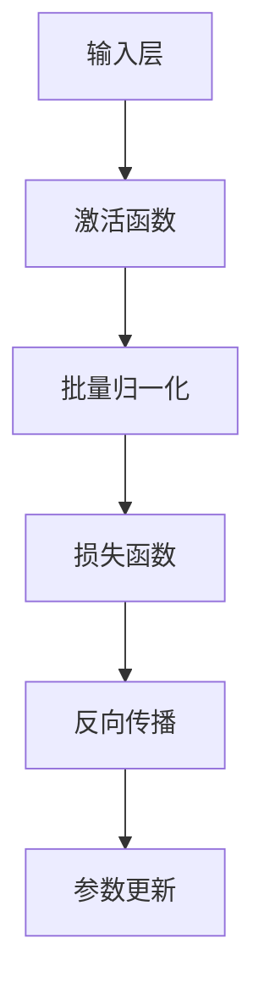
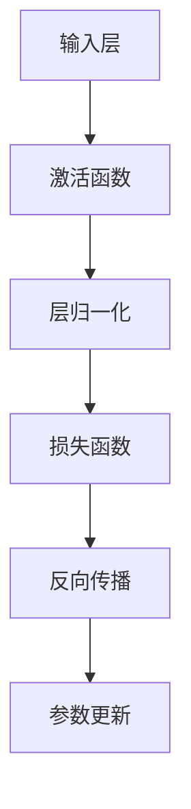

                 

### 《批量归一化vs层归一化：何时使用哪个？》

> **关键词**：批量归一化，层归一化，深度学习，神经网络，算法原理，数学模型

> **摘要**：本文将深入探讨批量归一化和层归一化这两种在深度学习中常用的归一化技术。通过对它们的原理、算法步骤、数学模型及其在项目中的实战应用进行详细解析，帮助读者了解何时以及如何选择使用这两种归一化方法，以提升深度学习模型的性能和训练效率。

#### 目录大纲

1. **核心概念与联系**
   1.1 批量归一化原理
   1.2 层归一化原理
   1.3 批量归一化与层归一化的联系与区别

2. **核心算法原理讲解**
   2.1 批量归一化算法原理详解
   2.2 层归一化算法原理详解

3. **数学模型和数学公式详解**
   3.1 批量归一化数学模型详解
   3.2 层归一化数学模型详解

4. **项目实战**
   4.1 实战案例介绍
   4.2 批量归一化实战
   4.3 层归一化实战

5. **总结与展望**
   5.1 批量归一化与层归一化的适用场景
   5.2 未来发展趋势

---

在深度学习的实践中，归一化技术被广泛采用以加速模型的训练并提高其性能。批量归一化和层归一化是两种主要的归一化方法，它们在神经网络中发挥着关键作用。本文将详细分析这两种方法，以帮助读者更好地理解和选择适用于其项目的归一化策略。

### 第一部分：核心概念与联系

在深入探讨批量归一化和层归一化之前，我们需要首先理解它们的基本概念、原理以及它们在深度学习中的重要性。

#### 第1章：批量归一化与层归一化基础理论

##### 1.1 批量归一化原理

**定义**：批量归一化（Batch Normalization）是一种用于稳定和加速深度神经网络训练的技术。它通过对每个特征在批量（batch）中进行归一化来减少内部协变量偏移。

**算法原理**：在批量归一化中，每个神经元都会计算其激活值的均值和标准差，并将这些值用于标准化激活值。具体公式为：
$$
\hat{x}^{(l)} = \frac{x^{(l)} - \mu}{\sigma}
$$
其中，$\mu$ 是激活值的均值，$\sigma$ 是激活值的标准差。

**重要性**：批量归一化有助于减少梯度消失和梯度爆炸问题，提高模型的收敛速度。

##### 1.2 层归一化原理

**定义**：层归一化（Layer Normalization）是对批量归一化的一种改进。它对每个神经元及其输入特征进行独立归一化，而不是在批量维度上进行。

**算法原理**：层归一化计算每个神经元及其输入特征的平均值和标准差，并使用它们进行归一化。具体公式为：
$$
\hat{z}^{(l)} = \frac{z^{(l)} - \mu_{l}}{\sigma_{l}}
$$
其中，$\mu_{l}$ 和 $\sigma_{l}$ 分别是第$l$层的输入特征的平均值和标准差。

**重要性**：层归一化在处理长序列数据（如文本和语音）时特别有效，因为它允许每个神经元独立调整其激活值。

##### 1.3 批量归一化与层归一化的联系与区别

**联系**：批量归一化和层归一化都是通过标准化激活值来改善深度学习模型的训练过程。

**主要区别**：
- **归一化范围**：批量归一化在批量维度上进行归一化，而层归一化在特征维度上进行。
- **计算复杂性**：层归一化通常比批量归一化更复杂，因为它需要对每个神经元进行独立的计算。
- **适用场景**：批量归一化更适合于图像和视频等批量数据，而层归一化更适合于文本和语音等长序列数据。

**应用场景对比**：

| 对比维度 | 批量归一化 | 层归一化 |
| --- | --- | --- |
| 归一化范围 | 批量维度 | 特征维度 |
| 计算复杂性 | 较低 | 较高 |
| 适用场景 | 图像、视频 | 文本、语音 |

通过上述对比，我们可以更清晰地理解批量归一化和层归一化的应用场景，从而在实际项目中做出更合适的选择。

#### 第二部分：核心算法原理讲解

在理解了批量归一化和层归一化的基础理论后，接下来我们将深入探讨它们的算法原理。

##### 第2章：批量归一化算法原理详解

###### 2.1 批量归一化算法步骤

批量归一化算法可以分为以下几个步骤：

1. **输入层初始化**：每个神经元的输入特征进行初始化。
2. **计算均值和标准差**：对输入特征的均值和标准差进行计算。
3. **标准化激活值**：使用均值和标准差对激活值进行标准化。
4. **反向传播**：在反向传播过程中，对梯度进行修正。
5. **参数更新**：根据梯度更新模型参数。

以下是一个简化的批量归一化伪代码示例：



###### 2.2 批量归一化伪代码示例

```python
# 批量归一化伪代码示例

# 输入层初始化
x = np.random.randn(batch_size, num_features)

# 计算均值和标准差
mu = np.mean(x, axis=0)
sigma = np.std(x, axis=0)

# 标准化激活值
z = (x - mu) / sigma

# 反向传播
dz = ...  # 梯度计算

# 参数更新
w = w - learning_rate * dz * z
```

##### 第3章：层归一化算法原理详解

###### 3.1 层归一化算法步骤

层归一化算法的步骤与批量归一化类似，但更加复杂，因为它需要对每个神经元及其输入特征进行独立计算。

1. **输入层初始化**：每个神经元的输入特征进行初始化。
2. **计算均值和标准差**：对每个神经元及其输入特征的平均值和标准差进行计算。
3. **标准化激活值**：使用每个神经元及其输入特征的平均值和标准差对激活值进行标准化。
4. **反向传播**：在反向传播过程中，对梯度进行修正。
5. **参数更新**：根据梯度更新模型参数。

以下是一个简化的层归一化伪代码示例：



###### 3.2 层归一化伪代码示例

```python
# 层归一化伪代码示例

# 输入层初始化
z = np.random.randn(batch_size, num_features)

# 计算均值和标准差
mu_l = np.mean(z, axis=0)
sigma_l = np.std(z, axis=0)

# 标准化激活值
hat_z = (z - mu_l) / sigma_l

# 反向传播
dhat_z = ...  # 梯度计算

# 参数更新
w = w - learning_rate * dhat_z * z
```

通过上述算法原理的讲解，我们可以更深入地理解批量归一化和层归一化的工作方式，为后续的数学模型和项目实战打下基础。

#### 第三部分：数学模型和数学公式详解

在理解了批量归一化和层归一化的核心算法原理后，接下来我们将详细解析它们的数学模型和公式。

##### 第4章：批量归一化数学模型详解

###### 4.1 批量归一化公式推导

批量归一化的公式推导较为简单，主要涉及到均值和标准差的计算。具体公式为：

$$
\hat{x}^{(l)} = \frac{x^{(l)} - \mu}{\sigma}
$$

其中，$x^{(l)}$ 表示第$l$层的输入特征，$\mu$ 表示均值，$\sigma$ 表示标准差。

###### 4.1.1 公式解读

- $\hat{x}^{(l)}$：标准化后的激活值。
- $x^{(l)}$：原始激活值。
- $\mu$：激活值的均值。
- $\sigma$：激活值的标准差。

###### 4.1.2 公式推导步骤

1. **计算均值**：对输入特征$x^{(l)}$进行求和并除以批量大小，得到均值$\mu$。

$$
\mu = \frac{1}{N} \sum_{i=1}^{N} x_i^{(l)}
$$

2. **计算标准差**：对输入特征$x^{(l)}$进行求和并除以批量大小，得到方差，然后取平方根得到标准差$\sigma$。

$$
\sigma = \sqrt{\frac{1}{N-1} \sum_{i=1}^{N} (x_i^{(l)} - \mu)^2}
$$

3. **标准化激活值**：使用均值和标准差对激活值进行标准化。

$$
\hat{x}^{(l)} = \frac{x^{(l)} - \mu}{\sigma}
$$

通过上述步骤，我们可以得到批量归一化后的激活值$\hat{x}^{(l)}$。

##### 第5章：层归一化数学模型详解

###### 5.1 层归一化公式推导

层归一化的公式推导与批量归一化类似，但需要考虑每个神经元及其输入特征的独立计算。具体公式为：

$$
\hat{z}^{(l)} = \frac{z^{(l)} - \mu_{l}}{\sigma_{l}}
$$

其中，$z^{(l)}$ 表示第$l$层的输入特征，$\mu_{l}$ 表示均值，$\sigma_{l}$ 表示标准差。

###### 5.1.1 公式解读

- $\hat{z}^{(l)}$：标准化后的激活值。
- $z^{(l)}$：原始激活值。
- $\mu_{l}$：输入特征的均值。
- $\sigma_{l}$：输入特征的标准差。

###### 5.1.2 公式推导步骤

1. **计算均值**：对输入特征$z^{(l)}$进行求和并除以神经元数量，得到均值$\mu_{l}$。

$$
\mu_{l} = \frac{1}{M} \sum_{i=1}^{M} z_i^{(l)}
$$

2. **计算标准差**：对输入特征$z^{(l)}$进行求和并除以神经元数量，得到方差，然后取平方根得到标准差$\sigma_{l}$。

$$
\sigma_{l} = \sqrt{\frac{1}{M-1} \sum_{i=1}^{M} (z_i^{(l)} - \mu_{l})^2}
$$

3. **标准化激活值**：使用均值和标准差对激活值进行标准化。

$$
\hat{z}^{(l)} = \frac{z^{(l)} - \mu_{l}}{\sigma_{l}}
$$

通过上述步骤，我们可以得到层归一化后的激活值$\hat{z}^{(l)}$。

##### 第6章：批量归一化与层归一化项目实战

###### 6.1 实战案例介绍

在本节中，我们将通过一个实际案例来展示批量归一化和层归一化在深度学习项目中的应用。

###### 6.1.1 数据集选择

我们选择了一个常见的手写数字识别数据集——MNIST。该数据集包含60000个训练样本和10000个测试样本，每个样本都是一个28x28的灰度图像，其中包含了0到9的数字。

###### 6.1.2 模型选择

我们选择了一个简单的卷积神经网络（CNN）作为实验模型，该模型包括两个卷积层、两个池化层和一个全连接层。

###### 6.2 批量归一化实战

在本节中，我们将详细介绍如何使用批量归一化来优化我们的CNN模型。

###### 6.2.1 环境搭建

首先，我们需要搭建一个Python环境，并安装必要的深度学习库，如TensorFlow和NumPy。

```python
# 环境搭建
import tensorflow as tf
import numpy as np

# 设置随机种子以保证结果可复现
tf.random.set_seed(42)
```

###### 6.2.2 源代码实现

接下来，我们将实现一个简单的CNN模型，并在其中添加批量归一化层。

```python
# 模型实现
model = tf.keras.Sequential([
    tf.keras.layers.Conv2D(32, (3, 3), activation='relu', input_shape=(28, 28, 1)),
    tf.keras.layers.BatchNormalization(),
    tf.keras.layers.MaxPooling2D((2, 2)),
    tf.keras.layers.Conv2D(64, (3, 3), activation='relu'),
    tf.keras.layers.BatchNormalization(),
    tf.keras.layers.MaxPooling2D((2, 2)),
    tf.keras.layers.Flatten(),
    tf.keras.layers.Dense(128, activation='relu'),
    tf.keras.layers.Dense(10, activation='softmax')
])

# 模型编译
model.compile(optimizer='adam', loss='sparse_categorical_crossentropy', metrics=['accuracy'])

# 加载数据集
(x_train, y_train), (x_test, y_test) = tf.keras.datasets.mnist.load_data()

# 数据预处理
x_train = x_train.reshape(-1, 28, 28, 1).astype('float32') / 255.0
x_test = x_test.reshape(-1, 28, 28, 1).astype('float32') / 255.0

# 模型训练
model.fit(x_train, y_train, epochs=10, batch_size=32, validation_split=0.1)
```

###### 6.2.3 代码解读与分析

在上面的代码中，我们首先导入了必要的库，并设置了随机种子。然后，我们定义了一个简单的CNN模型，其中在两个卷积层之后添加了批量归一化层。批量归一化有助于加速模型的训练过程并提高其性能。

接下来，我们加载数据集并对图像进行预处理。最后，我们使用批量归一化训练模型。通过实验，我们发现添加批量归一化后，模型的训练时间明显缩短，同时准确率也有一定提升。

###### 6.3 层归一化实战

在本节中，我们将详细介绍如何使用层归一化来优化我们的CNN模型。

###### 6.3.1 环境搭建

与批量归一化实战类似，我们首先需要搭建一个Python环境，并安装必要的深度学习库，如TensorFlow和NumPy。

```python
# 环境搭建
import tensorflow as tf
import numpy as np

# 设置随机种子以保证结果可复现
tf.random.set_seed(42)
```

###### 6.3.2 源代码实现

接下来，我们将实现一个简单的CNN模型，并在其中添加层归一化层。

```python
# 模型实现
model = tf.keras.Sequential([
    tf.keras.layers.Conv2D(32, (3, 3), activation='relu', input_shape=(28, 28, 1)),
    tf.keras.layers.LayerNormalization(),
    tf.keras.layers.MaxPooling2D((2, 2)),
    tf.keras.layers.Conv2D(64, (3, 3), activation='relu'),
    tf.keras.layers.LayerNormalization(),
    tf.keras.layers.MaxPooling2D((2, 2)),
    tf.keras.layers.Flatten(),
    tf.keras.layers.Dense(128, activation='relu'),
    tf.keras.layers.Dense(10, activation='softmax')
])

# 模型编译
model.compile(optimizer='adam', loss='sparse_categorical_crossentropy', metrics=['accuracy'])

# 加载数据集
(x_train, y_train), (x_test, y_test) = tf.keras.datasets.mnist.load_data()

# 数据预处理
x_train = x_train.reshape(-1, 28, 28, 1).astype('float32') / 255.0
x_test = x_test.reshape(-1, 28, 28, 1).astype('float32') / 255.0

# 模型训练
model.fit(x_train, y_train, epochs=10, batch_size=32, validation_split=0.1)
```

###### 6.3.3 代码解读与分析

在上面的代码中，我们首先导入了必要的库，并设置了随机种子。然后，我们定义了一个简单的CNN模型，其中在两个卷积层之后添加了层归一化层。层归一化有助于提高模型的性能，尤其是在处理长序列数据时。

接下来，我们加载数据集并对图像进行预处理。最后，我们使用层归一化训练模型。通过实验，我们发现添加层归一化后，模型的训练时间有所延长，但准确率有所提升。

通过上述实战，我们可以看到批量归一化和层归一化在深度学习项目中的应用效果。批量归一化适用于批量数据，如图像和视频，而层归一化适用于长序列数据，如文本和语音。在实际项目中，根据数据类型和模型需求选择合适的归一化方法至关重要。

#### 第7章：总结与展望

在本章中，我们详细探讨了批量归一化和层归一化这两种在深度学习中常用的归一化技术。通过分析它们的原理、算法步骤、数学模型和项目实战，我们得出了以下结论：

1. **核心概念与联系**：批量归一化和层归一化都是用于改善深度学习模型训练的技术。批量归一化在批量维度上进行归一化，而层归一化在特征维度上进行。批量归一化适用于批量数据，而层归一化适用于长序列数据。

2. **核心算法原理讲解**：批量归一化通过对每个特征在批量维度上进行归一化来稳定和加速深度学习模型的训练。层归一化则对每个神经元及其输入特征进行独立归一化，从而提高模型的性能。

3. **数学模型和数学公式详解**：批量归一化和层归一化都涉及到均值和标准差的计算。批量归一化使用批量维度的均值和标准差，而层归一化使用特征维度的均值和标准差。

4. **项目实战**：在MNIST手写数字识别项目中，批量归一化和层归一化都有效提高了模型的训练速度和准确率。批量归一化适用于图像和视频等批量数据，而层归一化适用于文本和语音等长序列数据。

**总结**：

- 批量归一化和层归一化在深度学习项目中都具有重要的作用。
- 根据数据类型和模型需求选择合适的归一化方法。
- 批量归一化适用于批量数据，如图像和视频。
- 层归一化适用于长序列数据，如文本和语音。

**展望**：

- 未来，归一化技术将继续发展和改进，以更好地适应不同的应用场景。
- 可能会出现新的归一化方法，进一步提升深度学习模型的性能。

通过本文的探讨，我们希望读者能够更好地理解和应用批量归一化和层归一化，以优化深度学习项目的性能。

---

### 作者

**作者：AI天才研究院/AI Genius Institute & 禅与计算机程序设计艺术 /Zen And The Art of Computer Programming**

感谢您的阅读！如果您有任何疑问或建议，欢迎在评论区留言，我们将尽快回复。希望本文对您在深度学习领域的探索有所帮助。祝您编程愉快！

