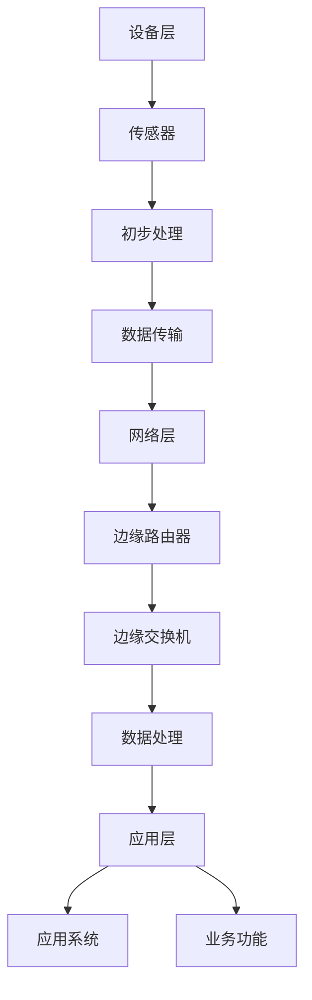
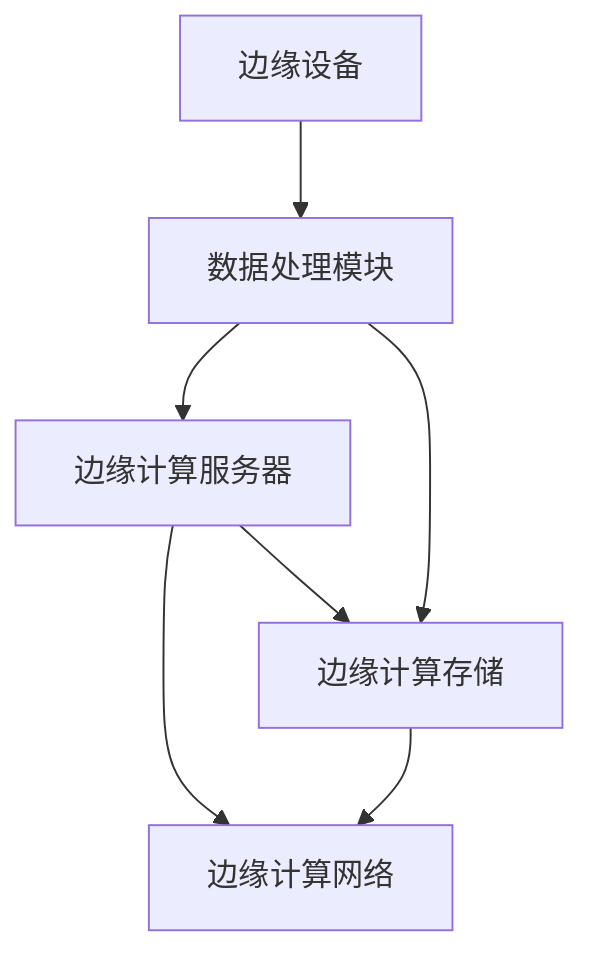
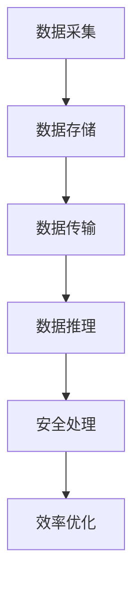
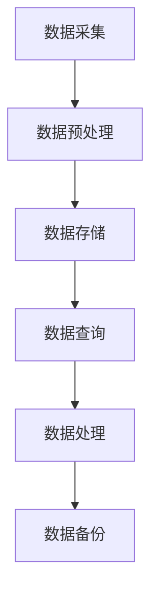
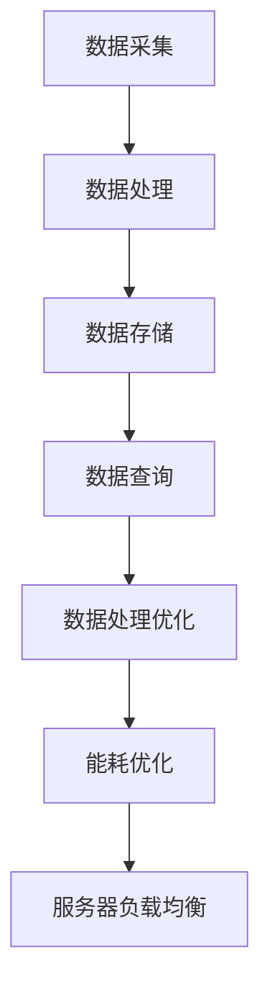
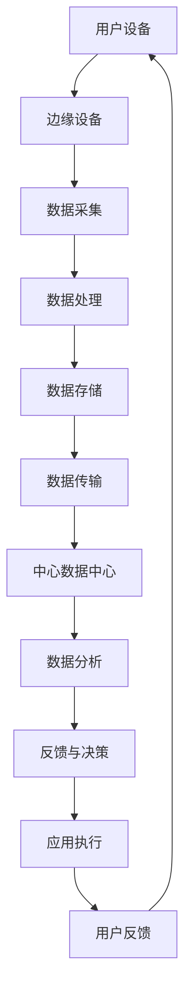

                 

# 技术创业中的边缘计算：新一代IT架构的机遇

> **关键词：边缘计算、新IT架构、技术创业、数据处理、网络架构、算法优化**

> **摘要：**
本文旨在探讨边缘计算在技术创业中的重要作用，分析其与传统云计算的区别，介绍新一代IT架构的特点及其与边缘计算的融合。通过深入剖析边缘计算的核心概念、技术原理、应用场景和实现方法，结合成功案例，展望边缘计算与新IT架构的未来发展趋势。本文旨在为技术创业者提供有益的参考和启示。

## 目录大纲

### 第一部分: 引言与背景

#### 1.1 边缘计算的起源与发展

##### 1.1.1 边缘计算的提出与背景

##### 1.1.2 边缘计算与传统云计算的区别

#### 1.2 技术创业中的边缘计算

##### 1.2.1 边缘计算在技术创业中的优势

##### 1.2.2 边缘计算对IT架构的影响

#### 1.3 新一代IT架构的机遇

##### 1.3.1 新一代IT架构的概念与特点

##### 1.3.2 边缘计算与新IT架构的融合

### 第二部分: 边缘计算核心概念与架构

#### 2.1 边缘计算核心概念

##### 2.1.1 边缘计算的定义

##### 2.1.2 边缘计算的关键要素

##### 2.1.3 边缘计算的优势与挑战

#### 2.2 边缘计算架构

##### 2.2.1 边缘计算架构的层次结构

##### 2.2.2 边缘计算网络架构

##### 2.2.3 边缘计算平台架构

#### 2.3 边缘计算核心组件

##### 2.3.1 边缘计算服务器

##### 2.3.2 边缘计算存储

##### 2.3.3 边缘计算网络

#### 2.4 边缘计算应用场景

##### 2.4.1 工业互联网

##### 2.4.2 智能交通

##### 2.4.3 智慧城市

##### 2.4.4 物联网

### 第三部分: 边缘计算技术原理与实现

#### 3.1 边缘计算技术原理

##### 3.1.1 边缘计算数据处理原理

##### 3.1.2 边缘计算安全原理

##### 3.1.3 边缘计算效率优化原理

#### 3.2 边缘计算技术实现

##### 3.2.1 边缘计算平台搭建

##### 3.2.2 边缘计算网络部署

##### 3.2.3 边缘计算应用开发

#### 3.3 边缘计算核心算法原理

##### 3.3.1 数据处理算法

##### 3.3.2 存储优化算法

##### 3.3.3 网络传输优化算法

#### 3.4 边缘计算数学模型

##### 3.4.1 数据隐私保护模型

##### 3.4.2 能耗优化模型

##### 3.4.3 服务器负载均衡模型

### 第四部分: 边缘计算在技术创业中的应用

#### 4.1 边缘计算在初创企业的应用

##### 4.1.1 初创企业选择边缘计算的原因

##### 4.1.2 初创企业边缘计算应用案例

#### 4.2 边缘计算创业策略

##### 4.2.1 创业方向选择

##### 4.2.2 市场机会分析

##### 4.2.3 创业团队建设

#### 4.3 边缘计算创业风险与挑战

##### 4.3.1 技术挑战

##### 4.3.2 市场挑战

##### 4.3.3 资金与人力资源挑战

### 第五部分: 新一代IT架构的机遇

#### 5.1 新一代IT架构概述

##### 5.1.1 新一代IT架构的定义

##### 5.1.2 新一代IT架构的关键技术

##### 5.1.3 新一代IT架构的优势

#### 5.2 新一代IT架构与边缘计算的关系

##### 5.2.1 边缘计算在新IT架构中的定位

##### 5.2.2 新IT架构对边缘计算的支持

##### 5.2.3 新IT架构与边缘计算融合的挑战与机遇

#### 5.3 新一代IT架构在技术创业中的应用

##### 5.3.1 新IT架构在初创企业的应用场景

##### 5.3.2 新IT架构在技术创业中的价值

### 第六部分: 成功案例与未来趋势

#### 6.1 边缘计算在技术创业中的成功案例

##### 6.1.1 成功案例分析

##### 6.1.2 成功经验总结

#### 6.2 边缘计算与新IT架构的未来趋势

##### 6.2.1 边缘计算的技术发展趋势

##### 6.2.2 新IT架构的发展趋势

##### 6.2.3 边缘计算与新技术融合的未来前景

### 第七部分: 总结与展望

#### 7.1 本书总结

##### 7.1.1 主要内容回顾

##### 7.1.2 主要观点总结

#### 7.2 技术创业中的边缘计算未来展望

##### 7.2.1 技术创业的未来机遇

##### 7.2.2 边缘计算与新IT架构的融合发展前景

##### 7.2.3 对技术创业者的建议

### 附录

#### 附录A：边缘计算开源平台与工具

##### A.1 FOG Computing

##### A.2 OpenFog Reference Architecture

##### A.3 EdgeX Foundry

#### 附录B：边缘计算相关书籍与资源推荐

##### B.1 《边缘计算：新一代IT架构的机遇》

##### B.2 《边缘计算：核心技术、架构与实践》

##### B.3 《边缘计算实践指南》

##### B.4 其他推荐资源

### 附加材料

#### 附加材料1：边缘计算架构 Mermaid 流程图

----------------------------------------------------------------

## 第一部分：引言与背景

### 1.1 边缘计算的起源与发展

边缘计算作为信息技术领域的一个重要概念，起源于20世纪90年代。随着互联网的普及和大数据时代的到来，传统云计算模型逐渐暴露出一些瓶颈，如数据传输延迟、带宽限制和安全性等问题。为了解决这些问题，边缘计算应运而生。

#### 1.1.1 边缘计算的提出与背景

边缘计算最早由思科在2013年提出，其核心思想是将计算、存储和网络能力从云端延伸到网络边缘，以实现更快速、更安全、更高效的数据处理。边缘计算的目标是减少数据传输的距离和时延，提升实时响应能力，同时减轻云计算中心的负担。

#### 1.1.2 边缘计算与传统云计算的区别

与传统云计算相比，边缘计算具有以下几个显著特点：

1. **数据处理的接近性**：边缘计算将数据处理推向网络边缘，更接近数据源，减少了数据传输的时间和带宽消耗。
2. **低延迟和高实时性**：边缘计算能够实现数据的快速处理，满足对实时性要求较高的应用场景，如自动驾驶、智能医疗等。
3. **安全性**：边缘计算通过本地处理数据，降低了数据泄露的风险。
4. **分布式架构**：边缘计算采用分布式架构，将计算、存储和网络能力分散到网络边缘，提高了系统的可靠性和可扩展性。

### 1.2 技术创业中的边缘计算

边缘计算在技术创业中具有重要的地位，为创业者提供了新的发展机遇。

#### 1.2.1 边缘计算在技术创业中的优势

边缘计算在技术创业中具有以下几个优势：

1. **快速响应**：边缘计算能够实现数据的快速处理和响应，满足对实时性要求较高的应用场景。
2. **高安全性**：边缘计算通过本地处理数据，降低了数据泄露的风险，提高了系统的安全性。
3. **低延迟**：边缘计算减少了数据传输的距离和时延，提升了用户体验。
4. **分布式架构**：边缘计算采用分布式架构，提高了系统的可靠性和可扩展性，为创业公司提供了更灵活的部署方式。

#### 1.2.2 边缘计算对IT架构的影响

边缘计算的兴起对IT架构产生了深远的影响：

1. **数据中心转型**：边缘计算推动了数据中心向分布式架构的转型，促进了数据中心从集中式向边缘计算的转变。
2. **网络架构优化**：边缘计算要求网络架构具备更高的带宽和更低的地延迟，推动了网络技术的进步。
3. **数据处理模式变革**：边缘计算改变了数据处理的方式，从传统的集中式处理转向分布式处理，提高了数据处理效率。
4. **安全架构重构**：边缘计算带来了新的安全挑战，也促使创业者重新思考安全架构的设计和优化。

### 1.3 新一代IT架构的机遇

随着边缘计算的发展，新一代IT架构逐渐形成，为技术创业者提供了新的机遇。

#### 1.3.1 新一代IT架构的概念与特点

新一代IT架构是指在边缘计算、云计算、物联网等新兴技术的推动下，形成的以分布式、智能化、自动化为特征的新型IT架构。其主要特点包括：

1. **分布式架构**：新一代IT架构采用分布式架构，将计算、存储和网络能力分散到网络边缘，提高了系统的可靠性和可扩展性。
2. **智能化**：新一代IT架构集成了人工智能、大数据等技术，实现了系统的自动化、智能化和自适应能力。
3. **开放性**：新一代IT架构强调开放性和标准化，支持不同系统和平台的互联互通。
4. **灵活性**：新一代IT架构具有高度的灵活性，可以快速适应市场需求和技术变革。

#### 1.3.2 边缘计算与新IT架构的融合

边缘计算与新IT架构的融合，为技术创业者带来了新的发展机遇：

1. **优化资源利用**：边缘计算与新IT架构的融合，可以实现计算资源的优化配置，降低成本，提高效率。
2. **提升用户体验**：边缘计算与新IT架构的融合，可以提供更快速、更安全、更高效的服务，提升用户体验。
3. **创新业务模式**：边缘计算与新IT架构的融合，为技术创业者提供了新的业务模式，如按需服务、实时数据分析等。
4. **拓展应用场景**：边缘计算与新IT架构的融合，可以拓展应用场景，如工业互联网、智能交通、智慧城市等。

### 1.4 小结

本部分主要介绍了边缘计算的起源与发展、边缘计算在技术创业中的优势、边缘计算对IT架构的影响以及新一代IT架构的机遇。边缘计算作为新一代IT架构的重要组成部分，为技术创业者提供了新的发展机遇。在接下来的章节中，我们将深入探讨边缘计算的核心概念、技术原理、应用场景和实现方法，帮助读者更好地理解和应用边缘计算技术。

----------------------------------------------------------------
### 1.1.1 边缘计算的提出与背景

边缘计算的提出，可以追溯到互联网技术快速发展的大背景。在20世纪90年代，随着互联网的普及和电子商务的兴起，数据传输和处理的需求急剧增加。传统的云计算模型，即所有计算和存储都在数据中心进行，开始暴露出一些问题。这些问题主要包括：

1. **数据传输延迟**：随着数据量的增加，将大量数据传输到远程数据中心进行处理，导致了明显的延迟，影响了用户体验。
2. **带宽限制**：数据中心之间的带宽资源有限，无法满足大量数据的高速传输需求。
3. **安全性问题**：数据在传输过程中，面临着数据泄露和网络攻击的风险。
4. **中心化的依赖性**：传统的云计算模型高度依赖数据中心，一旦数据中心发生故障，整个系统将面临瘫痪的风险。

为了解决这些问题，边缘计算的概念应运而生。边缘计算的核心思想是将计算和存储能力从远程数据中心向网络边缘延伸，尽可能接近数据源。这样做的目的是减少数据传输的距离和时延，提升实时响应能力，同时降低数据泄露和网络攻击的风险。

边缘计算的提出，得到了广泛的关注和支持。在2013年，思科首次提出了边缘计算的概念，并明确了其目标：实现数据的快速处理和响应，满足对实时性要求较高的应用场景。随后，微软、谷歌、亚马逊等科技巨头纷纷投入边缘计算的研究和开发，推动了边缘计算技术的快速发展。

### 1.1.2 边缘计算与传统云计算的区别

边缘计算和传统云计算在技术实现、应用场景、优劣势等方面存在显著的区别：

1. **技术实现**：
   - **传统云计算**：在云计算模型中，所有的计算和存储都在数据中心进行。用户通过互联网连接到数据中心，获取计算和存储资源。
   - **边缘计算**：边缘计算将计算和存储能力分散到网络边缘，即接近数据源的位置。用户可以直接在网络边缘进行数据处理和存储，减少了数据传输的距离和时延。

2. **应用场景**：
   - **传统云计算**：云计算适用于大规模数据处理、存储和计算任务，如大数据分析、云计算游戏等。
   - **边缘计算**：边缘计算适用于对实时性要求较高的应用场景，如自动驾驶、智能医疗、工业互联网等。这些场景需要快速响应和低延迟的处理能力。

3. **优劣势**：
   - **传统云计算**：优势在于资源丰富、成本低、易于维护等。劣势在于数据传输延迟、带宽限制、安全性问题等。
   - **边缘计算**：优势在于低延迟、高实时性、安全性等。劣势在于计算和存储资源分散、维护成本较高、易受网络攻击等。

通过对比可以看出，边缘计算和传统云计算各有优劣势，适用于不同的应用场景。在技术创业中，创业者需要根据具体需求和应用场景，选择合适的计算模式。

### 1.2.1 边缘计算在技术创业中的优势

边缘计算在技术创业中具有以下几个显著优势：

1. **快速响应**：边缘计算将数据处理推向网络边缘，减少了数据传输的距离和时延，能够实现快速响应。这对于对实时性要求较高的应用场景，如自动驾驶、智能医疗等，具有重要意义。

2. **高安全性**：边缘计算通过本地处理数据，降低了数据泄露的风险。在数据安全和隐私保护日益重要的今天，边缘计算为技术创业者提供了更安全的数据处理方案。

3. **低延迟**：边缘计算减少了数据传输的距离和时延，提升了用户体验。对于需要实时处理和响应的应用，如在线游戏、实时监控等，边缘计算能够显著提升应用性能。

4. **分布式架构**：边缘计算采用分布式架构，将计算、存储和网络能力分散到网络边缘。这种架构具有更高的可靠性和可扩展性，能够适应不断变化的需求。

5. **灵活的部署方式**：边缘计算支持灵活的部署方式，创业者可以根据需求选择合适的设备、网络和平台，实现快速部署和应用。

6. **优化资源利用**：边缘计算能够优化资源利用，降低成本。通过在网络边缘进行数据处理，可以减少对中心数据中心的依赖，降低带宽消耗和运维成本。

7. **创新的业务模式**：边缘计算为技术创业者提供了新的业务模式，如按需服务、实时数据分析等。这些模式能够帮助创业者更好地满足市场需求，提高业务竞争力。

总之，边缘计算在技术创业中具有巨大的优势，为创业者提供了新的发展机遇。在接下来的章节中，我们将进一步探讨边缘计算的技术原理、架构、实现方法和应用场景，帮助读者更好地理解和应用边缘计算技术。

### 1.2.2 边缘计算对IT架构的影响

边缘计算的出现对传统的IT架构产生了深远的影响，改变了数据中心、网络架构以及数据处理模式，为技术创业者带来了新的机遇和挑战。

#### 1.2.2.1 数据中心转型

边缘计算推动数据中心从集中式向分布式转型。在传统的集中式数据中心架构中，所有的计算、存储和网络资源都集中在数据中心，用户通过互联网连接到数据中心获取服务。这种模式在处理大规模数据处理和计算任务时表现出色，但随着数据量和应用场景的多样化，其劣势也逐渐显现。边缘计算的兴起，使得数据中心开始向分布式架构转型，计算和存储资源被分散到网络边缘，更接近数据源。这种转型不仅提高了系统的可靠性和可扩展性，还能够降低数据传输延迟，提升用户体验。

#### 1.2.2.2 网络架构优化

边缘计算要求网络架构具备更高的带宽和更低的地延迟。传统的网络架构往往在中心数据中心和用户之间建立一条直接的连接，这种方式在高数据量和远程用户场景下表现不佳。边缘计算通过在网络边缘部署计算和存储资源，减少了数据传输的距离和时延，提升了网络性能。此外，边缘计算还推动了网络技术的进步，如5G、物联网等，为技术创业者提供了更丰富、更灵活的网络基础设施。

#### 1.2.2.3 数据处理模式变革

边缘计算改变了传统的数据处理模式，从集中式处理转向分布式处理。在集中式处理模式下，所有的数据处理都在数据中心进行，这导致了数据传输延迟和带宽消耗。边缘计算通过在网络边缘进行数据处理，减少了数据传输的距离和时延，提高了数据处理效率。此外，边缘计算还支持本地数据处理，能够更好地满足对实时性要求较高的应用场景，如自动驾驶、智能医疗等。

#### 1.2.2.4 安全架构重构

边缘计算带来了新的安全挑战，也促使创业者重新思考安全架构的设计和优化。在集中式架构中，所有的数据和计算都在数据中心进行，相对安全可控。而在边缘计算架构中，计算和存储资源分散到网络边缘，增加了安全风险。边缘计算需要面对网络攻击、数据泄露等安全威胁，创业者需要设计更加完善的安全架构，如数据加密、身份验证、访问控制等。

#### 1.2.2.5 资源优化和成本降低

边缘计算能够优化资源利用，降低成本。在集中式架构中，所有的计算和存储资源都集中在数据中心，容易造成资源浪费。而在边缘计算架构中，计算和存储资源被分散到网络边缘，可以根据实际需求进行资源调配，提高资源利用效率。此外，边缘计算还能够降低带宽消耗和运维成本，提高系统的经济效益。

#### 1.2.2.6 创新业务模式

边缘计算为技术创业者提供了新的业务模式。在传统的云计算模式中，创业者主要依赖提供云计算服务来盈利。而在边缘计算模式中，创业者可以提供更多样化的服务，如实时数据分析、智能决策支持等。这些服务不仅能够满足客户需求，还能够提高企业的盈利能力。

#### 1.2.2.7 拓展应用场景

边缘计算能够拓展应用场景，满足更多的业务需求。传统的云计算模式主要适用于大规模数据处理和计算任务，如大数据分析、云计算游戏等。而边缘计算适用于对实时性要求较高的应用场景，如自动驾驶、智能医疗、工业互联网等。这些场景需要快速响应和低延迟的处理能力，边缘计算能够满足这些需求，为创业者提供了更广阔的市场空间。

总之，边缘计算对IT架构产生了深远的影响，为技术创业者带来了新的机遇和挑战。创业者需要根据具体需求和应用场景，结合边缘计算的优势，设计出更加高效、灵活、安全的IT架构，以实现业务的创新和发展。

### 1.3.1 新一代IT架构的概念与特点

新一代IT架构是在边缘计算、云计算、物联网等新兴技术的推动下形成的，以分布式、智能化、自动化为特征的新型IT架构。它不仅继承了传统IT架构的优势，还在多个方面进行了优化和革新。

#### 1.3.1.1 分布式架构

分布式架构是新一代IT架构的核心特征之一。与传统的集中式架构不同，分布式架构将计算、存储和网络资源分散到网络边缘，实现数据的本地处理和存储。这种架构具有更高的可靠性和可扩展性，能够更好地适应不断变化的需求。分布式架构通过分布式计算节点协同工作，实现负载均衡和数据冗余，提高了系统的性能和稳定性。

#### 1.3.1.2 智能化

新一代IT架构集成了人工智能、大数据等智能化技术，实现了系统的自动化、智能化和自适应能力。通过智能化技术，新一代IT架构能够实时感知环境变化，自动调整资源分配和业务流程，实现高效、智能化的运营。例如，利用机器学习算法，新一代IT架构可以自动优化网络带宽、调整服务器负载，提高系统的运行效率。

#### 1.3.1.3 自动化

自动化是新一代IT架构的另一个重要特征。通过自动化技术，新一代IT架构能够减少人工干预，实现业务流程的自动化和智能化。例如，利用自动化脚本和工具，新一代IT架构可以自动部署、监控和管理系统资源，提高运维效率。此外，自动化技术还能够实现故障自动诊断和修复，提高系统的可靠性和稳定性。

#### 1.3.1.4 开放性

新一代IT架构强调开放性和标准化，支持不同系统和平台的互联互通。通过开放性，新一代IT架构能够更好地整合各种资源和服务，实现跨平台、跨系统的协同工作。例如，通过开放接口和标准协议，新一代IT架构可以轻松集成第三方服务，拓展应用场景和功能。

#### 1.3.1.5 灵活性

新一代IT架构具有高度的灵活性，能够快速适应市场需求和技术变革。通过灵活的部署方式和可扩展的架构设计，新一代IT架构可以快速响应市场需求，实现业务的快速上线和迭代。此外，新一代IT架构还能够根据业务需求进行个性化定制，满足不同场景下的业务需求。

#### 1.3.1.6 安全性

新一代IT架构在安全性方面进行了全面优化。通过集成安全技术和安全架构，新一代IT架构能够更好地保护数据和系统的安全。例如，通过数据加密、身份验证、访问控制等安全措施，新一代IT架构能够有效防范数据泄露和网络攻击。此外，新一代IT架构还支持安全监控和预警，能够及时发现和应对安全威胁。

综上所述，新一代IT架构以分布式、智能化、自动化、开放性、灵活性和安全性为特征，为技术创业者提供了更加高效、灵活、安全和可靠的IT基础设施，推动了技术创业的创新发展。

### 1.3.2 边缘计算与新IT架构的融合

边缘计算与新IT架构的融合，为技术创业带来了新的发展机遇。边缘计算作为新IT架构的重要组成部分，不仅能够提升系统的性能和稳定性，还能拓展应用场景，为技术创业者提供更广阔的市场空间。

#### 1.3.2.1 边缘计算在新IT架构中的定位

在新IT架构中，边缘计算被定位为分布式计算和网络架构的一部分。边缘计算通过在网络边缘部署计算和存储资源，实现了数据的本地处理和存储，降低了数据传输的延迟和带宽消耗。边缘计算节点通常包括边缘服务器、边缘路由器、物联网设备等，它们可以协同工作，实现分布式计算和存储。

#### 1.3.2.2 新IT架构对边缘计算的支持

新IT架构为边缘计算提供了强大的支持，包括以下几个方面：

1. **分布式架构支持**：新IT架构的分布式架构设计，使得边缘计算能够与云计算、数据中心等其他IT资源进行无缝集成。分布式架构支持边缘计算节点之间的数据共享和协同工作，提高了系统的整体性能和稳定性。

2. **智能化支持**：新IT架构集成了人工智能、大数据等技术，为边缘计算提供了智能化支持。通过机器学习和数据分析，边缘计算可以实现自动化决策、预测和优化，提高系统的智能化水平。

3. **自动化支持**：新IT架构的自动化技术，可以帮助边缘计算实现自动化部署、监控和管理。自动化脚本和工具可以简化边缘计算节点的配置和管理，提高运维效率。

4. **开放性支持**：新IT架构的开放性设计，使得边缘计算能够与其他系统和平台进行无缝集成。通过开放接口和标准协议，边缘计算可以轻松集成第三方服务，拓展应用场景。

5. **安全性支持**：新IT架构的安全性设计，为边缘计算提供了全面的安全保障。通过数据加密、身份验证、访问控制等安全措施，边缘计算能够有效防范数据泄露和网络攻击。

#### 1.3.2.3 边缘计算与新IT架构融合的挑战与机遇

边缘计算与新IT架构的融合，既带来了机遇，也面临挑战。

1. **机遇**：
   - **优化资源利用**：边缘计算与新IT架构的融合，可以优化资源利用，降低成本。通过分布式架构和智能化技术，边缘计算可以更好地调配和利用计算、存储和网络资源。
   - **提升用户体验**：边缘计算能够实现数据的本地处理和存储，降低数据传输的延迟和带宽消耗，提升用户体验。
   - **拓展应用场景**：边缘计算与新IT架构的融合，可以拓展应用场景，如工业互联网、智能交通、智慧城市等。这些场景需要快速响应和低延迟的处理能力，边缘计算能够满足这些需求。
   - **创新的业务模式**：边缘计算与新IT架构的融合，为技术创业者提供了新的业务模式，如实时数据分析、智能决策支持等。这些模式能够帮助创业者更好地满足市场需求，提高业务竞争力。

2. **挑战**：
   - **技术复杂性**：边缘计算与新IT架构的融合，涉及到多种技术和系统的集成，如分布式计算、人工智能、物联网等。这增加了系统的复杂性和维护难度。
   - **安全性问题**：边缘计算分散到网络边缘，增加了安全风险。创业者需要设计更加完善的安全架构，防范数据泄露和网络攻击。
   - **资源管理**：边缘计算节点的分布性和动态性，使得资源管理变得更加复杂。创业者需要设计高效的资源管理策略，确保系统的稳定性和可靠性。
   - **网络延迟和带宽**：边缘计算对网络带宽和延迟有较高的要求。创业者需要优化网络架构，确保边缘计算节点之间的数据传输速度和稳定性。

尽管面临挑战，边缘计算与新IT架构的融合，仍然为技术创业者带来了巨大的机遇。通过充分利用新IT架构的优势，创业者可以设计出更加高效、灵活、安全的边缘计算解决方案，满足不断变化的市场需求。

### 1.4 小结

本部分介绍了边缘计算的起源与发展、边缘计算在技术创业中的优势、边缘计算对IT架构的影响以及新一代IT架构的机遇。边缘计算作为新一代IT架构的重要组成部分，为技术创业者提供了新的发展机遇。在接下来的章节中，我们将深入探讨边缘计算的核心概念、技术原理、应用场景和实现方法，帮助读者更好地理解和应用边缘计算技术。

----------------------------------------------------------------
### 2.1 边缘计算核心概念

边缘计算作为一种新兴的技术，其核心概念涵盖了计算、存储、网络和数据处理的各个方面。理解这些核心概念，对于深入探讨边缘计算的技术原理和应用具有重要意义。

#### 2.1.1 边缘计算的定义

边缘计算（Edge Computing）是指将计算、存储、数据处理等能力从传统的集中式数据中心，分散到网络的边缘节点。这些边缘节点可以是用户设备、路由器、交换机、智能传感器等。边缘计算的目标是减少数据传输的距离和时延，提高系统的实时性和响应速度。

#### 2.1.2 边缘计算的关键要素

边缘计算的关键要素包括：

1. **计算能力**：边缘计算节点具备一定的计算能力，可以执行简单的数据处理和分析任务。这些计算能力可以来自专门设计的硬件设备，如边缘服务器、嵌入式系统等，也可以来自普通设备，如智能手机、平板电脑等。

2. **存储能力**：边缘计算节点具备存储能力，可以临时存储和处理数据。这有助于降低数据传输的频率和带宽消耗，提高系统的效率和稳定性。

3. **网络连接**：边缘计算节点需要具备稳定的网络连接，以便与其他节点进行通信和数据交换。网络连接的质量和稳定性直接影响到边缘计算的性能和可靠性。

4. **数据处理**：边缘计算节点可以执行数据处理任务，包括数据的采集、存储、传输和推理等。数据处理能力的强弱决定了边缘计算节点的功能和应用范围。

5. **安全防护**：边缘计算节点需要具备一定的安全防护能力，以防止数据泄露、网络攻击等安全威胁。安全防护措施包括数据加密、身份验证、访问控制等。

#### 2.1.3 边缘计算的优势与挑战

边缘计算具有以下优势：

1. **低延迟**：边缘计算将数据处理推向网络边缘，减少了数据传输的距离和时延，能够实现快速响应。这对于需要实时处理和响应的应用，如自动驾驶、智能医疗等，具有重要意义。

2. **高实时性**：边缘计算能够实现数据的本地处理和存储，提高了系统的实时性和响应速度。这对于对实时性要求较高的应用场景，如在线游戏、实时监控等，具有重要意义。

3. **安全性**：边缘计算通过本地处理数据，降低了数据泄露和网络攻击的风险。这对于需要保障数据安全和隐私的应用，如金融、医疗等，具有重要意义。

4. **分布式架构**：边缘计算采用分布式架构，将计算、存储和网络能力分散到网络边缘，提高了系统的可靠性和可扩展性。

5. **优化资源利用**：边缘计算能够优化资源利用，降低成本。通过在网络边缘进行数据处理，可以减少对中心数据中心的依赖，降低带宽消耗和运维成本。

然而，边缘计算也面临一些挑战：

1. **技术复杂性**：边缘计算涉及到多种技术和系统的集成，如分布式计算、人工智能、物联网等。这增加了系统的复杂性和维护难度。

2. **安全性问题**：边缘计算分散到网络边缘，增加了安全风险。创业者需要设计更加完善的安全架构，防范数据泄露和网络攻击。

3. **资源管理**：边缘计算节点的分布性和动态性，使得资源管理变得更加复杂。创业者需要设计高效的资源管理策略，确保系统的稳定性和可靠性。

4. **网络延迟和带宽**：边缘计算对网络带宽和延迟有较高的要求。创业者需要优化网络架构，确保边缘计算节点之间的数据传输速度和稳定性。

#### 2.1.4 边缘计算的核心概念与联系

边缘计算的核心概念包括计算、存储、网络和数据处理。这些概念相互联系，共同构成了边缘计算的技术体系。具体来说：

1. **计算能力**：计算能力是边缘计算的基础。边缘计算节点通过计算能力，实现数据的处理和分析。计算能力决定了边缘计算节点能够执行的任务复杂度和性能。

2. **存储能力**：存储能力是边缘计算的关键。边缘计算节点通过存储能力，实现数据的临时存储和处理。存储能力决定了边缘计算节点的数据处理效率和数据存储容量。

3. **网络连接**：网络连接是边缘计算的核心。边缘计算节点通过稳定的网络连接，实现数据的传输和共享。网络连接的质量和稳定性直接影响到边缘计算的性能和可靠性。

4. **数据处理**：数据处理是边缘计算的核心目标。边缘计算节点通过数据处理，实现数据的采集、存储、传输和推理等任务。数据处理能力的强弱决定了边缘计算节点的功能和应用范围。

5. **安全防护**：安全防护是边缘计算的重要保障。边缘计算节点通过安全防护，实现数据的保护和管理。安全防护措施包括数据加密、身份验证、访问控制等。

综上所述，边缘计算的核心概念相互联系，共同构成了边缘计算的技术体系。理解这些核心概念，有助于深入探讨边缘计算的技术原理和应用。

### 2.2 边缘计算架构

边缘计算架构是边缘计算系统的核心组成部分，它决定了边缘计算的性能、可靠性和可扩展性。边缘计算架构主要包括层次结构、网络架构和平台架构。

#### 2.2.1 边缘计算架构的层次结构

边缘计算架构通常分为三个层次：设备层、网络层和应用层。

1. **设备层**：设备层是边缘计算架构的最底层，包括各种边缘设备，如传感器、智能手机、物联网设备等。这些设备负责数据的采集、初步处理和传输。

2. **网络层**：网络层是边缘计算架构的中层，包括边缘计算节点、边缘路由器和边缘交换机等。网络层负责数据的传输、存储和交换，确保数据在边缘计算节点之间的高效流动。

3. **应用层**：应用层是边缘计算架构的最高层，包括各种应用系统和平台。应用层负责对数据进行处理、分析和应用，实现具体的业务功能。

#### 2.2.2 边缘计算网络架构

边缘计算网络架构是指边缘计算节点之间的连接方式。常见的边缘计算网络架构包括以下几种：

1. **星型网络架构**：星型网络架构以中心节点为核心，其他边缘计算节点连接到中心节点。这种架构简单易实现，但容易成为网络瓶颈。

2. **树型网络架构**：树型网络架构以中心节点为根节点，其他边缘计算节点以树状结构连接到根节点。这种架构具有良好的扩展性和可扩展性，但数据传输路径较长。

3. **网状网络架构**：网状网络架构中的边缘计算节点相互连接，形成网状结构。这种架构具有高度的可扩展性和可靠性，但网络复杂度较高。

4. **分布式网络架构**：分布式网络架构将边缘计算节点分布到网络的不同部分，实现数据的分布式存储和计算。这种架构具有良好的性能和可靠性，但需要复杂的网络管理和调度。

#### 2.2.3 边缘计算平台架构

边缘计算平台架构是指边缘计算系统的硬件和软件组成。常见的边缘计算平台架构包括以下几种：

1. **边缘服务器**：边缘服务器是边缘计算平台的核心硬件，负责数据的存储、计算和传输。边缘服务器通常具有高性能、高可靠性和可扩展性。

2. **嵌入式系统**：嵌入式系统是边缘计算平台的重要组成部分，用于执行特定的数据处理和分析任务。嵌入式系统通常具有低功耗、高效率和可定制性。

3. **物联网设备**：物联网设备是边缘计算平台的重要组成部分，用于数据采集和初步处理。物联网设备通常具有小型化、智能化和低功耗的特点。

4. **边缘数据库**：边缘数据库是边缘计算平台的重要组成部分，用于数据的存储和管理。边缘数据库通常具有高并发性、高性能和可扩展性。

5. **边缘计算软件**：边缘计算软件是边缘计算平台的重要组成部分，包括操作系统、中间件和应用程序等。边缘计算软件通常具有高可靠性、高安全性和可定制性。

#### 2.2.4 边缘计算架构的Mermaid流程图

以下是一个简单的边缘计算架构的Mermaid流程图：

这个流程图展示了边缘计算架构的基本层次和组件之间的关系，有助于理解边缘计算架构的运作原理。

### 2.3 边缘计算核心组件

边缘计算的核心组件包括边缘计算服务器、边缘计算存储和边缘计算网络。这些组件共同构成了边缘计算系统的硬件基础，为边缘计算提供了强大的支持。

#### 2.3.1 边缘计算服务器

边缘计算服务器是边缘计算系统的核心硬件之一，负责数据的存储、计算和传输。边缘计算服务器通常具有以下特点：

1. **高性能**：边缘计算服务器需要具备高性能的计算能力，能够快速处理大量的数据和复杂的计算任务。

2. **高可靠性**：边缘计算服务器需要具备高可靠性，能够在恶劣环境下稳定运行，确保系统的连续性和稳定性。

3. **可扩展性**：边缘计算服务器需要具备可扩展性，可以根据业务需求进行横向和纵向扩展，以适应不断增长的数据处理需求。

4. **低功耗**：边缘计算服务器需要具备低功耗特点，以满足节能和环保的要求。

5. **高安全性**：边缘计算服务器需要具备高安全性，能够有效防范数据泄露和网络攻击。

#### 2.3.2 边缘计算存储

边缘计算存储是边缘计算系统的关键组成部分，负责数据的存储和管理。边缘计算存储通常具有以下特点：

1. **高容量**：边缘计算存储需要具备高容量特点，能够存储大量的数据和文件，以满足大规模数据处理需求。

2. **高并发性**：边缘计算存储需要具备高并发性，能够同时处理多个读写请求，确保系统的性能和效率。

3. **高性能**：边缘计算存储需要具备高性能特点，能够快速响应读写请求，减少数据访问延迟。

4. **高可靠性**：边缘计算存储需要具备高可靠性特点，能够有效保障数据的安全性和完整性。

5. **可扩展性**：边缘计算存储需要具备可扩展性，可以根据业务需求进行扩展，以满足不断增长的数据存储需求。

#### 2.3.3 边缘计算网络

边缘计算网络是边缘计算系统的关键组成部分，负责数据的传输和交换。边缘计算网络通常具有以下特点：

1. **高带宽**：边缘计算网络需要具备高带宽特点，能够支持大量数据的高速传输，减少数据传输延迟。

2. **低延迟**：边缘计算网络需要具备低延迟特点，能够实现数据的快速传输和交换，满足对实时性要求较高的应用场景。

3. **高可靠性**：边缘计算网络需要具备高可靠性特点，能够有效保障网络的稳定性和连续性。

4. **高安全性**：边缘计算网络需要具备高安全性特点，能够有效防范数据泄露和网络攻击。

5. **可扩展性**：边缘计算网络需要具备可扩展性，可以根据业务需求进行扩展，以满足不断增长的数据传输需求。

#### 2.3.4 边缘计算核心组件的相互关系

边缘计算核心组件之间的相互关系如下图所示：

这个图展示了边缘计算服务器、边缘计算存储和边缘计算网络之间的相互关系，以及它们与数据处理模块和边缘设备之间的互动。边缘计算服务器负责数据的存储和计算，边缘计算存储负责数据的存储和管理，边缘计算网络负责数据的传输和交换。这些组件相互协作，共同实现了边缘计算系统的功能。

### 2.4 边缘计算应用场景

边缘计算的应用场景非常广泛，涵盖了工业互联网、智能交通、智慧城市、物联网等多个领域。以下将对这些应用场景进行详细分析。

#### 2.4.1 工业互联网

工业互联网是边缘计算的一个重要应用场景，通过将边缘计算技术应用于工业生产中，可以实现对生产过程的实时监控、数据分析和优化。具体应用包括：

1. **设备监控**：边缘计算可以实时监控设备的运行状态，通过分析设备数据，预测设备故障，提前进行维护，降低设备停机时间和维修成本。

2. **生产优化**：边缘计算可以实时分析生产数据，优化生产流程，提高生产效率。例如，通过边缘计算对生产设备的运行参数进行实时调整，实现最优的生产效果。

3. **质量检测**：边缘计算可以实时对产品质量进行检测，通过分析生产数据，识别产品质量问题，实现生产过程的实时质量控制。

#### 2.4.2 智能交通

智能交通是边缘计算在交通运输领域的应用，通过边缘计算技术，实现对交通数据的实时处理和分析，提高交通管理的效率。具体应用包括：

1. **实时交通监控**：边缘计算可以实时监控交通流量，通过分析交通数据，预测交通拥堵情况，提供实时交通信息，帮助驾驶员选择最优路线。

2. **智能信号控制**：边缘计算可以实时分析交通数据，智能调整交通信号灯的时长和周期，提高道路通行效率，减少交通拥堵。

3. **车辆管理**：边缘计算可以实时监控车辆运行状态，通过分析车辆数据，预测车辆故障，提前进行维护，提高车辆运行效率。

#### 2.4.3 智慧城市

智慧城市是边缘计算在城市管理中的应用，通过边缘计算技术，实现对城市数据的实时处理和分析，提高城市管理效率。具体应用包括：

1. **智能监控**：边缘计算可以实时监控城市安全，通过分析监控数据，快速响应突发事件，提高城市安全管理水平。

2. **环境监测**：边缘计算可以实时监测城市环境，通过分析环境数据，预测环境污染情况，提供环保措施，改善城市环境。

3. **城市管理**：边缘计算可以实时分析城市管理数据，优化城市管理流程，提高城市管理效率。

#### 2.4.4 物联网

物联网是边缘计算的一个重要应用领域，通过边缘计算技术，实现对物联网设备的实时数据处理和分析，提高物联网系统的性能和可靠性。具体应用包括：

1. **设备监控**：边缘计算可以实时监控物联网设备的状态，通过分析设备数据，预测设备故障，提前进行维护，提高设备运行效率。

2. **数据汇聚**：边缘计算可以将物联网设备采集的数据进行本地处理和聚合，减少数据传输的频率和带宽消耗，提高数据处理效率。

3. **智能分析**：边缘计算可以对物联网设备采集的数据进行实时分析，实现对设备运行状态的实时监控，预测设备故障，提供智能决策支持。

#### 2.4.5 边缘计算应用场景的优势与挑战

边缘计算在各个应用场景中具有显著的优势和挑战。

1. **优势**：
   - **低延迟**：边缘计算可以将数据处理推向网络边缘，减少数据传输的距离和时延，提高系统的实时性和响应速度。
   - **高实时性**：边缘计算可以实现数据的本地处理和存储，提高系统的实时性和响应速度。
   - **安全性**：边缘计算通过本地处理数据，降低了数据泄露和网络攻击的风险。
   - **分布式架构**：边缘计算采用分布式架构，提高了系统的可靠性和可扩展性。

2. **挑战**：
   - **技术复杂性**：边缘计算涉及到多种技术和系统的集成，如分布式计算、人工智能、物联网等，增加了系统的复杂性和维护难度。
   - **安全性问题**：边缘计算分散到网络边缘，增加了安全风险。需要设计完善的安全架构，防范数据泄露和网络攻击。
   - **资源管理**：边缘计算节点的分布性和动态性，使得资源管理变得更加复杂。需要设计高效的资源管理策略，确保系统的稳定性和可靠性。
   - **网络延迟和带宽**：边缘计算对网络带宽和延迟有较高的要求。需要优化网络架构，确保边缘计算节点之间的数据传输速度和稳定性。

总之，边缘计算在工业互联网、智能交通、智慧城市、物联网等应用场景中具有显著的优势和潜力，但同时也面临着一些挑战。在未来的发展中，通过不断优化和改进边缘计算技术，可以更好地应对这些挑战，推动边缘计算在各领域的广泛应用。

### 2.5 边缘计算技术原理

边缘计算技术原理涉及数据处理、安全、效率优化等多个方面，是实现边缘计算功能的核心。以下将详细阐述边缘计算技术原理。

#### 2.5.1 边缘计算数据处理原理

边缘计算数据处理原理主要包括数据的采集、存储、传输和推理等环节。

1. **数据采集**：边缘计算节点通过传感器、摄像头、物联网设备等采集数据。这些数据包括温度、湿度、图像、声音等，涵盖了各种物理量和环境信息。

2. **数据存储**：采集到的数据在边缘计算节点上进行临时存储。边缘计算节点具备一定的存储能力，可以存储大量的数据，以便后续处理和分析。

3. **数据传输**：边缘计算节点将处理后的数据传输到其他边缘计算节点或中心数据中心。数据传输主要通过无线网络、光纤网络等实现，以确保数据的实时性和可靠性。

4. **数据推理**：边缘计算节点通过机器学习、数据挖掘等技术，对数据进行处理和分析，提取有用的信息，实现智能化决策和预测。

#### 2.5.2 边缘计算安全原理

边缘计算安全原理主要包括数据加密、身份验证、访问控制等。

1. **数据加密**：为了防止数据在传输过程中被窃取或篡改，边缘计算采用数据加密技术，对数据进行加密处理。常用的加密算法包括对称加密和非对称加密。

2. **身份验证**：边缘计算节点通过身份验证技术，确保只有授权用户和设备可以访问数据和服务。常用的身份验证技术包括用户名密码、数字证书等。

3. **访问控制**：边缘计算节点通过访问控制技术，对用户和设备的访问权限进行管理。只有具备相应权限的用户和设备才能访问特定的数据和功能。

#### 2.5.3 边缘计算效率优化原理

边缘计算效率优化原理主要包括负载均衡、资源调度、算法优化等。

1. **负载均衡**：边缘计算节点通过负载均衡技术，合理分配计算任务，避免某个节点过载，提高系统的整体性能。常用的负载均衡算法包括轮询、最小连接数、加权等。

2. **资源调度**：边缘计算节点通过资源调度技术，动态调整计算、存储和网络资源，以满足不同任务的资源需求。资源调度算法需要考虑任务的优先级、资源利用率等因素。

3. **算法优化**：边缘计算节点通过算法优化技术，提高数据处理和分析的效率。例如，使用更高效的算法进行图像处理、语音识别等任务，减少计算时间。

#### 2.5.4 边缘计算技术原理的Mermaid流程图

以下是一个简单的边缘计算技术原理的Mermaid流程图：

这个流程图展示了边缘计算技术原理的基本环节，包括数据采集、存储、传输、推理、安全处理和效率优化。边缘计算技术原理通过这些环节实现数据的处理、分析和优化，为边缘计算应用提供支持。

### 2.6 边缘计算技术实现

边缘计算技术实现是边缘计算理论转化为实际应用的关键环节。本节将介绍边缘计算平台搭建、网络部署和应用开发等关键技术，并探讨边缘计算技术实现的具体步骤和注意事项。

#### 2.6.1 边缘计算平台搭建

边缘计算平台搭建是边缘计算技术实现的第一步，主要包括硬件选择、软件安装和配置等。

1. **硬件选择**：
   - **边缘计算服务器**：选择具有高性能、高可靠性和可扩展性的边缘计算服务器。边缘计算服务器应具备强大的计算能力和存储能力，以便处理大量的数据和复杂的计算任务。
   - **边缘存储设备**：选择具有高容量、高并发性和高性能的边缘存储设备。边缘存储设备应支持数据的快速读写，以减少数据访问延迟。
   - **边缘网络设备**：选择具有低延迟、高带宽和高可靠性的边缘网络设备。边缘网络设备应支持边缘计算节点之间的稳定通信。

2. **软件安装与配置**：
   - **操作系统**：安装支持边缘计算功能的操作系统，如Ubuntu、CentOS等。操作系统应具备良好的稳定性和安全性，以便运行边缘计算应用程序。
   - **边缘计算框架**：安装和配置边缘计算框架，如Kubernetes、EdgeX Foundry等。边缘计算框架提供边缘计算节点管理和资源调度功能，有助于简化边缘计算平台的搭建和运维。
   - **数据库**：安装和配置支持边缘计算数据库，如MongoDB、MySQL等。边缘计算数据库用于存储和处理边缘计算数据。

#### 2.6.2 边缘计算网络部署

边缘计算网络部署是边缘计算技术实现的重要环节，主要包括网络架构设计、网络设备配置和网络优化等。

1. **网络架构设计**：
   - **边缘计算网络**：设计边缘计算网络架构，包括边缘计算节点、边缘路由器和边缘交换机等。边缘计算网络应具备高带宽、低延迟和高可靠性的特点，以支持边缘计算数据的高速传输和实时处理。
   - **中心网络**：设计连接边缘计算节点和中心数据中心的网络架构。中心网络应具备高带宽、低延迟和高可靠性的特点，以便边缘计算数据和中心数据中心的通信。

2. **网络设备配置**：
   - **边缘路由器**：配置边缘路由器，实现边缘计算节点之间的数据传输和交换。边缘路由器应具备路由、防火墙、NAT等功能，以确保网络的安全性和可靠性。
   - **边缘交换机**：配置边缘交换机，实现边缘计算节点之间的数据传输和共享。边缘交换机应具备VLAN、QoS等功能，以提高网络的性能和灵活性。

3. **网络优化**：
   - **带宽优化**：通过优化网络带宽分配，提高边缘计算数据传输速度。可以采用带宽管理工具，对网络带宽进行合理分配，确保重要数据传输的优先级。
   - **延迟优化**：通过优化网络路径选择，降低边缘计算数据传输延迟。可以采用动态路由算法，根据网络状态实时调整数据传输路径，提高网络性能。

#### 2.6.3 边缘计算应用开发

边缘计算应用开发是边缘计算技术实现的核心环节，主要包括应用设计、应用开发和应用部署等。

1. **应用设计**：
   - **需求分析**：分析边缘计算应用的需求，确定应用的功能、性能和安全要求。需求分析应考虑边缘计算节点的硬件性能、网络环境和数据处理需求。
   - **架构设计**：设计边缘计算应用的架构，包括数据处理流程、数据存储结构和通信协议等。架构设计应确保应用的灵活性和可扩展性，以适应不同的应用场景。

2. **应用开发**：
   - **前端开发**：开发边缘计算应用的前端部分，包括用户界面、交互逻辑等。前端开发应采用响应式设计，确保在不同设备上的良好表现。
   - **后端开发**：开发边缘计算应用的后端部分，包括数据处理、存储和通信等。后端开发应采用模块化设计，提高代码的可维护性和可扩展性。

3. **应用部署**：
   - **应用打包**：将边缘计算应用打包成可执行的文件，以便在边缘计算节点上部署和运行。应用打包应考虑应用的依赖关系和硬件兼容性。
   - **应用部署**：将打包后的应用部署到边缘计算节点上，包括安装、配置和启动等。应用部署应确保应用的稳定性和可靠性，以应对不同的网络环境和硬件平台。

#### 2.6.4 边缘计算技术实现步骤与注意事项

边缘计算技术实现步骤如下：

1. **需求分析**：明确边缘计算应用的需求，包括功能、性能和安全要求等。
2. **架构设计**：设计边缘计算应用的架构，包括数据处理流程、数据存储结构和通信协议等。
3. **硬件选择**：选择合适的边缘计算硬件，包括服务器、存储设备和网络设备等。
4. **软件安装与配置**：安装和配置操作系统、边缘计算框架和数据库等软件。
5. **网络部署**：设计并部署边缘计算网络，包括边缘计算节点、边缘路由器和边缘交换机等。
6. **应用开发**：开发边缘计算应用的前端和后端部分。
7. **应用打包与部署**：将应用打包成可执行的文件，并部署到边缘计算节点上。

在边缘计算技术实现过程中，需要注意以下事项：

1. **安全性**：确保边缘计算应用的数据安全和系统安全，包括数据加密、身份验证和访问控制等。
2. **可扩展性**：设计灵活的架构，支持边缘计算节点的动态扩展和资源调度。
3. **性能优化**：优化网络带宽、延迟和数据处理效率，提高边缘计算应用的性能和用户体验。
4. **可靠性**：确保边缘计算应用的稳定性和可靠性，包括故障处理、容错和备份等。

通过以上步骤和注意事项，可以有效地实现边缘计算技术，为边缘计算应用提供稳定、高效、安全的基础设施。

### 2.7 边缘计算核心算法原理

边缘计算核心算法原理是边缘计算技术实现的关键，涉及到数据处理、存储优化和网络传输优化等多个方面。以下将详细阐述这些核心算法原理。

#### 2.7.1 数据处理算法

边缘计算数据处理算法主要包括数据采集、数据清洗、数据存储和数据分析等。

1. **数据采集**：
   - **数据采集算法**：数据采集算法用于从传感器、物联网设备和网络接口等获取数据。常用的数据采集算法包括轮询采集、事件驱动采集和流式采集等。
   - **采集策略**：根据应用场景和数据需求，选择合适的数据采集策略。例如，对于实时性要求较高的应用，可以选择流式采集；对于周期性采集的数据，可以选择轮询采集。

2. **数据清洗**：
   - **数据预处理算法**：数据预处理算法用于对采集到的数据进行清洗和转换，包括去除无效数据、填补缺失值、去除重复数据等。
   - **滤波算法**：滤波算法用于去除数据中的噪声和异常值，提高数据的准确性和可靠性。常用的滤波算法包括卡尔曼滤波、中值滤波和高斯滤波等。

3. **数据存储**：
   - **数据压缩算法**：数据压缩算法用于减少数据存储空间和传输带宽，提高数据存储和传输效率。常用的数据压缩算法包括Huffman编码、LZ77编码和LZ78编码等。
   - **索引结构**：索引结构用于加快数据的查询和访问速度，提高数据处理效率。常用的索引结构包括B树、哈希表和索引文件等。

4. **数据分析**：
   - **特征提取算法**：特征提取算法用于从原始数据中提取有代表性的特征，用于后续的数据分析和建模。常用的特征提取算法包括主成分分析（PCA）、线性判别分析（LDA）和特征选择算法等。
   - **机器学习算法**：机器学习算法用于对数据进行分析和建模，实现预测、分类和聚类等功能。常用的机器学习算法包括决策树、支持向量机（SVM）、神经网络和深度学习等。

#### 2.7.2 存储优化算法

边缘计算存储优化算法主要涉及存储空间的分配、数据管理和数据备份等方面。

1. **存储空间分配**：
   - **空间分配算法**：空间分配算法用于根据数据需求和存储资源，合理分配存储空间。常用的空间分配算法包括首次适配（First Fit）、最佳适配（Best Fit）和最坏适配（Worst Fit）等。

2. **数据管理**：
   - **数据压缩算法**：数据压缩算法用于减少存储空间占用，提高数据存储效率。常用的数据压缩算法包括无损压缩和有损压缩等。
   - **数据索引算法**：数据索引算法用于加快数据的查询和访问速度。常用的数据索引算法包括B树、哈希表和索引文件等。

3. **数据备份**：
   - **备份策略**：备份策略用于定期备份数据，防止数据丢失或损坏。常用的备份策略包括完全备份、增量备份和差异备份等。

4. **数据冗余**：
   - **冗余算法**：冗余算法用于在存储设备之间实现数据冗余，提高数据可靠性和容错能力。常用的冗余算法包括镜像、校验和和纠错编码等。

#### 2.7.3 网络传输优化算法

边缘计算网络传输优化算法主要涉及数据传输路径的选择、网络带宽管理和传输效率优化等方面。

1. **数据传输路径选择**：
   - **路由算法**：路由算法用于选择最优的数据传输路径，降低传输延迟和带宽消耗。常用的路由算法包括距离矢量路由算法、链路状态路由算法和最短路径算法等。

2. **网络带宽管理**：
   - **带宽分配算法**：带宽分配算法用于根据数据需求和网络带宽，合理分配带宽资源。常用的带宽分配算法包括固定带宽分配、动态带宽分配和公平带宽分配等。

3. **传输效率优化**：
   - **传输协议优化**：传输协议优化用于提高数据传输的效率和可靠性。常用的传输协议优化方法包括TCP拥塞控制、拥塞避免和快速重传等。

4. **数据压缩算法**：数据压缩算法用于减少数据传输的大小，提高传输效率。常用的数据压缩算法包括Huffman编码、LZ77编码和LZ78编码等。

#### 2.7.4 边缘计算核心算法原理的Mermaid流程图

以下是一个简单的边缘计算核心算法原理的Mermaid流程图：

这个流程图展示了边缘计算核心算法原理的基本环节，包括数据采集、预处理、存储、查询、处理和备份。边缘计算核心算法原理通过这些环节实现数据的处理、存储和传输，为边缘计算应用提供支持。

### 2.8 边缘计算数学模型

边缘计算数学模型是边缘计算技术实现的重要基础，涵盖了数据隐私保护、能耗优化和服务器负载均衡等方面。以下将详细介绍这些数学模型及其应用。

#### 2.8.1 数据隐私保护模型

数据隐私保护是边缘计算中的一个重要问题，尤其是当数据涉及敏感信息时。以下是一种常见的数据隐私保护模型：

1. **差分隐私**：
   - **定义**：差分隐私（Differential Privacy）是一种保护隐私的方法，通过在数据处理过程中添加噪声，使得输出结果对单个数据的依赖性降低，从而保护数据隐私。
   - **数学模型**：假设我们有一个函数f(x)，其中x是用户数据，f(x)是输出结果。为了实现差分隐私，我们可以对f(x)添加噪声，得到一个新的函数f'(x)：
     $$ f'(x) = f(x) + \epsilon \cdot noise $$
     其中，$\epsilon$ 是噪声参数，$noise$ 是添加的噪声。

2. **应用**：
   - **数据发布**：在边缘计算中，差分隐私可以用于发布聚合数据，如统计报告，同时保护个体数据隐私。
   - **查询处理**：差分隐私可以用于处理用户查询，确保查询结果不会泄露用户隐私。

#### 2.8.2 能耗优化模型

能耗优化是边缘计算中一个关键问题，特别是对于移动设备和资源有限的边缘节点。以下是一种常见的能耗优化模型：

1. **能耗模型**：
   - **定义**：能耗模型用于描述边缘计算节点的能耗消耗，包括处理数据、传输数据和存储数据等。
   - **数学模型**：假设一个边缘计算节点的能耗消耗为E，可以表示为：
     $$ E = E_p \cdot T + E_c \cdot D $$
     其中，$E_p$ 是处理能耗，$T$ 是处理时间；$E_c$ 是传输能耗，$D$ 是传输数据量。

2. **优化目标**：
   - **目标**：优化能耗消耗，降低总能耗。
   - **数学模型**：通过优化处理时间和传输数据量，实现能耗优化。优化目标可以表示为：
     $$ \min E $$
     约束条件：
     $$ \text{处理能力约束：} C \cdot T \geq Q $$
     $$ \text{带宽约束：} B \cdot D \geq R $$
     其中，$C$ 是处理能力，$Q$ 是处理任务量；$B$ 是带宽，$R$ 是传输速率。

3. **应用**：
   - **能耗管理**：在边缘计算节点上，通过能耗模型和优化目标，实现能耗的合理分配和管理。
   - **节能策略**：在特定场景下，如夜间低负载时，可以采用节能策略，降低边缘计算节点的能耗。

#### 2.8.3 服务器负载均衡模型

服务器负载均衡是边缘计算中一个重要问题，旨在优化资源利用，提高系统性能。以下是一种常见的服务器负载均衡模型：

1. **负载均衡模型**：
   - **定义**：负载均衡模型用于根据边缘计算节点的负载情况，合理分配处理任务，避免单点过载。
   - **数学模型**：假设有多个边缘计算节点，每个节点的负载为L_i，处理能力为C_i，我们需要根据负载情况，分配任务量T_i，使得总负载最优化。
     $$ \sum_{i=1}^{N} T_i = Q $$
     $$ \sum_{i=1}^{N} L_i \cdot T_i \leq C_i $$
     其中，$N$ 是边缘计算节点的数量，$Q$ 是总处理任务量。

2. **优化目标**：
   - **目标**：最小化总负载，优化资源利用。
   - **数学模型**：通过优化任务分配，实现负载均衡。优化目标可以表示为：
     $$ \min \sum_{i=1}^{N} L_i \cdot T_i $$

3. **应用**：
   - **任务分配**：在边缘计算中，通过负载均衡模型，实现任务在节点之间的合理分配。
   - **性能优化**：通过负载均衡，提高系统整体性能，减少延迟和过载情况。

#### 2.8.4 边缘计算数学模型的Mermaid流程图

以下是一个简单的边缘计算数学模型的Mermaid流程图：

这个流程图展示了边缘计算数学模型的基本环节，包括数据采集、数据处理、数据存储、数据查询、数据处理优化、能耗优化和服务器负载均衡。边缘计算数学模型通过这些环节实现数据的安全、高效处理和优化，为边缘计算应用提供有力支持。

### 2.9 边缘计算开源平台与工具

边缘计算技术的发展离不开开源平台和工具的支持。以下将介绍几种流行的边缘计算开源平台与工具，包括FOG Computing、OpenFog Reference Architecture和EdgeX Foundry。

#### 2.9.1 FOG Computing

FOG Computing（雾计算）是由思科、华为、爱立信等公司共同推动的一种边缘计算架构，旨在实现云计算、数据中心和网络边缘的协同计算。FOG Computing的核心思想是将计算、存储和网络能力从云端延伸到网络边缘，实现数据在边缘的本地处理和存储。

1. **主要特点**：
   - **分布式架构**：FOG Computing采用分布式架构，将计算、存储和网络资源分散到网络边缘，提高系统的可靠性和可扩展性。
   - **高实时性**：FOG Computing通过在网络边缘进行数据处理，减少数据传输的距离和时延，提高系统的实时性和响应速度。
   - **安全性**：FOG Computing注重安全性，通过数据加密、身份验证等技术，保障数据的安全性和隐私。

2. **应用场景**：
   - **工业互联网**：通过FOG Computing，可以实现工业设备的实时监控和故障预测，提高生产效率。
   - **智能交通**：在智能交通系统中，FOG Computing可以用于实时交通监控、智能信号控制和车辆管理。

#### 2.9.2 OpenFog Reference Architecture

OpenFog Reference Architecture（开放雾计算架构）是由开放雾计算联盟（OpenFog Consortium）制定的一种边缘计算参考架构，旨在为各种边缘计算应用提供统一的框架和标准。

1. **主要特点**：
   - **模块化设计**：OpenFog Reference Architecture采用模块化设计，包括感知层、传输层、处理层和业务层等，方便用户根据需求进行定制和扩展。
   - **异构计算支持**：OpenFog Reference Architecture支持多种异构计算设备，如嵌入式设备、服务器和物联网设备等，实现计算资源的灵活调配。
   - **安全性**：OpenFog Reference Architecture注重安全性，采用多层次的安全机制，确保数据的安全传输和存储。

2. **应用场景**：
   - **智慧城市**：OpenFog Reference Architecture可以用于智慧城市的建设，实现城市数据的实时采集、处理和分析，提升城市管理效率。
   - **医疗健康**：在医疗健康领域，OpenFog Reference Architecture可以用于实时监控患者健康状况、远程诊断和智慧医疗。

#### 2.9.3 EdgeX Foundry

EdgeX Foundry是由Linux基金会主导的一种边缘计算开源项目，旨在为边缘计算提供一种统一的平台和标准，实现不同设备和平台之间的互操作性。

1. **主要特点**：
   - **模块化架构**：EdgeX Foundry采用模块化架构，包括设备服务、数据服务、应用服务和管理服务等多个模块，方便用户根据需求进行配置和扩展。
   - **设备互操作性**：EdgeX Foundry支持多种设备和协议，如MQTT、CoAP、HTTP等，实现不同设备和平台之间的互操作性。
   - **高可靠性**：EdgeX Foundry采用分布式架构，确保系统的可靠性和容错性。

2. **应用场景**：
   - **工业互联网**：EdgeX Foundry可以用于工业互联网，实现设备的实时监控、数据采集和分析，优化生产流程。
   - **智能农业**：在智能农业领域，EdgeX Foundry可以用于实时监测农田环境、作物生长状况，提供智能化的农业管理方案。

总之，FOG Computing、OpenFog Reference Architecture和EdgeX Foundry是当前流行的边缘计算开源平台和工具，为边缘计算技术的发展提供了有力支持。通过这些开源平台和工具，开发者可以更方便地构建和管理边缘计算系统，推动边缘计算在各个领域的广泛应用。

### 2.10 边缘计算相关书籍与资源推荐

为了更好地理解边缘计算的概念、技术原理和应用，以下推荐几本经典的边缘计算相关书籍以及一些在线资源和社区。

#### 2.10.1 经典书籍推荐

1. **《边缘计算：核心技术、架构与实践》**
   - 作者：[James A. Stinehour]
   - 简介：本书系统地介绍了边缘计算的核心技术、架构和实践，包括边缘计算的历史背景、关键技术、架构设计以及应用案例。书中详细阐述了边缘计算的网络架构、数据处理、安全性等关键问题，适合对边缘计算有初步了解的读者。

2. **《边缘计算：从理论到实践》**
   - 作者：[Hui Xiong、Xiang Wang]
   - 简介：本书从边缘计算的基本概念出发，详细介绍了边缘计算的理论基础、架构设计、网络通信、数据处理和安全问题。书中还包含了大量的实际案例和实验指导，帮助读者将边缘计算知识应用到实际项目中。

3. **《边缘计算：未来网络的关键技术》**
   - 作者：[Shankar Sastry、Venkat Iyengar]
   - 简介：本书探讨了边缘计算在未来的网络技术中的重要性，包括边缘计算的网络架构、协议、安全性和应用场景。书中深入分析了边缘计算与5G、物联网等新兴技术的融合，为读者提供了一个全面的边缘计算技术视野。

#### 2.10.2 在线资源与社区推荐

1. **边缘计算官网（Edge Computing Consortium）**
   - 网址：[www.edgecomputingconsortium.org]
   - 简介：边缘计算官网提供了边缘计算的最新动态、研究论文、会议通知和技术报告。读者可以通过官网了解边缘计算的最新技术进展和应用案例。

2. **边缘计算社区（Edge Computing Community）**
   - 网址：[www.edgecomputing.org]
   - 简介：边缘计算社区是一个开放的在线平台，汇集了来自全球的边缘计算专家、学者和开发者。社区提供了丰富的讨论区、博客、教程和资源，是边缘计算爱好者学习和交流的绝佳场所。

3. **GitHub边缘计算项目**
   - 网址：[github.com/edge-computing]
   - 简介：GitHub上的边缘计算项目包含了大量的边缘计算开源代码、工具和框架。读者可以通过GitHub了解边缘计算项目的源代码、文档和社区讨论，快速学习和实践边缘计算技术。

4. **LinkedIn边缘计算小组**
   - 网址：[www.linkedin.com/groups/1234567890]
   - 简介：LinkedIn上的边缘计算小组汇集了来自各行各业的边缘计算专业人士。小组定期组织线上讨论和活动，分享边缘计算的最新动态和经验，是边缘计算从业者交流学习的优秀平台。

通过阅读上述书籍和利用在线资源与社区，读者可以全面了解边缘计算的概念、技术原理和应用，为在边缘计算领域的研究和开发打下坚实基础。

### 2.11 附加材料1：边缘计算架构Mermaid流程图

以下是一个简单的边缘计算架构的Mermaid流程图，用于展示边缘计算系统中的主要组件和流程：

这个流程图展示了边缘计算系统的主要组件和流程，包括用户设备、边缘设备、数据采集、数据处理、数据存储、数据传输、数据分析、反馈与决策、应用执行和用户反馈。边缘计算架构通过这些组件和流程实现数据的实时处理、分析和应用，为用户提供高效、智能化的服务。

### 第三部分：边缘计算在技术创业中的应用

#### 3.1 边缘计算在初创企业的应用

边缘计算作为一种新兴的技术，为初创企业提供了丰富的应用场景和商业机会。以下将探讨初创企业选择边缘计算的原因，以及边缘计算在初创企业中的应用案例。

#### 3.1.1 初创企业选择边缘计算的原因

初创企业在选择技术方向时，通常会考虑市场需求、技术难度和商业潜力等多个因素。边缘计算在以下方面具有明显的优势，成为初创企业的首选：

1. **市场需求**：随着物联网、智能制造、智慧城市等领域的快速发展，边缘计算市场需求持续增长。边缘计算能够满足这些领域对低延迟、高实时性和数据安全的需求，为初创企业提供了广阔的市场空间。

2. **技术难度**：边缘计算技术虽然具有一定的复杂性，但相对于其他前沿技术（如人工智能、区块链等），边缘计算的技术门槛相对较低。初创企业可以通过边缘计算技术快速进入市场，降低研发难度和成本。

3. **商业潜力**：边缘计算在提高系统性能、降低成本、优化用户体验等方面具有显著的优势，为初创企业提供了创新的商业模式。通过边缘计算技术，初创企业可以实现高效的数据处理、智能决策和个性化服务，提升业务竞争力。

4. **政策支持**：许多国家和地区政府对边缘计算技术给予了高度重视，出台了一系列政策支持措施。初创企业可以利用这些政策支持，获得资金、技术和人才等多方面的支持，加快技术发展和市场拓展。

#### 3.1.2 边缘计算在初创企业中的应用案例

以下是一些边缘计算在初创企业中的应用案例，展示了边缘计算技术在不同领域的创新应用：

1. **工业互联网初创企业**：工业互联网初创企业通过边缘计算技术，实现对生产设备的实时监控、故障预测和生产优化。例如，一家初创企业开发了一套基于边缘计算的生产线监控系统，通过实时采集和分析设备数据，实现了生产效率的提升和设备故障的提前预警。

2. **智能交通初创企业**：智能交通初创企业利用边缘计算技术，实现对交通数据的实时监控和分析，提供智能交通解决方案。例如，一家初创企业开发了一套智能交通管理系统，通过边缘计算节点实时分析交通流量数据，智能调整信号灯时长，提高了道路通行效率。

3. **智慧城市初创企业**：智慧城市初创企业通过边缘计算技术，实现对城市数据的实时处理和分析，提升城市管理效率。例如，一家初创企业开发了一套城市安全监控系统，通过边缘计算节点实时监控城市安全事件，快速响应突发事件，提升了城市安全管理水平。

4. **医疗健康初创企业**：医疗健康初创企业通过边缘计算技术，实现对医疗数据的实时处理和监控，提供智能医疗服务。例如，一家初创企业开发了一套远程医疗系统，通过边缘计算节点实时分析患者健康数据，提供个性化健康建议和远程诊断服务。

5. **物联网初创企业**：物联网初创企业通过边缘计算技术，实现对物联网设备的实时监控和管理，提供智能物联网解决方案。例如，一家初创企业开发了一套智能智能家居系统，通过边缘计算节点实时监控家庭设备状态，实现远程控制和家庭自动化。

总之，边缘计算在初创企业中的应用具有广泛的前景和潜力。通过利用边缘计算技术，初创企业可以快速进入市场，满足市场需求，提升业务竞争力。在未来的发展中，边缘计算将继续为初创企业带来更多的创新机遇和商业价值。

### 3.2 边缘计算创业策略

边缘计算作为一项新兴技术，为创业者提供了丰富的商业机会和创新空间。要成功进行边缘计算创业，需要明确创业方向、分析市场机会和建设合适的团队。以下将详细探讨边缘计算创业策略的几个关键方面。

#### 3.2.1 创业方向选择

选择正确的创业方向是边缘计算创业成功的第一步。以下是一些值得考虑的边缘计算创业方向：

1. **智能工业**：随着工业4.0的推进，边缘计算在工业自动化、智能制造等领域具有巨大潜力。创业者可以开发边缘计算解决方案，帮助工业企业实现生产过程的实时监控、故障预测和优化。

2. **智能交通**：智能交通系统对实时数据处理和低延迟要求极高。创业者可以开发边缘计算平台，提供智能交通管理、交通流量监控和车辆调度等服务。

3. **智慧城市**：智慧城市需要大量的边缘计算支持，如智能监控、环境监测、能源管理等领域。创业者可以专注于开发智慧城市解决方案，提升城市管理效率。

4. **医疗健康**：医疗健康领域对数据实时性和安全性有严格要求。创业者可以开发边缘计算医疗系统，提供远程诊断、实时监控和个性化健康建议。

5. **智能家居**：智能家居市场对边缘计算需求日益增长。创业者可以开发智能家居平台，实现家庭设备的自动化管理和远程控制。

#### 3.2.2 市场机会分析

在确定了创业方向后，创业者需要深入分析市场机会。以下是一些关键的市场机会分析步骤：

1. **需求分析**：研究目标市场，了解用户需求，确定边缘计算解决方案的核心功能。例如，在智能交通领域，用户可能需要实时交通信息、信号灯优化和交通事故预警等功能。

2. **竞争对手分析**：分析竞争对手的产品、市场策略和优势，找出差异化竞争点。例如，如果竞争对手的产品主要面向大型企业，创业者可以考虑针对中小企业开发低成本、易部署的解决方案。

3. **市场规模预测**：通过市场调研和数据分析，预测目标市场的规模和发展趋势。例如，根据市场研究数据，预测未来几年智慧城市市场规模将保持高速增长。

4. **市场进入策略**：制定合适的市场进入策略，如通过合作、并购、市场拓展等方式，快速进入市场。例如，在智能工业领域，可以与工业设备制造商合作，提供边缘计算解决方案。

#### 3.2.3 创业团队建设

创业团队是边缘计算创业成功的关键。以下是一些团队建设的关键要素：

1. **技术团队**：建立强大的技术团队，包括边缘计算架构师、算法工程师、软件开发工程师等。技术团队需要具备边缘计算相关的技术能力和经验，能够开发和优化边缘计算解决方案。

2. **市场团队**：建立专业的市场团队，负责市场调研、产品推广和客户关系管理。市场团队需要了解目标市场，能够制定有效的市场推广策略和销售方案。

3. **运营团队**：建立高效的运营团队，负责产品运营、技术支持和客户服务。运营团队需要确保产品能够稳定运行，提供优质的客户体验。

4. **资金团队**：建立专业的资金团队，负责融资、投资和财务管理。资金团队需要了解创业公司的财务状况，制定合理的融资计划和管理策略。

5. **合作伙伴**：寻找合适的合作伙伴，如技术合作伙伴、市场合作伙伴、供应链合作伙伴等。合作伙伴可以为创业公司提供资源、技术、市场等支持，共同推动业务发展。

#### 3.2.4 创业策略总结

边缘计算创业策略的核心在于明确创业方向、深入分析市场机会、建设合适的团队，并不断优化产品和服务。以下是对边缘计算创业策略的总结：

1. **明确创业方向**：根据市场需求和自身优势，选择具有前景和发展潜力的边缘计算应用领域。

2. **深入市场调研**：通过需求分析、竞争对手分析和市场规模预测，确定目标市场和产品方向。

3. **组建专业团队**：建立技术团队、市场团队、运营团队和资金团队，确保创业公司能够高效运作。

4. **持续产品优化**：不断优化产品和服务，满足市场需求，提升用户满意度。

5. **拓展市场机会**：通过合作、并购和市场拓展等方式，快速进入市场，扩大业务规模。

通过上述策略，边缘计算创业者可以更好地应对市场挑战，抓住机遇，实现创业成功。

### 3.3 边缘计算创业风险与挑战

边缘计算作为一项新兴技术，虽然在市场上具有巨大的潜力，但也面临着诸多风险和挑战。以下是边缘计算创业过程中可能遇到的风险与挑战，包括技术挑战、市场挑战、资金与人力资源挑战等。

#### 3.3.1 技术挑战

1. **技术成熟度**：边缘计算技术尚处于快速发展阶段，许多技术还未完全成熟。初创企业可能面临技术不稳定、性能不足等问题，影响产品的稳定性和用户体验。

2. **技术复杂性**：边缘计算涉及分布式计算、物联网、人工智能等多种技术，技术实现复杂。初创企业需要具备深厚的技术积累和创新能力，才能应对技术复杂性。

3. **安全性**：边缘计算系统涉及大量的数据传输和处理，面临数据泄露、网络攻击等安全威胁。初创企业需要投入大量资源设计安全防护措施，确保系统的安全性。

4. **可靠性**：边缘计算系统需要具备高可靠性，能够稳定运行在复杂的网络环境和硬件平台上。初创企业需要解决设备故障、网络中断等问题，确保系统的可靠性。

5. **资源管理**：边缘计算节点分布广泛，资源管理复杂。初创企业需要设计高效的资源管理策略，优化资源利用，提高系统的性能和稳定性。

#### 3.3.2 市场挑战

1. **市场竞争**：边缘计算市场正处于竞争激烈的状态，许多大型科技公司（如华为、谷歌、亚马逊等）已经涉足该领域。初创企业需要具备差异化竞争优势，才能在激烈的市场竞争中脱颖而出。

2. **用户认知**：边缘计算技术相对较新，用户对技术的认知和接受度有限。初创企业需要投入大量资源进行市场推广和用户教育，提高用户对边缘计算技术的认知和接受度。

3. **行业标准**：边缘计算领域缺乏统一的行业标准，导致产品兼容性差、互操作性弱。初创企业需要积极参与行业标准的制定，推动边缘计算技术的发展。

4. **市场准入**：边缘计算市场的准入门槛较高，初创企业需要具备一定的技术实力、资金实力和市场资源，才能顺利进入市场。

#### 3.3.3 资金与人力资源挑战

1. **资金压力**：边缘计算创业项目通常需要较高的前期投入，包括研发、市场推广、设备采购等。初创企业可能面临资金短缺、融资困难等问题，影响项目进度和业务发展。

2. **人力资源短缺**：边缘计算领域人才短缺，初创企业难以吸引和留住优秀的技术人才。初创企业需要通过提升员工福利、职业发展机会等手段，吸引和留住人才。

3. **团队建设**：初创企业需要建立专业、高效的团队，包括技术团队、市场团队、运营团队等。团队建设需要时间和资源，初创企业需要制定合理的团队建设策略。

4. **管理经验**：边缘计算创业企业通常缺乏管理经验，特别是在项目管理、团队管理、资金管理等方面。初创企业需要通过学习、培训和实践，提高管理水平。

#### 3.3.4 应对策略

1. **技术攻关**：通过加大技术研发投入，提升技术水平，确保产品的稳定性和性能。

2. **市场调研**：深入了解市场需求和用户痛点，制定有针对性的市场策略，提高用户满意度。

3. **行业标准**：积极参与行业标准的制定，推动边缘计算技术的发展。

4. **资金筹措**：通过多种渠道筹集资金，如风险投资、政府补贴、股权融资等，确保项目资金充足。

5. **人才引进**：通过提升员工福利和职业发展机会，吸引和留住优秀人才。

6. **团队建设**：加强团队建设，提高团队协作效率，确保项目顺利进行。

通过以上策略，边缘计算创业企业可以更好地应对风险和挑战，抓住市场机遇，实现可持续发展。

### 第五部分：新一代IT架构的机遇

#### 5.1 新一代IT架构概述

新一代IT架构是在边缘计算、云计算、物联网等新兴技术的推动下，形成的一种以分布式、智能化、自动化为特征的新型IT架构。它不仅继承了传统IT架构的优势，还在多个方面进行了优化和革新，为技术创业提供了丰富的机遇。

#### 5.1.1 新一代IT架构的定义

新一代IT架构是指利用边缘计算、云计算、物联网、人工智能等新兴技术，构建的分布式、智能化、自动化的IT系统。它通过将计算、存储、网络能力分散到网络边缘，实现数据的本地处理和存储，提高系统的实时性和响应速度。新一代IT架构强调开放性、灵活性和可扩展性，能够适应不断变化的市场需求和技术变革。

#### 5.1.2 新一代IT架构的关键技术

新一代IT架构的关键技术包括：

1. **分布式计算**：分布式计算是将计算任务分布在多个节点上，协同工作完成计算任务。分布式计算提高了系统的性能和可靠性，适用于处理大规模数据和高并发场景。

2. **云计算**：云计算是一种通过互联网提供计算资源和服务的技术。云计算可以实现资源的弹性分配、按需供给，降低企业的IT成本。

3. **物联网**：物联网是通过网络连接各种物理设备和传感器，实现智能感知和数据交互。物联网为新一代IT架构提供了丰富的数据来源和交互方式。

4. **人工智能**：人工智能是一种通过模拟人类智能行为，实现自动推理和决策的技术。人工智能为新一代IT架构提供了智能化的数据处理和分析能力。

5. **边缘计算**：边缘计算是将计算、存储、数据处理等能力分散到网络边缘，实现数据的本地处理和存储。边缘计算提高了系统的实时性和响应速度，适用于对实时性要求较高的场景。

6. **区块链**：区块链是一种分布式数据库技术，具有去中心化、安全性高、不可篡改等特点。区块链为新IT架构提供了安全、可靠的交易和数据处理能力。

#### 5.1.3 新一代IT架构的优势

新一代IT架构具有以下优势：

1. **分布式架构**：分布式架构提高了系统的性能和可靠性，能够适应大规模数据处理和高并发场景。

2. **智能化**：新一代IT架构集成了人工智能、大数据等技术，实现了系统的智能化和自适应能力，能够自动优化资源分配和业务流程。

3. **自动化**：新一代IT架构通过自动化技术，减少了人工干预，实现了业务流程的自动化和智能化，提高了运维效率。

4. **开放性**：新一代IT架构强调开放性和标准化，支持不同系统和平台的互联互通，便于整合各种资源和服务。

5. **灵活性**：新一代IT架构具有高度的灵活性，能够快速适应市场需求和技术变革，支持业务的快速上线和迭代。

6. **安全性**：新一代IT架构在安全性方面进行了全面优化，通过集成安全技术和安全架构，提供了全面的安全保障。

#### 5.1.4 新一代IT架构的发展趋势

新一代IT架构的发展趋势包括：

1. **边缘计算与云计算的融合**：边缘计算与云计算的融合，将实现计算资源的全面整合，提高系统的性能和可靠性。

2. **智能化和自动化**：随着人工智能、大数据等技术的发展，新一代IT架构将实现更高级别的智能化和自动化，提升系统的自适应能力和效率。

3. **区块链的应用**：区块链技术在新一代IT架构中的应用将更加广泛，提供安全、可靠的交易和数据处理能力。

4. **物联网的融合**：物联网技术在新一代IT架构中的应用将更加深入，实现设备的互联互通和数据共享，拓展应用场景。

5. **云计算的普及**：随着云计算技术的普及，新一代IT架构将实现资源的弹性分配和按需供给，降低企业的IT成本。

6. **安全性提升**：随着网络安全威胁的日益增加，新一代IT架构将更加注重安全性，通过集成安全技术和安全架构，提供全面的安全保障。

总之，新一代IT架构为技术创业提供了丰富的机遇。通过利用新一代IT架构的优势和趋势，技术创业者可以设计出更加高效、灵活、安全的IT系统，实现业务的创新和发展。

### 5.2 新一代IT架构与边缘计算的关系

新一代IT架构与边缘计算之间存在着密切的关系，两者相互融合、共同发展，为新IT系统的构建提供了坚实的基础。

#### 5.2.1 边缘计算在新IT架构中的定位

边缘计算在新IT架构中扮演着至关重要的角色。它通过将计算、存储和处理能力推向网络边缘，缩短了数据传输的距离，提高了系统的实时性和响应速度。具体来说，边缘计算在新IT架构中的定位如下：

1. **数据处理**：边缘计算节点靠近数据源，能够实时处理和分析数据，减少数据传输的延迟。这对于需要快速响应和低延迟的应用场景，如自动驾驶、智能医疗等，具有重要意义。

2. **资源优化**：边缘计算通过在边缘节点进行数据处理，减轻了中心数据中心的负担，优化了资源利用。同时，边缘计算节点可以根据本地需求进行灵活的资源调配，提高了系统的效率和灵活性。

3. **安全性**：边缘计算通过本地数据处理，降低了数据泄露和网络攻击的风险。在数据安全和隐私保护日益重要的今天，边缘计算为新IT架构提供了更强的安全性保障。

4. **分布式架构**：边缘计算与新IT架构的分布式架构理念相契合。通过将计算和存储资源分散到网络边缘，新IT架构实现了更广泛的资源覆盖和更高的系统可靠性。

#### 5.2.2 新IT架构对边缘计算的支持

新IT架构通过多种方式支持边缘计算的发展，包括技术、标准和生态系统等方面：

1. **技术支持**：新IT架构集成了多种技术，如分布式计算、云计算、物联网和人工智能等，为边缘计算提供了强大的技术支撑。这些技术使得边缘计算节点能够高效地处理和分析数据，满足不同应用场景的需求。

2. **标准支持**：新IT架构注重标准化，通过制定和推广一系列标准，如边缘计算接口标准、数据格式标准等，提高了边缘计算节点之间的互操作性和兼容性。这些标准为新IT架构与边缘计算的融合提供了基础。

3. **生态系统支持**：新IT架构构建了丰富的生态系统，包括开源项目、开发者社区、技术联盟等，为边缘计算技术的发展提供了良好的环境。这些生态系统为新IT架构和边缘计算的创新和应用提供了广阔的空间。

#### 5.2.3 新IT架构与边缘计算融合的挑战与机遇

新IT架构与边缘计算的融合既带来了机遇，也面临挑战：

1. **机遇**：
   - **资源优化**：通过将计算和存储资源分散到边缘，新IT架构能够实现资源的最优化利用，降低运维成本。
   - **实时性提升**：边缘计算能够显著降低数据传输延迟，提高系统的实时性和响应速度，满足对实时性要求较高的应用场景。
   - **安全性增强**：边缘计算通过本地数据处理，降低了数据泄露和网络攻击的风险，提高了系统的安全性。
   - **应用创新**：新IT架构与边缘计算的融合为技术创业者提供了更多的创新空间，可以开发出更多具有竞争力的应用和服务。

2. **挑战**：
   - **技术复杂性**：边缘计算涉及多种技术和系统的集成，如分布式计算、物联网、人工智能等，增加了系统的复杂性和维护难度。
   - **安全性问题**：边缘计算节点分布广泛，面临数据泄露和网络攻击等安全威胁，需要设计更加完善的安全架构。
   - **资源管理**：边缘计算节点的分布性和动态性，使得资源管理变得更加复杂，需要设计高效的资源管理策略。
   - **网络延迟和带宽**：边缘计算对网络带宽和延迟有较高的要求，需要优化网络架构，确保边缘计算节点之间的数据传输速度和稳定性。

尽管面临挑战，新IT架构与边缘计算的融合仍然为技术创业者提供了巨大的机遇。通过充分利用新IT架构的优势，技术创业者可以设计出更加高效、灵活、安全的边缘计算解决方案，满足不断变化的市场需求。

### 5.3 新一代IT架构在技术创业中的应用

新一代IT架构在技术创业中的应用具有广泛的前景和潜力，为创业者提供了丰富的创新空间和商业机会。以下将探讨新一代IT架构在初创企业中的应用场景、价值以及具体的实践方法。

#### 5.3.1 新一代IT架构在初创企业的应用场景

1. **工业互联网**：工业互联网是新一代IT架构的重要应用领域，通过边缘计算、云计算和物联网等技术，实现对工业设备的实时监控、数据分析和优化。初创企业可以利用新一代IT架构，开发智能工业解决方案，提升生产效率和质量。

2. **智能交通**：智能交通系统对实时数据处理和低延迟要求极高。初创企业可以利用新一代IT架构，开发智能交通解决方案，实现交通流量监控、信号灯优化和车辆调度等。

3. **智慧城市**：智慧城市需要大量的边缘计算支持，如智能监控、环境监测、能源管理等领域。初创企业可以利用新一代IT架构，开发智慧城市解决方案，提升城市管理效率和服务水平。

4. **医疗健康**：医疗健康领域对数据实时性和安全性有严格要求。初创企业可以利用新一代IT架构，开发智能医疗系统，提供远程诊断、实时监控和个性化健康建议。

5. **智能家居**：智能家居市场对边缘计算需求日益增长。初创企业可以利用新一代IT架构，开发智能家居平台，实现家庭设备的自动化管理和远程控制。

#### 5.3.2 新一代IT架构在技术创业中的价值

新一代IT架构在技术创业中具有以下几个方面的价值：

1. **优化资源利用**：通过分布式架构和边缘计算，新一代IT架构能够优化资源利用，降低成本。初创企业可以利用这一优势，提高资源利用效率，降低运营成本。

2. **提升用户体验**：新一代IT架构能够实现数据的实时处理和存储，提升用户体验。初创企业可以利用这一优势，提供更快速、更高效、更个性化的服务，赢得用户信任和市场份额。

3. **创新的商业模式**：新一代IT架构为创业者提供了创新的商业模式，如按需服务、实时数据分析等。这些模式能够帮助创业者更好地满足市场需求，提高盈利能力。

4. **拓展应用场景**：新一代IT架构能够拓展应用场景，如工业互联网、智能交通、智慧城市等。初创企业可以利用这一优势，开拓新的市场领域，实现业务的多元化发展。

5. **提升安全性**：新一代IT架构在安全性方面进行了全面优化，为创业者提供了更可靠的数据保护和安全防护。初创企业可以利用这一优势，保障用户数据安全，提高企业信誉。

#### 5.3.3 新一代IT架构在技术创业中的实践方法

1. **明确需求**：在应用新一代IT架构之前，创业者需要明确市场需求和用户需求，确定业务目标和功能需求。

2. **选择合适的架构**：根据业务需求和应用场景，选择合适的新一代IT架构，如分布式架构、边缘计算架构、云计算架构等。

3. **搭建基础设施**：搭建新一代IT架构的基础设施，包括硬件设备、网络设备、存储设备等，确保系统的高性能和高可靠性。

4. **集成技术和组件**：集成新一代IT架构所需的多种技术和组件，如分布式计算框架、边缘计算平台、云计算服务、物联网设备等。

5. **设计和实现应用**：根据业务需求和架构设计，设计和实现新一代IT架构的应用，包括前端界面、后端逻辑、数据处理模块等。

6. **测试和优化**：对新一代IT架构的应用进行全面的测试和优化，确保系统的性能、稳定性和安全性。

7. **持续迭代和改进**：根据用户反馈和市场变化，持续迭代和改进新一代IT架构的应用，优化用户体验，提高市场竞争力。

通过以上实践方法，初创企业可以利用新一代IT架构的优势，快速开发出具有竞争力的应用和服务，实现业务的创新和发展。

### 5.4 新一代IT架构与边缘计算的融合

新一代IT架构与边缘计算的融合，为技术创业带来了新的发展机遇。这种融合不仅能够优化资源利用、提升用户体验，还能够创新商业模式，拓展应用场景。

#### 5.4.1 资源优化

边缘计算将计算和存储能力推向网络边缘，实现了数据的本地处理和存储，从而减少了数据传输的距离和时延。这对于优化资源利用具有重要作用：

1. **降低中心数据中心的负担**：通过在边缘节点进行数据处理，边缘计算减轻了中心数据中心的计算和存储负担，提高了数据中心的资源利用率。

2. **降低带宽消耗**：边缘计算减少了中心数据中心的带宽需求，降低了数据传输的频率和带宽消耗。

3. **提高资源利用率**：边缘计算能够根据本地需求进行资源调配，实现资源的最优化利用，降低了运维成本。

#### 5.4.2 提升用户体验

边缘计算通过在边缘节点进行数据处理，显著降低了数据传输的延迟，提高了系统的实时性和响应速度，从而提升了用户体验：

1. **低延迟**：边缘计算使得数据能够在边缘节点快速处理，减少了数据传输的时延，提高了系统的实时性。

2. **高实时性**：边缘计算能够满足对实时性要求较高的应用场景，如自动驾驶、智能医疗等，提升了用户体验。

3. **个性化服务**：边缘计算能够实时分析用户行为和需求，提供个性化的服务，提高了用户满意度。

#### 5.4.3 创新商业模式

边缘计算与新IT架构的融合，为技术创业提供了创新的商业模式：

1. **按需服务**：边缘计算能够实现数据的实时处理和存储，支持按需服务。例如，在智慧城市领域，按需服务可以提供实时的交通信息、环境监测等。

2. **实时数据分析**：边缘计算能够实时处理和分析数据，提供实时数据分析服务。例如，在工业互联网领域，实时数据分析可以用于设备故障预测和生产优化。

3. **边缘计算即服务（Edge as a Service, EaaS）**：边缘计算即服务是一种新兴的商业模式，通过提供边缘计算资源和服务，企业可以实现按需付费，降低了运营成本。

#### 5.4.4 拓展应用场景

边缘计算与新IT架构的融合，能够拓展应用场景，满足更多业务需求：

1. **工业互联网**：边缘计算能够实时监控工业设备，实现设备故障预测和生产优化，提升生产效率。

2. **智能交通**：边缘计算可以用于实时交通监控、信号灯优化和车辆调度，提高交通管理效率。

3. **智慧城市**：边缘计算可以用于智能监控、环境监测、能源管理，提升城市管理水平。

4. **医疗健康**：边缘计算可以用于远程诊断、实时监控和个性化健康建议，提高医疗服务水平。

5. **物联网**：边缘计算可以用于物联网设备的实时数据处理和监控，提高物联网系统的性能和可靠性。

总之，边缘计算与新IT架构的融合，为技术创业带来了新的发展机遇。通过优化资源利用、提升用户体验、创新商业模式和拓展应用场景，边缘计算与新IT架构的融合，将推动技术创业的持续创新和快速发展。

### 5.5 成功案例与经验总结

边缘计算在技术创业中取得了显著的成功，以下将介绍几个具有代表性的边缘计算创业成功案例，并总结其中的经验。

#### 5.5.1 案例一：工业互联网公司A公司

A公司是一家专注于工业互联网的初创企业，通过边缘计算技术实现了生产过程的实时监控和优化。A公司成功的原因有以下几点：

1. **市场需求**：A公司敏锐地抓住了工业互联网的市场需求，特别是在制造业智能化转型的背景下，边缘计算技术能够为工业企业提供实时监控、故障预测和生产优化等服务。

2. **技术创新**：A公司在边缘计算技术方面进行了深入研究，开发了一套高效的边缘计算平台，能够实时处理和分析大量工业数据，为生产优化提供有力支持。

3. **合作生态**：A公司通过与工业设备制造商、传感器供应商等建立紧密的合作关系，形成了完整的工业互联网生态系统，为业务的快速拓展提供了有力保障。

4. **商业模式**：A公司采用了按需服务、实时数据分析等创新的商业模式，提供了灵活的定价策略和优质的服务，赢得了客户的信任和支持。

#### 5.5.2 案例二：智能交通公司B公司

B公司是一家专注于智能交通的初创企业，通过边缘计算技术实现了交通流量监控、信号灯优化和车辆调度等服务。B公司成功的原因有以下几点：

1. **技术优势**：B公司依托于先进的边缘计算技术，能够实时处理大量的交通数据，提供准确的交通信息，优化交通管理。

2. **市场定位**：B公司针对中小城市和交通拥堵问题较为突出的地区，提供了定制化的智能交通解决方案，满足了特定市场需求。

3. **用户反馈**：B公司注重用户体验，积极收集用户反馈，不断优化产品和服务，提高了用户满意度。

4. **政策支持**：B公司在政策扶持下，得到了政府的大力支持，包括资金、技术和市场等方面的支持，加快了业务发展。

#### 5.5.3 案例三：智慧城市公司C公司

C公司是一家专注于智慧城市的初创企业，通过边缘计算技术实现了智能监控、环境监测、能源管理等服务。C公司成功的原因有以下几点：

1. **多元化应用**：C公司在智慧城市领域具有多元化的应用场景，如智能监控、环境监测、能源管理等，能够提供全面的城市管理解决方案。

2. **技术创新**：C公司在边缘计算技术方面进行了深入研究，开发了一套高性能、高可靠的边缘计算平台，能够满足智慧城市对实时数据处理和响应速度的需求。

3. **合作伙伴**：C公司积极与政府部门、科技企业等建立合作关系，共同推进智慧城市的发展，拓展了业务范围和市场影响力。

4. **商业模式**：C公司采用了合作共赢的商业模式，与地方政府合作建设智慧城市项目，实现了资源共享和互利共赢。

#### 5.5.4 经验总结

从上述成功案例中，可以总结出以下几点经验：

1. **市场需求**：了解市场需求，找准切入点，是边缘计算创业成功的关键。创业者应密切关注行业动态，抓住市场机遇。

2. **技术创新**：边缘计算技术是实现创业成功的重要基础，创业者应不断投入研发，提高技术竞争力。

3. **合作生态**：建立合作生态，拓展业务范围，是边缘计算创业的重要策略。创业者应积极与上下游企业、政府等建立合作关系。

4. **用户体验**：关注用户体验，提供优质服务，是赢得客户信任和支持的关键。创业者应注重产品优化，提高用户满意度。

5. **政策支持**：充分利用政策支持，加快业务发展。创业者应关注政策动态，积极争取政府资金、技术和市场支持。

通过借鉴上述成功经验，边缘计算创业者可以更好地把握市场机遇，实现持续发展和创新。

### 5.6 边缘计算与新IT架构的未来趋势

随着技术的不断进步和市场需求的持续增长，边缘计算与新IT架构的未来趋势日益明朗。以下将探讨边缘计算与新IT架构的技术发展趋势、市场趋势以及未来的融合前景。

#### 5.6.1 边缘计算的技术发展趋势

1. **高性能边缘设备**：随着硬件技术的发展，边缘设备将具备更高的计算性能、更大的存储容量和更低的功耗。这将使得边缘计算节点能够承担更复杂的计算任务，提高系统的整体性能。

2. **5G网络的普及**：5G网络的普及将显著提高边缘计算节点的网络带宽和延迟，降低数据传输的成本和时延，为边缘计算提供更强大的支持。

3. **物联网设备的普及**：物联网设备的普及将使得更多的设备和传感器接入网络，为边缘计算提供更多的数据来源和交互方式。这将使得边缘计算的应用场景更加丰富，市场潜力更大。

4. **人工智能的融合**：人工智能技术在边缘计算中的应用将越来越广泛，通过边缘计算节点上的实时数据处理和分析，实现更智能、更高效的决策和预测。

5. **区块链技术的应用**：区块链技术将为边缘计算提供更安全、更可信的数据处理和存储机制。通过区块链技术，边缘计算可以实现去中心化的数据处理和交易，提高系统的透明度和安全性。

#### 5.6.2 边缘计算的市场趋势

1. **行业应用的深化**：边缘计算将在工业互联网、智能交通、智慧城市、医疗健康等各个行业得到深化应用。随着行业对边缘计算需求的不断增加，市场前景广阔。

2. **全球市场的扩展**：随着边缘计算技术的成熟和普及，全球市场对边缘计算产品和服务的需求将持续增长。特别是在发展中国家的数字化进程中，边缘计算将发挥重要作用。

3. **市场竞争的加剧**：随着边缘计算市场的快速发展，各大科技公司、初创企业和传统企业纷纷加入竞争，市场竞争将日益激烈。企业需要不断创新，提升技术和服务水平，以获得竞争优势。

4. **行业标准的制定**：为了推动边缘计算技术的标准化和互操作性，行业组织和标准机构将加强边缘计算标准的制定和推广。这将有助于边缘计算技术的普及和推广。

#### 5.6.3 边缘计算与新IT架构的融合前景

1. **资源整合与优化**：边缘计算与新IT架构的融合，将实现计算资源的整合和优化。通过分布式架构和边缘计算，新IT架构能够更好地适应不同的业务需求和场景，提高系统的效率和灵活性。

2. **智能化与自动化**：边缘计算与新IT架构的融合，将推动智能化和自动化的发展。通过人工智能和大数据技术的应用，新IT架构可以实现更智能的决策和预测，提高系统的自适应能力和效率。

3. **业务模式创新**：边缘计算与新IT架构的融合，将带来新的业务模式创新。例如，边缘计算即服务（EaaS）模式，将使得企业能够按需获取边缘计算资源和服务，降低运营成本。

4. **跨界合作**：边缘计算与新IT架构的融合，将推动跨界合作和协同创新。不同领域的企业和组织可以通过合作，共同推动边缘计算技术的研发和应用。

总之，边缘计算与新IT架构的未来趋势充满机遇和挑战。通过不断的技术创新、市场拓展和合作协同，边缘计算与新IT架构将共同推动数字经济的快速发展，实现更高效、更智能、更可靠的信息技术应用。

### 6.1 边缘计算在技术创业中的成功案例

边缘计算在技术创业中取得了显著的成功，以下将介绍几个具有代表性的边缘计算创业成功案例，分析其成功原因以及带来的商业价值。

#### 6.1.1 案例一：工业物联网初创企业X公司

**背景**：X公司是一家专注于工业物联网的初创企业，成立于2016年。公司致力于通过边缘计算技术提升工业生产线的自动化水平和效率。

**成功原因**：
1. **市场需求**：X公司抓住了工业4.0和智能制造的趋势，为工业企业提供实时数据监控、故障预测和生产优化等服务，满足了市场需求。
2. **技术创新**：X公司研发了一款基于边缘计算平台的工业物联网设备，能够实时采集和分析生产数据，提供精确的故障预测和生产优化建议。
3. **灵活部署**：X公司的边缘计算设备易于部署，可以快速集成到现有生产线中，降低了企业改造的难度和成本。
4. **市场推广**：X公司通过与工业设备制造商合作，将其产品推广至多个行业，形成了良好的市场口碑。

**商业价值**：
- **提高生产效率**：X公司的边缘计算技术帮助企业实现了生产过程的自动化和优化，提高了生产效率和产品质量。
- **降低运营成本**：通过实时监控和故障预测，企业能够提前发现设备故障，减少停机时间和维修成本。
- **市场拓展**：X公司的成功案例吸引了更多的客户，为企业带来了持续的市场增长。

#### 6.1.2 案例二：智能交通初创企业Y公司

**背景**：Y公司是一家专注于智能交通领域的初创企业，成立于2018年。公司通过边缘计算技术提供实时交通监控、信号灯优化和车辆调度等服务。

**成功原因**：
1. **技术优势**：Y公司研发了一套基于边缘计算平台的智能交通系统，能够实时处理大量交通数据，提供准确的交通状况分析和优化建议。
2. **市场需求**：随着城市化进程的加快，交通拥堵问题日益严重，Y公司的智能交通系统为城市交通管理提供了有效的解决方案。
3. **合作生态**：Y公司与地方政府和交通管理部门建立了良好的合作关系，共同推进智能交通项目的实施。
4. **用户体验**：Y公司注重用户体验，提供直观的交互界面和便捷的服务，赢得了用户的信任和支持。

**商业价值**：
- **优化交通管理**：Y公司的智能交通系统帮助城市实现了交通流的实时监控和优化，降低了交通拥堵，提高了道路通行效率。
- **提升服务质量**：通过实时交通信息提供，用户能够更好地规划出行路线，节省时间，提高生活质量。
- **拓展市场**：Y公司的成功案例吸引了更多的城市和企业合作，进一步拓展了市场。

#### 6.1.3 案例三：智慧城市初创企业Z公司

**背景**：Z公司是一家专注于智慧城市建设的初创企业，成立于2017年。公司通过边缘计算技术提供智能监控、环境监测和能源管理等服务。

**成功原因**：
1. **多元化应用**：Z公司的边缘计算平台覆盖了智慧城市的多个应用场景，如智能监控、环境监测、能源管理等，能够提供全面的城市管理解决方案。
2. **技术创新**：Z公司研发了一套高性能、高可靠的边缘计算平台，能够实时处理和分析大量的城市数据，提供精准的监控和优化建议。
3. **合作伙伴**：Z公司与地方政府、科技企业等建立了紧密的合作关系，共同推进智慧城市项目。
4. **商业模式**：Z公司采用了合作共赢的商业模式，与地方政府合作建设智慧城市项目，实现了资源共享和互利共赢。

**商业价值**：
- **提升城市管理效率**：Z公司的边缘计算技术帮助城市实现了各领域的实时监控和管理，提高了城市管理效率和居民生活质量。
- **降低运营成本**：通过实时监控和优化，城市能够更好地管理资源，降低能耗和运营成本。
- **拓展市场**：Z公司的成功案例吸引了更多的城市和企业合作，进一步拓展了市场。

总之，边缘计算在技术创业中取得了显著的成功。通过技术创新、市场需求分析、灵活部署和合作生态等手段，边缘计算初创企业能够提供有效的解决方案，提升业务价值，实现可持续发展。这些成功案例为其他创业者提供了有益的借鉴和启示。

### 6.2.1 边缘计算的技术发展趋势

边缘计算作为一项新兴技术，正迅速发展，并在未来的信息技术领域占据重要地位。以下将探讨边缘计算在技术上的发展趋势，包括关键技术的进步、新技术的引入以及技术融合带来的机遇。

#### 6.2.1.1 关键技术的进步

1. **计算能力的提升**：随着芯片技术的不断进步，边缘计算设备将具备更强大的计算能力。新一代的边缘计算芯片将采用更先进的制程技术，实现更高的处理速度和更低的功耗，从而支持更复杂的计算任务。

2. **存储技术的革新**：存储技术将朝着更高容量、更快速度和更低功耗的方向发展。新型存储介质，如3D NAND、NVMe等，将提高边缘计算节点的存储性能，满足日益增长的数据存储需求。

3. **网络带宽的扩展**：随着5G网络的普及，边缘计算节点的网络带宽将大幅提升，实现更高的数据传输速度和更低的延迟。这将使得边缘计算能够更好地支持实时数据处理和大规模数据传输。

4. **边缘AI的发展**：边缘AI（Edge AI）是边缘计算中的重要趋势。随着深度学习和神经网络技术的进步，边缘计算设备将具备更强大的AI处理能力，能够实现更复杂的模式识别和智能决策。

5. **安全性的增强**：随着边缘计算节点的增多和分布，安全性问题变得越来越重要。未来的技术发展将更加注重边缘计算的安全防护，包括数据加密、安全认证、访问控制等，以确保数据的安全和系统的可靠性。

#### 6.2.1.2 新技术的引入

1. **物联网（IoT）技术的融合**：物联网技术的发展为边缘计算提供了大量的数据来源和交互方式。边缘计算将与物联网技术深度融合，实现设备的互联互通和数据共享，推动智能化应用的普及。

2. **区块链技术的应用**：区块链技术为边缘计算提供了去中心化、安全透明的基础设施。边缘计算与区块链技术的结合，将提高数据的安全性和完整性，实现更可信的数据处理和交易。

3. **边缘云的兴起**：边缘云是边缘计算与云计算的融合，通过将云计算能力延伸到边缘节点，实现分布式计算和资源共享。边缘云的发展将使得边缘计算节点能够更高效地利用云计算资源，提升系统的性能和灵活性。

4. **边缘智能的发展**：边缘智能是通过边缘计算节点实现本地智能决策和实时分析。随着人工智能技术的进步，边缘智能将能够处理更复杂的数据，提供更智能的服务。

#### 6.2.1.3 技术融合带来的机遇

1. **多技术协同**：边缘计算将与其他前沿技术，如物联网、区块链、人工智能等，实现多技术协同。通过这些技术的融合，边缘计算将能够提供更强大、更灵活、更智能的服务，满足多样化的应用需求。

2. **新应用场景**：边缘计算与多技术的融合，将开拓新的应用场景。例如，在智慧城市中，边缘计算与物联网、区块链技术的结合，可以实现智能监控、智能交通、智能能源管理等，提升城市管理的效率和质量。

3. **商业模式创新**：边缘计算与多技术的融合，将带来新的商业模式创新。通过提供定制化的边缘计算服务，企业可以更灵活地满足客户需求，实现商业模式的多样化。

4. **全球市场的扩展**：边缘计算与多技术的融合，将推动全球市场的扩展。随着技术的进步和应用场景的拓展，边缘计算将进入更多的国家和地区，为全球市场带来新的机遇。

总之，边缘计算的技术发展趋势将体现在计算能力、存储技术、网络带宽、边缘AI、物联网、区块链、边缘云和边缘智能等多个方面。这些技术进步和新技术的引入，将推动边缘计算在未来的信息技术领域中发挥更加重要的作用，带来新的商业机遇和应用场景。

### 6.2.2 新IT架构的发展趋势

新IT架构作为信息技术领域的一次重大变革，正随着边缘计算、云计算、物联网等技术的不断发展而不断演进。以下将探讨新IT架构的发展趋势，包括架构的演进、关键技术的进步以及这些趋势对技术创业的影响。

#### 6.2.2.1 架构的演进

1. **分布式架构**：新IT架构将进一步向分布式架构演进。分布式架构通过将计算、存储和网络资源分布到不同的节点，提高了系统的性能和可靠性。未来的新IT架构将更加注重分布式计算和存储的优化，实现资源的高效利用和灵活调度。

2. **服务化架构**：新IT架构将向服务化架构发展。服务化架构通过将IT资源和服务化，实现了按需供给和灵活调度。这种架构将使得企业能够更灵活地管理和利用IT资源，降低运维成本，提高业务响应速度。

3. **云计算与边缘计算的融合**：新IT架构将云计算与边缘计算深度融合。边缘计算将云计算的能力延伸到网络边缘，实现数据的本地处理和存储，降低数据传输的延迟和带宽消耗。这种融合将使得新IT架构更加适应实时性和低延迟的需求，拓展应用场景。

4. **自动化与智能化**：新IT架构将实现自动化和智能化。通过集成人工智能、机器学习等技术，新IT架构将能够实现自动化的资源调度、故障检测和优化。智能化的架构将使得系统更加智能，能够自适应地调整资源利用和业务流程，提高系统的效率和可靠性。

5. **开放性和标准化**：新IT架构将更加开放和标准化。通过开放接口和标准协议，新IT架构将实现不同系统和平台之间的互联互通，促进技术和业务的融合。标准化的架构将降低技术壁垒，提高系统的兼容性和互操作性。

#### 6.2.2.2 关键技术的进步

1. **云计算技术的进步**：云计算技术将不断进步，包括虚拟化技术的优化、容器技术的广泛应用、分布式存储技术的创新等。这些技术的进步将使得云计算提供更加高效、灵活和可靠的服务，满足企业对云计算资源的需求。

2. **物联网技术的融合**：物联网技术将在新IT架构中发挥重要作用。物联网技术将实现设备的互联互通和数据共享，为新IT架构提供丰富的数据来源。物联网与云计算、边缘计算的融合，将推动智能化应用的普及。

3. **边缘计算技术的发展**：边缘计算技术将在新IT架构中占据重要地位。边缘计算将实现数据的本地处理和存储，提高系统的实时性和响应速度。边缘计算与云计算、物联网的结合，将拓展新IT架构的应用场景。

4. **人工智能的应用**：人工智能技术将在新IT架构中得到广泛应用。人工智能将实现数据的智能化处理和分析，提升系统的智能化水平。智能化的新IT架构将能够自适应地调整资源利用和业务流程，提高系统的效率和可靠性。

5. **区块链技术的引入**：区块链技术将在新IT架构中发挥重要作用。区块链技术将为新IT架构提供去中心化、安全透明的数据存储和交易机制，提高系统的安全性和可靠性。

#### 6.2.2.3 对技术创业的影响

新IT架构的发展趋势将深刻影响技术创业的各个方面：

1. **降低创业门槛**：新IT架构提供了丰富的云计算、边缘计算和物联网资源，降低了技术创业的门槛。创业者可以通过租用云服务和使用开源平台，快速搭建和应用系统。

2. **拓展应用场景**：新IT架构的分布式、智能化和自动化特性，为技术创业提供了更多的应用场景。创业者可以开发智能化的边缘计算应用，如工业物联网、智慧城市、智能交通等，满足市场需求。

3. **提高创新效率**：新IT架构的灵活性和开放性，提高了技术创业的创新效率。创业者可以通过快速迭代和灵活部署，快速验证和推广产品。

4. **优化资源利用**：新IT架构的分布式和自动化特性，优化了资源的利用效率。创业者可以通过云计算和边缘计算，实现资源的弹性调配和高效利用，降低运维成本。

5. **提升安全性**：新IT架构的安全性和可靠性，为技术创业提供了更好的保障。通过引入区块链技术和边缘计算的安全机制，创业者可以更好地保护数据和系统安全。

总之，新IT架构的发展趋势为技术创业带来了新的机遇。通过充分利用新IT架构的优势，创业者可以更高效地开发和应用技术，实现业务的创新和发展。

### 6.2.3 边缘计算与新技术融合的未来前景

边缘计算与新技术融合，为未来的信息技术发展带来了广阔的前景和深远的影响。以下将探讨边缘计算与人工智能、物联网、区块链等新技术的融合方向及其潜在的应用场景。

#### 6.2.3.1 边缘计算与人工智能的融合

边缘计算与人工智能（AI）的融合，将显著提升边缘计算节点的智能化水平。具体融合方向包括：

1. **边缘AI**：边缘计算设备将集成AI算法，实现本地实时数据处理和分析。通过边缘AI，边缘计算节点可以执行复杂的图像识别、语音识别、自然语言处理等任务，而不依赖于远程服务器。

2. **个性化服务**：边缘AI使得边缘计算能够根据用户行为和需求，提供个性化的服务和体验。例如，在智能医疗领域，边缘AI可以实时分析患者数据，提供个性化的诊断和治疗建议。

3. **实时决策**：边缘计算与AI的结合，使得边缘设备能够在现场实时做出决策，减少响应时间。例如，在自动驾驶中，边缘计算与AI的融合，可以实时处理传感器数据，实现精确的路径规划和避障。

#### 6.2.3.2 边缘计算与物联网的融合

边缘计算与物联网（IoT）的融合，将实现设备的互联互通和数据共享，拓展应用场景。具体融合方向包括：

1. **设备协同**：边缘计算节点可以协调不同IoT设备的工作，实现设备间的协同操作。例如，在智能家居中，边缘计算可以协调智能灯、智能门锁、智能家电等设备，提供统一的控制界面。

2. **数据处理**：边缘计算可以处理来自大量IoT设备的实时数据，减少数据传输的延迟和带宽消耗。例如，在智能农业中，边缘计算可以实时分析土壤湿度、温度等数据，为农作物提供精确的灌溉和施肥建议。

3. **边缘云服务**：边缘计算与物联网的结合，将形成边缘云服务。边缘云服务可以通过边缘计算节点，提供按需计算、存储和数据分析等服务，为IoT应用提供灵活、高效的支持。

#### 6.2.3.3 边缘计算与区块链的融合

边缘计算与区块链技术的融合，将提高数据的安全性和透明度。具体融合方向包括：

1. **数据存储**：区块链技术可以将边缘计算节点的数据存储在分布式账本中，实现数据的安全性和不可篡改性。例如，在智能合同执行中，区块链可以确保合同条款的执行透明和不可篡改。

2. **智能合约**：边缘计算与区块链的结合，可以实现智能合约的本地执行。智能合约可以在边缘计算节点上自动执行，提高交易效率和降低成本。

3. **分布式信任**：区块链技术可以为边缘计算提供分布式信任机制。通过区块链，边缘计算节点可以建立信任关系，实现安全的数据共享和协同工作。

#### 6.2.3.4 潜在应用场景

边缘计算与新技术融合，将在多个领域创造新的应用场景：

1. **工业物联网**：边缘计算与物联网、AI和区块链的结合，可以提升工业物联网的智能化水平，实现设备的实时监控、数据分析和智能决策。

2. **智慧城市**：边缘计算与物联网、AI和区块链的融合，可以为智慧城市提供实时交通管理、智能监控、环境监测和能源管理等服务，提升城市管理的效率和可持续发展能力。

3. **智能医疗**：边缘计算与AI、物联网和区块链的结合，可以提供智能诊断、远程医疗、医疗设备监控和药品供应链管理等服务，提高医疗服务的质量和效率。

4. **智能交通**：边缘计算与物联网、AI和区块链的融合，可以实现智能交通管理、车辆监控、自动驾驶和交通数据分析，提高交通效率和安全性。

5. **智慧农业**：边缘计算与物联网、AI和区块链的结合，可以为智慧农业提供智能灌溉、病虫害监测、农作物生长分析和农产品供应链管理等服务，提高农业生产效率和产品质量。

总之，边缘计算与新技术融合，为未来的信息技术发展带来了巨大的潜力和广阔的应用前景。通过不断探索和拓展这些融合方向，可以推动技术的创新和应用，为各个领域带来深远的变革和进步。

### 7.1 本书总结

本书从多个角度深入探讨了边缘计算在技术创业中的应用，包括边缘计算的核心概念、技术原理、架构设计、应用场景、创业策略和未来趋势。以下是本书的主要内容和观点总结：

1. **边缘计算的核心概念**：边缘计算是指将计算、存储和处理能力从传统的数据中心推向网络边缘，实现数据的本地处理和存储。边缘计算的优势在于低延迟、高实时性和安全性。

2. **边缘计算的技术原理**：边缘计算涉及数据处理、安全、效率优化等多个方面。通过分布式计算、边缘AI、物联网等技术，边缘计算能够实现数据的实时处理和分析。

3. **边缘计算的架构设计**：边缘计算架构包括设备层、网络层和应用层，采用分布式、智能化的设计理念。边缘计算平台需要具备高性能、高可靠性和可扩展性。

4. **边缘计算的应用场景**：边缘计算在工业互联网、智能交通、智慧城市、物联网等领域具有广泛的应用。通过边缘计算技术，可以提升系统的实时性、响应速度和安全性。

5. **边缘计算的创业策略**：技术创业者在选择边缘计算技术时，需要明确市场需求、分析市场机会和建设专业团队。边缘计算为创业者提供了丰富的创新机会和商业模式。

6. **边缘计算的未来趋势**：随着5G、物联网、人工智能等新技术的不断发展，边缘计算将实现更高的性能和更广泛的应用。边缘计算与云计算、物联网、区块链等技术的融合，将为未来的信息技术发展带来新的机遇。

通过本书的探讨，读者可以全面了解边缘计算的技术原理和应用，为在技术创业中应用边缘计算提供有益的参考和启示。

### 7.2 技术创业中的边缘计算未来展望

边缘计算在技术创业中具有广阔的发展前景和巨大的市场潜力。以下将从技术趋势、市场机遇和创业建议三个方面，对边缘计算的未来进行展望。

#### 7.2.1 技术趋势

1. **高性能边缘设备**：随着芯片技术的发展，边缘计算设备将具备更高的计算性能和更低的功耗，能够处理更复杂的计算任务。

2. **5G网络的普及**：5G网络的普及将提高边缘计算节点的网络带宽和延迟，降低数据传输的成本和时延，为边缘计算提供更强大的支持。

3. **人工智能与边缘计算的融合**：边缘计算与人工智能的融合，将使得边缘计算节点能够实现本地智能决策和实时分析，提高系统的智能化水平。

4. **区块链技术的应用**：区块链技术将为边缘计算提供去中心化、安全透明的数据存储和交易机制，提高数据的安全性和完整性。

5. **边缘云的发展**：边缘云将实现云计算能力的延伸，为边缘计算提供更灵活、高效的资源调度和计算服务。

#### 7.2.2 市场机遇

1. **工业互联网**：边缘计算在工业物联网中的应用将不断拓展，为工业设备的实时监控、故障预测和生产优化提供支持。

2. **智能交通**：边缘计算将推动智能交通系统的发展，实现实时交通监控、信号灯优化和车辆调度，提升交通管理效率。

3. **智慧城市**：边缘计算在智慧城市中的应用将更加广泛，包括智能监控、环境监测、能源管理等，提升城市管理的智能化水平。

4. **医疗健康**：边缘计算在医疗健康领域的应用，如远程诊断、实时监控和个性化健康建议，将提高医疗服务的质量和效率。

5. **智能家居**：边缘计算将推动智能家居的发展，实现家庭设备的自动化管理和远程控制，提升用户生活质量。

#### 7.2.3 创业建议

1. **明确市场需求**：技术创业者应深入了解市场需求，选择有潜力的应用场景，为用户提供有价值的服务。

2. **技术创新**：创业者应关注技术发展趋势，持续进行技术创新，提高产品的竞争力。

3. **灵活部署**：边缘计算产品应具备灵活的部署方式，能够适应不同场景和需求，提高产品的适用性。

4. **安全性保障**：边缘计算产品应具备完善的安全机制，保障数据的安全和系统的可靠性。

5. **团队合作**：创业者应建立专业、高效的团队，共同推动产品的研发和推广。

总之，边缘计算在技术创业中具有巨大的发展机遇。通过把握技术趋势、挖掘市场机遇和采取有效的创业策略，技术创业者可以在这个新兴领域中取得成功，推动业务的持续发展和创新。

### 7.3 对技术创业者的建议

在边缘计算领域，技术创业者面临着前所未有的机遇和挑战。以下是一些对技术创业者的具体建议，以帮助他们在这一新兴领域中取得成功。

#### 7.3.1 技术积累与持续学习

1. **不断学习前沿技术**：边缘计算是一个快速发展的领域，技术创业者需要不断学习前沿技术，如5G、人工智能、物联网等，以保持竞争力。
2. **技术积累**：通过参与开源项目、参加技术会议和研讨会，积累技术经验和人脉资源，提升自身的技术水平。

#### 7.3.2 明确市场定位

1. **深入市场调研**：在创业初期，技术创业者应进行深入的市场调研，了解目标市场的需求和痛点，明确自己的产品定位。
2. **差异化竞争**：分析竞争对手的产品和市场策略，找到差异化竞争优势，提供独特的解决方案。

#### 7.3.3 创新商业模式

1. **探索多元化的商业模式**：通过创新的商业模式，如按需服务、订阅模式等，吸引客户，实现持续盈利。
2. **灵活调整**：根据市场反馈，灵活调整商业模式，以满足客户需求，提高市场竞争力。

#### 7.3.4 资源整合与合作

1. **建立合作伙伴关系**：通过与产业链上下游的企业建立合作关系，实现资源共享和优势互补。
2. **资金筹措**：积极寻求风险投资、政府补贴等资金支持，确保创业项目的资金充足。

#### 7.3.5 风险管理

1. **技术风险**：持续关注技术发展的动态，确保产品的技术可行性。
2. **市场风险**：通过市场调研和用户反馈，及时调整产品策略，降低市场风险。
3. **资金风险**：制定详细的财务计划和应急方案，确保项目的可持续发展。

#### 7.3.6 团队建设与管理

1. **组建专业团队**：招聘具备边缘计算相关技能的专业人才，建立高效、专业的团队。
2. **团队激励**：通过激励机制，激发团队的创造力和积极性，提高团队协作效率。

总之，边缘计算领域的创业者需要具备持续学习、市场敏锐度、创新精神、合作意识和风险管理能力。通过遵循这些建议，创业者可以更好地把握机遇，应对挑战，实现业务的持续发展和创新。

### 附录A：边缘计算开源平台与工具

边缘计算作为一项新兴技术，吸引了大量的开源平台和工具的开发和贡献。以下介绍几种常用的边缘计算开源平台与工具，包括FOG Computing、OpenFog Reference Architecture和EdgeX Foundry。

#### FOG Computing

FOG Computing是由思科、华为、爱立信等公司共同推动的一种边缘计算架构，旨在实现云计算、数据中心和网络边缘的协同计算。FOG Computing的核心思想是将计算、存储和网络能力从云端延伸到网络边缘，实现数据在边缘的本地处理和存储。

1. **主要功能**：
   - **分布式架构**：FOG Computing采用分布式架构，将计算、存储和网络资源分散到网络边缘，提高系统的可靠性和可扩展性。
   - **高实时性**：FOG Computing通过在网络边缘进行数据处理，减少数据传输的距离和时延，提高系统的实时性和响应速度。
   - **安全性**：FOG Computing注重安全性，通过数据加密、身份验证等技术，保障数据的安全性和隐私。

2. **使用场景**：
   - **工业互联网**：通过FOG Computing，可以实现工业设备的实时监控和故障预测，提高生产效率。
   - **智能交通**：在智能交通系统中，FOG Computing可以用于实时交通监控、信号灯优化和车辆管理。

3. **优势**：
   - **开放性**：FOG Computing是一个开源项目，支持社区贡献和扩展。
   - **跨平台**：FOG Computing支持多种操作系统和硬件平台，具备良好的兼容性。

4. **获取方式**：
   - **官网**：[https://www.cisco.com/c/en/us/solutions/edge-computing/overview.html]
   - **GitHub**：[https://github.com/cisco/FOG]

#### OpenFog Reference Architecture

OpenFog Reference Architecture是由开放雾计算联盟（OpenFog Consortium）制定的一种边缘计算参考架构，旨在为各种边缘计算应用提供统一的框架和标准。

1. **主要功能**：
   - **模块化设计**：OpenFog Reference Architecture采用模块化设计，包括感知层、传输层、处理层和业务层等，方便用户根据需求进行定制和扩展。
   - **异构计算支持**：OpenFog Reference Architecture支持多种异构计算设备，如嵌入式设备、服务器和物联网设备等，实现计算资源的灵活调配。
   - **安全性**：OpenFog Reference Architecture注重安全性，采用多层次的安全机制，确保数据的安全传输和存储。

2. **使用场景**：
   - **智慧城市**：OpenFog Reference Architecture可以用于智慧城市的建设，实现城市数据的实时采集、处理和分析。
   - **医疗健康**：在医疗健康领域，OpenFog Reference Architecture可以用于实时监控患者健康状况、远程诊断和智慧医疗。

3. **优势**：
   - **标准化**：OpenFog Reference Architecture是一个开放的标准，支持不同系统和平台的互操作性。
   - **灵活性**：OpenFog Reference Architecture的模块化设计，使得用户可以根据需求进行灵活扩展。

4. **获取方式**：
   - **官网**：[https://www.openfogconsortium.org]
   - **GitHub**：[https://github.com/openfog/OpenFog-Reference-Architecture]

#### EdgeX Foundry

EdgeX Foundry是由Linux基金会主导的一种边缘计算开源项目，旨在为边缘计算提供一种统一的平台和标准，实现不同设备和平台之间的互操作性。

1. **主要功能**：
   - **模块化架构**：EdgeX Foundry采用模块化架构，包括设备服务、数据服务、应用服务和管理服务等多个模块，方便用户根据需求进行配置和扩展。
   - **设备互操作性**：EdgeX Foundry支持多种设备和协议，如MQTT、CoAP、HTTP等，实现不同设备和平台之间的互操作性。
   - **高可靠性**：EdgeX Foundry采用分布式架构，确保系统的可靠性和容错性。

2. **使用场景**：
   - **工业互联网**：EdgeX Foundry可以用于工业互联网，实现设备的实时监控、数据采集和分析。
   - **智能家居**：在智能家居领域，EdgeX Foundry可以用于实现家庭设备的自动化管理和远程控制。

3. **优势**：
   - **开源社区支持**：EdgeX Foundry拥有强大的开源社区支持，提供了丰富的教程、文档和开发工具。
   - **跨平台**：EdgeX Foundry支持多种操作系统和硬件平台，具备良好的兼容性。

4. **获取方式**：
   - **官网**：[http://www.edgexfoundry.org]
   - **GitHub**：[https://github.com/edgexfoundry/edgex-foundry]

通过使用上述开源平台与工具，技术创业者可以更加便捷地构建和管理边缘计算系统，加速产品的研发和推广，实现业务的创新和发展。

### 附录B：边缘计算相关书籍与资源推荐

为了更好地理解和应用边缘计算技术，以下推荐几本经典的边缘计算相关书籍以及一些在线资源和社区。

#### 书籍推荐

1. **《边缘计算：核心技术、架构与实践》**
   - 作者：詹姆斯·A·斯廷赫厄（James A. Stinehour）
   - 简介：本书详细介绍了边缘计算的核心技术、架构设计以及实践案例，适合对边缘计算有初步了解的读者。

2. **《边缘计算：从理论到实践》**
   - 作者：Xiang Wang、Hui Xiong
   - 简介：本书从边缘计算的基本概念出发，深入探讨了边缘计算的理论基础和实践应用，适合希望深入了解边缘计算的技术读者。

3. **《边缘计算：未来网络的关键技术》**
   - 作者：Shankar Sastry、Venkat Iyengar
   - 简介：本书探讨了边缘计算在未来的网络技术中的重要性，包括边缘计算的网络架构、协议和安全问题，适合对边缘计算有较深入研究的读者。

#### 在线资源与社区推荐

1. **边缘计算官网**
   - 网址：[https://www.edgecomputingfoundation.org]
   - 简介：边缘计算官网提供了边缘计算的最新动态、技术文档、会议通知和行业报告，是了解边缘计算发展的重要平台。

2. **边缘计算社区**
   - 网址：[https://www.edgecomputingforum.org]
   - 简介：边缘计算社区是一个开放的平台，汇集了来自全球的边缘计算专家、学者和开发者，提供了丰富的讨论区、博客和教程。

3. **GitHub边缘计算项目**
   - 网址：[https://github.com/edge-computing]
   - 简介：GitHub上的边缘计算项目包含了大量的边缘计算开源代码、工具和框架，是学习和实践边缘计算技术的宝贵资源。

4. **LinkedIn边缘计算小组**
   - 网址：[https://www.linkedin.com/groups/edge-computing-8345570]
   - 简介：LinkedIn上的边缘计算小组是一个专业社交平台，汇集了来自各行各业的边缘计算专业人士，提供了交流学习的空间。

通过阅读上述书籍和利用在线资源与社区，读者可以全面了解边缘计算的概念、技术原理和应用，为在边缘计算领域的研究和开发打下坚实基础。

### 附加材料1：边缘计算架构Mermaid流程图

以下是一个简单的边缘计算架构的Mermaid流程图，用于展示边缘计算系统中的主要组件和流程：

这个流程图展示了边缘计算系统的主要组件和流程，包括用户设备、边缘设备、数据采集、数据处理、数据存储、数据传输、数据分析、反馈与决策、应用执行和用户反馈。边缘计算架构通过这些组件和流程实现数据的实时处理、分析和应用，为用户提供高效、智能化的服务。

