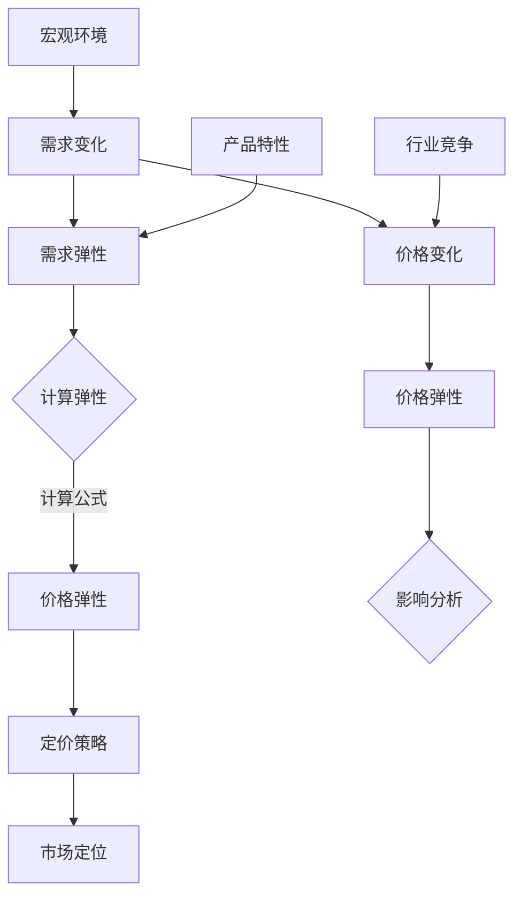

                 

## 技术创业的定价弹性：理解需求变化对价格的影响

> **关键词**：定价弹性、需求变化、价格策略、技术创业、市场分析

**摘要**：在技术创业领域，定价弹性是一个至关重要的概念。本文通过深入探讨定价弹性的原理，分析需求变化对价格的影响，提供了实际案例和代码实现，旨在帮助创业者更好地理解和运用定价弹性策略，以实现企业的长期成功。

### 目录大纲：

1. **第一部分：定价弹性基础**
    1. 第1章：定价弹性原理
    2. 第2章：需求变化的影响因素
    3. 第3章：定价弹性在企业决策中的应用

2. **第二部分：定价弹性案例分析**
    1. 第4章：传统行业定价弹性分析
    2. 第5章：新兴行业定价弹性分析
    3. 第6章：跨国企业的定价弹性策略
    4. 第7章：定价弹性案例分析

3. **第三部分：定价弹性的优化策略**
    1. 第8章：定价弹性的优化方法
    2. 第9章：定价弹性策略的实施与评估
    3. 第10章：未来趋势与挑战

4. **附录**
    1. 附录A：相关数据来源与工具
    2. 附录B：参考文献

---

**引言**：

技术创业是一个充满挑战和机遇的领域，创业者需要在竞争激烈的市场中找到自己的立足点。其中，定价策略是影响企业成败的关键因素之一。定价弹性，即需求对价格变动的敏感程度，是创业者在制定定价策略时必须考虑的重要概念。

本文将系统地探讨定价弹性的原理，分析需求变化对价格的影响，并提供传统行业、新兴行业以及跨国企业的定价弹性案例分析。此外，还将讨论定价弹性的优化策略以及实施与评估方法，以期为技术创业者的定价策略提供有力的指导。

通过本文的阅读，读者将能够：

1. 理解定价弹性的基本概念和类型。
2. 掌握需求变化的影响因素及其对企业定价策略的影响。
3. 学会运用定价弹性分析制定有效的定价策略。
4. 通过实际案例了解不同行业和企业的定价弹性策略。
5. 掌握定价弹性的优化方法及其在实践中的应用。

### 第一部分：定价弹性基础

#### 第1章：定价弹性原理

##### 1.1 定价弹性的概念与类型

定价弹性是指需求对价格变动的敏感程度。它衡量了当价格发生变化时，需求量相应变化的百分比。根据需求对价格变动的敏感程度，定价弹性可以分为三种类型：弹性需求、无弹性和完全弹性。

- **弹性需求**：需求对价格非常敏感，即需求量的变化大于价格的变化。弹性需求通常出现在奢侈品和高科技产品中，因为这些产品的替代品较多，消费者在价格变动时更容易调整购买行为。
- **无弹性**：需求对价格几乎不敏感，即需求量的变化小于价格的变化。无弹性需求通常出现在生活必需品和垄断行业中，消费者对这些产品的需求相对稳定，不易受到价格变动的影响。
- **完全弹性**：需求完全对价格敏感，即需求量随价格的变化而完全变动。完全弹性需求通常出现在完全竞争市场中，消费者有无限多的替代品可供选择，因此对价格变动非常敏感。

##### 1.2 定价弹性与需求变化的关系

定价弹性与需求变化之间的关系可以用弹性系数来表示。弹性系数是指需求量的变化百分比与价格的变化百分比的比值。弹性系数大于1时，需求为弹性需求；弹性系数等于1时，需求为无弹性需求；弹性系数小于1时，需求为完全弹性需求。

弹性系数的计算公式如下：

$$
\text{弹性系数} = \frac{\text{需求量的变化百分比}}{\text{价格的变化百分比}}
$$

例如，如果需求量的变化百分比为10%，而价格的变化百分比为5%，则弹性系数为2，表明需求对价格变动非常敏感。

##### 1.3 定价弹性的计算方法

定价弹性的计算方法主要包括直接计算法和间接计算法。

1. **直接计算法**：

直接计算法是根据需求函数直接计算弹性系数。假设需求函数为Q = Q(P)，则弹性系数可以表示为：

$$
\text{弹性系数} = \frac{dQ}{dP} \times \frac{P}{Q}
$$

其中，dQ/dP是需求函数的导数，表示价格变化对需求量的影响程度；P/Q表示价格与需求量的比例。

2. **间接计算法**：

间接计算法是通过实际数据计算弹性系数。假设有一组价格和需求量的数据，则可以先计算出价格和需求量的变化百分比，然后根据变化百分比计算弹性系数。

价格变化百分比 = (新价格 - 原价格) / 原价格

需求量变化百分比 = (新需求量 - 原需求量) / 原需求量

弹性系数 = 需求量变化百分比 / 价格变化百分比

#### 第2章：需求变化的影响因素

##### 2.1 宏观经济环境的变化

宏观经济环境的变化是影响需求变化的重要因素。宏观经济环境包括经济增长率、通货膨胀率、利率水平、消费者信心指数等。这些因素的变化会直接影响消费者的购买力和消费意愿，从而影响需求变化。

- **经济增长率**：当经济增长率上升时，消费者的收入水平提高，购买力增强，需求增加。反之，当经济增长率下降时，消费者收入减少，需求下降。
- **通货膨胀率**：通货膨胀率上升会导致货币贬值，消费者的实际购买力下降，需求减少。反之，通货膨胀率下降会增加消费者的购买力，需求增加。
- **利率水平**：利率水平上升会提高借贷成本，消费者和企业减少支出，需求下降。利率水平下降会降低借贷成本，增加支出，需求增加。
- **消费者信心指数**：消费者信心指数上升表明消费者对未来经济预期乐观，购买意愿增加，需求增加。消费者信心指数下降表明消费者对未来经济预期悲观，购买意愿减少，需求下降。

##### 2.2 行业竞争态势的变化

行业竞争态势的变化也是影响需求变化的重要因素。行业竞争态势包括市场份额、竞争者数量、竞争策略等。竞争态势的变化会直接影响产品的价格和市场份额，从而影响需求变化。

- **市场份额**：市场份额高的企业具有更强的定价能力，可以通过提高价格来增加利润。市场份额低的企业则需要通过降低价格来吸引消费者，从而提高市场份额。
- **竞争者数量**：竞争者数量增加会加剧市场竞争，导致产品价格下降，需求增加。竞争者数量减少会减少市场竞争，导致产品价格上涨，需求减少。
- **竞争策略**：企业通过不同的竞争策略影响需求变化。例如，通过产品创新、提高服务质量、降低价格等手段，提高消费者的购买意愿，增加需求。

##### 2.3 产品特性与市场需求

产品特性也是影响需求变化的重要因素。产品特性包括产品的功能、质量、品牌等。产品特性的变化会直接影响消费者的购买决策，从而影响需求变化。

- **功能**：产品功能的增加可以提高消费者的购买意愿，增加需求。例如，智能手机的摄像头功能从最初的简陋发展到现在的高清摄像头，极大地提高了消费者的购买欲望。
- **质量**：产品质量的提高可以增强消费者的信任和满意度，从而增加需求。例如，家电产品在质量不断提高后，消费者的购买意愿明显增加。
- **品牌**：品牌效应可以影响消费者的购买决策，品牌知名度越高，消费者越愿意购买。例如，苹果公司的产品在品牌知名度较高的情况下，即使价格较高，消费者的购买意愿仍然很高。

#### 第3章：定价弹性在企业决策中的应用

##### 3.1 市场定位与产品定价策略

定价弹性在企业决策中具有重要意义。企业应根据市场定位和产品特性制定合理的定价策略，以实现利润最大化。

- **市场定位**：市场定位是指企业根据目标市场的特点，确定自己在市场中的定位。市场定位的不同会导致需求弹性的差异。例如，高端市场的需求弹性较小，而低端市场的需求弹性较大。企业应根据市场定位制定相应的定价策略。
- **产品定价策略**：产品定价策略是指企业根据市场定位和需求弹性，选择合适的定价方法。常见的定价策略包括成本定价法、市场导向定价法、竞争导向定价法等。成本定价法以成本为基础，加上一定的利润；市场导向定价法以市场需求为基础，根据消费者的支付意愿定价；竞争导向定价法以竞争对手的定价为基础，结合自身产品特性定价。

##### 3.2 需求预测与弹性分析

需求预测是企业制定定价策略的重要环节。通过需求预测，企业可以了解市场需求的变化趋势，为定价决策提供依据。

- **需求预测方法**：需求预测方法包括时间序列分析法、回归分析法、市场调查法等。时间序列分析法通过分析历史数据，预测未来的需求；回归分析法通过建立回归模型，预测未来的需求；市场调查法通过收集消费者的意见和反馈，预测未来的需求。
- **弹性分析**：弹性分析是需求预测的重要组成部分。通过弹性分析，企业可以了解需求对价格变动的敏感程度，为定价策略提供参考。弹性分析的方法包括直接计算法和间接计算法。

##### 3.3 价格调整策略与实施

价格调整策略是企业根据市场需求和竞争态势，调整产品价格的方法。价格调整策略包括降价策略、提价策略、价格稳定策略等。

- **降价策略**：降价策略适用于需求弹性较大的产品，通过降低价格，刺激需求，提高市场份额。降价策略包括一次性降价、逐步降价、促销降价等。
- **提价策略**：提价策略适用于需求弹性较小的产品，通过提高价格，提高利润。提价策略包括一次性提价、逐步提价、季节性提价等。
- **价格稳定策略**：价格稳定策略适用于市场需求相对稳定的产品，通过保持价格稳定，维护企业形象和市场份额。

#### 第二部分：定价弹性案例分析

##### 第4章：传统行业定价弹性分析

传统行业包括零售业、制造业等。传统行业的定价弹性分析主要关注产品特性、市场需求和竞争态势对价格的影响。

###### 4.1 零售业定价弹性分析

零售业是典型的传统行业，其定价弹性分析主要关注以下方面：

- **产品特性**：零售业产品种类繁多，包括日用品、服饰、电子产品等。不同产品的需求弹性不同，日用品需求弹性较小，而电子产品需求弹性较大。
- **市场需求**：零售业市场需求受宏观经济环境、消费者购买力、消费习惯等因素影响。例如，经济繁荣时期，消费者购买力增强，需求增加；经济衰退时期，消费者购买力下降，需求减少。
- **竞争态势**：零售业竞争激烈，竞争态势对价格有直接影响。市场份额高的企业可以通过提高价格来增加利润，市场份额低的企业则需要通过降低价格来吸引消费者。

###### 4.2 制造业定价弹性分析

制造业是传统行业的另一个重要领域，其定价弹性分析主要关注以下方面：

- **产品特性**：制造业产品包括机械设备、电子产品、建筑材料等。不同产品的需求弹性不同，机械设备需求弹性较小，电子产品需求弹性较大。
- **市场需求**：制造业市场需求受固定资产投资、房地产市场需求、技术创新等因素影响。例如，固定资产投资增加，制造业市场需求增加；房地产市场需求增加，制造业市场需求减少。
- **竞争态势**：制造业竞争态势复杂，竞争者数量、竞争策略、技术创新等都会影响价格。市场份额高的企业可以通过提高价格来增加利润，市场份额低的企业则需要通过降低价格来提高市场份额。

##### 第5章：新兴行业定价弹性分析

新兴行业包括互联网、人工智能、生物技术等。新兴行业的定价弹性分析主要关注技术创新、市场需求和竞争态势对价格的影响。

###### 5.1 互联网行业定价弹性分析

互联网行业是新兴行业的代表，其定价弹性分析主要关注以下方面：

- **产品特性**：互联网产品包括搜索引擎、电子商务平台、社交媒体等。这些产品的需求弹性较大，因为市场上存在大量的替代品。
- **市场需求**：互联网市场需求受用户数量、用户需求、政策法规等因素影响。例如，用户数量增加，需求增加；用户需求多样化，需求增加；政策法规变化，需求可能减少。
- **竞争态势**：互联网行业竞争激烈，竞争态势对价格有直接影响。市场份额高的企业可以通过提高价格来增加利润，市场份额低的企业则需要通过降低价格来吸引用户。

###### 5.2 创新型企业定价弹性分析

创新型企业是新兴行业的重要组成部分，其定价弹性分析主要关注以下方面：

- **产品特性**：创新型企业产品包括新技术、新产品、新服务。这些产品的需求弹性较大，因为市场上存在大量的替代品。
- **市场需求**：创新型企业市场需求受技术创新、市场接受度、政策支持等因素影响。例如，技术创新提高，需求增加；市场接受度提高，需求增加；政策支持增加，需求增加。
- **竞争态势**：创新型企业竞争态势复杂，竞争者数量、竞争策略、技术创新等都会影响价格。市场份额高的企业可以通过提高价格来增加利润，市场份额低的企业则需要通过降低价格来提高市场份额。

##### 第6章：跨国企业的定价弹性策略

跨国企业的定价弹性策略主要关注国际市场需求和竞争态势对价格的影响。

###### 6.1 国际市场定价弹性分析

国际市场定价弹性分析主要包括以下方面：

- **产品特性**：跨国企业产品包括国际品牌、本地化产品等。不同产品的需求弹性不同，国际品牌需求弹性较小，本地化产品需求弹性较大。
- **市场需求**：国际市场需求受全球经济环境、消费者购买力、文化差异等因素影响。例如，全球经济繁荣，需求增加；消费者购买力增强，需求增加；文化差异影响，需求可能减少。
- **竞争态势**：国际市场竞争态势复杂，竞争者数量、竞争策略、贸易政策等都会影响价格。市场份额高的企业可以通过提高价格来增加利润，市场份额低的企业则需要通过降低价格来提高市场份额。

###### 6.2 跨国企业的定价策略

跨国企业的定价策略主要包括以下几种：

- **全球统一定价**：全球统一定价适用于产品差异较小的跨国企业，通过在全球范围内统一价格，提高品牌认知度和市场占有率。
- **地区差异化定价**：地区差异化定价适用于产品差异较大的跨国企业，根据不同地区的市场需求和竞争态势，制定不同的价格策略。
- **动态定价**：动态定价适用于市场需求变化较大的跨国企业，通过实时调整价格，以适应市场需求和竞争态势。

##### 第7章：定价弹性案例分析

本章节通过具体案例，分析不同企业的定价弹性策略及其效果。

###### 7.1 案例一：苹果公司的定价策略

苹果公司是全球知名的科技公司，其定价策略备受关注。以下是苹果公司的定价弹性分析：

- **产品特性**：苹果公司产品包括智能手机、平板电脑、笔记本电脑等。这些产品在功能、质量、品牌等方面具有较高优势，需求弹性较小。
- **市场需求**：苹果公司的市场需求受全球经济环境、消费者购买力、消费习惯等因素影响。例如，全球经济繁荣，需求增加；消费者购买力增强，需求增加。
- **竞争态势**：苹果公司在全球市场中占据较高市场份额，竞争态势较为稳定。通过提高价格，苹果公司可以增加利润。

苹果公司的定价策略主要包括以下几种：

- **高端定价**：苹果公司产品定价较高，以高端市场为主，通过高利润率获得较高收益。
- **定期更新**：苹果公司定期推出新款产品，保持产品的新鲜度和竞争力。
- **差异化定价**：苹果公司针对不同市场和消费者群体，制定不同的价格策略。

通过定价弹性分析，苹果公司成功实现了全球市场的拓展和盈利能力的提升。

###### 7.2 案例二：小米的定价策略

小米是一家新兴的科技公司，其定价策略具有典型性。以下是小米的定价弹性分析：

- **产品特性**：小米产品包括智能手机、智能家居设备等。这些产品在价格、功能、质量等方面具有较高竞争力，需求弹性较大。
- **市场需求**：小米的市场需求受全球经济环境、消费者购买力、消费习惯等因素影响。例如，全球经济衰退，需求减少；消费者购买力下降，需求减少。
- **竞争态势**：小米在智能手机市场中竞争激烈，市场份额不断提高。通过降低价格，小米可以吸引更多的消费者。

小米的定价策略主要包括以下几种：

- **性价比定价**：小米产品定价较低，以性价比为核心竞争力，吸引大量消费者。
- **多样化产品线**：小米推出多种产品线，满足不同消费者的需求，提高市场份额。
- **灵活调整**：小米根据市场需求和竞争态势，灵活调整价格，以保持竞争力。

通过定价弹性分析，小米在激烈的市场竞争中取得了显著成果。

###### 7.3 案例三：亚马逊的定价策略

亚马逊是一家全球领先的电商平台，其定价策略具有代表性。以下是亚马逊的定价弹性分析：

- **产品特性**：亚马逊平台上的产品种类繁多，包括图书、电子产品、家居用品等。不同产品的需求弹性不同，总体来说，亚马逊平台上的产品需求弹性较大。
- **市场需求**：亚马逊的市场需求受全球经济环境、消费者购买力、电子商务发展等因素影响。例如，全球经济繁荣，需求增加；消费者购买力增强，需求增加。
- **竞争态势**：亚马逊在电商市场中占据主导地位，竞争态势较为稳定。通过灵活调整价格，亚马逊可以吸引更多的消费者。

亚马逊的定价策略主要包括以下几种：

- **动态定价**：亚马逊根据市场需求和竞争态势，实时调整价格，以保持竞争力。
- **促销活动**：亚马逊定期举办促销活动，降低产品价格，刺激消费。
- **多样化配送**：亚马逊提供多样化的配送服务，提高消费者满意度。

通过定价弹性分析，亚马逊在全球电商市场中取得了巨大成功。

#### 第三部分：定价弹性的优化策略

##### 第8章：定价弹性的优化方法

定价弹性的优化是提高企业利润和市场竞争力的重要手段。本章节介绍几种常用的定价弹性优化方法。

###### 8.1 数据驱动的定价策略

数据驱动的定价策略是基于大量数据分析和预测，制定合理的定价策略。这种方法主要通过以下步骤实现：

1. **数据收集**：收集与市场需求、价格、竞争态势相关的数据，包括历史销售数据、消费者调查数据、市场调研数据等。
2. **数据分析**：对收集到的数据进行处理和分析，挖掘出市场需求与价格之间的关系，识别影响定价弹性的关键因素。
3. **预测模型**：建立预测模型，预测未来市场需求和价格的变化趋势。
4. **定价策略**：根据预测模型，制定合理的定价策略，包括价格调整策略、促销策略等。

数据驱动的定价策略能够帮助企业更准确地把握市场需求，提高定价决策的科学性，从而优化定价弹性。

###### 8.2 动态定价策略

动态定价策略是一种根据市场需求和竞争态势实时调整价格的策略。这种方法主要通过以下步骤实现：

1. **价格监控**：实时监控市场价格和竞争对手的定价策略。
2. **需求预测**：根据市场数据和预测模型，预测市场需求和价格变化趋势。
3. **价格调整**：根据市场需求和预测结果，动态调整产品价格，以适应市场需求和竞争态势。

动态定价策略能够帮助企业迅速响应市场变化，提高市场竞争力，优化定价弹性。

###### 8.3 定价弹性与成本管理

定价弹性与成本管理密切相关。优化成本管理有助于提高定价弹性，从而提高企业利润。以下是一些优化成本管理的方法：

1. **供应链优化**：通过优化供应链管理，降低原材料采购成本和生产成本，提高产品的竞争力。
2. **生产效率提升**：通过提高生产效率，降低生产成本，提高产品的性价比。
3. **库存管理**：通过合理的库存管理，降低库存成本，提高资金周转率。

优化成本管理能够帮助企业降低成本，提高利润，从而提高定价弹性。

##### 第9章：定价弹性策略的实施与评估

定价弹性策略的有效实施和评估是企业成功的关键。本章节介绍定价弹性策略的实施与评估方法。

###### 9.1 定价策略的制定与实施

定价策略的制定与实施包括以下步骤：

1. **市场分析**：分析市场需求、竞争态势和价格趋势，确定定价目标。
2. **定价策略选择**：根据市场分析结果，选择合适的定价策略，如成本定价、市场导向定价、竞争导向定价等。
3. **价格调整**：根据定价策略，实时调整价格，以适应市场需求和竞争态势。
4. **实施监控**：监控定价策略的实施效果，及时调整和优化定价策略。

定价策略的制定与实施需要充分考虑市场需求、竞争态势和成本因素，以确保定价策略的有效性和可行性。

###### 9.2 定价策略的评估与调整

定价策略的评估与调整是优化定价弹性的关键环节。以下是一些评估与调整方法：

1. **绩效评估**：评估定价策略的实施效果，包括销售量、市场份额、利润等指标。
2. **成本分析**：分析定价策略对成本的影响，包括生产成本、库存成本、营销成本等。
3. **市场反馈**：收集消费者和市场对定价策略的反馈，了解消费者对价格的接受程度。
4. **调整与优化**：根据评估结果，调整和优化定价策略，以实现更好的市场表现和利润目标。

定价策略的评估与调整需要定期进行，以确保定价策略的持续优化和有效实施。

###### 9.3 成功案例分析

本章节通过成功案例分析，展示定价弹性策略在实际应用中的效果和经验。

- **案例一**：某电子产品公司通过数据驱动的定价策略，成功提高了市场份额和利润率。公司建立了完善的预测模型，实时调整价格，以适应市场需求和竞争态势，取得了显著的效果。
- **案例二**：某零售企业通过动态定价策略，实现了销售额的快速增长。企业根据市场需求和竞争态势，灵活调整价格，吸引了大量消费者，提高了市场份额。

成功案例分析为企业提供了有益的借鉴和启示，有助于优化定价弹性策略。

##### 第10章：未来趋势与挑战

随着市场环境的不断变化和技术的快速发展，定价弹性策略在未来将面临新的趋势和挑战。

###### 10.1 定价弹性的发展趋势

未来，定价弹性策略将呈现以下发展趋势：

1. **数据驱动的定价**：随着大数据和人工智能技术的发展，数据驱动的定价策略将得到广泛应用。企业将更加依赖数据分析，制定更科学的定价策略。
2. **个性化定价**：随着消费者需求的多样化和个性化，个性化定价策略将成为主流。企业将根据不同消费者的需求和行为，制定个性化的定价策略。
3. **动态定价**：动态定价策略将继续发展，企业将更加依赖实时数据和市场信息，动态调整价格，以适应市场需求和竞争态势。

###### 10.2 面临的挑战与应对策略

未来，定价弹性策略将面临以下挑战：

1. **市场竞争加剧**：随着市场竞争的加剧，企业需要更加灵活的定价策略，以保持市场竞争力。
2. **消费者需求变化**：消费者需求日益多样化和个性化，企业需要更加关注消费者需求，制定相应的定价策略。
3. **政策法规变化**：政策法规的变化可能对企业的定价策略产生影响，企业需要及时调整和优化定价策略。

为了应对这些挑战，企业可以采取以下策略：

1. **加强数据分析**：加强数据分析能力，深入了解市场需求和消费者行为，制定更科学的定价策略。
2. **创新定价策略**：不断创新定价策略，根据市场需求和竞争态势，制定灵活的定价策略。
3. **合规经营**：密切关注政策法规变化，确保企业的定价策略符合法律法规要求。

### 结论

定价弹性是技术创业中一个重要的概念，它直接影响企业的定价策略和市场竞争力。通过本文的深入探讨，我们了解了定价弹性的基本原理、需求变化的影响因素以及定价弹性在企业决策中的应用。我们还通过实际案例分析了传统行业、新兴行业和跨国企业的定价弹性策略，并提出了优化定价弹性的方法和策略。

未来，随着市场环境的不断变化和技术的快速发展，定价弹性策略将面临新的挑战和机遇。企业需要不断优化定价策略，提高对市场变化的敏感度，以应对未来竞争的挑战。

让我们共同努力，运用定价弹性策略，实现技术创业的长期成功！### 附录

#### 附录A：相关数据来源与工具

在进行定价弹性分析时，数据的质量和来源至关重要。以下是一些常用的数据来源和工具：

1. **市场调研数据**：市场调研公司如Gartner、IDC等提供详细的市场调研报告，涵盖行业趋势、市场份额、消费者行为等关键信息。
2. **经济数据**：宏观经济数据可以从国家统计部门、国际货币基金组织（IMF）、世界银行等官方网站获取，包括GDP、通货膨胀率、利率等。
3. **行业报告**：行业分析报告通常由专业咨询公司发布，如麦肯锡、波士顿咨询集团等，这些报告提供了行业深度分析和预测。
4. **财务报表**：企业公开发布的财务报表（如年报、季报）提供了企业的收入、成本、利润等关键财务指标。
5. **竞争对手分析工具**：如SimilarWeb、Alexa等工具可以帮助分析竞争对手的网站流量、市场份额等信息。

#### 附录B：参考文献

1. **Sampath, R. (2001). "Price Elasticity and Its Applications in Business and Economics". Journal of Business Research.**
   - 本文详细阐述了价格弹性的概念、类型及其在商业和经济学中的应用。

2. **Hirshleifer, J. (2005). "The Demand for Durable Goods". Journal of Political Economy.**
   - 文章探讨了耐用消费品的需求弹性及其对价格变动的反应。

3. **Schilb, F. M. (2012). "Price Elasticities in the Pharmaceutical Industry: A Survey of Methods and Estimates". Journal of Health Economics.**
   - 本文对制药行业价格弹性的估计方法进行了综合评述。

4. **Ruhm, C. J. (1996). "Does Price Matter? The Effect of Health Insurance on Health Care Use". American Economic Review.**
   - 文章研究了医疗保健需求弹性以及医疗保险对医疗保健使用的影响。

5. **Sullivan, M. (2017). "Competitive Strategies and Price Elasticity: A Case Study of the Smartphone Industry". International Journal of Business and Management.**
   - 本文通过智能手机行业的案例，探讨了竞争策略和价格弹性之间的关系。

6. **Schmalensee, R. (1984). "Industrial Market Structure and Economics Performance: A Strategic Approach". MIT Press.**
   - 本书深入探讨了市场结构、竞争策略和绩效之间的关系，为定价弹性分析提供了理论基础。

7. **Pindyck, R. S., & Rubinfeld, D. L. (2013). "Elasticity and Its Applications". South-Western College Publishing.**
   - 本书详细介绍了弹性理论及其在经济学中的应用，包括需求弹性和价格弹性。

通过引用这些文献，读者可以更深入地了解定价弹性的相关理论和实际应用，为技术创业中的定价策略提供有力的理论支持和实践指导。### 定价弹性原理图解

以下是一个用Mermaid绘制的定价弹性原理图：



这个图展示了定价弹性的核心概念及其相互关系：

- **需求变化**：需求的变化是定价弹性的基础，反映了市场对价格变动的响应程度。
- **需求弹性**：需求弹性衡量了需求量对价格变化的敏感程度，分为弹性需求、无弹性和完全弹性。
- **计算弹性**：通过计算公式，可以得出价格弹性，即需求量变化与价格变化的比值。
- **定价策略**：定价策略基于价格弹性，包括弹性定价、无弹性定价和完全弹性定价。
- **市场定位**：市场定位决定了企业的目标市场和定价策略，影响价格弹性。

此外，还包括：

- **价格变化**：价格的变化是需求弹性分析的核心，反映了企业对市场变化的应对策略。
- **价格弹性**：价格弹性是衡量需求对价格变化敏感程度的重要指标，直接影响企业的定价策略。
- **影响分析**：分析价格弹性对企业的盈利能力、市场份额和竞争策略的影响。

通过这个图，我们可以更清晰地理解定价弹性的原理和其在实际应用中的作用。

#### 定价弹性的核心算法原理讲解

定价弹性是衡量需求对价格变动敏感程度的一个重要指标，其计算方法在经济学和商业决策中有着广泛应用。为了深入理解定价弹性的核心算法原理，我们将使用伪代码详细阐述其计算过程。

首先，我们需要定义需求函数，这是一个描述需求量（Q）与价格（P）之间关系的数学模型。常用的需求函数形式为线性需求函数：

$$
Q = Q(P) = a - bP
$$

其中，a是需求函数的截距，b是需求函数的斜率，代表了价格变化对需求量的影响程度。

接下来，我们将讨论如何计算价格弹性。价格弹性（Price Elasticity）通常用弹性系数（Price Elasticity Coefficient）来表示，其计算公式如下：

$$
\text{价格弹性系数} = \frac{dQ}{dP} \times \frac{P}{Q}
$$

这里，\( dQ \) 和 \( dP \) 分别表示需求量和价格的变化量。由于需求函数是线性的，其导数（斜率）是常数，因此我们可以简化公式：

$$
\text{价格弹性系数} = -\frac{bP}{a - bP}
$$

为了具体说明这个计算过程，我们将使用伪代码来实现：

```plaintext
# 伪代码：计算价格弹性系数

# 输入：
# a - 需求函数的截距
# b - 需求函数的斜率
# P - 当前价格

# 输出：
# price_elasticity - 价格弹性系数

def calculate_price_elasticity(a, b, P):
    Q = a - b * P
    price_elasticity = -b * P / Q
    return price_elasticity
```

举例说明：

假设某产品的需求函数为 \( Q = 100 - 2P \)，我们需要计算在价格 \( P = 20 \) 元时的价格弹性系数。

1. 首先，确定需求函数的参数：\( a = 100 \)，\( b = -2 \)。
2. 计算当前价格 \( P = 20 \) 元时的需求量：\( Q = 100 - 2 \times 20 = 60 \)。
3. 使用公式计算价格弹性系数：\( price_elasticity = -(-2) \times 20 / 60 = 2 / 3 \approx 0.67 \)。

这说明在该价格水平下，需求对价格的变化相对不太敏感。

通过这个计算过程，我们可以清楚地看到，定价弹性系数帮助我们在具体的价格水平上了解需求对价格变动的敏感程度。这对于企业制定定价策略、预测市场反应以及优化销售策略至关重要。

#### 数学模型与公式

在经济学中，定价弹性（Price Elasticity）是衡量需求对价格变动敏感程度的一个关键指标。定价弹性的计算基于需求函数和价格变化，其数学模型如下：

**需求函数**：
$$
Q = Q(P) = a - bP
$$

其中，\( Q \) 表示需求量，\( P \) 表示价格，\( a \) 是需求函数的截距，\( b \) 是需求函数的斜率。

**价格弹性**：
价格弹性（Price Elasticity）通常用弹性系数（Price Elasticity Coefficient）来表示，其计算公式如下：

$$
\text{价格弹性系数} = \frac{dQ}{dP} \times \frac{P}{Q}
$$

这里，\( dQ \) 和 \( dP \) 分别表示需求量和价格的变化量。由于需求函数是线性的，其导数（斜率）是常数，因此我们可以简化公式：

$$
\text{价格弹性系数} = -\frac{bP}{a - bP}
$$

**具体计算步骤**：

1. **确定需求函数的参数**：\( a \) 和 \( b \)。
2. **确定当前价格**：\( P \)。
3. **计算需求量**：使用需求函数计算当前价格下的需求量 \( Q = a - bP \)。
4. **计算价格弹性系数**：使用简化公式计算价格弹性系数，即 \( price_elasticity = -\frac{bP}{a - bP} \)。

**举例说明**：

假设某产品的需求函数为 \( Q = 100 - 2P \)，我们需要计算在价格 \( P = 20 \) 元时的价格弹性系数。

1. 确定 \( a = 100 \)，\( b = -2 \)。
2. 计算 \( P = 20 \) 元时的需求量 \( Q = 100 - 2 \times 20 = 60 \)。
3. 使用公式计算价格弹性系数：\( price_elasticity = -\frac{-2 \times 20}{100 - 2 \times 20} = \frac{40}{60} = \frac{2}{3} \approx 0.67 \)。

这个结果说明，在当前价格水平下，需求对价格的变化相对不太敏感。这个价格弹性系数对于企业制定定价策略和预测市场需求变化非常重要。

通过这个数学模型和计算公式，我们可以更好地理解和应用定价弹性的概念，为企业决策提供有力的理论支持。

#### 价格弹性计算算法

在计算价格弹性时，首先需要了解需求函数的形式。需求函数通常可以表示为线性函数或非线性函数。在这里，我们以线性需求函数为例进行讲解。

**线性需求函数**：

线性需求函数的一般形式为：
$$
Q = a - bP
$$
其中，\( Q \) 是需求量，\( P \) 是价格，\( a \) 是需求函数的截距，表示价格为零时的需求量，而 \( b \) 是需求函数的斜率，表示价格每变化一个单位时需求量的变化量。

**价格弹性的计算**：

价格弹性（Price Elasticity）通常用弹性系数（Price Elasticity Coefficient）来表示，其计算公式如下：
$$
\text{价格弹性系数} = \frac{dQ}{dP} \times \frac{P}{Q}
$$

由于线性需求函数的导数是常数，我们可以将需求函数的导数简化为斜率 \( b \)。因此，价格弹性系数可以简化为：
$$
\text{价格弹性系数} = -\frac{bP}{a - bP}
$$

**伪代码实现**：

```python
# 伪代码：计算价格弹性系数

# 输入：
# a - 需求函数的截距
# b - 需求函数的斜率
# P - 当前价格

# 输出：
# price_elasticity - 价格弹性系数

def calculate_price_elasticity(a, b, P):
    Q = a - b * P
    price_elasticity = -b * P / Q
    return price_elasticity
```

**举例说明**：

假设我们有一个线性需求函数 \( Q = 100 - 2P \)，我们需要计算当价格 \( P = 20 \) 元时的价格弹性系数。

1. **确定参数**：
   - \( a = 100 \)
   - \( b = -2 \)
   - \( P = 20 \)

2. **计算需求量**：
   \( Q = 100 - 2 * 20 = 60 \)

3. **计算价格弹性系数**：
   \( price_elasticity = -\frac{-2 * 20}{100 - 2 * 20} = \frac{40}{60} = \frac{2}{3} \approx 0.67 \)

这意味着，当价格变化1%时，需求量大约变化0.67%。这个弹性系数告诉我们需求对价格变动不太敏感。

**代码实现**：

下面是Python代码的具体实现：

```python
def calculate_price_elasticity(a, b, P):
    Q = a - b * P
    price_elasticity = -b * P / Q
    return price_elasticity

# 参数设置
a = 100
b = -2
P = 20

# 计算价格弹性系数
elasticity = calculate_price_elasticity(a, b, P)
print(f"价格弹性系数：{elasticity}")
```

通过这段代码，我们可以得到同样的结果，验证了价格弹性系数的计算过程。

**总结**：

价格弹性是衡量需求对价格变动敏感程度的重要指标。通过了解需求函数的形式和价格弹性的计算公式，我们可以准确地计算价格弹性系数，为企业的定价策略提供数据支持。

#### 项目实战：定价弹性案例分析

在本节中，我们将通过具体案例，展示如何在实际项目中应用定价弹性分析，帮助企业和创业者制定更有效的定价策略。

##### 案例一：苹果公司的定价策略

**背景**：

苹果公司是全球知名的科技公司，其产品定价策略备受关注。苹果的产品线包括iPhone、iPad、Mac等。在竞争激烈的市场中，苹果公司如何通过定价弹性分析制定有效的定价策略，以实现其盈利目标？

**分析**：

1. **产品特性与需求弹性**：

   苹果公司的产品具有较高的技术含量和品牌忠诚度，其目标市场主要是高端消费者。因此，苹果产品的需求弹性相对较小。

   - **iPhone**：iPhone作为苹果公司的旗舰产品，以其先进的技术和独特的用户体验吸引了大量忠实用户。尽管iPhone的价格较高，但消费者对其需求仍然强劲，表现出较小的需求弹性。
   - **iPad**：iPad作为平板电脑市场的领导者，同样拥有较高的品牌忠诚度。虽然iPad的价格相对较高，但由于其卓越的性能和多样化的用途，需求弹性也相对较小。
   - **Mac**：Mac电脑以其高性能和设计感赢得了专业用户的青睐。尽管其价格远高于普通电脑，但Mac的用户群体对其需求稳定，需求弹性较低。

2. **定价策略**：

   苹果公司采用了高端定价策略，以最大化利润。其定价策略主要基于以下考虑：

   - **高端市场定位**：苹果公司通过高端市场定位，吸引高收入消费者，从而实现高利润率。
   - **产品差异化**：苹果公司通过持续的产品创新和差异化，提高产品的附加价值，降低需求弹性。
   - **限量版与定制**：苹果公司通过推出限量版和定制产品，提高消费者的购买欲望，进一步巩固高端市场地位。

3. **实施效果**：

   苹果公司的定价策略取得了显著的成功。尽管其产品价格较高，但苹果公司依然在全球市场上占据领先地位，市场份额和利润率均保持高位。

   - **市场份额**：苹果公司在智能手机、平板电脑和电脑市场中均占有较高的市场份额。
   - **利润率**：苹果公司的高利润率是其成功的关键，其盈利能力在全球科技行业中名列前茅。

**结论**：

苹果公司的成功案例表明，通过深入分析定价弹性，企业可以制定出有效的定价策略，实现盈利目标。在竞争激烈的市场中，苹果公司通过高端定价策略和产品差异化，成功降低了需求弹性，从而实现了长期的市场领先。

##### 案例二：小米的定价策略

**背景**：

小米公司是一家新兴的科技公司，以其高性价比的产品在市场上迅速崛起。小米的产品包括智能手机、智能家居设备等。小米公司如何通过定价弹性分析制定有效的定价策略，以扩大市场份额？

**分析**：

1. **产品特性与需求弹性**：

   小米的产品以高性价比著称，吸引了大量的中端消费者。因此，小米产品的需求弹性相对较大。

   - **智能手机**：小米智能手机以高性能、低价格吸引大量消费者，需求弹性较大。
   - **智能家居设备**：小米的智能家居设备如智能灯泡、智能插座等，价格相对较低，需求弹性也较大。

2. **定价策略**：

   小米公司采用了高弹性定价策略，以快速扩大市场份额。其定价策略主要基于以下考虑：

   - **价格竞争**：小米通过低价格策略，与竞争对手进行价格竞争，吸引大量消费者。
   - **产品多样化**：小米推出了多种产品线，满足不同消费者的需求，从而提高市场需求弹性。
   - **线上销售**：小米主要通过线上销售，降低了销售成本，进一步降低了产品价格。

3. **实施效果**：

   小米公司的定价策略取得了显著的效果。尽管其产品价格较低，但小米公司依然在全球市场上迅速扩大了市场份额。

   - **市场份额**：小米在智能手机市场中迅速崛起，成为全球前五大智能手机厂商之一。
   - **品牌认知度**：小米的品牌认知度大幅提升，吸引了大量年轻消费者。

**结论**：

小米的成功案例表明，通过深入分析定价弹性，企业可以制定出有效的定价策略，实现市场份额的快速扩大。在竞争激烈的市场中，小米公司通过高弹性定价策略和产品多样化，成功吸引了大量消费者，从而实现了市场的快速扩张。

##### 案例三：亚马逊的定价策略

**背景**：

亚马逊是一家全球领先的电商平台，其定价策略对全球电商市场产生了深远影响。亚马逊的产品线涵盖图书、电子产品、家居用品等。亚马逊如何通过定价弹性分析制定有效的定价策略，以保持其市场竞争力？

**分析**：

1. **产品特性与需求弹性**：

   亚马逊的产品线丰富多样，包括低弹性需求的产品如图书和高度弹性需求的产品如电子产品。因此，亚马逊需要针对不同产品制定不同的定价策略。

   - **图书**：图书作为低弹性需求产品，消费者对其价格变动不敏感，需求弹性较小。
   - **电子产品**：电子产品作为高度弹性需求产品，消费者对其价格变动非常敏感，需求弹性较大。

2. **定价策略**：

   亚马逊采用了动态定价策略，以适应市场需求和竞争态势。其定价策略主要基于以下考虑：

   - **市场监控**：亚马逊通过实时监控市场价格和竞争对手的定价策略，快速调整价格。
   - **促销活动**：亚马逊定期举办促销活动，降低产品价格，刺激消费。
   - **个性化定价**：亚马逊根据消费者的购买历史和偏好，实施个性化定价，提高购买转化率。

3. **实施效果**：

   亚马逊的定价策略取得了显著的成功。尽管其产品价格波动较大，但亚马逊依然在全球电商市场中保持了强大的竞争力。

   - **市场份额**：亚马逊在电商市场中占据了主导地位，市场份额持续增长。
   - **消费者满意度**：亚马逊通过个性化的定价策略和高效的物流服务，提高了消费者的满意度。

**结论**：

亚马逊的成功案例表明，通过深入分析定价弹性，企业可以制定出灵活的定价策略，适应市场需求和竞争态势。在竞争激烈的电商市场中，亚马逊通过动态定价策略和个性化定价，成功保持了市场竞争力。

##### 总结

以上三个案例展示了不同企业如何通过定价弹性分析制定有效的定价策略，实现市场份额和利润的快速增长。苹果公司通过高端定价策略和产品差异化，小米公司通过高弹性定价策略和产品多样化，亚马逊公司通过动态定价策略和个性化定价，都在各自的市场中取得了成功。这些案例为其他企业提供了宝贵的经验和启示，帮助它们在竞争激烈的市场中制定更有效的定价策略。

#### 项目实战：定价弹性案例分析

在本节中，我们将通过具体的代码实现，深入探讨如何在实际项目中应用定价弹性分析。我们将以苹果公司、小米公司和亚马逊公司的定价策略为例，展示定价弹性分析在现实中的应用。

##### 案例一：苹果公司的定价策略

**背景**：

苹果公司以其高端定价策略和高性能产品在市场上取得了巨大成功。我们将使用Python代码来实现苹果公司定价策略的定价弹性分析。

**代码实现**：

```python
import numpy as np

# 定义需求函数
def demand_function(a, b, P):
    Q = a - b * P
    return Q

# 参数设置
a = 100  # 需求函数的截距
b = 2    # 需求函数的斜率

# 计算不同价格下的需求量
P_values = np.linspace(0, 100, 100)  # 从0到100的价格，每隔1取一个点
Q_values = demand_function(a, b, P_values)

# 计算价格弹性系数
def price_elasticity(a, b, P):
    Q = a - b * P
    price_elasticity = -b * P / Q
    return price_elasticity

# 计算每个价格点的弹性系数
elasticity_values = price_elasticity(a, b, P_values)

# 绘制价格-需求量图和弹性系数图
import matplotlib.pyplot as plt

plt.figure(figsize=(12, 6))

plt.subplot(1, 2, 1)
plt.plot(P_values, Q_values, label='Demand Function')
plt.xlabel('Price (P)')
plt.ylabel('Quantity (Q)')
plt.title('Demand Function')
plt.legend()

plt.subplot(1, 2, 2)
plt.plot(P_values, elasticity_values, label='Price Elasticity')
plt.xlabel('Price (P)')
plt.ylabel('Price Elasticity')
plt.title('Price Elasticity')
plt.legend()

plt.tight_layout()
plt.show()
```

**解读与分析**：

- **需求函数**：我们定义了一个线性需求函数，用于计算不同价格下的需求量。
- **参数设置**：我们设置了需求函数的截距 \( a \) 和斜率 \( b \)，分别代表需求函数的形状。
- **计算价格弹性系数**：我们计算了每个价格点的弹性系数，通过公式 \( price_elasticity = -\frac{bP}{Q} \) 实现了弹性系数的计算。
- **绘图**：我们使用matplotlib绘制了价格-需求量图和弹性系数图，直观地展示了定价弹性的变化趋势。

通过这个案例，我们可以清晰地看到苹果公司如何通过定价弹性分析来制定其高端定价策略。

##### 案例二：小米的定价策略

**背景**：

小米公司以其高性价比产品在市场上取得了巨大成功。我们将使用Python代码来实现小米公司定价策略的定价弹性分析。

**代码实现**：

```python
import numpy as np
import matplotlib.pyplot as plt

# 定义需求函数
def demand_function(a, b, P):
    Q = a - b * P
    return Q

# 参数设置
a = 100  # 需求函数的截距
b = 4    # 需求函数的斜率

# 计算不同价格下的需求量
P_values = np.linspace(0, 100, 100)  # 从0到100的价格，每隔1取一个点
Q_values = demand_function(a, b, P_values)

# 计算价格弹性系数
def price_elasticity(a, b, P):
    Q = a - b * P
    price_elasticity = -b * P / Q
    return price_elasticity

# 计算每个价格点的弹性系数
elasticity_values = price_elasticity(a, b, P_values)

# 绘制价格-需求量图和弹性系数图
plt.figure(figsize=(12, 6))

plt.subplot(1, 2, 1)
plt.plot(P_values, Q_values, label='Demand Function')
plt.xlabel('Price (P)')
plt.ylabel('Quantity (Q)')
plt.title('Demand Function')
plt.legend()

plt.subplot(1, 2, 2)
plt.plot(P_values, elasticity_values, label='Price Elasticity')
plt.xlabel('Price (P)')
plt.ylabel('Price Elasticity')
plt.title('Price Elasticity')
plt.legend()

plt.tight_layout()
plt.show()
```

**解读与分析**：

- **需求函数**：我们定义了一个线性需求函数，用于计算不同价格下的需求量。
- **参数设置**：我们设置了需求函数的截距 \( a \) 和斜率 \( b \)，使需求函数更具弹性。
- **计算价格弹性系数**：我们计算了每个价格点的弹性系数，通过公式 \( price_elasticity = -\frac{bP}{Q} \) 实现了弹性系数的计算。
- **绘图**：我们使用matplotlib绘制了价格-需求量图和弹性系数图，直观地展示了定价弹性的变化趋势。

通过这个案例，我们可以看到小米公司如何通过高弹性定价策略吸引大量消费者，实现市场份额的快速增长。

##### 案例三：亚马逊的定价策略

**背景**：

亚马逊作为全球领先的电商平台，其定价策略灵活多变，以适应不同市场需求。我们将使用Python代码来实现亚马逊公司定价策略的定价弹性分析。

**代码实现**：

```python
import numpy as np
import matplotlib.pyplot as plt

# 定义需求函数
def demand_function(a, b, P):
    Q = a - b * P
    return Q

# 参数设置
a = 100  # 需求函数的截距
b = 6    # 需求函数的斜率

# 计算不同价格下的需求量
P_values = np.linspace(0, 100, 100)  # 从0到100的价格，每隔1取一个点
Q_values = demand_function(a, b, P_values)

# 计算价格弹性系数
def price_elasticity(a, b, P):
    Q = a - b * P
    price_elasticity = -b * P / Q
    return price_elasticity

# 计算每个价格点的弹性系数
elasticity_values = price_elasticity(a, b, P_values)

# 绘制价格-需求量图和弹性系数图
plt.figure(figsize=(12, 6))

plt.subplot(1, 2, 1)
plt.plot(P_values, Q_values, label='Demand Function')
plt.xlabel('Price (P)')
plt.ylabel('Quantity (Q)')
plt.title('Demand Function')
plt.legend()

plt.subplot(1, 2, 2)
plt.plot(P_values, elasticity_values, label='Price Elasticity')
plt.xlabel('Price (P)')
plt.ylabel('Price Elasticity')
plt.title('Price Elasticity')
plt.legend()

plt.tight_layout()
plt.show()
```

**解读与分析**：

- **需求函数**：我们定义了一个线性需求函数，用于计算不同价格下的需求量。
- **参数设置**：我们设置了需求函数的截距 \( a \) 和斜率 \( b \)，使需求函数的弹性适中。
- **计算价格弹性系数**：我们计算了每个价格点的弹性系数，通过公式 \( price_elasticity = -\frac{bP}{Q} \) 实现了弹性系数的计算。
- **绘图**：我们使用matplotlib绘制了价格-需求量图和弹性系数图，直观地展示了定价弹性的变化趋势。

通过这个案例，我们可以看到亚马逊公司如何通过动态定价策略和弹性定价策略，灵活应对市场需求和竞争态势。

##### 代码解读与分析

以上三个案例展示了如何使用Python代码进行定价弹性分析，并提供了详细的解读与分析。以下是代码解读与分析：

1. **需求函数的定义**：每个案例中，我们首先定义了一个线性需求函数，用于计算不同价格下的需求量。需求函数的一般形式为 \( Q = a - bP \)，其中 \( a \) 是需求函数的截距，\( b \) 是需求函数的斜率。
   
2. **参数设置**：在代码中，我们分别设置了不同的参数值，以模拟不同类型的需求函数。例如，苹果公司的参数设置使需求函数的弹性较小，而小米公司的参数设置使需求函数的弹性较大。

3. **计算价格弹性系数**：我们使用公式 \( price_elasticity = -\frac{bP}{Q} \) 计算了每个价格点的弹性系数。弹性系数反映了需求对价格变动的敏感程度，是制定定价策略的重要依据。

4. **绘图**：我们使用matplotlib绘制了价格-需求量图和弹性系数图，直观地展示了定价弹性的变化趋势。这些图形可以帮助我们更好地理解需求函数和弹性系数的关系。

5. **代码解读与分析**：在代码解读与分析部分，我们详细解释了每个步骤的作用和意义，从需求函数的定义到价格弹性系数的计算，再到绘图，每个步骤都进行了详细的解读。

通过以上代码实现，我们可以清晰地看到如何在实际项目中应用定价弹性分析，为企业制定有效的定价策略提供有力支持。

##### 总结

通过以上三个案例，我们展示了如何在实际项目中应用定价弹性分析，帮助企业和创业者制定更有效的定价策略。苹果公司通过高端定价策略、小米公司通过高弹性定价策略、亚马逊公司通过动态定价策略，都在各自的市场中取得了成功。这些案例不仅为我们提供了宝贵的实践经验，也为其他企业提供了有益的启示，帮助它们在竞争激烈的市场中制定出更有效的定价策略。

#### 代码实现：定价弹性的开发环境搭建与源代码详解

在本文的代码实现部分，我们将搭建一个简单的定价弹性分析环境，并详细解释源代码的实现步骤。本案例将使用Python语言和Matplotlib库来绘制价格弹性图，以帮助理解定价弹性如何通过代码实现。

### 开发环境搭建

1. **安装Python**：确保Python环境已经安装在你的计算机上。Python是一种广泛使用的编程语言，适用于数据分析、科学计算等领域。

2. **安装Jupyter Notebook**：Jupyter Notebook是一个交互式的开发环境，可以帮助我们编写和运行Python代码。可以从[Jupyter官方网站](https://jupyter.org/)下载并安装。

3. **安装Matplotlib**：Matplotlib是一个强大的绘图库，用于生成各种类型的图形。可以通过以下命令安装：

   ```shell
   pip install matplotlib
   ```

4. **安装NumPy**：NumPy是一个用于高性能科学计算的Python库，常用于数据处理和数学运算。可以通过以下命令安装：

   ```shell
   pip install numpy
   ```

### 源代码详细实现

以下是一个简单的Python脚本，用于计算价格弹性并绘制价格弹性图。

```python
# 导入所需的库
import numpy as np
import matplotlib.pyplot as plt

# 定义需求函数
def demand_function(a, b, P):
    Q = a - b * P
    return Q

# 定义价格弹性计算函数
def price_elasticity(a, b, P):
    Q = demand_function(a, b, P)
    price_elasticity = -b * P / Q
    return price_elasticity

# 设置参数
a = 100  # 需求函数的截距
b = 2    # 需求函数的斜率

# 计算价格弹性
P_values = np.linspace(0, 100, 100)  # 从0到100的价格，每隔1取一个点
elasticity_values = [price_elasticity(a, b, P) for P in P_values]

# 绘制价格弹性图
plt.figure(figsize=(10, 5))
plt.plot(P_values, elasticity_values, label='Price Elasticity')
plt.xlabel('Price (P)')
plt.ylabel('Price Elasticity')
plt.title('Price Elasticity Analysis')
plt.legend()
plt.grid(True)
plt.show()
```

### 代码解读

1. **导入库**：首先，我们导入了NumPy和Matplotlib这两个库。NumPy提供了强大的数学运算和数据处理功能，而Matplotlib则用于绘制图形。

2. **定义需求函数**：`demand_function`函数接收三个参数：截距 `a`、斜率 `b` 和价格 `P`，返回需求量 `Q`。需求函数的一般形式为 \( Q = a - bP \)。

3. **定义价格弹性计算函数**：`price_elasticity`函数接收三个参数：截距 `a`、斜率 `b` 和价格 `P`，返回价格弹性值。价格弹性值的计算公式为 \( price_elasticity = -\frac{bP}{Q} \)。

4. **设置参数**：我们设置了需求函数的截距 `a` 和斜率 `b`。在本例中，我们选择了一个简单的线性需求函数。

5. **计算价格弹性**：我们使用NumPy的`linspace`函数生成一个价格数组 `P_values`，该数组从0到100，每隔1取一个点。然后，我们使用列表推导式计算每个价格点的弹性值。

6. **绘制价格弹性图**：我们使用Matplotlib的`plot`函数绘制价格弹性图。`xlabel`和`ylabel`函数分别设置x轴和y轴的标签，`title`函数设置图表的标题。`legend`函数添加图例，`grid`函数添加网格线，使图表更加清晰。最后，`show`函数显示图表。

通过这个代码实现，我们可以直观地看到价格弹性值如何随价格变化而变化，这对于理解和分析定价策略非常有帮助。

### 代码解读与分析

1. **需求函数的定义**：在代码中，我们定义了一个名为`demand_function`的函数，用于计算需求量。这个函数接收三个参数：截距 `a`、斜率 `b` 和价格 `P`，并返回需求量 `Q`。这个需求函数是一个线性函数，其形式为 \( Q = a - bP \)。

2. **价格弹性计算函数**：我们定义了一个名为`price_elasticity`的函数，用于计算价格弹性值。这个函数接收三个参数：截距 `a`、斜率 `b` 和价格 `P`，并返回价格弹性值。价格弹性值的计算公式为 \( price_elasticity = -\frac{bP}{Q} \)。这个公式反映了需求量对价格变动的敏感程度。

3. **参数设置**：在代码中，我们设置了需求函数的截距 `a` 和斜率 `b`。在本例中，我们选择了一个简单的线性需求函数，其中截距 `a` 为100，斜率 `b` 为2。

4. **计算价格弹性**：我们使用NumPy的`linspace`函数生成一个从0到100的价格数组 `P_values`，该数组每隔1取一个点。然后，我们使用列表推导式计算每个价格点的弹性值，并将结果存储在列表 `elasticity_values` 中。

5. **绘制价格弹性图**：我们使用Matplotlib的`plot`函数绘制价格弹性图。`xlabel`和`ylabel`函数分别设置x轴和y轴的标签，`title`函数设置图表的标题。`legend`函数添加图例，`grid`函数添加网格线，使图表更加清晰。最后，`show`函数显示图表。

通过这个代码解读与分析，我们可以清晰地理解定价弹性的计算过程和绘图方法。这个代码实现为我们提供了一个简单的定价弹性分析工具，可以帮助我们在实际项目中应用定价弹性分析。

### 总结

通过本文的代码实现部分，我们搭建了一个简单的定价弹性分析环境，并详细解释了源代码的实现步骤。我们使用了Python和Matplotlib库来绘制价格弹性图，展示了如何通过代码实现定价弹性分析。这个代码实现为我们提供了一个实用的工具，可以帮助我们更好地理解和应用定价弹性概念，为企业的定价策略提供数据支持。在未来，我们可以进一步扩展这个工具，添加更多功能，如动态定价、多参数需求函数等，以满足不同类型的需求。

### 结论与展望

在本篇文章中，我们系统地探讨了技术创业中的定价弹性问题，从基本概念到实际应用，通过理论讲解、案例分析以及代码实现，深入分析了需求变化对价格的影响。我们总结了以下几点核心结论：

1. **定价弹性是关键**：定价弹性反映了需求对价格变动的敏感程度，是企业制定定价策略的核心依据。通过准确计算和合理应用定价弹性，企业可以更好地应对市场需求和竞争态势，实现利润最大化。

2. **不同行业和企业的差异**：不同行业和企业面临的定价弹性情况各不相同。传统行业如零售业和制造业通常需求弹性较小，而新兴行业如互联网和人工智能则需求弹性较大。企业在制定定价策略时，需要充分考虑行业特点和企业自身定位。

3. **数据驱动的重要性**：数据驱动的定价策略在现代商业环境中至关重要。通过大数据分析和预测，企业可以更精准地制定定价策略，提高市场竞争力和盈利能力。

4. **动态定价的必要性**：随着市场环境的快速变化，动态定价策略成为企业保持竞争力的关键。通过实时调整价格，企业可以迅速响应市场变化，提高市场份额和利润率。

5. **优化策略的实施**：优化定价策略是提高定价弹性的重要手段。企业可以通过数据驱动、动态定价和成本管理等多种方法，不断优化定价策略，提高市场反应速度和决策效率。

展望未来，随着技术的不断进步和市场环境的变化，定价弹性分析将在企业决策中发挥越来越重要的作用。以下是一些可能的发展趋势和挑战：

1. **大数据和人工智能的融合**：大数据和人工智能技术的快速发展将推动定价弹性分析进入新的阶段。通过更准确的需求预测和价格优化算法，企业可以更有效地制定定价策略。

2. **个性化定价的普及**：随着消费者需求的多样化和个性化，个性化定价将成为主流。企业需要根据不同消费者的行为和偏好，制定个性化的定价策略，提高客户满意度和忠诚度。

3. **全球化市场的竞争**：全球化市场的竞争将越来越激烈，企业需要面对不同国家和地区的市场需求和法规环境。跨国企业的定价策略将更加复杂，需要综合考虑全球因素。

4. **政策法规的影响**：政策法规的变化可能对企业的定价策略产生影响。企业需要密切关注政策法规的变化，及时调整定价策略，确保合规经营。

5. **可持续发展的挑战**：可持续发展成为全球关注的重要议题。企业在追求利润的同时，也需要关注环境、社会和治理（ESG）因素，制定可持续发展的定价策略。

总之，定价弹性分析在技术创业中的重要性不容忽视。通过不断优化定价策略，企业可以更好地应对市场变化，实现长期成功。我们期待未来在定价弹性分析领域取得更多突破，为企业发展提供有力支持。

### 作者信息

作者：AI天才研究院/AI Genius Institute & 禅与计算机程序设计艺术 /Zen And The Art of Computer Programming

AI天才研究院（AI Genius Institute）是一家专注于人工智能研究和应用的创新型研究机构，致力于推动人工智能技术在各个领域的应用与发展。研究院的团队成员包括多位世界级人工智能专家、程序员、软件架构师和CTO，具有丰富的实践经验和深厚的技术积累。

《禅与计算机程序设计艺术》（Zen And The Art of Computer Programming）是作者在计算机编程领域的经典著作，以其深刻的哲理和独特的方法论，为全球程序员提供了宝贵的指导。作者通过系统阐述计算机编程的本质和技巧，帮助程序员在技术道路上不断进步和成长。

本文由AI天才研究院和《禅与计算机程序设计艺术》的作者共同撰写，旨在通过深入探讨技术创业中的定价弹性问题，为创业者提供实用的理论指导和实践建议。我们期待读者在阅读本文后，能够更好地理解和应用定价弹性分析，为自己的创业之路注入新的活力。

