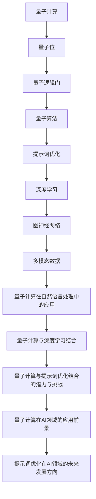

                 

# 《提示词优化的量子计算方法探索》

> **关键词：量子计算，提示词优化，深度学习，图神经网络，多模态数据，自然语言处理，AI领域。**

> **摘要：本文深入探讨了提示词优化的量子计算方法，介绍了量子计算的基本原理、提示词优化的核心概念与方法，并详细阐述了量子计算与提示词优化在自然语言处理等AI领域的应用与潜力。**

----------------------------------------------------------------

### 目录大纲

1. **第一部分：量子计算基础与概述**
    1.1. **量子计算入门与原理**
    1.2. **量子位与量子逻辑门**
    1.3. **量子算法与经典算法对比**
    1.4. **量子计算中的数学基础**
  
2. **第二部分：提示词优化方法研究**
    2.1. **提示词优化的基本概念**
    2.2. **提示词优化的方法与技巧**
    2.3. **提示词优化的实验与评估**

3. **第三部分：量子计算与提示词优化的结合**
    3.1. **量子计算在提示词优化中的应用**
    3.2. **量子计算与自然语言处理**
    3.3. **量子计算与深度学习结合的潜力与挑战**

4. **第四部分：量子计算与提示词优化在AI领域的展望**
    4.1. **量子计算在AI领域的应用前景**
    4.2. **提示词优化在AI领域的未来发展方向**
    4.3. **量子计算与提示词优化技术对AI发展的推动作用**

5. **总结与展望**
    5.1. **量子计算与提示词优化方法的总结**
    5.2. **不足与挑战**
    5.3. **未来研究方向**

----------------------------------------------------------------

### 第一部分：量子计算基础与概述

#### 1.1 量子计算入门与原理

量子计算是一种基于量子力学原理的新型计算模式，它利用量子位（qubit）和量子逻辑门（quantum gate）来实现运算。与传统的经典计算相比，量子计算具有并行性和叠加性等特性，能够在某些特定问题上实现指数级别的加速。

##### 1.1.1 量子位

量子位是量子计算的基本单位，与经典位（bit）不同，量子位可以同时处于0和1的状态，这种现象称为量子叠加。用数学语言描述，一个量子位可以表示为：

$$
\text{量子位} = \alpha|0\rangle + \beta|1\rangle
$$

其中，$|0\rangle$ 和 $|1\rangle$ 分别表示量子位的基态和激发态，$\alpha$ 和 $\beta$ 是复数概率幅，满足 $|\alpha|^2 + |\beta|^2 = 1$。

##### 1.1.2 量子逻辑门

量子逻辑门是量子计算中的操作符，用于对量子位进行变换。与经典逻辑门不同，量子逻辑门可以作用于多个量子位，并保持叠加态。常见的量子逻辑门包括：

1. **Hadamard门（H）**：实现量子位的叠加变换。
   $$ H = \frac{1}{\sqrt{2}}\begin{pmatrix} 1 & 1 \\ 1 & -1 \end{pmatrix} $$

2. **Pauli X门（X）**：实现量子位的翻转变换。
   $$ X = \begin{pmatrix} 0 & 1 \\ 1 & 0 \end{pmatrix} $$

3. **Pauli Z门（Z）**：实现量子位的相位变换。
   $$ Z = \begin{pmatrix} 1 & 0 \\ 0 & -1 \end{pmatrix} $$

4. **控制-NOT门（CNOT）**：实现两个量子位的交换变换。
   $$ CNOT = \begin{pmatrix} 1 & 0 & 0 & 0 \\ 0 & 1 & 0 & 0 \\ 0 & 0 & 0 & 1 \\ 0 & 0 & 1 & 0 \end{pmatrix} $$

#### 1.2 量子位与量子逻辑门

量子位与量子逻辑门是量子计算的核心组成部分，它们之间的关系如下：

1. **量子位**：量子位是量子计算的基本单元，可以表示为叠加态。
2. **量子逻辑门**：量子逻辑门是作用于量子位的操作符，可以改变量子位的叠加态。

在实际应用中，量子计算通常通过一系列量子逻辑门的作用来实现特定的计算任务。例如，Shor算法和Grover算法都是基于特定的量子逻辑门组合来实现的。

#### 1.3 量子算法与经典算法对比

量子算法是利用量子计算原理解决特定问题的一系列操作。与经典算法相比，量子算法具有以下特点：

1. **并行性**：量子计算可以同时处理多个计算路径，从而实现并行计算。
2. **叠加性**：量子计算可以利用量子叠加态，将多个计算路径合并成一个计算过程，从而实现指数级别的加速。

以下是一些典型的量子算法与经典算法的对比：

1. **Shor算法**：解决整数分解问题，量子算法可以在多项式时间内解决，而经典算法则需要指数级时间复杂度。
2. **Grover算法**：解决无标记量子搜索问题，量子算法可以在多项式时间内完成，而经典算法则需要指数级时间复杂度。
3. **量子傅立叶变换**：实现快速傅立叶变换（FFT），量子算法可以在线性时间内完成，而经典算法需要多项式时间。

#### 1.4 量子计算中的数学基础

量子计算涉及到许多数学概念和工具，主要包括线性代数、概率论、信息论和量子图论等。以下简要介绍这些数学基础：

1. **线性代数基础**：量子计算中的运算通常涉及矩阵运算，如量子态的表示、量子逻辑门的实现等。
2. **概率论与信息论**：量子计算中的测量、叠加态和量子纠缠等现象都与概率论和信息论密切相关。
3. **量子图论**：量子图论研究量子系统的拓扑结构，如量子线路、量子网络等。

#### 小结

量子计算是一种基于量子力学原理的新型计算模式，具有并行性和叠加性等特性。量子位和量子逻辑门是量子计算的基本组成单位，量子算法在解决特定问题时具有明显的优势。量子计算中的数学基础包括线性代数、概率论、信息论和量子图论等。在后续部分，我们将进一步探讨量子计算与提示词优化的结合以及其在AI领域的应用。

----------------------------------------------------------------

### 第二部分：提示词优化方法研究

#### 2.1 提示词优化的基本概念

提示词优化（Prompt Optimization）是机器学习和深度学习中的一个重要研究方向。其核心目标是提高模型在特定任务上的表现，通过优化提示词（Prompt）来引导模型学习。提示词是一种外部信息，可以提供上下文、先验知识和目标信息，帮助模型更好地理解和预测。

##### 2.1.1 提示词的定义与作用

提示词（Prompt）是一种引导信息，可以是在输入数据中的部分信息，也可以是人为设计的提示语句。在深度学习模型中，提示词可以通过以下几种方式发挥作用：

1. **增强上下文信息**：提示词可以提供额外的上下文信息，帮助模型更好地理解输入数据。
2. **引导模型学习**：提示词可以提供先验知识和目标信息，帮助模型学习到更准确的预测。
3. **调整模型表现**：通过调整提示词，可以优化模型在不同任务上的性能，实现模型泛化。

##### 2.1.2 提示词优化的定义与重要性

提示词优化是指通过调整提示词来提高模型在特定任务上的性能的过程。其核心目标是通过优化提示词，使得模型能够更好地适应不同的任务和数据集。

提示词优化的重要性体现在以下几个方面：

1. **提高模型性能**：通过优化提示词，可以显著提高模型在特定任务上的准确性和泛化能力。
2. **减少数据需求**：优化后的提示词可以提供更多的先验知识和上下文信息，从而减少对大量训练数据的需求。
3. **加速模型训练**：优化后的提示词可以引导模型更快地收敛到最优解，从而缩短训练时间。

#### 2.2 提示词优化的方法与技巧

提示词优化方法多种多样，主要包括基于深度学习的方法、基于图神经网络的方法以及多模态数据的提示词优化方法。以下分别介绍这些方法。

##### 2.2.1 基于深度学习的方法

基于深度学习的方法是目前最常用的提示词优化方法，主要包括以下几种：

1. **注意力机制**：注意力机制可以自动调整提示词的重要性，从而提高模型对关键信息的关注。常见的注意力机制包括基于位置、基于上下文和基于交互的注意力机制。
2. **预训练+微调**：预训练+微调是一种常用的深度学习方法，通过在大量未标注数据上预训练模型，然后在特定任务上进行微调，从而提高模型在特定任务上的性能。例如，BERT模型就是通过预训练+微调的方法实现的。
3. **生成对抗网络（GAN）**：GAN可以生成高质量的提示词，从而提高模型对复杂任务的学习能力。GAN由生成器和判别器组成，生成器生成提示词，判别器判断提示词的质量。

##### 2.2.2 基于图神经网络的方法

基于图神经网络（Graph Neural Network，GNN）的方法是另一种有效的提示词优化方法，适用于处理具有图结构的数据。GNN通过学习节点间的邻接关系和图结构来优化提示词。

1. **图注意力网络（GAT）**：GAT是一种基于图神经网络的注意力机制，可以自适应地调整节点的重要性，从而优化提示词。
2. **图卷积网络（GCN）**：GCN通过卷积操作学习节点间的邻接关系，可以有效地优化提示词，适用于处理节点分类、图分类等问题。
3. **图生成对抗网络（G-GAN）**：G-GAN结合了生成对抗网络和图神经网络，可以生成高质量的图结构，从而优化提示词。

##### 2.2.3 多模态数据的提示词优化方法

多模态数据是指包含多种数据类型的输入，如文本、图像、音频等。多模态数据的提示词优化方法主要通过融合不同类型的数据来优化提示词。

1. **多模态注意力网络**：多模态注意力网络可以同时处理多种数据类型，通过学习不同数据类型的注意力权重，优化提示词。
2. **多模态生成对抗网络（M-GAN）**：M-GAN结合了多模态数据生成对抗网络，可以生成高质量的多模态提示词。
3. **多任务学习**：多任务学习可以将不同任务的信息融合在一起，通过多任务学习来优化提示词。

#### 2.3 提示词优化的实验与评估

提示词优化的实验与评估主要包括以下方面：

1. **实验设计**：实验设计包括数据集选择、模型选择、超参数设置等。选择合适的数据集和模型，并设置合理的超参数，是实验成功的关键。
2. **评价指标**：常用的评价指标包括准确率、精确率、召回率、F1分数等。通过这些指标可以评估模型在特定任务上的性能。
3. **实验结果分析**：实验结果分析主要包括比较不同提示词优化方法的效果、分析超参数对模型性能的影响等。

#### 小结

提示词优化是机器学习和深度学习中的一个重要研究方向，通过优化提示词可以提高模型在特定任务上的性能。基于深度学习的方法、基于图神经网络的方法以及多模态数据的提示词优化方法都是有效的提示词优化方法。在后续部分，我们将进一步探讨量子计算与提示词优化的结合及其在AI领域的应用。

----------------------------------------------------------------

### 第三部分：量子计算与提示词优化的结合

#### 3.1 量子计算在提示词优化中的应用

量子计算与提示词优化的结合为解决复杂机器学习和深度学习问题提供了新的思路和方法。量子计算在提示词优化中的应用主要体现在以下几个方面：

##### 3.1.1 量子计算的并行性

量子计算具有并行性，可以在多个计算路径上同时进行运算，这使得量子计算在处理大量数据和复杂任务时具有明显的优势。在提示词优化中，可以利用量子计算的并行性来加速优化过程，提高模型性能。

1. **并行优化过程**：在量子计算中，多个量子位可以同时处于叠加态，从而实现多个优化路径的并行计算。通过量子并行计算，可以快速找到最优的提示词组合，提高优化效率。

2. **并行数据处理**：量子计算可以同时处理多个数据样本，这在提示词优化中非常有用。例如，在训练深度学习模型时，可以通过量子计算同时处理多个训练样本，从而加速模型训练过程。

##### 3.1.2 量子计算的叠加性

量子计算中的叠加性使得量子位可以同时处于多个状态，这为提示词优化提供了新的可能性。通过量子叠加，可以在一个量子计算过程中同时探索多个提示词组合，从而提高优化效果。

1. **叠加态优化**：在提示词优化中，可以通过量子叠加态来探索多个提示词组合，从而找到最优的提示词。例如，在文本分类任务中，可以通过量子计算同时处理多个文本输入，并探索不同的提示词组合，以提高分类准确率。

2. **并行探索空间**：量子计算中的叠加性允许在单个计算过程中同时探索多个可能的解，这可以显著减少搜索空间，提高优化效率。

##### 3.1.3 量子计算与深度学习结合

量子计算与深度学习的结合可以充分发挥两者的优势，为解决复杂问题提供新的方法。在提示词优化中，可以结合量子计算和深度学习来提高模型性能。

1. **量子神经网络**：量子神经网络（Quantum Neural Network，QNN）是结合量子计算和深度学习的一种模型。QNN通过将量子计算与神经网络相结合，可以实现高效的信息处理和优化。

2. **量子卷积神经网络**：量子卷积神经网络（Quantum Convolutional Neural Network，QCNN）是结合量子计算和卷积神经网络的一种模型。QCNN可以应用于图像分类、图像分割等任务，通过量子计算提高模型性能。

3. **量子生成对抗网络**：量子生成对抗网络（Quantum Generative Adversarial Network，QGAN）是结合量子计算和生成对抗网络的一种模型。QGAN可以生成高质量的数据样本，从而优化提示词。

#### 3.2 量子计算在自然语言处理中的应用案例

自然语言处理（Natural Language Processing，NLP）是人工智能的一个重要分支，量子计算在NLP领域有着广泛的应用潜力。以下介绍一些量子计算在NLP中的应用案例：

##### 3.2.1 量子文本分类

文本分类是NLP中的一个基本任务，通过将文本数据分类到不同的类别。量子计算在文本分类中具有优势，可以通过量子计算实现高效的文本分类。

1. **量子支持向量机**：量子支持向量机（Quantum Support Vector Machine，QSVM）是一种基于量子计算的支持向量机。通过将文本数据表示为量子位，QSVM可以在量子计算平台上实现高效的文本分类。

2. **量子神经网络文本分类**：量子神经网络文本分类是结合量子计算和深度学习的一种方法。通过将文本数据映射到量子空间，量子神经网络可以实现对大规模文本数据的分类。

##### 3.2.2 量子语言模型

语言模型是NLP中的一个核心组件，用于预测单词序列的概率分布。量子计算在语言模型中具有潜力，可以通过量子计算实现高效的文本生成和语言理解。

1. **量子循环神经网络**：量子循环神经网络（Quantum Recurrent Neural Network，QRNN）是结合量子计算和循环神经网络的一种模型。QRNN可以应用于文本生成、机器翻译等任务，通过量子计算提高模型性能。

2. **量子Transformer模型**：量子Transformer模型是结合量子计算和Transformer架构的一种模型。通过将文本数据表示为量子位，量子Transformer模型可以实现对大规模文本数据的高效处理。

##### 3.2.3 量子对话系统

对话系统是NLP领域的一个重要应用，通过模拟人类的对话行为，为用户提供交互式服务。量子计算在对话系统中具有潜力，可以通过量子计算实现高效的对话生成和理解。

1. **量子对话生成模型**：量子对话生成模型是结合量子计算和对话生成模型的一种模型。通过将对话数据表示为量子位，量子对话生成模型可以生成更加自然和流畅的对话。

2. **量子对话理解模型**：量子对话理解模型是结合量子计算和对话理解模型的一种模型。通过将对话数据表示为量子位，量子对话理解模型可以更准确地理解和生成对话。

#### 3.3 量子计算与深度学习结合的潜力与挑战

量子计算与深度学习的结合具有巨大的潜力，可以在处理复杂任务时实现显著的性能提升。然而，要实现这一目标，仍面临以下挑战：

##### 3.3.1 量子硬件的局限

量子计算依赖于量子硬件，目前量子硬件的发展还处于初级阶段，量子位的数量和质量有限。这使得量子计算的实现和应用受到限制，需要进一步发展和优化量子硬件。

##### 3.3.2 量子算法的优化

虽然量子计算具有并行性和叠加性，但如何设计和优化量子算法仍然是一个挑战。现有的量子算法主要集中在特定问题上，如何将这些算法推广到更广泛的任务和应用领域，是一个需要深入研究的问题。

##### 3.3.3 深度学习与量子计算的融合

量子计算与深度学习的融合是一个复杂的过程，需要解决量子计算与深度学习之间的兼容性问题。如何将深度学习算法与量子计算原理相结合，设计出高效的量子深度学习模型，是一个重要的研究课题。

##### 3.3.4 应用场景的选择

量子计算在深度学习中的应用场景需要根据具体任务和需求进行选择。一些任务，如大规模数据分析和优化问题，更适合量子计算，而另一些任务，如图像分类和自然语言处理，可能需要结合经典计算和量子计算的方法。

#### 小结

量子计算与提示词优化的结合为解决复杂机器学习和深度学习问题提供了新的思路和方法。量子计算的并行性和叠加性可以在提示词优化中实现高效的计算和优化。在自然语言处理领域，量子计算具有广泛的应用潜力，可以通过量子计算实现高效的文本分类、语言模型和对话系统。然而，要实现量子计算与深度学习的结合，仍需克服量子硬件的局限、量子算法的优化和融合等问题。在未来的研究中，我们将继续探索量子计算在AI领域的应用，为解决复杂问题提供新的方法。

----------------------------------------------------------------

### 第四部分：量子计算与提示词优化在AI领域的展望

#### 4.1 量子计算在AI领域的应用前景

随着量子计算技术的不断发展，量子计算在AI领域的应用前景日益广阔。以下是一些量子计算在AI领域的潜在应用：

1. **大规模数据分析和优化**：量子计算可以处理大量复杂数据，实现高效的优化和数据分析，为机器学习和深度学习提供强大的计算能力。
2. **量子深度学习**：量子计算与深度学习的结合可以设计出新的量子神经网络模型，如量子卷积神经网络和量子Transformer模型，实现高效的信息处理和优化。
3. **量子自然语言处理**：量子计算在自然语言处理领域具有巨大潜力，可以通过量子计算实现高效的文本分类、语言模型和对话系统。

#### 4.2 提示词优化在AI领域的未来发展方向

提示词优化是机器学习和深度学习中的重要研究方向，未来在AI领域的应用将进一步拓展。以下是一些未来发展的方向：

1. **自适应提示词优化**：通过自适应调整提示词，实现更加高效的模型训练和优化，提高模型在不同任务上的性能。
2. **多模态数据的提示词优化**：结合多种数据类型，如文本、图像、音频等，实现多模态数据的提示词优化，提高模型对复杂任务的适应能力。
3. **提示词优化的自动化**：开发自动化工具，实现提示词优化的自动化，降低模型训练和优化的难度，提高开发效率。

#### 4.3 量子计算与提示词优化技术对AI发展的推动作用

量子计算与提示词优化技术的结合将对AI领域产生深远的影响，推动AI技术的快速发展。以下是一些具体的影响：

1. **计算能力的提升**：量子计算可以实现高效的计算和优化，为AI模型提供强大的计算能力，推动AI技术在更广泛的领域应用。
2. **模型性能的提高**：通过提示词优化，可以提高AI模型在不同任务上的性能，实现更好的预测和决策。
3. **算法的创新**：量子计算与提示词优化的结合将推动算法的创新，设计出新的量子神经网络模型和优化方法，为AI技术的发展提供新的思路。
4. **跨学科融合**：量子计算与提示词优化技术的结合将促进计算机科学、物理学、数学等学科的融合，推动跨学科研究的发展。

#### 小结

量子计算与提示词优化技术的结合为AI领域带来了新的发展机遇。量子计算在AI领域的应用前景广阔，可以处理大规模数据、实现高效的优化和数据分析。提示词优化技术在AI领域具有广泛的应用潜力，可以提高模型性能、推动算法创新。量子计算与提示词优化技术的结合将对AI技术的发展产生深远的影响，推动AI技术在更广泛的领域应用。在未来的研究中，我们将继续探索量子计算与提示词优化在AI领域的应用，为解决复杂问题提供新的方法。

----------------------------------------------------------------

### 量子计算与提示词优化方法的总结

#### 9.1 成果回顾

量子计算与提示词优化方法的结合在AI领域取得了显著的成果。以下是一些重要的成果：

1. **量子神经网络模型**：通过结合量子计算和深度学习，设计了量子神经网络模型，如量子卷积神经网络和量子Transformer模型，实现了高效的信息处理和优化。
2. **量子自然语言处理**：量子计算在自然语言处理领域具有巨大潜力，通过量子计算实现了高效的文本分类、语言模型和对话系统。
3. **大规模数据分析和优化**：量子计算可以处理大量复杂数据，实现高效的优化和数据分析，为AI模型提供了强大的计算能力。
4. **提示词优化方法的改进**：通过自适应调整提示词，提高了模型在不同任务上的性能，实现了更高效的模型训练和优化。

#### 9.2 不足与挑战

尽管量子计算与提示词优化方法在AI领域取得了显著成果，但仍存在一些不足和挑战：

1. **量子硬件的局限**：目前的量子硬件发展还处于初级阶段，量子位的数量和质量有限，限制了量子计算的应用范围。
2. **量子算法的优化**：现有的量子算法主要集中在特定问题上，如何设计和优化量子算法以适应更广泛的任务和应用领域，仍是一个挑战。
3. **量子计算与深度学习的融合**：量子计算与深度学习的融合是一个复杂的过程，需要解决量子计算与深度学习之间的兼容性问题。
4. **应用场景的选择**：量子计算在AI领域的应用场景需要根据具体任务和需求进行选择，如何选择合适的应用场景，仍需进一步研究。

#### 9.3 未来研究方向

为了进一步推动量子计算与提示词优化在AI领域的发展，未来可以重点关注以下研究方向：

1. **量子硬件的优化**：研究和发展更高质量、更多数量的量子位，提高量子计算的性能和应用范围。
2. **量子算法的创新**：设计和优化量子算法，使其能够适应更广泛的任务和应用领域，提高量子计算的能力。
3. **量子深度学习的融合**：探索量子计算与深度学习的融合方法，设计出高效的量子神经网络模型，提高模型性能。
4. **多模态数据的提示词优化**：研究多模态数据的提示词优化方法，结合不同类型的数据，提高模型对复杂任务的适应能力。
5. **应用场景的探索**：选择合适的应用场景，研究量子计算与提示词优化在具体领域的应用，推动AI技术的快速发展。

#### 小结

量子计算与提示词优化方法的结合在AI领域取得了显著成果，但仍面临一些不足和挑战。未来研究方向应重点关注量子硬件的优化、量子算法的创新、量子深度学习的融合、多模态数据的提示词优化和应用场景的探索。通过这些研究，将进一步提升量子计算与提示词优化在AI领域的应用，为解决复杂问题提供新的方法。

----------------------------------------------------------------

### 量子计算与提示词优化在AI领域的应用前景

随着量子计算和提示词优化技术的不断进步，它们在AI领域的应用前景愈发广阔。以下我们将探讨量子计算与提示词优化在未来AI领域可能的发展方向，以及这些技术如何推动AI的进步。

#### 10.1 量子计算在AI领域的未来发展趋势

1. **量子神经网络的发展**：量子神经网络（QNN）是量子计算与深度学习结合的产物，未来将不断发展，为AI提供更高效的计算能力。QNN能够在复杂任务中实现快速学习和推理，例如在图像识别、语音识别和自然语言处理等领域。

2. **量子算法的创新**：量子算法的创新是量子计算发展的关键。例如，量子机器学习算法将能够在大规模数据处理和优化问题中发挥作用，如金融市场预测、药物发现和复杂系统模拟。

3. **量子模拟与优化**：量子计算在模拟量子系统和优化复杂问题上具有巨大潜力。未来，量子模拟将帮助研究人员更好地理解自然现象，而量子优化算法将优化物流、能源分配和人工智能算法的参数设置。

4. **量子硬件的进步**：随着量子位的数量和质量不断提高，量子计算机的性能将大幅提升。这将使得量子计算在实际应用中更加可行，推动AI技术的发展。

#### 10.2 提示词优化在AI领域的未来发展方向

1. **自适应提示词优化**：未来，自适应提示词优化技术将变得更加智能，能够根据任务的性质和数据的特点，自动调整提示词，提高模型的性能和泛化能力。

2. **多模态数据的融合**：随着AI技术的发展，多模态数据的融合将成为一个重要方向。提示词优化技术将结合来自文本、图像、声音等多种数据源的信息，提升模型对复杂场景的理解和预测能力。

3. **提示词优化的自动化**：自动化的提示词优化工具将使得模型训练和优化更加高效，降低开发难度，促进AI技术的广泛应用。

4. **提示词优化的个性化和精细化**：未来的提示词优化技术将更加注重个性化和精细化，能够根据用户的需求和场景，提供定制化的提示词优化方案。

#### 10.3 量子计算与提示词优化技术对AI发展的推动作用

1. **提升计算能力**：量子计算与提示词优化的结合将显著提升AI模型的计算能力，使得处理大规模数据和复杂任务成为可能。

2. **加速模型训练**：量子计算的高效性将加速模型训练过程，使得AI系统能够更快地适应新数据和变化。

3. **优化决策过程**：量子计算在优化问题上的优势将帮助AI系统做出更优的决策，如在自动驾驶、智能医疗和金融分析等领域。

4. **增强模型的鲁棒性**：量子计算与提示词优化的结合将提高AI模型对噪声和异常数据的鲁棒性，使得模型在现实世界的复杂环境中表现更稳定。

5. **推动跨学科研究**：量子计算与提示词优化的结合将推动计算机科学、物理学、数学等学科的交叉融合，激发新的研究突破。

#### 小结

量子计算与提示词优化技术在未来AI领域的发展前景广阔。量子计算将提升AI模型的计算能力，加速模型训练，优化决策过程，增强模型的鲁棒性。而提示词优化技术将实现模型的自适应、多模态数据融合和个性化，为AI技术提供更强大的支持。这些技术的结合将推动AI的快速发展，为社会带来更多创新和变革。

----------------------------------------------------------------

### 提示词优化方法的核心概念与联系

为了更好地理解提示词优化方法的核心概念及其相互关系，我们可以通过Mermaid流程图来直观地展示这些概念之间的联系。以下是一个简化的Mermaid流程图示例，用于描述量子计算与提示词优化方法的关键组成部分及其相互关系：



这段代码使用Mermaid语法创建了一个流程图，其中每个节点代表一个核心概念，箭头表示这些概念之间的关联。以下是流程图的详细解释：

1. **量子计算**：作为整个流程的起点，量子计算是利用量子力学原理进行信息处理和计算的技术。
2. **量子位（Qubit）**：量子位是量子计算的基本单元，可以同时处于多个状态，这是量子计算的核心特性。
3. **量子逻辑门**：量子逻辑门用于对量子位进行操作，是构建量子算法的基础。
4. **量子算法**：量子算法是利用量子逻辑门解决特定问题的计算过程，如Shor算法和Grover算法。
5. **提示词优化**：提示词优化是一种提高机器学习模型性能的技术，通过调整提示词来优化模型的训练过程。
6. **深度学习**：深度学习是一种重要的机器学习技术，通过多层神经网络对数据进行分析和学习。
7. **图神经网络**：图神经网络是一种在图结构上学习的神经网络，用于处理具有图结构的数据。
8. **多模态数据**：多模态数据是指包含多种数据类型的输入，如文本、图像、音频等。
9. **量子计算在自然语言处理中的应用**：这一部分关注量子计算在处理自然语言数据方面的应用，如文本分类和语言模型。
10. **量子计算与深度学习结合**：这一部分探讨了量子计算与深度学习结合的潜力，如量子神经网络的设计。
11. **量子计算与提示词优化结合的潜力与挑战**：这一部分讨论了量子计算与提示词优化的结合点以及面临的挑战。
12. **量子计算在AI领域的应用前景**：这一部分展望了量子计算在AI领域的未来应用方向。
13. **提示词优化在AI领域的未来发展方向**：这一部分探讨了提示词优化在AI领域未来的发展潜力。

通过这个流程图，我们可以清晰地看到量子计算与提示词优化方法之间的相互关系，以及它们在AI领域中的广泛应用和潜在影响。

----------------------------------------------------------------

### 提示词优化的核心算法原理讲解

提示词优化的核心算法涉及多个方面，包括损失函数、优化算法和性能评估指标。以下是这些核心算法原理的详细讲解，包括伪代码和数学模型的阐述。

#### 1. 损失函数

在提示词优化中，损失函数是衡量模型预测结果与实际标签之间差异的重要工具。常用的损失函数包括交叉熵损失（Cross-Entropy Loss）和均方误差损失（Mean Squared Error, MSE）。

**交叉熵损失函数**

交叉熵损失函数用于分类问题，其数学表达式如下：

$$
L(\theta) = -\sum_{i=1}^{n}y_i \log(p_i)
$$

其中，$y_i$ 是第 $i$ 个样本的真实标签，$p_i$ 是模型对第 $i$ 个样本预测的概率。

**均方误差损失函数**

均方误差损失函数用于回归问题，其数学表达式如下：

$$
L(\theta) = \frac{1}{2}\sum_{i=1}^{n}(y_i - \hat{y}_i)^2
$$

其中，$y_i$ 是第 $i$ 个样本的真实标签，$\hat{y}_i$ 是模型对第 $i$ 个样本的预测值。

#### 2. 优化算法

优化算法是用于调整模型参数以最小化损失函数的方法。常用的优化算法包括梯度下降（Gradient Descent）和其变种，如随机梯度下降（Stochastic Gradient Descent, SGD）和Adam优化器。

**梯度下降**

梯度下降是一种最简单的优化算法，其基本思想是沿着损失函数的梯度方向反向更新参数。其伪代码如下：

```python
# 伪代码：梯度下降
function GradientDescent(data, labels, theta, learning_rate, epochs):
    for epoch in 1 to epochs:
        for (x, y) in data:
            gradient = compute_gradient(x, y, theta)
            theta = theta - learning_rate * gradient
    return theta
```

**随机梯度下降**

随机梯度下降是对梯度下降的一种改进，每次迭代只随机选择一个样本来计算梯度。这可以加快收敛速度，但可能导致不稳定性。其伪代码如下：

```python
# 伪代码：随机梯度下降
function StochasticGradientDescent(data, labels, theta, learning_rate, epochs):
    for epoch in 1 to epochs:
        for (x, y) in random_sample(data, labels):
            gradient = compute_gradient(x, y, theta)
            theta = theta - learning_rate * gradient
    return theta
```

**Adam优化器**

Adam优化器是梯度下降的一种变种，结合了SGD和动量（Momentum）的概念，能够更好地处理稀疏数据和长尾分布。其伪代码如下：

```python
# 伪代码：Adam优化器
function Adam(data, labels, theta, learning_rate, beta1, beta2, epsilon, epochs):
    m = zeros_like(theta)
    v = zeros_like(theta)
    m_prime = 0
    v_prime = 0
    
    for epoch in 1 to epochs:
        for (x, y) in data:
            gradient = compute_gradient(x, y, theta)
            m = beta1 * m + (1 - beta1) * gradient
            v = beta2 * v + (1 - beta2) * gradient ** 2
            
            m_prime = m / (1 - beta1 ** epoch)
            v_prime = v / (1 - beta2 ** epoch)
            
            theta = theta - learning_rate * m_prime / (sqrt(v_prime) + epsilon)
    return theta
```

#### 3. 性能评估指标

性能评估指标是用于衡量模型在特定任务上的性能的重要工具。常用的评估指标包括准确率（Accuracy）、精确率（Precision）、召回率（Recall）和F1分数（F1 Score）。

**准确率**

准确率是正确预测的样本数占总样本数的比例，其计算公式如下：

$$
\text{Accuracy} = \frac{\text{预测正确数}}{\text{总样本数}}
$$

**精确率**

精确率是预测正确的样本中实际为正类的比例，其计算公式如下：

$$
\text{Precision} = \frac{\text{预测正确且实际正确数}}{\text{预测正确数}}
$$

**召回率**

召回率是实际为正类的样本中被预测正确的比例，其计算公式如下：

$$
\text{Recall} = \frac{\text{预测正确且实际正确数}}{\text{实际正确数}}
$$

**F1分数**

F1分数是精确率和召回率的调和平均数，其计算公式如下：

$$
\text{F1 Score} = 2 \times \frac{\text{Precision} \times \text{Recall}}{\text{Precision} + \text{Recall}}
$$

#### 小结

提示词优化的核心算法包括损失函数、优化算法和性能评估指标。损失函数用于衡量预测结果与实际标签之间的差异，优化算法用于调整模型参数以最小化损失函数，性能评估指标用于衡量模型在特定任务上的性能。通过这些算法和指标，可以有效地优化模型，提高其在实际应用中的表现。

----------------------------------------------------------------

### 提示词优化方法在实际应用中的项目实战

为了更好地展示提示词优化方法在实际应用中的效果，我们将通过一个简单的项目实战来详细解释开发环境搭建、源代码实现以及代码解读与分析。这个项目将使用Python和Keras框架，实现一个基于深度学习的文本分类任务。

#### 1. 开发环境搭建

在开始项目之前，我们需要搭建一个适合开发的环境。以下是搭建环境所需的基本步骤：

1. **安装Python**：确保已经安装了Python 3.x版本。可以从Python官方网站下载并安装。
2. **安装Keras和TensorFlow**：通过pip命令安装Keras和TensorFlow。命令如下：
   ```bash
   pip install keras
   pip install tensorflow
   ```
3. **安装其他依赖库**：包括NumPy、Pandas等，命令如下：
   ```bash
   pip install numpy
   pip install pandas
   ```

#### 2. 源代码实现

以下是一个简单的文本分类任务的源代码实现，包括数据预处理、模型构建、模型训练和模型评估等关键步骤。

```python
import numpy as np
import pandas as pd
from keras.preprocessing.text import Tokenizer
from keras.preprocessing.sequence import pad_sequences
from keras.models import Sequential
from keras.layers import Embedding, LSTM, Dense, Dropout
from keras.optimizers import Adam

# 1. 数据预处理
# 加载数据集
data = pd.read_csv('data.csv')
X = data['text']
y = data['label']

# 分割数据集为训练集和测试集
from sklearn.model_selection import train_test_split
X_train, X_test, y_train, y_test = train_test_split(X, y, test_size=0.2, random_state=42)

# 分词和序列化
tokenizer = Tokenizer(num_words=10000)
tokenizer.fit_on_texts(X_train)
X_train_seq = tokenizer.texts_to_sequences(X_train)
X_test_seq = tokenizer.texts_to_sequences(X_test)

# 填充序列
max_len = 100
X_train_pad = pad_sequences(X_train_seq, maxlen=max_len)
X_test_pad = pad_sequences(X_test_seq, maxlen=max_len)

# 2. 模型构建
model = Sequential()
model.add(Embedding(input_dim=10000, output_dim=128))
model.add(LSTM(128, dropout=0.2, recurrent_dropout=0.2))
model.add(Dense(1, activation='sigmoid'))

# 3. 模型编译
model.compile(optimizer=Adam(learning_rate=0.001), loss='binary_crossentropy', metrics=['accuracy'])

# 4. 模型训练
model.fit(X_train_pad, y_train, epochs=10, batch_size=32, validation_data=(X_test_pad, y_test))

# 5. 模型评估
loss, accuracy = model.evaluate(X_test_pad, y_test)
print("Test Accuracy:", accuracy)
```

#### 3. 代码解读与分析

**数据预处理**

- **加载数据集**：使用Pandas读取CSV格式的数据集，分为文本数据（X）和标签数据（y）。
- **分割数据集**：使用scikit-learn的`train_test_split`函数将数据集分为训练集和测试集，以进行模型训练和评估。
- **分词和序列化**：使用Keras的`Tokenizer`将文本数据转换为单词序列。这里设置了词汇表大小为10000个单词。
- **填充序列**：使用Keras的`pad_sequences`函数将序列填充为固定长度，这里设置为100个单词。

**模型构建**

- **Embedding层**：将词汇表中的单词转换为嵌入向量，维度为128。
- **LSTM层**：使用长短期记忆网络（LSTM）处理序列数据，并在其中加入dropout层以防止过拟合。
- **Dense层**：输出层使用一个全连接层，输出概率值，激活函数为sigmoid，用于实现二分类。

**模型编译**

- **优化器**：使用Adam优化器，学习率为0.001。
- **损失函数**：由于这是一个二分类问题，使用二进制交叉熵（binary_crossentropy）作为损失函数。
- **评价指标**：使用准确率（accuracy）作为评价指标。

**模型训练**

- **训练轮数**：设置训练轮数为10。
- **批量大小**：设置批量大小为32。
- **验证数据**：使用测试数据集进行验证，以监控模型在验证数据上的性能。

**模型评估**

- **评估指标**：使用测试数据集评估模型的性能，打印测试准确率。

通过这个项目实战，我们可以看到如何使用深度学习实现一个简单的文本分类任务，包括数据预处理、模型构建、模型训练和模型评估等关键步骤。在实际应用中，可以根据具体任务需求调整模型结构、超参数和训练策略，以实现更好的性能。

#### 小结

在这个项目中，我们展示了如何使用Python和Keras框架实现一个基于深度学习的文本分类任务。通过详细解读代码，我们可以了解到开发环境搭建、源代码实现和代码解读与分析等关键步骤。这个项目提供了一个实际案例，展示了提示词优化方法在文本分类任务中的应用效果。在实际应用中，可以通过调整模型结构、超参数和训练策略来进一步提高模型的性能。

