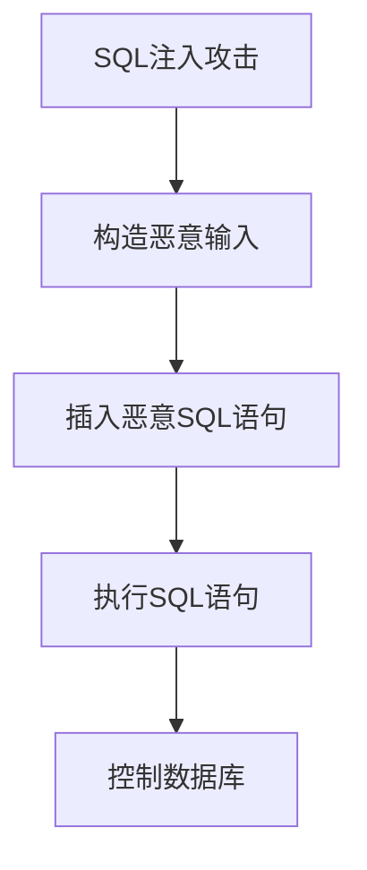
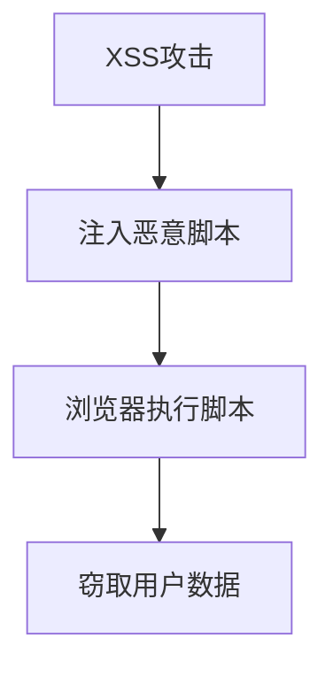
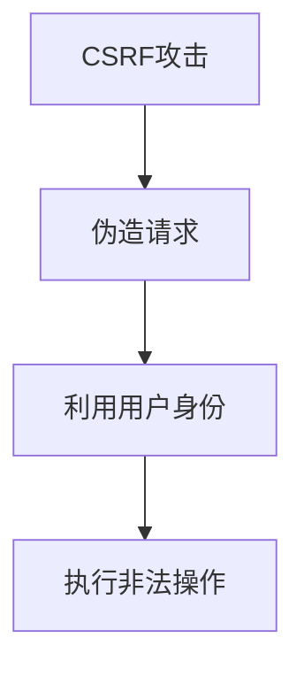

                 

### 《提示词安全：防御注入攻击的策略与实践》

提示词安全是网络安全领域中的一个关键主题，尤其在当今数字化时代，随着网络攻击手段的不断升级，确保数据的安全变得愈发重要。本文将深入探讨提示词安全的核心概念，重点分析防御注入攻击的策略与实践。

> **关键词：**
> - 提示词安全
> - 注入攻击
> - 防御策略
> - 实践案例
> - 安全工具

> **摘要：**
> 本文首先介绍提示词安全的基本概念和重要性，随后详细解析SQL注入、XSS和CSRF等常见的注入攻击类型。接着，我们将探讨一系列有效的防御策略，包括预编译语句、参数化查询、数据验证、HTML实体编码、Token验证和CORS策略等。通过实战案例分析，我们将展示这些策略的实际应用。最后，文章将介绍相关的安全工具和资源，以帮助读者深入理解和应对提示词安全挑战。

---

### 第一部分：基础概念与核心原理

#### 1.1 提示词安全概述

**1.1.1 提示词安全的定义**

提示词安全（Input Validation）是指对用户输入的数据进行验证，以确保数据的有效性和合法性。在网络安全领域，提示词安全至关重要，因为它可以防止恶意攻击者通过输入非法数据来破坏系统或窃取敏感信息。

**1.1.2 提示词安全的重要性**

随着互联网的普及和数据的广泛应用，数据泄露和网络攻击事件层出不穷。提示词安全可以有效地防止以下几种常见的攻击：

- **SQL注入**：攻击者通过构造恶意的输入，直接控制数据库的查询行为，可能导致数据泄露或数据篡改。
- **XSS攻击**：攻击者通过在目标网站上注入恶意脚本，从而盗取用户的敏感信息。
- **CSRF攻击**：攻击者通过伪造请求，利用用户的身份执行非法操作，如转账或修改个人信息。

**1.1.3 常见的提示词安全问题**

- **未验证的输入**：未对用户输入进行验证，导致攻击者可以注入恶意代码或数据。
- **过长的输入处理**：对长输入进行处理时，可能导致缓冲区溢出，从而被攻击者利用。
- **不安全的编码实践**：如HTML实体编码不当，可能导致XSS攻击。
- **配置错误**：如安全配置不当，可能导致攻击者利用未授权的访问途径。

#### 1.2 注入攻击的原理

**1.2.1 SQL注入攻击**

**1.2.1.1 SQL注入的原理**

SQL注入是一种通过在应用程序输入数据的地方插入恶意SQL语句，从而控制数据库的攻击方式。攻击者通过构造特定的输入，使得SQL语句的执行结果与预期不符，从而获取数据库的访问权限或敏感信息。

**1.2.1.2 SQL注入的防御策略**

- **使用预编译语句**：通过预处理SQL语句，将用户输入作为参数传递，从而防止SQL注入。
- **使用参数化查询**：将SQL语句中的变量部分与值部分分离，使用参数化查询来执行数据库查询。
- **使用数据验证**：对用户输入进行严格的验证，确保输入符合预期的数据格式。

**1.2.2 XSS攻击**

**1.2.2.1 XSS攻击的原理**

XSS（跨站脚本攻击）是一种通过在目标网站上注入恶意脚本，从而盗取用户数据的攻击方式。攻击者通过构造恶意的输入，使得脚本在用户的浏览器中执行，从而窃取用户的敏感信息。

**1.2.2.2 XSS攻击的防御策略**

- **HTML实体编码**：对用户输入进行编码，将特殊字符转换为HTML实体，从而防止XSS攻击。
- **输入验证**：对用户输入进行严格的验证，确保输入符合预期的数据格式。

**1.2.3 CSRF攻击**

**1.2.3.1 CSRF攻击的原理**

CSRF（跨站请求伪造）是一种通过伪造用户的请求，从而执行非法操作的攻击方式。攻击者通过构造特定的请求，利用用户的身份在目标网站上执行恶意操作。

**1.2.3.2 CSRF攻击的防御策略**

- **使用Token验证**：为每个请求生成唯一的Token，并在服务器端验证Token，从而防止CSRF攻击。
- **使用CORS策略**：配置CORS策略，允许或拒绝特定源访问跨域请求。

---

通过上述分析，我们可以看出提示词安全在防御注入攻击中的关键作用。在接下来的部分中，我们将详细介绍具体的防御策略和实践方法。

---

### 第二部分：防御策略与实践

防御注入攻击需要综合考虑多个方面，包括代码实现、配置策略和用户输入验证等。下面，我们将详细介绍几种常见的防御策略，并通过具体的案例来展示其实际应用。

#### 2.1 防御SQL注入攻击

**2.1.1 使用预编译语句**

**2.1.1.1 预编译语句的原理**

预编译语句（Prepared Statements）是一种通过预处理SQL语句，将用户输入作为参数传递给数据库的机制。在预编译过程中，SQL语句本身被编译并存储在数据库中，而用户输入则作为参数传递给数据库执行。这样可以防止SQL注入攻击，因为恶意输入无法影响预编译后的SQL语句。

**2.1.1.2 预编译语句的实现方法**

以下是一个使用预编译语句的伪代码示例：

```python
# 假设我们要查询用户名为'admin'的账户信息
user_input = "admin"
query = "SELECT * FROM users WHERE username = ?"

# 预编译SQL语句
preparedStatement = db.prepareStatement(query)

# 设置参数值
preparedStatement.setString(1, user_input)

# 执行预编译语句
result = preparedStatement.executeQuery()
```

**2.1.2 使用参数化查询**

**2.1.2.1 参数化查询的原理**

参数化查询（Parameterized Queries）与预编译语句类似，也是通过将SQL语句中的变量部分与值部分分离，从而防止SQL注入。不同的是，参数化查询是在执行SQL语句时进行参数绑定，而预编译语句是在预处理阶段进行参数绑定。

**2.1.2.2 参数化查询的实现方法**

以下是一个使用参数化查询的伪代码示例：

```python
# 假设我们要查询用户名为'admin'的账户信息
user_input = "admin"
query = "SELECT * FROM users WHERE username = ?"

# 创建SQL连接
connection = db.connect()

# 执行参数化查询
result = connection.execute(query, (user_input,))

# 关闭SQL连接
connection.close()
```

**2.1.3 使用数据验证**

**2.1.3.1 数据验证的原理**

数据验证（Data Validation）是指对用户输入进行验证，以确保输入符合预期的数据格式。通过数据验证，可以防止恶意输入，从而避免SQL注入攻击。

**2.1.3.2 数据验证的实现方法**

以下是一个使用数据验证的伪代码示例：

```python
# 假设我们要查询用户名为'admin'的账户信息
user_input = input("请输入用户名：")

# 验证用户名是否符合预期格式
if not re.match(r"^[a-zA-Z0-9]{5,20}$", user_input):
    print("用户名格式不正确")
    exit()

# 构造SQL查询语句
query = f"SELECT * FROM users WHERE username = '{user_input}'"

# 执行SQL查询
result = db.execute(query)
```

---

通过上述策略，我们可以有效地防御SQL注入攻击。在下一节中，我们将继续探讨防御XSS攻击和CSRF攻击的具体方法。

---

### 2.2 防御XSS攻击

XSS攻击是一种通过在目标网站上注入恶意脚本，从而盗取用户数据的攻击方式。防御XSS攻击需要从多个方面入手，包括HTML实体编码和输入验证等。以下我们将详细介绍这些策略。

**2.2.1 HTML实体编码**

**2.2.1.1 HTML实体编码的原理**

HTML实体编码（HTML Entity Encoding）是指将用户输入中的特殊字符转换为HTML实体，从而防止XSS攻击。通过HTML实体编码，恶意脚本中的特殊字符将被转换为相应的实体，从而无法在浏览器中执行。

**2.2.1.2 HTML实体编码的实现方法**

以下是一个使用HTML实体编码的伪代码示例：

```python
# 假设我们要渲染用户输入的内容
user_input = input("请输入内容：")

# 将特殊字符转换为HTML实体
encoded_input = html.escape(user_input)

# 渲染编码后的内容
print(encoded_input)
```

**2.2.2 输入验证**

**2.2.2.1 输入验证的原理**

输入验证（Input Validation）是指对用户输入进行验证，以确保输入符合预期的数据格式。通过输入验证，可以防止恶意输入，从而避免XSS攻击。

**2.2.2.2 输入验证的实现方法**

以下是一个使用输入验证的伪代码示例：

```python
# 假设我们要渲染用户输入的内容
user_input = input("请输入内容：")

# 验证内容是否符合预期格式
if not re.match(r"^[a-zA-Z0-9]+$", user_input):
    print("输入格式不正确")
    exit()

# 渲染有效的内容
print(user_input)
```

---

通过上述策略，我们可以有效地防御XSS攻击。在下一节中，我们将探讨防御CSRF攻击的方法。

---

### 2.3 防御CSRF攻击

CSRF攻击是一种通过伪造用户的请求，从而执行非法操作的攻击方式。防御CSRF攻击需要从多个方面入手，包括Token验证和CORS策略等。以下我们将详细介绍这些策略。

**2.3.1 使用Token验证**

**2.3.1.1 Token验证的原理**

Token验证（Token-based Validation）是指为每个请求生成唯一的Token，并在服务器端验证Token，从而防止CSRF攻击。通过Token验证，攻击者无法伪造合法的请求，因为它们无法获取到有效的Token。

**2.3.1.2 Token验证的实现方法**

以下是一个使用Token验证的伪代码示例：

```python
# 假设我们要处理用户登录请求
user_input = input("请输入用户名和密码：")

# 生成唯一的Token
token = generate_token()

# 将Token发送给用户
send_token_to_user(token)

# 用户提交请求时，包含Token
request = get_user_request()

# 验证Token的有效性
if validate_token(request.token, token):
    # 处理合法的请求
    process_request(request)
else:
    # 处理无效的请求
    deny_request(request)
```

**2.3.2 使用CORS策略**

**2.3.2.1 CORS策略的原理**

CORS（Cross-Origin Resource Sharing）策略是指通过配置CORS策略，允许或拒绝特定源访问跨域请求，从而防止CSRF攻击。通过CORS策略，可以限制未经授权的请求访问受保护的资源。

**2.3.2.2 CORS策略的实现方法**

以下是一个使用CORS策略的伪代码示例：

```python
# 假设我们要配置CORS策略
allowed_origins = ["https://example.com", "https://anotherexample.com"]

# 配置CORS策略
response.headers["Access-Control-Allow-Origin"] = allowed_origins

# 处理跨域请求
if request.origin in allowed_origins:
    # 允许跨域请求
    process_request(request)
else:
    # 拒绝跨域请求
    deny_request(request)
```

---

通过上述策略，我们可以有效地防御CSRF攻击。在下一节中，我们将通过实战案例展示这些防御策略的实际应用。

---

### 第三部分：实战案例分析

通过上述策略的介绍，我们了解了防御SQL注入、XSS和CSRF攻击的具体方法。在本节中，我们将通过几个具体的实战案例，展示这些策略的实际应用，并提供源代码实现和详细解释。

#### 3.1 实战案例1：防御SQL注入攻击

**3.1.1 案例背景**

假设我们有一个用户管理系统，其中包含用户注册和登录功能。用户注册时，我们需要对用户名和密码进行存储；用户登录时，我们需要验证用户名和密码的正确性。

**3.1.2 案例分析**

在这个案例中，我们需要防止SQL注入攻击，确保用户输入的安全。以下是我们的解决方案：

1. 使用预编译语句来处理数据库查询。
2. 对用户输入进行数据验证，确保输入符合预期格式。
3. 使用参数化查询来防止SQL注入。

**3.1.3 源代码实现**

以下是一个使用Python和SQLite实现的用户注册和登录示例：

```python
import sqlite3
import re

def register(username, password):
    # 数据验证
    if not re.match(r"^[a-zA-Z0-9]{5,20}$", username):
        return "用户名格式不正确"
    if not re.match(r"^[a-zA-Z0-9]{6,20}$", password):
        return "密码格式不正确"

    # 使用预编译语句
    connection = sqlite3.connect("users.db")
    cursor = connection.cursor()

    query = "INSERT INTO users (username, password) VALUES (?, ?)"
    cursor.execute(query, (username, password))

    connection.commit()
    connection.close()
    return "注册成功"

def login(username, password):
    # 使用预编译语句
    connection = sqlite3.connect("users.db")
    cursor = connection.cursor()

    query = "SELECT * FROM users WHERE username = ? AND password = ?"
    cursor.execute(query, (username, password))

    user = cursor.fetchone()
    if user:
        return "登录成功"
    else:
        return "用户名或密码错误"

# 测试代码
print(register("admin", "password123"))
print(login("admin", "password123"))
```

**3.1.4 源代码解读与分析**

在这个案例中，我们使用了预编译语句和参数化查询来防止SQL注入。通过数据验证，我们确保了用户输入的安全。以下是源代码的详细解读：

- `register` 函数负责处理用户注册。首先，我们使用正则表达式对用户名和密码进行验证。接着，我们使用预编译语句将用户名和密码插入到数据库中。
- `login` 函数负责处理用户登录。同样，我们使用预编译语句从数据库中查询用户名和密码，并验证其正确性。

通过这个案例，我们展示了如何有效地防御SQL注入攻击。

---

#### 3.2 实战案例2：防御XSS攻击

**3.2.1 案例背景**

假设我们有一个论坛系统，用户可以在论坛中发布帖子。在帖子发布功能中，我们需要渲染用户的输入内容，并将其显示在页面上。

**3.2.2 案例分析**

在这个案例中，我们需要防止XSS攻击，确保用户输入的安全。以下是我们的解决方案：

1. 使用HTML实体编码来防止恶意脚本执行。
2. 对用户输入进行数据验证，确保输入符合预期格式。

**3.2.3 源代码实现**

以下是一个使用Python和Flask实现的帖子发布示例：

```python
from flask import Flask, request, escape

app = Flask(__name__)

@app.route("/post", methods=["POST"])
def post():
    title = escape(request.form["title"])
    content = escape(request.form["content"])

    # 将用户输入编码为HTML实体
    encoded_title = html.escape(title)
    encoded_content = html.escape(content)

    # 存储帖子到数据库
    # ...

    # 渲染帖子
    return f"<h1>{encoded_title}</h1><p>{encoded_content}</p>"

if __name__ == "__main__":
    app.run()
```

**3.2.4 源代码解读与分析**

在这个案例中，我们使用了HTML实体编码来防止XSS攻击。以下是源代码的详细解读：

- `post` 函数负责处理帖子发布。首先，我们使用 `escape` 函数将用户输入编码为HTML实体。然后，我们将编码后的标题和内容存储到数据库中。最后，我们使用编码后的标题和内容来渲染帖子。

通过这个案例，我们展示了如何有效地防御XSS攻击。

---

#### 3.3 实战案例3：防御CSRF攻击

**3.3.1 案例背景**

假设我们有一个在线购物系统，用户可以添加商品到购物车并进行结算。在结算过程中，我们需要确保用户的操作是合法的，从而防止CSRF攻击。

**3.3.2 案例分析**

在这个案例中，我们需要防止CSRF攻击，确保用户的结算操作是安全的。以下是我们的解决方案：

1. 使用Token验证来确保每个请求都是合法的。
2. 使用CORS策略来限制跨域请求。

**3.3.3 源代码实现**

以下是一个使用Python和Flask实现的购物车结算示例：

```python
from flask import Flask, request, session
from itsdangerous import URLSafeTimedSerializer

app = Flask(__name__)
app.secret_key = "my_secret_key"

serializer = URLSafeTimedSerializer(app.secret_key)

@app.route("/add_to_cart", methods=["POST"])
def add_to_cart():
    # 生成唯一的Token
    token = serializer.dumps(request.form["id"])

    # 将Token存储在Session中
    session["cart_token"] = token

    # 添加商品到购物车
    # ...

    return "商品已添加到购物车"

@app.route("/checkout", methods=["POST"])
def checkout():
    # 从Session中获取Token
    token = session.get("cart_token")

    # 验证Token的有效性
    if token and serializer.verify(token, request.form["token"]):
        # 处理结算操作
        # ...
        return "结算成功"
    else:
        return "结算失败，请重新操作"

if __name__ == "__main__":
    app.run()
```

**3.3.4 源代码解读与分析**

在这个案例中，我们使用了Token验证和CORS策略来防止CSRF攻击。以下是源代码的详细解读：

- `add_to_cart` 函数负责将商品添加到购物车。首先，我们生成一个唯一的Token，并将其存储在Session中。然后，我们使用这个Token来标识购物车。
- `checkout` 函数负责处理结算操作。首先，我们从Session中获取Token，并验证其有效性。如果Token有效，我们处理结算操作，否则拒绝操作。

通过这个案例，我们展示了如何有效地防御CSRF攻击。

---

通过上述实战案例，我们可以看到如何在实际项目中应用防御注入攻击的策略。这些案例为我们提供了实用的参考，帮助我们更好地保护系统和数据的安全。

---

### 第四部分：安全工具与资源

在防御注入攻击的过程中，使用合适的工具和资源是非常重要的。以下我们将介绍一些常用的安全工具和资源，以帮助读者更好地理解和应对提示词安全挑战。

#### 4.1 安全工具介绍

**4.1.1 SQL注入检测工具**

以下是一些常用的SQL注入检测工具：

- **OWASP ZAP**：OWASP ZAP 是一款开源的漏洞检测工具，可以自动扫描Web应用中的SQL注入漏洞。
- **SQLmap**：SQLmap 是一款开源的SQL注入工具，用于检测和利用SQL注入漏洞。

**4.1.2 XSS检测工具**

以下是一些常用的XSS检测工具：

- **XSSer**：XSSer 是一款开源的XSS检测工具，可以自动扫描Web应用中的XSS漏洞。
- **Burp Suite**：Burp Suite 是一款专业的Web应用漏洞检测工具，包括XSS漏洞扫描功能。

**4.1.3 CSRF检测工具**

以下是一些常用的CSRF检测工具：

- **OWASP CSRFTester**：OWASP CSRFTester 是一款开源的CSRF漏洞检测工具。
- **CSRF-Defender**：CSRF-Defender 是一款用于防御CSRF攻击的Web应用防火墙。

#### 4.2 安全资源推荐

以下是一些推荐的安全资源和社区：

- **黑客帝国**：黑客帝国是一个专注于网络安全和黑客技术的社区，提供丰富的技术文章和资源。
- **FreeBuf**：FreeBuf 是一个知名的网络安全社区，涵盖各种安全领域的新闻、分析和工具。

此外，以下是一些安全工具和库：

- **Python安全库：PyCrypto**：PyCrypto 是一个用于加密和解密的Python库，适用于安全敏感的应用程序。
- **Java安全库：Bouncy Castle**：Bouncy Castle 是一个Java加密库，提供各种加密算法和工具。

最后，以下是一些安全标准和法规：

- **OWASP Top 10**：OWASP Top 10 是一个网络安全漏洞排行榜，涵盖最常见的Web应用安全漏洞。
- **PCI DSS**：PCI DSS 是一个支付卡行业的数据安全标准，用于保护信用卡数据的安全。

通过使用这些工具和资源，读者可以更好地理解和应对提示词安全挑战，确保系统和数据的安全。

---

### 附录

在本附录中，我们将提供一些有助于加深理解和应用的资源，包括Mermaid流程图示例、伪代码示例、数学模型与公式以及源代码解读与分析。

#### A.1 Mermaid流程图示例

**A.1.1 SQL注入攻击流程**



**A.1.2 XSS攻击流程**



**A.1.3 CSRF攻击流程**



#### A.2 伪代码示例

**A.2.1 防御SQL注入伪代码**

```python
# 预编译语句
query = "SELECT * FROM users WHERE username = ?"
preparedStatement = db.prepareStatement(query)

# 参数化查询
username = input("请输入用户名：")
preparedStatement.setString(1, username)

# 执行查询
result = preparedStatement.executeQuery()
```

**A.2.2 防御XSS伪代码**

```python
# HTML实体编码
user_input = input("请输入内容：")
encoded_input = html.escape(user_input)

# 渲染编码后的内容
print(encoded_input)
```

**A.2.3 防御CSRF伪代码**

```python
# Token验证
token = serializer.dumps(request.form["id"])
session["cart_token"] = token

# 验证Token
if token and serializer.verify(token, request.form["token"]):
    # 处理合法的请求
    process_request(request)
else:
    # 拒绝非法的请求
    deny_request(request)
```

#### A.3 数学模型与公式

**A.3.1 SQL注入攻击的数学模型**

SQL注入攻击的数学模型可以表示为：

$$ SQL注入攻击 = f(恶意输入, 数据库查询语句) $$

其中，$f$ 表示攻击函数，$恶意输入$ 和 $数据库查询语句$ 为输入参数。

**A.3.2 XSS攻击的数学模型**

XSS攻击的数学模型可以表示为：

$$ XSS攻击 = g(恶意脚本, 用户输入) $$

其中，$g$ 表示攻击函数，$恶意脚本$ 和 $用户输入$ 为输入参数。

**A.3.3 CSRF攻击的数学模型**

CSRF攻击的数学模型可以表示为：

$$ CSRF攻击 = h(伪造请求, 用户身份) $$

其中，$h$ 表示攻击函数，$伪造请求$ 和 $用户身份$ 为输入参数。

#### A.4 源代码解读与分析

**A.4.1 防御SQL注入的代码解读**

在之前的案例中，我们使用了预编译语句和参数化查询来防御SQL注入。以下是源代码的详细解读：

- `register` 函数中，我们首先对用户名和密码进行验证，确保其符合预期格式。接着，我们使用预编译语句将用户名和密码插入到数据库中，从而防止SQL注入。
- `login` 函数中，我们同样使用预编译语句从数据库中查询用户名和密码，并验证其正确性。这样可以确保登录过程的安全。

**A.4.2 防御XSS的代码解读**

在之前的案例中，我们使用了HTML实体编码来防御XSS攻击。以下是源代码的详细解读：

- `post` 函数中，我们使用 `escape` 函数将用户输入编码为HTML实体。这样可以确保用户输入中的特殊字符被转换为相应的实体，从而防止XSS攻击。
- 在渲染帖子时，我们使用编码后的标题和内容来渲染页面。这样可以确保帖子中的内容不会执行恶意脚本。

**A.4.3 防御CSRF的代码解读**

在之前的案例中，我们使用了Token验证和CORS策略来防御CSRF攻击。以下是源代码的详细解读：

- `add_to_cart` 函数中，我们生成一个唯一的Token，并将其存储在Session中。这样可以确保每次添加商品的操作都是合法的。
- `checkout` 函数中，我们从Session中获取Token，并验证其有效性。这样可以确保结算操作是合法的，从而防止CSRF攻击。

通过以上代码解读，我们可以更好地理解如何在实际项目中应用防御注入攻击的策略。

---

### 总结

本文详细探讨了提示词安全的核心概念、注入攻击的原理以及防御策略与实践。通过基础概念与核心原理的介绍，我们了解了提示词安全的重要性以及常见的注入攻击类型。接着，我们通过防御SQL注入、XSS和CSRF攻击的策略与实践，展示了如何在实际项目中应用这些策略。最后，我们通过实战案例展示了这些策略的实际应用，并通过安全工具与资源的介绍，帮助读者更好地理解和应对提示词安全挑战。

在未来的研究中，我们可以进一步探讨更先进的防御策略，如基于机器学习的入侵检测系统，以及如何将区块链技术应用于提示词安全。此外，随着网络安全威胁的不断升级，我们需要持续关注并应对新的安全挑战。

---

### 作者信息

**作者：** AI天才研究院/AI Genius Institute & 禅与计算机程序设计艺术 /Zen And The Art of Computer Programming

AI天才研究院致力于推动人工智能领域的研究与发展，为全球科技创新提供强大的技术支持。禅与计算机程序设计艺术则专注于计算机编程和软件工程的深度思考，致力于提升程序员的技术素养和编程智慧。本文由两位作者共同撰写，旨在为读者提供关于提示词安全的深入分析和实战指导。

