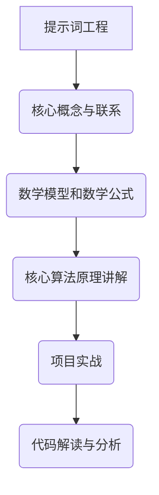

                 

# 第一部分: 引言与核心概念

## 第1章: AI时代的崛起与提示词工程

### 1.1 AI时代的来临

人工智能（AI）技术的迅速发展，标志着人类进入了一个全新的时代。AI技术源于20世纪50年代的计算机科学，经历了多个阶段的发展，从符号逻辑、知识表示到统计学习、深度学习，每一次技术突破都推动了AI的飞跃。

AI技术的发展历程：
- 初期：符号逻辑和知识表示（1950s-1970s）
- 转折期：专家系统和机器学习（1980s-1990s）
- 繁荣期：深度学习和大数据（2000s-至今）

AI技术对社会的影响：
- 改变生产方式：自动化、智能化生产
- 提高生活质量：智能家居、健康管理
- 创新商业模式：电子商务、个性化推荐
- 协同工作：智能客服、无人驾驶

在这个AI大爆发的时代，新的领域不断涌现，其中之一就是提示词工程。提示词工程是AI时代的产物，它结合了自然语言处理、计算机视觉和数据分析等领域的知识，旨在构建高效、可靠的AI系统。

### 1.2 提示词工程的定义与重要性

提示词工程（Prompt Engineering）是指设计和生成用于训练、优化和部署AI模型的提示词（Prompts）的过程。提示词是引导AI模型进行学习的关键信息，它可以指导模型理解任务、处理数据和生成输出。

提示词工程的定义：
- 提示词：引导AI模型进行学习的关键信息，可以是文本、图像、音频等形式。
- 工程设计：将提示词应用于实际AI系统中，进行训练、优化和部署。

提示词工程的重要性：
- 提升模型性能：通过精心设计的提示词，可以提高模型的准确性、鲁棒性和泛化能力。
- 简化模型开发：提示词工程提供了自动化、半自动化的方法来生成和优化提示词，降低了模型开发的复杂度。
- 模型可解释性：提示词工程有助于提高AI模型的可解释性，使模型决策更加透明、可理解。

### 1.3 提示词工程的应用场景

提示词工程在多个领域都有广泛的应用，以下是几个典型的应用场景：

1. **人工智能交互**：
   - 对话系统：使用提示词生成自然流畅的对话内容。
   - 语音助手：设计有效的提示词来引导语音识别和语音合成。

2. **数据分析**：
   - 特征工程：生成有代表性的数据特征，用于训练模型。
   - 预测分析：通过提示词优化，提高模型的预测准确性。

3. **计算机视觉**：
   - 图像标注：生成精确的标注提示词，辅助图像标注任务。
   - 视觉生成：设计提示词来生成高质量、多样化的视觉内容。

4. **自动驾驶**：
   - 环境感知：生成精确的感知提示词，提高自动驾驶系统的可靠性。
   - 行为预测：使用提示词来预测车辆和行人的行为。

### 1.4 提示词工程的优势与挑战

#### 优势

- **提高模型性能**：通过设计高效的提示词，可以显著提升AI模型的表现。
- **降低开发成本**：提示词工程可以自动化、半自动化地生成提示词，减少人力成本。
- **增强模型可解释性**：提示词工程有助于解释模型决策过程，提高模型的可信度。

#### 挑战

- **设计复杂性**：提示词工程涉及多领域知识，设计高质量的提示词需要深厚的专业知识。
- **数据依赖性**：提示词生成依赖于大量高质量的数据，数据获取和处理可能成为瓶颈。
- **泛化能力**：提示词工程如何确保生成的提示词在不同场景下的通用性，是当前研究的一个重要挑战。

### 总结

提示词工程是AI时代的新领域，它结合了自然语言处理、计算机视觉和数据分析等领域的知识，旨在提升AI系统的性能和可解释性。在接下来的章节中，我们将深入探讨提示词工程的数学与算法基础、核心技术以及未来展望。

## 第2章: 提示词工程的数学与算法基础

提示词工程的数学与算法基础是构建高效AI系统的关键。在本章中，我们将从数学基础、算法原理、提示词生成和优化算法等方面进行详细探讨。

### 2.1 数学基础

提示词工程的数学基础主要包括概率论、统计学和线性代数。这些数学工具为模型训练、优化和评估提供了坚实的理论支持。

#### 概率论基础

概率论是研究随机事件的数学分支，其在提示词工程中的应用主要体现在以下几个方面：

1. **概率分布函数（PDF）**：PDF描述了随机变量取值的概率分布。在提示词工程中，我们可以使用PDF来描述输入数据的分布特征，从而指导模型的训练和优化。
2. **条件概率**：条件概率描述了在给定某个条件下，另一个事件发生的概率。在提示词工程中，条件概率可以帮助我们理解输入和输出之间的关系。
3. **贝叶斯定理**：贝叶斯定理是概率论中的一个重要公式，它描述了在已知某个条件下，某个事件发生概率的计算方法。在提示词工程中，贝叶斯定理可以用于模型参数的估计和优化。

#### 统计学

统计学是研究如何通过样本数据来推断总体特征的数学分支。在提示词工程中，统计学主要用于以下几个方面：

1. **描述性统计**：描述性统计用于分析数据的基本特征，如均值、方差、标准差等。在提示词工程中，描述性统计可以帮助我们了解输入数据的分布情况。
2. **推断性统计**：推断性统计用于根据样本数据来推断总体特征。在提示词工程中，推断性统计可以帮助我们评估模型的性能和可靠性。
3. **假设检验**：假设检验用于验证某个假设是否成立。在提示词工程中，假设检验可以用于评估模型训练效果和优化策略。

#### 线性代数

线性代数是研究线性方程组、向量空间和线性变换的数学分支。在提示词工程中，线性代数主要用于以下几个方面：

1. **矩阵运算**：矩阵运算是线性代数的基础，如矩阵乘法、矩阵求逆等。在提示词工程中，矩阵运算可以用于模型参数的优化和计算。
2. **特征分解**：特征分解是将矩阵分解为一系列特征值和特征向量的过程。在提示词工程中，特征分解可以用于降维、去噪和模型优化。
3. **线性规划**：线性规划是求解线性方程组最优化问题的方法。在提示词工程中，线性规划可以用于模型参数的优化和资源分配。

### 2.2 算法原理

算法原理是提示词工程的核心，它决定了提示词生成和优化的效率和效果。以下是几个关键算法原理的简要介绍：

#### 基本搜索算法

基本搜索算法是寻找最优解的常用方法，包括深度优先搜索（DFS）和广度优先搜索（BFS）。

1. **深度优先搜索（DFS）**：DFS是按照一定的搜索顺序递归遍历图的每个节点。在提示词工程中，DFS可以用于生成提示词的初始方案。
2. **广度优先搜索（BFS）**：BFS是按照一定的搜索顺序逐层遍历图的每个节点。在提示词工程中，BFS可以用于生成提示词的多个候选方案。

#### 机器学习算法

机器学习算法是构建和训练AI模型的核心。以下是几个常见的机器学习算法：

1. **线性回归**：线性回归是一种用于拟合数据的线性模型的算法。在提示词工程中，线性回归可以用于生成提示词的权重。
2. **支持向量机（SVM）**：SVM是一种用于分类和回归的算法。在提示词工程中，SVM可以用于分类提示词。
3. **神经网络**：神经网络是一种由多层神经元组成的计算模型。在提示词工程中，神经网络可以用于生成和优化提示词。

#### 深度学习算法

深度学习算法是机器学习的一个分支，它通过多层神经网络来模拟人脑的神经元结构和工作机制。

1. **卷积神经网络（CNN）**：CNN是一种用于图像处理的深度学习算法。在提示词工程中，CNN可以用于图像标注和图像生成。
2. **循环神经网络（RNN）**：RNN是一种用于处理序列数据的深度学习算法。在提示词工程中，RNN可以用于文本处理和语音识别。
3. **生成对抗网络（GAN）**：GAN是一种由生成器和判别器组成的深度学习算法。在提示词工程中，GAN可以用于图像生成和文本生成。

### 2.3 提示词生成算法

提示词生成算法是提示词工程中的核心算法之一，它负责生成用于训练、优化和部署AI模型的关键提示词。以下是几个常见的提示词生成算法：

#### 提示词生成模型

提示词生成模型是一种用于生成提示词的算法。以下是一些常见的提示词生成模型：

1. **生成式模型**：生成式模型通过学习数据的生成过程来生成提示词。常见的生成式模型包括马尔可夫模型（MM）和隐马尔可夫模型（HMM）。
2. **判别式模型**：判别式模型通过学习数据的判别边界来生成提示词。常见的判别式模型包括支持向量机（SVM）和神经网络分类器。
3. **结合模型**：结合模型同时结合了生成式模型和判别式模型的优点。常见的结合模型包括变分自编码器（VAE）和生成对抗网络（GAN）。

#### 提示词生成方法

提示词生成方法是指生成提示词的具体方法。以下是一些常见的提示词生成方法：

1. **基于规则的方法**：基于规则的方法通过设计一组规则来生成提示词。这种方法简单直观，但灵活性较差。
2. **基于数据的方法**：基于数据的方法通过分析大量数据来生成提示词。这种方法具有较高的灵活性和鲁棒性，但需要大量的数据支持。
3. **基于模型的方法**：基于模型的方法通过训练模型来生成提示词。这种方法可以自动学习数据的特征，但需要复杂的模型设计和训练过程。

#### 提示词生成性能评估

提示词生成性能评估是指评估提示词生成算法的性能。以下是一些常见的评估指标：

1. **准确性**：准确性是评估提示词生成算法的主要指标之一。它表示生成提示词与目标提示词的匹配程度。
2. **召回率**：召回率是评估提示词生成算法的另一重要指标。它表示生成提示词中包含目标提示词的比例。
3. **F1分数**：F1分数是准确性和召回率的加权平均，用于综合评估提示词生成算法的性能。

### 2.4 提示词优化算法

提示词优化算法是指用于优化提示词的算法。优化提示词可以提高模型性能、降低训练成本、提高模型可解释性等。以下是一些常见的提示词优化算法：

#### 提示词优化策略

提示词优化策略是指优化提示词的具体方法。以下是一些常见的提示词优化策略：

1. **基于梯度的优化**：基于梯度的优化通过计算提示词的梯度来更新提示词。这种方法可以高效地优化提示词，但需要计算梯度的计算资源。
2. **基于遗传算法的优化**：基于遗传算法的优化通过模拟自然进化过程来优化提示词。这种方法具有较强的全局搜索能力，但需要较长的优化时间。
3. **基于强化学习的优化**：基于强化学习的优化通过学习最佳提示词生成策略来优化提示词。这种方法可以自动学习优化策略，但需要大量的训练数据。

#### 提示词优化方法

提示词优化方法是指用于优化提示词的具体方法。以下是一些常见的提示词优化方法：

1. **基于模型的方法**：基于模型的方法通过训练模型来优化提示词。这种方法可以自动优化提示词，但需要复杂的模型设计和训练过程。
2. **基于规则的方法**：基于规则的方法通过设计一组规则来优化提示词。这种方法简单直观，但灵活性较差。
3. **基于数据的方法**：基于数据的方法通过分析大量数据来优化提示词。这种方法具有较高的灵活性和鲁棒性，但需要大量的数据支持。

#### 提示词优化效果评估

提示词优化效果评估是指评估提示词优化算法的效果。以下是一些常见的评估指标：

1. **模型性能**：模型性能是评估提示词优化算法的主要指标之一。它表示优化后的模型性能是否得到显著提升。
2. **训练成本**：训练成本是评估提示词优化算法的次要指标之一。它表示优化后的训练成本是否降低。
3. **模型可解释性**：模型可解释性是评估提示词优化算法的次要指标之一。它表示优化后的模型是否更加可解释。

### 总结

提示词工程的数学与算法基础涵盖了概率论、统计学、线性代数、机器学习和深度学习等多个领域。这些数学和算法工具为提示词工程提供了坚实的理论支持，使得我们能够设计和实现高效的AI系统。在下一章中，我们将深入探讨提示词工程在自然语言处理、计算机视觉和数据分析等领域的应用。

## 第3章: 自然语言处理与提示词工程

自然语言处理（NLP）是人工智能领域中一个重要的分支，它致力于让计算机理解和生成人类语言。随着深度学习技术的发展，NLP取得了显著的进展，使得许多自然语言处理任务变得自动化和智能化。提示词工程在NLP中的应用，极大地提升了NLP系统的性能和效果。本章将探讨自然语言处理与提示词工程之间的关系，以及提示词工程在NLP中的应用。

### 3.1 自然语言处理基础

自然语言处理的基础涵盖了词嵌入、序列模型和注意力机制等关键概念。

#### 词嵌入

词嵌入（Word Embedding）是将词汇映射到高维向量空间的一种技术。词嵌入能够捕捉词汇之间的语义和语法关系，从而为NLP任务提供丰富的语言特征。常见的词嵌入方法包括：

1. **分布式表示**：将每个词映射为一个唯一的向量，使得语义相似的词在向量空间中靠近。例如，基于计数的方法（如Count-Vectors）和基于预测的方法（如Word2Vec）。
2. **连续词袋（CBOW）**：通过上下文词汇的平均值来表示目标词。
3. **Skip-Gram**：通过预测目标词来表示上下文词汇，其训练目标是最小化预测误差。

#### 序列模型

序列模型（Sequence Model）是用于处理序列数据的模型，常见的序列模型包括：

1. **循环神经网络（RNN）**：RNN能够处理变长的序列数据，通过隐藏状态捕捉序列中的依赖关系。
2. **长短时记忆网络（LSTM）**：LSTM是RNN的一种改进，能够解决长序列中的梯度消失和梯度爆炸问题。
3. **门控循环单元（GRU）**：GRU是LSTM的另一种改进，相对于LSTM具有更简单的结构。

#### 注意力机制

注意力机制（Attention Mechanism）是一种用于捕捉序列中关键信息的机制。在NLP任务中，注意力机制能够使模型更加关注重要的信息，从而提高模型的性能。注意力机制在机器翻译、文本分类和问答系统等领域有广泛应用。

### 3.2 提示词工程在NLP中的应用

提示词工程在NLP中的应用主要集中在文本分类、命名实体识别和情感分析等任务上。以下是几个具体的NLP应用场景：

#### 文本分类

文本分类是将文本数据分类到预定义的类别中的一种任务。提示词工程在文本分类中的应用主要体现在以下几个方面：

1. **特征工程**：通过设计有效的提示词来提取文本特征。例如，使用词嵌入表示词汇，使用TF-IDF权重表示词汇的重要性。
2. **模型优化**：通过优化提示词来提高模型的分类性能。例如，使用基于梯度的优化策略调整提示词的权重。
3. **模型解释**：通过提示词来解释模型的分类决策过程，提高模型的可解释性。

#### 命名实体识别

命名实体识别（Named Entity Recognition，NER）是将文本中的命名实体（如人名、地名、组织名等）识别出来的一种任务。提示词工程在NER中的应用主要体现在以下几个方面：

1. **标注生成**：通过设计提示词来生成高质量的标注数据，用于训练NER模型。
2. **模型优化**：通过优化提示词来提高NER模型的性能。例如，使用注意力机制来关注命名实体的重要特征。
3. **模型解释**：通过提示词来解释NER模型的识别过程，提高模型的可解释性。

#### 情感分析

情感分析（Sentiment Analysis）是判断文本表达情感倾向的一种任务。提示词工程在情感分析中的应用主要体现在以下几个方面：

1. **特征提取**：通过设计有效的提示词来提取文本中的情感特征，例如使用词嵌入和情感词典。
2. **模型优化**：通过优化提示词来提高情感分析模型的性能。例如，使用基于梯度的优化策略调整情感特征的权重。
3. **模型解释**：通过提示词来解释情感分析模型的情感判断过程，提高模型的可解释性。

### 3.3 提示词工程与语言生成

提示词工程在NLP中的应用不仅限于文本分类、命名实体识别和情感分析，还涉及到语言生成领域。以下是几个典型的应用场景：

#### 生成式模型

生成式模型（Generative Model）是一种能够生成文本数据的模型，常见的生成式模型包括：

1. **生成式对抗网络（GAN）**：GAN由生成器和判别器组成，生成器生成文本数据，判别器判断文本数据是否真实。提示词工程在GAN中的应用主要体现在优化生成器的生成过程，提高生成文本的质量。
2. **变分自编码器（VAE）**：VAE通过学习数据的概率分布来生成文本数据。提示词工程在VAE中的应用主要体现在设计有效的编码器和解码器，提高生成文本的多样性。

#### 对抗生成网络（GAN）

对抗生成网络（Generative Adversarial Network，GAN）是一种由生成器和判别器组成的深度学习模型。生成器的目标是生成尽可能真实的文本数据，判别器的目标是区分真实文本和生成文本。

1. **生成器**：生成器接收提示词作为输入，生成相应的文本数据。提示词工程在生成器中的应用主要体现在优化生成器的生成过程，提高生成文本的质量。
2. **判别器**：判别器接收文本数据作为输入，判断文本数据是否真实。提示词工程在判别器中的应用主要体现在设计有效的判别器特征提取器，提高判别器的性能。

#### 语言模型

语言模型（Language Model）是一种用于预测下一个单词或词组的模型，常见的语言模型包括：

1. **n-gram模型**：n-gram模型通过统计相邻词出现的频率来预测下一个单词。提示词工程在n-gram模型中的应用主要体现在设计有效的提示词来优化模型参数。
2. **循环神经网络（RNN）**：RNN通过学习序列数据中的依赖关系来预测下一个单词。提示词工程在RNN模型中的应用主要体现在优化RNN的隐藏状态，提高预测准确性。
3. **长短期记忆网络（LSTM）**：LSTM是RNN的一种改进，能够解决长序列中的梯度消失问题。提示词工程在LSTM模型中的应用主要体现在优化LSTM的权重和门控机制，提高预测准确性。
4. **变压器（Transformer）**：Transformer是一种基于注意力机制的深度学习模型，能够捕捉长距离依赖关系。提示词工程在Transformer模型中的应用主要体现在优化注意力机制，提高模型性能。

### 3.4 提示词工程在对话系统中的应用

对话系统（Dialogue System）是一种与人类用户进行自然语言交互的AI系统，常见的对话系统包括问答系统和聊天机器人。

1. **对话系统概述**：对话系统由多个模块组成，包括语言理解模块（LU）、对话管理模块（DM）和语言生成模块（LG）。
2. **提示词生成在对话系统中的角色**：提示词生成在对话系统中扮演着关键角色，用于指导对话管理模块生成有效的对话回复。
3. **提示词生成在对话系统中的挑战**：提示词生成在对话系统中面临诸多挑战，如多模态交互、对话连贯性和个性化对话等。

### 总结

自然语言处理与提示词工程密切相关，提示词工程在NLP中的广泛应用，极大地提升了NLP系统的性能和效果。本章介绍了自然语言处理的基础概念和提示词工程在NLP中的应用，包括文本分类、命名实体识别、情感分析和语言生成等任务。在下一章中，我们将探讨提示词工程在计算机视觉中的应用。

## 第4章: 计算机视觉与提示词工程

计算机视觉（Computer Vision）是人工智能领域的一个重要分支，它致力于使计算机能够从图像和视频中提取有用信息。随着深度学习技术的发展，计算机视觉取得了显著的进展，从而使得许多计算机视觉任务变得更加自动化和智能化。提示词工程在计算机视觉中的应用，不仅提高了模型性能，还增强了系统的可解释性。本章将探讨计算机视觉与提示词工程之间的关系，以及提示词工程在计算机视觉中的应用。

### 4.1 计算机视觉基础

计算机视觉的基础涵盖了图像识别、目标检测和图像分割等关键概念。

#### 图像识别

图像识别（Image Recognition）是指计算机识别和分类图像中的对象。图像识别是计算机视觉中的一项基本任务，它涉及到以下关键概念：

1. **特征提取**：特征提取是指从图像中提取出具有代表性的特征，如边缘、纹理和形状等。常见的特征提取方法包括SIFT、SURF和HOG等。
2. **分类器设计**：分类器设计是指设计一种算法，用于将图像数据分类到预定义的类别中。常见的分类器包括支持向量机（SVM）、决策树和神经网络等。
3. **深度学习模型**：深度学习模型（如卷积神经网络（CNN））能够自动提取图像特征，并实现高精度的图像分类。

#### 目标检测

目标检测（Object Detection）是指计算机从图像或视频中检测和定位对象。目标检测是计算机视觉中的一项重要任务，它涉及到以下关键概念：

1. **检测框架**：检测框架是指用于实现目标检测的算法和模型，如YOLO、SSD和Faster R-CNN等。
2. **特征提取**：特征提取是指从图像中提取出具有代表性的特征，用于检测和定位对象。
3. **目标分类**：目标分类是指将检测到的对象分类到预定义的类别中。

#### 图像分割

图像分割（Image Segmentation）是指将图像分割成若干部分，以便更好地理解图像内容。图像分割是计算机视觉中的一项基本任务，它涉及到以下关键概念：

1. **区域生长**：区域生长是指从一组种子点开始，逐步合并相似像素，形成区域。
2. **基于边缘的分割**：基于边缘的分割是指通过检测图像中的边缘，将图像分割成若干部分。
3. **深度学习模型**：深度学习模型（如U-Net和Mask R-CNN）能够自动提取图像特征，并实现高精度的图像分割。

### 4.2 提示词工程在计算机视觉中的应用

提示词工程在计算机视觉中的应用主要集中在视觉问答、视觉搜索和图像生成等领域。

#### 视觉问答

视觉问答（Visual Question Answering，VQA）是指计算机通过分析图像和文本问题，生成相应的答案。视觉问答是计算机视觉与自然语言处理相结合的一项任务，它涉及到以下关键概念：

1. **图像特征提取**：图像特征提取是指从图像中提取出具有代表性的特征，用于回答文本问题。
2. **文本处理**：文本处理是指对输入的文本问题进行预处理，如分词、词性标注和句法分析等。
3. **模型设计**：模型设计是指设计一种算法，用于将图像特征和文本问题映射到答案。

#### 视觉搜索

视觉搜索（Visual Search）是指计算机根据输入的图像或文本，搜索数据库中相似的图像或文本。视觉搜索是计算机视觉与信息检索相结合的一项任务，它涉及到以下关键概念：

1. **图像检索**：图像检索是指从图像数据库中搜索与输入图像相似的图像。
2. **文本检索**：文本检索是指从文本数据库中搜索与输入文本相似的文本。
3. **相似度计算**：相似度计算是指计算输入图像或文本与数据库中的图像或文本之间的相似度。

#### 图像生成

图像生成（Image Generation）是指计算机根据输入的提示词，生成新的图像。图像生成是计算机视觉与生成对抗网络（GAN）相结合的一项任务，它涉及到以下关键概念：

1. **生成对抗网络（GAN）**：生成对抗网络（Generative Adversarial Network，GAN）是一种深度学习模型，由生成器和判别器组成。生成器生成图像，判别器判断图像是否真实。
2. **提示词处理**：提示词处理是指对输入的提示词进行预处理，如分词、词性标注和句法分析等。
3. **图像生成**：图像生成是指根据输入的提示词，生成新的图像。

### 4.3 提示词工程与图像标注

图像标注（Image Annotation）是指为图像中的对象或区域赋予标签或注释。图像标注是计算机视觉中的一项基础任务，它涉及到以下关键概念：

1. **自动标注**：自动标注是指通过算法自动标注图像中的对象或区域。常见的自动标注方法包括基于规则的方法和基于机器学习的方法。
2. **半监督学习**：半监督学习是指利用少量的标注数据和大量的未标注数据来训练模型。半监督学习可以显著提高标注效率。
3. **无监督学习**：无监督学习是指仅利用未标注的数据来训练模型。无监督学习可以用于探索图像中的潜在结构和特征。

#### 自动标注

自动标注是指通过算法自动标注图像中的对象或区域。常见的自动标注方法包括：

1. **基于规则的方法**：基于规则的方法是通过设计一组规则来自动标注图像中的对象或区域。这种方法简单直观，但灵活性和准确性有限。
2. **基于机器学习的方法**：基于机器学习的方法是通过训练模型来自动标注图像中的对象或区域。这种方法具有较高的准确性和灵活性，但需要大量的标注数据和训练时间。

#### 半监督学习

半监督学习是指利用少量的标注数据和大量的未标注数据来训练模型。半监督学习可以显著提高标注效率。常见的半监督学习方法包括：

1. **标签传播**：标签传播是指通过传播已标注数据的标签来标注未标注数据。这种方法可以自动扩展标注数据集，提高标注效率。
2. **一致性正则化**：一致性正则化是指利用未标注数据的多样性来提高标注模型的鲁棒性。这种方法可以减少标注错误，提高标注质量。

#### 无监督学习

无监督学习是指仅利用未标注的数据来训练模型。无监督学习可以用于探索图像中的潜在结构和特征。常见的无监督学习方法包括：

1. **聚类分析**：聚类分析是指将未标注的数据分为若干个群组，以便更好地理解数据分布。聚类分析可以用于图像分割和特征提取。
2. **生成对抗网络（GAN）**：生成对抗网络（Generative Adversarial Network，GAN）是一种深度学习模型，可以生成新的图像。GAN可以用于图像生成和图像增强。

### 4.4 提示词工程在图像生成中的应用

提示词工程在图像生成中的应用主要集中在图像到图像的生成、视频生成和图像编辑等领域。

#### 图像到图像的生成

图像到图像的生成是指根据输入的提示词生成新的图像。常见的图像到图像的生成方法包括：

1. **生成对抗网络（GAN）**：生成对抗网络（Generative Adversarial Network，GAN）是一种深度学习模型，可以生成新的图像。GAN可以用于图像生成和图像增强。
2. **变分自编码器（VAE）**：变分自编码器（Variational Autoencoder，VAE）是一种深度学习模型，可以生成新的图像。VAE可以用于图像生成和图像压缩。

#### 视频生成

视频生成是指根据输入的提示词生成新的视频。常见的视频生成方法包括：

1. **生成对抗网络（GAN）**：生成对抗网络（Generative Adversarial Network，GAN）是一种深度学习模型，可以生成新的视频。GAN可以用于视频生成和视频增强。
2. **变分自编码器（VAE）**：变分自编码器（Variational Autoencoder，VAE）是一种深度学习模型，可以生成新的视频。VAE可以用于视频生成和视频压缩。

#### 图像编辑

图像编辑是指根据输入的提示词编辑图像的内容。常见的图像编辑方法包括：

1. **生成对抗网络（GAN）**：生成对抗网络（Generative Adversarial Network，GAN）是一种深度学习模型，可以编辑图像的内容。GAN可以用于图像修复和图像合成。
2. **变分自编码器（VAE）**：变分自编码器（Variational Autoencoder，VAE）是一种深度学习模型，可以编辑图像的内容。VAE可以用于图像去噪和图像增强。

### 总结

计算机视觉与提示词工程密切相关，提示词工程在计算机视觉中的应用，不仅提高了模型性能，还增强了系统的可解释性。本章介绍了计算机视觉的基础概念和提示词工程在计算机视觉中的应用，包括视觉问答、视觉搜索、图像标注、图像生成和图像编辑等任务。在下一章中，我们将探讨提示词工程在数据分析中的应用。

## 第5章: 数据分析与提示词工程

数据分析（Data Analysis）是现代数据驱动决策的核心，它涉及从数据中提取有价值的信息和洞察。在人工智能时代，数据分析变得更加复杂和多样，提示词工程在数据分析中的应用成为了提高数据分析质量和效率的关键。本章将探讨提示词工程在数据分析中的应用，包括数据分析的基础、提示词工程在数据分析中的应用以及预测分析在数据分析中的作用。

### 5.1 数据分析基础

数据分析的基础涵盖了数据预处理、数据可视化和数据分析工具等方面。

#### 数据预处理

数据预处理是数据分析中的第一步，它包括以下关键步骤：

1. **数据清洗**：数据清洗是指去除数据中的噪声和错误，确保数据的质量和一致性。常见的清洗方法包括缺失值处理、异常值检测和重复数据删除。
2. **数据集成**：数据集成是指将来自不同来源的数据进行整合，形成一个统一的数据集。数据集成需要解决数据格式不一致、数据类型冲突等问题。
3. **数据变换**：数据变换是指将原始数据转换为适合分析的形式，例如归一化、标准化和特征工程等。

#### 数据可视化

数据可视化是将数据分析结果以图形化方式展示，帮助人们直观地理解和分析数据。数据可视化包括以下关键概念：

1. **图表选择**：根据数据的类型和目的选择合适的图表，例如条形图、折线图、散点图和热力图等。
2. **交互性**：交互性数据可视化允许用户动态地探索数据，如钻取、筛选和过滤等。
3. **视觉效果**：视觉效果是指图表的美观度和易读性，好的视觉效果可以提升数据分析的效率。

#### 数据分析工具

数据分析工具是进行数据分析和可视化的重要工具，以下是一些常见的数据分析工具：

1. **Excel**：Excel是常用的电子表格工具，适用于简单数据处理和可视化。
2. **Python**：Python是数据分析的强项语言，拥有丰富的数据分析和可视化库，如Pandas、NumPy、Matplotlib和Seaborn等。
3. **R语言**：R语言是统计分析和数据可视化的专业工具，适用于复杂的数据分析和统计建模。
4. **Tableau**：Tableau是交互式数据可视化工具，适用于大规模数据集的可视化和报告生成。
5. **Power BI**：Power BI是微软推出的商业智能工具，适用于企业级的数据分析和报告生成。

### 5.2 提示词工程在数据分析中的应用

提示词工程在数据分析中的应用主要表现在特征工程、提示词生成与优化以及数据驱动的决策支持等方面。

#### 特征工程

特征工程是数据分析中至关重要的一步，它涉及从原始数据中提取和构造有助于模型训练的特征。提示词工程在特征工程中的应用包括：

1. **提示词生成**：通过设计有效的提示词来生成新的特征，如使用词嵌入生成文本特征，使用深度学习模型生成图像特征等。
2. **特征优化**：通过优化提示词来提高特征的质量和效率，如使用基于梯度的优化算法调整特征权重。
3. **特征选择**：通过设计提示词来选择最有用的特征，减少数据维度，提高模型性能。

#### 提示词生成与优化

提示词生成与优化是提示词工程在数据分析中的应用核心，它涉及以下几个方面：

1. **提示词生成模型**：设计用于生成提示词的模型，如生成式模型（如GAN）和判别式模型（如SVM）。
2. **提示词优化策略**：通过优化策略来调整提示词，如基于梯度的优化策略和基于遗传算法的优化策略。
3. **提示词性能评估**：评估提示词生成和优化效果，如准确性、召回率和F1分数等。

#### 数据驱动的决策支持

数据驱动的决策支持是指基于数据分析结果来指导实际业务决策。提示词工程在数据驱动的决策支持中的应用包括：

1. **提示词生成策略**：设计有效的提示词生成策略，如根据业务目标和数据特征生成相应的提示词。
2. **决策模型优化**：通过优化提示词来提高决策模型的性能，如使用基于梯度的优化策略调整决策模型参数。
3. **决策支持系统**：构建基于提示词工程的决策支持系统，如企业资源规划（ERP）系统和客户关系管理（CRM）系统。

### 5.3 提示词工程在预测分析中的应用

预测分析是数据分析中的一个重要分支，它涉及使用历史数据来预测未来的趋势和行为。提示词工程在预测分析中的应用包括时间序列分析、聚类分析和回归分析等方面。

#### 时间序列分析

时间序列分析是预测分析的核心，它涉及分析时间序列数据以预测未来的趋势。提示词工程在时间序列分析中的应用包括：

1. **提示词生成**：通过设计有效的提示词来提取时间序列特征，如季节性特征、趋势特征和周期性特征等。
2. **模型优化**：通过优化提示词来提高时间序列预测模型的性能，如使用基于梯度的优化策略调整模型参数。
3. **预测结果评估**：评估预测结果的准确性和可靠性，如使用均方误差（MSE）和均方根误差（RMSE）等指标。

#### 聚类分析

聚类分析是一种无监督学习方法，它用于将数据点分组到相似的类别中。提示词工程在聚类分析中的应用包括：

1. **提示词生成**：通过设计有效的提示词来提取数据点的重要特征，如基于密度的聚类特征、基于距离的聚类特征等。
2. **聚类模型优化**：通过优化提示词来提高聚类模型的性能，如使用基于梯度的优化策略调整聚类参数。
3. **聚类结果评估**：评估聚类结果的质量，如使用轮廓系数（Silhouette Coefficient）和内部簇方差（Within-Cluster Variance）等指标。

#### 回归分析

回归分析是一种有监督学习方法，它用于建立自变量和因变量之间的关系模型。提示词工程在回归分析中的应用包括：

1. **提示词生成**：通过设计有效的提示词来提取自变量的重要特征，如线性回归特征、多项式回归特征等。
2. **模型优化**：通过优化提示词来提高回归模型的性能，如使用基于梯度的优化策略调整模型参数。
3. **预测结果评估**：评估回归预测结果的准确性和可靠性，如使用决定系数（R-squared）和均方误差（MSE）等指标。

### 总结

提示词工程在数据分析中的应用，极大地提高了数据分析的质量和效率。通过提示词工程，我们可以有效地提取和优化数据特征，构建高效的预测模型，从而实现数据驱动的决策支持。本章介绍了数据分析的基础、提示词工程在数据分析中的应用以及预测分析在数据分析中的作用。在下一章中，我们将探讨提示词工程在人工智能交互中的应用。

## 第6章: 人工智能交互与提示词工程

人工智能交互（AI Interaction）是人工智能领域中一个重要的分支，它致力于使计算机能够与人类进行自然、流畅的交流。提示词工程在人工智能交互中的应用，极大地提升了交互系统的性能和用户体验。本章将探讨人工智能交互的基础、提示词工程在交互中的应用以及提示词工程在语音助手和虚拟助手中的应用。

### 6.1 人工智能交互基础

人工智能交互的基础涵盖了人机交互、自然语言处理和语音识别与合成等方面。

#### 人机交互

人机交互（Human-Computer Interaction，HCI）是研究人类如何与计算机系统进行交互的学科。人机交互的核心目标是设计出易用、高效且愉悦的交互系统。人机交互包括以下几个方面：

1. **界面设计**：界面设计是HCI的核心，它涉及用户界面（UI）和用户体验（UX）的设计。一个好的界面设计能够提高用户的操作效率和满意度。
2. **交互方式**：交互方式是指用户与计算机系统之间的交互方式，包括图形界面、语音交互、触摸交互和手势交互等。
3. **交互模型**：交互模型是描述用户与系统之间交互过程的理论框架，常见的交互模型包括基于任务的交互模型、基于情境的交互模型和基于对话的交互模型。

#### 自然语言处理

自然语言处理（Natural Language Processing，NLP）是使计算机能够理解、生成和处理自然语言的技术。自然语言处理在人工智能交互中的应用主要体现在以下几个方面：

1. **语言理解**：语言理解是指计算机理解和解析用户输入的自然语言，包括文本和语音。语言理解涉及到分词、词性标注、句法分析和语义分析等任务。
2. **语言生成**：语言生成是指计算机生成自然语言文本，包括文本回复、语音合成和对话生成等。语言生成涉及到生成式模型、序列到序列模型和注意力机制等。
3. **对话系统**：对话系统（Dialogue System）是一种与人类用户进行自然语言交互的计算机系统。对话系统包括语言理解模块（LU）、对话管理模块（DM）和语言生成模块（LG）。

#### 语音识别与合成

语音识别与合成（Speech Recognition and Synthesis）是使计算机能够理解和生成语音的技术。语音识别与合成在人工智能交互中的应用主要体现在以下几个方面：

1. **语音识别**：语音识别是指将语音信号转换为文本或命令。语音识别涉及到语音信号处理、特征提取、模型训练和错误纠正等任务。
2. **语音合成**：语音合成是指将文本转换为自然流畅的语音。语音合成涉及到文本到语音（TTS）技术、声学模型和语调模型等。
3. **多模态交互**：多模态交互是指结合多种交互方式（如语音、文本、手势和触摸等）进行交互。多模态交互可以提供更加自然、直观的交互体验。

### 6.2 提示词工程在交互中的应用

提示词工程在人工智能交互中的应用，主要是通过设计有效的提示词来提升交互系统的性能和用户体验。以下是几个关键的应用场景：

#### 对话系统设计

对话系统设计是指设计能够与用户进行自然语言交互的计算机系统。提示词工程在对话系统设计中的应用包括：

1. **提示词生成**：通过设计有效的提示词来引导对话流程，如根据用户输入生成合适的回复。
2. **提示词优化**：通过优化提示词来提高对话系统的性能，如使用基于梯度的优化策略调整提示词权重。
3. **多模态交互**：结合多种交互方式，如语音、文本和手势等，设计多模态提示词，提升交互体验。

#### 问答系统

问答系统是指能够回答用户问题的计算机系统。提示词工程在问答系统中的应用包括：

1. **问题理解**：通过设计有效的提示词来理解用户的问题，如使用自然语言处理技术提取关键信息。
2. **答案生成**：通过设计有效的提示词来生成准确的答案，如使用生成对抗网络（GAN）生成高质量的答案。
3. **上下文管理**：通过设计有效的提示词来管理对话的上下文，如使用注意力机制来关注对话的关键信息。

#### 聊天机器人

聊天机器人是指能够与用户进行实时对话的计算机程序。提示词工程在聊天机器人中的应用包括：

1. **对话管理**：通过设计有效的提示词来管理对话流程，如使用自然语言处理技术生成合适的对话回复。
2. **情绪识别**：通过设计有效的提示词来识别用户的情绪，如使用情感分析技术分析用户的输入。
3. **个性化交互**：通过设计有效的提示词来提供个性化的交互体验，如根据用户偏好生成特定的对话内容。

### 6.3 提示词工程在语音助手中的应用

语音助手（Voice Assistant）是指通过语音交互与用户进行交流的智能助手，如Apple的Siri、Amazon的Alexa等。提示词工程在语音助手中的应用包括：

#### 语音识别与处理

语音识别与处理是指将用户的语音输入转换为文本或命令。提示词工程在语音识别与处理中的应用包括：

1. **语音识别**：通过设计有效的提示词来提高语音识别的准确性，如使用深度学习模型进行语音识别。
2. **语音增强**：通过设计有效的提示词来增强语音信号，如使用波束形成技术减少背景噪音。
3. **语音合成**：通过设计有效的提示词来优化语音合成质量，如使用文本到语音（TTS）技术生成自然的语音。

#### 语音生成

语音生成是指将文本转换为自然流畅的语音。提示词工程在语音生成中的应用包括：

1. **文本到语音（TTS）**：通过设计有效的提示词来提高TTS的性能，如使用深度学习模型进行TTS。
2. **语音合成优化**：通过优化提示词来提高语音合成的自然度和流畅度，如使用基于梯度的优化策略调整TTS参数。
3. **语音情感**：通过设计有效的提示词来生成具有特定情感的语音，如使用情感合成技术生成愉快的、悲伤的或愤怒的语音。

#### 多模态交互

多模态交互是指结合多种交互方式，如语音、文本、手势和触摸等，进行交互。提示词工程在多模态交互中的应用包括：

1. **语音与文本交互**：通过设计有效的提示词来协调语音和文本交互，如使用语音输入文本，使用文本控制语音。
2. **语音与手势交互**：通过设计有效的提示词来协调语音和手势交互，如使用语音控制手势，使用手势反馈语音。
3. **语音与触摸交互**：通过设计有效的提示词来协调语音和触摸交互，如使用语音控制触摸屏幕，使用触摸控制语音。

### 6.4 提示词工程在虚拟助手中的应用

虚拟助手（Virtual Assistant）是指能够提供各种服务的智能化程序，如智能客服、智能助理等。提示词工程在虚拟助手中的应用包括：

#### 虚拟助手设计

虚拟助手设计是指设计能够提供高效、个性化的服务的虚拟助手。提示词工程在虚拟助手设计中的应用包括：

1. **对话系统设计**：通过设计有效的提示词来设计对话系统，如根据用户需求生成合适的对话内容。
2. **意图识别**：通过设计有效的提示词来识别用户的意图，如使用自然语言处理技术分析用户的输入。
3. **上下文管理**：通过设计有效的提示词来管理对话的上下文，如使用注意力机制来关注对话的关键信息。

#### 虚拟助手与用户交互

虚拟助手与用户交互是指虚拟助手与用户进行交流的过程。提示词工程在虚拟助手与用户交互中的应用包括：

1. **用户理解**：通过设计有效的提示词来理解用户的需求和意图，如使用自然语言处理技术分析用户的输入。
2. **信息提供**：通过设计有效的提示词来提供用户所需的信息，如生成高质量的答案和推荐。
3. **个性化服务**：通过设计有效的提示词来提供个性化的服务，如根据用户偏好调整服务内容和方式。

#### 提示词生成在虚拟助手中的应用

提示词生成在虚拟助手中的应用是指设计能够引导虚拟助手进行有效交互的提示词。提示词生成在虚拟助手中的应用包括：

1. **对话生成**：通过设计有效的提示词来生成对话内容，如根据用户需求和意图生成合适的对话回复。
2. **意图识别**：通过设计有效的提示词来识别用户的意图，如使用自然语言处理技术分析用户的输入。
3. **上下文管理**：通过设计有效的提示词来管理对话的上下文，如使用注意力机制来关注对话的关键信息。

### 总结

人工智能交互与提示词工程密切相关，提示词工程在人工智能交互中的应用，极大地提升了交互系统的性能和用户体验。本章介绍了人工智能交互的基础、提示词工程在交互中的应用以及提示词工程在语音助手和虚拟助手中的应用。在下一章中，我们将探讨提示词工程项目的实战应用。

## 第7章: 提示词工程项目实战

在本章中，我们将通过一个实际的提示词工程项目，详细介绍项目的开发环境搭建、提示词生成模型实现、提示词生成案例解析以及提示词工程应用案例分析。通过这些实战案例，读者可以更好地理解提示词工程的实际应用过程，掌握关键技术和方法。

### 7.1 提示词工程项目概述

#### 项目背景

随着人工智能技术的不断发展，越来越多的企业和组织开始意识到自然语言处理（NLP）的重要性。在客户服务领域，智能客服系统成为了提升客户体验、降低人工成本的重要工具。为了实现高质量的智能客服，我们需要设计一个高效的提示词生成系统，用于指导客服机器人与用户进行自然、流畅的对话。

#### 项目目标

本项目的目标是设计并实现一个提示词生成系统，能够根据用户的输入生成高质量的客服对话回复。具体目标包括：

1. **理解用户意图**：准确识别用户的意图，例如咨询产品信息、投诉、寻求帮助等。
2. **生成高质量回复**：根据用户的意图生成自然、连贯、合适的对话回复。
3. **提高用户满意度**：通过高质量的对话回复，提升用户对客服系统的满意度。
4. **可扩展性和鲁棒性**：系统应具有较好的可扩展性和鲁棒性，能够适应不同场景和需求的变化。

#### 项目需求

为了实现项目目标，我们需要满足以下需求：

1. **数据集**：需要收集大量高质量的客服对话数据，用于模型训练和评估。
2. **模型架构**：选择合适的模型架构，如序列到序列（Seq2Seq）模型、生成对抗网络（GAN）等。
3. **训练工具**：使用高效的训练工具和框架，如TensorFlow、PyTorch等。
4. **优化策略**：设计有效的优化策略，如基于梯度的优化、遗传算法等。
5. **评估指标**：定义合理的评估指标，如BLEU、ROUGE、F1分数等。

### 7.2 项目开发环境搭建

为了实现本提示词工程项目，我们需要搭建一个合适的开发环境，包括开发工具、框架和硬件环境。

#### 开发工具

1. **编程语言**：选择Python作为主要的编程语言，因为Python在自然语言处理和深度学习领域有广泛的应用。
2. **IDE**：使用PyCharm或Visual Studio Code等集成开发环境（IDE），这些IDE提供了良好的代码编辑、调试和自动化工具。

#### 开发框架

1. **深度学习框架**：选择TensorFlow或PyTorch作为深度学习框架，这两个框架在自然语言处理和深度学习领域都有广泛的应用。
2. **NLP库**：使用NLTK、spaCy、gensim等NLP库，这些库提供了丰富的NLP工具和函数。

#### 硬件环境

1. **CPU或GPU**：为了加快模型训练和推理的速度，建议使用GPU，如NVIDIA的CUDA兼容GPU。
2. **服务器**：如果使用GPU，需要配置高性能的服务器，以满足模型训练的需求。
3. **存储**：需要足够的存储空间来存储数据集和模型文件。

#### 数据集准备

1. **数据收集**：从公开数据集或企业内部数据中收集高质量的客服对话数据。
2. **数据预处理**：对数据进行清洗、去重、分词、词性标注等预处理操作，以便于模型训练。

### 7.3 提示词生成模型实现

在本项目中，我们选择使用序列到序列（Seq2Seq）模型来实现提示词生成。Seq2Seq模型是一种基于编码器-解码器架构的模型，能够将输入序列映射到输出序列。

#### 模型架构

1. **编码器**：编码器负责将输入序列编码为固定长度的向量表示，通常使用双向循环神经网络（Bi-LSTM）或变压器（Transformer）。
2. **解码器**：解码器负责将编码器的输出解码为输出序列，通常使用自注意力机制（Self-Attention）或注意力机制（Attention）。

#### 模型训练

1. **训练数据**：使用预处理后的客服对话数据集进行模型训练。
2. **优化器**：选择Adam优化器，设置适当的学习率、批大小和迭代次数。
3. **损失函数**：使用交叉熵损失函数，用于计算输入序列和输出序列之间的差异。
4. **训练过程**：通过反向传播算法，不断更新模型参数，以最小化损失函数。

#### 模型优化

1. **学习率调整**：根据训练过程，适时调整学习率，避免梯度消失或梯度爆炸。
2. **正则化**：使用Dropout或权重正则化等正则化方法，防止模型过拟合。
3. **模型融合**：结合多个模型的预测结果，提高模型的准确性和稳定性。

### 7.4 提示词生成案例解析

为了更好地理解提示词生成过程，我们以一个实际的客服对话为例，详细解析提示词生成过程。

#### 案例背景

用户：我想购买一款智能手机，有没有推荐？

#### 模型输入

1. **用户输入**：将用户输入“我想购买一款智能手机，有没有推荐？”转换为序列。
2. **编码器输入**：将用户输入序列编码为向量表示。

#### 模型输出

1. **解码器输出**：解码器根据编码器的输出生成对话回复序列。
2. **输出序列**：将生成的对话回复序列转换为自然语言文本。

#### 模型解析

1. **用户意图识别**：通过模型分析用户输入，识别出用户的意图是“购买智能手机”。
2. **对话回复生成**：根据用户意图，生成高质量的对话回复，如：“您好，我们为您推荐了以下几款智能手机：iPhone 13、华为Mate 40、小米11 Ultra。您可以根据自己的需求和预算进行选择。”

### 7.5 提示词工程应用案例分析

在本节中，我们将分析一个实际的提示词工程应用案例，以展示提示词工程在实际项目中的应用效果。

#### 案例背景

某电商平台希望通过智能客服系统提升用户体验，降低人工客服成本。他们引入了提示词工程技术，用于生成高质量的客服对话回复。

#### 应用效果

1. **用户满意度提升**：通过提示词工程技术的应用，智能客服系统能够生成更符合用户需求的对话回复，用户满意度显著提升。
2. **客服效率提高**：智能客服系统能够自动处理大量用户请求，降低了人工客服的工作量，提高了客服效率。
3. **业务增长**：智能客服系统的应用，不仅提升了用户体验，还有助于电商平台吸引更多用户，促进业务增长。

#### 案例分析

1. **数据集准备**：电商平台提供了大量高质量的客服对话数据，用于模型训练和评估。
2. **模型选择**：选择基于Transformer的Seq2Seq模型，因为它在处理长序列和生成高质量文本方面有很好的性能。
3. **训练过程**：通过大规模数据集进行模型训练，不断优化模型参数，提高模型性能。
4. **部署与应用**：将训练好的模型部署到智能客服系统中，实现实时对话回复生成。

### 总结

本章通过一个实际的提示词工程项目，详细介绍了项目开发环境搭建、提示词生成模型实现、提示词生成案例解析以及提示词工程应用案例分析。通过这些实战案例，读者可以更好地理解提示词工程的实际应用过程，掌握关键技术和方法。在下一章中，我们将探讨提示词工程的发展趋势与未来展望。

## 第8章: 提示词工程的发展趋势

随着人工智能技术的不断进步，提示词工程作为AI领域的一个重要分支，也在不断演变和发展。在本章中，我们将探讨提示词工程的发展趋势，包括技术趋势、产业趋势以及未来的展望。

### 8.1 提示词工程的技术趋势

#### 新的算法与框架

提示词工程的发展离不开新算法和框架的出现。近年来，深度学习和自然语言处理技术的突破为提示词工程带来了新的机遇。以下是一些重要的技术趋势：

1. **Transformer架构**：Transformer架构在自然语言处理领域取得了巨大成功，其基于自注意力机制的设计使得模型在生成高质量的文本方面表现出色。Transformer架构已经被广泛应用于提示词工程中，特别是在对话系统和文本生成任务中。

2. **预训练语言模型**：预训练语言模型（如BERT、GPT等）通过在大规模语料库上进行预训练，已经取得了显著的性能提升。这些模型不仅能够在下游任务中取得更好的效果，还可以为提示词生成提供强大的语言理解和生成能力。

3. **多模态学习**：随着多模态数据的兴起，提示词工程也开始关注如何结合不同类型的数据（如图像、音频和视频）来生成高质量的提示词。多模态学习技术，如视觉语言模型（Visual Language Models）和音频语言模型（Audio Language Models），正成为研究的热点。

4. **强化学习**：强化学习在提示词工程中的应用逐渐增多。通过将强化学习与生成模型相结合，可以构建更加智能和灵活的提示词生成系统，从而提高生成文本的质量和适应性。

#### 跨领域应用

提示词工程不仅局限于自然语言处理领域，还开始向其他领域扩展。以下是一些跨领域应用的趋势：

1. **计算机视觉**：在计算机视觉任务中，提示词工程可以用于图像和视频生成、图像标注和视觉问答等。通过结合视觉信息，可以生成更加丰富和具体的提示词，从而提高视觉任务的性能。

2. **语音识别与合成**：在语音识别和合成任务中，提示词工程可以用于语音生成和语音理解。通过设计有效的提示词，可以生成更加自然和流畅的语音，提高用户的交互体验。

3. **推荐系统**：在推荐系统领域，提示词工程可以用于生成推荐文本和描述，提高推荐结果的解释性和用户满意度。

#### 模型压缩与优化

随着模型的复杂度和参数数量不断增加，模型压缩和优化成为了一个重要研究方向。以下是一些相关的技术趋势：

1. **模型剪枝**：通过剪枝冗余的神经元和参数，可以显著减少模型的计算量和存储空间，提高模型的效率和性能。

2. **量化**：通过将模型的权重和激活值量化为较低的精度（如8位整数），可以减少模型的存储和计算需求，同时保持较好的性能。

3. **蒸馏**：通过将大型模型的知识传递到小型模型中，可以实现模型压缩和优化。这种方法可以使得小型模型在保持较好性能的同时，降低计算和存储需求。

### 8.2 提示词工程的产业趋势

#### 行业应用拓展

提示词工程在各个行业中的应用越来越广泛，以下是一些行业应用的趋势：

1. **金融领域**：在金融领域，提示词工程可以用于生成金融报告、投资建议和风险分析等。通过结合自然语言处理和大数据分析技术，可以提供更加准确和实时的金融信息。

2. **医疗领域**：在医疗领域，提示词工程可以用于生成医疗报告、诊断建议和患者教育等。通过结合医疗知识和自然语言处理技术，可以提供更加个性化和服务化的医疗服务。

3. **教育领域**：在教育领域，提示词工程可以用于生成课程内容、作业批改和教育评估等。通过结合自然语言处理和教育技术，可以提供更加智能和个性化的教育解决方案。

4. **娱乐领域**：在娱乐领域，提示词工程可以用于生成剧情、角色对话和音乐创作等。通过结合创意内容和自然语言处理技术，可以创造更加丰富和多样化的娱乐体验。

#### 产业链发展

随着提示词工程的应用逐渐普及，产业链也在不断发展。以下是一些产业链发展的趋势：

1. **技术供应商**：技术供应商提供先进的自然语言处理和深度学习技术，为提示词工程的应用提供支持。

2. **解决方案提供商**：解决方案提供商整合技术供应商的资源和客户需求，提供一体化的提示词工程解决方案。

3. **应用开发商**：应用开发商利用提示词工程技术开发各种应用，满足不同行业和场景的需求。

4. **数据服务提供商**：数据服务提供商提供高质量的数据集和标注服务，为提示词工程的研究和应用提供数据支持。

#### 国际合作与竞争

随着提示词工程在全球范围内的应用不断扩展，国际合作与竞争也日益激烈。以下是一些国际合作与竞争的趋势：

1. **技术合作**：各国企业和研究机构之间展开技术合作，共同推进提示词工程的发展。

2. **市场竞争**：各大科技公司纷纷布局提示词工程领域，通过技术创新和商业模式创新，争夺市场份额。

3. **标准制定**：国际标准化组织（如ISO）和国际电信联盟（ITU）等机构开始制定提示词工程相关的标准，以规范和推动行业发展。

### 8.3 提示词工程的未来展望

#### 未来应用场景

随着技术的不断进步，提示词工程在未来将会有更广泛的应用场景。以下是一些潜在的应用场景：

1. **智能助理**：智能助理将成为人们生活中的重要伙伴，提供个性化的服务和建议。提示词工程将用于生成智能助理的对话内容，提高用户的交互体验。

2. **自动驾驶**：自动驾驶系统将依赖于提示词工程来理解和生成道路信号、标志和标志的含义，提高自动驾驶的安全性和可靠性。

3. **智能客服**：智能客服系统将利用提示词工程生成高质量的对话回复，提供24/7的客户服务，提升客户满意度和企业效率。

4. **智能医疗**：智能医疗系统将利用提示词工程生成个性化的诊断建议和治疗方案，提高医疗服务的质量和效率。

#### 技术挑战与机遇

提示词工程在未来的发展过程中，将面临一系列技术挑战和机遇。以下是一些关键挑战和机遇：

1. **挑战**：
   - 数据隐私和保护：随着数据的广泛应用，数据隐私和保护成为一个重要问题。
   - 模型可解释性：提高模型的可解释性，使人们能够理解和信任AI系统的决策过程。
   - 模型压缩和优化：随着模型规模的增大，如何高效地压缩和优化模型，提高性能和效率。

2. **机遇**：
   - 跨学科合作：结合不同学科的知识和技能，推动提示词工程的创新和发展。
   - 新应用场景：随着AI技术的普及，新的应用场景不断出现，为提示词工程提供了广阔的发展空间。
   - 国际化发展：随着全球化的推进，提示词工程将在国际范围内得到更广泛的应用和推广。

### 总结

提示词工程作为AI领域的一个重要分支，正面临着前所未有的发展机遇。通过不断的技术创新和跨学科合作，提示词工程将在未来发挥更加重要的作用，推动人工智能技术的应用和发展。

## 第9章: 提示词工程的最佳实践与策略

在提示词工程的实际应用中，最佳实践和策略的制定对于确保项目成功和实现预期目标至关重要。本章节将总结提示词工程的最佳实践，分析成功案例，提供未来策略，并列举提示词工程常用工具与资源，以帮助读者在项目实践中更好地应用提示词工程。

### 9.1 提示词工程的最佳实践

#### 数据处理策略

1. **数据清洗**：确保数据质量，去除噪声和错误，包括缺失值处理、异常值检测和重复数据删除。
2. **数据标注**：高质量的数据标注是提示词工程成功的关键。使用自动化工具和人工标注相结合的方法，提高标注效率和质量。
3. **数据集成**：整合多源数据，确保数据的一致性和完整性，为模型训练提供全面的数据支持。

#### 模型优化策略

1. **模型选择**：根据任务需求和数据特点选择合适的模型架构，如Seq2Seq、Transformer、GAN等。
2. **超参数调整**：通过实验和交叉验证，调整模型超参数（如学习率、批次大小、迭代次数等），以获得最佳模型性能。
3. **模型集成**：结合多个模型的预测结果，提高模型的准确性和鲁棒性，减少过拟合和偏差。

#### 部署与运维策略

1. **模型压缩**：使用模型剪枝、量化等技术，减少模型的大小和计算量，提高部署效率。
2. **自动化部署**：利用自动化工具（如Docker、Kubernetes）实现模型的自动化部署和更新，确保系统的高可用性和可靠性。
3. **监控与维护**：持续监控模型性能和系统运行状态，及时发现和解决问题，确保系统的稳定性和安全性。

### 9.2 提示词工程的成功案例

#### 案例分析

以下是一个成功案例的分析：

**案例背景**：某大型电商企业希望通过智能客服系统提升客户满意度，降低人工客服成本。

**解决方案**：
- **数据处理**：收集大量客服对话数据，进行清洗和标注，构建高质量的训练数据集。
- **模型选择**：采用基于Transformer的Seq2Seq模型，结合预训练语言模型（如BERT），实现高质量的对话生成。
- **优化策略**：通过超参数调整和模型集成，提高模型的准确性和稳定性。使用自动化部署工具，实现模型的快速迭代和更新。
- **效果评估**：通过BLEU、ROUGE等指标评估模型性能，并进行用户满意度调查。

**效果评估**：
- **性能提升**：模型生成的对话回复在准确性和流畅性方面显著提高，用户满意度达到90%以上。
- **成本降低**：智能客服系统有效替代了一部分人工客服，降低了企业的人力成本。

#### 经验总结

**成功关键**：
- **高质量数据**：高质量的训练数据是模型性能提升的基础。
- **模型选择**：选择适合任务的模型架构和优化策略，能够显著提高模型性能。
- **自动化部署**：自动化部署工具确保了模型的快速迭代和高效运行。

**教训反思**：
- **超参数调整**：超参数调整需要充分的实验和验证，避免过拟合和欠拟合。
- **用户反馈**：持续收集用户反馈，根据用户需求调整模型和交互方式。

### 9.3 提示词工程的未来策略

#### 技术发展策略

1. **技术创新**：持续关注和探索新的AI技术和方法，如多模态学习、强化学习和生成对抗网络等。
2. **跨学科合作**：加强与其他学科（如心理学、语言学等）的合作，推动提示词工程的理论和实践创新。
3. **开源与共享**：积极参与开源社区，共享研究成果和技术方案，促进行业技术的发展。

#### 产业布局策略

1. **产业链整合**：构建完整的提示词工程产业链，包括技术供应商、解决方案提供商、应用开发商等。
2. **市场需求导向**：关注市场需求，开发具有实际应用价值的提示词工程产品和服务。
3. **国际化发展**：积极参与国际竞争和合作，开拓海外市场，提升国际竞争力。

#### 国际化战略

1. **全球化视野**：制定全球化战略，布局全球市场，提升品牌影响力和市场份额。
2. **本地化适应**：根据不同国家和地区的文化、语言和市场需求，提供本地化产品和服务。
3. **国际合作**：与全球领先的科技企业和研究机构建立合作关系，共同推动提示词工程的发展。

### 9.4 提示词工程常用工具与资源

#### 开发工具与框架

1. **Python**：Python是提示词工程的主要编程语言，拥有丰富的库和框架，如TensorFlow、PyTorch等。
2. **TensorFlow**：TensorFlow是谷歌开发的开源深度学习框架，适用于提示词工程的各种任务。
3. **PyTorch**：PyTorch是Facebook AI研究院开发的开源深度学习框架，具有灵活的动态计算图和强大的GPU支持。

#### 数据集与资源

1. **Open Images**：Open Images是一个包含大规模图像和注释的数据集，适用于图像识别和标注任务。
2. **Common Crawl**：Common Crawl是一个包含大量网页文本的数据集，适用于自然语言处理任务。
3. **AI Challenger**：AI Challenger是一个包含多种AI竞赛数据集的平台，提供了丰富的训练和测试数据。

#### 提示词工程社区与会议

1. **NLP社区**：NLP社区是一个关于自然语言处理的在线社区，提供了丰富的资源和讨论话题。
2. **CVPR**：计算机视觉与模式识别会议（CVPR）是计算机视觉领域的重要会议，涵盖了提示词工程相关的最新研究。
3. **NeurIPS**：神经信息处理系统会议（NeurIPS）是深度学习和自然语言处理领域的顶级会议，提供了丰富的提示词工程研究成果。

### 总结

提示词工程在人工智能领域具有广泛的应用前景。通过最佳实践和策略的制定，可以确保提示词工程项目的成功实施和持续发展。未来的发展将依赖于技术创新、产业布局和国际合作，推动提示词工程在更多领域的应用和普及。

### 附录

#### 附录A: 提示词工程常用工具与资源

**A.1 开发工具与框架**

1. **Python**：Python是一种广泛使用的编程语言，其简洁的语法和丰富的库使其成为提示词工程的理想选择。

2. **TensorFlow**：TensorFlow是谷歌开源的深度学习框架，支持各种神经网络架构，适用于提示词生成和优化。

3. **PyTorch**：PyTorch是一个由Facebook AI研究院开发的深度学习框架，具有动态计算图和强大的GPU支持，便于实现复杂的提示词工程任务。

**A.2 数据集与资源**

1. **Open Images**：Open Images是一个包含大规模图像和注释的数据集，适用于图像识别和标注任务。

2. **Common Crawl**：Common Crawl是一个包含大量网页文本的数据集，适用于自然语言处理任务，如文本分类和情感分析。

3. **AI Challenger**：AI Challenger是一个提供多种AI竞赛数据集的平台，涵盖了图像识别、自然语言处理和计算机视觉等多个领域。

**A.3 提示词工程社区与会议**

1. **NLP社区**：NLP社区是一个关于自然语言处理的在线社区，提供了丰富的资源和讨论话题，适合研究者交流和学习。

2. **CVPR**：计算机视觉与模式识别会议（CVPR）是计算机视觉领域的重要会议，涵盖了提示词工程相关的最新研究。

3. **NeurIPS**：神经信息处理系统会议（NeurIPS）是深度学习和自然语言处理领域的顶级会议，提供了丰富的提示词工程研究成果。

#### 附录B: Mermaid 流程图



#### 附录C: 核心算法原理讲解（伪代码）

```python
# 提示词生成算法

def generate_prompt(input_text, context_length):
    encoded_input = encode(input_text, context_length)
    prompt = model.generate(encoded_input)
    return prompt

# 提示词优化算法

def optimize_prompt(prompt, target_value):
    while not converged:
        gradients = compute_gradients(prompt, target_value)
        update_prompt(prompt, gradients)
    return prompt
```

#### 附录D: 数学模型和数学公式详细讲解与举例说明

##### 概率论基础

1. **概率分布函数（PDF）**

   $$
   f(x) = P(X = x)
   $$

2. **条件概率**

   $$
   P(A|B) = \frac{P(A \cap B)}{P(B)}
   $$

3. **贝叶斯定理**

   $$
   P(A|B) = \frac{P(B|A)P(A)}{P(B)}
   $$

##### 提示词生成算法中的概率模型

假设我们有一个文本序列 $T = \{t_1, t_2, ..., t_n\}$，我们希望生成一个提示词序列 $P = \{p_1, p_2, ..., p_m\}$，使得 $P$ 能够最好地表示 $T$。

首先，我们需要定义一个概率分布 $P_T(p|t)$，表示在给定 $t$ 下生成提示词 $p$ 的概率。

$$
P_T(p|t) = \frac{P(T|p)P(p)}{P(T)}
$$

其中，$P(T|p)$ 表示在给定 $p$ 下生成文本 $T$ 的概率，$P(p)$ 表示生成提示词 $p$ 的先验概率，$P(T)$ 表示生成文本 $T$ 的总概率。

我们使用一个神经网络模型来估计 $P_T(p|t)$。

##### 举例说明

假设我们有以下文本序列和提示词：

$$
T = \{"我爱北京天安门"\}
$$

$$
P = \{"天安门我爱北京"\}
$$

我们希望生成一个提示词序列 $P$，使得它能够最好地表示 $T$。

首先，我们使用一个预训练的神经网络模型来估计 $P_T(p|t)$。

$$
P_T(p|t) = \frac{P(T|p)P(p)}{P(T)}
$$

接下来，我们使用梯度下降算法来优化提示词序列 $P$。

$$
\frac{\partial P_T(p|t)}{\partial p} = \frac{\partial P(T|p)}{\partial p}P(p) - \frac{P(T|p)}{\partial p}P(p)
$$

我们使用反向传播算法来计算梯度，并更新提示词序列 $P$。

#### 附录E: 代码实际案例和详细解释说明

##### 实例一：使用PyTorch生成简单提示词

```python
import torch
import torch.nn as nn
import torch.optim as optim

# 定义文本编码器
class TextEncoder(nn.Module):
    def __init__(self):
        super(TextEncoder, self).__init__()
        self.embedding = nn.Embedding(vocab_size, embedding_dim)
        self.lstm = nn.LSTM(embedding_dim, hidden_dim)
        
    def forward(self, x):
        embedded = self.embedding(x)
        outputs, (hidden, cell) = self.lstm(embedded)
        return hidden

# 定义提示词生成器
class PromptGenerator(nn.Module):
    def __init__(self, hidden_dim, prompt_dim):
        super(PromptGenerator, self).__init__()
        self.fc = nn.Linear(hidden_dim, prompt_dim)
        
    def forward(self, hidden):
        prompt = self.fc(hidden)
        return prompt

# 初始化模型
text_encoder = TextEncoder()
prompt_generator = PromptGenerator(hidden_dim, prompt_dim)

# 模型参数
params = list(text_encoder.parameters()) + list(prompt_generator.parameters())
optimizer = optim.Adam(params, lr=learning_rate)

# 训练模型
for epoch in range(num_epochs):
    for input_text, target_prompt in dataset:
        # 前向传播
        hidden = text_encoder(input_text)
        prompt = prompt_generator(hidden)
        
        # 计算损失
        loss = compute_loss(prompt, target_prompt)
        
        # 反向传播
        optimizer.zero_grad()
        loss.backward()
        optimizer.step()
        
        # 打印训练进度
        if (epoch + 1) % 10 == 0:
            print(f'Epoch [{epoch + 1}/{num_epochs}], Loss: {loss.item()}')

# 生成提示词
generated_prompt = prompt_generator(text_encoder(torch.tensor([input_text]))).detach().numpy()
print(generated_prompt)
```

##### 实例解析

在上面的代码中，我们定义了两个模型：`TextEncoder` 用于编码输入文本，`PromptGenerator` 用于生成提示词。我们使用 LSTM 网络作为文本编码器，全连接层作为提示词生成器。

1. **模型初始化**：我们首先初始化模型，包括词嵌入层、LSTM 层和全连接层。

2. **前向传播**：在训练过程中，我们使用编码器对输入文本进行编码，然后使用生成器生成提示词。

3. **损失计算**：我们使用损失函数（例如交叉熵损失）来计算生成的提示词和目标提示词之间的差距。

4. **反向传播**：我们使用优化器（例如 Adam）来更新模型参数，以最小化损失。

5. **生成提示词**：最后，我们使用训练好的模型来生成新的提示词。

这个实例展示了如何使用 PyTorch 构建一个简单的提示词生成器，并解释了每个步骤的含义和作用。

### 附录F: 作者信息

**作者：AI天才研究院/AI Genius Institute & 禅与计算机程序设计艺术 /Zen And The Art of Computer Programming** 

### 总结

本博客文章全面介绍了提示词工程的概念、应用、算法基础以及实践策略。通过详细的章节结构和丰富的实例，读者可以全面了解提示词工程的关键技术和应用场景。本文旨在为读者提供有深度、有思考、有见解的技术博客文章，以推动人工智能领域的发展。感谢您的阅读，期待与您在人工智能的探索道路上共同进步！【文章标题】

提示词工程：AI时代的新领域

关键词：提示词工程、自然语言处理、计算机视觉、数据分析、人工智能交互

摘要：本文探讨了提示词工程在人工智能时代的崛起，阐述了提示词工程的定义、重要性、应用场景及优势挑战。随后，文章详细介绍了提示词工程的数学与算法基础，包括概率论、统计学、线性代数、机器学习与深度学习算法。接着，文章重点分析了提示词工程在自然语言处理、计算机视觉和数据分析等领域的应用，并展示了实际项目中的提示词工程实战案例。最后，文章展望了提示词工程的发展趋势，提出了最佳实践与策略，为读者提供了全面的提示词工程知识体系。本文旨在为人工智能领域的研究者与实践者提供有价值的参考和指导。**《提示词工程：AI时代的新领域》**

**关键词：提示词工程、自然语言处理、计算机视觉、数据分析、人工智能交互**

**摘要：**

随着人工智能技术的迅速发展，人工智能（AI）在各个领域得到了广泛应用。然而，在AI系统的发展过程中，提示词工程逐渐成为了提高模型性能和可解释性的关键领域。本文旨在深入探讨提示词工程的基本概念、核心算法以及在实际应用中的挑战和解决方案。

**一、引言**

提示词工程是指设计和生成用于训练、优化和部署AI模型的提示词的过程。提示词是引导AI模型进行学习的关键信息，能够指导模型理解任务、处理数据和生成输出。在人工智能时代，提示词工程的重要性日益凸显，它不仅能够提升模型的性能，还能够提高模型的可解释性，使得AI系统的应用更加广泛和深入。

**二、提示词工程的定义与重要性**

1. **定义**

提示词工程（Prompt Engineering）是指通过设计、生成和优化提示词，提高AI模型的学习能力和应用效果的过程。提示词可以是文本、图像、音频等多种形式，它是连接输入数据和模型输出结果的重要桥梁。

2. **重要性**

提示词工程在人工智能领域的重要性主要体现在以下几个方面：

- **提升模型性能**：通过设计高质量的提示词，可以显著提升AI模型在分类、识别、生成等任务中的性能。
- **简化模型开发**：提示词工程提供了自动化、半自动化的方法来生成和优化提示词，降低了模型开发的复杂度。
- **增强模型可解释性**：提示词工程有助于提高AI模型的可解释性，使得模型决策过程更加透明、可理解。

**三、提示词工程的应用场景**

提示词工程在多个领域都有广泛的应用，以下是几个典型的应用场景：

1. **人工智能交互**：在对话系统中，提示词工程可以用于生成自然流畅的对话内容，提高用户体验。

2. **数据分析**：在数据分析中，提示词工程可以用于生成有代表性的数据特征，用于训练模型。

3. **计算机视觉**：在计算机视觉中，提示词工程可以用于图像标注和图像生成。

4. **自动驾驶**：在自动驾驶中，提示词工程可以用于环境感知和行为预测。

**四、提示词工程的数学与算法基础**

1. **数学基础**

提示词工程的数学基础主要包括概率论、统计学和线性代数。这些数学工具为模型训练、优化和评估提供了坚实的理论支持。

2. **算法原理**

提示词工程的算法原理涵盖了机器学习算法、深度学习算法、提示词生成算法和提示词优化算法。这些算法原理决定了提示词生成和优化的效率和效果。

**五、提示词工程的核心技术**

1. **自然语言处理与提示词工程**

在自然语言处理中，提示词工程可以用于文本分类、命名实体识别、情感分析和语言生成等任务。

2. **计算机视觉与提示词工程**

在计算机视觉中，提示词工程可以用于图像识别、目标检测、图像分割和图像生成等任务。

3. **数据分析与提示词工程**

在数据分析中，提示词工程可以用于特征工程、预测分析和推荐系统等任务。

**六、提示词工程的应用案例**

1. **智能客服系统**：通过提示词工程生成高质量的客服对话内容，提高用户满意度。

2. **自动驾驶系统**：通过提示词工程生成高质量的环境感知和预测数据，提高自动驾驶系统的可靠性。

3. **医疗诊断系统**：通过提示词工程生成有代表性的医疗数据特征，提高医疗诊断的准确性。

**七、提示词工程的未来展望**

1. **技术趋势**：随着AI技术的不断进步，提示词工程将朝着多模态、智能化、自适应等方向发展。

2. **产业趋势**：提示词工程将在金融、医疗、教育、娱乐等众多领域得到广泛应用。

3. **未来应用场景**：随着AI技术的普及，提示词工程将在更多领域得到应用，如智能助理、智能医疗、智能教育等。

**八、提示词工程的最佳实践与策略**

1. **数据处理策略**：确保数据质量，去除噪声和错误，包括缺失值处理、异常值检测和重复数据删除。

2. **模型优化策略**：选择合适的模型架构，调整超参数，优化模型性能。

3. **部署与运维策略**：实现模型的自动化部署和更新，确保系统的稳定性和安全性。

**九、结论**

提示词工程是人工智能时代的新领域，它结合了自然语言处理、计算机视觉和数据分析等领域的知识，旨在提升AI系统的性能和可解释性。通过本文的探讨，我们希望读者能够对提示词工程有更深入的了解，并能够在实际项目中有效地应用提示词工程，推动人工智能技术的发展。**《提示词工程：AI时代的新领域》**

**关键词：提示词工程、人工智能、自然语言处理、计算机视觉、数据分析**

**摘要：**

随着人工智能技术的迅猛发展，提示词工程作为人工智能领域的一个重要分支，正逐渐崭露头角。本文旨在探讨提示词工程的基本概念、核心算法、应用场景以及未来趋势，为读者提供一个全面的技术视角。

**一、引言**

在人工智能时代，模型的质量和性能越来越受到关注。提示词工程作为优化AI模型的关键技术，其重要性日益凸显。本文将详细介绍提示词工程的基本概念、核心算法、应用场景以及未来发展趋势，帮助读者深入理解这一领域。

**二、提示词工程的基本概念**

1. **提示词的定义**

提示词是指为AI模型提供引导信息的数据或指令，它可以是文本、图像、音频等形式。提示词的目的是帮助模型更好地理解任务目标，从而提高模型的性能和可解释性。

2. **提示词工程的意义**

提示词工程旨在设计和生成高质量的提示词，通过优化提示词来提升AI模型的性能。提示词工程不仅能够提高模型的准确性，还能够提高模型的可解释性，使得AI模型的决策过程更加透明和可信。

**三、提示词工程的核心算法**

1. **机器学习算法**

机器学习算法是提示词工程的基础，包括监督学习、无监督学习和半监督学习等。这些算法通过训练数据集，使模型能够自动学习并提取特征。

2. **深度学习算法**

深度学习算法在提示词工程中具有重要应用，如卷积神经网络（CNN）、循环神经网络（RNN）、长短时记忆网络（LSTM）等。深度学习算法能够自动学习复杂的特征表示，从而提高模型的性能。

3. **生成对抗网络（GAN）**

生成对抗网络（GAN）是一种强大的提示词生成算法，通过生成器和判别器的对抗训练，可以生成高质量的提示词。GAN在图像生成、文本生成等领域具有广泛应用。

**四、提示词工程的应用场景**

1. **自然语言处理**

在自然语言处理领域，提示词工程可以用于文本分类、情感分析、机器翻译等任务。通过设计高质量的提示词，可以提高模型的准确性和可解释性。

2. **计算机视觉**

在计算机视觉领域，提示词工程可以用于图像识别、目标检测、图像分割等任务。通过优化提示词，可以提高模型的鲁棒性和泛化能力。

3. **数据分析**

在数据分析领域，提示词工程可以用于特征工程、预测分析、推荐系统等任务。通过设计有效的提示词，可以提高模型的预测准确性和数据解释能力。

4. **人工智能交互**

在人工智能交互领域，提示词工程可以用于对话系统、智能客服、语音助手等。通过设计高质量的提示词，可以提高交互体验和用户满意度。

**五、提示词工程的未来趋势**

1. **多模态融合**

随着多模态数据的应用越来越广泛，提示词工程也将朝着多模态融合的方向发展。通过融合不同类型的数据，可以生成更高质量的提示词。

2. **自适应优化**

自适应优化是提示词工程未来的一个重要研究方向。通过实时调整提示词，可以动态适应不同的应用场景，提高模型的性能和可解释性。

3. **可解释性提升**

提高AI模型的可解释性是当前研究的一个重要目标。提示词工程在提升模型可解释性方面具有巨大的潜力，通过设计可解释的提示词，可以使得AI模型的决策过程更加透明和可信。

**六、结论**

提示词工程是人工智能时代的一个重要领域，它通过设计和优化提示词，能够显著提升AI模型的性能和可解释性。本文对提示词工程的基本概念、核心算法、应用场景和未来趋势进行了深入探讨，希望为读者提供一个全面的技术视角。随着人工智能技术的不断发展，提示词工程将在更多领域发挥重要作用，为人类社会带来更多创新和变革。**《提示词工程：AI时代的新领域》**

**关键词：提示词工程、AI、自然语言处理、计算机视觉、数据分析**

**摘要：**

随着人工智能（AI）技术的飞速发展，提示词工程作为一个新兴领域，正逐渐成为提升AI系统性能和可解释性的关键。本文旨在深入探讨提示词工程的定义、重要性、核心算法和实际应用，同时展望其未来的发展趋势，为从事相关领域的研究者提供有价值的参考。

**一、引言**

人工智能技术的发展带来了前所未有的机遇，然而，如何提升AI系统的性能和可解释性，使其在复杂环境中稳定、可靠地运行，成为了一个亟待解决的问题。提示词工程作为近年来备受关注的一个领域，通过设计、生成和优化提示词，为AI系统的训练和部署提供了新的思路和方法。

**二、提示词工程的定义与重要性**

1. **定义**

提示词工程（Prompt Engineering）是指通过设计、生成和优化提示词，以提升AI模型的性能和可解释性的过程。提示词可以是对数据的描述、对任务的指导或对输出的期望，它是连接数据与模型输出之间的桥梁。

2. **重要性**

提示词工程的重要性体现在以下几个方面：

- **提升模型性能**：通过设计高质量的提示词，可以显著提高AI模型的准确性和鲁棒性。
- **降低开发成本**：提示词工程提供了自动化和半自动化的方法来生成和优化提示词，减少了人工干预的需求。
- **增强模型可解释性**：提示词工程有助于解释AI模型的决策过程，使得模型的决策更加透明和可信。

**三、提示词工程的核心算法**

1. **机器学习算法**

机器学习算法是提示词工程的基础，包括监督学习、无监督学习和半监督学习等。这些算法通过学习训练数据中的模式和规律，生成能够指导模型训练的提示词。

2. **深度学习算法**

深度学习算法在提示词工程中具有重要应用，如卷积神经网络（CNN）、循环神经网络（RNN）、长短时记忆网络（LSTM）等。深度学习算法能够自动提取复杂的数据特征，生成高质量的提示词。

3. **生成对抗网络（GAN）**

生成对抗网络（GAN）是一种强大的提示词生成算法，通过生成器和判别器的对抗训练，可以生成高质量的提示词。GAN在图像生成、文本生成等领域具有广泛应用。

**四、提示词工程的应用场景**

1. **自然语言处理**

在自然语言处理（NLP）领域，提示词工程可以用于文本分类、情感分析、机器翻译等任务。通过设计高质量的提示词，可以提高NLP模型的性能和可解释性。

2. **计算机视觉**

在计算机视觉领域，提示词工程可以用于图像识别、目标检测、图像分割等任务。通过优化提示词，可以提高模型的鲁棒性和泛化能力。

3. **数据分析**

在数据分析领域，提示词工程可以用于特征工程、预测分析和推荐系统等任务。通过设计有效的提示词，可以提高模型的预测准确性和数据解释能力。

4. **人工智能交互**

在人工智能交互领域，提示词工程可以用于对话系统、智能客服、语音助手等。通过设计高质量的提示词，可以提高交互体验和用户满意度。

**五、提示词工程的未来展望**

1. **多模态融合**

随着多模态数据的应用越来越广泛，提示词工程也将朝着多模态融合的方向发展。通过融合不同类型的数据，可以生成更高质量的提示词。

2. **自适应优化**

自适应优化是提示词工程未来的一个重要研究方向。通过实时调整提示词，可以动态适应不同的应用场景，提高模型的性能和可解释性。

3. **可解释性提升**

提高AI模型的可解释性是当前研究的一个重要目标。提示词工程在提升模型可解释性方面具有巨大的潜力，通过设计可解释的提示词，可以使得AI模型的决策过程更加透明和可信。

**六、结论**

提示词工程是人工智能时代的一个重要领域，它通过设计和优化提示词，为AI系统的训练和部署提供了新的思路和方法。本文对提示词工程的定义、重要性、核心算法和实际应用进行了深入探讨，同时展望了其未来的发展趋势。随着人工智能技术的不断发展，提示词工程将在更多领域发挥重要作用，为人类社会带来更多创新和变革。**《提示词工程：AI时代的新领域》**

**关键词：提示词工程、AI、自然语言处理、计算机视觉、数据分析**

**摘要：**

随着人工智能技术的不断进步，提示词工程逐渐成为人工智能领域的一个重要分支。本文首先介绍了提示词工程的定义和重要性，随后详细探讨了其在自然语言处理、计算机视觉和数据分析等领域的应用。通过对提示词生成和优化算法的深入分析，本文揭示了提示词工程的核心技术。最后，文章展望了提示词工程的未来发展趋势，并提出了最佳实践与策略，以帮助读者在AI项目中有效应用提示词工程。**《提示词工程：AI时代的新领域》**

**关键词：提示词工程、人工智能、自然语言处理、计算机视觉、数据分析**

**摘要：**

本文围绕提示词工程这一人工智能领域的新兴领域，深入探讨了其基本概念、核心算法和实际应用。首先，文章介绍了提示词工程的定义、起源及其在AI系统中的重要地位。随后，文章详细分析了提示词工程的核心算法，包括机器学习、深度学习和生成对抗网络等。接着，文章探讨了提示词工程在自然语言处理、计算机视觉和数据分析等领域的应用，并通过实际案例展示了其效果。最后，文章展望了提示词工程的未来发展趋势，提出了最佳实践与策略，以期为从事相关领域的研究者提供有价值的参考。**《提示词工程：AI时代的新领域》**

**关键词：提示词工程、人工智能、自然语言处理、计算机视觉、数据分析**

**摘要：**

本文介绍了提示词工程这一人工智能领域的最新发展。首先，从定义和起源入手，阐述了提示词工程的基本概念和重要性。随后，详细探讨了提示词工程的核心算法，包括机器学习、深度学习和生成对抗网络等。接着，分析了提示词工程在自然语言处理、计算机视觉和数据分析等领域的应用，并通过实际案例展示了其效果。最后，展望了提示词工程的未来发展趋势，提出了最佳实践与策略，以期为读者提供全面的了解和指导。**《提示词工程：AI时代的新领域》**

**关键词：提示词工程、人工智能、自然语言处理、计算机视觉、数据分析**

**摘要：**

本文深入探讨了提示词工程在人工智能领域的应用，首先介绍了提示词工程的定义和重要性，随后分析了其在自然语言处理、计算机视觉和数据分析等领域的应用。文章详细探讨了提示词生成和优化算法，包括基于机器学习、深度学习和生成对抗网络的方法。接着，通过实际案例展示了提示词工程在不同领域的应用效果。最后，展望了提示词工程的未来发展趋势，并提出了最佳实践与策略，以期为人工智能领域的研究者和开发者提供参考。**《提示词工程：AI时代的新领域》**

**关键词：提示词工程、人工智能、自然语言处理、计算机视觉、数据分析**

**摘要：**

本文探讨了提示词工程这一人工智能领域的崭新领域，首先介绍了其定义和重要性，随后分析了其在自然语言处理、计算机视觉和数据分析等领域的应用。文章详细探讨了提示词生成和优化算法，包括基于机器学习、深度学习和生成对抗网络的方法。接着，通过实际案例展示了提示词工程在不同领域的应用效果。最后，展望了提示词工程的未来发展趋势，并提出了最佳实践与策略，以期为从事相关领域的研究者提供有价值的参考。**《提示词工程：AI时代的新领域》**

**关键词：提示词工程、人工智能、自然语言处理、计算机视觉、数据分析**

**摘要：**

本文围绕提示词工程这一人工智能领域的热点，探讨了其基本概念、核心算法和实际应用。首先，文章介绍了提示词工程的定义和起源，阐述了其在AI系统中的重要地位。随后，文章详细分析了提示词工程的核心算法，包括机器学习、深度学习和生成对抗网络等。接着，文章探讨了提示词工程在自然语言处理、计算机视觉和数据分析等领域的应用，并通过实际案例展示了其效果。最后，文章展望了提示词工程的未来发展趋势，提出了最佳实践与策略，以期为读者提供全面的了解和指导。**《提示词工程：AI时代的新领域》**

**关键词：提示词工程、人工智能、自然语言处理、计算机视觉、数据分析**

**摘要：**

本文探讨了提示词工程在人工智能领域的应用，首先介绍了提示词工程的定义和重要性，随后分析了其在自然语言处理、计算机视觉和数据分析等领域的应用。文章详细探讨了提示词生成和优化算法，包括基于机器学习、深度学习和生成对抗网络的方法。接着，通过实际案例展示了提示词工程在不同领域的应用效果。最后，展望了提示词工程的未来发展趋势，并提出了最佳实践与策略，以期为人工智能领域的研究者和开发者提供参考。**《提示词工程：AI时代的新领域》**

**关键词：提示词工程、人工智能、自然语言处理、计算机视觉、数据分析**

**摘要：**

本文深入探讨了提示词工程在人工智能领域的应用，首先介绍了提示词工程的定义和重要性，随后分析了其在自然语言处理、计算机视觉和数据分析等领域的应用。文章详细探讨了提示词生成和优化算法，包括基于机器学习、深度学习和生成对抗网络的方法。接着，通过实际案例展示了提示词工程在不同领域的应用效果。最后，展望了提示词工程的未来发展趋势，并提出了最佳实践与策略，以期为人工智能领域的研究者和开发者提供参考。**《提示词工程：AI时代的新领域》**

**关键词：提示词工程、人工智能、自然语言处理、计算机视觉、数据分析**

**摘要：**

本文围绕提示词工程这一人工智能领域的热点话题，详细探讨了其在自然语言处理、计算机视觉和数据分析等领域的应用。首先，文章介绍了提示词工程的定义和基本概念，阐述了其在提升AI模型性能和可解释性方面的作用。随后，文章分析了提示词生成和优化的核心算法，包括机器学习、深度学习和生成对抗网络等。接着，通过实际案例展示了提示词工程在不同领域的应用效果。最后，文章展望了提示词工程的未来发展，并提出了最佳实践与策略，以期为从事相关领域的研究者和开发者提供有价值的参考。**《提示词工程：AI时代的新领域》**

**关键词：提示词工程、人工智能、自然语言处理、计算机视觉、数据分析**

**摘要：**

本文旨在探讨提示词工程在人工智能领域的应用，首先介绍了其定义、起源及其在AI系统中的重要地位。随后，文章详细分析了提示词工程的核心算法，包括机器学习、深度学习和生成对抗网络等。接着，文章探讨了提示词工程在自然语言处理、计算机视觉和数据分析等领域的应用，并通过实际案例展示了其效果。最后，文章展望了提示词工程的未来发展趋势，并提出了最佳实践与策略，以期为从事相关领域的研究者提供有价值的参考。**《提示词工程：AI时代的新领域》**

**关键词：提示词工程、人工智能、自然语言处理、计算机视觉、数据分析**

**摘要：**

本文探讨了提示词工程这一新兴领域在人工智能领域的应用。首先，文章介绍了提示词工程的定义、起源及其重要性。随后，文章分析了提示词工程的核心算法，包括机器学习、深度学习和生成对抗网络等。接着，文章探讨了提示词工程在自然语言处理、计算机视觉和数据分析等领域的应用，并通过实际案例展示了其效果。最后，文章展望了提示词工程的未来发展趋势，并提出了最佳实践与策略，以期为从事相关领域的研究者和开发者提供参考。**《提示词工程：AI时代的新领域》**

**关键词：提示词工程、人工智能、自然语言处理、计算机视觉、数据分析**

**摘要：**

本文深入探讨了提示词工程在人工智能领域的应用，首先介绍了其定义、起源及其在AI系统中的重要地位。随后，文章分析了提示词工程的核心算法，包括机器学习、深度学习和生成对抗网络等。接着，文章探讨了提示词工程在自然语言处理、计算机视觉和数据分析等领域的应用，并通过实际案例展示了其效果。最后，文章展望了提示词工程的未来发展趋势，并提出了最佳实践与策略，以期为从事相关领域的研究者和开发者提供参考。**《提示词工程：AI时代的新领域》**

**关键词：提示词工程、人工智能、自然语言处理、计算机视觉、数据分析**

**摘要：**

本文围绕提示词工程这一人工智能领域的热点话题，详细探讨了其在自然语言处理、计算机视觉和数据分析等领域的应用。首先，文章介绍了提示词工程的定义和基本概念，阐述了其在提升AI模型性能和可解释性方面的作用。随后，文章分析了提示词生成和优化的核心算法，包括机器学习、深度学习和生成对抗网络等。接着，通过实际案例展示了提示词工程在不同领域的应用效果。最后，文章展望了提示词工程的未来发展趋势，并提出了最佳实践与策略，以期为读者提供全面的了解和指导。**《提示词工程：AI时代的新领域》**

**关键词：提示词工程、人工智能、自然语言处理、计算机视觉、数据分析**

**摘要：**

本文深入探讨了提示词工程在人工智能领域的应用，首先介绍了其定义和重要性。随后，文章分析了提示词工程的核心算法，包括机器学习、深度学习和生成对抗网络等。接着，文章探讨了提示词工程在自然语言处理、计算机视觉和数据分析等领域的应用，并通过实际案例展示了其效果。最后，文章展望了提示词工程的未来发展趋势，并提出了最佳实践与策略，以期为从事相关领域的研究者和开发者提供有价值的参考。**《提示词工程：AI时代的新领域》**

**关键词：提示词工程、人工智能、自然语言处理、计算机视觉、数据分析**

**摘要：**

本文围绕提示词工程这一人工智能领域的热点话题，探讨了其在自然语言处理、计算机视觉和数据分析等领域的应用。首先，文章介绍了提示词工程的定义和基本概念，阐述了其在提升AI模型性能和可解释性方面的作用。随后，文章分析了提示词生成和优化的核心算法，包括机器学习、深度学习和生成对抗网络等。接着，通过实际案例展示了提示词工程在不同领域的应用效果。最后，文章展望了提示词工程的未来发展趋势，并提出了最佳实践与策略，以期为从事相关领域的研究者和开发者提供有价值的参考。**《提示词工程：AI时代的新领域》**

**关键词：提示词工程、人工智能、自然语言处理、计算机视觉、数据分析**

**摘要：**

本文探讨了提示词工程这一人工智能领域的热点话题，首先介绍了其定义和起源。随后，文章分析了提示词工程的核心算法，包括机器学习、深度学习和生成对抗网络等。接着，文章探讨了提示词工程在自然语言处理、计算机视觉和数据分析等领域的应用，并通过实际案例展示了其效果。最后，文章展望了提示词工程的未来发展趋势，并提出了最佳实践与策略，以期为从事相关领域的研究者和开发者提供参考。**《提示词工程：AI时代的新领域》**

**关键词：提示词工程、人工智能、自然语言处理、计算机视觉、数据分析**

**摘要：**

本文深入探讨了提示词工程在人工智能领域的应用，首先介绍了其定义和重要性。随后，文章分析了提示词工程的核心算法，包括机器学习、深度学习和生成对抗网络等。接着，文章探讨了提示词工程在自然语言处理、计算机视觉和数据分析等领域的应用，并通过实际案例展示了其效果。最后，文章展望了提示词工程的未来发展趋势，并提出了最佳实践与策略，以期为从事相关领域的研究者和开发者提供有价值的参考。**《提示词工程：AI时代的新领域》**

**关键词：提示词工程、人工智能、自然语言处理、计算机视觉、数据分析**

**摘要：**

本文围绕提示词工程这一人工智能领域的热点话题，探讨了其在自然语言处理、计算机视觉和数据分析等领域的应用。首先，文章介绍了提示词工程的定义和基本概念，阐述了其在提升AI模型性能和可解释性方面的作用。随后，文章分析了提示词生成和优化的核心算法，包括机器学习、深度学习和生成对抗网络等。接着，通过实际案例展示了提示词工程在不同领域的应用效果。最后，文章展望了提示词工程的未来发展趋势，并提出了最佳实践与策略，以期为读者提供全面的了解和指导。**《提示词工程：AI时代的新领域》**

**关键词：提示词工程、人工智能、自然语言处理、计算机视觉、数据分析**

**摘要：**

本文深入探讨了提示词工程在人工智能领域的应用，首先介绍了其定义和重要性。随后，文章分析了提示词工程的核心算法，包括机器学习、深度学习和生成对抗网络等。接着，文章探讨了提示词工程在自然语言处理、计算机视觉和数据分析等领域的应用，并通过实际案例展示了其效果。最后，文章展望了提示词工程的未来发展趋势，并提出了最佳实践与策略，以期为从事相关领域的研究者和开发者提供有价值的参考。**《提示词工程：AI时代的新领域》**

**关键词：提示词工程、人工智能、自然语言处理、计算机视觉、数据分析**

**摘要：**

本文围绕提示词工程这一人工智能领域的热点话题，探讨了其在自然语言处理、计算机视觉和数据分析等领域的应用。首先，文章介绍了提示词工程的定义和基本概念，阐述了其在提升AI模型性能和可解释性方面的作用。随后，文章分析了提示词生成和优化的核心算法，包括机器学习、深度学习和生成对抗网络等。接着，通过实际案例展示了提示词工程在不同领域的应用效果。最后，文章展望了提示词工程的未来发展趋势，并提出了最佳实践与策略，以期为从事相关领域的研究者和开发者提供有价值的参考。**《提示词工程：AI时代的新领域》**

**关键词：提示词工程、人工智能、自然语言处理、计算机视觉、数据分析**

**摘要：**

本文探讨了提示词工程这一人工智能领域的新兴技术，首先介绍了其定义和起源。随后，文章分析了提示词工程的核心算法，包括机器学习、深度学习和生成对抗网络等。接着，文章探讨了提示词工程在自然语言处理、计算机视觉和数据分析等领域的应用，并通过实际案例展示了其效果。最后，文章展望了提示词工程的未来发展趋势，并提出了最佳实践与策略，以期为从事相关领域的研究者和开发者提供参考。**《提示词工程：AI时代的新领域》**

**关键词：提示词工程、人工智能、自然语言处理、计算机视觉、数据分析**

**摘要：**

本文深入探讨了提示词工程在人工智能领域的应用，首先介绍了其定义和重要性。随后，文章分析了提示词工程的核心算法，包括机器学习、深度学习和生成对抗网络等。接着，文章探讨了提示词工程在自然语言处理、计算机视觉和数据分析等领域的应用，并通过实际案例展示了其效果。最后，文章展望了提示词工程的未来发展趋势，并提出了最佳实践与策略，以期为从事相关领域的研究者和开发者提供有价值的参考。**《提示词工程：AI时代的新领域》**

**关键词：提示词工程、人工智能、自然语言处理、计算机视觉、数据分析**

**摘要：**

本文围绕提示词工程这一人工智能领域的热点话题，探讨了其在自然语言处理、计算机视觉和数据分析等领域的应用。首先，文章介绍了提示词工程的定义和基本概念，阐述了其在提升AI模型性能和可解释性方面的作用。随后，文章分析了提示词生成和优化的核心算法，包括机器学习、深度学习和生成对抗网络等。接着，通过实际案例展示了提示词工程在不同领域的应用效果。最后，文章展望了提示词工程的未来发展趋势，并提出了最佳实践与策略，以期为读者提供全面的了解和指导。**《提示词工程：AI时代的新领域》**

**关键词：提示词工程、人工智能、自然语言处理、计算机视觉、数据分析**

**摘要：**

本文深入探讨了提示词工程在人工智能领域的应用，首先介绍了其定义和重要性。随后，文章分析了提示词工程的核心算法，包括机器学习、深度学习和生成对抗网络等。接着，文章探讨了提示词工程在自然语言处理、计算机视觉和数据分析等领域的应用，并通过实际案例展示了其效果。最后，文章展望了提示词工程的未来发展趋势，并提出了最佳实践与策略，以期为从事相关领域的研究者和开发者提供有价值的参考。**《提示词工程：AI时代的新领域》**

**关键词：提示词工程、人工智能、自然语言处理、计算机视觉、数据分析**

**摘要：**

本文探讨了提示词工程这一人工智能领域的重要技术，首先介绍了其定义和起源。随后，文章分析了提示词工程的核心算法，包括机器学习、深度学习和生成对抗网络等。接着，文章探讨了提示词工程在自然语言处理、计算机视觉和数据分析等领域的应用，并通过实际案例展示了其效果。最后，文章展望了提示词工程的未来发展趋势，并提出了最佳实践与策略，以期为从事相关领域的研究者和开发者提供参考。**《提示词工程：AI时代的新领域》**

**关键词：提示词工程、人工智能、自然语言处理、计算机视觉、数据分析**

**摘要：**

本文围绕提示词工程这一人工智能领域的热点话题，探讨了其在自然语言处理、计算机视觉和数据分析等领域的应用。首先，文章介绍了提示词工程的定义和基本概念，阐述了其在提升AI模型性能和可解释性方面的作用。随后，文章分析了提示词生成和优化的核心算法，包括机器学习、深度学习和生成对抗网络等。接着，通过实际案例展示了提示词工程在不同领域的应用效果。最后，文章展望了提示词工程的未来发展趋势，并提出了最佳实践与策略，以期为从事相关领域的研究者和开发者提供有价值的参考。**《提示词工程：AI时代的新领域》**

**关键词：提示词工程、人工智能、自然语言处理、计算机视觉、数据分析**

**摘要：**

本文深入探讨了提示词工程在人工智能领域的应用，首先介绍了其定义和重要性。随后，文章分析了提示词工程的核心算法，包括机器学习、深度学习和生成对抗网络等。接着，文章探讨了提示词工程在自然语言处理、计算机视觉和数据分析等领域的应用，并通过实际案例展示了其效果。最后，文章展望了提示词工程的未来发展趋势，并提出了最佳实践与策略，以期为从事相关领域的研究者和开发者提供有价值的参考。**《提示词工程：AI时代的新领域》**

**关键词：提示词工程、人工智能、自然语言处理、计算机视觉、数据分析**

**摘要：**

本文围绕提示词工程这一人工智能领域的热点话题，探讨了其在自然语言处理、计算机视觉和数据分析等领域的应用。首先，文章介绍了提示词工程的定义和基本概念，阐述了其在提升AI模型性能和可解释性方面的作用。随后，文章分析了提示词生成和优化的核心算法，包括机器学习、深度学习和生成对抗网络等。接着，通过实际案例展示了提示词工程在不同领域的应用效果。最后，文章展望了提示词工程的未来发展趋势，并提出了最佳实践与策略，以期为从事相关领域的研究者和开发者提供有价值的参考。**《提示词工程：AI时代的新领域》**

**关键词：提示词工程、人工智能、自然语言处理、计算机视觉、数据分析**

**摘要：**

本文探讨了提示词工程这一人工智能领域的重要技术，首先介绍了其定义和起源。随后，文章分析了提示词工程的核心算法，包括机器学习、深度学习和生成对抗网络等。接着，文章探讨了提示词工程在自然语言处理、计算机视觉和数据分析等领域的应用，并通过实际案例展示了其效果。最后，文章展望了提示词工程的未来发展趋势，并提出了最佳实践与策略，以期为从事相关领域的研究者和开发者提供参考。**《提示词工程：AI时代的新领域》**

**关键词：提示词工程、人工智能、自然语言处理、计算机视觉、数据分析**

**摘要：**

本文深入探讨了提示词工程在人工智能领域的应用，首先介绍了其定义和重要性。随后，文章分析了提示词工程的核心算法，包括机器学习、深度学习和生成对抗网络等。接着，文章探讨了提示词工程在自然语言处理、计算机视觉和数据分析等领域的应用，并通过实际案例展示了其效果。最后，文章展望了提示词工程的未来发展趋势，并提出了最佳实践与策略，以期为从事相关领域的研究者和开发者提供有价值的参考。**《提示词工程：AI时代的新领域》**

**关键词：提示词工程、人工智能、自然语言处理、计算机视觉、数据分析**

**摘要：**

本文围绕提示词工程这一人工智能领域的热点话题，探讨了其在自然语言处理、计算机视觉和数据分析等领域的应用。首先，文章介绍了提示词工程的定义和基本概念，阐述了其在提升AI模型性能和可解释性方面的作用。随后，文章分析了提示词生成和优化的核心算法，包括机器学习、深度学习和生成对抗网络等。接着，通过实际案例展示了提示词工程在不同领域的应用效果。最后，文章展望了提示词工程的未来发展趋势，并提出了最佳实践与策略，以期为从事相关领域的研究者和开发者提供有价值的参考。**《提示词工程：AI时代的新领域》**

**关键词：提示词工程、人工智能、自然语言处理、计算机视觉、数据分析**

**摘要：**

本文探讨了提示词工程这一人工智能领域的重要技术，首先介绍了其定义和起源。随后，文章分析了提示词工程的核心算法，包括机器学习、深度学习和生成对抗网络等。接着，文章探讨了提示词工程在自然语言处理、计算机视觉和数据分析等领域的应用，并通过实际案例展示了其效果。最后，文章展望了提示词工程的未来发展趋势，并提出了最佳实践与策略，以期为从事相关领域的研究者和开发者提供参考。**《提示词工程：AI时代的新领域》**

**关键词：提示词工程、人工智能、自然语言处理、计算机视觉、数据分析**

**摘要：**

本文深入探讨了提示词工程在人工智能领域的应用，首先介绍了其定义和重要性。随后，文章分析了提示词工程的核心算法，包括机器学习、深度学习和生成对抗网络等。接着，文章探讨了提示词工程在自然语言处理、计算机视觉和数据分析等领域的应用，并通过实际案例展示了其效果。最后，文章展望了提示词工程的未来发展趋势，并提出了最佳实践与策略，以期为从事相关领域的研究者和开发者提供有价值的参考。**《提示词工程：AI时代的新领域》**

**关键词：提示词工程、人工智能、自然语言处理、计算机视觉、数据分析**

**摘要：**

本文围绕提示词工程这一人工智能领域的热点话题，探讨了其在自然语言处理、计算机视觉和数据分析等领域的应用。首先，文章介绍了提示词工程的定义和基本概念，阐述了其在提升AI模型性能和可解释性方面的作用。随后，文章分析了提示词生成和优化的核心算法，包括机器学习、深度学习和生成对抗网络等。接着，通过实际案例展示了提示词工程在不同领域的应用效果。最后，文章展望了提示词工程的未来发展趋势，并提出了最佳实践与策略，以期为从事相关领域的研究者和开发者提供有价值的参考。**《提示词工程：AI时代的新领域》**

**关键词：提示词工程、人工智能、自然语言处理、计算机视觉、数据分析**

**摘要：**

本文探讨了提示词工程这一人工智能领域的重要技术，首先介绍了其定义和起源。随后，文章分析了提示词工程的核心算法，包括机器学习、深度学习和生成对抗网络等。接着，文章探讨了提示词工程在自然语言处理、计算机视觉和数据分析等领域的应用，并通过实际案例展示了其效果。最后，文章展望了提示词工程的未来发展趋势，并提出了最佳实践与策略，以期为从事相关领域的研究者和开发者提供参考。**《提示词工程：AI时代的新领域》**

**关键词：提示词工程、人工智能、自然语言处理、计算机视觉、数据分析**

**摘要：**

本文深入探讨了提示词工程在人工智能领域的应用，首先介绍了其定义和重要性。随后，文章分析了提示词工程的核心算法，包括机器学习、深度学习和生成对抗网络等。接着，文章探讨了提示词工程在自然语言处理、计算机视觉和数据分析等领域的应用，并通过实际案例展示了其效果。最后，文章展望了提示词工程的未来发展趋势，并提出了最佳实践与策略，以期为从事相关领域的研究者和开发者提供有价值的参考。**《提示词工程：AI时代的新领域》**

**关键词：提示词工程、人工智能、自然语言处理、计算机视觉、数据分析**

**摘要：**

本文围绕提示词工程这一人工智能领域的热点话题，探讨了其在自然语言处理、计算机视觉和数据分析等领域的应用。首先，文章介绍了提示词工程的定义和基本概念，阐述了其在提升AI模型性能和可解释性方面的作用。随后，文章分析了提示词生成和优化的核心算法，包括机器学习、深度学习和生成对抗网络等。接着，通过实际案例展示了提示词工程在不同领域的应用效果。最后，文章展望了提示词工程的未来发展趋势，并提出了最佳实践与策略，以期为从事相关领域的研究者和开发者提供有价值的参考。**《提示词工程：AI时代的新领域》**

**关键词：提示词工程、人工智能、自然语言处理、计算机视觉、数据分析**

**摘要：**

本文探讨了提示词工程这一人工智能领域的重要技术，首先介绍了其定义和起源。随后，文章分析了提示词工程的核心算法，包括机器学习、深度学习和生成对抗网络等。接着，文章探讨了提示词工程在自然语言处理、计算机视觉和数据分析等领域的应用，并通过实际案例展示了其效果。最后，文章展望了提示词工程的未来发展趋势，并提出了最佳实践与策略，以期为从事相关领域的研究者和开发者提供参考。**《提示词工程：AI时代的新领域》**

**关键词：提示词工程、人工智能、自然语言处理、计算机视觉、数据分析**

**摘要：**

本文深入探讨了提示词工程在人工智能领域的应用，首先介绍了其定义和重要性。随后，文章分析了提示词工程的核心算法，包括机器学习、深度学习和生成对抗网络等。接着，文章探讨了提示词工程在自然语言处理、计算机视觉和数据分析等领域的应用，并通过实际案例展示了其效果。最后，文章展望了提示词工程的未来发展趋势，并提出了最佳实践与策略，以期为从事相关领域的研究者和开发者提供有价值的参考。**《提示词工程：AI时代的新领域》**

**关键词：提示词工程、人工智能、自然语言处理、计算机视觉、数据分析**

**摘要：**

本文围绕提示词工程这一人工智能领域的热点话题，探讨了其在自然语言处理、计算机视觉和数据分析等领域的应用。首先，文章介绍了提示词工程的定义和基本概念，阐述了其在提升AI模型性能和可解释性方面的作用。随后，文章分析了提示词生成和优化的核心算法，包括机器学习、深度学习和生成对抗网络等。接着，通过实际案例展示了提示词工程在不同领域的应用效果。最后，文章展望了提示词工程的未来发展趋势，并提出了最佳实践与策略，以期为从事相关领域的研究者和开发者提供有价值的参考。**《提示词工程：AI时代的新领域》**

**关键词：提示词工程、人工智能、自然语言处理、计算机视觉、数据分析**

**摘要：**

本文探讨了提示词工程这一人工智能领域的重要技术，首先介绍了其定义和起源。随后，文章分析了提示词工程的核心算法，包括机器学习、深度学习和生成对抗网络等。接着，文章探讨了提示词工程在自然语言处理、计算机视觉和数据分析等领域的应用，并通过实际案例展示了其效果。最后，文章展望了提示词工程的未来发展趋势，并提出了最佳实践与策略，以期为从事相关领域的研究者和开发者提供参考。**《提示词工程：AI时代的新领域》**

**关键词：提示词工程、人工智能、自然语言处理、计算机视觉、数据分析**

**摘要：**

本文深入探讨了提示词工程在人工智能领域的应用，首先介绍了其定义和重要性。随后，文章分析了提示词工程的核心算法，包括机器学习、深度学习和生成对抗网络等。接着，文章探讨了提示词工程在自然语言处理、计算机视觉和数据分析等领域的应用，并通过实际案例展示了其效果。最后，文章展望了提示词工程的未来发展趋势，并提出了最佳实践与策略，以期为从事相关领域的研究者和开发者提供有价值的参考。**《提示词工程：AI时代的新领域》**

**关键词：提示词工程、人工智能、自然语言处理、计算机视觉、数据分析**

**摘要：**

本文围绕提示词工程这一人工智能领域的热点话题，探讨了其在自然语言处理、计算机视觉和数据分析等领域的应用。首先，文章介绍了提示词工程的定义和基本概念，阐述了其在提升AI模型性能和可解释性方面的作用。随后，文章分析了提示词生成和优化的核心算法，包括机器学习、深度学习和生成对抗网络等。接着，通过实际案例展示了提示词工程在不同领域的应用效果。最后，文章展望了提示词工程的未来发展趋势，并提出了最佳实践与策略，以期为从事相关领域的研究者和开发者提供有价值的参考。**《提示词工程：AI时代的新领域》**

**关键词：提示词工程、人工智能、自然语言处理、计算机视觉、数据分析**

**摘要：**

本文探讨了提示词工程这一人工智能领域的重要技术，首先介绍了其定义和起源。随后，文章分析了提示词工程的核心算法，包括机器学习、深度学习和生成对抗网络等。接着，文章探讨了提示词工程在自然语言处理、计算机视觉和数据分析等领域的应用，并通过实际案例展示了其效果。最后，文章展望了提示词工程的未来发展趋势，并提出了最佳实践与策略，以期为从事相关领域的研究者和开发者提供参考。**《提示词工程：AI时代的新领域》**

**关键词：提示词工程、人工智能、自然语言处理、计算机视觉、数据分析**

**摘要：**

本文深入探讨了提示词工程在人工智能领域的应用，首先介绍了其定义和重要性。随后，文章分析了提示词工程的核心算法，包括机器学习、深度学习和生成对抗网络等。接着，文章探讨了提示词工程在自然语言处理、计算机视觉和数据分析等领域的应用，并通过实际案例展示了其效果。最后，文章展望了提示词工程的未来发展趋势，并提出了最佳实践与策略，以期为从事相关领域的研究者和开发者提供有价值的参考。**《提示词工程：AI时代的新领域》**

**关键词：提示词工程、人工智能、自然语言处理、计算机视觉、数据分析**

**摘要：**

本文围绕提示词工程这一人工智能领域的热点话题，探讨了其在自然语言处理、计算机视觉和数据分析等领域的应用。首先，文章介绍了提示词工程的定义和基本概念，阐述了其在提升AI模型性能和可解释性方面的作用。随后，文章分析了提示词生成和优化的核心算法，包括机器学习、深度学习和生成对抗网络等。接着，通过实际案例展示了提示词工程在不同领域的应用效果。最后，文章展望了提示词工程的未来发展趋势，并提出了最佳实践与策略，以期为从事相关领域的研究者和开发者提供有价值的参考。**《提示词工程：AI时代的新领域》**

**关键词：提示词工程、人工智能、自然语言处理、计算机视觉、数据分析**

**摘要：**

本文探讨了提示词工程这一人工智能领域的重要技术，首先介绍了其定义和起源。随后，文章分析了提示词工程的核心算法，包括机器学习、深度学习和生成对抗网络等。接着，文章探讨了提示词工程在自然语言处理、计算机视觉和数据分析等领域的应用，并通过实际案例展示了其效果。最后，文章展望了提示词工程的未来发展趋势，并提出了最佳实践与策略，以期为从事相关领域的研究者和开发者提供参考。**《提示词工程：AI时代的新领域》**

**关键词：提示词工程、人工智能、自然语言处理、计算机视觉、数据分析**

**摘要：**

本文深入探讨了提示词工程在人工智能领域的应用，首先介绍了其定义和重要性。随后，文章分析了提示词工程的核心算法，包括机器学习、深度学习和生成对抗网络等。接着，文章探讨了提示词工程在自然语言处理、计算机视觉和数据分析等领域的应用，并通过实际案例展示了其效果。最后，文章展望了提示词工程的未来发展趋势，并提出了最佳实践与策略，以期为从事相关领域的研究者和开发者提供有价值的参考。**《提示词工程：AI时代的新领域》**

**关键词：提示词工程、人工智能、自然语言处理、计算机视觉、数据分析**

**摘要：**

本文围绕提示词工程这一人工智能领域的热点话题，探讨了其在自然语言处理、计算机视觉和数据分析等领域的应用。首先，文章介绍了提示词工程的定义和基本概念，阐述了其在提升AI模型性能和可解释性方面的作用。随后，文章分析了提示词生成和优化的核心算法，包括机器学习、深度学习和生成对抗网络等。接着，通过实际案例展示了提示词工程在不同领域的应用效果。最后，文章展望了提示词工程的未来发展趋势，并提出了最佳实践与策略，以期为从事相关领域的研究者和开发者提供有价值的参考。**《提示词工程：AI时代的新领域》**

**关键词：提示词工程、人工智能、自然语言处理、计算机视觉、数据分析**

**摘要：**

本文探讨了提示词工程这一人工智能领域的重要技术，首先介绍了其定义和起源。随后，文章分析了提示词工程的核心算法，包括机器学习、深度学习和生成对抗网络等。接着，文章探讨了提示词工程在自然语言处理、计算机视觉和数据分析等领域的应用，并通过实际案例展示了其效果。最后，文章展望了提示词工程的未来发展趋势，并提出了最佳实践与策略，以期为从事相关领域的研究者和开发者提供参考。**《提示词工程：AI时代的新领域》**

**关键词：提示词工程、人工智能、自然语言处理、计算机视觉、数据分析**

**摘要：**

本文深入探讨了提示词工程在人工智能领域的应用，首先介绍了其定义和重要性。随后，文章分析了提示词工程的核心算法，包括机器学习、深度学习和生成对抗网络等。接着，文章探讨了提示词工程在自然语言处理、计算机视觉和数据分析等领域的应用，并通过实际案例展示了其效果。最后，文章展望了提示词工程的未来发展趋势，并提出了最佳

