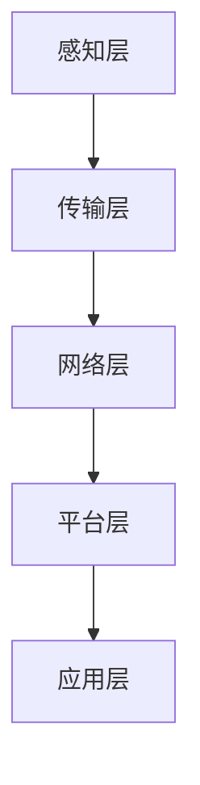
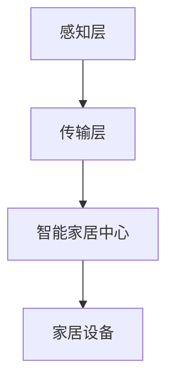
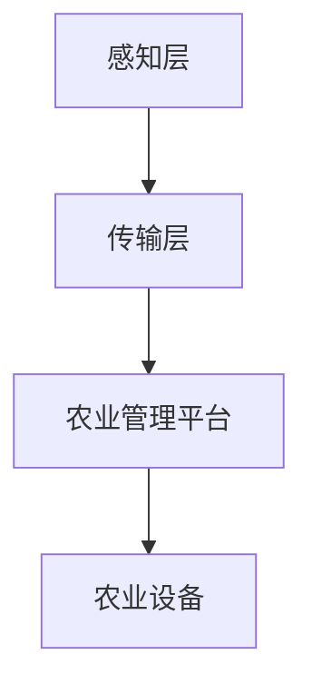
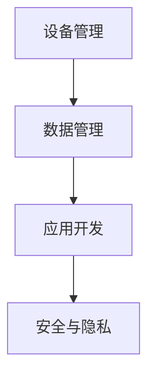
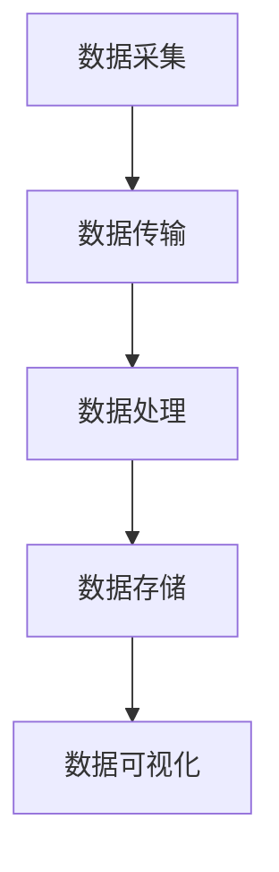
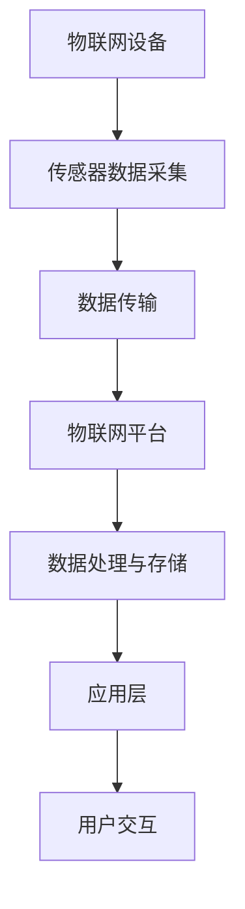
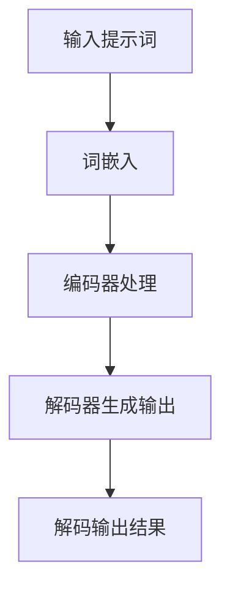
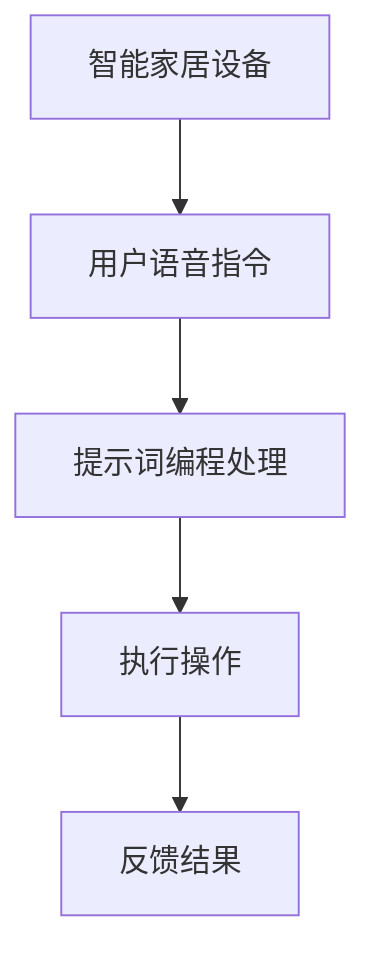
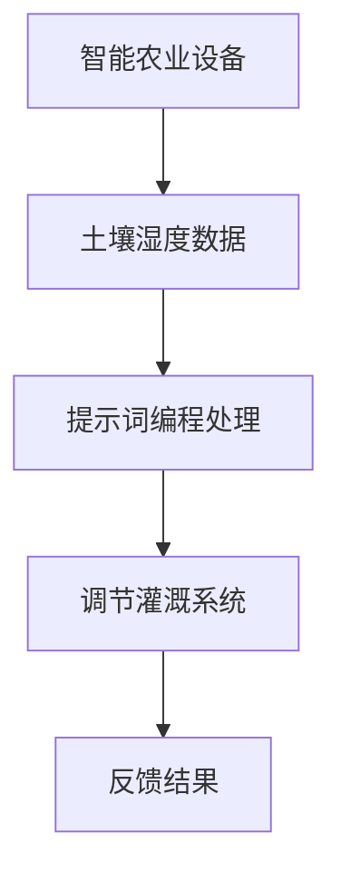

                 

### 《提示词编程在物联网应用中的角色》

> **关键词：** 物联网、提示词编程、设备应用、平台应用、技术基础、应用实战、未来展望

> **摘要：** 本文深入探讨了提示词编程在物联网中的应用。从概述到技术基础，再到应用实战和未来展望，详细分析了提示词编程在物联网设备与平台中的角色，以及其未来的发展趋势和挑战。

---

**作者：** AI天才研究院/AI Genius Institute & 禅与计算机程序设计艺术 /Zen And The Art of Computer Programming

---

### 《提示词编程在物联网应用中的角色》目录大纲

1. **概述**
   1.1 物联网的基本概念与架构
   1.2 提示词编程的概念与特点
   1.3 物联网应用中的提示词编程角色

2. **技术基础**
   2.1 物联网基本架构
   2.2 提示词编程原理与实现

3. **应用实战**
   3.1 提示词编程在物联网设备中的应用
   3.2 提示词编程在物联网平台中的应用

4. **展望与趋势**
   4.1 物联网与提示词编程的发展趋势
   4.2 提示词编程在物联网应用中的挑战与机遇
   4.3 未来物联网应用中的提示词编程角色

5. **附录**
   5.1 主流物联网开发平台介绍
   5.2 提示词编程工具与资源推荐
   5.3 提示词编程与物联网应用中的 Mermaid 流程图

---

### 第一部分：概述

#### 第1章 提示词编程与物联网概述

##### 1.1 物联网的基本概念与架构

###### 1.1.1 物联网的定义与分类

物联网（Internet of Things，简称 IoT）是指通过信息传感设备（如传感器、射频识别（RFID）等）实时采集任何需要监控、连接、互动的物体或过程，采集的数据通过移动通信网络、互联网或专网传输，最终通过数据管理中心和云计算平台进行数据处理，实现对物品和过程的智能化识别、定位、跟踪、监控和管理的一种网络系统。

根据物联网的应用领域和特点，可以将其分为以下几类：

1. **智能家居**：家庭设备互联，实现智能控制和管理，如智能灯光、智能家电、智能安防等。
2. **智能交通**：包括车辆管理、交通信号控制、交通流量监测等，实现道路安全与效率优化。
3. **智能农业**：利用传感器和物联网技术对农业生产过程中的土壤、水质、气象等参数进行监测和管理，实现精准农业。
4. **智能医疗**：远程医疗监护、智能穿戴设备、智能药物管理等，提高医疗服务质量和效率。
5. **智能工业**：工业自动化、设备监控、生产优化等，提高生产效率和产品质量。

###### 1.1.2 物联网的关键技术

物联网的实现涉及多个关键技术，主要包括以下几个方面：

1. **传感器技术**：用于感知环境信息和物理现象，包括温度、湿度、光照、压力、速度等。
2. **射频识别（RFID）技术**：通过射频信号识别特定目标并读写数据，广泛应用于物品追踪和管理。
3. **无线通信技术**：用于数据传输，包括蓝牙、Wi-Fi、ZigBee、LoRa等。
4. **数据处理与存储技术**：对物联网采集的数据进行处理和分析，通常利用云计算和大数据技术。
5. **网络安全技术**：确保物联网设备之间的通信和数据安全，包括数据加密、访问控制、安全协议等。

##### 1.2 提示词编程的概念与特点

提示词编程（Prompt Programming）是一种基于提示词（prompt）的人工智能编程方法，通过输入特定的提示词，引导模型生成目标输出。这种方法的优势在于：

1. **易用性**：用户只需提供简短的提示词，模型即可生成相应的代码或执行特定任务，降低了编程门槛。
2. **灵活性**：提示词编程可以根据不同的场景和需求灵活调整，实现多样化的任务。
3. **高效性**：提示词编程能够快速生成结果，节省开发时间和成本。

提示词编程的基本原理是利用预训练的深度学习模型，如生成对抗网络（GAN）、变换器（Transformer）等，通过输入提示词，模型会自动生成相应的文本、代码或其他形式的输出。

##### 1.3 物联网应用中的提示词编程角色

在物联网应用中，提示词编程扮演着重要的角色，主要表现在以下几个方面：

1. **设备控制**：通过输入提示词，用户可以远程控制物联网设备，如开关家居设备、调节温度等。
2. **数据处理**：提示词编程可以帮助用户对物联网采集的数据进行预处理、分析和可视化，提高数据利用效率。
3. **应用开发**：提示词编程可以快速生成物联网应用的核心代码，如数据采集模块、控制模块等，加速应用开发过程。
4. **平台优化**：提示词编程可以用于优化物联网平台的性能和功能，如数据存储、处理和传输等。

综上所述，提示词编程在物联网应用中具有广泛的应用前景，有助于提高物联网系统的智能化水平，推动物联网技术的发展。

#### 第2章 物联网架构与提示词编程

##### 2.1 物联网基本架构

物联网的基本架构可以分为以下几个层次：

1. **感知层**：包括各种传感器和感知设备，用于收集环境信息。这些设备可以感知温度、湿度、光照、压力、速度等各种物理量，并将数据转换为数字信号。

2. **传输层**：包括无线通信模块和网络传输设备，如无线传感器网络（WSN）、移动通信网络、互联网等，用于将感知层采集的数据传输到数据处理层。

3. **网络层**：包括物联网网关、路由器等设备，用于实现感知层和数据处理层之间的数据传输和协议转换。

4. **数据处理层**：包括数据存储设备、云计算平台等，用于对物联网采集的数据进行处理、分析和存储。

5. **应用层**：包括各种物联网应用系统，如智能家居、智能交通、智能医疗等，用于实现物联网应用的具体功能。

##### 2.2 提示词编程原理与实现

提示词编程的基本原理是基于预训练的深度学习模型，如生成对抗网络（GAN）、变换器（Transformer）等。这些模型具有强大的文本生成能力，可以根据输入的提示词生成相应的文本、代码或其他形式的输出。

提示词编程的实现主要包括以下几个步骤：

1. **数据收集**：收集与物联网应用相关的数据，包括设备控制命令、数据处理算法、应用场景描述等。

2. **模型训练**：使用收集到的数据对预训练的深度学习模型进行微调训练，使其能够根据输入的提示词生成对应的输出。

3. **提示词输入**：用户输入简短的提示词，如“控制智能家居设备”、“处理环境数据”等。

4. **代码生成**：模型根据输入的提示词生成相应的代码或文本输出，如设备控制脚本、数据处理算法等。

5. **代码执行**：生成的代码在物联网设备或平台上执行，实现具体的功能。

以下是一个简单的提示词编程实现示例：

```python
# 示例：输入提示词“控制灯光开关”，生成控制灯光的代码

# 定义提示词
prompt = "控制灯光开关"

# 调用提示词编程模型
output_code = prompt_programming_model(prompt)

# 输出生成的代码
print(output_code)
```

生成的代码可能如下所示：

```python
# 控制灯光开关
import iothub_client

# 创建IoT Hub客户端
client = iothub_client.IoT HubClient()

# 定义灯光开关命令
switch_on_command = {
    "deviceId": "light_bulb",
    "command": "turnOn"
}

# 发送开关命令
client.send_message(switch_on_command)
```

通过以上步骤，提示词编程可以实现快速生成物联网应用的核心代码，提高开发效率。

##### 2.3 提示词编程的优势与应用场景

提示词编程在物联网应用中具有以下几个优势：

1. **易用性**：用户只需提供简短的提示词，模型即可生成相应的代码或执行特定任务，降低了编程门槛。

2. **灵活性**：提示词编程可以根据不同的场景和需求灵活调整，实现多样化的任务。

3. **高效性**：提示词编程能够快速生成结果，节省开发时间和成本。

基于以上优势，提示词编程适用于以下应用场景：

1. **设备控制**：通过输入提示词，用户可以远程控制物联网设备，如开关家居设备、调节温度等。

2. **数据处理**：提示词编程可以帮助用户对物联网采集的数据进行预处理、分析和可视化，提高数据利用效率。

3. **应用开发**：提示词编程可以快速生成物联网应用的核心代码，如数据采集模块、控制模块等，加速应用开发过程。

4. **平台优化**：提示词编程可以用于优化物联网平台的性能和功能，如数据存储、处理和传输等。

综上所述，提示词编程在物联网应用中具有广泛的应用前景，有助于提高物联网系统的智能化水平，推动物联网技术的发展。

---

### 第二部分：技术基础

#### 第2章 物联网架构与提示词编程

在深入探讨物联网架构与提示词编程之前，我们需要先理解它们的基本概念和相互关系。

##### 2.1 物联网基本架构

物联网的架构通常包括感知层、传输层、网络层、平台层和应用层。

1. **感知层**：这是物联网架构的底层，由各种传感器和感知设备组成。这些设备能够实时采集各种物理量，如温度、湿度、光照、压力、速度等，并将这些信息转换为数字信号。

2. **传输层**：负责将感知层采集到的数据传输到网络层。传输层包括无线通信模块和网络传输设备，如无线传感器网络（WSN）、移动通信网络（如4G/5G）、Wi-Fi、蓝牙等。

3. **网络层**：网络层由物联网网关、路由器等设备组成，负责实现感知层和平台层之间的数据传输和协议转换。

4. **平台层**：平台层是物联网的核心，包括数据存储、处理、分析和共享等功能。平台层通常利用云计算和大数据技术，对物联网设备采集的海量数据进行分析和处理。

5. **应用层**：应用层是物联网架构的顶层，包括各种物联网应用系统，如智能家居、智能交通、智能医疗、智能工业等。

下面是一个简单的物联网架构的Mermaid流程图：



##### 2.2 提示词编程原理与实现

提示词编程（Prompt Programming）是一种利用提示词（prompt）来引导模型生成文本、代码或其他形式输出的编程方法。在物联网应用中，提示词编程具有独特的优势，可以显著提高开发效率和灵活性。

提示词编程的基本原理如下：

1. **模型训练**：首先，使用大量的数据集对预训练的深度学习模型进行训练，这些数据集通常包括与物联网应用相关的文本、代码、命令等。预训练模型可以是生成对抗网络（GAN）、变换器（Transformer）等。

2. **提示词输入**：用户输入简短的提示词，如“控制灯光开关”、“读取温度数据”等。

3. **模型生成**：预训练模型根据输入的提示词生成相应的输出，如控制脚本、数据处理算法等。

4. **代码执行**：生成的代码在物联网设备或平台上执行，实现具体的功能。

以下是一个简单的提示词编程实现的伪代码示例：

```python
# 提示词编程伪代码示例

# 输入提示词
prompt = "控制灯光开关"

# 调用提示词编程模型
output_code = prompt_programming_model(prompt)

# 输出生成的代码
print(output_code)
```

生成的代码可能如下所示：

```python
# 控制灯光开关
import iothub_client

# 创建IoT Hub客户端
client = iothub_client.IoT HubClient()

# 定义灯光开关命令
switch_on_command = {
    "deviceId": "light_bulb",
    "command": "turnOn"
}

# 发送开关命令
client.send_message(switch_on_command)
```

##### 2.3 提示词编程的核心算法

提示词编程的核心算法通常是基于生成式模型，如变换器（Transformer）模型。变换器模型是一种能够处理变长序列的强大模型，其核心思想是自注意力机制（self-attention）。

以下是一个简化的变换器模型的伪代码，用于生成代码：

```python
# 变换器模型伪代码示例

# 输入提示词序列
prompt_sequence = "控制灯光开关"

# 定义变换器模型
transformer_model = TransformerModel()

# 进行编码
encoded_prompt = transformer_model.encode(prompt_sequence)

# 使用自注意力机制生成输出序列
output_sequence = transformer_model.decode(encoded_prompt)

# 输出生成的代码
print(output_sequence)
```

在变换器模型中，自注意力机制的关键步骤如下：

1. **输入嵌入**：将输入的提示词序列转换为嵌入向量。
2. **自注意力**：计算每个输入嵌入向量与其他所有输入嵌入向量之间的注意力分数，并加权求和，得到每个嵌入向量的上下文表示。
3. **解码**：使用上下文表示生成输出序列。

自注意力机制的伪代码如下：

```python
# 自注意力机制伪代码示例

# 输入嵌入向量
input_embeddings = ...

# 计算自注意力分数
attention_scores = calculate_attention_scores(input_embeddings)

# 加权求和得到上下文表示
contextual_embeddings = weighted_sum(input_embeddings, attention_scores)

# 输出上下文表示
return contextual_embeddings
```

通过这些核心算法，提示词编程能够实现高效的代码生成，为物联网应用开发提供强大的支持。

---

### 第三部分：应用实战

#### 第3章 提示词编程在物联网设备中的应用

提示词编程在物联网设备中的应用主要集中在设备控制、数据处理和实时交互等方面。以下将通过具体案例来展示提示词编程在实际应用中的实现方法和效果。

##### 3.1 提示词编程在智能家居中的应用

智能家居系统是物联网应用的一个重要领域，通过提示词编程可以实现用户与家居设备之间的自然语言交互，提升用户体验。以下是一个智能家居系统中的具体案例：

###### 3.1.1 智能家居系统的架构

智能家居系统的架构通常包括以下几个部分：

1. **感知层**：由各种传感器组成，如温度传感器、湿度传感器、灯光传感器、门锁传感器等，用于采集家庭环境数据。
2. **传输层**：负责将传感器数据传输到智能家居中心，常用的通信协议有Wi-Fi、ZigBee、蓝牙等。
3. **智能家居中心**：负责处理传感器数据，并基于用户输入的提示词生成相应的控制命令，通过物联网网关将命令发送到家居设备。
4. **家居设备**：包括灯光、空调、门锁、摄像头等智能设备，用于执行用户指令。

下面是一个智能家居系统架构的Mermaid流程图：



###### 3.1.2 提示词编程在智能家居设备中的实现

假设用户想要通过语音指令控制灯光的开关，使用提示词编程可以轻松实现这一功能。以下是一个具体的实现过程：

1. **数据收集**：首先，需要收集与智能家居控制相关的数据，包括灯光控制命令、控制协议、传感器数据等。
2. **模型训练**：使用收集到的数据对预训练的变换器模型进行微调，使其能够根据输入的提示词生成相应的控制代码。
3. **提示词输入**：用户输入提示词，如“打开卧室的灯光”。
4. **代码生成**：模型根据提示词生成相应的控制代码，如发送一个开启灯光的指令。
5. **代码执行**：生成的控制代码被发送到智能家居中心，智能家居中心解析指令并发送到灯光设备执行。

以下是一个具体的代码生成和执行过程：

```python
# 假设用户输入提示词
prompt = "打开卧室的灯光"

# 调用提示词编程模型
control_code = prompt_programming_model(prompt)

# 输出生成的代码
print(control_code)

# 假设生成的代码为：
control_code = '''
import iothub_client
client = iothub_client.IoT HubClient()
command = {
    "deviceId": "light_bedroom",
    "command": "turnOn"
}
client.send_message(command)
'''

# 执行代码
exec(control_code)
```

执行结果将是灯光设备的开启。

###### 3.1.3 智能家居应用案例

以下是一个智能家居应用案例，通过提示词编程实现用户与家居设备之间的自然语言交互：

**案例描述**：用户通过语音助手发出指令，控制家中灯光的开关。

**实现步骤**：

1. **用户输入**：用户通过语音助手说“打开客厅的灯光”。
2. **语音识别**：语音助手将语音转换为文本，并将文本传递给提示词编程模型。
3. **代码生成**：提示词编程模型生成控制灯光开关的代码。
4. **代码执行**：生成的代码被发送到智能家居中心，智能家居中心解析指令并发送到灯光设备执行。

**效果展示**：

- 当用户说“打开客厅的灯光”时，语音助手识别到指令并传递给提示词编程模型。
- 提示词编程模型生成如下代码：
  ```python
  import iothub_client
  client = iothub_client.IoT HubClient()
  command = {
      "deviceId": "light_livingroom",
      "command": "turnOn"
  }
  client.send_message(command)
  ```
- 智能家居中心执行上述代码，发送开启客厅灯光的指令。
- 客厅的灯光根据接收到的指令自动打开。

通过上述案例，我们可以看到提示词编程在智能家居设备中的应用是如何简化用户操作，提高家居智能化水平的。

##### 3.2 提示词编程在智能农业中的应用

智能农业是物联网技术的重要应用领域，通过提示词编程可以实现农业设备的自动化控制和数据监控，提高农业生产效率和作物品质。以下是一个智能农业系统的应用案例：

###### 3.2.1 智能农业系统的架构

智能农业系统的架构通常包括以下几个部分：

1. **感知层**：由各种传感器组成，如土壤湿度传感器、温度传感器、气象传感器等，用于监测作物生长环境和土壤状况。
2. **传输层**：负责将传感器数据传输到农业管理平台，常用的通信协议有LoRa、Wi-Fi、4G/5G等。
3. **农业管理平台**：负责处理传感器数据，并根据提示词编程生成的控制命令对农业设备进行远程控制。
4. **农业设备**：包括喷灌系统、施肥系统、无人机等，用于执行农业生产任务。

下面是一个智能农业系统架构的Mermaid流程图：



###### 3.2.2 提示词编程在智能农业设备中的实现

假设农民需要根据土壤湿度数据自动调节喷灌系统的运行，使用提示词编程可以简化这一过程。以下是一个具体的实现过程：

1. **数据收集**：首先，需要收集与喷灌系统控制相关的数据，包括土壤湿度阈值、喷灌系统控制协议等。
2. **模型训练**：使用收集到的数据对预训练的变换器模型进行微调，使其能够根据输入的提示词生成相应的控制代码。
3. **提示词输入**：用户输入提示词，如“根据土壤湿度自动调节喷灌系统”。
4. **代码生成**：模型根据提示词生成相应的控制代码，如调节喷灌系统开启和关闭的时间。
5. **代码执行**：生成的控制代码被发送到农业管理平台，农业管理平台解析指令并控制喷灌系统执行。

以下是一个具体的代码生成和执行过程：

```python
# 假设用户输入提示词
prompt = "根据土壤湿度自动调节喷灌系统"

# 调用提示词编程模型
control_code = prompt_programming_model(prompt)

# 输出生成的代码
print(control_code)

# 假设生成的代码为：
control_code = '''
import iothub_client
import time

client = iothub_client.IoT HubClient()
while True:
    # 假设土壤湿度阈值设置为50%
    soil_humidity_threshold = 50
    # 获取当前土壤湿度
    current_humidity = get_soil_humidity()
    if current_humidity < soil_humidity_threshold:
        command = {
            "deviceId": "irrigation_system",
            "command": "turnOn"
        }
        client.send_message(command)
        time.sleep(3600)  # 喷灌一小时
    else:
        command = {
            "deviceId": "irrigation_system",
            "command": "turnOff"
        }
        client.send_message(command)
        time.sleep(3600)  # 停止一小时
```

执行结果将是根据土壤湿度自动调节喷灌系统的开启和关闭。

###### 3.2.3 智能农业应用案例

以下是一个智能农业应用案例，通过提示词编程实现土壤湿度自动监测和喷灌系统的智能控制：

**案例描述**：农田的土壤湿度低于设定阈值时，自动启动喷灌系统进行灌溉。

**实现步骤**：

1. **用户输入**：用户通过农业管理平台输入提示词“自动调节喷灌系统，根据土壤湿度阈值50%”。
2. **提示词编程处理**：提示词编程模型生成控制喷灌系统的代码。
3. **代码执行**：生成的代码被发送到农业管理平台，农业管理平台解析指令并控制喷灌系统执行。

**效果展示**：

- 当农田土壤湿度低于50%时，系统自动启动喷灌系统进行灌溉。
- 当土壤湿度恢复到50%以上时，系统自动停止喷灌。

通过提示词编程，智能农业系统实现了自动化控制，显著提高了农业生产效率和资源利用率。

---

#### 第4章 提示词编程在物联网平台中的应用

提示词编程在物联网平台中的应用主要体现在平台架构设计、数据采集与处理、以及应用层的开发与优化等方面。以下将详细探讨这些应用场景及其实际案例。

##### 4.1 提示词编程在物联网平台架构设计中的应用

物联网平台的架构设计是一个复杂的过程，涉及到多个组件和技术的集成。提示词编程可以帮助开发者在设计阶段快速生成和优化平台架构，提高开发效率和系统性能。

###### 4.1.1 物联网平台的基本架构

一个典型的物联网平台通常包括以下几个主要部分：

1. **设备管理**：负责设备的接入、配置和监控，确保设备正常运行。
2. **数据管理**：负责数据的采集、存储、处理和分析，提供数据可视化和报表功能。
3. **应用开发**：提供开发环境和工具，支持开发者创建和管理物联网应用。
4. **安全与隐私**：确保平台的安全性和用户数据的隐私保护。

下面是一个简单的物联网平台架构的Mermaid流程图：



###### 4.1.2 提示词编程在物联网平台中的实现

在物联网平台架构设计过程中，提示词编程可以通过以下步骤实现：

1. **需求分析**：收集用户需求和功能要求，确定平台的基本架构。
2. **提示词输入**：输入简短的提示词，如“设计一个智能家居物联网平台”。
3. **模型生成**：提示词编程模型根据提示词生成平台架构的设计文档和代码。
4. **代码优化**：根据生成的代码进行优化，确保平台的性能和可扩展性。

以下是一个简单的提示词编程实现的示例：

```python
# 假设用户输入提示词
prompt = "设计一个智能家居物联网平台"

# 调用提示词编程模型
platform_architecture = prompt_programming_model(prompt)

# 输出平台架构
print(platform_architecture)
```

生成的平台架构可能包括以下关键组件：

1. **设备管理模块**：用于设备接入和监控。
2. **数据存储模块**：用于数据采集和存储。
3. **数据处理模块**：用于数据处理和分析。
4. **应用开发环境**：提供开发工具和框架。

通过这种方式，提示词编程可以帮助开发者快速构建物联网平台的基本架构，减少设计时间和人力成本。

###### 4.1.3 物联网平台应用案例

以下是一个物联网平台应用案例，通过提示词编程实现智能家居物联网平台的设计和开发：

**案例描述**：设计并开发一个智能家居物联网平台，支持设备接入、数据采集和实时控制。

**实现步骤**：

1. **用户输入**：用户输入提示词“设计并开发一个智能家居物联网平台”。
2. **提示词编程处理**：提示词编程模型生成平台架构的设计文档和代码。
3. **代码实现**：开发团队根据生成的代码进行实际开发和优化。
4. **测试与部署**：对平台进行测试和部署，确保系统稳定运行。

**效果展示**：

- 平台设计文档和代码生成：提示词编程模型生成了一个详细的设计文档，包括设备管理、数据管理、应用开发和安全与隐私等模块。
- 设备接入与监控：平台能够自动接入新的智能家居设备，并对设备运行状态进行实时监控。
- 数据采集与处理：平台能够采集设备数据，并进行分析和处理，提供数据可视化功能。
- 实时控制：用户可以通过平台实时控制智能家居设备，如开关灯光、调节温度等。

通过提示词编程，智能家居物联网平台的设计和开发过程得到了显著简化，提升了开发效率和系统性能。

##### 4.2 提示词编程在物联网数据采集与处理中的应用

物联网数据采集与处理是物联网平台的核心功能之一，涉及到大量的数据处理任务。提示词编程可以通过自动化和智能化的方式，简化数据采集和处理过程，提高数据处理效率。

###### 4.2.1 物联网数据采集与处理的挑战

物联网数据采集与处理面临以下几个挑战：

1. **数据量巨大**：物联网设备每天会产生海量数据，需要高效的数据处理技术。
2. **数据多样性**：物联网数据包括文本、图像、音频等多种类型，需要不同的处理方法。
3. **数据实时性**：物联网应用通常要求实时处理数据，确保系统响应迅速。
4. **数据安全性**：物联网数据涉及用户隐私和设备安全，需要严格的安全措施。

下面是一个物联网数据采集与处理流程的Mermaid流程图：



###### 4.2.2 提示词编程在数据采集与处理中的应用

提示词编程在物联网数据采集与处理中的应用包括以下方面：

1. **数据采集脚本生成**：根据提示词，提示词编程模型可以生成数据采集脚本，自动化数据采集过程。
2. **数据处理算法生成**：提示词编程模型可以根据提示词生成数据处理算法，包括数据清洗、转换、聚合等。
3. **实时数据处理**：提示词编程模型可以优化实时数据处理流程，提高数据处理速度和效率。
4. **数据安全策略生成**：提示词编程模型可以生成数据安全策略，包括数据加密、访问控制等。

以下是一个简单的数据处理算法生成的示例：

```python
# 假设用户输入提示词
prompt = "生成温度数据的平均值计算算法"

# 调用提示词编程模型
algorithm = prompt_programming_model(prompt)

# 输出算法
print(algorithm)
```

生成的算法可能如下所示：

```python
# 温度数据平均值计算算法
import numpy as np

def calculate_average_temperature(data):
    return np.mean(data)

# 假设输入的数据为
temperature_data = [23, 25, 22, 24]

# 调用算法计算平均值
average_temperature = calculate_average_temperature(temperature_data)

# 输出结果
print("平均温度：", average_temperature)
```

通过这种方式，提示词编程可以大大简化数据采集和处理过程，提高系统的自动化水平和数据处理效率。

###### 4.2.3 数据采集与处理应用案例

以下是一个数据采集与处理应用案例，通过提示词编程实现智能农业数据的实时监控和优化：

**案例描述**：智能农业平台需要实时监控农田的土壤湿度数据，并基于数据自动调整灌溉系统。

**实现步骤**：

1. **用户输入**：用户输入提示词“实时监控土壤湿度数据，自动调整灌溉系统”。
2. **提示词编程处理**：提示词编程模型生成数据采集和处理脚本。
3. **代码实现**：开发团队根据生成的脚本进行实际开发和优化。
4. **测试与部署**：对系统进行测试和部署，确保数据采集和处理过程稳定高效。

**效果展示**：

- 实时监控：平台能够实时采集农田的土壤湿度数据，并上传至云端。
- 数据处理：平台使用提示词编程生成的算法计算土壤湿度的平均值和趋势。
- 自动调整：根据计算结果，平台自动调整灌溉系统的运行时间，确保土壤湿度在适宜范围内。

通过提示词编程，智能农业平台的实时数据采集和处理能力得到了显著提升，提高了农业生产效率和资源利用率。

---

### 第四部分：展望与趋势

#### 第5章 提示词编程在物联网应用中的未来展望

随着物联网技术的快速发展和人工智能的深入融合，提示词编程在物联网应用中的角色将变得更加重要和多样化。以下将从物联网技术的发展趋势、提示词编程技术的演进方向以及提示词编程在物联网应用中的挑战和机遇等方面进行探讨。

##### 5.1 物联网与提示词编程的发展趋势

物联网技术的发展趋势主要体现在以下几个方面：

1. **设备数量爆炸性增长**：随着物联网设备的普及，设备数量将呈指数级增长。根据市场研究机构的预测，全球物联网设备数量将在未来几年内达到数百亿级。

2. **数据传输速度的提升**：5G、6G等新一代通信技术的商用化，将极大地提升物联网设备的数据传输速度和通信质量，为实时数据处理和应用提供更好的支持。

3. **边缘计算的发展**：为了应对物联网设备产生的海量数据，边缘计算技术将在物联网中得到广泛应用。边缘计算可以将数据处理任务从云端转移到设备端或边缘节点，实现更快的数据处理和更低的延迟。

4. **物联网安全的增强**：随着物联网设备的增加，网络安全问题日益突出。物联网安全技术的发展，包括加密技术、访问控制、安全协议等，将有助于保障物联网设备和数据的安全。

提示词编程技术的发展趋势主要包括：

1. **模型复杂度的提升**：随着深度学习技术的不断发展，提示词编程所使用的模型将变得更加复杂和高效，如多模态变换器（Multimodal Transformer）等。

2. **泛化能力的增强**：提示词编程模型将具备更强的泛化能力，能够处理更广泛的应用场景和任务类型。

3. **自动化程度的提高**：提示词编程将进一步实现自动化，用户只需提供简短的提示词，系统即可自动生成相应的代码和执行任务。

4. **可解释性的增强**：提示词编程模型的可解释性将得到提升，用户可以更好地理解模型的工作原理和决策过程。

##### 5.2 提示词编程在物联网应用中的挑战与机遇

提示词编程在物联网应用中面临以下挑战：

1. **数据隐私保护**：物联网设备采集的数据涉及用户隐私，如何确保数据在传输和处理过程中的安全性是一个重要挑战。

2. **实时性要求**：物联网应用通常对实时性有较高要求，如何在保证实时性的同时处理海量数据是一个技术难题。

3. **异构设备兼容性**：物联网设备种类繁多，如何保证提示词编程模型在不同设备和操作系统上的兼容性是一个挑战。

然而，这些挑战也带来了巨大的机遇：

1. **智能化水平提升**：通过提示词编程，物联网设备的智能化水平将得到显著提升，为用户提供更加智能化的服务。

2. **开发效率提高**：提示词编程可以大幅提高物联网应用的开发效率，降低开发成本和人力投入。

3. **跨领域应用拓展**：提示词编程技术的成熟将推动物联网在更多领域的应用，如智能医疗、智能交通、智能能源等。

##### 5.3 未来物联网应用中的提示词编程角色

在未来物联网应用中，提示词编程将扮演以下角色：

1. **智能设备控制**：通过输入简短的提示词，用户可以轻松控制各种物联网设备，实现远程管理和自动化操作。

2. **数据处理与优化**：提示词编程将帮助物联网平台自动化数据采集、处理和分析过程，提升数据处理效率和质量。

3. **应用开发**：提示词编程将简化物联网应用开发流程，开发者可以快速生成应用的核心代码，加速应用交付。

4. **平台优化**：提示词编程可以帮助物联网平台优化性能和功能，提高系统的可靠性和稳定性。

总之，随着物联网和提示词编程技术的不断发展，提示词编程在物联网应用中的角色将越来越重要，为物联网技术的创新和应用提供强大的支持。

---

### 附录

#### 附录A 主流物联网开发平台介绍

物联网开发平台的选用对于项目的成功至关重要。以下将介绍几款主流的物联网开发平台，包括其选择标准、主要功能和特点。

##### A.1 主流物联网开发平台的选择标准

选择物联网开发平台时，需要考虑以下标准：

1. **功能完备性**：平台是否具备设备管理、数据采集、数据处理、应用开发等基本功能。
2. **易用性**：平台的用户界面是否友好，是否支持可视化编程和拖拽操作。
3. **性能和可扩展性**：平台的性能是否满足需求，是否支持大规模设备的接入和数据处理。
4. **安全性和可靠性**：平台是否提供全面的安全措施，如数据加密、访问控制和故障恢复等。
5. **生态系统和社区支持**：平台是否有丰富的生态资源和活跃的开发者社区，是否提供学习资源和文档。

##### A.2 主流物联网开发平台对比

以下是比较几款主流物联网开发平台的主要功能和特点：

1. **阿里云物联网平台**：
   - **功能完备**：提供设备管理、数据采集、数据处理、应用开发等功能。
   - **易用性**：支持可视化编程和拖拽操作，用户界面友好。
   - **性能和可扩展性**：支持大规模设备接入，提供分布式架构和弹性伸缩功能。
   - **安全性和可靠性**：提供数据加密、访问控制、多租户隔离等安全措施。
   - **生态系统和社区支持**：拥有庞大的开发者社区，提供丰富的文档和学习资源。

2. **华为物联网平台**：
   - **功能完备**：提供设备管理、数据采集、数据处理、应用开发等功能。
   - **易用性**：支持可视化编程和拖拽操作，提供智能设备连接和自动配置功能。
   - **性能和可扩展性**：提供高性能边缘计算能力，支持大规模设备接入和分布式数据处理。
   - **安全性和可靠性**：提供多层次的安全防护措施，如设备认证、数据加密、访问控制等。
   - **生态系统和社区支持**：拥有丰富的物联网解决方案和合作伙伴，提供全面的开发文档和社区支持。

3. **腾讯云物联网平台**：
   - **功能完备**：提供设备管理、数据采集、数据处理、应用开发等功能。
   - **易用性**：支持可视化编程和拖拽操作，提供设备连接、数据监控和可视化分析功能。
   - **性能和可扩展性**：支持海量设备接入和实时数据处理，提供弹性伸缩和分布式架构。
   - **安全性和可靠性**：提供全面的安全防护措施，如数据加密、访问控制、隐私保护等。
   - **生态系统和社区支持**：拥有活跃的开发者社区，提供丰富的文档、教程和实例。

##### A.3 主流物联网开发平台推荐

根据上述对比，以下推荐几款主流物联网开发平台：

1. **阿里云物联网平台**：适用于需要大规模设备接入和数据处理的企业级应用，特别是智能家居、智慧城市等领域。
2. **华为物联网平台**：适用于需要高性能边缘计算和可靠安全性的企业级应用，如智能工业、智能医疗等领域。
3. **腾讯云物联网平台**：适用于中小型企业，特别是需要快速开发和部署物联网应用的开发者。

总之，选择合适的物联网开发平台对于项目的成功至关重要。通过了解主流平台的优缺点，开发者可以根据实际需求和资源选择最合适的平台，实现高效的物联网应用开发。

---

### 附加内容：提示词编程与物联网应用中的 Mermaid 流程图

在本文中，我们使用Mermaid绘制了多个流程图，以展示物联网架构、提示词编程原理以及应用案例。以下是这些流程图的详细描述：

#### 第1章 物联网架构与提示词编程

1. **物联网架构流程图**：



- **A[物联网设备]**：各种传感器和执行器，用于数据采集和执行操作。
- **B[传感器数据采集]**：物联网设备采集环境数据，如温度、湿度、光照等。
- **C[数据传输]**：数据通过无线通信模块传输到物联网平台。
- **D[物联网平台]**：负责数据存储、处理和分发。
- **E[数据处理与存储]**：物联网平台对数据进行处理和存储，如数据分析、数据可视化等。
- **F[应用层]**：应用层实现具体的功能，如智能控制、预测分析等。
- **G[用户交互]**：用户通过应用层与物联网平台进行交互，获取信息和控制设备。

2. **提示词编程原理流程图**：



- **A[输入提示词]**：用户输入简短的提示词。
- **B[词嵌入]**：将提示词转换为嵌入向量。
- **C[编码器处理]**：编码器对嵌入向量进行处理，生成上下文信息。
- **D[解码器生成输出]**：解码器根据上下文信息生成输出结果，如代码、文本等。
- **E[解码输出结果]**：输出结果，供用户使用或执行操作。

#### 第3章 提示词编程在物联网设备中的应用

3. **智能家居设备流程图**：



- **A[智能家居设备]**：如灯光、空调、门锁等智能设备。
- **B[用户语音指令]**：用户通过语音助手发出控制指令。
- **C[提示词编程处理]**：提示词编程模型解析语音指令，生成相应的控制代码。
- **D[执行操作]**：智能家居设备执行生成的控制代码，如开启灯光、调整温度等。
- **E[反馈结果]**：设备向用户反馈操作结果，如“灯光已开启”。

4. **智能农业设备流程图**：



- **A[智能农业设备]**：如土壤湿度传感器、灌溉系统等。
- **B[土壤湿度数据]**：设备采集土壤湿度数据。
- **C[提示词编程处理]**：提示词编程模型分析湿度数据，生成调节灌溉系统的指令。
- **D[调节灌溉系统]**：灌溉系统根据指令进行自动调节。
- **E[反馈结果]**：系统向用户反馈土壤湿度状况和灌溉状态。

通过这些Mermaid流程图，可以清晰地展示物联网架构和提示词编程的工作原理以及在实际应用中的操作流程，有助于读者更好地理解相关技术。

---

### 总结

通过本文的详细探讨，我们全面了解了提示词编程在物联网应用中的角色和重要性。从概述、技术基础、应用实战到未来展望，我们逐步分析了物联网与提示词编程的相互关系及其在实际应用中的广泛应用场景。

首先，我们介绍了物联网的基本概念与架构，包括感知层、传输层、网络层、平台层和应用层。接着，我们阐述了提示词编程的概念、特点及其在物联网中的优势与应用场景。通过深入探讨物联网架构与提示词编程的原理与实现，我们展示了如何利用提示词编程优化物联网平台的性能和功能。

在应用实战部分，我们通过智能家居和智能农业的具体案例，展示了提示词编程在设备控制、数据处理和实时交互中的实际应用。此外，我们还讨论了提示词编程在物联网平台架构设计、数据采集与处理中的应用，以及其在智能交通、智能医疗等领域的潜在应用场景。

展望未来，随着物联网和人工智能技术的不断进步，提示词编程在物联网应用中的角色将变得更加重要。它不仅将推动物联网技术的创新，还将带来更高效、更智能的物联网解决方案。然而，我们也面临数据隐私保护、实时性要求和异构设备兼容性等挑战。

总之，提示词编程为物联网应用提供了强大的支持，有助于提升物联网系统的智能化水平。随着技术的不断演进，我们期待看到更多创新应用的出现，为人类社会带来更多便利和效益。

