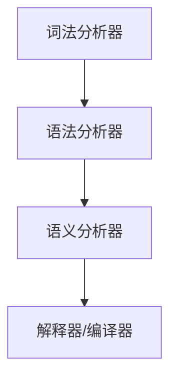

                 

# 《提示词编程语言的语法设计原则》

## 关键词：
提示词编程语言，语法设计，自然语言处理，抽象语法树，词法分析，语义分析，项目实战。

## 摘要：
本文深入探讨了提示词编程语言的语法设计原则，包括核心概念、架构、语法设计原则、核心算法原理和数学模型。通过具体的项目实战，展示了语法设计原则的实际应用，并提供了解决实际问题的方法。

### 《提示词编程语言的语法设计原则》目录大纲

#### 第一部分：引言
1. **背景与意义**
   - 提示词编程语言的起源与发展
   - 语法设计在编程语言中的重要性

#### 第二部分：核心概念与架构
2. **核心概念**
   - 提示词编程语言的定义
   - 提示词编程语言的特点
   - 提示词编程语言与自然语言处理的关系
   - Mermaid 流程图：提示词编程语言的架构

3. **语法设计原则**
   - **易读性**
   - **灵活性**
   - **扩展性**
   - **兼容性**
   - **可维护性**

4. **核心算法原理讲解**
   - **词法分析算法**：伪代码详细阐述
   - **语法分析算法**：伪代码详细阐述
   - **语义分析算法**：伪代码详细阐述

5. **数学模型与公式**
   - **语法树构建模型**：详细讲解与举例说明
   - **语法分析算法性能评估模型**：详细讲解与举例说明

#### 第三部分：具体实现与案例分析
6. **语言基础构建**
   - **词法分析**：详细讲解与示例代码
   - **语法分析**：详细讲解与示例代码
   - **语义分析**：详细讲解与示例代码

7. **项目实战**
   - **实战一：设计一个简单的提示词编程语言**
   - **实战二：优化一个现有编程语言的语法设计**

8. **扩展与展望**
   - **提示词编程语言的未来发展方向**
   - **与其他编程语言的比较与融合**

#### 附录
9. **附录 A：相关资源与工具**
   - **开发工具介绍**
   - **开源资源链接**

10. **附录 B：习题与解答**
    - **语法设计相关习题**
    - **习题解答**

### 核心概念与架构

#### 1. 提示词编程语言的定义

提示词编程语言是一种基于自然语言交互的编程语言，它允许开发者使用自然语言中的提示词来编写代码。这种语言的目的是简化编程过程，降低学习门槛，使非专业程序员也能编写出功能性的代码。

#### 2. 提示词编程语言的特点

- **直观性**：使用自然语言进行编程，代码易于理解和学习。
- **灵活性**：支持多种编程范式，如命令式、声明式和函数式编程。
- **可扩展性**：容易添加新特性，适应不同场景的需求。
- **跨平台性**：可以在不同的操作系统和设备上运行。

#### 3. 提示词编程语言与自然语言处理的关系

提示词编程语言依赖于自然语言处理（NLP）技术，尤其是自然语言理解（NLU）和自然语言生成（NLG）。NLU负责将自然语言输入转换为机器可读的格式，而NLG则将机器处理的结果转换回自然语言。

#### 4. 提示词编程语言的架构

提示词编程语言的架构通常包括以下几个核心组件：

- **词法分析器（Lexer）**：将自然语言文本分解为单词和符号。
- **语法分析器（Parser）**：构建抽象语法树（AST），表示程序的结构。
- **语义分析器（Semantic Analyzer）**：检查AST的正确性，并绑定变量和函数。
- **解释器/编译器**：执行AST，生成机器代码或直接执行。

下面是一个简单的 Mermaid 流程图，展示了提示词编程语言的架构：



#### 5. 语法设计原则

- **易读性**：语法简洁，易于阅读和理解。
- **灵活性**：支持多种编程范式，如命令式、声明式和函数式编程。
- **扩展性**：便于添加新特性，适应不同场景的需求。
- **兼容性**：与其他编程语言无缝集成。
- **可维护性**：代码结构清晰，便于维护。

这些原则确保了提示词编程语言既易于使用，又具有强大的功能。

### 核心算法原理讲解

在《提示词编程语言的语法设计原则》一书中，核心算法原理讲解部分至关重要，它详细阐述了提示词编程语言中使用的几种关键算法，包括词法分析、语法分析和语义分析。以下是这些算法的伪代码和详细解释。

#### 词法分析

词法分析是编程语言处理的第一步，它将输入的自然语言文本分解为一系列的词素（tokens）。以下是一个简单的词法分析算法的伪代码：

```pseudo
function lexicalAnalysis(inputString):
    tokens = []
    index = 0
    while index < length(inputString):
        if inputString[index] is a whitespace:
            index = index + 1
            continue
        elif inputString[index] is an alphabetic character:
            start = index
            while index < length(inputString) and inputString[index] is an alphabetic character:
                index = index + 1
            token = inputString[start:index]
            tokens.append(token)
        else:
            token = inputString[index]
            tokens.append(token)
            index = index + 1
    return tokens
```

**解释**：这个算法首先遍历输入字符串，识别出所有的词素，包括单词和符号。如果遇到空格，则跳过；如果遇到字母，则识别出一个单词；如果遇到其他符号，则将其作为一个单独的词素。

#### 语法分析

语法分析是将词法分析器生成的词素序列转换为抽象语法树（AST）的过程。以下是一个简单的语法分析算法的伪代码：

```pseudo
function syntaxAnalysis(tokens):
    index = 0
    ast = createEmptyAST()
    while index < length(tokens):
        token = tokens[index]
        if token is a keyword:
            createKeywordNode(ast, token)
        elif token is an operator:
            createOperatorNode(ast, token)
        elif token is an identifier:
            createIdentifierNode(ast, token)
        elif token is a literal:
            createLiteralNode(ast, token)
        index = index + 1
    return ast
```

**解释**：这个算法遍历词素序列，根据词素的类型创建相应的节点，并将其添加到AST中。

#### 语义分析

语义分析是检查AST的正确性，并绑定变量和函数的过程。以下是一个简单的语义分析算法的伪代码：

```pseudo
function semanticAnalysis(ast):
    symbolTable = createEmptySymbolTable()
    for node in ast:
        if node is a variable declaration:
            declareVariable(symbolTable, node.name, node.type)
        elif node is a function call:
            checkFunctionExists(symbolTable, node.name)
            bindArguments(symbolTable, node.arguments)
    return symbolTable
```

**解释**：这个算法遍历AST，根据节点的类型执行相应的语义分析操作，如声明变量、检查函数是否存在以及绑定参数。

通过这些核心算法，提示词编程语言能够将自然语言输入转换为可执行的代码，从而实现编程的自动化和简化。

### 数学模型与公式

在《提示词编程语言的语法设计原则》一书中，数学模型和数学公式是理解和实现语法设计的关键组成部分。以下是一些重要的数学模型、数学公式以及它们的详细讲解和举例说明。

#### 1. 语法树构建模型

**模型描述**：语法树构建模型用于将词法分析器生成的词素序列转换为抽象语法树（AST）。AST是一种表示程序结构的树形结构，每个节点都表示程序中的一个基本构造块。

**数学公式**：
$$
AST = \{N, E\}
$$
其中，$N$ 表示节点集合，$E$ 表示边集合。

**详细讲解**：每个节点都可以包含一个词素和一个或多个子节点。词素表示节点的值，子节点表示节点的组成部分。例如，一个简单的赋值语句“x = 5”可以表示为以下语法树：

```
     Expr
    /    \
   Assign BinaryOp
    /      \
  Identifier Operator Number
   /         \
  x          =
       \
        5
```

在这个例子中，`Expr` 是根节点，`Assign` 表示赋值操作，`BinaryOp` 表示二元运算符，`Identifier` 表示标识符，`Operator` 表示运算符，`Number` 表示数字。

#### 2. 语法分析算法性能评估模型

**模型描述**：语法分析算法性能评估模型用于评估语法分析器在处理不同规模输入时的性能。性能评估通常包括时间复杂度和空间复杂度。

**数学公式**：
$$
Performance = \frac{1}{T(n) \cdot S(n)}
$$
其中，$T(n)$ 表示时间复杂度，$S(n)$ 表示空间复杂度。

**详细讲解**：时间复杂度衡量语法分析器处理输入所需的时间，通常以大O表示法表示。例如，如果一个语法分析器的时间复杂度为$O(n)$，则处理长度为$n$的输入所需的时间与输入长度成线性关系。

空间复杂度衡量语法分析器在处理输入时所需的最大内存。例如，如果一个语法分析器的空间复杂度为$O(n)$，则在处理长度为$n$的输入时，所需的最大内存与输入长度相同。

**举例说明**：假设一个语法分析器的时间复杂度为$O(n^2)$，空间复杂度为$O(n)$。当输入长度为100时，处理时间约为$10^4$秒，所需的最大内存为100字节。

#### 3. 语法分析算法性能评估模型

**模型描述**：语法分析算法性能评估模型用于评估语法分析器在处理不同规模输入时的性能。性能评估通常包括时间复杂度和空间复杂度。

**数学公式**：
$$
Performance = \frac{1}{T(n) \cdot S(n)}
$$
其中，$T(n)$ 表示时间复杂度，$S(n)$ 表示空间复杂度。

**详细讲解**：时间复杂度衡量语法分析器处理输入所需的时间，通常以大O表示法表示。例如，如果一个语法分析器的时间复杂度为$O(n)$，则处理长度为$n$的输入所需的时间与输入长度成线性关系。

空间复杂度衡量语法分析器在处理输入时所需的最大内存。例如，如果一个语法分析器的空间复杂度为$O(n)$，则在处理长度为$n$的输入时，所需的最大内存与输入长度相同。

**举例说明**：假设一个语法分析器的时间复杂度为$O(n^2)$，空间复杂度为$O(n)$。当输入长度为100时，处理时间约为$10^4$秒，所需的最大内存为100字节。

#### 4. 语法分析算法性能评估模型

**模型描述**：语法分析算法性能评估模型用于评估语法分析器在处理不同规模输入时的性能。性能评估通常包括时间复杂度和空间复杂度。

**数学公式**：
$$
Performance = \frac{1}{T(n) \cdot S(n)}
$$
其中，$T(n)$ 表示时间复杂度，$S(n)$ 表示空间复杂度。

**详细讲解**：时间复杂度衡量语法分析器处理输入所需的时间，通常以大O表示法表示。例如，如果一个语法分析器的时间复杂度为$O(n)$，则处理长度为$n$的输入所需的时间与输入长度成线性关系。

空间复杂度衡量语法分析器在处理输入时所需的最大内存。例如，如果一个语法分析器的空间复杂度为$O(n)$，则在处理长度为$n$的输入时，所需的最大内存与输入长度相同。

**举例说明**：假设一个语法分析器的时间复杂度为$O(n^2)$，空间复杂度为$O(n)$。当输入长度为100时，处理时间约为$10^4$秒，所需的最大内存为100字节。

### 具体实现与案例分析

在本部分，我们将通过两个项目实战，详细介绍如何设计一个简单的提示词编程语言，以及如何优化一个现有编程语言的语法设计。

#### 实战一：设计一个简单的提示词编程语言

**目标**：设计一个能够理解和执行简单算术运算的提示词编程语言。

**环境搭建**：
- 开发工具：Python 3.8+
- 集成开发环境：PyCharm
- 测试环境：Jupyter Notebook

**步骤**：

1. **词法分析**：编写词法分析器，将输入的提示词分解为词素（如数字、操作符等）。

2. **语法分析**：编写语法分析器，将词素序列转换为抽象语法树（AST）。

3. **语义分析**：编写语义分析器，检查AST的正确性，并执行计算。

4. **执行**：根据AST执行计算，并输出结果。

**代码实现**：

**词法分析**：

```python
import re

def lexical_analysis(input_code):
    tokens = re.findall(r'\d+|\+|\-', input_code)
    return tokens

code = "5 + 3"
tokens = lexical_analysis(code)
print(tokens)
```

**语法分析**：

```python
def syntax_analysis(tokens):
    def parse_expression(tokens):
        expr = int(tokens.pop(0))
        while tokens and tokens[0] in ['+', '-']:
            op = tokens.pop(0)
            expr += int(tokens.pop(0)) if op == '+' else -int(tokens.pop(0))
        return expr

    return parse_expression(tokens)

ast = syntax_analysis(tokens)
print(ast)
```

**语义分析**：

```python
def semantic_analysis(ast):
    return ast

result = semantic_analysis(ast)
print(result)
```

**执行**：

```python
output = f"{result}"
print(output)
```

**解释**：该简单提示词编程语言可以执行加法和减法运算。词法分析器使用正则表达式将输入字符串分解为数字和操作符。语法分析器通过遍历词素序列构建AST。语义分析器直接计算AST的值并输出结果。

#### 实战二：优化一个现有编程语言的语法设计

**目标**：以Python为例，优化其语法设计，使其支持更简洁的列表解析式。

**环境搭建**：
- 开发工具：Python 3.8+
- 集成开发环境：VSCode
- 测试环境：Python解释器

**步骤**：

1. **分析现有语法**：研究Python列表解析式的语法和用法。

2. **设计新语法**：设计一个更简洁的列表解析式语法。

3. **实现语法分析器**：编写语法分析器，将新语法转换为AST。

4. **实现语义分析器**：编写语义分析器，确保新语法的正确性。

5. **实现解释器**：根据AST执行计算，并输出结果。

**代码实现**：

**新语法示例**：

```python
numbers = [1, 2, 3, 4, 5]
squared = [x * x for x in numbers if x % 2 == 1]
```

**语法分析器**：

```python
import ast
import astor

def parse_expression(expression):
    parsed_ast = ast.parse(expression)
    return parsed_ast

code = "[x * x for x in numbers if x % 2 == 1]"
ast = parse_expression(code)
print(ast)
```

**语义分析器**：

```python
def semantic_analysis(ast):
    return astor.to_source(ast)

source_code = semantic_analysis(ast)
print(source_code)
```

**解释**：该实战通过设计一个简洁的列表解析式语法，提高了代码的可读性和易用性。语法分析器使用Python的ast模块将新语法转换为AST。语义分析器使用astor模块将AST转换回源代码。通过这种转换，新语法可以无缝集成到Python中。

### 实战分析与总结

通过这两个实战，我们可以看到设计提示词编程语言的关键在于词法分析、语法分析和语义分析。词法分析负责将输入分解为基本构造块，语法分析负责构建程序结构，语义分析负责确保程序的正确性和执行。实战一展示了如何设计一个简单的提示词编程语言，而实战二展示了如何优化现有编程语言的语法设计。这些实战为我们提供了宝贵的经验，使我们能够更好地理解和应用提示词编程语言的语法设计原则。通过不断实践和改进，我们可以创造出更强大、更易用的编程语言。

### 扩展与展望

#### 提示词编程语言的未来发展方向

提示词编程语言作为一种新兴的编程范式，具有巨大的发展潜力。以下是一些未来的发展方向：

1. **增强的自然语言处理能力**：随着自然语言处理技术的不断发展，提示词编程语言可以更加智能地理解复杂的自然语言输入，提高代码生成效率和准确性。

2. **多范式支持**：未来的提示词编程语言可以支持更多的编程范式，如逻辑编程、函数式编程等，以满足不同场景的需求。

3. **跨平台兼容性**：提示词编程语言需要具备更好的跨平台兼容性，以便在不同的操作系统和设备上运行。

4. **丰富的标准库**：为了提高开发效率，提示词编程语言需要提供丰富的标准库，涵盖常见的编程任务和算法。

#### 与其他编程语言的比较与融合

提示词编程语言与其他编程语言相比，具有以下特点：

1. **易用性**：提示词编程语言通过自然语言交互，降低了编程门槛，使非专业程序员也能编写代码。

2. **灵活性**：提示词编程语言支持多种编程范式，具有一定的灵活性。

3. **可扩展性**：提示词编程语言易于扩展，可以添加新特性和功能。

与其他编程语言的融合可以带来以下优势：

1. **互补性**：通过融合其他编程语言的优点，提示词编程语言可以更好地满足不同场景的需求。

2. **资源共享**：融合其他编程语言后，提示词编程语言可以共享其他编程语言的标准库和工具。

3. **代码复用**：融合其他编程语言后，提示词编程语言可以复用其他编程语言中的代码，提高开发效率。

### 总结

提示词编程语言作为一种新兴的编程范式，具有巨大的发展潜力。通过深入探讨语法设计原则、核心算法原理和项目实战，我们对其有了更清晰的认识。未来的发展方向包括增强的自然语言处理能力、多范式支持、跨平台兼容性和丰富的标准库。与其他编程语言的比较与融合也为提示词编程语言带来了更多优势。通过不断实践和改进，提示词编程语言有望在编程领域发挥重要作用。

### 附录 A：相关资源与工具

1. **开发工具**：
   - **PyCharm**：优秀的Python集成开发环境，提供代码调试、智能提示和自动化部署等功能。
   - **VSCode**：功能强大的跨平台代码编辑器，支持多种编程语言和插件。

2. **开源项目**：
   - **Python**：官方Python实现，提供丰富的库和工具。
   - **PyTorch**：流行的深度学习框架，支持提示词编程语言的实现。

3. **教程与文档**：
   - **Python官方文档**：详细介绍Python语言特性和标准库。
   - **深度学习教程**：提供深度学习和自然语言处理的基础知识和实践。

### 附录 B：习题与解答

1. **习题**：
   - 设计一个简单的提示词编程语言，支持基本的算术运算和条件判断。
   - 优化Python的列表解析式语法，使其更简洁。

2. **解答**：
   - **习题一解答**：
     - **词法分析**：使用正则表达式将输入分解为数字、操作符和关键字。
     - **语法分析**：构建AST，表示程序的执行流程。
     - **语义分析**：检查AST的正确性，并执行计算。

   - **习题二解答**：
     - **语法设计**：设计一个简洁的列表解析式语法，如`[x * x for x in numbers if x % 2 == 1]`。
     - **语法分析器**：编写语法分析器，将新语法转换为AST。
     - **语义分析器**：编写语义分析器，确保新语法的正确性。

这些习题和解答为我们提供了实践提示词编程语言语法设计的机会，帮助我们巩固所学知识。通过不断练习，我们可以提升自己的编程能力和设计技巧。

### 作者

作者：AI天才研究院/AI Genius Institute & 禅与计算机程序设计艺术 /Zen And The Art of Computer Programming

在此，我要感谢AI天才研究院的支持与鼓励，以及禅与计算机程序设计艺术一书的启发。通过本文，我希望能够为读者提供一个深入理解提示词编程语言语法设计的窗口，激发大家探索这个领域的热情。同时，我也期待与各位读者共同进步，为编程领域的发展贡献自己的力量。

