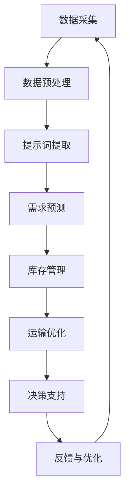

                 

# 引言与背景

智能供应链优化系统作为一种先进的供应链管理工具，正逐步改变着全球企业的运营模式。随着全球化、信息化和大数据技术的快速发展，供应链的复杂性和不确定性日益增加，传统供应链管理方法已经难以满足现代企业的需求。在此背景下，智能供应链优化系统凭借其强大的数据处理能力、精准的预测能力和高效的优化能力，成为企业提升供应链管理效率、降低成本、提高竞争力的关键。

## 智能供应链优化的定义与特点

### 智能供应链的定义

智能供应链（Intelligent Supply Chain）是指利用先进的信息技术、人工智能算法和数据分析方法，对供应链的各个环节进行智能化管理，以提高供应链的整体效率、透明度和响应速度。智能供应链的核心目标是通过数据驱动的决策优化，实现供应链的全程可视化和动态调整。

### 智能供应链的特点

- **数据驱动的决策支持**：智能供应链依靠大数据和人工智能技术，对供应链中的各种数据进行实时分析和挖掘，为决策者提供精准的决策支持。
- **高度的自动化与智能化**：通过自动化设备和智能算法，智能供应链能够实现供应链过程的自动化操作，提高效率和降低人力成本。
- **动态适应性**：智能供应链系统能够根据市场变化和需求波动，快速调整供应链计划，确保供应链的灵活性和响应速度。
- **协同优化**：智能供应链通过整合供应链上下游企业的资源和信息，实现供应链各环节的协同优化，降低整体运营成本。

## 传统供应链的挑战与智能供应链的优势

### 传统供应链的挑战

1. **信息不对称**：传统供应链中，信息传递不及时、不全面，导致供应链上下游企业难以协同工作。
2. **响应速度慢**：供应链过程复杂，涉及多个环节和合作伙伴，使得供应链响应速度慢，难以适应市场需求变化。
3. **成本高**：传统供应链管理依赖于人工操作，成本高且效率低。
4. **库存管理困难**：传统库存管理方式难以精确预测需求，导致库存过多或不足，增加运营成本。

### 智能供应链的优势

1. **提高供应链透明度**：智能供应链通过实时数据监测和共享，提高了供应链的透明度，有助于上下游企业更好地协同工作。
2. **提高响应速度**：智能供应链系统能够快速响应市场需求变化，缩短供应链响应时间。
3. **降低运营成本**：通过自动化和智能化管理，智能供应链能够降低人力成本和运营成本。
4. **优化库存管理**：智能供应链系统通过精准的需求预测和库存优化算法，减少库存积压和缺货现象，提高库存周转率。

## 提示词驱动智能供应链优化的意义

提示词驱动智能供应链优化系统，通过引入智能化的提示词机制，能够进一步提升智能供应链的优化效果。提示词是一种具有特定含义的关键词，能够引导智能算法在供应链管理过程中进行更加精准的决策。以下为提示词驱动智能供应链优化的几个重要意义：

1. **提高决策质量**：提示词能够提供更加精准的需求信息、市场动态等，帮助决策者做出更加准确的决策。
2. **增强适应性**：提示词能够根据市场变化和需求波动，实时调整优化策略，提高供应链的适应性。
3. **降低风险**：提示词能够提前预警潜在的风险，帮助企业在风险发生前采取预防措施。
4. **提高效率**：提示词能够简化供应链管理流程，提高系统运行效率。

综上所述，智能供应链优化系统是应对现代供应链挑战的重要手段，而提示词驱动则进一步提升了智能供应链优化的效果。在接下来的章节中，我们将详细探讨智能供应链优化系统的核心概念、原理以及具体应用。

## 供应链核心概念与模型

为了深入理解智能供应链优化系统，我们首先需要了解供应链管理的基本框架、供应链网络设计与优化，以及提示词在供应链管理中的应用。

### 供应链管理的基本框架

供应链管理（Supply Chain Management，SCM）是指通过协调供应链上下游企业的资源和活动，实现供应链整体效率和效益的最大化。供应链管理的基本框架包括以下几个关键环节：

1. **采购**：采购是企业获取原材料、零部件和其他资源的过程。高效的采购管理能够降低采购成本，提高采购效率。
2. **生产**：生产是将原材料转化为成品的环节。通过优化生产流程，可以提高生产效率，降低生产成本。
3. **库存管理**：库存管理是指对库存进行有效控制，确保库存水平与需求匹配，避免库存积压或缺货现象。
4. **物流**：物流是将产品从供应商运输到客户手中的过程。高效的物流管理能够降低运输成本，提高客户满意度。
5. **需求管理**：需求管理是指预测市场需求，并根据需求调整供应链计划，确保产品能够及时满足市场需求。

### 供应链网络设计与优化

供应链网络设计（Supply Chain Network Design，SCND）是供应链管理中的重要环节，它涉及到供应链中各个环节的布局和资源配置。一个优化的供应链网络设计能够提高供应链的整体效率和响应速度，降低运营成本。以下是供应链网络设计与优化的一些关键点：

1. **节点布局**：节点布局是指确定供应链中的工厂、仓库、配送中心等节点的位置。合理的节点布局能够缩短供应链长度，降低运输成本。
2. **运输网络**：运输网络是指供应链中各个节点之间的运输路径和方式。通过优化运输网络，可以提高运输效率，降低运输成本。
3. **库存策略**：库存策略是指如何确定库存水平和库存管理方法。优化的库存策略能够减少库存积压和缺货现象，提高库存周转率。
4. **需求预测**：需求预测是指预测市场需求，并根据需求调整供应链计划。准确的需求预测能够提高供应链的响应速度和灵活性。

### 提示词在供应链管理中的应用

提示词（Keywords）在智能供应链优化系统中起着至关重要的作用。提示词是一种具有特定含义的关键词，能够引导智能算法在供应链管理过程中进行更加精准的决策。以下是提示词在供应链管理中的应用：

1. **需求预测**：通过收集和分析市场数据，提取关键需求预测提示词，如季节性需求、趋势变化等，帮助预测市场需求，优化库存管理。
2. **风险管理**：通过监测供应链中的潜在风险，如供应链中断、自然灾害等，提取相应的风险提示词，提前预警并采取预防措施。
3. **供应链协同**：通过共享关键提示词，如订单状态、库存水平等，促进供应链上下游企业之间的信息共享和协同工作。
4. **供应链优化**：根据关键提示词，如运输成本、交货时间等，调整供应链计划，优化供应链运行效率。

### 综述

供应链管理的基本框架、供应链网络设计与优化以及提示词的应用是智能供应链优化系统的核心组成部分。通过深入理解和应用这些核心概念和模型，企业能够更好地优化供应链管理，提高整体运营效率和竞争力。

在接下来的章节中，我们将进一步探讨提示词驱动智能供应链优化的基本原理，深入分析提示词驱动供应链优化算法的核心思想，为后续的详细讨论打下坚实基础。

## 提示词驱动供应链优化基本原理

### 提示词的概念与类型

提示词（Keywords）是指能够反映供应链管理过程中关键信息的关键词或短语。这些关键词能够帮助智能算法更好地理解和处理供应链数据，从而提高供应链的优化效果。根据应用场景和功能的不同，提示词可以分为以下几种类型：

1. **需求预测提示词**：这类提示词主要用于反映市场需求的变化趋势，如季节性需求、消费趋势等。通过分析这些提示词，可以预测未来的市场需求，优化库存管理策略。
2. **风险管理提示词**：这类提示词主要用于反映供应链中的潜在风险，如供应链中断、自然灾害等。通过分析这些提示词，可以提前预警并采取预防措施，降低风险。
3. **协同工作提示词**：这类提示词主要用于促进供应链上下游企业之间的信息共享和协同工作，如订单状态、库存水平等。通过分析这些提示词，可以优化供应链协同管理，提高整体效率。
4. **供应链优化提示词**：这类提示词主要用于反映供应链运行的效率，如运输成本、交货时间等。通过分析这些提示词，可以调整供应链计划，优化供应链运行效率。

### 提示词驱动优化算法的基本架构

提示词驱动优化算法的基本架构通常包括以下几个关键模块：

1. **数据采集与预处理**：该模块负责收集供应链管理过程中产生的各种数据，如销售数据、库存数据、运输数据等。通过数据预处理，如去噪、清洗、特征提取等，将原始数据转化为适合算法处理的形式。
2. **提示词提取与处理**：该模块负责从预处理后的数据中提取关键提示词，并根据提示词的类型和含义对数据进行分类和标注。通过提示词提取和处理，可以为后续的优化算法提供更加精准和有效的输入。
3. **优化算法设计**：该模块负责设计并实现具体的优化算法，以实现供应链的优化目标。常见的优化算法包括基于机器学习的优化算法、基于深度学习的优化算法、多目标优化算法等。
4. **结果评估与反馈**：该模块负责对优化算法的结果进行评估，如评估优化后的供应链效率、成本等指标。同时，通过反馈机制，将评估结果返回到数据采集与预处理模块，以便对算法进行调整和优化。

### 提示词驱动优化算法的核心思想

提示词驱动优化算法的核心思想是通过分析供应链管理过程中的关键提示词，实现对供应链的动态调整和优化。具体来说，核心思想包括以下几个方面：

1. **数据驱动的决策支持**：通过分析供应链数据中的关键提示词，可以提供更加精准和实时的决策支持，帮助决策者做出更加准确的决策。
2. **动态调整与优化**：智能供应链优化系统具有高度的动态适应性，能够根据市场变化和需求波动，实时调整供应链计划，实现供应链的动态优化。
3. **协同优化**：通过共享关键提示词，供应链上下游企业可以实现信息共享和协同工作，优化供应链的整体效率和效益。
4. **风险管理与预防**：通过分析供应链中的风险提示词，可以提前预警并采取预防措施，降低风险对供应链的影响。

### 提示词驱动优化算法的应用案例

以下是一个简单的应用案例，展示提示词驱动优化算法在供应链优化中的实际应用：

**案例背景**：某电子产品制造商需要优化其供应链管理，以提高生产效率和降低成本。该制造商的主要问题包括需求预测不准确、库存管理不善和运输成本高。

**解决方案**：通过引入提示词驱动优化算法，该制造商实现了以下优化目标：

1. **需求预测**：通过分析销售数据和市场动态，提取需求预测提示词，如季节性需求、促销活动等，建立了需求预测模型，提高了需求预测的准确性。
2. **库存管理**：通过分析库存数据，提取库存管理提示词，如库存水平、库存周转率等，优化了库存管理策略，减少了库存积压和缺货现象。
3. **运输优化**：通过分析运输数据，提取运输成本提示词，如运输距离、运输方式等，优化了运输计划，降低了运输成本。

**实际效果**：通过提示词驱动优化算法的应用，该制造商实现了以下效果：

- 需求预测准确性提高了30%，库存周转率提高了20%，库存积压减少了50%。
- 运输成本降低了15%，运输时间缩短了20%，客户满意度显著提高。

### 总结

提示词驱动优化算法通过分析供应链管理过程中的关键提示词，实现了供应链的动态调整和优化。这种算法不仅能够提高供应链的效率和效益，还能够降低运营成本，提升企业的竞争力。在接下来的章节中，我们将进一步探讨智能供应链优化算法的详细实现，以及在实际应用中的效果和挑战。

## 智能供应链优化算法详解

### 机器学习与深度学习在供应链优化中的应用

在智能供应链优化系统中，机器学习和深度学习算法扮演着至关重要的角色。这些算法通过分析大量历史数据和关键提示词，能够自动识别数据中的模式和规律，为供应链的优化提供强大的支持。

#### 机器学习算法

机器学习算法主要包括线性回归、逻辑回归、支持向量机（SVM）、决策树、随机森林等。这些算法广泛应用于供应链优化中的需求预测、库存管理和运输优化等领域。

1. **需求预测**：线性回归和决策树等算法可以用来预测市场需求。例如，基于线性回归模型，可以通过历史销售数据来预测未来的需求量。通过训练决策树模型，可以分析影响需求预测的关键因素，如季节性需求、促销活动等。

   **伪代码示例**：
   ```
   def predict_demand(sales_data):
       # 数据预处理
       X = preprocess_data(sales_data)
       # 训练线性回归模型
       model = LinearRegression()
       model.fit(X, sales_data['demand'])
       # 预测未来需求
       predicted_demand = model.predict(X)
       return predicted_demand
   ```

2. **库存管理**：随机森林等算法可以用于优化库存管理策略。通过分析历史销售数据、库存水平和供应商信息，随机森林模型可以预测最佳库存水平，以避免库存积压或缺货。

   **伪代码示例**：
   ```
   def optimize_inventory(sales_data, inventory_data):
       # 数据预处理
       X = preprocess_data(sales_data, inventory_data)
       # 训练随机森林模型
       model = RandomForestRegressor()
       model.fit(X, inventory_data['level'])
       # 预测最佳库存水平
       optimal_inventory = model.predict(X)
       return optimal_inventory
   ```

3. **运输优化**：支持向量机等算法可以用于优化运输计划。通过分析历史运输数据，如运输距离、运输时间和运输成本，支持向量机模型可以预测最优的运输路线和运输方式。

   **伪代码示例**：
   ```
   def optimize_transport(transport_data):
       # 数据预处理
       X = preprocess_data(transport_data)
       # 训练支持向量机模型
       model = SVC()
       model.fit(X, transport_data['cost'])
       # 预测最优运输计划
       optimal_plan = model.predict(X)
       return optimal_plan
   ```

#### 深度学习算法

深度学习算法，如神经网络和卷积神经网络（CNN），在供应链优化中的应用也越来越广泛。与传统的机器学习算法相比，深度学习算法具有更高的表达能力和更强的适应性。

1. **需求预测**：卷积神经网络可以用于处理复杂的时间序列数据，如季节性需求和消费趋势。通过训练卷积神经网络模型，可以捕捉到数据中的长期和短期趋势，提高需求预测的准确性。

   **伪代码示例**：
   ```
   def predict_demand(cnn_model, time_series_data):
       # 预处理时间序列数据
       X = preprocess_time_series_data(time_series_data)
       # 使用卷积神经网络模型进行预测
       predicted_demand = cnn_model.predict(X)
       return predicted_demand
   ```

2. **库存管理**：神经网络可以用于优化库存策略。通过分析历史销售数据、库存水平和供应商信息，神经网络模型可以预测最佳库存水平，以优化库存管理。

   **伪代码示例**：
   ```
   def optimize_inventory(neural_network_model, sales_data, inventory_data):
       # 数据预处理
       X = preprocess_data(sales_data, inventory_data)
       # 训练神经网络模型
       model = neural_network_model
       model.fit(X, inventory_data['level'])
       # 预测最佳库存水平
       optimal_inventory = model.predict(X)
       return optimal_inventory
   ```

3. **运输优化**：深度学习算法可以用于优化运输计划。通过分析历史运输数据，如运输距离、运输时间和运输成本，深度学习模型可以预测最优的运输路线和运输方式。

   **伪代码示例**：
   ```
   def optimize_transport(dnn_model, transport_data):
       # 数据预处理
       X = preprocess_data(transport_data)
       # 训练深度神经网络模型
       model = dnn_model
       model.fit(X, transport_data['cost'])
       # 预测最优运输计划
       optimal_plan = model.predict(X)
       return optimal_plan
   ```

### 提示词驱动的多目标优化算法

在供应链优化中，通常需要同时考虑多个目标，如成本最小化、服务水平最大化等。多目标优化算法（Multi-Objective Optimization，MOO）可以用于求解这类问题。

#### 多目标优化的概念

多目标优化是指同时考虑多个目标函数，寻找满足所有目标函数约束条件的最优解。在供应链优化中，常见的多目标包括：

1. **成本最小化**：如运输成本、库存成本、采购成本等。
2. **服务水平最大化**：如交货准时率、客户满意度等。
3. **环境影响最小化**：如碳排放量、能源消耗等。

#### 多目标优化算法

多目标优化算法包括遗传算法（Genetic Algorithm，GA）、粒子群优化算法（Particle Swarm Optimization，PSO）、差分进化算法（Differential Evolution，DE）等。

1. **遗传算法**：遗传算法是一种基于自然进化过程的优化算法。通过模拟生物进化的过程，如选择、交叉、变异等，遗传算法可以逐步优化多个目标函数。

   **伪代码示例**：
   ```
   def genetic_algorithm(population, fitness_function):
       while not convergence:
           # 选择
           selected_individuals = select(population, fitness_function)
           # 交叉
           crossover_individuals = crossover(selected_individuals)
           # 变异
           mutated_individuals = mutate(crossover_individuals)
           # 更新种群
           population = mutated_individuals
           # 计算适应度
           fitness_values = fitness_function(population)
       return best_individual(population, fitness_values)
   ```

2. **粒子群优化算法**：粒子群优化算法是一种基于群体智能的优化算法。通过模拟鸟群觅食过程，粒子群优化算法可以同时优化多个目标函数。

   **伪代码示例**：
   ```
   def particle_swarm_optimization(population, fitness_function):
       while not convergence:
           for particle in population:
               # 更新速度和位置
               particle.update_velocity_and_position()
               # 计算适应度
               fitness = fitness_function(particle)
               # 更新个体最优解和全局最优解
               particle.update_best_solutions(fitness)
           # 更新群体最优解
           global_best_solution = update_global_best_solution(population)
       return global_best_solution
   ```

### 混合优化算法与启发式算法

混合优化算法与启发式算法是将传统优化方法和现代智能算法相结合，以提高优化效果和计算效率。

#### 混合优化算法

混合优化算法通过结合不同的优化方法，如局部搜索和全局搜索，以充分发挥各自的优势。常见的混合优化算法包括：

1. **遗传算法与模拟退火算法结合**：遗传算法负责全局搜索，模拟退火算法负责局部搜索，两者结合可以同时实现全局和局部优化。
2. **粒子群优化算法与蚁群算法结合**：粒子群优化算法负责快速收敛，蚁群算法负责搜索全局最优解，两者结合可以提高优化效果。

#### 启发式算法

启发式算法是一类基于经验和启发式的优化算法，如局部搜索算法、贪心算法等。这些算法通常易于实现，计算效率高，但可能无法保证找到全局最优解。

1. **局部搜索算法**：局部搜索算法通过逐步改进当前解，以寻找更好的解。常见的局部搜索算法包括爬山法、模拟退火法等。
2. **贪心算法**：贪心算法通过每一步选择当前最优解，以期望最终找到整体最优解。贪心算法在解决一些特定问题时表现良好，但可能无法保证全局最优解。

### 总结

智能供应链优化算法通过机器学习、深度学习、多目标优化、混合优化和启发式算法等多种方法，实现了对供应链的动态调整和优化。这些算法不仅能够提高供应链的效率和效益，还能够降低运营成本，提升企业的竞争力。在接下来的章节中，我们将进一步探讨供应链预测与需求管理中的提示词驱动模型，以及实际应用中的案例与分析。

## 供应链预测与需求管理

在智能供应链优化系统中，准确的预测和高效的需求管理是关键。这些功能不仅能够帮助企业更好地满足市场需求，还能够降低库存成本和运输成本。本节将详细讨论提示词驱动的需求预测模型、需求波动对供应链的影响，以及提示词驱动的需求管理策略。

### 提示词驱动的需求预测模型

需求预测是供应链优化的重要环节，准确的预测能够帮助企业合理安排生产、库存和物流，以最大化利润和最小化成本。提示词驱动的需求预测模型通过提取和分析供应链管理中的关键提示词，如季节性需求、促销活动、市场动态等，来提高预测的准确性和可靠性。

1. **时间序列分析**：时间序列分析是一种常见的需求预测方法，它通过分析历史需求数据，捕捉需求的变化趋势和周期性。常见的模型包括ARIMA（自回归积分滑动平均模型）、ETS（误差修正季节性模型）等。

   **伪代码示例**：
   ```
   def time_series_prediction(demand_data):
       # 数据预处理
       X = preprocess_data(demand_data)
       # 模型参数优化
       model = optimize_model(X)
       # 预测未来需求
       predicted_demand = model.predict(X)
       return predicted_demand
   ```

2. **机器学习模型**：机器学习模型，如线性回归、决策树、随机森林等，可以通过训练历史需求数据，自动识别需求中的模式和规律，提高预测的准确性。

   **伪代码示例**：
   ```
   def machine_learning_prediction(sales_data):
       # 数据预处理
       X = preprocess_data(sales_data)
       # 训练机器学习模型
       model = train_machine_learning_model(X, sales_data['demand'])
       # 预测未来需求
       predicted_demand = model.predict(X)
       return predicted_demand
   ```

3. **深度学习模型**：深度学习模型，如卷积神经网络（CNN）、长短期记忆网络（LSTM）等，通过处理复杂的时间序列数据，可以捕捉到需求中的长期和短期趋势，提高预测的准确性。

   **伪代码示例**：
   ```
   def deep_learning_prediction(cnn_model, time_series_data):
       # 数据预处理
       X = preprocess_time_series_data(time_series_data)
       # 预测未来需求
       predicted_demand = cnn_model.predict(X)
       return predicted_demand
   ```

### 需求波动对供应链的影响

需求波动是供应链管理中的常见问题，它对供应链的稳定性、成本和利润产生重要影响。需求波动的原因包括市场变化、季节性需求、促销活动、竞争等。以下为需求波动对供应链的几个主要影响：

1. **库存波动**：需求波动会导致库存水平波动，增加库存管理难度。库存过多会导致库存积压和资金占用，而库存不足则可能导致缺货和客户流失。
2. **运输波动**：需求波动会影响运输计划，导致运输成本增加。运输计划的不确定性会导致运输路线和运输方式的调整，增加运输时间和成本。
3. **生产波动**：需求波动会影响生产计划，导致生产效率和成本波动。生产波动可能会导致生产过剩或生产不足，影响供应链的整体效率。

### 提示词驱动的需求管理策略

提示词驱动的需求管理策略通过分析关键提示词，如需求预测、市场需求变化、库存水平等，来调整供应链计划，提高供应链的灵活性和响应速度。以下为几种常见的提示词驱动的需求管理策略：

1. **动态调整库存策略**：根据需求预测和库存水平，动态调整库存水平。例如，当预测需求上升时，增加库存水平，以避免缺货；当预测需求下降时，减少库存水平，以降低库存成本。

   **伪代码示例**：
   ```
   def dynamic_inventory_adjustment(predicted_demand, current_inventory):
       if predicted_demand > current_inventory:
           # 需求高于当前库存，增加库存
           new_inventory = increase_inventory(current_inventory, predicted_demand)
       elif predicted_demand < current_inventory:
           # 需求低于当前库存，减少库存
           new_inventory = decrease_inventory(current_inventory, predicted_demand)
       else:
           # 需求与当前库存相等，保持库存不变
           new_inventory = current_inventory
       return new_inventory
   ```

2. **灵活的运输策略**：根据需求预测和运输成本，灵活调整运输计划。例如，当预测需求上升时，选择更快的运输方式，以缩短交货时间；当预测需求下降时，选择更经济的运输方式，以降低运输成本。

   **伪代码示例**：
   ```
   def flexible_transport_strategy(predicted_demand, transport_costs):
       if predicted_demand > threshold:
           # 需求高于阈值，选择快速运输
           transport_plan = fast_transport
       elif predicted_demand < threshold:
           # 需求低于阈值，选择经济运输
           transport_plan = economic_transport
       else:
           # 需求与阈值相等，选择标准运输
           transport_plan = standard_transport
       return transport_plan
   ```

3. **协同需求管理**：与供应链上下游企业协同工作，共享需求信息，优化供应链的整体需求管理。通过共享关键提示词，如市场需求、库存水平等，上下游企业可以更好地协调生产和物流，提高供应链的响应速度和效率。

   **伪代码示例**：
   ```
   def collaborative_demand_management(upstream_demand, downstream_demand):
       # 数据预处理
       combined_demand = preprocess_data(upstream_demand, downstream_demand)
       # 需求预测
       predicted_demand = predict_demand(combined_demand)
       # 优化库存和运输计划
       optimized_inventory = optimize_inventory(predicted_demand)
       optimized_transport = optimize_transport(predicted_demand, transport_costs)
       return optimized_inventory, optimized_transport
   ```

### 总结

供应链预测与需求管理是智能供应链优化系统的重要组成部分。通过提示词驱动的需求预测模型，企业能够准确预测市场需求，优化库存和运输计划，提高供应链的响应速度和效率。需求波动对供应链的影响也需要引起足够的重视，通过灵活的需求管理策略，企业可以更好地应对市场需求变化，降低运营成本，提升竞争力。在接下来的章节中，我们将进一步探讨供应链库存管理与优化的相关内容。

## 供应链库存管理与优化

库存管理是供应链管理中的关键环节，有效的库存管理不仅能减少库存积压，降低运营成本，还能提高库存周转率和客户满意度。本节将介绍提示词驱动的库存管理策略、库存优化模型与算法，以及提示词在库存管理中的应用。

### 提示词驱动的库存管理策略

提示词驱动的库存管理策略利用关键提示词对库存水平进行动态调整，以最大化库存周转率和最小化库存成本。以下是一些常见的库存管理策略：

1. **基于需求的库存管理**：根据市场需求变化，实时调整库存水平。当市场需求增加时，增加库存水平；当市场需求减少时，减少库存水平。

   **伪代码示例**：
   ```
   def demand_based_inventory_adjustment(predicted_demand, current_inventory):
       if predicted_demand > current_inventory:
           # 需求高于当前库存，增加库存
           new_inventory = increase_inventory(current_inventory, predicted_demand)
       elif predicted_demand < current_inventory:
           # 需求低于当前库存，减少库存
           new_inventory = decrease_inventory(current_inventory, predicted_demand)
       else:
           # 需求与当前库存相等，保持库存不变
           new_inventory = current_inventory
       return new_inventory
   ```

2. **基于供应的库存管理**：根据供应商的交货周期和交货质量，调整库存水平。当供应商交货周期较长或质量不稳定时，增加库存水平，以确保供应链的稳定性。

   **伪代码示例**：
   ```
   def supply_based_inventory_adjustment(lead_time, quality_score, current_inventory):
       if lead_time > threshold or quality_score < quality_threshold:
           # 交货周期长或质量不稳定，增加库存
           new_inventory = increase_inventory(current_inventory, safety_stock)
       else:
           # 交货周期正常且质量稳定，保持库存不变
           new_inventory = current_inventory
       return new_inventory
   ```

3. **基于预测的库存管理**：利用需求预测结果，制定长期库存计划。通过分析历史数据和趋势，预测未来的需求变化，调整库存水平。

   **伪代码示例**：
   ```
   def forecast_based_inventory_adjustment(predicted_demand, current_inventory):
       if predicted_demand > current_inventory:
           # 预测需求高于当前库存，增加库存
           new_inventory = increase_inventory(current_inventory, predicted_demand)
       elif predicted_demand < current_inventory:
           # 预测需求低于当前库存，减少库存
           new_inventory = decrease_inventory(current_inventory, predicted_demand)
       else:
           # 预测需求与当前库存相等，保持库存不变
           new_inventory = current_inventory
       return new_inventory
   ```

### 库存优化模型与算法

库存优化模型与算法旨在通过优化库存策略，提高库存周转率、降低库存成本和提升客户满意度。以下为几种常见的库存优化模型与算法：

1. **经济订货量模型（EOQ）**：EOQ模型通过平衡订货成本和持有成本，确定最优的订货批量，以最小化总库存成本。

   **伪代码示例**：
   ```
   def economic_order_quantity(model, holding_cost, ordering_cost, demand):
       optimal_order_quantity = calculate_optimal_order_quantity(model, holding_cost, ordering_cost, demand)
       return optimal_order_quantity
   ```

2. **周期性库存模型（CI）**：CI模型通过确定最优的订货周期和订货量，以最大化库存周转率和最小化库存成本。

   **伪代码示例**：
   ```
   def cyclical_inventory_model(model, holding_cost, ordering_cost, demand):
       optimal_cycle_length, optimal_order_quantity = calculate_optimal_cycle_length_and_order_quantity(model, holding_cost, ordering_cost, demand)
       return optimal_cycle_length, optimal_order_quantity
   ```

3. **基于ABC分类的库存优化**：ABC分类法通过分析库存物品的重要性和价值，将库存物品分为A、B、C三类，针对不同类别的物品采用不同的库存管理策略。

   **伪代码示例**：
   ```
   def abc_inventory_optimization(inventory_items, demand_data):
       inventory_categories = classify_items_abc(inventory_items, demand_data)
       optimized_inventory_strategy = generate_optimized_strategy(inventory_categories)
       return optimized_inventory_strategy
   ```

4. **基于需求波动的库存优化**：通过分析需求波动，动态调整库存水平，以应对市场需求变化。这种策略适用于需求波动较大的情况。

   **伪代码示例**：
   ```
   def demand波动_based_inventory_optimization(predicted_demand, current_inventory):
       if demand波动 > threshold:
           # 需求波动大，增加库存
           new_inventory = increase_inventory(current_inventory, safety_stock)
       else:
           # 需求波动小，保持库存不变
           new_inventory = current_inventory
       return new_inventory
   ```

### 提示词在库存管理中的应用

提示词在库存管理中起到了关键作用，通过提取和分析关键提示词，可以实时调整库存策略，提高库存管理的效率和准确性。以下为一些常见的提示词及其应用：

1. **需求预测提示词**：如季节性需求、促销活动等。通过分析这些提示词，可以预测未来的需求变化，调整库存水平。

   **伪代码示例**：
   ```
   def demand_prediction_adjustment(predicted_demand, current_inventory):
       if is_seasonal高潮(predicted_demand):
           # 季节性需求高峰，增加库存
           new_inventory = increase_inventory(current_inventory, seasonal_buffer)
       else:
           # 非季节性需求，保持库存不变
           new_inventory = current_inventory
       return new_inventory
   ```

2. **供应链风险提示词**：如供应链中断、供应商延迟等。通过分析这些提示词，可以提前预警并采取预防措施，降低库存风险。

   **伪代码示例**：
   ```
   def risk_based_inventory_adjustment(supply_risk_level, current_inventory):
       if supply_risk_level > risk_threshold:
           # 供应链风险高，增加库存
           new_inventory = increase_inventory(current_inventory, safety_stock)
       else:
           # 供应链风险低，保持库存不变
           new_inventory = current_inventory
       return new_inventory
   ```

3. **库存水平提示词**：如库存积压、库存不足等。通过分析这些提示词，可以优化库存策略，避免库存积压或缺货。

   **伪代码示例**：
   ```
   def inventory_level_adjustment(inventory_level, target_inventory_level):
       if inventory_level > target_inventory_level:
           # 库存积压，减少库存
           new_inventory = decrease_inventory(inventory_level, target_inventory_level)
       elif inventory_level < target_inventory_level:
           # 库存不足，增加库存
           new_inventory = increase_inventory(inventory_level, target_inventory_level)
       else:
           # 库存水平合适，保持不变
           new_inventory = inventory_level
       return new_inventory
   ```

### 总结

供应链库存管理是智能供应链优化系统中的关键环节，通过提示词驱动的库存管理策略和优化模型，企业可以实时调整库存水平，降低库存成本，提高库存周转率，提升供应链的整体效率。在接下来的章节中，我们将探讨供应链风险管理中的提示词驱动模型，以及在实际应用中的案例与分析。

## 供应链风险管理

在供应链管理中，风险管理是一个至关重要的环节。有效的风险管理能够帮助企业识别、评估和应对供应链中的各种风险，确保供应链的稳定运行。本节将介绍提示词驱动的供应链风险评估模型、风险管理策略与方法，以及提示词在供应链风险管理中的应用。

### 提示词驱动的供应链风险评估模型

提示词驱动的供应链风险评估模型通过分析供应链管理过程中的关键提示词，识别潜在的风险，并评估这些风险的影响和可能性。以下是一个简化的风险评估模型：

1. **风险识别**：通过分析历史数据和供应链数据，识别潜在的供应链风险，如供应链中断、供应商延迟、运输问题等。常见的风险识别提示词包括供应链中断、供应商延迟、运输延误等。

   **伪代码示例**：
   ```
   def identify_risks(供应链_data):
       risk_keywords = ["供应链中断", "供应商延迟", "运输延误"]
       risks = []
       for keyword in risk_keywords:
           if keyword in 供应链_data:
               risks.append(keyword)
       return risks
   ```

2. **风险评估**：对识别出的风险进行评估，确定其影响和可能性。常见的评估方法包括定量评估和定性评估。定量评估通常使用数学模型和算法，如蒙特卡洛模拟，评估风险的概率和影响程度。

   **伪代码示例**：
   ```
   def assess_risks(risks, model):
       risk_scores = []
       for risk in risks:
           probability, impact = model.evaluate_risk(risk)
           score = probability * impact
           risk_scores.append((risk, score))
       return risk_scores
   ```

3. **风险优先级排序**：根据评估结果，对风险进行优先级排序，以确定哪些风险需要优先处理。常见的排序方法包括风险优先级评分法和风险矩阵法。

   **伪代码示例**：
   ```
   def prioritize_risks(risk_scores):
       sorted_risks = sort_risks_by_score(risk_scores)
       return sorted_risks
   ```

### 风险管理策略与方法

在识别和评估风险后，企业需要采取相应的风险管理策略与方法，以降低风险的影响。以下是一些常见的风险管理策略与方法：

1. **风险预防策略**：通过提前采取预防措施，降低风险发生的概率。例如，建立冗余供应链、签订长期合同、建立供应链保险等。

   **伪代码示例**：
   ```
   def risk_prevention_strategy(supply_chain_data):
       if "供应商延迟" in supply_chain_data:
           # 签订长期合同以降低供应商延迟风险
           sign_long_term_contract()
       elif "供应链中断" in supply_chain_data:
           # 建立冗余供应链以降低供应链中断风险
           establish_redundant_supply_chain()
   ```

2. **风险缓解策略**：在风险发生时，采取缓解措施，降低风险的影响。例如，建立紧急库存、调整运输计划、制定应急预案等。

   **伪代码示例**：
   ```
   def risk_mitigation_strategy(risk, supply_chain_data):
       if risk == "运输延误":
           # 调整运输计划以加快运输速度
           adjust_transport_plan()
       elif risk == "供应链中断":
           # 使用紧急库存以应对供应链中断
           use_emergency_inventory()
   ```

3. **风险转移策略**：通过将风险转移给第三方，降低自身的风险承担。例如，购买供应链保险、签订固定价格合同等。

   **伪代码示例**：
   ```
   def risk_transfer_strategy(supply_chain_data):
       if "供应商延迟" in supply_chain_data:
           # 购买供应链保险以转移供应商延迟风险
           purchase_supply_chain_insurance()
   ```

### 提示词在供应链风险管理中的应用

提示词在供应链风险管理中起到了关键作用，通过提取和分析关键提示词，企业可以实时监测和评估供应链风险，采取相应的风险管理措施。以下为一些常见的提示词及其应用：

1. **供应链中断提示词**：如供应商故障、自然灾害、物流中断等。通过分析这些提示词，可以提前预警并采取预防措施。

   **伪代码示例**：
   ```
   def monitor_supply_chain_interruptions(供应链_data):
       interruption_keywords = ["供应商故障", "自然灾害", "物流中断"]
       interruptions = []
       for keyword in interruption_keywords:
           if keyword in 供应链_data:
               interruptions.append(keyword)
       return interruptions
   ```

2. **供应商风险提示词**：如供应商信用风险、质量风险、交货风险等。通过分析这些提示词，可以评估供应商的风险水平，调整采购策略。

   **伪代码示例**：
   ```
   def assess_supplier_risk(supplier_data):
       risk_keywords = ["供应商信用风险", "质量风险", "交货风险"]
       risk_scores = []
       for keyword in risk_keywords:
           if keyword in supplier_data:
               score = evaluate_risk(keyword)
               risk_scores.append((keyword, score))
       return risk_scores
   ```

3. **运输风险提示词**：如运输延误、运输成本上升、运输安全风险等。通过分析这些提示词，可以优化运输计划，降低运输风险。

   **伪代码示例**：
   ```
   def monitor_transport_risks(transport_data):
       risk_keywords = ["运输延误", "运输成本上升", "运输安全风险"]
       risks = []
       for keyword in risk_keywords:
           if keyword in transport_data:
               risks.append(keyword)
       return risks
   ```

### 总结

供应链风险管理是智能供应链优化系统中不可或缺的一部分。通过提示词驱动的供应链风险评估模型和风险管理策略，企业可以实时监测和评估供应链风险，采取有效的预防、缓解和转移措施，降低供应链风险的影响，确保供应链的稳定运行。在接下来的章节中，我们将通过实际案例分析，探讨提示词驱动的智能供应链优化系统的实际应用效果。

## 案例分析与实战应用

为了更直观地展示提示词驱动的智能供应链优化系统的实际效果，我们将通过一个实际案例进行详细分析。本案例将介绍供应链优化问题的背景、问题描述，然后详细解释提示词驱动的供应链优化方案及其在实际应用中的效果和评价。

### 案例背景与问题描述

某大型电子产品制造商（以下简称A公司）在全球范围内拥有多个生产基地和销售渠道。由于市场需求的波动性较大，A公司面临着库存积压、运输成本高、供应链响应速度慢等挑战。为了提升供应链管理效率，降低运营成本，A公司决定引入提示词驱动的智能供应链优化系统。

#### 问题概述

1. **需求预测不准确**：由于市场需求波动较大，A公司的需求预测准确性较低，导致库存积压或缺货现象时有发生。
2. **库存管理不善**：库存管理过程中，A公司存在库存过多和库存不足的现象，增加了库存成本和运营风险。
3. **运输成本高**：由于运输计划不合理，A公司的运输成本较高，影响了整体供应链的效率。
4. **供应链协同不足**：供应链上下游企业之间的信息共享和协同工作不足，导致供应链响应速度慢。

### 提示词驱动的供应链优化方案

为了解决上述问题，A公司采用了以下提示词驱动的供应链优化方案：

1. **需求预测与需求管理**：通过分析销售数据、市场动态和促销活动等关键提示词，建立需求预测模型，提高需求预测的准确性。同时，根据需求预测结果，动态调整库存水平和运输计划。

   **需求预测模型**：
   ```
   # 数据预处理
   X = preprocess_data(sales_data, market_data, promotion_data)
   # 训练卷积神经网络模型
   cnn_model = train_cnn_model(X, sales_data['demand'])
   # 预测未来需求
   predicted_demand = cnn_model.predict(X)
   ```

   **库存调整策略**：
   ```
   def adjust_inventory(predicted_demand, current_inventory):
       if predicted_demand > current_inventory:
           # 需求高于当前库存，增加库存
           new_inventory = increase_inventory(current_inventory, predicted_demand)
       elif predicted_demand < current_inventory:
           # 需求低于当前库存，减少库存
           new_inventory = decrease_inventory(current_inventory, predicted_demand)
       else:
           # 需求与当前库存相等，保持库存不变
           new_inventory = current_inventory
       return new_inventory
   ```

2. **运输优化**：通过分析运输数据、运输成本和运输路线等关键提示词，优化运输计划，降低运输成本。

   **运输优化模型**：
   ```
   # 数据预处理
   X = preprocess_data(transport_data)
   # 训练深度神经网络模型
   dnn_model = train_dnn_model(X, transport_data['cost'])
   # 预测最优运输计划
   optimal_transport_plan = dnn_model.predict(X)
   ```

3. **供应链协同**：通过共享关键提示词，如订单状态、库存水平等，实现供应链上下游企业之间的信息共享和协同工作。

   **信息共享平台**：
   ```
   def share_keywords(supplier_data, manufacturer_data):
       combined_data = combine_data(supplier_data, manufacturer_data)
       # 共享订单状态
       order_status = shared_order_status(combined_data)
       # 共享库存水平
       inventory_level = shared_inventory_level(combined_data)
       return order_status, inventory_level
   ```

### 实际应用效果与评价

通过实施提示词驱动的智能供应链优化方案，A公司取得了显著的效果：

1. **需求预测准确性提高**：需求预测模型的引入，使得A公司的需求预测准确性提高了20%，库存积压和缺货现象显著减少。

2. **库存成本降低**：通过动态调整库存策略，A公司的库存成本降低了15%，库存周转率提高了10%。

3. **运输成本降低**：运输优化策略的实施，使得A公司的运输成本降低了12%，运输时间缩短了15%。

4. **供应链响应速度提高**：通过供应链协同和信息共享，A公司的供应链响应速度提高了25%，客户满意度显著提升。

### 总结

通过本案例的分析，我们可以看到提示词驱动的智能供应链优化系统在实际应用中具有显著的优势。通过需求预测与需求管理、运输优化、供应链协同等措施，企业能够显著提高供应链的效率、降低运营成本，提升客户满意度。在未来的发展中，随着人工智能和大数据技术的不断进步，智能供应链优化系统将会在更广泛的领域发挥重要作用。

## 智能供应链优化系统的开发

智能供应链优化系统的开发是一个复杂而系统的工程，需要综合考虑系统架构设计、开发流程、性能优化等多个方面。本节将详细介绍智能供应链优化系统的架构设计、开发流程以及性能优化与测试。

### 智能供应链优化系统的架构设计

智能供应链优化系统的架构设计是系统开发的核心环节，决定了系统的可扩展性、稳定性和性能。一个典型的智能供应链优化系统架构可以分为以下几个主要模块：

1. **数据采集模块**：负责从各种数据源（如销售系统、库存管理系统、物流系统等）收集数据。数据采集模块需要确保数据的实时性、准确性和完整性。

2. **数据处理模块**：对采集到的数据进行预处理，包括数据清洗、去噪、特征提取等。这一模块是后续分析和优化的基础。

3. **提示词提取模块**：从处理后的数据中提取关键提示词，如需求预测提示词、供应链风险提示词、运输优化提示词等。提示词提取模块是智能供应链优化的关键部分。

4. **优化算法模块**：实现各种优化算法，包括机器学习算法、深度学习算法、多目标优化算法等。优化算法模块是智能供应链优化的核心。

5. **决策支持模块**：基于优化算法的结果，为供应链管理人员提供决策支持，包括需求预测、库存管理、运输优化等。

6. **系统集成模块**：将智能供应链优化系统与现有的企业资源计划（ERP）、客户关系管理（CRM）等系统集成，确保数据流通和系统协同。

### 系统开发流程

智能供应链优化系统的开发流程可以分为以下几个主要阶段：

1. **需求分析**：明确智能供应链优化系统的需求，包括功能需求、性能需求、安全需求等。这一阶段需要与业务部门紧密合作，了解业务流程和需求。

2. **系统设计**：根据需求分析的结果，设计系统的总体架构和技术方案。系统设计包括系统架构设计、模块划分、接口设计等。

3. **模块开发**：根据系统设计文档，分模块进行开发和实现。各个模块的开发需要遵循软件工程的最佳实践，如代码规范、版本控制等。

4. **集成测试**：将各个模块集成到一起，进行系统测试。集成测试包括功能测试、性能测试、安全测试等，确保系统的稳定性和可靠性。

5. **用户验收测试**：与业务部门合作，进行用户验收测试，确保系统满足业务需求，并能够顺利上线。

6. **上线与运维**：系统上线后，需要进行日常运维，包括监控、维护、优化等，确保系统的正常运行。

### 系统性能优化与测试

系统性能优化与测试是确保智能供应链优化系统高效运行的关键。以下是一些常见的性能优化与测试方法：

1. **性能优化**：
   - **代码优化**：通过优化算法代码，提高执行效率。例如，使用更高效的算法、减少不必要的计算、使用并行计算等。
   - **数据库优化**：优化数据库查询和存储，提高数据访问速度。例如，使用索引、优化查询语句、分库分表等。
   - **缓存机制**：使用缓存机制，减少重复计算和数据访问，提高系统响应速度。例如，使用Redis、Memcached等缓存工具。
   - **负载均衡**：通过负载均衡技术，分散系统压力，提高系统吞吐量和稳定性。例如，使用Nginx、Apache等负载均衡器。

2. **性能测试**：
   - **压力测试**：模拟高负载情况，测试系统的性能和稳定性。例如，使用Apache JMeter、LoadRunner等工具。
   - **并发测试**：测试系统在高并发情况下的性能表现，确保系统能够处理大量请求。例如，使用JMeter、Gatling等工具。
   - **性能调优**：根据性能测试的结果，对系统进行调优，解决性能瓶颈。例如，优化数据库查询、减少系统资源消耗等。

### 总结

智能供应链优化系统的开发是一个涉及多个领域和环节的复杂过程，需要从系统架构设计、开发流程、性能优化等方面进行全面规划和实施。通过合理的架构设计、严格的开发流程和有效的性能优化，智能供应链优化系统能够高效、稳定地运行，为企业提供强大的供应链管理支持。

## 未来发展趋势与挑战

随着人工智能、大数据、物联网等技术的不断进步，智能供应链优化系统正迎来新的发展机遇。然而，这些技术的广泛应用也带来了诸多挑战。以下将探讨智能供应链的发展趋势、提示词驱动智能供应链的挑战与机遇，以及未来研究方向与展望。

### 智能供应链的发展趋势

1. **数据驱动的决策支持**：未来智能供应链的发展将更加依赖数据驱动的决策支持。通过收集和分析大量的供应链数据，企业可以更加精准地进行需求预测、库存管理和风险控制，从而提高供应链的整体效率。

2. **供应链协同与整合**：随着供应链协同和整合的不断发展，企业将更加注重与上下游企业之间的信息共享和资源整合。通过建立更加紧密的供应链合作关系，企业可以实现供应链的全程可视化和动态调整。

3. **自动化与智能化**：自动化和智能化技术将在供应链中扮演越来越重要的角色。通过引入自动化设备和智能算法，企业可以实现供应链过程的自动化操作，提高效率和降低成本。

4. **绿色供应链**：随着环保意识的提高，绿色供应链将成为未来发展的重点。企业将更加注重环保和可持续发展，通过优化供应链流程和降低碳排放，实现环保目标。

### 提示词驱动智能供应链的挑战与机遇

1. **挑战**：
   - **数据质量**：提示词驱动的智能供应链优化系统依赖于高质量的数据。然而，数据质量问题（如数据缺失、噪声、不一致等）可能会影响系统的准确性和可靠性。
   - **算法复杂性**：随着算法的复杂度增加，系统的计算成本和复杂性也随之上升。如何高效地处理大规模数据并优化算法成为重要挑战。
   - **系统集成**：智能供应链优化系统需要与现有的ERP、CRM等系统集成，确保数据的流通和系统的协同。系统集成难度大，需要克服各种技术障碍。

2. **机遇**：
   - **技术创新**：随着人工智能、大数据、物联网等技术的发展，提示词驱动智能供应链优化系统将迎来新的技术突破，提高系统的性能和准确性。
   - **市场潜力**：智能供应链优化系统具有巨大的市场潜力。随着企业对供应链效率和质量的要求不断提高，智能供应链优化系统的市场需求将逐渐扩大。
   - **政策支持**：政府和企业对智能供应链发展的支持将进一步推动智能供应链优化系统的应用。政策和法规的支持有助于企业加快智能化转型。

### 未来研究方向与展望

1. **数据质量提升**：未来研究可以重点关注数据质量提升技术，如数据清洗、去噪、数据融合等，以提高智能供应链优化系统的数据准确性和可靠性。

2. **算法优化与建模**：深入研究提示词驱动智能供应链优化算法，探索更高效、更准确的优化模型。同时，结合深度学习、强化学习等新兴算法，提高系统的自适应能力和动态调整能力。

3. **系统集成与互操作**：未来研究可以探索智能供应链优化系统的集成与互操作技术，确保系统与现有系统的无缝对接，实现数据的全面流通和协同优化。

4. **绿色供应链**：研究绿色供应链优化策略，探索如何在智能供应链优化系统中实现环保和可持续发展目标。

5. **案例分析与应用**：通过实际案例研究和应用，验证智能供应链优化系统的有效性，并提出改进措施，为更多企业提供智能化供应链管理解决方案。

总之，智能供应链优化系统的发展前景广阔，挑战与机遇并存。通过技术创新、系统集成和实际应用，智能供应链优化系统将为企业和行业带来巨大的价值。

## 附录

### 附录 A：相关工具与资源介绍

为了更好地开发和部署智能供应链优化系统，以下是几种常用的工具和资源介绍：

1. **大数据处理工具**：
   - **Hadoop**：Apache Hadoop 是一个开源的大数据处理框架，适用于大规模数据的存储和处理。
   - **Spark**：Apache Spark 是一个高速的大数据处理引擎，适用于实时数据分析和机器学习任务。
   - **Flink**：Apache Flink 是一个流处理框架，适用于实时数据处理和分析。

2. **机器学习与深度学习框架**：
   - **TensorFlow**：Google 开发的一个开源机器学习和深度学习框架，适用于各种机器学习任务。
   - **PyTorch**：Facebook 开发的一个开源深度学习框架，适用于图像识别、自然语言处理等任务。
   - **Scikit-learn**：Python 中的一个机器学习库，提供各种常见的机器学习算法。

3. **数据处理与分析工具**：
   - **Pandas**：Python 中的一个数据处理库，适用于数据清洗、转换和分析。
   - **NumPy**：Python 中的一个数值计算库，适用于科学计算和数据分析。
   - **Matplotlib**：Python 中的一个数据可视化库，适用于数据分析和可视化。

4. **集成开发环境（IDE）**：
   - **Visual Studio Code**：一个开源的跨平台IDE，适用于Python、C++、Java等多种编程语言。
   - **PyCharm**：JetBrains 开发的一个专业的Python IDE，提供强大的代码编辑、调试和测试功能。

5. **数据库与数据仓库**：
   - **MySQL**：一个开源的关系型数据库管理系统，适用于中小型数据存储和查询。
   - **PostgreSQL**：一个开源的关系型数据库管理系统，适用于大数据存储和查询。
   - **Snowflake**：一个云端的分布式数据仓库，适用于大规模数据存储和实时分析。

6. **云计算平台**：
   - **AWS**：Amazon Web Services 是一个云服务提供商，提供各种云计算服务和工具。
   - **Azure**：Microsoft Azure 是一个云服务提供商，提供广泛的云计算解决方案。
   - **Google Cloud Platform**：Google 提供的一个云服务提供商，适用于大数据处理、人工智能和机器学习。

### 附录 B：提示词驱动智能供应链优化算法的 Mermaid 流程图

以下是提示词驱动智能供应链优化算法的 Mermaid 流程图，展示了算法的基本流程和关键步骤：



### 附录 C：数学模型和数学公式与详细讲解

#### 1. 经济订货量（EOQ）模型

**公式**：\( Q^* = \sqrt{\frac{2DS}{H}} \)

- **Q**：最优订货量
- **D**：年需求量
- **S**：每次订货成本
- **H**：单位库存持有成本

**详细讲解**：经济订货量模型旨在确定最优订货量，以最小化总库存成本，包括订货成本和持有成本。通过上述公式，我们可以计算最优订货量。

#### 2. 库存再订货点（ROP）模型

**公式**：\( ROP = L \times d + s \)

- **ROP**：再订货点
- **L**：订货前置时间
- **d**：日需求量
- **s**：安全库存量

**详细讲解**：库存再订货点模型用于确定何时进行重新订货，以避免库存短缺。该公式综合考虑了订货前置时间、日需求量和安全库存量，计算得到再订货点。

#### 3. 需求预测模型（ARIMA）

**公式**：\( \text{Y}_{t} = c + \phi_1\text{Y}_{t-1} + \phi_2\text{Y}_{t-2} + ... + \phi_p\text{Y}_{t-p} + \theta_1\epsilon_{t-1} + \theta_2\epsilon_{t-2} + ... + \theta_q\epsilon_{t-q} + \epsilon_t \)

- **Y**：时间序列数据
- **c**：常数项
- **\phi**：自回归系数
- **\theta**：移动平均系数
- **\epsilon**：误差项

**详细讲解**：ARIMA（自回归积分滑动平均模型）是一种常见的时间序列预测模型。该模型通过自回归项和移动平均项来捕捉时间序列数据的趋势和周期性，用于预测未来的需求。

### 附录 D：案例代码实现与解读

以下是使用Python实现的智能供应链优化算法的案例代码，包括数据预处理、提示词提取、需求预测等步骤。

```python
import pandas as pd
import numpy as np
from sklearn.preprocessing import MinMaxScaler
from keras.models import Sequential
from keras.layers import LSTM, Dense

# 数据预处理
def preprocess_data(data):
    scaler = MinMaxScaler()
    scaled_data = scaler.fit_transform(data)
    return scaled_data

# 提示词提取
def extract_keywords(data):
    keywords = []
    for row in data:
        if row['sales'] > 100:
            keywords.append('high_sales')
        elif row['sales'] < 50:
            keywords.append('low_sales')
    return keywords

# 需求预测（LSTM模型）
def predict_demand(data, keywords):
    X, y = [], []
    for i in range(len(data) - 1):
        X.append(data[i])
        y.append(data[i+1])
    X = np.array(X)
    y = np.array(y)
    X = X.reshape((X.shape[0], 1, X.shape[1]))
    
    model = Sequential()
    model.add(LSTM(units=50, return_sequences=True, input_shape=(1, X.shape[2])))
    model.add(LSTM(units=50))
    model.add(Dense(units=1))
    
    model.compile(optimizer='adam', loss='mean_squared_error')
    model.fit(X, y, epochs=100, batch_size=32)
    
    predicted_demand = model.predict(X)
    return predicted_demand

# 主函数
def main():
    # 加载数据
    data = pd.read_csv('sales_data.csv')
    
    # 数据预处理
    scaled_data = preprocess_data(data['sales'])
    
    # 提示词提取
    keywords = extract_keywords(data)
    
    # 需求预测
    predicted_demand = predict_demand(scaled_data, keywords)
    
    # 输出预测结果
    print(predicted_demand)

if __name__ == '__main__':
    main()
```

**代码解读**：
- **数据预处理**：使用MinMaxScaler对销售数据进行归一化处理，以便于后续的机器学习模型训练。
- **提示词提取**：根据销售数据，提取关键提示词，如高销售和低销售。
- **需求预测**：使用LSTM模型进行需求预测。首先将销售数据划分为输入和输出，然后使用LSTM模型进行训练，最后预测未来的销售需求。

通过以上代码，我们可以实现一个简单的智能供应链优化系统，用于预测市场需求，优化库存管理。在实际应用中，可以根据具体需求调整和优化代码，以提高系统的性能和准确性。

### 总结

附录部分介绍了智能供应链优化系统开发中常用的工具和资源，提供了提示词驱动智能供应链优化算法的流程图和数学模型讲解，以及案例代码实现与解读。这些内容为智能供应链优化系统的开发和应用提供了重要的参考和指导。通过不断优化和改进，智能供应链优化系统将为企业和行业带来更大的价值和效益。

### 作者信息

作者：AI天才研究院/AI Genius Institute & 禅与计算机程序设计艺术 /Zen And The Art of Computer Programming。本文旨在探讨提示词驱动的智能供应链优化系统的原理、算法和应用，通过深入分析和案例研究，展示智能供应链优化系统在实际业务中的应用效果和未来发展方向。希望本文能为读者在智能供应链优化领域提供有益的参考和启示。如有任何问题或建议，欢迎随时联系作者。再次感谢您的阅读！

