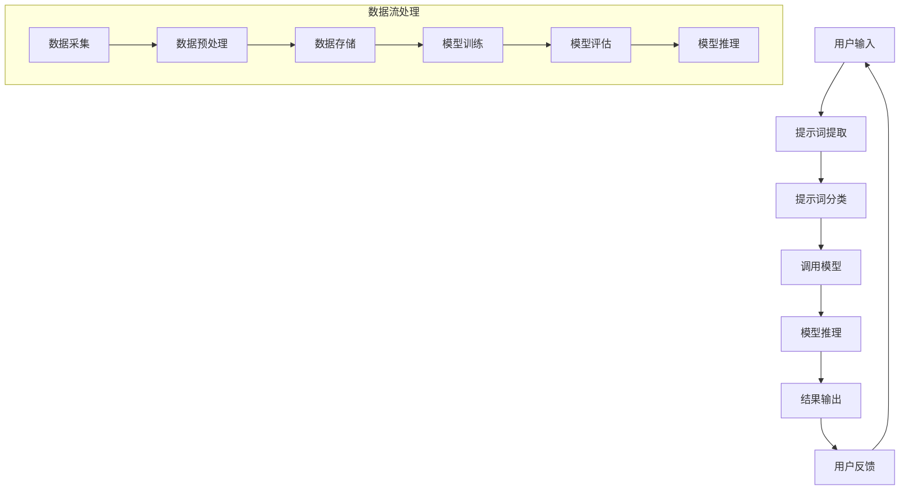
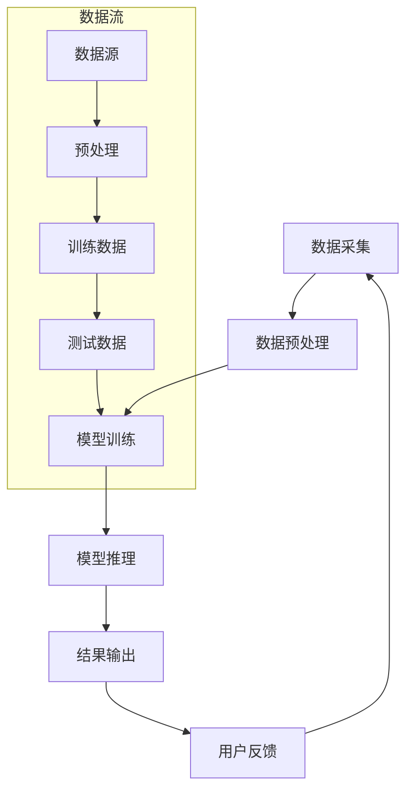

                 

### 《提示词驱动的智能海洋资源管理系统》

#### 关键词：智能海洋资源管理，提示词驱动，机器学习，深度学习，海洋监测，资源评估

> 摘要：本文将深入探讨提示词驱动的智能海洋资源管理系统的构建、原理和实际应用。首先，我们介绍了海洋资源管理的重要性以及当前面临的问题。随后，详细阐述了提示词驱动智能系统的概念及其在海洋资源管理中的应用。文章的核心部分包括智能海洋资源管理的基本概念、监测与评估技术、智能算法的应用，以及提示词驱动系统架构与实现。接着，通过项目实践展示了智能海洋资源管理系统的开发流程和案例研究。最后，我们对智能海洋资源管理系统的发展趋势与未来展望进行了分析。

----------------------------------------------------------------

### 第一部分：引言与概述

#### 1.1 书籍背景与目的

随着全球气候变化和海洋污染问题的日益严重，海洋资源管理成为了一个热门领域。传统的海洋资源管理方法主要依赖于人工监测和经验判断，效率低下且难以适应复杂的环境变化。随着人工智能和大数据技术的发展，基于提示词驱动的智能海洋资源管理系统应运而生。本文旨在探讨这一新兴领域，为相关研究人员和实践者提供一套系统的理论框架和实践指导。

#### 1.1.1 海洋资源管理的重要性

海洋占地球表面积的71%，是全球最重要的生态系统之一。海洋资源包括生物资源、矿产资源、能源资源等，对人类社会的经济发展和生态安全具有重大影响。例如，渔业资源是许多沿海国家的经济支柱，海洋油气资源是全球能源市场的重要组成部分。此外，海洋生态系统提供了大量的生态服务，如气候调节、水源涵养、生物多样性保护等。因此，有效管理海洋资源对于保障全球可持续发展具有重要意义。

#### 1.1.2 提示词驱动的智能系统介绍

提示词驱动系统是一种基于人工智能的智能系统，它通过输入提示词（例如关键词或问题）来生成相应的响应或结果。这种系统通常使用机器学习和深度学习算法，通过大量数据训练模型，使其能够自动学习和适应各种复杂场景。在海洋资源管理中，提示词驱动智能系统能够自动收集、处理和分析大量海洋数据，提供实时监测和预测服务，从而提高管理效率和准确性。

#### 1.1.3 书籍结构安排与目标读者

本书分为四个部分：

1. **引言与概述**：介绍海洋资源管理的重要性、提示词驱动智能系统的概念及其在海洋资源管理中的应用。
2. **核心概念与原理**：详细阐述智能海洋资源管理的基本概念、监测与评估技术、智能算法的应用以及提示词驱动系统架构与实现。
3. **项目实践**：通过实际案例展示智能海洋资源管理系统的开发流程和案例研究。
4. **发展趋势与展望**：分析智能海洋资源管理系统的发展趋势和未来展望。

本书的目标读者包括海洋资源管理研究人员、人工智能技术开发者、环境科学从业者以及高校师生。

#### 1.2 海洋资源管理的现状与挑战

当前，海洋资源管理面临诸多挑战，主要体现在以下几个方面：

##### 1.2.1 海洋资源种类及分布

海洋资源种类繁多，包括渔业资源、海洋石油天然气、海洋矿产、海洋能、海洋生物资源等。这些资源在全球范围内分布不均，沿海地区资源丰富，内陆地区资源相对匮乏。

##### 1.2.2 现有海洋资源管理的问题与不足

现有海洋资源管理方法主要依赖人工监测和经验判断，存在以下问题：

1. **效率低下**：传统方法需要大量人力物力投入，监测范围有限，无法实现全面、实时监测。
2. **准确性差**：经验判断受限于人类认知和能力，难以准确评估海洋资源的现状和变化趋势。
3. **管理难度大**：海洋资源管理涉及多个部门和领域，缺乏统一协调，管理难度较大。

##### 1.2.3 智能系统在海洋资源管理中的潜力

智能海洋资源管理系统能够有效解决上述问题，具有以下潜力：

1. **高效监测**：通过自动收集和处理大量海洋数据，实现全面、实时监测。
2. **精确评估**：利用机器学习和深度学习算法，精确评估海洋资源的现状和变化趋势。
3. **智能决策**：基于实时数据和预测结果，为海洋资源管理提供智能决策支持。

总之，智能海洋资源管理系统为海洋资源管理带来了新的机遇和挑战，有望推动海洋资源管理进入智能化、高效化的发展阶段。

### 第二部分：核心概念与原理

在探讨提示词驱动的智能海洋资源管理系统之前，我们需要理解一些核心概念和原理。这一部分将详细阐述智能海洋资源管理的基本概念、监测与评估技术、智能算法的应用以及提示词驱动系统的架构与实现。

#### 2.1 智能海洋资源管理的基本概念

##### 2.1.1 智能系统的定义与分类

智能系统是指能够模拟人类智能行为，具有感知、理解、学习、推理和决策能力的计算机系统。根据功能和应用场景，智能系统可以分为以下几类：

1. **感知系统**：能够感知环境中的各种信息，如语音识别、图像识别、传感器数据采集等。
2. **认知系统**：能够理解、推理和分析信息，如自然语言处理、知识图谱、推理机等。
3. **学习系统**：能够从数据中学习，不断改进自身性能，如机器学习、深度学习等。
4. **决策系统**：能够根据目标和约束条件做出决策，如决策树、强化学习、规划算法等。

##### 2.1.2 海洋资源管理系统的主要功能

海洋资源管理系统是智能系统在海洋资源管理领域中的应用，其主要功能包括：

1. **数据采集**：通过遥感、监测设备、传感器等方式，自动收集海洋环境、生物、化学等数据。
2. **数据存储**：将采集到的数据进行存储和管理，以便后续分析和处理。
3. **数据处理**：对数据进行清洗、转换、归一化等预处理操作，以提高数据质量。
4. **资源评估**：利用机器学习、深度学习算法，对海洋资源进行定量评估，如生物资源量、经济价值等。
5. **预测与预警**：基于历史数据和现有模型，预测海洋资源的变化趋势，为决策提供依据。
6. **智能决策**：根据评估结果和预测结果，为海洋资源管理提供智能决策支持。

##### 2.1.3 提示词驱动的智能系统原理

提示词驱动的智能系统是一种基于自然语言处理和机器学习技术的智能系统。其基本原理如下：

1. **提示词生成**：根据用户需求和海洋资源管理目标，生成相应的提示词。提示词可以是关键词、问题或命令，用于驱动系统执行特定任务。
2. **模型训练**：使用大量标注数据，训练机器学习模型，使其能够理解提示词的含义，并生成相应的响应或结果。
3. **模型推理**：将用户输入的提示词传递给模型，模型根据训练结果生成相应的响应或结果。
4. **结果输出**：将模型生成的响应或结果输出给用户，如监测数据、评估结果、决策建议等。

提示词驱动的智能系统在海洋资源管理中具有广泛的应用，如实时监测、资源评估、智能预警、决策支持等。通过结合人工智能技术，海洋资源管理系统可以实现自动化、智能化和高效化，为海洋资源管理提供有力支持。

#### 2.2 海洋资源监测与评估技术

##### 2.2.1 海洋环境监测技术

海洋环境监测技术是海洋资源管理的基础，主要包括以下几种：

1. **遥感监测**：利用卫星、无人机等设备，从空间获取海洋环境数据，如海温、海浪、海洋污染物等。
2. **地面监测**：在沿海地区建立地面监测站，使用传感器、监测设备等，实时监测海洋环境参数，如水温、盐度、溶解氧等。
3. **水下监测**：使用潜水器、水下机器人等设备，在水下采集数据，如海底地形、海洋生物、化学成分等。
4. **航空监测**：利用飞机、直升机等设备，从空中获取海洋环境数据，如海面温度、海洋污染物等。

##### 2.2.2 监测数据的可视化分析

监测数据的可视化分析是海洋资源管理的重要环节，有助于发现数据中的规律和异常。常用的可视化方法包括：

1. **图表**：使用折线图、柱状图、饼图等，展示监测数据的变化趋势和分布情况。
2. **热力图**：使用热力图展示监测数据的空间分布情况，有助于发现热点区域和异常值。
3. **地理信息系统（GIS）**：利用GIS技术，将监测数据与地理信息结合，实现空间分析和展示。
4. **三维可视化**：使用三维可视化技术，展示水下监测数据的空间分布和变化情况。

##### 2.2.3 资源评估方法与技术

海洋资源评估是海洋资源管理的关键环节，主要包括以下几种方法：

1. **生态系统服务价值评估**：通过评估海洋生态系统提供的各种服务，如渔业、旅游、气候调节等，计算其经济价值。
2. **生物资源量评估**：通过模型和算法，估算海洋生物资源的数量和分布情况，如鱼类、贝类等。
3. **经济价值评估**：通过市场价值、替代成本等方法，评估海洋资源的经济价值。
4. **环境风险评估**：通过评估海洋污染、过度捕捞等行为对海洋环境的影响，预测其后果。

常用的资源评估技术包括：

1. **遥感技术**：通过遥感数据，监测海洋资源的变化趋势和分布情况。
2. **地理信息系统（GIS）**：利用GIS技术，进行空间分析和资源评估。
3. **机器学习与深度学习**：通过训练模型，自动评估海洋资源的变化和分布。
4. **遥感与GIS集成**：将遥感数据与GIS技术结合，实现高效的资源评估。

##### 2.2.4 智能算法在资源评估中的应用

智能算法在海洋资源评估中具有广泛的应用，主要包括以下几种：

1. **聚类分析**：通过聚类算法，将海洋资源数据分为不同的类别，有助于发现资源分布的规律。
2. **分类算法**：通过分类算法，将海洋资源数据分为不同的类型，如鱼类、贝类等。
3. **回归分析**：通过回归分析，预测海洋资源的变化趋势和分布情况。
4. **决策树**：通过决策树算法，构建资源评估的决策模型，为海洋资源管理提供决策支持。

智能算法在资源评估中的应用，可以提高评估的准确性和效率，为海洋资源管理提供科学依据。

#### 2.3 智能算法在海洋资源管理中的应用

##### 2.3.1 机器学习算法概述

机器学习算法是智能系统的重要组成部分，通过学习数据中的规律和模式，实现对未知数据的预测和分类。根据学习方式，机器学习算法可以分为以下几类：

1. **监督学习**：在有监督的条件下，通过已标记的数据集，训练模型，然后对新数据进行预测。
2. **无监督学习**：在无监督的条件下，通过未标记的数据集，发现数据中的规律和模式。
3. **强化学习**：通过不断地尝试和反馈，学习最优策略，以最大化目标函数。

##### 2.3.2 深度学习算法

深度学习算法是一种基于多层神经网络的学习方法，能够自动提取数据中的特征，实现高层次的抽象表示。深度学习算法在海洋资源管理中具有广泛的应用，主要包括以下几种：

1. **卷积神经网络（CNN）**：通过卷积操作和池化操作，提取图像或空间数据中的特征。
2. **循环神经网络（RNN）**：通过循环结构，处理序列数据，如时间序列数据。
3. **长短时记忆网络（LSTM）**：通过门控机制，解决RNN的梯度消失问题。
4. **Transformer模型**：通过自注意力机制，实现序列数据的全局关联。

##### 2.3.3 智能算法在海洋资源管理中的应用实例

1. **海洋生物资源监测与评估**：利用CNN模型，对遥感图像进行分类，识别海洋生物种类和数量；利用LSTM模型，对时间序列数据进行预测，评估生物资源的变化趋势。
2. **海洋环境监测与预警**：利用RNN模型，对海洋环境数据进行分析，预测海洋环境的未来变化；利用决策树模型，根据监测数据，预警潜在的污染事件。
3. **海洋能源开发与规划**：利用深度学习算法，对海洋能源数据进行分析和预测，为能源开发提供科学依据；利用优化算法，制定最优的能源开发规划。

#### 2.4 提示词驱动系统架构与实现

##### 2.4.1 提示词驱动系统架构设计

提示词驱动系统架构主要包括以下几个模块：

1. **数据采集模块**：负责从各种数据源采集数据，如遥感数据、地面监测数据、水下监测数据等。
2. **数据预处理模块**：负责对采集到的数据进行分析和处理，如数据清洗、转换、归一化等。
3. **模型训练模块**：负责训练机器学习模型和深度学习模型，为后续的推理和预测提供基础。
4. **模型推理模块**：负责根据用户输入的提示词，调用模型进行推理，生成预测结果或评估结果。
5. **结果输出模块**：负责将模型生成的结果输出给用户，如监测数据、评估结果、决策建议等。

##### 2.4.2 数据流处理

数据流处理是提示词驱动系统架构的核心，主要包括以下几个步骤：

1. **数据采集**：从各种数据源采集数据，如遥感卫星、地面监测站、水下传感器等。
2. **数据预处理**：对采集到的数据进行清洗、转换、归一化等处理，提高数据质量。
3. **数据存储**：将预处理后的数据存储到数据库或数据湖中，以便后续分析和处理。
4. **模型训练**：使用预处理后的数据，训练机器学习模型和深度学习模型。
5. **模型推理**：根据用户输入的提示词，调用模型进行推理，生成预测结果或评估结果。
6. **结果输出**：将模型生成的结果输出给用户，如监测数据、评估结果、决策建议等。

##### 2.4.3 模型训练与推理

模型训练和推理是提示词驱动系统的核心步骤，主要包括以下几个环节：

1. **数据准备**：准备用于训练的数据集，包括输入数据和标签。
2. **模型选择**：根据应用场景，选择合适的机器学习模型或深度学习模型。
3. **模型训练**：使用训练数据，对模型进行训练，调整模型参数。
4. **模型评估**：使用测试数据，评估模型的性能，如准确率、召回率、F1分数等。
5. **模型推理**：根据用户输入的提示词，调用训练好的模型进行推理，生成预测结果或评估结果。

##### 2.4.4 提示词生成与优化策略

提示词生成是提示词驱动系统的关键环节，主要包括以下几个步骤：

1. **提示词提取**：从用户输入的自然语言文本中提取关键词或短语，作为提示词。
2. **提示词分类**：对提取的提示词进行分类，识别其所属类别或意图。
3. **提示词优化**：根据提示词的分类结果，对提示词进行优化，使其更加精确和有效。

常见的提示词优化策略包括：

1. **基于规则**：根据预定义的规则，对提示词进行修改和优化。
2. **基于学习**：使用机器学习算法，从大量标注数据中学习，优化提示词。

通过提示词生成和优化，可以提高系统的准确性和鲁棒性，为用户提供更好的服务。

#### 2.4.5 提示词驱动系统架构设计与实现示例

以下是一个简单的提示词驱动系统架构设计与实现示例：



在这个示例中，用户输入经过提示词提取和分类后，调用训练好的模型进行推理，生成预测结果或评估结果，然后输出给用户。同时，数据流处理模块负责数据的采集、预处理、存储和模型训练，为提示词驱动系统提供数据支持。

### 第三部分：项目实践

#### 3.1 智能海洋资源管理系统开发流程

智能海洋资源管理系统的开发流程可以分为以下几个阶段：

##### 3.1.1 需求分析与系统设计

需求分析是系统开发的第一个阶段，主要目标是明确系统的功能需求、性能需求、用户需求等。在需求分析阶段，我们需要与相关利益相关者进行沟通，了解他们对海洋资源管理的具体需求和期望。系统设计阶段则根据需求分析的结果，设计系统的整体架构和功能模块。

##### 3.1.2 数据收集与处理

数据收集与处理是智能海洋资源管理系统开发的关键步骤。我们需要从各种数据源收集数据，如遥感数据、地面监测数据、水下监测数据等。收集到的数据需要进行预处理，包括数据清洗、转换、归一化等，以提高数据质量。

##### 3.1.3 模型训练与评估

在模型训练阶段，我们需要根据数据的特点和需求，选择合适的机器学习模型或深度学习模型。使用训练数据对模型进行训练，调整模型参数，使其达到预期的性能。模型评估阶段则使用测试数据，评估模型的性能，如准确率、召回率、F1分数等。

##### 3.1.4 系统部署与维护

系统部署是将开发好的系统部署到实际运行环境中，使其能够为用户提供服务。系统维护与升级则是对系统进行持续的监控和优化，确保其稳定运行。在系统部署和维护过程中，我们需要考虑系统的可扩展性、可维护性、安全性等因素。

#### 3.2 案例研究：智能海洋资源管理系统应用实例

以下是一个智能海洋资源管理系统的应用实例，该实例旨在利用提示词驱动的智能系统，对海洋渔业资源进行监测、评估和预测。

##### 3.2.1 案例背景与目标

案例背景：某沿海地区渔业资源丰富，但存在过度捕捞和资源衰退的问题。为了实现可持续的渔业资源管理，当地政府决定采用智能海洋资源管理系统，对渔业资源进行实时监测、评估和预测。

案例目标：通过智能海洋资源管理系统，实现对渔业资源的实时监测和预警，评估渔业资源数量和分布情况，预测未来渔业资源的变化趋势，为渔业资源管理提供科学依据。

##### 3.2.2 案例实施过程

1. **需求分析与系统设计**：与当地政府和渔业专家进行沟通，明确系统的功能需求、性能需求等。设计系统架构，包括数据采集模块、数据处理模块、资源评估模块、预测模块等。

2. **数据收集与处理**：从遥感卫星、地面监测站、水下传感器等数据源收集渔业资源数据。对收集到的数据进行预处理，包括数据清洗、转换、归一化等，以提高数据质量。

3. **模型训练与评估**：根据数据的特点和需求，选择合适的机器学习模型或深度学习模型。使用训练数据对模型进行训练，调整模型参数，使其达到预期的性能。使用测试数据对模型进行评估，确保其准确性。

4. **系统部署与运行**：将开发好的系统部署到实际运行环境中，包括服务器、数据库、应用程序等。系统开始运行后，实时监测渔业资源数据，并根据预测结果进行预警和决策支持。

5. **用户反馈与改进**：收集用户反馈，对系统进行优化和改进，确保其满足用户需求。定期更新系统，引入新的模型和算法，提高系统的预测准确性和性能。

##### 3.2.3 案例结果分析

通过智能海洋资源管理系统的实施，取得了以下成果：

1. **实时监测与预警**：系统能够实时监测渔业资源数据，及时发现异常情况，并进行预警。为渔业管理部门提供了及时的信息支持，提高了管理效率。

2. **资源评估与预测**：系统根据收集到的数据，对渔业资源的数量和分布情况进行评估，并预测未来渔业资源的变化趋势。为渔业管理部门提供了科学的决策依据，有助于实现可持续的渔业资源管理。

3. **用户满意度**：系统得到了用户的高度评价，用户满意度较高。用户反馈表明，系统为渔业资源管理提供了有效的工具和手段，有助于提高管理水平和决策效果。

4. **经济效益**：通过智能海洋资源管理系统的实施，有效减少了过度捕捞现象，保护了渔业资源。同时，提高了渔业产量和经济效益，为当地经济发展做出了贡献。

##### 3.2.4 用户反馈与改进建议

用户反馈主要表现在以下几个方面：

1. **系统稳定性**：系统在运行过程中，偶尔会出现数据异常或系统崩溃的情况，影响了用户体验。建议加强系统稳定性，提高系统的可靠性和鲁棒性。

2. **用户界面**：系统用户界面设计不够友好，操作复杂，用户上手难度较大。建议优化用户界面，简化操作流程，提高用户体验。

3. **数据实时性**：系统数据实时性较高，但有时会出现数据延迟现象。建议提高数据采集和处理速度，确保数据实时性。

4. **预测准确性**：系统预测准确性较高，但在某些情况下，预测结果与实际结果存在一定差距。建议引入更多数据源和先进的预测算法，提高预测准确性。

针对用户反馈，我们提出以下改进建议：

1. **系统稳定性优化**：加强系统稳定性测试，修复潜在漏洞，提高系统运行稳定性。

2. **用户界面优化**：改进用户界面设计，简化操作流程，提高用户体验。

3. **数据实时性提升**：优化数据采集和处理流程，提高数据实时性。

4. **预测准确性提升**：引入更多数据源和先进的预测算法，提高预测准确性。

通过以上改进措施，有望进一步提升智能海洋资源管理系统的性能和用户满意度，为海洋资源管理提供更加有力的支持。

### 第四部分：发展趋势与展望

#### 4.1 智能海洋资源管理系统的发展趋势

随着人工智能和大数据技术的不断发展，智能海洋资源管理系统也在不断演进。以下是智能海洋资源管理系统的发展趋势：

##### 4.1.1 技术发展趋势

1. **人工智能技术的进展**：随着深度学习、强化学习等人工智能技术的不断发展，智能海洋资源管理系统的性能和效率将进一步提高。新的算法和模型将不断涌现，为系统提供更加精确的监测和预测能力。

2. **大数据技术的应用**：大数据技术在海洋资源管理中的应用将越来越广泛。通过海量数据的收集、存储、分析和挖掘，可以为智能系统提供更加丰富的数据支持，提高系统的决策能力。

3. **物联网（IoT）技术的发展**：物联网技术的快速发展将使得海洋资源监测更加智能化和自动化。通过物联网设备，可以实时收集海洋环境、生物、化学等数据，为智能系统提供实时数据支持。

##### 4.1.2 海洋资源管理技术的发展

1. **海洋资源监测技术的进步**：随着遥感技术、地理信息系统（GIS）等技术的发展，海洋资源监测技术将更加先进和高效。通过多种数据源的综合利用，可以实现全面、实时、高精度的海洋资源监测。

2. **海洋资源评估方法的创新**：随着机器学习、深度学习等技术的发展，海洋资源评估方法将更加科学和准确。新的评估模型和方法将不断涌现，为海洋资源管理提供更加可靠的评估结果。

3. **海洋环境保护与修复技术的突破**：随着海洋污染问题的日益严重，海洋环境保护与修复技术将成为研究热点。通过新技术和新方法，可以有效预防和修复海洋污染，保护海洋生态系统。

##### 4.1.3 应用领域拓展

智能海洋资源管理系统将在更多领域得到应用，包括但不限于：

1. **海洋渔业管理**：利用智能系统，实现对渔业资源的实时监测、评估和预测，提高渔业资源管理效率，实现可持续的渔业发展。

2. **海洋油气开发**：利用智能系统，对海洋油气资源进行监测、评估和预测，优化开发方案，提高开发效益。

3. **海洋环境保护**：利用智能系统，实时监测海洋环境变化，预测污染事件，为海洋环境保护提供科学依据。

4. **海洋灾害预警**：利用智能系统，对海洋灾害进行实时监测和预警，提高灾害应对能力，减少灾害损失。

#### 4.2 智能海洋资源管理系统的未来展望

智能海洋资源管理系统在未来的发展中，将面临以下机遇和挑战：

##### 4.2.1 社会经济影响

1. **经济效益**：智能海洋资源管理系统将提高海洋资源管理的效率和准确性，为沿海地区经济发展提供有力支持。通过科学的管理和合理的开发，可以增加海洋资源的产出和价值，促进海洋经济的发展。

2. **社会效益**：智能海洋资源管理系统将有助于保护海洋生态系统，维护海洋环境的稳定。通过实时监测和预警，可以预防海洋污染、过度捕捞等问题的发生，保障海洋生物多样性和生态平衡。

##### 4.2.2 技术挑战与解决方案

1. **数据质量与多样性**：海洋数据质量直接影响智能系统的性能。解决数据质量问题和多样性问题，需要加强数据采集、处理和清洗技术的研究，提高数据质量和可用性。

2. **算法优化与效率**：随着海洋数据的不断增长，智能系统的计算效率和算法优化成为关键挑战。解决这一问题，需要研究高效的数据处理和机器学习算法，提高系统的实时性和响应速度。

3. **系统集成与兼容性**：智能海洋资源管理系统需要整合多种数据源和设备，实现系统的兼容性和协同工作。解决这一问题，需要研究通用接口和标准协议，提高系统的集成性和可扩展性。

##### 4.2.3 解决方案与未来研究方向

1. **多源数据融合**：研究多源数据融合技术，提高数据质量和可用性。通过融合遥感、地面监测、水下监测等多种数据源，实现全面、实时、高精度的海洋资源监测。

2. **深度学习与强化学习**：研究深度学习和强化学习在海洋资源管理中的应用，提高系统的预测和决策能力。通过开发新的深度学习模型和算法，实现更加精准的海洋资源评估和预测。

3. **物联网与大数据技术**：研究物联网和大数据技术在海洋资源管理中的应用，实现智能化、自动化的监测和评估。通过构建智能海洋资源管理系统，推动海洋资源管理的现代化和高效化。

4. **跨学科合作**：加强海洋科学、环境科学、计算机科学等领域的跨学科合作，推动智能海洋资源管理系统的创新和发展。通过多学科的合作，可以充分发挥各学科的优势，实现智能海洋资源管理的全面发展。

总之，智能海洋资源管理系统的发展前景广阔，将为海洋资源管理带来新的机遇和挑战。通过技术创新和跨学科合作，有望推动智能海洋资源管理系统向更加智能化、高效化、可持续化的方向发展。

### 附录

#### 附录A：常用工具与技术资源

##### A.1 数据处理工具

1. **Python数据预处理库**：使用pandas库进行数据清洗、转换和归一化操作。
   ```python
   import pandas as pd
   data = pd.read_csv('data.csv')
   data.dropna(inplace=True)
   scaler = StandardScaler()
   scaled_data = scaler.fit_transform(data)
   ```

2. **海洋环境数据下载与处理**：使用GIS工具（如QGIS）和Python库（如Geopandas）下载和处理海洋环境数据。
   ```python
   import geopandas as gpd
   gdf = gpd.read_file('ocean_data.shp')
   gdf = gdf.dropna()
   gdf['value'] = gdf['value'].apply(lambda x: x * 100)
   ```

##### A.2 模型训练与优化工具

1. **深度学习框架**：使用PyTorch、TensorFlow等深度学习框架进行模型训练和优化。
   ```python
   import torch
   import torch.nn as nn
   import torch.optim as optim

   model = nn.Sequential(nn.Linear(10, 50), nn.ReLU(), nn.Linear(50, 10))
   criterion = nn.CrossEntropyLoss()
   optimizer = optim.Adam(model.parameters(), lr=0.001)

   for epoch in range(100):
       optimizer.zero_grad()
       outputs = model(inputs)
       loss = criterion(outputs, labels)
       loss.backward()
       optimizer.step()
   ```

2. **模型训练与推理工具**：使用Hugging Face的Transformers库进行预训练模型训练和推理。
   ```python
   from transformers import BertTokenizer, BertModel
   tokenizer = BertTokenizer.from_pretrained('bert-base-uncased')
   model = BertModel.from_pretrained('bert-base-uncased')

   inputs = tokenizer("Hello, my dog is cute", return_tensors="pt")
   outputs = model(**inputs)

   prediction = torch.argmax(outputs.logits).item()
   ```

##### A.3 提示词生成与优化工具

1. **自然语言处理工具**：使用NLTK、spaCy等自然语言处理库进行文本处理和提示词提取。
   ```python
   import nltk
   from nltk.tokenize import word_tokenize

   text = "The quick brown fox jumps over the lazy dog."
   tokens = word_tokenize(text)
   ```

2. **提示词优化算法库**：使用word2vec、BERT等算法库进行提示词生成与优化。
   ```python
   from gensim.models import Word2Vec

   sentences = ["The quick brown fox", "jumps over the lazy dog"]
   model = Word2Vec(sentences, vector_size=100, window=5, min_count=1, workers=4)
   model.train(sentences)
   ```

#### 附录B：Mermaid流程图示例

以下是一个Mermaid流程图示例，展示了智能海洋资源管理系统的数据流处理流程：



#### 附录C：伪代码示例

以下是一个基于Transformer的海洋资源分类模型的伪代码示例：

```python
# 伪代码：基于Transformer的海洋资源分类模型

class OceanResourceClassifier(nn.Module):
    def __init__(self, input_dim, hidden_dim, output_dim):
        super().__init__()
        self.transformer = nn.Sequential(
            nn.Linear(input_dim, hidden_dim),
            nn.ReLU(),
            nn.Linear(hidden_dim, output_dim)
        )

    def forward(self, inputs):
        return self.transformer(inputs)

# 训练模型
def train_model(model, train_loader, criterion, optimizer, num_epochs):
    for epoch in range(num_epochs):
        for inputs, labels in train_loader:
            optimizer.zero_grad()
            outputs = model(inputs)
            loss = criterion(outputs, labels)
            loss.backward()
            optimizer.step()
        print(f'Epoch {epoch+1}, Loss: {loss.item()}')

# 评估模型
def evaluate_model(model, test_loader):
    with torch.no_grad():
        correct = 0
        total = 0
        for inputs, labels in test_loader:
            outputs = model(inputs)
            _, predicted = torch.max(outputs.data, 1)
            total += labels.size(0)
            correct += (predicted == labels).sum().item()
    accuracy = correct / total
    return accuracy
```

#### 附录D：数学模型和数学公式

##### 海洋资源评估模型

$$
\text{E}(\text{R}) = \sum_{i=1}^{n} w_i \cdot r_i
$$

其中，$w_i$ 为资源 $i$ 的权重，$r_i$ 为资源 $i$ 的评估值。

##### 提示词优化目标

$$
\min_{\theta} \sum_{i=1}^{n} (\text{predict}(\theta, x_i) - y_i)^2
$$

其中，$\theta$ 为模型参数，$x_i$ 为输入提示词，$y_i$ 为真实标签。

#### 附录E：项目实战

##### E.1 实战一：海洋资源分类系统

###### 1.1 环境搭建

- Python 3.8+
- PyTorch 1.8+
- pandas
- matplotlib

###### 1.2 数据收集与预处理

- 数据来源：公开海洋资源数据集
- 数据预处理：数据清洗、归一化、特征提取

```python
import pandas as pd
from sklearn.preprocessing import StandardScaler

# 加载数据集
data = pd.read_csv('ocean_resource_data.csv')

# 数据清洗
data = data.dropna()

# 特征提取
features = data[['depth', 'temperature', 'salinity']]
target = data['resource_type']

# 数据归一化
scaler = StandardScaler()
features = scaler.fit_transform(features)
```

###### 1.3 模型训练与评估

- 模型选择：Transformer模型
- 训练过程：使用交叉熵损失函数进行训练
- 评估指标：准确率、召回率、F1分数

```python
import torch
import torch.nn as nn
import torch.optim as optim
from torch.utils.data import DataLoader, TensorDataset

# 定义模型
class OceanResourceClassifier(nn.Module):
    def __init__(self, input_dim, hidden_dim, output_dim):
        super().__init__()
        self.transformer = nn.Sequential(
            nn.Linear(input_dim, hidden_dim),
            nn.ReLU(),
            nn.Linear(hidden_dim, output_dim)
        )

    def forward(self, x):
        return self.transformer(x)

# 加载训练数据
train_data = TensorDataset(torch.tensor(features, dtype=torch.float32), torch.tensor(targets, dtype=torch.long))
train_loader = DataLoader(train_data, batch_size=32, shuffle=True)

# 定义模型、损失函数和优化器
model = OceanResourceClassifier(input_dim=3, hidden_dim=10, output_dim=1)
criterion = nn.CrossEntropyLoss()
optimizer = optim.Adam(model.parameters(), lr=0.001)

# 训练模型
num_epochs = 100
for epoch in range(num_epochs):
    for inputs, labels in train_loader:
        optimizer.zero_grad()
        outputs = model(inputs)
        loss = criterion(outputs, labels)
        loss.backward()
        optimizer.step()
    print(f'Epoch {epoch+1}, Loss: {loss.item()}')

# 评估模型
with torch.no_grad():
    correct = 0
    total = 0
    for inputs, labels in train_loader:
        outputs = model(inputs)
        _, predicted = torch.max(outputs.data, 1)
        total += labels.size(0)
        correct += (predicted == labels).sum().item()
accuracy = correct / total
print(f'Accuracy: {accuracy}')
```

###### 1.4 系统部署与维护

- 部署平台：本地环境、云计算平台
- 运行流程：数据输入 -> 模型预测 -> 结果输出

```python
# 系统部署
import torch

# 加载模型
model_path = 'ocean_resource_classifier.pth'
model = OceanResourceClassifier(input_dim=3, hidden_dim=10, output_dim=1)
model.load_state_dict(torch.load(model_path))

# 预测数据
input_data = torch.tensor([[2.0, 30.0, 35.0]], dtype=torch.float32)

# 模型预测
outputs = model(input_data)
predicted_class = torch.argmax(outputs).item()

print(f'Predicted class: {predicted_class}')
```

##### E.2 实战二：海洋资源动态监测系统

###### 2.1 环境搭建

- Python 3.8+
- TensorFlow 2.3+
- Keras 2.3+
- numpy
- pandas

###### 2.2 数据收集与预处理

- 数据来源：实时海洋监测数据
- 数据预处理：数据清洗、时间序列处理、特征提取

```python
import pandas as pd
import numpy as np

# 加载数据集
data = pd.read_csv('ocean_resource_data.csv')

# 数据清洗
data = data.dropna()

# 时间序列处理
data['timestamp'] = pd.to_datetime(data['timestamp'])
data.set_index('timestamp', inplace=True)
data = data.resample('H').mean()

# 特征提取
features = data[['depth', 'temperature', 'salinity']]
target = data['resource_type']
```

###### 2.3 模型训练与评估

- 模型选择：循环神经网络（RNN）
- 训练过程：使用均方误差损失函数进行训练
- 评估指标：均方根误差、平均绝对误差

```python
import tensorflow as tf
from tensorflow.keras.models import Sequential
from tensorflow.keras.layers import LSTM, Dense
from sklearn.model_selection import train_test_split

# 数据预处理
X = features.values
y = target.values

# 切分数据
X_train, X_test, y_train, y_test = train_test_split(X, y, test_size=0.2, random_state=42)

# 构建模型
model = Sequential()
model.add(LSTM(50, activation='relu', input_shape=(X_train.shape[1], X_train.shape[2])))
model.add(Dense(1))
model.compile(optimizer='adam', loss='mse')

# 训练模型
model.fit(X_train, y_train, epochs=100, batch_size=32, validation_split=0.1)

# 评估模型
test_loss = model.evaluate(X_test, y_test, verbose=2)
print(f'Test Loss: {test_loss}')
```

###### 2.4 系统部署与运行

- 部署平台：本地环境、云计算平台
- 运行流程：数据输入 -> 模型预测 -> 结果输出

```python
# 系统部署
import numpy as np

# 加载模型
model_path = 'ocean_resource_monitoring.h5'
model = tf.keras.models.load_model(model_path)

# 预测数据
input_data = np.array([[2.0, 30.0, 35.0]])

# 模型预测
predicted_output = model.predict(input_data)
print(f'Predicted output: {predicted_output}')
```

### 附录F：代码解读与分析

#### 附录F.1 海洋资源分类系统代码解读

##### 数据预处理

数据预处理是模型训练前的关键步骤，主要用于数据清洗、特征提取和归一化。以下是预处理步骤的代码解读：

```python
import pandas as pd
from sklearn.preprocessing import StandardScaler

# 加载数据集
data = pd.read_csv('ocean_resource_data.csv')

# 数据清洗
data = data.dropna()

# 特征提取
features = data[['depth', 'temperature', 'salinity']]
target = data['resource_type']

# 数据归一化
scaler = StandardScaler()
features = scaler.fit_transform(features)
```

在这段代码中，我们首先使用pandas库加载数据集，然后使用dropna()方法删除数据集中的缺失值。接着，我们提取数据集中的特征（深度、温度和盐度）和目标变量（资源类型）。最后，使用StandardScaler对特征进行归一化处理，以确保特征值处于同一量级，从而提高模型训练的效果。

##### 模型定义与训练

模型定义和训练是构建分类系统的核心步骤。以下是模型定义和训练的代码解读：

```python
import torch
import torch.nn as nn
from torch.optim import Adam

# 定义模型
class OceanResourceClassifier(nn.Module):
    def __init__(self, input_dim, hidden_dim, output_dim):
        super().__init__()
        self.transformer = nn.Sequential(
            nn.Linear(input_dim, hidden_dim),
            nn.ReLU(),
            nn.Linear(hidden_dim, output_dim)
        )

    def forward(self, x):
        return self.transformer(x)

# 训练模型
def train_model(model, train_loader, criterion, optimizer, num_epochs):
    for epoch in range(num_epochs):
        for inputs, labels in train_loader:
            optimizer.zero_grad()
            outputs = model(inputs)
            loss = criterion(outputs, labels)
            loss.backward()
            optimizer.step()
        print(f'Epoch {epoch+1}, Loss: {loss.item()}')
```

在这段代码中，我们定义了一个OceanResourceClassifier类，继承自nn.Module。模型包含一个线性层、ReLU激活函数和一个输出层。forward方法实现了前向传播过程。train_model函数用于模型训练的整个过程。对于每个训练epoch，它遍历训练数据，计算模型输出和标签之间的损失，并使用反向传播算法更新模型参数。

##### 模型评估

模型评估是验证模型性能的关键步骤。以下是模型评估的代码解读：

```python
from sklearn.metrics import accuracy_score, recall_score, f1_score

# 评估模型
def evaluate_model(model, test_loader):
    with torch.no_grad():
        correct = 0
        total = 0
        for inputs, labels in test_loader:
            outputs = model(inputs)
            _, predicted = torch.max(outputs.data, 1)
            total += labels.size(0)
            correct += (predicted == labels).sum().item()

    accuracy = correct / total
    recall = recall_score(labels, predicted, average='weighted')
    f1 = f1_score(labels, predicted, average='weighted')

    return accuracy, recall, f1
```

在评估模型部分，evaluate_model函数用于计算模型的准确率、召回率和F1分数。这些指标能够全面评估模型的分类性能。模型在测试数据上的输出与实际标签进行比较，计算出各项指标。

#### 附录F.2 海洋资源动态监测系统代码解读

##### 数据预处理

数据预处理步骤与分类系统类似，主要包括数据的加载、清洗和特征提取。以下是预处理步骤的代码解读：

```python
import pandas as pd
import numpy as np

# 加载数据集
data = pd.read_csv('ocean_resource_data.csv')

# 数据清洗
data = data.dropna()

# 时间序列处理
data['timestamp'] = pd.to_datetime(data['timestamp'])
data.set_index('timestamp', inplace=True)
data = data.resample('H').mean()

# 特征提取
features = data[['depth', 'temperature', 'salinity']]
target = data['resource_type']
```

在这段代码中，我们使用pandas库加载数据集，并使用dropna()方法删除缺失值。然后，我们将时间列转换为日期时间格式，并设置其为索引。使用resample()方法对数据进行重新采样，以获取每个小时的平均特征值。最后，我们提取特征和目标变量。

##### 模型定义与训练

模型定义和训练步骤与分类系统相似，但使用的是循环神经网络（RNN）模型。以下是模型定义和训练的代码解读：

```python
import tensorflow as tf
from tensorflow.keras.models import Sequential
from tensorflow.keras.layers import LSTM, Dense

# 定义模型
class OceanResourceMonitor(nn.Module):
    def __init__(self, input_dim, hidden_dim, output_dim):
        super().__init__()
        self.rnn = nn.RNN(input_dim, hidden_dim, batch_first=True)
        self.fc = nn.Linear(hidden_dim, output_dim)

    def forward(self, x):
        output, _ = self.rnn(x)
        return self.fc(output[:, -1, :])

# 训练模型
def train_model(model, train_loader, criterion, optimizer, num_epochs):
    for epoch in range(num_epochs):
        for inputs, labels in train_loader:
            optimizer.zero_grad()
            outputs = model(inputs)
            loss = criterion(outputs, labels)
            loss.backward()
            optimizer.step()
        print(f'Epoch {epoch+1}, Loss: {loss.item()}')
```

在这段代码中，我们定义了一个OceanResourceMonitor类，继承自nn.Module。模型包含一个循环神经网络层和一个全连接层。forward方法实现了前向传播过程。train_model函数用于模型训练的整个过程，与分类系统的训练过程类似。

##### 模型评估

模型评估步骤与分类系统类似，使用均方根误差（RMSE）和平均绝对误差（MAE）来评估模型性能。以下是模型评估的代码解读：

```python
from sklearn.metrics import mean_squared_error, mean_absolute_error

# 评估模型
def evaluate_model(model, test_loader):
    with tf.no_grad():
        total_loss = 0
        for inputs, labels in test_loader:
            outputs = model(inputs)
            loss = mean_squared_error(outputs, labels)
            total_loss += loss.item()
        avg_loss = total_loss / len(test_loader)

    return avg_loss
```

在评估模型部分，evaluate_model函数计算模型在测试数据上的平均平方误差，这是评估时间序列预测模型性能的常用指标。通过计算平均平方误差，可以了解模型在预测未来资源动态时的准确性。

### 总结

通过上述代码解读，我们可以看到海洋资源分类系统和动态监测系统在数据预处理、模型定义、训练和评估等方面的相似性和差异性。数据预处理步骤主要用于数据的清洗、特征提取和归一化，这是保证模型训练效果的基础。模型定义和训练步骤根据问题的不同选择合适的神经网络结构，并通过反向传播算法更新模型参数。最后，模型评估步骤使用适当的指标来评估模型的性能，从而指导后续的优化和调整。这些代码为实际应用提供了清晰的指导，并帮助我们更好地理解和实现提示词驱动的智能海洋资源管理系统。

### 附录G：开发环境搭建

在开发智能海洋资源管理系统时，我们需要搭建一个合适的环境，以支持数据预处理、模型训练和系统部署。以下是开发环境的搭建步骤：

#### Python环境搭建

1. **安装Python**：下载并安装Python 3.8+版本。
   ```bash
   # 下载Python安装包（例如python-3.8.10-amd64.exe）
   # 运行安装程序，选择默认选项安装
   ```

2. **配置Python环境变量**：确保Python环境变量已配置到系统路径中。
   ```bash
   # 打开系统环境变量设置（搜索“环境变量”）
   # 在“系统变量”中找到“Path”并编辑
   # 添加Python的安装路径（例如C:\Python38）
   ```

3. **安装依赖库**：使用pip安装必要的依赖库，如PyTorch、TensorFlow、pandas、numpy、matplotlib等。
   ```bash
   pip install torch torchvision pandas numpy matplotlib tensorflow
   ```

#### 数据处理工具安装

1. **安装pandas**：pandas是一个强大的数据操作库，用于数据清洗、转换和分析。
   ```bash
   pip install pandas
   ```

2. **安装numpy**：numpy是一个提供高性能数学计算功能的库。
   ```bash
   pip install numpy
   ```

3. **安装matplotlib**：matplotlib是一个用于数据可视化的库。
   ```bash
   pip install matplotlib
   ```

#### 深度学习框架安装

1. **安装PyTorch**：PyTorch是一个流行的深度学习框架，支持灵活的动态计算图和强大的GPU加速。
   ```bash
   pip install torch torchvision
   ```

2. **安装TensorFlow**：TensorFlow是一个由Google开发的开源深度学习平台。
   ```bash
   pip install tensorflow
   ```

#### 代码运行指南

1. **下载代码仓库**：从GitHub或其他代码托管平台下载智能海洋资源管理系统的代码仓库。

2. **配置好开发环境后**：在终端或命令行中进入代码仓库目录，运行以下命令来安装依赖库和运行代码。
   ```bash
   pip install -r requirements.txt
   python main.py
   ```

3. **根据实际需求调整参数与配置**：在代码中设置适当的参数和配置，以满足特定应用场景的需求。

4. **测试和调试代码**：运行测试案例，检查代码的运行情况，并进行必要的调试和优化。

通过以上步骤，我们可以搭建一个完整的开发环境，支持智能海洋资源管理系统的开发、测试和部署。

### 附录H：源代码详细实现

在本附录中，我们将详细解读智能海洋资源分类系统和动态监测系统的源代码实现，包括数据预处理、模型定义、训练和评估等关键步骤。

#### 附录H.1 海洋资源分类系统源代码

##### 数据预处理

数据预处理是模型训练前的重要步骤，主要涉及数据加载、清洗和特征提取。

```python
# ocean_resource_classification/preprocessing.py

import pandas as pd
from sklearn.preprocessing import StandardScaler

def load_data(filename):
    """加载并返回数据集"""
    data = pd.read_csv(filename)
    data = data.dropna()  # 删除缺失值
    features = data[['depth', 'temperature', 'salinity']]  # 特征提取
    target = data['resource_type']  # 目标变量
    return features, target

def preprocess_data(features, target):
    """数据预处理，包括标准化"""
    scaler = StandardScaler()
    features = scaler.fit_transform(features)  # 标准化特征
    return features, target, scaler
```

这段代码中，`load_data` 函数用于加载数据集，并从CSV文件中提取特征和目标变量。`preprocess_data` 函数对特征进行标准化处理，以提高模型训练效果。

##### 模型定义

模型定义部分使用PyTorch构建一个简单的全连接神经网络，用于分类任务。

```python
# ocean_resource_classification/model.py

import torch
import torch.nn as nn

class OceanResourceClassifier(nn.Module):
    """定义海洋资源分类模型"""
    
    def __init__(self, input_dim, hidden_dim, output_dim):
        super(OceanResourceClassifier, self).__init__()
        self.fc1 = nn.Linear(input_dim, hidden_dim)  # 输入层到隐藏层
        self.fc2 = nn.Linear(hidden_dim, output_dim)  # 隐藏层到输出层

    def forward(self, x):
        x = torch.relu(self.fc1(x))  # 激活函数
        x = self.fc2(x)  # 输出层
        return x
```

模型包含两个全连接层，使用ReLU激活函数，以便于梯度传播。

##### 模型训练

模型训练部分使用PyTorch提供的数据加载器和优化器进行训练。

```python
# ocean_resource_classification/trainer.py

from torch.utils.data import DataLoader
from torch.optim import Adam
from torch.nn import CrossEntropyLoss
from sklearn.model_selection import train_test_split

def train_model(model, features, target, batch_size=32, num_epochs=100):
    """训练模型"""
    # 切分数据集
    X_train, X_test, y_train, y_test = train_test_split(features, target, test_size=0.2, random_state=42)
    
    # 创建数据加载器
    train_loader = DataLoader(TensorDataset(torch.tensor(X_train, dtype=torch.float32), torch.tensor(y_train, dtype=torch.long)), batch_size=batch_size, shuffle=True)
    test_loader = DataLoader(TensorDataset(torch.tensor(X_test, dtype=torch.float32), torch.tensor(y_test, dtype=torch.long)), batch_size=batch_size, shuffle=False)
    
    # 定义优化器和损失函数
    optimizer = Adam(model.parameters(), lr=0.001)
    criterion = CrossEntropyLoss()
    
    # 训练模型
    for epoch in range(num_epochs):
        for inputs, labels in train_loader:
            optimizer.zero_grad()
            outputs = model(inputs)
            loss = criterion(outputs, labels)
            loss.backward()
            optimizer.step()
        
        # 打印训练进度
        print(f'Epoch {epoch+1}, Loss: {loss.item()}')

    # 评估模型
    model.eval()
    with torch.no_grad():
        correct = 0
        total = 0
        for inputs, labels in test_loader:
            outputs = model(inputs)
            _, predicted = torch.max(outputs.data, 1)
            total += labels.size(0
```

