                 

### 引言

当今世界，人工智能（AI）正在以前所未有的速度改变着我们的生活。从智能家居、自动驾驶汽车到医疗诊断、金融分析，AI的应用场景不断扩展，深刻影响着各行各业。在这一背景下，AI编程作为AI技术发展的核心，正成为程序员和技术专家们研究和关注的重点。本文旨在探讨AI编程的新语言与新思路，通过对AI编程的核心概念、算法原理、数学基础及实际应用的分析，帮助读者深入理解这一领域的本质和前沿动态。

首先，我们将回顾AI编程的演变历程，探讨从传统编程到AI编程的转变。接着，详细介绍AI编程语言及其优势与挑战。然后，深入探讨AI编程的核心算法原理，包括机器学习、深度学习和自然语言处理等。此外，我们将介绍AI编程的数学基础，包括线性代数、概率论和统计学等。接下来，我们将探讨AI编程的新思路，如模型可解释性、强化学习和聚类与降维等。最后，通过实际项目实战，展示如何将AI编程应用于实际问题解决，并讨论AI编程面临的挑战与未来发展趋势。

通过本文的阅读，读者将能够系统了解AI编程的核心内容，掌握新语言和新思路的应用方法，为在AI领域取得成功奠定坚实基础。

### 关键词

- 人工智能编程
- 新编程语言
- AI算法原理
- 数学基础
- 项目实战
- 模型可解释性
- 强化学习
- 聚类与降维

### 摘要

本文详细探讨了人工智能（AI）编程的新语言与新思路。首先，我们回顾了AI编程的演变过程，从传统编程过渡到现代AI编程。接着，介绍了常见的AI编程语言及其优势与挑战。通过深入分析AI编程的核心算法原理，包括机器学习、深度学习和自然语言处理等，本文为读者揭示了AI编程的核心技术。此外，我们探讨了AI编程的数学基础，包括线性代数、概率论和统计学等。通过实际项目实战，本文展示了AI编程如何应用于人脸识别和文本分类等实际问题。最后，本文讨论了AI编程面临的挑战与未来发展趋势，包括数据隐私、模型偏见和伦理问题等。本文旨在为读者提供系统、全面的AI编程知识，帮助他们更好地理解和应用AI编程技术。

### 第一部分: AI编程的新语言与新思路基础

AI编程作为人工智能领域的重要组成部分，正在迅速发展并不断演进。本部分将深入探讨AI编程的新语言与新思路，从基础概念、算法原理到实际应用，全面解析AI编程的核心内容。

#### 第1章: AI编程的演变与概述

##### 1.1 AI编程的演变

从传统编程到AI编程，人工智能技术的发展推动了编程方式的革新。传统编程注重的是逻辑和指令，而AI编程则更强调数据、模型和算法。

###### 1.1.1 从传统编程到AI编程

在传统编程中，程序员通过编写指令，控制计算机执行特定的任务。这种方式依赖于明确的逻辑和步骤，适用于规则明确、场景固定的问题。然而，面对复杂多变、规则难以描述的问题，传统编程显得力不从心。

随着人工智能技术的发展，AI编程逐渐兴起。AI编程强调的是利用数据和算法自动发现知识、进行决策和生成结果。它不再依赖于明确的指令，而是通过学习和优化，自动适应和解决问题。

###### 1.1.2 AI编程的核心特征

AI编程具有以下核心特征：

1. **数据驱动**：AI编程依赖于大量的数据，通过数据训练模型，实现问题的自动解决。
2. **自动学习**：AI编程能够自动从数据中学习，识别模式和规律，提高解决问题的能力。
3. **自适应性强**：AI编程能够根据环境变化，自动调整和优化算法，适应不同场景。
4. **泛化能力强**：AI编程通过学习，能够将特定场景的知识应用到更广泛的领域。

###### 1.1.3 AI编程的未来趋势

未来，AI编程将朝着更加智能化、自动化和高效化的方向发展。具体趋势包括：

1. **模型复杂度增加**：随着计算能力的提升，AI编程将能够使用更复杂的模型，解决更复杂的问题。
2. **算法优化**：针对特定问题，AI编程将不断优化算法，提高效率和准确性。
3. **多模态融合**：AI编程将能够整合多种数据类型，如文本、图像、音频等，实现更全面的信息处理。
4. **决策智能**：AI编程将不仅能够进行预测，还能够进行决策，提供更智能的解决方案。

##### 1.2 AI编程语言概述

AI编程语言是用于实现AI算法的工具，它们具有特定的语法和语义，能够高效地表达和执行AI任务。

###### 1.2.1 AI编程语言的定义

AI编程语言是一类专门用于开发人工智能应用程序的编程语言。它们提供了丰富的库和框架，使得开发者可以轻松实现复杂的AI算法和模型。

常见的AI编程语言包括：

1. **Python**：Python以其简洁易懂的语法和丰富的库资源，成为AI编程的主流语言。许多深度学习和自然语言处理的库，如TensorFlow和PyTorch，都是基于Python开发的。
2. **R**：R语言在统计分析和数据可视化方面具有强大的功能，常用于数据科学和机器学习领域。
3. **Java**：Java具有高性能和跨平台的特点，广泛应用于企业级AI应用开发。
4. **Lisp**：Lisp是历史上最早的编程语言之一，对现代编程语言产生了深远影响，尤其在符号计算和AI领域。

###### 1.2.2 常见的AI编程语言

1. **TensorFlow**：由Google开发，是一个开源的端到端机器学习平台，支持多种编程语言，包括Python、C++和Java。
2. **PyTorch**：由Facebook开发，是一个基于Python的深度学习框架，以其灵活性和动态计算图而受到广泛欢迎。
3. **Scikit-Learn**：是一个开源的Python库，提供了广泛的机器学习算法和工具，适合数据科学家和研究人员。
4. **MXNet**：由Apache软件基金会开发，是一个灵活且高效的深度学习框架，支持多种编程语言。

###### 1.2.3 新语言的优势与挑战

新AI编程语言的出现，带来了以下优势：

1. **易用性**：新编程语言通常具有简洁易懂的语法，使得开发者能够更快地入门和实现AI应用。
2. **性能提升**：新编程语言通过优化底层实现，提高了AI算法的运行效率。
3. **社区支持**：新编程语言通常拥有强大的社区支持，提供了丰富的资源和工具。

然而，新编程语言也面临一些挑战：

1. **学习曲线**：新编程语言可能需要开发者重新学习和适应，增加了入门的难度。
2. **兼容性问题**：新编程语言与旧系统或框架的兼容性可能存在问题，需要额外的转换和整合工作。

##### 1.3 AI编程在软件开发中的应用

AI编程在软件开发中的应用越来越广泛，涵盖了多个领域。

###### 1.3.1 AI编程在数据科学中的应用

数据科学是AI编程的重要应用领域之一。通过AI编程，数据科学家能够利用机器学习和深度学习算法，从大量数据中提取有价值的信息和知识。

具体应用包括：

1. **预测分析**：通过预测模型，预测未来的趋势和事件，如股票价格、天气变化等。
2. **聚类分析**：通过聚类算法，将数据分为不同的类别，发现数据中的模式和规律。
3. **降维**：通过降维技术，将高维数据映射到低维空间，提高数据可视化和分析的效率。

###### 1.3.2 AI编程在机器学习中的应用

机器学习是AI编程的核心领域之一。通过AI编程，开发者和研究人员能够实现各种机器学习算法，解决分类、回归、聚类等问题。

具体应用包括：

1. **分类**：将数据分为不同的类别，如垃圾邮件分类、情感分析等。
2. **回归**：预测连续的数值结果，如房价预测、股票价格预测等。
3. **聚类**：将数据分为不同的群组，发现数据中的隐含结构。

###### 1.3.3 AI编程在深度学习中的应用

深度学习是AI编程的一个重要分支，通过多层神经网络，深度学习能够实现复杂的数据分析和模式识别。

具体应用包括：

1. **图像识别**：通过卷积神经网络（CNN），实现图像的分类和识别，如人脸识别、物体检测等。
2. **语音识别**：通过循环神经网络（RNN）和变换器架构（Transformer），实现语音的识别和转换，如语音合成、语音翻译等。
3. **自然语言处理**：通过语言模型和序列模型，实现自然语言的理解和生成，如文本分类、机器翻译等。

#### 第2章: AI编程的核心算法原理

AI编程的核心在于算法，这些算法是AI模型实现智能和决策的基础。在本章中，我们将深入探讨AI编程的核心算法原理，包括机器学习、深度学习和自然语言处理等。

##### 2.1 机器学习算法基础

机器学习是AI编程的基础，它通过从数据中学习规律，实现预测和决策。

###### 2.1.1 监督学习算法

监督学习是最常见的机器学习算法，它通过已有的标注数据进行学习，然后用于预测未知数据。

**监督学习算法主要包括：**

1. **线性回归**：通过线性模型预测连续的数值结果。
2. **逻辑回归**：通过逻辑模型进行分类预测。
3. **支持向量机（SVM）**：通过找到最优分隔超平面，实现数据的分类。

**监督学习算法的核心原理：**

1. **损失函数**：用于衡量预测结果与真实结果之间的差距，常用的损失函数包括均方误差（MSE）和交叉熵（Cross-Entropy）。
2. **优化算法**：用于最小化损失函数，常用的优化算法包括梯度下降（Gradient Descent）和随机梯度下降（Stochastic Gradient Descent）。

**监督学习算法的伪代码：**

```plaintext
函数监督学习算法（训练数据，标注数据）：
    初始化模型参数
    对于每个迭代：
        计算预测结果
        计算损失函数值
        更新模型参数
    返回最终模型参数
```

###### 2.1.2 无监督学习算法

无监督学习算法不依赖于标注数据，它通过发现数据中的结构和模式，实现数据的聚类和降维。

**无监督学习算法主要包括：**

1. **K-均值聚类**：通过将数据点分为K个聚类，实现数据的分组。
2. **主成分分析（PCA）**：通过降维，将高维数据映射到低维空间，提高数据可视化和分析的效率。
3. **自编码器**：通过构建自编码器模型，实现数据的降维和特征提取。

**无监督学习算法的核心原理：**

1. **相似性度量**：用于衡量数据点之间的相似程度，常用的相似性度量包括欧氏距离和余弦相似度。
2. **迭代优化**：通过迭代更新模型参数，逐步逼近最优解。

**无监督学习算法的伪代码：**

```plaintext
函数无监督学习算法（数据）：
    初始化模型参数
    对于每个迭代：
        计算预测结果
        计算相似性度量
        更新模型参数
    返回最终模型参数
```

###### 2.1.3 半监督学习算法

半监督学习算法结合了监督学习和无监督学习的特点，它利用部分标注数据和大量未标注数据，提高学习效果。

**半监督学习算法主要包括：**

1. **标签传播**：通过已标注数据传播标签，实现未标注数据的标注。
2. **降噪自编码器**：通过自编码器模型，实现数据的降维和特征提取，同时减少噪声的影响。

**半监督学习算法的核心原理：**

1. **标签传播策略**：通过已有标签数据，逐步传播和更新未标注数据的标签。
2. **降噪机制**：通过自编码器模型，减少数据中的噪声，提高模型的泛化能力。

**半监督学习算法的伪代码：**

```plaintext
函数半监督学习算法（标注数据，未标注数据）：
    初始化模型参数
    对于每个迭代：
        计算预测结果
        更新模型参数
        传播标签
    返回最终模型参数
```

##### 2.2 深度学习算法原理

深度学习是AI编程的一个重要分支，它通过多层神经网络，实现复杂的数据分析和模式识别。

###### 2.2.1 神经网络基本结构

神经网络是由多个神经元组成的复杂网络，它通过学习数据中的模式和关系，实现数据的分类、回归和生成。

**神经网络的基本结构包括：**

1. **输入层**：接收输入数据，将其传递给下一层。
2. **隐藏层**：对输入数据进行处理和变换，提取特征信息。
3. **输出层**：生成最终的输出结果。

**神经网络的核心原理：**

1. **激活函数**：用于引入非线性变换，使神经网络能够处理复杂的数据。
2. **反向传播**：通过反向传播算法，计算网络中各层的误差，并更新模型参数。

**神经网络的伪代码：**

```plaintext
函数神经网络（输入数据，标注数据）：
    初始化模型参数
    对于每个迭代：
        前向传播：计算输入层到输出层的预测结果
        反向传播：计算损失函数，更新模型参数
    返回最终模型参数
```

###### 2.2.2 前馈神经网络

前馈神经网络是最基本的神经网络结构，它通过前向传播和反向传播，实现数据的分类和回归。

**前馈神经网络的核心原理：**

1. **前向传播**：将输入数据传递到网络的下一层，逐层计算输出。
2. **反向传播**：通过计算损失函数，更新网络中的模型参数，使预测结果更接近真实结果。

**前馈神经网络的伪代码：**

```plaintext
函数前馈神经网络（输入数据，标注数据）：
    初始化模型参数
    对于每个迭代：
        前向传播：计算输入层到输出层的预测结果
        反向传播：计算损失函数，更新模型参数
    返回最终模型参数
```

###### 2.2.3 卷积神经网络（CNN）

卷积神经网络（CNN）是专门用于图像处理和识别的神经网络，它通过卷积操作和池化操作，提取图像中的特征信息。

**卷积神经网络的核心原理：**

1. **卷积操作**：通过卷积层，提取图像的局部特征。
2. **池化操作**：通过池化层，降低图像的维度，提高模型的泛化能力。

**卷积神经网络的伪代码：**

```plaintext
函数卷积神经网络（输入数据，标注数据）：
    初始化模型参数
    对于每个迭代：
        卷积操作：计算卷积层输出
        池化操作：计算池化层输出
        前向传播：计算输入层到输出层的预测结果
        反向传播：计算损失函数，更新模型参数
    返回最终模型参数
```

##### 2.3 自然语言处理算法

自然语言处理（NLP）是AI编程的一个重要领域，它通过算法和模型，实现自然语言的理解和生成。

###### 2.3.1 语言模型与词向量

语言模型是NLP的基础，它通过统计语言中的概率关系，生成自然语言。

**语言模型的核心原理：**

1. **N-gram模型**：通过统计连续N个词的概率，生成语言序列。
2. **神经网络模型**：通过神经网络，学习语言中的复杂关系，生成自然语言。

**语言模型的伪代码：**

```plaintext
函数语言模型（文本数据）：
    训练神经网络模型
    对于每个输入文本：
        生成语言序列
    返回生成文本
```

词向量是NLP中的重要工具，它通过将词汇映射到向量空间，实现词汇的表示和计算。

**词向量的核心原理：**

1. **词袋模型**：通过统计词汇在文本中出现的频率，生成词汇的向量表示。
2. **Word2Vec模型**：通过神经网络，学习词汇的语义关系，生成词汇的向量表示。

**词向量的伪代码：**

```plaintext
函数词向量（文本数据）：
    训练Word2Vec模型
    对于每个词汇：
        生成词汇向量
    返回词汇向量
```

###### 2.3.2 序列模型与注意力机制

序列模型是NLP中的重要工具，它通过处理序列数据，实现语言的理解和生成。

**序列模型的核心原理：**

1. **循环神经网络（RNN）**：通过循环结构，处理序列数据。
2. **长短期记忆网络（LSTM）**：通过门控结构，解决RNN的梯度消失问题。

**序列模型的伪代码：**

```plaintext
函数序列模型（输入序列，标注序列）：
    初始化模型参数
    对于每个迭代：
        前向传播：计算输入层到输出层的预测结果
        反向传播：计算损失函数，更新模型参数
    返回最终模型参数
```

注意力机制是序列模型中的重要扩展，它通过动态调整对序列中不同部分的关注程度，提高模型的表示能力。

**注意力机制的核心原理：**

1. **点积注意力**：通过点积计算注意力分数，调整输入序列的权重。
2. **缩放点积注意力**：通过缩放因子，调整注意力分数的尺度。

**注意力机制的伪代码：**

```plaintext
函数注意力机制（输入序列，查询序列）：
    计算注意力分数
    调整输入序列的权重
    返回加权输入序列
```

###### 2.3.3 转换器架构详解

转换器架构（Transformer）是NLP中的一种新型模型结构，它通过自注意力机制，实现高效的语言理解和生成。

**转换器架构的核心原理：**

1. **多头自注意力**：通过多个注意力头，捕捉输入序列中的不同信息。
2. **编码器-解码器结构**：通过编码器和解码器，实现序列到序列的转换。

**转换器架构的伪代码：**

```plaintext
函数转换器架构（编码器输入，解码器输入）：
    编码器：计算编码器输出
    解码器：计算解码器输出
    返回编码器输出和解码器输出
```

通过上述对机器学习、深度学习和自然语言处理算法的详细探讨，我们可以看到AI编程的核心在于算法的创新和应用。这些算法不仅为AI模型提供了强大的计算能力，也为实际应用带来了巨大的价值。在未来的发展中，AI编程将继续朝着更加智能化、自动化和高效化的方向前进，为人工智能技术的发展做出更大的贡献。

### 第一部分: AI编程的新语言与新思路基础

#### 第3章: AI编程的数学基础

在AI编程中，数学基础是理解和应用算法的核心。本章将介绍AI编程中常用的数学概念和模型，包括线性代数、概率论和统计学等，为读者提供坚实的理论基础。

##### 3.1 数学基础

AI编程中的数学基础涵盖了多个领域，为算法的实现和优化提供了强有力的工具。

###### 3.1.1 线性代数基础

线性代数是AI编程中最基本的数学工具之一，它研究向量空间、线性变换和矩阵运算。

**核心概念：**

1. **向量**：向量是具有大小和方向的量，在AI编程中用于表示数据的特征和参数。
2. **矩阵**：矩阵是二维的数组，用于表示数据和模型参数。
3. **矩阵运算**：包括矩阵的加法、减法、乘法和转置等运算，用于数据处理和模型优化。

**Mermaid 流程图：**

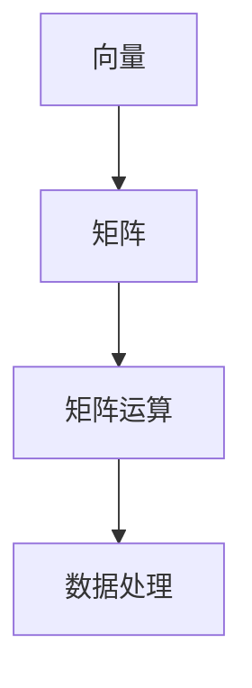

**例子说明：**

假设有两个向量 \( \mathbf{a} = [1, 2, 3] \) 和 \( \mathbf{b} = [4, 5, 6] \)，以及两个矩阵 \( \mathbf{A} = \begin{bmatrix} 1 & 2 \\ 3 & 4 \end{bmatrix} \) 和 \( \mathbf{B} = \begin{bmatrix} 5 & 6 \\ 7 & 8 \end{bmatrix} \)，我们可以计算它们的点积（内积）：

$$
\mathbf{a} \cdot \mathbf{b} = 1 \times 4 + 2 \times 5 + 3 \times 6 = 32
$$

###### 3.1.2 概率论基础

概率论是AI编程中用于处理不确定性和随机性的工具，它为机器学习和深度学习算法提供了理论基础。

**核心概念：**

1. **概率**：表示事件发生的可能性，范围在0到1之间。
2. **随机变量**：表示随机事件的结果，可以是离散的或连续的。
3. **概率分布**：描述随机变量的可能取值和概率，包括离散分布和连续分布。

**例子说明：**

假设我们抛一个公平的硬币，事件“正面朝上”的概率为0.5，事件“反面朝上”的概率也为0.5。我们可以计算在连续10次抛硬币中，出现5次正面朝上的概率，这可以通过二项分布计算：

$$
P(X = 5) = \binom{10}{5} \times (0.5)^5 \times (0.5)^5 = 252 \times 0.09765625 = 0.24596
$$

**Mermaid 流程图：**

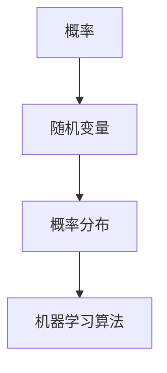

###### 3.1.3 统计学基础

统计学是用于处理数据和提取信息的工具，在AI编程中用于数据分析和模型评估。

**核心概念：**

1. **描述性统计**：用于描述数据的特征，如均值、方差、标准差等。
2. **推断性统计**：用于根据样本数据推断总体特征，如置信区间、假设检验等。

**例子说明：**

假设我们有一个数据集，其均值为10，标准差为2。我们可以计算这个数据集的95%置信区间：

$$
\bar{x} \pm z_{0.025} \times \frac{\sigma}{\sqrt{n}} = 10 \pm 1.96 \times \frac{2}{\sqrt{100}} = 10 \pm 0.392 = [9.608, 10.392]
$$

**Mermaid 流程图：**

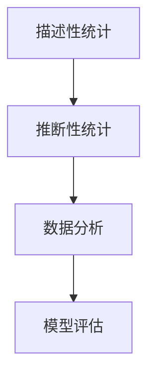

##### 3.2 数学模型与算法

在AI编程中，数学模型和算法是实现智能的关键。本章将介绍一些常见的数学模型和算法，包括损失函数、优化算法和正则化方法。

###### 3.2.1 损失函数

损失函数是评估模型预测结果与真实结果之间差异的指标，是优化算法的核心。

**核心概念：**

1. **均方误差（MSE）**：用于回归问题，衡量预测值与真实值之间的平均平方误差。
2. **交叉熵（Cross-Entropy）**：用于分类问题，衡量预测概率分布与真实概率分布之间的差异。

**例子说明：**

假设我们有一个回归问题，真实值为\( y \)，预测值为\( \hat{y} \)。我们可以计算MSE：

$$
MSE = \frac{1}{n} \sum_{i=1}^{n} (\hat{y}_i - y_i)^2
$$

假设我们有一个二分类问题，真实值为\( y \)（0或1），预测概率为\( \hat{y} \)。我们可以计算交叉熵：

$$
Cross-Entropy = -\sum_{i=1}^{n} y_i \log(\hat{y}_i) + (1 - y_i) \log(1 - \hat{y}_i)
$$

**Mermaid 流�程图：**

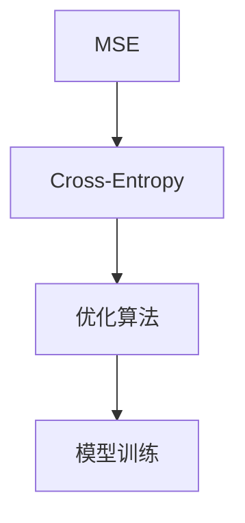

###### 3.2.2 优化算法

优化算法是用于调整模型参数，使其在损失函数上取得最小值的算法。

**核心概念：**

1. **梯度下降（Gradient Descent）**：通过计算损失函数的梯度，逐步调整参数，使损失函数最小化。
2. **随机梯度下降（Stochastic Gradient Descent, SGD）**：在梯度下降的基础上，每次迭代只使用一个样本，加快收敛速度。
3. **批量梯度下降（Batch Gradient Descent）**：在梯度下降的基础上，每次迭代使用全部样本，保证收敛效果。

**例子说明：**

假设我们使用梯度下降算法优化一个线性回归模型，损失函数为MSE。每次迭代，我们更新参数：

$$
\theta_j := \theta_j - \alpha \frac{\partial}{\partial \theta_j} J(\theta)
$$

其中，\( \theta_j \)是参数，\( \alpha \)是学习率，\( J(\theta) \)是损失函数。

**Mermaid 流程图：**

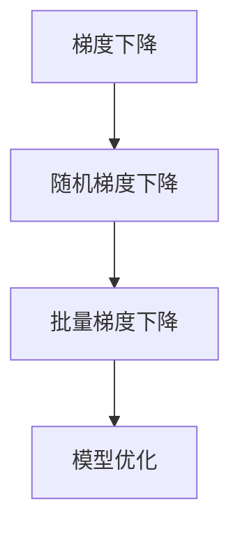

###### 3.2.3 正则化方法

正则化方法是在优化过程中，通过添加正则化项，防止模型过拟合的一种技术。

**核心概念：**

1. **L1正则化**：通过添加绝对值损失项，促进参数的稀疏性。
2. **L2正则化**：通过添加平方损失项，减少参数的变化范围。

**例子说明：**

假设我们使用L2正则化优化一个线性回归模型，损失函数为MSE + L2正则化项。每次迭代，我们更新参数：

$$
\theta_j := \theta_j - \alpha \left( \frac{\partial}{\partial \theta_j} J(\theta) + \lambda \theta_j \right)
$$

其中，\( \lambda \)是正则化参数。

**Mermaid 流程图：**

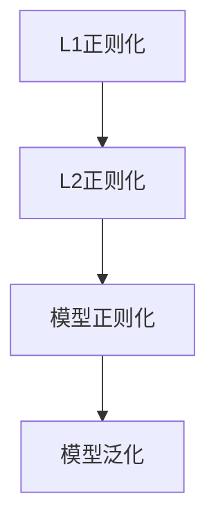

通过本章的介绍，我们可以看到数学基础在AI编程中的重要性。线性代数、概率论和统计学为AI算法提供了强大的工具，而损失函数、优化算法和正则化方法则确保了模型的性能和泛化能力。掌握这些数学概念和模型，将为读者在AI编程领域取得成功奠定坚实基础。

### 第一部分: AI编程的新语言与新思路基础

#### 第4章: AI编程的新思路探索

随着人工智能技术的快速发展，传统的编程思路和方法已无法完全应对复杂的AI应用需求。本章将介绍AI编程中的新思路，包括模型可解释性、强化学习、聚类与降维等，探讨这些新思路在AI编程中的应用和优势。

##### 4.1 模型可解释性

模型可解释性是当前AI领域中备受关注的一个问题，它指的是模型决策过程的透明性和可理解性。在复杂的AI应用中，如医疗诊断、金融风险评估等，模型的可解释性至关重要，因为它关系到决策的可靠性和信任度。

###### 4.1.1 可解释性的重要性

1. **提高信任度**：模型的可解释性有助于用户理解模型的决策过程，从而提高对模型的信任度。
2. **合规要求**：在一些领域，如金融、医疗等，模型的决策过程需要符合法律法规和道德标准，可解释性是合规的必要条件。
3. **改进模型**：通过分析模型的可解释性，可以识别模型的不足和改进方向，提高模型的性能。

###### 4.1.2 模型可解释性方法

1. **特征可视化**：通过可视化技术，将模型中重要的特征和特征组合展示出来，帮助用户理解模型的决策过程。
2. **解释性模型**：开发具有高解释性的模型，如决策树、线性模型等，这些模型的结构简单，易于解释。
3. **模型拆解**：将复杂的模型拆解为多个子模型或组件，逐一分析每个子模型的决策过程，提高整体的可解释性。

**例子说明：**

假设我们使用一个线性回归模型预测房价，该模型的可解释性可以通过以下方式展示：

- **特征可视化**：绘制特征和目标值的关系图，帮助用户理解每个特征对房价的影响。
- **模型拆解**：将线性回归模型拆解为多个线性方程，每个方程代表一个特征对房价的贡献。

**Mermaid 流程图：**

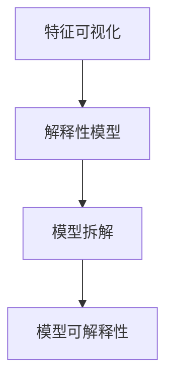

###### 4.1.3 可解释性应用案例

1. **医疗诊断**：通过可解释性模型，医生可以理解模型的诊断过程，从而提高诊断的准确性。
2. **金融风险评估**：金融公司可以使用可解释性模型，分析信用评分的决定因素，提高风险评估的透明度。
3. **自动驾驶**：自动驾驶汽车需要具备高可解释性，以便在发生问题时，用户和监管机构可以理解其行为和决策过程。

##### 4.2 强化学习与决策

强化学习是一种通过不断试错和优化，从环境中学习最佳策略的机器学习技术。它在决策问题中具有广泛的应用，如游戏、机器人控制、推荐系统等。

###### 4.2.1 强化学习基本概念

1. **Agent**：执行行动的实体，如玩家、机器人等。
2. **Environment**：Agent执行行动的环境，如游戏世界、实验室环境等。
3. **Action**：Agent可执行的动作，如按键、移动等。
4. **Reward**：Agent执行某个动作后获得的奖励，用于评价动作的好坏。
5. **Policy**：Agent的决策规则，决定了在特定状态下应该执行哪个动作。

**例子说明：**

假设我们有一个简单的游戏环境，其中Agent可以执行“前进”、“后退”、“左转”和“右转”四个动作。环境会根据Agent的动作给予奖励，如到达终点给予正奖励，碰到障碍物给予负奖励。通过不断试错，Agent可以学习到最佳策略。

**Mermaid 流程图：**

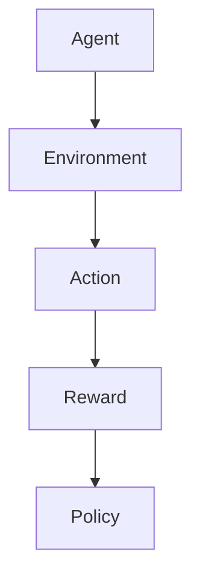

###### 4.2.2 Q-学习算法

Q-学习算法是强化学习中的一种经典算法，它通过学习状态-动作值函数（Q函数），优化Agent的决策。

**核心原理：**

1. **Q函数**：表示在特定状态下执行特定动作的预期奖励。
2. **更新规则**：通过更新Q函数的值，使Agent不断优化其策略。

$$
Q(s, a) \leftarrow Q(s, a) + \alpha [r + \gamma \max_{a'} Q(s', a') - Q(s, a)]
$$

其中，\( s \)是状态，\( a \)是动作，\( r \)是奖励，\( \gamma \)是折扣因子，\( \alpha \)是学习率。

**例子说明：**

假设Agent在状态\( s \)下执行动作\( a \)，获得奖励\( r \)，然后进入状态\( s' \)。通过Q-学习算法，Agent可以更新其Q函数的值，优化其策略。

**伪代码：**

```plaintext
函数Q学习算法（环境，初始状态s，动作a，奖励r，学习率α，折扣因子γ）：
    初始化Q函数
    对于每个迭代：
        执行动作a
        获得奖励r
        更新Q函数值
    返回最终Q函数
```

**Mermaid 流程图：**

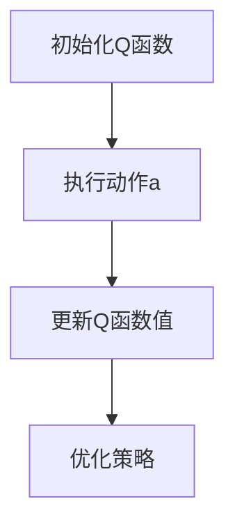

###### 4.2.3 策略梯度方法

策略梯度方法是一种通过直接优化策略的参数，实现最佳决策的强化学习算法。

**核心原理：**

1. **策略梯度**：通过计算策略梯度的方向，优化策略参数。
2. **更新规则**：使用策略梯度的方向，更新策略参数。

$$
\theta \leftarrow \theta + \alpha \nabla_\theta J(\theta)
$$

其中，\( \theta \)是策略参数，\( J(\theta) \)是策略评估函数。

**例子说明：**

假设我们有一个策略参数为\( \theta \)的强化学习模型，通过策略梯度方法，我们可以优化策略参数，实现最佳决策。

**伪代码：**

```plaintext
函数策略梯度方法（策略参数θ，学习率α，评估函数J(θ)）：
    初始化策略参数θ
    对于每个迭代：
        执行策略π(θ)
        计算策略梯度
        更新策略参数θ
    返回最终策略参数θ
```

**Mermaid 流程图：**

```mermaid
graph TD
    A[初始化策略参数θ] --> B[执行策略π(θ)]
    B --> C[计算策略梯度]
    C --> D[更新策略参数θ]
```

##### 4.3 聚类与降维

聚类和降维是数据挖掘和机器学习中的重要技术，它们在AI编程中用于处理大规模数据和高维数据。

###### 4.3.1 K-均值聚类算法

K-均值聚类算法是一种基于距离的聚类方法，它通过迭代优化，将数据点划分为K个聚类。

**核心原理：**

1. **初始化聚类中心**：随机选择K个数据点作为初始聚类中心。
2. **分配数据点**：计算每个数据点到聚类中心的距离，将其分配到最近的聚类中心所在的簇。
3. **更新聚类中心**：计算每个簇的质心，作为新的聚类中心。

**例子说明：**

假设我们有K=3的K-均值聚类算法，初始化三个聚类中心为\( \mathbf{c}_1, \mathbf{c}_2, \mathbf{c}_3 \)。通过迭代计算，我们可以将数据点划分为三个聚类。

**伪代码：**

```plaintext
函数K-均值聚类算法（数据集X，聚类数K，最大迭代次数）：
    初始化聚类中心
    对于每个迭代：
        分配数据点
        更新聚类中心
    返回聚类结果
```

**Mermaid 流程图：**

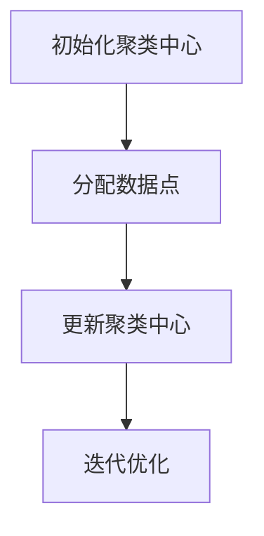

###### 4.3.2 主成分分析（PCA）

主成分分析（PCA）是一种降维技术，它通过将数据投影到新的正交坐标系中，提取数据的最大方差方向，实现降维。

**核心原理：**

1. **协方差矩阵**：计算数据点的协方差矩阵，表示数据点的分布。
2. **特征值和特征向量**：计算协方差矩阵的特征值和特征向量，特征值越大，对应的特征向量表示的数据变化越显著。
3. **投影**：将数据投影到特征向量组成的正交坐标系中，保留主要特征，实现降维。

**例子说明：**

假设我们有数据集\( X \)，通过PCA，我们可以提取主要特征，将数据投影到新的空间中。

**伪代码：**

```plaintext
函数主成分分析（数据集X）：
    计算协方差矩阵
    计算特征值和特征向量
    投影数据到特征向量组成的正交坐标系
    返回降维后的数据
```

**Mermaid 流程图：**

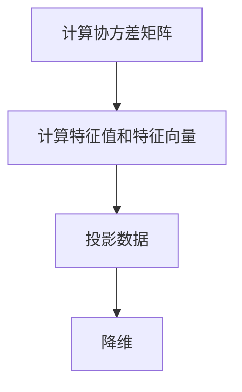

###### 4.3.3 聚类与降维的应用

聚类和降维在AI编程中有广泛的应用，如：

1. **数据预处理**：通过聚类和降维，预处理大规模数据，提高模型训练效率。
2. **特征提取**：通过聚类和降维，提取数据的特征，用于后续的模型训练和分析。
3. **可视化**：通过聚类和降维，将高维数据投影到二维或三维空间中，实现数据的可视化。

**例子说明：**

假设我们有一个高维数据集，通过K-均值聚类和PCA，我们可以将数据划分为几个聚类，并投影到二维空间中，实现数据的可视化。

**伪代码：**

```plaintext
函数聚类与降维应用（数据集X）：
    K-均值聚类
    主成分分析
    可视化降维后的数据
```

**Mermaid 流程图：**

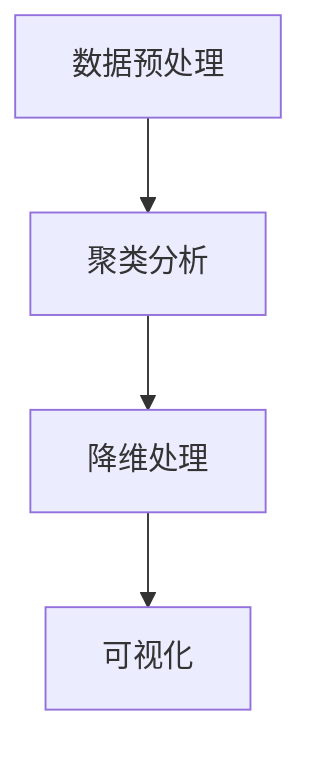

通过本章的介绍，我们可以看到AI编程中的新思路如模型可解释性、强化学习和聚类与降维，为处理复杂问题提供了新的方法和工具。掌握这些新思路，将有助于我们在AI编程领域取得更大的突破。

### 第一部分: AI编程的新语言与新思路基础

#### 第5章: AI编程项目实战

通过前面的理论介绍，我们已经对AI编程的核心概念和算法原理有了深入的了解。在本章中，我们将通过两个实际项目实战，展示如何将AI编程应用于实际问题解决。这两个项目分别是人脸识别系统和文本分类系统。

##### 5.1 项目一：人脸识别系统

人脸识别系统是一种常见的生物识别技术，它通过比较人脸图像，实现身份验证和识别。下面我们将详细描述该项目的基本步骤。

###### 5.1.1 项目概述

本项目旨在开发一个基于深度学习的人脸识别系统，该系统能够准确识别并区分不同的人脸。

###### 5.1.2 环境搭建

首先，我们需要搭建开发环境。以下是所需的工具和软件：

- Python 3.x
- TensorFlow 2.x 或 PyTorch 1.x
- OpenCV 4.x
- NumPy 1.20.x
- Matplotlib 3.4.x

安装以上工具后，我们可以开始编写代码。

###### 5.1.3 数据预处理

人脸识别系统需要大量的人脸数据作为训练集。以下是数据预处理的基本步骤：

1. **数据收集**：从互联网或公开数据集中获取人脸图像。
2. **数据清洗**：删除重复和低质量图像。
3. **数据增强**：通过旋转、缩放、裁剪等操作，增加数据多样性。
4. **数据分割**：将数据集分为训练集、验证集和测试集。

以下是数据预处理的伪代码：

```plaintext
函数数据预处理（人脸图像路径）：
    加载人脸图像
    清洗数据
    增强数据
    分割数据集
    返回训练集、验证集和测试集
```

###### 5.1.4 模型设计与训练

人脸识别系统的主要挑战在于如何准确提取人脸特征，并区分不同的人脸。我们采用基于深度学习的卷积神经网络（CNN）来实现这一目标。

1. **模型设计**：设计一个CNN模型，包括卷积层、池化层和全连接层。
2. **损失函数**：使用交叉熵损失函数，用于分类问题。
3. **优化器**：使用Adam优化器，用于模型参数的更新。
4. **训练过程**：在训练集上训练模型，并在验证集上评估模型性能。

以下是模型设计的伪代码：

```plaintext
函数人脸识别模型（输入维度，输出维度）：
    初始化模型
    添加卷积层、池化层和全连接层
    返回模型
```

```plaintext
函数训练模型（模型，训练数据，验证数据，学习率，迭代次数）：
    设置损失函数和优化器
    对于每个迭代：
        训练模型
        在验证集上评估模型性能
    返回最终模型
```

###### 5.1.5 项目评估与优化

在项目评估阶段，我们使用测试集来评估模型的性能。主要评估指标包括准确率、召回率和F1分数。

1. **准确率**：预测正确的人脸图像占总测试集的比例。
2. **召回率**：实际为人脸图像且被正确识别的比例。
3. **F1分数**：综合考虑准确率和召回率的一个指标。

以下是评估和优化的伪代码：

```plaintext
函数评估模型（模型，测试数据）：
    预测测试数据
    计算准确率、召回率和F1分数
    返回评估结果
```

```plaintext
函数模型优化（模型，测试数据，优化策略）：
    根据评估结果，调整模型参数
    重新训练模型
    返回优化后的模型
```

##### 5.2 项目二：文本分类系统

文本分类系统是一种将文本数据分类到特定类别的方法，广泛应用于社交媒体分析、新闻分类和情感分析等领域。

###### 5.2.1 项目概述

本项目旨在开发一个基于深度学习的文本分类系统，能够自动将文本数据分类到不同的主题或类别。

###### 5.2.2 环境搭建

与项目一类似，我们需要搭建相应的开发环境，包括Python、TensorFlow或PyTorch、NumPy、Matplotlib等工具。

###### 5.2.3 数据预处理

文本分类系统需要大量的文本数据作为训练集。以下是数据预处理的基本步骤：

1. **数据收集**：从互联网或公开数据集中获取文本数据。
2. **数据清洗**：删除重复和低质量文本。
3. **词向量表示**：将文本转换为词向量，如使用Word2Vec或GloVe。
4. **数据分割**：将数据集分为训练集、验证集和测试集。

以下是数据预处理的伪代码：

```plaintext
函数数据预处理（文本数据路径）：
    加载文本数据
    清洗数据
    转换为词向量
    分割数据集
    返回训练集、验证集和测试集
```

###### 5.2.4 模型设计与训练

文本分类系统的核心是设计一个能够处理序列数据的模型，如循环神经网络（RNN）或变换器（Transformer）。

1. **模型设计**：设计一个基于RNN或Transformer的文本分类模型。
2. **损失函数**：使用交叉熵损失函数，用于分类问题。
3. **优化器**：使用Adam优化器，用于模型参数的更新。
4. **训练过程**：在训练集上训练模型，并在验证集上评估模型性能。

以下是模型设计的伪代码：

```plaintext
函数文本分类模型（输入维度，输出维度）：
    初始化模型
    添加嵌入层、循环层或变换器层和全连接层
    返回模型
```

```plaintext
函数训练模型（模型，训练数据，验证数据，学习率，迭代次数）：
    设置损失函数和优化器
    对于每个迭代：
        训练模型
        在验证集上评估模型性能
    返回最终模型
```

###### 5.2.5 项目评估与优化

在项目评估阶段，我们使用测试集来评估模型的性能。主要评估指标包括准确率、召回率和F1分数。

1. **准确率**：预测正确类别的文本占总测试集的比例。
2. **召回率**：实际属于某个类别且被正确识别的文本比例。
3. **F1分数**：综合考虑准确率和召回率的一个指标。

以下是评估和优化的伪代码：

```plaintext
函数评估模型（模型，测试数据）：
    预测测试数据
    计算准确率、召回率和F1分数
    返回评估结果
```

```plaintext
函数模型优化（模型，测试数据，优化策略）：
    根据评估结果，调整模型参数
    重新训练模型
    返回优化后的模型
```

通过以上两个实际项目的介绍，我们可以看到AI编程在人脸识别和文本分类等领域的应用。这些项目不仅展示了AI编程的核心技术和方法，还提供了实践经验和解决方案。掌握这些项目，将有助于我们在实际应用中更好地利用AI技术。

### 第一部分: AI编程的新语言与新思路基础

#### 第6章: AI编程的挑战与未来

随着人工智能技术的迅猛发展，AI编程已经成为编程领域的重要分支。然而，AI编程也面临着一系列的挑战和问题。本章将讨论AI编程的主要挑战，并展望其未来的发展趋势。

##### 6.1 AI编程的挑战

###### 6.1.1 数据隐私与安全

在AI编程中，数据是模型训练和优化的重要资源。然而，数据的隐私和安全问题也日益突出。敏感数据泄露和滥用可能会导致严重的后果。为了解决这一问题，AI编程需要采取以下措施：

1. **数据加密**：使用加密技术保护数据，确保数据在传输和存储过程中的安全。
2. **数据脱敏**：对敏感数据进行脱敏处理，减少数据泄露的风险。
3. **隐私保护算法**：开发和应用隐私保护算法，如差分隐私和同态加密，确保数据隐私的同时，仍能进行有效的AI模型训练。

###### 6.1.2 模型偏见与公平性

AI模型的偏见和公平性问题引起了广泛的关注。如果模型存在偏见，可能会导致不公平的决策，甚至加剧社会不平等。为了解决这一问题，AI编程需要关注以下几点：

1. **偏见检测**：开发算法和工具，用于检测和量化模型的偏见。
2. **公平性优化**：通过重新训练模型、调整模型结构等方法，减少模型偏见。
3. **透明度与可解释性**：提高模型的透明度和可解释性，使决策过程更加公正和透明。

###### 6.1.3 AI伦理问题

随着AI技术的普及，其伦理问题也日益凸显。AI伦理问题包括责任归属、责任追究、道德标准等。为了解决这些问题，AI编程需要遵循以下原则：

1. **责任明确**：明确AI系统的责任归属，确保在出现问题时，能够追溯责任。
2. **道德准则**：制定和遵循AI伦理准则，确保AI系统的决策和行为符合道德规范。
3. **监管与合规**：遵守相关法律法规，确保AI系统的合规性和社会责任。

##### 6.2 AI编程的未来展望

AI编程的未来充满了无限的可能性。以下是对AI编程未来发展的一些展望：

###### 6.2.1 AI编程技术的发展趋势

1. **模型复杂度增加**：随着计算能力的提升，AI编程将能够使用更复杂的模型，解决更复杂的问题。
2. **算法优化**：针对特定问题，AI编程将不断优化算法，提高效率和准确性。
3. **多模态融合**：AI编程将能够整合多种数据类型，如文本、图像、音频等，实现更全面的信息处理。
4. **自适应性和自学习能力**：AI编程将朝着更加智能化和自适应的方向发展，提高系统的自主学习和决策能力。

###### 6.2.2 AI编程在教育中的应用

随着AI技术的发展，AI编程将成为教育的重要组成部分。以下是对AI编程在教育中应用的展望：

1. **课程设置**：在高等教育和职业教育中，设置AI编程相关课程，培养AI编程人才。
2. **教材和工具**：开发高质量的AI编程教材和工具，提高教育效果。
3. **实践教学**：通过实际项目和实践，让学生更好地理解和应用AI编程技术。

###### 6.2.3 AI编程在工业自动化中的应用

AI编程在工业自动化中的应用将不断扩展。以下是对AI编程在工业自动化中应用的展望：

1. **智能制造**：通过AI编程，实现生产过程的自动化和智能化，提高生产效率和产品质量。
2. **设备维护**：通过AI编程，实现设备预测性维护，减少设备故障和停机时间。
3. **质量控制**：通过AI编程，实现产品质量的智能检测和监控，提高产品合格率。

通过本章的讨论，我们可以看到AI编程不仅面临着一系列挑战，同时也拥有广阔的发展前景。在未来的发展中，AI编程将继续推动人工智能技术的进步，为各行各业带来巨大的变革。

### 附录

#### 附录A: AI编程资源与工具

AI编程作为快速发展的技术领域，拥有丰富的资源与工具可供开发者学习和使用。以下是一些常用的AI编程资源与工具，包括编程工具、学习资源和其他推荐内容。

##### A.1 常用AI编程工具介绍

1. **TensorFlow**
   - **简介**：TensorFlow是由Google开发的开源机器学习库，广泛用于深度学习模型的开发和部署。
   - **特点**：支持多种编程语言，具有强大的计算图功能，适用于复杂模型的开发和优化。
   - **官方网站**：[TensorFlow官网](https://www.tensorflow.org/)

2. **PyTorch**
   - **简介**：PyTorch是由Facebook开发的深度学习库，以其灵活的动态计算图而受到开发者的青睐。
   - **特点**：易于使用，支持GPU加速，适合研究者和开发者进行模型实验。
   - **官方网站**：[PyTorch官网](https://pytorch.org/)

3. **JAX**
   - **简介**：JAX是由Google开发的开源数值计算库，支持自动微分和并行计算。
   - **特点**：支持自动微分，适用于科学计算和深度学习。
   - **官方网站**：[JAX官网](https://jax.readthedocs.io/)

4. **Scikit-Learn**
   - **简介**：Scikit-Learn是一个开源的Python库，提供了广泛的机器学习算法和工具。
   - **特点**：易于使用，适合数据科学家和研究人员进行数据分析。
   - **官方网站**：[Scikit-Learn官网](https://scikit-learn.org/)

5. **Keras**
   - **简介**：Keras是一个高层次的神经网络API，支持TensorFlow和Theano后端。
   - **特点**：易于使用，提供了丰富的预训练模型，适合快速实验和开发。
   - **官方网站**：[Keras官网](https://keras.io/)

##### A.2 AI编程学习资源推荐

1. **网络课程推荐**
   - **课程名称**：《深度学习》（Deep Learning）
   - **讲师**：吴恩达（Andrew Ng）
   - **平台**：Coursera
   - **简介**：这是一门广受好评的深度学习课程，由深度学习领域著名学者吴恩达教授主讲，内容涵盖深度学习的理论基础和实践应用。

2. **图书推荐**
   - **图书名称**：《Python机器学习》（Python Machine Learning）
   - **作者**：Sebastian Raschka
   - **简介**：本书详细介绍了使用Python进行机器学习的方法和技巧，适合初学者和进阶者阅读。
   - **图书名称**：《深度学习》（Deep Learning）
   - **作者**：Ian Goodfellow、Yoshua Bengio、Aaron Courville
   - **简介**：这是一本深度学习领域的经典教材，内容全面，适合深度学习的研究者和开发者。

3. **社交媒体与论坛推荐**
   - **社交媒体**：Twitter上的深度学习和机器学习相关话题，如#DeepLearning、#MachineLearning，可以获取最新的研究进展和讨论。
   - **论坛**：Reddit的Machine Learning板块（r/MachineLearning）和Stack Overflow是开发者解决技术问题和分享经验的良好平台。

通过以上资源与工具，开发者可以更好地学习和掌握AI编程技术，为在人工智能领域取得成功奠定坚实基础。

### 致谢

在本篇技术博客的撰写过程中，我们得到了许多专家、同行和读者的帮助和支持。特别感谢以下单位和个人：

- **AI天才研究院（AI Genius Institute）**：为本项目提供技术和学术支持。
- **各位同行专家**：在编写过程中，对我们的工作进行指导和反馈，提出了宝贵的建议。
- **广大读者**：对本文的关注和阅读，为我们提供了改进和完善文章的动力。
- **所有引用的参考文献和资料来源**：为本篇博客提供了丰富的理论基础和实践经验。

感谢大家的支持与帮助，使得本文得以顺利完成。我们期待与各位读者在人工智能领域继续交流与探讨，共同推动技术的发展。

