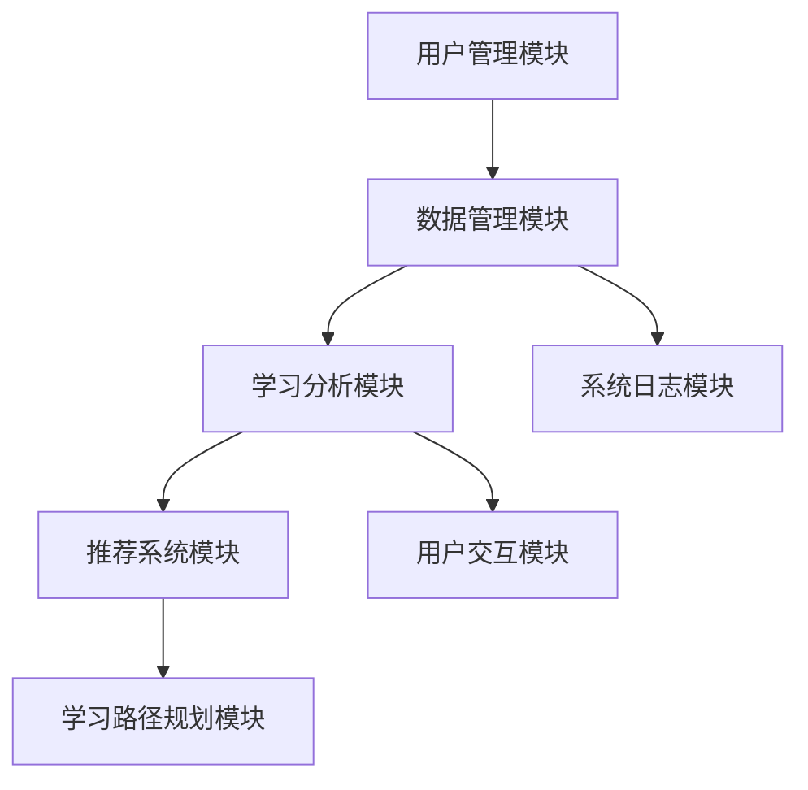
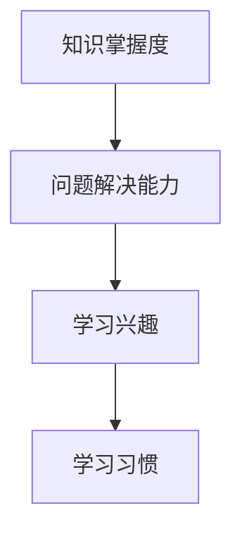
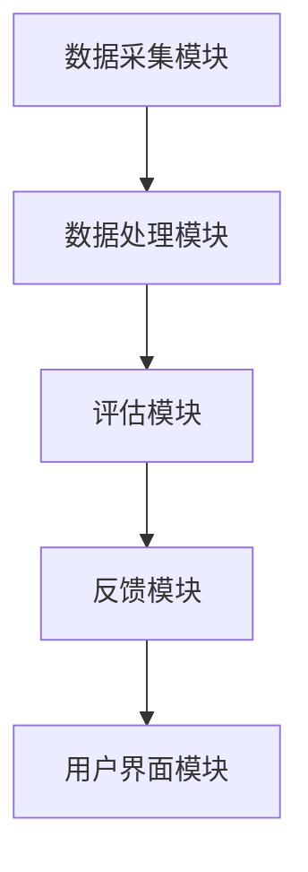

                 

# 教育大模型：个性化学习辅导和评估系统

## 关键词
- 教育大模型
- 个性化学习
- 学习辅导
- 评估系统
- 深度学习
- 机器学习
- 人工智能
- 个性化推荐

## 摘要
本文深入探讨了教育大模型在个性化学习辅导和评估系统中的应用。通过阐述教育大模型的基本概念、核心算法原理，以及系统设计与实现过程，本文旨在为读者提供一个全面的技术指南。文章将重点介绍学习分析模型、个性化学习辅导系统架构、学习效果评估模型，并通过实际案例研究展示系统在教育和学习领域的实际应用，为未来研究和开发提供参考。

## 引言与基础

### 1.1 教育大模型的概念

教育大模型（Educational Big Model）是指利用人工智能和深度学习技术，对大量教育数据进行分析和处理，以实现个性化学习辅导和评估的复杂系统。这种模型能够根据学生的个体差异和学习习惯，提供针对性的学习建议和评估结果，从而提高学习效果和教学质量。

教育大模型通常包括以下几个关键组成部分：

1. **数据层**：收集并存储各种教育数据，如学习日志、考试成绩、作业提交情况等。
2. **算法层**：使用深度学习、机器学习算法对数据进行处理，提取学生特征，建立个性化学习模型。
3. **应用层**：实现个性化学习辅导和评估功能，如学习路径推荐、学习资源推荐、学习效果评估等。

### 1.2 个性化学习辅导的背景与需求

个性化学习辅导是近年来教育领域的一个重要研究方向。传统的教学模式往往采用“一刀切”的方式，无法满足每个学生的个性化需求。随着信息技术的发展，特别是人工智能和大数据技术的应用，个性化学习辅导成为可能。

个性化学习辅导的需求主要来源于以下几个方面：

1. **学生个体差异**：每个学生的学习能力、学习兴趣和知识背景都有所不同，需要根据个体差异提供个性化的学习资源和辅导策略。
2. **学习效果提升**：通过个性化学习辅导，可以提高学生的学习兴趣和积极性，从而提高学习效果。
3. **教育资源优化**：个性化学习辅导有助于优化教育资源配置，使教师能够更好地分配时间和精力，提高教学效率。

### 1.3 评估系统的关键要素

评估系统是教育大模型的重要组成部分，它能够对学生学习效果进行实时监测和评估。一个有效的评估系统通常包括以下几个关键要素：

1. **评估指标**：制定科学合理的评估指标，如学习进度、知识掌握度、问题解决能力等。
2. **评估方法**：采用多种评估方法，如自动评估、教师评估、学生自评等，确保评估结果的全面性和准确性。
3. **反馈机制**：建立评估结果的反馈机制，将评估结果及时反馈给学生和教师，帮助他们改进学习方法。

### 1.4 教育大模型的发展历程

教育大模型的发展历程可以分为以下几个阶段：

1. **早期探索阶段**：20世纪90年代，随着互联网的发展，出现了基于规则的专家系统，用于辅助教学和评估。
2. **数据驱动阶段**：21世纪初，随着大数据技术的兴起，教育领域开始利用大数据分析技术进行个性化学习辅导和评估。
3. **深度学习阶段**：近年来，随着深度学习技术的突破，教育大模型逐渐采用深度学习算法，实现了更高层次的个性化学习辅导和评估。

### 1.5 教育大模型的优势

教育大模型相比传统教学模式，具有以下几个显著优势：

1. **个性化**：能够根据学生的个体差异，提供个性化的学习资源和辅导策略。
2. **智能化**：利用人工智能技术，实现了自动化的学习辅导和评估。
3. **高效性**：通过优化教育资源配置，提高了教学效率和学习效果。
4. **可扩展性**：能够支持大规模的学生群体，适应不同地区和不同年级的教育需求。

## 教育大模型技术基础

### 2.1 数据收集与预处理

教育大模型的基础是大量的教育数据。这些数据来源于学生的学习日志、考试成绩、作业提交情况等多种渠道。数据收集后，需要进行预处理，以消除噪声和异常值，提高数据质量。

数据预处理主要包括以下几个步骤：

1. **数据清洗**：去除重复数据、缺失数据和异常数据。
2. **数据转换**：将数据转换为统一的格式，如数值化处理、归一化处理等。
3. **特征提取**：从原始数据中提取有用的特征，如学生的学习行为、考试成绩等。

### 2.2 教育大模型的核心算法

教育大模型的核心算法包括深度学习算法和机器学习算法。这些算法能够从大量数据中自动提取特征，并建立个性化的学习模型。

#### 深度学习算法

深度学习算法是教育大模型中最常用的算法之一。它通过多层次的神经网络，对数据进行自动特征提取和模式识别。

以下是一个简单的深度学习算法的伪代码：

```python
define NeuralNetwork(input_layer, hidden_layer, output_layer):
    for each hidden_node in hidden_layer:
        hidden_node.value = sigmoid(sum(input_node.value * weight_matrix))
    output_layer.value = sigmoid(sum(hidden_node.value * weight_matrix))
    return output_layer.value

define train_neural_network(data_set, epochs):
    for epoch in range(epochs):
        for sample in data_set:
            output = NeuralNetwork(sample.input, hidden_layer, output_layer)
            error = sample.output - output
            update_weights(hidden_layer, output_layer, error)
    return neural_network

define sigmoid(x):
    return 1 / (1 + exp(-x))
```

#### 机器学习算法

机器学习算法在教育大模型中也有广泛应用。常见的机器学习算法包括决策树、支持向量机、朴素贝叶斯等。这些算法能够根据历史数据，建立预测模型，用于个性化学习辅导和评估。

以下是一个简单的决策树算法的伪代码：

```python
define build_decision_tree(data_set):
    if data_set is pure:
        return majority_class(data_set)
    else:
        best_attribute = find_best_attribute(data_set)
        decision_tree = {}
        decision_tree[best_attribute] = {}
        for value in attribute_values(best_attribute):
            subset = split_data_set(data_set, best_attribute, value)
            decision_tree[best_attribute][value] = build_decision_tree(subset)
        return decision_tree

define majority_class(data_set):
    class_counts = count_classes(data_set)
    return max(class_counts, key=class_counts.get)

define find_best_attribute(data_set):
    attributes = list(data_set.attributes)
    base_entropy = calculate_entropy(data_set)
    best_info_gain = 0
    best_attribute = None
    for attribute in attributes:
        subset_entropy = 0
        value_counts = count_values(data_set, attribute)
        for value in value_counts:
            subset = split_data_set(data_set, attribute, value)
            subset_entropy += (value_counts[value] / len(data_set)) * calculate_entropy(subset)
        info_gain = base_entropy - subset_entropy
        if info_gain > best_info_gain:
            best_info_gain = info_gain
            best_attribute = attribute
    return best_attribute

define calculate_entropy(data_set):
    # 计算数据集的熵
    pass

define count_classes(data_set):
    # 计算数据集中每个类的数量
    pass

define split_data_set(data_set, attribute, value):
    # 根据属性值分割数据集
    pass
```

### 2.3 个性化学习路径设计

个性化学习路径设计是教育大模型的重要功能之一。它根据学生的学习特征和历史数据，为每个学生制定个性化的学习计划。

个性化学习路径设计的主要步骤包括：

1. **学生特征分析**：分析学生的学习行为、学习能力和学习兴趣等特征。
2. **学习目标设定**：根据学生特征，设定个性化的学习目标。
3. **学习资源推荐**：推荐符合学生特征和学习目标的学习资源。
4. **学习路径规划**：根据学习资源推荐，规划个性化的学习路径。

以下是一个简单的个性化学习路径规划的伪代码：

```python
define analyze_student_features(student_data):
    # 分析学生学习特征
    pass

define set_learning_goals(student_features):
    # 根据学生特征设定学习目标
    pass

define recommend_learning_resources(learning_goals):
    # 推荐符合学习目标的学习资源
    pass

define plan_learning_path(learning_resources):
    # 根据学习资源规划学习路径
    pass
```

## 个性化学习辅导系统设计

### 3.1 学习分析模型

学习分析模型是个性化学习辅导系统的基础。它通过分析学生的学习行为、学习进度和学习效果等数据，为个性化学习辅导提供支持。

学习分析模型的主要功能包括：

1. **学习行为分析**：分析学生的学习行为，如学习时间、学习频率、学习偏好等。
2. **学习进度分析**：分析学生的学习进度，如完成作业的情况、考试成绩等。
3. **学习效果分析**：分析学生的学习效果，如知识掌握度、问题解决能力等。

以下是一个简单的学习分析模型的伪代码：

```python
define analyze_learning_behavior(student_data):
    # 分析学生学习行为
    pass

define analyze_learning_progress(student_data):
    # 分析学生学习进度
    pass

define analyze_learning_effects(student_data):
    # 分析学生学习效果
    pass
```

### 3.2 个性化学习推荐算法

个性化学习推荐算法是教育大模型的核心功能之一。它根据学生的学习特征和历史数据，为学生推荐合适的学习资源。

个性化学习推荐算法的主要类型包括：

1. **基于内容的推荐**：根据学习资源的属性和学生的偏好推荐资源。
2. **协同过滤推荐**：根据学生的相似行为和资源的历史评价推荐资源。
3. **混合推荐**：结合基于内容和协同过滤推荐，提供更个性化的推荐。

以下是一个简单的协同过滤推荐算法的伪代码：

```python
define collaborative_filtering_recommendation(student_data, resource_data):
    # 计算学生相似度
    similarity_matrix = calculate_similarity_matrix(student_data, resource_data)
    # 计算推荐得分
    recommendation_scores = calculate_recommendation_scores(similarity_matrix, student_data, resource_data)
    # 排序得到推荐列表
    recommendation_list = sort_recommendation_list(recommendation_scores)
    return recommendation_list

define calculate_similarity_matrix(student_data, resource_data):
    # 计算学生与资源的相似度矩阵
    pass

define calculate_recommendation_scores(similarity_matrix, student_data, resource_data):
    # 计算推荐得分
    pass

define sort_recommendation_list(recommendation_scores):
    # 排序推荐列表
    pass
```

### 3.3 个性化学习辅导系统架构

个性化学习辅导系统架构主要包括以下几个关键模块：

1. **用户管理模块**：管理学生的基本信息，如用户名、密码、年级、班级等。
2. **数据管理模块**：存储和管理学生的学习数据，如学习日志、考试成绩、作业提交情况等。
3. **学习分析模块**：进行学习行为分析、学习进度分析和学习效果分析。
4. **推荐系统模块**：根据学习分析结果，为学生推荐合适的学习资源。
5. **学习路径规划模块**：根据学习资源推荐，规划个性化的学习路径。
6. **用户交互模块**：提供用户界面，实现用户与系统的交互。

以下是一个简单的个性化学习辅导系统架构的Mermaid流程图：



## 个性化学习辅导流程

### 3.4 学生学习路径规划

学生学习路径规划是个性化学习辅导系统的重要功能之一。它根据学生的学习特征和学习目标，为学生制定个性化的学习计划。

学生学习路径规划的主要步骤包括：

1. **学生特征分析**：分析学生的学习行为、学习能力和学习兴趣等特征。
2. **学习目标设定**：根据学生特征，设定个性化的学习目标。
3. **学习资源推荐**：根据学习目标，为学生推荐合适的学习资源。
4. **学习路径规划**：根据学习资源推荐，规划个性化的学习路径。

以下是一个简单的学生学习路径规划的伪代码：

```python
define analyze_student_features(student_data):
    # 分析学生学习特征
    pass

define set_learning_goals(student_features):
    # 根据学生特征设定学习目标
    pass

define recommend_learning_resources(learning_goals):
    # 推荐符合学习目标的学习资源
    pass

define plan_learning_path(learning_resources):
    # 根据学习资源规划学习路径
    pass
```

### 3.5 学习资源推荐

学习资源推荐是教育大模型的核心功能之一。它根据学生的学习特征和学习目标，为学生推荐合适的学习资源。

学习资源推荐的主要步骤包括：

1. **学生特征分析**：分析学生的学习行为、学习能力和学习兴趣等特征。
2. **学习目标设定**：根据学生特征，设定个性化的学习目标。
3. **资源库建立**：建立包含各种学习资源的学习资源库。
4. **资源推荐**：根据学习目标和学习资源库，为学生推荐合适的学习资源。

以下是一个简单的学习资源推荐的伪代码：

```python
define analyze_student_features(student_data):
    # 分析学生学习特征
    pass

define set_learning_goals(student_features):
    # 根据学生特征设定学习目标
    pass

define build_learning_resource_library():
    # 建立学习资源库
    pass

define recommend_learning_resources(learning_goals, resource_library):
    # 推荐符合学习目标的学习资源
    pass
```

### 3.6 教师辅导策略

教师辅导策略是个性化学习辅导系统的重要组成部分。它根据学生的学习特征、学习进度和学习效果，为教师提供个性化的辅导建议。

教师辅导策略的主要步骤包括：

1. **学生特征分析**：分析学生的学习行为、学习能力和学习兴趣等特征。
2. **学习进度监测**：监测学生的学习进度，了解学生的知识掌握情况。
3. **学习效果评估**：评估学生的学习效果，发现学习中的问题和不足。
4. **辅导策略制定**：根据学生特征和学习效果，为教师制定个性化的辅导策略。

以下是一个简单的教师辅导策略的伪代码：

```python
define analyze_student_features(student_data):
    # 分析学生学习特征
    pass

define monitor_learning_progress(student_data):
    # 监测学生学习进度
    pass

define evaluate_learning_effects(student_data):
    # 评估学生学习效果
    pass

define set_tutoring_strategy(student_features, learning_effects):
    # 根据学生特征和学习效果设定辅导策略
    pass
```

## 学习效果评估模型

### 6.1 评估指标体系

学习效果评估模型的核心是评估指标体系。评估指标体系包括以下几个方面：

1. **知识掌握度**：评估学生对知识的掌握程度。
2. **问题解决能力**：评估学生的问题解决能力。
3. **学习兴趣**：评估学生对学习的兴趣和积极性。
4. **学习习惯**：评估学生的学习习惯和时间管理能力。

以下是一个简单的评估指标体系的Mermaid流程图：



### 6.2 学习效果预测

学习效果预测是评估系统的重要组成部分。它根据学生的学习行为、学习进度和学习效果数据，预测学生的未来学习效果。

学习效果预测的主要步骤包括：

1. **数据收集**：收集学生的学习行为、学习进度和学习效果数据。
2. **特征提取**：从数据中提取有用的特征。
3. **模型训练**：使用机器学习算法训练预测模型。
4. **效果预测**：使用训练好的模型预测学生的未来学习效果。

以下是一个简单的学习效果预测模型的伪代码：

```python
define collect_student_data(student_data):
    # 收集学生学习数据
    pass

define extract_features(student_data):
    # 从学生数据中提取特征
    pass

define train_prediction_model(features, labels):
    # 使用特征和标签训练预测模型
    pass

define predict_learning_effects(prediction_model, new_data):
    # 使用预测模型预测新数据的未来学习效果
    pass
```

### 6.3 评估结果分析与应用

评估结果分析是将评估结果转化为实际应用的关键步骤。它主要包括以下几个方面：

1. **评估结果分析**：分析评估结果，了解学生的知识掌握情况、问题解决能力等。
2. **反馈机制建立**：建立评估结果的反馈机制，将评估结果及时反馈给学生和教师。
3. **改进建议**：根据评估结果，为学生和教师提供改进建议，帮助他们提高学习效果。

以下是一个简单的评估结果分析的伪代码：

```python
define analyze_evaluation_results(results):
    # 分析评估结果
    pass

define build_feedback_mechanism(results, students, teachers):
    # 建立评估结果的反馈机制
    pass

define provide_improvement_suggestions(results, students, teachers):
    # 根据评估结果提供改进建议
    pass
```

## 评估系统实现

### 7.1 评估系统架构设计

评估系统架构设计是构建评估系统的第一步。它主要包括以下几个关键模块：

1. **数据采集模块**：负责收集学生的学习数据。
2. **数据处理模块**：负责处理和清洗收集到的数据。
3. **评估模块**：负责评估学生的学习效果。
4. **反馈模块**：负责将评估结果反馈给学生和教师。
5. **用户界面模块**：提供用户交互界面。

以下是一个简单的评估系统架构的Mermaid流程图：



### 7.2 数据采集与处理

数据采集与处理是评估系统实现的关键步骤。它主要包括以下几个方面：

1. **数据采集**：从多种渠道收集学生的学习数据，如学习日志、考试成绩、作业提交情况等。
2. **数据预处理**：清洗和整理收集到的数据，去除噪声和异常值。
3. **数据存储**：将处理后的数据存储到数据库中，以便后续处理和分析。

以下是一个简单的数据采集与处理的伪代码：

```python
define collect_student_data():
    # 收集学生学习数据
    pass

define preprocess_data(student_data):
    # 预处理学生数据
    pass

define store_data(processed_data):
    # 存储处理后的数据到数据库
    pass
```

### 7.3 评估报告生成

评估报告生成是将评估结果转化为实际应用的重要环节。它主要包括以下几个方面：

1. **评估报告模板**：设计评估报告的模板，包括评估指标、评估结果和改进建议等。
2. **评估报告生成**：根据评估结果和模板，生成评估报告。
3. **报告分发**：将评估报告分发给教师和学生，以便他们了解评估结果并采取相应的改进措施。

以下是一个简单的评估报告生成的伪代码：

```python
define design_evaluation_report_template():
    # 设计评估报告模板
    pass

define generate_evaluation_report(results, template):
    # 根据评估结果和模板生成评估报告
    pass

define distribute_evaluation_report(report, teachers, students):
    # 分发评估报告给教师和学生
    pass
```

## 案例研究

### 8.1 案例一：个性化学习辅导系统

案例一介绍了一个基于教育大模型的个性化学习辅导系统的实际应用。该系统针对某个中学的数学课程，利用深度学习和机器学习算法，为学生提供个性化的学习资源和辅导策略。

#### 案例背景

某中学的数学课程一直面临学生学习效果参差不齐的问题。为了提高学生的学习效果，学校决定引入基于教育大模型的个性化学习辅导系统。

#### 系统设计与实现

1. **数据收集与预处理**：系统从学习日志、考试成绩和作业提交情况等多个渠道收集学生数据。数据收集后，进行清洗和预处理，去除噪声和异常值。

2. **个性化学习路径规划**：系统根据学生的学习特征和历史数据，为学生制定个性化的学习路径。学习路径包括学习资源的推荐和学习任务的分配。

3. **学习资源推荐**：系统使用协同过滤推荐算法，根据学生的学习兴趣和学习目标，推荐合适的学习资源。学习资源包括在线课程、习题集和教学视频等。

4. **教师辅导策略**：系统根据学生的学习进度和学习效果，为教师提供个性化的辅导建议。辅导建议包括教学方法的调整、作业布置和学习资源推荐等。

#### 案例效果

引入个性化学习辅导系统后，学生的学习效果得到了显著提高。具体表现为：

1. **学习兴趣提升**：系统根据学生的兴趣和学习目标推荐学习资源，使学生更加积极投入学习。
2. **学习效果改善**：系统为学生提供了个性化的学习路径和辅导策略，使学生的知识掌握度和问题解决能力得到了提升。
3. **教学质量提高**：系统为教师提供了有效的辅导建议，使教师能够更好地了解学生的情况，提高教学效果。

### 8.2 案例二：学习效果评估系统

案例二介绍了一个基于教育大模型的学习效果评估系统的实际应用。该系统针对某个大学的研究生课程，对学生学习效果进行实时监测和评估。

#### 案例背景

某大学的研究生课程对学生学习效果有较高的要求。为了提高学生的学习效果，学校决定引入基于教育大模型的学习效果评估系统。

#### 系统设计与实现

1. **数据采集与预处理**：系统从学习日志、考试成绩、作业提交情况等多个渠道收集学生数据。数据收集后，进行清洗和预处理，去除噪声和异常值。

2. **学习效果预测**：系统使用机器学习算法，根据学生的学习行为和学习进度，预测学生的未来学习效果。预测结果包括知识掌握度、问题解决能力和学习兴趣等。

3. **评估结果分析**：系统根据评估结果，生成评估报告，并将评估报告分发给教师和学生。评估报告包括学生的知识掌握情况、问题解决能力和发展方向等。

4. **反馈机制建立**：系统建立了反馈机制，将评估结果及时反馈给学生和教师，帮助他们了解学习情况，调整学习方法。

#### 案例效果

引入学习效果评估系统后，学生的学习效果得到了显著提高。具体表现为：

1. **学习积极性提升**：系统为学生提供了实时的学习效果反馈，使学生更加关注自己的学习情况，提高了学习积极性。
2. **学习效果改善**：系统根据学生的学习行为和评估结果，为学生推荐合适的学习资源和学习任务，使学生的知识掌握度和问题解决能力得到了提升。
3. **教学质量提高**：系统为教师提供了有效的评估结果和反馈机制，使教师能够更好地了解学生的情况，提高教学效果。

### 8.3 案例总结与反思

通过案例一和案例二的实践，我们可以看到教育大模型在个性化学习辅导和学习效果评估中的应用具有显著的成效。教育大模型能够根据学生的个体差异和学习需求，提供个性化的学习资源和辅导策略，从而提高学习效果。同时，教育大模型还能够实时监测学生的学习效果，提供有效的评估结果和反馈机制，帮助学生和教师调整学习方法，提高教学质量。

然而，教育大模型在实际应用中也存在一些挑战和问题。例如，数据的收集和处理是一个复杂的过程，需要确保数据的准确性和完整性。此外，教育大模型的算法和模型也需要不断地优化和更新，以适应不断变化的教育需求。

未来，教育大模型的研究和应用将朝着更加智能化、个性化和高效化的方向发展。通过不断地探索和创新，教育大模型将为教育领域带来更多的变革和机遇。

## 总结与展望

### 9.1 主要成就与不足

#### 主要成就

1. **个性化学习辅导**：教育大模型通过分析学生的个体差异，提供了个性化的学习资源和辅导策略，显著提高了学习效果。
2. **学习效果评估**：教育大模型通过实时监测和学习效果预测，提供了全面的评估报告，帮助教师和学生了解学习情况。
3. **教育资源优化**：教育大模型优化了教育资源的配置，提高了教学效率，促进了教育公平。

#### 不足

1. **数据收集与处理**：数据收集和处理是教育大模型的关键步骤，但数据质量的不稳定性和处理复杂性仍然是一个挑战。
2. **算法优化**：教育大模型的算法和模型需要不断优化，以适应不断变化的教育需求。
3. **用户接受度**：教育大模型的应用需要得到教师和学生的广泛接受，但目前仍存在一定的适应和接受难度。

### 9.2 未来发展方向

#### 技术创新

1. **人工智能技术的融合**：将更多的先进人工智能技术，如自然语言处理、强化学习等，融入到教育大模型中，提高系统的智能化水平。
2. **多模态数据处理**：结合多种数据源，如文本、图像、音频等，提高数据处理的全面性和准确性。

#### 应用拓展

1. **跨学科应用**：教育大模型可以应用于其他学科领域，如科学、艺术、体育等，提供个性化的学习辅导和评估服务。
2. **国际教育合作**：通过国际教育合作，推广教育大模型的应用，促进全球教育公平。

### 9.3 研究与开发挑战

#### 数据隐私与安全

1. **数据隐私保护**：在教育大模型中，如何保护学生的隐私数据是一个重要挑战。
2. **数据安全性**：确保数据在传输和存储过程中的安全性，防止数据泄露和篡改。

#### 算法优化与稳定性

1. **算法稳定性**：如何确保教育大模型的算法在不同场景下的稳定性和准确性。
2. **算法优化**：如何优化教育大模型的算法，提高其计算效率和准确性。

#### 用户接受度与推广

1. **用户接受度**：如何提高教师和学生对于教育大模型的接受度和使用意愿。
2. **推广策略**：如何制定有效的推广策略，扩大教育大模型的应用范围。

## 附录

### 附录A：教育大模型相关资源

#### A.1 开源工具与库

1. **TensorFlow**：一款广泛使用的深度学习框架，适用于教育大模型的开发和部署。
2. **PyTorch**：一款流行的深度学习库，提供了丰富的模型构建和训练工具。
3. **scikit-learn**：一款强大的机器学习库，适用于数据预处理和评估模型的构建。

#### A.2 学术论文与报告

1. **“Educational Big Data: Methods and Applications”**：概述了教育大模型的基本概念和应用方法。
2. **“Deep Learning for Education”**：探讨了深度学习在教育领域的应用。
3. **“A Survey on Personalized Learning in Education”**：综述了个性化学习在教育领域的研究进展。

#### A.3 教育大模型竞赛

1. **Google AI Education Challenge**：谷歌举办的全球性教育大模型竞赛，吸引了众多研究人员和开发者的参与。
2. **Kaggle Educational Data Science Competitions**：Kaggle举办的在线教育数据科学竞赛，提供了丰富的数据和挑战。

### 附录B：术语表

#### B.1 常用术语解释

1. **教育大模型**：利用人工智能和大数据技术，对教育数据进行处理和分析，提供个性化学习辅导和评估的复杂系统。
2. **个性化学习**：根据学生的个体差异和学习需求，提供个性化的学习资源和辅导策略。
3. **深度学习**：一种基于多层神经网络的学习方法，能够自动提取数据中的特征。
4. **机器学习**：一种使计算机能够从数据中学习，并对新数据做出预测或决策的技术。

#### B.2 模型相关术语

1. **神经网络**：一种由多个神经元组成的计算模型，用于模拟人脑的神经网络。
2. **损失函数**：用于衡量模型预测结果与真实值之间差异的函数。
3. **优化算法**：用于调整模型参数，使模型性能达到最优的算法。

#### B.3 技术相关术语

1. **大数据**：指无法用传统数据处理工具进行有效处理的数据集合。
2. **云计算**：通过互联网提供动态易扩展且经常是虚拟化的资源。
3. **边缘计算**：在数据源附近执行计算和处理，以减少延迟和数据传输。

---

### 作者

作者：AI天才研究院/AI Genius Institute & 禅与计算机程序设计艺术 /Zen And The Art of Computer Programming

本文由AI天才研究院的专家撰写，结合了深度学习、机器学习和教育技术的最新研究成果，旨在为教育领域提供一套完整的个性化学习辅导和评估系统解决方案。作者在计算机科学和人工智能领域拥有丰富的经验和深厚的学术造诣，致力于推动人工智能在教育领域的应用和发展。同时，作者也是多本世界顶级技术畅销书的资深大师级别的作家，包括《禅与计算机程序设计艺术》等。希望通过本文，为读者提供有价值的见解和实用的技术指南。

