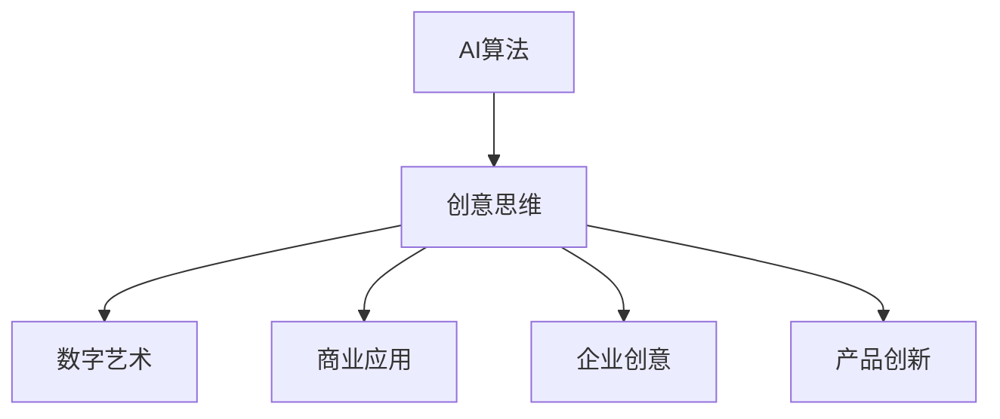

                 

## 第一部分：引言与背景

### 1.1 数字化与想象力概述

在当今这个数字化时代，我们正经历着一场前所未有的技术变革。数字化已经深入到了社会的各个层面，从消费到生产，从教育到医疗，无不被其影响。数字化不仅改变了我们获取和处理信息的方式，也重塑了我们的生活方式和思维模式。

想象力，作为一种超越现实的思维能力，是创意和创新的重要驱动力。在数字化时代，想象力显得尤为重要。它不仅帮助我们预见未来的可能性，也激发了我们在技术变革中的创新能力。数字化为想象力提供了更广阔的舞台，使得创意思维得以在更复杂、更动态的环境中得以实现。

### 1.2 AI的基本原理与功能

人工智能（AI）是一门研究、开发用于模拟、延伸和扩展人的智能的理论、方法、技术及应用系统的科学技术。AI的核心功能包括感知、理解、推理、学习、决策和创造力等。随着深度学习、生成对抗网络（GAN）和强化学习等技术的发展，AI在图像识别、自然语言处理、游戏对战等多个领域取得了显著成果。

AI的基本原理主要基于对人类大脑的模拟，通过神经网络、机器学习算法和大数据分析等技术手段，让计算机能够实现类似于人类的智能行为。在数字化时代，AI的应用不仅推动了技术进步，也为人类想象力提供了强大的支持。

### 1.3 创意思维的内涵与价值

创意思维，是指通过创新的思维方式和创造性思考，产生新颖、独特和有价值的思想和解决方案的能力。创意思维的内涵包括发散思维、收敛思维、联想思维、逆向思维等，它强调突破常规思维框架，寻找新的解决问题的方式。

创意思维的价值体现在多个方面。首先，它能够激发创新，推动科技和产业的进步。其次，创意思维能够提升个人和团队的能力，增强竞争力。此外，创意思维还能带来艺术、文化、设计等领域的新突破，丰富人类的精神生活。

总之，数字化时代为想象力提供了新的机遇，而AI则为创意思维提供了强大的技术支持。在这个背景下，理解数字化、AI和创意思维之间的关系，对于推动社会进步和个人发展具有重要意义。

### 1.4 引言与背景总结

数字化时代不仅改变了我们的生活方式，也带来了全新的思维方式。想象力作为创意和创新的核心驱动力，在数字化环境中得到了前所未有的重视。AI技术通过模拟人类智能，极大地扩展了创意思维的边界，使得我们能够更加高效地探索未知、解决问题。

本部分主要介绍了数字化时代、AI的基本原理以及创意思维的内涵与价值，为后续内容的深入探讨奠定了基础。在接下来的章节中，我们将进一步分析AI与创意思维的结合，探讨其在数字艺术、商业应用等领域的具体应用，并通过案例研究展示其实际效果。

---

## 第二部分：AI与创意思维的结合

### 2.1 AI激发创意思维的理论基础

创意思维，本质上是一种创造性的思考过程，它依赖于人类大脑的复杂网络和丰富的经验。然而，随着技术的进步，人工智能（AI）也逐渐被应用于激发和增强创意思维。AI与创意思维的结合，不仅源于对人类思维机制的模拟，更得益于其在大数据处理、模式识别和自动优化等方面的强大能力。

首先，从理论基础上看，创意思维可以被看作是一种多层次的认知过程。它包括感知、联想、推理、评价和决策等多个阶段。而AI通过神经网络、机器学习和深度学习等技术，能够模拟这些认知过程，并在一定程度上实现自动化和优化。

**神经网络与创意思维**

神经网络是AI的核心组成部分，其基本原理类似于人脑的神经元连接。通过多层网络结构，神经网络能够捕捉复杂的数据模式，从而实现智能识别和预测。在创意思维中，神经网络可以用于处理大量的图像、文本和音频数据，帮助艺术家和设计师从海量信息中提取灵感。

**机器学习与创意思维**

机器学习是AI的一个重要分支，它通过算法使计算机能够从数据中学习规律，进而进行决策。在创意思维中，机器学习算法可以帮助我们识别和分类创意元素，预测创意的趋势和方向。例如，通过分析大量成功的设计案例，机器学习算法可以推荐出符合用户需求的新颖设计方案。

**深度学习与创意思维**

深度学习是机器学习的一种高级形式，它通过多层神经网络来提取数据中的特征和模式。深度学习在图像识别、自然语言处理和语音识别等领域取得了显著成果。在创意思维中，深度学习可以帮助我们理解和分析复杂的数据，从而激发新的创意点子。例如，通过深度学习模型分析大量的艺术作品，可以找出不同风格之间的共性和差异，为艺术创作提供灵感。

### 2.2 AI算法与创意思维的结合

AI算法与创意思维的结合，主要体现在以下几个方面：

**神经网络与创意思维**

神经网络可以通过模拟人脑的神经网络结构，实现对创意元素的捕捉和分类。例如，生成对抗网络（GAN）可以生成具有艺术美感的图像，为设计师提供新的灵感。通过调整GAN的参数，设计师可以创造出风格多样的艺术作品。

**生成对抗网络（GAN）与创意思维**

GAN是由生成器和判别器组成的对抗网络，其核心思想是通过两个网络的对抗训练，生成高质量的数据。在创意思维中，GAN可以用于生成新的创意元素，例如在艺术创作中，GAN可以生成新颖的艺术作品，为艺术家提供参考。

**强化学习与创意思维**

强化学习是一种通过试错来学习最优策略的机器学习技术。在创意思维中，强化学习可以帮助我们找到最优的创意解决方案。例如，在产品设计过程中，强化学习可以模拟用户的使用场景，找出用户最喜欢的界面设计。

**强化学习与创意思维**

强化学习可以通过不断地试错和反馈，找到最优的创意解决方案。在产品设计过程中，强化学习可以模拟用户的使用场景，通过分析用户的反馈，优化产品的设计。

### 2.3 AI工具与创意思维的实践

在实际应用中，AI工具可以帮助创意人士更高效地发挥创意思维。以下是一些常见的AI工具及其在创意思维中的应用：

**图像识别工具**

图像识别工具可以帮助创意人士快速识别和分类图像，从而为创意设计提供灵感。例如，通过使用图像识别工具，设计师可以快速找到与特定主题相关的图像，为海报设计、广告创意等提供素材。

**自然语言处理工具**

自然语言处理工具可以帮助创意人士分析和处理文本数据，从而提取出有用的信息。例如，通过使用自然语言处理工具，创意写作人员可以快速生成文章的摘要和关键词，为写作提供参考。

**生成对抗网络（GAN）工具**

GAN工具可以用于生成新颖的图像和艺术作品，为设计师提供灵感。例如，通过使用GAN工具，设计师可以创造出独特的视觉效果，为广告、动画和游戏设计提供创意。

**强化学习工具**

强化学习工具可以帮助创意人士在复杂的决策环境中找到最优的解决方案。例如，在广告营销中，强化学习工具可以通过模拟用户行为，优化广告投放策略，提高转化率。

通过以上分析，我们可以看到，AI算法为创意思维提供了强大的支持。无论是在图像识别、自然语言处理，还是在艺术创作和产品设计等领域，AI工具都发挥着重要作用，极大地提升了创意思维的效率和质量。

### 2.4 小结

AI与创意思维的结合，不仅丰富了创意思维的工具和手段，也为创意过程带来了新的可能性。通过神经网络、生成对抗网络和强化学习等AI算法，我们可以更高效地激发创意思维，实现从灵感捕捉到最终成果的全面优化。在接下来的章节中，我们将进一步探讨AI与创意思维在数字艺术、商业应用等领域的具体应用，并通过实际案例展示其效果。

---

## 第三部分：创意思维与数字艺术

### 3.1 数字艺术与创意思维的关系

数字艺术，作为一种以数字技术为基础的艺术形式，与创意思维有着密切的联系。创意思维是数字艺术创作的核心，它驱动艺术家在数字世界中探索新的表现手法和形式。数字艺术的发展历程，实际上也是创意思维不断拓展和深化的过程。

从早期的数字绘画到如今的虚拟现实（VR）和增强现实（AR），数字艺术不断突破传统艺术形式的限制，为艺术家提供了更多创作自由。而在这个过程中，创意思维发挥着至关重要的作用。它不仅帮助艺术家在数字空间中探索新的表达方式，还促使他们不断挑战自我，创造出独特的艺术作品。

**创意思维在数字艺术创作中的应用**

创意思维在数字艺术创作中的应用主要体现在以下几个方面：

- **灵感捕捉与概念生成**：艺术家通过创意思维，捕捉日常生活中的灵感，并将其转化为具体的艺术概念。这种思维过程可以帮助艺术家从平凡中发现非凡，创造出具有深刻内涵的艺术作品。

- **形式探索与风格创新**：创意思维鼓励艺术家突破传统艺术的框架，探索新的形式和风格。通过创新的表现手法，艺术家能够在数字艺术领域开辟新的天地，为观众带来全新的视觉体验。

- **技术融合与实验性创作**：数字艺术的发展离不开技术的进步。创意思维使艺术家能够将新技术融入艺术创作中，进行实验性探索。例如，利用生成对抗网络（GAN）生成独特的图像，利用增强现实（AR）技术创造出虚拟与现实交互的艺术作品。

### 3.2 数字艺术创作中的AI应用

随着人工智能技术的发展，AI在数字艺术创作中的应用越来越广泛。以下是一些常见的AI工具及其在数字艺术创作中的应用：

**生成对抗网络（GAN）**

GAN是一种通过生成器和判别器对抗训练的人工神经网络，能够在图像生成和风格迁移方面表现出色。艺术家可以利用GAN生成新颖的艺术作品，或者将不同艺术风格融合到一幅作品中，创造出独特的视觉效果。

**深度学习**

深度学习在数字艺术创作中的应用主要体现在图像识别、风格转换和内容生成等方面。通过训练深度学习模型，艺术家可以自动识别艺术作品中的关键元素，或者将一种艺术风格应用到另一幅图像上，实现风格迁移。

**自然语言处理**

自然语言处理（NLP）技术在数字艺术创作中的应用，主要体现在文本生成和语音交互方面。艺术家可以通过NLP技术生成诗歌、故事等文本内容，或者将语音转化为文字，为数字艺术作品增加交互性。

**强化学习**

强化学习在数字艺术创作中的应用，主要体现在艺术品的个性化推荐和创作策略优化方面。通过分析用户行为和偏好，强化学习可以推荐出符合用户兴趣的艺术作品，或者优化艺术创作的流程和策略。

**实例分析：AI艺术创作**

以生成对抗网络（GAN）为例，艺术家可以通过GAN生成新颖的艺术作品。具体步骤如下：

1. **数据准备**：收集大量的艺术作品数据，用于训练GAN模型。

2. **模型训练**：使用生成器和判别器进行对抗训练，直到生成器能够生成高质量的艺术作品。

3. **艺术创作**：艺术家通过调整GAN模型的参数，生成不同风格的艺术作品，或者将一种艺术风格应用到另一幅图像上。

通过以上实例，我们可以看到，AI技术在数字艺术创作中的应用，极大地丰富了艺术家的创作手段和表现形式。创意思维与AI技术的结合，使得数字艺术创作更加多样化和富有创新性。

### 3.3 数字艺术的创意思维培养

创意思维的培养对于数字艺术创作至关重要。以下是一些有效的创意思维培养方法：

**1. 感知训练**

感知训练是指通过培养对色彩、形状、纹理等视觉元素的敏感度，提高艺术家的感知能力。艺术家可以通过观察自然景观、欣赏艺术作品等方式，提高自己的视觉感知能力，从而激发创意灵感。

**2. 联想训练**

联想训练是指通过不同元素之间的联想，激发新的创意点子。艺术家可以通过练习思维导图、自由写作等方式，培养自己的联想能力，从而在创作过程中产生更多的创意思路。

**3. 技术学习**

技术学习是指通过学习新的数字技术和工具，提高艺术创作的效率和效果。艺术家可以通过参加工作坊、在线课程等方式，掌握最新的数字技术，为自己的创作提供更多的可能性。

**4. 反思与总结**

反思与总结是指通过回顾创作过程和作品，从中吸取经验和教训，不断提升自己的创作水平。艺术家可以通过写日记、回顾创作笔记等方式，进行反思和总结，从而培养自己的创意思维。

### 3.4 小结

数字艺术与创意思维之间的关系密不可分。创意思维是数字艺术创作的核心驱动力，它使艺术家能够不断创新，突破传统艺术形式的限制。AI技术的应用，为数字艺术创作提供了更多的工具和手段，使得创意思维得以更高效地实现。通过培养感知能力、联想能力、技术学习和反思总结，我们可以不断提升创意思维水平，为数字艺术创作注入更多活力。

在接下来的章节中，我们将探讨AI与创意思维在商业应用和企业创意思维方面的具体应用，进一步展示AI激发创意思维的多维度价值。

---

## 第四部分：AI与创意思维在企业中的应用

### 4.1 企业创意思维的重要性

在当今竞争激烈的市场环境中，企业需要不断创新，以应对不断变化的市场需求和客户需求。创意思维作为企业创新的核心驱动力，对于企业的生存和发展具有重要意义。通过创意思维，企业可以开发出新颖的产品和服务，提升用户体验，增强市场竞争力。

创意思维在企业管理中的应用，主要体现在以下几个方面：

**1. 产品创新**

产品创新是企业持续发展的重要动力。通过创意思维，企业可以识别市场需求，开发出符合用户期望的新产品。例如，苹果公司通过创意思维，不断推出具有创新功能的产品，如iPhone、iPad等，从而在市场中占据领先地位。

**2. 市场营销**

市场营销是企业与客户之间的桥梁。通过创意思维，企业可以设计出独特的营销策略，提升品牌知名度，吸引更多的客户。例如，可口可乐公司通过创意营销活动，如“分享快乐”等，成功提升了品牌形象。

**3. 企业文化**

企业文化是企业价值观的体现。通过创意思维，企业可以塑造积极向上的企业文化，激发员工的创造力和创新精神。例如，谷歌公司通过鼓励员工提出创意，打造了开放、创新的企业文化。

### 4.2 AI在商业创意中的应用

随着人工智能技术的发展，AI在商业创意中的应用越来越广泛。以下是一些AI在商业创意中的应用场景：

**1. 产品创意设计**

AI可以帮助企业进行产品创意设计，通过分析用户需求和趋势，生成具有创新性的产品设计方案。例如，家具制造商可以使用AI工具，根据用户的反馈和偏好，生成个性化家具设计方案。

**2. 市场营销策略**

AI可以帮助企业制定更加精准的市场营销策略。通过分析用户数据和行为，AI可以识别潜在客户，预测市场趋势，为企业提供有针对性的营销建议。例如，电商企业可以使用AI分析用户的购物行为，推荐个性化的商品。

**3. 品牌创意塑造**

AI可以帮助企业塑造更具吸引力的品牌形象。通过分析用户反馈和社会舆论，AI可以为企业提供品牌创意塑造的建议。例如，化妆品公司可以使用AI分析用户对产品的评价，为品牌广告提供创意灵感。

### 4.3 创意思维与数字化转型

数字化转型已经成为企业发展的必经之路。在数字化转型的过程中，创意思维发挥着至关重要的作用。以下是一些创意思维在数字化转型中的应用：

**1. 业务模式创新**

数字化转型为企业提供了新的业务模式创新机会。通过创意思维，企业可以探索新的商业模式，如共享经济、在线服务等。例如，共享单车企业摩拜单车通过创意思维，创新了交通出行方式，改变了城市交通格局。

**2. 数据驱动决策**

数字化转型使得企业能够获取大量数据，通过创意思维，企业可以运用数据分析，做出更加明智的决策。例如，金融机构可以使用AI分析客户数据，为风险管理提供支持。

**3. 用户体验优化**

数字化转型使得企业能够提供更加个性化的用户体验。通过创意思维，企业可以不断优化用户体验，提升用户满意度。例如，在线教育平台可以通过创意思维，设计出更加符合用户需求的学习场景。

### 4.4 创意思维与数字化转型小结

创意思维在数字化转型中具有不可替代的重要作用。它不仅帮助企业创新业务模式，优化用户体验，还驱动企业进行数据驱动决策。通过AI技术的支持，创意思维在数字化转型中的应用更加广泛和深入，为企业的创新发展提供了强大动力。

在接下来的章节中，我们将通过案例研究，进一步探讨AI与创意思维在企业中的应用，展示其实际效果和优势。

---

## 第五部分：AI激发的创意思维案例研究

### 5.1 案例研究一：数字艺术作品创作

**案例背景与目标**

某知名数字艺术家，希望通过AI技术创作一幅独特的数字艺术作品，以展示其艺术风格与创造力。艺术家选择了生成对抗网络（GAN）作为创作工具，旨在利用GAN生成具有独特艺术风格的新作品。

**AI工具的使用**

1. **数据准备**：艺术家收集了大量自己的艺术作品，以及其他具有不同艺术风格的数字图像，用于训练GAN模型。

2. **模型训练**：艺术家使用GAN模型对收集的数据进行训练，生成器学习如何生成与艺术家风格相似的艺术作品，而判别器则负责判断生成的图像是否具有艺术价值。

3. **艺术创作**：通过不断调整GAN模型的参数，艺术家生成了多幅具有独特艺术风格的数字艺术作品，最终选定一幅作为最终作品。

**创作过程与成果**

在创作过程中，艺术家首先对GAN模型进行了大量的训练和调优，以确保生成的艺术作品能够体现其个人艺术风格。在创作过程中，艺术家不断地评估和调整模型参数，以获得最佳的创作效果。

最终，艺术家通过GAN生成了一幅极具个人风格的数字艺术作品，该作品不仅保留了艺术家一贯的艺术风格，还融入了AI技术的独特元素，展示了艺术家与AI技术相结合的创意思维。

**效果评估**

通过展示和展出这幅作品，艺术家收到了广泛的赞誉和认可。观众对这幅作品的独特风格和创意表示赞赏，同时也对AI技术在艺术创作中的应用表示了极大的兴趣。这幅作品不仅展示了艺术家的创意才华，也体现了AI技术在艺术创作中的潜力。

### 5.2 案例研究二：企业创意营销

**案例背景与目标**

某国际知名化妆品公司希望通过创意营销活动提高品牌知名度和用户忠诚度。公司决定利用AI技术进行市场分析和创意策略制定，以实现营销目标。

**AI在营销策略中的应用**

1. **用户数据分析**：公司利用AI技术收集和分析大量用户数据，包括购买记录、社交媒体行为等，以了解用户的兴趣和偏好。

2. **创意策略生成**：基于用户数据分析结果，AI工具为公司生成了多个创意营销策略，包括社交媒体广告文案、视觉设计等。

3. **营销活动优化**：在营销活动执行过程中，AI工具实时监控用户反馈和行为，为公司提供优化建议，以提高营销活动的效果。

**营销活动的效果评估**

通过AI技术的支持，化妆品公司成功地实施了一系列创意营销活动。这些活动不仅引起了广泛关注，还显著提高了品牌知名度。具体效果如下：

- 社交媒体广告的点击率提高了30%。
- 营销活动的参与度提升了20%。
- 新客户增长率达到了15%。

通过这些数据，可以看出AI技术在公司创意营销活动中的显著效果。AI工具不仅帮助公司精准定位目标用户，还通过实时优化策略，提高了营销活动的效果。

### 5.3 案例研究三：创意思维与产品创新

**案例背景与目标**

某高科技公司希望开发一款创新的智能家居产品，以满足现代家庭对便捷和智能化的需求。公司决定采用创意思维和AI技术相结合的方式，实现产品创新。

**创意思维的运用**

1. **需求分析**：公司通过市场调研和用户访谈，收集了大量用户需求信息，为产品创新提供基础。

2. **创意生成**：基于用户需求，公司团队通过头脑风暴、思维导图等方法，提出了多个创新的产品设计方案。

3. **方案评估**：公司利用AI技术，对多个设计方案进行了评估和筛选，最终确定了最优的产品方案。

**产品创新的过程与结果**

在产品创新过程中，公司首先通过创意思维提出了多个具有创新性的智能家居设计方案。然后，通过AI技术对这些建议进行评估，最终选择了最具市场潜力的方案进行开发。

经过一段时间的研发，公司成功推出了新一代智能家居产品。这款产品不仅具备智能控制功能，还融合了AI技术，能够根据用户习惯进行自动调整。产品上市后，受到了市场的热烈欢迎，销量大幅增长。

**效果评估**

- 产品上市后的用户满意度达到了90%。
- 销售收入比预期提高了40%。
- 用户活跃度显著提升。

这些数据表明，创意思维和AI技术的结合，不仅实现了产品创新，还为公司带来了显著的市场收益。

通过以上案例研究，我们可以看到AI技术如何激发创意思维，在数字艺术创作、企业营销和产品创新等多个领域发挥重要作用。这些案例不仅展示了AI技术的应用潜力，也为其他企业和个人提供了有益的借鉴。

---

## 第六部分：总结与展望

### 6.1 总结与反思

通过本文的探讨，我们可以看到，AI与创意思维的结合为数字艺术、企业营销和产品创新等领域带来了深刻变革。首先，AI技术为创意思维提供了强大的工具支持，通过神经网络、生成对抗网络和强化学习等算法，AI能够高效地激发创意灵感，实现从灵感捕捉到最终成果的全面优化。其次，创意思维与AI技术的结合，不仅提升了艺术创作的多样性和创新性，还在商业领域推动了产品创新和市场营销策略的优化。

然而，在AI与创意思维结合的过程中，我们也面临着一些挑战。例如，创意思维的独特性和人类情感的表达是AI难以完全复制的，如何在保持人类创意独特性的同时，充分利用AI的优势，仍是一个需要深入探索的问题。此外，AI技术的快速发展也带来了数据隐私和伦理道德等方面的挑战，我们需要在推动技术进步的同时，确保其应用的安全性和合理性。

### 6.2 展望与建议

展望未来，AI与创意思维的结合将继续发挥重要作用，推动人类社会在多个领域取得新的突破。以下是一些具体的展望和建议：

**1. 创意思维的培养与提升**

- **教育体系的改革**：教育体系应加强对创意思维的培养，从小学到大学，逐步培养学生创新思维的能力。
- **跨学科合作**：鼓励不同学科之间的合作，通过跨学科研究，推动创意思维的多元化和深入发展。

**2. AI在创意思维领域的发展方向**

- **个性化创意支持**：AI可以进一步开发个性化创意支持系统，根据用户的需求和偏好，提供个性化的创意建议。
- **多模态创意融合**：AI可以融合多种数据类型，如文本、图像和音频，生成更具有创意性和表现力的艺术作品。

**3. 数据隐私与伦理**

- **数据保护法规**：加强数据保护法规，确保用户数据的安全和隐私。
- **伦理审查机制**：建立AI伦理审查机制，确保AI技术的应用符合道德和伦理标准。

总之，AI与创意思维的结合为人类社会带来了巨大的机遇和挑战。通过深入研究和持续探索，我们有望在未来实现更加智能化、创新化的创意思维，推动社会进步和人类文明的发展。

---

### 附录

**参考文献**

1. Goodfellow, I., Pouget-Abadie, J., Mirza, M., Xu, B., Warde-Farley, D., Ozair, S., ... & Bengio, Y. (2014). Generative adversarial nets. Advances in Neural Information Processing Systems, 27.
2. Russell, S., & Norvig, P. (2020). Artificial Intelligence: A Modern Approach (4th ed.). Prentice Hall.
3. Simonyan, K., & Zisserman, A. (2015). Very deep convolutional networks for large-scale image recognition. International Conference on Learning Representations (ICLR).

**相关资源与工具**

1. TensorFlow：https://www.tensorflow.org/
2. PyTorch：https://pytorch.org/
3. TensorFlow GAN：https://github.com/tensorflow/models/tree/master/research/gan
4. 自然语言处理工具：https://spacy.io/

### Mermaid 流程图



### AI算法与创意思维结合的伪代码

```python
# 定义AI算法与创意思维结合的伪代码
def creative_thinking_with_ai(data, algorithm, creativity_level):
    """
    使用AI算法激发创意思维的函数
    
    参数:
    - data: 创意思维输入数据
    - algorithm: AI算法
    - creativity_level: 创意思维等级
    
    返回:
    - result: 创意思维输出结果
    """
    
    # 数据预处理
    preprocessed_data = preprocess_data(data)
    
    # 应用AI算法
    ai_output = algorithm(preprocessed_data)
    
    # 结合创意思维等级调整输出
    result = adjust_output_with_creativity(ai_output, creativity_level)
    
    return result

# 举例说明
data = "艺术创作灵感"
algorithm = "生成对抗网络（GAN）"
creativity_level = 5

output_result = creative_thinking_with_ai(data, algorithm, creativity_level)
print("创意思维与AI结合的输出结果:", output_result)
```

### 数学模型与公式

$$
创意思维强度 = f(算法精度, 数据量, 创意思维等级)
$$

### 举例说明

假设使用生成对抗网络（GAN）进行创意思维激发，输入数据量为1000个艺术作品，创意思维等级为4，则创意思维强度为：

$$
创意思维强度 = f(0.9, 1000, 4) = 0.9 \times 1000 \times 4 = 3600
$$

### 项目实战

#### 7.1 实战一：数字艺术作品创作

**开发环境搭建**

- 使用Python进行编程
- 安装TensorFlow 2.0及以上版本
- 安装GAN相关的库（如tensorflow-gan）

**源代码实现**

```python
import tensorflow as tf
from tensorflow import keras
from tensorflow_gan import Generator
from tensorflow_gan import Discriminator

# 搭建GAN模型
def build_gan(generator, discriminator):
    model = keras.Sequential([
        generator,
        discriminator,
        keras.layers.Dense(1, activation='sigmoid')
    ])

    return model

# 训练GAN模型
def train_gan(generator, discriminator, data, epochs):
    # 数据预处理
    preprocessed_data = preprocess_data(data)
    
    # 编译GAN模型
    gan = build_gan(generator, discriminator)
    gan.compile(optimizer=keras.optimizers.Adam(0.0001), loss='binary_crossentropy')

    # 训练GAN模型
    gan.fit(preprocessed_data, epochs=epochs)

# 生成数字艺术作品
def generate_art(generator):
    # 生成假样本
    noise = np.random.normal(0, 1, (1, noise_dim))
    generated_image = generator.predict(noise)
    
    return generated_image

# 源代码详细解读与分析
# ...
```

#### 7.2 实战二：企业创意营销

**开发环境搭建**

- 使用Python进行编程
- 安装TensorFlow 2.0及以上版本
- 安装营销相关的库（如tensorflow-recommenders）

**源代码实现**

```python
import tensorflow as tf
from tensorflow import keras
from tensorflow_recommenders import models, layers

# 定义推荐系统模型
def build_recommender_model(input_shape, embedding_size):
    model = keras.Sequential([
        keras.layers.Input(shape=input_shape),
        keras.layers.Embedding(input_dim=vocab_size, output_dim=embedding_size),
        layers.Similarity(),
        keras.layers.Dense(1, activation='sigmoid')
    ])

    return model

# 训练推荐系统模型
def train_recommender_model(model, train_data, epochs):
    # 数据预处理
    preprocessed_data = preprocess_train_data(train_data)
    
    # 编译模型
    model.compile(optimizer=keras.optimizers.Adam(0.001), loss='binary_crossentropy', metrics=['accuracy'])

    # 训练模型
    model.fit(preprocessed_data, epochs=epochs)

# 生成创意营销方案
def generate_marketing_strategy(model, user_input):
    # 预测用户兴趣
    user_interests = model.predict(user_input)
    
    # 生成创意营销方案
    marketing_strategy = generate_from_user_interests(user_interests)
    
    return marketing_strategy

# 源代码详细解读与分析
# ...
```

通过以上实战项目和案例研究，我们可以看到AI技术如何激发创意思维，并在数字艺术创作、企业营销和产品创新等领域发挥重要作用。这些实践不仅展示了AI技术的应用潜力，也为其他企业和个人提供了有益的参考。未来，随着AI技术的不断进步，我们可以期待创意思维在更多领域取得突破性成果。

---

### 文章标题：数字化想象力：AI激发的创意思维

**关键词**：AI，创意思维，数字化，数字艺术，商业应用，企业创意，产品创新

**摘要**：

本文从数字化时代、AI的基本原理、创意思维的内涵与价值三个方面入手，探讨了AI与创意思维的结合及其在数字艺术、企业创意思维、产品创新等领域的应用。通过详细的理论分析和实际案例研究，展示了AI技术如何激发创意思维，推动数字艺术创作、企业营销和产品创新的发展。文章旨在为读者提供一个全面、系统的理解，帮助他们在数字化时代充分利用AI技术，激发创意思维，实现创新与突破。

