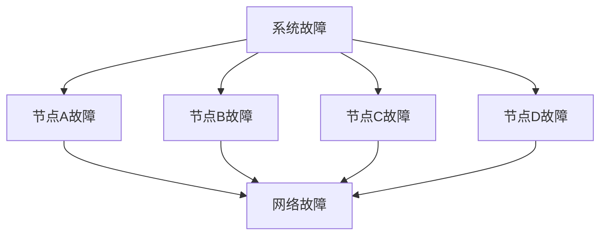
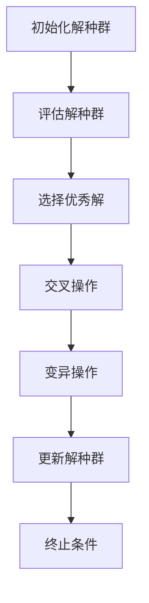
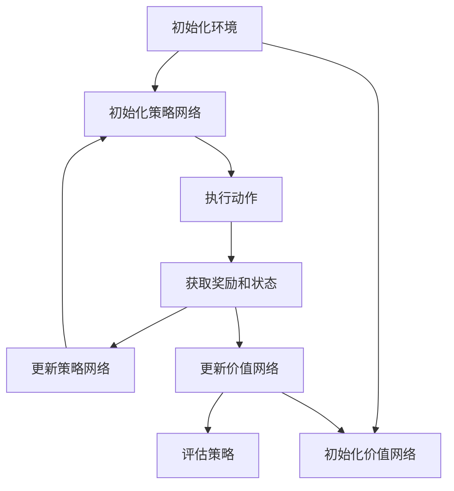

                 

# 《数学与云计算：分布式计算的数学模型》

## 关键词
- 数学模型
- 分布式计算
- 云计算
- 分布式一致性
- 可靠性分析
- 分布式机器学习
- 智能优化算法

## 摘要
本文旨在探讨数学与云计算之间的关系，特别是数学模型在分布式计算中的应用。通过介绍数学基础、云计算架构以及分布式算法的数学描述，本文将深入分析分布式一致性、可靠性以及分布式机器学习的数学模型。此外，文章还探讨了云计算安全与隐私保护，以及智能优化算法在分布式系统中的应用。通过这一系列的探讨，本文希望能够为读者提供一个全面而深入的理解，帮助他们在云计算和分布式计算领域中更好地应用数学知识。

### 第一部分：数学与云计算概述

#### 第1章：数学与云计算的核心概念

##### 1.1 数学基础在云计算中的应用

在云计算时代，数学基础的应用无处不在。从数据结构到算法设计，从系统性能优化到数据安全性分析，数学都扮演着至关重要的角色。以下将介绍一些基础数学概念及其在云计算中的应用。

##### 1.1.1 基础数学概念介绍

首先，我们来看一些基础数学概念：

- **实数、复数、向量空间**：实数和复数是数学中的基本概念，它们在云计算中有着广泛的应用，尤其是在复杂数据类型的处理中。向量空间则是在云计算算法设计中不可或缺的数学工具，它可以帮助我们更好地理解和处理高维数据。

- **函数、极限、导数**：函数是描述输入与输出关系的基本工具，在云计算中，我们可以通过函数来建模和处理各种业务逻辑。极限和导数则是微积分中的核心概念，它们在系统性能分析和优化中有着重要的作用。

##### 1.1.2 数学在分布式计算中的作用

接下来，我们来看数学在分布式计算中的应用：

- **数学模型在分布式算法中的应用**：分布式算法是云计算中的核心技术，它们通过将任务分解成多个子任务，并在不同的节点上并行执行来提高计算效率。数学模型在分布式算法的设计中起到了关键作用，例如，图论模型可以用来描述分布式系统的拓扑结构，随机过程可以用来建模分布式系统的动态行为。

- **概率论与统计学在系统可靠性分析中的应用**：概率论和统计学是分析分布式系统可靠性的重要工具。通过概率分布模型，我们可以评估系统的可靠性和稳定性。统计学方法可以帮助我们分析系统性能的波动和趋势，从而优化系统设计。

##### 1.2 云计算基础

云计算是一种通过网络提供计算资源的服务模型，它将计算任务分布在大量的计算节点上，为用户提供按需可扩展的、灵活的计算能力。以下我们将简要介绍云计算的基本概念和架构。

##### 1.2.1 云计算定义与架构

- **云计算定义**：云计算是一种通过互联网提供计算资源的服务模式，它将计算任务分布到多个计算节点上，通过虚拟化技术实现资源的高效利用。

- **云计算架构**：云计算架构主要包括三个层次：基础设施即服务（IaaS）、平台即服务（PaaS）和软件即服务（SaaS）。其中，IaaS提供基本的计算、存储和网络资源；PaaS提供开发平台和工具，帮助开发者构建和部署应用；SaaS则是将软件作为一种服务提供给用户，用户无需关心软件的运行和维护。

##### 1.2.2 云计算服务模式

- **IaaS**：基础设施即服务，提供虚拟化的计算资源，如虚拟机、存储和网络等。用户可以根据需要自定义操作系统和应用，具有高度的可定制性和灵活性。

- **PaaS**：平台即服务，提供开发平台和工具，帮助开发者构建、测试和部署应用。PaaS通常提供应用程序开发、托管和扩展等支持，减少了开发者的工作负担。

- **SaaS**：软件即服务，将软件作为一种在线服务提供给用户。用户无需安装和配置软件，只需通过网络访问即可使用，大大降低了软件的维护和使用成本。

通过以上介绍，我们可以看到数学在云计算中的应用是广泛而深入的。从基础数学概念到分布式算法，从系统可靠性分析到云计算服务模式，数学都为云计算的发展提供了强大的支持。在接下来的章节中，我们将进一步探讨数学在分布式计算中的具体应用。

---

### 第二部分：分布式计算的数学模型

#### 第2章：分布式算法的数学描述

在分布式计算中，数学模型是理解和设计分布式算法的关键工具。通过数学模型，我们可以描述分布式系统的拓扑结构、动态行为以及算法性能。以下将详细介绍分布式系统中常用的数学模型。

##### 2.1 分布式系统中的数学模型

分布式系统中的数学模型主要包括图论模型和随机过程模型。

###### 2.1.1 图论模型

图论模型是一种用来描述网络结构的数学模型。在分布式系统中，图论模型可以用来表示节点之间的连接关系和网络拓扑结构。

- **图的基本概念**：

  - **节点（Vertex）**：图中的基本元素，表示分布式系统中的计算节点。
  
  - **边（Edge）**：连接两个节点的线段，表示节点之间的通信路径。
  
  - **图（Graph）**：由节点和边组成的集合，表示分布式系统的拓扑结构。

- **图论在分布式系统中的应用**：

  - **网络拓扑结构分析**：通过图论模型，我们可以分析分布式系统的网络拓扑结构，了解节点之间的连接关系和网络的稳定性。

  - **路径规划**：在分布式系统中，节点之间需要进行通信和数据交换，图论模型可以帮助我们找到最优的路径，提高通信效率。

  - **负载均衡**：通过分析图论模型，我们可以合理分配任务，实现负载均衡，提高系统的整体性能。

###### 2.1.2 随机过程模型

随机过程模型是一种用来描述分布式系统动态行为的数学模型。在分布式系统中，节点状态可能受到外部环境的影响，随机过程模型可以帮助我们分析这些动态变化。

- **随机过程的基本概念**：

  - **状态（State）**：分布式系统中节点的状态，如工作状态、空闲状态等。
  
  - **事件（Event）**：导致节点状态发生改变的事件，如任务完成、节点故障等。
  
  - **过程（Process）**：描述节点状态随时间变化的动态行为。

- **随机过程在分布式系统中的应用**：

  - **性能评估**：通过随机过程模型，我们可以评估分布式系统的性能指标，如响应时间、吞吐量等。
  
  - **故障模拟**：通过随机过程模型，我们可以模拟分布式系统的故障情况，分析系统的容错能力和稳定性。

  - **负载预测**：通过分析随机过程模型，我们可以预测分布式系统的未来负载情况，为系统优化提供依据。

##### 2.2 分布式算法的核心挑战

在分布式计算中，算法的设计和实现面临许多挑战。以下将讨论分布式算法的核心挑战。

###### 2.2.1 数据一致性

数据一致性是分布式系统的核心问题之一。在分布式系统中，多个节点需要共享数据，如何确保数据的一致性是一个关键问题。

- **一致性模型**：

  - **强一致性（Strong Consistency）**：所有节点在同一时刻看到相同的数据视图。
  
  - **最终一致性（ eventual consistency）**：所有节点的数据最终会达到一致性，但可能需要一定的时间。

- **一致性算法**：

  - **Paxos算法**：一种分布式一致性算法，通过选举领导者节点来达成一致性协议。
  
  - **Raft算法**：一种基于日志复制的一致性算法，通过日志同步来保证数据一致性。

  **数据一致性挑战**：

  - **数据冗余**：为了实现数据一致性，通常需要将数据复制到多个节点，这会增加数据冗余。
  
  - **延迟**：在分布式系统中，数据的一致性可能需要一定的时间来传播，这会增加系统的延迟。

###### 2.2.2 容错性

容错性是分布式系统的另一个关键挑战。在分布式系统中，节点可能会出现故障，如何确保系统的正常运行是一个重要问题。

- **容错机制**：

  - **冗余**：通过在系统中增加冗余节点，确保在某个节点故障时，其他节点可以接管其任务。
  
  - **故障检测与恢复**：通过定期检测节点状态，发现故障节点并进行恢复。

  **容错性挑战**：

  - **性能下降**：冗余节点会增加系统的负载，可能导致系统性能下降。
  
  - **数据丢失**：在故障恢复过程中，可能会出现数据丢失的情况。

###### 2.2.3 负载均衡

负载均衡是分布式系统的另一个重要挑战。在分布式系统中，如何合理分配任务，确保系统资源的高效利用是一个关键问题。

- **负载均衡策略**：

  - **基于CPU负载的均衡策略**：通过监测各节点的CPU使用率，将任务分配到负载较低的节点。
  
  - **基于网络带宽的均衡策略**：通过监测各节点的网络带宽，将任务分配到带宽较高的节点。

  **负载均衡挑战**：

  - **负载不均**：在负载均衡过程中，可能会出现负载不均的情况，导致某些节点过载，而其他节点空闲。
  
  - **通信开销**：在分布式系统中，节点之间需要进行通信和数据交换，这会增加通信开销。

通过以上分析，我们可以看到，分布式算法的设计和实现面临许多挑战。通过数学模型，我们可以更好地理解这些问题，并提出有效的解决方案。在接下来的章节中，我们将进一步探讨数学模型在分布式计算中的具体应用。

---

### 第三部分：数学模型在分布式计算中的深入探讨

#### 第3章：数学模型与分布式一致性

分布式一致性是分布式系统的核心问题之一。在分布式系统中，多个节点需要协同工作，如何保证数据的一致性是一个关键问题。数学模型在这方面发挥着重要作用。以下将深入探讨数学模型与分布式一致性之间的关系。

##### 3.1 一致性模型与算法

分布式一致性可以通过一致性模型和一致性算法来实现。一致性模型定义了一组规则，指导节点如何达成一致性。一致性算法则是一组具体的算法实现，遵循一致性模型的规则。

###### 3.1.1 一致性概念及其数学表达

一致性概念可以从不同的角度进行定义，其中最常见的有三种一致性模型：强一致性（Strong Consistency）、最终一致性（eventual consistency）和因果一致性（ causal consistency）。

- **强一致性**：强一致性保证所有节点在同一时刻看到相同的数据视图。在数学上，强一致性可以表示为“所有操作全局有序”。

- **最终一致性**：最终一致性保证所有节点的数据最终会达到一致性，但可能需要一定的时间。在数学上，最终一致性可以表示为“所有操作局部有序，最终全局有序”。

- **因果一致性**：因果一致性保证操作的顺序与因果关系一致。在数学上，因果一致性可以表示为“所有操作的因果关系保持不变”。

###### 3.1.2 一致性算法的实现

实现分布式一致性有多种算法，其中最常用的有两种：Paxos算法和Raft算法。

- **Paxos算法**：Paxos算法是一种分布式一致性算法，通过选举领导者节点来达成一致性协议。在Paxos算法中，节点分为提议者（Proposer）、接受者（Acceptor）和学习者（Learner）三类。提议者生成提案并提交给接受者，接受者根据一定的规则投票接受提案，最终所有学习者都能学到一致的数据。

- **Raft算法**：Raft算法是一种基于日志复制的一致性算法。在Raft算法中，节点分为领导者（Leader）、跟随者（Follower）和候选者（Candidate）三类。领导者负责接收客户端的请求并处理，跟随者负责接收领导者的日志并复制，候选者则参与领导者的选举。Raft算法通过日志同步来保证数据一致性，确保所有节点的日志保持一致。

##### 3.2 分布式一致性协议

分布式一致性协议是实现分布式一致性的具体方案，包括Paxos协议和Raft协议。

###### 3.2.1 Paxos算法原理

Paxos算法的核心思想是通过选举领导者节点来达成一致性协议。以下是一个简化的Paxos算法工作流程：

1. **提议阶段**：提议者生成一个提案，并尝试将其提交给领导者。
2. **接受阶段**：领导者接受提议者的提案，并将提案内容广播给所有跟随者。
3. **学习阶段**：跟随者接收到领导者的提案后，将其记录在本地日志中，并向领导者回复已接受。
4. **选举阶段**：当领导者无法接收到足够多的回复时，会触发新一轮的领导者选举。

以下是Paxos算法的伪代码实现：

```python
# Paxos算法伪代码
proposal_id = 0
voted_val = None

def propose(value):
    global proposal_id
    proposal_id += 1
    message = (proposal_id, value)
    acceptors = all_followers_except(self)
    send_message(message, acceptors)

def accept(proposal_id, value):
    global voted_val
    if not voted_val:
        voted_val = value
        send_accept_message(proposal_id, value)

def learn(value):
    return value
```

###### 3.2.2 Raft算法原理

Raft算法通过日志同步来保证数据一致性。以下是一个简化的Raft算法工作流程：

1. **领导选举阶段**：当领导者无法正常工作时，跟随者会发起领导选举。
2. **投票阶段**：候选者向其他节点发送投票请求，如果获得超过半数的投票，则成为新领导者。
3. **日志同步阶段**：新领导者将日志同步给所有跟随者，确保所有节点的日志保持一致。
4. **工作阶段**：领导者接收客户端请求，并将请求处理结果同步给跟随者。

以下是Raft算法的伪代码实现：

```python
# Raft算法伪代码
state = Follower

def become_candidate():
    global state
    state = Candidate
    send_vote_request_to_all_followers()

def become_leader():
    global state
    state = Leader
    start_heartbeats_to_followers()

def become_follower():
    global state
    state = Follower
```

通过以上讨论，我们可以看到数学模型在分布式一致性中发挥着重要作用。Paxos算法和Raft算法通过数学模型来保证数据一致性，为分布式系统的可靠运行提供了保障。在接下来的章节中，我们将进一步探讨数学模型在分布式系统可靠性分析中的应用。

---

### 第4章：概率论与分布式系统的可靠性

在分布式系统中，可靠性是一个至关重要的指标。概率论为分析分布式系统的可靠性提供了有力的工具。通过概率论，我们可以建模分布式系统的故障概率，评估系统的可靠性，并设计相应的容错机制。以下将介绍概率论的基础概念及其在分布式系统可靠性分析中的应用。

##### 4.1 概率论基础

概率论是研究随机现象规律的数学分支。在分布式系统可靠性分析中，概率论的基本概念如下：

- **随机变量**：随机变量是一种能够取到多个不同值的变量。在分布式系统中，随机变量可以用来表示节点的状态、任务的完成时间等。

- **概率分布**：概率分布描述了随机变量取值的概率。常见的概率分布包括二项分布、泊松分布、正态分布等。

- **期望**：期望是随机变量的平均值。通过期望，我们可以评估系统的平均性能。

- **方差**：方差是随机变量取值与期望之差的平方的平均值。方差反映了随机变量的波动程度。

##### 4.1.1 概率论基本概念

以下是一些常见的概率论基本概念：

- **二项分布**：二项分布描述了在固定次数的独立试验中，成功次数的概率分布。在分布式系统中，二项分布可以用来描述节点的故障次数。

- **泊松分布**：泊松分布描述了在固定时间段内，事件发生的次数的概率分布。在分布式系统中，泊松分布可以用来描述节点的故障率。

- **正态分布**：正态分布是一种常见的概率分布，它描述了连续随机变量的概率分布。在分布式系统中，正态分布可以用来描述节点的响应时间。

##### 4.1.2 概率论在分布式计算中的应用

概率论在分布式计算中的应用主要体现在以下几个方面：

- **系统可靠性评估**：通过概率论，我们可以评估分布式系统的可靠性。例如，通过计算节点的故障概率，我们可以评估系统的可靠性水平。

- **负载预测**：通过概率分布模型，我们可以预测系统的负载情况。例如，通过泊松分布，我们可以预测节点的故障率，从而为系统的负载均衡提供依据。

- **容错设计**：通过概率论，我们可以设计分布式系统的容错机制。例如，通过二项分布，我们可以确定系统需要冗余的节点数量，以确保系统的可靠性。

##### 4.2 分布式系统的可靠性分析

分布式系统的可靠性分析主要包括以下几个方面：

- **故障概率分析**：通过概率论，我们可以计算分布式系统的故障概率。例如，通过泊松分布，我们可以计算节点的故障率。

- **可靠性模型**：可靠性模型是一种用于描述系统可靠性的数学模型。常见的可靠性模型包括马尔可夫模型、故障树模型等。

- **可靠性评估**：通过可靠性模型，我们可以评估分布式系统的可靠性。例如，通过计算系统的故障概率，我们可以评估系统的可靠性水平。

- **故障树分析**：故障树分析是一种用于分析系统故障原因的数学方法。通过构建故障树，我们可以分析系统故障的原因和影响。

以下是一个简单的故障树分析的示例：



在这个故障树中，系统故障是由节点故障和网络故障引起的。通过故障树分析，我们可以找出系统故障的主要原因，并采取相应的措施来提高系统的可靠性。

通过以上讨论，我们可以看到概率论在分布式系统可靠性分析中的重要作用。通过概率论，我们可以更好地理解分布式系统的可靠性，并设计出更加可靠的分布式系统。在接下来的章节中，我们将进一步探讨概率论在分布式系统中的其他应用。

---

### 第四部分：数学模型与云计算的实际应用

#### 第5章：分布式机器学习算法

分布式机器学习是云计算中的一项重要技术，它通过将机器学习任务分布在多个节点上，提高了模型的训练速度和计算效率。数学模型在分布式机器学习算法的设计和实现中起到了关键作用。以下将详细介绍分布式机器学习的基础概念、数学模型及其在云计算中的实际应用。

##### 5.1 分布式机器学习基础

分布式机器学习是指将大规模的机器学习任务分解为多个子任务，并在多个节点上并行执行，以实现高效的训练和推理。以下是一些分布式机器学习的基础概念：

- **数据并行（Data Parallelism）**：数据并行是将训练数据集划分成多个子集，每个子集分布在不同的节点上，每个节点独立地训练模型，然后将所有节点的模型进行聚合。

- **模型并行（Model Parallelism）**：模型并行是将大型模型拆分成多个部分，每个部分分布在不同的节点上，每个节点独立地训练对应的部分，然后将所有部分合并成一个完整的模型。

- **参数服务器（Parameter Server）**：参数服务器是一种分布式机器学习框架，用于处理大规模模型的参数更新。在参数服务器中，参数存储在中央服务器上，每个节点独立地训练模型，并将模型参数同步到中央服务器。

- **异步更新（Asynchronous Update）**：异步更新是指在分布式机器学习中，节点独立地更新模型参数，而不是等待所有节点完成更新后再进行同步。异步更新可以提高训练速度，但需要解决节点之间的同步问题。

##### 5.1.1 数学模型在分布式机器学习中的应用

在分布式机器学习算法中，数学模型起到了关键作用。以下是一些常用的数学模型：

- **梯度下降法（Gradient Descent）**：梯度下降法是一种优化算法，用于最小化损失函数。在分布式机器学习中，梯度下降法可以应用于数据并行和模型并行。

- **随机梯度下降（Stochastic Gradient Descent，SGD）**：随机梯度下降是对梯度下降法的改进，每次更新参数时只随机选择一部分样本。随机梯度下降可以加快训练过程，但在某些情况下可能收敛速度较慢。

- **小批量梯度下降（Mini-batch Gradient Descent）**：小批量梯度下降是对随机梯度下降的进一步改进，每次更新参数时选择一个小批量的样本。小批量梯度下降在收敛速度和计算效率之间取得了较好的平衡。

以下是梯度下降法的伪代码实现：

```python
# 梯度下降法伪代码
learning_rate = 0.01
num_iterations = 1000
for i in range(num_iterations):
    # 计算梯度
    gradients = compute_gradients(loss_function, model_params)
    # 更新参数
    model_params -= learning_rate * gradients
```

- **Adam优化器（Adam Optimizer）**：Adam优化器是一种自适应优化器，结合了梯度下降法和动量法的优点。在分布式机器学习中，Adam优化器可以有效地处理大规模数据。

- **正则化（Regularization）**：正则化是一种防止模型过拟合的技术，包括L1正则化、L2正则化等。在分布式机器学习中，正则化可以通过参数服务器实现。

##### 5.1.2 数学模型在分布式机器学习中的应用

数学模型在分布式机器学习中的应用主要体现在以下几个方面：

- **数据并行算法**：数据并行算法通过将数据集划分成多个子集，每个节点独立地训练模型，然后将所有节点的模型进行聚合。数据并行算法的关键是数据划分和同步策略。以下是一个数据并行算法的伪代码实现：

```python
# 数据并行算法伪代码
num_workers = 10
for epoch in range(num_epochs):
    # 数据划分
    data_batches = split_data(data_set, num_workers)
    # 分布式训练
    models = [train_on_data(batch, model) for batch, model in zip(data_batches, models)]
    # 模型聚合
    aggregated_model = aggregate_models(models)
```

- **模型并行算法**：模型并行算法通过将大型模型拆分成多个部分，每个节点独立地训练对应的部分，然后将所有部分合并成一个完整的模型。模型并行算法的关键是模型拆分和通信策略。以下是一个模型并行算法的伪代码实现：

```python
# 模型并行算法伪代码
num_workers = 10
model_parts = split_model(model, num_workers)
for epoch in range(num_epochs):
    # 分布式训练
    model_parts = [train_on_data(batch, part) for batch, part in zip(data_batches, model_parts)]
    # 模型合并
    model = merge_models(model_parts)
```

##### 5.2 分布式机器学习算法

分布式机器学习算法包括数据并行算法、模型并行算法和参数服务器算法等。以下将介绍一些常见的分布式机器学习算法。

- **数据并行算法**：数据并行算法通过将数据集划分成多个子集，每个节点独立地训练模型，然后将所有节点的模型进行聚合。数据并行算法的关键是数据划分和同步策略。以下是一个数据并行算法的伪代码实现：

```python
# 数据并行算法伪代码
num_workers = 10
for epoch in range(num_epochs):
    # 数据划分
    data_batches = split_data(data_set, num_workers)
    # 分布式训练
    models = [train_on_data(batch, model) for batch, model in zip(data_batches, models)]
    # 模型聚合
    aggregated_model = aggregate_models(models)
```

- **模型并行算法**：模型并行算法通过将大型模型拆分成多个部分，每个节点独立地训练对应的部分，然后将所有部分合并成一个完整的模型。模型并行算法的关键是模型拆分和通信策略。以下是一个模型并行算法的伪代码实现：

```python
# 模型并行算法伪代码
num_workers = 10
model_parts = split_model(model, num_workers)
for epoch in range(num_epochs):
    # 分布式训练
    model_parts = [train_on_data(batch, part) for batch, part in zip(data_batches, model_parts)]
    # 模型合并
    model = merge_models(model_parts)
```

- **参数服务器算法**：参数服务器算法通过将模型参数存储在中央服务器上，每个节点独立地训练模型，并将模型参数同步到中央服务器。参数服务器算法的关键是参数同步和模型更新。以下是一个参数服务器算法的伪代码实现：

```python
# 参数服务器算法伪代码
num_workers = 10
param_server = ParameterServer()
for epoch in range(num_epochs):
    # 数据划分
    data_batches = split_data(data_set, num_workers)
    # 分布式训练
    models = [train_on_data(batch, model, param_server) for batch, model in zip(data_batches, models)]
    # 参数同步
    param_server.update_params(models)
    # 模型更新
    models = [load_params_from_server(model, param_server) for model in models]
```

通过以上介绍，我们可以看到数学模型在分布式机器学习算法中的应用是广泛而深入的。分布式机器学习算法通过数学模型实现了数据并行、模型并行和参数服务器等策略，提高了模型的训练速度和计算效率。在云计算中，分布式机器学习算法为大规模数据处理和模型训练提供了强大的支持。在接下来的章节中，我们将进一步探讨分布式机器学习在云计算中的实际应用。

---

### 第6章：云计算安全与隐私保护

在云计算环境中，安全性和隐私保护是至关重要的挑战。随着数据量的爆炸性增长和云计算服务的普及，保护数据和用户隐私变得越来越复杂。本章将探讨云计算安全的基础知识，包括常见的威胁与防范措施，以及密码学在云计算安全中的应用。

##### 6.1 云计算安全基础

云计算安全涉及多个方面，包括数据安全、访问控制、加密技术等。以下是一些关键概念和基础策略：

- **数据安全**：数据安全是确保数据在存储、传输和处理过程中不被未授权访问、篡改或泄露的重要措施。常见的数据安全措施包括数据加密、备份和恢复等。

- **访问控制**：访问控制是确保只有授权用户可以访问数据和系统资源的关键机制。访问控制策略包括身份验证、授权和访问控制列表（ACL）等。

- **加密技术**：加密技术是保护数据安全的重要手段，通过加密算法将数据转换为密文，确保数据在传输过程中不被窃取或篡改。常见的加密技术包括对称加密、非对称加密和同态加密等。

##### 6.1.1 云计算安全威胁与防范

在云计算环境中，常见的安全威胁包括：

- **数据泄露**：数据泄露是数据在传输或存储过程中被未授权访问的风险。防范措施包括数据加密、网络安全和严格的访问控制。

- **服务中断**：服务中断是指云计算服务因各种原因（如网络故障、硬件故障）而无法正常提供服务的风险。防范措施包括冗余设计、故障转移和容灾备份。

- **拒绝服务攻击（DoS）**：拒绝服务攻击是通过大量无效请求占用系统资源，使正常用户无法访问服务的攻击。防范措施包括防火墙、入侵检测系统和流量监控。

- **恶意软件**：恶意软件（如病毒、木马）可以在云环境中传播，造成数据丢失或系统瘫痪。防范措施包括防病毒软件、入侵检测和定期系统更新。

##### 6.1.2 密码学基础

密码学是保护云计算安全的关键技术，以下是一些基本的密码学概念：

- **对称加密**：对称加密使用相同的密钥对数据进行加密和解密。常见的对称加密算法包括AES和DES等。

- **非对称加密**：非对称加密使用一对密钥（公钥和私钥）进行加密和解密。公钥可以公开，私钥必须保密。常见的非对称加密算法包括RSA和ECC等。

- **哈希函数**：哈希函数是将输入数据转换为固定长度的字符串的算法。常见的哈希函数包括SHA系列和MD5等。

- **数字签名**：数字签名是一种使用公钥加密技术验证数据完整性和真实性的方法。常见的数字签名算法包括RSA和ECDSA等。

##### 6.2 隐私保护技术

隐私保护是云计算安全的重要方面，以下是一些关键的隐私保护技术：

- **数据匿名化**：数据匿名化是将数据中的个人身份信息（如姓名、地址）替换为假名或删除，以保护隐私。常见的数据匿名化技术包括k-匿名、l-diversity和t-closeness等。

- **同态加密**：同态加密是一种允许在加密数据上进行计算而不需要解密的加密技术。同态加密可以用于实现隐私保护的计算，例如在云环境中进行数据分析。

- **差分隐私**：差分隐私是一种通过引入噪声来隐藏数据集合中个人信息的隐私保护技术。差分隐私可以用于设计隐私友好的数据分析算法。

##### 6.2.1 数据匿名化技术

数据匿名化技术在云计算隐私保护中起着关键作用，以下是一些常见的数据匿名化技术：

- **k-匿名**：k-匿名是一种将数据中的个人身份信息替换为k个匿名标识符，使得同一匿名标识符对应的数据集合中的任何两人无法被区分的技术。

- **l-diversity**：l-diversity是一种扩展k-匿名的技术，它要求每个匿名标识符对应的数据集合中至少有l个不同的匿名标识符，以增加数据集合的多样性。

- **t-closeness**：t-closeness是一种基于数据分布的匿名化技术，它要求数据集合中的任何两个人的数据分布相似度不小于t。

##### 6.2.2 加密技术

加密技术在云计算隐私保护中发挥着重要作用，以下是一些关键的加密技术：

- **公钥加密**：公钥加密是一种使用公钥和私钥进行加密和解密的技术。公钥可以公开，私钥必须保密。公钥加密可以用于实现数据传输和存储的安全。

- **对称加密**：对称加密是一种使用相同密钥进行加密和解密的技术。对称加密算法速度快，适用于大规模数据的加密。

- **同态加密**：同态加密是一种允许在加密数据上进行计算而不需要解密的加密技术。同态加密可以用于实现隐私保护的计算。

通过以上讨论，我们可以看到云计算安全与隐私保护是一个复杂而关键的问题。通过加密技术、数据匿名化技术和差分隐私技术，我们可以有效地保护数据和用户隐私。在云计算环境中，安全和隐私保护是确保用户信任和业务可持续发展的关键因素。在接下来的章节中，我们将进一步探讨分布式系统中的智能优化算法。

---

### 第五部分：数学模型与云计算的前沿研究

#### 第7章：分布式系统中的智能优化算法

在分布式系统中，智能优化算法的应用越来越广泛，尤其是在资源调度、负载均衡和任务分配等方面。这些算法通过模拟自然界的优化过程，如进化算法和粒子群算法，提供了一种有效的方法来提高分布式系统的性能和效率。以下将介绍智能优化算法的基本原理及其在分布式系统中的应用。

##### 7.1 智能优化算法概述

智能优化算法是一种基于模拟自然界优化过程的算法，通过迭代搜索寻找问题的最优解。以下是一些常见的智能优化算法：

- **遗传算法（Genetic Algorithm，GA）**：遗传算法模拟生物进化过程，通过选择、交叉和变异等操作来优化目标函数。

- **粒子群优化算法（Particle Swarm Optimization，PSO）**：粒子群优化算法模拟鸟群觅食过程，通过粒子之间的协作和竞争来优化目标函数。

- **蚁群算法（Ant Colony Optimization，ACO）**：蚁群算法模拟蚂蚁寻找食物的过程，通过信息素更新和蚁群搜索来优化路径。

- **差分进化算法（Differential Evolution，DE）**：差分进化算法模拟生物种群中的基因变异和重组，通过交叉和变异来优化目标函数。

##### 7.1.1 智能优化算法基本原理

智能优化算法的基本原理可以概括为以下几个步骤：

1. **初始化**：生成初始解种群，这些解可以是随机生成的或基于某种启发式方法。

2. **评估**：对解种群中的每个解进行评估，计算目标函数值。

3. **选择**：根据目标函数值，选择优秀的解进行交叉和变异操作。

4. **交叉**：通过交叉操作，生成新的解。

5. **变异**：对部分解进行变异操作，增加解种群的多样性。

6. **更新**：将交叉和变异后的解替换原有解，并重新评估新解。

7. **迭代**：重复上述步骤，直到满足终止条件（如达到最大迭代次数或找到满意解）。

##### 7.1.2 智能优化算法在分布式计算中的应用

智能优化算法在分布式计算中的应用主要体现在以下几个方面：

- **资源调度**：智能优化算法可以用于分布式系统的资源调度，优化资源的分配和使用。通过模拟生物进化过程，智能优化算法可以找到最优的资源分配策略，提高系统的吞吐量和资源利用率。

- **负载均衡**：智能优化算法可以用于分布式系统的负载均衡，平衡节点之间的负载。通过模拟鸟群觅食过程，粒子群优化算法可以找到最优的负载分配策略，减少节点之间的负载不均。

- **任务分配**：智能优化算法可以用于分布式系统的任务分配，优化任务的执行顺序和分配策略。通过模拟蚁群觅食过程，蚁群算法可以找到最优的任务分配策略，提高任务的执行效率和系统性能。

以下是一个智能优化算法在分布式系统中的应用实例：



通过以上讨论，我们可以看到智能优化算法在分布式系统中的应用前景广阔。智能优化算法通过模拟自然界的优化过程，为分布式系统的资源调度、负载均衡和任务分配提供了有效的方法。在云计算环境中，智能优化算法的应用将进一步提高系统的性能和效率。在接下来的章节中，我们将进一步探讨深度强化学习在分布式系统中的应用。

---

### 第7章：深度强化学习在分布式系统中的应用

深度强化学习（Deep Reinforcement Learning，DRL）是强化学习与深度学习的结合，它通过深度神经网络来近似价值函数或策略，从而实现智能决策。DRL在分布式系统中的应用具有广泛的前景，特别是在资源调度、任务分配和动态优化等方面。以下将介绍深度强化学习的基本概念、算法原理以及在分布式系统中的具体应用。

##### 7.2.1 深度强化学习基本概念

深度强化学习的基本概念包括：

- **状态（State）**：系统当前的状态，包括系统内部和外部环境的状态。

- **动作（Action）**：系统能够执行的行为。

- **奖励（Reward）**：动作执行后的即时回报，用于指导学习过程。

- **策略（Policy）**：从状态空间到动作空间的选择规则，定义了系统的行为。

- **价值函数（Value Function）**：预测在特定状态下采取特定动作的长期回报。

- **模型（Model）**：对环境动态的预测，用于模拟环境状态转移和奖励。

##### 7.2.2 深度强化学习在分布式系统中的实现

深度强化学习在分布式系统中的应用主要通过以下几种方式：

- **分布式策略学习**：分布式策略学习通过在多个节点上并行训练策略网络，提高训练效率和鲁棒性。

- **分布式模型预测**：分布式模型预测通过在多个节点上并行预测环境状态转移，实现高效的系统模拟。

- **分布式任务调度**：分布式任务调度通过深度强化学习算法优化任务分配和调度策略，提高系统资源利用率。

以下是一个分布式深度强化学习算法的基本框架：



##### 7.2.2.1 分布式Q-learning算法

分布式Q-learning是一种基于值迭代的深度强化学习算法，它通过在多个节点上并行更新Q值来提高学习效率。以下是一个分布式Q-learning算法的伪代码实现：

```python
# 分布式Q-learning伪代码
num_workers = 10
for episode in range(num_episodes):
    for worker in range(num_workers):
        # 初始化环境
        state = env.initialize()
        # 执行动作
        action = policy.sample_action(state)
        # 获取奖励和下一个状态
        reward, next_state = env.step(action)
        # 更新Q值
        Q_value = Q_learning.update_Q_value(state, action, reward, next_state)
    # 更新策略
    policy.update_policy(Q_value)
```

##### 7.2.2.2 分布式SARSA算法

分布式SARSA算法是一种基于策略迭代的深度强化学习算法，它通过在多个节点上并行更新策略来提高学习效率。以下是一个分布式SARSA算法的伪代码实现：

```python
# 分布式SARSA伪代码
num_workers = 10
for episode in range(num_episodes):
    for worker in range(num_workers):
        # 初始化环境
        state = env.initialize()
        # 执行动作
        action = policy.sample_action(state)
        # 获取奖励和下一个状态
        reward, next_state = env.step(action)
        # 更新策略
        policy.update_policy(state, action, reward, next_state)
    # 更新价值网络
    value_network.update_value_network(policy)
```

通过以上讨论，我们可以看到深度强化学习在分布式系统中的应用前景广阔。分布式Q-learning和分布式SARSA算法通过在多个节点上并行更新Q值和策略，提高了学习效率和系统性能。在云计算环境中，深度强化学习算法将为分布式系统的动态优化和智能调度提供强有力的支持。在接下来的章节中，我们将进一步探讨数学模型与云计算的实际应用案例。

---

### 附录

#### 附录A：参考文献与进一步阅读

在本文中，我们探讨了数学与云计算之间的关系，特别是数学模型在分布式计算中的应用。以下是一些相关的参考文献，供进一步学习和深入研究。

##### A.1 云计算与分布式计算相关文献

- **《云计算：概念、技术和应用》**（Cloud Computing: Concepts, Technology, and Applications）
  - 作者：王珊，薛华
  - 出版年份：2016
  - 简介：本书全面介绍了云计算的基本概念、技术架构和应用场景。

- **《分布式计算技术》**（Distributed Computing Technologies）
  - 作者：刘铁岩，王立杰
  - 出版年份：2018
  - 简介：本书详细阐述了分布式计算的基本原理、算法和技术。

- **《大规模分布式存储系统：设计原理与实现技术》**（Large-scale Distributed Storage Systems: Design Principles and Implementation Techniques）
  - 作者：曹建农，王昊
  - 出版年份：2019
  - 简介：本书深入分析了分布式存储系统的设计原理和实现技术。

##### A.2 数学模型与算法应用案例

- **《数学建模与应用教程》**（Mathematical Modeling and Its Applications）
  - 作者：徐明，吴磊
  - 出版年份：2017
  - 简介：本书提供了多个数学建模的应用案例，包括分布式算法的应用。

- **《深度学习：的理论与应用》**（Deep Learning: Theory and Applications）
  - 作者：周志华
  - 出版年份：2016
  - 简介：本书详细介绍了深度学习的基本原理和应用，包括分布式深度学习的相关内容。

- **《分布式系统一致性算法》**（Consistency Algorithms for Distributed Systems）
  - 作者：K. Mani Chandy，Linda M. Wolfe
  - 出版年份：2007
  - 简介：本书系统地介绍了分布式一致性算法，包括Paxos和Raft等经典算法。

##### A.3 开源工具与框架介绍

- **Apache Hadoop**：Hadoop是一个开源的分布式计算框架，用于处理大规模数据集。
  - 网站：[Apache Hadoop](https://hadoop.apache.org/)

- **Apache Spark**：Spark是一个开源的分布式计算引擎，适用于大规模数据处理和机器学习。
  - 网站：[Apache Spark](https://spark.apache.org/)

- **TensorFlow**：TensorFlow是一个开源的深度学习框架，由Google开发。
  - 网站：[TensorFlow](https://www.tensorflow.org/)

- **Apache Kafka**：Kafka是一个开源的分布式消息队列系统，适用于实时数据流处理。
  - 网站：[Apache Kafka](https://kafka.apache.org/)

通过以上参考文献和开源工具的介绍，读者可以进一步深入了解云计算与分布式计算的相关知识，掌握数学模型在分布式计算中的应用技巧。希望本文能为读者在云计算和分布式计算领域的探索提供一些启示和帮助。

---

### 作者

作者：AI天才研究院/AI Genius Institute & 禅与计算机程序设计艺术 /Zen And The Art of Computer Programming

